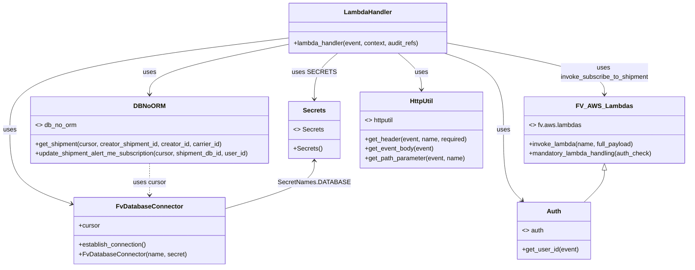

# Diagram: shipment_core/shipment_service/shipment_service/ng_preferences/subscription/subscribe.py


> Auto-generated by Obscura crawlers

## Diagram 1

```mermaid
flowchart TD
    A[Invoke: lambda_handler(event, context, audit_refs)] --> B[log received event]
    B --> C[DB_CONN.establish_connection()]
    C --> D[get header X-WSS-fvShipmentId -> carrier|creator|creator_shipment_id]
    D --> E[get_event_body(event) -> json_data]
    E --> F{json_data.source_service?}
    F -->|true| G[subscribing_product = "Shipment View"]
    F --> H[shipment = db_no_orm.get_shipment(cursor, creator_shipment_id, creator_id, carrier_id)]
    H --> I[Set json_data.context.id = shipment.shipment_db_id]
    H --> J[Set json_data.owner_id = shipment.owner_id]
    G --> K[json_data.reference_id = creator_shipment_id]
    J --> L[json_data.unsubscribe_callback_data = json.dumps(...)]
    L --> M[res_json = invoke_subscribe_to_shipment(event, json_data)]
    M --> N{int(res_json.statusCode) < 400?}
    N -->|yes| O[db_no_orm.update_shipment_alert_me_subscription(cursor, shipment_db_id, user_id)]
    N -->|no| P[return res_json]
    O --> P
```

> SVG rendering failed for this diagram.

## Diagram 2



### SVG

<svg id="container" width="1736.484375" xmlns="http://www.w3.org/2000/svg" class="classDiagram" height="674" viewBox="0 0 1736.484375 674" role="graphics-document document" aria-roledescription="class"><style>#container{font-family:"trebuchet ms",verdana,arial,sans-serif;font-size:16px;fill:#333;}@keyframes edge-animation-frame{from{stroke-dashoffset:0;}}@keyframes dash{to{stroke-dashoffset:0;}}#container .edge-animation-slow{stroke-dasharray:9,5!important;stroke-dashoffset:900;animation:dash 50s linear infinite;stroke-linecap:round;}#container .edge-animation-fast{stroke-dasharray:9,5!important;stroke-dashoffset:900;animation:dash 20s linear infinite;stroke-linecap:round;}#container .error-icon{fill:#552222;}#container .error-text{fill:#552222;stroke:#552222;}#container .edge-thickness-normal{stroke-width:1px;}#container .edge-thickness-thick{stroke-width:3.5px;}#container .edge-pattern-solid{stroke-dasharray:0;}#container .edge-thickness-invisible{stroke-width:0;fill:none;}#container .edge-pattern-dashed{stroke-dasharray:3;}#container .edge-pattern-dotted{stroke-dasharray:2;}#container .marker{fill:#333333;stroke:#333333;}#container .marker.cross{stroke:#333333;}#container svg{font-family:"trebuchet ms",verdana,arial,sans-serif;font-size:16px;}#container p{margin:0;}#container g.classGroup text{fill:#9370DB;stroke:none;font-family:"trebuchet ms",verdana,arial,sans-serif;font-size:10px;}#container g.classGroup text .title{font-weight:bolder;}#container .nodeLabel,#container .edgeLabel{color:#131300;}#container .edgeLabel .label rect{fill:#ECECFF;}#container .label text{fill:#131300;}#container .labelBkg{background:#ECECFF;}#container .edgeLabel .label span{background:#ECECFF;}#container .classTitle{font-weight:bolder;}#container .node rect,#container .node circle,#container .node ellipse,#container .node polygon,#container .node path{fill:#ECECFF;stroke:#9370DB;stroke-width:1px;}#container .divider{stroke:#9370DB;stroke-width:1;}#container g.clickable{cursor:pointer;}#container g.classGroup rect{fill:#ECECFF;stroke:#9370DB;}#container g.classGroup line{stroke:#9370DB;stroke-width:1;}#container .classLabel .box{stroke:none;stroke-width:0;fill:#ECECFF;opacity:0.5;}#container .classLabel .label{fill:#9370DB;font-size:10px;}#container .relation{stroke:#333333;stroke-width:1;fill:none;}#container .dashed-line{stroke-dasharray:3;}#container .dotted-line{stroke-dasharray:1 2;}#container #compositionStart,#container .composition{fill:#333333!important;stroke:#333333!important;stroke-width:1;}#container #compositionEnd,#container .composition{fill:#333333!important;stroke:#333333!important;stroke-width:1;}#container #dependencyStart,#container .dependency{fill:#333333!important;stroke:#333333!important;stroke-width:1;}#container #dependencyStart,#container .dependency{fill:#333333!important;stroke:#333333!important;stroke-width:1;}#container #extensionStart,#container .extension{fill:transparent!important;stroke:#333333!important;stroke-width:1;}#container #extensionEnd,#container .extension{fill:transparent!important;stroke:#333333!important;stroke-width:1;}#container #aggregationStart,#container .aggregation{fill:transparent!important;stroke:#333333!important;stroke-width:1;}#container #aggregationEnd,#container .aggregation{fill:transparent!important;stroke:#333333!important;stroke-width:1;}#container #lollipopStart,#container .lollipop{fill:#ECECFF!important;stroke:#333333!important;stroke-width:1;}#container #lollipopEnd,#container .lollipop{fill:#ECECFF!important;stroke:#333333!important;stroke-width:1;}#container .edgeTerminals{font-size:11px;line-height:initial;}#container .classTitleText{text-anchor:middle;font-size:18px;fill:#333;}#container .label-icon{display:inline-block;height:1em;overflow:visible;vertical-align:-0.125em;}#container .node .label-icon path{fill:currentColor;stroke:revert;stroke-width:revert;}#container :root{--mermaid-font-family:"trebuchet ms",verdana,arial,sans-serif;}</style><g><defs><marker id="container_class-aggregationStart" class="marker aggregation class" refX="18" refY="7" markerWidth="190" markerHeight="240" orient="auto"><path d="M 18,7 L9,13 L1,7 L9,1 Z"></path></marker></defs><defs><marker id="container_class-aggregationEnd" class="marker aggregation class" refX="1" refY="7" markerWidth="20" markerHeight="28" orient="auto"><path d="M 18,7 L9,13 L1,7 L9,1 Z"></path></marker></defs><defs><marker id="container_class-extensionStart" class="marker extension class" refX="18" refY="7" markerWidth="190" markerHeight="240" orient="auto"><path d="M 1,7 L18,13 V 1 Z"></path></marker></defs><defs><marker id="container_class-extensionEnd" class="marker extension class" refX="1" refY="7" markerWidth="20" markerHeight="28" orient="auto"><path d="M 1,1 V 13 L18,7 Z"></path></marker></defs><defs><marker id="container_class-compositionStart" class="marker composition class" refX="18" refY="7" markerWidth="190" markerHeight="240" orient="auto"><path d="M 18,7 L9,13 L1,7 L9,1 Z"></path></marker></defs><defs><marker id="container_class-compositionEnd" class="marker composition class" refX="1" refY="7" markerWidth="20" markerHeight="28" orient="auto"><path d="M 18,7 L9,13 L1,7 L9,1 Z"></path></marker></defs><defs><marker id="container_class-dependencyStart" class="marker dependency class" refX="6" refY="7" markerWidth="190" markerHeight="240" orient="auto"><path d="M 5,7 L9,13 L1,7 L9,1 Z"></path></marker></defs><defs><marker id="container_class-dependencyEnd" class="marker dependency class" refX="13" refY="7" markerWidth="20" markerHeight="28" orient="auto"><path d="M 18,7 L9,13 L14,7 L9,1 Z"></path></marker></defs><defs><marker id="container_class-lollipopStart" class="marker lollipop class" refX="13" refY="7" markerWidth="190" markerHeight="240" orient="auto"><circle stroke="black" fill="transparent" cx="7" cy="7" r="6"></circle></marker></defs><defs><marker id="container_class-lollipopEnd" class="marker lollipop class" refX="1" refY="7" markerWidth="190" markerHeight="240" orient="auto"><circle stroke="black" fill="transparent" cx="7" cy="7" r="6"></circle></marker></defs><g class="root"><g class="clusters"></g><g class="edgePaths"><path d="M729.438,95.941L611.947,110.451C494.456,124.961,259.474,153.98,141.983,192.657C24.492,231.333,24.492,279.667,24.492,326C24.492,372.333,24.492,416.667,51.999,448.18C79.506,479.693,134.52,498.386,162.027,507.733L189.534,517.08" id="id_LambdaHandler_FvDatabaseConnector_1" class="edge-thickness-normal edge-pattern-solid relation" style=";;;" data-edge="true" data-et="edge" data-id="id_LambdaHandler_FvDatabaseConnector_1" data-points="W3sieCI6NzI5LjQzNzUsInkiOjk1Ljk0MDc3NTEzNTAzMjd9LHsieCI6MjQuNDkyMTg3NSwieSI6MTgzfSx7IngiOjI0LjQ5MjE4NzUsInkiOjMyOH0seyJ4IjoyNC40OTIxODc1LCJ5Ijo0NjF9LHsieCI6MTk1LjIxNDg0Mzc1LCJ5Ijo1MTkuMDA5OTcxMjU5OTU0OH1d" marker-end="url(#container_class-dependencyEnd)"></path><path d="M1123.612,134L1148.529,142.167C1173.447,150.333,1223.282,166.667,1248.2,199C1273.117,231.333,1273.117,279.667,1273.117,326C1273.117,372.333,1273.117,416.667,1280.946,446.309C1288.775,475.952,1304.434,490.904,1312.263,498.38L1320.092,505.856" id="id_LambdaHandler_Auth_2" class="edge-thickness-normal edge-pattern-solid relation" style=";;;" data-edge="true" data-et="edge" data-id="id_LambdaHandler_Auth_2" data-points="W3sieCI6MTEyMy42MTE4MTY0MDYyNSwieSI6MTM0fSx7IngiOjEyNzMuMTE3MTg3NSwieSI6MTgzfSx7IngiOjEyNzMuMTE3MTg3NSwieSI6MzI4fSx7IngiOjEyNzMuMTE3MTg3NSwieSI6NDYxfSx7IngiOjEzMjQuNDMxNDYzMDY4MTgxOCwieSI6NTEwfV0=" marker-end="url(#container_class-dependencyEnd)"></path><path d="M729.438,112.066L671.297,123.888C613.156,135.71,496.875,159.355,438.734,180.344C380.594,201.333,380.594,219.667,380.594,228.833L380.594,238" id="id_LambdaHandler_DBNoORM_3" class="edge-thickness-normal edge-pattern-solid relation" style=";;;" data-edge="true" data-et="edge" data-id="id_LambdaHandler_DBNoORM_3" data-points="W3sieCI6NzI5LjQzNzUsInkiOjExMi4wNjU1MDE2ODc4OTUzOH0seyJ4IjozODAuNTkzNzUsInkiOjE4M30seyJ4IjozODAuNTkzNzUsInkiOjI0NH1d" marker-end="url(#container_class-dependencyEnd)"></path><path d="M1133.344,109.005L1198.878,121.337C1264.411,133.67,1395.479,158.335,1461.013,179.834C1526.547,201.333,1526.547,219.667,1526.547,228.833L1526.547,238" id="id_LambdaHandler_FV_AWS_Lambdas_4" class="edge-thickness-normal edge-pattern-solid relation" style=";;;" data-edge="true" data-et="edge" data-id="id_LambdaHandler_FV_AWS_Lambdas_4" data-points="W3sieCI6MTEzMy4zNDM3NSwieSI6MTA5LjAwNDcyNTY0OTc3Njg0fSx7IngiOjE1MjYuNTQ2ODc1LCJ5IjoxODN9LHsieCI6MTUyNi41NDY4NzUsInkiOjI0NH1d" marker-end="url(#container_class-dependencyEnd)"></path><path d="M855.956,134L846.178,142.167C836.399,150.333,816.842,166.667,807.064,186C797.285,205.333,797.285,227.667,797.285,238.833L797.285,250" id="id_LambdaHandler_Secrets_5" class="edge-thickness-normal edge-pattern-solid relation" style=";;;" data-edge="true" data-et="edge" data-id="id_LambdaHandler_Secrets_5" data-points="W3sieCI6ODU1Ljk1NjI5ODgyODEyNSwieSI6MTM0fSx7IngiOjc5Ny4yODUxNTYyNSwieSI6MTgzfSx7IngiOjc5Ny4yODUxNTYyNSwieSI6MjU2fV0=" marker-end="url(#container_class-dependencyEnd)"></path><path d="M1006.825,134L1016.603,142.167C1026.382,150.333,1045.939,166.667,1055.718,182C1065.496,197.333,1065.496,211.667,1065.496,218.833L1065.496,226" id="id_LambdaHandler_HttpUtil_6" class="edge-thickness-normal edge-pattern-solid relation" style=";;;" data-edge="true" data-et="edge" data-id="id_LambdaHandler_HttpUtil_6" data-points="W3sieCI6MTAwNi44MjQ5NTExNzE4NzUsInkiOjEzNH0seyJ4IjoxMDY1LjQ5NjA5Mzc1LCJ5IjoxODN9LHsieCI6MTA2NS40OTYwOTM3NSwieSI6MjMyfV0=" marker-end="url(#container_class-dependencyEnd)"></path><path d="M1526.547,429.25L1526.547,434.542C1526.547,439.833,1526.547,450.417,1517.994,463.875C1509.442,477.333,1492.337,493.667,1483.785,501.833L1475.233,510" id="id_FV_AWS_Lambdas_Auth_7" class="edge-thickness-normal edge-pattern-solid relation" style=";;;" data-edge="true" data-et="edge" data-id="id_FV_AWS_Lambdas_Auth_7" data-points="W3sieCI6MTUyNi41NDY4NzUsInkiOjQxMn0seyJ4IjoxNTI2LjU0Njg3NSwieSI6NDYxfSx7IngiOjE0NzUuMjMyNTk5NDMxODE4MiwieSI6NTEwfV0=" marker-start="url(#container_class-extensionStart)"></path><path d="M380.594,412L380.594,420.167C380.594,428.333,380.594,444.667,380.594,458C380.594,471.333,380.594,481.667,380.594,486.833L380.594,492" id="id_DBNoORM_FvDatabaseConnector_8" class="edge-thickness-normal edge-pattern-dashed relation" style=";;;" data-edge="true" data-et="edge" data-id="id_DBNoORM_FvDatabaseConnector_8" data-points="W3sieCI6MzgwLjU5Mzc1LCJ5Ijo0MTJ9LHsieCI6MzgwLjU5Mzc1LCJ5Ijo0NjF9LHsieCI6MzgwLjU5Mzc1LCJ5Ijo0OTh9XQ==" marker-end="url(#container_class-dependencyEnd)"></path><path d="M797.285,406L797.285,415.167C797.285,424.333,797.285,442.667,758.733,463.028C720.181,483.39,643.077,505.779,604.525,516.974L565.973,528.169" id="id_Secrets_FvDatabaseConnector_9" class="edge-thickness-normal edge-pattern-solid relation" style=";;;" data-edge="true" data-et="edge" data-id="id_Secrets_FvDatabaseConnector_9" data-points="W3sieCI6Nzk3LjI4NTE1NjI1LCJ5Ijo0MDB9LHsieCI6Nzk3LjI4NTE1NjI1LCJ5Ijo0NjF9LHsieCI6NTY1Ljk3MjY1NjI1LCJ5Ijo1MjguMTY5MTYxODMxMDE2M31d" marker-start="url(#container_class-dependencyStart)"></path></g><g class="edgeLabels"><g class="edgeLabel" transform="translate(24.4921875, 328)"><g class="label" data-id="id_LambdaHandler_FvDatabaseConnector_1" transform="translate(-16.4921875, -12)"><foreignObject width="32.984375" height="24"><div xmlns="http://www.w3.org/1999/xhtml" class="labelBkg" style="display: table-cell; white-space: nowrap; line-height: 1.5; max-width: 200px; text-align: center;"><span class="edgeLabel"><p>uses</p></span></div></foreignObject></g></g><g class="edgeLabel" transform="translate(1273.1171875, 328)"><g class="label" data-id="id_LambdaHandler_Auth_2" transform="translate(-16.4921875, -12)"><foreignObject width="32.984375" height="24"><div xmlns="http://www.w3.org/1999/xhtml" class="labelBkg" style="display: table-cell; white-space: nowrap; line-height: 1.5; max-width: 200px; text-align: center;"><span class="edgeLabel"><p>uses</p></span></div></foreignObject></g></g><g class="edgeLabel" transform="translate(380.59375, 183)"><g class="label" data-id="id_LambdaHandler_DBNoORM_3" transform="translate(-16.4921875, -12)"><foreignObject width="32.984375" height="24"><div xmlns="http://www.w3.org/1999/xhtml" class="labelBkg" style="display: table-cell; white-space: nowrap; line-height: 1.5; max-width: 200px; text-align: center;"><span class="edgeLabel"><p>uses</p></span></div></foreignObject></g></g><g class="edgeLabel" transform="translate(1526.546875, 183)"><g class="label" data-id="id_LambdaHandler_FV_AWS_Lambdas_4" transform="translate(-112.515625, -24)"><foreignObject width="225.03125" height="48"><div xmlns="http://www.w3.org/1999/xhtml" class="labelBkg" style="display: table; white-space: break-spaces; line-height: 1.5; max-width: 200px; text-align: center; width: 200px;"><span class="edgeLabel"><p>uses invoke_subscribe_to_shipment</p></span></div></foreignObject></g></g><g class="edgeLabel" transform="translate(797.28515625, 183)"><g class="label" data-id="id_LambdaHandler_Secrets_5" transform="translate(-49.09375, -12)"><foreignObject width="98.1875" height="24"><div xmlns="http://www.w3.org/1999/xhtml" class="labelBkg" style="display: table-cell; white-space: nowrap; line-height: 1.5; max-width: 200px; text-align: center;"><span class="edgeLabel"><p>uses SECRETS</p></span></div></foreignObject></g></g><g class="edgeLabel" transform="translate(1065.49609375, 183)"><g class="label" data-id="id_LambdaHandler_HttpUtil_6" transform="translate(-16.4921875, -12)"><foreignObject width="32.984375" height="24"><div xmlns="http://www.w3.org/1999/xhtml" class="labelBkg" style="display: table-cell; white-space: nowrap; line-height: 1.5; max-width: 200px; text-align: center;"><span class="edgeLabel"><p>uses</p></span></div></foreignObject></g></g><g class="edgeLabel"><g class="label" data-id="id_FV_AWS_Lambdas_Auth_7" transform="translate(0, 0)"><foreignObject width="0" height="0"><div xmlns="http://www.w3.org/1999/xhtml" class="labelBkg" style="display: table-cell; white-space: nowrap; line-height: 1.5; max-width: 200px; text-align: center;"><span class="edgeLabel"></span></div></foreignObject></g></g><g class="edgeLabel" transform="translate(380.59375, 461)"><g class="label" data-id="id_DBNoORM_FvDatabaseConnector_8" transform="translate(-41.4765625, -12)"><foreignObject width="82.953125" height="24"><div xmlns="http://www.w3.org/1999/xhtml" class="labelBkg" style="display: table-cell; white-space: nowrap; line-height: 1.5; max-width: 200px; text-align: center;"><span class="edgeLabel"><p>uses cursor</p></span></div></foreignObject></g></g><g class="edgeLabel" transform="translate(797.28515625, 461)"><g class="label" data-id="id_Secrets_FvDatabaseConnector_9" transform="translate(-84.953125, -12)"><foreignObject width="169.90625" height="24"><div xmlns="http://www.w3.org/1999/xhtml" class="labelBkg" style="display: table-cell; white-space: nowrap; line-height: 1.5; max-width: 200px; text-align: center;"><span class="edgeLabel"><p>SecretNames.DATABASE</p></span></div></foreignObject></g></g></g><g class="nodes"><g class="node default" id="classId-LambdaHandler-0" transform="translate(931.390625, 71)"><g class="basic label-container"><path d="M-201.953125 -63 L201.953125 -63 L201.953125 63 L-201.953125 63" stroke="none" stroke-width="0" fill="#ECECFF" style=""></path><path d="M-201.953125 -63 C-72.04152336993457 -63, 57.87007826013087 -63, 201.953125 -63 M-201.953125 -63 C-114.0718243273914 -63, -26.190523654782794 -63, 201.953125 -63 M201.953125 -63 C201.953125 -20.02562343435053, 201.953125 22.948753131298943, 201.953125 63 M201.953125 -63 C201.953125 -23.347398176151913, 201.953125 16.305203647696175, 201.953125 63 M201.953125 63 C116.19610734524828 63, 30.43908969049656 63, -201.953125 63 M201.953125 63 C111.06670169481669 63, 20.180278389633372 63, -201.953125 63 M-201.953125 63 C-201.953125 20.483536242636234, -201.953125 -22.032927514727533, -201.953125 -63 M-201.953125 63 C-201.953125 20.616132975816157, -201.953125 -21.767734048367686, -201.953125 -63" stroke="#9370DB" stroke-width="1.3" fill="none" stroke-dasharray="0 0" style=""></path></g><g class="annotation-group text" transform="translate(0, -39)"></g><g class="label-group text" transform="translate(-58.21875, -39)"><g class="label" style="font-weight: bolder" transform="translate(0,-12)"><foreignObject width="116.4375" height="24"><div xmlns="http://www.w3.org/1999/xhtml" style="display: table-cell; white-space: nowrap; line-height: 1.5; max-width: 167px; text-align: center;"><span class="nodeLabel markdown-node-label" style=""><p>LambdaHandler</p></span></div></foreignObject></g></g><g class="members-group text" transform="translate(-189.953125, 9)"></g><g class="methods-group text" transform="translate(-189.953125, 39)"><g class="label" style="" transform="translate(0,-12)"><foreignObject width="321.6875" height="24"><div xmlns="http://www.w3.org/1999/xhtml" style="display: table-cell; white-space: nowrap; line-height: 1.5; max-width: 379px; text-align: center;"><span class="nodeLabel markdown-node-label" style=""><p>+lambda_handler(event, context, audit_refs)</p></span></div></foreignObject></g></g><g class="divider" style=""><path d="M-201.953125 -15 C-48.907401411822036 -15, 104.13832217635593 -15, 201.953125 -15 M-201.953125 -15 C-110.06767054066837 -15, -18.182216081336747 -15, 201.953125 -15" stroke="#9370DB" stroke-width="1.3" fill="none" stroke-dasharray="0 0" style=""></path></g><g class="divider" style=""><path d="M-201.953125 9 C-82.18961767092456 9, 37.573889658150875 9, 201.953125 9 M-201.953125 9 C-111.02598045584774 9, -20.098835911695488 9, 201.953125 9" stroke="#9370DB" stroke-width="1.3" fill="none" stroke-dasharray="0 0" style=""></path></g></g><g class="node default" id="classId-FvDatabaseConnector-1" transform="translate(380.59375, 582)"><g class="basic label-container"><path d="M-185.37890625 -84 L185.37890625 -84 L185.37890625 84 L-185.37890625 84" stroke="none" stroke-width="0" fill="#ECECFF" style=""></path><path d="M-185.37890625 -84 C-58.304683613208226 -84, 68.76953902358355 -84, 185.37890625 -84 M-185.37890625 -84 C-96.57864500087756 -84, -7.778383751755115 -84, 185.37890625 -84 M185.37890625 -84 C185.37890625 -34.11755529105841, 185.37890625 15.764889417883182, 185.37890625 84 M185.37890625 -84 C185.37890625 -34.352625402451274, 185.37890625 15.294749195097452, 185.37890625 84 M185.37890625 84 C69.20582623002574 84, -46.96725378994853 84, -185.37890625 84 M185.37890625 84 C90.76512126812332 84, -3.8486637137533535 84, -185.37890625 84 M-185.37890625 84 C-185.37890625 25.696715889470546, -185.37890625 -32.60656822105891, -185.37890625 -84 M-185.37890625 84 C-185.37890625 29.844933312159405, -185.37890625 -24.31013337568119, -185.37890625 -84" stroke="#9370DB" stroke-width="1.3" fill="none" stroke-dasharray="0 0" style=""></path></g><g class="annotation-group text" transform="translate(0, -60)"></g><g class="label-group text" transform="translate(-79.3046875, -60)"><g class="label" style="font-weight: bolder" transform="translate(0,-12)"><foreignObject width="158.609375" height="24"><div xmlns="http://www.w3.org/1999/xhtml" style="display: table-cell; white-space: nowrap; line-height: 1.5; max-width: 207px; text-align: center;"><span class="nodeLabel markdown-node-label" style=""><p>FvDatabaseConnector</p></span></div></foreignObject></g></g><g class="members-group text" transform="translate(-173.37890625, -12)"><g class="label" style="" transform="translate(0,-12)"><foreignObject width="53.71875" height="24"><div xmlns="http://www.w3.org/1999/xhtml" style="display: table-cell; white-space: nowrap; line-height: 1.5; max-width: 112px; text-align: center;"><span class="nodeLabel markdown-node-label" style=""><p>+cursor</p></span></div></foreignObject></g></g><g class="methods-group text" transform="translate(-173.37890625, 36)"><g class="label" style="" transform="translate(0,-12)"><foreignObject width="173.265625" height="24"><div xmlns="http://www.w3.org/1999/xhtml" style="display: table-cell; white-space: nowrap; line-height: 1.5; max-width: 231px; text-align: center;"><span class="nodeLabel markdown-node-label" style=""><p>+establish_connection()</p></span></div></foreignObject></g><g class="label" style="" transform="translate(0,12)"><foreignObject width="267.453125" height="24"><div xmlns="http://www.w3.org/1999/xhtml" style="display: table-cell; white-space: nowrap; line-height: 1.5; max-width: 325px; text-align: center;"><span class="nodeLabel markdown-node-label" style=""><p>+FvDatabaseConnector(name, secret)</p></span></div></foreignObject></g></g><g class="divider" style=""><path d="M-185.37890625 -36 C-78.09714715384791 -36, 29.184611942304173 -36, 185.37890625 -36 M-185.37890625 -36 C-109.41075222812287 -36, -33.44259820624575 -36, 185.37890625 -36" stroke="#9370DB" stroke-width="1.3" fill="none" stroke-dasharray="0 0" style=""></path></g><g class="divider" style=""><path d="M-185.37890625 12 C-81.98120886852139 12, 21.416488512957216 12, 185.37890625 12 M-185.37890625 12 C-92.61782694929822 12, 0.14325235140356085 12, 185.37890625 12" stroke="#9370DB" stroke-width="1.3" fill="none" stroke-dasharray="0 0" style=""></path></g></g><g class="node default" id="classId-Auth-2" transform="translate(1399.83203125, 582)"><g class="basic label-container"><path d="M-91.53515625 -72 L91.53515625 -72 L91.53515625 72 L-91.53515625 72" stroke="none" stroke-width="0" fill="#ECECFF" style=""></path><path d="M-91.53515625 -72 C-42.40625653240753 -72, 6.7226431851849355 -72, 91.53515625 -72 M-91.53515625 -72 C-54.624183494850904 -72, -17.713210739701807 -72, 91.53515625 -72 M91.53515625 -72 C91.53515625 -38.58190610609731, 91.53515625 -5.163812212194614, 91.53515625 72 M91.53515625 -72 C91.53515625 -16.599689681052737, 91.53515625 38.800620637894525, 91.53515625 72 M91.53515625 72 C28.94159720606899 72, -33.65196183786202 72, -91.53515625 72 M91.53515625 72 C34.79378760731909 72, -21.94758103536182 72, -91.53515625 72 M-91.53515625 72 C-91.53515625 33.12645070443716, -91.53515625 -5.747098591125678, -91.53515625 -72 M-91.53515625 72 C-91.53515625 21.380912957769816, -91.53515625 -29.23817408446037, -91.53515625 -72" stroke="#9370DB" stroke-width="1.3" fill="none" stroke-dasharray="0 0" style=""></path></g><g class="annotation-group text" transform="translate(0, -48)"></g><g class="label-group text" transform="translate(-17.0078125, -48)"><g class="label" style="font-weight: bolder" transform="translate(0,-12)"><foreignObject width="34.015625" height="24"><div xmlns="http://www.w3.org/1999/xhtml" style="display: table-cell; white-space: nowrap; line-height: 1.5; max-width: 84px; text-align: center;"><span class="nodeLabel markdown-node-label" style=""><p>Auth</p></span></div></foreignObject></g></g><g class="members-group text" transform="translate(-79.53515625, 0)"><g class="label" style="" transform="translate(0,-12)"><foreignObject width="53.421875" height="24"><div xmlns="http://www.w3.org/1999/xhtml" style="display: table-cell; white-space: nowrap; line-height: 1.5; max-width: 143px; text-align: center;"><span class="nodeLabel markdown-node-label" style=""><p>&lt;&gt; auth</p></span></div></foreignObject></g></g><g class="methods-group text" transform="translate(-79.53515625, 48)"><g class="label" style="" transform="translate(0,-12)"><foreignObject width="142.0625" height="24"><div xmlns="http://www.w3.org/1999/xhtml" style="display: table-cell; white-space: nowrap; line-height: 1.5; max-width: 199px; text-align: center;"><span class="nodeLabel markdown-node-label" style=""><p>+get_user_id(event)</p></span></div></foreignObject></g></g><g class="divider" style=""><path d="M-91.53515625 -24 C-54.80831385244926 -24, -18.08147145489852 -24, 91.53515625 -24 M-91.53515625 -24 C-46.50309207903969 -24, -1.4710279080793782 -24, 91.53515625 -24" stroke="#9370DB" stroke-width="1.3" fill="none" stroke-dasharray="0 0" style=""></path></g><g class="divider" style=""><path d="M-91.53515625 24 C-21.00509356989886 24, 49.52496911020228 24, 91.53515625 24 M-91.53515625 24 C-47.4438429630711 24, -3.352529676142197 24, 91.53515625 24" stroke="#9370DB" stroke-width="1.3" fill="none" stroke-dasharray="0 0" style=""></path></g></g><g class="node default" id="classId-DBNoORM-3" transform="translate(380.59375, 328)"><g class="basic label-container"><path d="M-304.609375 -84 L304.609375 -84 L304.609375 84 L-304.609375 84" stroke="none" stroke-width="0" fill="#ECECFF" style=""></path><path d="M-304.609375 -84 C-173.66586094982176 -84, -42.722346899643526 -84, 304.609375 -84 M-304.609375 -84 C-165.03977531027425 -84, -25.470175620548503 -84, 304.609375 -84 M304.609375 -84 C304.609375 -32.63417758258275, 304.609375 18.731644834834498, 304.609375 84 M304.609375 -84 C304.609375 -48.25112359653985, 304.609375 -12.502247193079697, 304.609375 84 M304.609375 84 C102.61950428962592 84, -99.37036642074816 84, -304.609375 84 M304.609375 84 C149.0838833527457 84, -6.441608294508626 84, -304.609375 84 M-304.609375 84 C-304.609375 23.749798591694038, -304.609375 -36.500402816611924, -304.609375 -84 M-304.609375 84 C-304.609375 46.58533040580131, -304.609375 9.170660811602616, -304.609375 -84" stroke="#9370DB" stroke-width="1.3" fill="none" stroke-dasharray="0 0" style=""></path></g><g class="annotation-group text" transform="translate(0, -60)"></g><g class="label-group text" transform="translate(-36.875, -60)"><g class="label" style="font-weight: bolder" transform="translate(0,-12)"><foreignObject width="73.75" height="24"><div xmlns="http://www.w3.org/1999/xhtml" style="display: table-cell; white-space: nowrap; line-height: 1.5; max-width: 124px; text-align: center;"><span class="nodeLabel markdown-node-label" style=""><p>DBNoORM</p></span></div></foreignObject></g></g><g class="members-group text" transform="translate(-292.609375, -12)"><g class="label" style="" transform="translate(0,-12)"><foreignObject width="102.953125" height="24"><div xmlns="http://www.w3.org/1999/xhtml" style="display: table-cell; white-space: nowrap; line-height: 1.5; max-width: 193px; text-align: center;"><span class="nodeLabel markdown-node-label" style=""><p>&lt;&gt; db_no_orm</p></span></div></foreignObject></g></g><g class="methods-group text" transform="translate(-292.609375, 36)"><g class="label" style="" transform="translate(0,-12)"><foreignObject width="477.78125" height="24"><div xmlns="http://www.w3.org/1999/xhtml" style="display: table-cell; white-space: nowrap; line-height: 1.5; max-width: 535px; text-align: center;"><span class="nodeLabel markdown-node-label" style=""><p>+get_shipment(cursor, creator_shipment_id, creator_id, carrier_id)</p></span></div></foreignObject></g><g class="label" style="" transform="translate(0,12)"><foreignObject width="548.34375" height="24"><div xmlns="http://www.w3.org/1999/xhtml" style="display: table-cell; white-space: nowrap; line-height: 1.5; max-width: 606px; text-align: center;"><span class="nodeLabel markdown-node-label" style=""><p>+update_shipment_alert_me_subscription(cursor, shipment_db_id, user_id)</p></span></div></foreignObject></g></g><g class="divider" style=""><path d="M-304.609375 -36 C-165.47412474475558 -36, -26.33887448951117 -36, 304.609375 -36 M-304.609375 -36 C-139.08121801430107 -36, 26.446938971397856 -36, 304.609375 -36" stroke="#9370DB" stroke-width="1.3" fill="none" stroke-dasharray="0 0" style=""></path></g><g class="divider" style=""><path d="M-304.609375 12 C-96.02397819429129 12, 112.56141861141742 12, 304.609375 12 M-304.609375 12 C-148.1103826038115 12, 8.388609792376997 12, 304.609375 12" stroke="#9370DB" stroke-width="1.3" fill="none" stroke-dasharray="0 0" style=""></path></g></g><g class="node default" id="classId-FV_AWS_Lambdas-4" transform="translate(1526.546875, 328)"><g class="basic label-container"><path d="M-201.9375 -84 L201.9375 -84 L201.9375 84 L-201.9375 84" stroke="none" stroke-width="0" fill="#ECECFF" style=""></path><path d="M-201.9375 -84 C-100.33146067510457 -84, 1.2745786497908682 -84, 201.9375 -84 M-201.9375 -84 C-96.43488745822539 -84, 9.06772508354922 -84, 201.9375 -84 M201.9375 -84 C201.9375 -18.343335706332567, 201.9375 47.313328587334865, 201.9375 84 M201.9375 -84 C201.9375 -35.009630195652555, 201.9375 13.98073960869489, 201.9375 84 M201.9375 84 C81.20585458096168 84, -39.52579083807663 84, -201.9375 84 M201.9375 84 C66.16088229973133 84, -69.61573540053735 84, -201.9375 84 M-201.9375 84 C-201.9375 21.078135638235345, -201.9375 -41.84372872352931, -201.9375 -84 M-201.9375 84 C-201.9375 34.49406220131544, -201.9375 -15.011875597369126, -201.9375 -84" stroke="#9370DB" stroke-width="1.3" fill="none" stroke-dasharray="0 0" style=""></path></g><g class="annotation-group text" transform="translate(0, -60)"></g><g class="label-group text" transform="translate(-65.046875, -60)"><g class="label" style="font-weight: bolder" transform="translate(0,-12)"><foreignObject width="130.09375" height="24"><div xmlns="http://www.w3.org/1999/xhtml" style="display: table-cell; white-space: nowrap; line-height: 1.5; max-width: 178px; text-align: center;"><span class="nodeLabel markdown-node-label" style=""><p>FV_AWS_Lambdas</p></span></div></foreignObject></g></g><g class="members-group text" transform="translate(-189.9375, -12)"><g class="label" style="" transform="translate(0,-12)"><foreignObject width="130.203125" height="24"><div xmlns="http://www.w3.org/1999/xhtml" style="display: table-cell; white-space: nowrap; line-height: 1.5; max-width: 220px; text-align: center;"><span class="nodeLabel markdown-node-label" style=""><p>&lt;&gt; fv.aws.lambdas</p></span></div></foreignObject></g></g><g class="methods-group text" transform="translate(-189.9375, 36)"><g class="label" style="" transform="translate(0,-12)"><foreignObject width="267.234375" height="24"><div xmlns="http://www.w3.org/1999/xhtml" style="display: table-cell; white-space: nowrap; line-height: 1.5; max-width: 325px; text-align: center;"><span class="nodeLabel markdown-node-label" style=""><p>+invoke_lambda(name, full_payload)</p></span></div></foreignObject></g><g class="label" style="" transform="translate(0,12)"><foreignObject width="314.828125" height="24"><div xmlns="http://www.w3.org/1999/xhtml" style="display: table-cell; white-space: nowrap; line-height: 1.5; max-width: 372px; text-align: center;"><span class="nodeLabel markdown-node-label" style=""><p>+mandatory_lambda_handling(auth_check)</p></span></div></foreignObject></g></g><g class="divider" style=""><path d="M-201.9375 -36 C-102.66274579838995 -36, -3.387991596779898 -36, 201.9375 -36 M-201.9375 -36 C-107.81008644593729 -36, -13.682672891874574 -36, 201.9375 -36" stroke="#9370DB" stroke-width="1.3" fill="none" stroke-dasharray="0 0" style=""></path></g><g class="divider" style=""><path d="M-201.9375 12 C-112.25828251517707 12, -22.579065030354144 12, 201.9375 12 M-201.9375 12 C-51.325588719767836 12, 99.28632256046433 12, 201.9375 12" stroke="#9370DB" stroke-width="1.3" fill="none" stroke-dasharray="0 0" style=""></path></g></g><g class="node default" id="classId-Secrets-5" transform="translate(797.28515625, 328)"><g class="basic label-container"><path d="M-62.08203125 -72 L62.08203125 -72 L62.08203125 72 L-62.08203125 72" stroke="none" stroke-width="0" fill="#ECECFF" style=""></path><path d="M-62.08203125 -72 C-13.227667246991423 -72, 35.626696756017154 -72, 62.08203125 -72 M-62.08203125 -72 C-22.708114765673365 -72, 16.66580171865327 -72, 62.08203125 -72 M62.08203125 -72 C62.08203125 -18.51828815995657, 62.08203125 34.96342368008686, 62.08203125 72 M62.08203125 -72 C62.08203125 -31.778540183431957, 62.08203125 8.442919633136086, 62.08203125 72 M62.08203125 72 C24.34213196470752 72, -13.397767320584961 72, -62.08203125 72 M62.08203125 72 C34.22142071761294 72, 6.360810185225887 72, -62.08203125 72 M-62.08203125 72 C-62.08203125 33.856953835657016, -62.08203125 -4.286092328685967, -62.08203125 -72 M-62.08203125 72 C-62.08203125 22.110793884602366, -62.08203125 -27.77841223079527, -62.08203125 -72" stroke="#9370DB" stroke-width="1.3" fill="none" stroke-dasharray="0 0" style=""></path></g><g class="annotation-group text" transform="translate(0, -48)"></g><g class="label-group text" transform="translate(-27.1640625, -48)"><g class="label" style="font-weight: bolder" transform="translate(0,-12)"><foreignObject width="54.328125" height="24"><div xmlns="http://www.w3.org/1999/xhtml" style="display: table-cell; white-space: nowrap; line-height: 1.5; max-width: 103px; text-align: center;"><span class="nodeLabel markdown-node-label" style=""><p>Secrets</p></span></div></foreignObject></g></g><g class="members-group text" transform="translate(-50.08203125, 0)"><g class="label" style="" transform="translate(0,-12)"><foreignObject width="73" height="24"><div xmlns="http://www.w3.org/1999/xhtml" style="display: table-cell; white-space: nowrap; line-height: 1.5; max-width: 163px; text-align: center;"><span class="nodeLabel markdown-node-label" style=""><p>&lt;&gt; Secrets</p></span></div></foreignObject></g></g><g class="methods-group text" transform="translate(-50.08203125, 48)"><g class="label" style="" transform="translate(0,-12)"><foreignObject width="70.46875" height="24"><div xmlns="http://www.w3.org/1999/xhtml" style="display: table-cell; white-space: nowrap; line-height: 1.5; max-width: 128px; text-align: center;"><span class="nodeLabel markdown-node-label" style=""><p>+Secrets()</p></span></div></foreignObject></g></g><g class="divider" style=""><path d="M-62.08203125 -24 C-17.05561136455521 -24, 27.970808520889577 -24, 62.08203125 -24 M-62.08203125 -24 C-34.931203143182714 -24, -7.780375036365427 -24, 62.08203125 -24" stroke="#9370DB" stroke-width="1.3" fill="none" stroke-dasharray="0 0" style=""></path></g><g class="divider" style=""><path d="M-62.08203125 24 C-12.997870299280216 24, 36.08629065143957 24, 62.08203125 24 M-62.08203125 24 C-13.158715809388568 24, 35.764599631222865 24, 62.08203125 24" stroke="#9370DB" stroke-width="1.3" fill="none" stroke-dasharray="0 0" style=""></path></g></g><g class="node default" id="classId-HttpUtil-6" transform="translate(1065.49609375, 328)"><g class="basic label-container"><path d="M-156.12890625 -96 L156.12890625 -96 L156.12890625 96 L-156.12890625 96" stroke="none" stroke-width="0" fill="#ECECFF" style=""></path><path d="M-156.12890625 -96 C-49.36326189428533 -96, 57.40238246142934 -96, 156.12890625 -96 M-156.12890625 -96 C-59.08576932782613 -96, 37.957367594347744 -96, 156.12890625 -96 M156.12890625 -96 C156.12890625 -22.495652659645117, 156.12890625 51.008694680709766, 156.12890625 96 M156.12890625 -96 C156.12890625 -48.87559756804845, 156.12890625 -1.7511951360968965, 156.12890625 96 M156.12890625 96 C78.9267228722352 96, 1.724539494470406 96, -156.12890625 96 M156.12890625 96 C38.27620991966967 96, -79.57648641066066 96, -156.12890625 96 M-156.12890625 96 C-156.12890625 25.708602179220577, -156.12890625 -44.582795641558846, -156.12890625 -96 M-156.12890625 96 C-156.12890625 54.31687845585423, -156.12890625 12.63375691170846, -156.12890625 -96" stroke="#9370DB" stroke-width="1.3" fill="none" stroke-dasharray="0 0" style=""></path></g><g class="annotation-group text" transform="translate(0, -72)"></g><g class="label-group text" transform="translate(-29.2109375, -72)"><g class="label" style="font-weight: bolder" transform="translate(0,-12)"><foreignObject width="58.421875" height="24"><div xmlns="http://www.w3.org/1999/xhtml" style="display: table-cell; white-space: nowrap; line-height: 1.5; max-width: 108px; text-align: center;"><span class="nodeLabel markdown-node-label" style=""><p>HttpUtil</p></span></div></foreignObject></g></g><g class="members-group text" transform="translate(-144.12890625, -24)"><g class="label" style="" transform="translate(0,-12)"><foreignObject width="74.96875" height="24"><div xmlns="http://www.w3.org/1999/xhtml" style="display: table-cell; white-space: nowrap; line-height: 1.5; max-width: 165px; text-align: center;"><span class="nodeLabel markdown-node-label" style=""><p>&lt;&gt; httputil</p></span></div></foreignObject></g></g><g class="methods-group text" transform="translate(-144.12890625, 24)"><g class="label" style="" transform="translate(0,-12)"><foreignObject width="259.046875" height="24"><div xmlns="http://www.w3.org/1999/xhtml" style="display: table-cell; white-space: nowrap; line-height: 1.5; max-width: 316px; text-align: center;"><span class="nodeLabel markdown-node-label" style=""><p>+get_header(event, name, required)</p></span></div></foreignObject></g><g class="label" style="" transform="translate(0,12)"><foreignObject width="174.203125" height="24"><div xmlns="http://www.w3.org/1999/xhtml" style="display: table-cell; white-space: nowrap; line-height: 1.5; max-width: 232px; text-align: center;"><span class="nodeLabel markdown-node-label" style=""><p>+get_event_body(event)</p></span></div></foreignObject></g><g class="label" style="" transform="translate(0,36)"><foreignObject width="254.984375" height="24"><div xmlns="http://www.w3.org/1999/xhtml" style="display: table-cell; white-space: nowrap; line-height: 1.5; max-width: 312px; text-align: center;"><span class="nodeLabel markdown-node-label" style=""><p>+get_path_parameter(event, name)</p></span></div></foreignObject></g></g><g class="divider" style=""><path d="M-156.12890625 -48 C-55.50981424470339 -48, 45.109277760593216 -48, 156.12890625 -48 M-156.12890625 -48 C-90.45945027443139 -48, -24.78999429886278 -48, 156.12890625 -48" stroke="#9370DB" stroke-width="1.3" fill="none" stroke-dasharray="0 0" style=""></path></g><g class="divider" style=""><path d="M-156.12890625 0 C-87.34276024410336 0, -18.55661423820672 0, 156.12890625 0 M-156.12890625 0 C-34.78460630414696 0, 86.55969364170608 0, 156.12890625 0" stroke="#9370DB" stroke-width="1.3" fill="none" stroke-dasharray="0 0" style=""></path></g></g></g></g></g></svg>
