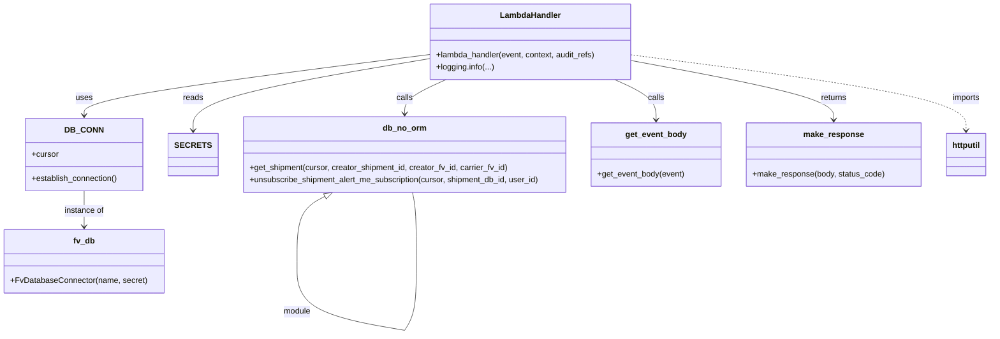
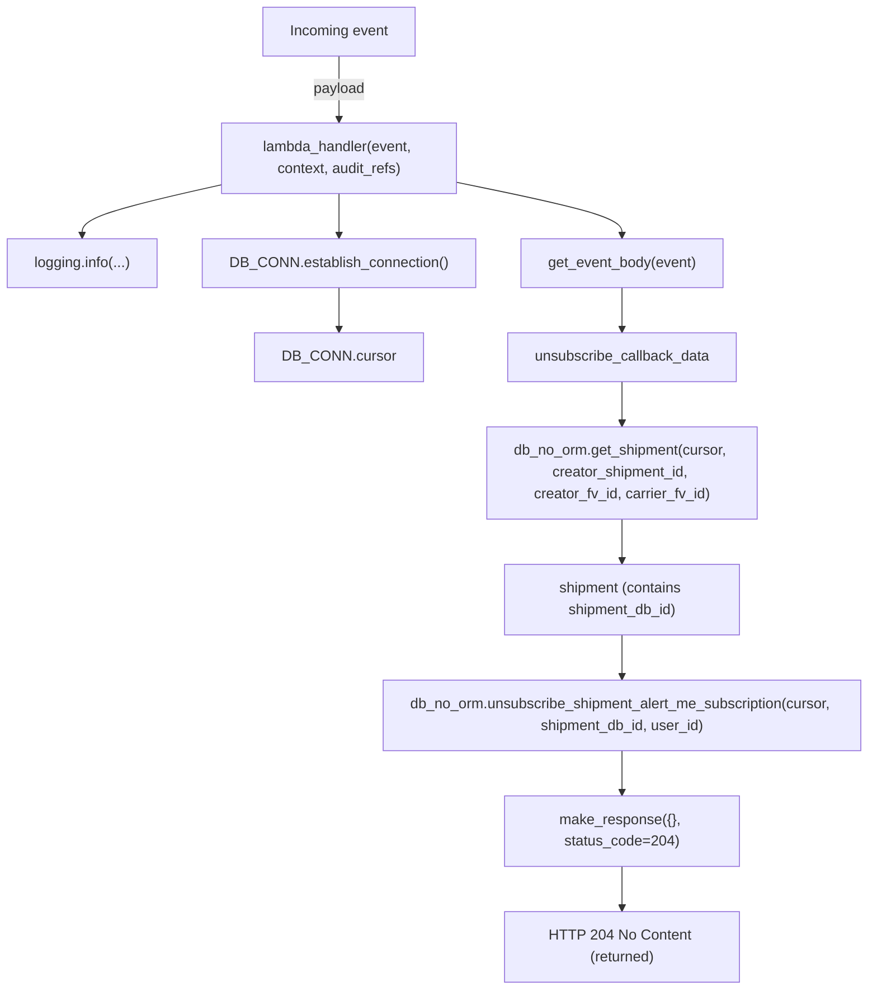

# Diagram: shipment_core/shipment_service/shipment_service/ng_preferences/subscription/unsubscribe_user_alert.py

> Auto-generated by Obscura crawlers

## Diagram 1

### SVG

<svg id="container" width="1956.20703125" xmlns="http://www.w3.org/2000/svg" class="classDiagram" height="664.1499633789062" viewBox="0 0 1956.20703125 664.1499633789062" role="graphics-document document" aria-roledescription="class"><g><defs><marker id="container_class-aggregationStart" class="marker aggregation class" refX="18" refY="7" markerWidth="190" markerHeight="240" orient="auto"><path d="M 18,7 L9,13 L1,7 L9,1 Z"></path></marker></defs><defs><marker id="container_class-aggregationEnd" class="marker aggregation class" refX="1" refY="7" markerWidth="20" markerHeight="28" orient="auto"><path d="M 18,7 L9,13 L1,7 L9,1 Z"></path></marker></defs><defs><marker id="container_class-extensionStart" class="marker extension class" refX="18" refY="7" markerWidth="190" markerHeight="240" orient="auto"><path d="M 1,7 L18,13 V 1 Z"></path></marker></defs><defs><marker id="container_class-extensionEnd" class="marker extension class" refX="1" refY="7" markerWidth="20" markerHeight="28" orient="auto"><path d="M 1,1 V 13 L18,7 Z"></path></marker></defs><defs><marker id="container_class-compositionStart" class="marker composition class" refX="18" refY="7" markerWidth="190" markerHeight="240" orient="auto"><path d="M 18,7 L9,13 L1,7 L9,1 Z"></path></marker></defs><defs><marker id="container_class-compositionEnd" class="marker composition class" refX="1" refY="7" markerWidth="20" markerHeight="28" orient="auto"><path d="M 18,7 L9,13 L1,7 L9,1 Z"></path></marker></defs><defs><marker id="container_class-dependencyStart" class="marker dependency class" refX="6" refY="7" markerWidth="190" markerHeight="240" orient="auto"><path d="M 5,7 L9,13 L1,7 L9,1 Z"></path></marker></defs><defs><marker id="container_class-dependencyEnd" class="marker dependency class" refX="13" refY="7" markerWidth="20" markerHeight="28" orient="auto"><path d="M 18,7 L9,13 L14,7 L9,1 Z"></path></marker></defs><defs><marker id="container_class-lollipopStart" class="marker lollipop class" refX="13" refY="7" markerWidth="190" markerHeight="240" orient="auto"><circle stroke="black" fill="transparent" cx="7" cy="7" r="6"></circle></marker></defs><defs><marker id="container_class-lollipopEnd" class="marker lollipop class" refX="1" refY="7" markerWidth="190" markerHeight="240" orient="auto"><circle stroke="black" fill="transparent" cx="7" cy="7" r="6"></circle></marker></defs><g class="root"><g class="clusters"></g><g class="edgePaths"><path d="M841.844,108.705L728.848,123.088C615.853,137.47,389.862,166.235,276.867,186.284C163.871,206.333,163.871,217.667,163.871,223.333L163.871,229" id="id_LambdaHandler_DB_CONN_1" class="edge-thickness-normal edge-pattern-solid relation" style=";;;" data-edge="true" data-et="edge" data-id="id_LambdaHandler_DB_CONN_1" data-points="W3sieCI6ODQxLjg0Mzc1LCJ5IjoxMDguNzA1MjkyOTcxMjY0NDR9LHsieCI6MTYzLjg3MTA5Mzc1LCJ5IjoxOTV9LHsieCI6MTYzLjg3MTA5Mzc1LCJ5IjoyMzV9XQ==" marker-end="url(#container_class-dependencyEnd)"></path><path d="M841.844,116.712L763.68,129.76C685.517,142.808,529.19,168.904,451.027,192.619C372.863,216.333,372.863,237.667,372.863,248.333L372.863,259" id="id_LambdaHandler_SECRETS_2" class="edge-thickness-normal edge-pattern-solid relation" style=";;;" data-edge="true" data-et="edge" data-id="id_LambdaHandler_SECRETS_2" data-points="W3sieCI6ODQxLjg0Mzc1LCJ5IjoxMTYuNzEyMzUyNzczMzYyNjh9LHsieCI6MzcyLjg2MzI4MTI1LCJ5IjoxOTV9LHsieCI6MzcyLjg2MzI4MTI1LCJ5IjoyNjV9XQ==" marker-end="url(#container_class-dependencyEnd)"></path><path d="M1212.61,158L1226.49,164.167C1240.37,170.333,1268.13,182.667,1282.01,196C1295.891,209.333,1295.891,223.667,1295.891,230.833L1295.891,238" id="id_LambdaHandler_get_event_body_3" class="edge-thickness-normal edge-pattern-solid relation" style=";;;" data-edge="true" data-et="edge" data-id="id_LambdaHandler_get_event_body_3" data-points="W3sieCI6MTIxMi42MDk2NTQwMTc4NTcsInkiOjE1OH0seyJ4IjoxMjk1Ljg5MDYyNSwieSI6MTk1fSx7IngiOjEyOTUuODkwNjI1LCJ5IjoyNDR9XQ==" marker-end="url(#container_class-dependencyEnd)"></path><path d="M874.984,158L861.104,164.167C847.224,170.333,819.463,182.667,805.583,194C791.703,205.333,791.703,215.667,791.703,220.833L791.703,226" id="id_LambdaHandler_db_no_orm_4" class="edge-thickness-normal edge-pattern-solid relation" style=";;;" data-edge="true" data-et="edge" data-id="id_LambdaHandler_db_no_orm_4" data-points="W3sieCI6ODc0Ljk4NDA5NTk4MjE0MjksInkiOjE1OH0seyJ4Ijo3OTEuNzAzMTI1LCJ5IjoxOTV9LHsieCI6NzkxLjcwMzEyNSwieSI6MjMyfV0=" marker-end="url(#container_class-dependencyEnd)"></path><path d="M1245.75,120.533L1312.531,132.944C1379.311,145.355,1512.872,170.178,1579.653,189.755C1646.434,209.333,1646.434,223.667,1646.434,230.833L1646.434,238" id="id_LambdaHandler_make_response_5" class="edge-thickness-normal edge-pattern-solid relation" style=";;;" data-edge="true" data-et="edge" data-id="id_LambdaHandler_make_response_5" data-points="W3sieCI6MTI0NS43NSwieSI6MTIwLjUzMjk3NjgyNzA5NDQ3fSx7IngiOjE2NDYuNDMzNTkzNzUsInkiOjE5NX0seyJ4IjoxNjQ2LjQzMzU5Mzc1LCJ5IjoyNDR9XQ==" marker-end="url(#container_class-dependencyEnd)"></path><path d="M163.871,379L163.871,385.667C163.871,392.333,163.871,405.667,163.871,417.5C163.871,429.333,163.871,439.667,163.871,444.833L163.871,450" id="id_DB_CONN_fv_db_6" class="edge-thickness-normal edge-pattern-solid relation" style=";;;" data-edge="true" data-et="edge" data-id="id_DB_CONN_fv_db_6" data-points="W3sieCI6MTYzLjg3MTA5Mzc1LCJ5IjozNzl9LHsieCI6MTYzLjg3MTA5Mzc1LCJ5Ijo0MTl9LHsieCI6MTYzLjg3MTA5Mzc1LCJ5Ijo0NTZ9XQ==" marker-end="url(#container_class-dependencyEnd)"></path><path d="M1245.75,109.163L1356.182,123.469C1466.613,137.775,1687.477,166.388,1797.908,191.36C1908.34,216.333,1908.34,237.667,1908.34,248.333L1908.34,259" id="id_LambdaHandler_httputil_7" class="edge-thickness-normal edge-pattern-dashed relation" style=";;;" data-edge="true" data-et="edge" data-id="id_LambdaHandler_httputil_7" data-points="W3sieCI6MTI0NS43NSwieSI6MTA5LjE2MjY2NzIzMjk1ODE3fSx7IngiOjE5MDguMzM5ODQzNzUsInkiOjE5NX0seyJ4IjoxOTA4LjMzOTg0Mzc1LCJ5IjoyNjV9XQ==" marker-end="url(#container_class-dependencyEnd)"></path><path d="M635.202,390.089L626.127,394.907C617.051,399.726,598.899,409.363,589.823,430.84C580.748,452.317,580.748,485.633,580.748,502.292L580.748,518.95" id="db_no_orm-cyclic-special-1" class="edge-thickness-normal edge-pattern-solid relation" style=";;;" data-edge="true" data-et="edge" data-id="db_no_orm-cyclic-special-1" data-points="W3sieCI6NjUwLjQzODMwMjE3NjU4ODgsInkiOjM4Mn0seyJ4Ijo1ODAuNzQ3NjU2MjUwMzcyNSwieSI6NDE5fSx7IngiOjU4MC43NDc2NTYyNTAzNzI1LCJ5Ijo1MTguOTQ5OTk5OTk5MjU0OX1d" marker-start="url(#container_class-extensionStart)"></path><path d="M580.748,519.05L580.748,535.708C580.748,552.367,580.748,585.683,615.899,608.515C651.049,631.347,721.351,643.694,756.502,649.868L791.653,656.041" id="db_no_orm-cyclic-special-mid" class="edge-thickness-normal edge-pattern-solid relation" style=";;;" data-edge="true" data-et="edge" data-id="db_no_orm-cyclic-special-mid" data-points="W3sieCI6NTgwLjc0NzY1NjI1MDM3MjUsInkiOjUxOS4wNTAwMDAwMDA3NDUxfSx7IngiOjU4MC43NDc2NTYyNTAzNzI1LCJ5Ijo2MTl9LHsieCI6NzkxLjY1MzEyNDk5OTI1NDksInkiOjY1Ni4wNDEyMTg1MjY0NDMzfV0="></path><path d="M791.735,656L795.699,649.833C799.663,643.667,807.591,631.333,811.555,608.5C815.52,585.667,815.52,552.333,815.52,519C815.52,485.667,815.52,452.333,814.208,429.5C812.897,406.667,810.274,394.333,808.963,388.167L807.652,382" id="db_no_orm-cyclic-special-2" class="edge-thickness-normal edge-pattern-solid relation" style=";;;" data-edge="true" data-et="edge" data-id="db_no_orm-cyclic-special-2" data-points="W3sieCI6NzkxLjczNTI2NTg5OTYwMTEsInkiOjY1Nn0seyJ4Ijo4MTUuNTE5NTMxMjUsInkiOjYxOX0seyJ4Ijo4MTUuNTE5NTMxMjUsInkiOjUxOX0seyJ4Ijo4MTUuNTE5NTMxMjUsInkiOjQxOX0seyJ4Ijo4MDcuNjUxNjExMzI4MTI1LCJ5IjozODJ9XQ=="></path></g><g class="edgeLabels"><g class="edgeLabel" transform="translate(163.87109375, 195)"><g class="label" data-id="id_LambdaHandler_DB_CONN_1" transform="translate(-16.4921875, -12)"><foreignObject width="32.984375" height="24">

uses

</foreignObject></g></g><g class="edgeLabel" transform="translate(372.86328125, 195)"><g class="label" data-id="id_LambdaHandler_SECRETS_2" transform="translate(-20.0078125, -12)"><foreignObject width="40.015625" height="24">

reads

</foreignObject></g></g><g class="edgeLabel" transform="translate(1295.890625, 195)"><g class="label" data-id="id_LambdaHandler_get_event_body_3" transform="translate(-16.4453125, -12)"><foreignObject width="32.890625" height="24">

calls

</foreignObject></g></g><g class="edgeLabel" transform="translate(791.703125, 195)"><g class="label" data-id="id_LambdaHandler_db_no_orm_4" transform="translate(-16.4453125, -12)"><foreignObject width="32.890625" height="24">

calls

</foreignObject></g></g><g class="edgeLabel" transform="translate(1646.43359375, 195)"><g class="label" data-id="id_LambdaHandler_make_response_5" transform="translate(-26.265625, -12)"><foreignObject width="52.53125" height="24">

returns

</foreignObject></g></g><g class="edgeLabel" transform="translate(163.87109375, 419)"><g class="label" data-id="id_DB_CONN_fv_db_6" transform="translate(-40.0546875, -12)"><foreignObject width="80.109375" height="24">

instance of

</foreignObject></g></g><g class="edgeLabel" transform="translate(1908.33984375, 195)"><g class="label" data-id="id_LambdaHandler_httputil_7" transform="translate(-28.25, -12)"><foreignObject width="56.5" height="24">

imports

</foreignObject></g></g><g class="edgeLabel"><g class="label" data-id="db_no_orm-cyclic-special-1" transform="translate(0, 0)"><foreignObject width="0" height="0">

</foreignObject></g></g><g class="edgeLabel" transform="translate(580.7476562503725, 619)"><g class="label" data-id="db_no_orm-cyclic-special-mid" transform="translate(-27.6328125, -12)"><foreignObject width="55.265625" height="24">

module

</foreignObject></g></g><g class="edgeLabel"><g class="label" data-id="db_no_orm-cyclic-special-2" transform="translate(0, 0)"><foreignObject width="0" height="0">

</foreignObject></g></g></g><g class="nodes"><g class="node default" id="classId-LambdaHandler-0" transform="translate(1043.796875, 83)"><g class="basic label-container"><path d="M-201.953125 -75 L201.953125 -75 L201.953125 75 L-201.953125 75" stroke="none" stroke-width="0" fill="#ECECFF" style=""></path><path d="M-201.953125 -75 C-101.4252051105069 -75, -0.8972852210137887 -75, 201.953125 -75 M-201.953125 -75 C-66.10738034251477 -75, 69.73836431497045 -75, 201.953125 -75 M201.953125 -75 C201.953125 -40.10977671949032, 201.953125 -5.21955343898064, 201.953125 75 M201.953125 -75 C201.953125 -22.413093058351457, 201.953125 30.173813883297086, 201.953125 75 M201.953125 75 C41.09207610560654 75, -119.76897278878693 75, -201.953125 75 M201.953125 75 C77.6021419619029 75, -46.748841076194196 75, -201.953125 75 M-201.953125 75 C-201.953125 19.846750145395326, -201.953125 -35.30649970920935, -201.953125 -75 M-201.953125 75 C-201.953125 37.17448626958513, -201.953125 -0.651027460829738, -201.953125 -75" stroke="#9370DB" stroke-width="1.3" fill="none" stroke-dasharray="0 0" style=""></path></g><g class="annotation-group text" transform="translate(0, -51)"></g><g class="label-group text" transform="translate(-58.21875, -51)"><g class="label" style="font-weight: bolder" transform="translate(0,-12)"><foreignObject width="116.4375" height="24">

LambdaHandler

</foreignObject></g></g><g class="members-group text" transform="translate(-189.953125, -3)"></g><g class="methods-group text" transform="translate(-189.953125, 27)"><g class="label" style="" transform="translate(0,-12)"><foreignObject width="321.6875" height="24">

+lambda_handler(event, context, audit_refs)

</foreignObject></g><g class="label" style="" transform="translate(0,12)"><foreignObject width="114.953125" height="24">

+logging.info(...)

</foreignObject></g></g><g class="divider" style=""><path d="M-201.953125 -27 C-53.88493929253957 -27, 94.18324641492086 -27, 201.953125 -27 M-201.953125 -27 C-93.1527277292205 -27, 15.647669541558997 -27, 201.953125 -27" stroke="#9370DB" stroke-width="1.3" fill="none" stroke-dasharray="0 0" style=""></path></g><g class="divider" style=""><path d="M-201.953125 -3 C-51.733617371913965 -3, 98.48589025617207 -3, 201.953125 -3 M-201.953125 -3 C-64.57106387764097 -3, 72.81099724471807 -3, 201.953125 -3" stroke="#9370DB" stroke-width="1.3" fill="none" stroke-dasharray="0 0" style=""></path></g></g><g class="node default" id="classId-DB_CONN-1" transform="translate(163.87109375, 307)"><g class="basic label-container"><path d="M-115.8359375 -72 L115.8359375 -72 L115.8359375 72 L-115.8359375 72" stroke="none" stroke-width="0" fill="#ECECFF" style=""></path><path d="M-115.8359375 -72 C-24.066290481619262 -72, 67.70335653676148 -72, 115.8359375 -72 M-115.8359375 -72 C-34.33686998983947 -72, 47.16219752032106 -72, 115.8359375 -72 M115.8359375 -72 C115.8359375 -29.95958715714771, 115.8359375 12.080825685704582, 115.8359375 72 M115.8359375 -72 C115.8359375 -22.428906280968057, 115.8359375 27.142187438063885, 115.8359375 72 M115.8359375 72 C60.98461131242597 72, 6.1332851248519376 72, -115.8359375 72 M115.8359375 72 C49.09201254083651 72, -17.651912418326987 72, -115.8359375 72 M-115.8359375 72 C-115.8359375 25.914964851614577, -115.8359375 -20.170070296770845, -115.8359375 -72 M-115.8359375 72 C-115.8359375 42.79210138156434, -115.8359375 13.584202763128687, -115.8359375 -72" stroke="#9370DB" stroke-width="1.3" fill="none" stroke-dasharray="0 0" style=""></path></g><g class="annotation-group text" transform="translate(0, -48)"></g><g class="label-group text" transform="translate(-34.40625, -48)"><g class="label" style="font-weight: bolder" transform="translate(0,-12)"><foreignObject width="68.8125" height="24">

DB_CONN

</foreignObject></g></g><g class="members-group text" transform="translate(-103.8359375, 0)"><g class="label" style="" transform="translate(0,-12)"><foreignObject width="53.71875" height="24">

+cursor

</foreignObject></g></g><g class="methods-group text" transform="translate(-103.8359375, 48)"><g class="label" style="" transform="translate(0,-12)"><foreignObject width="173.265625" height="24">

+establish_connection()

</foreignObject></g></g><g class="divider" style=""><path d="M-115.8359375 -24 C-61.11389539414755 -24, -6.391853288295096 -24, 115.8359375 -24 M-115.8359375 -24 C-33.01340289188032 -24, 49.809131716239364 -24, 115.8359375 -24" stroke="#9370DB" stroke-width="1.3" fill="none" stroke-dasharray="0 0" style=""></path></g><g class="divider" style=""><path d="M-115.8359375 24 C-46.19371187547445 24, 23.448513749051102 24, 115.8359375 24 M-115.8359375 24 C-32.149337118833245 24, 51.53726326233351 24, 115.8359375 24" stroke="#9370DB" stroke-width="1.3" fill="none" stroke-dasharray="0 0" style=""></path></g></g><g class="node default" id="classId-SECRETS-2" transform="translate(372.86328125, 307)"><g class="basic label-container"><path d="M-43.15625 -42 L43.15625 -42 L43.15625 42 L-43.15625 42" stroke="none" stroke-width="0" fill="#ECECFF" style=""></path><path d="M-43.15625 -42 C-11.699807255754106 -42, 19.75663548849179 -42, 43.15625 -42 M-43.15625 -42 C-22.25500363685536 -42, -1.3537572737107197 -42, 43.15625 -42 M43.15625 -42 C43.15625 -14.133091851982478, 43.15625 13.733816296035045, 43.15625 42 M43.15625 -42 C43.15625 -20.069622105369277, 43.15625 1.8607557892614466, 43.15625 42 M43.15625 42 C16.350200682772126 42, -10.455848634455748 42, -43.15625 42 M43.15625 42 C22.045276846929713 42, 0.9343036938594267 42, -43.15625 42 M-43.15625 42 C-43.15625 11.763809551534518, -43.15625 -18.472380896930964, -43.15625 -42 M-43.15625 42 C-43.15625 15.114028998002919, -43.15625 -11.771942003994162, -43.15625 -42" stroke="#9370DB" stroke-width="1.3" fill="none" stroke-dasharray="0 0" style=""></path></g><g class="annotation-group text" transform="translate(0, -18)"></g><g class="label-group text" transform="translate(-31.15625, -18)"><g class="label" style="font-weight: bolder" transform="translate(0,-12)"><foreignObject width="62.3125" height="24">

SECRETS

</foreignObject></g></g><g class="members-group text" transform="translate(-31.15625, 30)"></g><g class="methods-group text" transform="translate(-31.15625, 60)"></g><g class="divider" style=""><path d="M-43.15625 6 C-23.635010787682862 6, -4.113771575365725 6, 43.15625 6 M-43.15625 6 C-13.654886374903175 6, 15.84647725019365 6, 43.15625 6" stroke="#9370DB" stroke-width="1.3" fill="none" stroke-dasharray="0 0" style=""></path></g><g class="divider" style=""><path d="M-43.15625 24 C-24.35373837381644 24, -5.551226747632882 24, 43.15625 24 M-43.15625 24 C-14.762748004512186 24, 13.630753990975627 24, 43.15625 24" stroke="#9370DB" stroke-width="1.3" fill="none" stroke-dasharray="0 0" style=""></path></g></g><g class="node default" id="classId-fv_db-3" transform="translate(163.87109375, 519)"><g class="basic label-container"><path d="M-155.87109375 -63 L155.87109375 -63 L155.87109375 63 L-155.87109375 63" stroke="none" stroke-width="0" fill="#ECECFF" style=""></path><path d="M-155.87109375 -63 C-42.45216023936372 -63, 70.96677327127256 -63, 155.87109375 -63 M-155.87109375 -63 C-54.49307265076564 -63, 46.88494844846872 -63, 155.87109375 -63 M155.87109375 -63 C155.87109375 -36.445972709741056, 155.87109375 -9.891945419482113, 155.87109375 63 M155.87109375 -63 C155.87109375 -27.85585253331036, 155.87109375 7.288294933379277, 155.87109375 63 M155.87109375 63 C53.979218654755016 63, -47.91265644048997 63, -155.87109375 63 M155.87109375 63 C63.89039949117111 63, -28.09029476765778 63, -155.87109375 63 M-155.87109375 63 C-155.87109375 15.310916748218936, -155.87109375 -32.37816650356213, -155.87109375 -63 M-155.87109375 63 C-155.87109375 13.442804770073344, -155.87109375 -36.11439045985331, -155.87109375 -63" stroke="#9370DB" stroke-width="1.3" fill="none" stroke-dasharray="0 0" style=""></path></g><g class="annotation-group text" transform="translate(0, -39)"></g><g class="label-group text" transform="translate(-20.2890625, -39)"><g class="label" style="font-weight: bolder" transform="translate(0,-12)"><foreignObject width="40.578125" height="24">

fv_db

</foreignObject></g></g><g class="members-group text" transform="translate(-143.87109375, 9)"></g><g class="methods-group text" transform="translate(-143.87109375, 39)"><g class="label" style="" transform="translate(0,-12)"><foreignObject width="267.453125" height="24">

+FvDatabaseConnector(name, secret)

</foreignObject></g></g><g class="divider" style=""><path d="M-155.87109375 -15 C-92.66989044534142 -15, -29.46868714068286 -15, 155.87109375 -15 M-155.87109375 -15 C-81.70339897697956 -15, -7.535704203959114 -15, 155.87109375 -15" stroke="#9370DB" stroke-width="1.3" fill="none" stroke-dasharray="0 0" style=""></path></g><g class="divider" style=""><path d="M-155.87109375 9 C-71.37417167887634 9, 13.122750392247326 9, 155.87109375 9 M-155.87109375 9 C-60.77630476845091 9, 34.31848421309817 9, 155.87109375 9" stroke="#9370DB" stroke-width="1.3" fill="none" stroke-dasharray="0 0" style=""></path></g></g><g class="node default" id="classId-db_no_orm-4" transform="translate(791.703125, 307)"><g class="basic label-container"><path d="M-325.68359375 -75 L325.68359375 -75 L325.68359375 75 L-325.68359375 75" stroke="none" stroke-width="0" fill="#ECECFF" style=""></path><path d="M-325.68359375 -75 C-161.98920724647525 -75, 1.7051792570495081 -75, 325.68359375 -75 M-325.68359375 -75 C-159.58469776906847 -75, 6.514198211863061 -75, 325.68359375 -75 M325.68359375 -75 C325.68359375 -15.760033479167276, 325.68359375 43.47993304166545, 325.68359375 75 M325.68359375 -75 C325.68359375 -32.291945236140805, 325.68359375 10.41610952771839, 325.68359375 75 M325.68359375 75 C98.66927838979134 75, -128.3450369704173 75, -325.68359375 75 M325.68359375 75 C99.74093637206528 75, -126.20172100586944 75, -325.68359375 75 M-325.68359375 75 C-325.68359375 34.783714760414426, -325.68359375 -5.432570479171147, -325.68359375 -75 M-325.68359375 75 C-325.68359375 42.65205524632606, -325.68359375 10.304110492652114, -325.68359375 -75" stroke="#9370DB" stroke-width="1.3" fill="none" stroke-dasharray="0 0" style=""></path></g><g class="annotation-group text" transform="translate(0, -51)"></g><g class="label-group text" transform="translate(-41.3515625, -51)"><g class="label" style="font-weight: bolder" transform="translate(0,-12)"><foreignObject width="82.703125" height="24">

db_no_orm

</foreignObject></g></g><g class="members-group text" transform="translate(-313.68359375, -3)"></g><g class="methods-group text" transform="translate(-313.68359375, 27)"><g class="label" style="" transform="translate(0,-12)"><foreignObject width="519.28125" height="24">

+get_shipment(cursor, creator_shipment_id, creator_fv_id, carrier_fv_id)

</foreignObject></g><g class="label" style="" transform="translate(0,12)"><foreignObject width="586.015625" height="24">

+unsubscribe_shipment_alert_me_subscription(cursor, shipment_db_id, user_id)

</foreignObject></g></g><g class="divider" style=""><path d="M-325.68359375 -27 C-164.52463522784038 -27, -3.3656767056807553 -27, 325.68359375 -27 M-325.68359375 -27 C-117.52564546957507 -27, 90.63230281084986 -27, 325.68359375 -27" stroke="#9370DB" stroke-width="1.3" fill="none" stroke-dasharray="0 0" style=""></path></g><g class="divider" style=""><path d="M-325.68359375 -3 C-111.9095336532925 -3, 101.864526443415 -3, 325.68359375 -3 M-325.68359375 -3 C-142.07333055745056 -3, 41.53693263509888 -3, 325.68359375 -3" stroke="#9370DB" stroke-width="1.3" fill="none" stroke-dasharray="0 0" style=""></path></g></g><g class="node default" id="classId-get_event_body-5" transform="translate(1295.890625, 307)"><g class="basic label-container"><path d="M-128.50390625 -63 L128.50390625 -63 L128.50390625 63 L-128.50390625 63" stroke="none" stroke-width="0" fill="#ECECFF" style=""></path><path d="M-128.50390625 -63 C-75.08904359796915 -63, -21.67418094593829 -63, 128.50390625 -63 M-128.50390625 -63 C-43.84243312580516 -63, 40.819039998389684 -63, 128.50390625 -63 M128.50390625 -63 C128.50390625 -28.576680676892302, 128.50390625 5.846638646215396, 128.50390625 63 M128.50390625 -63 C128.50390625 -15.078030707128498, 128.50390625 32.843938585743004, 128.50390625 63 M128.50390625 63 C43.68958993685544 63, -41.12472637628912 63, -128.50390625 63 M128.50390625 63 C47.84642933119683 63, -32.81104758760634 63, -128.50390625 63 M-128.50390625 63 C-128.50390625 37.5543669606314, -128.50390625 12.108733921262797, -128.50390625 -63 M-128.50390625 63 C-128.50390625 32.03913113732193, -128.50390625 1.0782622746438548, -128.50390625 -63" stroke="#9370DB" stroke-width="1.3" fill="none" stroke-dasharray="0 0" style=""></path></g><g class="annotation-group text" transform="translate(0, -39)"></g><g class="label-group text" transform="translate(-58.8046875, -39)"><g class="label" style="font-weight: bolder" transform="translate(0,-12)"><foreignObject width="117.609375" height="24">

get_event_body

</foreignObject></g></g><g class="members-group text" transform="translate(-116.50390625, 9)"></g><g class="methods-group text" transform="translate(-116.50390625, 39)"><g class="label" style="" transform="translate(0,-12)"><foreignObject width="174.203125" height="24">

+get_event_body(event)

</foreignObject></g></g><g class="divider" style=""><path d="M-128.50390625 -15 C-32.78170543859751 -15, 62.940495372804975 -15, 128.50390625 -15 M-128.50390625 -15 C-61.87548528118913 -15, 4.7529356876217435 -15, 128.50390625 -15" stroke="#9370DB" stroke-width="1.3" fill="none" stroke-dasharray="0 0" style=""></path></g><g class="divider" style=""><path d="M-128.50390625 9 C-29.46075970880345 9, 69.5823868323931 9, 128.50390625 9 M-128.50390625 9 C-67.17410187145734 9, -5.844297492914691 9, 128.50390625 9" stroke="#9370DB" stroke-width="1.3" fill="none" stroke-dasharray="0 0" style=""></path></g></g><g class="node default" id="classId-make_response-6" transform="translate(1646.43359375, 307)"><g class="basic label-container"><path d="M-172.0390625 -63 L172.0390625 -63 L172.0390625 63 L-172.0390625 63" stroke="none" stroke-width="0" fill="#ECECFF" style=""></path><path d="M-172.0390625 -63 C-79.26140924252691 -63, 13.516244014946182 -63, 172.0390625 -63 M-172.0390625 -63 C-54.99580341171307 -63, 62.04745567657386 -63, 172.0390625 -63 M172.0390625 -63 C172.0390625 -20.07235547398087, 172.0390625 22.85528905203826, 172.0390625 63 M172.0390625 -63 C172.0390625 -17.523509123796856, 172.0390625 27.952981752406288, 172.0390625 63 M172.0390625 63 C59.5298247308512 63, -52.979413038297594 63, -172.0390625 63 M172.0390625 63 C52.66045834177419 63, -66.71814581645162 63, -172.0390625 63 M-172.0390625 63 C-172.0390625 29.78378731431703, -172.0390625 -3.4324253713659374, -172.0390625 -63 M-172.0390625 63 C-172.0390625 31.975077225028073, -172.0390625 0.9501544500561465, -172.0390625 -63" stroke="#9370DB" stroke-width="1.3" fill="none" stroke-dasharray="0 0" style=""></path></g><g class="annotation-group text" transform="translate(0, -39)"></g><g class="label-group text" transform="translate(-57.46875, -39)"><g class="label" style="font-weight: bolder" transform="translate(0,-12)"><foreignObject width="114.9375" height="24">

make_response

</foreignObject></g></g><g class="members-group text" transform="translate(-160.0390625, 9)"></g><g class="methods-group text" transform="translate(-160.0390625, 39)"><g class="label" style="" transform="translate(0,-12)"><foreignObject width="262.609375" height="24">

+make_response(body, status_code)

</foreignObject></g></g><g class="divider" style=""><path d="M-172.0390625 -15 C-58.13961054768485 -15, 55.75984140463029 -15, 172.0390625 -15 M-172.0390625 -15 C-62.46871952816714 -15, 47.101623443665716 -15, 172.0390625 -15" stroke="#9370DB" stroke-width="1.3" fill="none" stroke-dasharray="0 0" style=""></path></g><g class="divider" style=""><path d="M-172.0390625 9 C-50.99278388773391 9, 70.05349472453219 9, 172.0390625 9 M-172.0390625 9 C-91.59357214324004 9, -11.148081786480077 9, 172.0390625 9" stroke="#9370DB" stroke-width="1.3" fill="none" stroke-dasharray="0 0" style=""></path></g></g><g class="node default" id="classId-httputil-7" transform="translate(1908.33984375, 307)"><g class="basic label-container"><path d="M-39.8671875 -42 L39.8671875 -42 L39.8671875 42 L-39.8671875 42" stroke="none" stroke-width="0" fill="#ECECFF" style=""></path><path d="M-39.8671875 -42 C-20.034409783597024 -42, -0.2016320671940477 -42, 39.8671875 -42 M-39.8671875 -42 C-9.969765281818635 -42, 19.92765693636273 -42, 39.8671875 -42 M39.8671875 -42 C39.8671875 -19.12822155643386, 39.8671875 3.7435568871322786, 39.8671875 42 M39.8671875 -42 C39.8671875 -24.860491825014826, 39.8671875 -7.720983650029652, 39.8671875 42 M39.8671875 42 C15.272833212876101 42, -9.321521074247798 42, -39.8671875 42 M39.8671875 42 C13.063329577361188 42, -13.740528345277625 42, -39.8671875 42 M-39.8671875 42 C-39.8671875 16.25930022340777, -39.8671875 -9.48139955318446, -39.8671875 -42 M-39.8671875 42 C-39.8671875 16.135086837141806, -39.8671875 -9.729826325716388, -39.8671875 -42" stroke="#9370DB" stroke-width="1.3" fill="none" stroke-dasharray="0 0" style=""></path></g><g class="annotation-group text" transform="translate(0, -18)"></g><g class="label-group text" transform="translate(-27.8671875, -18)"><g class="label" style="font-weight: bolder" transform="translate(0,-12)"><foreignObject width="55.734375" height="24">

httputil

</foreignObject></g></g><g class="members-group text" transform="translate(-27.8671875, 30)"></g><g class="methods-group text" transform="translate(-27.8671875, 60)"></g><g class="divider" style=""><path d="M-39.8671875 6 C-18.182604990123405 6, 3.50197751975319 6, 39.8671875 6 M-39.8671875 6 C-19.25638642934738 6, 1.3544146413052403 6, 39.8671875 6" stroke="#9370DB" stroke-width="1.3" fill="none" stroke-dasharray="0 0" style=""></path></g><g class="divider" style=""><path d="M-39.8671875 24 C-19.341323805590747 24, 1.184539888818506 24, 39.8671875 24 M-39.8671875 24 C-19.576689328859047 24, 0.7138088422819067 24, 39.8671875 24" stroke="#9370DB" stroke-width="1.3" fill="none" stroke-dasharray="0 0" style=""></path></g></g><g class="label edgeLabel" id="db_no_orm---db_no_orm---1" transform="translate(580.7476562503725, 519)"><rect width="0.1" height="0.1"></rect><g class="label" style="" transform="translate(0, 0)"><rect></rect><foreignObject width="0" height="0">

</foreignObject></g></g><g class="label edgeLabel" id="db_no_orm---db_no_orm---2" transform="translate(791.703125, 656.0500000007451)"><rect width="0.1" height="0.1"></rect><g class="label" style="" transform="translate(0, 0)"><rect></rect><foreignObject width="0" height="0">

</foreignObject></g></g></g></g></g></svg>

## Diagram 2

### SVG

<svg id="container" width="964.375" xmlns="http://www.w3.org/2000/svg" class="flowchart" height="1094" viewBox="0 0 964.375 1094" role="graphics-document document" aria-roledescription="flowchart-v2"><g><marker id="container_flowchart-v2-pointEnd" class="marker flowchart-v2" viewBox="0 0 10 10" refX="5" refY="5" markerUnits="userSpaceOnUse" markerWidth="8" markerHeight="8" orient="auto"><path d="M 0 0 L 10 5 L 0 10 z" class="arrowMarkerPath" style="stroke-width: 1; stroke-dasharray: 1, 0;"></path></marker><marker id="container_flowchart-v2-pointStart" class="marker flowchart-v2" viewBox="0 0 10 10" refX="4.5" refY="5" markerUnits="userSpaceOnUse" markerWidth="8" markerHeight="8" orient="auto"><path d="M 0 5 L 10 10 L 10 0 z" class="arrowMarkerPath" style="stroke-width: 1; stroke-dasharray: 1, 0;"></path></marker><marker id="container_flowchart-v2-circleEnd" class="marker flowchart-v2" viewBox="0 0 10 10" refX="11" refY="5" markerUnits="userSpaceOnUse" markerWidth="11" markerHeight="11" orient="auto"><circle cx="5" cy="5" r="5" class="arrowMarkerPath" style="stroke-width: 1; stroke-dasharray: 1, 0;"></circle></marker><marker id="container_flowchart-v2-circleStart" class="marker flowchart-v2" viewBox="0 0 10 10" refX="-1" refY="5" markerUnits="userSpaceOnUse" markerWidth="11" markerHeight="11" orient="auto"><circle cx="5" cy="5" r="5" class="arrowMarkerPath" style="stroke-width: 1; stroke-dasharray: 1, 0;"></circle></marker><marker id="container_flowchart-v2-crossEnd" class="marker cross flowchart-v2" viewBox="0 0 11 11" refX="12" refY="5.2" markerUnits="userSpaceOnUse" markerWidth="11" markerHeight="11" orient="auto"><path d="M 1,1 l 9,9 M 10,1 l -9,9" class="arrowMarkerPath" style="stroke-width: 2; stroke-dasharray: 1, 0;"></path></marker><marker id="container_flowchart-v2-crossStart" class="marker cross flowchart-v2" viewBox="0 0 11 11" refX="-1" refY="5.2" markerUnits="userSpaceOnUse" markerWidth="11" markerHeight="11" orient="auto"><path d="M 1,1 l 9,9 M 10,1 l -9,9" class="arrowMarkerPath" style="stroke-width: 2; stroke-dasharray: 1, 0;"></path></marker><g class="root"><g class="clusters"></g><g class="edgePaths"><path d="M373.93,62L373.93,68.167C373.93,74.333,373.93,86.667,373.93,98.333C373.93,110,373.93,121,373.93,126.5L373.93,132" id="L_Event_Lambda_0" class="edge-thickness-normal edge-pattern-solid edge-thickness-normal edge-pattern-solid flowchart-link" style=";" data-edge="true" data-et="edge" data-id="L_Event_Lambda_0" data-points="W3sieCI6MzczLjkyOTY4NzUsInkiOjYyfSx7IngiOjM3My45Mjk2ODc1LCJ5Ijo5OX0seyJ4IjozNzMuOTI5Njg3NSwieSI6MTM2fV0=" marker-end="url(#container_flowchart-v2-pointEnd)"></path><path d="M243.93,204.457L218.522,210.214C193.115,215.971,142.299,227.486,116.892,236.743C91.484,246,91.484,253,91.484,256.5L91.484,260" id="L_Lambda_Log_0" class="edge-thickness-normal edge-pattern-solid edge-thickness-normal edge-pattern-solid flowchart-link" style=";" data-edge="true" data-et="edge" data-id="L_Lambda_Log_0" data-points="W3sieCI6MjQzLjkyOTY4NzUsInkiOjIwNC40NTcwMjk4NDUzNzkzN30seyJ4Ijo5MS40ODQzNzUsInkiOjIzOX0seyJ4Ijo5MS40ODQzNzUsInkiOjI2NH1d" marker-end="url(#container_flowchart-v2-pointEnd)"></path><path d="M373.93,214L373.93,218.167C373.93,222.333,373.93,230.667,373.93,238.333C373.93,246,373.93,253,373.93,256.5L373.93,260" id="L_Lambda_DBConnect_0" class="edge-thickness-normal edge-pattern-solid edge-thickness-normal edge-pattern-solid flowchart-link" style=";" data-edge="true" data-et="edge" data-id="L_Lambda_DBConnect_0" data-points="W3sieCI6MzczLjkyOTY4NzUsInkiOjIxNH0seyJ4IjozNzMuOTI5Njg3NSwieSI6MjM5fSx7IngiOjM3My45Mjk2ODc1LCJ5IjoyNjR9XQ==" marker-end="url(#container_flowchart-v2-pointEnd)"></path><path d="M373.93,318L373.93,322.167C373.93,326.333,373.93,334.667,373.93,342.333C373.93,350,373.93,357,373.93,360.5L373.93,364" id="L_DBConnect_Cursor_0" class="edge-thickness-normal edge-pattern-solid edge-thickness-normal edge-pattern-solid flowchart-link" style=";" data-edge="true" data-et="edge" data-id="L_DBConnect_Cursor_0" data-points="W3sieCI6MzczLjkyOTY4NzUsInkiOjMxOH0seyJ4IjozNzMuOTI5Njg3NSwieSI6MzQzfSx7IngiOjM3My45Mjk2ODc1LCJ5IjozNjh9XQ==" marker-end="url(#container_flowchart-v2-pointEnd)"></path><path d="M503.93,201.661L534.275,207.884C564.62,214.107,625.31,226.554,655.655,236.277C686,246,686,253,686,256.5L686,260" id="L_Lambda_Parse_0" class="edge-thickness-normal edge-pattern-solid edge-thickness-normal edge-pattern-solid flowchart-link" style=";" data-edge="true" data-et="edge" data-id="L_Lambda_Parse_0" data-points="W3sieCI6NTAzLjkyOTY4NzUsInkiOjIwMS42NjA2NTg0MDUzMDczfSx7IngiOjY4NiwieSI6MjM5fSx7IngiOjY4NiwieSI6MjY0fV0=" marker-end="url(#container_flowchart-v2-pointEnd)"></path><path d="M686,318L686,322.167C686,326.333,686,334.667,686,342.333C686,350,686,357,686,360.5L686,364" id="L_Parse_UCD_0" class="edge-thickness-normal edge-pattern-solid edge-thickness-normal edge-pattern-solid flowchart-link" style=";" data-edge="true" data-et="edge" data-id="L_Parse_UCD_0" data-points="W3sieCI6Njg2LCJ5IjozMTh9LHsieCI6Njg2LCJ5IjozNDN9LHsieCI6Njg2LCJ5IjozNjh9XQ==" marker-end="url(#container_flowchart-v2-pointEnd)"></path><path d="M686,422L686,426.167C686,430.333,686,438.667,686,446.333C686,454,686,461,686,464.5L686,468" id="L_UCD_GetShipment_0" class="edge-thickness-normal edge-pattern-solid edge-thickness-normal edge-pattern-solid flowchart-link" style=";" data-edge="true" data-et="edge" data-id="L_UCD_GetShipment_0" data-points="W3sieCI6Njg2LCJ5Ijo0MjJ9LHsieCI6Njg2LCJ5Ijo0NDd9LHsieCI6Njg2LCJ5Ijo0NzJ9XQ==" marker-end="url(#container_flowchart-v2-pointEnd)"></path><path d="M686,574L686,578.167C686,582.333,686,590.667,686,598.333C686,606,686,613,686,616.5L686,620" id="L_GetShipment_Shipment_0" class="edge-thickness-normal edge-pattern-solid edge-thickness-normal edge-pattern-solid flowchart-link" style=";" data-edge="true" data-et="edge" data-id="L_GetShipment_Shipment_0" data-points="W3sieCI6Njg2LCJ5Ijo1NzR9LHsieCI6Njg2LCJ5Ijo1OTl9LHsieCI6Njg2LCJ5Ijo2MjR9XQ==" marker-end="url(#container_flowchart-v2-pointEnd)"></path><path d="M686,702L686,706.167C686,710.333,686,718.667,686,726.333C686,734,686,741,686,744.5L686,748" id="L_Shipment_Unsubscribe_0" class="edge-thickness-normal edge-pattern-solid edge-thickness-normal edge-pattern-solid flowchart-link" style=";" data-edge="true" data-et="edge" data-id="L_Shipment_Unsubscribe_0" data-points="W3sieCI6Njg2LCJ5Ijo3MDJ9LHsieCI6Njg2LCJ5Ijo3Mjd9LHsieCI6Njg2LCJ5Ijo3NTJ9XQ==" marker-end="url(#container_flowchart-v2-pointEnd)"></path><path d="M686,830L686,834.167C686,838.333,686,846.667,686,854.333C686,862,686,869,686,872.5L686,876" id="L_Unsubscribe_Response_0" class="edge-thickness-normal edge-pattern-solid edge-thickness-normal edge-pattern-solid flowchart-link" style=";" data-edge="true" data-et="edge" data-id="L_Unsubscribe_Response_0" data-points="W3sieCI6Njg2LCJ5Ijo4MzB9LHsieCI6Njg2LCJ5Ijo4NTV9LHsieCI6Njg2LCJ5Ijo4ODB9XQ==" marker-end="url(#container_flowchart-v2-pointEnd)"></path><path d="M686,958L686,962.167C686,966.333,686,974.667,686,982.333C686,990,686,997,686,1000.5L686,1004" id="L_Response_Return_0" class="edge-thickness-normal edge-pattern-solid edge-thickness-normal edge-pattern-solid flowchart-link" style=";" data-edge="true" data-et="edge" data-id="L_Response_Return_0" data-points="W3sieCI6Njg2LCJ5Ijo5NTh9LHsieCI6Njg2LCJ5Ijo5ODN9LHsieCI6Njg2LCJ5IjoxMDA4fV0=" marker-end="url(#container_flowchart-v2-pointEnd)"></path></g><g class="edgeLabels"><g class="edgeLabel" transform="translate(373.9296875, 99)"><g class="label" data-id="L_Event_Lambda_0" transform="translate(-28.875, -12)"><foreignObject width="57.75" height="24">

payload

</foreignObject></g></g><g class="edgeLabel"><g class="label" data-id="L_Lambda_Log_0" transform="translate(0, 0)"><foreignObject width="0" height="0">

</foreignObject></g></g><g class="edgeLabel"><g class="label" data-id="L_Lambda_DBConnect_0" transform="translate(0, 0)"><foreignObject width="0" height="0">

</foreignObject></g></g><g class="edgeLabel"><g class="label" data-id="L_DBConnect_Cursor_0" transform="translate(0, 0)"><foreignObject width="0" height="0">

</foreignObject></g></g><g class="edgeLabel"><g class="label" data-id="L_Lambda_Parse_0" transform="translate(0, 0)"><foreignObject width="0" height="0">

</foreignObject></g></g><g class="edgeLabel"><g class="label" data-id="L_Parse_UCD_0" transform="translate(0, 0)"><foreignObject width="0" height="0">

</foreignObject></g></g><g class="edgeLabel"><g class="label" data-id="L_UCD_GetShipment_0" transform="translate(0, 0)"><foreignObject width="0" height="0">

</foreignObject></g></g><g class="edgeLabel"><g class="label" data-id="L_GetShipment_Shipment_0" transform="translate(0, 0)"><foreignObject width="0" height="0">

</foreignObject></g></g><g class="edgeLabel"><g class="label" data-id="L_Shipment_Unsubscribe_0" transform="translate(0, 0)"><foreignObject width="0" height="0">

</foreignObject></g></g><g class="edgeLabel"><g class="label" data-id="L_Unsubscribe_Response_0" transform="translate(0, 0)"><foreignObject width="0" height="0">

</foreignObject></g></g><g class="edgeLabel"><g class="label" data-id="L_Response_Return_0" transform="translate(0, 0)"><foreignObject width="0" height="0">

</foreignObject></g></g></g><g class="nodes"><g class="node default" id="flowchart-Event-0" transform="translate(373.9296875, 35)"><rect class="basic label-container" style="" x="-85.6328125" y="-27" width="171.265625" height="54"></rect><g class="label" style="" transform="translate(-55.6328125, -12)"><rect></rect><foreignObject width="111.265625" height="24">

Incoming event

</foreignObject></g></g><g class="node default" id="flowchart-Lambda-1" transform="translate(373.9296875, 175)"><rect class="basic label-container" style="" x="-130" y="-39" width="260" height="78"></rect><g class="label" style="" transform="translate(-100, -24)"><rect></rect><foreignObject width="200" height="48">

lambda_handler(event, context, audit_refs)

</foreignObject></g></g><g class="node default" id="flowchart-Log-3" transform="translate(91.484375, 291)"><rect class="basic label-container" style="" x="-83.484375" y="-27" width="166.96875" height="54"></rect><g class="label" style="" transform="translate(-53.484375, -12)"><rect></rect><foreignObject width="106.96875" height="24">

logging.info(...)

</foreignObject></g></g><g class="node default" id="flowchart-DBConnect-5" transform="translate(373.9296875, 291)"><rect class="basic label-container" style="" x="-148.9609375" y="-27" width="297.921875" height="54"></rect><g class="label" style="" transform="translate(-118.9609375, -12)"><rect></rect><foreignObject width="237.921875" height="24">

DB_CONN.establish_connection()

</foreignObject></g></g><g class="node default" id="flowchart-Cursor-7" transform="translate(373.9296875, 395)"><rect class="basic label-container" style="" x="-89.1875" y="-27" width="178.375" height="54"></rect><g class="label" style="" transform="translate(-59.1875, -12)"><rect></rect><foreignObject width="118.375" height="24">

DB_CONN.cursor

</foreignObject></g></g><g class="node default" id="flowchart-Parse-9" transform="translate(686, 291)"><rect class="basic label-container" style="" x="-113.109375" y="-27" width="226.21875" height="54"></rect><g class="label" style="" transform="translate(-83.109375, -12)"><rect></rect><foreignObject width="166.21875" height="24">

get_event_body(event)

</foreignObject></g></g><g class="node default" id="flowchart-UCD-11" transform="translate(686, 395)"><rect class="basic label-container" style="" x="-128.3125" y="-27" width="256.625" height="54"></rect><g class="label" style="" transform="translate(-98.3125, -12)"><rect></rect><foreignObject width="196.625" height="24">

unsubscribe_callback_data

</foreignObject></g></g><g class="node default" id="flowchart-GetShipment-13" transform="translate(686, 523)"><rect class="basic label-container" style="" x="-151.71875" y="-51" width="303.4375" height="102"></rect><g class="label" style="" transform="translate(-121.71875, -36)"><rect></rect><foreignObject width="243.4375" height="72">

db_no_orm.get_shipment(cursor, creator_shipment_id, creator_fv_id, carrier_fv_id)

</foreignObject></g></g><g class="node default" id="flowchart-Shipment-15" transform="translate(686, 663)"><rect class="basic label-container" style="" x="-130" y="-39" width="260" height="78"></rect><g class="label" style="" transform="translate(-100, -24)"><rect></rect><foreignObject width="200" height="48">

shipment (contains shipment_db_id)

</foreignObject></g></g><g class="node default" id="flowchart-Unsubscribe-17" transform="translate(686, 791)"><rect class="basic label-container" style="" x="-270.375" y="-39" width="540.75" height="78"></rect><g class="label" style="" transform="translate(-240.375, -24)"><rect></rect><foreignObject width="480.75" height="48">

db_no_orm.unsubscribe_shipment_alert_me_subscription(cursor, shipment_db_id, user_id)

</foreignObject></g></g><g class="node default" id="flowchart-Response-19" transform="translate(686, 919)"><rect class="basic label-container" style="" x="-130" y="-39" width="260" height="78"></rect><g class="label" style="" transform="translate(-100, -24)"><rect></rect><foreignObject width="200" height="48">

make_response({}, status_code=204)

</foreignObject></g></g><g class="node default" id="flowchart-Return-21" transform="translate(686, 1047)"><rect class="basic label-container" style="" x="-130" y="-39" width="260" height="78"></rect><g class="label" style="" transform="translate(-100, -24)"><rect></rect><foreignObject width="200" height="48">

HTTP 204 No Content (returned)

</foreignObject></g></g></g></g></g></svg>
