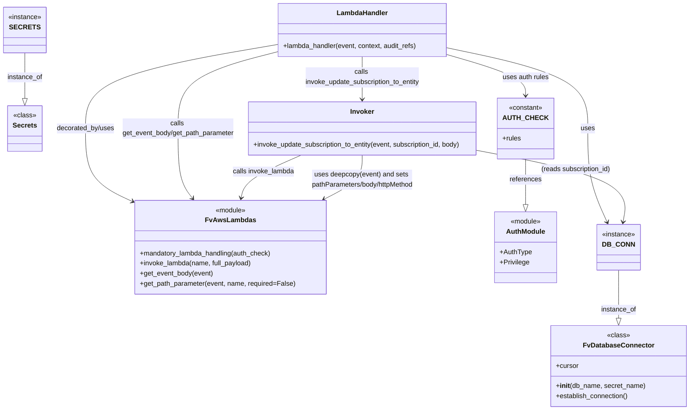

# Diagram: shipment_core/shipment_service/shipment_service/ng_preferences/subscription/update_subscription.py

> Auto-generated by Obscura crawlers

## Mermaid

### SVG

<svg id="container" width="1641.48828125" xmlns="http://www.w3.org/2000/svg" class="classDiagram" height="970" viewBox="0 0 1641.48828125 970" role="graphics-document document" aria-roledescription="class"><g><defs><marker id="container_class-aggregationStart" class="marker aggregation class" refX="18" refY="7" markerWidth="190" markerHeight="240" orient="auto"><path d="M 18,7 L9,13 L1,7 L9,1 Z"></path></marker></defs><defs><marker id="container_class-aggregationEnd" class="marker aggregation class" refX="1" refY="7" markerWidth="20" markerHeight="28" orient="auto"><path d="M 18,7 L9,13 L1,7 L9,1 Z"></path></marker></defs><defs><marker id="container_class-extensionStart" class="marker extension class" refX="18" refY="7" markerWidth="190" markerHeight="240" orient="auto"><path d="M 1,7 L18,13 V 1 Z"></path></marker></defs><defs><marker id="container_class-extensionEnd" class="marker extension class" refX="1" refY="7" markerWidth="20" markerHeight="28" orient="auto"><path d="M 1,1 V 13 L18,7 Z"></path></marker></defs><defs><marker id="container_class-compositionStart" class="marker composition class" refX="18" refY="7" markerWidth="190" markerHeight="240" orient="auto"><path d="M 18,7 L9,13 L1,7 L9,1 Z"></path></marker></defs><defs><marker id="container_class-compositionEnd" class="marker composition class" refX="1" refY="7" markerWidth="20" markerHeight="28" orient="auto"><path d="M 18,7 L9,13 L1,7 L9,1 Z"></path></marker></defs><defs><marker id="container_class-dependencyStart" class="marker dependency class" refX="6" refY="7" markerWidth="190" markerHeight="240" orient="auto"><path d="M 5,7 L9,13 L1,7 L9,1 Z"></path></marker></defs><defs><marker id="container_class-dependencyEnd" class="marker dependency class" refX="13" refY="7" markerWidth="20" markerHeight="28" orient="auto"><path d="M 18,7 L9,13 L14,7 L9,1 Z"></path></marker></defs><defs><marker id="container_class-lollipopStart" class="marker lollipop class" refX="13" refY="7" markerWidth="190" markerHeight="240" orient="auto"><circle stroke="black" fill="transparent" cx="7" cy="7" r="6"></circle></marker></defs><defs><marker id="container_class-lollipopEnd" class="marker lollipop class" refX="1" refY="7" markerWidth="190" markerHeight="240" orient="auto"><circle stroke="black" fill="transparent" cx="7" cy="7" r="6"></circle></marker></defs><g class="root"><g class="clusters"></g><g class="edgePaths"><path d="M59.547,125L59.547,134.667C59.547,144.333,59.547,163.667,59.547,181.625C59.547,199.583,59.547,216.167,59.547,224.458L59.547,232.75" id="id_SECRETS_Secrets_1" class="edge-thickness-normal edge-pattern-solid relation" style=";;;" data-edge="true" data-et="edge" data-id="id_SECRETS_Secrets_1" data-points="W3sieCI6NTkuNTQ2ODc1LCJ5IjoxMjV9LHsieCI6NTkuNTQ2ODc1LCJ5IjoxODN9LHsieCI6NTkuNTQ2ODc1LCJ5IjoyNTB9XQ==" marker-end="url(#container_class-extensionEnd)"></path><path d="M1476.25,639L1476.25,654.667C1476.25,670.333,1476.25,701.667,1476.25,720.625C1476.25,739.583,1476.25,746.167,1476.25,749.458L1476.25,752.75" id="id_DB_CONN_FvDatabaseConnector_2" class="edge-thickness-normal edge-pattern-solid relation" style=";;;" data-edge="true" data-et="edge" data-id="id_DB_CONN_FvDatabaseConnector_2" data-points="W3sieCI6MTQ3Ni4yNSwieSI6NjM5fSx7IngiOjE0NzYuMjUsInkiOjczM30seyJ4IjoxNDc2LjI1LCJ5Ijo3NzB9XQ==" marker-end="url(#container_class-extensionEnd)"></path><path d="M1261.914,376L1261.914,384.167C1261.914,392.333,1261.914,408.667,1261.914,426.625C1261.914,444.583,1261.914,464.167,1261.914,473.958L1261.914,483.75" id="id_AUTH_CHECK_AuthModule_3" class="edge-thickness-normal edge-pattern-solid relation" style=";;;" data-edge="true" data-et="edge" data-id="id_AUTH_CHECK_AuthModule_3" data-points="W3sieCI6MTI2MS45MTQwNjI1LCJ5IjozNzZ9LHsieCI6MTI2MS45MTQwNjI1LCJ5Ijo0MjV9LHsieCI6MTI2MS45MTQwNjI1LCJ5Ijo1MDF9XQ==" marker-end="url(#container_class-extensionEnd)"></path><path d="M674.117,104.63L595.68,117.692C517.242,130.753,360.367,156.877,281.93,190.105C203.492,223.333,203.492,263.667,203.492,304C203.492,344.333,203.492,384.667,223.883,414.104C244.273,443.541,285.054,462.082,305.444,471.353L325.835,480.623" id="id_LambdaHandler_FvAwsLambdas_4" class="edge-thickness-normal edge-pattern-solid relation" style=";;;" data-edge="true" data-et="edge" data-id="id_LambdaHandler_FvAwsLambdas_4" data-points="W3sieCI6Njc0LjExNzE4NzUsInkiOjEwNC42Mjk5MjIxNzQ0Njg1OX0seyJ4IjoyMDMuNDkyMTg3NSwieSI6MTgzfSx7IngiOjIwMy40OTIxODc1LCJ5IjozMDR9LHsieCI6MjAzLjQ5MjE4NzUsInkiOjQyNX0seyJ4IjozMzEuMjk2ODc1LCJ5Ijo0ODMuMTA2NTgxMTIzNTMwNjV9XQ==" marker-end="url(#container_class-dependencyEnd)"></path><path d="M1078.023,113.863L1132.314,125.386C1186.605,136.909,1295.188,159.954,1349.479,191.644C1403.77,223.333,1403.77,263.667,1403.77,304C1403.77,344.333,1403.77,384.667,1411.36,421.589C1418.95,458.512,1434.131,492.023,1441.722,508.779L1449.312,525.535" id="id_LambdaHandler_DB_CONN_5" class="edge-thickness-normal edge-pattern-solid relation" style=";;;" data-edge="true" data-et="edge" data-id="id_LambdaHandler_DB_CONN_5" data-points="W3sieCI6MTA3OC4wMjM0Mzc1LCJ5IjoxMTMuODYyOTU5MDQyNDIzMjZ9LHsieCI6MTQwMy43Njk1MzEyNSwieSI6MTgzfSx7IngiOjE0MDMuNzY5NTMxMjUsInkiOjMwNH0seyJ4IjoxNDAzLjc2OTUzMTI1LCJ5Ijo0MjV9LHsieCI6MTQ1MS43ODc4NDE3OTY4NzUsInkiOjUzMX1d" marker-end="url(#container_class-dependencyEnd)"></path><path d="M674.117,121.567L633.225,131.806C592.333,142.045,510.549,162.522,469.658,192.928C428.766,223.333,428.766,263.667,428.766,304C428.766,344.333,428.766,384.667,434.609,412.216C440.453,439.765,452.14,454.53,457.983,461.913L463.827,469.295" id="id_LambdaHandler_FvAwsLambdas_6" class="edge-thickness-normal edge-pattern-solid relation" style=";;;" data-edge="true" data-et="edge" data-id="id_LambdaHandler_FvAwsLambdas_6" data-points="W3sieCI6Njc0LjExNzE4NzUsInkiOjEyMS41NjY3NjI3MjgxNDYwMn0seyJ4Ijo0MjguNzY1NjI1LCJ5IjoxODN9LHsieCI6NDI4Ljc2NTYyNSwieSI6MzA0fSx7IngiOjQyOC43NjU2MjUsInkiOjQyNX0seyJ4Ijo0NjcuNTUwNTEyNjk1MzEyNSwieSI6NDc0fV0=" marker-end="url(#container_class-dependencyEnd)"></path><path d="M876.07,134L876.07,142.167C876.07,150.333,876.07,166.667,876.07,183.5C876.07,200.333,876.07,217.667,876.07,226.333L876.07,235" id="id_LambdaHandler_Invoker_7" class="edge-thickness-normal edge-pattern-solid relation" style=";;;" data-edge="true" data-et="edge" data-id="id_LambdaHandler_Invoker_7" data-points="W3sieCI6ODc2LjA3MDMxMjUsInkiOjEzNH0seyJ4Ijo4NzYuMDcwMzEyNSwieSI6MTgzfSx7IngiOjg3Ni4wNzAzMTI1LCJ5IjoyNDF9XQ==" marker-end="url(#container_class-dependencyEnd)"></path><path d="M726.649,367L703.722,376.667C680.794,386.333,634.94,405.667,610.5,422.521C586.06,439.376,583.034,453.752,581.521,460.941L580.008,468.129" id="id_Invoker_FvAwsLambdas_8" class="edge-thickness-normal edge-pattern-solid relation" style=";;;" data-edge="true" data-et="edge" data-id="id_Invoker_FvAwsLambdas_8" data-points="W3sieCI6NzI2LjY0ODY5NTc2NDQ2MjgsInkiOjM2N30seyJ4Ijo1ODkuMDg1OTM3NSwieSI6NDI1fSx7IngiOjU3OC43NzI3Mjk0OTIxODc1LCJ5Ijo0NzR9XQ==" marker-end="url(#container_class-dependencyEnd)"></path><path d="M876.07,367L876.07,376.667C876.07,386.333,876.07,405.667,860.598,423.054C845.126,440.44,814.181,455.881,798.709,463.601L783.237,471.321" id="id_Invoker_FvAwsLambdas_9" class="edge-thickness-normal edge-pattern-solid relation" style=";;;" data-edge="true" data-et="edge" data-id="id_Invoker_FvAwsLambdas_9" data-points="W3sieCI6ODc2LjA3MDMxMjUsInkiOjM2N30seyJ4Ijo4NzYuMDcwMzEyNSwieSI6NDI1fSx7IngiOjc3Ny44NjgxMzk2NDg0Mzc1LCJ5Ijo0NzR9XQ==" marker-end="url(#container_class-dependencyEnd)"></path><path d="M1078.023,129.622L1108.672,138.518C1139.32,147.414,1200.617,165.207,1231.266,181.27C1261.914,197.333,1261.914,211.667,1261.914,218.833L1261.914,226" id="id_LambdaHandler_AUTH_CHECK_10" class="edge-thickness-normal edge-pattern-solid relation" style=";;;" data-edge="true" data-et="edge" data-id="id_LambdaHandler_AUTH_CHECK_10" data-points="W3sieCI6MTA3OC4wMjM0Mzc1LCJ5IjoxMjkuNjIxNTI3NDk2NTU3ODZ9LHsieCI6MTI2MS45MTQwNjI1LCJ5IjoxODN9LHsieCI6MTI2MS45MTQwNjI1LCJ5IjoyMzJ9XQ==" marker-end="url(#container_class-dependencyEnd)"></path><path d="M1152.883,357.038L1211.999,368.365C1271.116,379.692,1389.349,402.346,1445.198,430.358C1501.047,458.371,1494.512,491.741,1491.245,508.427L1487.978,525.112" id="id_Invoker_DB_CONN_11" class="edge-thickness-normal edge-pattern-solid relation" style=";;;" data-edge="true" data-et="edge" data-id="id_Invoker_DB_CONN_11" data-points="W3sieCI6MTE1Mi44ODI4MTI1LCJ5IjozNTcuMDM4MzA3MTM3NTExMX0seyJ4IjoxNTA3LjU4MjAzMTI1LCJ5Ijo0MjV9LHsieCI6MTQ4Ni44MjQ1NjA1NDY4NzUsInkiOjUzMX1d" marker-end="url(#container_class-dependencyEnd)"></path></g><g class="edgeLabels"><g class="edgeLabel" transform="translate(59.546875, 183)"><g class="label" data-id="id_SECRETS_Secrets_1" transform="translate(-41.7734375, -12)"><foreignObject width="83.546875" height="24">

instance_of

</foreignObject></g></g><g class="edgeLabel" transform="translate(1476.25, 733)"><g class="label" data-id="id_DB_CONN_FvDatabaseConnector_2" transform="translate(-41.7734375, -12)"><foreignObject width="83.546875" height="24">

instance_of

</foreignObject></g></g><g class="edgeLabel" transform="translate(1261.9140625, 425)"><g class="label" data-id="id_AUTH_CHECK_AuthModule_3" transform="translate(-37.828125, -12)"><foreignObject width="75.65625" height="24">

references

</foreignObject></g></g><g class="edgeLabel" transform="translate(203.4921875, 304)"><g class="label" data-id="id_LambdaHandler_FvAwsLambdas_4" transform="translate(-69.78125, -12)"><foreignObject width="139.5625" height="24">

decorated_by/uses

</foreignObject></g></g><g class="edgeLabel" transform="translate(1403.76953125, 304)"><g class="label" data-id="id_LambdaHandler_DB_CONN_5" transform="translate(-16.4921875, -12)"><foreignObject width="32.984375" height="24">

uses

</foreignObject></g></g><g class="edgeLabel" transform="translate(428.765625, 304)"><g class="label" data-id="id_LambdaHandler_FvAwsLambdas_6" transform="translate(-135.4921875, -24)"><foreignObject width="270.984375" height="48">

calls get_event_body/get_path_parameter

</foreignObject></g></g><g class="edgeLabel" transform="translate(876.0703125, 183)"><g class="label" data-id="id_LambdaHandler_Invoker_7" transform="translate(-138.921875, -24)"><foreignObject width="277.84375" height="48">

calls invoke_update_subscription_to_entity

</foreignObject></g></g><g class="edgeLabel" transform="translate(634.79726, 405.72693)"><g class="label" data-id="id_Invoker_FvAwsLambdas_8" transform="translate(-73.734375, -12)"><foreignObject width="147.46875" height="24">

calls invoke_lambda

</foreignObject></g></g><g class="edgeLabel" transform="translate(876.0703125, 425)"><g class="label" data-id="id_Invoker_FvAwsLambdas_9" transform="translate(-126.6640625, -24)"><foreignObject width="253.328125" height="48">

uses deepcopy(event) and sets pathParameters/body/httpMethod

</foreignObject></g></g><g class="edgeLabel" transform="translate(1261.9140625, 183)"><g class="label" data-id="id_LambdaHandler_AUTH_CHECK_10" transform="translate(-55.4609375, -12)"><foreignObject width="110.921875" height="24">

uses auth rules

</foreignObject></g></g><g class="edgeLabel" transform="translate(1383.27421, 401.18216)"><g class="label" data-id="id_Invoker_DB_CONN_11" transform="translate(-83.8125, -12)"><foreignObject width="167.625" height="24">

(reads subscription_id)

</foreignObject></g></g></g><g class="nodes"><g class="node default" id="classId-FvAwsLambdas-0" transform="translate(555.41015625, 585)"><g class="basic label-container"><path d="M-224.11328125 -111 L224.11328125 -111 L224.11328125 111 L-224.11328125 111" stroke="none" stroke-width="0" fill="#ECECFF" style=""></path><path d="M-224.11328125 -111 C-61.45348305642028 -111, 101.20631513715944 -111, 224.11328125 -111 M-224.11328125 -111 C-90.34348826565017 -111, 43.42630471869967 -111, 224.11328125 -111 M224.11328125 -111 C224.11328125 -40.32580772898207, 224.11328125 30.34838454203586, 224.11328125 111 M224.11328125 -111 C224.11328125 -22.385046191602342, 224.11328125 66.22990761679532, 224.11328125 111 M224.11328125 111 C122.930447700234 111, 21.747614150467996 111, -224.11328125 111 M224.11328125 111 C61.89957620650122 111, -100.31412883699755 111, -224.11328125 111 M-224.11328125 111 C-224.11328125 41.961402896156514, -224.11328125 -27.077194207686972, -224.11328125 -111 M-224.11328125 111 C-224.11328125 31.176455630151665, -224.11328125 -48.64708873969667, -224.11328125 -111" stroke="#9370DB" stroke-width="1.3" fill="none" stroke-dasharray="0 0" style=""></path></g><g class="annotation-group text" transform="translate(-36.6015625, -87)"><g class="label" style="" transform="translate(0,-12)"><foreignObject width="73.203125" height="24">

«module»

</foreignObject></g></g><g class="label-group text" transform="translate(-55.2109375, -63)"><g class="label" style="font-weight: bolder" transform="translate(0,-12)"><foreignObject width="110.421875" height="24">

FvAwsLambdas

</foreignObject></g></g><g class="members-group text" transform="translate(-212.11328125, -15)"></g><g class="methods-group text" transform="translate(-212.11328125, 15)"><g class="label" style="" transform="translate(0,-12)"><foreignObject width="314.828125" height="24">

+mandatory_lambda_handling(auth_check)

</foreignObject></g><g class="label" style="" transform="translate(0,12)"><foreignObject width="267.234375" height="24">

+invoke_lambda(name, full_payload)

</foreignObject></g><g class="label" style="" transform="translate(0,36)"><foreignObject width="174.203125" height="24">

+get_event_body(event)

</foreignObject></g><g class="label" style="" transform="translate(0,60)"><foreignObject width="369.015625" height="24">

+get_path_parameter(event, name, required=False)

</foreignObject></g></g><g class="divider" style=""><path d="M-224.11328125 -39 C-95.22354863277488 -39, 33.66618398445024 -39, 224.11328125 -39 M-224.11328125 -39 C-67.89136758151346 -39, 88.33054608697307 -39, 224.11328125 -39" stroke="#9370DB" stroke-width="1.3" fill="none" stroke-dasharray="0 0" style=""></path></g><g class="divider" style=""><path d="M-224.11328125 -15 C-127.28098488822285 -15, -30.448688526445693 -15, 224.11328125 -15 M-224.11328125 -15 C-70.32093053661629 -15, 83.47142017676742 -15, 224.11328125 -15" stroke="#9370DB" stroke-width="1.3" fill="none" stroke-dasharray="0 0" style=""></path></g></g><g class="node default" id="classId-AuthModule-1" transform="translate(1261.9140625, 585)"><g class="basic label-container"><path d="M-71.640625 -84 L71.640625 -84 L71.640625 84 L-71.640625 84" stroke="none" stroke-width="0" fill="#ECECFF" style=""></path><path d="M-71.640625 -84 C-42.22370121324502 -84, -12.80677742649005 -84, 71.640625 -84 M-71.640625 -84 C-34.155068036453834 -84, 3.3304889270923326 -84, 71.640625 -84 M71.640625 -84 C71.640625 -25.25109363089726, 71.640625 33.49781273820548, 71.640625 84 M71.640625 -84 C71.640625 -49.212200249473895, 71.640625 -14.42440049894779, 71.640625 84 M71.640625 84 C16.14171692121218 84, -39.35719115757564 84, -71.640625 84 M71.640625 84 C19.4564957148226 84, -32.7276335703548 84, -71.640625 84 M-71.640625 84 C-71.640625 45.02139691824386, -71.640625 6.042793836487718, -71.640625 -84 M-71.640625 84 C-71.640625 17.01508366167306, -71.640625 -49.96983267665388, -71.640625 -84" stroke="#9370DB" stroke-width="1.3" fill="none" stroke-dasharray="0 0" style=""></path></g><g class="annotation-group text" transform="translate(-36.6015625, -60)"><g class="label" style="" transform="translate(0,-12)"><foreignObject width="73.203125" height="24">

«module»

</foreignObject></g></g><g class="label-group text" transform="translate(-44.09375, -36)"><g class="label" style="font-weight: bolder" transform="translate(0,-12)"><foreignObject width="88.1875" height="24">

AuthModule

</foreignObject></g></g><g class="members-group text" transform="translate(-59.640625, 12)"><g class="label" style="" transform="translate(0,-12)"><foreignObject width="75.1875" height="24">

+AuthType

</foreignObject></g><g class="label" style="" transform="translate(0,12)"><foreignObject width="70.15625" height="24">

+Privilege

</foreignObject></g></g><g class="methods-group text" transform="translate(-59.640625, 84)"></g><g class="divider" style=""><path d="M-71.640625 -12 C-20.63932303254805 -12, 30.361978934903902 -12, 71.640625 -12 M-71.640625 -12 C-29.323409520203164 -12, 12.993805959593672 -12, 71.640625 -12" stroke="#9370DB" stroke-width="1.3" fill="none" stroke-dasharray="0 0" style=""></path></g><g class="divider" style=""><path d="M-71.640625 60 C-21.48893713287449 60, 28.66275073425102 60, 71.640625 60 M-71.640625 60 C-41.38696492704453 60, -11.133304854089069 60, 71.640625 60" stroke="#9370DB" stroke-width="1.3" fill="none" stroke-dasharray="0 0" style=""></path></g></g><g class="node default" id="classId-Secrets-2" transform="translate(59.546875, 304)"><g class="basic label-container"><path d="M-39.1640625 -54 L39.1640625 -54 L39.1640625 54 L-39.1640625 54" stroke="none" stroke-width="0" fill="#ECECFF" style=""></path><path d="M-39.1640625 -54 C-20.52518743743366 -54, -1.8863123748673232 -54, 39.1640625 -54 M-39.1640625 -54 C-19.770981720005526 -54, -0.37790094001105246 -54, 39.1640625 -54 M39.1640625 -54 C39.1640625 -17.857187766684262, 39.1640625 18.285624466631475, 39.1640625 54 M39.1640625 -54 C39.1640625 -25.96922520984507, 39.1640625 2.0615495803098582, 39.1640625 54 M39.1640625 54 C18.373258499175478 54, -2.4175455016490446 54, -39.1640625 54 M39.1640625 54 C22.33309400482381 54, 5.50212550964762 54, -39.1640625 54 M-39.1640625 54 C-39.1640625 14.199368763926032, -39.1640625 -25.601262472147937, -39.1640625 -54 M-39.1640625 54 C-39.1640625 16.8954979412163, -39.1640625 -20.209004117567403, -39.1640625 -54" stroke="#9370DB" stroke-width="1.3" fill="none" stroke-dasharray="0 0" style=""></path></g><g class="annotation-group text" transform="translate(-26.765625, -30)"><g class="label" style="" transform="translate(0,-12)"><foreignObject width="53.53125" height="24">

«class»

</foreignObject></g></g><g class="label-group text" transform="translate(-27.1640625, -6)"><g class="label" style="font-weight: bolder" transform="translate(0,-12)"><foreignObject width="54.328125" height="24">

Secrets

</foreignObject></g></g><g class="members-group text" transform="translate(-27.1640625, 42)"></g><g class="methods-group text" transform="translate(-27.1640625, 72)"></g><g class="divider" style=""><path d="M-39.1640625 18 C-11.694726297158581 18, 15.774609905682837 18, 39.1640625 18 M-39.1640625 18 C-13.632933451489588 18, 11.898195597020823 18, 39.1640625 18" stroke="#9370DB" stroke-width="1.3" fill="none" stroke-dasharray="0 0" style=""></path></g><g class="divider" style=""><path d="M-39.1640625 36 C-19.3113408066322 36, 0.5413808867356025 36, 39.1640625 36 M-39.1640625 36 C-14.285772569791337 36, 10.592517360417325 36, 39.1640625 36" stroke="#9370DB" stroke-width="1.3" fill="none" stroke-dasharray="0 0" style=""></path></g></g><g class="node default" id="classId-FvDatabaseConnector-3" transform="translate(1476.25, 866)"><g class="basic label-container"><path d="M-157.23828125 -96 L157.23828125 -96 L157.23828125 96 L-157.23828125 96" stroke="none" stroke-width="0" fill="#ECECFF" style=""></path><path d="M-157.23828125 -96 C-43.547300016140795 -96, 70.14368121771841 -96, 157.23828125 -96 M-157.23828125 -96 C-67.51667399537487 -96, 22.204933259250254 -96, 157.23828125 -96 M157.23828125 -96 C157.23828125 -35.800829775187864, 157.23828125 24.39834044962427, 157.23828125 96 M157.23828125 -96 C157.23828125 -50.48575169649392, 157.23828125 -4.971503392987842, 157.23828125 96 M157.23828125 96 C50.206074601441586 96, -56.82613204711683 96, -157.23828125 96 M157.23828125 96 C81.90502808925484 96, 6.571774928509683 96, -157.23828125 96 M-157.23828125 96 C-157.23828125 37.387841032276654, -157.23828125 -21.22431793544669, -157.23828125 -96 M-157.23828125 96 C-157.23828125 20.775561655965134, -157.23828125 -54.44887668806973, -157.23828125 -96" stroke="#9370DB" stroke-width="1.3" fill="none" stroke-dasharray="0 0" style=""></path></g><g class="annotation-group text" transform="translate(-26.765625, -72)"><g class="label" style="" transform="translate(0,-12)"><foreignObject width="53.53125" height="24">

«class»

</foreignObject></g></g><g class="label-group text" transform="translate(-79.3046875, -48)"><g class="label" style="font-weight: bolder" transform="translate(0,-12)"><foreignObject width="158.609375" height="24">

FvDatabaseConnector

</foreignObject></g></g><g class="members-group text" transform="translate(-145.23828125, 0)"><g class="label" style="" transform="translate(0,-12)"><foreignObject width="53.71875" height="24">

+cursor

</foreignObject></g></g><g class="methods-group text" transform="translate(-145.23828125, 48)"><g class="label" style="" transform="translate(0,-12)"><foreignObject width="211.171875" height="24">

+<strong>init</strong>(db_name, secret_name)

</foreignObject></g><g class="label" style="" transform="translate(0,12)"><foreignObject width="173.265625" height="24">

+establish_connection()

</foreignObject></g></g><g class="divider" style=""><path d="M-157.23828125 -24 C-65.37643479514185 -24, 26.485411659716306 -24, 157.23828125 -24 M-157.23828125 -24 C-92.69602678448847 -24, -28.153772318976934 -24, 157.23828125 -24" stroke="#9370DB" stroke-width="1.3" fill="none" stroke-dasharray="0 0" style=""></path></g><g class="divider" style=""><path d="M-157.23828125 24 C-60.34553619637386 24, 36.547208857252286 24, 157.23828125 24 M-157.23828125 24 C-92.46510517899411 24, -27.691929107988216 24, 157.23828125 24" stroke="#9370DB" stroke-width="1.3" fill="none" stroke-dasharray="0 0" style=""></path></g></g><g class="node default" id="classId-LambdaHandler-4" transform="translate(876.0703125, 71)"><g class="basic label-container"><path d="M-201.953125 -63 L201.953125 -63 L201.953125 63 L-201.953125 63" stroke="none" stroke-width="0" fill="#ECECFF" style=""></path><path d="M-201.953125 -63 C-91.76406482036028 -63, 18.42499535927945 -63, 201.953125 -63 M-201.953125 -63 C-103.76262356789184 -63, -5.5721221357836725 -63, 201.953125 -63 M201.953125 -63 C201.953125 -29.516103711223344, 201.953125 3.967792577553311, 201.953125 63 M201.953125 -63 C201.953125 -19.496603930782655, 201.953125 24.00679213843469, 201.953125 63 M201.953125 63 C51.1174851453913 63, -99.7181547092174 63, -201.953125 63 M201.953125 63 C57.24854758939776 63, -87.45602982120448 63, -201.953125 63 M-201.953125 63 C-201.953125 22.774976598497815, -201.953125 -17.45004680300437, -201.953125 -63 M-201.953125 63 C-201.953125 21.70742994772887, -201.953125 -19.585140104542262, -201.953125 -63" stroke="#9370DB" stroke-width="1.3" fill="none" stroke-dasharray="0 0" style=""></path></g><g class="annotation-group text" transform="translate(0, -39)"></g><g class="label-group text" transform="translate(-58.21875, -39)"><g class="label" style="font-weight: bolder" transform="translate(0,-12)"><foreignObject width="116.4375" height="24">

LambdaHandler

</foreignObject></g></g><g class="members-group text" transform="translate(-189.953125, 9)"></g><g class="methods-group text" transform="translate(-189.953125, 39)"><g class="label" style="" transform="translate(0,-12)"><foreignObject width="321.6875" height="24">

+lambda_handler(event, context, audit_refs)

</foreignObject></g></g><g class="divider" style=""><path d="M-201.953125 -15 C-92.11244084944425 -15, 17.72824330111149 -15, 201.953125 -15 M-201.953125 -15 C-110.0798928663593 -15, -18.206660732718603 -15, 201.953125 -15" stroke="#9370DB" stroke-width="1.3" fill="none" stroke-dasharray="0 0" style=""></path></g><g class="divider" style=""><path d="M-201.953125 9 C-55.959743027071994 9, 90.03363894585601 9, 201.953125 9 M-201.953125 9 C-58.12621556933814 9, 85.70069386132371 9, 201.953125 9" stroke="#9370DB" stroke-width="1.3" fill="none" stroke-dasharray="0 0" style=""></path></g></g><g class="node default" id="classId-Invoker-5" transform="translate(876.0703125, 304)"><g class="basic label-container"><path d="M-276.8125 -63 L276.8125 -63 L276.8125 63 L-276.8125 63" stroke="none" stroke-width="0" fill="#ECECFF" style=""></path><path d="M-276.8125 -63 C-115.27604839975135 -63, 46.26040320049731 -63, 276.8125 -63 M-276.8125 -63 C-116.61874670899144 -63, 43.575006582017124 -63, 276.8125 -63 M276.8125 -63 C276.8125 -23.106582861435406, 276.8125 16.786834277129188, 276.8125 63 M276.8125 -63 C276.8125 -23.110822903269174, 276.8125 16.778354193461652, 276.8125 63 M276.8125 63 C144.37569888008258 63, 11.938897760165162 63, -276.8125 63 M276.8125 63 C132.30998399451397 63, -12.192532010972059 63, -276.8125 63 M-276.8125 63 C-276.8125 27.882779453542796, -276.8125 -7.234441092914409, -276.8125 -63 M-276.8125 63 C-276.8125 20.441716873708565, -276.8125 -22.11656625258287, -276.8125 -63" stroke="#9370DB" stroke-width="1.3" fill="none" stroke-dasharray="0 0" style=""></path></g><g class="annotation-group text" transform="translate(0, -39)"></g><g class="label-group text" transform="translate(-27.5625, -39)"><g class="label" style="font-weight: bolder" transform="translate(0,-12)"><foreignObject width="55.125" height="24">

Invoker

</foreignObject></g></g><g class="members-group text" transform="translate(-264.8125, 9)"></g><g class="methods-group text" transform="translate(-264.8125, 39)"><g class="label" style="" transform="translate(0,-12)"><foreignObject width="502.0625" height="24">

+invoke_update_subscription_to_entity(event, subscription_id, body)

</foreignObject></g></g><g class="divider" style=""><path d="M-276.8125 -15 C-111.0179987248209 -15, 54.7765025503582 -15, 276.8125 -15 M-276.8125 -15 C-72.47311029182319 -15, 131.86627941635362 -15, 276.8125 -15" stroke="#9370DB" stroke-width="1.3" fill="none" stroke-dasharray="0 0" style=""></path></g><g class="divider" style=""><path d="M-276.8125 9 C-58.90831311289156 9, 158.99587377421688 9, 276.8125 9 M-276.8125 9 C-103.33520023361726 9, 70.14209953276549 9, 276.8125 9" stroke="#9370DB" stroke-width="1.3" fill="none" stroke-dasharray="0 0" style=""></path></g></g><g class="node default" id="classId-SECRETS-6" transform="translate(59.546875, 71)"><g class="basic label-container"><path d="M-51.546875 -54 L51.546875 -54 L51.546875 54 L-51.546875 54" stroke="none" stroke-width="0" fill="#ECECFF" style=""></path><path d="M-51.546875 -54 C-18.50321779940898 -54, 14.540439401182041 -54, 51.546875 -54 M-51.546875 -54 C-12.134703775890607 -54, 27.277467448218786 -54, 51.546875 -54 M51.546875 -54 C51.546875 -28.964748103250905, 51.546875 -3.9294962065018098, 51.546875 54 M51.546875 -54 C51.546875 -18.55849719443333, 51.546875 16.883005611133342, 51.546875 54 M51.546875 54 C16.504322908846156 54, -18.53822918230769 54, -51.546875 54 M51.546875 54 C14.037435241572311 54, -23.472004516855378 54, -51.546875 54 M-51.546875 54 C-51.546875 20.340681771552596, -51.546875 -13.318636456894808, -51.546875 -54 M-51.546875 54 C-51.546875 26.27761939741434, -51.546875 -1.444761205171318, -51.546875 -54" stroke="#9370DB" stroke-width="1.3" fill="none" stroke-dasharray="0 0" style=""></path></g><g class="annotation-group text" transform="translate(-39.546875, -30)"><g class="label" style="" transform="translate(0,-12)"><foreignObject width="79.09375" height="24">

«instance»

</foreignObject></g></g><g class="label-group text" transform="translate(-31.15625, -6)"><g class="label" style="font-weight: bolder" transform="translate(0,-12)"><foreignObject width="62.3125" height="24">

SECRETS

</foreignObject></g></g><g class="members-group text" transform="translate(-39.546875, 42)"></g><g class="methods-group text" transform="translate(-39.546875, 72)"></g><g class="divider" style=""><path d="M-51.546875 18 C-26.716444500145453 18, -1.8860140002909063 18, 51.546875 18 M-51.546875 18 C-25.8159006773529 18, -0.08492635470580012 18, 51.546875 18" stroke="#9370DB" stroke-width="1.3" fill="none" stroke-dasharray="0 0" style=""></path></g><g class="divider" style=""><path d="M-51.546875 36 C-20.417130954575157 36, 10.712613090849686 36, 51.546875 36 M-51.546875 36 C-23.992820129922297 36, 3.561234740155406 36, 51.546875 36" stroke="#9370DB" stroke-width="1.3" fill="none" stroke-dasharray="0 0" style=""></path></g></g><g class="node default" id="classId-DB_CONN-7" transform="translate(1476.25, 585)"><g class="basic label-container"><path d="M-51.546875 -54 L51.546875 -54 L51.546875 54 L-51.546875 54" stroke="none" stroke-width="0" fill="#ECECFF" style=""></path><path d="M-51.546875 -54 C-29.009515418307828 -54, -6.472155836615656 -54, 51.546875 -54 M-51.546875 -54 C-28.281657833315855 -54, -5.016440666631709 -54, 51.546875 -54 M51.546875 -54 C51.546875 -24.730318779098152, 51.546875 4.539362441803696, 51.546875 54 M51.546875 -54 C51.546875 -12.746779688081254, 51.546875 28.50644062383749, 51.546875 54 M51.546875 54 C28.756017686046295 54, 5.9651603720925905 54, -51.546875 54 M51.546875 54 C11.14882320183726 54, -29.24922859632548 54, -51.546875 54 M-51.546875 54 C-51.546875 14.861012367291067, -51.546875 -24.277975265417865, -51.546875 -54 M-51.546875 54 C-51.546875 30.54119149710251, -51.546875 7.08238299420502, -51.546875 -54" stroke="#9370DB" stroke-width="1.3" fill="none" stroke-dasharray="0 0" style=""></path></g><g class="annotation-group text" transform="translate(-39.546875, -30)"><g class="label" style="" transform="translate(0,-12)"><foreignObject width="79.09375" height="24">

«instance»

</foreignObject></g></g><g class="label-group text" transform="translate(-34.40625, -6)"><g class="label" style="font-weight: bolder" transform="translate(0,-12)"><foreignObject width="68.8125" height="24">

DB_CONN

</foreignObject></g></g><g class="members-group text" transform="translate(-39.546875, 42)"></g><g class="methods-group text" transform="translate(-39.546875, 72)"></g><g class="divider" style=""><path d="M-51.546875 18 C-18.11329543159311 18, 15.320284136813783 18, 51.546875 18 M-51.546875 18 C-23.20174096496079 18, 5.143393070078417 18, 51.546875 18" stroke="#9370DB" stroke-width="1.3" fill="none" stroke-dasharray="0 0" style=""></path></g><g class="divider" style=""><path d="M-51.546875 36 C-13.579033755920541 36, 24.388807488158918 36, 51.546875 36 M-51.546875 36 C-28.984114023047262 36, -6.421353046094524 36, 51.546875 36" stroke="#9370DB" stroke-width="1.3" fill="none" stroke-dasharray="0 0" style=""></path></g></g><g class="node default" id="classId-AUTH_CHECK-8" transform="translate(1261.9140625, 304)"><g class="basic label-container"><path d="M-59.03125 -72 L59.03125 -72 L59.03125 72 L-59.03125 72" stroke="none" stroke-width="0" fill="#ECECFF" style=""></path><path d="M-59.03125 -72 C-34.25662598824282 -72, -9.482001976485634 -72, 59.03125 -72 M-59.03125 -72 C-24.03982587493619 -72, 10.951598250127617 -72, 59.03125 -72 M59.03125 -72 C59.03125 -35.82381482240103, 59.03125 0.3523703551979338, 59.03125 72 M59.03125 -72 C59.03125 -35.43237253349761, 59.03125 1.1352549330047736, 59.03125 72 M59.03125 72 C13.486899055298153 72, -32.057451889403694 72, -59.03125 72 M59.03125 72 C15.725635800095041 72, -27.579978399809917 72, -59.03125 72 M-59.03125 72 C-59.03125 15.890354949120905, -59.03125 -40.21929010175819, -59.03125 -72 M-59.03125 72 C-59.03125 42.85133638692702, -59.03125 13.70267277385404, -59.03125 -72" stroke="#9370DB" stroke-width="1.3" fill="none" stroke-dasharray="0 0" style=""></path></g><g class="annotation-group text" transform="translate(-40.4921875, -48)"><g class="label" style="" transform="translate(0,-12)"><foreignObject width="80.984375" height="24">

«constant»

</foreignObject></g></g><g class="label-group text" transform="translate(-47.03125, -24)"><g class="label" style="font-weight: bolder" transform="translate(0,-12)"><foreignObject width="94.0625" height="24">

AUTH_CHECK

</foreignObject></g></g><g class="members-group text" transform="translate(-47.03125, 24)"><g class="label" style="" transform="translate(0,-12)"><foreignObject width="44.28125" height="24">

+rules

</foreignObject></g></g><g class="methods-group text" transform="translate(-47.03125, 72)"></g><g class="divider" style=""><path d="M-59.03125 0 C-23.72176655270475 0, 11.5877168945905 0, 59.03125 0 M-59.03125 0 C-33.5516535763605 0, -8.072057152721001 0, 59.03125 0" stroke="#9370DB" stroke-width="1.3" fill="none" stroke-dasharray="0 0" style=""></path></g><g class="divider" style=""><path d="M-59.03125 48 C-35.24132360649689 48, -11.45139721299379 48, 59.03125 48 M-59.03125 48 C-18.15807828649489 48, 22.715093427010217 48, 59.03125 48" stroke="#9370DB" stroke-width="1.3" fill="none" stroke-dasharray="0 0" style=""></path></g></g></g></g></g></svg>
