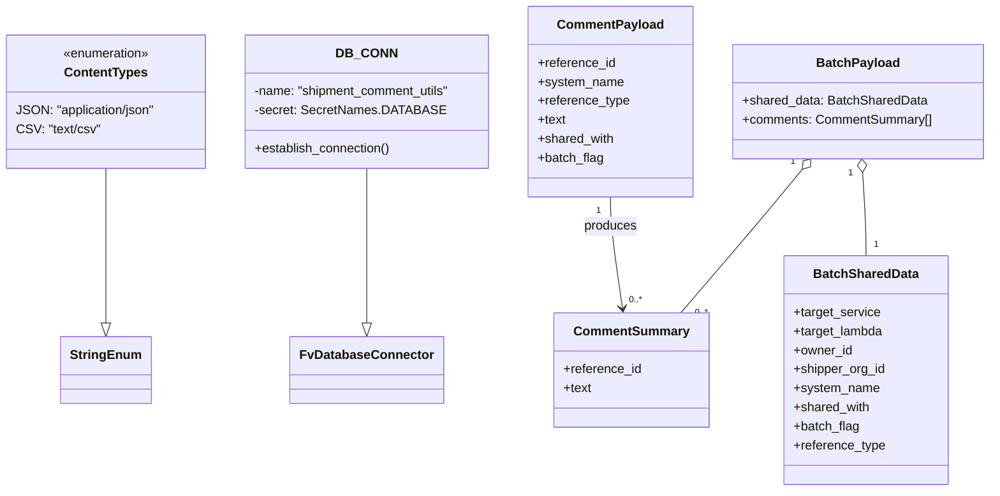

# Diagram: shipment_core/shipment_service/shipment_service/ng_shipments/comment/comment_batch_post.py


> Auto-generated by Obscura crawlers

## Diagram 1



### SVG

<svg id="container" width="1248.921875" xmlns="http://www.w3.org/2000/svg" class="classDiagram" height="618" viewBox="0 0 1248.921875 618" role="graphics-document document" aria-roledescription="class"><style>#container{font-family:"trebuchet ms",verdana,arial,sans-serif;font-size:16px;fill:#333;}@keyframes edge-animation-frame{from{stroke-dashoffset:0;}}@keyframes dash{to{stroke-dashoffset:0;}}#container .edge-animation-slow{stroke-dasharray:9,5!important;stroke-dashoffset:900;animation:dash 50s linear infinite;stroke-linecap:round;}#container .edge-animation-fast{stroke-dasharray:9,5!important;stroke-dashoffset:900;animation:dash 20s linear infinite;stroke-linecap:round;}#container .error-icon{fill:#552222;}#container .error-text{fill:#552222;stroke:#552222;}#container .edge-thickness-normal{stroke-width:1px;}#container .edge-thickness-thick{stroke-width:3.5px;}#container .edge-pattern-solid{stroke-dasharray:0;}#container .edge-thickness-invisible{stroke-width:0;fill:none;}#container .edge-pattern-dashed{stroke-dasharray:3;}#container .edge-pattern-dotted{stroke-dasharray:2;}#container .marker{fill:#333333;stroke:#333333;}#container .marker.cross{stroke:#333333;}#container svg{font-family:"trebuchet ms",verdana,arial,sans-serif;font-size:16px;}#container p{margin:0;}#container g.classGroup text{fill:#9370DB;stroke:none;font-family:"trebuchet ms",verdana,arial,sans-serif;font-size:10px;}#container g.classGroup text .title{font-weight:bolder;}#container .nodeLabel,#container .edgeLabel{color:#131300;}#container .edgeLabel .label rect{fill:#ECECFF;}#container .label text{fill:#131300;}#container .labelBkg{background:#ECECFF;}#container .edgeLabel .label span{background:#ECECFF;}#container .classTitle{font-weight:bolder;}#container .node rect,#container .node circle,#container .node ellipse,#container .node polygon,#container .node path{fill:#ECECFF;stroke:#9370DB;stroke-width:1px;}#container .divider{stroke:#9370DB;stroke-width:1;}#container g.clickable{cursor:pointer;}#container g.classGroup rect{fill:#ECECFF;stroke:#9370DB;}#container g.classGroup line{stroke:#9370DB;stroke-width:1;}#container .classLabel .box{stroke:none;stroke-width:0;fill:#ECECFF;opacity:0.5;}#container .classLabel .label{fill:#9370DB;font-size:10px;}#container .relation{stroke:#333333;stroke-width:1;fill:none;}#container .dashed-line{stroke-dasharray:3;}#container .dotted-line{stroke-dasharray:1 2;}#container #compositionStart,#container .composition{fill:#333333!important;stroke:#333333!important;stroke-width:1;}#container #compositionEnd,#container .composition{fill:#333333!important;stroke:#333333!important;stroke-width:1;}#container #dependencyStart,#container .dependency{fill:#333333!important;stroke:#333333!important;stroke-width:1;}#container #dependencyStart,#container .dependency{fill:#333333!important;stroke:#333333!important;stroke-width:1;}#container #extensionStart,#container .extension{fill:transparent!important;stroke:#333333!important;stroke-width:1;}#container #extensionEnd,#container .extension{fill:transparent!important;stroke:#333333!important;stroke-width:1;}#container #aggregationStart,#container .aggregation{fill:transparent!important;stroke:#333333!important;stroke-width:1;}#container #aggregationEnd,#container .aggregation{fill:transparent!important;stroke:#333333!important;stroke-width:1;}#container #lollipopStart,#container .lollipop{fill:#ECECFF!important;stroke:#333333!important;stroke-width:1;}#container #lollipopEnd,#container .lollipop{fill:#ECECFF!important;stroke:#333333!important;stroke-width:1;}#container .edgeTerminals{font-size:11px;line-height:initial;}#container .classTitleText{text-anchor:middle;font-size:18px;fill:#333;}#container .label-icon{display:inline-block;height:1em;overflow:visible;vertical-align:-0.125em;}#container .node .label-icon path{fill:currentColor;stroke:revert;stroke-width:revert;}#container :root{--mermaid-font-family:"trebuchet ms",verdana,arial,sans-serif;}</style><g><defs><marker id="container_class-aggregationStart" class="marker aggregation class" refX="18" refY="7" markerWidth="190" markerHeight="240" orient="auto"><path d="M 18,7 L9,13 L1,7 L9,1 Z"></path></marker></defs><defs><marker id="container_class-aggregationEnd" class="marker aggregation class" refX="1" refY="7" markerWidth="20" markerHeight="28" orient="auto"><path d="M 18,7 L9,13 L1,7 L9,1 Z"></path></marker></defs><defs><marker id="container_class-extensionStart" class="marker extension class" refX="18" refY="7" markerWidth="190" markerHeight="240" orient="auto"><path d="M 1,7 L18,13 V 1 Z"></path></marker></defs><defs><marker id="container_class-extensionEnd" class="marker extension class" refX="1" refY="7" markerWidth="20" markerHeight="28" orient="auto"><path d="M 1,1 V 13 L18,7 Z"></path></marker></defs><defs><marker id="container_class-compositionStart" class="marker composition class" refX="18" refY="7" markerWidth="190" markerHeight="240" orient="auto"><path d="M 18,7 L9,13 L1,7 L9,1 Z"></path></marker></defs><defs><marker id="container_class-compositionEnd" class="marker composition class" refX="1" refY="7" markerWidth="20" markerHeight="28" orient="auto"><path d="M 18,7 L9,13 L1,7 L9,1 Z"></path></marker></defs><defs><marker id="container_class-dependencyStart" class="marker dependency class" refX="6" refY="7" markerWidth="190" markerHeight="240" orient="auto"><path d="M 5,7 L9,13 L1,7 L9,1 Z"></path></marker></defs><defs><marker id="container_class-dependencyEnd" class="marker dependency class" refX="13" refY="7" markerWidth="20" markerHeight="28" orient="auto"><path d="M 18,7 L9,13 L14,7 L9,1 Z"></path></marker></defs><defs><marker id="container_class-lollipopStart" class="marker lollipop class" refX="13" refY="7" markerWidth="190" markerHeight="240" orient="auto"><circle stroke="black" fill="transparent" cx="7" cy="7" r="6"></circle></marker></defs><defs><marker id="container_class-lollipopEnd" class="marker lollipop class" refX="1" refY="7" markerWidth="190" markerHeight="240" orient="auto"><circle stroke="black" fill="transparent" cx="7" cy="7" r="6"></circle></marker></defs><g class="root"><g class="clusters"></g><g class="edgePaths"><path d="M136.355,212L136.355,224.167C136.355,236.333,136.355,260.667,136.355,293.125C136.355,325.583,136.355,366.167,136.355,386.458L136.355,406.75" id="id_ContentTypes_StringEnum_1" class="edge-thickness-normal edge-pattern-solid relation" style=";;;" data-edge="true" data-et="edge" data-id="id_ContentTypes_StringEnum_1" data-points="W3sieCI6MTM2LjM1NTQ2ODc1LCJ5IjoyMTJ9LHsieCI6MTM2LjM1NTQ2ODc1LCJ5IjoyODV9LHsieCI6MTM2LjM1NTQ2ODc1LCJ5Ijo0MjR9XQ==" marker-end="url(#container_class-extensionEnd)"></path><path d="M469.711,212L469.711,224.167C469.711,236.333,469.711,260.667,469.711,293.125C469.711,325.583,469.711,366.167,469.711,386.458L469.711,406.75" id="id_DB_CONN_FvDatabaseConnector_2" class="edge-thickness-normal edge-pattern-solid relation" style=";;;" data-edge="true" data-et="edge" data-id="id_DB_CONN_FvDatabaseConnector_2" data-points="W3sieCI6NDY5LjcxMDkzNzUsInkiOjIxMn0seyJ4Ijo0NjkuNzEwOTM3NSwieSI6Mjg1fSx7IngiOjQ2OS43MTA5Mzc1LCJ5Ijo0MjR9XQ==" marker-end="url(#container_class-extensionEnd)"></path><path d="M776.359,248L776.359,254.167C776.359,260.333,776.359,272.667,778.897,296.011C781.434,319.355,786.51,353.71,789.047,370.887L791.585,388.064" id="id_CommentPayload_CommentSummary_3" class="edge-thickness-normal edge-pattern-solid relation" style=";;;" data-edge="true" data-et="edge" data-id="id_CommentPayload_CommentSummary_3" data-points="W3sieCI6Nzc2LjM1OTM3NSwieSI6MjQ4fSx7IngiOjc3Ni4zNTkzNzUsInkiOjI4NX0seyJ4Ijo3OTIuNDYxNDMzODc0MzA5NCwieSI6Mzk0fV0=" marker-end="url(#container_class-dependencyEnd)"></path><path d="M1090.147,217.215L1090.867,228.513C1091.587,239.81,1093.026,262.405,1093.745,279.869C1094.465,297.333,1094.465,309.667,1094.465,315.833L1094.465,322" id="id_BatchPayload_BatchSharedData_4" class="edge-thickness-normal edge-pattern-solid relation" style=";;;" data-edge="true" data-et="edge" data-id="id_BatchPayload_BatchSharedData_4" data-points="W3sieCI6MTA4OS4wNTA4MzEwMTExNDY2LCJ5IjoyMDB9LHsieCI6MTA5NC40NjQ4NDM3NSwieSI6Mjg1fSx7IngiOjEwOTQuNDY0ODQzNzUsInkiOjMyMn1d" marker-start="url(#container_class-aggregationStart)"></path><path d="M1015.214,213.398L1005.536,225.332C995.859,237.266,976.505,261.133,951.366,291.233C926.226,321.333,895.302,357.667,879.84,375.833L864.378,394" id="id_BatchPayload_CommentSummary_5" class="edge-thickness-normal edge-pattern-solid relation" style=";;;" data-edge="true" data-et="edge" data-id="id_BatchPayload_CommentSummary_5" data-points="W3sieCI6MTAyNi4wNzg1OTc3MzA4OTE3LCJ5IjoyMDB9LHsieCI6OTU3LjE1MDM5MDYyNSwieSI6Mjg1fSx7IngiOjg2NC4zNzgzMDE5NjgyMzIsInkiOjM5NH1d" marker-start="url(#container_class-aggregationStart)"></path></g><g class="edgeLabels"><g class="edgeLabel"><g class="label" data-id="id_ContentTypes_StringEnum_1" transform="translate(0, 0)"><foreignObject width="0" height="0"><div xmlns="http://www.w3.org/1999/xhtml" class="labelBkg" style="display: table-cell; white-space: nowrap; line-height: 1.5; max-width: 200px; text-align: center;"><span class="edgeLabel"></span></div></foreignObject></g></g><g class="edgeLabel"><g class="label" data-id="id_DB_CONN_FvDatabaseConnector_2" transform="translate(0, 0)"><foreignObject width="0" height="0"><div xmlns="http://www.w3.org/1999/xhtml" class="labelBkg" style="display: table-cell; white-space: nowrap; line-height: 1.5; max-width: 200px; text-align: center;"><span class="edgeLabel"></span></div></foreignObject></g></g><g class="edgeLabel" transform="translate(776.359375, 285)"><g class="label" data-id="id_CommentPayload_CommentSummary_3" transform="translate(-33.4765625, -12)"><foreignObject width="66.953125" height="24"><div xmlns="http://www.w3.org/1999/xhtml" class="labelBkg" style="display: table-cell; white-space: nowrap; line-height: 1.5; max-width: 200px; text-align: center;"><span class="edgeLabel"><p>produces</p></span></div></foreignObject></g></g><g class="edgeLabel"><g class="label" data-id="id_BatchPayload_BatchSharedData_4" transform="translate(0, 0)"><foreignObject width="0" height="0"><div xmlns="http://www.w3.org/1999/xhtml" class="labelBkg" style="display: table-cell; white-space: nowrap; line-height: 1.5; max-width: 200px; text-align: center;"><span class="edgeLabel"></span></div></foreignObject></g></g><g class="edgeLabel"><g class="label" data-id="id_BatchPayload_CommentSummary_5" transform="translate(0, 0)"><foreignObject width="0" height="0"><div xmlns="http://www.w3.org/1999/xhtml" class="labelBkg" style="display: table-cell; white-space: nowrap; line-height: 1.5; max-width: 200px; text-align: center;"><span class="edgeLabel"></span></div></foreignObject></g></g><g class="edgeTerminals" transform="translate(761.3593775, 265.5000021428571)"><g class="inner" transform="translate(0, 0)"><foreignObject style="width: 9px; height: 12px;"><div xmlns="http://www.w3.org/1999/xhtml" style="display: inline-block; padding-right: 1px; white-space: nowrap;"><span class="edgeLabel">1</span></div></foreignObject></g></g><g class="edgeTerminals" transform="translate(1075.193560376958, 218.41809095791905)"><g class="inner" transform="translate(0, 0)"><foreignObject style="width: 9px; height: 12px;"><div xmlns="http://www.w3.org/1999/xhtml" style="display: inline-block; padding-right: 1px; white-space: nowrap;"><span class="edgeLabel">1</span></div></foreignObject></g></g><g class="edgeTerminals" transform="translate(1003.4054544721421, 204.14470374237132)"><g class="inner" transform="translate(0, 0)"><foreignObject style="width: 9px; height: 12px;"><div xmlns="http://www.w3.org/1999/xhtml" style="display: inline-block; padding-right: 1px; white-space: nowrap;"><span class="edgeLabel">1</span></div></foreignObject></g></g><g class="edgeTerminals" transform="translate(799.7429573591403, 369.49579113438665)"><g class="inner" transform="translate(0, 0)"></g><foreignObject style="width: 36px; height: 12px;"><div xmlns="http://www.w3.org/1999/xhtml" style="display: inline-block; padding-right: 1px; white-space: nowrap;"><span class="edgeLabel">0..*</span></div></foreignObject></g><g class="edgeTerminals" transform="translate(1104.464841875, 299.4999983928572)"><g class="inner" transform="translate(0, 0)"></g><foreignObject style="width: 9px; height: 12px;"><div xmlns="http://www.w3.org/1999/xhtml" style="display: inline-block; padding-right: 1px; white-space: nowrap;"><span class="edgeLabel">1</span></div></foreignObject></g><g class="edgeTerminals" transform="translate(882.1435856663114, 385.3955809224964)"><g class="inner" transform="translate(0, 0)"></g><foreignObject style="width: 36px; height: 12px;"><div xmlns="http://www.w3.org/1999/xhtml" style="display: inline-block; padding-right: 1px; white-space: nowrap;"><span class="edgeLabel">0..*</span></div></foreignObject></g></g><g class="nodes"><g class="node default" id="classId-ContentTypes-0" transform="translate(136.35546875, 128)"><g class="basic label-container"><path d="M-128.35546875 -84 L128.35546875 -84 L128.35546875 84 L-128.35546875 84" stroke="none" stroke-width="0" fill="#ECECFF" style=""></path><path d="M-128.35546875 -84 C-27.9434575801275 -84, 72.468553589745 -84, 128.35546875 -84 M-128.35546875 -84 C-28.79061227708597 -84, 70.77424419582806 -84, 128.35546875 -84 M128.35546875 -84 C128.35546875 -25.469205807572543, 128.35546875 33.061588384854915, 128.35546875 84 M128.35546875 -84 C128.35546875 -19.010330546249634, 128.35546875 45.97933890750073, 128.35546875 84 M128.35546875 84 C26.31558279138963 84, -75.72430316722074 84, -128.35546875 84 M128.35546875 84 C31.571571000582296 84, -65.21232674883541 84, -128.35546875 84 M-128.35546875 84 C-128.35546875 29.10779682919003, -128.35546875 -25.784406341619942, -128.35546875 -84 M-128.35546875 84 C-128.35546875 30.62752921951597, -128.35546875 -22.74494156096806, -128.35546875 -84" stroke="#9370DB" stroke-width="1.3" fill="none" stroke-dasharray="0 0" style=""></path></g><g class="annotation-group text" transform="translate(-55.5546875, -60)"><g class="label" style="" transform="translate(0,-12)"><foreignObject width="111.109375" height="24"><div xmlns="http://www.w3.org/1999/xhtml" style="display: table-cell; white-space: nowrap; line-height: 1.5; max-width: 161px; text-align: center;"><span class="nodeLabel markdown-node-label" style=""><p>«enumeration»</p></span></div></foreignObject></g></g><g class="label-group text" transform="translate(-49.9921875, -36)"><g class="label" style="font-weight: bolder" transform="translate(0,-12)"><foreignObject width="99.984375" height="24"><div xmlns="http://www.w3.org/1999/xhtml" style="display: table-cell; white-space: nowrap; line-height: 1.5; max-width: 148px; text-align: center;"><span class="nodeLabel markdown-node-label" style=""><p>ContentTypes</p></span></div></foreignObject></g></g><g class="members-group text" transform="translate(-116.35546875, 12)"><g class="label" style="" transform="translate(0,-12)"><foreignObject width="177.15625" height="24"><div xmlns="http://www.w3.org/1999/xhtml" style="display: table-cell; white-space: nowrap; line-height: 1.5; max-width: 227px; text-align: center;"><span class="nodeLabel markdown-node-label" style=""><p>JSON: "application/json"</p></span></div></foreignObject></g><g class="label" style="" transform="translate(0,12)"><foreignObject width="104.84375" height="24"><div xmlns="http://www.w3.org/1999/xhtml" style="display: table-cell; white-space: nowrap; line-height: 1.5; max-width: 155px; text-align: center;"><span class="nodeLabel markdown-node-label" style=""><p>CSV: "text/csv"</p></span></div></foreignObject></g></g><g class="methods-group text" transform="translate(-116.35546875, 84)"></g><g class="divider" style=""><path d="M-128.35546875 -12 C-42.46264107587933 -12, 43.430186598241335 -12, 128.35546875 -12 M-128.35546875 -12 C-48.015307178185395 -12, 32.32485439362921 -12, 128.35546875 -12" stroke="#9370DB" stroke-width="1.3" fill="none" stroke-dasharray="0 0" style=""></path></g><g class="divider" style=""><path d="M-128.35546875 60 C-32.9877258679692 60, 62.38001701406159 60, 128.35546875 60 M-128.35546875 60 C-60.940505866826285 60, 6.474457016347429 60, 128.35546875 60" stroke="#9370DB" stroke-width="1.3" fill="none" stroke-dasharray="0 0" style=""></path></g></g><g class="node default" id="classId-FvDatabaseConnector-1" transform="translate(469.7109375, 466)"><g class="basic label-container"><path d="M-91.3046875 -42 L91.3046875 -42 L91.3046875 42 L-91.3046875 42" stroke="none" stroke-width="0" fill="#ECECFF" style=""></path><path d="M-91.3046875 -42 C-22.867623622999375 -42, 45.56944025400125 -42, 91.3046875 -42 M-91.3046875 -42 C-34.24087919685386 -42, 22.82292910629228 -42, 91.3046875 -42 M91.3046875 -42 C91.3046875 -12.424541202892698, 91.3046875 17.150917594214604, 91.3046875 42 M91.3046875 -42 C91.3046875 -16.294397518968683, 91.3046875 9.411204962062634, 91.3046875 42 M91.3046875 42 C36.909350109925086 42, -17.48598728014983 42, -91.3046875 42 M91.3046875 42 C54.01759115953897 42, 16.730494819077947 42, -91.3046875 42 M-91.3046875 42 C-91.3046875 14.352712510330363, -91.3046875 -13.294574979339274, -91.3046875 -42 M-91.3046875 42 C-91.3046875 25.19835045162725, -91.3046875 8.396700903254498, -91.3046875 -42" stroke="#9370DB" stroke-width="1.3" fill="none" stroke-dasharray="0 0" style=""></path></g><g class="annotation-group text" transform="translate(0, -18)"></g><g class="label-group text" transform="translate(-79.3046875, -18)"><g class="label" style="font-weight: bolder" transform="translate(0,-12)"><foreignObject width="158.609375" height="24"><div xmlns="http://www.w3.org/1999/xhtml" style="display: table-cell; white-space: nowrap; line-height: 1.5; max-width: 207px; text-align: center;"><span class="nodeLabel markdown-node-label" style=""><p>FvDatabaseConnector</p></span></div></foreignObject></g></g><g class="members-group text" transform="translate(-79.3046875, 30)"></g><g class="methods-group text" transform="translate(-79.3046875, 60)"></g><g class="divider" style=""><path d="M-91.3046875 6 C-22.910352772216655 6, 45.48398195556669 6, 91.3046875 6 M-91.3046875 6 C-38.740519127111675 6, 13.82364924577665 6, 91.3046875 6" stroke="#9370DB" stroke-width="1.3" fill="none" stroke-dasharray="0 0" style=""></path></g><g class="divider" style=""><path d="M-91.3046875 24 C-25.188031648045424 24, 40.92862420390915 24, 91.3046875 24 M-91.3046875 24 C-27.05813932950437 24, 37.18840884099126 24, 91.3046875 24" stroke="#9370DB" stroke-width="1.3" fill="none" stroke-dasharray="0 0" style=""></path></g></g><g class="node default" id="classId-DB_CONN-2" transform="translate(469.7109375, 128)"><g class="basic label-container"><path d="M-155 -84 L155 -84 L155 84 L-155 84" stroke="none" stroke-width="0" fill="#ECECFF" style=""></path><path d="M-155 -84 C-65.51147527647959 -84, 23.977049447040827 -84, 155 -84 M-155 -84 C-80.32794934266363 -84, -5.655898685327259 -84, 155 -84 M155 -84 C155 -38.14520497251967, 155 7.709590054960657, 155 84 M155 -84 C155 -24.410046816132677, 155 35.179906367734645, 155 84 M155 84 C46.217615872225025 84, -62.56476825554995 84, -155 84 M155 84 C79.97578528573719 84, 4.951570571474377 84, -155 84 M-155 84 C-155 22.389427464538194, -155 -39.22114507092361, -155 -84 M-155 84 C-155 22.88729855800903, -155 -38.22540288398194, -155 -84" stroke="#9370DB" stroke-width="1.3" fill="none" stroke-dasharray="0 0" style=""></path></g><g class="annotation-group text" transform="translate(0, -60)"></g><g class="label-group text" transform="translate(-34.40625, -60)"><g class="label" style="font-weight: bolder" transform="translate(0,-12)"><foreignObject width="68.8125" height="24"><div xmlns="http://www.w3.org/1999/xhtml" style="display: table-cell; white-space: nowrap; line-height: 1.5; max-width: 119px; text-align: center;"><span class="nodeLabel markdown-node-label" style=""><p>DB_CONN</p></span></div></foreignObject></g></g><g class="members-group text" transform="translate(-143, -12)"><g class="label" style="" transform="translate(0,-12)"><foreignObject width="251.59375" height="24"><div xmlns="http://www.w3.org/1999/xhtml" style="display: table-cell; white-space: nowrap; line-height: 1.5; max-width: 309px; text-align: center;"><span class="nodeLabel markdown-node-label" style=""><p>-name: "shipment_comment_utils"</p></span></div></foreignObject></g><g class="label" style="" transform="translate(0,12)"><foreignObject width="228.53125" height="24"><div xmlns="http://www.w3.org/1999/xhtml" style="display: table-cell; white-space: nowrap; line-height: 1.5; max-width: 286px; text-align: center;"><span class="nodeLabel markdown-node-label" style=""><p>-secret: SecretNames.DATABASE</p></span></div></foreignObject></g></g><g class="methods-group text" transform="translate(-143, 60)"><g class="label" style="" transform="translate(0,-12)"><foreignObject width="173.265625" height="24"><div xmlns="http://www.w3.org/1999/xhtml" style="display: table-cell; white-space: nowrap; line-height: 1.5; max-width: 231px; text-align: center;"><span class="nodeLabel markdown-node-label" style=""><p>+establish_connection()</p></span></div></foreignObject></g></g><g class="divider" style=""><path d="M-155 -36 C-68.75907842910719 -36, 17.481843141785617 -36, 155 -36 M-155 -36 C-48.546987533758724 -36, 57.90602493248255 -36, 155 -36" stroke="#9370DB" stroke-width="1.3" fill="none" stroke-dasharray="0 0" style=""></path></g><g class="divider" style=""><path d="M-155 36 C-74.83783522745753 36, 5.324329545084936 36, 155 36 M-155 36 C-88.06401844041224 36, -21.12803688082448 36, 155 36" stroke="#9370DB" stroke-width="1.3" fill="none" stroke-dasharray="0 0" style=""></path></g></g><g class="node default" id="classId-CommentPayload-3" transform="translate(776.359375, 128)"><g class="basic label-container"><path d="M-101.6484375 -120 L101.6484375 -120 L101.6484375 120 L-101.6484375 120" stroke="none" stroke-width="0" fill="#ECECFF" style=""></path><path d="M-101.6484375 -120 C-42.3957203333813 -120, 16.856996833237403 -120, 101.6484375 -120 M-101.6484375 -120 C-30.544421417865777 -120, 40.559594664268445 -120, 101.6484375 -120 M101.6484375 -120 C101.6484375 -41.79471193436777, 101.6484375 36.41057613126446, 101.6484375 120 M101.6484375 -120 C101.6484375 -69.54411495139922, 101.6484375 -19.08822990279846, 101.6484375 120 M101.6484375 120 C32.2005027573456 120, -37.24743198530879 120, -101.6484375 120 M101.6484375 120 C32.2553967893313 120, -37.1376439213374 120, -101.6484375 120 M-101.6484375 120 C-101.6484375 67.39643991970175, -101.6484375 14.792879839403497, -101.6484375 -120 M-101.6484375 120 C-101.6484375 30.189241608367695, -101.6484375 -59.62151678326461, -101.6484375 -120" stroke="#9370DB" stroke-width="1.3" fill="none" stroke-dasharray="0 0" style=""></path></g><g class="annotation-group text" transform="translate(0, -96)"></g><g class="label-group text" transform="translate(-63.65625, -96)"><g class="label" style="font-weight: bolder" transform="translate(0,-12)"><foreignObject width="127.3125" height="24"><div xmlns="http://www.w3.org/1999/xhtml" style="display: table-cell; white-space: nowrap; line-height: 1.5; max-width: 176px; text-align: center;"><span class="nodeLabel markdown-node-label" style=""><p>CommentPayload</p></span></div></foreignObject></g></g><g class="members-group text" transform="translate(-89.6484375, -48)"><g class="label" style="" transform="translate(0,-12)"><foreignObject width="98.25" height="24"><div xmlns="http://www.w3.org/1999/xhtml" style="display: table-cell; white-space: nowrap; line-height: 1.5; max-width: 156px; text-align: center;"><span class="nodeLabel markdown-node-label" style=""><p>+reference_id</p></span></div></foreignObject></g><g class="label" style="" transform="translate(0,12)"><foreignObject width="107.21875" height="24"><div xmlns="http://www.w3.org/1999/xhtml" style="display: table-cell; white-space: nowrap; line-height: 1.5; max-width: 165px; text-align: center;"><span class="nodeLabel markdown-node-label" style=""><p>+system_name</p></span></div></foreignObject></g><g class="label" style="" transform="translate(0,36)"><foreignObject width="115.640625" height="24"><div xmlns="http://www.w3.org/1999/xhtml" style="display: table-cell; white-space: nowrap; line-height: 1.5; max-width: 173px; text-align: center;"><span class="nodeLabel markdown-node-label" style=""><p>+reference_type</p></span></div></foreignObject></g><g class="label" style="" transform="translate(0,60)"><foreignObject width="35.5625" height="24"><div xmlns="http://www.w3.org/1999/xhtml" style="display: table-cell; white-space: nowrap; line-height: 1.5; max-width: 93px; text-align: center;"><span class="nodeLabel markdown-node-label" style=""><p>+text</p></span></div></foreignObject></g><g class="label" style="" transform="translate(0,84)"><foreignObject width="96.65625" height="24"><div xmlns="http://www.w3.org/1999/xhtml" style="display: table-cell; white-space: nowrap; line-height: 1.5; max-width: 154px; text-align: center;"><span class="nodeLabel markdown-node-label" style=""><p>+shared_with</p></span></div></foreignObject></g><g class="label" style="" transform="translate(0,108)"><foreignObject width="82.859375" height="24"><div xmlns="http://www.w3.org/1999/xhtml" style="display: table-cell; white-space: nowrap; line-height: 1.5; max-width: 141px; text-align: center;"><span class="nodeLabel markdown-node-label" style=""><p>+batch_flag</p></span></div></foreignObject></g></g><g class="methods-group text" transform="translate(-89.6484375, 120)"></g><g class="divider" style=""><path d="M-101.6484375 -72 C-52.461325866561445 -72, -3.2742142331228905 -72, 101.6484375 -72 M-101.6484375 -72 C-27.04417652284789 -72, 47.56008445430422 -72, 101.6484375 -72" stroke="#9370DB" stroke-width="1.3" fill="none" stroke-dasharray="0 0" style=""></path></g><g class="divider" style=""><path d="M-101.6484375 96 C-48.821292128223156 96, 4.0058532435536875 96, 101.6484375 96 M-101.6484375 96 C-30.879994180043226 96, 39.88844913991355 96, 101.6484375 96" stroke="#9370DB" stroke-width="1.3" fill="none" stroke-dasharray="0 0" style=""></path></g></g><g class="node default" id="classId-BatchSharedData-4" transform="translate(1094.46484375, 466)"><g class="basic label-container"><path d="M-101.70703125 -144 L101.70703125 -144 L101.70703125 144 L-101.70703125 144" stroke="none" stroke-width="0" fill="#ECECFF" style=""></path><path d="M-101.70703125 -144 C-33.184743746277036 -144, 35.33754375744593 -144, 101.70703125 -144 M-101.70703125 -144 C-55.29456695545826 -144, -8.882102660916516 -144, 101.70703125 -144 M101.70703125 -144 C101.70703125 -59.447571397226056, 101.70703125 25.104857205547887, 101.70703125 144 M101.70703125 -144 C101.70703125 -49.20408304541331, 101.70703125 45.591833909173374, 101.70703125 144 M101.70703125 144 C32.2746474804634 144, -37.1577362890732 144, -101.70703125 144 M101.70703125 144 C49.06863215609965 144, -3.5697669378006935 144, -101.70703125 144 M-101.70703125 144 C-101.70703125 33.94797500956733, -101.70703125 -76.10404998086534, -101.70703125 -144 M-101.70703125 144 C-101.70703125 76.38814645459374, -101.70703125 8.776292909187475, -101.70703125 -144" stroke="#9370DB" stroke-width="1.3" fill="none" stroke-dasharray="0 0" style=""></path></g><g class="annotation-group text" transform="translate(0, -120)"></g><g class="label-group text" transform="translate(-63.3671875, -120)"><g class="label" style="font-weight: bolder" transform="translate(0,-12)"><foreignObject width="126.734375" height="24"><div xmlns="http://www.w3.org/1999/xhtml" style="display: table-cell; white-space: nowrap; line-height: 1.5; max-width: 175px; text-align: center;"><span class="nodeLabel markdown-node-label" style=""><p>BatchSharedData</p></span></div></foreignObject></g></g><g class="members-group text" transform="translate(-89.70703125, -72)"><g class="label" style="" transform="translate(0,-12)"><foreignObject width="109.890625" height="24"><div xmlns="http://www.w3.org/1999/xhtml" style="display: table-cell; white-space: nowrap; line-height: 1.5; max-width: 167px; text-align: center;"><span class="nodeLabel markdown-node-label" style=""><p>+target_service</p></span></div></foreignObject></g><g class="label" style="" transform="translate(0,12)"><foreignObject width="113.734375" height="24"><div xmlns="http://www.w3.org/1999/xhtml" style="display: table-cell; white-space: nowrap; line-height: 1.5; max-width: 171px; text-align: center;"><span class="nodeLabel markdown-node-label" style=""><p>+target_lambda</p></span></div></foreignObject></g><g class="label" style="" transform="translate(0,36)"><foreignObject width="74.203125" height="24"><div xmlns="http://www.w3.org/1999/xhtml" style="display: table-cell; white-space: nowrap; line-height: 1.5; max-width: 132px; text-align: center;"><span class="nodeLabel markdown-node-label" style=""><p>+owner_id</p></span></div></foreignObject></g><g class="label" style="" transform="translate(0,60)"><foreignObject width="116.046875" height="24"><div xmlns="http://www.w3.org/1999/xhtml" style="display: table-cell; white-space: nowrap; line-height: 1.5; max-width: 173px; text-align: center;"><span class="nodeLabel markdown-node-label" style=""><p>+shipper_org_id</p></span></div></foreignObject></g><g class="label" style="" transform="translate(0,84)"><foreignObject width="107.21875" height="24"><div xmlns="http://www.w3.org/1999/xhtml" style="display: table-cell; white-space: nowrap; line-height: 1.5; max-width: 165px; text-align: center;"><span class="nodeLabel markdown-node-label" style=""><p>+system_name</p></span></div></foreignObject></g><g class="label" style="" transform="translate(0,108)"><foreignObject width="96.65625" height="24"><div xmlns="http://www.w3.org/1999/xhtml" style="display: table-cell; white-space: nowrap; line-height: 1.5; max-width: 154px; text-align: center;"><span class="nodeLabel markdown-node-label" style=""><p>+shared_with</p></span></div></foreignObject></g><g class="label" style="" transform="translate(0,132)"><foreignObject width="82.859375" height="24"><div xmlns="http://www.w3.org/1999/xhtml" style="display: table-cell; white-space: nowrap; line-height: 1.5; max-width: 141px; text-align: center;"><span class="nodeLabel markdown-node-label" style=""><p>+batch_flag</p></span></div></foreignObject></g><g class="label" style="" transform="translate(0,156)"><foreignObject width="115.640625" height="24"><div xmlns="http://www.w3.org/1999/xhtml" style="display: table-cell; white-space: nowrap; line-height: 1.5; max-width: 173px; text-align: center;"><span class="nodeLabel markdown-node-label" style=""><p>+reference_type</p></span></div></foreignObject></g></g><g class="methods-group text" transform="translate(-89.70703125, 144)"></g><g class="divider" style=""><path d="M-101.70703125 -96 C-49.50337534667231 -96, 2.700280556655386 -96, 101.70703125 -96 M-101.70703125 -96 C-33.33154219390531 -96, 35.04394686218939 -96, 101.70703125 -96" stroke="#9370DB" stroke-width="1.3" fill="none" stroke-dasharray="0 0" style=""></path></g><g class="divider" style=""><path d="M-101.70703125 120 C-29.14050262966319 120, 43.42602599067362 120, 101.70703125 120 M-101.70703125 120 C-26.66055632539036 120, 48.38591859921928 120, 101.70703125 120" stroke="#9370DB" stroke-width="1.3" fill="none" stroke-dasharray="0 0" style=""></path></g></g><g class="node default" id="classId-BatchPayload-5" transform="translate(1084.46484375, 128)"><g class="basic label-container"><path d="M-156.45703125 -72 L156.45703125 -72 L156.45703125 72 L-156.45703125 72" stroke="none" stroke-width="0" fill="#ECECFF" style=""></path><path d="M-156.45703125 -72 C-46.417121953217816 -72, 63.62278734356437 -72, 156.45703125 -72 M-156.45703125 -72 C-35.52401024379874 -72, 85.40901076240252 -72, 156.45703125 -72 M156.45703125 -72 C156.45703125 -20.536386119669274, 156.45703125 30.927227760661452, 156.45703125 72 M156.45703125 -72 C156.45703125 -42.05065567905608, 156.45703125 -12.101311358112156, 156.45703125 72 M156.45703125 72 C64.85838006027214 72, -26.74027112945572 72, -156.45703125 72 M156.45703125 72 C91.53330055263167 72, 26.609569855263345 72, -156.45703125 72 M-156.45703125 72 C-156.45703125 27.630794127547503, -156.45703125 -16.738411744904994, -156.45703125 -72 M-156.45703125 72 C-156.45703125 40.158307231689726, -156.45703125 8.316614463379452, -156.45703125 -72" stroke="#9370DB" stroke-width="1.3" fill="none" stroke-dasharray="0 0" style=""></path></g><g class="annotation-group text" transform="translate(0, -48)"></g><g class="label-group text" transform="translate(-49.6171875, -48)"><g class="label" style="font-weight: bolder" transform="translate(0,-12)"><foreignObject width="99.234375" height="24"><div xmlns="http://www.w3.org/1999/xhtml" style="display: table-cell; white-space: nowrap; line-height: 1.5; max-width: 148px; text-align: center;"><span class="nodeLabel markdown-node-label" style=""><p>BatchPayload</p></span></div></foreignObject></g></g><g class="members-group text" transform="translate(-144.45703125, 0)"><g class="label" style="" transform="translate(0,-12)"><foreignObject width="231.234375" height="24"><div xmlns="http://www.w3.org/1999/xhtml" style="display: table-cell; white-space: nowrap; line-height: 1.5; max-width: 289px; text-align: center;"><span class="nodeLabel markdown-node-label" style=""><p>+shared_data: BatchSharedData</p></span></div></foreignObject></g><g class="label" style="" transform="translate(0,12)"><foreignObject width="239.296875" height="24"><div xmlns="http://www.w3.org/1999/xhtml" style="display: table-cell; white-space: nowrap; line-height: 1.5; max-width: 297px; text-align: center;"><span class="nodeLabel markdown-node-label" style=""><p>+comments: CommentSummary[]</p></span></div></foreignObject></g></g><g class="methods-group text" transform="translate(-144.45703125, 72)"></g><g class="divider" style=""><path d="M-156.45703125 -24 C-32.549366304756106 -24, 91.35829864048779 -24, 156.45703125 -24 M-156.45703125 -24 C-57.70023437197993 -24, 41.05656250604014 -24, 156.45703125 -24" stroke="#9370DB" stroke-width="1.3" fill="none" stroke-dasharray="0 0" style=""></path></g><g class="divider" style=""><path d="M-156.45703125 48 C-69.16142519745716 48, 18.134180855085674 48, 156.45703125 48 M-156.45703125 48 C-62.00076778457125 48, 32.455495680857496 48, 156.45703125 48" stroke="#9370DB" stroke-width="1.3" fill="none" stroke-dasharray="0 0" style=""></path></g></g><g class="node default" id="classId-CommentSummary-6" transform="translate(803.09765625, 466)"><g class="basic label-container"><path d="M-95.70703125 -72 L95.70703125 -72 L95.70703125 72 L-95.70703125 72" stroke="none" stroke-width="0" fill="#ECECFF" style=""></path><path d="M-95.70703125 -72 C-49.427985541926525 -72, -3.148939833853049 -72, 95.70703125 -72 M-95.70703125 -72 C-27.643243619417305 -72, 40.42054401116539 -72, 95.70703125 -72 M95.70703125 -72 C95.70703125 -30.08587532575867, 95.70703125 11.828249348482657, 95.70703125 72 M95.70703125 -72 C95.70703125 -19.889438200034675, 95.70703125 32.22112359993065, 95.70703125 72 M95.70703125 72 C36.52751248330766 72, -22.65200628338468 72, -95.70703125 72 M95.70703125 72 C54.46737692322732 72, 13.22772259645464 72, -95.70703125 72 M-95.70703125 72 C-95.70703125 22.148893303267116, -95.70703125 -27.70221339346577, -95.70703125 -72 M-95.70703125 72 C-95.70703125 14.77584270019102, -95.70703125 -42.44831459961796, -95.70703125 -72" stroke="#9370DB" stroke-width="1.3" fill="none" stroke-dasharray="0 0" style=""></path></g><g class="annotation-group text" transform="translate(0, -48)"></g><g class="label-group text" transform="translate(-69.1640625, -48)"><g class="label" style="font-weight: bolder" transform="translate(0,-12)"><foreignObject width="138.328125" height="24"><div xmlns="http://www.w3.org/1999/xhtml" style="display: table-cell; white-space: nowrap; line-height: 1.5; max-width: 188px; text-align: center;"><span class="nodeLabel markdown-node-label" style=""><p>CommentSummary</p></span></div></foreignObject></g></g><g class="members-group text" transform="translate(-83.70703125, 0)"><g class="label" style="" transform="translate(0,-12)"><foreignObject width="98.25" height="24"><div xmlns="http://www.w3.org/1999/xhtml" style="display: table-cell; white-space: nowrap; line-height: 1.5; max-width: 156px; text-align: center;"><span class="nodeLabel markdown-node-label" style=""><p>+reference_id</p></span></div></foreignObject></g><g class="label" style="" transform="translate(0,12)"><foreignObject width="35.5625" height="24"><div xmlns="http://www.w3.org/1999/xhtml" style="display: table-cell; white-space: nowrap; line-height: 1.5; max-width: 93px; text-align: center;"><span class="nodeLabel markdown-node-label" style=""><p>+text</p></span></div></foreignObject></g></g><g class="methods-group text" transform="translate(-83.70703125, 72)"></g><g class="divider" style=""><path d="M-95.70703125 -24 C-24.516115227411973 -24, 46.674800795176054 -24, 95.70703125 -24 M-95.70703125 -24 C-21.60853701296216 -24, 52.48995722407568 -24, 95.70703125 -24" stroke="#9370DB" stroke-width="1.3" fill="none" stroke-dasharray="0 0" style=""></path></g><g class="divider" style=""><path d="M-95.70703125 48 C-25.38332635217789 48, 44.94037854564422 48, 95.70703125 48 M-95.70703125 48 C-35.29107501382666 48, 25.124881222346687 48, 95.70703125 48" stroke="#9370DB" stroke-width="1.3" fill="none" stroke-dasharray="0 0" style=""></path></g></g><g class="node default" id="classId-StringEnum-7" transform="translate(136.35546875, 466)"><g class="basic label-container"><path d="M-54.234375 -42 L54.234375 -42 L54.234375 42 L-54.234375 42" stroke="none" stroke-width="0" fill="#ECECFF" style=""></path><path d="M-54.234375 -42 C-17.28190948995963 -42, 19.67055602008074 -42, 54.234375 -42 M-54.234375 -42 C-22.121613262233424 -42, 9.991148475533151 -42, 54.234375 -42 M54.234375 -42 C54.234375 -11.54241048168257, 54.234375 18.91517903663486, 54.234375 42 M54.234375 -42 C54.234375 -10.03927054998342, 54.234375 21.92145890003316, 54.234375 42 M54.234375 42 C31.006540747521314 42, 7.778706495042627 42, -54.234375 42 M54.234375 42 C29.407569388972075 42, 4.580763777944149 42, -54.234375 42 M-54.234375 42 C-54.234375 21.153484197321227, -54.234375 0.3069683946424533, -54.234375 -42 M-54.234375 42 C-54.234375 20.708699458226057, -54.234375 -0.5826010835478854, -54.234375 -42" stroke="#9370DB" stroke-width="1.3" fill="none" stroke-dasharray="0 0" style=""></path></g><g class="annotation-group text" transform="translate(0, -18)"></g><g class="label-group text" transform="translate(-42.234375, -18)"><g class="label" style="font-weight: bolder" transform="translate(0,-12)"><foreignObject width="84.46875" height="24"><div xmlns="http://www.w3.org/1999/xhtml" style="display: table-cell; white-space: nowrap; line-height: 1.5; max-width: 134px; text-align: center;"><span class="nodeLabel markdown-node-label" style=""><p>StringEnum</p></span></div></foreignObject></g></g><g class="members-group text" transform="translate(-42.234375, 30)"></g><g class="methods-group text" transform="translate(-42.234375, 60)"></g><g class="divider" style=""><path d="M-54.234375 6 C-27.622013187466436 6, -1.0096513749328722 6, 54.234375 6 M-54.234375 6 C-16.969356070661185 6, 20.29566285867763 6, 54.234375 6" stroke="#9370DB" stroke-width="1.3" fill="none" stroke-dasharray="0 0" style=""></path></g><g class="divider" style=""><path d="M-54.234375 24 C-25.19420111584902 24, 3.845972768301962 24, 54.234375 24 M-54.234375 24 C-15.029146187840531 24, 24.176082624318937 24, 54.234375 24" stroke="#9370DB" stroke-width="1.3" fill="none" stroke-dasharray="0 0" style=""></path></g></g></g></g></g></svg>

## Diagram 2

```mermaid
flowchart TD
    A[lambda_handler(event, context, audit_refs)] --> B[DB_CONN.establish_connection()]
    B --> C[get content-type header]
    C --> D[auth.get_organization_id(event)]
    D --> E{content_type in [JSON, CSV]?}
    E -- No --> ErrInvalid[raise BadRequestError -> make_error_response]
    E -- Yes --> F[validate_batch_payload(event, content_type)]
    F --> G{content_type == JSON}
    G -- Yes --> H[get_event_body(event) -> external_ids, parse_comments_from_json]
    G -- No --> I[parse_comments_from_csv(event) -> comments]
    H --> J[get_batch_comment_payloads(comments, owner_id, shipper_org_id)]
    I --> J
    J --> K[shared_message = len(payloads[0].shared_data.shared_with)]
    K --> L{shared_message is not None and > 0}
    L -- True --> M[invoke_post_batch_message_lambda(event, payloads, group_id)]
    L -- False --> N[invoke_post_batch_message_lambda(event, payloads, group_id=None)]
    M --> O[make_response ACCEPTED with batch_group_id]
    N --> O
    O --> Z[Return success response]
    F ---|exception| ErrHandle[make_error_response -> Return error]
```

> SVG rendering failed for this diagram.
