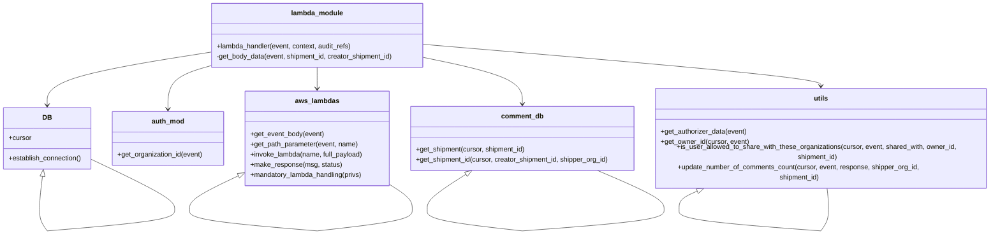

# Diagram: shipment_core/shipment_service/shipment_service/ng_shipments/comment/comment_post.py


> Auto-generated by Obscura crawlers

## Diagram 1

```mermaid
flowchart TD
    API_POST[POST /shipments/{shipment_id}/comment/] --> LH(lambda_handler)
    LH --> DB[DB_CONN.establish_connection()]
    LH --> parse[get_path_parameter(event, "shipment_id") / get_event_body(event)]
    parse --> checkBatch{data.batch_flag?}
    checkBatch -->|yes| batchOwner[get_path_parameter(owner_id) & shipper_org_id]
    batchOwner --> getCreator[creator_shipment_id = shipment_id]
    getCreator --> getInternal[shipment_id = get_shipment_id(DB_CONN.cursor, creator_shipment_id, shipper_org_id)]
    checkBatch -->|no| normalOwner[owner_id = auth.get_organization_id(event)]
    normalOwner --> shipperOrg[shipper_org_id = get_owner_id(DB_CONN.cursor, event)]
    normalOwner --> getCreatorFromShipment[creator_shipment_id = get_shipment(DB_CONN.cursor, shipment_id).creator_shipment_id]
    getInternal --> buildBody
    getCreatorFromShipment --> buildBody
    buildBody[get_body_data(event, shipment_id, creator_shipment_id)] --> shareCheck[is_user_allowed_to_share_with_these_organizations(...)?]
    shareCheck -->|no| badResp[make_response(MESSAGE_ERROR_USER_NOT_ALLOWED_TO_SHARE, 400)]
    shareCheck -->|yes| payload[prepare payload for comment_post]
    payload --> invoke[invoke_lambda("comment_post", full_payload=payload)]
    invoke --> update[update_number_of_comments_count(DB_CONN.cursor, event, response, shipper_org_id, shipment_id)]
    update --> returnResp[return response]
```

> SVG rendering failed for this diagram.

## Diagram 2



### SVG

<svg id="container" width="2356.8671875" xmlns="http://www.w3.org/2000/svg" class="classDiagram" height="538.25" viewBox="0 0 2356.8671875 538.25" role="graphics-document document" aria-roledescription="class"><style>#container{font-family:"trebuchet ms",verdana,arial,sans-serif;font-size:16px;fill:#333;}@keyframes edge-animation-frame{from{stroke-dashoffset:0;}}@keyframes dash{to{stroke-dashoffset:0;}}#container .edge-animation-slow{stroke-dasharray:9,5!important;stroke-dashoffset:900;animation:dash 50s linear infinite;stroke-linecap:round;}#container .edge-animation-fast{stroke-dasharray:9,5!important;stroke-dashoffset:900;animation:dash 20s linear infinite;stroke-linecap:round;}#container .error-icon{fill:#552222;}#container .error-text{fill:#552222;stroke:#552222;}#container .edge-thickness-normal{stroke-width:1px;}#container .edge-thickness-thick{stroke-width:3.5px;}#container .edge-pattern-solid{stroke-dasharray:0;}#container .edge-thickness-invisible{stroke-width:0;fill:none;}#container .edge-pattern-dashed{stroke-dasharray:3;}#container .edge-pattern-dotted{stroke-dasharray:2;}#container .marker{fill:#333333;stroke:#333333;}#container .marker.cross{stroke:#333333;}#container svg{font-family:"trebuchet ms",verdana,arial,sans-serif;font-size:16px;}#container p{margin:0;}#container g.classGroup text{fill:#9370DB;stroke:none;font-family:"trebuchet ms",verdana,arial,sans-serif;font-size:10px;}#container g.classGroup text .title{font-weight:bolder;}#container .nodeLabel,#container .edgeLabel{color:#131300;}#container .edgeLabel .label rect{fill:#ECECFF;}#container .label text{fill:#131300;}#container .labelBkg{background:#ECECFF;}#container .edgeLabel .label span{background:#ECECFF;}#container .classTitle{font-weight:bolder;}#container .node rect,#container .node circle,#container .node ellipse,#container .node polygon,#container .node path{fill:#ECECFF;stroke:#9370DB;stroke-width:1px;}#container .divider{stroke:#9370DB;stroke-width:1;}#container g.clickable{cursor:pointer;}#container g.classGroup rect{fill:#ECECFF;stroke:#9370DB;}#container g.classGroup line{stroke:#9370DB;stroke-width:1;}#container .classLabel .box{stroke:none;stroke-width:0;fill:#ECECFF;opacity:0.5;}#container .classLabel .label{fill:#9370DB;font-size:10px;}#container .relation{stroke:#333333;stroke-width:1;fill:none;}#container .dashed-line{stroke-dasharray:3;}#container .dotted-line{stroke-dasharray:1 2;}#container #compositionStart,#container .composition{fill:#333333!important;stroke:#333333!important;stroke-width:1;}#container #compositionEnd,#container .composition{fill:#333333!important;stroke:#333333!important;stroke-width:1;}#container #dependencyStart,#container .dependency{fill:#333333!important;stroke:#333333!important;stroke-width:1;}#container #dependencyStart,#container .dependency{fill:#333333!important;stroke:#333333!important;stroke-width:1;}#container #extensionStart,#container .extension{fill:transparent!important;stroke:#333333!important;stroke-width:1;}#container #extensionEnd,#container .extension{fill:transparent!important;stroke:#333333!important;stroke-width:1;}#container #aggregationStart,#container .aggregation{fill:transparent!important;stroke:#333333!important;stroke-width:1;}#container #aggregationEnd,#container .aggregation{fill:transparent!important;stroke:#333333!important;stroke-width:1;}#container #lollipopStart,#container .lollipop{fill:#ECECFF!important;stroke:#333333!important;stroke-width:1;}#container #lollipopEnd,#container .lollipop{fill:#ECECFF!important;stroke:#333333!important;stroke-width:1;}#container .edgeTerminals{font-size:11px;line-height:initial;}#container .classTitleText{text-anchor:middle;font-size:18px;fill:#333;}#container .label-icon{display:inline-block;height:1em;overflow:visible;vertical-align:-0.125em;}#container .node .label-icon path{fill:currentColor;stroke:revert;stroke-width:revert;}#container :root{--mermaid-font-family:"trebuchet ms",verdana,arial,sans-serif;}</style><g><defs><marker id="container_class-aggregationStart" class="marker aggregation class" refX="18" refY="7" markerWidth="190" markerHeight="240" orient="auto"><path d="M 18,7 L9,13 L1,7 L9,1 Z"></path></marker></defs><defs><marker id="container_class-aggregationEnd" class="marker aggregation class" refX="1" refY="7" markerWidth="20" markerHeight="28" orient="auto"><path d="M 18,7 L9,13 L1,7 L9,1 Z"></path></marker></defs><defs><marker id="container_class-extensionStart" class="marker extension class" refX="18" refY="7" markerWidth="190" markerHeight="240" orient="auto"><path d="M 1,7 L18,13 V 1 Z"></path></marker></defs><defs><marker id="container_class-extensionEnd" class="marker extension class" refX="1" refY="7" markerWidth="20" markerHeight="28" orient="auto"><path d="M 1,1 V 13 L18,7 Z"></path></marker></defs><defs><marker id="container_class-compositionStart" class="marker composition class" refX="18" refY="7" markerWidth="190" markerHeight="240" orient="auto"><path d="M 18,7 L9,13 L1,7 L9,1 Z"></path></marker></defs><defs><marker id="container_class-compositionEnd" class="marker composition class" refX="1" refY="7" markerWidth="20" markerHeight="28" orient="auto"><path d="M 18,7 L9,13 L1,7 L9,1 Z"></path></marker></defs><defs><marker id="container_class-dependencyStart" class="marker dependency class" refX="6" refY="7" markerWidth="190" markerHeight="240" orient="auto"><path d="M 5,7 L9,13 L1,7 L9,1 Z"></path></marker></defs><defs><marker id="container_class-dependencyEnd" class="marker dependency class" refX="13" refY="7" markerWidth="20" markerHeight="28" orient="auto"><path d="M 18,7 L9,13 L14,7 L9,1 Z"></path></marker></defs><defs><marker id="container_class-lollipopStart" class="marker lollipop class" refX="13" refY="7" markerWidth="190" markerHeight="240" orient="auto"><circle stroke="black" fill="transparent" cx="7" cy="7" r="6"></circle></marker></defs><defs><marker id="container_class-lollipopEnd" class="marker lollipop class" refX="1" refY="7" markerWidth="190" markerHeight="240" orient="auto"><circle stroke="black" fill="transparent" cx="7" cy="7" r="6"></circle></marker></defs><g class="root"><g class="clusters"></g><g class="edgePaths"><path d="M496.781,122.569L432.602,132.641C368.423,142.713,240.065,162.856,175.886,182.595C111.707,202.333,111.707,221.667,111.707,231.333L111.707,241" id="id_lambda_module_DB_1" class="edge-thickness-normal edge-pattern-solid relation" style=";;;" data-edge="true" data-et="edge" data-id="id_lambda_module_DB_1" data-points="W3sieCI6NDk2Ljc4MTI1LCJ5IjoxMjIuNTY4Nzk5NTc4MjQwMTN9LHsieCI6MTExLjcwNzAzMTI1LCJ5IjoxODN9LHsieCI6MTExLjcwNzAzMTI1LCJ5IjoyNDd9XQ==" marker-end="url(#container_class-dependencyEnd)"></path><path d="M748.918,158L748.918,162.167C748.918,166.333,748.918,174.667,748.918,182C748.918,189.333,748.918,195.667,748.918,198.833L748.918,202" id="id_lambda_module_aws_lambdas_2" class="edge-thickness-normal edge-pattern-solid relation" style=";;;" data-edge="true" data-et="edge" data-id="id_lambda_module_aws_lambdas_2" data-points="W3sieCI6NzQ4LjkxNzk2ODc1LCJ5IjoxNTh9LHsieCI6NzQ4LjkxNzk2ODc1LCJ5IjoxODN9LHsieCI6NzQ4LjkxNzk2ODc1LCJ5IjoyMDh9XQ==" marker-end="url(#container_class-dependencyEnd)"></path><path d="M496.781,154.637L480.143,159.364C463.505,164.091,430.229,173.546,413.591,189.439C396.953,205.333,396.953,227.667,396.953,238.833L396.953,250" id="id_lambda_module_auth_mod_3" class="edge-thickness-normal edge-pattern-solid relation" style=";;;" data-edge="true" data-et="edge" data-id="id_lambda_module_auth_mod_3" data-points="W3sieCI6NDk2Ljc4MTI1LCJ5IjoxNTQuNjM2OTA0NDMxNTk0OTZ9LHsieCI6Mzk2Ljk1MzEyNSwieSI6MTgzfSx7IngiOjM5Ni45NTMxMjUsInkiOjI1Nn1d" marker-end="url(#container_class-dependencyEnd)"></path><path d="M1001.055,134.949L1039.924,142.957C1078.794,150.966,1156.534,166.983,1195.404,184.158C1234.273,201.333,1234.273,219.667,1234.273,228.833L1234.273,238" id="id_lambda_module_comment_db_4" class="edge-thickness-normal edge-pattern-solid relation" style=";;;" data-edge="true" data-et="edge" data-id="id_lambda_module_comment_db_4" data-points="W3sieCI6MTAwMS4wNTQ2ODc1LCJ5IjoxMzQuOTQ4ODc3Njc1MDI4Nzd9LHsieCI6MTIzNC4yNzM0Mzc1LCJ5IjoxODN9LHsieCI6MTIzNC4yNzM0Mzc1LCJ5IjoyNDR9XQ==" marker-end="url(#container_class-dependencyEnd)"></path><path d="M1001.055,104.009L1159.051,117.174C1317.048,130.34,1633.042,156.67,1791.038,175.002C1949.035,193.333,1949.035,203.667,1949.035,208.833L1949.035,214" id="id_lambda_module_utils_5" class="edge-thickness-normal edge-pattern-solid relation" style=";;;" data-edge="true" data-et="edge" data-id="id_lambda_module_utils_5" data-points="W3sieCI6MTAwMS4wNTQ2ODc1LCJ5IjoxMDQuMDA5MzQxNTM1NjU3MzN9LHsieCI6MTk0OS4wMzUxNTYyNSwieSI6MTgzfSx7IngiOjE5NDkuMDM1MTU2MjUsInkiOjIyMH1d" marker-end="url(#container_class-dependencyEnd)"></path><path d="M100.224,408.109L99.217,415.924C98.21,423.739,96.196,439.37,95.189,451.351C94.182,463.333,94.182,471.667,94.182,475.833L94.182,480" id="DB-cyclic-special-1" class="edge-thickness-normal edge-pattern-solid relation" style=";;;" data-edge="true" data-et="edge" data-id="DB-cyclic-special-1" data-points="W3sieCI6MTAyLjQyOTA5MDA3MzMzMjE5LCJ5IjozOTF9LHsieCI6OTQuMTgyMDMxMjQ5NjI3NDcsInkiOjQ1NX0seyJ4Ijo5NC4xODIwMzEyNDk2Mjc0NywieSI6NDgwfV0=" marker-start="url(#container_class-extensionStart)"></path><path d="M94.182,480.1L94.182,484.267C94.182,488.433,94.182,496.767,97.097,505.1C100.012,513.433,105.842,521.767,108.757,525.933L111.672,530.1" id="DB-cyclic-special-mid" class="edge-thickness-normal edge-pattern-solid relation" style=";;;" data-edge="true" data-et="edge" data-id="DB-cyclic-special-mid" data-points="W3sieCI6OTQuMTgyMDMxMjQ5NjI3NDcsInkiOjQ4MC4xMDAwMDAwMDE0OTAxfSx7IngiOjk0LjE4MjAzMTI0OTYyNzQ3LCJ5Ijo1MDUuMTAwMDAwMDAxNDkwMX0seyJ4IjoxMTEuNjcyMDUxMjA5NTU4ODksInkiOjUzMC4xMDAwMDAwMDE0OTAxfV0="></path><path d="M111.757,530.146L161.929,525.972C212.101,521.797,312.444,513.449,362.616,505.099C412.787,496.75,412.787,488.4,412.787,480.05C412.787,471.7,412.787,463.35,379.892,444.316C346.996,425.282,281.205,395.563,248.31,380.704L215.414,365.845" id="DB-cyclic-special-2" class="edge-thickness-normal edge-pattern-solid relation" style=";;;" data-edge="true" data-et="edge" data-id="DB-cyclic-special-2" data-points="W3sieCI6MTExLjc1NzAzMTI1MDc0NTA2LCJ5Ijo1MzAuMTQ1ODM5OTg0NzM1OX0seyJ4Ijo0MTIuNzg3NDk5OTk5NjI3NDcsInkiOjUwNS4xMDAwMDAwMDE0OTAxfSx7IngiOjQxMi43ODc0OTk5OTk2Mjc0NywieSI6NDgwLjA1MDAwMDAwMDc0NTA2fSx7IngiOjQxMi43ODc0OTk5OTk2Mjc0NywieSI6NDU1fSx7IngiOjIxNS40MTQwNjI1LCJ5IjozNjUuODQ1MTM4NDcyNjk0MjZ9XQ=="></path><path d="M562.772,403.084L543.616,411.736C524.46,420.389,486.149,437.695,466.993,450.514C447.838,463.333,447.838,471.667,447.838,475.833L447.838,480" id="aws_lambdas-cyclic-special-1" class="edge-thickness-normal edge-pattern-solid relation" style=";;;" data-edge="true" data-et="edge" data-id="aws_lambdas-cyclic-special-1" data-points="W3sieCI6NTc4LjQ5MjE4NzUsInkiOjM5NS45ODI0MzA0NjUzNzI2Nn0seyJ4Ijo0NDcuODM3NTAwMDAwMzcyNTMsInkiOjQ1NX0seyJ4Ijo0NDcuODM3NTAwMDAwMzcyNTMsInkiOjQ4MH1d" marker-start="url(#container_class-extensionStart)"></path><path d="M447.838,480.1L447.838,484.267C447.838,488.433,447.838,496.767,498.009,505.108C548.181,513.449,648.524,521.797,698.696,525.972L748.868,530.146" id="aws_lambdas-cyclic-special-mid" class="edge-thickness-normal edge-pattern-solid relation" style=";;;" data-edge="true" data-et="edge" data-id="aws_lambdas-cyclic-special-mid" data-points="W3sieCI6NDQ3LjgzNzUwMDAwMDM3MjUzLCJ5Ijo0ODAuMTAwMDAwMDAxNDkwMX0seyJ4Ijo0NDcuODM3NTAwMDAwMzcyNTMsInkiOjUwNS4xMDAwMDAwMDE0OTAxfSx7IngiOjc0OC44Njc5Njg3NDkyNTQ5LCJ5Ijo1MzAuMTQ1ODM5OTg0NzM1OX1d"></path><path d="M748.968,530.144L786.485,525.97C824.002,521.796,899.036,513.448,936.554,505.099C974.071,496.75,974.071,488.4,974.071,480.05C974.071,471.7,974.071,463.35,964.95,453.666C955.828,443.981,937.586,432.962,928.465,427.453L919.344,421.943" id="aws_lambdas-cyclic-special-2" class="edge-thickness-normal edge-pattern-solid relation" style=";;;" data-edge="true" data-et="edge" data-id="aws_lambdas-cyclic-special-2" data-points="W3sieCI6NzQ4Ljk2Nzk2ODc1MDc0NTEsInkiOjUzMC4xNDQ0MzcxMTE2ODM2fSx7IngiOjk3NC4wNzA3MDMxMjQ2Mjc1LCJ5Ijo1MDUuMTAwMDAwMDAxNDkwMX0seyJ4Ijo5NzQuMDcwNzAzMTI0NjI3NSwieSI6NDgwLjA1MDAwMDAwMDc0NTA2fSx7IngiOjk3NC4wNzA3MDMxMjQ2Mjc1LCJ5Ijo0NTV9LHsieCI6OTE5LjM0Mzc1LCJ5Ijo0MjEuOTQzMDM2OTMxNjk3N31d"></path><path d="M1095.343,402.919L1080.973,411.599C1066.602,420.279,1037.861,437.64,1023.491,450.486C1009.121,463.333,1009.121,471.667,1009.121,475.833L1009.121,480" id="comment_db-cyclic-special-1" class="edge-thickness-normal edge-pattern-solid relation" style=";;;" data-edge="true" data-et="edge" data-id="comment_db-cyclic-special-1" data-points="W3sieCI6MTExMC4xMDgzMjY2MzE2MzkzLCJ5IjozOTR9LHsieCI6MTAwOS4xMjA3MDMxMjUzNzI1LCJ5Ijo0NTV9LHsieCI6MTAwOS4xMjA3MDMxMjUzNzI1LCJ5Ijo0ODB9XQ==" marker-start="url(#container_class-extensionStart)"></path><path d="M1009.121,480.1L1009.121,484.267C1009.121,488.433,1009.121,496.767,1046.638,505.107C1084.155,513.448,1159.189,521.796,1196.706,525.97L1234.223,530.144" id="comment_db-cyclic-special-mid" class="edge-thickness-normal edge-pattern-solid relation" style=";;;" data-edge="true" data-et="edge" data-id="comment_db-cyclic-special-mid" data-points="W3sieCI6MTAwOS4xMjA3MDMxMjUzNzI1LCJ5Ijo0ODAuMTAwMDAwMDAxNDkwMX0seyJ4IjoxMDA5LjEyMDcwMzEyNTM3MjUsInkiOjUwNS4xMDAwMDAwMDE0OTAxfSx7IngiOjEyMzQuMjIzNDM3NDk5MjU1LCJ5Ijo1MzAuMTQ0NDM3MTExNjgzNn1d"></path><path d="M1234.323,530.146L1290.958,525.972C1347.592,521.798,1460.861,513.449,1517.495,505.099C1574.129,496.75,1574.129,488.4,1574.129,480.05C1574.129,471.7,1574.129,463.35,1548.723,449.008C1523.318,434.667,1472.506,414.333,1447.1,404.167L1421.694,394" id="comment_db-cyclic-special-2" class="edge-thickness-normal edge-pattern-solid relation" style=";;;" data-edge="true" data-et="edge" data-id="comment_db-cyclic-special-2" data-points="W3sieCI6MTIzNC4zMjM0Mzc1MDA3NDUsInkiOjUzMC4xNDYzMTQ2MTYyNTcxfSx7IngiOjE1NzQuMTI5Mjk2ODc0NjI3NSwieSI6NTA1LjEwMDAwMDAwMTQ5MDF9LHsieCI6MTU3NC4xMjkyOTY4NzQ2Mjc1LCJ5Ijo0ODAuMDUwMDAwMDAwNzQ1MDZ9LHsieCI6MTU3NC4xMjkyOTY4NzQ2Mjc1LCJ5Ijo0NTV9LHsieCI6MTQyMS42OTM5NDgxODQ1MzcyLCJ5IjozOTR9XQ=="></path><path d="M1685.625,424.409L1672.884,429.507C1660.143,434.606,1634.661,444.803,1621.92,454.068C1609.179,463.333,1609.179,471.667,1609.179,475.833L1609.179,480" id="utils-cyclic-special-1" class="edge-thickness-normal edge-pattern-solid relation" style=";;;" data-edge="true" data-et="edge" data-id="utils-cyclic-special-1" data-points="W3sieCI6MTcwMS42NDAwODIxNDY0MTA4LCJ5Ijo0MTh9LHsieCI6MTYwOS4xNzkyOTY4NzUzNzI1LCJ5Ijo0NTV9LHsieCI6MTYwOS4xNzkyOTY4NzUzNzI1LCJ5Ijo0ODB9XQ==" marker-start="url(#container_class-extensionStart)"></path><path d="M1609.179,480.1L1609.179,484.267C1609.179,488.433,1609.179,496.767,1665.814,505.108C1722.448,513.449,1835.717,521.798,1892.351,525.972L1948.985,530.146" id="utils-cyclic-special-mid" class="edge-thickness-normal edge-pattern-solid relation" style=";;;" data-edge="true" data-et="edge" data-id="utils-cyclic-special-mid" data-points="W3sieCI6MTYwOS4xNzkyOTY4NzUzNzI1LCJ5Ijo0ODAuMTAwMDAwMDAxNDkwMX0seyJ4IjoxNjA5LjE3OTI5Njg3NTM3MjUsInkiOjUwNS4xMDAwMDAwMDE0OTAxfSx7IngiOjE5NDguOTg1MTU2MjQ5MjU1LCJ5Ijo1MzAuMTQ2MzE0NjE2MjU3MX1d"></path><path d="M1949.07,530.1L1951.985,525.933C1954.9,521.767,1960.73,513.433,1963.645,505.092C1966.56,496.75,1966.56,488.4,1966.56,480.05C1966.56,471.7,1966.56,463.35,1965.766,453.008C1964.971,442.667,1963.382,430.333,1962.587,424.167L1961.792,418" id="utils-cyclic-special-2" class="edge-thickness-normal edge-pattern-solid relation" style=";;;" data-edge="true" data-et="edge" data-id="utils-cyclic-special-2" data-points="W3sieCI6MTk0OS4wNzAxMzYyOTA0NDEsInkiOjUzMC4xMDAwMDAwMDE0OTAxfSx7IngiOjE5NjYuNTYwMTU2MjUwMzcyNSwieSI6NTA1LjEwMDAwMDAwMTQ5MDF9LHsieCI6MTk2Ni41NjAxNTYyNTAzNzI1LCJ5Ijo0ODAuMDUwMDAwMDAwNzQ1MDZ9LHsieCI6MTk2Ni41NjAxNTYyNTAzNzI1LCJ5Ijo0NTV9LHsieCI6MTk2MS43OTIzMjUzNjc5MTgyLCJ5Ijo0MTh9XQ=="></path></g><g class="edgeLabels"><g class="edgeLabel"><g class="label" data-id="id_lambda_module_DB_1" transform="translate(0, 0)"><foreignObject width="0" height="0"><div xmlns="http://www.w3.org/1999/xhtml" class="labelBkg" style="display: table-cell; white-space: nowrap; line-height: 1.5; max-width: 200px; text-align: center;"><span class="edgeLabel"></span></div></foreignObject></g></g><g class="edgeLabel"><g class="label" data-id="id_lambda_module_aws_lambdas_2" transform="translate(0, 0)"><foreignObject width="0" height="0"><div xmlns="http://www.w3.org/1999/xhtml" class="labelBkg" style="display: table-cell; white-space: nowrap; line-height: 1.5; max-width: 200px; text-align: center;"><span class="edgeLabel"></span></div></foreignObject></g></g><g class="edgeLabel"><g class="label" data-id="id_lambda_module_auth_mod_3" transform="translate(0, 0)"><foreignObject width="0" height="0"><div xmlns="http://www.w3.org/1999/xhtml" class="labelBkg" style="display: table-cell; white-space: nowrap; line-height: 1.5; max-width: 200px; text-align: center;"><span class="edgeLabel"></span></div></foreignObject></g></g><g class="edgeLabel"><g class="label" data-id="id_lambda_module_comment_db_4" transform="translate(0, 0)"><foreignObject width="0" height="0"><div xmlns="http://www.w3.org/1999/xhtml" class="labelBkg" style="display: table-cell; white-space: nowrap; line-height: 1.5; max-width: 200px; text-align: center;"><span class="edgeLabel"></span></div></foreignObject></g></g><g class="edgeLabel"><g class="label" data-id="id_lambda_module_utils_5" transform="translate(0, 0)"><foreignObject width="0" height="0"><div xmlns="http://www.w3.org/1999/xhtml" class="labelBkg" style="display: table-cell; white-space: nowrap; line-height: 1.5; max-width: 200px; text-align: center;"><span class="edgeLabel"></span></div></foreignObject></g></g><g class="edgeLabel"><g class="label" data-id="DB-cyclic-special-1" transform="translate(0, 0)"><foreignObject width="0" height="0"><div xmlns="http://www.w3.org/1999/xhtml" class="labelBkg" style="display: table-cell; white-space: nowrap; line-height: 1.5; max-width: 200px; text-align: center;"><span class="edgeLabel"></span></div></foreignObject></g></g><g class="edgeLabel"><g class="label" data-id="DB-cyclic-special-mid" transform="translate(0, 0)"><foreignObject width="0" height="0"><div xmlns="http://www.w3.org/1999/xhtml" class="labelBkg" style="display: table-cell; white-space: nowrap; line-height: 1.5; max-width: 200px; text-align: center;"><span class="edgeLabel"></span></div></foreignObject></g></g><g class="edgeLabel"><g class="label" data-id="DB-cyclic-special-2" transform="translate(0, 0)"><foreignObject width="0" height="0"><div xmlns="http://www.w3.org/1999/xhtml" class="labelBkg" style="display: table-cell; white-space: nowrap; line-height: 1.5; max-width: 200px; text-align: center;"><span class="edgeLabel"></span></div></foreignObject></g></g><g class="edgeLabel"><g class="label" data-id="aws_lambdas-cyclic-special-1" transform="translate(0, 0)"><foreignObject width="0" height="0"><div xmlns="http://www.w3.org/1999/xhtml" class="labelBkg" style="display: table-cell; white-space: nowrap; line-height: 1.5; max-width: 200px; text-align: center;"><span class="edgeLabel"></span></div></foreignObject></g></g><g class="edgeLabel"><g class="label" data-id="aws_lambdas-cyclic-special-mid" transform="translate(0, 0)"><foreignObject width="0" height="0"><div xmlns="http://www.w3.org/1999/xhtml" class="labelBkg" style="display: table-cell; white-space: nowrap; line-height: 1.5; max-width: 200px; text-align: center;"><span class="edgeLabel"></span></div></foreignObject></g></g><g class="edgeLabel"><g class="label" data-id="aws_lambdas-cyclic-special-2" transform="translate(0, 0)"><foreignObject width="0" height="0"><div xmlns="http://www.w3.org/1999/xhtml" class="labelBkg" style="display: table-cell; white-space: nowrap; line-height: 1.5; max-width: 200px; text-align: center;"><span class="edgeLabel"></span></div></foreignObject></g></g><g class="edgeLabel"><g class="label" data-id="comment_db-cyclic-special-1" transform="translate(0, 0)"><foreignObject width="0" height="0"><div xmlns="http://www.w3.org/1999/xhtml" class="labelBkg" style="display: table-cell; white-space: nowrap; line-height: 1.5; max-width: 200px; text-align: center;"><span class="edgeLabel"></span></div></foreignObject></g></g><g class="edgeLabel"><g class="label" data-id="comment_db-cyclic-special-mid" transform="translate(0, 0)"><foreignObject width="0" height="0"><div xmlns="http://www.w3.org/1999/xhtml" class="labelBkg" style="display: table-cell; white-space: nowrap; line-height: 1.5; max-width: 200px; text-align: center;"><span class="edgeLabel"></span></div></foreignObject></g></g><g class="edgeLabel"><g class="label" data-id="comment_db-cyclic-special-2" transform="translate(0, 0)"><foreignObject width="0" height="0"><div xmlns="http://www.w3.org/1999/xhtml" class="labelBkg" style="display: table-cell; white-space: nowrap; line-height: 1.5; max-width: 200px; text-align: center;"><span class="edgeLabel"></span></div></foreignObject></g></g><g class="edgeLabel"><g class="label" data-id="utils-cyclic-special-1" transform="translate(0, 0)"><foreignObject width="0" height="0"><div xmlns="http://www.w3.org/1999/xhtml" class="labelBkg" style="display: table-cell; white-space: nowrap; line-height: 1.5; max-width: 200px; text-align: center;"><span class="edgeLabel"></span></div></foreignObject></g></g><g class="edgeLabel"><g class="label" data-id="utils-cyclic-special-mid" transform="translate(0, 0)"><foreignObject width="0" height="0"><div xmlns="http://www.w3.org/1999/xhtml" class="labelBkg" style="display: table-cell; white-space: nowrap; line-height: 1.5; max-width: 200px; text-align: center;"><span class="edgeLabel"></span></div></foreignObject></g></g><g class="edgeLabel"><g class="label" data-id="utils-cyclic-special-2" transform="translate(0, 0)"><foreignObject width="0" height="0"><div xmlns="http://www.w3.org/1999/xhtml" class="labelBkg" style="display: table-cell; white-space: nowrap; line-height: 1.5; max-width: 200px; text-align: center;"><span class="edgeLabel"></span></div></foreignObject></g></g></g><g class="nodes"><g class="node default" id="classId-lambda_module-0" transform="translate(748.91796875, 83)"><g class="basic label-container"><path d="M-252.13671875 -75 L252.13671875 -75 L252.13671875 75 L-252.13671875 75" stroke="none" stroke-width="0" fill="#ECECFF" style=""></path><path d="M-252.13671875 -75 C-150.84114242999834 -75, -49.54556610999671 -75, 252.13671875 -75 M-252.13671875 -75 C-86.68825624142116 -75, 78.76020626715768 -75, 252.13671875 -75 M252.13671875 -75 C252.13671875 -17.07945404063367, 252.13671875 40.84109191873266, 252.13671875 75 M252.13671875 -75 C252.13671875 -40.83446314439161, 252.13671875 -6.668926288783226, 252.13671875 75 M252.13671875 75 C105.31246104039917 75, -41.51179666920166 75, -252.13671875 75 M252.13671875 75 C51.56980541680636 75, -148.99710791638728 75, -252.13671875 75 M-252.13671875 75 C-252.13671875 35.60313628189654, -252.13671875 -3.7937274362069218, -252.13671875 -75 M-252.13671875 75 C-252.13671875 27.975837138670016, -252.13671875 -19.048325722659968, -252.13671875 -75" stroke="#9370DB" stroke-width="1.3" fill="none" stroke-dasharray="0 0" style=""></path></g><g class="annotation-group text" transform="translate(0, -51)"></g><g class="label-group text" transform="translate(-59.1640625, -51)"><g class="label" style="font-weight: bolder" transform="translate(0,-12)"><foreignObject width="118.328125" height="24"><div xmlns="http://www.w3.org/1999/xhtml" style="display: table-cell; white-space: nowrap; line-height: 1.5; max-width: 168px; text-align: center;"><span class="nodeLabel markdown-node-label" style=""><p>lambda_module</p></span></div></foreignObject></g></g><g class="members-group text" transform="translate(-240.13671875, -3)"></g><g class="methods-group text" transform="translate(-240.13671875, 27)"><g class="label" style="" transform="translate(0,-12)"><foreignObject width="321.6875" height="24"><div xmlns="http://www.w3.org/1999/xhtml" style="display: table-cell; white-space: nowrap; line-height: 1.5; max-width: 379px; text-align: center;"><span class="nodeLabel markdown-node-label" style=""><p>+lambda_handler(event, context, audit_refs)</p></span></div></foreignObject></g><g class="label" style="" transform="translate(0,12)"><foreignObject width="421.109375" height="24"><div xmlns="http://www.w3.org/1999/xhtml" style="display: table-cell; white-space: nowrap; line-height: 1.5; max-width: 478px; text-align: center;"><span class="nodeLabel markdown-node-label" style=""><p>-get_body_data(event, shipment_id, creator_shipment_id)</p></span></div></foreignObject></g></g><g class="divider" style=""><path d="M-252.13671875 -27 C-144.4688751407261 -27, -36.801031531452224 -27, 252.13671875 -27 M-252.13671875 -27 C-136.82553119596633 -27, -21.51434364193264 -27, 252.13671875 -27" stroke="#9370DB" stroke-width="1.3" fill="none" stroke-dasharray="0 0" style=""></path></g><g class="divider" style=""><path d="M-252.13671875 -3 C-72.90668511169795 -3, 106.3233485266041 -3, 252.13671875 -3 M-252.13671875 -3 C-71.88410636700613 -3, 108.36850601598775 -3, 252.13671875 -3" stroke="#9370DB" stroke-width="1.3" fill="none" stroke-dasharray="0 0" style=""></path></g></g><g class="node default" id="classId-DB-1" transform="translate(111.70703125, 319)"><g class="basic label-container"><path d="M-103.70703125 -72 L103.70703125 -72 L103.70703125 72 L-103.70703125 72" stroke="none" stroke-width="0" fill="#ECECFF" style=""></path><path d="M-103.70703125 -72 C-34.2157862360353 -72, 35.2754587779294 -72, 103.70703125 -72 M-103.70703125 -72 C-38.51764226499546 -72, 26.671746720009082 -72, 103.70703125 -72 M103.70703125 -72 C103.70703125 -42.33062343063061, 103.70703125 -12.661246861261226, 103.70703125 72 M103.70703125 -72 C103.70703125 -14.412022873033045, 103.70703125 43.17595425393391, 103.70703125 72 M103.70703125 72 C39.08692206772639 72, -25.533187114547218 72, -103.70703125 72 M103.70703125 72 C58.30998316996709 72, 12.91293508993418 72, -103.70703125 72 M-103.70703125 72 C-103.70703125 37.07558907361819, -103.70703125 2.1511781472363793, -103.70703125 -72 M-103.70703125 72 C-103.70703125 34.41448100507529, -103.70703125 -3.171037989849424, -103.70703125 -72" stroke="#9370DB" stroke-width="1.3" fill="none" stroke-dasharray="0 0" style=""></path></g><g class="annotation-group text" transform="translate(0, -48)"></g><g class="label-group text" transform="translate(-10.1484375, -48)"><g class="label" style="font-weight: bolder" transform="translate(0,-12)"><foreignObject width="20.296875" height="24"><div xmlns="http://www.w3.org/1999/xhtml" style="display: table-cell; white-space: nowrap; line-height: 1.5; max-width: 70px; text-align: center;"><span class="nodeLabel markdown-node-label" style=""><p>DB</p></span></div></foreignObject></g></g><g class="members-group text" transform="translate(-91.70703125, 0)"><g class="label" style="" transform="translate(0,-12)"><foreignObject width="53.71875" height="24"><div xmlns="http://www.w3.org/1999/xhtml" style="display: table-cell; white-space: nowrap; line-height: 1.5; max-width: 112px; text-align: center;"><span class="nodeLabel markdown-node-label" style=""><p>+cursor</p></span></div></foreignObject></g></g><g class="methods-group text" transform="translate(-91.70703125, 48)"><g class="label" style="" transform="translate(0,-12)"><foreignObject width="173.265625" height="24"><div xmlns="http://www.w3.org/1999/xhtml" style="display: table-cell; white-space: nowrap; line-height: 1.5; max-width: 231px; text-align: center;"><span class="nodeLabel markdown-node-label" style=""><p>+establish_connection()</p></span></div></foreignObject></g></g><g class="divider" style=""><path d="M-103.70703125 -24 C-33.729439308688384 -24, 36.24815263262323 -24, 103.70703125 -24 M-103.70703125 -24 C-21.68969562937464 -24, 60.32763999125072 -24, 103.70703125 -24" stroke="#9370DB" stroke-width="1.3" fill="none" stroke-dasharray="0 0" style=""></path></g><g class="divider" style=""><path d="M-103.70703125 24 C-30.09525642610636 24, 43.51651839778728 24, 103.70703125 24 M-103.70703125 24 C-56.57755252069448 24, -9.448073791388964 24, 103.70703125 24" stroke="#9370DB" stroke-width="1.3" fill="none" stroke-dasharray="0 0" style=""></path></g></g><g class="node default" id="classId-auth_mod-2" transform="translate(396.953125, 319)"><g class="basic label-container"><path d="M-131.5390625 -63 L131.5390625 -63 L131.5390625 63 L-131.5390625 63" stroke="none" stroke-width="0" fill="#ECECFF" style=""></path><path d="M-131.5390625 -63 C-37.545299279590495 -63, 56.44846394081901 -63, 131.5390625 -63 M-131.5390625 -63 C-35.1493026368975 -63, 61.240457226204995 -63, 131.5390625 -63 M131.5390625 -63 C131.5390625 -35.98089380745773, 131.5390625 -8.961787614915458, 131.5390625 63 M131.5390625 -63 C131.5390625 -34.294053100258786, 131.5390625 -5.588106200517572, 131.5390625 63 M131.5390625 63 C71.20150448986084 63, 10.863946479721662 63, -131.5390625 63 M131.5390625 63 C76.0767227062648 63, 20.614382912529592 63, -131.5390625 63 M-131.5390625 63 C-131.5390625 16.506440897147087, -131.5390625 -29.987118205705826, -131.5390625 -63 M-131.5390625 63 C-131.5390625 17.8776515711089, -131.5390625 -27.244696857782202, -131.5390625 -63" stroke="#9370DB" stroke-width="1.3" fill="none" stroke-dasharray="0 0" style=""></path></g><g class="annotation-group text" transform="translate(0, -39)"></g><g class="label-group text" transform="translate(-37.0625, -39)"><g class="label" style="font-weight: bolder" transform="translate(0,-12)"><foreignObject width="74.125" height="24"><div xmlns="http://www.w3.org/1999/xhtml" style="display: table-cell; white-space: nowrap; line-height: 1.5; max-width: 124px; text-align: center;"><span class="nodeLabel markdown-node-label" style=""><p>auth_mod</p></span></div></foreignObject></g></g><g class="members-group text" transform="translate(-119.5390625, 9)"></g><g class="methods-group text" transform="translate(-119.5390625, 39)"><g class="label" style="" transform="translate(0,-12)"><foreignObject width="202.015625" height="24"><div xmlns="http://www.w3.org/1999/xhtml" style="display: table-cell; white-space: nowrap; line-height: 1.5; max-width: 259px; text-align: center;"><span class="nodeLabel markdown-node-label" style=""><p>+get_organization_id(event)</p></span></div></foreignObject></g></g><g class="divider" style=""><path d="M-131.5390625 -15 C-32.151613361131055 -15, 67.23583577773789 -15, 131.5390625 -15 M-131.5390625 -15 C-26.968451097472638 -15, 77.60216030505472 -15, 131.5390625 -15" stroke="#9370DB" stroke-width="1.3" fill="none" stroke-dasharray="0 0" style=""></path></g><g class="divider" style=""><path d="M-131.5390625 9 C-63.469211003390924 9, 4.600640493218151 9, 131.5390625 9 M-131.5390625 9 C-37.964651446965334 9, 55.60975960606933 9, 131.5390625 9" stroke="#9370DB" stroke-width="1.3" fill="none" stroke-dasharray="0 0" style=""></path></g></g><g class="node default" id="classId-aws_lambdas-3" transform="translate(748.91796875, 319)"><g class="basic label-container"><path d="M-170.42578125 -111 L170.42578125 -111 L170.42578125 111 L-170.42578125 111" stroke="none" stroke-width="0" fill="#ECECFF" style=""></path><path d="M-170.42578125 -111 C-52.770775435905264 -111, 64.88423037818947 -111, 170.42578125 -111 M-170.42578125 -111 C-52.543539817861245 -111, 65.33870161427751 -111, 170.42578125 -111 M170.42578125 -111 C170.42578125 -28.946024211359287, 170.42578125 53.107951577281426, 170.42578125 111 M170.42578125 -111 C170.42578125 -48.69267728587762, 170.42578125 13.614645428244756, 170.42578125 111 M170.42578125 111 C54.20966850532329 111, -62.006444239353414 111, -170.42578125 111 M170.42578125 111 C46.595020249096976 111, -77.23574075180605 111, -170.42578125 111 M-170.42578125 111 C-170.42578125 58.7232600206085, -170.42578125 6.446520041216999, -170.42578125 -111 M-170.42578125 111 C-170.42578125 66.51511539532571, -170.42578125 22.030230790651416, -170.42578125 -111" stroke="#9370DB" stroke-width="1.3" fill="none" stroke-dasharray="0 0" style=""></path></g><g class="annotation-group text" transform="translate(0, -87)"></g><g class="label-group text" transform="translate(-49.3515625, -87)"><g class="label" style="font-weight: bolder" transform="translate(0,-12)"><foreignObject width="98.703125" height="24"><div xmlns="http://www.w3.org/1999/xhtml" style="display: table-cell; white-space: nowrap; line-height: 1.5; max-width: 148px; text-align: center;"><span class="nodeLabel markdown-node-label" style=""><p>aws_lambdas</p></span></div></foreignObject></g></g><g class="members-group text" transform="translate(-158.42578125, -39)"></g><g class="methods-group text" transform="translate(-158.42578125, -9)"><g class="label" style="" transform="translate(0,-12)"><foreignObject width="174.203125" height="24"><div xmlns="http://www.w3.org/1999/xhtml" style="display: table-cell; white-space: nowrap; line-height: 1.5; max-width: 232px; text-align: center;"><span class="nodeLabel markdown-node-label" style=""><p>+get_event_body(event)</p></span></div></foreignObject></g><g class="label" style="" transform="translate(0,12)"><foreignObject width="254.984375" height="24"><div xmlns="http://www.w3.org/1999/xhtml" style="display: table-cell; white-space: nowrap; line-height: 1.5; max-width: 312px; text-align: center;"><span class="nodeLabel markdown-node-label" style=""><p>+get_path_parameter(event, name)</p></span></div></foreignObject></g><g class="label" style="" transform="translate(0,36)"><foreignObject width="267.234375" height="24"><div xmlns="http://www.w3.org/1999/xhtml" style="display: table-cell; white-space: nowrap; line-height: 1.5; max-width: 325px; text-align: center;"><span class="nodeLabel markdown-node-label" style=""><p>+invoke_lambda(name, full_payload)</p></span></div></foreignObject></g><g class="label" style="" transform="translate(0,60)"><foreignObject width="213.828125" height="24"><div xmlns="http://www.w3.org/1999/xhtml" style="display: table-cell; white-space: nowrap; line-height: 1.5; max-width: 271px; text-align: center;"><span class="nodeLabel markdown-node-label" style=""><p>+make_response(msg, status)</p></span></div></foreignObject></g><g class="label" style="" transform="translate(0,84)"><foreignObject width="267.5" height="24"><div xmlns="http://www.w3.org/1999/xhtml" style="display: table-cell; white-space: nowrap; line-height: 1.5; max-width: 325px; text-align: center;"><span class="nodeLabel markdown-node-label" style=""><p>+mandatory_lambda_handling(privs)</p></span></div></foreignObject></g></g><g class="divider" style=""><path d="M-170.42578125 -63 C-86.58505260492294 -63, -2.7443239598458717 -63, 170.42578125 -63 M-170.42578125 -63 C-77.84743956266185 -63, 14.730902124676305 -63, 170.42578125 -63" stroke="#9370DB" stroke-width="1.3" fill="none" stroke-dasharray="0 0" style=""></path></g><g class="divider" style=""><path d="M-170.42578125 -39 C-53.982384486315524 -39, 62.46101227736895 -39, 170.42578125 -39 M-170.42578125 -39 C-79.5836121933908 -39, 11.258556863218388 -39, 170.42578125 -39" stroke="#9370DB" stroke-width="1.3" fill="none" stroke-dasharray="0 0" style=""></path></g></g><g class="node default" id="classId-comment_db-4" transform="translate(1234.2734375, 319)"><g class="basic label-container"><path d="M-264.9296875 -75 L264.9296875 -75 L264.9296875 75 L-264.9296875 75" stroke="none" stroke-width="0" fill="#ECECFF" style=""></path><path d="M-264.9296875 -75 C-54.07241883008322 -75, 156.78484983983356 -75, 264.9296875 -75 M-264.9296875 -75 C-139.35191426929998 -75, -13.774141038599993 -75, 264.9296875 -75 M264.9296875 -75 C264.9296875 -24.285944214804793, 264.9296875 26.428111570390413, 264.9296875 75 M264.9296875 -75 C264.9296875 -20.351478920304025, 264.9296875 34.29704215939195, 264.9296875 75 M264.9296875 75 C96.36456604833467 75, -72.20055540333067 75, -264.9296875 75 M264.9296875 75 C157.78496355148843 75, 50.640239602976834 75, -264.9296875 75 M-264.9296875 75 C-264.9296875 37.65401490937803, -264.9296875 0.3080298187560544, -264.9296875 -75 M-264.9296875 75 C-264.9296875 36.360042060116385, -264.9296875 -2.2799158797672305, -264.9296875 -75" stroke="#9370DB" stroke-width="1.3" fill="none" stroke-dasharray="0 0" style=""></path></g><g class="annotation-group text" transform="translate(0, -51)"></g><g class="label-group text" transform="translate(-47.5625, -51)"><g class="label" style="font-weight: bolder" transform="translate(0,-12)"><foreignObject width="95.125" height="24"><div xmlns="http://www.w3.org/1999/xhtml" style="display: table-cell; white-space: nowrap; line-height: 1.5; max-width: 145px; text-align: center;"><span class="nodeLabel markdown-node-label" style=""><p>comment_db</p></span></div></foreignObject></g></g><g class="members-group text" transform="translate(-252.9296875, -3)"></g><g class="methods-group text" transform="translate(-252.9296875, 27)"><g class="label" style="" transform="translate(0,-12)"><foreignObject width="261.0625" height="24"><div xmlns="http://www.w3.org/1999/xhtml" style="display: table-cell; white-space: nowrap; line-height: 1.5; max-width: 318px; text-align: center;"><span class="nodeLabel markdown-node-label" style=""><p>+get_shipment(cursor, shipment_id)</p></span></div></foreignObject></g><g class="label" style="" transform="translate(0,12)"><foreignObject width="458.296875" height="24"><div xmlns="http://www.w3.org/1999/xhtml" style="display: table-cell; white-space: nowrap; line-height: 1.5; max-width: 516px; text-align: center;"><span class="nodeLabel markdown-node-label" style=""><p>+get_shipment_id(cursor, creator_shipment_id, shipper_org_id)</p></span></div></foreignObject></g></g><g class="divider" style=""><path d="M-264.9296875 -27 C-99.96611796532267 -27, 64.99745156935467 -27, 264.9296875 -27 M-264.9296875 -27 C-154.6415006854603 -27, -44.3533138709206 -27, 264.9296875 -27" stroke="#9370DB" stroke-width="1.3" fill="none" stroke-dasharray="0 0" style=""></path></g><g class="divider" style=""><path d="M-264.9296875 -3 C-120.7378763111061 -3, 23.453934877787788 -3, 264.9296875 -3 M-264.9296875 -3 C-129.590472991607 -3, 5.748741516786026 -3, 264.9296875 -3" stroke="#9370DB" stroke-width="1.3" fill="none" stroke-dasharray="0 0" style=""></path></g></g><g class="node default" id="classId-utils-5" transform="translate(1949.03515625, 319)"><g class="basic label-container"><path d="M-399.83203125 -99 L399.83203125 -99 L399.83203125 99 L-399.83203125 99" stroke="none" stroke-width="0" fill="#ECECFF" style=""></path><path d="M-399.83203125 -99 C-162.52165317559997 -99, 74.78872489880007 -99, 399.83203125 -99 M-399.83203125 -99 C-115.85647961280125 -99, 168.1190720243975 -99, 399.83203125 -99 M399.83203125 -99 C399.83203125 -44.79003819827837, 399.83203125 9.419923603443266, 399.83203125 99 M399.83203125 -99 C399.83203125 -56.56390321377706, 399.83203125 -14.12780642755412, 399.83203125 99 M399.83203125 99 C227.08426599909873 99, 54.336500748197466 99, -399.83203125 99 M399.83203125 99 C217.12821601008756 99, 34.42440077017511 99, -399.83203125 99 M-399.83203125 99 C-399.83203125 22.010106922572064, -399.83203125 -54.97978615485587, -399.83203125 -99 M-399.83203125 99 C-399.83203125 55.68862861899182, -399.83203125 12.377257237983642, -399.83203125 -99" stroke="#9370DB" stroke-width="1.3" fill="none" stroke-dasharray="0 0" style=""></path></g><g class="annotation-group text" transform="translate(0, -75)"></g><g class="label-group text" transform="translate(-16.1640625, -75)"><g class="label" style="font-weight: bolder" transform="translate(0,-12)"><foreignObject width="32.328125" height="24"><div xmlns="http://www.w3.org/1999/xhtml" style="display: table-cell; white-space: nowrap; line-height: 1.5; max-width: 82px; text-align: center;"><span class="nodeLabel markdown-node-label" style=""><p>utils</p></span></div></foreignObject></g></g><g class="members-group text" transform="translate(-387.83203125, -27)"></g><g class="methods-group text" transform="translate(-387.83203125, 3)"><g class="label" style="" transform="translate(0,-12)"><foreignObject width="203.59375" height="24"><div xmlns="http://www.w3.org/1999/xhtml" style="display: table-cell; white-space: nowrap; line-height: 1.5; max-width: 261px; text-align: center;"><span class="nodeLabel markdown-node-label" style=""><p>+get_authorizer_data(event)</p></span></div></foreignObject></g><g class="label" style="" transform="translate(0,12)"><foreignObject width="208" height="24"><div xmlns="http://www.w3.org/1999/xhtml" style="display: table-cell; white-space: nowrap; line-height: 1.5; max-width: 265px; text-align: center;"><span class="nodeLabel markdown-node-label" style=""><p>+get_owner_id(cursor, event)</p></span></div></foreignObject></g><g class="label" style="" transform="translate(0,36)"><foreignObject width="759.5" height="24"><div xmlns="http://www.w3.org/1999/xhtml" style="display: table-cell; white-space: nowrap; line-height: 1.5; max-width: 817px; text-align: center;"><span class="nodeLabel markdown-node-label" style=""><p>+is_user_allowed_to_share_with_these_organizations(cursor, event, shared_with, owner_id, shipment_id)</p></span></div></foreignObject></g><g class="label" style="" transform="translate(0,60)"><foreignObject width="669.90625" height="24"><div xmlns="http://www.w3.org/1999/xhtml" style="display: table-cell; white-space: nowrap; line-height: 1.5; max-width: 727px; text-align: center;"><span class="nodeLabel markdown-node-label" style=""><p>+update_number_of_comments_count(cursor, event, response, shipper_org_id, shipment_id)</p></span></div></foreignObject></g></g><g class="divider" style=""><path d="M-399.83203125 -51 C-89.70711944614504 -51, 220.4177923577099 -51, 399.83203125 -51 M-399.83203125 -51 C-137.74734827356235 -51, 124.3373347028753 -51, 399.83203125 -51" stroke="#9370DB" stroke-width="1.3" fill="none" stroke-dasharray="0 0" style=""></path></g><g class="divider" style=""><path d="M-399.83203125 -27 C-173.8544061684063 -27, 52.12321891318737 -27, 399.83203125 -27 M-399.83203125 -27 C-86.79840709443693 -27, 226.23521706112615 -27, 399.83203125 -27" stroke="#9370DB" stroke-width="1.3" fill="none" stroke-dasharray="0 0" style=""></path></g></g><g class="label edgeLabel" id="DB---DB---1" transform="translate(94.18203124962747, 480.05000000074506)"><rect width="0.1" height="0.1"></rect><g class="label" style="" transform="translate(0, 0)"><rect></rect><foreignObject width="0" height="0"><div xmlns="http://www.w3.org/1999/xhtml" style="display: table-cell; white-space: nowrap; line-height: 1.5; max-width: 10px; text-align: center;"><span class="nodeLabel"></span></div></foreignObject></g></g><g class="label edgeLabel" id="DB---DB---2" transform="translate(111.70703125, 530.1500000022352)"><rect width="0.1" height="0.1"></rect><g class="label" style="" transform="translate(0, 0)"><rect></rect><foreignObject width="0" height="0"><div xmlns="http://www.w3.org/1999/xhtml" style="display: table-cell; white-space: nowrap; line-height: 1.5; max-width: 10px; text-align: center;"><span class="nodeLabel"></span></div></foreignObject></g></g><g class="label edgeLabel" id="aws_lambdas---aws_lambdas---1" transform="translate(447.83750000037253, 480.05000000074506)"><rect width="0.1" height="0.1"></rect><g class="label" style="" transform="translate(0, 0)"><rect></rect><foreignObject width="0" height="0"><div xmlns="http://www.w3.org/1999/xhtml" style="display: table-cell; white-space: nowrap; line-height: 1.5; max-width: 10px; text-align: center;"><span class="nodeLabel"></span></div></foreignObject></g></g><g class="label edgeLabel" id="aws_lambdas---aws_lambdas---2" transform="translate(748.91796875, 530.1500000022352)"><rect width="0.1" height="0.1"></rect><g class="label" style="" transform="translate(0, 0)"><rect></rect><foreignObject width="0" height="0"><div xmlns="http://www.w3.org/1999/xhtml" style="display: table-cell; white-space: nowrap; line-height: 1.5; max-width: 10px; text-align: center;"><span class="nodeLabel"></span></div></foreignObject></g></g><g class="label edgeLabel" id="comment_db---comment_db---1" transform="translate(1009.1207031253725, 480.05000000074506)"><rect width="0.1" height="0.1"></rect><g class="label" style="" transform="translate(0, 0)"><rect></rect><foreignObject width="0" height="0"><div xmlns="http://www.w3.org/1999/xhtml" style="display: table-cell; white-space: nowrap; line-height: 1.5; max-width: 10px; text-align: center;"><span class="nodeLabel"></span></div></foreignObject></g></g><g class="label edgeLabel" id="comment_db---comment_db---2" transform="translate(1234.2734375, 530.1500000022352)"><rect width="0.1" height="0.1"></rect><g class="label" style="" transform="translate(0, 0)"><rect></rect><foreignObject width="0" height="0"><div xmlns="http://www.w3.org/1999/xhtml" style="display: table-cell; white-space: nowrap; line-height: 1.5; max-width: 10px; text-align: center;"><span class="nodeLabel"></span></div></foreignObject></g></g><g class="label edgeLabel" id="utils---utils---1" transform="translate(1609.1792968753725, 480.05000000074506)"><rect width="0.1" height="0.1"></rect><g class="label" style="" transform="translate(0, 0)"><rect></rect><foreignObject width="0" height="0"><div xmlns="http://www.w3.org/1999/xhtml" style="display: table-cell; white-space: nowrap; line-height: 1.5; max-width: 10px; text-align: center;"><span class="nodeLabel"></span></div></foreignObject></g></g><g class="label edgeLabel" id="utils---utils---2" transform="translate(1949.03515625, 530.1500000022352)"><rect width="0.1" height="0.1"></rect><g class="label" style="" transform="translate(0, 0)"><rect></rect><foreignObject width="0" height="0"><div xmlns="http://www.w3.org/1999/xhtml" style="display: table-cell; white-space: nowrap; line-height: 1.5; max-width: 10px; text-align: center;"><span class="nodeLabel"></span></div></foreignObject></g></g></g></g></g></svg>
