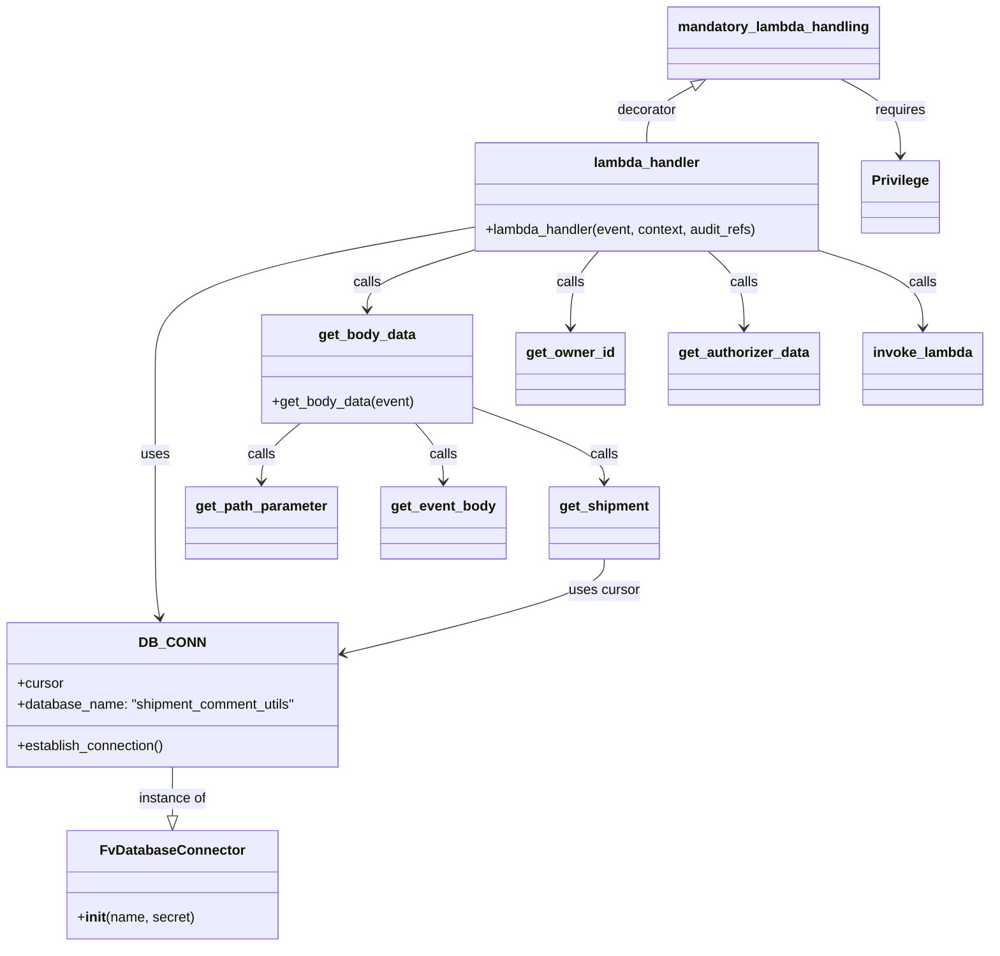

# Diagram: shipment_core/shipment_service/shipment_service/ng_shipments/comment/comment_read_post.py


> Auto-generated by Obscura crawlers

## Diagram 1



### SVG

<svg id="container" width="1137.517578125" xmlns="http://www.w3.org/2000/svg" class="classDiagram" height="1100" viewBox="0 0 1137.517578125 1100" role="graphics-document document" aria-roledescription="class"><style>#container{font-family:"trebuchet ms",verdana,arial,sans-serif;font-size:16px;fill:#333;}@keyframes edge-animation-frame{from{stroke-dashoffset:0;}}@keyframes dash{to{stroke-dashoffset:0;}}#container .edge-animation-slow{stroke-dasharray:9,5!important;stroke-dashoffset:900;animation:dash 50s linear infinite;stroke-linecap:round;}#container .edge-animation-fast{stroke-dasharray:9,5!important;stroke-dashoffset:900;animation:dash 20s linear infinite;stroke-linecap:round;}#container .error-icon{fill:#552222;}#container .error-text{fill:#552222;stroke:#552222;}#container .edge-thickness-normal{stroke-width:1px;}#container .edge-thickness-thick{stroke-width:3.5px;}#container .edge-pattern-solid{stroke-dasharray:0;}#container .edge-thickness-invisible{stroke-width:0;fill:none;}#container .edge-pattern-dashed{stroke-dasharray:3;}#container .edge-pattern-dotted{stroke-dasharray:2;}#container .marker{fill:#333333;stroke:#333333;}#container .marker.cross{stroke:#333333;}#container svg{font-family:"trebuchet ms",verdana,arial,sans-serif;font-size:16px;}#container p{margin:0;}#container g.classGroup text{fill:#9370DB;stroke:none;font-family:"trebuchet ms",verdana,arial,sans-serif;font-size:10px;}#container g.classGroup text .title{font-weight:bolder;}#container .nodeLabel,#container .edgeLabel{color:#131300;}#container .edgeLabel .label rect{fill:#ECECFF;}#container .label text{fill:#131300;}#container .labelBkg{background:#ECECFF;}#container .edgeLabel .label span{background:#ECECFF;}#container .classTitle{font-weight:bolder;}#container .node rect,#container .node circle,#container .node ellipse,#container .node polygon,#container .node path{fill:#ECECFF;stroke:#9370DB;stroke-width:1px;}#container .divider{stroke:#9370DB;stroke-width:1;}#container g.clickable{cursor:pointer;}#container g.classGroup rect{fill:#ECECFF;stroke:#9370DB;}#container g.classGroup line{stroke:#9370DB;stroke-width:1;}#container .classLabel .box{stroke:none;stroke-width:0;fill:#ECECFF;opacity:0.5;}#container .classLabel .label{fill:#9370DB;font-size:10px;}#container .relation{stroke:#333333;stroke-width:1;fill:none;}#container .dashed-line{stroke-dasharray:3;}#container .dotted-line{stroke-dasharray:1 2;}#container #compositionStart,#container .composition{fill:#333333!important;stroke:#333333!important;stroke-width:1;}#container #compositionEnd,#container .composition{fill:#333333!important;stroke:#333333!important;stroke-width:1;}#container #dependencyStart,#container .dependency{fill:#333333!important;stroke:#333333!important;stroke-width:1;}#container #dependencyStart,#container .dependency{fill:#333333!important;stroke:#333333!important;stroke-width:1;}#container #extensionStart,#container .extension{fill:transparent!important;stroke:#333333!important;stroke-width:1;}#container #extensionEnd,#container .extension{fill:transparent!important;stroke:#333333!important;stroke-width:1;}#container #aggregationStart,#container .aggregation{fill:transparent!important;stroke:#333333!important;stroke-width:1;}#container #aggregationEnd,#container .aggregation{fill:transparent!important;stroke:#333333!important;stroke-width:1;}#container #lollipopStart,#container .lollipop{fill:#ECECFF!important;stroke:#333333!important;stroke-width:1;}#container #lollipopEnd,#container .lollipop{fill:#ECECFF!important;stroke:#333333!important;stroke-width:1;}#container .edgeTerminals{font-size:11px;line-height:initial;}#container .classTitleText{text-anchor:middle;font-size:18px;fill:#333;}#container .label-icon{display:inline-block;height:1em;overflow:visible;vertical-align:-0.125em;}#container .node .label-icon path{fill:currentColor;stroke:revert;stroke-width:revert;}#container :root{--mermaid-font-family:"trebuchet ms",verdana,arial,sans-serif;}</style><g><defs><marker id="container_class-aggregationStart" class="marker aggregation class" refX="18" refY="7" markerWidth="190" markerHeight="240" orient="auto"><path d="M 18,7 L9,13 L1,7 L9,1 Z"></path></marker></defs><defs><marker id="container_class-aggregationEnd" class="marker aggregation class" refX="1" refY="7" markerWidth="20" markerHeight="28" orient="auto"><path d="M 18,7 L9,13 L1,7 L9,1 Z"></path></marker></defs><defs><marker id="container_class-extensionStart" class="marker extension class" refX="18" refY="7" markerWidth="190" markerHeight="240" orient="auto"><path d="M 1,7 L18,13 V 1 Z"></path></marker></defs><defs><marker id="container_class-extensionEnd" class="marker extension class" refX="1" refY="7" markerWidth="20" markerHeight="28" orient="auto"><path d="M 1,1 V 13 L18,7 Z"></path></marker></defs><defs><marker id="container_class-compositionStart" class="marker composition class" refX="18" refY="7" markerWidth="190" markerHeight="240" orient="auto"><path d="M 18,7 L9,13 L1,7 L9,1 Z"></path></marker></defs><defs><marker id="container_class-compositionEnd" class="marker composition class" refX="1" refY="7" markerWidth="20" markerHeight="28" orient="auto"><path d="M 18,7 L9,13 L1,7 L9,1 Z"></path></marker></defs><defs><marker id="container_class-dependencyStart" class="marker dependency class" refX="6" refY="7" markerWidth="190" markerHeight="240" orient="auto"><path d="M 5,7 L9,13 L1,7 L9,1 Z"></path></marker></defs><defs><marker id="container_class-dependencyEnd" class="marker dependency class" refX="13" refY="7" markerWidth="20" markerHeight="28" orient="auto"><path d="M 18,7 L9,13 L14,7 L9,1 Z"></path></marker></defs><defs><marker id="container_class-lollipopStart" class="marker lollipop class" refX="13" refY="7" markerWidth="190" markerHeight="240" orient="auto"><circle stroke="black" fill="transparent" cx="7" cy="7" r="6"></circle></marker></defs><defs><marker id="container_class-lollipopEnd" class="marker lollipop class" refX="1" refY="7" markerWidth="190" markerHeight="240" orient="auto"><circle stroke="black" fill="transparent" cx="7" cy="7" r="6"></circle></marker></defs><g class="root"><g class="clusters"></g><g class="edgePaths"><path d="M201.125,892L201.125,898.167C201.125,904.333,201.125,916.667,201.125,926.125C201.125,935.583,201.125,942.167,201.125,945.458L201.125,948.75" id="id_DB_CONN_FvDatabaseConnector_1" class="edge-thickness-normal edge-pattern-solid relation" style=";;;" data-edge="true" data-et="edge" data-id="id_DB_CONN_FvDatabaseConnector_1" data-points="W3sieCI6MjAxLjEyNSwieSI6ODkyfSx7IngiOjIwMS4xMjUsInkiOjkyOX0seyJ4IjoyMDEuMTI1LCJ5Ijo5NjZ9XQ==" marker-end="url(#container_class-extensionEnd)"></path><path d="M802.147,100.108L793.105,104.923C784.062,109.739,765.977,119.369,756.935,130.351C747.893,141.333,747.893,153.667,747.893,159.833L747.893,166" id="id_mandatory_lambda_handling_lambda_handler_2" class="edge-thickness-normal edge-pattern-solid relation" style=";;;" data-edge="true" data-et="edge" data-id="id_mandatory_lambda_handling_lambda_handler_2" data-points="W3sieCI6ODE3LjM3Mjc3NDkyMDg4NjEsInkiOjkyfSx7IngiOjc0Ny44OTI1NzgxMjUsInkiOjEyOX0seyJ4Ijo3NDcuODkyNTc4MTI1LCJ5IjoxNjZ9XQ==" marker-start="url(#container_class-extensionStart)"></path><path d="M545.061,265.008L484.983,275.673C424.906,286.339,304.751,307.669,244.673,335.001C184.596,362.333,184.596,395.667,184.596,429C184.596,462.333,184.596,495.667,184.596,525.5C184.596,555.333,184.596,581.667,184.596,608C184.596,634.333,184.596,660.667,185.303,679.009C186.01,697.352,187.424,707.703,188.131,712.879L188.838,718.055" id="id_lambda_handler_DB_CONN_3" class="edge-thickness-normal edge-pattern-solid relation" style=";;;" data-edge="true" data-et="edge" data-id="id_lambda_handler_DB_CONN_3" data-points="W3sieCI6NTQ1LjA2MDU0Njg3NSwieSI6MjY1LjAwODAxNjQyMTE4MTF9LHsieCI6MTg0LjU5NTcwMzEyNSwieSI6MzI5fSx7IngiOjE4NC41OTU3MDMxMjUsInkiOjQyOX0seyJ4IjoxODQuNTk1NzAzMTI1LCJ5Ijo1Mjl9LHsieCI6MTg0LjU5NTcwMzEyNSwieSI6NjA4fSx7IngiOjE4NC41OTU3MDMxMjUsInkiOjY4N30seyJ4IjoxODkuNjUwMTE2MjE5MDA4MjUsInkiOjcyNH1d" marker-end="url(#container_class-dependencyEnd)"></path><path d="M546.445,292L526.727,298.167C507.008,304.333,467.572,316.667,447.853,328C428.135,339.333,428.135,349.667,428.135,354.833L428.135,360" id="id_lambda_handler_get_body_data_4" class="edge-thickness-normal edge-pattern-solid relation" style=";;;" data-edge="true" data-et="edge" data-id="id_lambda_handler_get_body_data_4" data-points="W3sieCI6NTQ2LjQ0NTE1NjI1LCJ5IjoyOTJ9LHsieCI6NDI4LjEzNDc2NTYyNSwieSI6MzI5fSx7IngiOjQyOC4xMzQ3NjU2MjUsInkiOjM2Nn1d" marker-end="url(#container_class-dependencyEnd)"></path><path d="M693.575,292L688.258,298.167C682.941,304.333,672.307,316.667,666.991,331.5C661.674,346.333,661.674,363.667,661.674,372.333L661.674,381" id="id_lambda_handler_get_owner_id_5" class="edge-thickness-normal edge-pattern-solid relation" style=";;;" data-edge="true" data-et="edge" data-id="id_lambda_handler_get_owner_id_5" data-points="W3sieCI6NjkzLjU3NDc2NTYyNSwieSI6MjkyfSx7IngiOjY2MS42NzM4MjgxMjUsInkiOjMyOX0seyJ4Ijo2NjEuNjczODI4MTI1LCJ5IjozODd9XQ==" marker-end="url(#container_class-dependencyEnd)"></path><path d="M817.626,292L824.451,298.167C831.277,304.333,844.929,316.667,851.754,331.5C858.58,346.333,858.58,363.667,858.58,372.333L858.58,381" id="id_lambda_handler_get_authorizer_data_6" class="edge-thickness-normal edge-pattern-solid relation" style=";;;" data-edge="true" data-et="edge" data-id="id_lambda_handler_get_authorizer_data_6" data-points="W3sieCI6ODE3LjYyNTcwMzEyNSwieSI6MjkyfSx7IngiOjg1OC41ODAwNzgxMjUsInkiOjMyOX0seyJ4Ijo4NTguNTgwMDc4MTI1LCJ5IjozODd9XQ==" marker-end="url(#container_class-dependencyEnd)"></path><path d="M945.713,292L965.076,298.167C984.439,304.333,1023.166,316.667,1042.529,331.5C1061.893,346.333,1061.893,363.667,1061.893,372.333L1061.893,381" id="id_lambda_handler_invoke_lambda_7" class="edge-thickness-normal edge-pattern-solid relation" style=";;;" data-edge="true" data-et="edge" data-id="id_lambda_handler_invoke_lambda_7" data-points="W3sieCI6OTQ1LjcxMjU3ODEyNDk5OTksInkiOjI5Mn0seyJ4IjoxMDYxLjg5MjU3ODEyNSwieSI6MzI5fSx7IngiOjEwNjEuODkyNTc4MTI1LCJ5IjozODd9XQ==" marker-end="url(#container_class-dependencyEnd)"></path><path d="M351.55,492L344.054,498.167C336.558,504.333,321.565,516.667,314.069,528C306.572,539.333,306.572,549.667,306.572,554.833L306.572,560" id="id_get_body_data_get_path_parameter_8" class="edge-thickness-normal edge-pattern-solid relation" style=";;;" data-edge="true" data-et="edge" data-id="id_get_body_data_get_path_parameter_8" data-points="W3sieCI6MzUxLjU1MDM5MDYyNSwieSI6NDkyfSx7IngiOjMwNi41NzIyNjU2MjUsInkiOjUyOX0seyJ4IjozMDYuNTcyMjY1NjI1LCJ5Ijo1NjZ9XQ==" marker-end="url(#container_class-dependencyEnd)"></path><path d="M482.453,492L487.769,498.167C493.086,504.333,503.72,516.667,509.037,528C514.354,539.333,514.354,549.667,514.354,554.833L514.354,560" id="id_get_body_data_get_event_body_9" class="edge-thickness-normal edge-pattern-solid relation" style=";;;" data-edge="true" data-et="edge" data-id="id_get_body_data_get_event_body_9" data-points="W3sieCI6NDgyLjQ1MjU3ODEyNSwieSI6NDkyfSx7IngiOjUxNC4zNTM1MTU2MjUsInkiOjUyOX0seyJ4Ijo1MTQuMzUzNTE1NjI1LCJ5Ijo1NjZ9XQ==" marker-end="url(#container_class-dependencyEnd)"></path><path d="M550.455,474.419L574.954,483.516C599.452,492.613,648.45,510.806,672.949,525.07C697.447,539.333,697.447,549.667,697.447,554.833L697.447,560" id="id_get_body_data_get_shipment_10" class="edge-thickness-normal edge-pattern-solid relation" style=";;;" data-edge="true" data-et="edge" data-id="id_get_body_data_get_shipment_10" data-points="W3sieCI6NTUwLjQ1NTA3ODEyNSwieSI6NDc0LjQxOTQ3MDg3NDkxM30seyJ4Ijo2OTcuNDQ3MjY1NjI1LCJ5Ijo1Mjl9LHsieCI6Njk3LjQ0NzI2NTYyNSwieSI6NTY2fV0=" marker-end="url(#container_class-dependencyEnd)"></path><path d="M697.447,650L697.447,656.167C697.447,662.333,697.447,674.667,647.886,692.916C598.325,711.165,499.202,735.331,449.641,747.414L400.079,759.496" id="id_get_shipment_DB_CONN_11" class="edge-thickness-normal edge-pattern-solid relation" style=";;;" data-edge="true" data-et="edge" data-id="id_get_shipment_DB_CONN_11" data-points="W3sieCI6Njk3LjQ0NzI2NTYyNSwieSI6NjUwfSx7IngiOjY5Ny40NDcyNjU2MjUsInkiOjY4N30seyJ4IjozOTQuMjUsInkiOjc2MC45MTc0MzU2NjkzOTY0fV0=" marker-end="url(#container_class-dependencyEnd)"></path><path d="M975.112,92L986.692,98.167C998.272,104.333,1021.432,116.667,1033.012,131.5C1044.592,146.333,1044.592,163.667,1044.592,172.333L1044.592,181" id="id_mandatory_lambda_handling_Privilege_12" class="edge-thickness-normal edge-pattern-solid relation" style=";;;" data-edge="true" data-et="edge" data-id="id_mandatory_lambda_handling_Privilege_12" data-points="W3sieCI6OTc1LjExMTYwMDA3OTExMzksInkiOjkyfSx7IngiOjEwNDQuNTkxNzk2ODc1LCJ5IjoxMjl9LHsieCI6MTA0NC41OTE3OTY4NzUsInkiOjE4N31d" marker-end="url(#container_class-dependencyEnd)"></path></g><g class="edgeLabels"><g class="edgeLabel" transform="translate(201.125, 929)"><g class="label" data-id="id_DB_CONN_FvDatabaseConnector_1" transform="translate(-40.0546875, -12)"><foreignObject width="80.109375" height="24"><div xmlns="http://www.w3.org/1999/xhtml" class="labelBkg" style="display: table-cell; white-space: nowrap; line-height: 1.5; max-width: 200px; text-align: center;"><span class="edgeLabel"><p>instance of</p></span></div></foreignObject></g></g><g class="edgeLabel" transform="translate(747.892578125, 129)"><g class="label" data-id="id_mandatory_lambda_handling_lambda_handler_2" transform="translate(-35.171875, -12)"><foreignObject width="70.34375" height="24"><div xmlns="http://www.w3.org/1999/xhtml" class="labelBkg" style="display: table-cell; white-space: nowrap; line-height: 1.5; max-width: 200px; text-align: center;"><span class="edgeLabel"><p>decorator</p></span></div></foreignObject></g></g><g class="edgeLabel" transform="translate(184.595703125, 529)"><g class="label" data-id="id_lambda_handler_DB_CONN_3" transform="translate(-16.4921875, -12)"><foreignObject width="32.984375" height="24"><div xmlns="http://www.w3.org/1999/xhtml" class="labelBkg" style="display: table-cell; white-space: nowrap; line-height: 1.5; max-width: 200px; text-align: center;"><span class="edgeLabel"><p>uses</p></span></div></foreignObject></g></g><g class="edgeLabel" transform="translate(428.134765625, 329)"><g class="label" data-id="id_lambda_handler_get_body_data_4" transform="translate(-16.4453125, -12)"><foreignObject width="32.890625" height="24"><div xmlns="http://www.w3.org/1999/xhtml" class="labelBkg" style="display: table-cell; white-space: nowrap; line-height: 1.5; max-width: 200px; text-align: center;"><span class="edgeLabel"><p>calls</p></span></div></foreignObject></g></g><g class="edgeLabel" transform="translate(661.673828125, 329)"><g class="label" data-id="id_lambda_handler_get_owner_id_5" transform="translate(-16.4453125, -12)"><foreignObject width="32.890625" height="24"><div xmlns="http://www.w3.org/1999/xhtml" class="labelBkg" style="display: table-cell; white-space: nowrap; line-height: 1.5; max-width: 200px; text-align: center;"><span class="edgeLabel"><p>calls</p></span></div></foreignObject></g></g><g class="edgeLabel" transform="translate(858.580078125, 329)"><g class="label" data-id="id_lambda_handler_get_authorizer_data_6" transform="translate(-16.4453125, -12)"><foreignObject width="32.890625" height="24"><div xmlns="http://www.w3.org/1999/xhtml" class="labelBkg" style="display: table-cell; white-space: nowrap; line-height: 1.5; max-width: 200px; text-align: center;"><span class="edgeLabel"><p>calls</p></span></div></foreignObject></g></g><g class="edgeLabel" transform="translate(1061.892578125, 329)"><g class="label" data-id="id_lambda_handler_invoke_lambda_7" transform="translate(-16.4453125, -12)"><foreignObject width="32.890625" height="24"><div xmlns="http://www.w3.org/1999/xhtml" class="labelBkg" style="display: table-cell; white-space: nowrap; line-height: 1.5; max-width: 200px; text-align: center;"><span class="edgeLabel"><p>calls</p></span></div></foreignObject></g></g><g class="edgeLabel" transform="translate(306.572265625, 529)"><g class="label" data-id="id_get_body_data_get_path_parameter_8" transform="translate(-16.4453125, -12)"><foreignObject width="32.890625" height="24"><div xmlns="http://www.w3.org/1999/xhtml" class="labelBkg" style="display: table-cell; white-space: nowrap; line-height: 1.5; max-width: 200px; text-align: center;"><span class="edgeLabel"><p>calls</p></span></div></foreignObject></g></g><g class="edgeLabel" transform="translate(514.353515625, 529)"><g class="label" data-id="id_get_body_data_get_event_body_9" transform="translate(-16.4453125, -12)"><foreignObject width="32.890625" height="24"><div xmlns="http://www.w3.org/1999/xhtml" class="labelBkg" style="display: table-cell; white-space: nowrap; line-height: 1.5; max-width: 200px; text-align: center;"><span class="edgeLabel"><p>calls</p></span></div></foreignObject></g></g><g class="edgeLabel" transform="translate(697.447265625, 529)"><g class="label" data-id="id_get_body_data_get_shipment_10" transform="translate(-16.4453125, -12)"><foreignObject width="32.890625" height="24"><div xmlns="http://www.w3.org/1999/xhtml" class="labelBkg" style="display: table-cell; white-space: nowrap; line-height: 1.5; max-width: 200px; text-align: center;"><span class="edgeLabel"><p>calls</p></span></div></foreignObject></g></g><g class="edgeLabel" transform="translate(697.447265625, 687)"><g class="label" data-id="id_get_shipment_DB_CONN_11" transform="translate(-41.4765625, -12)"><foreignObject width="82.953125" height="24"><div xmlns="http://www.w3.org/1999/xhtml" class="labelBkg" style="display: table-cell; white-space: nowrap; line-height: 1.5; max-width: 200px; text-align: center;"><span class="edgeLabel"><p>uses cursor</p></span></div></foreignObject></g></g><g class="edgeLabel" transform="translate(1044.591796875, 129)"><g class="label" data-id="id_mandatory_lambda_handling_Privilege_12" transform="translate(-29.8515625, -12)"><foreignObject width="59.703125" height="24"><div xmlns="http://www.w3.org/1999/xhtml" class="labelBkg" style="display: table-cell; white-space: nowrap; line-height: 1.5; max-width: 200px; text-align: center;"><span class="edgeLabel"><p>requires</p></span></div></foreignObject></g></g></g><g class="nodes"><g class="node default" id="classId-DB_CONN-0" transform="translate(201.125, 808)"><g class="basic label-container"><path d="M-193.125 -84 L193.125 -84 L193.125 84 L-193.125 84" stroke="none" stroke-width="0" fill="#ECECFF" style=""></path><path d="M-193.125 -84 C-39.26163399036557 -84, 114.60173201926887 -84, 193.125 -84 M-193.125 -84 C-114.20388928366049 -84, -35.282778567320975 -84, 193.125 -84 M193.125 -84 C193.125 -28.522674119273, 193.125 26.954651761454002, 193.125 84 M193.125 -84 C193.125 -35.37337385657542, 193.125 13.253252286849161, 193.125 84 M193.125 84 C54.977286909964874 84, -83.17042618007025 84, -193.125 84 M193.125 84 C64.06912563331917 84, -64.98674873336165 84, -193.125 84 M-193.125 84 C-193.125 37.71011426868294, -193.125 -8.579771462634113, -193.125 -84 M-193.125 84 C-193.125 31.484490915414305, -193.125 -21.03101816917139, -193.125 -84" stroke="#9370DB" stroke-width="1.3" fill="none" stroke-dasharray="0 0" style=""></path></g><g class="annotation-group text" transform="translate(0, -60)"></g><g class="label-group text" transform="translate(-34.40625, -60)"><g class="label" style="font-weight: bolder" transform="translate(0,-12)"><foreignObject width="68.8125" height="24"><div xmlns="http://www.w3.org/1999/xhtml" style="display: table-cell; white-space: nowrap; line-height: 1.5; max-width: 119px; text-align: center;"><span class="nodeLabel markdown-node-label" style=""><p>DB_CONN</p></span></div></foreignObject></g></g><g class="members-group text" transform="translate(-181.125, -12)"><g class="label" style="" transform="translate(0,-12)"><foreignObject width="53.71875" height="24"><div xmlns="http://www.w3.org/1999/xhtml" style="display: table-cell; white-space: nowrap; line-height: 1.5; max-width: 112px; text-align: center;"><span class="nodeLabel markdown-node-label" style=""><p>+cursor</p></span></div></foreignObject></g><g class="label" style="" transform="translate(0,12)"><foreignObject width="327.84375" height="24"><div xmlns="http://www.w3.org/1999/xhtml" style="display: table-cell; white-space: nowrap; line-height: 1.5; max-width: 385px; text-align: center;"><span class="nodeLabel markdown-node-label" style=""><p>+database_name: "shipment_comment_utils"</p></span></div></foreignObject></g></g><g class="methods-group text" transform="translate(-181.125, 60)"><g class="label" style="" transform="translate(0,-12)"><foreignObject width="173.265625" height="24"><div xmlns="http://www.w3.org/1999/xhtml" style="display: table-cell; white-space: nowrap; line-height: 1.5; max-width: 231px; text-align: center;"><span class="nodeLabel markdown-node-label" style=""><p>+establish_connection()</p></span></div></foreignObject></g></g><g class="divider" style=""><path d="M-193.125 -36 C-94.19023442786423 -36, 4.744531144271548 -36, 193.125 -36 M-193.125 -36 C-48.581285306461325 -36, 95.96242938707735 -36, 193.125 -36" stroke="#9370DB" stroke-width="1.3" fill="none" stroke-dasharray="0 0" style=""></path></g><g class="divider" style=""><path d="M-193.125 36 C-93.15124823148346 36, 6.8225035370330716 36, 193.125 36 M-193.125 36 C-72.22710206295287 36, 48.67079587409427 36, 193.125 36" stroke="#9370DB" stroke-width="1.3" fill="none" stroke-dasharray="0 0" style=""></path></g></g><g class="node default" id="classId-FvDatabaseConnector-1" transform="translate(201.125, 1029)"><g class="basic label-container"><path d="M-119.28515625 -63 L119.28515625 -63 L119.28515625 63 L-119.28515625 63" stroke="none" stroke-width="0" fill="#ECECFF" style=""></path><path d="M-119.28515625 -63 C-45.85447187584364 -63, 27.576212498312714 -63, 119.28515625 -63 M-119.28515625 -63 C-67.66507038319656 -63, -16.044984516393143 -63, 119.28515625 -63 M119.28515625 -63 C119.28515625 -36.510801794456086, 119.28515625 -10.021603588912178, 119.28515625 63 M119.28515625 -63 C119.28515625 -21.248445578960073, 119.28515625 20.503108842079854, 119.28515625 63 M119.28515625 63 C54.16119943858649 63, -10.962757372827014 63, -119.28515625 63 M119.28515625 63 C55.59420523326427 63, -8.096745783471462 63, -119.28515625 63 M-119.28515625 63 C-119.28515625 15.799482200163872, -119.28515625 -31.401035599672255, -119.28515625 -63 M-119.28515625 63 C-119.28515625 20.04887499520003, -119.28515625 -22.90225000959994, -119.28515625 -63" stroke="#9370DB" stroke-width="1.3" fill="none" stroke-dasharray="0 0" style=""></path></g><g class="annotation-group text" transform="translate(0, -39)"></g><g class="label-group text" transform="translate(-79.3046875, -39)"><g class="label" style="font-weight: bolder" transform="translate(0,-12)"><foreignObject width="158.609375" height="24"><div xmlns="http://www.w3.org/1999/xhtml" style="display: table-cell; white-space: nowrap; line-height: 1.5; max-width: 207px; text-align: center;"><span class="nodeLabel markdown-node-label" style=""><p>FvDatabaseConnector</p></span></div></foreignObject></g></g><g class="members-group text" transform="translate(-107.28515625, 9)"></g><g class="methods-group text" transform="translate(-107.28515625, 39)"><g class="label" style="" transform="translate(0,-12)"><foreignObject width="135.265625" height="24"><div xmlns="http://www.w3.org/1999/xhtml" style="display: table-cell; white-space: nowrap; line-height: 1.5; max-width: 224px; text-align: center;"><span class="nodeLabel markdown-node-label" style=""><p>+<strong>init</strong>(name, secret)</p></span></div></foreignObject></g></g><g class="divider" style=""><path d="M-119.28515625 -15 C-51.538266310408574 -15, 16.208623629182853 -15, 119.28515625 -15 M-119.28515625 -15 C-52.11786819616454 -15, 15.049419857670927 -15, 119.28515625 -15" stroke="#9370DB" stroke-width="1.3" fill="none" stroke-dasharray="0 0" style=""></path></g><g class="divider" style=""><path d="M-119.28515625 9 C-30.53300604628552 9, 58.21914415742896 9, 119.28515625 9 M-119.28515625 9 C-49.502712144678895 9, 20.27973196064221 9, 119.28515625 9" stroke="#9370DB" stroke-width="1.3" fill="none" stroke-dasharray="0 0" style=""></path></g></g><g class="node default" id="classId-lambda_handler-2" transform="translate(747.892578125, 229)"><g class="basic label-container"><path d="M-202.83203125 -63 L202.83203125 -63 L202.83203125 63 L-202.83203125 63" stroke="none" stroke-width="0" fill="#ECECFF" style=""></path><path d="M-202.83203125 -63 C-86.59815491210789 -63, 29.635721425784226 -63, 202.83203125 -63 M-202.83203125 -63 C-80.19939770359922 -63, 42.433235842801565 -63, 202.83203125 -63 M202.83203125 -63 C202.83203125 -37.42023070398514, 202.83203125 -11.840461407970288, 202.83203125 63 M202.83203125 -63 C202.83203125 -36.32948604811078, 202.83203125 -9.658972096221554, 202.83203125 63 M202.83203125 63 C104.55397941015548 63, 6.275927570310955 63, -202.83203125 63 M202.83203125 63 C94.50303324848845 63, -13.8259647530231 63, -202.83203125 63 M-202.83203125 63 C-202.83203125 30.32500232464018, -202.83203125 -2.349995350719638, -202.83203125 -63 M-202.83203125 63 C-202.83203125 23.425221658659765, -202.83203125 -16.14955668268047, -202.83203125 -63" stroke="#9370DB" stroke-width="1.3" fill="none" stroke-dasharray="0 0" style=""></path></g><g class="annotation-group text" transform="translate(0, -39)"></g><g class="label-group text" transform="translate(-59.9765625, -39)"><g class="label" style="font-weight: bolder" transform="translate(0,-12)"><foreignObject width="119.953125" height="24"><div xmlns="http://www.w3.org/1999/xhtml" style="display: table-cell; white-space: nowrap; line-height: 1.5; max-width: 170px; text-align: center;"><span class="nodeLabel markdown-node-label" style=""><p>lambda_handler</p></span></div></foreignObject></g></g><g class="members-group text" transform="translate(-190.83203125, 9)"></g><g class="methods-group text" transform="translate(-190.83203125, 39)"><g class="label" style="" transform="translate(0,-12)"><foreignObject width="321.6875" height="24"><div xmlns="http://www.w3.org/1999/xhtml" style="display: table-cell; white-space: nowrap; line-height: 1.5; max-width: 379px; text-align: center;"><span class="nodeLabel markdown-node-label" style=""><p>+lambda_handler(event, context, audit_refs)</p></span></div></foreignObject></g></g><g class="divider" style=""><path d="M-202.83203125 -15 C-116.49884005106723 -15, -30.165648852134467 -15, 202.83203125 -15 M-202.83203125 -15 C-98.53528144412608 -15, 5.761468361747831 -15, 202.83203125 -15" stroke="#9370DB" stroke-width="1.3" fill="none" stroke-dasharray="0 0" style=""></path></g><g class="divider" style=""><path d="M-202.83203125 9 C-80.1539761472645 9, 42.524078955471 9, 202.83203125 9 M-202.83203125 9 C-97.97401659829742 9, 6.883998053405151 9, 202.83203125 9" stroke="#9370DB" stroke-width="1.3" fill="none" stroke-dasharray="0 0" style=""></path></g></g><g class="node default" id="classId-get_body_data-3" transform="translate(428.134765625, 429)"><g class="basic label-container"><path d="M-122.3203125 -63 L122.3203125 -63 L122.3203125 63 L-122.3203125 63" stroke="none" stroke-width="0" fill="#ECECFF" style=""></path><path d="M-122.3203125 -63 C-57.04389545087788 -63, 8.232521598244233 -63, 122.3203125 -63 M-122.3203125 -63 C-53.71929568949338 -63, 14.881721121013243 -63, 122.3203125 -63 M122.3203125 -63 C122.3203125 -26.474098198990333, 122.3203125 10.051803602019334, 122.3203125 63 M122.3203125 -63 C122.3203125 -14.826373147862078, 122.3203125 33.34725370427584, 122.3203125 63 M122.3203125 63 C57.04854479038592 63, -8.223222919228164 63, -122.3203125 63 M122.3203125 63 C42.686690769225166 63, -36.94693096154967 63, -122.3203125 63 M-122.3203125 63 C-122.3203125 37.19769432979864, -122.3203125 11.39538865959728, -122.3203125 -63 M-122.3203125 63 C-122.3203125 18.640177874351018, -122.3203125 -25.719644251297964, -122.3203125 -63" stroke="#9370DB" stroke-width="1.3" fill="none" stroke-dasharray="0 0" style=""></path></g><g class="annotation-group text" transform="translate(0, -39)"></g><g class="label-group text" transform="translate(-54.609375, -39)"><g class="label" style="font-weight: bolder" transform="translate(0,-12)"><foreignObject width="109.21875" height="24"><div xmlns="http://www.w3.org/1999/xhtml" style="display: table-cell; white-space: nowrap; line-height: 1.5; max-width: 157px; text-align: center;"><span class="nodeLabel markdown-node-label" style=""><p>get_body_data</p></span></div></foreignObject></g></g><g class="members-group text" transform="translate(-110.3203125, 9)"></g><g class="methods-group text" transform="translate(-110.3203125, 39)"><g class="label" style="" transform="translate(0,-12)"><foreignObject width="166.03125" height="24"><div xmlns="http://www.w3.org/1999/xhtml" style="display: table-cell; white-space: nowrap; line-height: 1.5; max-width: 223px; text-align: center;"><span class="nodeLabel markdown-node-label" style=""><p>+get_body_data(event)</p></span></div></foreignObject></g></g><g class="divider" style=""><path d="M-122.3203125 -15 C-55.922326214639625 -15, 10.47566007072075 -15, 122.3203125 -15 M-122.3203125 -15 C-36.09677344478841 -15, 50.12676561042318 -15, 122.3203125 -15" stroke="#9370DB" stroke-width="1.3" fill="none" stroke-dasharray="0 0" style=""></path></g><g class="divider" style=""><path d="M-122.3203125 9 C-42.453484337707735 9, 37.41334382458453 9, 122.3203125 9 M-122.3203125 9 C-41.50233098985561 9, 39.315650520288784 9, 122.3203125 9" stroke="#9370DB" stroke-width="1.3" fill="none" stroke-dasharray="0 0" style=""></path></g></g><g class="node default" id="classId-get_path_parameter-4" transform="translate(306.572265625, 608)"><g class="basic label-container"><path d="M-86.9765625 -42 L86.9765625 -42 L86.9765625 42 L-86.9765625 42" stroke="none" stroke-width="0" fill="#ECECFF" style=""></path><path d="M-86.9765625 -42 C-47.03612893483522 -42, -7.0956953696704375 -42, 86.9765625 -42 M-86.9765625 -42 C-46.93252654789877 -42, -6.888490595797535 -42, 86.9765625 -42 M86.9765625 -42 C86.9765625 -24.5811496671935, 86.9765625 -7.162299334387001, 86.9765625 42 M86.9765625 -42 C86.9765625 -19.326356061194392, 86.9765625 3.3472878776112154, 86.9765625 42 M86.9765625 42 C43.03773547431041 42, -0.9010915513791815 42, -86.9765625 42 M86.9765625 42 C23.699358602501263 42, -39.57784529499747 42, -86.9765625 42 M-86.9765625 42 C-86.9765625 11.981451759272602, -86.9765625 -18.037096481454796, -86.9765625 -42 M-86.9765625 42 C-86.9765625 24.610381105263954, -86.9765625 7.220762210527909, -86.9765625 -42" stroke="#9370DB" stroke-width="1.3" fill="none" stroke-dasharray="0 0" style=""></path></g><g class="annotation-group text" transform="translate(0, -18)"></g><g class="label-group text" transform="translate(-74.9765625, -18)"><g class="label" style="font-weight: bolder" transform="translate(0,-12)"><foreignObject width="149.953125" height="24"><div xmlns="http://www.w3.org/1999/xhtml" style="display: table-cell; white-space: nowrap; line-height: 1.5; max-width: 198px; text-align: center;"><span class="nodeLabel markdown-node-label" style=""><p>get_path_parameter</p></span></div></foreignObject></g></g><g class="members-group text" transform="translate(-74.9765625, 30)"></g><g class="methods-group text" transform="translate(-74.9765625, 60)"></g><g class="divider" style=""><path d="M-86.9765625 6 C-27.8095781320755 6, 31.357406235848998 6, 86.9765625 6 M-86.9765625 6 C-22.81687323148418 6, 41.34281603703164 6, 86.9765625 6" stroke="#9370DB" stroke-width="1.3" fill="none" stroke-dasharray="0 0" style=""></path></g><g class="divider" style=""><path d="M-86.9765625 24 C-27.123388601751927 24, 32.729785296496146 24, 86.9765625 24 M-86.9765625 24 C-33.899555544366514 24, 19.177451411266972 24, 86.9765625 24" stroke="#9370DB" stroke-width="1.3" fill="none" stroke-dasharray="0 0" style=""></path></g></g><g class="node default" id="classId-get_event_body-5" transform="translate(514.353515625, 608)"><g class="basic label-container"><path d="M-70.8046875 -42 L70.8046875 -42 L70.8046875 42 L-70.8046875 42" stroke="none" stroke-width="0" fill="#ECECFF" style=""></path><path d="M-70.8046875 -42 C-21.61733408202406 -42, 27.570019335951883 -42, 70.8046875 -42 M-70.8046875 -42 C-41.26695023738989 -42, -11.729212974779777 -42, 70.8046875 -42 M70.8046875 -42 C70.8046875 -11.46708280658537, 70.8046875 19.06583438682926, 70.8046875 42 M70.8046875 -42 C70.8046875 -13.088238941725876, 70.8046875 15.823522116548247, 70.8046875 42 M70.8046875 42 C39.69219907060425 42, 8.5797106412085 42, -70.8046875 42 M70.8046875 42 C32.69016902677354 42, -5.424349446452922 42, -70.8046875 42 M-70.8046875 42 C-70.8046875 16.319389935006832, -70.8046875 -9.361220129986336, -70.8046875 -42 M-70.8046875 42 C-70.8046875 20.805412807963393, -70.8046875 -0.3891743840732147, -70.8046875 -42" stroke="#9370DB" stroke-width="1.3" fill="none" stroke-dasharray="0 0" style=""></path></g><g class="annotation-group text" transform="translate(0, -18)"></g><g class="label-group text" transform="translate(-58.8046875, -18)"><g class="label" style="font-weight: bolder" transform="translate(0,-12)"><foreignObject width="117.609375" height="24"><div xmlns="http://www.w3.org/1999/xhtml" style="display: table-cell; white-space: nowrap; line-height: 1.5; max-width: 166px; text-align: center;"><span class="nodeLabel markdown-node-label" style=""><p>get_event_body</p></span></div></foreignObject></g></g><g class="members-group text" transform="translate(-58.8046875, 30)"></g><g class="methods-group text" transform="translate(-58.8046875, 60)"></g><g class="divider" style=""><path d="M-70.8046875 6 C-35.24555392763969 6, 0.31357964472061894 6, 70.8046875 6 M-70.8046875 6 C-24.44711885141721 6, 21.910449797165583 6, 70.8046875 6" stroke="#9370DB" stroke-width="1.3" fill="none" stroke-dasharray="0 0" style=""></path></g><g class="divider" style=""><path d="M-70.8046875 24 C-42.078169505662565 24, -13.35165151132513 24, 70.8046875 24 M-70.8046875 24 C-20.979530208990724 24, 28.845627082018552 24, 70.8046875 24" stroke="#9370DB" stroke-width="1.3" fill="none" stroke-dasharray="0 0" style=""></path></g></g><g class="node default" id="classId-get_shipment-6" transform="translate(697.447265625, 608)"><g class="basic label-container"><path d="M-62.2890625 -42 L62.2890625 -42 L62.2890625 42 L-62.2890625 42" stroke="none" stroke-width="0" fill="#ECECFF" style=""></path><path d="M-62.2890625 -42 C-36.61413066226136 -42, -10.93919882452272 -42, 62.2890625 -42 M-62.2890625 -42 C-16.30500078023229 -42, 29.679060939535418 -42, 62.2890625 -42 M62.2890625 -42 C62.2890625 -16.274989210922865, 62.2890625 9.45002157815427, 62.2890625 42 M62.2890625 -42 C62.2890625 -15.178827713757627, 62.2890625 11.642344572484745, 62.2890625 42 M62.2890625 42 C33.270962530687065 42, 4.25286256137413 42, -62.2890625 42 M62.2890625 42 C33.87552273444081 42, 5.461982968881607 42, -62.2890625 42 M-62.2890625 42 C-62.2890625 20.708772640339912, -62.2890625 -0.5824547193201752, -62.2890625 -42 M-62.2890625 42 C-62.2890625 12.506002368944966, -62.2890625 -16.98799526211007, -62.2890625 -42" stroke="#9370DB" stroke-width="1.3" fill="none" stroke-dasharray="0 0" style=""></path></g><g class="annotation-group text" transform="translate(0, -18)"></g><g class="label-group text" transform="translate(-50.2890625, -18)"><g class="label" style="font-weight: bolder" transform="translate(0,-12)"><foreignObject width="100.578125" height="24"><div xmlns="http://www.w3.org/1999/xhtml" style="display: table-cell; white-space: nowrap; line-height: 1.5; max-width: 150px; text-align: center;"><span class="nodeLabel markdown-node-label" style=""><p>get_shipment</p></span></div></foreignObject></g></g><g class="members-group text" transform="translate(-50.2890625, 30)"></g><g class="methods-group text" transform="translate(-50.2890625, 60)"></g><g class="divider" style=""><path d="M-62.2890625 6 C-28.291095553070768 6, 5.706871393858464 6, 62.2890625 6 M-62.2890625 6 C-31.20624696798572 6, -0.12343143597144035 6, 62.2890625 6" stroke="#9370DB" stroke-width="1.3" fill="none" stroke-dasharray="0 0" style=""></path></g><g class="divider" style=""><path d="M-62.2890625 24 C-29.820308178344177 24, 2.648446143311645 24, 62.2890625 24 M-62.2890625 24 C-20.925505523663716 24, 20.438051452672568 24, 62.2890625 24" stroke="#9370DB" stroke-width="1.3" fill="none" stroke-dasharray="0 0" style=""></path></g></g><g class="node default" id="classId-get_authorizer_data-7" transform="translate(858.580078125, 429)"><g class="basic label-container"><path d="M-85.6875 -42 L85.6875 -42 L85.6875 42 L-85.6875 42" stroke="none" stroke-width="0" fill="#ECECFF" style=""></path><path d="M-85.6875 -42 C-50.673791754569805 -42, -15.66008350913961 -42, 85.6875 -42 M-85.6875 -42 C-21.79449260257561 -42, 42.09851479484878 -42, 85.6875 -42 M85.6875 -42 C85.6875 -15.616963987496337, 85.6875 10.766072025007325, 85.6875 42 M85.6875 -42 C85.6875 -10.22168343540207, 85.6875 21.55663312919586, 85.6875 42 M85.6875 42 C43.97743393599548 42, 2.267367871990956 42, -85.6875 42 M85.6875 42 C35.898352706145666 42, -13.890794587708669 42, -85.6875 42 M-85.6875 42 C-85.6875 24.659340089382393, -85.6875 7.318680178764787, -85.6875 -42 M-85.6875 42 C-85.6875 16.642313296223765, -85.6875 -8.71537340755247, -85.6875 -42" stroke="#9370DB" stroke-width="1.3" fill="none" stroke-dasharray="0 0" style=""></path></g><g class="annotation-group text" transform="translate(0, -18)"></g><g class="label-group text" transform="translate(-73.6875, -18)"><g class="label" style="font-weight: bolder" transform="translate(0,-12)"><foreignObject width="147.375" height="24"><div xmlns="http://www.w3.org/1999/xhtml" style="display: table-cell; white-space: nowrap; line-height: 1.5; max-width: 195px; text-align: center;"><span class="nodeLabel markdown-node-label" style=""><p>get_authorizer_data</p></span></div></foreignObject></g></g><g class="members-group text" transform="translate(-73.6875, 30)"></g><g class="methods-group text" transform="translate(-73.6875, 60)"></g><g class="divider" style=""><path d="M-85.6875 6 C-30.644930337086713 6, 24.397639325826574 6, 85.6875 6 M-85.6875 6 C-33.57827075134937 6, 18.530958497301256 6, 85.6875 6" stroke="#9370DB" stroke-width="1.3" fill="none" stroke-dasharray="0 0" style=""></path></g><g class="divider" style=""><path d="M-85.6875 24 C-19.803600857582126 24, 46.08029828483575 24, 85.6875 24 M-85.6875 24 C-19.93363267646278 24, 45.82023464707444 24, 85.6875 24" stroke="#9370DB" stroke-width="1.3" fill="none" stroke-dasharray="0 0" style=""></path></g></g><g class="node default" id="classId-get_owner_id-8" transform="translate(661.673828125, 429)"><g class="basic label-container"><path d="M-61.21875 -42 L61.21875 -42 L61.21875 42 L-61.21875 42" stroke="none" stroke-width="0" fill="#ECECFF" style=""></path><path d="M-61.21875 -42 C-23.78381697490706 -42, 13.651116050185877 -42, 61.21875 -42 M-61.21875 -42 C-29.43876372899324 -42, 2.3412225420135186 -42, 61.21875 -42 M61.21875 -42 C61.21875 -20.746804548036163, 61.21875 0.5063909039276737, 61.21875 42 M61.21875 -42 C61.21875 -23.485078089633397, 61.21875 -4.9701561792667945, 61.21875 42 M61.21875 42 C27.654310507129452 42, -5.910128985741096 42, -61.21875 42 M61.21875 42 C14.310285318868644 42, -32.59817936226271 42, -61.21875 42 M-61.21875 42 C-61.21875 24.250331008154557, -61.21875 6.500662016309114, -61.21875 -42 M-61.21875 42 C-61.21875 17.48817429343321, -61.21875 -7.023651413133578, -61.21875 -42" stroke="#9370DB" stroke-width="1.3" fill="none" stroke-dasharray="0 0" style=""></path></g><g class="annotation-group text" transform="translate(0, -18)"></g><g class="label-group text" transform="translate(-49.21875, -18)"><g class="label" style="font-weight: bolder" transform="translate(0,-12)"><foreignObject width="98.4375" height="24"><div xmlns="http://www.w3.org/1999/xhtml" style="display: table-cell; white-space: nowrap; line-height: 1.5; max-width: 147px; text-align: center;"><span class="nodeLabel markdown-node-label" style=""><p>get_owner_id</p></span></div></foreignObject></g></g><g class="members-group text" transform="translate(-49.21875, 30)"></g><g class="methods-group text" transform="translate(-49.21875, 60)"></g><g class="divider" style=""><path d="M-61.21875 6 C-19.447144316130732 6, 22.324461367738536 6, 61.21875 6 M-61.21875 6 C-17.19735736894058 6, 26.82403526211884 6, 61.21875 6" stroke="#9370DB" stroke-width="1.3" fill="none" stroke-dasharray="0 0" style=""></path></g><g class="divider" style=""><path d="M-61.21875 24 C-12.455294627545086 24, 36.30816074490983 24, 61.21875 24 M-61.21875 24 C-16.54166020654568 24, 28.135429586908643 24, 61.21875 24" stroke="#9370DB" stroke-width="1.3" fill="none" stroke-dasharray="0 0" style=""></path></g></g><g class="node default" id="classId-invoke_lambda-9" transform="translate(1061.892578125, 429)"><g class="basic label-container"><path d="M-67.625 -42 L67.625 -42 L67.625 42 L-67.625 42" stroke="none" stroke-width="0" fill="#ECECFF" style=""></path><path d="M-67.625 -42 C-18.501238981393243 -42, 30.622522037213514 -42, 67.625 -42 M-67.625 -42 C-21.855558716272284 -42, 23.91388256745543 -42, 67.625 -42 M67.625 -42 C67.625 -19.98121988121184, 67.625 2.037560237576322, 67.625 42 M67.625 -42 C67.625 -13.468692628880714, 67.625 15.062614742238573, 67.625 42 M67.625 42 C26.13472968563144 42, -15.355540628737117 42, -67.625 42 M67.625 42 C21.681912058764276 42, -24.26117588247145 42, -67.625 42 M-67.625 42 C-67.625 23.19118640458576, -67.625 4.382372809171521, -67.625 -42 M-67.625 42 C-67.625 11.976445955153537, -67.625 -18.047108089692927, -67.625 -42" stroke="#9370DB" stroke-width="1.3" fill="none" stroke-dasharray="0 0" style=""></path></g><g class="annotation-group text" transform="translate(0, -18)"></g><g class="label-group text" transform="translate(-55.625, -18)"><g class="label" style="font-weight: bolder" transform="translate(0,-12)"><foreignObject width="111.25" height="24"><div xmlns="http://www.w3.org/1999/xhtml" style="display: table-cell; white-space: nowrap; line-height: 1.5; max-width: 160px; text-align: center;"><span class="nodeLabel markdown-node-label" style=""><p>invoke_lambda</p></span></div></foreignObject></g></g><g class="members-group text" transform="translate(-55.625, 30)"></g><g class="methods-group text" transform="translate(-55.625, 60)"></g><g class="divider" style=""><path d="M-67.625 6 C-24.144026802278766 6, 19.336946395442467 6, 67.625 6 M-67.625 6 C-14.185598715762296 6, 39.25380256847541 6, 67.625 6" stroke="#9370DB" stroke-width="1.3" fill="none" stroke-dasharray="0 0" style=""></path></g><g class="divider" style=""><path d="M-67.625 24 C-29.16707255134645 24, 9.2908548973071 24, 67.625 24 M-67.625 24 C-17.000039393708178 24, 33.624921212583644 24, 67.625 24" stroke="#9370DB" stroke-width="1.3" fill="none" stroke-dasharray="0 0" style=""></path></g></g><g class="node default" id="classId-mandatory_lambda_handling-10" transform="translate(896.2421875, 50)"><g class="basic label-container"><path d="M-119.4296875 -42 L119.4296875 -42 L119.4296875 42 L-119.4296875 42" stroke="none" stroke-width="0" fill="#ECECFF" style=""></path><path d="M-119.4296875 -42 C-28.27121121565682 -42, 62.88726506868636 -42, 119.4296875 -42 M-119.4296875 -42 C-26.903801778075874 -42, 65.62208394384825 -42, 119.4296875 -42 M119.4296875 -42 C119.4296875 -13.901535670411661, 119.4296875 14.196928659176677, 119.4296875 42 M119.4296875 -42 C119.4296875 -19.714794885743288, 119.4296875 2.570410228513424, 119.4296875 42 M119.4296875 42 C36.74415696896905 42, -45.9413735620619 42, -119.4296875 42 M119.4296875 42 C34.25617094805081 42, -50.91734560389838 42, -119.4296875 42 M-119.4296875 42 C-119.4296875 20.10838936129633, -119.4296875 -1.7832212774073426, -119.4296875 -42 M-119.4296875 42 C-119.4296875 23.778135517666218, -119.4296875 5.556271035332436, -119.4296875 -42" stroke="#9370DB" stroke-width="1.3" fill="none" stroke-dasharray="0 0" style=""></path></g><g class="annotation-group text" transform="translate(0, -18)"></g><g class="label-group text" transform="translate(-107.4296875, -18)"><g class="label" style="font-weight: bolder" transform="translate(0,-12)"><foreignObject width="214.859375" height="24"><div xmlns="http://www.w3.org/1999/xhtml" style="display: table-cell; white-space: nowrap; line-height: 1.5; max-width: 264px; text-align: center;"><span class="nodeLabel markdown-node-label" style=""><p>mandatory_lambda_handling</p></span></div></foreignObject></g></g><g class="members-group text" transform="translate(-107.4296875, 30)"></g><g class="methods-group text" transform="translate(-107.4296875, 60)"></g><g class="divider" style=""><path d="M-119.4296875 6 C-33.094103542858704 6, 53.24148041428259 6, 119.4296875 6 M-119.4296875 6 C-53.605189729189405 6, 12.21930804162119 6, 119.4296875 6" stroke="#9370DB" stroke-width="1.3" fill="none" stroke-dasharray="0 0" style=""></path></g><g class="divider" style=""><path d="M-119.4296875 24 C-54.35960526310721 24, 10.710476973785575 24, 119.4296875 24 M-119.4296875 24 C-34.248131399950466 24, 50.93342470009907 24, 119.4296875 24" stroke="#9370DB" stroke-width="1.3" fill="none" stroke-dasharray="0 0" style=""></path></g></g><g class="node default" id="classId-Privilege-11" transform="translate(1044.591796875, 229)"><g class="basic label-container"><path d="M-43.8671875 -42 L43.8671875 -42 L43.8671875 42 L-43.8671875 42" stroke="none" stroke-width="0" fill="#ECECFF" style=""></path><path d="M-43.8671875 -42 C-13.307902614620058 -42, 17.251382270759883 -42, 43.8671875 -42 M-43.8671875 -42 C-22.798685049592155 -42, -1.7301825991843103 -42, 43.8671875 -42 M43.8671875 -42 C43.8671875 -18.474487290120475, 43.8671875 5.05102541975905, 43.8671875 42 M43.8671875 -42 C43.8671875 -13.122137038760393, 43.8671875 15.755725922479215, 43.8671875 42 M43.8671875 42 C26.077621016805754 42, 8.288054533611508 42, -43.8671875 42 M43.8671875 42 C20.14395506780693 42, -3.5792773643861366 42, -43.8671875 42 M-43.8671875 42 C-43.8671875 15.676627387744364, -43.8671875 -10.646745224511271, -43.8671875 -42 M-43.8671875 42 C-43.8671875 16.133418571074994, -43.8671875 -9.733162857850012, -43.8671875 -42" stroke="#9370DB" stroke-width="1.3" fill="none" stroke-dasharray="0 0" style=""></path></g><g class="annotation-group text" transform="translate(0, -18)"></g><g class="label-group text" transform="translate(-31.8671875, -18)"><g class="label" style="font-weight: bolder" transform="translate(0,-12)"><foreignObject width="63.734375" height="24"><div xmlns="http://www.w3.org/1999/xhtml" style="display: table-cell; white-space: nowrap; line-height: 1.5; max-width: 112px; text-align: center;"><span class="nodeLabel markdown-node-label" style=""><p>Privilege</p></span></div></foreignObject></g></g><g class="members-group text" transform="translate(-31.8671875, 30)"></g><g class="methods-group text" transform="translate(-31.8671875, 60)"></g><g class="divider" style=""><path d="M-43.8671875 6 C-26.029394164267767 6, -8.191600828535535 6, 43.8671875 6 M-43.8671875 6 C-19.463652842644773 6, 4.9398818147104535 6, 43.8671875 6" stroke="#9370DB" stroke-width="1.3" fill="none" stroke-dasharray="0 0" style=""></path></g><g class="divider" style=""><path d="M-43.8671875 24 C-20.82020239096054 24, 2.2267827180789226 24, 43.8671875 24 M-43.8671875 24 C-23.28266390097787 24, -2.698140301955739 24, 43.8671875 24" stroke="#9370DB" stroke-width="1.3" fill="none" stroke-dasharray="0 0" style=""></path></g></g></g></g></g></svg>

## Diagram 2

```mermaid
flowchart TD
    A[POST /shipments/{shipment_id}/comment/read/] --> B[establish DB connection (DB_CONN.establish_connection())]
    B --> C[get_body_data(event)]
    C --> D[get_path_parameter(event, "shipment_id")]
    C --> E[get_event_body(event)]
    D & E --> F[get_shipment(DB_CONN.cursor, shipment_id)]
    F --> G[compose body: {reference_id, system_name, reference_type, date_until}]
    B --> H[owner_id = get_owner_id(DB_CONN.cursor, event)]
    G & H & get_authorizer_data[event] --> I[build payload with requestContext, pathParameters, body]
    I --> J[invoke_lambda("comment_read_post", full_payload)]
    J --> K[return lambda response]
```

> SVG rendering failed for this diagram.
