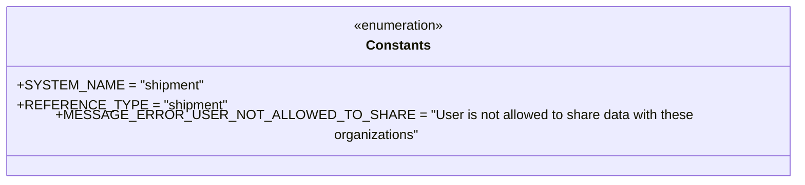
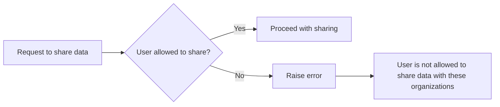

# Diagram: shipment_core/shipment_service/shipment_service/ng_shipments/comment/constants.py

> Auto-generated by Obscura crawlers

## Diagram 1

### SVG

<svg id="container" width="914.4609375" xmlns="http://www.w3.org/2000/svg" class="classDiagram" height="208" viewBox="0 0 914.4609375 208" role="graphics-document document" aria-roledescription="class"><g><defs><marker id="container_class-aggregationStart" class="marker aggregation class" refX="18" refY="7" markerWidth="190" markerHeight="240" orient="auto"><path d="M 18,7 L9,13 L1,7 L9,1 Z"></path></marker></defs><defs><marker id="container_class-aggregationEnd" class="marker aggregation class" refX="1" refY="7" markerWidth="20" markerHeight="28" orient="auto"><path d="M 18,7 L9,13 L1,7 L9,1 Z"></path></marker></defs><defs><marker id="container_class-extensionStart" class="marker extension class" refX="18" refY="7" markerWidth="190" markerHeight="240" orient="auto"><path d="M 1,7 L18,13 V 1 Z"></path></marker></defs><defs><marker id="container_class-extensionEnd" class="marker extension class" refX="1" refY="7" markerWidth="20" markerHeight="28" orient="auto"><path d="M 1,1 V 13 L18,7 Z"></path></marker></defs><defs><marker id="container_class-compositionStart" class="marker composition class" refX="18" refY="7" markerWidth="190" markerHeight="240" orient="auto"><path d="M 18,7 L9,13 L1,7 L9,1 Z"></path></marker></defs><defs><marker id="container_class-compositionEnd" class="marker composition class" refX="1" refY="7" markerWidth="20" markerHeight="28" orient="auto"><path d="M 18,7 L9,13 L1,7 L9,1 Z"></path></marker></defs><defs><marker id="container_class-dependencyStart" class="marker dependency class" refX="6" refY="7" markerWidth="190" markerHeight="240" orient="auto"><path d="M 5,7 L9,13 L1,7 L9,1 Z"></path></marker></defs><defs><marker id="container_class-dependencyEnd" class="marker dependency class" refX="13" refY="7" markerWidth="20" markerHeight="28" orient="auto"><path d="M 18,7 L9,13 L14,7 L9,1 Z"></path></marker></defs><defs><marker id="container_class-lollipopStart" class="marker lollipop class" refX="13" refY="7" markerWidth="190" markerHeight="240" orient="auto"><circle stroke="black" fill="transparent" cx="7" cy="7" r="6"></circle></marker></defs><defs><marker id="container_class-lollipopEnd" class="marker lollipop class" refX="1" refY="7" markerWidth="190" markerHeight="240" orient="auto"><circle stroke="black" fill="transparent" cx="7" cy="7" r="6"></circle></marker></defs><g class="root"><g class="clusters"></g><g class="edgePaths"></g><g class="edgeLabels"></g><g class="nodes"><g class="node default" id="classId-Constants-0" transform="translate(457.23046875, 104)"><g class="basic label-container"><path d="M-449.23046875 -96 L449.23046875 -96 L449.23046875 96 L-449.23046875 96" stroke="none" stroke-width="0" fill="#ECECFF" style=""></path><path d="M-449.23046875 -96 C-233.98666676963919 -96, -18.74286478927837 -96, 449.23046875 -96 M-449.23046875 -96 C-154.73420864125217 -96, 139.76205146749567 -96, 449.23046875 -96 M449.23046875 -96 C449.23046875 -57.25849921603013, 449.23046875 -18.516998432060262, 449.23046875 96 M449.23046875 -96 C449.23046875 -46.2482966263771, 449.23046875 3.503406747245805, 449.23046875 96 M449.23046875 96 C95.16772065744465 96, -258.8950274351107 96, -449.23046875 96 M449.23046875 96 C246.50708090126616 96, 43.78369305253233 96, -449.23046875 96 M-449.23046875 96 C-449.23046875 30.69240298242714, -449.23046875 -34.61519403514572, -449.23046875 -96 M-449.23046875 96 C-449.23046875 50.26799771322615, -449.23046875 4.535995426452303, -449.23046875 -96" stroke="#9370DB" stroke-width="1.3" fill="none" stroke-dasharray="0 0" style=""></path></g><g class="annotation-group text" transform="translate(-55.5546875, -72)"><g class="label" style="" transform="translate(0,-12)"><foreignObject width="111.109375" height="24">

«enumeration»

</foreignObject></g></g><g class="label-group text" transform="translate(-36.5390625, -48)"><g class="label" style="font-weight: bolder" transform="translate(0,-12)"><foreignObject width="73.078125" height="24">

Constants

</foreignObject></g></g><g class="members-group text" transform="translate(-437.23046875, 0)"><g class="label" style="" transform="translate(0,-12)"><foreignObject width="208.59375" height="24">

+SYSTEM_NAME = "shipment"

</foreignObject></g><g class="label" style="" transform="translate(0,12)"><foreignObject width="229.078125" height="24">

+REFERENCE_TYPE = "shipment"

</foreignObject></g><g class="label" style="" transform="translate(0,36)"><foreignObject width="818.90625" height="24">

+MESSAGE_ERROR_USER_NOT_ALLOWED_TO_SHARE = "User is not allowed to share data with these organizations"

</foreignObject></g></g><g class="methods-group text" transform="translate(-437.23046875, 96)"></g><g class="divider" style=""><path d="M-449.23046875 -24 C-157.0500731859418 -24, 135.13032237811638 -24, 449.23046875 -24 M-449.23046875 -24 C-171.12342998075667 -24, 106.98360878848666 -24, 449.23046875 -24" stroke="#9370DB" stroke-width="1.3" fill="none" stroke-dasharray="0 0" style=""></path></g><g class="divider" style=""><path d="M-449.23046875 72 C-206.70731010393658 72, 35.815848542126844 72, 449.23046875 72 M-449.23046875 72 C-261.0256112129838 72, -72.82075367596764 72, 449.23046875 72" stroke="#9370DB" stroke-width="1.3" fill="none" stroke-dasharray="0 0" style=""></path></g></g></g></g></g></svg>

## Diagram 2

### SVG

<svg id="container" width="1099.296875" xmlns="http://www.w3.org/2000/svg" class="flowchart" height="234.109375" viewBox="0 0 1099.296875 234.109375" role="graphics-document document" aria-roledescription="flowchart-v2"><g><marker id="container_flowchart-v2-pointEnd" class="marker flowchart-v2" viewBox="0 0 10 10" refX="5" refY="5" markerUnits="userSpaceOnUse" markerWidth="8" markerHeight="8" orient="auto"><path d="M 0 0 L 10 5 L 0 10 z" class="arrowMarkerPath" style="stroke-width: 1; stroke-dasharray: 1, 0;"></path></marker><marker id="container_flowchart-v2-pointStart" class="marker flowchart-v2" viewBox="0 0 10 10" refX="4.5" refY="5" markerUnits="userSpaceOnUse" markerWidth="8" markerHeight="8" orient="auto"><path d="M 0 5 L 10 10 L 10 0 z" class="arrowMarkerPath" style="stroke-width: 1; stroke-dasharray: 1, 0;"></path></marker><marker id="container_flowchart-v2-circleEnd" class="marker flowchart-v2" viewBox="0 0 10 10" refX="11" refY="5" markerUnits="userSpaceOnUse" markerWidth="11" markerHeight="11" orient="auto"><circle cx="5" cy="5" r="5" class="arrowMarkerPath" style="stroke-width: 1; stroke-dasharray: 1, 0;"></circle></marker><marker id="container_flowchart-v2-circleStart" class="marker flowchart-v2" viewBox="0 0 10 10" refX="-1" refY="5" markerUnits="userSpaceOnUse" markerWidth="11" markerHeight="11" orient="auto"><circle cx="5" cy="5" r="5" class="arrowMarkerPath" style="stroke-width: 1; stroke-dasharray: 1, 0;"></circle></marker><marker id="container_flowchart-v2-crossEnd" class="marker cross flowchart-v2" viewBox="0 0 11 11" refX="12" refY="5.2" markerUnits="userSpaceOnUse" markerWidth="11" markerHeight="11" orient="auto"><path d="M 1,1 l 9,9 M 10,1 l -9,9" class="arrowMarkerPath" style="stroke-width: 2; stroke-dasharray: 1, 0;"></path></marker><marker id="container_flowchart-v2-crossStart" class="marker cross flowchart-v2" viewBox="0 0 11 11" refX="-1" refY="5.2" markerUnits="userSpaceOnUse" markerWidth="11" markerHeight="11" orient="auto"><path d="M 1,1 l 9,9 M 10,1 l -9,9" class="arrowMarkerPath" style="stroke-width: 2; stroke-dasharray: 1, 0;"></path></marker><g class="root"><g class="clusters"></g><g class="edgePaths"><path d="M227.219,117.055L231.385,117.055C235.552,117.055,243.885,117.055,251.552,117.055C259.219,117.055,266.219,117.055,269.719,117.055L273.219,117.055" id="L_A_B_0" class="edge-thickness-normal edge-pattern-solid edge-thickness-normal edge-pattern-solid flowchart-link" style=";" data-edge="true" data-et="edge" data-id="L_A_B_0" data-points="W3sieCI6MjI3LjIxODc1LCJ5IjoxMTcuMDU0Njg3NX0seyJ4IjoyNTIuMjE4NzUsInkiOjExNy4wNTQ2ODc1fSx7IngiOjI3Ny4yMTg3NSwieSI6MTE3LjA1NDY4NzV9XQ==" marker-end="url(#container_flowchart-v2-pointEnd)"></path><path d="M466.7,88.426L477.643,84.531C488.586,80.636,510.473,72.845,526.921,68.95C543.37,65.055,554.38,65.055,559.885,65.055L565.391,65.055" id="L_B_C_0" class="edge-thickness-normal edge-pattern-solid edge-thickness-normal edge-pattern-solid flowchart-link" style=";" data-edge="true" data-et="edge" data-id="L_B_C_0" data-points="W3sieCI6NDY2LjY5OTkyNTQzMzgzOTUsInkiOjg4LjQyNjQ4NzkzMzgzOTQ4fSx7IngiOjUzMi4zNTkzNzUsInkiOjY1LjA1NDY4NzV9LHsieCI6NTY5LjM5MDYyNSwieSI6NjUuMDU0Njg3NX1d" marker-end="url(#container_flowchart-v2-pointEnd)"></path><path d="M466.7,145.683L477.643,149.578C488.586,153.473,510.473,161.264,532.973,165.159C555.474,169.055,578.589,169.055,590.146,169.055L601.703,169.055" id="L_B_D_0" class="edge-thickness-normal edge-pattern-solid edge-thickness-normal edge-pattern-solid flowchart-link" style=";" data-edge="true" data-et="edge" data-id="L_B_D_0" data-points="W3sieCI6NDY2LjY5OTkyNTQzMzgzOTUsInkiOjE0NS42ODI4ODcwNjYxNjA1M30seyJ4Ijo1MzIuMzU5Mzc1LCJ5IjoxNjkuMDU0Njg3NX0seyJ4Ijo2MDUuNzAzMTI1LCJ5IjoxNjkuMDU0Njg3NX1d" marker-end="url(#container_flowchart-v2-pointEnd)"></path><path d="M744.984,169.055L755.203,169.055C765.422,169.055,785.859,169.055,799.578,169.055C813.297,169.055,820.297,169.055,823.797,169.055L827.297,169.055" id="L_D_E_0" class="edge-thickness-normal edge-pattern-solid edge-thickness-normal edge-pattern-solid flowchart-link" style=";" data-edge="true" data-et="edge" data-id="L_D_E_0" data-points="W3sieCI6NzQ0Ljk4NDM3NSwieSI6MTY5LjA1NDY4NzV9LHsieCI6ODA2LjI5Njg3NSwieSI6MTY5LjA1NDY4NzV9LHsieCI6ODMxLjI5Njg3NSwieSI6MTY5LjA1NDY4NzV9XQ==" marker-end="url(#container_flowchart-v2-pointEnd)"></path></g><g class="edgeLabels"><g class="edgeLabel"><g class="label" data-id="L_A_B_0" transform="translate(0, 0)"><foreignObject width="0" height="0">

</foreignObject></g></g><g class="edgeLabel" transform="translate(532.359375, 65.0546875)"><g class="label" data-id="L_B_C_0" transform="translate(-12.03125, -12)"><foreignObject width="24.0625" height="24">

Yes

</foreignObject></g></g><g class="edgeLabel" transform="translate(532.359375, 169.0546875)"><g class="label" data-id="L_B_D_0" transform="translate(-10.140625, -12)"><foreignObject width="20.28125" height="24">

No

</foreignObject></g></g><g class="edgeLabel"><g class="label" data-id="L_D_E_0" transform="translate(0, 0)"><foreignObject width="0" height="0">

</foreignObject></g></g></g><g class="nodes"><g class="node default" id="flowchart-A-0" transform="translate(117.609375, 117.0546875)"><rect class="basic label-container" style="" x="-109.609375" y="-27" width="219.21875" height="54"></rect><g class="label" style="" transform="translate(-79.609375, -12)"><rect></rect><foreignObject width="159.21875" height="24">

Request to share data

</foreignObject></g></g><g class="node default" id="flowchart-B-1" transform="translate(386.2734375, 117.0546875)"><polygon points="109.0546875,0 218.109375,-109.0546875 109.0546875,-218.109375 0,-109.0546875" class="label-container" transform="translate(-108.5546875, 109.0546875)"></polygon><g class="label" style="" transform="translate(-82.0546875, -12)"><rect></rect><foreignObject width="164.109375" height="24">

User allowed to share?

</foreignObject></g></g><g class="node default" id="flowchart-C-3" transform="translate(675.34375, 65.0546875)"><rect class="basic label-container" style="" x="-105.953125" y="-27" width="211.90625" height="54"></rect><g class="label" style="" transform="translate(-75.953125, -12)"><rect></rect><foreignObject width="151.90625" height="24">

Proceed with sharing

</foreignObject></g></g><g class="node default" id="flowchart-D-5" transform="translate(675.34375, 169.0546875)"><rect class="basic label-container" style="" x="-69.640625" y="-27" width="139.28125" height="54"></rect><g class="label" style="" transform="translate(-39.640625, -12)"><rect></rect><foreignObject width="79.28125" height="24">

Raise error

</foreignObject></g></g><g class="node default" id="flowchart-E-7" transform="translate(961.296875, 169.0546875)"><rect class="basic label-container" style="" x="-130" y="-51" width="260" height="102"></rect><g class="label" style="" transform="translate(-100, -36)"><rect></rect><foreignObject width="200" height="72">

User is not allowed to share data with these organizations

</foreignObject></g></g></g></g></g></svg>
