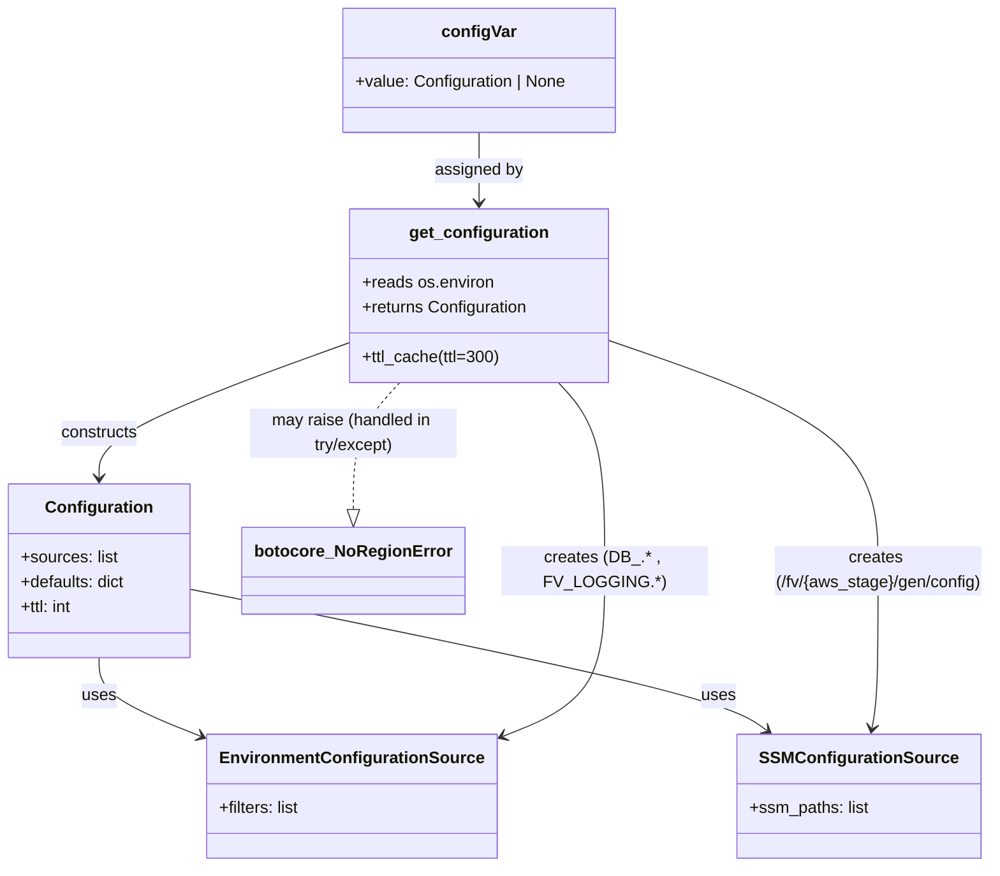

# Diagram: shipment_core/shipment_service/shipment_service/ng_shipments/config.py


> Auto-generated by Obscura crawlers

## Diagram 1



### SVG

<svg id="container" width="946.962890625" xmlns="http://www.w3.org/2000/svg" class="classDiagram" height="838" viewBox="0 0 946.962890625 838" role="graphics-document document" aria-roledescription="class"><style>#container{font-family:"trebuchet ms",verdana,arial,sans-serif;font-size:16px;fill:#333;}@keyframes edge-animation-frame{from{stroke-dashoffset:0;}}@keyframes dash{to{stroke-dashoffset:0;}}#container .edge-animation-slow{stroke-dasharray:9,5!important;stroke-dashoffset:900;animation:dash 50s linear infinite;stroke-linecap:round;}#container .edge-animation-fast{stroke-dasharray:9,5!important;stroke-dashoffset:900;animation:dash 20s linear infinite;stroke-linecap:round;}#container .error-icon{fill:#552222;}#container .error-text{fill:#552222;stroke:#552222;}#container .edge-thickness-normal{stroke-width:1px;}#container .edge-thickness-thick{stroke-width:3.5px;}#container .edge-pattern-solid{stroke-dasharray:0;}#container .edge-thickness-invisible{stroke-width:0;fill:none;}#container .edge-pattern-dashed{stroke-dasharray:3;}#container .edge-pattern-dotted{stroke-dasharray:2;}#container .marker{fill:#333333;stroke:#333333;}#container .marker.cross{stroke:#333333;}#container svg{font-family:"trebuchet ms",verdana,arial,sans-serif;font-size:16px;}#container p{margin:0;}#container g.classGroup text{fill:#9370DB;stroke:none;font-family:"trebuchet ms",verdana,arial,sans-serif;font-size:10px;}#container g.classGroup text .title{font-weight:bolder;}#container .nodeLabel,#container .edgeLabel{color:#131300;}#container .edgeLabel .label rect{fill:#ECECFF;}#container .label text{fill:#131300;}#container .labelBkg{background:#ECECFF;}#container .edgeLabel .label span{background:#ECECFF;}#container .classTitle{font-weight:bolder;}#container .node rect,#container .node circle,#container .node ellipse,#container .node polygon,#container .node path{fill:#ECECFF;stroke:#9370DB;stroke-width:1px;}#container .divider{stroke:#9370DB;stroke-width:1;}#container g.clickable{cursor:pointer;}#container g.classGroup rect{fill:#ECECFF;stroke:#9370DB;}#container g.classGroup line{stroke:#9370DB;stroke-width:1;}#container .classLabel .box{stroke:none;stroke-width:0;fill:#ECECFF;opacity:0.5;}#container .classLabel .label{fill:#9370DB;font-size:10px;}#container .relation{stroke:#333333;stroke-width:1;fill:none;}#container .dashed-line{stroke-dasharray:3;}#container .dotted-line{stroke-dasharray:1 2;}#container #compositionStart,#container .composition{fill:#333333!important;stroke:#333333!important;stroke-width:1;}#container #compositionEnd,#container .composition{fill:#333333!important;stroke:#333333!important;stroke-width:1;}#container #dependencyStart,#container .dependency{fill:#333333!important;stroke:#333333!important;stroke-width:1;}#container #dependencyStart,#container .dependency{fill:#333333!important;stroke:#333333!important;stroke-width:1;}#container #extensionStart,#container .extension{fill:transparent!important;stroke:#333333!important;stroke-width:1;}#container #extensionEnd,#container .extension{fill:transparent!important;stroke:#333333!important;stroke-width:1;}#container #aggregationStart,#container .aggregation{fill:transparent!important;stroke:#333333!important;stroke-width:1;}#container #aggregationEnd,#container .aggregation{fill:transparent!important;stroke:#333333!important;stroke-width:1;}#container #lollipopStart,#container .lollipop{fill:#ECECFF!important;stroke:#333333!important;stroke-width:1;}#container #lollipopEnd,#container .lollipop{fill:#ECECFF!important;stroke:#333333!important;stroke-width:1;}#container .edgeTerminals{font-size:11px;line-height:initial;}#container .classTitleText{text-anchor:middle;font-size:18px;fill:#333;}#container .label-icon{display:inline-block;height:1em;overflow:visible;vertical-align:-0.125em;}#container .node .label-icon path{fill:currentColor;stroke:revert;stroke-width:revert;}#container :root{--mermaid-font-family:"trebuchet ms",verdana,arial,sans-serif;}</style><g><defs><marker id="container_class-aggregationStart" class="marker aggregation class" refX="18" refY="7" markerWidth="190" markerHeight="240" orient="auto"><path d="M 18,7 L9,13 L1,7 L9,1 Z"></path></marker></defs><defs><marker id="container_class-aggregationEnd" class="marker aggregation class" refX="1" refY="7" markerWidth="20" markerHeight="28" orient="auto"><path d="M 18,7 L9,13 L1,7 L9,1 Z"></path></marker></defs><defs><marker id="container_class-extensionStart" class="marker extension class" refX="18" refY="7" markerWidth="190" markerHeight="240" orient="auto"><path d="M 1,7 L18,13 V 1 Z"></path></marker></defs><defs><marker id="container_class-extensionEnd" class="marker extension class" refX="1" refY="7" markerWidth="20" markerHeight="28" orient="auto"><path d="M 1,1 V 13 L18,7 Z"></path></marker></defs><defs><marker id="container_class-compositionStart" class="marker composition class" refX="18" refY="7" markerWidth="190" markerHeight="240" orient="auto"><path d="M 18,7 L9,13 L1,7 L9,1 Z"></path></marker></defs><defs><marker id="container_class-compositionEnd" class="marker composition class" refX="1" refY="7" markerWidth="20" markerHeight="28" orient="auto"><path d="M 18,7 L9,13 L1,7 L9,1 Z"></path></marker></defs><defs><marker id="container_class-dependencyStart" class="marker dependency class" refX="6" refY="7" markerWidth="190" markerHeight="240" orient="auto"><path d="M 5,7 L9,13 L1,7 L9,1 Z"></path></marker></defs><defs><marker id="container_class-dependencyEnd" class="marker dependency class" refX="13" refY="7" markerWidth="20" markerHeight="28" orient="auto"><path d="M 18,7 L9,13 L14,7 L9,1 Z"></path></marker></defs><defs><marker id="container_class-lollipopStart" class="marker lollipop class" refX="13" refY="7" markerWidth="190" markerHeight="240" orient="auto"><circle stroke="black" fill="transparent" cx="7" cy="7" r="6"></circle></marker></defs><defs><marker id="container_class-lollipopEnd" class="marker lollipop class" refX="1" refY="7" markerWidth="190" markerHeight="240" orient="auto"><circle stroke="black" fill="transparent" cx="7" cy="7" r="6"></circle></marker></defs><g class="root"><g class="clusters"></g><g class="edgePaths"><path d="M329.68,332.42L290.75,346.85C251.82,361.28,173.961,390.14,135.031,411.737C96.102,433.333,96.102,447.667,96.102,454.833L96.102,462" id="id_get_configuration_Configuration_1" class="edge-thickness-normal edge-pattern-solid relation" style=";;;" data-edge="true" data-et="edge" data-id="id_get_configuration_Configuration_1" data-points="W3sieCI6MzI5LjY3OTY4NzUsInkiOjMzMi40MjAyNjY1MDQwOTM0fSx7IngiOjk2LjEwMTU2MjUsInkiOjQxOX0seyJ4Ijo5Ni4xMDE1NjI1LCJ5Ijo0Njh9XQ==" marker-end="url(#container_class-dependencyEnd)"></path><path d="M96.102,636L96.102,642.167C96.102,648.333,96.102,660.667,112.883,673.653C129.664,686.639,163.227,700.278,180.008,707.098L196.789,713.918" id="id_Configuration_EnvironmentConfigurationSource_2" class="edge-thickness-normal edge-pattern-solid relation" style=";;;" data-edge="true" data-et="edge" data-id="id_Configuration_EnvironmentConfigurationSource_2" data-points="W3sieCI6OTYuMTAxNTYyNSwieSI6NjM2fSx7IngiOjk2LjEwMTU2MjUsInkiOjY3M30seyJ4IjoyMDIuMzQ3NjU2MjUsInkiOjcxNi4xNzY1NDg1NjM5NDczfV0=" marker-end="url(#container_class-dependencyEnd)"></path><path d="M184.203,570.078L267.799,587.232C351.396,604.385,518.589,638.693,609.669,661.416C700.749,684.139,715.718,695.279,723.202,700.848L730.686,706.418" id="id_Configuration_SSMConfigurationSource_3" class="edge-thickness-normal edge-pattern-solid relation" style=";;;" data-edge="true" data-et="edge" data-id="id_Configuration_SSMConfigurationSource_3" data-points="W3sieCI6MTg0LjIwMzEyNSwieSI6NTcwLjA3ODEwMTE5MzcwOTV9LHsieCI6Njg1Ljc4MTI1LCJ5Ijo2NzN9LHsieCI6NzM1LjQ5OTI1NDk5MzU1NjcsInkiOjcxMH1d" marker-end="url(#container_class-dependencyEnd)"></path><path d="M529.801,370L537.081,378.167C544.362,386.333,558.923,402.667,566.204,433C573.484,463.333,573.484,507.667,573.484,550C573.484,592.333,573.484,632.667,556.703,659.653C539.922,686.639,506.359,700.278,489.578,707.098L472.797,713.918" id="id_get_configuration_EnvironmentConfigurationSource_4" class="edge-thickness-normal edge-pattern-solid relation" style=";;;" data-edge="true" data-et="edge" data-id="id_get_configuration_EnvironmentConfigurationSource_4" data-points="W3sieCI6NTI5LjgwMDU3NTY1Nzg5NDgsInkiOjM3MH0seyJ4Ijo1NzMuNDg0Mzc1LCJ5Ijo0MTl9LHsieCI6NTczLjQ4NDM3NSwieSI6NTUyfSx7IngiOjU3My40ODQzNzUsInkiOjY3M30seyJ4Ijo0NjcuMjM4MjgxMjUsInkiOjcxNi4xNzY1NDg1NjM5NDczfV0=" marker-end="url(#container_class-dependencyEnd)"></path><path d="M580.148,329.895L622.519,344.746C664.889,359.597,749.629,389.298,791.999,426.316C834.369,463.333,834.369,507.667,834.369,550C834.369,592.333,834.369,632.667,833.394,658.017C832.419,683.368,830.469,693.736,829.494,698.92L828.518,704.103" id="id_get_configuration_SSMConfigurationSource_5" class="edge-thickness-normal edge-pattern-solid relation" style=";;;" data-edge="true" data-et="edge" data-id="id_get_configuration_SSMConfigurationSource_5" data-points="W3sieCI6NTgwLjE0ODQzNzUsInkiOjMyOS44OTQ5NzY4NjM0MDkxN30seyJ4Ijo4MzQuMzY5MTQwNjI1LCJ5Ijo0MTl9LHsieCI6ODM0LjM2OTE0MDYyNSwieSI6NTUyfSx7IngiOjgzNC4zNjkxNDA2MjUsInkiOjY3M30seyJ4Ijo4MjcuNDA5MjkwNDMxNzAxLCJ5Ijo3MTB9XQ==" marker-end="url(#container_class-dependencyEnd)"></path><path d="M454.914,128L454.914,134.167C454.914,140.333,454.914,152.667,454.914,164C454.914,175.333,454.914,185.667,454.914,190.833L454.914,196" id="id_configVar_get_configuration_6" class="edge-thickness-normal edge-pattern-solid relation" style=";;;" data-edge="true" data-et="edge" data-id="id_configVar_get_configuration_6" data-points="W3sieCI6NDU0LjkxNDA2MjUsInkiOjEyOH0seyJ4Ijo0NTQuOTE0MDYyNSwieSI6MTY1fSx7IngiOjQ1NC45MTQwNjI1LCJ5IjoyMDJ9XQ==" marker-end="url(#container_class-dependencyEnd)"></path><path d="M380.028,370L372.747,378.167C365.466,386.333,350.905,402.667,343.624,423.125C336.344,443.583,336.344,468.167,336.344,480.458L336.344,492.75" id="id_get_configuration_botocore_NoRegionError_7" class="edge-thickness-normal edge-pattern-dashed relation" style=";;;" data-edge="true" data-et="edge" data-id="id_get_configuration_botocore_NoRegionError_7" data-points="W3sieCI6MzgwLjAyNzU0OTM0MjEwNTI2LCJ5IjozNzB9LHsieCI6MzM2LjM0Mzc1LCJ5Ijo0MTl9LHsieCI6MzM2LjM0Mzc1LCJ5Ijo1MTB9XQ==" marker-end="url(#container_class-extensionEnd)"></path></g><g class="edgeLabels"><g class="edgeLabel" transform="translate(96.1015625, 419)"><g class="label" data-id="id_get_configuration_Configuration_1" transform="translate(-37.84375, -12)"><foreignObject width="75.6875" height="24"><div xmlns="http://www.w3.org/1999/xhtml" class="labelBkg" style="display: table-cell; white-space: nowrap; line-height: 1.5; max-width: 200px; text-align: center;"><span class="edgeLabel"><p>constructs</p></span></div></foreignObject></g></g><g class="edgeLabel" transform="translate(96.1015625, 673)"><g class="label" data-id="id_Configuration_EnvironmentConfigurationSource_2" transform="translate(-16.4921875, -12)"><foreignObject width="32.984375" height="24"><div xmlns="http://www.w3.org/1999/xhtml" class="labelBkg" style="display: table-cell; white-space: nowrap; line-height: 1.5; max-width: 200px; text-align: center;"><span class="edgeLabel"><p>uses</p></span></div></foreignObject></g></g><g class="edgeLabel" transform="translate(465.34714, 627.76777)"><g class="label" data-id="id_Configuration_SSMConfigurationSource_3" transform="translate(-16.4921875, -12)"><foreignObject width="32.984375" height="24"><div xmlns="http://www.w3.org/1999/xhtml" class="labelBkg" style="display: table-cell; white-space: nowrap; line-height: 1.5; max-width: 200px; text-align: center;"><span class="edgeLabel"><p>uses</p></span></div></foreignObject></g></g><g class="edgeLabel" transform="translate(573.484375, 552)"><g class="label" data-id="id_get_configuration_EnvironmentConfigurationSource_4" transform="translate(-100, -24)"><foreignObject width="200" height="48"><div xmlns="http://www.w3.org/1999/xhtml" class="labelBkg" style="display: table; white-space: break-spaces; line-height: 1.5; max-width: 200px; text-align: center; width: 200px;"><span class="edgeLabel"><p>creates (DB_.* , FV_LOGGING.*)</p></span></div></foreignObject></g></g><g class="edgeLabel" transform="translate(834.369140625, 552)"><g class="label" data-id="id_get_configuration_SSMConfigurationSource_5" transform="translate(-104.59375, -24)"><foreignObject width="209.1875" height="48"><div xmlns="http://www.w3.org/1999/xhtml" class="labelBkg" style="display: table; white-space: break-spaces; line-height: 1.5; max-width: 200px; text-align: center; width: 200px;"><span class="edgeLabel"><p>creates (/fv/{aws_stage}/gen/config)</p></span></div></foreignObject></g></g><g class="edgeLabel" transform="translate(454.9140625, 165)"><g class="label" data-id="id_configVar_get_configuration_6" transform="translate(-42.6953125, -12)"><foreignObject width="85.390625" height="24"><div xmlns="http://www.w3.org/1999/xhtml" class="labelBkg" style="display: table-cell; white-space: nowrap; line-height: 1.5; max-width: 200px; text-align: center;"><span class="edgeLabel"><p>assigned by</p></span></div></foreignObject></g></g><g class="edgeLabel" transform="translate(336.34375, 419)"><g class="label" data-id="id_get_configuration_botocore_NoRegionError_7" transform="translate(-100, -24)"><foreignObject width="200" height="48"><div xmlns="http://www.w3.org/1999/xhtml" class="labelBkg" style="display: table; white-space: break-spaces; line-height: 1.5; max-width: 200px; text-align: center; width: 200px;"><span class="edgeLabel"><p>may raise (handled in try/except)</p></span></div></foreignObject></g></g></g><g class="nodes"><g class="node default" id="classId-get_configuration-0" transform="translate(454.9140625, 286)"><g class="basic label-container"><path d="M-125.234375 -84 L125.234375 -84 L125.234375 84 L-125.234375 84" stroke="none" stroke-width="0" fill="#ECECFF" style=""></path><path d="M-125.234375 -84 C-53.613694649700975 -84, 18.00698570059805 -84, 125.234375 -84 M-125.234375 -84 C-49.43040366362125 -84, 26.373567672757503 -84, 125.234375 -84 M125.234375 -84 C125.234375 -48.72874789230047, 125.234375 -13.457495784600937, 125.234375 84 M125.234375 -84 C125.234375 -40.70084457900871, 125.234375 2.598310841982581, 125.234375 84 M125.234375 84 C33.1948165466422 84, -58.8447419067156 84, -125.234375 84 M125.234375 84 C27.802192819771875 84, -69.62998936045625 84, -125.234375 84 M-125.234375 84 C-125.234375 41.69643832358104, -125.234375 -0.6071233528379167, -125.234375 -84 M-125.234375 84 C-125.234375 17.39990653367309, -125.234375 -49.20018693265382, -125.234375 -84" stroke="#9370DB" stroke-width="1.3" fill="none" stroke-dasharray="0 0" style=""></path></g><g class="annotation-group text" transform="translate(0, -60)"></g><g class="label-group text" transform="translate(-64.34375, -60)"><g class="label" style="font-weight: bolder" transform="translate(0,-12)"><foreignObject width="128.6875" height="24"><div xmlns="http://www.w3.org/1999/xhtml" style="display: table-cell; white-space: nowrap; line-height: 1.5; max-width: 177px; text-align: center;"><span class="nodeLabel markdown-node-label" style=""><p>get_configuration</p></span></div></foreignObject></g></g><g class="members-group text" transform="translate(-113.234375, -12)"><g class="label" style="" transform="translate(0,-12)"><foreignObject width="127.515625" height="24"><div xmlns="http://www.w3.org/1999/xhtml" style="display: table-cell; white-space: nowrap; line-height: 1.5; max-width: 185px; text-align: center;"><span class="nodeLabel markdown-node-label" style=""><p>+reads os.environ</p></span></div></foreignObject></g><g class="label" style="" transform="translate(0,12)"><foreignObject width="162.125" height="24"><div xmlns="http://www.w3.org/1999/xhtml" style="display: table-cell; white-space: nowrap; line-height: 1.5; max-width: 219px; text-align: center;"><span class="nodeLabel markdown-node-label" style=""><p>+returns Configuration</p></span></div></foreignObject></g></g><g class="methods-group text" transform="translate(-113.234375, 60)"><g class="label" style="" transform="translate(0,-12)"><foreignObject width="133.65625" height="24"><div xmlns="http://www.w3.org/1999/xhtml" style="display: table-cell; white-space: nowrap; line-height: 1.5; max-width: 191px; text-align: center;"><span class="nodeLabel markdown-node-label" style=""><p>+ttl_cache(ttl=300)</p></span></div></foreignObject></g></g><g class="divider" style=""><path d="M-125.234375 -36 C-51.41284131979286 -36, 22.40869236041428 -36, 125.234375 -36 M-125.234375 -36 C-64.65024873494289 -36, -4.066122469885798 -36, 125.234375 -36" stroke="#9370DB" stroke-width="1.3" fill="none" stroke-dasharray="0 0" style=""></path></g><g class="divider" style=""><path d="M-125.234375 36 C-40.24056975495955 36, 44.7532354900809 36, 125.234375 36 M-125.234375 36 C-26.886794454679432 36, 71.46078609064114 36, 125.234375 36" stroke="#9370DB" stroke-width="1.3" fill="none" stroke-dasharray="0 0" style=""></path></g></g><g class="node default" id="classId-Configuration-1" transform="translate(96.1015625, 552)"><g class="basic label-container"><path d="M-88.1015625 -84 L88.1015625 -84 L88.1015625 84 L-88.1015625 84" stroke="none" stroke-width="0" fill="#ECECFF" style=""></path><path d="M-88.1015625 -84 C-24.124546059781068 -84, 39.852470380437865 -84, 88.1015625 -84 M-88.1015625 -84 C-40.67673607107841 -84, 6.748090357843182 -84, 88.1015625 -84 M88.1015625 -84 C88.1015625 -34.31401202871254, 88.1015625 15.37197594257492, 88.1015625 84 M88.1015625 -84 C88.1015625 -19.43862326643675, 88.1015625 45.1227534671265, 88.1015625 84 M88.1015625 84 C20.073124825949463 84, -47.95531284810107 84, -88.1015625 84 M88.1015625 84 C51.865412270299956 84, 15.629262040599912 84, -88.1015625 84 M-88.1015625 84 C-88.1015625 21.503576115281433, -88.1015625 -40.992847769437134, -88.1015625 -84 M-88.1015625 84 C-88.1015625 23.806003296095348, -88.1015625 -36.387993407809304, -88.1015625 -84" stroke="#9370DB" stroke-width="1.3" fill="none" stroke-dasharray="0 0" style=""></path></g><g class="annotation-group text" transform="translate(0, -60)"></g><g class="label-group text" transform="translate(-49.375, -60)"><g class="label" style="font-weight: bolder" transform="translate(0,-12)"><foreignObject width="98.75" height="24"><div xmlns="http://www.w3.org/1999/xhtml" style="display: table-cell; white-space: nowrap; line-height: 1.5; max-width: 147px; text-align: center;"><span class="nodeLabel markdown-node-label" style=""><p>Configuration</p></span></div></foreignObject></g></g><g class="members-group text" transform="translate(-76.1015625, -12)"><g class="label" style="" transform="translate(0,-12)"><foreignObject width="93.859375" height="24"><div xmlns="http://www.w3.org/1999/xhtml" style="display: table-cell; white-space: nowrap; line-height: 1.5; max-width: 151px; text-align: center;"><span class="nodeLabel markdown-node-label" style=""><p>+sources: list</p></span></div></foreignObject></g><g class="label" style="" transform="translate(0,12)"><foreignObject width="102.828125" height="24"><div xmlns="http://www.w3.org/1999/xhtml" style="display: table-cell; white-space: nowrap; line-height: 1.5; max-width: 160px; text-align: center;"><span class="nodeLabel markdown-node-label" style=""><p>+defaults: dict</p></span></div></foreignObject></g><g class="label" style="" transform="translate(0,36)"><foreignObject width="51.890625" height="24"><div xmlns="http://www.w3.org/1999/xhtml" style="display: table-cell; white-space: nowrap; line-height: 1.5; max-width: 109px; text-align: center;"><span class="nodeLabel markdown-node-label" style=""><p>+ttl: int</p></span></div></foreignObject></g></g><g class="methods-group text" transform="translate(-76.1015625, 84)"></g><g class="divider" style=""><path d="M-88.1015625 -36 C-25.980466928905187 -36, 36.140628642189625 -36, 88.1015625 -36 M-88.1015625 -36 C-24.593946222881627 -36, 38.913670054236746 -36, 88.1015625 -36" stroke="#9370DB" stroke-width="1.3" fill="none" stroke-dasharray="0 0" style=""></path></g><g class="divider" style=""><path d="M-88.1015625 60 C-18.41393020353091 60, 51.27370209293818 60, 88.1015625 60 M-88.1015625 60 C-20.149855703257572 60, 47.801851093484856 60, 88.1015625 60" stroke="#9370DB" stroke-width="1.3" fill="none" stroke-dasharray="0 0" style=""></path></g></g><g class="node default" id="classId-EnvironmentConfigurationSource-2" transform="translate(334.79296875, 770)"><g class="basic label-container"><path d="M-132.4453125 -60 L132.4453125 -60 L132.4453125 60 L-132.4453125 60" stroke="none" stroke-width="0" fill="#ECECFF" style=""></path><path d="M-132.4453125 -60 C-27.129147488062898 -60, 78.1870175238742 -60, 132.4453125 -60 M-132.4453125 -60 C-41.64258304221161 -60, 49.160146415576776 -60, 132.4453125 -60 M132.4453125 -60 C132.4453125 -30.803829917713056, 132.4453125 -1.6076598354261122, 132.4453125 60 M132.4453125 -60 C132.4453125 -16.04630926354767, 132.4453125 27.90738147290466, 132.4453125 60 M132.4453125 60 C55.035219740070445 60, -22.37487301985911 60, -132.4453125 60 M132.4453125 60 C36.63698225086486 60, -59.17134799827028 60, -132.4453125 60 M-132.4453125 60 C-132.4453125 16.412310856343055, -132.4453125 -27.17537828731389, -132.4453125 -60 M-132.4453125 60 C-132.4453125 19.565567182490604, -132.4453125 -20.868865635018793, -132.4453125 -60" stroke="#9370DB" stroke-width="1.3" fill="none" stroke-dasharray="0 0" style=""></path></g><g class="annotation-group text" transform="translate(0, -36)"></g><g class="label-group text" transform="translate(-120.4453125, -36)"><g class="label" style="font-weight: bolder" transform="translate(0,-12)"><foreignObject width="240.890625" height="24"><div xmlns="http://www.w3.org/1999/xhtml" style="display: table-cell; white-space: nowrap; line-height: 1.5; max-width: 289px; text-align: center;"><span class="nodeLabel markdown-node-label" style=""><p>EnvironmentConfigurationSource</p></span></div></foreignObject></g></g><g class="members-group text" transform="translate(-120.4453125, 12)"><g class="label" style="" transform="translate(0,-12)"><foreignObject width="79.828125" height="24"><div xmlns="http://www.w3.org/1999/xhtml" style="display: table-cell; white-space: nowrap; line-height: 1.5; max-width: 137px; text-align: center;"><span class="nodeLabel markdown-node-label" style=""><p>+filters: list</p></span></div></foreignObject></g></g><g class="methods-group text" transform="translate(-120.4453125, 60)"></g><g class="divider" style=""><path d="M-132.4453125 -12 C-48.382934675887 -12, 35.679443148226 -12, 132.4453125 -12 M-132.4453125 -12 C-60.192750458105266 -12, 12.059811583789468 -12, 132.4453125 -12" stroke="#9370DB" stroke-width="1.3" fill="none" stroke-dasharray="0 0" style=""></path></g><g class="divider" style=""><path d="M-132.4453125 36 C-73.44647691213643 36, -14.447641324272865 36, 132.4453125 36 M-132.4453125 36 C-61.93925920228253 36, 8.566794095434943 36, 132.4453125 36" stroke="#9370DB" stroke-width="1.3" fill="none" stroke-dasharray="0 0" style=""></path></g></g><g class="node default" id="classId-SSMConfigurationSource-3" transform="translate(816.123046875, 770)"><g class="basic label-container"><path d="M-114.73046875 -60 L114.73046875 -60 L114.73046875 60 L-114.73046875 60" stroke="none" stroke-width="0" fill="#ECECFF" style=""></path><path d="M-114.73046875 -60 C-65.99789876070889 -60, -17.265328771417785 -60, 114.73046875 -60 M-114.73046875 -60 C-24.518323474636034 -60, 65.69382180072793 -60, 114.73046875 -60 M114.73046875 -60 C114.73046875 -19.243228430189035, 114.73046875 21.51354313962193, 114.73046875 60 M114.73046875 -60 C114.73046875 -24.62920519562428, 114.73046875 10.74158960875144, 114.73046875 60 M114.73046875 60 C29.573508031120525 60, -55.58345268775895 60, -114.73046875 60 M114.73046875 60 C44.27995146842494 60, -26.17056581315012 60, -114.73046875 60 M-114.73046875 60 C-114.73046875 28.894085337136033, -114.73046875 -2.2118293257279333, -114.73046875 -60 M-114.73046875 60 C-114.73046875 21.634508881722056, -114.73046875 -16.73098223655589, -114.73046875 -60" stroke="#9370DB" stroke-width="1.3" fill="none" stroke-dasharray="0 0" style=""></path></g><g class="annotation-group text" transform="translate(0, -36)"></g><g class="label-group text" transform="translate(-89.4453125, -36)"><g class="label" style="font-weight: bolder" transform="translate(0,-12)"><foreignObject width="178.890625" height="24"><div xmlns="http://www.w3.org/1999/xhtml" style="display: table-cell; white-space: nowrap; line-height: 1.5; max-width: 226px; text-align: center;"><span class="nodeLabel markdown-node-label" style=""><p>SSMConfigurationSource</p></span></div></foreignObject></g></g><g class="members-group text" transform="translate(-102.73046875, 12)"><g class="label" style="" transform="translate(0,-12)"><foreignObject width="116.015625" height="24"><div xmlns="http://www.w3.org/1999/xhtml" style="display: table-cell; white-space: nowrap; line-height: 1.5; max-width: 174px; text-align: center;"><span class="nodeLabel markdown-node-label" style=""><p>+ssm_paths: list</p></span></div></foreignObject></g></g><g class="methods-group text" transform="translate(-102.73046875, 60)"></g><g class="divider" style=""><path d="M-114.73046875 -12 C-59.991456052081745 -12, -5.252443354163489 -12, 114.73046875 -12 M-114.73046875 -12 C-36.56942412150124 -12, 41.591620506997515 -12, 114.73046875 -12" stroke="#9370DB" stroke-width="1.3" fill="none" stroke-dasharray="0 0" style=""></path></g><g class="divider" style=""><path d="M-114.73046875 36 C-66.1547418921453 36, -17.579015034290606 36, 114.73046875 36 M-114.73046875 36 C-32.72929783154312 36, 49.27187308691376 36, 114.73046875 36" stroke="#9370DB" stroke-width="1.3" fill="none" stroke-dasharray="0 0" style=""></path></g></g><g class="node default" id="classId-configVar-4" transform="translate(454.9140625, 68)"><g class="basic label-container"><path d="M-131.72265625 -60 L131.72265625 -60 L131.72265625 60 L-131.72265625 60" stroke="none" stroke-width="0" fill="#ECECFF" style=""></path><path d="M-131.72265625 -60 C-38.901414473415144 -60, 53.91982730316971 -60, 131.72265625 -60 M-131.72265625 -60 C-43.68987092795426 -60, 44.34291439409148 -60, 131.72265625 -60 M131.72265625 -60 C131.72265625 -30.64773772031596, 131.72265625 -1.2954754406319182, 131.72265625 60 M131.72265625 -60 C131.72265625 -14.16319877831468, 131.72265625 31.67360244337064, 131.72265625 60 M131.72265625 60 C26.62774978828982 60, -78.46715667342036 60, -131.72265625 60 M131.72265625 60 C46.35430528727261 60, -39.01404567545478 60, -131.72265625 60 M-131.72265625 60 C-131.72265625 14.530476739057612, -131.72265625 -30.939046521884777, -131.72265625 -60 M-131.72265625 60 C-131.72265625 20.390102851933293, -131.72265625 -19.219794296133415, -131.72265625 -60" stroke="#9370DB" stroke-width="1.3" fill="none" stroke-dasharray="0 0" style=""></path></g><g class="annotation-group text" transform="translate(0, -36)"></g><g class="label-group text" transform="translate(-33.9921875, -36)"><g class="label" style="font-weight: bolder" transform="translate(0,-12)"><foreignObject width="67.984375" height="24"><div xmlns="http://www.w3.org/1999/xhtml" style="display: table-cell; white-space: nowrap; line-height: 1.5; max-width: 118px; text-align: center;"><span class="nodeLabel markdown-node-label" style=""><p>configVar</p></span></div></foreignObject></g></g><g class="members-group text" transform="translate(-119.72265625, 12)"><g class="label" style="" transform="translate(0,-12)"><foreignObject width="205.453125" height="24"><div xmlns="http://www.w3.org/1999/xhtml" style="display: table-cell; white-space: nowrap; line-height: 1.5; max-width: 263px; text-align: center;"><span class="nodeLabel markdown-node-label" style=""><p>+value: Configuration | None</p></span></div></foreignObject></g></g><g class="methods-group text" transform="translate(-119.72265625, 60)"></g><g class="divider" style=""><path d="M-131.72265625 -12 C-42.386688980457535 -12, 46.94927828908493 -12, 131.72265625 -12 M-131.72265625 -12 C-62.16731708982664 -12, 7.388022070346722 -12, 131.72265625 -12" stroke="#9370DB" stroke-width="1.3" fill="none" stroke-dasharray="0 0" style=""></path></g><g class="divider" style=""><path d="M-131.72265625 36 C-64.85428965124808 36, 2.0140769475038383 36, 131.72265625 36 M-131.72265625 36 C-49.33528776711806 36, 33.05208071576388 36, 131.72265625 36" stroke="#9370DB" stroke-width="1.3" fill="none" stroke-dasharray="0 0" style=""></path></g></g><g class="node default" id="classId-botocore_NoRegionError-5" transform="translate(336.34375, 552)"><g class="basic label-container"><path d="M-102.140625 -42 L102.140625 -42 L102.140625 42 L-102.140625 42" stroke="none" stroke-width="0" fill="#ECECFF" style=""></path><path d="M-102.140625 -42 C-56.63795252227865 -42, -11.135280044557305 -42, 102.140625 -42 M-102.140625 -42 C-49.22073110389983 -42, 3.6991627922003403 -42, 102.140625 -42 M102.140625 -42 C102.140625 -12.794247393146708, 102.140625 16.411505213706583, 102.140625 42 M102.140625 -42 C102.140625 -14.379258885701176, 102.140625 13.241482228597647, 102.140625 42 M102.140625 42 C34.146854965242255 42, -33.84691506951549 42, -102.140625 42 M102.140625 42 C51.84754975922551 42, 1.5544745184510163 42, -102.140625 42 M-102.140625 42 C-102.140625 21.95456130020913, -102.140625 1.9091226004182573, -102.140625 -42 M-102.140625 42 C-102.140625 24.531461126064823, -102.140625 7.0629222521296455, -102.140625 -42" stroke="#9370DB" stroke-width="1.3" fill="none" stroke-dasharray="0 0" style=""></path></g><g class="annotation-group text" transform="translate(0, -18)"></g><g class="label-group text" transform="translate(-90.140625, -18)"><g class="label" style="font-weight: bolder" transform="translate(0,-12)"><foreignObject width="180.28125" height="24"><div xmlns="http://www.w3.org/1999/xhtml" style="display: table-cell; white-space: nowrap; line-height: 1.5; max-width: 229px; text-align: center;"><span class="nodeLabel markdown-node-label" style=""><p>botocore_NoRegionError</p></span></div></foreignObject></g></g><g class="members-group text" transform="translate(-90.140625, 30)"></g><g class="methods-group text" transform="translate(-90.140625, 60)"></g><g class="divider" style=""><path d="M-102.140625 6 C-40.68535817586855 6, 20.7699086482629 6, 102.140625 6 M-102.140625 6 C-25.006259724099294 6, 52.12810555180141 6, 102.140625 6" stroke="#9370DB" stroke-width="1.3" fill="none" stroke-dasharray="0 0" style=""></path></g><g class="divider" style=""><path d="M-102.140625 24 C-40.810242217859326 24, 20.52014056428135 24, 102.140625 24 M-102.140625 24 C-30.794947029201253 24, 40.55073094159749 24, 102.140625 24" stroke="#9370DB" stroke-width="1.3" fill="none" stroke-dasharray="0 0" style=""></path></g></g></g></g></g></svg>

## Diagram 2

```mermaid
flowchart TD
    Start([start]) --> ReadEnv{read AWS_STAGE}
    ReadEnv --> ValidStage{is AWS_STAGE in ["test","staging1","prod-b","staging"]}
    ValidStage -- yes --> UseStage[use provided aws_stage]
    ValidStage -- no --> DefaultStage[set aws_stage = "staging"]
    UseStage --> IntTest{is INT_TESTING set?}
    DefaultStage --> IntTest
    IntTest -- yes --> AppendTest[append "-test" to aws_stage]
    IntTest -- no --> KeepStage[keep aws_stage]
    AppendTest --> BuildSources
    KeepStage --> BuildSources
    BuildSources --> SourcesList[create sources list:\n- EnvironmentConfigurationSource(filters=["DB_.*"])\n- SSMConfigurationSource(ssm_paths=[/fv/{aws_stage}/gen/config])\n- EnvironmentConfigurationSource(filters=["FV_LOGGING.*","LOG_LEVEL"])]
    SourcesList --> Defaults[set defaults LOG_LEVEL="INFO", DB_APPLICATION_NAME="shipments"]
    Defaults --> CreateConfig[return fv.config.Configuration(sources, defaults, ttl=30)]
    CreateConfig --> Success([Configuration returned])
    Start --> TryAssign{in try block?}
    TryAssign --> CreateConfig
    CreateConfig --> End([end])
    TryAssign -.-> ErrorCatch[except NoRegionError\nset config = None] --> End
```

> SVG rendering failed for this diagram.
