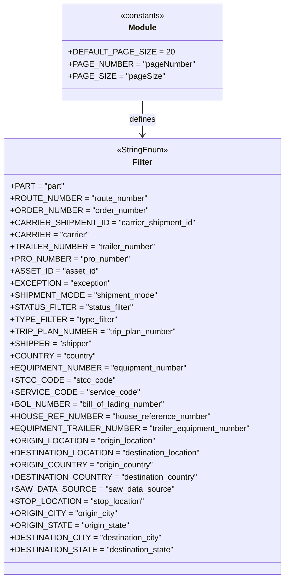

# Diagram: shipment_core/shipment_service/shipment_service/ng_shipments/constants.py

> Auto-generated by Obscura crawlers

## Mermaid

### SVG

<svg id="container" width="542.375" xmlns="http://www.w3.org/2000/svg" class="classDiagram" height="1146" viewBox="0 0 542.375 1146" role="graphics-document document" aria-roledescription="class"><g><defs><marker id="container_class-aggregationStart" class="marker aggregation class" refX="18" refY="7" markerWidth="190" markerHeight="240" orient="auto"><path d="M 18,7 L9,13 L1,7 L9,1 Z"></path></marker></defs><defs><marker id="container_class-aggregationEnd" class="marker aggregation class" refX="1" refY="7" markerWidth="20" markerHeight="28" orient="auto"><path d="M 18,7 L9,13 L1,7 L9,1 Z"></path></marker></defs><defs><marker id="container_class-extensionStart" class="marker extension class" refX="18" refY="7" markerWidth="190" markerHeight="240" orient="auto"><path d="M 1,7 L18,13 V 1 Z"></path></marker></defs><defs><marker id="container_class-extensionEnd" class="marker extension class" refX="1" refY="7" markerWidth="20" markerHeight="28" orient="auto"><path d="M 1,1 V 13 L18,7 Z"></path></marker></defs><defs><marker id="container_class-compositionStart" class="marker composition class" refX="18" refY="7" markerWidth="190" markerHeight="240" orient="auto"><path d="M 18,7 L9,13 L1,7 L9,1 Z"></path></marker></defs><defs><marker id="container_class-compositionEnd" class="marker composition class" refX="1" refY="7" markerWidth="20" markerHeight="28" orient="auto"><path d="M 18,7 L9,13 L1,7 L9,1 Z"></path></marker></defs><defs><marker id="container_class-dependencyStart" class="marker dependency class" refX="6" refY="7" markerWidth="190" markerHeight="240" orient="auto"><path d="M 5,7 L9,13 L1,7 L9,1 Z"></path></marker></defs><defs><marker id="container_class-dependencyEnd" class="marker dependency class" refX="13" refY="7" markerWidth="20" markerHeight="28" orient="auto"><path d="M 18,7 L9,13 L14,7 L9,1 Z"></path></marker></defs><defs><marker id="container_class-lollipopStart" class="marker lollipop class" refX="13" refY="7" markerWidth="190" markerHeight="240" orient="auto"><circle stroke="black" fill="transparent" cx="7" cy="7" r="6"></circle></marker></defs><defs><marker id="container_class-lollipopEnd" class="marker lollipop class" refX="1" refY="7" markerWidth="190" markerHeight="240" orient="auto"><circle stroke="black" fill="transparent" cx="7" cy="7" r="6"></circle></marker></defs><g class="root"><g class="clusters"></g><g class="edgePaths"><path d="M271.188,200L271.188,206.167C271.188,212.333,271.188,224.667,271.188,236C271.188,247.333,271.188,257.667,271.188,262.833L271.188,268" id="id_Module_Filter_1" class="edge-thickness-normal edge-pattern-solid relation" style=";;;" data-edge="true" data-et="edge" data-id="id_Module_Filter_1" data-points="W3sieCI6MjcxLjE4NzUsInkiOjIwMH0seyJ4IjoyNzEuMTg3NSwieSI6MjM3fSx7IngiOjI3MS4xODc1LCJ5IjoyNzR9XQ==" marker-end="url(#container_class-dependencyEnd)"></path></g><g class="edgeLabels"><g class="edgeLabel" transform="translate(271.1875, 237)"><g class="label" data-id="id_Module_Filter_1" transform="translate(-26.53125, -12)"><foreignObject width="53.0625" height="24">

defines

</foreignObject></g></g></g><g class="nodes"><g class="node default" id="classId-Module-0" transform="translate(271.1875, 104)"><g class="basic label-container"><path d="M-152.40234375 -96 L152.40234375 -96 L152.40234375 96 L-152.40234375 96" stroke="none" stroke-width="0" fill="#ECECFF" style=""></path><path d="M-152.40234375 -96 C-36.65415006492478 -96, 79.09404362015044 -96, 152.40234375 -96 M-152.40234375 -96 C-58.978026548977155 -96, 34.44629065204569 -96, 152.40234375 -96 M152.40234375 -96 C152.40234375 -44.51335844791222, 152.40234375 6.9732831041755645, 152.40234375 96 M152.40234375 -96 C152.40234375 -40.26414369026095, 152.40234375 15.471712619478097, 152.40234375 96 M152.40234375 96 C43.58296857400809 96, -65.23640660198382 96, -152.40234375 96 M152.40234375 96 C89.02149807569957 96, 25.640652401399137 96, -152.40234375 96 M-152.40234375 96 C-152.40234375 21.39140460370261, -152.40234375 -53.21719079259478, -152.40234375 -96 M-152.40234375 96 C-152.40234375 42.51613568465183, -152.40234375 -10.967728630696342, -152.40234375 -96" stroke="#9370DB" stroke-width="1.3" fill="none" stroke-dasharray="0 0" style=""></path></g><g class="annotation-group text" transform="translate(-44.2265625, -72)"><g class="label" style="" transform="translate(0,-12)"><foreignObject width="88.453125" height="24">

«constants»

</foreignObject></g></g><g class="label-group text" transform="translate(-27.09375, -48)"><g class="label" style="font-weight: bolder" transform="translate(0,-12)"><foreignObject width="54.1875" height="24">

Module

</foreignObject></g></g><g class="members-group text" transform="translate(-140.40234375, 0)"><g class="label" style="" transform="translate(0,-12)"><foreignObject width="183.625" height="24">

+DEFAULT_PAGE_SIZE = 20

</foreignObject></g><g class="label" style="" transform="translate(0,12)"><foreignObject width="236.578125" height="24">

+PAGE_NUMBER = "pageNumber"

</foreignObject></g><g class="label" style="" transform="translate(0,36)"><foreignObject width="174.9375" height="24">

+PAGE_SIZE = "pageSize"

</foreignObject></g></g><g class="methods-group text" transform="translate(-140.40234375, 96)"></g><g class="divider" style=""><path d="M-152.40234375 -24 C-76.55162492522715 -24, -0.70090610045429 -24, 152.40234375 -24 M-152.40234375 -24 C-88.76172714953631 -24, -25.12111054907264 -24, 152.40234375 -24" stroke="#9370DB" stroke-width="1.3" fill="none" stroke-dasharray="0 0" style=""></path></g><g class="divider" style=""><path d="M-152.40234375 72 C-41.134060786214405 72, 70.13422217757119 72, 152.40234375 72 M-152.40234375 72 C-39.39916073872995 72, 73.6040222725401 72, 152.40234375 72" stroke="#9370DB" stroke-width="1.3" fill="none" stroke-dasharray="0 0" style=""></path></g></g><g class="node default" id="classId-Filter-1" transform="translate(271.1875, 706)"><g class="basic label-container"><path d="M-263.1875 -432 L263.1875 -432 L263.1875 432 L-263.1875 432" stroke="none" stroke-width="0" fill="#ECECFF" style=""></path><path d="M-263.1875 -432 C-93.26441559099658 -432, 76.65866881800684 -432, 263.1875 -432 M-263.1875 -432 C-141.4414963338558 -432, -19.69549266771162 -432, 263.1875 -432 M263.1875 -432 C263.1875 -189.49795214958007, 263.1875 53.004095700839855, 263.1875 432 M263.1875 -432 C263.1875 -92.80961637889902, 263.1875 246.38076724220196, 263.1875 432 M263.1875 432 C141.207932219057 432, 19.228364438114028 432, -263.1875 432 M263.1875 432 C135.5580609506807 432, 7.928621901361396 432, -263.1875 432 M-263.1875 432 C-263.1875 171.6853776674721, -263.1875 -88.62924466505581, -263.1875 -432 M-263.1875 432 C-263.1875 198.52316597449055, -263.1875 -34.953668051018894, -263.1875 -432" stroke="#9370DB" stroke-width="1.3" fill="none" stroke-dasharray="0 0" style=""></path></g><g class="annotation-group text" transform="translate(-50.96875, -408)"><g class="label" style="" transform="translate(0,-12)"><foreignObject width="101.9375" height="24">

«StringEnum»

</foreignObject></g></g><g class="label-group text" transform="translate(-18.8671875, -384)"><g class="label" style="font-weight: bolder" transform="translate(0,-12)"><foreignObject width="37.734375" height="24">

Filter

</foreignObject></g></g><g class="members-group text" transform="translate(-251.1875, -336)"><g class="label" style="" transform="translate(0,-12)"><foreignObject width="102.140625" height="24">

+PART = "part"

</foreignObject></g><g class="label" style="" transform="translate(0,12)"><foreignObject width="259" height="24">

+ROUTE_NUMBER = "route_number"

</foreignObject></g><g class="label" style="" transform="translate(0,36)"><foreignObject width="260.046875" height="24">

+ORDER_NUMBER = "order_number"

</foreignObject></g><g class="label" style="" transform="translate(0,60)"><foreignObject width="347.25" height="24">

+CARRIER_SHIPMENT_ID = "carrier_shipment_id"

</foreignObject></g><g class="label" style="" transform="translate(0,84)"><foreignObject width="145.546875" height="24">

+CARRIER = "carrier"

</foreignObject></g><g class="label" style="" transform="translate(0,108)"><foreignObject width="272.921875" height="24">

+TRAILER_NUMBER = "trailer_number"

</foreignObject></g><g class="label" style="" transform="translate(0,132)"><foreignObject width="226.171875" height="24">

+PRO_NUMBER = "pro_number"

</foreignObject></g><g class="label" style="" transform="translate(0,156)"><foreignObject width="162.859375" height="24">

+ASSET_ID = "asset_id"

</foreignObject></g><g class="label" style="" transform="translate(0,180)"><foreignObject width="186.0625" height="24">

+EXCEPTION = "exception"

</foreignObject></g><g class="label" style="" transform="translate(0,204)"><foreignObject width="277.484375" height="24">

+SHIPMENT_MODE = "shipment_mode"

</foreignObject></g><g class="label" style="" transform="translate(0,228)"><foreignObject width="228.15625" height="24">

+STATUS_FILTER = "status_filter"

</foreignObject></g><g class="label" style="" transform="translate(0,252)"><foreignObject width="199.4375" height="24">

+TYPE_FILTER = "type_filter"

</foreignObject></g><g class="label" style="" transform="translate(0,276)"><foreignObject width="314.25" height="24">

+TRIP_PLAN_NUMBER = "trip_plan_number"

</foreignObject></g><g class="label" style="" transform="translate(0,300)"><foreignObject width="152.921875" height="24">

+SHIPPER = "shipper"

</foreignObject></g><g class="label" style="" transform="translate(0,324)"><foreignObject width="159.828125" height="24">

+COUNTRY = "country"

</foreignObject></g><g class="label" style="" transform="translate(0,348)"><foreignObject width="334.6875" height="24">

+EQUIPMENT_NUMBER = "equipment_number"

</foreignObject></g><g class="label" style="" transform="translate(0,372)"><foreignObject width="187.15625" height="24">

+STCC_CODE = "stcc_code"

</foreignObject></g><g class="label" style="" transform="translate(0,396)"><foreignObject width="233.953125" height="24">

+SERVICE_CODE = "service_code"

</foreignObject></g><g class="label" style="" transform="translate(0,420)"><foreignObject width="300.375" height="24">

+BOL_NUMBER = "bill_of_lading_number"

</foreignObject></g><g class="label" style="" transform="translate(0,444)"><foreignObject width="375.28125" height="24">

+HOUSE_REF_NUMBER = "house_reference_number"

</foreignObject></g><g class="label" style="" transform="translate(0,468)"><foreignObject width="451.40625" height="24">

+EQUIPMENT_TRAILER_NUMBER = "trailer_equipment_number"

</foreignObject></g><g class="label" style="" transform="translate(0,492)"><foreignObject width="276.640625" height="24">

+ORIGIN_LOCATION = "origin_location"

</foreignObject></g><g class="label" style="" transform="translate(0,516)"><foreignObject width="360.6875" height="24">

+DESTINATION_LOCATION = "destination_location"

</foreignObject></g><g class="label" style="" transform="translate(0,540)"><foreignObject width="268.96875" height="24">

+ORIGIN_COUNTRY = "origin_country"

</foreignObject></g><g class="label" style="" transform="translate(0,564)"><foreignObject width="353" height="24">

+DESTINATION_COUNTRY = "destination_country"

</foreignObject></g><g class="label" style="" transform="translate(0,588)"><foreignObject width="299.171875" height="24">

+SAW_DATA_SOURCE = "saw_data_source"

</foreignObject></g><g class="label" style="" transform="translate(0,612)"><foreignObject width="248.9375" height="24">

+STOP_LOCATION = "stop_location"

</foreignObject></g><g class="label" style="" transform="translate(0,636)"><foreignObject width="202.703125" height="24">

+ORIGIN_CITY = "origin_city"

</foreignObject></g><g class="label" style="" transform="translate(0,660)"><foreignObject width="223.828125" height="24">

+ORIGIN_STATE = "origin_state"

</foreignObject></g><g class="label" style="" transform="translate(0,684)"><foreignObject width="286.734375" height="24">

+DESTINATION_CITY = "destination_city"

</foreignObject></g><g class="label" style="" transform="translate(0,708)"><foreignObject width="307.859375" height="24">

+DESTINATION_STATE = "destination_state"

</foreignObject></g></g><g class="methods-group text" transform="translate(-251.1875, 432)"></g><g class="divider" style=""><path d="M-263.1875 -360 C-142.53537170240958 -360, -21.883243404819126 -360, 263.1875 -360 M-263.1875 -360 C-77.02201327092817 -360, 109.14347345814366 -360, 263.1875 -360" stroke="#9370DB" stroke-width="1.3" fill="none" stroke-dasharray="0 0" style=""></path></g><g class="divider" style=""><path d="M-263.1875 408 C-97.82800633679977 408, 67.53148732640045 408, 263.1875 408 M-263.1875 408 C-56.71306886753453 408, 149.76136226493094 408, 263.1875 408" stroke="#9370DB" stroke-width="1.3" fill="none" stroke-dasharray="0 0" style=""></path></g></g></g></g></g></svg>
