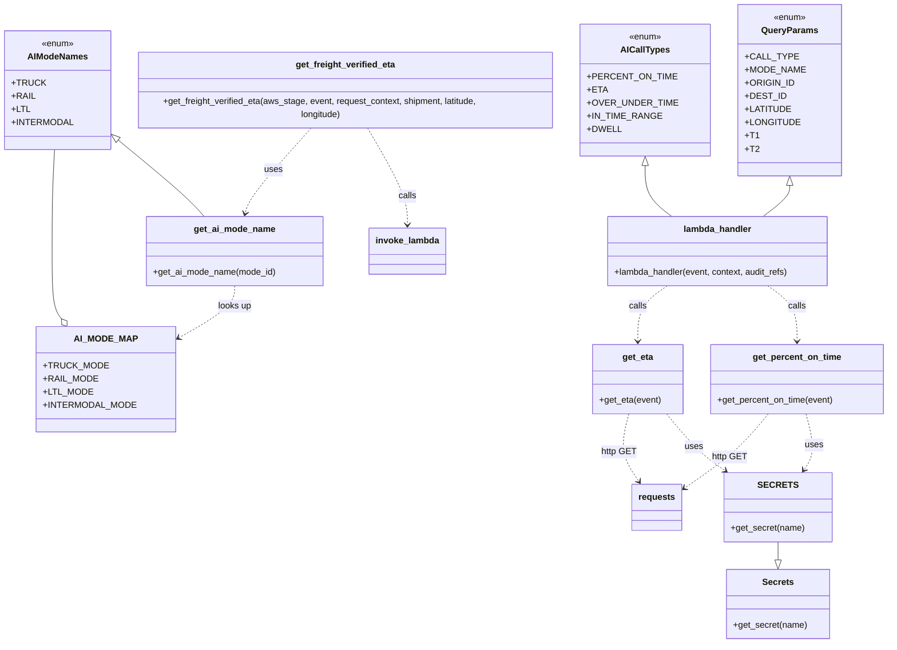

# Diagram: shipment_core/shipment_service/shipment_service/ng_shipments/fv_ai_handler.py


> Auto-generated by Obscura crawlers

## Diagram 1



### SVG

<svg id="container" width="1589.529296875" xmlns="http://www.w3.org/2000/svg" class="classDiagram" height="1170" viewBox="0 0 1589.529296875 1170" role="graphics-document document" aria-roledescription="class"><style>#container{font-family:"trebuchet ms",verdana,arial,sans-serif;font-size:16px;fill:#333;}@keyframes edge-animation-frame{from{stroke-dashoffset:0;}}@keyframes dash{to{stroke-dashoffset:0;}}#container .edge-animation-slow{stroke-dasharray:9,5!important;stroke-dashoffset:900;animation:dash 50s linear infinite;stroke-linecap:round;}#container .edge-animation-fast{stroke-dasharray:9,5!important;stroke-dashoffset:900;animation:dash 20s linear infinite;stroke-linecap:round;}#container .error-icon{fill:#552222;}#container .error-text{fill:#552222;stroke:#552222;}#container .edge-thickness-normal{stroke-width:1px;}#container .edge-thickness-thick{stroke-width:3.5px;}#container .edge-pattern-solid{stroke-dasharray:0;}#container .edge-thickness-invisible{stroke-width:0;fill:none;}#container .edge-pattern-dashed{stroke-dasharray:3;}#container .edge-pattern-dotted{stroke-dasharray:2;}#container .marker{fill:#333333;stroke:#333333;}#container .marker.cross{stroke:#333333;}#container svg{font-family:"trebuchet ms",verdana,arial,sans-serif;font-size:16px;}#container p{margin:0;}#container g.classGroup text{fill:#9370DB;stroke:none;font-family:"trebuchet ms",verdana,arial,sans-serif;font-size:10px;}#container g.classGroup text .title{font-weight:bolder;}#container .nodeLabel,#container .edgeLabel{color:#131300;}#container .edgeLabel .label rect{fill:#ECECFF;}#container .label text{fill:#131300;}#container .labelBkg{background:#ECECFF;}#container .edgeLabel .label span{background:#ECECFF;}#container .classTitle{font-weight:bolder;}#container .node rect,#container .node circle,#container .node ellipse,#container .node polygon,#container .node path{fill:#ECECFF;stroke:#9370DB;stroke-width:1px;}#container .divider{stroke:#9370DB;stroke-width:1;}#container g.clickable{cursor:pointer;}#container g.classGroup rect{fill:#ECECFF;stroke:#9370DB;}#container g.classGroup line{stroke:#9370DB;stroke-width:1;}#container .classLabel .box{stroke:none;stroke-width:0;fill:#ECECFF;opacity:0.5;}#container .classLabel .label{fill:#9370DB;font-size:10px;}#container .relation{stroke:#333333;stroke-width:1;fill:none;}#container .dashed-line{stroke-dasharray:3;}#container .dotted-line{stroke-dasharray:1 2;}#container #compositionStart,#container .composition{fill:#333333!important;stroke:#333333!important;stroke-width:1;}#container #compositionEnd,#container .composition{fill:#333333!important;stroke:#333333!important;stroke-width:1;}#container #dependencyStart,#container .dependency{fill:#333333!important;stroke:#333333!important;stroke-width:1;}#container #dependencyStart,#container .dependency{fill:#333333!important;stroke:#333333!important;stroke-width:1;}#container #extensionStart,#container .extension{fill:transparent!important;stroke:#333333!important;stroke-width:1;}#container #extensionEnd,#container .extension{fill:transparent!important;stroke:#333333!important;stroke-width:1;}#container #aggregationStart,#container .aggregation{fill:transparent!important;stroke:#333333!important;stroke-width:1;}#container #aggregationEnd,#container .aggregation{fill:transparent!important;stroke:#333333!important;stroke-width:1;}#container #lollipopStart,#container .lollipop{fill:#ECECFF!important;stroke:#333333!important;stroke-width:1;}#container #lollipopEnd,#container .lollipop{fill:#ECECFF!important;stroke:#333333!important;stroke-width:1;}#container .edgeTerminals{font-size:11px;line-height:initial;}#container .classTitleText{text-anchor:middle;font-size:18px;fill:#333;}#container .label-icon{display:inline-block;height:1em;overflow:visible;vertical-align:-0.125em;}#container .node .label-icon path{fill:currentColor;stroke:revert;stroke-width:revert;}#container :root{--mermaid-font-family:"trebuchet ms",verdana,arial,sans-serif;}</style><g><defs><marker id="container_class-aggregationStart" class="marker aggregation class" refX="18" refY="7" markerWidth="190" markerHeight="240" orient="auto"><path d="M 18,7 L9,13 L1,7 L9,1 Z"></path></marker></defs><defs><marker id="container_class-aggregationEnd" class="marker aggregation class" refX="1" refY="7" markerWidth="20" markerHeight="28" orient="auto"><path d="M 18,7 L9,13 L1,7 L9,1 Z"></path></marker></defs><defs><marker id="container_class-extensionStart" class="marker extension class" refX="18" refY="7" markerWidth="190" markerHeight="240" orient="auto"><path d="M 1,7 L18,13 V 1 Z"></path></marker></defs><defs><marker id="container_class-extensionEnd" class="marker extension class" refX="1" refY="7" markerWidth="20" markerHeight="28" orient="auto"><path d="M 1,1 V 13 L18,7 Z"></path></marker></defs><defs><marker id="container_class-compositionStart" class="marker composition class" refX="18" refY="7" markerWidth="190" markerHeight="240" orient="auto"><path d="M 18,7 L9,13 L1,7 L9,1 Z"></path></marker></defs><defs><marker id="container_class-compositionEnd" class="marker composition class" refX="1" refY="7" markerWidth="20" markerHeight="28" orient="auto"><path d="M 18,7 L9,13 L1,7 L9,1 Z"></path></marker></defs><defs><marker id="container_class-dependencyStart" class="marker dependency class" refX="6" refY="7" markerWidth="190" markerHeight="240" orient="auto"><path d="M 5,7 L9,13 L1,7 L9,1 Z"></path></marker></defs><defs><marker id="container_class-dependencyEnd" class="marker dependency class" refX="13" refY="7" markerWidth="20" markerHeight="28" orient="auto"><path d="M 18,7 L9,13 L14,7 L9,1 Z"></path></marker></defs><defs><marker id="container_class-lollipopStart" class="marker lollipop class" refX="13" refY="7" markerWidth="190" markerHeight="240" orient="auto"><circle stroke="black" fill="transparent" cx="7" cy="7" r="6"></circle></marker></defs><defs><marker id="container_class-lollipopEnd" class="marker lollipop class" refX="1" refY="7" markerWidth="190" markerHeight="240" orient="auto"><circle stroke="black" fill="transparent" cx="7" cy="7" r="6"></circle></marker></defs><g class="root"><g class="clusters"></g><g class="edgePaths"><path d="M1401.113,337.25L1401.113,340.542C1401.113,343.833,1401.113,350.417,1393.658,359.875C1386.202,369.333,1371.291,381.667,1363.836,387.833L1356.38,394" id="id_QueryParams_lambda_handler_1" class="edge-thickness-normal edge-pattern-solid relation" style=";;;" data-edge="true" data-et="edge" data-id="id_QueryParams_lambda_handler_1" data-points="W3sieCI6MTQwMS4xMTMyODEyNSwieSI6MzIwfSx7IngiOjE0MDEuMTEzMjgxMjUsInkiOjM1N30seyJ4IjoxMzU2LjM4MDEzNjcxODc1LCJ5IjozOTR9XQ==" marker-start="url(#container_class-extensionStart)"></path><path d="M1159.313,301.25L1159.313,310.542C1159.313,319.833,1159.313,338.417,1166.768,353.875C1174.224,369.333,1189.135,381.667,1196.59,387.833L1204.046,394" id="id_AICallTypes_lambda_handler_2" class="edge-thickness-normal edge-pattern-solid relation" style=";;;" data-edge="true" data-et="edge" data-id="id_AICallTypes_lambda_handler_2" data-points="W3sieCI6MTE1OS4zMTI1LCJ5IjoyODR9LHsieCI6MTE1OS4zMTI1LCJ5IjozNTd9LHsieCI6MTIwNC4wNDU2NDQ1MzEyNSwieSI6Mzk0fV0=" marker-start="url(#container_class-extensionStart)"></path><path d="M198.042,248.334L219.873,266.445C241.705,284.556,285.368,320.778,312.582,345.056C339.795,369.333,350.559,381.667,355.941,387.833L361.323,394" id="id_AIModeNames_get_ai_mode_name_3" class="edge-thickness-normal edge-pattern-solid relation" style=";;;" data-edge="true" data-et="edge" data-id="id_AIModeNames_get_ai_mode_name_3" data-points="W3sieCI6MTg0Ljc2NTYyNSwieSI6MjM3LjMyMDQyNzE0NjY0Njk4fSx7IngiOjMyOS4wMzEyNSwieSI6MzU3fSx7IngiOjM2MS4zMjMxNDQ1MzEyNSwieSI6Mzk0fV0=" marker-start="url(#container_class-extensionStart)"></path><path d="M103.261,580.077L100.448,576.231C97.635,572.384,92.009,564.692,89.196,544.179C86.383,523.667,86.383,490.333,86.383,457C86.383,423.667,86.383,390.333,87.117,359.5C87.851,328.667,89.319,300.333,90.053,286.167L90.787,272" id="id_AI_MODE_MAP_AIModeNames_4" class="edge-thickness-normal edge-pattern-solid relation" style=";;;" data-edge="true" data-et="edge" data-id="id_AI_MODE_MAP_AIModeNames_4" data-points="W3sieCI6MTEzLjQ0NDM4NzMzNTUyNjMyLCJ5Ijo1OTR9LHsieCI6ODYuMzgyODEyNSwieSI6NTU3fSx7IngiOjg2LjM4MjgxMjUsInkiOjQ1N30seyJ4Ijo4Ni4zODI4MTI1LCJ5IjozNTd9LHsieCI6OTAuNzg2OTU3NTc3NzIwMiwieSI6MjcyfV0=" marker-start="url(#container_class-aggregationStart)"></path><path d="M1390.982,986L1390.982,990.167C1390.982,994.333,1390.982,1002.667,1390.982,1008.125C1390.982,1013.583,1390.982,1016.167,1390.982,1017.458L1390.982,1018.75" id="id_SECRETS_Secrets_5" class="edge-thickness-normal edge-pattern-solid relation" style=";;;" data-edge="true" data-et="edge" data-id="id_SECRETS_Secrets_5" data-points="W3sieCI6MTM5MC45ODI0MjE4NzUsInkiOjk4Nn0seyJ4IjoxMzkwLjk4MjQyMTg3NSwieSI6MTAxMX0seyJ4IjoxMzkwLjk4MjQyMTg3NSwieSI6MTAzNn1d" marker-end="url(#container_class-extensionEnd)"></path><path d="M1440.57,753L1443.521,764.667C1446.473,776.333,1452.376,799.667,1451.736,816.67C1451.096,833.674,1443.913,844.348,1440.321,849.685L1436.729,855.022" id="id_get_percent_on_time_SECRETS_6" class="edge-thickness-normal edge-pattern-dashed relation" style=";;;" data-edge="true" data-et="edge" data-id="id_get_percent_on_time_SECRETS_6" data-points="W3sieCI6MTQ0MC41Njk1OTI5Mjc2MzE3LCJ5Ijo3NTN9LHsieCI6MTQ1OC4yNzkyOTY4NzUsInkiOjgyM30seyJ4IjoxNDMzLjM3OTQ1MzEyNSwieSI6ODYwfV0=" marker-end="url(#container_class-dependencyEnd)"></path><path d="M1188.265,753L1197.981,764.667C1207.698,776.333,1227.131,799.667,1244.931,816.931C1262.732,834.195,1278.899,845.39,1286.983,850.987L1295.066,856.584" id="id_get_eta_SECRETS_7" class="edge-thickness-normal edge-pattern-dashed relation" style=";;;" data-edge="true" data-et="edge" data-id="id_get_eta_SECRETS_7" data-points="W3sieCI6MTE4OC4yNjQ2OTk4MzU1MjYyLCJ5Ijo3NTN9LHsieCI6MTI0Ni41NjQ0NTMxMjUsInkiOjgyM30seyJ4IjoxMjk5Ljk5OTEwMTU2MjUsInkiOjg2MH1d" marker-end="url(#container_class-dependencyEnd)"></path><path d="M1371.196,520L1380.102,526.167C1389.008,532.333,1406.819,544.667,1415.725,561.5C1424.631,578.333,1424.631,599.667,1424.631,610.333L1424.631,621" id="id_lambda_handler_get_percent_on_time_8" class="edge-thickness-normal edge-pattern-dashed relation" style=";;;" data-edge="true" data-et="edge" data-id="id_lambda_handler_get_percent_on_time_8" data-points="W3sieCI6MTM3MS4xOTYyMTA5Mzc1LCJ5Ijo1MjB9LHsieCI6MTQyNC42MzA4NTkzNzUsInkiOjU1N30seyJ4IjoxNDI0LjYzMDg1OTM3NSwieSI6NjI3fV0=" marker-end="url(#container_class-dependencyEnd)"></path><path d="M1189.23,520L1180.324,526.167C1171.418,532.333,1153.606,544.667,1144.701,561.5C1135.795,578.333,1135.795,599.667,1135.795,610.333L1135.795,621" id="id_lambda_handler_get_eta_9" class="edge-thickness-normal edge-pattern-dashed relation" style=";;;" data-edge="true" data-et="edge" data-id="id_lambda_handler_get_eta_9" data-points="W3sieCI6MTE4OS4yMjk1NzAzMTI1LCJ5Ijo1MjB9LHsieCI6MTEzNS43OTQ5MjE4NzUsInkiOjU1N30seyJ4IjoxMTM1Ljc5NDkyMTg3NSwieSI6NjI3fV0=" marker-end="url(#container_class-dependencyEnd)"></path><path d="M655.043,227L667.373,248.667C679.703,270.333,704.363,313.667,716.693,344C729.023,374.333,729.023,391.667,729.023,400.333L729.023,409" id="id_get_freight_verified_eta_invoke_lambda_10" class="edge-thickness-normal edge-pattern-dashed relation" style=";;;" data-edge="true" data-et="edge" data-id="id_get_freight_verified_eta_invoke_lambda_10" data-points="W3sieCI6NjU1LjA0MzMxMjgyMzgzNDIsInkiOjIyN30seyJ4Ijo3MjkuMDIzNDM3NSwieSI6MzU3fSx7IngiOjcyOS4wMjM0Mzc1LCJ5Ijo0MTV9XQ==" marker-end="url(#container_class-dependencyEnd)"></path><path d="M562.351,227L542.803,248.667C523.255,270.333,484.159,313.667,463.114,340.539C442.069,367.411,439.075,377.822,437.578,383.028L436.081,388.234" id="id_get_freight_verified_eta_get_ai_mode_name_11" class="edge-thickness-normal edge-pattern-dashed relation" style=";;;" data-edge="true" data-et="edge" data-id="id_get_freight_verified_eta_get_ai_mode_name_11" data-points="W3sieCI6NTYyLjM1MTQwMDU4MjkwMTUsInkiOjIyN30seyJ4Ijo0NDUuMDYyNSwieSI6MzU3fSx7IngiOjQzNC40MjI4MzIwMzEyNSwieSI6Mzk0fV0=" marker-end="url(#container_class-dependencyEnd)"></path><path d="M416.307,520L416.307,526.167C416.307,532.333,416.307,544.667,397.375,561.656C378.443,578.646,340.579,600.292,321.647,611.115L302.715,621.938" id="id_get_ai_mode_name_AI_MODE_MAP_12" class="edge-thickness-normal edge-pattern-dashed relation" style=";;;" data-edge="true" data-et="edge" data-id="id_get_ai_mode_name_AI_MODE_MAP_12" data-points="W3sieCI6NDE2LjMwNjY0MDYyNSwieSI6NTIwfSx7IngiOjQxNi4zMDY2NDA2MjUsInkiOjU1N30seyJ4IjoyOTcuNTA1ODU5Mzc1LCJ5Ijo2MjQuOTE1Nzk2MzY2NTY3MX1d" marker-end="url(#container_class-dependencyEnd)"></path><path d="M1372.161,753L1362.444,764.667C1352.728,776.333,1333.295,799.667,1307.662,822.354C1282.03,845.041,1250.199,867.082,1234.284,878.102L1218.368,889.123" id="id_get_percent_on_time_requests_13" class="edge-thickness-normal edge-pattern-dashed relation" style=";;;" data-edge="true" data-et="edge" data-id="id_get_percent_on_time_requests_13" data-points="W3sieCI6MTM3Mi4xNjEwODE0MTQ0NzM4LCJ5Ijo3NTN9LHsieCI6MTMxMy44NjEzMjgxMjUsInkiOjgyM30seyJ4IjoxMjEzLjQzNTU0Njg3NSwieSI6ODkyLjUzODI4Njc2NTMwMjZ9XQ==" marker-end="url(#container_class-dependencyEnd)"></path><path d="M1119.856,753L1116.905,764.667C1113.953,776.333,1108.05,799.667,1111.045,820.17C1114.041,840.674,1125.935,858.348,1131.882,867.185L1137.829,876.022" id="id_get_eta_requests_14" class="edge-thickness-normal edge-pattern-dashed relation" style=";;;" data-edge="true" data-et="edge" data-id="id_get_eta_requests_14" data-points="W3sieCI6MTExOS44NTYxODgzMjIzNjgzLCJ5Ijo3NTN9LHsieCI6MTEwMi4xNDY0ODQzNzUsInkiOjgyM30seyJ4IjoxMTQxLjE3ODY3MTg3NSwieSI6ODgxfV0=" marker-end="url(#container_class-dependencyEnd)"></path></g><g class="edgeLabels"><g class="edgeLabel"><g class="label" data-id="id_QueryParams_lambda_handler_1" transform="translate(0, 0)"><foreignObject width="0" height="0"><div xmlns="http://www.w3.org/1999/xhtml" class="labelBkg" style="display: table-cell; white-space: nowrap; line-height: 1.5; max-width: 200px; text-align: center;"><span class="edgeLabel"></span></div></foreignObject></g></g><g class="edgeLabel"><g class="label" data-id="id_AICallTypes_lambda_handler_2" transform="translate(0, 0)"><foreignObject width="0" height="0"><div xmlns="http://www.w3.org/1999/xhtml" class="labelBkg" style="display: table-cell; white-space: nowrap; line-height: 1.5; max-width: 200px; text-align: center;"><span class="edgeLabel"></span></div></foreignObject></g></g><g class="edgeLabel"><g class="label" data-id="id_AIModeNames_get_ai_mode_name_3" transform="translate(0, 0)"><foreignObject width="0" height="0"><div xmlns="http://www.w3.org/1999/xhtml" class="labelBkg" style="display: table-cell; white-space: nowrap; line-height: 1.5; max-width: 200px; text-align: center;"><span class="edgeLabel"></span></div></foreignObject></g></g><g class="edgeLabel"><g class="label" data-id="id_AI_MODE_MAP_AIModeNames_4" transform="translate(0, 0)"><foreignObject width="0" height="0"><div xmlns="http://www.w3.org/1999/xhtml" class="labelBkg" style="display: table-cell; white-space: nowrap; line-height: 1.5; max-width: 200px; text-align: center;"><span class="edgeLabel"></span></div></foreignObject></g></g><g class="edgeLabel"><g class="label" data-id="id_SECRETS_Secrets_5" transform="translate(0, 0)"><foreignObject width="0" height="0"><div xmlns="http://www.w3.org/1999/xhtml" class="labelBkg" style="display: table-cell; white-space: nowrap; line-height: 1.5; max-width: 200px; text-align: center;"><span class="edgeLabel"></span></div></foreignObject></g></g><g class="edgeLabel" transform="translate(1454.89371, 809.618)"><g class="label" data-id="id_get_percent_on_time_SECRETS_6" transform="translate(-16.4921875, -12)"><foreignObject width="32.984375" height="24"><div xmlns="http://www.w3.org/1999/xhtml" class="labelBkg" style="display: table-cell; white-space: nowrap; line-height: 1.5; max-width: 200px; text-align: center;"><span class="edgeLabel"><p>uses</p></span></div></foreignObject></g></g><g class="edgeLabel" transform="translate(1238.21168, 812.9709)"><g class="label" data-id="id_get_eta_SECRETS_7" transform="translate(-16.4921875, -12)"><foreignObject width="32.984375" height="24"><div xmlns="http://www.w3.org/1999/xhtml" class="labelBkg" style="display: table-cell; white-space: nowrap; line-height: 1.5; max-width: 200px; text-align: center;"><span class="edgeLabel"><p>uses</p></span></div></foreignObject></g></g><g class="edgeLabel" transform="translate(1424.630859375, 557)"><g class="label" data-id="id_lambda_handler_get_percent_on_time_8" transform="translate(-16.4453125, -12)"><foreignObject width="32.890625" height="24"><div xmlns="http://www.w3.org/1999/xhtml" class="labelBkg" style="display: table-cell; white-space: nowrap; line-height: 1.5; max-width: 200px; text-align: center;"><span class="edgeLabel"><p>calls</p></span></div></foreignObject></g></g><g class="edgeLabel" transform="translate(1135.794921875, 557)"><g class="label" data-id="id_lambda_handler_get_eta_9" transform="translate(-16.4453125, -12)"><foreignObject width="32.890625" height="24"><div xmlns="http://www.w3.org/1999/xhtml" class="labelBkg" style="display: table-cell; white-space: nowrap; line-height: 1.5; max-width: 200px; text-align: center;"><span class="edgeLabel"><p>calls</p></span></div></foreignObject></g></g><g class="edgeLabel" transform="translate(729.0234375, 357)"><g class="label" data-id="id_get_freight_verified_eta_invoke_lambda_10" transform="translate(-16.4453125, -12)"><foreignObject width="32.890625" height="24"><div xmlns="http://www.w3.org/1999/xhtml" class="labelBkg" style="display: table-cell; white-space: nowrap; line-height: 1.5; max-width: 200px; text-align: center;"><span class="edgeLabel"><p>calls</p></span></div></foreignObject></g></g><g class="edgeLabel" transform="translate(490.81205, 306.29238)"><g class="label" data-id="id_get_freight_verified_eta_get_ai_mode_name_11" transform="translate(-16.4921875, -12)"><foreignObject width="32.984375" height="24"><div xmlns="http://www.w3.org/1999/xhtml" class="labelBkg" style="display: table-cell; white-space: nowrap; line-height: 1.5; max-width: 200px; text-align: center;"><span class="edgeLabel"><p>uses</p></span></div></foreignObject></g></g><g class="edgeLabel" transform="translate(416.306640625, 557)"><g class="label" data-id="id_get_ai_mode_name_AI_MODE_MAP_12" transform="translate(-30.96875, -12)"><foreignObject width="61.9375" height="24"><div xmlns="http://www.w3.org/1999/xhtml" class="labelBkg" style="display: table-cell; white-space: nowrap; line-height: 1.5; max-width: 200px; text-align: center;"><span class="edgeLabel"><p>looks up</p></span></div></foreignObject></g></g><g class="edgeLabel" transform="translate(1301.09628, 831.83896)"><g class="label" data-id="id_get_percent_on_time_requests_13" transform="translate(-30.8046875, -12)"><foreignObject width="61.609375" height="24"><div xmlns="http://www.w3.org/1999/xhtml" class="labelBkg" style="display: table-cell; white-space: nowrap; line-height: 1.5; max-width: 200px; text-align: center;"><span class="edgeLabel"><p>http GET</p></span></div></foreignObject></g></g><g class="edgeLabel" transform="translate(1102.4279, 821.88767)"><g class="label" data-id="id_get_eta_requests_14" transform="translate(-30.8046875, -12)"><foreignObject width="61.609375" height="24"><div xmlns="http://www.w3.org/1999/xhtml" class="labelBkg" style="display: table-cell; white-space: nowrap; line-height: 1.5; max-width: 200px; text-align: center;"><span class="edgeLabel"><p>http GET</p></span></div></foreignObject></g></g></g><g class="nodes"><g class="node default" id="classId-QueryParams-0" transform="translate(1401.11328125, 164)"><g class="basic label-container"><path d="M-86.10546875 -156 L86.10546875 -156 L86.10546875 156 L-86.10546875 156" stroke="none" stroke-width="0" fill="#ECECFF" style=""></path><path d="M-86.10546875 -156 C-29.097728664150488 -156, 27.910011421699025 -156, 86.10546875 -156 M-86.10546875 -156 C-33.644442825588406 -156, 18.816583098823187 -156, 86.10546875 -156 M86.10546875 -156 C86.10546875 -53.267293304604436, 86.10546875 49.46541339079113, 86.10546875 156 M86.10546875 -156 C86.10546875 -47.136778335102974, 86.10546875 61.72644332979405, 86.10546875 156 M86.10546875 156 C37.6986881679369 156, -10.708092414126199 156, -86.10546875 156 M86.10546875 156 C41.83427496968005 156, -2.436918810639895 156, -86.10546875 156 M-86.10546875 156 C-86.10546875 77.75110490424974, -86.10546875 -0.4977901915005134, -86.10546875 -156 M-86.10546875 156 C-86.10546875 76.82874330556032, -86.10546875 -2.342513388879354, -86.10546875 -156" stroke="#9370DB" stroke-width="1.3" fill="none" stroke-dasharray="0 0" style=""></path></g><g class="annotation-group text" transform="translate(-29.53125, -132)"><g class="label" style="" transform="translate(0,-12)"><foreignObject width="59.0625" height="24"><div xmlns="http://www.w3.org/1999/xhtml" style="display: table-cell; white-space: nowrap; line-height: 1.5; max-width: 109px; text-align: center;"><span class="nodeLabel markdown-node-label" style=""><p>«enum»</p></span></div></foreignObject></g></g><g class="label-group text" transform="translate(-48.5703125, -108)"><g class="label" style="font-weight: bolder" transform="translate(0,-12)"><foreignObject width="97.140625" height="24"><div xmlns="http://www.w3.org/1999/xhtml" style="display: table-cell; white-space: nowrap; line-height: 1.5; max-width: 146px; text-align: center;"><span class="nodeLabel markdown-node-label" style=""><p>QueryParams</p></span></div></foreignObject></g></g><g class="members-group text" transform="translate(-74.10546875, -60)"><g class="label" style="" transform="translate(0,-12)"><foreignObject width="84.5" height="24"><div xmlns="http://www.w3.org/1999/xhtml" style="display: table-cell; white-space: nowrap; line-height: 1.5; max-width: 142px; text-align: center;"><span class="nodeLabel markdown-node-label" style=""><p>+CALL_TYPE</p></span></div></foreignObject></g><g class="label" style="" transform="translate(0,12)"><foreignObject width="99.640625" height="24"><div xmlns="http://www.w3.org/1999/xhtml" style="display: table-cell; white-space: nowrap; line-height: 1.5; max-width: 157px; text-align: center;"><span class="nodeLabel markdown-node-label" style=""><p>+MODE_NAME</p></span></div></foreignObject></g><g class="label" style="" transform="translate(0,36)"><foreignObject width="82.546875" height="24"><div xmlns="http://www.w3.org/1999/xhtml" style="display: table-cell; white-space: nowrap; line-height: 1.5; max-width: 140px; text-align: center;"><span class="nodeLabel markdown-node-label" style=""><p>+ORIGIN_ID</p></span></div></foreignObject></g><g class="label" style="" transform="translate(0,60)"><foreignObject width="65.875" height="24"><div xmlns="http://www.w3.org/1999/xhtml" style="display: table-cell; white-space: nowrap; line-height: 1.5; max-width: 123px; text-align: center;"><span class="nodeLabel markdown-node-label" style=""><p>+DEST_ID</p></span></div></foreignObject></g><g class="label" style="" transform="translate(0,84)"><foreignObject width="75.046875" height="24"><div xmlns="http://www.w3.org/1999/xhtml" style="display: table-cell; white-space: nowrap; line-height: 1.5; max-width: 132px; text-align: center;"><span class="nodeLabel markdown-node-label" style=""><p>+LATITUDE</p></span></div></foreignObject></g><g class="label" style="" transform="translate(0,108)"><foreignObject width="89.78125" height="24"><div xmlns="http://www.w3.org/1999/xhtml" style="display: table-cell; white-space: nowrap; line-height: 1.5; max-width: 147px; text-align: center;"><span class="nodeLabel markdown-node-label" style=""><p>+LONGITUDE</p></span></div></foreignObject></g><g class="label" style="" transform="translate(0,132)"><foreignObject width="22.078125" height="24"><div xmlns="http://www.w3.org/1999/xhtml" style="display: table-cell; white-space: nowrap; line-height: 1.5; max-width: 79px; text-align: center;"><span class="nodeLabel markdown-node-label" style=""><p>+T1</p></span></div></foreignObject></g><g class="label" style="" transform="translate(0,156)"><foreignObject width="23.390625" height="24"><div xmlns="http://www.w3.org/1999/xhtml" style="display: table-cell; white-space: nowrap; line-height: 1.5; max-width: 81px; text-align: center;"><span class="nodeLabel markdown-node-label" style=""><p>+T2</p></span></div></foreignObject></g></g><g class="methods-group text" transform="translate(-74.10546875, 156)"></g><g class="divider" style=""><path d="M-86.10546875 -84 C-40.367353313668396 -84, 5.3707621226632085 -84, 86.10546875 -84 M-86.10546875 -84 C-33.22301237632639 -84, 19.659443997347225 -84, 86.10546875 -84" stroke="#9370DB" stroke-width="1.3" fill="none" stroke-dasharray="0 0" style=""></path></g><g class="divider" style=""><path d="M-86.10546875 132 C-26.2138062503996 132, 33.6778562492008 132, 86.10546875 132 M-86.10546875 132 C-30.39746709875118 132, 25.310534552497643 132, 86.10546875 132" stroke="#9370DB" stroke-width="1.3" fill="none" stroke-dasharray="0 0" style=""></path></g></g><g class="node default" id="classId-AICallTypes-1" transform="translate(1159.3125, 164)"><g class="basic label-container"><path d="M-105.6953125 -120 L105.6953125 -120 L105.6953125 120 L-105.6953125 120" stroke="none" stroke-width="0" fill="#ECECFF" style=""></path><path d="M-105.6953125 -120 C-39.01144586375223 -120, 27.672420772495542 -120, 105.6953125 -120 M-105.6953125 -120 C-33.01324348808592 -120, 39.66882552382816 -120, 105.6953125 -120 M105.6953125 -120 C105.6953125 -59.79569255756955, 105.6953125 0.4086148848608957, 105.6953125 120 M105.6953125 -120 C105.6953125 -55.24441108418348, 105.6953125 9.511177831633034, 105.6953125 120 M105.6953125 120 C46.949841608429615 120, -11.79562928314077 120, -105.6953125 120 M105.6953125 120 C31.725491221658444 120, -42.24433005668311 120, -105.6953125 120 M-105.6953125 120 C-105.6953125 39.13727574955675, -105.6953125 -41.7254485008865, -105.6953125 -120 M-105.6953125 120 C-105.6953125 24.531144921880184, -105.6953125 -70.93771015623963, -105.6953125 -120" stroke="#9370DB" stroke-width="1.3" fill="none" stroke-dasharray="0 0" style=""></path></g><g class="annotation-group text" transform="translate(-29.53125, -96)"><g class="label" style="" transform="translate(0,-12)"><foreignObject width="59.0625" height="24"><div xmlns="http://www.w3.org/1999/xhtml" style="display: table-cell; white-space: nowrap; line-height: 1.5; max-width: 109px; text-align: center;"><span class="nodeLabel markdown-node-label" style=""><p>«enum»</p></span></div></foreignObject></g></g><g class="label-group text" transform="translate(-41.84375, -72)"><g class="label" style="font-weight: bolder" transform="translate(0,-12)"><foreignObject width="83.6875" height="24"><div xmlns="http://www.w3.org/1999/xhtml" style="display: table-cell; white-space: nowrap; line-height: 1.5; max-width: 132px; text-align: center;"><span class="nodeLabel markdown-node-label" style=""><p>AICallTypes</p></span></div></foreignObject></g></g><g class="members-group text" transform="translate(-93.6953125, -24)"><g class="label" style="" transform="translate(0,-12)"><foreignObject width="142.5" height="24"><div xmlns="http://www.w3.org/1999/xhtml" style="display: table-cell; white-space: nowrap; line-height: 1.5; max-width: 200px; text-align: center;"><span class="nodeLabel markdown-node-label" style=""><p>+PERCENT_ON_TIME</p></span></div></foreignObject></g><g class="label" style="" transform="translate(0,12)"><foreignObject width="33.1875" height="24"><div xmlns="http://www.w3.org/1999/xhtml" style="display: table-cell; white-space: nowrap; line-height: 1.5; max-width: 91px; text-align: center;"><span class="nodeLabel markdown-node-label" style=""><p>+ETA</p></span></div></foreignObject></g><g class="label" style="" transform="translate(0,36)"><foreignObject width="145.546875" height="24"><div xmlns="http://www.w3.org/1999/xhtml" style="display: table-cell; white-space: nowrap; line-height: 1.5; max-width: 203px; text-align: center;"><span class="nodeLabel markdown-node-label" style=""><p>+OVER_UNDER_TIME</p></span></div></foreignObject></g><g class="label" style="" transform="translate(0,60)"><foreignObject width="121.90625" height="24"><div xmlns="http://www.w3.org/1999/xhtml" style="display: table-cell; white-space: nowrap; line-height: 1.5; max-width: 179px; text-align: center;"><span class="nodeLabel markdown-node-label" style=""><p>+IN_TIME_RANGE</p></span></div></foreignObject></g><g class="label" style="" transform="translate(0,84)"><foreignObject width="56.015625" height="24"><div xmlns="http://www.w3.org/1999/xhtml" style="display: table-cell; white-space: nowrap; line-height: 1.5; max-width: 113px; text-align: center;"><span class="nodeLabel markdown-node-label" style=""><p>+DWELL</p></span></div></foreignObject></g></g><g class="methods-group text" transform="translate(-93.6953125, 120)"></g><g class="divider" style=""><path d="M-105.6953125 -48 C-22.774893167972692 -48, 60.145526164054615 -48, 105.6953125 -48 M-105.6953125 -48 C-30.23758903030766 -48, 45.22013443938468 -48, 105.6953125 -48" stroke="#9370DB" stroke-width="1.3" fill="none" stroke-dasharray="0 0" style=""></path></g><g class="divider" style=""><path d="M-105.6953125 96 C-58.27519071166816 96, -10.855068923336319 96, 105.6953125 96 M-105.6953125 96 C-49.72323261782631 96, 6.248847264347376 96, 105.6953125 96" stroke="#9370DB" stroke-width="1.3" fill="none" stroke-dasharray="0 0" style=""></path></g></g><g class="node default" id="classId-AIModeNames-2" transform="translate(96.3828125, 164)"><g class="basic label-container"><path d="M-88.3828125 -108 L88.3828125 -108 L88.3828125 108 L-88.3828125 108" stroke="none" stroke-width="0" fill="#ECECFF" style=""></path><path d="M-88.3828125 -108 C-33.68653444579241 -108, 21.009743608415178 -108, 88.3828125 -108 M-88.3828125 -108 C-26.823223484935575 -108, 34.73636553012885 -108, 88.3828125 -108 M88.3828125 -108 C88.3828125 -35.83435845522021, 88.3828125 36.33128308955958, 88.3828125 108 M88.3828125 -108 C88.3828125 -39.373783639614985, 88.3828125 29.25243272077003, 88.3828125 108 M88.3828125 108 C24.89588489746066 108, -38.59104270507868 108, -88.3828125 108 M88.3828125 108 C50.597148376433104 108, 12.811484252866208 108, -88.3828125 108 M-88.3828125 108 C-88.3828125 41.369529533885554, -88.3828125 -25.26094093222889, -88.3828125 -108 M-88.3828125 108 C-88.3828125 29.664576023064186, -88.3828125 -48.67084795387163, -88.3828125 -108" stroke="#9370DB" stroke-width="1.3" fill="none" stroke-dasharray="0 0" style=""></path></g><g class="annotation-group text" transform="translate(-29.53125, -84)"><g class="label" style="" transform="translate(0,-12)"><foreignObject width="59.0625" height="24"><div xmlns="http://www.w3.org/1999/xhtml" style="display: table-cell; white-space: nowrap; line-height: 1.5; max-width: 109px; text-align: center;"><span class="nodeLabel markdown-node-label" style=""><p>«enum»</p></span></div></foreignObject></g></g><g class="label-group text" transform="translate(-51.96875, -60)"><g class="label" style="font-weight: bolder" transform="translate(0,-12)"><foreignObject width="103.9375" height="24"><div xmlns="http://www.w3.org/1999/xhtml" style="display: table-cell; white-space: nowrap; line-height: 1.5; max-width: 154px; text-align: center;"><span class="nodeLabel markdown-node-label" style=""><p>AIModeNames</p></span></div></foreignObject></g></g><g class="members-group text" transform="translate(-76.3828125, -12)"><g class="label" style="" transform="translate(0,-12)"><foreignObject width="54.015625" height="24"><div xmlns="http://www.w3.org/1999/xhtml" style="display: table-cell; white-space: nowrap; line-height: 1.5; max-width: 112px; text-align: center;"><span class="nodeLabel markdown-node-label" style=""><p>+TRUCK</p></span></div></foreignObject></g><g class="label" style="" transform="translate(0,12)"><foreignObject width="39.53125" height="24"><div xmlns="http://www.w3.org/1999/xhtml" style="display: table-cell; white-space: nowrap; line-height: 1.5; max-width: 97px; text-align: center;"><span class="nodeLabel markdown-node-label" style=""><p>+RAIL</p></span></div></foreignObject></g><g class="label" style="" transform="translate(0,36)"><foreignObject width="30.875" height="24"><div xmlns="http://www.w3.org/1999/xhtml" style="display: table-cell; white-space: nowrap; line-height: 1.5; max-width: 88px; text-align: center;"><span class="nodeLabel markdown-node-label" style=""><p>+LTL</p></span></div></foreignObject></g><g class="label" style="" transform="translate(0,60)"><foreignObject width="100.796875" height="24"><div xmlns="http://www.w3.org/1999/xhtml" style="display: table-cell; white-space: nowrap; line-height: 1.5; max-width: 158px; text-align: center;"><span class="nodeLabel markdown-node-label" style=""><p>+INTERMODAL</p></span></div></foreignObject></g></g><g class="methods-group text" transform="translate(-76.3828125, 108)"></g><g class="divider" style=""><path d="M-88.3828125 -36 C-32.533205806219975 -36, 23.31640088756005 -36, 88.3828125 -36 M-88.3828125 -36 C-19.959862822625624 -36, 48.46308685474875 -36, 88.3828125 -36" stroke="#9370DB" stroke-width="1.3" fill="none" stroke-dasharray="0 0" style=""></path></g><g class="divider" style=""><path d="M-88.3828125 84 C-37.86118847142937 84, 12.660435557141255 84, 88.3828125 84 M-88.3828125 84 C-46.23851107200375 84, -4.094209644007506 84, 88.3828125 84" stroke="#9370DB" stroke-width="1.3" fill="none" stroke-dasharray="0 0" style=""></path></g></g><g class="node default" id="classId-Secrets-3" transform="translate(1390.982421875, 1099)"><g class="basic label-container"><path d="M-92.47265625 -63 L92.47265625 -63 L92.47265625 63 L-92.47265625 63" stroke="none" stroke-width="0" fill="#ECECFF" style=""></path><path d="M-92.47265625 -63 C-39.21039246117334 -63, 14.051871327653316 -63, 92.47265625 -63 M-92.47265625 -63 C-49.07166773320842 -63, -5.670679216416843 -63, 92.47265625 -63 M92.47265625 -63 C92.47265625 -14.559282506042955, 92.47265625 33.88143498791409, 92.47265625 63 M92.47265625 -63 C92.47265625 -14.240131847940447, 92.47265625 34.51973630411911, 92.47265625 63 M92.47265625 63 C42.58503450635776 63, -7.3025872372844844 63, -92.47265625 63 M92.47265625 63 C27.858317422583738 63, -36.756021404832524 63, -92.47265625 63 M-92.47265625 63 C-92.47265625 33.37467834336002, -92.47265625 3.7493566867200343, -92.47265625 -63 M-92.47265625 63 C-92.47265625 30.998358571223832, -92.47265625 -1.0032828575523354, -92.47265625 -63" stroke="#9370DB" stroke-width="1.3" fill="none" stroke-dasharray="0 0" style=""></path></g><g class="annotation-group text" transform="translate(0, -39)"></g><g class="label-group text" transform="translate(-27.1640625, -39)"><g class="label" style="font-weight: bolder" transform="translate(0,-12)"><foreignObject width="54.328125" height="24"><div xmlns="http://www.w3.org/1999/xhtml" style="display: table-cell; white-space: nowrap; line-height: 1.5; max-width: 103px; text-align: center;"><span class="nodeLabel markdown-node-label" style=""><p>Secrets</p></span></div></foreignObject></g></g><g class="members-group text" transform="translate(-80.47265625, 9)"></g><g class="methods-group text" transform="translate(-80.47265625, 39)"><g class="label" style="" transform="translate(0,-12)"><foreignObject width="133.78125" height="24"><div xmlns="http://www.w3.org/1999/xhtml" style="display: table-cell; white-space: nowrap; line-height: 1.5; max-width: 191px; text-align: center;"><span class="nodeLabel markdown-node-label" style=""><p>+get_secret(name)</p></span></div></foreignObject></g></g><g class="divider" style=""><path d="M-92.47265625 -15 C-38.57112001623626 -15, 15.330416217527485 -15, 92.47265625 -15 M-92.47265625 -15 C-29.516371422132053 -15, 33.43991340573589 -15, 92.47265625 -15" stroke="#9370DB" stroke-width="1.3" fill="none" stroke-dasharray="0 0" style=""></path></g><g class="divider" style=""><path d="M-92.47265625 9 C-18.86395209785772 9, 54.74475205428456 9, 92.47265625 9 M-92.47265625 9 C-47.07467001629247 9, -1.676683782584945 9, 92.47265625 9" stroke="#9370DB" stroke-width="1.3" fill="none" stroke-dasharray="0 0" style=""></path></g></g><g class="node default" id="classId-SECRETS-4" transform="translate(1390.982421875, 923)"><g class="basic label-container"><path d="M-94.46875 -63 L94.46875 -63 L94.46875 63 L-94.46875 63" stroke="none" stroke-width="0" fill="#ECECFF" style=""></path><path d="M-94.46875 -63 C-45.396956258647045 -63, 3.674837482705911 -63, 94.46875 -63 M-94.46875 -63 C-22.520612880684325 -63, 49.42752423863135 -63, 94.46875 -63 M94.46875 -63 C94.46875 -25.550128571984146, 94.46875 11.899742856031708, 94.46875 63 M94.46875 -63 C94.46875 -31.46995278427513, 94.46875 0.06009443144974114, 94.46875 63 M94.46875 63 C43.14475969532489 63, -8.179230609350213 63, -94.46875 63 M94.46875 63 C56.03921802001992 63, 17.609686040039847 63, -94.46875 63 M-94.46875 63 C-94.46875 25.530557301937037, -94.46875 -11.938885396125926, -94.46875 -63 M-94.46875 63 C-94.46875 35.336313244377834, -94.46875 7.672626488755668, -94.46875 -63" stroke="#9370DB" stroke-width="1.3" fill="none" stroke-dasharray="0 0" style=""></path></g><g class="annotation-group text" transform="translate(0, -39)"></g><g class="label-group text" transform="translate(-31.15625, -39)"><g class="label" style="font-weight: bolder" transform="translate(0,-12)"><foreignObject width="62.3125" height="24"><div xmlns="http://www.w3.org/1999/xhtml" style="display: table-cell; white-space: nowrap; line-height: 1.5; max-width: 111px; text-align: center;"><span class="nodeLabel markdown-node-label" style=""><p>SECRETS</p></span></div></foreignObject></g></g><g class="members-group text" transform="translate(-82.46875, 9)"></g><g class="methods-group text" transform="translate(-82.46875, 39)"><g class="label" style="" transform="translate(0,-12)"><foreignObject width="133.78125" height="24"><div xmlns="http://www.w3.org/1999/xhtml" style="display: table-cell; white-space: nowrap; line-height: 1.5; max-width: 191px; text-align: center;"><span class="nodeLabel markdown-node-label" style=""><p>+get_secret(name)</p></span></div></foreignObject></g></g><g class="divider" style=""><path d="M-94.46875 -15 C-32.724755306507554 -15, 29.019239386984893 -15, 94.46875 -15 M-94.46875 -15 C-53.92790538347736 -15, -13.387060766954718 -15, 94.46875 -15" stroke="#9370DB" stroke-width="1.3" fill="none" stroke-dasharray="0 0" style=""></path></g><g class="divider" style=""><path d="M-94.46875 9 C-21.057178099601174 9, 52.35439380079765 9, 94.46875 9 M-94.46875 9 C-41.84274749424018 9, 10.783255011519643 9, 94.46875 9" stroke="#9370DB" stroke-width="1.3" fill="none" stroke-dasharray="0 0" style=""></path></g></g><g class="node default" id="classId-AI_MODE_MAP-5" transform="translate(183.658203125, 690)"><g class="basic label-container"><path d="M-113.84765625 -96 L113.84765625 -96 L113.84765625 96 L-113.84765625 96" stroke="none" stroke-width="0" fill="#ECECFF" style=""></path><path d="M-113.84765625 -96 C-45.83040369441041 -96, 22.186848861179186 -96, 113.84765625 -96 M-113.84765625 -96 C-26.607822432207556 -96, 60.63201138558489 -96, 113.84765625 -96 M113.84765625 -96 C113.84765625 -38.768133288778856, 113.84765625 18.46373342244229, 113.84765625 96 M113.84765625 -96 C113.84765625 -44.25249537467417, 113.84765625 7.495009250651663, 113.84765625 96 M113.84765625 96 C60.595841915860206 96, 7.344027581720411 96, -113.84765625 96 M113.84765625 96 C68.21462425816952 96, 22.581592266339044 96, -113.84765625 96 M-113.84765625 96 C-113.84765625 56.80295666250696, -113.84765625 17.605913325013915, -113.84765625 -96 M-113.84765625 96 C-113.84765625 28.94778972755229, -113.84765625 -38.10442054489542, -113.84765625 -96" stroke="#9370DB" stroke-width="1.3" fill="none" stroke-dasharray="0 0" style=""></path></g><g class="annotation-group text" transform="translate(0, -72)"></g><g class="label-group text" transform="translate(-52.3515625, -72)"><g class="label" style="font-weight: bolder" transform="translate(0,-12)"><foreignObject width="104.703125" height="24"><div xmlns="http://www.w3.org/1999/xhtml" style="display: table-cell; white-space: nowrap; line-height: 1.5; max-width: 154px; text-align: center;"><span class="nodeLabel markdown-node-label" style=""><p>AI_MODE_MAP</p></span></div></foreignObject></g></g><g class="members-group text" transform="translate(-101.84765625, -24)"><g class="label" style="" transform="translate(0,-12)"><foreignObject width="104.546875" height="24"><div xmlns="http://www.w3.org/1999/xhtml" style="display: table-cell; white-space: nowrap; line-height: 1.5; max-width: 162px; text-align: center;"><span class="nodeLabel markdown-node-label" style=""><p>+TRUCK_MODE</p></span></div></foreignObject></g><g class="label" style="" transform="translate(0,12)"><foreignObject width="90.078125" height="24"><div xmlns="http://www.w3.org/1999/xhtml" style="display: table-cell; white-space: nowrap; line-height: 1.5; max-width: 147px; text-align: center;"><span class="nodeLabel markdown-node-label" style=""><p>+RAIL_MODE</p></span></div></foreignObject></g><g class="label" style="" transform="translate(0,36)"><foreignObject width="81.421875" height="24"><div xmlns="http://www.w3.org/1999/xhtml" style="display: table-cell; white-space: nowrap; line-height: 1.5; max-width: 139px; text-align: center;"><span class="nodeLabel markdown-node-label" style=""><p>+LTL_MODE</p></span></div></foreignObject></g><g class="label" style="" transform="translate(0,60)"><foreignObject width="151.34375" height="24"><div xmlns="http://www.w3.org/1999/xhtml" style="display: table-cell; white-space: nowrap; line-height: 1.5; max-width: 209px; text-align: center;"><span class="nodeLabel markdown-node-label" style=""><p>+INTERMODAL_MODE</p></span></div></foreignObject></g></g><g class="methods-group text" transform="translate(-101.84765625, 96)"></g><g class="divider" style=""><path d="M-113.84765625 -48 C-55.37270405041136 -48, 3.102248149177285 -48, 113.84765625 -48 M-113.84765625 -48 C-47.37686025121377 -48, 19.09393574757246 -48, 113.84765625 -48" stroke="#9370DB" stroke-width="1.3" fill="none" stroke-dasharray="0 0" style=""></path></g><g class="divider" style=""><path d="M-113.84765625 72 C-53.5524651548443 72, 6.742725940311402 72, 113.84765625 72 M-113.84765625 72 C-52.501581772481245 72, 8.84449270503751 72, 113.84765625 72" stroke="#9370DB" stroke-width="1.3" fill="none" stroke-dasharray="0 0" style=""></path></g></g><g class="node default" id="classId-get_ai_mode_name-6" transform="translate(416.306640625, 457)"><g class="basic label-container"><path d="M-159.55078125 -63 L159.55078125 -63 L159.55078125 63 L-159.55078125 63" stroke="none" stroke-width="0" fill="#ECECFF" style=""></path><path d="M-159.55078125 -63 C-44.4969063990531 -63, 70.5569684518938 -63, 159.55078125 -63 M-159.55078125 -63 C-83.85575880756903 -63, -8.160736365138064 -63, 159.55078125 -63 M159.55078125 -63 C159.55078125 -22.46142270176788, 159.55078125 18.07715459646424, 159.55078125 63 M159.55078125 -63 C159.55078125 -26.771997964301654, 159.55078125 9.456004071396691, 159.55078125 63 M159.55078125 63 C51.246286472001785 63, -57.05820830599643 63, -159.55078125 63 M159.55078125 63 C42.11698904265461 63, -75.31680316469078 63, -159.55078125 63 M-159.55078125 63 C-159.55078125 17.7247698147253, -159.55078125 -27.550460370549402, -159.55078125 -63 M-159.55078125 63 C-159.55078125 33.24774393416764, -159.55078125 3.4954878683352746, -159.55078125 -63" stroke="#9370DB" stroke-width="1.3" fill="none" stroke-dasharray="0 0" style=""></path></g><g class="annotation-group text" transform="translate(0, -39)"></g><g class="label-group text" transform="translate(-71.3671875, -39)"><g class="label" style="font-weight: bolder" transform="translate(0,-12)"><foreignObject width="142.734375" height="24"><div xmlns="http://www.w3.org/1999/xhtml" style="display: table-cell; white-space: nowrap; line-height: 1.5; max-width: 192px; text-align: center;"><span class="nodeLabel markdown-node-label" style=""><p>get_ai_mode_name</p></span></div></foreignObject></g></g><g class="members-group text" transform="translate(-147.55078125, 9)"></g><g class="methods-group text" transform="translate(-147.55078125, 39)"><g class="label" style="" transform="translate(0,-12)"><foreignObject width="223.734375" height="24"><div xmlns="http://www.w3.org/1999/xhtml" style="display: table-cell; white-space: nowrap; line-height: 1.5; max-width: 281px; text-align: center;"><span class="nodeLabel markdown-node-label" style=""><p>+get_ai_mode_name(mode_id)</p></span></div></foreignObject></g></g><g class="divider" style=""><path d="M-159.55078125 -15 C-69.63358405819845 -15, 20.283613133603097 -15, 159.55078125 -15 M-159.55078125 -15 C-49.91235149705844 -15, 59.726078255883124 -15, 159.55078125 -15" stroke="#9370DB" stroke-width="1.3" fill="none" stroke-dasharray="0 0" style=""></path></g><g class="divider" style=""><path d="M-159.55078125 9 C-86.24667709735655 9, -12.942572944713106 9, 159.55078125 9 M-159.55078125 9 C-87.2109236361241 9, -14.871066022248186 9, 159.55078125 9" stroke="#9370DB" stroke-width="1.3" fill="none" stroke-dasharray="0 0" style=""></path></g></g><g class="node default" id="classId-get_freight_verified_eta-7" transform="translate(619.19140625, 164)"><g class="basic label-container"><path d="M-384.42578125 -63 L384.42578125 -63 L384.42578125 63 L-384.42578125 63" stroke="none" stroke-width="0" fill="#ECECFF" style=""></path><path d="M-384.42578125 -63 C-189.0054050196942 -63, 6.414971210611611 -63, 384.42578125 -63 M-384.42578125 -63 C-191.29324367232212 -63, 1.8392939053557598 -63, 384.42578125 -63 M384.42578125 -63 C384.42578125 -17.849497412014536, 384.42578125 27.30100517597093, 384.42578125 63 M384.42578125 -63 C384.42578125 -28.332420510318933, 384.42578125 6.335158979362134, 384.42578125 63 M384.42578125 63 C137.7026386844892 63, -109.02050388102163 63, -384.42578125 63 M384.42578125 63 C86.45424861227019 63, -211.51728402545962 63, -384.42578125 63 M-384.42578125 63 C-384.42578125 28.8569812951367, -384.42578125 -5.286037409726603, -384.42578125 -63 M-384.42578125 63 C-384.42578125 30.544215238283755, -384.42578125 -1.9115695234324903, -384.42578125 -63" stroke="#9370DB" stroke-width="1.3" fill="none" stroke-dasharray="0 0" style=""></path></g><g class="annotation-group text" transform="translate(0, -39)"></g><g class="label-group text" transform="translate(-87.9765625, -39)"><g class="label" style="font-weight: bolder" transform="translate(0,-12)"><foreignObject width="175.953125" height="24"><div xmlns="http://www.w3.org/1999/xhtml" style="display: table-cell; white-space: nowrap; line-height: 1.5; max-width: 222px; text-align: center;"><span class="nodeLabel markdown-node-label" style=""><p>get_freight_verified_eta</p></span></div></foreignObject></g></g><g class="members-group text" transform="translate(-372.42578125, 9)"></g><g class="methods-group text" transform="translate(-372.42578125, 39)"><g class="label" style="" transform="translate(0,-12)"><foreignObject width="656.875" height="24"><div xmlns="http://www.w3.org/1999/xhtml" style="display: table-cell; white-space: nowrap; line-height: 1.5; max-width: 714px; text-align: center;"><span class="nodeLabel markdown-node-label" style=""><p>+get_freight_verified_eta(aws_stage, event, request_context, shipment, latitude, longitude)</p></span></div></foreignObject></g></g><g class="divider" style=""><path d="M-384.42578125 -15 C-99.55304920257953 -15, 185.31968284484094 -15, 384.42578125 -15 M-384.42578125 -15 C-120.50655984654821 -15, 143.41266155690357 -15, 384.42578125 -15" stroke="#9370DB" stroke-width="1.3" fill="none" stroke-dasharray="0 0" style=""></path></g><g class="divider" style=""><path d="M-384.42578125 9 C-79.22462782735926 9, 225.9765255952815 9, 384.42578125 9 M-384.42578125 9 C-192.0100479782328 9, 0.4056852935344182 9, 384.42578125 9" stroke="#9370DB" stroke-width="1.3" fill="none" stroke-dasharray="0 0" style=""></path></g></g><g class="node default" id="classId-lambda_handler-8" transform="translate(1280.212890625, 457)"><g class="basic label-container"><path d="M-202.83203125 -63 L202.83203125 -63 L202.83203125 63 L-202.83203125 63" stroke="none" stroke-width="0" fill="#ECECFF" style=""></path><path d="M-202.83203125 -63 C-74.83902154061074 -63, 53.15398816877851 -63, 202.83203125 -63 M-202.83203125 -63 C-104.55796693683415 -63, -6.283902623668297 -63, 202.83203125 -63 M202.83203125 -63 C202.83203125 -13.465758769021676, 202.83203125 36.06848246195665, 202.83203125 63 M202.83203125 -63 C202.83203125 -22.053899166069556, 202.83203125 18.89220166786089, 202.83203125 63 M202.83203125 63 C102.7882789016675 63, 2.7445265533349925 63, -202.83203125 63 M202.83203125 63 C41.80712862607746 63, -119.21777399784509 63, -202.83203125 63 M-202.83203125 63 C-202.83203125 27.241584243570536, -202.83203125 -8.516831512858928, -202.83203125 -63 M-202.83203125 63 C-202.83203125 37.271460065904265, -202.83203125 11.542920131808529, -202.83203125 -63" stroke="#9370DB" stroke-width="1.3" fill="none" stroke-dasharray="0 0" style=""></path></g><g class="annotation-group text" transform="translate(0, -39)"></g><g class="label-group text" transform="translate(-59.9765625, -39)"><g class="label" style="font-weight: bolder" transform="translate(0,-12)"><foreignObject width="119.953125" height="24"><div xmlns="http://www.w3.org/1999/xhtml" style="display: table-cell; white-space: nowrap; line-height: 1.5; max-width: 170px; text-align: center;"><span class="nodeLabel markdown-node-label" style=""><p>lambda_handler</p></span></div></foreignObject></g></g><g class="members-group text" transform="translate(-190.83203125, 9)"></g><g class="methods-group text" transform="translate(-190.83203125, 39)"><g class="label" style="" transform="translate(0,-12)"><foreignObject width="321.6875" height="24"><div xmlns="http://www.w3.org/1999/xhtml" style="display: table-cell; white-space: nowrap; line-height: 1.5; max-width: 379px; text-align: center;"><span class="nodeLabel markdown-node-label" style=""><p>+lambda_handler(event, context, audit_refs)</p></span></div></foreignObject></g></g><g class="divider" style=""><path d="M-202.83203125 -15 C-48.92054975110568 -15, 104.99093174778864 -15, 202.83203125 -15 M-202.83203125 -15 C-106.10589088102282 -15, -9.379750512045632 -15, 202.83203125 -15" stroke="#9370DB" stroke-width="1.3" fill="none" stroke-dasharray="0 0" style=""></path></g><g class="divider" style=""><path d="M-202.83203125 9 C-74.07158820330349 9, 54.68885484339302 9, 202.83203125 9 M-202.83203125 9 C-97.78333928087916 9, 7.265352688241677 9, 202.83203125 9" stroke="#9370DB" stroke-width="1.3" fill="none" stroke-dasharray="0 0" style=""></path></g></g><g class="node default" id="classId-get_percent_on_time-9" transform="translate(1424.630859375, 690)"><g class="basic label-container"><path d="M-156.8984375 -63 L156.8984375 -63 L156.8984375 63 L-156.8984375 63" stroke="none" stroke-width="0" fill="#ECECFF" style=""></path><path d="M-156.8984375 -63 C-74.26612600146602 -63, 8.36618549706796 -63, 156.8984375 -63 M-156.8984375 -63 C-66.52524107981617 -63, 23.847955340367662 -63, 156.8984375 -63 M156.8984375 -63 C156.8984375 -14.447296200405262, 156.8984375 34.105407599189476, 156.8984375 63 M156.8984375 -63 C156.8984375 -20.03839755934144, 156.8984375 22.92320488131712, 156.8984375 63 M156.8984375 63 C34.862780054837216 63, -87.17287739032557 63, -156.8984375 63 M156.8984375 63 C50.585722726677574 63, -55.72699204664485 63, -156.8984375 63 M-156.8984375 63 C-156.8984375 36.19990517147821, -156.8984375 9.399810342956414, -156.8984375 -63 M-156.8984375 63 C-156.8984375 31.530384815217595, -156.8984375 0.060769630435189015, -156.8984375 -63" stroke="#9370DB" stroke-width="1.3" fill="none" stroke-dasharray="0 0" style=""></path></g><g class="annotation-group text" transform="translate(0, -39)"></g><g class="label-group text" transform="translate(-77.65625, -39)"><g class="label" style="font-weight: bolder" transform="translate(0,-12)"><foreignObject width="155.3125" height="24"><div xmlns="http://www.w3.org/1999/xhtml" style="display: table-cell; white-space: nowrap; line-height: 1.5; max-width: 203px; text-align: center;"><span class="nodeLabel markdown-node-label" style=""><p>get_percent_on_time</p></span></div></foreignObject></g></g><g class="members-group text" transform="translate(-144.8984375, 9)"></g><g class="methods-group text" transform="translate(-144.8984375, 39)"><g class="label" style="" transform="translate(0,-12)"><foreignObject width="212.140625" height="24"><div xmlns="http://www.w3.org/1999/xhtml" style="display: table-cell; white-space: nowrap; line-height: 1.5; max-width: 270px; text-align: center;"><span class="nodeLabel markdown-node-label" style=""><p>+get_percent_on_time(event)</p></span></div></foreignObject></g></g><g class="divider" style=""><path d="M-156.8984375 -15 C-35.794225861162175 -15, 85.30998577767565 -15, 156.8984375 -15 M-156.8984375 -15 C-38.3858416667904 -15, 80.1267541664192 -15, 156.8984375 -15" stroke="#9370DB" stroke-width="1.3" fill="none" stroke-dasharray="0 0" style=""></path></g><g class="divider" style=""><path d="M-156.8984375 9 C-81.32973450334042 9, -5.761031506680837 9, 156.8984375 9 M-156.8984375 9 C-82.95556956270981 9, -9.012701625419623 9, 156.8984375 9" stroke="#9370DB" stroke-width="1.3" fill="none" stroke-dasharray="0 0" style=""></path></g></g><g class="node default" id="classId-get_eta-10" transform="translate(1135.794921875, 690)"><g class="basic label-container"><path d="M-81.9375 -63 L81.9375 -63 L81.9375 63 L-81.9375 63" stroke="none" stroke-width="0" fill="#ECECFF" style=""></path><path d="M-81.9375 -63 C-31.890698648785047 -63, 18.156102702429905 -63, 81.9375 -63 M-81.9375 -63 C-39.92560173728931 -63, 2.086296525421375 -63, 81.9375 -63 M81.9375 -63 C81.9375 -27.81460788402434, 81.9375 7.370784231951319, 81.9375 63 M81.9375 -63 C81.9375 -27.49840495809555, 81.9375 8.003190083808903, 81.9375 63 M81.9375 63 C42.16700940125864 63, 2.396518802517278 63, -81.9375 63 M81.9375 63 C43.3319088595591 63, 4.7263177191181995 63, -81.9375 63 M-81.9375 63 C-81.9375 33.76304690169127, -81.9375 4.52609380338253, -81.9375 -63 M-81.9375 63 C-81.9375 24.152636712296378, -81.9375 -14.694726575407245, -81.9375 -63" stroke="#9370DB" stroke-width="1.3" fill="none" stroke-dasharray="0 0" style=""></path></g><g class="annotation-group text" transform="translate(0, -39)"></g><g class="label-group text" transform="translate(-27.53125, -39)"><g class="label" style="font-weight: bolder" transform="translate(0,-12)"><foreignObject width="55.0625" height="24"><div xmlns="http://www.w3.org/1999/xhtml" style="display: table-cell; white-space: nowrap; line-height: 1.5; max-width: 104px; text-align: center;"><span class="nodeLabel markdown-node-label" style=""><p>get_eta</p></span></div></foreignObject></g></g><g class="members-group text" transform="translate(-69.9375, 9)"></g><g class="methods-group text" transform="translate(-69.9375, 39)"><g class="label" style="" transform="translate(0,-12)"><foreignObject width="112.34375" height="24"><div xmlns="http://www.w3.org/1999/xhtml" style="display: table-cell; white-space: nowrap; line-height: 1.5; max-width: 170px; text-align: center;"><span class="nodeLabel markdown-node-label" style=""><p>+get_eta(event)</p></span></div></foreignObject></g></g><g class="divider" style=""><path d="M-81.9375 -15 C-48.53301469238576 -15, -15.128529384771525 -15, 81.9375 -15 M-81.9375 -15 C-26.811024359834505 -15, 28.31545128033099 -15, 81.9375 -15" stroke="#9370DB" stroke-width="1.3" fill="none" stroke-dasharray="0 0" style=""></path></g><g class="divider" style=""><path d="M-81.9375 9 C-46.01979413349913 9, -10.102088266998265 9, 81.9375 9 M-81.9375 9 C-17.979139924169758 9, 45.979220151660485 9, 81.9375 9" stroke="#9370DB" stroke-width="1.3" fill="none" stroke-dasharray="0 0" style=""></path></g></g><g class="node default" id="classId-invoke_lambda-11" transform="translate(729.0234375, 457)"><g class="basic label-container"><path d="M-67.625 -42 L67.625 -42 L67.625 42 L-67.625 42" stroke="none" stroke-width="0" fill="#ECECFF" style=""></path><path d="M-67.625 -42 C-19.943094574169898 -42, 27.738810851660205 -42, 67.625 -42 M-67.625 -42 C-40.449896567613564 -42, -13.274793135227121 -42, 67.625 -42 M67.625 -42 C67.625 -21.60729764917588, 67.625 -1.2145952983517603, 67.625 42 M67.625 -42 C67.625 -10.637238392105044, 67.625 20.725523215789913, 67.625 42 M67.625 42 C38.80236702588974 42, 9.979734051779474 42, -67.625 42 M67.625 42 C24.9147828190969 42, -17.7954343618062 42, -67.625 42 M-67.625 42 C-67.625 20.58399654115895, -67.625 -0.8320069176821008, -67.625 -42 M-67.625 42 C-67.625 21.558524335746846, -67.625 1.1170486714936914, -67.625 -42" stroke="#9370DB" stroke-width="1.3" fill="none" stroke-dasharray="0 0" style=""></path></g><g class="annotation-group text" transform="translate(0, -18)"></g><g class="label-group text" transform="translate(-55.625, -18)"><g class="label" style="font-weight: bolder" transform="translate(0,-12)"><foreignObject width="111.25" height="24"><div xmlns="http://www.w3.org/1999/xhtml" style="display: table-cell; white-space: nowrap; line-height: 1.5; max-width: 160px; text-align: center;"><span class="nodeLabel markdown-node-label" style=""><p>invoke_lambda</p></span></div></foreignObject></g></g><g class="members-group text" transform="translate(-55.625, 30)"></g><g class="methods-group text" transform="translate(-55.625, 60)"></g><g class="divider" style=""><path d="M-67.625 6 C-14.679260774613851 6, 38.2664784507723 6, 67.625 6 M-67.625 6 C-25.432066922185925 6, 16.76086615562815 6, 67.625 6" stroke="#9370DB" stroke-width="1.3" fill="none" stroke-dasharray="0 0" style=""></path></g><g class="divider" style=""><path d="M-67.625 24 C-21.9414450087473 24, 23.742109982505397 24, 67.625 24 M-67.625 24 C-20.28506460510239 24, 27.054870789795217 24, 67.625 24" stroke="#9370DB" stroke-width="1.3" fill="none" stroke-dasharray="0 0" style=""></path></g></g><g class="node default" id="classId-requests-12" transform="translate(1169.443359375, 923)"><g class="basic label-container"><path d="M-43.9921875 -42 L43.9921875 -42 L43.9921875 42 L-43.9921875 42" stroke="none" stroke-width="0" fill="#ECECFF" style=""></path><path d="M-43.9921875 -42 C-19.63792455943853 -42, 4.716338381122938 -42, 43.9921875 -42 M-43.9921875 -42 C-18.440413975994502 -42, 7.111359548010995 -42, 43.9921875 -42 M43.9921875 -42 C43.9921875 -13.438890485817602, 43.9921875 15.122219028364796, 43.9921875 42 M43.9921875 -42 C43.9921875 -9.421132557240377, 43.9921875 23.157734885519247, 43.9921875 42 M43.9921875 42 C25.817163615361086 42, 7.642139730722171 42, -43.9921875 42 M43.9921875 42 C14.993364705444606 42, -14.005458089110789 42, -43.9921875 42 M-43.9921875 42 C-43.9921875 18.24511976115867, -43.9921875 -5.509760477682661, -43.9921875 -42 M-43.9921875 42 C-43.9921875 8.822330584970324, -43.9921875 -24.355338830059353, -43.9921875 -42" stroke="#9370DB" stroke-width="1.3" fill="none" stroke-dasharray="0 0" style=""></path></g><g class="annotation-group text" transform="translate(0, -18)"></g><g class="label-group text" transform="translate(-31.9921875, -18)"><g class="label" style="font-weight: bolder" transform="translate(0,-12)"><foreignObject width="63.984375" height="24"><div xmlns="http://www.w3.org/1999/xhtml" style="display: table-cell; white-space: nowrap; line-height: 1.5; max-width: 113px; text-align: center;"><span class="nodeLabel markdown-node-label" style=""><p>requests</p></span></div></foreignObject></g></g><g class="members-group text" transform="translate(-31.9921875, 30)"></g><g class="methods-group text" transform="translate(-31.9921875, 60)"></g><g class="divider" style=""><path d="M-43.9921875 6 C-14.767088273651066 6, 14.458010952697869 6, 43.9921875 6 M-43.9921875 6 C-12.922731332976365 6, 18.14672483404727 6, 43.9921875 6" stroke="#9370DB" stroke-width="1.3" fill="none" stroke-dasharray="0 0" style=""></path></g><g class="divider" style=""><path d="M-43.9921875 24 C-14.69372158616989 24, 14.604744327660221 24, 43.9921875 24 M-43.9921875 24 C-21.912698517790105 24, 0.1667904644197904 24, 43.9921875 24" stroke="#9370DB" stroke-width="1.3" fill="none" stroke-dasharray="0 0" style=""></path></g></g></g></g></g></svg>

## Diagram 2

```mermaid
flowchart TD
    Event[HTTP Event / Lambda Event] --> Parse[Parse query params\nget_query_parameter(...)]
    Parse --> CheckType{callType valid?}
    CheckType -- No --> ErrBad[raise BadRequestError]
    CheckType -- Yes --> Route{callType}
    Route -- percentOnTime --> Percent[get_percent_on_time(event)]
    Route -- eta --> Eta[get_eta(event)]
    Percent --> SecretsA[SECRETS.get_secret("ai_api")]
    Eta --> SecretsB[SECRETS.get_secret("ai_api")]
    SecretsA --> BuildPayloadP[build payload: mode, route, coord, t1, t2]
    SecretsB --> BuildPayloadE[build payload: mode, route, coord]
    BuildPayloadP --> RequestP[requests.get(http://{AI_API.url}/v1/eta/query_gmm_prob_time_range?...)]
    BuildPayloadE --> RequestE[requests.get(http://{AI_API.url}/v1/eta/get?...)]
    RequestP --> ResponseP[Response]
    RequestE --> ResponseE[Response]
    ResponseP --> HandleResp[lambda_handler: inspect result.status_code]
    ResponseE --> HandleResp
    HandleResp --> OK200{status_code == 200?}
    OK200 -- Yes --> ExtractAI[ai_response_code = result.json().get("AIResponseCode")]
    ExtractAI -- present --> MakeResp[return make_response(result.json(), ai_response_code)]
    ExtractAI -- missing --> RaiseUnhandled[raise UnhandledException]
    OK200 -- No --> RaiseUnhandled2[raise UnhandledException]
```

> SVG rendering failed for this diagram.
