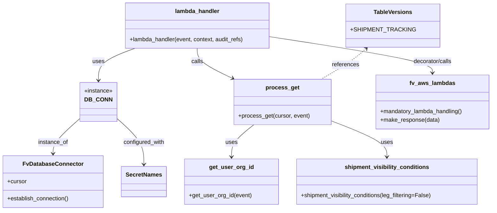
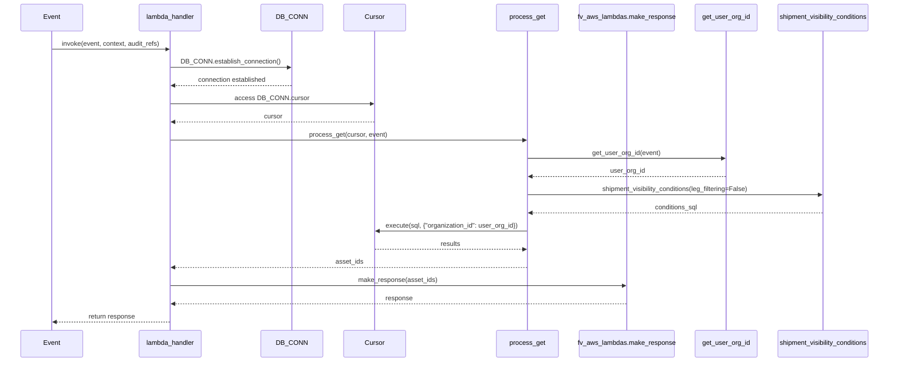

# Diagram: shipment_core/shipment_service/shipment_service/ng_shipments/ng_get_asset_ids.py

> Auto-generated by Obscura crawlers

## Diagram 1

### SVG

<svg id="container" width="1355.310546875" xmlns="http://www.w3.org/2000/svg" class="classDiagram" height="584" viewBox="0 0 1355.310546875 584" role="graphics-document document" aria-roledescription="class"><g><defs><marker id="container_class-aggregationStart" class="marker aggregation class" refX="18" refY="7" markerWidth="190" markerHeight="240" orient="auto"><path d="M 18,7 L9,13 L1,7 L9,1 Z"></path></marker></defs><defs><marker id="container_class-aggregationEnd" class="marker aggregation class" refX="1" refY="7" markerWidth="20" markerHeight="28" orient="auto"><path d="M 18,7 L9,13 L1,7 L9,1 Z"></path></marker></defs><defs><marker id="container_class-extensionStart" class="marker extension class" refX="18" refY="7" markerWidth="190" markerHeight="240" orient="auto"><path d="M 1,7 L18,13 V 1 Z"></path></marker></defs><defs><marker id="container_class-extensionEnd" class="marker extension class" refX="1" refY="7" markerWidth="20" markerHeight="28" orient="auto"><path d="M 1,1 V 13 L18,7 Z"></path></marker></defs><defs><marker id="container_class-compositionStart" class="marker composition class" refX="18" refY="7" markerWidth="190" markerHeight="240" orient="auto"><path d="M 18,7 L9,13 L1,7 L9,1 Z"></path></marker></defs><defs><marker id="container_class-compositionEnd" class="marker composition class" refX="1" refY="7" markerWidth="20" markerHeight="28" orient="auto"><path d="M 18,7 L9,13 L1,7 L9,1 Z"></path></marker></defs><defs><marker id="container_class-dependencyStart" class="marker dependency class" refX="6" refY="7" markerWidth="190" markerHeight="240" orient="auto"><path d="M 5,7 L9,13 L1,7 L9,1 Z"></path></marker></defs><defs><marker id="container_class-dependencyEnd" class="marker dependency class" refX="13" refY="7" markerWidth="20" markerHeight="28" orient="auto"><path d="M 18,7 L9,13 L14,7 L9,1 Z"></path></marker></defs><defs><marker id="container_class-lollipopStart" class="marker lollipop class" refX="13" refY="7" markerWidth="190" markerHeight="240" orient="auto"><circle stroke="black" fill="transparent" cx="7" cy="7" r="6"></circle></marker></defs><defs><marker id="container_class-lollipopEnd" class="marker lollipop class" refX="1" refY="7" markerWidth="190" markerHeight="240" orient="auto"><circle stroke="black" fill="transparent" cx="7" cy="7" r="6"></circle></marker></defs><g class="root"><g class="clusters"></g><g class="edgePaths"><path d="M218.896,329.499L206.795,340.416C194.693,351.333,170.489,373.166,158.387,389.25C146.285,405.333,146.285,415.667,146.285,420.833L146.285,426" id="id_DB_CONN_FvDatabaseConnector_1" class="edge-thickness-normal edge-pattern-solid relation" style=";;;" data-edge="true" data-et="edge" data-id="id_DB_CONN_FvDatabaseConnector_1" data-points="W3sieCI6MjE4Ljg5NjQ4NDM3NSwieSI6MzI5LjQ5OTE0MjY2Mzg3N30seyJ4IjoxNDYuMjg1MTU2MjUsInkiOjM5NX0seyJ4IjoxNDYuMjg1MTU2MjUsInkiOjQzMn1d" marker-end="url(#container_class-dependencyEnd)"></path><path d="M696.208,346L685.641,354.167C675.075,362.333,653.942,378.667,643.375,393.5C632.809,408.333,632.809,421.667,632.809,428.333L632.809,435" id="id_process_get_get_user_org_id_2" class="edge-thickness-normal edge-pattern-solid relation" style=";;;" data-edge="true" data-et="edge" data-id="id_process_get_get_user_org_id_2" data-points="W3sieCI6Njk2LjIwNzY0MTYwMTU2MjUsInkiOjM0Nn0seyJ4Ijo2MzIuODA4NTkzNzUsInkiOjM5NX0seyJ4Ijo2MzIuODA4NTkzNzUsInkiOjQ0MX1d" marker-end="url(#container_class-dependencyEnd)"></path><path d="M910.393,334.871L936.025,344.892C961.658,354.914,1012.923,374.957,1038.555,391.645C1064.188,408.333,1064.188,421.667,1064.188,428.333L1064.188,435" id="id_process_get_shipment_visibility_conditions_3" class="edge-thickness-normal edge-pattern-solid relation" style=";;;" data-edge="true" data-et="edge" data-id="id_process_get_shipment_visibility_conditions_3" data-points="W3sieCI6OTEwLjM5MjU3ODEyNSwieSI6MzM0Ljg3MDc1ODM2Mzk1NzR9LHsieCI6MTA2NC4xODc1LCJ5IjozOTV9LHsieCI6MTA2NC4xODc1LCJ5Ijo0NDF9XQ==" marker-end="url(#container_class-dependencyEnd)"></path><path d="M370.244,134L353.61,140.167C336.977,146.333,303.71,158.667,287.077,173.5C270.443,188.333,270.443,205.667,270.443,214.333L270.443,223" id="id_lambda_handler_DB_CONN_4" class="edge-thickness-normal edge-pattern-solid relation" style=";;;" data-edge="true" data-et="edge" data-id="id_lambda_handler_DB_CONN_4" data-points="W3sieCI6MzcwLjI0MzYzMjgxMjUsInkiOjEzNH0seyJ4IjoyNzAuNDQzMzU5Mzc1LCJ5IjoxNzF9LHsieCI6MjcwLjQ0MzM1OTM3NSwieSI6MjI5fV0=" marker-end="url(#container_class-dependencyEnd)"></path><path d="M540.174,134L540.174,140.167C540.174,146.333,540.174,158.667,556.748,172.648C573.323,186.629,606.472,202.259,623.047,210.074L639.622,217.888" id="id_lambda_handler_process_get_5" class="edge-thickness-normal edge-pattern-solid relation" style=";;;" data-edge="true" data-et="edge" data-id="id_lambda_handler_process_get_5" data-points="W3sieCI6NTQwLjE3MzgyODEyNSwieSI6MTM0fSx7IngiOjU0MC4xNzM4MjgxMjUsInkiOjE3MX0seyJ4Ijo2NDUuMDQ4ODI4MTI1LCJ5IjoyMjAuNDQ3MDgyODEyNjAyOH1d" marker-end="url(#container_class-dependencyEnd)"></path><path d="M743.006,102.25L817.378,113.708C891.751,125.167,1040.495,148.083,1114.868,164.708C1189.24,181.333,1189.24,191.667,1189.24,196.833L1189.24,202" id="id_lambda_handler_fv_aws_lambdas_6" class="edge-thickness-normal edge-pattern-solid relation" style=";;;" data-edge="true" data-et="edge" data-id="id_lambda_handler_fv_aws_lambdas_6" data-points="W3sieCI6NzQzLjAwNTg1OTM3NSwieSI6MTAyLjI0OTgxMTkyOTM5Mzc5fSx7IngiOjExODkuMjQwMjM0Mzc1LCJ5IjoxNzF9LHsieCI6MTE4OS4yNDAyMzQzNzUsInkiOjIwOH1d" marker-end="url(#container_class-dependencyEnd)"></path><path d="M321.99,329.499L334.092,340.416C346.194,351.333,370.398,373.166,382.5,394.25C394.602,415.333,394.602,435.667,394.602,445.833L394.602,456" id="id_DB_CONN_SecretNames_7" class="edge-thickness-normal edge-pattern-solid relation" style=";;;" data-edge="true" data-et="edge" data-id="id_DB_CONN_SecretNames_7" data-points="W3sieCI6MzIxLjk5MDIzNDM3NSwieSI6MzI5LjQ5OTE0MjY2Mzg3N30seyJ4IjozOTQuNjAxNTYyNSwieSI6Mzk1fSx7IngiOjM5NC42MDE1NjI1LCJ5Ijo0NjJ9XQ==" marker-end="url(#container_class-dependencyEnd)"></path><path d="M1003.604,134.956L996.755,140.964C989.906,146.971,976.208,158.985,955.885,173.159C935.561,187.333,908.613,203.667,895.139,211.833L881.665,220" id="id_TableVersions_process_get_8" class="edge-thickness-normal edge-pattern-dashed relation" style=";;;" data-edge="true" data-et="edge" data-id="id_TableVersions_process_get_8" data-points="W3sieCI6MTAwOC4xMTQ0NTMxMjUsInkiOjEzMX0seyJ4Ijo5NjIuNTA5NzY1NjI1LCJ5IjoxNzF9LHsieCI6ODgxLjY2NDU1MDc4MTI1LCJ5IjoyMjB9XQ==" marker-start="url(#container_class-dependencyStart)"></path></g><g class="edgeLabels"><g class="edgeLabel" transform="translate(146.28515625, 395)"><g class="label" data-id="id_DB_CONN_FvDatabaseConnector_1" transform="translate(-41.7734375, -12)"><foreignObject width="83.546875" height="24">

instance_of

</foreignObject></g></g><g class="edgeLabel" transform="translate(632.80859375, 395)"><g class="label" data-id="id_process_get_get_user_org_id_2" transform="translate(-16.4921875, -12)"><foreignObject width="32.984375" height="24">

uses

</foreignObject></g></g><g class="edgeLabel" transform="translate(1064.1875, 395)"><g class="label" data-id="id_process_get_shipment_visibility_conditions_3" transform="translate(-16.4921875, -12)"><foreignObject width="32.984375" height="24">

uses

</foreignObject></g></g><g class="edgeLabel" transform="translate(270.443359375, 171)"><g class="label" data-id="id_lambda_handler_DB_CONN_4" transform="translate(-16.4921875, -12)"><foreignObject width="32.984375" height="24">

uses

</foreignObject></g></g><g class="edgeLabel" transform="translate(540.173828125, 171)"><g class="label" data-id="id_lambda_handler_process_get_5" transform="translate(-16.4453125, -12)"><foreignObject width="32.890625" height="24">

calls

</foreignObject></g></g><g class="edgeLabel" transform="translate(1189.240234375, 171)"><g class="label" data-id="id_lambda_handler_fv_aws_lambdas_6" transform="translate(-54.890625, -12)"><foreignObject width="109.78125" height="24">

decorator/calls

</foreignObject></g></g><g class="edgeLabel" transform="translate(394.6015625, 395)"><g class="label" data-id="id_DB_CONN_SecretNames_7" transform="translate(-57.921875, -12)"><foreignObject width="115.84375" height="24">

configured_with

</foreignObject></g></g><g class="edgeLabel" transform="translate(948.02543, 179.7789)"><g class="label" data-id="id_TableVersions_process_get_8" transform="translate(-37.828125, -12)"><foreignObject width="75.65625" height="24">

references

</foreignObject></g></g></g><g class="nodes"><g class="node default" id="classId-FvDatabaseConnector-0" transform="translate(146.28515625, 504)"><g class="basic label-container"><path d="M-138.28515625 -72 L138.28515625 -72 L138.28515625 72 L-138.28515625 72" stroke="none" stroke-width="0" fill="#ECECFF" style=""></path><path d="M-138.28515625 -72 C-46.00877200842707 -72, 46.267612233145854 -72, 138.28515625 -72 M-138.28515625 -72 C-49.62771913258426 -72, 39.02971798483148 -72, 138.28515625 -72 M138.28515625 -72 C138.28515625 -19.162038716196193, 138.28515625 33.675922567607614, 138.28515625 72 M138.28515625 -72 C138.28515625 -23.961830202955547, 138.28515625 24.076339594088907, 138.28515625 72 M138.28515625 72 C53.29414816992016 72, -31.696859910159674 72, -138.28515625 72 M138.28515625 72 C76.06359018006253 72, 13.842024110125081 72, -138.28515625 72 M-138.28515625 72 C-138.28515625 39.02763028695988, -138.28515625 6.055260573919753, -138.28515625 -72 M-138.28515625 72 C-138.28515625 20.325616344788457, -138.28515625 -31.348767310423085, -138.28515625 -72" stroke="#9370DB" stroke-width="1.3" fill="none" stroke-dasharray="0 0" style=""></path></g><g class="annotation-group text" transform="translate(0, -48)"></g><g class="label-group text" transform="translate(-79.3046875, -48)"><g class="label" style="font-weight: bolder" transform="translate(0,-12)"><foreignObject width="158.609375" height="24">

FvDatabaseConnector

</foreignObject></g></g><g class="members-group text" transform="translate(-126.28515625, 0)"><g class="label" style="" transform="translate(0,-12)"><foreignObject width="53.71875" height="24">

+cursor

</foreignObject></g></g><g class="methods-group text" transform="translate(-126.28515625, 48)"><g class="label" style="" transform="translate(0,-12)"><foreignObject width="173.265625" height="24">

+establish_connection()

</foreignObject></g></g><g class="divider" style=""><path d="M-138.28515625 -24 C-56.41830412516654 -24, 25.448547999666914 -24, 138.28515625 -24 M-138.28515625 -24 C-65.43972693576664 -24, 7.405702378466714 -24, 138.28515625 -24" stroke="#9370DB" stroke-width="1.3" fill="none" stroke-dasharray="0 0" style=""></path></g><g class="divider" style=""><path d="M-138.28515625 24 C-53.356747230455 24, 31.57166178909 24, 138.28515625 24 M-138.28515625 24 C-36.52396966818935 24, 65.2372169136213 24, 138.28515625 24" stroke="#9370DB" stroke-width="1.3" fill="none" stroke-dasharray="0 0" style=""></path></g></g><g class="node default" id="classId-DB_CONN-1" transform="translate(270.443359375, 283)"><g class="basic label-container"><path d="M-51.546875 -54 L51.546875 -54 L51.546875 54 L-51.546875 54" stroke="none" stroke-width="0" fill="#ECECFF" style=""></path><path d="M-51.546875 -54 C-24.960989713299952 -54, 1.6248955734000958 -54, 51.546875 -54 M-51.546875 -54 C-12.487103120304845 -54, 26.57266875939031 -54, 51.546875 -54 M51.546875 -54 C51.546875 -32.02417037198059, 51.546875 -10.04834074396117, 51.546875 54 M51.546875 -54 C51.546875 -24.97433620322972, 51.546875 4.051327593540563, 51.546875 54 M51.546875 54 C25.691802395897792 54, -0.16327020820441618 54, -51.546875 54 M51.546875 54 C13.448483458143293 54, -24.649908083713413 54, -51.546875 54 M-51.546875 54 C-51.546875 31.396289752594416, -51.546875 8.792579505188833, -51.546875 -54 M-51.546875 54 C-51.546875 12.992396813848295, -51.546875 -28.01520637230341, -51.546875 -54" stroke="#9370DB" stroke-width="1.3" fill="none" stroke-dasharray="0 0" style=""></path></g><g class="annotation-group text" transform="translate(-39.546875, -30)"><g class="label" style="" transform="translate(0,-12)"><foreignObject width="79.09375" height="24">

«instance»

</foreignObject></g></g><g class="label-group text" transform="translate(-34.40625, -6)"><g class="label" style="font-weight: bolder" transform="translate(0,-12)"><foreignObject width="68.8125" height="24">

DB_CONN

</foreignObject></g></g><g class="members-group text" transform="translate(-39.546875, 42)"></g><g class="methods-group text" transform="translate(-39.546875, 72)"></g><g class="divider" style=""><path d="M-51.546875 18 C-23.415973799094896 18, 4.714927401810208 18, 51.546875 18 M-51.546875 18 C-11.444324068816691 18, 28.658226862366618 18, 51.546875 18" stroke="#9370DB" stroke-width="1.3" fill="none" stroke-dasharray="0 0" style=""></path></g><g class="divider" style=""><path d="M-51.546875 36 C-18.647409023273205 36, 14.25205695345359 36, 51.546875 36 M-51.546875 36 C-13.174822102559311 36, 25.197230794881378 36, 51.546875 36" stroke="#9370DB" stroke-width="1.3" fill="none" stroke-dasharray="0 0" style=""></path></g></g><g class="node default" id="classId-process_get-2" transform="translate(777.720703125, 283)"><g class="basic label-container"><path d="M-132.671875 -63 L132.671875 -63 L132.671875 63 L-132.671875 63" stroke="none" stroke-width="0" fill="#ECECFF" style=""></path><path d="M-132.671875 -63 C-33.60834520166503 -63, 65.45518459666994 -63, 132.671875 -63 M-132.671875 -63 C-78.32438072787258 -63, -23.976886455745145 -63, 132.671875 -63 M132.671875 -63 C132.671875 -19.31507025359312, 132.671875 24.36985949281376, 132.671875 63 M132.671875 -63 C132.671875 -35.18921367094818, 132.671875 -7.378427341896348, 132.671875 63 M132.671875 63 C34.790876965200965 63, -63.09012106959807 63, -132.671875 63 M132.671875 63 C69.28401099872104 63, 5.896146997442088 63, -132.671875 63 M-132.671875 63 C-132.671875 22.453396907866065, -132.671875 -18.09320618426787, -132.671875 -63 M-132.671875 63 C-132.671875 14.879936601622667, -132.671875 -33.240126796754666, -132.671875 -63" stroke="#9370DB" stroke-width="1.3" fill="none" stroke-dasharray="0 0" style=""></path></g><g class="annotation-group text" transform="translate(0, -39)"></g><g class="label-group text" transform="translate(-44.046875, -39)"><g class="label" style="font-weight: bolder" transform="translate(0,-12)"><foreignObject width="88.09375" height="24">

process_get

</foreignObject></g></g><g class="members-group text" transform="translate(-120.671875, 9)"></g><g class="methods-group text" transform="translate(-120.671875, 39)"><g class="label" style="" transform="translate(0,-12)"><foreignObject width="197.296875" height="24">

+process_get(cursor, event)

</foreignObject></g></g><g class="divider" style=""><path d="M-132.671875 -15 C-43.581291203208636 -15, 45.50929259358273 -15, 132.671875 -15 M-132.671875 -15 C-54.76546193334079 -15, 23.140951133318424 -15, 132.671875 -15" stroke="#9370DB" stroke-width="1.3" fill="none" stroke-dasharray="0 0" style=""></path></g><g class="divider" style=""><path d="M-132.671875 9 C-68.30366161081714 9, -3.9354482216342888 9, 132.671875 9 M-132.671875 9 C-43.99515663737046 9, 44.68156172525909 9, 132.671875 9" stroke="#9370DB" stroke-width="1.3" fill="none" stroke-dasharray="0 0" style=""></path></g></g><g class="node default" id="classId-lambda_handler-3" transform="translate(540.173828125, 71)"><g class="basic label-container"><path d="M-202.83203125 -63 L202.83203125 -63 L202.83203125 63 L-202.83203125 63" stroke="none" stroke-width="0" fill="#ECECFF" style=""></path><path d="M-202.83203125 -63 C-118.60742742682244 -63, -34.38282360364488 -63, 202.83203125 -63 M-202.83203125 -63 C-91.20946216749529 -63, 20.413106915009422 -63, 202.83203125 -63 M202.83203125 -63 C202.83203125 -18.318381492121787, 202.83203125 26.363237015756425, 202.83203125 63 M202.83203125 -63 C202.83203125 -23.218510247320644, 202.83203125 16.56297950535871, 202.83203125 63 M202.83203125 63 C67.1190699295542 63, -68.5938913908916 63, -202.83203125 63 M202.83203125 63 C108.93358542357214 63, 15.03513959714428 63, -202.83203125 63 M-202.83203125 63 C-202.83203125 29.380065315987423, -202.83203125 -4.239869368025154, -202.83203125 -63 M-202.83203125 63 C-202.83203125 27.718621372006083, -202.83203125 -7.562757255987833, -202.83203125 -63" stroke="#9370DB" stroke-width="1.3" fill="none" stroke-dasharray="0 0" style=""></path></g><g class="annotation-group text" transform="translate(0, -39)"></g><g class="label-group text" transform="translate(-59.9765625, -39)"><g class="label" style="font-weight: bolder" transform="translate(0,-12)"><foreignObject width="119.953125" height="24">

lambda_handler

</foreignObject></g></g><g class="members-group text" transform="translate(-190.83203125, 9)"></g><g class="methods-group text" transform="translate(-190.83203125, 39)"><g class="label" style="" transform="translate(0,-12)"><foreignObject width="321.6875" height="24">

+lambda_handler(event, context, audit_refs)

</foreignObject></g></g><g class="divider" style=""><path d="M-202.83203125 -15 C-105.37189630357301 -15, -7.91176135714602 -15, 202.83203125 -15 M-202.83203125 -15 C-106.54820013955252 -15, -10.26436902910504 -15, 202.83203125 -15" stroke="#9370DB" stroke-width="1.3" fill="none" stroke-dasharray="0 0" style=""></path></g><g class="divider" style=""><path d="M-202.83203125 9 C-48.01561030249235 9, 106.8008106450153 9, 202.83203125 9 M-202.83203125 9 C-82.59051438024287 9, 37.65100248951427 9, 202.83203125 9" stroke="#9370DB" stroke-width="1.3" fill="none" stroke-dasharray="0 0" style=""></path></g></g><g class="node default" id="classId-get_user_org_id-4" transform="translate(632.80859375, 504)"><g class="basic label-container"><path d="M-128.17578125 -63 L128.17578125 -63 L128.17578125 63 L-128.17578125 63" stroke="none" stroke-width="0" fill="#ECECFF" style=""></path><path d="M-128.17578125 -63 C-44.49821212815671 -63, 39.17935699368658 -63, 128.17578125 -63 M-128.17578125 -63 C-58.574235989640584 -63, 11.027309270718831 -63, 128.17578125 -63 M128.17578125 -63 C128.17578125 -17.995067820388684, 128.17578125 27.009864359222632, 128.17578125 63 M128.17578125 -63 C128.17578125 -21.042256517810685, 128.17578125 20.91548696437863, 128.17578125 63 M128.17578125 63 C51.50130833560772 63, -25.173164578784565 63, -128.17578125 63 M128.17578125 63 C45.94438594352549 63, -36.28700936294902 63, -128.17578125 63 M-128.17578125 63 C-128.17578125 15.735099418362552, -128.17578125 -31.529801163274897, -128.17578125 -63 M-128.17578125 63 C-128.17578125 24.626711741805416, -128.17578125 -13.746576516389169, -128.17578125 -63" stroke="#9370DB" stroke-width="1.3" fill="none" stroke-dasharray="0 0" style=""></path></g><g class="annotation-group text" transform="translate(0, -39)"></g><g class="label-group text" transform="translate(-58.6328125, -39)"><g class="label" style="font-weight: bolder" transform="translate(0,-12)"><foreignObject width="117.265625" height="24">

get_user_org_id

</foreignObject></g></g><g class="members-group text" transform="translate(-116.17578125, 9)"></g><g class="methods-group text" transform="translate(-116.17578125, 39)"><g class="label" style="" transform="translate(0,-12)"><foreignObject width="173.71875" height="24">

+get_user_org_id(event)

</foreignObject></g></g><g class="divider" style=""><path d="M-128.17578125 -15 C-38.52047345605342 -15, 51.13483433789315 -15, 128.17578125 -15 M-128.17578125 -15 C-51.419356406262025 -15, 25.33706843747595 -15, 128.17578125 -15" stroke="#9370DB" stroke-width="1.3" fill="none" stroke-dasharray="0 0" style=""></path></g><g class="divider" style=""><path d="M-128.17578125 9 C-59.46187283221202 9, 9.252035585575953 9, 128.17578125 9 M-128.17578125 9 C-59.621458373849094 9, 8.932864502301811 9, 128.17578125 9" stroke="#9370DB" stroke-width="1.3" fill="none" stroke-dasharray="0 0" style=""></path></g></g><g class="node default" id="classId-shipment_visibility_conditions-5" transform="translate(1064.1875, 504)"><g class="basic label-container"><path d="M-253.203125 -63 L253.203125 -63 L253.203125 63 L-253.203125 63" stroke="none" stroke-width="0" fill="#ECECFF" style=""></path><path d="M-253.203125 -63 C-104.95979138550632 -63, 43.28354222898736 -63, 253.203125 -63 M-253.203125 -63 C-56.41489644870603 -63, 140.37333210258794 -63, 253.203125 -63 M253.203125 -63 C253.203125 -34.606086000219, 253.203125 -6.212172000438002, 253.203125 63 M253.203125 -63 C253.203125 -19.995768742138367, 253.203125 23.008462515723267, 253.203125 63 M253.203125 63 C119.3701181545353 63, -14.46288869092939 63, -253.203125 63 M253.203125 63 C83.36782061725467 63, -86.46748376549067 63, -253.203125 63 M-253.203125 63 C-253.203125 15.142100919013345, -253.203125 -32.71579816197331, -253.203125 -63 M-253.203125 63 C-253.203125 37.5976506786693, -253.203125 12.195301357338586, -253.203125 -63" stroke="#9370DB" stroke-width="1.3" fill="none" stroke-dasharray="0 0" style=""></path></g><g class="annotation-group text" transform="translate(0, -39)"></g><g class="label-group text" transform="translate(-111.921875, -39)"><g class="label" style="font-weight: bolder" transform="translate(0,-12)"><foreignObject width="223.84375" height="24">

shipment_visibility_conditions

</foreignObject></g></g><g class="members-group text" transform="translate(-241.203125, 9)"></g><g class="methods-group text" transform="translate(-241.203125, 39)"><g class="label" style="" transform="translate(0,-12)"><foreignObject width="370.484375" height="24">

+shipment_visibility_conditions(leg_filtering=False)

</foreignObject></g></g><g class="divider" style=""><path d="M-253.203125 -15 C-122.92926150508904 -15, 7.344601989821911 -15, 253.203125 -15 M-253.203125 -15 C-140.44794185027007 -15, -27.69275870054011 -15, 253.203125 -15" stroke="#9370DB" stroke-width="1.3" fill="none" stroke-dasharray="0 0" style=""></path></g><g class="divider" style=""><path d="M-253.203125 9 C-144.6648639217604 9, -36.12660284352083 9, 253.203125 9 M-253.203125 9 C-89.24084039426708 9, 74.72144421146584 9, 253.203125 9" stroke="#9370DB" stroke-width="1.3" fill="none" stroke-dasharray="0 0" style=""></path></g></g><g class="node default" id="classId-TableVersions-6" transform="translate(1076.521484375, 71)"><g class="basic label-container"><path d="M-116.74609375 -60 L116.74609375 -60 L116.74609375 60 L-116.74609375 60" stroke="none" stroke-width="0" fill="#ECECFF" style=""></path><path d="M-116.74609375 -60 C-67.57767054207409 -60, -18.409247334148176 -60, 116.74609375 -60 M-116.74609375 -60 C-50.72049644042282 -60, 15.305100869154359 -60, 116.74609375 -60 M116.74609375 -60 C116.74609375 -35.65277801622035, 116.74609375 -11.305556032440712, 116.74609375 60 M116.74609375 -60 C116.74609375 -27.95358109214554, 116.74609375 4.0928378157089185, 116.74609375 60 M116.74609375 60 C23.807513692259718 60, -69.13106636548056 60, -116.74609375 60 M116.74609375 60 C33.573533878336704 60, -49.59902599332659 60, -116.74609375 60 M-116.74609375 60 C-116.74609375 18.566621562753753, -116.74609375 -22.866756874492495, -116.74609375 -60 M-116.74609375 60 C-116.74609375 35.21766453315816, -116.74609375 10.435329066316307, -116.74609375 -60" stroke="#9370DB" stroke-width="1.3" fill="none" stroke-dasharray="0 0" style=""></path></g><g class="annotation-group text" transform="translate(0, -36)"></g><g class="label-group text" transform="translate(-50.9921875, -36)"><g class="label" style="font-weight: bolder" transform="translate(0,-12)"><foreignObject width="101.984375" height="24">

TableVersions

</foreignObject></g></g><g class="members-group text" transform="translate(-104.74609375, 12)"><g class="label" style="" transform="translate(0,-12)"><foreignObject width="158.5" height="24">

+SHIPMENT_TRACKING

</foreignObject></g></g><g class="methods-group text" transform="translate(-104.74609375, 60)"></g><g class="divider" style=""><path d="M-116.74609375 -12 C-33.59408191792434 -12, 49.557929914151316 -12, 116.74609375 -12 M-116.74609375 -12 C-36.63271988192774 -12, 43.48065398614452 -12, 116.74609375 -12" stroke="#9370DB" stroke-width="1.3" fill="none" stroke-dasharray="0 0" style=""></path></g><g class="divider" style=""><path d="M-116.74609375 36 C-27.293082530511896 36, 62.15992868897621 36, 116.74609375 36 M-116.74609375 36 C-50.75110285588909 36, 15.243888038221826 36, 116.74609375 36" stroke="#9370DB" stroke-width="1.3" fill="none" stroke-dasharray="0 0" style=""></path></g></g><g class="node default" id="classId-SecretNames-7" transform="translate(394.6015625, 504)"><g class="basic label-container"><path d="M-60.03125 -42 L60.03125 -42 L60.03125 42 L-60.03125 42" stroke="none" stroke-width="0" fill="#ECECFF" style=""></path><path d="M-60.03125 -42 C-29.741226693495275 -42, 0.5487966130094506 -42, 60.03125 -42 M-60.03125 -42 C-26.04618924539143 -42, 7.938871509217137 -42, 60.03125 -42 M60.03125 -42 C60.03125 -24.596408836764446, 60.03125 -7.192817673528893, 60.03125 42 M60.03125 -42 C60.03125 -19.81850044650143, 60.03125 2.3629991069971368, 60.03125 42 M60.03125 42 C29.953048672665943 42, -0.12515265466811343 42, -60.03125 42 M60.03125 42 C25.936790384968887 42, -8.157669230062226 42, -60.03125 42 M-60.03125 42 C-60.03125 12.811642970156072, -60.03125 -16.376714059687856, -60.03125 -42 M-60.03125 42 C-60.03125 19.67086262855464, -60.03125 -2.6582747428907183, -60.03125 -42" stroke="#9370DB" stroke-width="1.3" fill="none" stroke-dasharray="0 0" style=""></path></g><g class="annotation-group text" transform="translate(0, -18)"></g><g class="label-group text" transform="translate(-48.03125, -18)"><g class="label" style="font-weight: bolder" transform="translate(0,-12)"><foreignObject width="96.0625" height="24">

SecretNames

</foreignObject></g></g><g class="members-group text" transform="translate(-48.03125, 30)"></g><g class="methods-group text" transform="translate(-48.03125, 60)"></g><g class="divider" style=""><path d="M-60.03125 6 C-15.314701754157035 6, 29.40184649168593 6, 60.03125 6 M-60.03125 6 C-33.19943729060833 6, -6.367624581216667 6, 60.03125 6" stroke="#9370DB" stroke-width="1.3" fill="none" stroke-dasharray="0 0" style=""></path></g><g class="divider" style=""><path d="M-60.03125 24 C-16.58060287756365 24, 26.8700442448727 24, 60.03125 24 M-60.03125 24 C-12.299009773492955 24, 35.43323045301409 24, 60.03125 24" stroke="#9370DB" stroke-width="1.3" fill="none" stroke-dasharray="0 0" style=""></path></g></g><g class="node default" id="classId-fv_aws_lambdas-8" transform="translate(1189.240234375, 283)"><g class="basic label-container"><path d="M-158.0703125 -75 L158.0703125 -75 L158.0703125 75 L-158.0703125 75" stroke="none" stroke-width="0" fill="#ECECFF" style=""></path><path d="M-158.0703125 -75 C-35.37519180855446 -75, 87.31992888289108 -75, 158.0703125 -75 M-158.0703125 -75 C-55.72877075236599 -75, 46.61277099526802 -75, 158.0703125 -75 M158.0703125 -75 C158.0703125 -37.6514586246675, 158.0703125 -0.3029172493349961, 158.0703125 75 M158.0703125 -75 C158.0703125 -28.11085321694887, 158.0703125 18.778293566102263, 158.0703125 75 M158.0703125 75 C35.51080080858078 75, -87.04871088283844 75, -158.0703125 75 M158.0703125 75 C80.43653255955992 75, 2.8027526191198433 75, -158.0703125 75 M-158.0703125 75 C-158.0703125 24.50350714505022, -158.0703125 -25.992985709899557, -158.0703125 -75 M-158.0703125 75 C-158.0703125 20.954499416991503, -158.0703125 -33.091001166016994, -158.0703125 -75" stroke="#9370DB" stroke-width="1.3" fill="none" stroke-dasharray="0 0" style=""></path></g><g class="annotation-group text" transform="translate(0, -51)"></g><g class="label-group text" transform="translate(-60.0625, -51)"><g class="label" style="font-weight: bolder" transform="translate(0,-12)"><foreignObject width="120.125" height="24">

fv_aws_lambdas

</foreignObject></g></g><g class="members-group text" transform="translate(-146.0703125, -3)"></g><g class="methods-group text" transform="translate(-146.0703125, 27)"><g class="label" style="" transform="translate(0,-12)"><foreignObject width="232.078125" height="24">

+mandatory_lambda_handling()

</foreignObject></g><g class="label" style="" transform="translate(0,12)"><foreignObject width="164.484375" height="24">

+make_response(data)

</foreignObject></g></g><g class="divider" style=""><path d="M-158.0703125 -27 C-46.75051255758903 -27, 64.56928738482193 -27, 158.0703125 -27 M-158.0703125 -27 C-37.35321879649929 -27, 83.36387490700142 -27, 158.0703125 -27" stroke="#9370DB" stroke-width="1.3" fill="none" stroke-dasharray="0 0" style=""></path></g><g class="divider" style=""><path d="M-158.0703125 -3 C-73.54231383847203 -3, 10.985684823055948 -3, 158.0703125 -3 M-158.0703125 -3 C-90.15735368138277 -3, -22.244394862765546 -3, 158.0703125 -3" stroke="#9370DB" stroke-width="1.3" fill="none" stroke-dasharray="0 0" style=""></path></g></g></g></g></g></svg>

## Diagram 2

### SVG

<svg id="container" width="2263" xmlns="http://www.w3.org/2000/svg" height="939" viewBox="-50 -10 2263 939" role="graphics-document document" aria-roledescription="sequence"><g><rect x="1921" y="853" fill="#eaeaea" stroke="#666" width="242" height="65" name="Visibility" rx="3" ry="3" class="actor actor-bottom"></rect><text x="2042" y="885.5" dominant-baseline="central" alignment-baseline="central" class="actor actor-box" style="text-anchor: middle; font-size: 16px; font-weight: 400;"><tspan x="2042" dy="0">shipment_visibility_conditions</tspan></text></g><g><rect x="1721" y="853" fill="#eaeaea" stroke="#666" width="150" height="65" name="OAuth" rx="3" ry="3" class="actor actor-bottom"></rect><text x="1796" y="885.5" dominant-baseline="central" alignment-baseline="central" class="actor actor-box" style="text-anchor: middle; font-size: 16px; font-weight: 400;"><tspan x="1796" dy="0">get_user_org_id</tspan></text></g><g><rect x="1415" y="853" fill="#eaeaea" stroke="#666" width="256" height="65" name="Utils" rx="3" ry="3" class="actor actor-bottom"></rect><text x="1543" y="885.5" dominant-baseline="central" alignment-baseline="central" class="actor actor-box" style="text-anchor: middle; font-size: 16px; font-weight: 400;"><tspan x="1543" dy="0">fv_aws_lambdas.make_response</tspan></text></g><g><rect x="1215" y="853" fill="#eaeaea" stroke="#666" width="150" height="65" name="Processor" rx="3" ry="3" class="actor actor-bottom"></rect><text x="1290" y="885.5" dominant-baseline="central" alignment-baseline="central" class="actor actor-box" style="text-anchor: middle; font-size: 16px; font-weight: 400;"><tspan x="1290" dy="0">process_get</tspan></text></g><g><rect x="820" y="853" fill="#eaeaea" stroke="#666" width="150" height="65" name="Cursor" rx="3" ry="3" class="actor actor-bottom"></rect><text x="895" y="885.5" dominant-baseline="central" alignment-baseline="central" class="actor actor-box" style="text-anchor: middle; font-size: 16px; font-weight: 400;"><tspan x="895" dy="0">Cursor</tspan></text></g><g><rect x="620" y="853" fill="#eaeaea" stroke="#666" width="150" height="65" name="DB" rx="3" ry="3" class="actor actor-bottom"></rect><text x="695" y="885.5" dominant-baseline="central" alignment-baseline="central" class="actor actor-box" style="text-anchor: middle; font-size: 16px; font-weight: 400;"><tspan x="695" dy="0">DB_CONN</tspan></text></g><g><rect x="312" y="853" fill="#eaeaea" stroke="#666" width="150" height="65" name="Lambda" rx="3" ry="3" class="actor actor-bottom"></rect><text x="387" y="885.5" dominant-baseline="central" alignment-baseline="central" class="actor actor-box" style="text-anchor: middle; font-size: 16px; font-weight: 400;"><tspan x="387" dy="0">lambda_handler</tspan></text></g><g><rect x="0" y="853" fill="#eaeaea" stroke="#666" width="150" height="65" name="Event" rx="3" ry="3" class="actor actor-bottom"></rect><text x="75" y="885.5" dominant-baseline="central" alignment-baseline="central" class="actor actor-box" style="text-anchor: middle; font-size: 16px; font-weight: 400;"><tspan x="75" dy="0">Event</tspan></text></g><g><line id="actor7" x1="2042" y1="65" x2="2042" y2="853" class="actor-line 200" stroke-width="0.5px" stroke="#999" name="Visibility"></line><g id="root-7"><rect x="1921" y="0" fill="#eaeaea" stroke="#666" width="242" height="65" name="Visibility" rx="3" ry="3" class="actor actor-top"></rect><text x="2042" y="32.5" dominant-baseline="central" alignment-baseline="central" class="actor actor-box" style="text-anchor: middle; font-size: 16px; font-weight: 400;"><tspan x="2042" dy="0">shipment_visibility_conditions</tspan></text></g></g><g><line id="actor6" x1="1796" y1="65" x2="1796" y2="853" class="actor-line 200" stroke-width="0.5px" stroke="#999" name="OAuth"></line><g id="root-6"><rect x="1721" y="0" fill="#eaeaea" stroke="#666" width="150" height="65" name="OAuth" rx="3" ry="3" class="actor actor-top"></rect><text x="1796" y="32.5" dominant-baseline="central" alignment-baseline="central" class="actor actor-box" style="text-anchor: middle; font-size: 16px; font-weight: 400;"><tspan x="1796" dy="0">get_user_org_id</tspan></text></g></g><g><line id="actor5" x1="1543" y1="65" x2="1543" y2="853" class="actor-line 200" stroke-width="0.5px" stroke="#999" name="Utils"></line><g id="root-5"><rect x="1415" y="0" fill="#eaeaea" stroke="#666" width="256" height="65" name="Utils" rx="3" ry="3" class="actor actor-top"></rect><text x="1543" y="32.5" dominant-baseline="central" alignment-baseline="central" class="actor actor-box" style="text-anchor: middle; font-size: 16px; font-weight: 400;"><tspan x="1543" dy="0">fv_aws_lambdas.make_response</tspan></text></g></g><g><line id="actor4" x1="1290" y1="65" x2="1290" y2="853" class="actor-line 200" stroke-width="0.5px" stroke="#999" name="Processor"></line><g id="root-4"><rect x="1215" y="0" fill="#eaeaea" stroke="#666" width="150" height="65" name="Processor" rx="3" ry="3" class="actor actor-top"></rect><text x="1290" y="32.5" dominant-baseline="central" alignment-baseline="central" class="actor actor-box" style="text-anchor: middle; font-size: 16px; font-weight: 400;"><tspan x="1290" dy="0">process_get</tspan></text></g></g><g><line id="actor3" x1="895" y1="65" x2="895" y2="853" class="actor-line 200" stroke-width="0.5px" stroke="#999" name="Cursor"></line><g id="root-3"><rect x="820" y="0" fill="#eaeaea" stroke="#666" width="150" height="65" name="Cursor" rx="3" ry="3" class="actor actor-top"></rect><text x="895" y="32.5" dominant-baseline="central" alignment-baseline="central" class="actor actor-box" style="text-anchor: middle; font-size: 16px; font-weight: 400;"><tspan x="895" dy="0">Cursor</tspan></text></g></g><g><line id="actor2" x1="695" y1="65" x2="695" y2="853" class="actor-line 200" stroke-width="0.5px" stroke="#999" name="DB"></line><g id="root-2"><rect x="620" y="0" fill="#eaeaea" stroke="#666" width="150" height="65" name="DB" rx="3" ry="3" class="actor actor-top"></rect><text x="695" y="32.5" dominant-baseline="central" alignment-baseline="central" class="actor actor-box" style="text-anchor: middle; font-size: 16px; font-weight: 400;"><tspan x="695" dy="0">DB_CONN</tspan></text></g></g><g><line id="actor1" x1="387" y1="65" x2="387" y2="853" class="actor-line 200" stroke-width="0.5px" stroke="#999" name="Lambda"></line><g id="root-1"><rect x="312" y="0" fill="#eaeaea" stroke="#666" width="150" height="65" name="Lambda" rx="3" ry="3" class="actor actor-top"></rect><text x="387" y="32.5" dominant-baseline="central" alignment-baseline="central" class="actor actor-box" style="text-anchor: middle; font-size: 16px; font-weight: 400;"><tspan x="387" dy="0">lambda_handler</tspan></text></g></g><g><line id="actor0" x1="75" y1="65" x2="75" y2="853" class="actor-line 200" stroke-width="0.5px" stroke="#999" name="Event"></line><g id="root-0"><rect x="0" y="0" fill="#eaeaea" stroke="#666" width="150" height="65" name="Event" rx="3" ry="3" class="actor actor-top"></rect><text x="75" y="32.5" dominant-baseline="central" alignment-baseline="central" class="actor actor-box" style="text-anchor: middle; font-size: 16px; font-weight: 400;"><tspan x="75" dy="0">Event</tspan></text></g></g><g></g><defs><symbol id="computer" width="24" height="24"><path transform="scale(.5)" d="M2 2v13h20v-13h-20zm18 11h-16v-9h16v9zm-10.228 6l.466-1h3.524l.467 1h-4.457zm14.228 3h-24l2-6h2.104l-1.33 4h18.45l-1.297-4h2.073l2 6zm-5-10h-14v-7h14v7z"></path></symbol></defs><defs><symbol id="database" fill-rule="evenodd" clip-rule="evenodd"><path transform="scale(.5)" d="M12.258.001l.256.004.255.005.253.008.251.01.249.012.247.015.246.016.242.019.241.02.239.023.236.024.233.027.231.028.229.031.225.032.223.034.22.036.217.038.214.04.211.041.208.043.205.045.201.046.198.048.194.05.191.051.187.053.183.054.18.056.175.057.172.059.168.06.163.061.16.063.155.064.15.066.074.033.073.033.071.034.07.034.069.035.068.035.067.035.066.035.064.036.064.036.062.036.06.036.06.037.058.037.058.037.055.038.055.038.053.038.052.038.051.039.05.039.048.039.047.039.045.04.044.04.043.04.041.04.04.041.039.041.037.041.036.041.034.041.033.042.032.042.03.042.029.042.027.042.026.043.024.043.023.043.021.043.02.043.018.044.017.043.015.044.013.044.012.044.011.045.009.044.007.045.006.045.004.045.002.045.001.045v17l-.001.045-.002.045-.004.045-.006.045-.007.045-.009.044-.011.045-.012.044-.013.044-.015.044-.017.043-.018.044-.02.043-.021.043-.023.043-.024.043-.026.043-.027.042-.029.042-.03.042-.032.042-.033.042-.034.041-.036.041-.037.041-.039.041-.04.041-.041.04-.043.04-.044.04-.045.04-.047.039-.048.039-.05.039-.051.039-.052.038-.053.038-.055.038-.055.038-.058.037-.058.037-.06.037-.06.036-.062.036-.064.036-.064.036-.066.035-.067.035-.068.035-.069.035-.07.034-.071.034-.073.033-.074.033-.15.066-.155.064-.16.063-.163.061-.168.06-.172.059-.175.057-.18.056-.183.054-.187.053-.191.051-.194.05-.198.048-.201.046-.205.045-.208.043-.211.041-.214.04-.217.038-.22.036-.223.034-.225.032-.229.031-.231.028-.233.027-.236.024-.239.023-.241.02-.242.019-.246.016-.247.015-.249.012-.251.01-.253.008-.255.005-.256.004-.258.001-.258-.001-.256-.004-.255-.005-.253-.008-.251-.01-.249-.012-.247-.015-.245-.016-.243-.019-.241-.02-.238-.023-.236-.024-.234-.027-.231-.028-.228-.031-.226-.032-.223-.034-.22-.036-.217-.038-.214-.04-.211-.041-.208-.043-.204-.045-.201-.046-.198-.048-.195-.05-.19-.051-.187-.053-.184-.054-.179-.056-.176-.057-.172-.059-.167-.06-.164-.061-.159-.063-.155-.064-.151-.066-.074-.033-.072-.033-.072-.034-.07-.034-.069-.035-.068-.035-.067-.035-.066-.035-.064-.036-.063-.036-.062-.036-.061-.036-.06-.037-.058-.037-.057-.037-.056-.038-.055-.038-.053-.038-.052-.038-.051-.039-.049-.039-.049-.039-.046-.039-.046-.04-.044-.04-.043-.04-.041-.04-.04-.041-.039-.041-.037-.041-.036-.041-.034-.041-.033-.042-.032-.042-.03-.042-.029-.042-.027-.042-.026-.043-.024-.043-.023-.043-.021-.043-.02-.043-.018-.044-.017-.043-.015-.044-.013-.044-.012-.044-.011-.045-.009-.044-.007-.045-.006-.045-.004-.045-.002-.045-.001-.045v-17l.001-.045.002-.045.004-.045.006-.045.007-.045.009-.044.011-.045.012-.044.013-.044.015-.044.017-.043.018-.044.02-.043.021-.043.023-.043.024-.043.026-.043.027-.042.029-.042.03-.042.032-.042.033-.042.034-.041.036-.041.037-.041.039-.041.04-.041.041-.04.043-.04.044-.04.046-.04.046-.039.049-.039.049-.039.051-.039.052-.038.053-.038.055-.038.056-.038.057-.037.058-.037.06-.037.061-.036.062-.036.063-.036.064-.036.066-.035.067-.035.068-.035.069-.035.07-.034.072-.034.072-.033.074-.033.151-.066.155-.064.159-.063.164-.061.167-.06.172-.059.176-.057.179-.056.184-.054.187-.053.19-.051.195-.05.198-.048.201-.046.204-.045.208-.043.211-.041.214-.04.217-.038.22-.036.223-.034.226-.032.228-.031.231-.028.234-.027.236-.024.238-.023.241-.02.243-.019.245-.016.247-.015.249-.012.251-.01.253-.008.255-.005.256-.004.258-.001.258.001zm-9.258 20.499v.01l.001.021.003.021.004.022.005.021.006.022.007.022.009.023.01.022.011.023.012.023.013.023.015.023.016.024.017.023.018.024.019.024.021.024.022.025.023.024.024.025.052.049.056.05.061.051.066.051.07.051.075.051.079.052.084.052.088.052.092.052.097.052.102.051.105.052.11.052.114.051.119.051.123.051.127.05.131.05.135.05.139.048.144.049.147.047.152.047.155.047.16.045.163.045.167.043.171.043.176.041.178.041.183.039.187.039.19.037.194.035.197.035.202.033.204.031.209.03.212.029.216.027.219.025.222.024.226.021.23.02.233.018.236.016.24.015.243.012.246.01.249.008.253.005.256.004.259.001.26-.001.257-.004.254-.005.25-.008.247-.011.244-.012.241-.014.237-.016.233-.018.231-.021.226-.021.224-.024.22-.026.216-.027.212-.028.21-.031.205-.031.202-.034.198-.034.194-.036.191-.037.187-.039.183-.04.179-.04.175-.042.172-.043.168-.044.163-.045.16-.046.155-.046.152-.047.148-.048.143-.049.139-.049.136-.05.131-.05.126-.05.123-.051.118-.052.114-.051.11-.052.106-.052.101-.052.096-.052.092-.052.088-.053.083-.051.079-.052.074-.052.07-.051.065-.051.06-.051.056-.05.051-.05.023-.024.023-.025.021-.024.02-.024.019-.024.018-.024.017-.024.015-.023.014-.024.013-.023.012-.023.01-.023.01-.022.008-.022.006-.022.006-.022.004-.022.004-.021.001-.021.001-.021v-4.127l-.077.055-.08.053-.083.054-.085.053-.087.052-.09.052-.093.051-.095.05-.097.05-.1.049-.102.049-.105.048-.106.047-.109.047-.111.046-.114.045-.115.045-.118.044-.12.043-.122.042-.124.042-.126.041-.128.04-.13.04-.132.038-.134.038-.135.037-.138.037-.139.035-.142.035-.143.034-.144.033-.147.032-.148.031-.15.03-.151.03-.153.029-.154.027-.156.027-.158.026-.159.025-.161.024-.162.023-.163.022-.165.021-.166.02-.167.019-.169.018-.169.017-.171.016-.173.015-.173.014-.175.013-.175.012-.177.011-.178.01-.179.008-.179.008-.181.006-.182.005-.182.004-.184.003-.184.002h-.37l-.184-.002-.184-.003-.182-.004-.182-.005-.181-.006-.179-.008-.179-.008-.178-.01-.176-.011-.176-.012-.175-.013-.173-.014-.172-.015-.171-.016-.17-.017-.169-.018-.167-.019-.166-.02-.165-.021-.163-.022-.162-.023-.161-.024-.159-.025-.157-.026-.156-.027-.155-.027-.153-.029-.151-.03-.15-.03-.148-.031-.146-.032-.145-.033-.143-.034-.141-.035-.14-.035-.137-.037-.136-.037-.134-.038-.132-.038-.13-.04-.128-.04-.126-.041-.124-.042-.122-.042-.12-.044-.117-.043-.116-.045-.113-.045-.112-.046-.109-.047-.106-.047-.105-.048-.102-.049-.1-.049-.097-.05-.095-.05-.093-.052-.09-.051-.087-.052-.085-.053-.083-.054-.08-.054-.077-.054v4.127zm0-5.654v.011l.001.021.003.021.004.021.005.022.006.022.007.022.009.022.01.022.011.023.012.023.013.023.015.024.016.023.017.024.018.024.019.024.021.024.022.024.023.025.024.024.052.05.056.05.061.05.066.051.07.051.075.052.079.051.084.052.088.052.092.052.097.052.102.052.105.052.11.051.114.051.119.052.123.05.127.051.131.05.135.049.139.049.144.048.147.048.152.047.155.046.16.045.163.045.167.044.171.042.176.042.178.04.183.04.187.038.19.037.194.036.197.034.202.033.204.032.209.03.212.028.216.027.219.025.222.024.226.022.23.02.233.018.236.016.24.014.243.012.246.01.249.008.253.006.256.003.259.001.26-.001.257-.003.254-.006.25-.008.247-.01.244-.012.241-.015.237-.016.233-.018.231-.02.226-.022.224-.024.22-.025.216-.027.212-.029.21-.03.205-.032.202-.033.198-.035.194-.036.191-.037.187-.039.183-.039.179-.041.175-.042.172-.043.168-.044.163-.045.16-.045.155-.047.152-.047.148-.048.143-.048.139-.05.136-.049.131-.05.126-.051.123-.051.118-.051.114-.052.11-.052.106-.052.101-.052.096-.052.092-.052.088-.052.083-.052.079-.052.074-.051.07-.052.065-.051.06-.05.056-.051.051-.049.023-.025.023-.024.021-.025.02-.024.019-.024.018-.024.017-.024.015-.023.014-.023.013-.024.012-.022.01-.023.01-.023.008-.022.006-.022.006-.022.004-.021.004-.022.001-.021.001-.021v-4.139l-.077.054-.08.054-.083.054-.085.052-.087.053-.09.051-.093.051-.095.051-.097.05-.1.049-.102.049-.105.048-.106.047-.109.047-.111.046-.114.045-.115.044-.118.044-.12.044-.122.042-.124.042-.126.041-.128.04-.13.039-.132.039-.134.038-.135.037-.138.036-.139.036-.142.035-.143.033-.144.033-.147.033-.148.031-.15.03-.151.03-.153.028-.154.028-.156.027-.158.026-.159.025-.161.024-.162.023-.163.022-.165.021-.166.02-.167.019-.169.018-.169.017-.171.016-.173.015-.173.014-.175.013-.175.012-.177.011-.178.009-.179.009-.179.007-.181.007-.182.005-.182.004-.184.003-.184.002h-.37l-.184-.002-.184-.003-.182-.004-.182-.005-.181-.007-.179-.007-.179-.009-.178-.009-.176-.011-.176-.012-.175-.013-.173-.014-.172-.015-.171-.016-.17-.017-.169-.018-.167-.019-.166-.02-.165-.021-.163-.022-.162-.023-.161-.024-.159-.025-.157-.026-.156-.027-.155-.028-.153-.028-.151-.03-.15-.03-.148-.031-.146-.033-.145-.033-.143-.033-.141-.035-.14-.036-.137-.036-.136-.037-.134-.038-.132-.039-.13-.039-.128-.04-.126-.041-.124-.042-.122-.043-.12-.043-.117-.044-.116-.044-.113-.046-.112-.046-.109-.046-.106-.047-.105-.048-.102-.049-.1-.049-.097-.05-.095-.051-.093-.051-.09-.051-.087-.053-.085-.052-.083-.054-.08-.054-.077-.054v4.139zm0-5.666v.011l.001.02.003.022.004.021.005.022.006.021.007.022.009.023.01.022.011.023.012.023.013.023.015.023.016.024.017.024.018.023.019.024.021.025.022.024.023.024.024.025.052.05.056.05.061.05.066.051.07.051.075.052.079.051.084.052.088.052.092.052.097.052.102.052.105.051.11.052.114.051.119.051.123.051.127.05.131.05.135.05.139.049.144.048.147.048.152.047.155.046.16.045.163.045.167.043.171.043.176.042.178.04.183.04.187.038.19.037.194.036.197.034.202.033.204.032.209.03.212.028.216.027.219.025.222.024.226.021.23.02.233.018.236.017.24.014.243.012.246.01.249.008.253.006.256.003.259.001.26-.001.257-.003.254-.006.25-.008.247-.01.244-.013.241-.014.237-.016.233-.018.231-.02.226-.022.224-.024.22-.025.216-.027.212-.029.21-.03.205-.032.202-.033.198-.035.194-.036.191-.037.187-.039.183-.039.179-.041.175-.042.172-.043.168-.044.163-.045.16-.045.155-.047.152-.047.148-.048.143-.049.139-.049.136-.049.131-.051.126-.05.123-.051.118-.052.114-.051.11-.052.106-.052.101-.052.096-.052.092-.052.088-.052.083-.052.079-.052.074-.052.07-.051.065-.051.06-.051.056-.05.051-.049.023-.025.023-.025.021-.024.02-.024.019-.024.018-.024.017-.024.015-.023.014-.024.013-.023.012-.023.01-.022.01-.023.008-.022.006-.022.006-.022.004-.022.004-.021.001-.021.001-.021v-4.153l-.077.054-.08.054-.083.053-.085.053-.087.053-.09.051-.093.051-.095.051-.097.05-.1.049-.102.048-.105.048-.106.048-.109.046-.111.046-.114.046-.115.044-.118.044-.12.043-.122.043-.124.042-.126.041-.128.04-.13.039-.132.039-.134.038-.135.037-.138.036-.139.036-.142.034-.143.034-.144.033-.147.032-.148.032-.15.03-.151.03-.153.028-.154.028-.156.027-.158.026-.159.024-.161.024-.162.023-.163.023-.165.021-.166.02-.167.019-.169.018-.169.017-.171.016-.173.015-.173.014-.175.013-.175.012-.177.01-.178.01-.179.009-.179.007-.181.006-.182.006-.182.004-.184.003-.184.001-.185.001-.185-.001-.184-.001-.184-.003-.182-.004-.182-.006-.181-.006-.179-.007-.179-.009-.178-.01-.176-.01-.176-.012-.175-.013-.173-.014-.172-.015-.171-.016-.17-.017-.169-.018-.167-.019-.166-.02-.165-.021-.163-.023-.162-.023-.161-.024-.159-.024-.157-.026-.156-.027-.155-.028-.153-.028-.151-.03-.15-.03-.148-.032-.146-.032-.145-.033-.143-.034-.141-.034-.14-.036-.137-.036-.136-.037-.134-.038-.132-.039-.13-.039-.128-.041-.126-.041-.124-.041-.122-.043-.12-.043-.117-.044-.116-.044-.113-.046-.112-.046-.109-.046-.106-.048-.105-.048-.102-.048-.1-.05-.097-.049-.095-.051-.093-.051-.09-.052-.087-.052-.085-.053-.083-.053-.08-.054-.077-.054v4.153zm8.74-8.179l-.257.004-.254.005-.25.008-.247.011-.244.012-.241.014-.237.016-.233.018-.231.021-.226.022-.224.023-.22.026-.216.027-.212.028-.21.031-.205.032-.202.033-.198.034-.194.036-.191.038-.187.038-.183.04-.179.041-.175.042-.172.043-.168.043-.163.045-.16.046-.155.046-.152.048-.148.048-.143.048-.139.049-.136.05-.131.05-.126.051-.123.051-.118.051-.114.052-.11.052-.106.052-.101.052-.096.052-.092.052-.088.052-.083.052-.079.052-.074.051-.07.052-.065.051-.06.05-.056.05-.051.05-.023.025-.023.024-.021.024-.02.025-.019.024-.018.024-.017.023-.015.024-.014.023-.013.023-.012.023-.01.023-.01.022-.008.022-.006.023-.006.021-.004.022-.004.021-.001.021-.001.021.001.021.001.021.004.021.004.022.006.021.006.023.008.022.01.022.01.023.012.023.013.023.014.023.015.024.017.023.018.024.019.024.02.025.021.024.023.024.023.025.051.05.056.05.06.05.065.051.07.052.074.051.079.052.083.052.088.052.092.052.096.052.101.052.106.052.11.052.114.052.118.051.123.051.126.051.131.05.136.05.139.049.143.048.148.048.152.048.155.046.16.046.163.045.168.043.172.043.175.042.179.041.183.04.187.038.191.038.194.036.198.034.202.033.205.032.21.031.212.028.216.027.22.026.224.023.226.022.231.021.233.018.237.016.241.014.244.012.247.011.25.008.254.005.257.004.26.001.26-.001.257-.004.254-.005.25-.008.247-.011.244-.012.241-.014.237-.016.233-.018.231-.021.226-.022.224-.023.22-.026.216-.027.212-.028.21-.031.205-.032.202-.033.198-.034.194-.036.191-.038.187-.038.183-.04.179-.041.175-.042.172-.043.168-.043.163-.045.16-.046.155-.046.152-.048.148-.048.143-.048.139-.049.136-.05.131-.05.126-.051.123-.051.118-.051.114-.052.11-.052.106-.052.101-.052.096-.052.092-.052.088-.052.083-.052.079-.052.074-.051.07-.052.065-.051.06-.05.056-.05.051-.05.023-.025.023-.024.021-.024.02-.025.019-.024.018-.024.017-.023.015-.024.014-.023.013-.023.012-.023.01-.023.01-.022.008-.022.006-.023.006-.021.004-.022.004-.021.001-.021.001-.021-.001-.021-.001-.021-.004-.021-.004-.022-.006-.021-.006-.023-.008-.022-.01-.022-.01-.023-.012-.023-.013-.023-.014-.023-.015-.024-.017-.023-.018-.024-.019-.024-.02-.025-.021-.024-.023-.024-.023-.025-.051-.05-.056-.05-.06-.05-.065-.051-.07-.052-.074-.051-.079-.052-.083-.052-.088-.052-.092-.052-.096-.052-.101-.052-.106-.052-.11-.052-.114-.052-.118-.051-.123-.051-.126-.051-.131-.05-.136-.05-.139-.049-.143-.048-.148-.048-.152-.048-.155-.046-.16-.046-.163-.045-.168-.043-.172-.043-.175-.042-.179-.041-.183-.04-.187-.038-.191-.038-.194-.036-.198-.034-.202-.033-.205-.032-.21-.031-.212-.028-.216-.027-.22-.026-.224-.023-.226-.022-.231-.021-.233-.018-.237-.016-.241-.014-.244-.012-.247-.011-.25-.008-.254-.005-.257-.004-.26-.001-.26.001z"></path></symbol></defs><defs><symbol id="clock" width="24" height="24"><path transform="scale(.5)" d="M12 2c5.514 0 10 4.486 10 10s-4.486 10-10 10-10-4.486-10-10 4.486-10 10-10zm0-2c-6.627 0-12 5.373-12 12s5.373 12 12 12 12-5.373 12-12-5.373-12-12-12zm5.848 12.459c.202.038.202.333.001.372-1.907.361-6.045 1.111-6.547 1.111-.719 0-1.301-.582-1.301-1.301 0-.512.77-5.447 1.125-7.445.034-.192.312-.181.343.014l.985 6.238 5.394 1.011z"></path></symbol></defs><defs><marker id="arrowhead" refX="7.9" refY="5" markerUnits="userSpaceOnUse" markerWidth="12" markerHeight="12" orient="auto-start-reverse"><path d="M -1 0 L 10 5 L 0 10 z"></path></marker></defs><defs><marker id="crosshead" markerWidth="15" markerHeight="8" orient="auto" refX="4" refY="4.5"><path fill="none" stroke="#000000" stroke-width="1pt" d="M 1,2 L 6,7 M 6,2 L 1,7" style="stroke-dasharray: 0, 0;"></path></marker></defs><defs><marker id="filled-head" refX="15.5" refY="7" markerWidth="20" markerHeight="28" orient="auto"><path d="M 18,7 L9,13 L14,7 L9,1 Z"></path></marker></defs><defs><marker id="sequencenumber" refX="15" refY="15" markerWidth="60" markerHeight="40" orient="auto"><circle cx="15" cy="15" r="6"></circle></marker></defs><text x="230" y="80" text-anchor="middle" dominant-baseline="middle" alignment-baseline="middle" class="messageText" dy="1em" style="font-size: 16px; font-weight: 400;">invoke(event, context, audit_refs)</text><line x1="76" y1="113" x2="383" y2="113" class="messageLine0" stroke-width="2" stroke="none" marker-end="url(#arrowhead)" style="fill: none;"></line><text x="540" y="128" text-anchor="middle" dominant-baseline="middle" alignment-baseline="middle" class="messageText" dy="1em" style="font-size: 16px; font-weight: 400;">DB_CONN.establish_connection()</text><line x1="388" y1="161" x2="691" y2="161" class="messageLine0" stroke-width="2" stroke="none" marker-end="url(#arrowhead)" style="fill: none;"></line><text x="543" y="176" text-anchor="middle" dominant-baseline="middle" alignment-baseline="middle" class="messageText" dy="1em" style="font-size: 16px; font-weight: 400;">connection established</text><line x1="694" y1="209" x2="391" y2="209" class="messageLine1" stroke-width="2" stroke="none" marker-end="url(#arrowhead)" style="stroke-dasharray: 3, 3; fill: none;"></line><text x="640" y="224" text-anchor="middle" dominant-baseline="middle" alignment-baseline="middle" class="messageText" dy="1em" style="font-size: 16px; font-weight: 400;">access DB_CONN.cursor</text><line x1="388" y1="257" x2="891" y2="257" class="messageLine0" stroke-width="2" stroke="none" marker-end="url(#arrowhead)" style="fill: none;"></line><text x="643" y="272" text-anchor="middle" dominant-baseline="middle" alignment-baseline="middle" class="messageText" dy="1em" style="font-size: 16px; font-weight: 400;">cursor</text><line x1="894" y1="305" x2="391" y2="305" class="messageLine1" stroke-width="2" stroke="none" marker-end="url(#arrowhead)" style="stroke-dasharray: 3, 3; fill: none;"></line><text x="837" y="320" text-anchor="middle" dominant-baseline="middle" alignment-baseline="middle" class="messageText" dy="1em" style="font-size: 16px; font-weight: 400;">process_get(cursor, event)</text><line x1="388" y1="353" x2="1286" y2="353" class="messageLine0" stroke-width="2" stroke="none" marker-end="url(#arrowhead)" style="fill: none;"></line><text x="1542" y="368" text-anchor="middle" dominant-baseline="middle" alignment-baseline="middle" class="messageText" dy="1em" style="font-size: 16px; font-weight: 400;">get_user_org_id(event)</text><line x1="1291" y1="401" x2="1792" y2="401" class="messageLine0" stroke-width="2" stroke="none" marker-end="url(#arrowhead)" style="fill: none;"></line><text x="1545" y="416" text-anchor="middle" dominant-baseline="middle" alignment-baseline="middle" class="messageText" dy="1em" style="font-size: 16px; font-weight: 400;">user_org_id</text><line x1="1795" y1="449" x2="1294" y2="449" class="messageLine1" stroke-width="2" stroke="none" marker-end="url(#arrowhead)" style="stroke-dasharray: 3, 3; fill: none;"></line><text x="1665" y="464" text-anchor="middle" dominant-baseline="middle" alignment-baseline="middle" class="messageText" dy="1em" style="font-size: 16px; font-weight: 400;">shipment_visibility_conditions(leg_filtering=False)</text><line x1="1291" y1="497" x2="2038" y2="497" class="messageLine0" stroke-width="2" stroke="none" marker-end="url(#arrowhead)" style="fill: none;"></line><text x="1668" y="512" text-anchor="middle" dominant-baseline="middle" alignment-baseline="middle" class="messageText" dy="1em" style="font-size: 16px; font-weight: 400;">conditions_sql</text><line x1="2041" y1="545" x2="1294" y2="545" class="messageLine1" stroke-width="2" stroke="none" marker-end="url(#arrowhead)" style="stroke-dasharray: 3, 3; fill: none;"></line><text x="1094" y="560" text-anchor="middle" dominant-baseline="middle" alignment-baseline="middle" class="messageText" dy="1em" style="font-size: 16px; font-weight: 400;">execute(sql, {"organization_id": user_org_id})</text><line x1="1289" y1="593" x2="899" y2="593" class="messageLine0" stroke-width="2" stroke="none" marker-end="url(#arrowhead)" style="fill: none;"></line><text x="1091" y="608" text-anchor="middle" dominant-baseline="middle" alignment-baseline="middle" class="messageText" dy="1em" style="font-size: 16px; font-weight: 400;">results</text><line x1="896" y1="641" x2="1286" y2="641" class="messageLine1" stroke-width="2" stroke="none" marker-end="url(#arrowhead)" style="stroke-dasharray: 3, 3; fill: none;"></line><text x="840" y="656" text-anchor="middle" dominant-baseline="middle" alignment-baseline="middle" class="messageText" dy="1em" style="font-size: 16px; font-weight: 400;">asset_ids</text><line x1="1289" y1="689" x2="391" y2="689" class="messageLine1" stroke-width="2" stroke="none" marker-end="url(#arrowhead)" style="stroke-dasharray: 3, 3; fill: none;"></line><text x="964" y="704" text-anchor="middle" dominant-baseline="middle" alignment-baseline="middle" class="messageText" dy="1em" style="font-size: 16px; font-weight: 400;">make_response(asset_ids)</text><line x1="388" y1="737" x2="1539" y2="737" class="messageLine0" stroke-width="2" stroke="none" marker-end="url(#arrowhead)" style="fill: none;"></line><text x="967" y="752" text-anchor="middle" dominant-baseline="middle" alignment-baseline="middle" class="messageText" dy="1em" style="font-size: 16px; font-weight: 400;">response</text><line x1="1542" y1="785" x2="391" y2="785" class="messageLine1" stroke-width="2" stroke="none" marker-end="url(#arrowhead)" style="stroke-dasharray: 3, 3; fill: none;"></line><text x="233" y="800" text-anchor="middle" dominant-baseline="middle" alignment-baseline="middle" class="messageText" dy="1em" style="font-size: 16px; font-weight: 400;">return response</text><line x1="386" y1="833" x2="79" y2="833" class="messageLine1" stroke-width="2" stroke="none" marker-end="url(#arrowhead)" style="stroke-dasharray: 3, 3; fill: none;"></line></svg>
