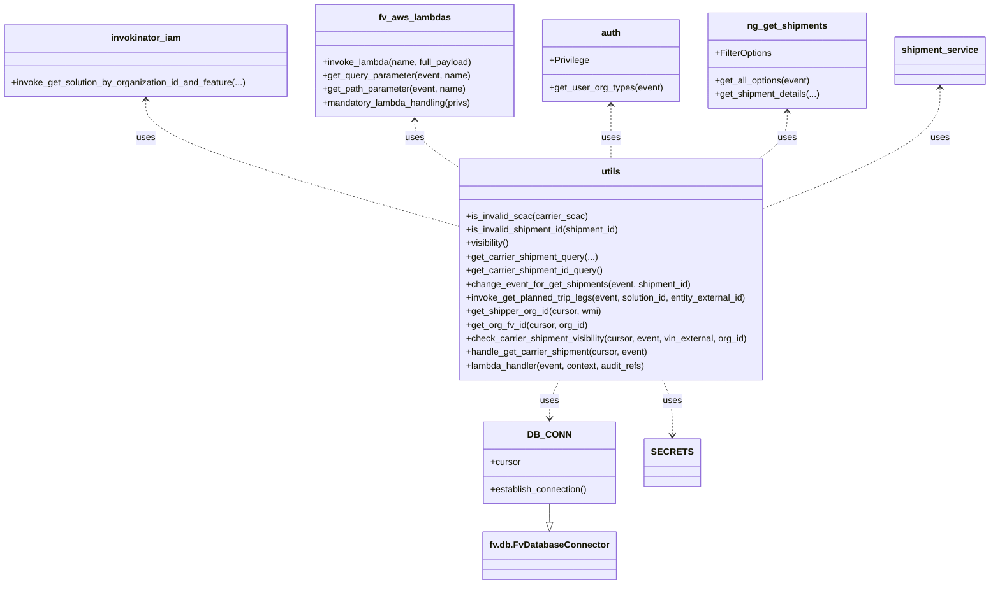

# Diagram: shipment_core/shipment_service/shipment_service/ng_shipments/ng_get_carrier_shipment.py


> Auto-generated by Obscura crawlers

## Diagram 1



### SVG

<svg id="container" width="1738.7421875" xmlns="http://www.w3.org/2000/svg" class="classDiagram" height="1030" viewBox="0 0 1738.7421875 1030" role="graphics-document document" aria-roledescription="class"><style>#container{font-family:"trebuchet ms",verdana,arial,sans-serif;font-size:16px;fill:#333;}@keyframes edge-animation-frame{from{stroke-dashoffset:0;}}@keyframes dash{to{stroke-dashoffset:0;}}#container .edge-animation-slow{stroke-dasharray:9,5!important;stroke-dashoffset:900;animation:dash 50s linear infinite;stroke-linecap:round;}#container .edge-animation-fast{stroke-dasharray:9,5!important;stroke-dashoffset:900;animation:dash 20s linear infinite;stroke-linecap:round;}#container .error-icon{fill:#552222;}#container .error-text{fill:#552222;stroke:#552222;}#container .edge-thickness-normal{stroke-width:1px;}#container .edge-thickness-thick{stroke-width:3.5px;}#container .edge-pattern-solid{stroke-dasharray:0;}#container .edge-thickness-invisible{stroke-width:0;fill:none;}#container .edge-pattern-dashed{stroke-dasharray:3;}#container .edge-pattern-dotted{stroke-dasharray:2;}#container .marker{fill:#333333;stroke:#333333;}#container .marker.cross{stroke:#333333;}#container svg{font-family:"trebuchet ms",verdana,arial,sans-serif;font-size:16px;}#container p{margin:0;}#container g.classGroup text{fill:#9370DB;stroke:none;font-family:"trebuchet ms",verdana,arial,sans-serif;font-size:10px;}#container g.classGroup text .title{font-weight:bolder;}#container .nodeLabel,#container .edgeLabel{color:#131300;}#container .edgeLabel .label rect{fill:#ECECFF;}#container .label text{fill:#131300;}#container .labelBkg{background:#ECECFF;}#container .edgeLabel .label span{background:#ECECFF;}#container .classTitle{font-weight:bolder;}#container .node rect,#container .node circle,#container .node ellipse,#container .node polygon,#container .node path{fill:#ECECFF;stroke:#9370DB;stroke-width:1px;}#container .divider{stroke:#9370DB;stroke-width:1;}#container g.clickable{cursor:pointer;}#container g.classGroup rect{fill:#ECECFF;stroke:#9370DB;}#container g.classGroup line{stroke:#9370DB;stroke-width:1;}#container .classLabel .box{stroke:none;stroke-width:0;fill:#ECECFF;opacity:0.5;}#container .classLabel .label{fill:#9370DB;font-size:10px;}#container .relation{stroke:#333333;stroke-width:1;fill:none;}#container .dashed-line{stroke-dasharray:3;}#container .dotted-line{stroke-dasharray:1 2;}#container #compositionStart,#container .composition{fill:#333333!important;stroke:#333333!important;stroke-width:1;}#container #compositionEnd,#container .composition{fill:#333333!important;stroke:#333333!important;stroke-width:1;}#container #dependencyStart,#container .dependency{fill:#333333!important;stroke:#333333!important;stroke-width:1;}#container #dependencyStart,#container .dependency{fill:#333333!important;stroke:#333333!important;stroke-width:1;}#container #extensionStart,#container .extension{fill:transparent!important;stroke:#333333!important;stroke-width:1;}#container #extensionEnd,#container .extension{fill:transparent!important;stroke:#333333!important;stroke-width:1;}#container #aggregationStart,#container .aggregation{fill:transparent!important;stroke:#333333!important;stroke-width:1;}#container #aggregationEnd,#container .aggregation{fill:transparent!important;stroke:#333333!important;stroke-width:1;}#container #lollipopStart,#container .lollipop{fill:#ECECFF!important;stroke:#333333!important;stroke-width:1;}#container #lollipopEnd,#container .lollipop{fill:#ECECFF!important;stroke:#333333!important;stroke-width:1;}#container .edgeTerminals{font-size:11px;line-height:initial;}#container .classTitleText{text-anchor:middle;font-size:18px;fill:#333;}#container .label-icon{display:inline-block;height:1em;overflow:visible;vertical-align:-0.125em;}#container .node .label-icon path{fill:currentColor;stroke:revert;stroke-width:revert;}#container :root{--mermaid-font-family:"trebuchet ms",verdana,arial,sans-serif;}</style><g><defs><marker id="container_class-aggregationStart" class="marker aggregation class" refX="18" refY="7" markerWidth="190" markerHeight="240" orient="auto"><path d="M 18,7 L9,13 L1,7 L9,1 Z"></path></marker></defs><defs><marker id="container_class-aggregationEnd" class="marker aggregation class" refX="1" refY="7" markerWidth="20" markerHeight="28" orient="auto"><path d="M 18,7 L9,13 L1,7 L9,1 Z"></path></marker></defs><defs><marker id="container_class-extensionStart" class="marker extension class" refX="18" refY="7" markerWidth="190" markerHeight="240" orient="auto"><path d="M 1,7 L18,13 V 1 Z"></path></marker></defs><defs><marker id="container_class-extensionEnd" class="marker extension class" refX="1" refY="7" markerWidth="20" markerHeight="28" orient="auto"><path d="M 1,1 V 13 L18,7 Z"></path></marker></defs><defs><marker id="container_class-compositionStart" class="marker composition class" refX="18" refY="7" markerWidth="190" markerHeight="240" orient="auto"><path d="M 18,7 L9,13 L1,7 L9,1 Z"></path></marker></defs><defs><marker id="container_class-compositionEnd" class="marker composition class" refX="1" refY="7" markerWidth="20" markerHeight="28" orient="auto"><path d="M 18,7 L9,13 L1,7 L9,1 Z"></path></marker></defs><defs><marker id="container_class-dependencyStart" class="marker dependency class" refX="6" refY="7" markerWidth="190" markerHeight="240" orient="auto"><path d="M 5,7 L9,13 L1,7 L9,1 Z"></path></marker></defs><defs><marker id="container_class-dependencyEnd" class="marker dependency class" refX="13" refY="7" markerWidth="20" markerHeight="28" orient="auto"><path d="M 18,7 L9,13 L14,7 L9,1 Z"></path></marker></defs><defs><marker id="container_class-lollipopStart" class="marker lollipop class" refX="13" refY="7" markerWidth="190" markerHeight="240" orient="auto"><circle stroke="black" fill="transparent" cx="7" cy="7" r="6"></circle></marker></defs><defs><marker id="container_class-lollipopEnd" class="marker lollipop class" refX="1" refY="7" markerWidth="190" markerHeight="240" orient="auto"><circle stroke="black" fill="transparent" cx="7" cy="7" r="6"></circle></marker></defs><g class="root"><g class="clusters"></g><g class="edgePaths"><path d="M975.578,888L975.578,892.167C975.578,896.333,975.578,904.667,975.578,910.125C975.578,915.583,975.578,918.167,975.578,919.458L975.578,920.75" id="id_DB_CONN_fv.db.FvDatabaseConnector_1" class="edge-thickness-normal edge-pattern-solid relation" style=";;;" data-edge="true" data-et="edge" data-id="id_DB_CONN_fv.db.FvDatabaseConnector_1" data-points="W3sieCI6OTc1LjU3ODEyNSwieSI6ODg4fSx7IngiOjk3NS41NzgxMjUsInkiOjkxM30seyJ4Ijo5NzUuNTc4MTI1LCJ5Ijo5Mzh9XQ==" marker-end="url(#container_class-extensionEnd)"></path><path d="M258.445,176L258.445,187.167C258.445,198.333,258.445,220.667,349.888,257.654C441.331,294.641,624.216,346.281,715.659,372.102L807.102,397.922" id="id_invokinator_iam_utils_2" class="edge-thickness-normal edge-pattern-dashed relation" style=";;;" data-edge="true" data-et="edge" data-id="id_invokinator_iam_utils_2" data-points="W3sieCI6MjU4LjQ0NTMxMjUsInkiOjE3MH0seyJ4IjoyNTguNDQ1MzEyNSwieSI6MjQzfSx7IngiOjgwNy4xMDE1NjI1LCJ5IjozOTcuOTIxODI1NDUxNTM3M31d" marker-start="url(#container_class-dependencyStart)"></path><path d="M734.672,212L734.672,217.167C734.672,222.333,734.672,232.667,746.743,245.942C758.815,259.217,782.958,275.433,795.03,283.541L807.102,291.65" id="id_fv_aws_lambdas_utils_3" class="edge-thickness-normal edge-pattern-dashed relation" style=";;;" data-edge="true" data-et="edge" data-id="id_fv_aws_lambdas_utils_3" data-points="W3sieCI6NzM0LjY3MTg3NSwieSI6MjA2fSx7IngiOjczNC42NzE4NzUsInkiOjI0M30seyJ4Ijo4MDcuMTAxNTYyNSwieSI6MjkxLjY0OTYwNDc0MDg0Nzk2fV0=" marker-start="url(#container_class-dependencyStart)"></path><path d="M1080.074,185L1080.074,194.667C1080.074,204.333,1080.074,223.667,1080.074,239.5C1080.074,255.333,1080.074,267.667,1080.074,273.833L1080.074,280" id="id_auth_utils_4" class="edge-thickness-normal edge-pattern-dashed relation" style=";;;" data-edge="true" data-et="edge" data-id="id_auth_utils_4" data-points="W3sieCI6MTA4MC4wNzQyMTg3NSwieSI6MTc5fSx7IngiOjEwODAuMDc0MjE4NzUsInkiOjI0M30seyJ4IjoxMDgwLjA3NDIxODc1LCJ5IjoyODB9XQ==" marker-start="url(#container_class-dependencyStart)"></path><path d="M1388.727,197L1388.727,204.667C1388.727,212.333,1388.727,227.667,1380.522,241.5C1372.318,255.333,1355.91,267.667,1347.706,273.833L1339.502,280" id="id_ng_get_shipments_utils_5" class="edge-thickness-normal edge-pattern-dashed relation" style=";;;" data-edge="true" data-et="edge" data-id="id_ng_get_shipments_utils_5" data-points="W3sieCI6MTM4OC43MjY1NjI1LCJ5IjoxOTF9LHsieCI6MTM4OC43MjY1NjI1LCJ5IjoyNDN9LHsieCI6MTMzOS41MDE4MzUyNjQwMDg2LCJ5IjoyODB9XQ==" marker-start="url(#container_class-dependencyStart)"></path><path d="M1654.25,155L1654.25,169.667C1654.25,184.333,1654.25,213.667,1604.049,248.617C1553.849,283.568,1453.448,324.136,1403.247,344.419L1353.047,364.703" id="id_shipment_service_utils_6" class="edge-thickness-normal edge-pattern-dashed relation" style=";;;" data-edge="true" data-et="edge" data-id="id_shipment_service_utils_6" data-points="W3sieCI6MTY1NC4yNSwieSI6MTQ5fSx7IngiOjE2NTQuMjUsInkiOjI0M30seyJ4IjoxMzUzLjA0Njg3NSwieSI6MzY0LjcwMzM2NTU1Nzk2Njl9XQ==" marker-start="url(#container_class-dependencyStart)"></path><path d="M992.243,670L989.466,676.167C986.688,682.333,981.133,694.667,978.356,706C975.578,717.333,975.578,727.667,975.578,732.833L975.578,738" id="id_utils_DB_CONN_7" class="edge-thickness-normal edge-pattern-dashed relation" style=";;;" data-edge="true" data-et="edge" data-id="id_utils_DB_CONN_7" data-points="W3sieCI6OTkyLjI0MzQ1MDI5NjMzNjIsInkiOjY3MH0seyJ4Ijo5NzUuNTc4MTI1LCJ5Ijo3MDd9LHsieCI6OTc1LjU3ODEyNSwieSI6NzQ0fV0=" marker-end="url(#container_class-dependencyEnd)"></path><path d="M1167.905,670L1170.683,676.167C1173.46,682.333,1179.015,694.667,1181.793,711C1184.57,727.333,1184.57,747.667,1184.57,757.833L1184.57,768" id="id_utils_SECRETS_8" class="edge-thickness-normal edge-pattern-dashed relation" style=";;;" data-edge="true" data-et="edge" data-id="id_utils_SECRETS_8" data-points="W3sieCI6MTE2Ny45MDQ5ODcyMDM2NjM3LCJ5Ijo2NzB9LHsieCI6MTE4NC41NzAzMTI1LCJ5Ijo3MDd9LHsieCI6MTE4NC41NzAzMTI1LCJ5Ijo3NzR9XQ==" marker-end="url(#container_class-dependencyEnd)"></path></g><g class="edgeLabels"><g class="edgeLabel"><g class="label" data-id="id_DB_CONN_fv.db.FvDatabaseConnector_1" transform="translate(0, 0)"><foreignObject width="0" height="0"><div xmlns="http://www.w3.org/1999/xhtml" class="labelBkg" style="display: table-cell; white-space: nowrap; line-height: 1.5; max-width: 200px; text-align: center;"><span class="edgeLabel"></span></div></foreignObject></g></g><g class="edgeLabel" transform="translate(258.4453125, 243)"><g class="label" data-id="id_invokinator_iam_utils_2" transform="translate(-16.4921875, -12)"><foreignObject width="32.984375" height="24"><div xmlns="http://www.w3.org/1999/xhtml" class="labelBkg" style="display: table-cell; white-space: nowrap; line-height: 1.5; max-width: 200px; text-align: center;"><span class="edgeLabel"><p>uses</p></span></div></foreignObject></g></g><g class="edgeLabel" transform="translate(734.671875, 243)"><g class="label" data-id="id_fv_aws_lambdas_utils_3" transform="translate(-16.4921875, -12)"><foreignObject width="32.984375" height="24"><div xmlns="http://www.w3.org/1999/xhtml" class="labelBkg" style="display: table-cell; white-space: nowrap; line-height: 1.5; max-width: 200px; text-align: center;"><span class="edgeLabel"><p>uses</p></span></div></foreignObject></g></g><g class="edgeLabel" transform="translate(1080.07421875, 243)"><g class="label" data-id="id_auth_utils_4" transform="translate(-16.4921875, -12)"><foreignObject width="32.984375" height="24"><div xmlns="http://www.w3.org/1999/xhtml" class="labelBkg" style="display: table-cell; white-space: nowrap; line-height: 1.5; max-width: 200px; text-align: center;"><span class="edgeLabel"><p>uses</p></span></div></foreignObject></g></g><g class="edgeLabel" transform="translate(1388.7265625, 243)"><g class="label" data-id="id_ng_get_shipments_utils_5" transform="translate(-16.4921875, -12)"><foreignObject width="32.984375" height="24"><div xmlns="http://www.w3.org/1999/xhtml" class="labelBkg" style="display: table-cell; white-space: nowrap; line-height: 1.5; max-width: 200px; text-align: center;"><span class="edgeLabel"><p>uses</p></span></div></foreignObject></g></g><g class="edgeLabel" transform="translate(1654.25, 243)"><g class="label" data-id="id_shipment_service_utils_6" transform="translate(-16.4921875, -12)"><foreignObject width="32.984375" height="24"><div xmlns="http://www.w3.org/1999/xhtml" class="labelBkg" style="display: table-cell; white-space: nowrap; line-height: 1.5; max-width: 200px; text-align: center;"><span class="edgeLabel"><p>uses</p></span></div></foreignObject></g></g><g class="edgeLabel" transform="translate(975.578125, 707)"><g class="label" data-id="id_utils_DB_CONN_7" transform="translate(-16.4921875, -12)"><foreignObject width="32.984375" height="24"><div xmlns="http://www.w3.org/1999/xhtml" class="labelBkg" style="display: table-cell; white-space: nowrap; line-height: 1.5; max-width: 200px; text-align: center;"><span class="edgeLabel"><p>uses</p></span></div></foreignObject></g></g><g class="edgeLabel" transform="translate(1184.5703125, 707)"><g class="label" data-id="id_utils_SECRETS_8" transform="translate(-16.4921875, -12)"><foreignObject width="32.984375" height="24"><div xmlns="http://www.w3.org/1999/xhtml" class="labelBkg" style="display: table-cell; white-space: nowrap; line-height: 1.5; max-width: 200px; text-align: center;"><span class="edgeLabel"><p>uses</p></span></div></foreignObject></g></g></g><g class="nodes"><g class="node default" id="classId-DB_CONN-0" transform="translate(975.578125, 816)"><g class="basic label-container"><path d="M-115.8359375 -72 L115.8359375 -72 L115.8359375 72 L-115.8359375 72" stroke="none" stroke-width="0" fill="#ECECFF" style=""></path><path d="M-115.8359375 -72 C-57.00361842871552 -72, 1.8287006425689611 -72, 115.8359375 -72 M-115.8359375 -72 C-30.10153713203333 -72, 55.63286323593334 -72, 115.8359375 -72 M115.8359375 -72 C115.8359375 -25.8244996418386, 115.8359375 20.3510007163228, 115.8359375 72 M115.8359375 -72 C115.8359375 -25.62023254086339, 115.8359375 20.759534918273218, 115.8359375 72 M115.8359375 72 C68.5718412783408 72, 21.307745056681597 72, -115.8359375 72 M115.8359375 72 C58.94859186002661 72, 2.0612462200532207 72, -115.8359375 72 M-115.8359375 72 C-115.8359375 33.76454951628545, -115.8359375 -4.4709009674291025, -115.8359375 -72 M-115.8359375 72 C-115.8359375 24.878074978037574, -115.8359375 -22.24385004392485, -115.8359375 -72" stroke="#9370DB" stroke-width="1.3" fill="none" stroke-dasharray="0 0" style=""></path></g><g class="annotation-group text" transform="translate(0, -48)"></g><g class="label-group text" transform="translate(-34.40625, -48)"><g class="label" style="font-weight: bolder" transform="translate(0,-12)"><foreignObject width="68.8125" height="24"><div xmlns="http://www.w3.org/1999/xhtml" style="display: table-cell; white-space: nowrap; line-height: 1.5; max-width: 119px; text-align: center;"><span class="nodeLabel markdown-node-label" style=""><p>DB_CONN</p></span></div></foreignObject></g></g><g class="members-group text" transform="translate(-103.8359375, 0)"><g class="label" style="" transform="translate(0,-12)"><foreignObject width="53.71875" height="24"><div xmlns="http://www.w3.org/1999/xhtml" style="display: table-cell; white-space: nowrap; line-height: 1.5; max-width: 112px; text-align: center;"><span class="nodeLabel markdown-node-label" style=""><p>+cursor</p></span></div></foreignObject></g></g><g class="methods-group text" transform="translate(-103.8359375, 48)"><g class="label" style="" transform="translate(0,-12)"><foreignObject width="173.265625" height="24"><div xmlns="http://www.w3.org/1999/xhtml" style="display: table-cell; white-space: nowrap; line-height: 1.5; max-width: 231px; text-align: center;"><span class="nodeLabel markdown-node-label" style=""><p>+establish_connection()</p></span></div></foreignObject></g></g><g class="divider" style=""><path d="M-115.8359375 -24 C-47.589309469047976 -24, 20.65731856190405 -24, 115.8359375 -24 M-115.8359375 -24 C-45.23772012410136 -24, 25.360497251797284 -24, 115.8359375 -24" stroke="#9370DB" stroke-width="1.3" fill="none" stroke-dasharray="0 0" style=""></path></g><g class="divider" style=""><path d="M-115.8359375 24 C-28.24716431155018 24, 59.34160887689964 24, 115.8359375 24 M-115.8359375 24 C-62.01200635256916 24, -8.188075205138318 24, 115.8359375 24" stroke="#9370DB" stroke-width="1.3" fill="none" stroke-dasharray="0 0" style=""></path></g></g><g class="node default" id="classId-SECRETS-1" transform="translate(1184.5703125, 816)"><g class="basic label-container"><path d="M-43.15625 -42 L43.15625 -42 L43.15625 42 L-43.15625 42" stroke="none" stroke-width="0" fill="#ECECFF" style=""></path><path d="M-43.15625 -42 C-12.857359227188702 -42, 17.441531545622595 -42, 43.15625 -42 M-43.15625 -42 C-10.761422860844256 -42, 21.633404278311488 -42, 43.15625 -42 M43.15625 -42 C43.15625 -10.500836278703613, 43.15625 20.998327442592775, 43.15625 42 M43.15625 -42 C43.15625 -19.806451425590417, 43.15625 2.3870971488191657, 43.15625 42 M43.15625 42 C12.35735741534489 42, -18.44153516931022 42, -43.15625 42 M43.15625 42 C18.6356695151624 42, -5.884910969675197 42, -43.15625 42 M-43.15625 42 C-43.15625 12.828536296048746, -43.15625 -16.342927407902508, -43.15625 -42 M-43.15625 42 C-43.15625 15.891170343725385, -43.15625 -10.21765931254923, -43.15625 -42" stroke="#9370DB" stroke-width="1.3" fill="none" stroke-dasharray="0 0" style=""></path></g><g class="annotation-group text" transform="translate(0, -18)"></g><g class="label-group text" transform="translate(-31.15625, -18)"><g class="label" style="font-weight: bolder" transform="translate(0,-12)"><foreignObject width="62.3125" height="24"><div xmlns="http://www.w3.org/1999/xhtml" style="display: table-cell; white-space: nowrap; line-height: 1.5; max-width: 111px; text-align: center;"><span class="nodeLabel markdown-node-label" style=""><p>SECRETS</p></span></div></foreignObject></g></g><g class="members-group text" transform="translate(-31.15625, 30)"></g><g class="methods-group text" transform="translate(-31.15625, 60)"></g><g class="divider" style=""><path d="M-43.15625 6 C-15.646262291351917 6, 11.863725417296166 6, 43.15625 6 M-43.15625 6 C-21.275731901184724 6, 0.6047861976305526 6, 43.15625 6" stroke="#9370DB" stroke-width="1.3" fill="none" stroke-dasharray="0 0" style=""></path></g><g class="divider" style=""><path d="M-43.15625 24 C-20.194918656429678 24, 2.766412687140644 24, 43.15625 24 M-43.15625 24 C-24.34681067907046 24, -5.537371358140923 24, 43.15625 24" stroke="#9370DB" stroke-width="1.3" fill="none" stroke-dasharray="0 0" style=""></path></g></g><g class="node default" id="classId-invokinator_iam-2" transform="translate(258.4453125, 107)"><g class="basic label-container"><path d="M-250.4453125 -63 L250.4453125 -63 L250.4453125 63 L-250.4453125 63" stroke="none" stroke-width="0" fill="#ECECFF" style=""></path><path d="M-250.4453125 -63 C-120.28053580218042 -63, 9.884240895639152 -63, 250.4453125 -63 M-250.4453125 -63 C-141.2409151021859 -63, -32.03651770437179 -63, 250.4453125 -63 M250.4453125 -63 C250.4453125 -13.296934391277198, 250.4453125 36.406131217445605, 250.4453125 63 M250.4453125 -63 C250.4453125 -27.431261197516903, 250.4453125 8.137477604966193, 250.4453125 63 M250.4453125 63 C133.11013070870254 63, 15.774948917405084 63, -250.4453125 63 M250.4453125 63 C144.8084120591225 63, 39.171511618245006 63, -250.4453125 63 M-250.4453125 63 C-250.4453125 20.88625938731301, -250.4453125 -21.227481225373978, -250.4453125 -63 M-250.4453125 63 C-250.4453125 33.15876359742615, -250.4453125 3.3175271948523033, -250.4453125 -63" stroke="#9370DB" stroke-width="1.3" fill="none" stroke-dasharray="0 0" style=""></path></g><g class="annotation-group text" transform="translate(0, -39)"></g><g class="label-group text" transform="translate(-58.953125, -39)"><g class="label" style="font-weight: bolder" transform="translate(0,-12)"><foreignObject width="117.90625" height="24"><div xmlns="http://www.w3.org/1999/xhtml" style="display: table-cell; white-space: nowrap; line-height: 1.5; max-width: 167px; text-align: center;"><span class="nodeLabel markdown-node-label" style=""><p>invokinator_iam</p></span></div></foreignObject></g></g><g class="members-group text" transform="translate(-238.4453125, 9)"></g><g class="methods-group text" transform="translate(-238.4453125, 39)"><g class="label" style="" transform="translate(0,-12)"><foreignObject width="417.9375" height="24"><div xmlns="http://www.w3.org/1999/xhtml" style="display: table-cell; white-space: nowrap; line-height: 1.5; max-width: 475px; text-align: center;"><span class="nodeLabel markdown-node-label" style=""><p>+invoke_get_solution_by_organization_id_and_feature(...)</p></span></div></foreignObject></g></g><g class="divider" style=""><path d="M-250.4453125 -15 C-53.229582076196124 -15, 143.98614834760775 -15, 250.4453125 -15 M-250.4453125 -15 C-132.40783456986935 -15, -14.370356639738674 -15, 250.4453125 -15" stroke="#9370DB" stroke-width="1.3" fill="none" stroke-dasharray="0 0" style=""></path></g><g class="divider" style=""><path d="M-250.4453125 9 C-131.55807109201987 9, -12.670829684039774 9, 250.4453125 9 M-250.4453125 9 C-134.35041896881344 9, -18.255525437626886 9, 250.4453125 9" stroke="#9370DB" stroke-width="1.3" fill="none" stroke-dasharray="0 0" style=""></path></g></g><g class="node default" id="classId-fv_aws_lambdas-3" transform="translate(734.671875, 107)"><g class="basic label-container"><path d="M-175.78125 -99 L175.78125 -99 L175.78125 99 L-175.78125 99" stroke="none" stroke-width="0" fill="#ECECFF" style=""></path><path d="M-175.78125 -99 C-70.13230855993744 -99, 35.516632880125115 -99, 175.78125 -99 M-175.78125 -99 C-72.3205963610396 -99, 31.14005727792079 -99, 175.78125 -99 M175.78125 -99 C175.78125 -48.88556226509479, 175.78125 1.2288754698104185, 175.78125 99 M175.78125 -99 C175.78125 -37.824395192728225, 175.78125 23.35120961454355, 175.78125 99 M175.78125 99 C94.8209143879572 99, 13.860578775914405 99, -175.78125 99 M175.78125 99 C45.9683233785758 99, -83.8446032428484 99, -175.78125 99 M-175.78125 99 C-175.78125 56.9578207738501, -175.78125 14.915641547700204, -175.78125 -99 M-175.78125 99 C-175.78125 33.1721075396202, -175.78125 -32.6557849207596, -175.78125 -99" stroke="#9370DB" stroke-width="1.3" fill="none" stroke-dasharray="0 0" style=""></path></g><g class="annotation-group text" transform="translate(0, -75)"></g><g class="label-group text" transform="translate(-60.0625, -75)"><g class="label" style="font-weight: bolder" transform="translate(0,-12)"><foreignObject width="120.125" height="24"><div xmlns="http://www.w3.org/1999/xhtml" style="display: table-cell; white-space: nowrap; line-height: 1.5; max-width: 168px; text-align: center;"><span class="nodeLabel markdown-node-label" style=""><p>fv_aws_lambdas</p></span></div></foreignObject></g></g><g class="members-group text" transform="translate(-163.78125, -27)"></g><g class="methods-group text" transform="translate(-163.78125, 3)"><g class="label" style="" transform="translate(0,-12)"><foreignObject width="267.234375" height="24"><div xmlns="http://www.w3.org/1999/xhtml" style="display: table-cell; white-space: nowrap; line-height: 1.5; max-width: 325px; text-align: center;"><span class="nodeLabel markdown-node-label" style=""><p>+invoke_lambda(name, full_payload)</p></span></div></foreignObject></g><g class="label" style="" transform="translate(0,12)"><foreignObject width="262.625" height="24"><div xmlns="http://www.w3.org/1999/xhtml" style="display: table-cell; white-space: nowrap; line-height: 1.5; max-width: 320px; text-align: center;"><span class="nodeLabel markdown-node-label" style=""><p>+get_query_parameter(event, name)</p></span></div></foreignObject></g><g class="label" style="" transform="translate(0,36)"><foreignObject width="254.984375" height="24"><div xmlns="http://www.w3.org/1999/xhtml" style="display: table-cell; white-space: nowrap; line-height: 1.5; max-width: 312px; text-align: center;"><span class="nodeLabel markdown-node-label" style=""><p>+get_path_parameter(event, name)</p></span></div></foreignObject></g><g class="label" style="" transform="translate(0,60)"><foreignObject width="267.5" height="24"><div xmlns="http://www.w3.org/1999/xhtml" style="display: table-cell; white-space: nowrap; line-height: 1.5; max-width: 325px; text-align: center;"><span class="nodeLabel markdown-node-label" style=""><p>+mandatory_lambda_handling(privs)</p></span></div></foreignObject></g></g><g class="divider" style=""><path d="M-175.78125 -51 C-50.77040227882239 -51, 74.24044544235522 -51, 175.78125 -51 M-175.78125 -51 C-41.69730715324627 -51, 92.38663569350746 -51, 175.78125 -51" stroke="#9370DB" stroke-width="1.3" fill="none" stroke-dasharray="0 0" style=""></path></g><g class="divider" style=""><path d="M-175.78125 -27 C-102.77337626520993 -27, -29.765502530419866 -27, 175.78125 -27 M-175.78125 -27 C-78.88098729014146 -27, 18.019275419717076 -27, 175.78125 -27" stroke="#9370DB" stroke-width="1.3" fill="none" stroke-dasharray="0 0" style=""></path></g></g><g class="node default" id="classId-auth-4" transform="translate(1080.07421875, 107)"><g class="basic label-container"><path d="M-119.62109375 -72 L119.62109375 -72 L119.62109375 72 L-119.62109375 72" stroke="none" stroke-width="0" fill="#ECECFF" style=""></path><path d="M-119.62109375 -72 C-70.0369898357292 -72, -20.452885921458417 -72, 119.62109375 -72 M-119.62109375 -72 C-68.93998018889975 -72, -18.258866627799506 -72, 119.62109375 -72 M119.62109375 -72 C119.62109375 -40.050532341632, 119.62109375 -8.101064683264, 119.62109375 72 M119.62109375 -72 C119.62109375 -23.443666701786903, 119.62109375 25.112666596426195, 119.62109375 72 M119.62109375 72 C67.45002755300773 72, 15.278961356015458 72, -119.62109375 72 M119.62109375 72 C58.02978095793169 72, -3.5615318341366162 72, -119.62109375 72 M-119.62109375 72 C-119.62109375 41.04678506477186, -119.62109375 10.093570129543721, -119.62109375 -72 M-119.62109375 72 C-119.62109375 32.39111427713586, -119.62109375 -7.217771445728275, -119.62109375 -72" stroke="#9370DB" stroke-width="1.3" fill="none" stroke-dasharray="0 0" style=""></path></g><g class="annotation-group text" transform="translate(0, -48)"></g><g class="label-group text" transform="translate(-16.6640625, -48)"><g class="label" style="font-weight: bolder" transform="translate(0,-12)"><foreignObject width="33.328125" height="24"><div xmlns="http://www.w3.org/1999/xhtml" style="display: table-cell; white-space: nowrap; line-height: 1.5; max-width: 83px; text-align: center;"><span class="nodeLabel markdown-node-label" style=""><p>auth</p></span></div></foreignObject></g></g><g class="members-group text" transform="translate(-107.62109375, 0)"><g class="label" style="" transform="translate(0,-12)"><foreignObject width="70.15625" height="24"><div xmlns="http://www.w3.org/1999/xhtml" style="display: table-cell; white-space: nowrap; line-height: 1.5; max-width: 128px; text-align: center;"><span class="nodeLabel markdown-node-label" style=""><p>+Privilege</p></span></div></foreignObject></g></g><g class="methods-group text" transform="translate(-107.62109375, 48)"><g class="label" style="" transform="translate(0,-12)"><foreignObject width="198.578125" height="24"><div xmlns="http://www.w3.org/1999/xhtml" style="display: table-cell; white-space: nowrap; line-height: 1.5; max-width: 256px; text-align: center;"><span class="nodeLabel markdown-node-label" style=""><p>+get_user_org_types(event)</p></span></div></foreignObject></g></g><g class="divider" style=""><path d="M-119.62109375 -24 C-69.54290135741743 -24, -19.464708964834884 -24, 119.62109375 -24 M-119.62109375 -24 C-55.20964260535601 -24, 9.201808539287981 -24, 119.62109375 -24" stroke="#9370DB" stroke-width="1.3" fill="none" stroke-dasharray="0 0" style=""></path></g><g class="divider" style=""><path d="M-119.62109375 24 C-62.86236604339481 24, -6.103638336789615 24, 119.62109375 24 M-119.62109375 24 C-41.97358238657107 24, 35.673928976857866 24, 119.62109375 24" stroke="#9370DB" stroke-width="1.3" fill="none" stroke-dasharray="0 0" style=""></path></g></g><g class="node default" id="classId-shipment_service-5" transform="translate(1654.25, 107)"><g class="basic label-container"><path d="M-76.4921875 -42 L76.4921875 -42 L76.4921875 42 L-76.4921875 42" stroke="none" stroke-width="0" fill="#ECECFF" style=""></path><path d="M-76.4921875 -42 C-36.378712640827395 -42, 3.7347622183452103 -42, 76.4921875 -42 M-76.4921875 -42 C-42.24943499637065 -42, -8.006682492741305 -42, 76.4921875 -42 M76.4921875 -42 C76.4921875 -14.858177317350616, 76.4921875 12.283645365298767, 76.4921875 42 M76.4921875 -42 C76.4921875 -21.772390671062688, 76.4921875 -1.5447813421253755, 76.4921875 42 M76.4921875 42 C17.541451705802842 42, -41.409284088394315 42, -76.4921875 42 M76.4921875 42 C32.29446519194773 42, -11.903257116104541 42, -76.4921875 42 M-76.4921875 42 C-76.4921875 13.87867935387294, -76.4921875 -14.24264129225412, -76.4921875 -42 M-76.4921875 42 C-76.4921875 16.9966975088201, -76.4921875 -8.006604982359796, -76.4921875 -42" stroke="#9370DB" stroke-width="1.3" fill="none" stroke-dasharray="0 0" style=""></path></g><g class="annotation-group text" transform="translate(0, -18)"></g><g class="label-group text" transform="translate(-64.4921875, -18)"><g class="label" style="font-weight: bolder" transform="translate(0,-12)"><foreignObject width="128.984375" height="24"><div xmlns="http://www.w3.org/1999/xhtml" style="display: table-cell; white-space: nowrap; line-height: 1.5; max-width: 178px; text-align: center;"><span class="nodeLabel markdown-node-label" style=""><p>shipment_service</p></span></div></foreignObject></g></g><g class="members-group text" transform="translate(-64.4921875, 30)"></g><g class="methods-group text" transform="translate(-64.4921875, 60)"></g><g class="divider" style=""><path d="M-76.4921875 6 C-26.449769628113984 6, 23.592648243772032 6, 76.4921875 6 M-76.4921875 6 C-26.90819816497867 6, 22.675791170042658 6, 76.4921875 6" stroke="#9370DB" stroke-width="1.3" fill="none" stroke-dasharray="0 0" style=""></path></g><g class="divider" style=""><path d="M-76.4921875 24 C-21.70896908600391 24, 33.07424932799218 24, 76.4921875 24 M-76.4921875 24 C-29.259639066536728 24, 17.972909366926544 24, 76.4921875 24" stroke="#9370DB" stroke-width="1.3" fill="none" stroke-dasharray="0 0" style=""></path></g></g><g class="node default" id="classId-ng_get_shipments-6" transform="translate(1388.7265625, 107)"><g class="basic label-container"><path d="M-139.03125 -84 L139.03125 -84 L139.03125 84 L-139.03125 84" stroke="none" stroke-width="0" fill="#ECECFF" style=""></path><path d="M-139.03125 -84 C-56.78677501375992 -84, 25.457699972480157 -84, 139.03125 -84 M-139.03125 -84 C-46.7978047245919 -84, 45.4356405508162 -84, 139.03125 -84 M139.03125 -84 C139.03125 -20.751536409122217, 139.03125 42.49692718175557, 139.03125 84 M139.03125 -84 C139.03125 -36.756172623770645, 139.03125 10.48765475245871, 139.03125 84 M139.03125 84 C40.85871393283293 84, -57.313822134334146 84, -139.03125 84 M139.03125 84 C61.278639281646164 84, -16.47397143670767 84, -139.03125 84 M-139.03125 84 C-139.03125 37.792059101550144, -139.03125 -8.415881796899711, -139.03125 -84 M-139.03125 84 C-139.03125 20.075982053117734, -139.03125 -43.84803589376453, -139.03125 -84" stroke="#9370DB" stroke-width="1.3" fill="none" stroke-dasharray="0 0" style=""></path></g><g class="annotation-group text" transform="translate(0, -60)"></g><g class="label-group text" transform="translate(-67.53125, -60)"><g class="label" style="font-weight: bolder" transform="translate(0,-12)"><foreignObject width="135.0625" height="24"><div xmlns="http://www.w3.org/1999/xhtml" style="display: table-cell; white-space: nowrap; line-height: 1.5; max-width: 183px; text-align: center;"><span class="nodeLabel markdown-node-label" style=""><p>ng_get_shipments</p></span></div></foreignObject></g></g><g class="members-group text" transform="translate(-127.03125, -12)"><g class="label" style="" transform="translate(0,-12)"><foreignObject width="101.96875" height="24"><div xmlns="http://www.w3.org/1999/xhtml" style="display: table-cell; white-space: nowrap; line-height: 1.5; max-width: 159px; text-align: center;"><span class="nodeLabel markdown-node-label" style=""><p>+FilterOptions</p></span></div></foreignObject></g></g><g class="methods-group text" transform="translate(-127.03125, 36)"><g class="label" style="" transform="translate(0,-12)"><foreignObject width="170.5" height="24"><div xmlns="http://www.w3.org/1999/xhtml" style="display: table-cell; white-space: nowrap; line-height: 1.5; max-width: 228px; text-align: center;"><span class="nodeLabel markdown-node-label" style=""><p>+get_all_options(event)</p></span></div></foreignObject></g><g class="label" style="" transform="translate(0,12)"><foreignObject width="186.53125" height="24"><div xmlns="http://www.w3.org/1999/xhtml" style="display: table-cell; white-space: nowrap; line-height: 1.5; max-width: 244px; text-align: center;"><span class="nodeLabel markdown-node-label" style=""><p>+get_shipment_details(...)</p></span></div></foreignObject></g></g><g class="divider" style=""><path d="M-139.03125 -36 C-35.48357574816576 -36, 68.06409850366848 -36, 139.03125 -36 M-139.03125 -36 C-79.96489853128534 -36, -20.8985470625707 -36, 139.03125 -36" stroke="#9370DB" stroke-width="1.3" fill="none" stroke-dasharray="0 0" style=""></path></g><g class="divider" style=""><path d="M-139.03125 12 C-80.14035013692133 12, -21.249450273842655 12, 139.03125 12 M-139.03125 12 C-65.44351586057243 12, 8.144218278855135 12, 139.03125 12" stroke="#9370DB" stroke-width="1.3" fill="none" stroke-dasharray="0 0" style=""></path></g></g><g class="node default" id="classId-utils-7" transform="translate(1080.07421875, 475)"><g class="basic label-container"><path d="M-272.97265625 -195 L272.97265625 -195 L272.97265625 195 L-272.97265625 195" stroke="none" stroke-width="0" fill="#ECECFF" style=""></path><path d="M-272.97265625 -195 C-147.55804058482886 -195, -22.14342491965769 -195, 272.97265625 -195 M-272.97265625 -195 C-139.79363357919303 -195, -6.614610908386055 -195, 272.97265625 -195 M272.97265625 -195 C272.97265625 -48.64284791571686, 272.97265625 97.71430416856629, 272.97265625 195 M272.97265625 -195 C272.97265625 -78.52968355422469, 272.97265625 37.94063289155062, 272.97265625 195 M272.97265625 195 C115.50134053458564 195, -41.969975180828726 195, -272.97265625 195 M272.97265625 195 C118.40231268031005 195, -36.16803088937991 195, -272.97265625 195 M-272.97265625 195 C-272.97265625 44.64563371482387, -272.97265625 -105.70873257035225, -272.97265625 -195 M-272.97265625 195 C-272.97265625 69.43057633139988, -272.97265625 -56.13884733720025, -272.97265625 -195" stroke="#9370DB" stroke-width="1.3" fill="none" stroke-dasharray="0 0" style=""></path></g><g class="annotation-group text" transform="translate(0, -171)"></g><g class="label-group text" transform="translate(-16.1640625, -171)"><g class="label" style="font-weight: bolder" transform="translate(0,-12)"><foreignObject width="32.328125" height="24"><div xmlns="http://www.w3.org/1999/xhtml" style="display: table-cell; white-space: nowrap; line-height: 1.5; max-width: 82px; text-align: center;"><span class="nodeLabel markdown-node-label" style=""><p>utils</p></span></div></foreignObject></g></g><g class="members-group text" transform="translate(-260.97265625, -123)"></g><g class="methods-group text" transform="translate(-260.97265625, -93)"><g class="label" style="" transform="translate(0,-12)"><foreignObject width="212.984375" height="24"><div xmlns="http://www.w3.org/1999/xhtml" style="display: table-cell; white-space: nowrap; line-height: 1.5; max-width: 270px; text-align: center;"><span class="nodeLabel markdown-node-label" style=""><p>+is_invalid_scac(carrier_scac)</p></span></div></foreignObject></g><g class="label" style="" transform="translate(0,12)"><foreignObject width="277.0625" height="24"><div xmlns="http://www.w3.org/1999/xhtml" style="display: table-cell; white-space: nowrap; line-height: 1.5; max-width: 334px; text-align: center;"><span class="nodeLabel markdown-node-label" style=""><p>+is_invalid_shipment_id(shipment_id)</p></span></div></foreignObject></g><g class="label" style="" transform="translate(0,36)"><foreignObject width="79.359375" height="24"><div xmlns="http://www.w3.org/1999/xhtml" style="display: table-cell; white-space: nowrap; line-height: 1.5; max-width: 137px; text-align: center;"><span class="nodeLabel markdown-node-label" style=""><p>+visibility()</p></span></div></foreignObject></g><g class="label" style="" transform="translate(0,60)"><foreignObject width="233.53125" height="24"><div xmlns="http://www.w3.org/1999/xhtml" style="display: table-cell; white-space: nowrap; line-height: 1.5; max-width: 291px; text-align: center;"><span class="nodeLabel markdown-node-label" style=""><p>+get_carrier_shipment_query(...)</p></span></div></foreignObject></g><g class="label" style="" transform="translate(0,84)"><foreignObject width="244.40625" height="24"><div xmlns="http://www.w3.org/1999/xhtml" style="display: table-cell; white-space: nowrap; line-height: 1.5; max-width: 302px; text-align: center;"><span class="nodeLabel markdown-node-label" style=""><p>+get_carrier_shipment_id_query()</p></span></div></foreignObject></g><g class="label" style="" transform="translate(0,108)"><foreignObject width="400.296875" height="24"><div xmlns="http://www.w3.org/1999/xhtml" style="display: table-cell; white-space: nowrap; line-height: 1.5; max-width: 458px; text-align: center;"><span class="nodeLabel markdown-node-label" style=""><p>+change_event_for_get_shipments(event, shipment_id)</p></span></div></foreignObject></g><g class="label" style="" transform="translate(0,132)"><foreignObject width="505.78125" height="24"><div xmlns="http://www.w3.org/1999/xhtml" style="display: table-cell; white-space: nowrap; line-height: 1.5; max-width: 563px; text-align: center;"><span class="nodeLabel markdown-node-label" style=""><p>+invoke_get_planned_trip_legs(event, solution_id, entity_external_id)</p></span></div></foreignObject></g><g class="label" style="" transform="translate(0,156)"><foreignObject width="239.515625" height="24"><div xmlns="http://www.w3.org/1999/xhtml" style="display: table-cell; white-space: nowrap; line-height: 1.5; max-width: 297px; text-align: center;"><span class="nodeLabel markdown-node-label" style=""><p>+get_shipper_org_id(cursor, wmi)</p></span></div></foreignObject></g><g class="label" style="" transform="translate(0,180)"><foreignObject width="214.328125" height="24"><div xmlns="http://www.w3.org/1999/xhtml" style="display: table-cell; white-space: nowrap; line-height: 1.5; max-width: 272px; text-align: center;"><span class="nodeLabel markdown-node-label" style=""><p>+get_org_fv_id(cursor, org_id)</p></span></div></foreignObject></g><g class="label" style="" transform="translate(0,204)"><foreignObject width="504.734375" height="24"><div xmlns="http://www.w3.org/1999/xhtml" style="display: table-cell; white-space: nowrap; line-height: 1.5; max-width: 562px; text-align: center;"><span class="nodeLabel markdown-node-label" style=""><p>+check_carrier_shipment_visibility(cursor, event, vin_external, org_id)</p></span></div></foreignObject></g><g class="label" style="" transform="translate(0,228)"><foreignObject width="323.71875" height="24"><div xmlns="http://www.w3.org/1999/xhtml" style="display: table-cell; white-space: nowrap; line-height: 1.5; max-width: 381px; text-align: center;"><span class="nodeLabel markdown-node-label" style=""><p>+handle_get_carrier_shipment(cursor, event)</p></span></div></foreignObject></g><g class="label" style="" transform="translate(0,252)"><foreignObject width="321.6875" height="24"><div xmlns="http://www.w3.org/1999/xhtml" style="display: table-cell; white-space: nowrap; line-height: 1.5; max-width: 379px; text-align: center;"><span class="nodeLabel markdown-node-label" style=""><p>+lambda_handler(event, context, audit_refs)</p></span></div></foreignObject></g></g><g class="divider" style=""><path d="M-272.97265625 -147 C-104.27615213696512 -147, 64.42035197606975 -147, 272.97265625 -147 M-272.97265625 -147 C-140.10893879703846 -147, -7.245221344076924 -147, 272.97265625 -147" stroke="#9370DB" stroke-width="1.3" fill="none" stroke-dasharray="0 0" style=""></path></g><g class="divider" style=""><path d="M-272.97265625 -123 C-139.07140298243337 -123, -5.170149714866739 -123, 272.97265625 -123 M-272.97265625 -123 C-84.68882783224967 -123, 103.59500058550066 -123, 272.97265625 -123" stroke="#9370DB" stroke-width="1.3" fill="none" stroke-dasharray="0 0" style=""></path></g></g><g class="node default" id="classId-fv.db.FvDatabaseConnector-8" transform="translate(975.578125, 980)"><g class="basic label-container"><path d="M-111.1953125 -42 L111.1953125 -42 L111.1953125 42 L-111.1953125 42" stroke="none" stroke-width="0" fill="#ECECFF" style=""></path><path d="M-111.1953125 -42 C-64.93472691682321 -42, -18.674141333646418 -42, 111.1953125 -42 M-111.1953125 -42 C-58.798701767762765 -42, -6.40209103552553 -42, 111.1953125 -42 M111.1953125 -42 C111.1953125 -10.494382932775249, 111.1953125 21.011234134449502, 111.1953125 42 M111.1953125 -42 C111.1953125 -11.195996724049301, 111.1953125 19.608006551901397, 111.1953125 42 M111.1953125 42 C60.20400111514904 42, 9.21268973029808 42, -111.1953125 42 M111.1953125 42 C65.26617168060807 42, 19.33703086121612 42, -111.1953125 42 M-111.1953125 42 C-111.1953125 23.629486321706533, -111.1953125 5.258972643413067, -111.1953125 -42 M-111.1953125 42 C-111.1953125 16.822225085861607, -111.1953125 -8.355549828276786, -111.1953125 -42" stroke="#9370DB" stroke-width="1.3" fill="none" stroke-dasharray="0 0" style=""></path></g><g class="annotation-group text" transform="translate(0, -18)"></g><g class="label-group text" transform="translate(-99.1953125, -18)"><g class="label" style="font-weight: bolder" transform="translate(0,-12)"><foreignObject width="198.390625" height="24"><div xmlns="http://www.w3.org/1999/xhtml" style="display: table-cell; white-space: nowrap; line-height: 1.5; max-width: 246px; text-align: center;"><span class="nodeLabel markdown-node-label" style=""><p>fv.db.FvDatabaseConnector</p></span></div></foreignObject></g></g><g class="members-group text" transform="translate(-99.1953125, 30)"></g><g class="methods-group text" transform="translate(-99.1953125, 60)"></g><g class="divider" style=""><path d="M-111.1953125 6 C-36.353557556363285 6, 38.48819738727343 6, 111.1953125 6 M-111.1953125 6 C-59.45743591913132 6, -7.719559338262641 6, 111.1953125 6" stroke="#9370DB" stroke-width="1.3" fill="none" stroke-dasharray="0 0" style=""></path></g><g class="divider" style=""><path d="M-111.1953125 24 C-53.523476121803476 24, 4.1483602563930475 24, 111.1953125 24 M-111.1953125 24 C-33.801389025077995 24, 43.59253444984401 24, 111.1953125 24" stroke="#9370DB" stroke-width="1.3" fill="none" stroke-dasharray="0 0" style=""></path></g></g></g></g></g></svg>

## Diagram 2

```mermaid
flowchart LR
A[lambda_handler(event, context, audit_refs)] --> B[DB_CONN.establish_connection()]
B --> C[handle_get_carrier_shipment(cursor, event)]
C --> D{Validate request}
D --> D1[extract organization_id]
D --> D2[validate carrier_scac]
D --> D3[validate creator_shipment_id]
D --> E[options = get_all_options(event) -> vin_value]
E --> F[has_visibility = check_carrier_shipment_visibility(cursor,event,vin,org_id)]
F --> G[DB_CONN.establish_connection() / cursor = DB_CONN.cursor]
G --> H{format == "SHIPMENT_ID"?}
H --> |yes| I[get_carrier_shipment_id_query()]
H --> |no| J[get_carrier_shipment_query("shipment_id", has_visibility)]
I --> K[cursor.mogrify(query, params) & execute]
J --> K
K --> L[shipment = cursor.fetchone()]
L --> M{shipment exists?}
M --> |yes & SHIPMENT_ID| N[return {"shipment_id": shipment.id}]
M --> |yes & DETAIL| O[return get_shipment_details(...)]
M --> |no & DETAIL| P[try reference_number query -> fetch -> maybe get_shipment_details]
M --> |no| Q[return {}]
N --> R[make_response(payload)]
O --> R
P --> R
Q --> S[make_response({}, 404)]
```

> SVG rendering failed for this diagram.
