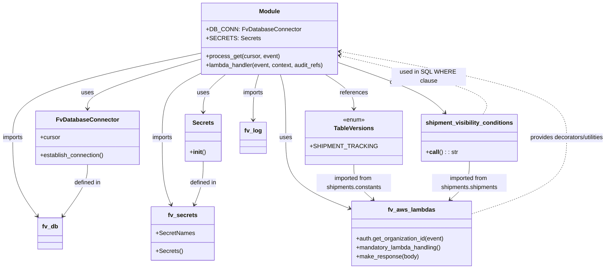

# Diagram: shipment_core/shipment_service/shipment_service/ng_shipments/ng_get_carrier_shipment_ids.py

> Auto-generated by Obscura crawlers

## Mermaid

### SVG

<svg id="container" width="1592.2734375" xmlns="http://www.w3.org/2000/svg" class="classDiagram" height="698" viewBox="0 0 1592.2734375 698" role="graphics-document document" aria-roledescription="class"><g><defs><marker id="container_class-aggregationStart" class="marker aggregation class" refX="18" refY="7" markerWidth="190" markerHeight="240" orient="auto"><path d="M 18,7 L9,13 L1,7 L9,1 Z"></path></marker></defs><defs><marker id="container_class-aggregationEnd" class="marker aggregation class" refX="1" refY="7" markerWidth="20" markerHeight="28" orient="auto"><path d="M 18,7 L9,13 L1,7 L9,1 Z"></path></marker></defs><defs><marker id="container_class-extensionStart" class="marker extension class" refX="18" refY="7" markerWidth="190" markerHeight="240" orient="auto"><path d="M 1,7 L18,13 V 1 Z"></path></marker></defs><defs><marker id="container_class-extensionEnd" class="marker extension class" refX="1" refY="7" markerWidth="20" markerHeight="28" orient="auto"><path d="M 1,1 V 13 L18,7 Z"></path></marker></defs><defs><marker id="container_class-compositionStart" class="marker composition class" refX="18" refY="7" markerWidth="190" markerHeight="240" orient="auto"><path d="M 18,7 L9,13 L1,7 L9,1 Z"></path></marker></defs><defs><marker id="container_class-compositionEnd" class="marker composition class" refX="1" refY="7" markerWidth="20" markerHeight="28" orient="auto"><path d="M 18,7 L9,13 L1,7 L9,1 Z"></path></marker></defs><defs><marker id="container_class-dependencyStart" class="marker dependency class" refX="6" refY="7" markerWidth="190" markerHeight="240" orient="auto"><path d="M 5,7 L9,13 L1,7 L9,1 Z"></path></marker></defs><defs><marker id="container_class-dependencyEnd" class="marker dependency class" refX="13" refY="7" markerWidth="20" markerHeight="28" orient="auto"><path d="M 18,7 L9,13 L14,7 L9,1 Z"></path></marker></defs><defs><marker id="container_class-lollipopStart" class="marker lollipop class" refX="13" refY="7" markerWidth="190" markerHeight="240" orient="auto"><circle stroke="black" fill="transparent" cx="7" cy="7" r="6"></circle></marker></defs><defs><marker id="container_class-lollipopEnd" class="marker lollipop class" refX="1" refY="7" markerWidth="190" markerHeight="240" orient="auto"><circle stroke="black" fill="transparent" cx="7" cy="7" r="6"></circle></marker></defs><g class="root"><g class="clusters"></g><g class="edgePaths"><path d="M537.203,155.028L487.3,168.69C437.397,182.352,337.591,209.676,287.688,228.505C237.785,247.333,237.785,257.667,237.785,262.833L237.785,268" id="id_Module_FvDatabaseConnector_1" class="edge-thickness-normal edge-pattern-solid relation" style=";;;" data-edge="true" data-et="edge" data-id="id_Module_FvDatabaseConnector_1" data-points="W3sieCI6NTM3LjIwMzEyNSwieSI6MTU1LjAyODIzMDk2MTU4OTV9LHsieCI6MjM3Ljc4NTE1NjI1LCJ5IjoyMzd9LHsieCI6MjM3Ljc4NTE1NjI1LCJ5IjoyNzR9XQ==" marker-end="url(#container_class-dependencyEnd)"></path><path d="M597.969,200L589.899,206.167C581.829,212.333,565.69,224.667,557.62,237.5C549.551,250.333,549.551,263.667,549.551,270.333L549.551,277" id="id_Module_Secrets_2" class="edge-thickness-normal edge-pattern-solid relation" style=";;;" data-edge="true" data-et="edge" data-id="id_Module_Secrets_2" data-points="W3sieCI6NTk3Ljk2ODc1LCJ5IjoyMDB9LHsieCI6NTQ5LjU1MDc4MTI1LCJ5IjoyMzd9LHsieCI6NTQ5LjU1MDc4MTI1LCJ5IjoyODN9XQ==" marker-end="url(#container_class-dependencyEnd)"></path><path d="M875.959,200L885.747,206.167C895.534,212.333,915.109,224.667,924.896,236C934.684,247.333,934.684,257.667,934.684,262.833L934.684,268" id="id_Module_TableVersions_3" class="edge-thickness-normal edge-pattern-solid relation" style=";;;" data-edge="true" data-et="edge" data-id="id_Module_TableVersions_3" data-points="W3sieCI6ODc1Ljk1OTM1MTUwMzc1OTQsInkiOjIwMH0seyJ4Ijo5MzQuNjgzNTkzNzUsInkiOjIzN30seyJ4Ijo5MzQuNjgzNTkzNzUsInkiOjI3NH1d" marker-end="url(#container_class-dependencyEnd)"></path><path d="M909.984,166.989L944.513,178.657C979.041,190.326,1048.098,213.663,1089.532,232.288C1130.966,250.914,1144.777,264.828,1151.683,271.785L1158.589,278.742" id="id_Module_shipment_visibility_conditions_4" class="edge-thickness-normal edge-pattern-solid relation" style=";;;" data-edge="true" data-et="edge" data-id="id_Module_shipment_visibility_conditions_4" data-points="W3sieCI6OTA5Ljk4NDM3NSwieSI6MTY2Ljk4ODkxODI3OTEzMjMyfSx7IngiOjExMTcuMTU0Mjk2ODc1LCJ5IjoyMzd9LHsieCI6MTE2Mi44MTU1MjgyMzk2NzksInkiOjI4M31d" marker-end="url(#container_class-dependencyEnd)"></path><path d="M754.524,200L756.511,206.167C758.498,212.333,762.472,224.667,764.458,249C766.445,273.333,766.445,309.667,766.445,348C766.445,386.333,766.445,426.667,790.901,457.44C815.356,488.213,864.266,509.426,888.722,520.033L913.177,530.639" id="id_Module_fv_aws_lambdas_5" class="edge-thickness-normal edge-pattern-solid relation" style=";;;" data-edge="true" data-et="edge" data-id="id_Module_fv_aws_lambdas_5" data-points="W3sieCI6NzU0LjUyNDIwMTEyNzgxOTUsInkiOjIwMH0seyJ4Ijo3NjYuNDQ1MzEyNSwieSI6MjM3fSx7IngiOjc2Ni40NDUzMTI1LCJ5IjozNDZ9LHsieCI6NzY2LjQ0NTMxMjUsInkiOjQ2N30seyJ4Ijo5MTguNjgxNjQwNjI1LCJ5Ijo1MzMuMDI2Njk1ODk5Njk0Mn1d" marker-end="url(#container_class-dependencyEnd)"></path><path d="M537.203,140.066L453.711,156.222C370.219,172.378,203.234,204.689,119.742,239.011C36.25,273.333,36.25,309.667,36.25,348C36.25,386.333,36.25,426.667,47.263,461.697C58.275,496.726,80.301,526.453,91.313,541.316L102.326,556.179" id="id_Module_fv_db_6" class="edge-thickness-normal edge-pattern-solid relation" style=";;;" data-edge="true" data-et="edge" data-id="id_Module_fv_db_6" data-points="W3sieCI6NTM3LjIwMzEyNSwieSI6MTQwLjA2NjMxMDUyNTExOTM1fSx7IngiOjM2LjI1LCJ5IjoyMzd9LHsieCI6MzYuMjUsInkiOjM0Nn0seyJ4IjozNi4yNSwieSI6NDY3fSx7IngiOjEwNS44OTgxNzg5OTgxNjE3NywieSI6NTYxfV0=" marker-end="url(#container_class-dependencyEnd)"></path><path d="M692.663,200L690.676,206.167C688.69,212.333,684.716,224.667,682.729,241C680.742,257.333,680.742,277.667,680.742,287.833L680.742,298" id="id_Module_fv_log_7" class="edge-thickness-normal edge-pattern-solid relation" style=";;;" data-edge="true" data-et="edge" data-id="id_Module_fv_log_7" data-points="W3sieCI6NjkyLjY2MzI5ODg3MjE4MDUsInkiOjIwMH0seyJ4Ijo2ODAuNzQyMTg3NSwieSI6MjM3fSx7IngiOjY4MC43NDIxODc1LCJ5IjozMDR9XQ==" marker-end="url(#container_class-dependencyEnd)"></path><path d="M537.203,191.205L520.889,198.837C504.576,206.47,471.948,221.735,455.634,247.534C439.32,273.333,439.32,309.667,439.32,348C439.32,386.333,439.32,426.667,443.267,456.573C447.215,486.48,455.109,505.96,459.056,515.699L463.003,525.439" id="id_Module_fv_secrets_8" class="edge-thickness-normal edge-pattern-solid relation" style=";;;" data-edge="true" data-et="edge" data-id="id_Module_fv_secrets_8" data-points="W3sieCI6NTM3LjIwMzEyNSwieSI6MTkxLjIwNDYwNjA0MDYxODl9LHsieCI6NDM5LjMyMDMxMjUsInkiOjIzN30seyJ4Ijo0MzkuMzIwMzEyNSwieSI6MzQ2fSx7IngiOjQzOS4zMjAzMTI1LCJ5Ijo0Njd9LHsieCI6NDY1LjI1Njg5MzM4MjM1MjksInkiOjUzMX1d" marker-end="url(#container_class-dependencyEnd)"></path><path d="M237.785,418L237.785,426.167C237.785,434.333,237.785,450.667,226.772,473.697C215.76,496.726,193.734,526.453,182.722,541.316L171.709,556.179" id="id_FvDatabaseConnector_fv_db_9" class="edge-thickness-normal edge-pattern-solid relation" style=";;;" data-edge="true" data-et="edge" data-id="id_FvDatabaseConnector_fv_db_9" data-points="W3sieCI6MjM3Ljc4NTE1NjI1LCJ5Ijo0MTh9LHsieCI6MjM3Ljc4NTE1NjI1LCJ5Ijo0Njd9LHsieCI6MTY4LjEzNjk3NzI1MTgzODIzLCJ5Ijo1NjF9XQ==" marker-end="url(#container_class-dependencyEnd)"></path><path d="M549.551,409L549.551,418.667C549.551,428.333,549.551,447.667,545.604,467.073C541.656,486.48,533.762,505.96,529.815,515.699L525.868,525.439" id="id_Secrets_fv_secrets_10" class="edge-thickness-normal edge-pattern-solid relation" style=";;;" data-edge="true" data-et="edge" data-id="id_Secrets_fv_secrets_10" data-points="W3sieCI6NTQ5LjU1MDc4MTI1LCJ5Ijo0MDl9LHsieCI6NTQ5LjU1MDc4MTI1LCJ5Ijo0Njd9LHsieCI6NTIzLjYxNDIwMDM2NzY0NzEsInkiOjUzMX1d" marker-end="url(#container_class-dependencyEnd)"></path><path d="M934.684,418L934.684,426.167C934.684,434.333,934.684,450.667,942.681,466.317C950.678,481.967,966.672,496.934,974.669,504.417L982.666,511.9" id="id_TableVersions_fv_aws_lambdas_11" class="edge-thickness-normal edge-pattern-solid relation" style=";;;" data-edge="true" data-et="edge" data-id="id_TableVersions_fv_aws_lambdas_11" data-points="W3sieCI6OTM0LjY4MzU5Mzc1LCJ5Ijo0MTh9LHsieCI6OTM0LjY4MzU5Mzc1LCJ5Ijo0Njd9LHsieCI6OTg3LjA0NjU3MzQxNDUyMjEsInkiOjUxNn1d" marker-end="url(#container_class-dependencyEnd)"></path><path d="M1225.352,409L1225.352,418.667C1225.352,428.333,1225.352,447.667,1217.355,464.817C1209.358,481.967,1193.364,496.934,1185.367,504.417L1177.37,511.9" id="id_shipment_visibility_conditions_fv_aws_lambdas_12" class="edge-thickness-normal edge-pattern-solid relation" style=";;;" data-edge="true" data-et="edge" data-id="id_shipment_visibility_conditions_fv_aws_lambdas_12" data-points="W3sieCI6MTIyNS4zNTE1NjI1LCJ5Ijo0MDl9LHsieCI6MTIyNS4zNTE1NjI1LCJ5Ijo0Njd9LHsieCI6MTE3Mi45ODg1ODI4MzU0NzgsInkiOjUxNn1d" marker-end="url(#container_class-dependencyEnd)"></path><path d="M1241.354,548.723L1281.84,535.103C1322.327,521.482,1403.3,494.241,1443.787,460.454C1484.273,426.667,1484.273,386.333,1484.273,348C1484.273,309.667,1484.273,273.333,1389.544,238.604C1294.814,203.874,1105.354,170.748,1010.625,154.185L915.895,137.623" id="id_fv_aws_lambdas_Module_13" class="edge-thickness-normal edge-pattern-dashed relation" style=";;;" data-edge="true" data-et="edge" data-id="id_fv_aws_lambdas_Module_13" data-points="W3sieCI6MTI0MS4zNTM1MTU2MjUsInkiOjU0OC43MjMyNjY2MTE1ODg3fSx7IngiOjE0ODQuMjczNDM3NSwieSI6NDY3fSx7IngiOjE0ODQuMjczNDM3NSwieSI6MzQ2fSx7IngiOjE0ODQuMjczNDM3NSwieSI6MjM3fSx7IngiOjkwOS45ODQzNzUsInkiOjEzNi41ODkyMTQwMDQ3NDQ5Mn1d" marker-end="url(#container_class-dependencyEnd)"></path><path d="M1266.795,283L1271.838,275.333C1276.881,267.667,1286.968,252.333,1228.474,229.931C1169.98,207.528,1042.904,178.056,979.367,163.32L915.829,148.584" id="id_shipment_visibility_conditions_Module_14" class="edge-thickness-normal edge-pattern-dashed relation" style=";;;" data-edge="true" data-et="edge" data-id="id_shipment_visibility_conditions_Module_14" data-points="W3sieCI6MTI2Ni43OTQ2NTMwOTYzMzAyLCJ5IjoyODN9LHsieCI6MTI5Ny4wNTQ2ODc1LCJ5IjoyMzd9LHsieCI6OTA5Ljk4NDM3NSwieSI6MTQ3LjIyODY2OTEyNzk2NDh9XQ==" marker-end="url(#container_class-dependencyEnd)"></path></g><g class="edgeLabels"><g class="edgeLabel" transform="translate(237.78515625, 237)"><g class="label" data-id="id_Module_FvDatabaseConnector_1" transform="translate(-16.4921875, -12)"><foreignObject width="32.984375" height="24">

uses

</foreignObject></g></g><g class="edgeLabel" transform="translate(549.55078125, 237)"><g class="label" data-id="id_Module_Secrets_2" transform="translate(-16.4921875, -12)"><foreignObject width="32.984375" height="24">

uses

</foreignObject></g></g><g class="edgeLabel" transform="translate(934.68359375, 237)"><g class="label" data-id="id_Module_TableVersions_3" transform="translate(-37.828125, -12)"><foreignObject width="75.65625" height="24">

references

</foreignObject></g></g><g class="edgeLabel" transform="translate(1044.27096, 212.36978)"><g class="label" data-id="id_Module_shipment_visibility_conditions_4" transform="translate(-16.4453125, -12)"><foreignObject width="32.890625" height="24">

calls

</foreignObject></g></g><g class="edgeLabel" transform="translate(766.4453125, 346)"><g class="label" data-id="id_Module_fv_aws_lambdas_5" transform="translate(-16.4921875, -12)"><foreignObject width="32.984375" height="24">

uses

</foreignObject></g></g><g class="edgeLabel" transform="translate(36.25, 346)"><g class="label" data-id="id_Module_fv_db_6" transform="translate(-28.25, -12)"><foreignObject width="56.5" height="24">

imports

</foreignObject></g></g><g class="edgeLabel" transform="translate(680.7421875, 237)"><g class="label" data-id="id_Module_fv_log_7" transform="translate(-28.25, -12)"><foreignObject width="56.5" height="24">

imports

</foreignObject></g></g><g class="edgeLabel" transform="translate(439.3203125, 346)"><g class="label" data-id="id_Module_fv_secrets_8" transform="translate(-28.25, -12)"><foreignObject width="56.5" height="24">

imports

</foreignObject></g></g><g class="edgeLabel" transform="translate(237.78515625, 467)"><g class="label" data-id="id_FvDatabaseConnector_fv_db_9" transform="translate(-36.640625, -12)"><foreignObject width="73.28125" height="24">

defined in

</foreignObject></g></g><g class="edgeLabel" transform="translate(549.55078125, 467)"><g class="label" data-id="id_Secrets_fv_secrets_10" transform="translate(-36.640625, -12)"><foreignObject width="73.28125" height="24">

defined in

</foreignObject></g></g><g class="edgeLabel" transform="translate(934.68359375, 467)"><g class="label" data-id="id_TableVersions_fv_aws_lambdas_11" transform="translate(-100, -24)"><foreignObject width="200" height="48">

imported from shipments.constants

</foreignObject></g></g><g class="edgeLabel" transform="translate(1225.3515625, 467)"><g class="label" data-id="id_shipment_visibility_conditions_fv_aws_lambdas_12" transform="translate(-100, -24)"><foreignObject width="200" height="48">

imported from shipments.shipments

</foreignObject></g></g><g class="edgeLabel" transform="translate(1484.2734375, 346)"><g class="label" data-id="id_fv_aws_lambdas_Module_13" transform="translate(-100, -24)"><foreignObject width="200" height="48">

provides decorators/utilities

</foreignObject></g></g><g class="edgeLabel" transform="translate(1130.33801, 198.33421)"><g class="label" data-id="id_shipment_visibility_conditions_Module_14" transform="translate(-95.515625, -12)"><foreignObject width="191.03125" height="24">

used in SQL WHERE clause

</foreignObject></g></g></g><g class="nodes"><g class="node default" id="classId-Module-0" transform="translate(723.59375, 104)"><g class="basic label-container"><path d="M-186.390625 -96 L186.390625 -96 L186.390625 96 L-186.390625 96" stroke="none" stroke-width="0" fill="#ECECFF" style=""></path><path d="M-186.390625 -96 C-54.69715893904501 -96, 76.99630712190998 -96, 186.390625 -96 M-186.390625 -96 C-83.5659803157425 -96, 19.258664368515014 -96, 186.390625 -96 M186.390625 -96 C186.390625 -41.792920608366146, 186.390625 12.414158783267709, 186.390625 96 M186.390625 -96 C186.390625 -24.595405231268103, 186.390625 46.809189537463794, 186.390625 96 M186.390625 96 C96.27784422032363 96, 6.165063440647259 96, -186.390625 96 M186.390625 96 C64.6505664577724 96, -57.0894920844552 96, -186.390625 96 M-186.390625 96 C-186.390625 39.91679489307329, -186.390625 -16.166410213853425, -186.390625 -96 M-186.390625 96 C-186.390625 39.30181436246324, -186.390625 -17.39637127507352, -186.390625 -96" stroke="#9370DB" stroke-width="1.3" fill="none" stroke-dasharray="0 0" style=""></path></g><g class="annotation-group text" transform="translate(0, -72)"></g><g class="label-group text" transform="translate(-27.09375, -72)"><g class="label" style="font-weight: bolder" transform="translate(0,-12)"><foreignObject width="54.1875" height="24">

Module

</foreignObject></g></g><g class="members-group text" transform="translate(-174.390625, -24)"><g class="label" style="" transform="translate(0,-12)"><foreignObject width="241.65625" height="24">

+DB_CONN: FvDatabaseConnector

</foreignObject></g><g class="label" style="" transform="translate(0,12)"><foreignObject width="129.140625" height="24">

+SECRETS: Secrets

</foreignObject></g></g><g class="methods-group text" transform="translate(-174.390625, 48)"><g class="label" style="" transform="translate(0,-12)"><foreignObject width="197.296875" height="24">

+process_get(cursor, event)

</foreignObject></g><g class="label" style="" transform="translate(0,12)"><foreignObject width="321.6875" height="24">

+lambda_handler(event, context, audit_refs)

</foreignObject></g></g><g class="divider" style=""><path d="M-186.390625 -48 C-69.65494773393273 -48, 47.08072953213454 -48, 186.390625 -48 M-186.390625 -48 C-56.23053377653258 -48, 73.92955744693484 -48, 186.390625 -48" stroke="#9370DB" stroke-width="1.3" fill="none" stroke-dasharray="0 0" style=""></path></g><g class="divider" style=""><path d="M-186.390625 24 C-80.52768341269254 24, 25.33525817461492 24, 186.390625 24 M-186.390625 24 C-52.499098633535255 24, 81.39242773292949 24, 186.390625 24" stroke="#9370DB" stroke-width="1.3" fill="none" stroke-dasharray="0 0" style=""></path></g></g><g class="node default" id="classId-FvDatabaseConnector-1" transform="translate(237.78515625, 346)"><g class="basic label-container"><path d="M-138.28515625 -72 L138.28515625 -72 L138.28515625 72 L-138.28515625 72" stroke="none" stroke-width="0" fill="#ECECFF" style=""></path><path d="M-138.28515625 -72 C-34.99976025178944 -72, 68.28563574642112 -72, 138.28515625 -72 M-138.28515625 -72 C-80.82307525369662 -72, -23.36099425739323 -72, 138.28515625 -72 M138.28515625 -72 C138.28515625 -35.08295430294956, 138.28515625 1.8340913941008807, 138.28515625 72 M138.28515625 -72 C138.28515625 -16.85921980516141, 138.28515625 38.28156038967718, 138.28515625 72 M138.28515625 72 C53.0782759085337 72, -32.128604432932605 72, -138.28515625 72 M138.28515625 72 C42.625995726364025 72, -53.03316479727195 72, -138.28515625 72 M-138.28515625 72 C-138.28515625 31.905603469534917, -138.28515625 -8.188793060930166, -138.28515625 -72 M-138.28515625 72 C-138.28515625 28.19458587524541, -138.28515625 -15.610828249509183, -138.28515625 -72" stroke="#9370DB" stroke-width="1.3" fill="none" stroke-dasharray="0 0" style=""></path></g><g class="annotation-group text" transform="translate(0, -48)"></g><g class="label-group text" transform="translate(-79.3046875, -48)"><g class="label" style="font-weight: bolder" transform="translate(0,-12)"><foreignObject width="158.609375" height="24">

FvDatabaseConnector

</foreignObject></g></g><g class="members-group text" transform="translate(-126.28515625, 0)"><g class="label" style="" transform="translate(0,-12)"><foreignObject width="53.71875" height="24">

+cursor

</foreignObject></g></g><g class="methods-group text" transform="translate(-126.28515625, 48)"><g class="label" style="" transform="translate(0,-12)"><foreignObject width="173.265625" height="24">

+establish_connection()

</foreignObject></g></g><g class="divider" style=""><path d="M-138.28515625 -24 C-34.51715705469604 -24, 69.25084214060792 -24, 138.28515625 -24 M-138.28515625 -24 C-47.690346021745825 -24, 42.90446420650835 -24, 138.28515625 -24" stroke="#9370DB" stroke-width="1.3" fill="none" stroke-dasharray="0 0" style=""></path></g><g class="divider" style=""><path d="M-138.28515625 24 C-63.39082023140337 24, 11.503515787193265 24, 138.28515625 24 M-138.28515625 24 C-43.178421479138436 24, 51.92831329172313 24, 138.28515625 24" stroke="#9370DB" stroke-width="1.3" fill="none" stroke-dasharray="0 0" style=""></path></g></g><g class="node default" id="classId-Secrets-2" transform="translate(549.55078125, 346)"><g class="basic label-container"><path d="M-46.98046875 -63 L46.98046875 -63 L46.98046875 63 L-46.98046875 63" stroke="none" stroke-width="0" fill="#ECECFF" style=""></path><path d="M-46.98046875 -63 C-26.862109311916512 -63, -6.743749873833025 -63, 46.98046875 -63 M-46.98046875 -63 C-20.96234631935381 -63, 5.055776111292381 -63, 46.98046875 -63 M46.98046875 -63 C46.98046875 -18.563195768144148, 46.98046875 25.873608463711705, 46.98046875 63 M46.98046875 -63 C46.98046875 -15.34443125751202, 46.98046875 32.31113748497596, 46.98046875 63 M46.98046875 63 C14.686576388178068 63, -17.607315973643864 63, -46.98046875 63 M46.98046875 63 C14.377027474180657 63, -18.226413801638685 63, -46.98046875 63 M-46.98046875 63 C-46.98046875 16.101248095656018, -46.98046875 -30.797503808687964, -46.98046875 -63 M-46.98046875 63 C-46.98046875 16.185342683191806, -46.98046875 -30.62931463361639, -46.98046875 -63" stroke="#9370DB" stroke-width="1.3" fill="none" stroke-dasharray="0 0" style=""></path></g><g class="annotation-group text" transform="translate(0, -39)"></g><g class="label-group text" transform="translate(-27.1640625, -39)"><g class="label" style="font-weight: bolder" transform="translate(0,-12)"><foreignObject width="54.328125" height="24">

Secrets

</foreignObject></g></g><g class="members-group text" transform="translate(-34.98046875, 9)"></g><g class="methods-group text" transform="translate(-34.98046875, 39)"><g class="label" style="" transform="translate(0,-12)"><foreignObject width="42.796875" height="24">

+<strong>init</strong>()

</foreignObject></g></g><g class="divider" style=""><path d="M-46.98046875 -15 C-17.59137986217095 -15, 11.7977090256581 -15, 46.98046875 -15 M-46.98046875 -15 C-26.327085471865058 -15, -5.673702193730115 -15, 46.98046875 -15" stroke="#9370DB" stroke-width="1.3" fill="none" stroke-dasharray="0 0" style=""></path></g><g class="divider" style=""><path d="M-46.98046875 9 C-12.973258886378275 9, 21.03395097724345 9, 46.98046875 9 M-46.98046875 9 C-25.467441072128448 9, -3.954413394256896 9, 46.98046875 9" stroke="#9370DB" stroke-width="1.3" fill="none" stroke-dasharray="0 0" style=""></path></g></g><g class="node default" id="classId-TableVersions-3" transform="translate(934.68359375, 346)"><g class="basic label-container"><path d="M-116.74609375 -72 L116.74609375 -72 L116.74609375 72 L-116.74609375 72" stroke="none" stroke-width="0" fill="#ECECFF" style=""></path><path d="M-116.74609375 -72 C-24.01474407157184 -72, 68.71660560685632 -72, 116.74609375 -72 M-116.74609375 -72 C-40.77005120289188 -72, 35.205991344216244 -72, 116.74609375 -72 M116.74609375 -72 C116.74609375 -18.39937293775548, 116.74609375 35.20125412448904, 116.74609375 72 M116.74609375 -72 C116.74609375 -39.14367535893832, 116.74609375 -6.287350717876635, 116.74609375 72 M116.74609375 72 C35.989814496956086 72, -44.76646475608783 72, -116.74609375 72 M116.74609375 72 C29.698539894924252 72, -57.349013960151495 72, -116.74609375 72 M-116.74609375 72 C-116.74609375 41.7224914458451, -116.74609375 11.444982891690202, -116.74609375 -72 M-116.74609375 72 C-116.74609375 28.002298904671314, -116.74609375 -15.995402190657373, -116.74609375 -72" stroke="#9370DB" stroke-width="1.3" fill="none" stroke-dasharray="0 0" style=""></path></g><g class="annotation-group text" transform="translate(-29.53125, -48)"><g class="label" style="" transform="translate(0,-12)"><foreignObject width="59.0625" height="24">

«enum»

</foreignObject></g></g><g class="label-group text" transform="translate(-50.9921875, -24)"><g class="label" style="font-weight: bolder" transform="translate(0,-12)"><foreignObject width="101.984375" height="24">

TableVersions

</foreignObject></g></g><g class="members-group text" transform="translate(-104.74609375, 24)"><g class="label" style="" transform="translate(0,-12)"><foreignObject width="158.5" height="24">

+SHIPMENT_TRACKING

</foreignObject></g></g><g class="methods-group text" transform="translate(-104.74609375, 72)"></g><g class="divider" style=""><path d="M-116.74609375 0 C-40.90692380155316 0, 34.932246146893675 0, 116.74609375 0 M-116.74609375 0 C-27.053473664084578 0, 62.639146421830844 0, 116.74609375 0" stroke="#9370DB" stroke-width="1.3" fill="none" stroke-dasharray="0 0" style=""></path></g><g class="divider" style=""><path d="M-116.74609375 48 C-44.97166306804503 48, 26.802767613909936 48, 116.74609375 48 M-116.74609375 48 C-50.869607006500004 48, 15.006879736999991 48, 116.74609375 48" stroke="#9370DB" stroke-width="1.3" fill="none" stroke-dasharray="0 0" style=""></path></g></g><g class="node default" id="classId-shipment_visibility_conditions-4" transform="translate(1225.3515625, 346)"><g class="basic label-container"><path d="M-123.921875 -63 L123.921875 -63 L123.921875 63 L-123.921875 63" stroke="none" stroke-width="0" fill="#ECECFF" style=""></path><path d="M-123.921875 -63 C-36.47675752198464 -63, 50.968359956030724 -63, 123.921875 -63 M-123.921875 -63 C-52.9966653377725 -63, 17.928544324455004 -63, 123.921875 -63 M123.921875 -63 C123.921875 -14.216528699390082, 123.921875 34.566942601219836, 123.921875 63 M123.921875 -63 C123.921875 -36.49806988837117, 123.921875 -9.99613977674234, 123.921875 63 M123.921875 63 C56.21061454330113 63, -11.500645913397733 63, -123.921875 63 M123.921875 63 C30.216723339417257 63, -63.488428321165486 63, -123.921875 63 M-123.921875 63 C-123.921875 29.173942990863928, -123.921875 -4.652114018272144, -123.921875 -63 M-123.921875 63 C-123.921875 18.11900601521014, -123.921875 -26.76198796957972, -123.921875 -63" stroke="#9370DB" stroke-width="1.3" fill="none" stroke-dasharray="0 0" style=""></path></g><g class="annotation-group text" transform="translate(0, -39)"></g><g class="label-group text" transform="translate(-111.921875, -39)"><g class="label" style="font-weight: bolder" transform="translate(0,-12)"><foreignObject width="223.84375" height="24">

shipment_visibility_conditions

</foreignObject></g></g><g class="members-group text" transform="translate(-111.921875, 9)"></g><g class="methods-group text" transform="translate(-111.921875, 39)"><g class="label" style="" transform="translate(0,-12)"><foreignObject width="83.8125" height="24">

+<strong>call</strong>() : : str

</foreignObject></g></g><g class="divider" style=""><path d="M-123.921875 -15 C-38.06233374656 -15, 47.79720750688 -15, 123.921875 -15 M-123.921875 -15 C-62.18909104639107 -15, -0.45630709278214 -15, 123.921875 -15" stroke="#9370DB" stroke-width="1.3" fill="none" stroke-dasharray="0 0" style=""></path></g><g class="divider" style=""><path d="M-123.921875 9 C-28.708879740758462 9, 66.50411551848308 9, 123.921875 9 M-123.921875 9 C-66.72569264809502 9, -9.529510296190026 9, 123.921875 9" stroke="#9370DB" stroke-width="1.3" fill="none" stroke-dasharray="0 0" style=""></path></g></g><g class="node default" id="classId-fv_aws_lambdas-5" transform="translate(1080.017578125, 603)"><g class="basic label-container"><path d="M-161.3359375 -87 L161.3359375 -87 L161.3359375 87 L-161.3359375 87" stroke="none" stroke-width="0" fill="#ECECFF" style=""></path><path d="M-161.3359375 -87 C-80.8236157763693 -87, -0.3112940527385888 -87, 161.3359375 -87 M-161.3359375 -87 C-77.66434079901413 -87, 6.007255901971746 -87, 161.3359375 -87 M161.3359375 -87 C161.3359375 -47.86234760801372, 161.3359375 -8.724695216027442, 161.3359375 87 M161.3359375 -87 C161.3359375 -42.64870808036643, 161.3359375 1.7025838392671346, 161.3359375 87 M161.3359375 87 C45.606713289771946 87, -70.12251092045611 87, -161.3359375 87 M161.3359375 87 C48.57933738166909 87, -64.17726273666182 87, -161.3359375 87 M-161.3359375 87 C-161.3359375 22.064669192376925, -161.3359375 -42.87066161524615, -161.3359375 -87 M-161.3359375 87 C-161.3359375 38.87280042980186, -161.3359375 -9.254399140396274, -161.3359375 -87" stroke="#9370DB" stroke-width="1.3" fill="none" stroke-dasharray="0 0" style=""></path></g><g class="annotation-group text" transform="translate(0, -63)"></g><g class="label-group text" transform="translate(-60.0625, -63)"><g class="label" style="font-weight: bolder" transform="translate(0,-12)"><foreignObject width="120.125" height="24">

fv_aws_lambdas

</foreignObject></g></g><g class="members-group text" transform="translate(-149.3359375, -15)"></g><g class="methods-group text" transform="translate(-149.3359375, 15)"><g class="label" style="" transform="translate(0,-12)"><foreignObject width="238.609375" height="24">

+auth.get_organization_id(event)

</foreignObject></g><g class="label" style="" transform="translate(0,12)"><foreignObject width="232.078125" height="24">

+mandatory_lambda_handling()

</foreignObject></g><g class="label" style="" transform="translate(0,36)"><foreignObject width="168.140625" height="24">

+make_response(body)

</foreignObject></g></g><g class="divider" style=""><path d="M-161.3359375 -39 C-75.91526584295187 -39, 9.505405814096264 -39, 161.3359375 -39 M-161.3359375 -39 C-43.143991555944254 -39, 75.04795438811149 -39, 161.3359375 -39" stroke="#9370DB" stroke-width="1.3" fill="none" stroke-dasharray="0 0" style=""></path></g><g class="divider" style=""><path d="M-161.3359375 -15 C-87.89532843190683 -15, -14.454719363813666 -15, 161.3359375 -15 M-161.3359375 -15 C-81.52459490404617 -15, -1.7132523080923363 -15, 161.3359375 -15" stroke="#9370DB" stroke-width="1.3" fill="none" stroke-dasharray="0 0" style=""></path></g></g><g class="node default" id="classId-fv_db-6" transform="translate(137.017578125, 603)"><g class="basic label-container"><path d="M-32.2890625 -42 L32.2890625 -42 L32.2890625 42 L-32.2890625 42" stroke="none" stroke-width="0" fill="#ECECFF" style=""></path><path d="M-32.2890625 -42 C-13.840512649111904 -42, 4.608037201776192 -42, 32.2890625 -42 M-32.2890625 -42 C-18.900383109294474 -42, -5.511703718588947 -42, 32.2890625 -42 M32.2890625 -42 C32.2890625 -21.99094960552095, 32.2890625 -1.981899211041899, 32.2890625 42 M32.2890625 -42 C32.2890625 -11.111960333960337, 32.2890625 19.776079332079327, 32.2890625 42 M32.2890625 42 C17.82663204829693 42, 3.364201596593862 42, -32.2890625 42 M32.2890625 42 C19.340190734264624 42, 6.391318968529244 42, -32.2890625 42 M-32.2890625 42 C-32.2890625 17.367409093431547, -32.2890625 -7.2651818131369055, -32.2890625 -42 M-32.2890625 42 C-32.2890625 23.422923092406275, -32.2890625 4.845846184812551, -32.2890625 -42" stroke="#9370DB" stroke-width="1.3" fill="none" stroke-dasharray="0 0" style=""></path></g><g class="annotation-group text" transform="translate(0, -18)"></g><g class="label-group text" transform="translate(-20.2890625, -18)"><g class="label" style="font-weight: bolder" transform="translate(0,-12)"><foreignObject width="40.578125" height="24">

fv_db

</foreignObject></g></g><g class="members-group text" transform="translate(-20.2890625, 30)"></g><g class="methods-group text" transform="translate(-20.2890625, 60)"></g><g class="divider" style=""><path d="M-32.2890625 6 C-11.546014277554754 6, 9.197033944890492 6, 32.2890625 6 M-32.2890625 6 C-7.874277314854613 6, 16.540507870290774 6, 32.2890625 6" stroke="#9370DB" stroke-width="1.3" fill="none" stroke-dasharray="0 0" style=""></path></g><g class="divider" style=""><path d="M-32.2890625 24 C-7.831102067072013 24, 16.626858365855973 24, 32.2890625 24 M-32.2890625 24 C-9.243954455531412 24, 13.801153588937176 24, 32.2890625 24" stroke="#9370DB" stroke-width="1.3" fill="none" stroke-dasharray="0 0" style=""></path></g></g><g class="node default" id="classId-fv_log-7" transform="translate(680.7421875, 346)"><g class="basic label-container"><path d="M-34.2109375 -42 L34.2109375 -42 L34.2109375 42 L-34.2109375 42" stroke="none" stroke-width="0" fill="#ECECFF" style=""></path><path d="M-34.2109375 -42 C-14.051443919034078 -42, 6.108049661931844 -42, 34.2109375 -42 M-34.2109375 -42 C-10.693477115673186 -42, 12.823983268653627 -42, 34.2109375 -42 M34.2109375 -42 C34.2109375 -14.509524800762776, 34.2109375 12.980950398474448, 34.2109375 42 M34.2109375 -42 C34.2109375 -17.361844489263962, 34.2109375 7.276311021472075, 34.2109375 42 M34.2109375 42 C16.523293776347696 42, -1.1643499473046077 42, -34.2109375 42 M34.2109375 42 C12.41133192143208 42, -9.38827365713584 42, -34.2109375 42 M-34.2109375 42 C-34.2109375 25.14678691424306, -34.2109375 8.293573828486117, -34.2109375 -42 M-34.2109375 42 C-34.2109375 12.864200292870521, -34.2109375 -16.271599414258958, -34.2109375 -42" stroke="#9370DB" stroke-width="1.3" fill="none" stroke-dasharray="0 0" style=""></path></g><g class="annotation-group text" transform="translate(0, -18)"></g><g class="label-group text" transform="translate(-22.2109375, -18)"><g class="label" style="font-weight: bolder" transform="translate(0,-12)"><foreignObject width="44.421875" height="24">

fv_log

</foreignObject></g></g><g class="members-group text" transform="translate(-22.2109375, 30)"></g><g class="methods-group text" transform="translate(-22.2109375, 60)"></g><g class="divider" style=""><path d="M-34.2109375 6 C-10.98505374325826 6, 12.240830013483482 6, 34.2109375 6 M-34.2109375 6 C-18.223881039457126 6, -2.236824578914252 6, 34.2109375 6" stroke="#9370DB" stroke-width="1.3" fill="none" stroke-dasharray="0 0" style=""></path></g><g class="divider" style=""><path d="M-34.2109375 24 C-10.841163767240495 24, 12.52860996551901 24, 34.2109375 24 M-34.2109375 24 C-15.606777564968983 24, 2.9973823700620343 24, 34.2109375 24" stroke="#9370DB" stroke-width="1.3" fill="none" stroke-dasharray="0 0" style=""></path></g></g><g class="node default" id="classId-fv_secrets-8" transform="translate(494.435546875, 603)"><g class="basic label-container"><path d="M-81.74609375 -72 L81.74609375 -72 L81.74609375 72 L-81.74609375 72" stroke="none" stroke-width="0" fill="#ECECFF" style=""></path><path d="M-81.74609375 -72 C-48.48253992688335 -72, -15.218986103766696 -72, 81.74609375 -72 M-81.74609375 -72 C-39.4653116455079 -72, 2.815470458984194 -72, 81.74609375 -72 M81.74609375 -72 C81.74609375 -29.00265669845581, 81.74609375 13.994686603088383, 81.74609375 72 M81.74609375 -72 C81.74609375 -26.22406605614529, 81.74609375 19.55186788770942, 81.74609375 72 M81.74609375 72 C30.494772595839954 72, -20.75654855832009 72, -81.74609375 72 M81.74609375 72 C44.630747340747504 72, 7.515400931495009 72, -81.74609375 72 M-81.74609375 72 C-81.74609375 34.702653272549824, -81.74609375 -2.5946934549003515, -81.74609375 -72 M-81.74609375 72 C-81.74609375 14.459580943462015, -81.74609375 -43.08083811307597, -81.74609375 -72" stroke="#9370DB" stroke-width="1.3" fill="none" stroke-dasharray="0 0" style=""></path></g><g class="annotation-group text" transform="translate(0, -48)"></g><g class="label-group text" transform="translate(-37.3203125, -48)"><g class="label" style="font-weight: bolder" transform="translate(0,-12)"><foreignObject width="74.640625" height="24">

fv_secrets

</foreignObject></g></g><g class="members-group text" transform="translate(-69.74609375, 0)"><g class="label" style="" transform="translate(0,-12)"><foreignObject width="102.171875" height="24">

+SecretNames

</foreignObject></g></g><g class="methods-group text" transform="translate(-69.74609375, 48)"><g class="label" style="" transform="translate(0,-12)"><foreignObject width="70.46875" height="24">

+Secrets()

</foreignObject></g></g><g class="divider" style=""><path d="M-81.74609375 -24 C-24.85366833571632 -24, 32.03875707856736 -24, 81.74609375 -24 M-81.74609375 -24 C-38.45949894291397 -24, 4.827095864172065 -24, 81.74609375 -24" stroke="#9370DB" stroke-width="1.3" fill="none" stroke-dasharray="0 0" style=""></path></g><g class="divider" style=""><path d="M-81.74609375 24 C-44.2307595011862 24, -6.715425252372398 24, 81.74609375 24 M-81.74609375 24 C-31.343922698394117 24, 19.058248353211766 24, 81.74609375 24" stroke="#9370DB" stroke-width="1.3" fill="none" stroke-dasharray="0 0" style=""></path></g></g></g></g></g></svg>
