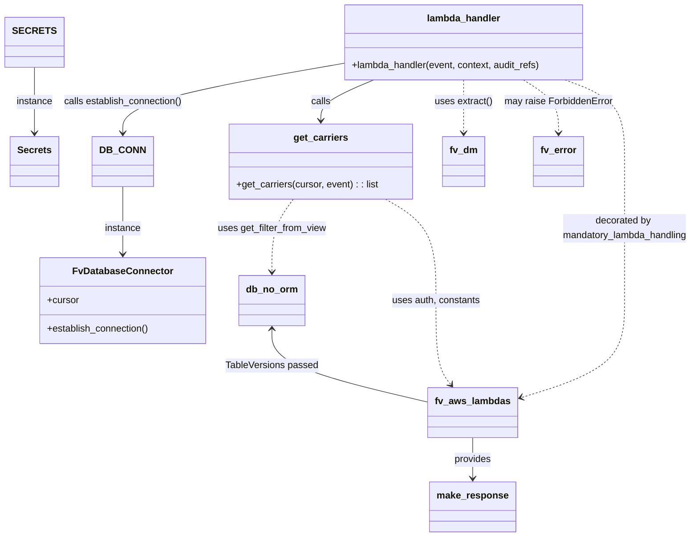

# Diagram: shipment_core/shipment_service/shipment_service/ng_shipments/ng_get_carriers.py


> Auto-generated by Obscura crawlers

## Diagram 1



### SVG

<svg id="container" width="1154.263671875" xmlns="http://www.w3.org/2000/svg" class="classDiagram" height="924" viewBox="0 0 1154.263671875 924" role="graphics-document document" aria-roledescription="class"><style>#container{font-family:"trebuchet ms",verdana,arial,sans-serif;font-size:16px;fill:#333;}@keyframes edge-animation-frame{from{stroke-dashoffset:0;}}@keyframes dash{to{stroke-dashoffset:0;}}#container .edge-animation-slow{stroke-dasharray:9,5!important;stroke-dashoffset:900;animation:dash 50s linear infinite;stroke-linecap:round;}#container .edge-animation-fast{stroke-dasharray:9,5!important;stroke-dashoffset:900;animation:dash 20s linear infinite;stroke-linecap:round;}#container .error-icon{fill:#552222;}#container .error-text{fill:#552222;stroke:#552222;}#container .edge-thickness-normal{stroke-width:1px;}#container .edge-thickness-thick{stroke-width:3.5px;}#container .edge-pattern-solid{stroke-dasharray:0;}#container .edge-thickness-invisible{stroke-width:0;fill:none;}#container .edge-pattern-dashed{stroke-dasharray:3;}#container .edge-pattern-dotted{stroke-dasharray:2;}#container .marker{fill:#333333;stroke:#333333;}#container .marker.cross{stroke:#333333;}#container svg{font-family:"trebuchet ms",verdana,arial,sans-serif;font-size:16px;}#container p{margin:0;}#container g.classGroup text{fill:#9370DB;stroke:none;font-family:"trebuchet ms",verdana,arial,sans-serif;font-size:10px;}#container g.classGroup text .title{font-weight:bolder;}#container .nodeLabel,#container .edgeLabel{color:#131300;}#container .edgeLabel .label rect{fill:#ECECFF;}#container .label text{fill:#131300;}#container .labelBkg{background:#ECECFF;}#container .edgeLabel .label span{background:#ECECFF;}#container .classTitle{font-weight:bolder;}#container .node rect,#container .node circle,#container .node ellipse,#container .node polygon,#container .node path{fill:#ECECFF;stroke:#9370DB;stroke-width:1px;}#container .divider{stroke:#9370DB;stroke-width:1;}#container g.clickable{cursor:pointer;}#container g.classGroup rect{fill:#ECECFF;stroke:#9370DB;}#container g.classGroup line{stroke:#9370DB;stroke-width:1;}#container .classLabel .box{stroke:none;stroke-width:0;fill:#ECECFF;opacity:0.5;}#container .classLabel .label{fill:#9370DB;font-size:10px;}#container .relation{stroke:#333333;stroke-width:1;fill:none;}#container .dashed-line{stroke-dasharray:3;}#container .dotted-line{stroke-dasharray:1 2;}#container #compositionStart,#container .composition{fill:#333333!important;stroke:#333333!important;stroke-width:1;}#container #compositionEnd,#container .composition{fill:#333333!important;stroke:#333333!important;stroke-width:1;}#container #dependencyStart,#container .dependency{fill:#333333!important;stroke:#333333!important;stroke-width:1;}#container #dependencyStart,#container .dependency{fill:#333333!important;stroke:#333333!important;stroke-width:1;}#container #extensionStart,#container .extension{fill:transparent!important;stroke:#333333!important;stroke-width:1;}#container #extensionEnd,#container .extension{fill:transparent!important;stroke:#333333!important;stroke-width:1;}#container #aggregationStart,#container .aggregation{fill:transparent!important;stroke:#333333!important;stroke-width:1;}#container #aggregationEnd,#container .aggregation{fill:transparent!important;stroke:#333333!important;stroke-width:1;}#container #lollipopStart,#container .lollipop{fill:#ECECFF!important;stroke:#333333!important;stroke-width:1;}#container #lollipopEnd,#container .lollipop{fill:#ECECFF!important;stroke:#333333!important;stroke-width:1;}#container .edgeTerminals{font-size:11px;line-height:initial;}#container .classTitleText{text-anchor:middle;font-size:18px;fill:#333;}#container .label-icon{display:inline-block;height:1em;overflow:visible;vertical-align:-0.125em;}#container .node .label-icon path{fill:currentColor;stroke:revert;stroke-width:revert;}#container :root{--mermaid-font-family:"trebuchet ms",verdana,arial,sans-serif;}</style><g><defs><marker id="container_class-aggregationStart" class="marker aggregation class" refX="18" refY="7" markerWidth="190" markerHeight="240" orient="auto"><path d="M 18,7 L9,13 L1,7 L9,1 Z"></path></marker></defs><defs><marker id="container_class-aggregationEnd" class="marker aggregation class" refX="1" refY="7" markerWidth="20" markerHeight="28" orient="auto"><path d="M 18,7 L9,13 L1,7 L9,1 Z"></path></marker></defs><defs><marker id="container_class-extensionStart" class="marker extension class" refX="18" refY="7" markerWidth="190" markerHeight="240" orient="auto"><path d="M 1,7 L18,13 V 1 Z"></path></marker></defs><defs><marker id="container_class-extensionEnd" class="marker extension class" refX="1" refY="7" markerWidth="20" markerHeight="28" orient="auto"><path d="M 1,1 V 13 L18,7 Z"></path></marker></defs><defs><marker id="container_class-compositionStart" class="marker composition class" refX="18" refY="7" markerWidth="190" markerHeight="240" orient="auto"><path d="M 18,7 L9,13 L1,7 L9,1 Z"></path></marker></defs><defs><marker id="container_class-compositionEnd" class="marker composition class" refX="1" refY="7" markerWidth="20" markerHeight="28" orient="auto"><path d="M 18,7 L9,13 L1,7 L9,1 Z"></path></marker></defs><defs><marker id="container_class-dependencyStart" class="marker dependency class" refX="6" refY="7" markerWidth="190" markerHeight="240" orient="auto"><path d="M 5,7 L9,13 L1,7 L9,1 Z"></path></marker></defs><defs><marker id="container_class-dependencyEnd" class="marker dependency class" refX="13" refY="7" markerWidth="20" markerHeight="28" orient="auto"><path d="M 18,7 L9,13 L14,7 L9,1 Z"></path></marker></defs><defs><marker id="container_class-lollipopStart" class="marker lollipop class" refX="13" refY="7" markerWidth="190" markerHeight="240" orient="auto"><circle stroke="black" fill="transparent" cx="7" cy="7" r="6"></circle></marker></defs><defs><marker id="container_class-lollipopEnd" class="marker lollipop class" refX="1" refY="7" markerWidth="190" markerHeight="240" orient="auto"><circle stroke="black" fill="transparent" cx="7" cy="7" r="6"></circle></marker></defs><g class="root"><g class="clusters"></g><g class="edgePaths"><path d="M201.734,337L201.734,348.667C201.734,360.333,201.734,383.667,201.734,402.5C201.734,421.333,201.734,435.667,201.734,442.833L201.734,450" id="id_DB_CONN_FvDatabaseConnector_1" class="edge-thickness-normal edge-pattern-solid relation" style=";;;" data-edge="true" data-et="edge" data-id="id_DB_CONN_FvDatabaseConnector_1" data-points="W3sieCI6MjAxLjczNDM3NSwieSI6MzM3fSx7IngiOjIwMS43MzQzNzUsInkiOjQwN30seyJ4IjoyMDEuNzM0Mzc1LCJ5Ijo0NTZ9XQ==" marker-end="url(#container_class-dependencyEnd)"></path><path d="M51.156,113L51.156,124.667C51.156,136.333,51.156,159.667,51.156,182C51.156,204.333,51.156,225.667,51.156,236.333L51.156,247" id="id_SECRETS_Secrets_2" class="edge-thickness-normal edge-pattern-solid relation" style=";;;" data-edge="true" data-et="edge" data-id="id_SECRETS_Secrets_2" data-points="W3sieCI6NTEuMTU2MjUsInkiOjExM30seyJ4Ijo1MS4xNTYyNSwieSI6MTgzfSx7IngiOjUxLjE1NjI1LCJ5IjoyNTN9XQ==" marker-end="url(#container_class-dependencyEnd)"></path><path d="M483.315,358L477.378,366.167C471.441,374.333,459.567,390.667,453.63,411C447.693,431.333,447.693,455.667,447.693,467.833L447.693,480" id="id_get_carriers_db_no_orm_3" class="edge-thickness-normal edge-pattern-dashed relation" style=";;;" data-edge="true" data-et="edge" data-id="id_get_carriers_db_no_orm_3" data-points="W3sieCI6NDgzLjMxNTQyOTY4NzUsInkiOjM1OH0seyJ4Ijo0NDcuNjkzMzU5Mzc1LCJ5Ijo0MDd9LHsieCI6NDQ3LjY5MzM1OTM3NSwieSI6NDg2fV0=" marker-end="url(#container_class-dependencyEnd)"></path><path d="M636.959,358L650.939,366.167C664.919,374.333,692.878,390.667,706.858,419C720.838,447.333,720.838,487.667,720.838,526C720.838,564.333,720.838,600.667,725.163,624.22C729.488,647.774,738.138,658.548,742.462,663.934L746.787,669.321" id="id_get_carriers_fv_aws_lambdas_4" class="edge-thickness-normal edge-pattern-dashed relation" style=";;;" data-edge="true" data-et="edge" data-id="id_get_carriers_fv_aws_lambdas_4" data-points="W3sieCI6NjM2Ljk1OTIyODUxNTYyNSwieSI6MzU4fSx7IngiOjcyMC44Mzc4OTA2MjUsInkiOjQwN30seyJ4Ijo3MjAuODM3ODkwNjI1LCJ5Ijo1Mjh9LHsieCI6NzIwLjgzNzg5MDYyNSwieSI6NjM3fSx7IngiOjc1MC41NDM2MzYyNzM3MzQxLCJ5Ijo2NzR9XQ==" marker-end="url(#container_class-dependencyEnd)"></path><path d="M564.432,111.17L503.982,123.141C443.533,135.113,322.633,159.057,262.184,181.695C201.734,204.333,201.734,225.667,201.734,236.333L201.734,247" id="id_lambda_handler_DB_CONN_5" class="edge-thickness-normal edge-pattern-solid relation" style=";;;" data-edge="true" data-et="edge" data-id="id_lambda_handler_DB_CONN_5" data-points="W3sieCI6NTY0LjQzMTY0MDYyNSwieSI6MTExLjE2OTc4MDEwNzgyMjF9LHsieCI6MjAxLjczNDM3NSwieSI6MTgzfSx7IngiOjIwMS43MzQzNzUsInkiOjI1M31d" marker-end="url(#container_class-dependencyEnd)"></path><path d="M633.305,134L615.94,142.167C598.575,150.333,563.845,166.667,546.48,182C529.115,197.333,529.115,211.667,529.115,218.833L529.115,226" id="id_lambda_handler_get_carriers_6" class="edge-thickness-normal edge-pattern-solid relation" style=";;;" data-edge="true" data-et="edge" data-id="id_lambda_handler_get_carriers_6" data-points="W3sieCI6NjMzLjMwNTE3NTc4MTI1LCJ5IjoxMzR9LHsieCI6NTI5LjExNTIzNDM3NSwieSI6MTgzfSx7IngiOjUyOS4xMTUyMzQzNzUsInkiOjIzMn1d" marker-end="url(#container_class-dependencyEnd)"></path><path d="M767.264,134L767.264,142.167C767.264,150.333,767.264,166.667,767.264,185.5C767.264,204.333,767.264,225.667,767.264,236.333L767.264,247" id="id_lambda_handler_fv_dm_7" class="edge-thickness-normal edge-pattern-dashed relation" style=";;;" data-edge="true" data-et="edge" data-id="id_lambda_handler_fv_dm_7" data-points="W3sieCI6NzY3LjI2MzY3MTg3NSwieSI6MTM0fSx7IngiOjc2Ny4yNjM2NzE4NzUsInkiOjE4M30seyJ4Ijo3NjcuMjYzNjcxODc1LCJ5IjoyNTN9XQ==" marker-end="url(#container_class-dependencyEnd)"></path><path d="M857.51,134L869.208,142.167C880.907,150.333,904.304,166.667,916.003,185.5C927.701,204.333,927.701,225.667,927.701,236.333L927.701,247" id="id_lambda_handler_fv_error_8" class="edge-thickness-normal edge-pattern-dashed relation" style=";;;" data-edge="true" data-et="edge" data-id="id_lambda_handler_fv_error_8" data-points="W3sieCI6ODU3LjUwOTc2NTYyNSwieSI6MTM0fSx7IngiOjkyNy43MDExNzE4NzUsInkiOjE4M30seyJ4Ijo5MjcuNzAxMTcxODc1LCJ5IjoyNTN9XQ==" marker-end="url(#container_class-dependencyEnd)"></path><path d="M920.347,134L940.191,142.167C960.035,150.333,999.724,166.667,1019.568,193.5C1039.412,220.333,1039.412,257.667,1039.412,295C1039.412,332.333,1039.412,369.667,1039.412,408.5C1039.412,447.333,1039.412,487.667,1039.412,526C1039.412,564.333,1039.412,600.667,1009.853,627.986C980.294,655.304,921.176,673.609,891.617,682.761L862.058,691.913" id="id_lambda_handler_fv_aws_lambdas_9" class="edge-thickness-normal edge-pattern-dashed relation" style=";;;" data-edge="true" data-et="edge" data-id="id_lambda_handler_fv_aws_lambdas_9" data-points="W3sieCI6OTIwLjM0NzE2Nzk2ODc1LCJ5IjoxMzR9LHsieCI6MTAzOS40MTIxMDkzNzUsInkiOjE4M30seyJ4IjoxMDM5LjQxMjEwOTM3NSwieSI6Mjk1fSx7IngiOjEwMzkuNDEyMTA5Mzc1LCJ5Ijo0MDd9LHsieCI6MTAzOS40MTIxMDkzNzUsInkiOjUyOH0seyJ4IjoxMDM5LjQxMjEwOTM3NSwieSI6NjM3fSx7IngiOjg1Ni4zMjYxNzE4NzUsInkiOjY5My42ODc3NDMwNDE3MzQzfV0=" marker-end="url(#container_class-dependencyEnd)"></path><path d="M784.264,758L784.264,764.167C784.264,770.333,784.264,782.667,784.264,794C784.264,805.333,784.264,815.667,784.264,820.833L784.264,826" id="id_fv_aws_lambdas_make_response_10" class="edge-thickness-normal edge-pattern-solid relation" style=";;;" data-edge="true" data-et="edge" data-id="id_fv_aws_lambdas_make_response_10" data-points="W3sieCI6Nzg0LjI2MzY3MTg3NSwieSI6NzU4fSx7IngiOjc4NC4yNjM2NzE4NzUsInkiOjc5NX0seyJ4Ijo3ODQuMjYzNjcxODc1LCJ5Ijo4MzJ9XQ==" marker-end="url(#container_class-dependencyEnd)"></path><path d="M447.693,576L447.693,586.167C447.693,596.333,447.693,616.667,491.778,637.181C535.863,657.695,624.032,678.39,668.117,688.738L712.201,699.085" id="id_db_no_orm_fv_aws_lambdas_11" class="edge-thickness-normal edge-pattern-solid relation" style=";;;" data-edge="true" data-et="edge" data-id="id_db_no_orm_fv_aws_lambdas_11" data-points="W3sieCI6NDQ3LjY5MzM1OTM3NSwieSI6NTcwfSx7IngiOjQ0Ny42OTMzNTkzNzUsInkiOjYzN30seyJ4Ijo3MTIuMjAxMTcxODc1LCJ5Ijo2OTkuMDg1NDQzNjk5MDc4NX1d" marker-start="url(#container_class-dependencyStart)"></path></g><g class="edgeLabels"><g class="edgeLabel" transform="translate(201.734375, 407)"><g class="label" data-id="id_DB_CONN_FvDatabaseConnector_1" transform="translate(-30.578125, -12)"><foreignObject width="61.15625" height="24"><div xmlns="http://www.w3.org/1999/xhtml" class="labelBkg" style="display: table-cell; white-space: nowrap; line-height: 1.5; max-width: 200px; text-align: center;"><span class="edgeLabel"><p>instance</p></span></div></foreignObject></g></g><g class="edgeLabel" transform="translate(51.15625, 183)"><g class="label" data-id="id_SECRETS_Secrets_2" transform="translate(-30.578125, -12)"><foreignObject width="61.15625" height="24"><div xmlns="http://www.w3.org/1999/xhtml" class="labelBkg" style="display: table-cell; white-space: nowrap; line-height: 1.5; max-width: 200px; text-align: center;"><span class="edgeLabel"><p>instance</p></span></div></foreignObject></g></g><g class="edgeLabel" transform="translate(447.693359375, 407)"><g class="label" data-id="id_get_carriers_db_no_orm_3" transform="translate(-91.6796875, -12)"><foreignObject width="183.359375" height="24"><div xmlns="http://www.w3.org/1999/xhtml" class="labelBkg" style="display: table-cell; white-space: nowrap; line-height: 1.5; max-width: 200px; text-align: center;"><span class="edgeLabel"><p>uses get_filter_from_view</p></span></div></foreignObject></g></g><g class="edgeLabel" transform="translate(720.837890625, 528)"><g class="label" data-id="id_get_carriers_fv_aws_lambdas_4" transform="translate(-74.4921875, -12)"><foreignObject width="148.984375" height="24"><div xmlns="http://www.w3.org/1999/xhtml" class="labelBkg" style="display: table-cell; white-space: nowrap; line-height: 1.5; max-width: 200px; text-align: center;"><span class="edgeLabel"><p>uses auth, constants</p></span></div></foreignObject></g></g><g class="edgeLabel" transform="translate(201.734375, 183)"><g class="label" data-id="id_lambda_handler_DB_CONN_5" transform="translate(-100, -24)"><foreignObject width="200" height="48"><div xmlns="http://www.w3.org/1999/xhtml" class="labelBkg" style="display: table; white-space: break-spaces; line-height: 1.5; max-width: 200px; text-align: center; width: 200px;"><span class="edgeLabel"><p>calls establish_connection()</p></span></div></foreignObject></g></g><g class="edgeLabel" transform="translate(529.115234375, 183)"><g class="label" data-id="id_lambda_handler_get_carriers_6" transform="translate(-16.4453125, -12)"><foreignObject width="32.890625" height="24"><div xmlns="http://www.w3.org/1999/xhtml" class="labelBkg" style="display: table-cell; white-space: nowrap; line-height: 1.5; max-width: 200px; text-align: center;"><span class="edgeLabel"><p>calls</p></span></div></foreignObject></g></g><g class="edgeLabel" transform="translate(767.263671875, 183)"><g class="label" data-id="id_lambda_handler_fv_dm_7" transform="translate(-48.7265625, -12)"><foreignObject width="97.453125" height="24"><div xmlns="http://www.w3.org/1999/xhtml" class="labelBkg" style="display: table-cell; white-space: nowrap; line-height: 1.5; max-width: 200px; text-align: center;"><span class="edgeLabel"><p>uses extract()</p></span></div></foreignObject></g></g><g class="edgeLabel" transform="translate(927.701171875, 183)"><g class="label" data-id="id_lambda_handler_fv_error_8" transform="translate(-91.7109375, -12)"><foreignObject width="183.421875" height="24"><div xmlns="http://www.w3.org/1999/xhtml" class="labelBkg" style="display: table-cell; white-space: nowrap; line-height: 1.5; max-width: 200px; text-align: center;"><span class="edgeLabel"><p>may raise ForbiddenError</p></span></div></foreignObject></g></g><g class="edgeLabel" transform="translate(1039.412109375, 407)"><g class="label" data-id="id_lambda_handler_fv_aws_lambdas_9" transform="translate(-106.8515625, -24)"><foreignObject width="213.703125" height="48"><div xmlns="http://www.w3.org/1999/xhtml" class="labelBkg" style="display: table; white-space: break-spaces; line-height: 1.5; max-width: 200px; text-align: center; width: 200px;"><span class="edgeLabel"><p>decorated by mandatory_lambda_handling</p></span></div></foreignObject></g></g><g class="edgeLabel" transform="translate(784.263671875, 795)"><g class="label" data-id="id_fv_aws_lambdas_make_response_10" transform="translate(-31.3125, -12)"><foreignObject width="62.625" height="24"><div xmlns="http://www.w3.org/1999/xhtml" class="labelBkg" style="display: table-cell; white-space: nowrap; line-height: 1.5; max-width: 200px; text-align: center;"><span class="edgeLabel"><p>provides</p></span></div></foreignObject></g></g><g class="edgeLabel" transform="translate(447.693359375, 637)"><g class="label" data-id="id_db_no_orm_fv_aws_lambdas_11" transform="translate(-77.7734375, -12)"><foreignObject width="155.546875" height="24"><div xmlns="http://www.w3.org/1999/xhtml" class="labelBkg" style="display: table-cell; white-space: nowrap; line-height: 1.5; max-width: 200px; text-align: center;"><span class="edgeLabel"><p>TableVersions passed</p></span></div></foreignObject></g></g></g><g class="nodes"><g class="node default" id="classId-FvDatabaseConnector-0" transform="translate(201.734375, 528)"><g class="basic label-container"><path d="M-138.28515625 -72 L138.28515625 -72 L138.28515625 72 L-138.28515625 72" stroke="none" stroke-width="0" fill="#ECECFF" style=""></path><path d="M-138.28515625 -72 C-38.49548692229834 -72, 61.29418240540332 -72, 138.28515625 -72 M-138.28515625 -72 C-60.857109134614774 -72, 16.570937980770452 -72, 138.28515625 -72 M138.28515625 -72 C138.28515625 -16.49303713380047, 138.28515625 39.01392573239906, 138.28515625 72 M138.28515625 -72 C138.28515625 -36.463867549641186, 138.28515625 -0.9277350992823727, 138.28515625 72 M138.28515625 72 C80.57033364305087 72, 22.85551103610173 72, -138.28515625 72 M138.28515625 72 C45.92708198469006 72, -46.430992280619876 72, -138.28515625 72 M-138.28515625 72 C-138.28515625 39.923395391351164, -138.28515625 7.846790782702328, -138.28515625 -72 M-138.28515625 72 C-138.28515625 26.531341813449508, -138.28515625 -18.937316373100984, -138.28515625 -72" stroke="#9370DB" stroke-width="1.3" fill="none" stroke-dasharray="0 0" style=""></path></g><g class="annotation-group text" transform="translate(0, -48)"></g><g class="label-group text" transform="translate(-79.3046875, -48)"><g class="label" style="font-weight: bolder" transform="translate(0,-12)"><foreignObject width="158.609375" height="24"><div xmlns="http://www.w3.org/1999/xhtml" style="display: table-cell; white-space: nowrap; line-height: 1.5; max-width: 207px; text-align: center;"><span class="nodeLabel markdown-node-label" style=""><p>FvDatabaseConnector</p></span></div></foreignObject></g></g><g class="members-group text" transform="translate(-126.28515625, 0)"><g class="label" style="" transform="translate(0,-12)"><foreignObject width="53.71875" height="24"><div xmlns="http://www.w3.org/1999/xhtml" style="display: table-cell; white-space: nowrap; line-height: 1.5; max-width: 112px; text-align: center;"><span class="nodeLabel markdown-node-label" style=""><p>+cursor</p></span></div></foreignObject></g></g><g class="methods-group text" transform="translate(-126.28515625, 48)"><g class="label" style="" transform="translate(0,-12)"><foreignObject width="173.265625" height="24"><div xmlns="http://www.w3.org/1999/xhtml" style="display: table-cell; white-space: nowrap; line-height: 1.5; max-width: 231px; text-align: center;"><span class="nodeLabel markdown-node-label" style=""><p>+establish_connection()</p></span></div></foreignObject></g></g><g class="divider" style=""><path d="M-138.28515625 -24 C-51.556377727465375 -24, 35.17240079506925 -24, 138.28515625 -24 M-138.28515625 -24 C-82.19060891931022 -24, -26.096061588620444 -24, 138.28515625 -24" stroke="#9370DB" stroke-width="1.3" fill="none" stroke-dasharray="0 0" style=""></path></g><g class="divider" style=""><path d="M-138.28515625 24 C-57.556974901361414 24, 23.17120644727717 24, 138.28515625 24 M-138.28515625 24 C-75.5594710339206 24, -12.833785817841203 24, 138.28515625 24" stroke="#9370DB" stroke-width="1.3" fill="none" stroke-dasharray="0 0" style=""></path></g></g><g class="node default" id="classId-Secrets-1" transform="translate(51.15625, 295)"><g class="basic label-container"><path d="M-39.1640625 -42 L39.1640625 -42 L39.1640625 42 L-39.1640625 42" stroke="none" stroke-width="0" fill="#ECECFF" style=""></path><path d="M-39.1640625 -42 C-18.850676022161686 -42, 1.4627104556766284 -42, 39.1640625 -42 M-39.1640625 -42 C-21.447478930865934 -42, -3.730895361731868 -42, 39.1640625 -42 M39.1640625 -42 C39.1640625 -14.668288728255543, 39.1640625 12.663422543488913, 39.1640625 42 M39.1640625 -42 C39.1640625 -20.83035686502155, 39.1640625 0.3392862699569008, 39.1640625 42 M39.1640625 42 C13.749667191918896 42, -11.664728116162209 42, -39.1640625 42 M39.1640625 42 C17.523366071798872 42, -4.117330356402256 42, -39.1640625 42 M-39.1640625 42 C-39.1640625 10.689052415649634, -39.1640625 -20.621895168700732, -39.1640625 -42 M-39.1640625 42 C-39.1640625 16.243067947506376, -39.1640625 -9.513864104987249, -39.1640625 -42" stroke="#9370DB" stroke-width="1.3" fill="none" stroke-dasharray="0 0" style=""></path></g><g class="annotation-group text" transform="translate(0, -18)"></g><g class="label-group text" transform="translate(-27.1640625, -18)"><g class="label" style="font-weight: bolder" transform="translate(0,-12)"><foreignObject width="54.328125" height="24"><div xmlns="http://www.w3.org/1999/xhtml" style="display: table-cell; white-space: nowrap; line-height: 1.5; max-width: 103px; text-align: center;"><span class="nodeLabel markdown-node-label" style=""><p>Secrets</p></span></div></foreignObject></g></g><g class="members-group text" transform="translate(-27.1640625, 30)"></g><g class="methods-group text" transform="translate(-27.1640625, 60)"></g><g class="divider" style=""><path d="M-39.1640625 6 C-10.885186471842523 6, 17.393689556314953 6, 39.1640625 6 M-39.1640625 6 C-19.028769819418763 6, 1.1065228611624747 6, 39.1640625 6" stroke="#9370DB" stroke-width="1.3" fill="none" stroke-dasharray="0 0" style=""></path></g><g class="divider" style=""><path d="M-39.1640625 24 C-14.009916434459036 24, 11.144229631081927 24, 39.1640625 24 M-39.1640625 24 C-16.330430835758403 24, 6.503200828483195 24, 39.1640625 24" stroke="#9370DB" stroke-width="1.3" fill="none" stroke-dasharray="0 0" style=""></path></g></g><g class="node default" id="classId-get_carriers-2" transform="translate(529.115234375, 295)"><g class="basic label-container"><path d="M-153.875 -63 L153.875 -63 L153.875 63 L-153.875 63" stroke="none" stroke-width="0" fill="#ECECFF" style=""></path><path d="M-153.875 -63 C-91.10746604571676 -63, -28.33993209143354 -63, 153.875 -63 M-153.875 -63 C-83.90744641733221 -63, -13.93989283466442 -63, 153.875 -63 M153.875 -63 C153.875 -18.102621935478382, 153.875 26.794756129043236, 153.875 63 M153.875 -63 C153.875 -21.864113942173894, 153.875 19.27177211565221, 153.875 63 M153.875 63 C61.570484037559055 63, -30.73403192488189 63, -153.875 63 M153.875 63 C35.70346276795662 63, -82.46807446408675 63, -153.875 63 M-153.875 63 C-153.875 29.544472257551526, -153.875 -3.9110554848969485, -153.875 -63 M-153.875 63 C-153.875 35.12199942706668, -153.875 7.243998854133366, -153.875 -63" stroke="#9370DB" stroke-width="1.3" fill="none" stroke-dasharray="0 0" style=""></path></g><g class="annotation-group text" transform="translate(0, -39)"></g><g class="label-group text" transform="translate(-43.9375, -39)"><g class="label" style="font-weight: bolder" transform="translate(0,-12)"><foreignObject width="87.875" height="24"><div xmlns="http://www.w3.org/1999/xhtml" style="display: table-cell; white-space: nowrap; line-height: 1.5; max-width: 136px; text-align: center;"><span class="nodeLabel markdown-node-label" style=""><p>get_carriers</p></span></div></foreignObject></g></g><g class="members-group text" transform="translate(-141.875, 9)"></g><g class="methods-group text" transform="translate(-141.875, 39)"><g class="label" style="" transform="translate(0,-12)"><foreignObject width="239.8125" height="24"><div xmlns="http://www.w3.org/1999/xhtml" style="display: table-cell; white-space: nowrap; line-height: 1.5; max-width: 297px; text-align: center;"><span class="nodeLabel markdown-node-label" style=""><p>+get_carriers(cursor, event) : : list</p></span></div></foreignObject></g></g><g class="divider" style=""><path d="M-153.875 -15 C-77.42075144617367 -15, -0.9665028923473358 -15, 153.875 -15 M-153.875 -15 C-61.80780534070692 -15, 30.25938931858616 -15, 153.875 -15" stroke="#9370DB" stroke-width="1.3" fill="none" stroke-dasharray="0 0" style=""></path></g><g class="divider" style=""><path d="M-153.875 9 C-52.22129147539047 9, 49.432417049219055 9, 153.875 9 M-153.875 9 C-46.51293489725387 9, 60.84913020549226 9, 153.875 9" stroke="#9370DB" stroke-width="1.3" fill="none" stroke-dasharray="0 0" style=""></path></g></g><g class="node default" id="classId-lambda_handler-3" transform="translate(767.263671875, 71)"><g class="basic label-container"><path d="M-202.83203125 -63 L202.83203125 -63 L202.83203125 63 L-202.83203125 63" stroke="none" stroke-width="0" fill="#ECECFF" style=""></path><path d="M-202.83203125 -63 C-102.255574152331 -63, -1.6791170546619867 -63, 202.83203125 -63 M-202.83203125 -63 C-61.90505526253148 -63, 79.02192072493705 -63, 202.83203125 -63 M202.83203125 -63 C202.83203125 -19.173672199699148, 202.83203125 24.652655600601705, 202.83203125 63 M202.83203125 -63 C202.83203125 -12.649934231060115, 202.83203125 37.70013153787977, 202.83203125 63 M202.83203125 63 C79.11606384959477 63, -44.59990355081047 63, -202.83203125 63 M202.83203125 63 C89.7144665976497 63, -23.403098054700592 63, -202.83203125 63 M-202.83203125 63 C-202.83203125 20.56738950211954, -202.83203125 -21.86522099576092, -202.83203125 -63 M-202.83203125 63 C-202.83203125 30.66125619278756, -202.83203125 -1.6774876144248765, -202.83203125 -63" stroke="#9370DB" stroke-width="1.3" fill="none" stroke-dasharray="0 0" style=""></path></g><g class="annotation-group text" transform="translate(0, -39)"></g><g class="label-group text" transform="translate(-59.9765625, -39)"><g class="label" style="font-weight: bolder" transform="translate(0,-12)"><foreignObject width="119.953125" height="24"><div xmlns="http://www.w3.org/1999/xhtml" style="display: table-cell; white-space: nowrap; line-height: 1.5; max-width: 170px; text-align: center;"><span class="nodeLabel markdown-node-label" style=""><p>lambda_handler</p></span></div></foreignObject></g></g><g class="members-group text" transform="translate(-190.83203125, 9)"></g><g class="methods-group text" transform="translate(-190.83203125, 39)"><g class="label" style="" transform="translate(0,-12)"><foreignObject width="321.6875" height="24"><div xmlns="http://www.w3.org/1999/xhtml" style="display: table-cell; white-space: nowrap; line-height: 1.5; max-width: 379px; text-align: center;"><span class="nodeLabel markdown-node-label" style=""><p>+lambda_handler(event, context, audit_refs)</p></span></div></foreignObject></g></g><g class="divider" style=""><path d="M-202.83203125 -15 C-105.78880058344303 -15, -8.745569916886069 -15, 202.83203125 -15 M-202.83203125 -15 C-71.72492738678153 -15, 59.38217647643694 -15, 202.83203125 -15" stroke="#9370DB" stroke-width="1.3" fill="none" stroke-dasharray="0 0" style=""></path></g><g class="divider" style=""><path d="M-202.83203125 9 C-76.79077458079574 9, 49.25048208840852 9, 202.83203125 9 M-202.83203125 9 C-66.9341998773742 9, 68.9636314952516 9, 202.83203125 9" stroke="#9370DB" stroke-width="1.3" fill="none" stroke-dasharray="0 0" style=""></path></g></g><g class="node default" id="classId-db_no_orm-4" transform="translate(447.693359375, 528)"><g class="basic label-container"><path d="M-53.3515625 -42 L53.3515625 -42 L53.3515625 42 L-53.3515625 42" stroke="none" stroke-width="0" fill="#ECECFF" style=""></path><path d="M-53.3515625 -42 C-11.550783946462658 -42, 30.249994607074683 -42, 53.3515625 -42 M-53.3515625 -42 C-30.6337757137403 -42, -7.915988927480598 -42, 53.3515625 -42 M53.3515625 -42 C53.3515625 -23.89583286885992, 53.3515625 -5.791665737719839, 53.3515625 42 M53.3515625 -42 C53.3515625 -13.017484840021535, 53.3515625 15.96503031995693, 53.3515625 42 M53.3515625 42 C22.866461017605218 42, -7.618640464789564 42, -53.3515625 42 M53.3515625 42 C18.769411314428226 42, -15.812739871143549 42, -53.3515625 42 M-53.3515625 42 C-53.3515625 14.410145893466098, -53.3515625 -13.179708213067805, -53.3515625 -42 M-53.3515625 42 C-53.3515625 18.147364536375854, -53.3515625 -5.705270927248293, -53.3515625 -42" stroke="#9370DB" stroke-width="1.3" fill="none" stroke-dasharray="0 0" style=""></path></g><g class="annotation-group text" transform="translate(0, -18)"></g><g class="label-group text" transform="translate(-41.3515625, -18)"><g class="label" style="font-weight: bolder" transform="translate(0,-12)"><foreignObject width="82.703125" height="24"><div xmlns="http://www.w3.org/1999/xhtml" style="display: table-cell; white-space: nowrap; line-height: 1.5; max-width: 133px; text-align: center;"><span class="nodeLabel markdown-node-label" style=""><p>db_no_orm</p></span></div></foreignObject></g></g><g class="members-group text" transform="translate(-41.3515625, 30)"></g><g class="methods-group text" transform="translate(-41.3515625, 60)"></g><g class="divider" style=""><path d="M-53.3515625 6 C-11.190952082046934 6, 30.969658335906132 6, 53.3515625 6 M-53.3515625 6 C-11.746183578775977 6, 29.859195342448047 6, 53.3515625 6" stroke="#9370DB" stroke-width="1.3" fill="none" stroke-dasharray="0 0" style=""></path></g><g class="divider" style=""><path d="M-53.3515625 24 C-27.696266441453314 24, -2.040970382906629 24, 53.3515625 24 M-53.3515625 24 C-31.704628411219595 24, -10.05769432243919 24, 53.3515625 24" stroke="#9370DB" stroke-width="1.3" fill="none" stroke-dasharray="0 0" style=""></path></g></g><g class="node default" id="classId-fv_aws_lambdas-5" transform="translate(784.263671875, 716)"><g class="basic label-container"><path d="M-72.0625 -42 L72.0625 -42 L72.0625 42 L-72.0625 42" stroke="none" stroke-width="0" fill="#ECECFF" style=""></path><path d="M-72.0625 -42 C-31.932513705064395 -42, 8.19747258987121 -42, 72.0625 -42 M-72.0625 -42 C-21.3820071368228 -42, 29.2984857263544 -42, 72.0625 -42 M72.0625 -42 C72.0625 -14.612914123891304, 72.0625 12.774171752217391, 72.0625 42 M72.0625 -42 C72.0625 -10.06044206692211, 72.0625 21.87911586615578, 72.0625 42 M72.0625 42 C28.188423365232964 42, -15.685653269534072 42, -72.0625 42 M72.0625 42 C41.08810359420494 42, 10.113707188409869 42, -72.0625 42 M-72.0625 42 C-72.0625 21.15530400379455, -72.0625 0.3106080075891029, -72.0625 -42 M-72.0625 42 C-72.0625 21.986907793953588, -72.0625 1.9738155879071755, -72.0625 -42" stroke="#9370DB" stroke-width="1.3" fill="none" stroke-dasharray="0 0" style=""></path></g><g class="annotation-group text" transform="translate(0, -18)"></g><g class="label-group text" transform="translate(-60.0625, -18)"><g class="label" style="font-weight: bolder" transform="translate(0,-12)"><foreignObject width="120.125" height="24"><div xmlns="http://www.w3.org/1999/xhtml" style="display: table-cell; white-space: nowrap; line-height: 1.5; max-width: 168px; text-align: center;"><span class="nodeLabel markdown-node-label" style=""><p>fv_aws_lambdas</p></span></div></foreignObject></g></g><g class="members-group text" transform="translate(-60.0625, 30)"></g><g class="methods-group text" transform="translate(-60.0625, 60)"></g><g class="divider" style=""><path d="M-72.0625 6 C-34.83642627096801 6, 2.389647458063976 6, 72.0625 6 M-72.0625 6 C-38.14937879872734 6, -4.2362575974546814 6, 72.0625 6" stroke="#9370DB" stroke-width="1.3" fill="none" stroke-dasharray="0 0" style=""></path></g><g class="divider" style=""><path d="M-72.0625 24 C-36.69725718438574 24, -1.3320143687714818 24, 72.0625 24 M-72.0625 24 C-26.98966262032114 24, 18.083174759357718 24, 72.0625 24" stroke="#9370DB" stroke-width="1.3" fill="none" stroke-dasharray="0 0" style=""></path></g></g><g class="node default" id="classId-fv_dm-6" transform="translate(767.263671875, 295)"><g class="basic label-container"><path d="M-34.2734375 -42 L34.2734375 -42 L34.2734375 42 L-34.2734375 42" stroke="none" stroke-width="0" fill="#ECECFF" style=""></path><path d="M-34.2734375 -42 C-19.546741710557367 -42, -4.820045921114733 -42, 34.2734375 -42 M-34.2734375 -42 C-7.754311630119041 -42, 18.764814239761918 -42, 34.2734375 -42 M34.2734375 -42 C34.2734375 -21.49362740530479, 34.2734375 -0.9872548106095778, 34.2734375 42 M34.2734375 -42 C34.2734375 -23.505138823755118, 34.2734375 -5.010277647510236, 34.2734375 42 M34.2734375 42 C20.45818010918871 42, 6.642922718377417 42, -34.2734375 42 M34.2734375 42 C16.2453300107594 42, -1.7827774784812007 42, -34.2734375 42 M-34.2734375 42 C-34.2734375 24.69842595892468, -34.2734375 7.396851917849361, -34.2734375 -42 M-34.2734375 42 C-34.2734375 22.732188491394712, -34.2734375 3.4643769827894246, -34.2734375 -42" stroke="#9370DB" stroke-width="1.3" fill="none" stroke-dasharray="0 0" style=""></path></g><g class="annotation-group text" transform="translate(0, -18)"></g><g class="label-group text" transform="translate(-22.2734375, -18)"><g class="label" style="font-weight: bolder" transform="translate(0,-12)"><foreignObject width="44.546875" height="24"><div xmlns="http://www.w3.org/1999/xhtml" style="display: table-cell; white-space: nowrap; line-height: 1.5; max-width: 94px; text-align: center;"><span class="nodeLabel markdown-node-label" style=""><p>fv_dm</p></span></div></foreignObject></g></g><g class="members-group text" transform="translate(-22.2734375, 30)"></g><g class="methods-group text" transform="translate(-22.2734375, 60)"></g><g class="divider" style=""><path d="M-34.2734375 6 C-14.266374268672614 6, 5.740688962654772 6, 34.2734375 6 M-34.2734375 6 C-19.612046608601094 6, -4.9506557172021886 6, 34.2734375 6" stroke="#9370DB" stroke-width="1.3" fill="none" stroke-dasharray="0 0" style=""></path></g><g class="divider" style=""><path d="M-34.2734375 24 C-10.967114430015457 24, 12.339208639969087 24, 34.2734375 24 M-34.2734375 24 C-18.534189213925394 24, -2.794940927850792 24, 34.2734375 24" stroke="#9370DB" stroke-width="1.3" fill="none" stroke-dasharray="0 0" style=""></path></g></g><g class="node default" id="classId-fv_error-7" transform="translate(927.701171875, 295)"><g class="basic label-container"><path d="M-41.1875 -42 L41.1875 -42 L41.1875 42 L-41.1875 42" stroke="none" stroke-width="0" fill="#ECECFF" style=""></path><path d="M-41.1875 -42 C-11.622549333141325 -42, 17.94240133371735 -42, 41.1875 -42 M-41.1875 -42 C-13.279608314906529 -42, 14.628283370186942 -42, 41.1875 -42 M41.1875 -42 C41.1875 -11.902569691747313, 41.1875 18.194860616505373, 41.1875 42 M41.1875 -42 C41.1875 -15.195664436110924, 41.1875 11.608671127778152, 41.1875 42 M41.1875 42 C22.291811545524535 42, 3.39612309104907 42, -41.1875 42 M41.1875 42 C19.214040857832074 42, -2.759418284335851 42, -41.1875 42 M-41.1875 42 C-41.1875 16.366134357936684, -41.1875 -9.267731284126633, -41.1875 -42 M-41.1875 42 C-41.1875 19.81308667666168, -41.1875 -2.3738266466766405, -41.1875 -42" stroke="#9370DB" stroke-width="1.3" fill="none" stroke-dasharray="0 0" style=""></path></g><g class="annotation-group text" transform="translate(0, -18)"></g><g class="label-group text" transform="translate(-29.1875, -18)"><g class="label" style="font-weight: bolder" transform="translate(0,-12)"><foreignObject width="58.375" height="24"><div xmlns="http://www.w3.org/1999/xhtml" style="display: table-cell; white-space: nowrap; line-height: 1.5; max-width: 108px; text-align: center;"><span class="nodeLabel markdown-node-label" style=""><p>fv_error</p></span></div></foreignObject></g></g><g class="members-group text" transform="translate(-29.1875, 30)"></g><g class="methods-group text" transform="translate(-29.1875, 60)"></g><g class="divider" style=""><path d="M-41.1875 6 C-14.709395114310759 6, 11.768709771378482 6, 41.1875 6 M-41.1875 6 C-11.710354072685867 6, 17.766791854628266 6, 41.1875 6" stroke="#9370DB" stroke-width="1.3" fill="none" stroke-dasharray="0 0" style=""></path></g><g class="divider" style=""><path d="M-41.1875 24 C-21.24636881540614 24, -1.3052376308122788 24, 41.1875 24 M-41.1875 24 C-18.06486957094535 24, 5.057760858109297 24, 41.1875 24" stroke="#9370DB" stroke-width="1.3" fill="none" stroke-dasharray="0 0" style=""></path></g></g><g class="node default" id="classId-DB_CONN-8" transform="translate(201.734375, 295)"><g class="basic label-container"><path d="M-46.40625 -42 L46.40625 -42 L46.40625 42 L-46.40625 42" stroke="none" stroke-width="0" fill="#ECECFF" style=""></path><path d="M-46.40625 -42 C-25.400043063737723 -42, -4.393836127475446 -42, 46.40625 -42 M-46.40625 -42 C-11.09242686879476 -42, 24.22139626241048 -42, 46.40625 -42 M46.40625 -42 C46.40625 -24.045485862559826, 46.40625 -6.090971725119651, 46.40625 42 M46.40625 -42 C46.40625 -8.674754697096127, 46.40625 24.650490605807747, 46.40625 42 M46.40625 42 C20.46932729572378 42, -5.467595408552441 42, -46.40625 42 M46.40625 42 C25.108102533451678 42, 3.809955066903356 42, -46.40625 42 M-46.40625 42 C-46.40625 24.179818827745745, -46.40625 6.35963765549149, -46.40625 -42 M-46.40625 42 C-46.40625 14.520984019341608, -46.40625 -12.958031961316784, -46.40625 -42" stroke="#9370DB" stroke-width="1.3" fill="none" stroke-dasharray="0 0" style=""></path></g><g class="annotation-group text" transform="translate(0, -18)"></g><g class="label-group text" transform="translate(-34.40625, -18)"><g class="label" style="font-weight: bolder" transform="translate(0,-12)"><foreignObject width="68.8125" height="24"><div xmlns="http://www.w3.org/1999/xhtml" style="display: table-cell; white-space: nowrap; line-height: 1.5; max-width: 119px; text-align: center;"><span class="nodeLabel markdown-node-label" style=""><p>DB_CONN</p></span></div></foreignObject></g></g><g class="members-group text" transform="translate(-34.40625, 30)"></g><g class="methods-group text" transform="translate(-34.40625, 60)"></g><g class="divider" style=""><path d="M-46.40625 6 C-13.227771027318461 6, 19.950707945363078 6, 46.40625 6 M-46.40625 6 C-23.483204239525328 6, -0.5601584790506564 6, 46.40625 6" stroke="#9370DB" stroke-width="1.3" fill="none" stroke-dasharray="0 0" style=""></path></g><g class="divider" style=""><path d="M-46.40625 24 C-24.120938537578613 24, -1.8356270751572268 24, 46.40625 24 M-46.40625 24 C-24.939600810793948 24, -3.472951621587896 24, 46.40625 24" stroke="#9370DB" stroke-width="1.3" fill="none" stroke-dasharray="0 0" style=""></path></g></g><g class="node default" id="classId-SECRETS-9" transform="translate(51.15625, 71)"><g class="basic label-container"><path d="M-43.15625 -42 L43.15625 -42 L43.15625 42 L-43.15625 42" stroke="none" stroke-width="0" fill="#ECECFF" style=""></path><path d="M-43.15625 -42 C-9.45592235494317 -42, 24.24440529011366 -42, 43.15625 -42 M-43.15625 -42 C-10.845974772835767 -42, 21.464300454328466 -42, 43.15625 -42 M43.15625 -42 C43.15625 -14.390546636937959, 43.15625 13.218906726124082, 43.15625 42 M43.15625 -42 C43.15625 -11.406497810704671, 43.15625 19.187004378590657, 43.15625 42 M43.15625 42 C24.34676524186897 42, 5.537280483737938 42, -43.15625 42 M43.15625 42 C22.825446096247557 42, 2.494642192495114 42, -43.15625 42 M-43.15625 42 C-43.15625 13.828020063538098, -43.15625 -14.343959872923804, -43.15625 -42 M-43.15625 42 C-43.15625 20.931356945317248, -43.15625 -0.13728610936550467, -43.15625 -42" stroke="#9370DB" stroke-width="1.3" fill="none" stroke-dasharray="0 0" style=""></path></g><g class="annotation-group text" transform="translate(0, -18)"></g><g class="label-group text" transform="translate(-31.15625, -18)"><g class="label" style="font-weight: bolder" transform="translate(0,-12)"><foreignObject width="62.3125" height="24"><div xmlns="http://www.w3.org/1999/xhtml" style="display: table-cell; white-space: nowrap; line-height: 1.5; max-width: 111px; text-align: center;"><span class="nodeLabel markdown-node-label" style=""><p>SECRETS</p></span></div></foreignObject></g></g><g class="members-group text" transform="translate(-31.15625, 30)"></g><g class="methods-group text" transform="translate(-31.15625, 60)"></g><g class="divider" style=""><path d="M-43.15625 6 C-22.537135676940462 6, -1.918021353880924 6, 43.15625 6 M-43.15625 6 C-14.553419886014254 6, 14.049410227971492 6, 43.15625 6" stroke="#9370DB" stroke-width="1.3" fill="none" stroke-dasharray="0 0" style=""></path></g><g class="divider" style=""><path d="M-43.15625 24 C-10.85771248094057 24, 21.44082503811886 24, 43.15625 24 M-43.15625 24 C-23.637628523575845 24, -4.11900704715169 24, 43.15625 24" stroke="#9370DB" stroke-width="1.3" fill="none" stroke-dasharray="0 0" style=""></path></g></g><g class="node default" id="classId-make_response-10" transform="translate(784.263671875, 874)"><g class="basic label-container"><path d="M-69.46875 -42 L69.46875 -42 L69.46875 42 L-69.46875 42" stroke="none" stroke-width="0" fill="#ECECFF" style=""></path><path d="M-69.46875 -42 C-27.0732389260326 -42, 15.322272147934797 -42, 69.46875 -42 M-69.46875 -42 C-21.713308214770713 -42, 26.042133570458574 -42, 69.46875 -42 M69.46875 -42 C69.46875 -10.858587708050486, 69.46875 20.28282458389903, 69.46875 42 M69.46875 -42 C69.46875 -23.367414273837937, 69.46875 -4.734828547675875, 69.46875 42 M69.46875 42 C25.039738030761328 42, -19.389273938477345 42, -69.46875 42 M69.46875 42 C16.626899264338036 42, -36.21495147132393 42, -69.46875 42 M-69.46875 42 C-69.46875 19.249533320506394, -69.46875 -3.5009333589872114, -69.46875 -42 M-69.46875 42 C-69.46875 24.367257310846156, -69.46875 6.734514621692313, -69.46875 -42" stroke="#9370DB" stroke-width="1.3" fill="none" stroke-dasharray="0 0" style=""></path></g><g class="annotation-group text" transform="translate(0, -18)"></g><g class="label-group text" transform="translate(-57.46875, -18)"><g class="label" style="font-weight: bolder" transform="translate(0,-12)"><foreignObject width="114.9375" height="24"><div xmlns="http://www.w3.org/1999/xhtml" style="display: table-cell; white-space: nowrap; line-height: 1.5; max-width: 164px; text-align: center;"><span class="nodeLabel markdown-node-label" style=""><p>make_response</p></span></div></foreignObject></g></g><g class="members-group text" transform="translate(-57.46875, 30)"></g><g class="methods-group text" transform="translate(-57.46875, 60)"></g><g class="divider" style=""><path d="M-69.46875 6 C-26.649531801449285 6, 16.16968639710143 6, 69.46875 6 M-69.46875 6 C-32.81137163476735 6, 3.846006730465305 6, 69.46875 6" stroke="#9370DB" stroke-width="1.3" fill="none" stroke-dasharray="0 0" style=""></path></g><g class="divider" style=""><path d="M-69.46875 24 C-22.21282506373032 24, 25.043099872539358 24, 69.46875 24 M-69.46875 24 C-31.804630512752702 24, 5.859488974494596 24, 69.46875 24" stroke="#9370DB" stroke-width="1.3" fill="none" stroke-dasharray="0 0" style=""></path></g></g></g></g></g></svg>

## Diagram 2

```mermaid
graph TD
Start([Lambda invoked])
Extract["Extract organization_id\nfv.dm.extract(event, 'requestContext.authorizer.organization_id')"]
CheckOrg{organization_id present?}
LogError[/logging.error: Request lacks organization_id/]
RaiseForbidden[/raise fv.error.ForbiddenError/]
ConnectDB[/DB_CONN.establish_connection()\ncursor = DB_CONN.cursor/]
GetCarriers[/get_carriers(cursor, event)/]
MakeResponse[/make_response(result)/]
End([Return response])

Start --> Extract --> CheckOrg
CheckOrg -- No --> LogError --> RaiseForbidden --> End
CheckOrg -- Yes --> ConnectDB --> GetCarriers --> MakeResponse --> End
```

> SVG rendering failed for this diagram.
