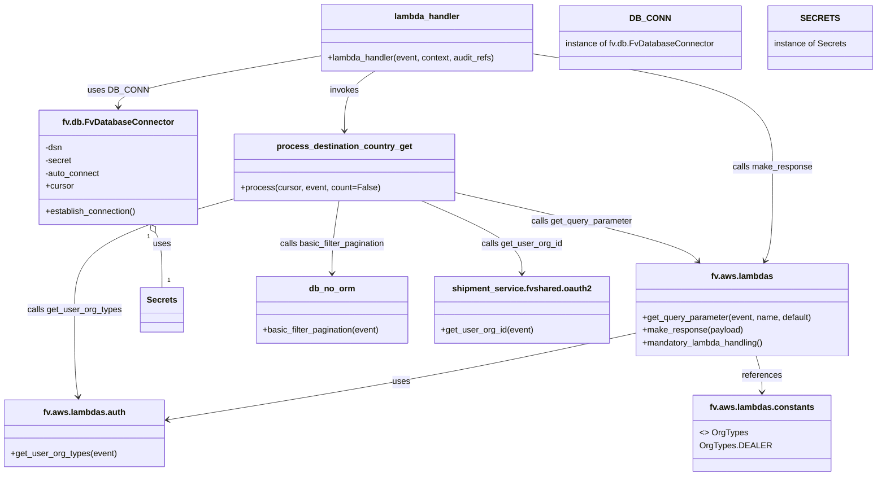

# Diagram: shipment_core/shipment_service/shipment_service/ng_shipments/ng_get_destination_country.py


> Auto-generated by Obscura crawlers

## Diagram 1



### SVG

<svg id="container" width="1637.791015625" xmlns="http://www.w3.org/2000/svg" class="classDiagram" height="922" viewBox="0 0 1637.791015625 922" role="graphics-document document" aria-roledescription="class"><style>#container{font-family:"trebuchet ms",verdana,arial,sans-serif;font-size:16px;fill:#333;}@keyframes edge-animation-frame{from{stroke-dashoffset:0;}}@keyframes dash{to{stroke-dashoffset:0;}}#container .edge-animation-slow{stroke-dasharray:9,5!important;stroke-dashoffset:900;animation:dash 50s linear infinite;stroke-linecap:round;}#container .edge-animation-fast{stroke-dasharray:9,5!important;stroke-dashoffset:900;animation:dash 20s linear infinite;stroke-linecap:round;}#container .error-icon{fill:#552222;}#container .error-text{fill:#552222;stroke:#552222;}#container .edge-thickness-normal{stroke-width:1px;}#container .edge-thickness-thick{stroke-width:3.5px;}#container .edge-pattern-solid{stroke-dasharray:0;}#container .edge-thickness-invisible{stroke-width:0;fill:none;}#container .edge-pattern-dashed{stroke-dasharray:3;}#container .edge-pattern-dotted{stroke-dasharray:2;}#container .marker{fill:#333333;stroke:#333333;}#container .marker.cross{stroke:#333333;}#container svg{font-family:"trebuchet ms",verdana,arial,sans-serif;font-size:16px;}#container p{margin:0;}#container g.classGroup text{fill:#9370DB;stroke:none;font-family:"trebuchet ms",verdana,arial,sans-serif;font-size:10px;}#container g.classGroup text .title{font-weight:bolder;}#container .nodeLabel,#container .edgeLabel{color:#131300;}#container .edgeLabel .label rect{fill:#ECECFF;}#container .label text{fill:#131300;}#container .labelBkg{background:#ECECFF;}#container .edgeLabel .label span{background:#ECECFF;}#container .classTitle{font-weight:bolder;}#container .node rect,#container .node circle,#container .node ellipse,#container .node polygon,#container .node path{fill:#ECECFF;stroke:#9370DB;stroke-width:1px;}#container .divider{stroke:#9370DB;stroke-width:1;}#container g.clickable{cursor:pointer;}#container g.classGroup rect{fill:#ECECFF;stroke:#9370DB;}#container g.classGroup line{stroke:#9370DB;stroke-width:1;}#container .classLabel .box{stroke:none;stroke-width:0;fill:#ECECFF;opacity:0.5;}#container .classLabel .label{fill:#9370DB;font-size:10px;}#container .relation{stroke:#333333;stroke-width:1;fill:none;}#container .dashed-line{stroke-dasharray:3;}#container .dotted-line{stroke-dasharray:1 2;}#container #compositionStart,#container .composition{fill:#333333!important;stroke:#333333!important;stroke-width:1;}#container #compositionEnd,#container .composition{fill:#333333!important;stroke:#333333!important;stroke-width:1;}#container #dependencyStart,#container .dependency{fill:#333333!important;stroke:#333333!important;stroke-width:1;}#container #dependencyStart,#container .dependency{fill:#333333!important;stroke:#333333!important;stroke-width:1;}#container #extensionStart,#container .extension{fill:transparent!important;stroke:#333333!important;stroke-width:1;}#container #extensionEnd,#container .extension{fill:transparent!important;stroke:#333333!important;stroke-width:1;}#container #aggregationStart,#container .aggregation{fill:transparent!important;stroke:#333333!important;stroke-width:1;}#container #aggregationEnd,#container .aggregation{fill:transparent!important;stroke:#333333!important;stroke-width:1;}#container #lollipopStart,#container .lollipop{fill:#ECECFF!important;stroke:#333333!important;stroke-width:1;}#container #lollipopEnd,#container .lollipop{fill:#ECECFF!important;stroke:#333333!important;stroke-width:1;}#container .edgeTerminals{font-size:11px;line-height:initial;}#container .classTitleText{text-anchor:middle;font-size:18px;fill:#333;}#container .label-icon{display:inline-block;height:1em;overflow:visible;vertical-align:-0.125em;}#container .node .label-icon path{fill:currentColor;stroke:revert;stroke-width:revert;}#container :root{--mermaid-font-family:"trebuchet ms",verdana,arial,sans-serif;}</style><g><defs><marker id="container_class-aggregationStart" class="marker aggregation class" refX="18" refY="7" markerWidth="190" markerHeight="240" orient="auto"><path d="M 18,7 L9,13 L1,7 L9,1 Z"></path></marker></defs><defs><marker id="container_class-aggregationEnd" class="marker aggregation class" refX="1" refY="7" markerWidth="20" markerHeight="28" orient="auto"><path d="M 18,7 L9,13 L1,7 L9,1 Z"></path></marker></defs><defs><marker id="container_class-extensionStart" class="marker extension class" refX="18" refY="7" markerWidth="190" markerHeight="240" orient="auto"><path d="M 1,7 L18,13 V 1 Z"></path></marker></defs><defs><marker id="container_class-extensionEnd" class="marker extension class" refX="1" refY="7" markerWidth="20" markerHeight="28" orient="auto"><path d="M 1,1 V 13 L18,7 Z"></path></marker></defs><defs><marker id="container_class-compositionStart" class="marker composition class" refX="18" refY="7" markerWidth="190" markerHeight="240" orient="auto"><path d="M 18,7 L9,13 L1,7 L9,1 Z"></path></marker></defs><defs><marker id="container_class-compositionEnd" class="marker composition class" refX="1" refY="7" markerWidth="20" markerHeight="28" orient="auto"><path d="M 18,7 L9,13 L1,7 L9,1 Z"></path></marker></defs><defs><marker id="container_class-dependencyStart" class="marker dependency class" refX="6" refY="7" markerWidth="190" markerHeight="240" orient="auto"><path d="M 5,7 L9,13 L1,7 L9,1 Z"></path></marker></defs><defs><marker id="container_class-dependencyEnd" class="marker dependency class" refX="13" refY="7" markerWidth="20" markerHeight="28" orient="auto"><path d="M 18,7 L9,13 L14,7 L9,1 Z"></path></marker></defs><defs><marker id="container_class-lollipopStart" class="marker lollipop class" refX="13" refY="7" markerWidth="190" markerHeight="240" orient="auto"><circle stroke="black" fill="transparent" cx="7" cy="7" r="6"></circle></marker></defs><defs><marker id="container_class-lollipopEnd" class="marker lollipop class" refX="1" refY="7" markerWidth="190" markerHeight="240" orient="auto"><circle stroke="black" fill="transparent" cx="7" cy="7" r="6"></circle></marker></defs><g class="root"><g class="clusters"></g><g class="edgePaths"><path d="M1185.791,653.206L1125.287,666.505C1064.784,679.804,943.777,706.402,797.975,733.656C652.174,760.91,481.579,788.821,396.281,802.776L310.984,816.731" id="id_fv.aws.lambdas_fv.aws.lambdas.auth_1" class="edge-thickness-normal edge-pattern-solid relation" style=";;;" data-edge="true" data-et="edge" data-id="id_fv.aws.lambdas_fv.aws.lambdas.auth_1" data-points="W3sieCI6MTE4NS43OTEwMTU2MjUsInkiOjY1My4yMDU4MzIzNTUyNzMxfSx7IngiOjgyMi43Njk1MzEyNSwieSI6NzMzfSx7IngiOjMwNS4wNjI1LCJ5Ijo4MTcuNjk5NTI1NjcxNzY5Nn1d" marker-end="url(#container_class-dependencyEnd)"></path><path d="M1412.976,696L1414.824,702.167C1416.672,708.333,1420.368,720.667,1422.216,732C1424.064,743.333,1424.064,753.667,1424.064,758.833L1424.064,764" id="id_fv.aws.lambdas_fv.aws.lambdas.constants_2" class="edge-thickness-normal edge-pattern-solid relation" style=";;;" data-edge="true" data-et="edge" data-id="id_fv.aws.lambdas_fv.aws.lambdas.constants_2" data-points="W3sieCI6MTQxMi45NzYzNDE5ODU4ODcsInkiOjY5Nn0seyJ4IjoxNDI0LjA2NDQ1MzEyNSwieSI6NzMzfSx7IngiOjE0MjQuMDY0NDUzMTI1LCJ5Ijo3NzB9XQ==" marker-end="url(#container_class-dependencyEnd)"></path><path d="M593.471,106.172L531.162,116.977C468.854,127.782,344.238,149.391,281.929,165.362C219.621,181.333,219.621,191.667,219.621,196.833L219.621,202" id="id_lambda_handler_fv.db.FvDatabaseConnector_3" class="edge-thickness-normal edge-pattern-solid relation" style=";;;" data-edge="true" data-et="edge" data-id="id_lambda_handler_fv.db.FvDatabaseConnector_3" data-points="W3sieCI6NTkzLjQ3MDcwMzEyNSwieSI6MTA2LjE3MjI3MTMxMjQ5OTc5fSx7IngiOjIxOS42MjEwOTM3NSwieSI6MTcxfSx7IngiOjIxOS42MjEwOTM3NSwieSI6MjA4fV0=" marker-end="url(#container_class-dependencyEnd)"></path><path d="M999.135,102.267L1073.447,113.723C1147.758,125.178,1296.382,148.089,1370.694,183.711C1445.006,219.333,1445.006,267.667,1445.006,318C1445.006,368.333,1445.006,420.667,1441.91,454.08C1438.814,487.494,1432.622,501.988,1429.525,509.235L1426.429,516.482" id="id_lambda_handler_fv.aws.lambdas_4" class="edge-thickness-normal edge-pattern-solid relation" style=";;;" data-edge="true" data-et="edge" data-id="id_lambda_handler_fv.aws.lambdas_4" data-points="W3sieCI6OTk5LjEzNDc2NTYyNSwieSI6MTAyLjI2NzMxMjE4NTM2OTg1fSx7IngiOjE0NDUuMDA1ODU5Mzc1LCJ5IjoxNzF9LHsieCI6MTQ0NS4wMDU4NTkzNzUsInkiOjMxNn0seyJ4IjoxNDQ1LjAwNTg1OTM3NSwieSI6NDczfSx7IngiOjE0MjQuMDcyMjA4MTgwMTQ3LCJ5Ijo1MjJ9XQ==" marker-end="url(#container_class-dependencyEnd)"></path><path d="M698.632,134L689.071,140.167C679.511,146.333,660.39,158.667,650.83,177.5C641.27,196.333,641.27,221.667,641.27,234.333L641.27,247" id="id_lambda_handler_process_destination_country_get_5" class="edge-thickness-normal edge-pattern-solid relation" style=";;;" data-edge="true" data-et="edge" data-id="id_lambda_handler_process_destination_country_get_5" data-points="W3sieCI6Njk4LjYzMTgxNjQwNjI1LCJ5IjoxMzR9LHsieCI6NjQxLjI2OTUzMTI1LCJ5IjoxNzF9LHsieCI6NjQxLjI2OTUzMTI1LCJ5IjoyNTN9XQ==" marker-end="url(#container_class-dependencyEnd)"></path><path d="M774.888,379L808.116,394.667C841.344,410.333,907.8,441.667,941.028,468.5C974.256,495.333,974.256,517.667,974.256,528.833L974.256,540" id="id_process_destination_country_get_shipment_service.fvshared.oauth2_6" class="edge-thickness-normal edge-pattern-solid relation" style=";;;" data-edge="true" data-et="edge" data-id="id_process_destination_country_get_shipment_service.fvshared.oauth2_6" data-points="W3sieCI6Nzc0Ljg4ODI0ODkwNTI1NDgsInkiOjM3OX0seyJ4Ijo5NzQuMjU1ODU5Mzc1LCJ5Ijo0NzN9LHsieCI6OTc0LjI1NTg1OTM3NSwieSI6NTQ2fV0=" marker-end="url(#container_class-dependencyEnd)"></path><path d="M439.435,379L389.243,394.667C339.052,410.333,238.668,441.667,188.477,480C138.285,518.333,138.285,563.667,138.285,607C138.285,650.333,138.285,691.667,139.403,719.014C140.522,746.361,142.758,759.722,143.876,766.402L144.995,773.082" id="id_process_destination_country_get_fv.aws.lambdas.auth_7" class="edge-thickness-normal edge-pattern-solid relation" style=";;;" data-edge="true" data-et="edge" data-id="id_process_destination_country_get_fv.aws.lambdas.auth_7" data-points="W3sieCI6NDM5LjQzNTAzNjgyMzI0ODQsInkiOjM3OX0seyJ4IjoxMzguMjg1MTU2MjUsInkiOjQ3M30seyJ4IjoxMzguMjg1MTU2MjUsInkiOjYwOX0seyJ4IjoxMzguMjg1MTU2MjUsInkiOjczM30seyJ4IjoxNDUuOTg1MzQyNjAzMjExLCJ5Ijo3Nzl9XQ==" marker-end="url(#container_class-dependencyEnd)"></path><path d="M844.289,366.16L916.361,383.966C988.433,401.773,1132.577,437.387,1210.636,462.583C1288.695,487.779,1300.668,502.559,1306.655,509.948L1312.642,517.338" id="id_process_destination_country_get_fv.aws.lambdas_8" class="edge-thickness-normal edge-pattern-solid relation" style=";;;" data-edge="true" data-et="edge" data-id="id_process_destination_country_get_fv.aws.lambdas_8" data-points="W3sieCI6ODQ0LjI4OTA2MjUsInkiOjM2Ni4xNTk3NDEzMjU1MjIzfSx7IngiOjEyNzYuNzIwNzAzMTI1LCJ5Ijo0NzN9LHsieCI6MTMxNi40MTkyMDM4MTQzMzgzLCJ5Ijo1MjJ9XQ==" marker-end="url(#container_class-dependencyEnd)"></path><path d="M632.072,379L629.785,394.667C627.498,410.333,622.924,441.667,620.637,468.5C618.35,495.333,618.35,517.667,618.35,528.833L618.35,540" id="id_process_destination_country_get_db_no_orm_9" class="edge-thickness-normal edge-pattern-solid relation" style=";;;" data-edge="true" data-et="edge" data-id="id_process_destination_country_get_db_no_orm_9" data-points="W3sieCI6NjMyLjA3MjM2NTE0NzI5MywieSI6Mzc5fSx7IngiOjYxOC4zNDk2MDkzNzUsInkiOjQ3M30seyJ4Ijo2MTguMzQ5NjA5Mzc1LCJ5Ijo1NDZ9XQ==" marker-end="url(#container_class-dependencyEnd)"></path><path d="M283.507,439.317L286.415,444.931C289.324,450.544,295.14,461.772,298.049,483.053C300.957,504.333,300.957,535.667,300.957,551.333L300.957,567" id="id_fv.db.FvDatabaseConnector_Secrets_10" class="edge-thickness-normal edge-pattern-solid relation" style=";;;" data-edge="true" data-et="edge" data-id="id_fv.db.FvDatabaseConnector_Secrets_10" data-points="W3sieCI6Mjc1LjU3MTkyOTczNzI2MTE0LCJ5Ijo0MjR9LHsieCI6MzAwLjk1NzAzMTI1LCJ5Ijo0NzN9LHsieCI6MzAwLjk1NzAzMTI1LCJ5Ijo1Njd9XQ==" marker-start="url(#container_class-aggregationStart)"></path></g><g class="edgeLabels"><g class="edgeLabel" transform="translate(747.32147, 745.34369)"><g class="label" data-id="id_fv.aws.lambdas_fv.aws.lambdas.auth_1" transform="translate(-16.4921875, -12)"><foreignObject width="32.984375" height="24"><div xmlns="http://www.w3.org/1999/xhtml" class="labelBkg" style="display: table-cell; white-space: nowrap; line-height: 1.5; max-width: 200px; text-align: center;"><span class="edgeLabel"><p>uses</p></span></div></foreignObject></g></g><g class="edgeLabel" transform="translate(1424.064453125, 733)"><g class="label" data-id="id_fv.aws.lambdas_fv.aws.lambdas.constants_2" transform="translate(-37.828125, -12)"><foreignObject width="75.65625" height="24"><div xmlns="http://www.w3.org/1999/xhtml" class="labelBkg" style="display: table-cell; white-space: nowrap; line-height: 1.5; max-width: 200px; text-align: center;"><span class="edgeLabel"><p>references</p></span></div></foreignObject></g></g><g class="edgeLabel" transform="translate(219.62109375, 171)"><g class="label" data-id="id_lambda_handler_fv.db.FvDatabaseConnector_3" transform="translate(-53.09375, -12)"><foreignObject width="106.1875" height="24"><div xmlns="http://www.w3.org/1999/xhtml" class="labelBkg" style="display: table-cell; white-space: nowrap; line-height: 1.5; max-width: 200px; text-align: center;"><span class="edgeLabel"><p>uses DB_CONN</p></span></div></foreignObject></g></g><g class="edgeLabel" transform="translate(1445.005859375, 316)"><g class="label" data-id="id_lambda_handler_fv.aws.lambdas_4" transform="translate(-75.3046875, -12)"><foreignObject width="150.609375" height="24"><div xmlns="http://www.w3.org/1999/xhtml" class="labelBkg" style="display: table-cell; white-space: nowrap; line-height: 1.5; max-width: 200px; text-align: center;"><span class="edgeLabel"><p>calls make_response</p></span></div></foreignObject></g></g><g class="edgeLabel" transform="translate(641.26953125, 171)"><g class="label" data-id="id_lambda_handler_process_destination_country_get_5" transform="translate(-27.5859375, -12)"><foreignObject width="55.171875" height="24"><div xmlns="http://www.w3.org/1999/xhtml" class="labelBkg" style="display: table-cell; white-space: nowrap; line-height: 1.5; max-width: 200px; text-align: center;"><span class="edgeLabel"><p>invokes</p></span></div></foreignObject></g></g><g class="edgeLabel" transform="translate(974.255859375, 473)"><g class="label" data-id="id_process_destination_country_get_shipment_service.fvshared.oauth2_6" transform="translate(-76.078125, -12)"><foreignObject width="152.15625" height="24"><div xmlns="http://www.w3.org/1999/xhtml" class="labelBkg" style="display: table-cell; white-space: nowrap; line-height: 1.5; max-width: 200px; text-align: center;"><span class="edgeLabel"><p>calls get_user_org_id</p></span></div></foreignObject></g></g><g class="edgeLabel" transform="translate(138.28515625, 609)"><g class="label" data-id="id_process_destination_country_get_fv.aws.lambdas.auth_7" transform="translate(-88.5078125, -12)"><foreignObject width="177.015625" height="24"><div xmlns="http://www.w3.org/1999/xhtml" class="labelBkg" style="display: table-cell; white-space: nowrap; line-height: 1.5; max-width: 200px; text-align: center;"><span class="edgeLabel"><p>calls get_user_org_types</p></span></div></foreignObject></g></g><g class="edgeLabel" transform="translate(1091.11604, 427.14292)"><g class="label" data-id="id_process_destination_country_get_fv.aws.lambdas_8" transform="translate(-96.203125, -12)"><foreignObject width="192.40625" height="24"><div xmlns="http://www.w3.org/1999/xhtml" class="labelBkg" style="display: table-cell; white-space: nowrap; line-height: 1.5; max-width: 200px; text-align: center;"><span class="edgeLabel"><p>calls get_query_parameter</p></span></div></foreignObject></g></g><g class="edgeLabel" transform="translate(618.349609375, 473)"><g class="label" data-id="id_process_destination_country_get_db_no_orm_9" transform="translate(-100, -24)"><foreignObject width="200" height="48"><div xmlns="http://www.w3.org/1999/xhtml" class="labelBkg" style="display: table; white-space: break-spaces; line-height: 1.5; max-width: 200px; text-align: center; width: 200px;"><span class="edgeLabel"><p>calls basic_filter_pagination</p></span></div></foreignObject></g></g><g class="edgeLabel" transform="translate(300.95703125, 473)"><g class="label" data-id="id_fv.db.FvDatabaseConnector_Secrets_10" transform="translate(-16.4921875, -12)"><foreignObject width="32.984375" height="24"><div xmlns="http://www.w3.org/1999/xhtml" class="labelBkg" style="display: table-cell; white-space: nowrap; line-height: 1.5; max-width: 200px; text-align: center;"><span class="edgeLabel"><p>uses</p></span></div></foreignObject></g></g><g class="edgeTerminals" transform="translate(270.30310989779866, 446.4385732988748)"><g class="inner" transform="translate(0, 0)"><foreignObject style="width: 9px; height: 12px;"><div xmlns="http://www.w3.org/1999/xhtml" style="display: inline-block; padding-right: 1px; white-space: nowrap;"><span class="edgeLabel">1</span></div></foreignObject></g></g><g class="edgeTerminals" transform="translate(310.957030625, 544.4999994642857)"><g class="inner" transform="translate(0, 0)"></g><foreignObject style="width: 9px; height: 12px;"><div xmlns="http://www.w3.org/1999/xhtml" style="display: inline-block; padding-right: 1px; white-space: nowrap;"><span class="edgeLabel">1</span></div></foreignObject></g></g><g class="nodes"><g class="node default" id="classId-fv.aws.lambdas-0" transform="translate(1386.904296875, 609)"><g class="basic label-container"><path d="M-201.11328125 -87 L201.11328125 -87 L201.11328125 87 L-201.11328125 87" stroke="none" stroke-width="0" fill="#ECECFF" style=""></path><path d="M-201.11328125 -87 C-92.12638869377537 -87, 16.860503862449264 -87, 201.11328125 -87 M-201.11328125 -87 C-53.24047605414785 -87, 94.6323291417043 -87, 201.11328125 -87 M201.11328125 -87 C201.11328125 -23.732708070092272, 201.11328125 39.534583859815456, 201.11328125 87 M201.11328125 -87 C201.11328125 -33.202947648096064, 201.11328125 20.594104703807872, 201.11328125 87 M201.11328125 87 C82.24213083454131 87, -36.62901958091737 87, -201.11328125 87 M201.11328125 87 C65.99148180728841 87, -69.13031763542318 87, -201.11328125 87 M-201.11328125 87 C-201.11328125 21.691209685727145, -201.11328125 -43.61758062854571, -201.11328125 -87 M-201.11328125 87 C-201.11328125 46.2804264567405, -201.11328125 5.560852913481, -201.11328125 -87" stroke="#9370DB" stroke-width="1.3" fill="none" stroke-dasharray="0 0" style=""></path></g><g class="annotation-group text" transform="translate(0, -63)"></g><g class="label-group text" transform="translate(-55.8984375, -63)"><g class="label" style="font-weight: bolder" transform="translate(0,-12)"><foreignObject width="111.796875" height="24"><div xmlns="http://www.w3.org/1999/xhtml" style="display: table-cell; white-space: nowrap; line-height: 1.5; max-width: 160px; text-align: center;"><span class="nodeLabel markdown-node-label" style=""><p>fv.aws.lambdas</p></span></div></foreignObject></g></g><g class="members-group text" transform="translate(-189.11328125, -15)"></g><g class="methods-group text" transform="translate(-189.11328125, 15)"><g class="label" style="" transform="translate(0,-12)"><foreignObject width="322.328125" height="24"><div xmlns="http://www.w3.org/1999/xhtml" style="display: table-cell; white-space: nowrap; line-height: 1.5; max-width: 380px; text-align: center;"><span class="nodeLabel markdown-node-label" style=""><p>+get_query_parameter(event, name, default)</p></span></div></foreignObject></g><g class="label" style="" transform="translate(0,12)"><foreignObject width="189.59375" height="24"><div xmlns="http://www.w3.org/1999/xhtml" style="display: table-cell; white-space: nowrap; line-height: 1.5; max-width: 247px; text-align: center;"><span class="nodeLabel markdown-node-label" style=""><p>+make_response(payload)</p></span></div></foreignObject></g><g class="label" style="" transform="translate(0,36)"><foreignObject width="232.078125" height="24"><div xmlns="http://www.w3.org/1999/xhtml" style="display: table-cell; white-space: nowrap; line-height: 1.5; max-width: 289px; text-align: center;"><span class="nodeLabel markdown-node-label" style=""><p>+mandatory_lambda_handling()</p></span></div></foreignObject></g></g><g class="divider" style=""><path d="M-201.11328125 -39 C-53.188073597078215 -39, 94.73713405584357 -39, 201.11328125 -39 M-201.11328125 -39 C-49.762290041073754 -39, 101.58870116785249 -39, 201.11328125 -39" stroke="#9370DB" stroke-width="1.3" fill="none" stroke-dasharray="0 0" style=""></path></g><g class="divider" style=""><path d="M-201.11328125 -15 C-85.30918688132742 -15, 30.49490748734516 -15, 201.11328125 -15 M-201.11328125 -15 C-51.67732499291449 -15, 97.75863126417102 -15, 201.11328125 -15" stroke="#9370DB" stroke-width="1.3" fill="none" stroke-dasharray="0 0" style=""></path></g></g><g class="node default" id="classId-fv.aws.lambdas.auth-1" transform="translate(156.53125, 842)"><g class="basic label-container"><path d="M-148.53125 -63 L148.53125 -63 L148.53125 63 L-148.53125 63" stroke="none" stroke-width="0" fill="#ECECFF" style=""></path><path d="M-148.53125 -63 C-55.607250765026734 -63, 37.31674846994653 -63, 148.53125 -63 M-148.53125 -63 C-54.20140496484987 -63, 40.12844007030026 -63, 148.53125 -63 M148.53125 -63 C148.53125 -26.674030286527554, 148.53125 9.651939426944892, 148.53125 63 M148.53125 -63 C148.53125 -36.03157415244648, 148.53125 -9.06314830489297, 148.53125 63 M148.53125 63 C80.90195594955028 63, 13.27266189910057 63, -148.53125 63 M148.53125 63 C79.3254132712329 63, 10.119576542465808 63, -148.53125 63 M-148.53125 63 C-148.53125 23.751990766507156, -148.53125 -15.496018466985689, -148.53125 -63 M-148.53125 63 C-148.53125 21.23169434231304, -148.53125 -20.536611315373918, -148.53125 -63" stroke="#9370DB" stroke-width="1.3" fill="none" stroke-dasharray="0 0" style=""></path></g><g class="annotation-group text" transform="translate(0, -39)"></g><g class="label-group text" transform="translate(-74.484375, -39)"><g class="label" style="font-weight: bolder" transform="translate(0,-12)"><foreignObject width="148.96875" height="24"><div xmlns="http://www.w3.org/1999/xhtml" style="display: table-cell; white-space: nowrap; line-height: 1.5; max-width: 197px; text-align: center;"><span class="nodeLabel markdown-node-label" style=""><p>fv.aws.lambdas.auth</p></span></div></foreignObject></g></g><g class="members-group text" transform="translate(-136.53125, 9)"></g><g class="methods-group text" transform="translate(-136.53125, 39)"><g class="label" style="" transform="translate(0,-12)"><foreignObject width="198.578125" height="24"><div xmlns="http://www.w3.org/1999/xhtml" style="display: table-cell; white-space: nowrap; line-height: 1.5; max-width: 256px; text-align: center;"><span class="nodeLabel markdown-node-label" style=""><p>+get_user_org_types(event)</p></span></div></foreignObject></g></g><g class="divider" style=""><path d="M-148.53125 -15 C-59.13973251909893 -15, 30.251784961802144 -15, 148.53125 -15 M-148.53125 -15 C-33.28109061196234 -15, 81.96906877607532 -15, 148.53125 -15" stroke="#9370DB" stroke-width="1.3" fill="none" stroke-dasharray="0 0" style=""></path></g><g class="divider" style=""><path d="M-148.53125 9 C-52.20472481771823 9, 44.12180036456354 9, 148.53125 9 M-148.53125 9 C-53.17674204915488 9, 42.177765901690236 9, 148.53125 9" stroke="#9370DB" stroke-width="1.3" fill="none" stroke-dasharray="0 0" style=""></path></g></g><g class="node default" id="classId-fv.aws.lambdas.constants-2" transform="translate(1424.064453125, 842)"><g class="basic label-container"><path d="M-121.05859375 -72 L121.05859375 -72 L121.05859375 72 L-121.05859375 72" stroke="none" stroke-width="0" fill="#ECECFF" style=""></path><path d="M-121.05859375 -72 C-54.90183249748574 -72, 11.254928755028516 -72, 121.05859375 -72 M-121.05859375 -72 C-24.811309438799597 -72, 71.4359748724008 -72, 121.05859375 -72 M121.05859375 -72 C121.05859375 -23.433213873724867, 121.05859375 25.133572252550266, 121.05859375 72 M121.05859375 -72 C121.05859375 -18.84767867130732, 121.05859375 34.30464265738536, 121.05859375 72 M121.05859375 72 C62.84500526219702 72, 4.63141677439404 72, -121.05859375 72 M121.05859375 72 C45.52539075699973 72, -30.007812236000547 72, -121.05859375 72 M-121.05859375 72 C-121.05859375 29.708024387072882, -121.05859375 -12.583951225854236, -121.05859375 -72 M-121.05859375 72 C-121.05859375 30.865375108243214, -121.05859375 -10.269249783513573, -121.05859375 -72" stroke="#9370DB" stroke-width="1.3" fill="none" stroke-dasharray="0 0" style=""></path></g><g class="annotation-group text" transform="translate(0, -48)"></g><g class="label-group text" transform="translate(-93.5078125, -48)"><g class="label" style="font-weight: bolder" transform="translate(0,-12)"><foreignObject width="187.015625" height="24"><div xmlns="http://www.w3.org/1999/xhtml" style="display: table-cell; white-space: nowrap; line-height: 1.5; max-width: 234px; text-align: center;"><span class="nodeLabel markdown-node-label" style=""><p>fv.aws.lambdas.constants</p></span></div></foreignObject></g></g><g class="members-group text" transform="translate(-109.05859375, 0)"><g class="label" style="" transform="translate(0,-12)"><foreignObject width="86.78125" height="24"><div xmlns="http://www.w3.org/1999/xhtml" style="display: table-cell; white-space: nowrap; line-height: 1.5; max-width: 176px; text-align: center;"><span class="nodeLabel markdown-node-label" style=""><p>&lt;&gt; OrgTypes</p></span></div></foreignObject></g><g class="label" style="" transform="translate(0,12)"><foreignObject width="124.609375" height="24"><div xmlns="http://www.w3.org/1999/xhtml" style="display: table-cell; white-space: nowrap; line-height: 1.5; max-width: 175px; text-align: center;"><span class="nodeLabel markdown-node-label" style=""><p>OrgTypes.DEALER</p></span></div></foreignObject></g></g><g class="methods-group text" transform="translate(-109.05859375, 72)"></g><g class="divider" style=""><path d="M-121.05859375 -24 C-45.154294344159695 -24, 30.75000506168061 -24, 121.05859375 -24 M-121.05859375 -24 C-47.99275351143781 -24, 25.073086727124377 -24, 121.05859375 -24" stroke="#9370DB" stroke-width="1.3" fill="none" stroke-dasharray="0 0" style=""></path></g><g class="divider" style=""><path d="M-121.05859375 48 C-28.793506231112715 48, 63.47158128777457 48, 121.05859375 48 M-121.05859375 48 C-27.652928313221466 48, 65.75273712355707 48, 121.05859375 48" stroke="#9370DB" stroke-width="1.3" fill="none" stroke-dasharray="0 0" style=""></path></g></g><g class="node default" id="classId-fv.db.FvDatabaseConnector-3" transform="translate(219.62109375, 316)"><g class="basic label-container"><path d="M-148.23046875 -108 L148.23046875 -108 L148.23046875 108 L-148.23046875 108" stroke="none" stroke-width="0" fill="#ECECFF" style=""></path><path d="M-148.23046875 -108 C-73.5396114785827 -108, 1.151245792834601 -108, 148.23046875 -108 M-148.23046875 -108 C-73.93514127449019 -108, 0.36018620101961574 -108, 148.23046875 -108 M148.23046875 -108 C148.23046875 -59.302787090053116, 148.23046875 -10.605574180106231, 148.23046875 108 M148.23046875 -108 C148.23046875 -33.53652035812115, 148.23046875 40.9269592837577, 148.23046875 108 M148.23046875 108 C45.262591718570874 108, -57.70528531285825 108, -148.23046875 108 M148.23046875 108 C50.873235301796115 108, -46.48399814640777 108, -148.23046875 108 M-148.23046875 108 C-148.23046875 54.37642425037037, -148.23046875 0.7528485007407397, -148.23046875 -108 M-148.23046875 108 C-148.23046875 62.632890228956896, -148.23046875 17.26578045791379, -148.23046875 -108" stroke="#9370DB" stroke-width="1.3" fill="none" stroke-dasharray="0 0" style=""></path></g><g class="annotation-group text" transform="translate(0, -84)"></g><g class="label-group text" transform="translate(-99.1953125, -84)"><g class="label" style="font-weight: bolder" transform="translate(0,-12)"><foreignObject width="198.390625" height="24"><div xmlns="http://www.w3.org/1999/xhtml" style="display: table-cell; white-space: nowrap; line-height: 1.5; max-width: 246px; text-align: center;"><span class="nodeLabel markdown-node-label" style=""><p>fv.db.FvDatabaseConnector</p></span></div></foreignObject></g></g><g class="members-group text" transform="translate(-136.23046875, -36)"><g class="label" style="" transform="translate(0,-12)"><foreignObject width="32.875" height="24"><div xmlns="http://www.w3.org/1999/xhtml" style="display: table-cell; white-space: nowrap; line-height: 1.5; max-width: 90px; text-align: center;"><span class="nodeLabel markdown-node-label" style=""><p>-dsn</p></span></div></foreignObject></g><g class="label" style="" transform="translate(0,12)"><foreignObject width="50.484375" height="24"><div xmlns="http://www.w3.org/1999/xhtml" style="display: table-cell; white-space: nowrap; line-height: 1.5; max-width: 108px; text-align: center;"><span class="nodeLabel markdown-node-label" style=""><p>-secret</p></span></div></foreignObject></g><g class="label" style="" transform="translate(0,36)"><foreignObject width="104.359375" height="24"><div xmlns="http://www.w3.org/1999/xhtml" style="display: table-cell; white-space: nowrap; line-height: 1.5; max-width: 162px; text-align: center;"><span class="nodeLabel markdown-node-label" style=""><p>-auto_connect</p></span></div></foreignObject></g><g class="label" style="" transform="translate(0,60)"><foreignObject width="53.71875" height="24"><div xmlns="http://www.w3.org/1999/xhtml" style="display: table-cell; white-space: nowrap; line-height: 1.5; max-width: 112px; text-align: center;"><span class="nodeLabel markdown-node-label" style=""><p>+cursor</p></span></div></foreignObject></g></g><g class="methods-group text" transform="translate(-136.23046875, 84)"><g class="label" style="" transform="translate(0,-12)"><foreignObject width="173.265625" height="24"><div xmlns="http://www.w3.org/1999/xhtml" style="display: table-cell; white-space: nowrap; line-height: 1.5; max-width: 231px; text-align: center;"><span class="nodeLabel markdown-node-label" style=""><p>+establish_connection()</p></span></div></foreignObject></g></g><g class="divider" style=""><path d="M-148.23046875 -60 C-55.70803200618249 -60, 36.814404737635016 -60, 148.23046875 -60 M-148.23046875 -60 C-74.72028769788804 -60, -1.2101066457760794 -60, 148.23046875 -60" stroke="#9370DB" stroke-width="1.3" fill="none" stroke-dasharray="0 0" style=""></path></g><g class="divider" style=""><path d="M-148.23046875 60 C-75.96497938691988 60, -3.6994900238397577 60, 148.23046875 60 M-148.23046875 60 C-84.14726023410292 60, -20.06405171820583 60, 148.23046875 60" stroke="#9370DB" stroke-width="1.3" fill="none" stroke-dasharray="0 0" style=""></path></g></g><g class="node default" id="classId-Secrets-4" transform="translate(300.95703125, 609)"><g class="basic label-container"><path d="M-39.1640625 -42 L39.1640625 -42 L39.1640625 42 L-39.1640625 42" stroke="none" stroke-width="0" fill="#ECECFF" style=""></path><path d="M-39.1640625 -42 C-11.236438491528524 -42, 16.69118551694295 -42, 39.1640625 -42 M-39.1640625 -42 C-11.378081819569353 -42, 16.407898860861295 -42, 39.1640625 -42 M39.1640625 -42 C39.1640625 -17.626788052541453, 39.1640625 6.746423894917093, 39.1640625 42 M39.1640625 -42 C39.1640625 -22.487424709014075, 39.1640625 -2.9748494180281497, 39.1640625 42 M39.1640625 42 C8.337295847865846 42, -22.489470804268308 42, -39.1640625 42 M39.1640625 42 C13.122436154516055 42, -12.919190190967889 42, -39.1640625 42 M-39.1640625 42 C-39.1640625 24.08086204930871, -39.1640625 6.1617240986174195, -39.1640625 -42 M-39.1640625 42 C-39.1640625 22.33274913056959, -39.1640625 2.6654982611391773, -39.1640625 -42" stroke="#9370DB" stroke-width="1.3" fill="none" stroke-dasharray="0 0" style=""></path></g><g class="annotation-group text" transform="translate(0, -18)"></g><g class="label-group text" transform="translate(-27.1640625, -18)"><g class="label" style="font-weight: bolder" transform="translate(0,-12)"><foreignObject width="54.328125" height="24"><div xmlns="http://www.w3.org/1999/xhtml" style="display: table-cell; white-space: nowrap; line-height: 1.5; max-width: 103px; text-align: center;"><span class="nodeLabel markdown-node-label" style=""><p>Secrets</p></span></div></foreignObject></g></g><g class="members-group text" transform="translate(-27.1640625, 30)"></g><g class="methods-group text" transform="translate(-27.1640625, 60)"></g><g class="divider" style=""><path d="M-39.1640625 6 C-17.543463730957665 6, 4.07713503808467 6, 39.1640625 6 M-39.1640625 6 C-14.798167448070224 6, 9.567727603859552 6, 39.1640625 6" stroke="#9370DB" stroke-width="1.3" fill="none" stroke-dasharray="0 0" style=""></path></g><g class="divider" style=""><path d="M-39.1640625 24 C-16.23413686769249 24, 6.695788764615017 24, 39.1640625 24 M-39.1640625 24 C-22.87169058364346 24, -6.57931866728692 24, 39.1640625 24" stroke="#9370DB" stroke-width="1.3" fill="none" stroke-dasharray="0 0" style=""></path></g></g><g class="node default" id="classId-db_no_orm-5" transform="translate(618.349609375, 609)"><g class="basic label-container"><path d="M-144.37109375 -63 L144.37109375 -63 L144.37109375 63 L-144.37109375 63" stroke="none" stroke-width="0" fill="#ECECFF" style=""></path><path d="M-144.37109375 -63 C-53.12729477373087 -63, 38.116504202538266 -63, 144.37109375 -63 M-144.37109375 -63 C-54.74962461431963 -63, 34.87184452136074 -63, 144.37109375 -63 M144.37109375 -63 C144.37109375 -27.724750747203252, 144.37109375 7.550498505593495, 144.37109375 63 M144.37109375 -63 C144.37109375 -28.699610526584237, 144.37109375 5.600778946831525, 144.37109375 63 M144.37109375 63 C43.5651330792668 63, -57.2408275914664 63, -144.37109375 63 M144.37109375 63 C67.11870390593356 63, -10.133685938132885 63, -144.37109375 63 M-144.37109375 63 C-144.37109375 20.51345377945482, -144.37109375 -21.97309244109036, -144.37109375 -63 M-144.37109375 63 C-144.37109375 16.205191358480988, -144.37109375 -30.589617283038024, -144.37109375 -63" stroke="#9370DB" stroke-width="1.3" fill="none" stroke-dasharray="0 0" style=""></path></g><g class="annotation-group text" transform="translate(0, -39)"></g><g class="label-group text" transform="translate(-41.3515625, -39)"><g class="label" style="font-weight: bolder" transform="translate(0,-12)"><foreignObject width="82.703125" height="24"><div xmlns="http://www.w3.org/1999/xhtml" style="display: table-cell; white-space: nowrap; line-height: 1.5; max-width: 133px; text-align: center;"><span class="nodeLabel markdown-node-label" style=""><p>db_no_orm</p></span></div></foreignObject></g></g><g class="members-group text" transform="translate(-132.37109375, 9)"></g><g class="methods-group text" transform="translate(-132.37109375, 39)"><g class="label" style="" transform="translate(0,-12)"><foreignObject width="223.390625" height="24"><div xmlns="http://www.w3.org/1999/xhtml" style="display: table-cell; white-space: nowrap; line-height: 1.5; max-width: 281px; text-align: center;"><span class="nodeLabel markdown-node-label" style=""><p>+basic_filter_pagination(event)</p></span></div></foreignObject></g></g><g class="divider" style=""><path d="M-144.37109375 -15 C-29.602228557269925 -15, 85.16663663546015 -15, 144.37109375 -15 M-144.37109375 -15 C-47.22966164920642 -15, 49.91177045158716 -15, 144.37109375 -15" stroke="#9370DB" stroke-width="1.3" fill="none" stroke-dasharray="0 0" style=""></path></g><g class="divider" style=""><path d="M-144.37109375 9 C-60.62958193896067 9, 23.11192987207866 9, 144.37109375 9 M-144.37109375 9 C-37.43376603289977 9, 69.50356168420046 9, 144.37109375 9" stroke="#9370DB" stroke-width="1.3" fill="none" stroke-dasharray="0 0" style=""></path></g></g><g class="node default" id="classId-shipment_service.fvshared.oauth2-6" transform="translate(974.255859375, 609)"><g class="basic label-container"><path d="M-161.53515625 -63 L161.53515625 -63 L161.53515625 63 L-161.53515625 63" stroke="none" stroke-width="0" fill="#ECECFF" style=""></path><path d="M-161.53515625 -63 C-73.9978663059965 -63, 13.539423638007008 -63, 161.53515625 -63 M-161.53515625 -63 C-47.02305331379641 -63, 67.48904962240718 -63, 161.53515625 -63 M161.53515625 -63 C161.53515625 -23.552794373026686, 161.53515625 15.894411253946629, 161.53515625 63 M161.53515625 -63 C161.53515625 -22.4962898424768, 161.53515625 18.007420315046403, 161.53515625 63 M161.53515625 63 C81.01980510925898 63, 0.5044539685179643 63, -161.53515625 63 M161.53515625 63 C70.40279296884553 63, -20.729570312308937 63, -161.53515625 63 M-161.53515625 63 C-161.53515625 25.760259382914718, -161.53515625 -11.479481234170564, -161.53515625 -63 M-161.53515625 63 C-161.53515625 15.2860769215199, -161.53515625 -32.4278461569602, -161.53515625 -63" stroke="#9370DB" stroke-width="1.3" fill="none" stroke-dasharray="0 0" style=""></path></g><g class="annotation-group text" transform="translate(0, -39)"></g><g class="label-group text" transform="translate(-125.3515625, -39)"><g class="label" style="font-weight: bolder" transform="translate(0,-12)"><foreignObject width="250.703125" height="24"><div xmlns="http://www.w3.org/1999/xhtml" style="display: table-cell; white-space: nowrap; line-height: 1.5; max-width: 298px; text-align: center;"><span class="nodeLabel markdown-node-label" style=""><p>shipment_service.fvshared.oauth2</p></span></div></foreignObject></g></g><g class="members-group text" transform="translate(-149.53515625, 9)"></g><g class="methods-group text" transform="translate(-149.53515625, 39)"><g class="label" style="" transform="translate(0,-12)"><foreignObject width="173.71875" height="24"><div xmlns="http://www.w3.org/1999/xhtml" style="display: table-cell; white-space: nowrap; line-height: 1.5; max-width: 231px; text-align: center;"><span class="nodeLabel markdown-node-label" style=""><p>+get_user_org_id(event)</p></span></div></foreignObject></g></g><g class="divider" style=""><path d="M-161.53515625 -15 C-90.36393471021779 -15, -19.19271317043558 -15, 161.53515625 -15 M-161.53515625 -15 C-71.69281856846199 -15, 18.149519113076025 -15, 161.53515625 -15" stroke="#9370DB" stroke-width="1.3" fill="none" stroke-dasharray="0 0" style=""></path></g><g class="divider" style=""><path d="M-161.53515625 9 C-95.49109707684605 9, -29.44703790369209 9, 161.53515625 9 M-161.53515625 9 C-50.981027885224364 9, 59.57310047955127 9, 161.53515625 9" stroke="#9370DB" stroke-width="1.3" fill="none" stroke-dasharray="0 0" style=""></path></g></g><g class="node default" id="classId-process_destination_country_get-7" transform="translate(641.26953125, 316)"><g class="basic label-container"><path d="M-203.01953125 -63 L203.01953125 -63 L203.01953125 63 L-203.01953125 63" stroke="none" stroke-width="0" fill="#ECECFF" style=""></path><path d="M-203.01953125 -63 C-46.5632365642241 -63, 109.8930581215518 -63, 203.01953125 -63 M-203.01953125 -63 C-76.50674133317207 -63, 50.006048583655854 -63, 203.01953125 -63 M203.01953125 -63 C203.01953125 -23.065722904589208, 203.01953125 16.868554190821584, 203.01953125 63 M203.01953125 -63 C203.01953125 -14.807424993262899, 203.01953125 33.3851500134742, 203.01953125 63 M203.01953125 63 C61.13337117527709 63, -80.75278889944582 63, -203.01953125 63 M203.01953125 63 C57.74365019124795 63, -87.5322308675041 63, -203.01953125 63 M-203.01953125 63 C-203.01953125 12.70100465693291, -203.01953125 -37.59799068613418, -203.01953125 -63 M-203.01953125 63 C-203.01953125 34.077020159525205, -203.01953125 5.154040319050409, -203.01953125 -63" stroke="#9370DB" stroke-width="1.3" fill="none" stroke-dasharray="0 0" style=""></path></g><g class="annotation-group text" transform="translate(0, -39)"></g><g class="label-group text" transform="translate(-121.8359375, -39)"><g class="label" style="font-weight: bolder" transform="translate(0,-12)"><foreignObject width="243.671875" height="24"><div xmlns="http://www.w3.org/1999/xhtml" style="display: table-cell; white-space: nowrap; line-height: 1.5; max-width: 290px; text-align: center;"><span class="nodeLabel markdown-node-label" style=""><p>process_destination_country_get</p></span></div></foreignObject></g></g><g class="members-group text" transform="translate(-191.01953125, 9)"></g><g class="methods-group text" transform="translate(-191.01953125, 39)"><g class="label" style="" transform="translate(0,-12)"><foreignObject width="260.203125" height="24"><div xmlns="http://www.w3.org/1999/xhtml" style="display: table-cell; white-space: nowrap; line-height: 1.5; max-width: 318px; text-align: center;"><span class="nodeLabel markdown-node-label" style=""><p>+process(cursor, event, count=False)</p></span></div></foreignObject></g></g><g class="divider" style=""><path d="M-203.01953125 -15 C-58.443146414152835 -15, 86.13323842169433 -15, 203.01953125 -15 M-203.01953125 -15 C-104.15646640890073 -15, -5.293401567801453 -15, 203.01953125 -15" stroke="#9370DB" stroke-width="1.3" fill="none" stroke-dasharray="0 0" style=""></path></g><g class="divider" style=""><path d="M-203.01953125 9 C-79.92977046959287 9, 43.159990310814266 9, 203.01953125 9 M-203.01953125 9 C-87.04878106302388 9, 28.921969123952238 9, 203.01953125 9" stroke="#9370DB" stroke-width="1.3" fill="none" stroke-dasharray="0 0" style=""></path></g></g><g class="node default" id="classId-lambda_handler-8" transform="translate(796.302734375, 71)"><g class="basic label-container"><path d="M-202.83203125 -63 L202.83203125 -63 L202.83203125 63 L-202.83203125 63" stroke="none" stroke-width="0" fill="#ECECFF" style=""></path><path d="M-202.83203125 -63 C-43.81404452500175 -63, 115.2039421999965 -63, 202.83203125 -63 M-202.83203125 -63 C-75.50409735924562 -63, 51.82383653150876 -63, 202.83203125 -63 M202.83203125 -63 C202.83203125 -27.104037028610712, 202.83203125 8.791925942778576, 202.83203125 63 M202.83203125 -63 C202.83203125 -26.219095580616603, 202.83203125 10.561808838766794, 202.83203125 63 M202.83203125 63 C120.17006235245772 63, 37.50809345491544 63, -202.83203125 63 M202.83203125 63 C80.66871554064896 63, -41.49460016870208 63, -202.83203125 63 M-202.83203125 63 C-202.83203125 21.062326884307737, -202.83203125 -20.875346231384526, -202.83203125 -63 M-202.83203125 63 C-202.83203125 26.722856486425535, -202.83203125 -9.55428702714893, -202.83203125 -63" stroke="#9370DB" stroke-width="1.3" fill="none" stroke-dasharray="0 0" style=""></path></g><g class="annotation-group text" transform="translate(0, -39)"></g><g class="label-group text" transform="translate(-59.9765625, -39)"><g class="label" style="font-weight: bolder" transform="translate(0,-12)"><foreignObject width="119.953125" height="24"><div xmlns="http://www.w3.org/1999/xhtml" style="display: table-cell; white-space: nowrap; line-height: 1.5; max-width: 170px; text-align: center;"><span class="nodeLabel markdown-node-label" style=""><p>lambda_handler</p></span></div></foreignObject></g></g><g class="members-group text" transform="translate(-190.83203125, 9)"></g><g class="methods-group text" transform="translate(-190.83203125, 39)"><g class="label" style="" transform="translate(0,-12)"><foreignObject width="321.6875" height="24"><div xmlns="http://www.w3.org/1999/xhtml" style="display: table-cell; white-space: nowrap; line-height: 1.5; max-width: 379px; text-align: center;"><span class="nodeLabel markdown-node-label" style=""><p>+lambda_handler(event, context, audit_refs)</p></span></div></foreignObject></g></g><g class="divider" style=""><path d="M-202.83203125 -15 C-71.27876648118306 -15, 60.27449828763389 -15, 202.83203125 -15 M-202.83203125 -15 C-108.53954772277314 -15, -14.247064195546272 -15, 202.83203125 -15" stroke="#9370DB" stroke-width="1.3" fill="none" stroke-dasharray="0 0" style=""></path></g><g class="divider" style=""><path d="M-202.83203125 9 C-115.37288622881191 9, -27.913741207623815 9, 202.83203125 9 M-202.83203125 9 C-79.22545443823898 9, 44.38112237352203 9, 202.83203125 9" stroke="#9370DB" stroke-width="1.3" fill="none" stroke-dasharray="0 0" style=""></path></g></g><g class="node default" id="classId-DB_CONN-9" transform="translate(1218.337890625, 71)"><g class="basic label-container"><path d="M-169.203125 -60 L169.203125 -60 L169.203125 60 L-169.203125 60" stroke="none" stroke-width="0" fill="#ECECFF" style=""></path><path d="M-169.203125 -60 C-51.903852418354674 -60, 65.39542016329065 -60, 169.203125 -60 M-169.203125 -60 C-46.58482877737559 -60, 76.03346744524882 -60, 169.203125 -60 M169.203125 -60 C169.203125 -32.255243687173504, 169.203125 -4.510487374347001, 169.203125 60 M169.203125 -60 C169.203125 -21.164756707769115, 169.203125 17.67048658446177, 169.203125 60 M169.203125 60 C99.62821641534174 60, 30.05330783068348 60, -169.203125 60 M169.203125 60 C89.81830494680864 60, 10.433484893617276 60, -169.203125 60 M-169.203125 60 C-169.203125 22.55830143871841, -169.203125 -14.883397122563181, -169.203125 -60 M-169.203125 60 C-169.203125 27.16837397325991, -169.203125 -5.6632520534801785, -169.203125 -60" stroke="#9370DB" stroke-width="1.3" fill="none" stroke-dasharray="0 0" style=""></path></g><g class="annotation-group text" transform="translate(0, -36)"></g><g class="label-group text" transform="translate(-34.40625, -36)"><g class="label" style="font-weight: bolder" transform="translate(0,-12)"><foreignObject width="68.8125" height="24"><div xmlns="http://www.w3.org/1999/xhtml" style="display: table-cell; white-space: nowrap; line-height: 1.5; max-width: 119px; text-align: center;"><span class="nodeLabel markdown-node-label" style=""><p>DB_CONN</p></span></div></foreignObject></g></g><g class="members-group text" transform="translate(-157.203125, 12)"><g class="label" style="" transform="translate(0,-12)"><foreignObject width="280" height="24"><div xmlns="http://www.w3.org/1999/xhtml" style="display: table-cell; white-space: nowrap; line-height: 1.5; max-width: 331px; text-align: center;"><span class="nodeLabel markdown-node-label" style=""><p>instance of fv.db.FvDatabaseConnector</p></span></div></foreignObject></g></g><g class="methods-group text" transform="translate(-157.203125, 60)"></g><g class="divider" style=""><path d="M-169.203125 -12 C-75.87619590170456 -12, 17.450733196590875 -12, 169.203125 -12 M-169.203125 -12 C-70.9120578389199 -12, 27.379009322160186 -12, 169.203125 -12" stroke="#9370DB" stroke-width="1.3" fill="none" stroke-dasharray="0 0" style=""></path></g><g class="divider" style=""><path d="M-169.203125 36 C-50.687369142037014 36, 67.82838671592597 36, 169.203125 36 M-169.203125 36 C-82.38472530871286 36, 4.4336743825742815 36, 169.203125 36" stroke="#9370DB" stroke-width="1.3" fill="none" stroke-dasharray="0 0" style=""></path></g></g><g class="node default" id="classId-SECRETS-10" transform="translate(1533.666015625, 71)"><g class="basic label-container"><path d="M-96.125 -60 L96.125 -60 L96.125 60 L-96.125 60" stroke="none" stroke-width="0" fill="#ECECFF" style=""></path><path d="M-96.125 -60 C-32.26055799145314 -60, 31.60388401709372 -60, 96.125 -60 M-96.125 -60 C-39.49196340659974 -60, 17.141073186800526 -60, 96.125 -60 M96.125 -60 C96.125 -26.214805332686204, 96.125 7.570389334627592, 96.125 60 M96.125 -60 C96.125 -23.830696052865846, 96.125 12.338607894268307, 96.125 60 M96.125 60 C53.4545296575391 60, 10.784059315078196 60, -96.125 60 M96.125 60 C35.16575528569677 60, -25.793489428606463 60, -96.125 60 M-96.125 60 C-96.125 34.51614438486128, -96.125 9.032288769722555, -96.125 -60 M-96.125 60 C-96.125 12.523083146598871, -96.125 -34.95383370680226, -96.125 -60" stroke="#9370DB" stroke-width="1.3" fill="none" stroke-dasharray="0 0" style=""></path></g><g class="annotation-group text" transform="translate(0, -36)"></g><g class="label-group text" transform="translate(-31.15625, -36)"><g class="label" style="font-weight: bolder" transform="translate(0,-12)"><foreignObject width="62.3125" height="24"><div xmlns="http://www.w3.org/1999/xhtml" style="display: table-cell; white-space: nowrap; line-height: 1.5; max-width: 111px; text-align: center;"><span class="nodeLabel markdown-node-label" style=""><p>SECRETS</p></span></div></foreignObject></g></g><g class="members-group text" transform="translate(-84.125, 12)"><g class="label" style="" transform="translate(0,-12)"><foreignObject width="137.09375" height="24"><div xmlns="http://www.w3.org/1999/xhtml" style="display: table-cell; white-space: nowrap; line-height: 1.5; max-width: 187px; text-align: center;"><span class="nodeLabel markdown-node-label" style=""><p>instance of Secrets</p></span></div></foreignObject></g></g><g class="methods-group text" transform="translate(-84.125, 60)"></g><g class="divider" style=""><path d="M-96.125 -12 C-30.000689103346943 -12, 36.123621793306114 -12, 96.125 -12 M-96.125 -12 C-32.03881309920085 -12, 32.0473738015983 -12, 96.125 -12" stroke="#9370DB" stroke-width="1.3" fill="none" stroke-dasharray="0 0" style=""></path></g><g class="divider" style=""><path d="M-96.125 36 C-23.65904879539707 36, 48.80690240920586 36, 96.125 36 M-96.125 36 C-48.457866021158104 36, -0.7907320423162076 36, 96.125 36" stroke="#9370DB" stroke-width="1.3" fill="none" stroke-dasharray="0 0" style=""></path></g></g></g></g></g></svg>

## Diagram 2

```mermaid
flowchart LR
  Start([Start]) --> LH[lambda_handler(event, context, audit_refs)]
  LH --> Conn[DB_CONN.establish_connection()]
  Conn --> Proc[call process_destination_country_get(DB_CONN.cursor, event, count=False)]
  Proc --> GetUser[get_user_org_id(event)]
  Proc --> GetProfiles[get_user_org_types(event)]
  Proc --> QueryParam[get_query_parameter(event, "query", default="")]
  QueryParam --> Conditional{count==True?}
  Conditional -->|No| BuildSQL[build SQL with filters (is_dealer, fuzzy)]
  BuildSQL --> Execute[cursor.execute(sql, params)]
  Execute --> Fetch[cursor.fetchall()]
  Fetch --> Map[map rows -> destination_country_results]
  Map --> Result[return (results, full_count) or results]
  Result --> Response[make_response(result)]
  Response --> End([End])
```

> SVG rendering failed for this diagram.
