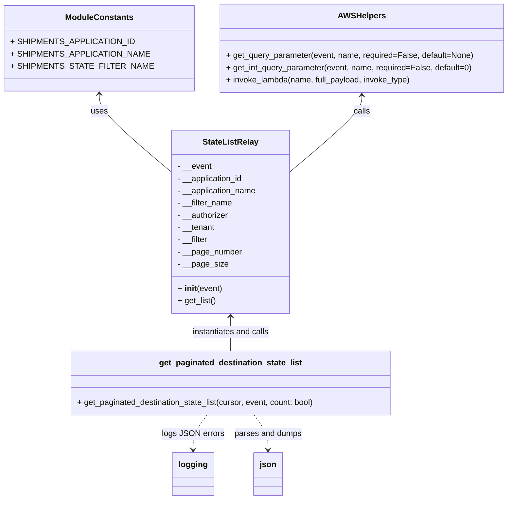

# Diagram: shipment_core/shipment_service/shipment_service/ng_shipments/ng_get_destination_state.py


> Auto-generated by Obscura crawlers

## Diagram 1



### SVG

<svg id="container" width="954.890625" xmlns="http://www.w3.org/2000/svg" class="classDiagram" height="982" viewBox="0 0 954.890625 982" role="graphics-document document" aria-roledescription="class"><style>#container{font-family:"trebuchet ms",verdana,arial,sans-serif;font-size:16px;fill:#333;}@keyframes edge-animation-frame{from{stroke-dashoffset:0;}}@keyframes dash{to{stroke-dashoffset:0;}}#container .edge-animation-slow{stroke-dasharray:9,5!important;stroke-dashoffset:900;animation:dash 50s linear infinite;stroke-linecap:round;}#container .edge-animation-fast{stroke-dasharray:9,5!important;stroke-dashoffset:900;animation:dash 20s linear infinite;stroke-linecap:round;}#container .error-icon{fill:#552222;}#container .error-text{fill:#552222;stroke:#552222;}#container .edge-thickness-normal{stroke-width:1px;}#container .edge-thickness-thick{stroke-width:3.5px;}#container .edge-pattern-solid{stroke-dasharray:0;}#container .edge-thickness-invisible{stroke-width:0;fill:none;}#container .edge-pattern-dashed{stroke-dasharray:3;}#container .edge-pattern-dotted{stroke-dasharray:2;}#container .marker{fill:#333333;stroke:#333333;}#container .marker.cross{stroke:#333333;}#container svg{font-family:"trebuchet ms",verdana,arial,sans-serif;font-size:16px;}#container p{margin:0;}#container g.classGroup text{fill:#9370DB;stroke:none;font-family:"trebuchet ms",verdana,arial,sans-serif;font-size:10px;}#container g.classGroup text .title{font-weight:bolder;}#container .nodeLabel,#container .edgeLabel{color:#131300;}#container .edgeLabel .label rect{fill:#ECECFF;}#container .label text{fill:#131300;}#container .labelBkg{background:#ECECFF;}#container .edgeLabel .label span{background:#ECECFF;}#container .classTitle{font-weight:bolder;}#container .node rect,#container .node circle,#container .node ellipse,#container .node polygon,#container .node path{fill:#ECECFF;stroke:#9370DB;stroke-width:1px;}#container .divider{stroke:#9370DB;stroke-width:1;}#container g.clickable{cursor:pointer;}#container g.classGroup rect{fill:#ECECFF;stroke:#9370DB;}#container g.classGroup line{stroke:#9370DB;stroke-width:1;}#container .classLabel .box{stroke:none;stroke-width:0;fill:#ECECFF;opacity:0.5;}#container .classLabel .label{fill:#9370DB;font-size:10px;}#container .relation{stroke:#333333;stroke-width:1;fill:none;}#container .dashed-line{stroke-dasharray:3;}#container .dotted-line{stroke-dasharray:1 2;}#container #compositionStart,#container .composition{fill:#333333!important;stroke:#333333!important;stroke-width:1;}#container #compositionEnd,#container .composition{fill:#333333!important;stroke:#333333!important;stroke-width:1;}#container #dependencyStart,#container .dependency{fill:#333333!important;stroke:#333333!important;stroke-width:1;}#container #dependencyStart,#container .dependency{fill:#333333!important;stroke:#333333!important;stroke-width:1;}#container #extensionStart,#container .extension{fill:transparent!important;stroke:#333333!important;stroke-width:1;}#container #extensionEnd,#container .extension{fill:transparent!important;stroke:#333333!important;stroke-width:1;}#container #aggregationStart,#container .aggregation{fill:transparent!important;stroke:#333333!important;stroke-width:1;}#container #aggregationEnd,#container .aggregation{fill:transparent!important;stroke:#333333!important;stroke-width:1;}#container #lollipopStart,#container .lollipop{fill:#ECECFF!important;stroke:#333333!important;stroke-width:1;}#container #lollipopEnd,#container .lollipop{fill:#ECECFF!important;stroke:#333333!important;stroke-width:1;}#container .edgeTerminals{font-size:11px;line-height:initial;}#container .classTitleText{text-anchor:middle;font-size:18px;fill:#333;}#container .label-icon{display:inline-block;height:1em;overflow:visible;vertical-align:-0.125em;}#container .node .label-icon path{fill:currentColor;stroke:revert;stroke-width:revert;}#container :root{--mermaid-font-family:"trebuchet ms",verdana,arial,sans-serif;}</style><g><defs><marker id="container_class-aggregationStart" class="marker aggregation class" refX="18" refY="7" markerWidth="190" markerHeight="240" orient="auto"><path d="M 18,7 L9,13 L1,7 L9,1 Z"></path></marker></defs><defs><marker id="container_class-aggregationEnd" class="marker aggregation class" refX="1" refY="7" markerWidth="20" markerHeight="28" orient="auto"><path d="M 18,7 L9,13 L1,7 L9,1 Z"></path></marker></defs><defs><marker id="container_class-extensionStart" class="marker extension class" refX="18" refY="7" markerWidth="190" markerHeight="240" orient="auto"><path d="M 1,7 L18,13 V 1 Z"></path></marker></defs><defs><marker id="container_class-extensionEnd" class="marker extension class" refX="1" refY="7" markerWidth="20" markerHeight="28" orient="auto"><path d="M 1,1 V 13 L18,7 Z"></path></marker></defs><defs><marker id="container_class-compositionStart" class="marker composition class" refX="18" refY="7" markerWidth="190" markerHeight="240" orient="auto"><path d="M 18,7 L9,13 L1,7 L9,1 Z"></path></marker></defs><defs><marker id="container_class-compositionEnd" class="marker composition class" refX="1" refY="7" markerWidth="20" markerHeight="28" orient="auto"><path d="M 18,7 L9,13 L1,7 L9,1 Z"></path></marker></defs><defs><marker id="container_class-dependencyStart" class="marker dependency class" refX="6" refY="7" markerWidth="190" markerHeight="240" orient="auto"><path d="M 5,7 L9,13 L1,7 L9,1 Z"></path></marker></defs><defs><marker id="container_class-dependencyEnd" class="marker dependency class" refX="13" refY="7" markerWidth="20" markerHeight="28" orient="auto"><path d="M 18,7 L9,13 L14,7 L9,1 Z"></path></marker></defs><defs><marker id="container_class-lollipopStart" class="marker lollipop class" refX="13" refY="7" markerWidth="190" markerHeight="240" orient="auto"><circle stroke="black" fill="transparent" cx="7" cy="7" r="6"></circle></marker></defs><defs><marker id="container_class-lollipopEnd" class="marker lollipop class" refX="1" refY="7" markerWidth="190" markerHeight="240" orient="auto"><circle stroke="black" fill="transparent" cx="7" cy="7" r="6"></circle></marker></defs><g class="root"><g class="clusters"></g><g class="edgePaths"><path d="M174.82,185L174.82,190.667C174.82,196.333,174.82,207.667,196.491,232.355C218.161,257.043,261.503,295.085,283.173,314.107L304.844,333.128" id="id_ModuleConstants_StateListRelay_1" class="edge-thickness-normal edge-pattern-solid relation" style=";;;" data-edge="true" data-et="edge" data-id="id_ModuleConstants_StateListRelay_1" data-points="W3sieCI6MTc0LjgyMDMxMjUsInkiOjE3OX0seyJ4IjoxNzQuODIwMzEyNSwieSI6MjE5fSx7IngiOjMwNC44NDM3NSwieSI6MzMzLjEyODIzNzEzNDQxNTE0fV0=" marker-start="url(#container_class-dependencyStart)"></path><path d="M669.266,188L669.266,193.167C669.266,198.333,669.266,208.667,647.595,232.855C625.924,257.043,582.583,295.085,560.913,314.107L539.242,333.128" id="id_AWSHelpers_StateListRelay_2" class="edge-thickness-normal edge-pattern-solid relation" style=";;;" data-edge="true" data-et="edge" data-id="id_AWSHelpers_StateListRelay_2" data-points="W3sieCI6NjY5LjI2NTYyNSwieSI6MTgyfSx7IngiOjY2OS4yNjU2MjUsInkiOjIxOX0seyJ4Ijo1MzkuMjQyMTg3NSwieSI6MzMzLjEyODIzNzEzNDQxNTE0fV0=" marker-start="url(#container_class-dependencyStart)"></path><path d="M422.043,622L422.043,627.167C422.043,632.333,422.043,642.667,422.043,654C422.043,665.333,422.043,677.667,422.043,683.833L422.043,690" id="id_StateListRelay_get_paginated_destination_state_list_3" class="edge-thickness-normal edge-pattern-solid relation" style=";;;" data-edge="true" data-et="edge" data-id="id_StateListRelay_get_paginated_destination_state_list_3" data-points="W3sieCI6NDIyLjA0Mjk2ODc1LCJ5Ijo2MTZ9LHsieCI6NDIyLjA0Mjk2ODc1LCJ5Ijo2NTN9LHsieCI6NDIyLjA0Mjk2ODc1LCJ5Ijo2OTB9XQ==" marker-start="url(#container_class-dependencyStart)"></path><path d="M376.302,816L371.824,822.167C367.347,828.333,358.392,840.667,353.915,852C349.438,863.333,349.438,873.667,349.438,878.833L349.438,884" id="id_get_paginated_destination_state_list_logging_4" class="edge-thickness-normal edge-pattern-dashed relation" style=";;;" data-edge="true" data-et="edge" data-id="id_get_paginated_destination_state_list_logging_4" data-points="W3sieCI6Mzc2LjMwMTUyMzQzNzUsInkiOjgxNn0seyJ4IjozNDkuNDM3NSwieSI6ODUzfSx7IngiOjM0OS40Mzc1LCJ5Ijo4OTB9XQ==" marker-end="url(#container_class-dependencyEnd)"></path><path d="M467.784,816L472.262,822.167C476.739,828.333,485.694,840.667,490.171,852C494.648,863.333,494.648,873.667,494.648,878.833L494.648,884" id="id_get_paginated_destination_state_list_json_5" class="edge-thickness-normal edge-pattern-dashed relation" style=";;;" data-edge="true" data-et="edge" data-id="id_get_paginated_destination_state_list_json_5" data-points="W3sieCI6NDY3Ljc4NDQxNDA2MjUsInkiOjgxNn0seyJ4Ijo0OTQuNjQ4NDM3NSwieSI6ODUzfSx7IngiOjQ5NC42NDg0Mzc1LCJ5Ijo4OTB9XQ==" marker-end="url(#container_class-dependencyEnd)"></path></g><g class="edgeLabels"><g class="edgeLabel" transform="translate(174.8203125, 219)"><g class="label" data-id="id_ModuleConstants_StateListRelay_1" transform="translate(-16.4921875, -12)"><foreignObject width="32.984375" height="24"><div xmlns="http://www.w3.org/1999/xhtml" class="labelBkg" style="display: table-cell; white-space: nowrap; line-height: 1.5; max-width: 200px; text-align: center;"><span class="edgeLabel"><p>uses</p></span></div></foreignObject></g></g><g class="edgeLabel" transform="translate(669.265625, 219)"><g class="label" data-id="id_AWSHelpers_StateListRelay_2" transform="translate(-16.4453125, -12)"><foreignObject width="32.890625" height="24"><div xmlns="http://www.w3.org/1999/xhtml" class="labelBkg" style="display: table-cell; white-space: nowrap; line-height: 1.5; max-width: 200px; text-align: center;"><span class="edgeLabel"><p>calls</p></span></div></foreignObject></g></g><g class="edgeLabel" transform="translate(422.04296875, 653)"><g class="label" data-id="id_StateListRelay_get_paginated_destination_state_list_3" transform="translate(-77.421875, -12)"><foreignObject width="154.84375" height="24"><div xmlns="http://www.w3.org/1999/xhtml" class="labelBkg" style="display: table-cell; white-space: nowrap; line-height: 1.5; max-width: 200px; text-align: center;"><span class="edgeLabel"><p>instantiates and calls</p></span></div></foreignObject></g></g><g class="edgeLabel" transform="translate(349.4375, 853)"><g class="label" data-id="id_get_paginated_destination_state_list_logging_4" transform="translate(-58.53125, -12)"><foreignObject width="117.0625" height="24"><div xmlns="http://www.w3.org/1999/xhtml" class="labelBkg" style="display: table-cell; white-space: nowrap; line-height: 1.5; max-width: 200px; text-align: center;"><span class="edgeLabel"><p>logs JSON errors</p></span></div></foreignObject></g></g><g class="edgeLabel" transform="translate(494.6484375, 853)"><g class="label" data-id="id_get_paginated_destination_state_list_json_5" transform="translate(-66.6796875, -12)"><foreignObject width="133.359375" height="24"><div xmlns="http://www.w3.org/1999/xhtml" class="labelBkg" style="display: table-cell; white-space: nowrap; line-height: 1.5; max-width: 200px; text-align: center;"><span class="edgeLabel"><p>parses and dumps</p></span></div></foreignObject></g></g></g><g class="nodes"><g class="node default" id="classId-StateListRelay-0" transform="translate(422.04296875, 436)"><g class="basic label-container"><path d="M-117.19921875 -180 L117.19921875 -180 L117.19921875 180 L-117.19921875 180" stroke="none" stroke-width="0" fill="#ECECFF" style=""></path><path d="M-117.19921875 -180 C-64.40681218438854 -180, -11.614405618777084 -180, 117.19921875 -180 M-117.19921875 -180 C-54.72439794643951 -180, 7.750422857120981 -180, 117.19921875 -180 M117.19921875 -180 C117.19921875 -91.67762136019586, 117.19921875 -3.355242720391715, 117.19921875 180 M117.19921875 -180 C117.19921875 -89.16451201504574, 117.19921875 1.6709759699085112, 117.19921875 180 M117.19921875 180 C63.528544886486706 180, 9.857871022973413 180, -117.19921875 180 M117.19921875 180 C46.58108236041403 180, -24.03705402917194 180, -117.19921875 180 M-117.19921875 180 C-117.19921875 90.86771943704262, -117.19921875 1.735438874085247, -117.19921875 -180 M-117.19921875 180 C-117.19921875 66.05090141593115, -117.19921875 -47.8981971681377, -117.19921875 -180" stroke="#9370DB" stroke-width="1.3" fill="none" stroke-dasharray="0 0" style=""></path></g><g class="annotation-group text" transform="translate(0, -156)"></g><g class="label-group text" transform="translate(-52.6015625, -156)"><g class="label" style="font-weight: bolder" transform="translate(0,-12)"><foreignObject width="105.203125" height="24"><div xmlns="http://www.w3.org/1999/xhtml" style="display: table-cell; white-space: nowrap; line-height: 1.5; max-width: 152px; text-align: center;"><span class="nodeLabel markdown-node-label" style=""><p>StateListRelay</p></span></div></foreignObject></g></g><g class="members-group text" transform="translate(-105.19921875, -108)"><g class="label" style="" transform="translate(0,-12)"><foreignObject width="67.1875" height="24"><div xmlns="http://www.w3.org/1999/xhtml" style="display: table-cell; white-space: nowrap; line-height: 1.5; max-width: 125px; text-align: center;"><span class="nodeLabel markdown-node-label" style=""><p>- __event</p></span></div></foreignObject></g><g class="label" style="" transform="translate(0,12)"><foreignObject width="131.375" height="24"><div xmlns="http://www.w3.org/1999/xhtml" style="display: table-cell; white-space: nowrap; line-height: 1.5; max-width: 189px; text-align: center;"><span class="nodeLabel markdown-node-label" style=""><p>- __application_id</p></span></div></foreignObject></g><g class="label" style="" transform="translate(0,36)"><foreignObject width="157.796875" height="24"><div xmlns="http://www.w3.org/1999/xhtml" style="display: table-cell; white-space: nowrap; line-height: 1.5; max-width: 215px; text-align: center;"><span class="nodeLabel markdown-node-label" style=""><p>- __application_name</p></span></div></foreignObject></g><g class="label" style="" transform="translate(0,60)"><foreignObject width="108.734375" height="24"><div xmlns="http://www.w3.org/1999/xhtml" style="display: table-cell; white-space: nowrap; line-height: 1.5; max-width: 166px; text-align: center;"><span class="nodeLabel markdown-node-label" style=""><p>- __filter_name</p></span></div></foreignObject></g><g class="label" style="" transform="translate(0,84)"><foreignObject width="101.828125" height="24"><div xmlns="http://www.w3.org/1999/xhtml" style="display: table-cell; white-space: nowrap; line-height: 1.5; max-width: 160px; text-align: center;"><span class="nodeLabel markdown-node-label" style=""><p>- __authorizer</p></span></div></foreignObject></g><g class="label" style="" transform="translate(0,108)"><foreignObject width="74.34375" height="24"><div xmlns="http://www.w3.org/1999/xhtml" style="display: table-cell; white-space: nowrap; line-height: 1.5; max-width: 132px; text-align: center;"><span class="nodeLabel markdown-node-label" style=""><p>- __tenant</p></span></div></foreignObject></g><g class="label" style="" transform="translate(0,132)"><foreignObject width="61.171875" height="24"><div xmlns="http://www.w3.org/1999/xhtml" style="display: table-cell; white-space: nowrap; line-height: 1.5; max-width: 119px; text-align: center;"><span class="nodeLabel markdown-node-label" style=""><p>- __filter</p></span></div></foreignObject></g><g class="label" style="" transform="translate(0,156)"><foreignObject width="126.640625" height="24"><div xmlns="http://www.w3.org/1999/xhtml" style="display: table-cell; white-space: nowrap; line-height: 1.5; max-width: 185px; text-align: center;"><span class="nodeLabel markdown-node-label" style=""><p>- __page_number</p></span></div></foreignObject></g><g class="label" style="" transform="translate(0,180)"><foreignObject width="97.4375" height="24"><div xmlns="http://www.w3.org/1999/xhtml" style="display: table-cell; white-space: nowrap; line-height: 1.5; max-width: 155px; text-align: center;"><span class="nodeLabel markdown-node-label" style=""><p>- __page_size</p></span></div></foreignObject></g></g><g class="methods-group text" transform="translate(-105.19921875, 132)"><g class="label" style="" transform="translate(0,-12)"><foreignObject width="87.390625" height="24"><div xmlns="http://www.w3.org/1999/xhtml" style="display: table-cell; white-space: nowrap; line-height: 1.5; max-width: 177px; text-align: center;"><span class="nodeLabel markdown-node-label" style=""><p>+ <strong>init</strong>(event)</p></span></div></foreignObject></g><g class="label" style="" transform="translate(0,12)"><foreignObject width="75.765625" height="24"><div xmlns="http://www.w3.org/1999/xhtml" style="display: table-cell; white-space: nowrap; line-height: 1.5; max-width: 133px; text-align: center;"><span class="nodeLabel markdown-node-label" style=""><p>+ get_list()</p></span></div></foreignObject></g></g><g class="divider" style=""><path d="M-117.19921875 -132 C-34.359567323373184 -132, 48.48008410325363 -132, 117.19921875 -132 M-117.19921875 -132 C-55.083767065784905 -132, 7.031684618430191 -132, 117.19921875 -132" stroke="#9370DB" stroke-width="1.3" fill="none" stroke-dasharray="0 0" style=""></path></g><g class="divider" style=""><path d="M-117.19921875 108 C-64.87100563575558 108, -12.54279252151116 108, 117.19921875 108 M-117.19921875 108 C-57.20370453327948 108, 2.791809683441045 108, 117.19921875 108" stroke="#9370DB" stroke-width="1.3" fill="none" stroke-dasharray="0 0" style=""></path></g></g><g class="node default" id="classId-ModuleConstants-1" transform="translate(174.8203125, 95)"><g class="basic label-container"><path d="M-166.8203125 -84 L166.8203125 -84 L166.8203125 84 L-166.8203125 84" stroke="none" stroke-width="0" fill="#ECECFF" style=""></path><path d="M-166.8203125 -84 C-70.14697277898154 -84, 26.52636694203693 -84, 166.8203125 -84 M-166.8203125 -84 C-94.93190294013684 -84, -23.043493380273674 -84, 166.8203125 -84 M166.8203125 -84 C166.8203125 -48.94507774924065, 166.8203125 -13.890155498481306, 166.8203125 84 M166.8203125 -84 C166.8203125 -18.336714847279524, 166.8203125 47.32657030544095, 166.8203125 84 M166.8203125 84 C75.19318438768168 84, -16.433943724636634 84, -166.8203125 84 M166.8203125 84 C68.37602332092685 84, -30.068265858146304 84, -166.8203125 84 M-166.8203125 84 C-166.8203125 23.46055197259294, -166.8203125 -37.07889605481412, -166.8203125 -84 M-166.8203125 84 C-166.8203125 20.953898206534035, -166.8203125 -42.09220358693193, -166.8203125 -84" stroke="#9370DB" stroke-width="1.3" fill="none" stroke-dasharray="0 0" style=""></path></g><g class="annotation-group text" transform="translate(0, -60)"></g><g class="label-group text" transform="translate(-63.625, -60)"><g class="label" style="font-weight: bolder" transform="translate(0,-12)"><foreignObject width="127.25" height="24"><div xmlns="http://www.w3.org/1999/xhtml" style="display: table-cell; white-space: nowrap; line-height: 1.5; max-width: 176px; text-align: center;"><span class="nodeLabel markdown-node-label" style=""><p>ModuleConstants</p></span></div></foreignObject></g></g><g class="members-group text" transform="translate(-154.8203125, -12)"><g class="label" style="" transform="translate(0,-12)"><foreignObject width="217.921875" height="24"><div xmlns="http://www.w3.org/1999/xhtml" style="display: table-cell; white-space: nowrap; line-height: 1.5; max-width: 275px; text-align: center;"><span class="nodeLabel markdown-node-label" style=""><p>+ SHIPMENTS_APPLICATION_ID</p></span></div></foreignObject></g><g class="label" style="" transform="translate(0,12)"><foreignObject width="244.015625" height="24"><div xmlns="http://www.w3.org/1999/xhtml" style="display: table-cell; white-space: nowrap; line-height: 1.5; max-width: 301px; text-align: center;"><span class="nodeLabel markdown-node-label" style=""><p>+ SHIPMENTS_APPLICATION_NAME</p></span></div></foreignObject></g><g class="label" style="" transform="translate(0,36)"><foreignObject width="246.015625" height="24"><div xmlns="http://www.w3.org/1999/xhtml" style="display: table-cell; white-space: nowrap; line-height: 1.5; max-width: 303px; text-align: center;"><span class="nodeLabel markdown-node-label" style=""><p>+ SHIPMENTS_STATE_FILTER_NAME</p></span></div></foreignObject></g></g><g class="methods-group text" transform="translate(-154.8203125, 84)"></g><g class="divider" style=""><path d="M-166.8203125 -36 C-66.97295907359556 -36, 32.87439435280888 -36, 166.8203125 -36 M-166.8203125 -36 C-63.69864471671313 -36, 39.423023066573734 -36, 166.8203125 -36" stroke="#9370DB" stroke-width="1.3" fill="none" stroke-dasharray="0 0" style=""></path></g><g class="divider" style=""><path d="M-166.8203125 60 C-98.5918482249911 60, -30.363383949982193 60, 166.8203125 60 M-166.8203125 60 C-35.41796430102326 60, 95.98438389795348 60, 166.8203125 60" stroke="#9370DB" stroke-width="1.3" fill="none" stroke-dasharray="0 0" style=""></path></g></g><g class="node default" id="classId-AWSHelpers-2" transform="translate(669.265625, 95)"><g class="basic label-container"><path d="M-277.625 -87 L277.625 -87 L277.625 87 L-277.625 87" stroke="none" stroke-width="0" fill="#ECECFF" style=""></path><path d="M-277.625 -87 C-140.67693681065282 -87, -3.728873621305638 -87, 277.625 -87 M-277.625 -87 C-94.81506820006908 -87, 87.99486359986184 -87, 277.625 -87 M277.625 -87 C277.625 -43.93573774511695, 277.625 -0.8714754902339052, 277.625 87 M277.625 -87 C277.625 -17.521802734047412, 277.625 51.956394531905175, 277.625 87 M277.625 87 C141.18708079897254 87, 4.74916159794509 87, -277.625 87 M277.625 87 C91.8177409028684 87, -93.98951819426321 87, -277.625 87 M-277.625 87 C-277.625 44.284376901215985, -277.625 1.5687538024319707, -277.625 -87 M-277.625 87 C-277.625 23.827562086857533, -277.625 -39.344875826284934, -277.625 -87" stroke="#9370DB" stroke-width="1.3" fill="none" stroke-dasharray="0 0" style=""></path></g><g class="annotation-group text" transform="translate(0, -63)"></g><g class="label-group text" transform="translate(-44.28125, -63)"><g class="label" style="font-weight: bolder" transform="translate(0,-12)"><foreignObject width="88.5625" height="24"><div xmlns="http://www.w3.org/1999/xhtml" style="display: table-cell; white-space: nowrap; line-height: 1.5; max-width: 137px; text-align: center;"><span class="nodeLabel markdown-node-label" style=""><p>AWSHelpers</p></span></div></foreignObject></g></g><g class="members-group text" transform="translate(-265.625, -15)"></g><g class="methods-group text" transform="translate(-265.625, 15)"><g class="label" style="" transform="translate(0,-12)"><foreignObject width="486.96875" height="24"><div xmlns="http://www.w3.org/1999/xhtml" style="display: table-cell; white-space: nowrap; line-height: 1.5; max-width: 544px; text-align: center;"><span class="nodeLabel markdown-node-label" style=""><p>+ get_query_parameter(event, name, required=False, default=None)</p></span></div></foreignObject></g><g class="label" style="" transform="translate(0,12)"><foreignObject width="485.515625" height="24"><div xmlns="http://www.w3.org/1999/xhtml" style="display: table-cell; white-space: nowrap; line-height: 1.5; max-width: 543px; text-align: center;"><span class="nodeLabel markdown-node-label" style=""><p>+ get_int_query_parameter(event, name, required=False, default=0)</p></span></div></foreignObject></g><g class="label" style="" transform="translate(0,36)"><foreignObject width="366.734375" height="24"><div xmlns="http://www.w3.org/1999/xhtml" style="display: table-cell; white-space: nowrap; line-height: 1.5; max-width: 424px; text-align: center;"><span class="nodeLabel markdown-node-label" style=""><p>+ invoke_lambda(name, full_payload, invoke_type)</p></span></div></foreignObject></g></g><g class="divider" style=""><path d="M-277.625 -39 C-121.15387654115736 -39, 35.31724691768528 -39, 277.625 -39 M-277.625 -39 C-152.75653720026227 -39, -27.888074400524545 -39, 277.625 -39" stroke="#9370DB" stroke-width="1.3" fill="none" stroke-dasharray="0 0" style=""></path></g><g class="divider" style=""><path d="M-277.625 -15 C-135.741550064346 -15, 6.141899871307999 -15, 277.625 -15 M-277.625 -15 C-76.1292484683525 -15, 125.366503063295 -15, 277.625 -15" stroke="#9370DB" stroke-width="1.3" fill="none" stroke-dasharray="0 0" style=""></path></g></g><g class="node default" id="classId-get_paginated_destination_state_list-3" transform="translate(422.04296875, 753)"><g class="basic label-container"><path d="M-318.078125 -63 L318.078125 -63 L318.078125 63 L-318.078125 63" stroke="none" stroke-width="0" fill="#ECECFF" style=""></path><path d="M-318.078125 -63 C-97.33474711707444 -63, 123.40863076585111 -63, 318.078125 -63 M-318.078125 -63 C-135.01690621329578 -63, 48.04431257340843 -63, 318.078125 -63 M318.078125 -63 C318.078125 -33.175645106321134, 318.078125 -3.351290212642269, 318.078125 63 M318.078125 -63 C318.078125 -25.338769747380475, 318.078125 12.32246050523905, 318.078125 63 M318.078125 63 C128.82988861342398 63, -60.41834777315205 63, -318.078125 63 M318.078125 63 C176.83304780599204 63, 35.587970611984076 63, -318.078125 63 M-318.078125 63 C-318.078125 35.582188467298295, -318.078125 8.164376934596582, -318.078125 -63 M-318.078125 63 C-318.078125 24.585683899740857, -318.078125 -13.828632200518285, -318.078125 -63" stroke="#9370DB" stroke-width="1.3" fill="none" stroke-dasharray="0 0" style=""></path></g><g class="annotation-group text" transform="translate(0, -39)"></g><g class="label-group text" transform="translate(-137.046875, -39)"><g class="label" style="font-weight: bolder" transform="translate(0,-12)"><foreignObject width="274.09375" height="24"><div xmlns="http://www.w3.org/1999/xhtml" style="display: table-cell; white-space: nowrap; line-height: 1.5; max-width: 320px; text-align: center;"><span class="nodeLabel markdown-node-label" style=""><p>get_paginated_destination_state_list</p></span></div></foreignObject></g></g><g class="members-group text" transform="translate(-306.078125, 9)"></g><g class="methods-group text" transform="translate(-306.078125, 39)"><g class="label" style="" transform="translate(0,-12)"><foreignObject width="475.109375" height="24"><div xmlns="http://www.w3.org/1999/xhtml" style="display: table-cell; white-space: nowrap; line-height: 1.5; max-width: 532px; text-align: center;"><span class="nodeLabel markdown-node-label" style=""><p>+ get_paginated_destination_state_list(cursor, event, count: bool)</p></span></div></foreignObject></g></g><g class="divider" style=""><path d="M-318.078125 -15 C-173.99435154108266 -15, -29.91057808216533 -15, 318.078125 -15 M-318.078125 -15 C-138.08146104285908 -15, 41.91520291428185 -15, 318.078125 -15" stroke="#9370DB" stroke-width="1.3" fill="none" stroke-dasharray="0 0" style=""></path></g><g class="divider" style=""><path d="M-318.078125 9 C-123.04945946179126 9, 71.97920607641748 9, 318.078125 9 M-318.078125 9 C-172.8823178145331 9, -27.68651062906622 9, 318.078125 9" stroke="#9370DB" stroke-width="1.3" fill="none" stroke-dasharray="0 0" style=""></path></g></g><g class="node default" id="classId-logging-4" transform="translate(349.4375, 932)"><g class="basic label-container"><path d="M-39.109375 -42 L39.109375 -42 L39.109375 42 L-39.109375 42" stroke="none" stroke-width="0" fill="#ECECFF" style=""></path><path d="M-39.109375 -42 C-18.00234959279755 -42, 3.1046758144048994 -42, 39.109375 -42 M-39.109375 -42 C-16.08812801560828 -42, 6.93311896878344 -42, 39.109375 -42 M39.109375 -42 C39.109375 -9.291316410984258, 39.109375 23.417367178031483, 39.109375 42 M39.109375 -42 C39.109375 -19.539439469083234, 39.109375 2.9211210618335315, 39.109375 42 M39.109375 42 C18.424937252414306 42, -2.2595004951713875 42, -39.109375 42 M39.109375 42 C11.557493088665542 42, -15.994388822668917 42, -39.109375 42 M-39.109375 42 C-39.109375 16.483316529429707, -39.109375 -9.033366941140585, -39.109375 -42 M-39.109375 42 C-39.109375 11.449664798922587, -39.109375 -19.100670402154826, -39.109375 -42" stroke="#9370DB" stroke-width="1.3" fill="none" stroke-dasharray="0 0" style=""></path></g><g class="annotation-group text" transform="translate(0, -18)"></g><g class="label-group text" transform="translate(-27.109375, -18)"><g class="label" style="font-weight: bolder" transform="translate(0,-12)"><foreignObject width="54.21875" height="24"><div xmlns="http://www.w3.org/1999/xhtml" style="display: table-cell; white-space: nowrap; line-height: 1.5; max-width: 103px; text-align: center;"><span class="nodeLabel markdown-node-label" style=""><p>logging</p></span></div></foreignObject></g></g><g class="members-group text" transform="translate(-27.109375, 30)"></g><g class="methods-group text" transform="translate(-27.109375, 60)"></g><g class="divider" style=""><path d="M-39.109375 6 C-10.50564463287144 6, 18.09808573425712 6, 39.109375 6 M-39.109375 6 C-12.734125340727093 6, 13.641124318545813 6, 39.109375 6" stroke="#9370DB" stroke-width="1.3" fill="none" stroke-dasharray="0 0" style=""></path></g><g class="divider" style=""><path d="M-39.109375 24 C-20.73198109657061 24, -2.354587193141221 24, 39.109375 24 M-39.109375 24 C-21.64155575803488 24, -4.173736516069759 24, 39.109375 24" stroke="#9370DB" stroke-width="1.3" fill="none" stroke-dasharray="0 0" style=""></path></g></g><g class="node default" id="classId-json-5" transform="translate(494.6484375, 932)"><g class="basic label-container"><path d="M-27.40625 -42 L27.40625 -42 L27.40625 42 L-27.40625 42" stroke="none" stroke-width="0" fill="#ECECFF" style=""></path><path d="M-27.40625 -42 C-15.309882140597221 -42, -3.213514281194442 -42, 27.40625 -42 M-27.40625 -42 C-12.510946290107606 -42, 2.384357419784788 -42, 27.40625 -42 M27.40625 -42 C27.40625 -23.081907811276714, 27.40625 -4.163815622553429, 27.40625 42 M27.40625 -42 C27.40625 -12.55959520899518, 27.40625 16.88080958200964, 27.40625 42 M27.40625 42 C6.453442761237188 42, -14.499364477525624 42, -27.40625 42 M27.40625 42 C15.527058452042281 42, 3.6478669040845624 42, -27.40625 42 M-27.40625 42 C-27.40625 12.406789615698639, -27.40625 -17.186420768602723, -27.40625 -42 M-27.40625 42 C-27.40625 13.838950517741896, -27.40625 -14.322098964516208, -27.40625 -42" stroke="#9370DB" stroke-width="1.3" fill="none" stroke-dasharray="0 0" style=""></path></g><g class="annotation-group text" transform="translate(0, -18)"></g><g class="label-group text" transform="translate(-15.40625, -18)"><g class="label" style="font-weight: bolder" transform="translate(0,-12)"><foreignObject width="30.8125" height="24"><div xmlns="http://www.w3.org/1999/xhtml" style="display: table-cell; white-space: nowrap; line-height: 1.5; max-width: 82px; text-align: center;"><span class="nodeLabel markdown-node-label" style=""><p>json</p></span></div></foreignObject></g></g><g class="members-group text" transform="translate(-15.40625, 30)"></g><g class="methods-group text" transform="translate(-15.40625, 60)"></g><g class="divider" style=""><path d="M-27.40625 6 C-8.143005613921943 6, 11.120238772156114 6, 27.40625 6 M-27.40625 6 C-8.475141593546038 6, 10.455966812907924 6, 27.40625 6" stroke="#9370DB" stroke-width="1.3" fill="none" stroke-dasharray="0 0" style=""></path></g><g class="divider" style=""><path d="M-27.40625 24 C-13.252026280735674 24, 0.9021974385286526 24, 27.40625 24 M-27.40625 24 C-13.078564630755674 24, 1.249120738488653 24, 27.40625 24" stroke="#9370DB" stroke-width="1.3" fill="none" stroke-dasharray="0 0" style=""></path></g></g></g></g></g></svg>

## Diagram 2

```mermaid
sequenceDiagram
    participant Caller as get_paginated_destination_state_list
    participant Relay as StateListRelay
    participant Lambda as "get-filter-list (lambda)"
    participant CallerLocal as Caller (parsing)
    participant Logger as logging
    Caller->>Relay: StateListRelay(event)
    Relay->>Lambda: invoke_lambda("get-filter-list", full_payload=event, invoke_type="RequestResponse")
    Lambda-->>Relay: response
    Relay-->>Caller: response
    Caller->>CallerLocal: body = json.loads(response.body)
    CallerLocal->>CallerLocal: meta = body.meta; states = body.destination_state
    loop for each state in states
        CallerLocal->>CallerLocal: try json.loads(state)
        alt parse success
            CallerLocal-->>CallerLocal: append parsed state
        else parse fails
            CallerLocal->>Logger: logging.error(JSONDecodeError or Exception)
        end
    end
    CallerLocal->>Caller: response.body = {"meta": meta, "destination_state": json_state}
    Caller-->>Caller: return response
```

> SVG rendering failed for this diagram.
