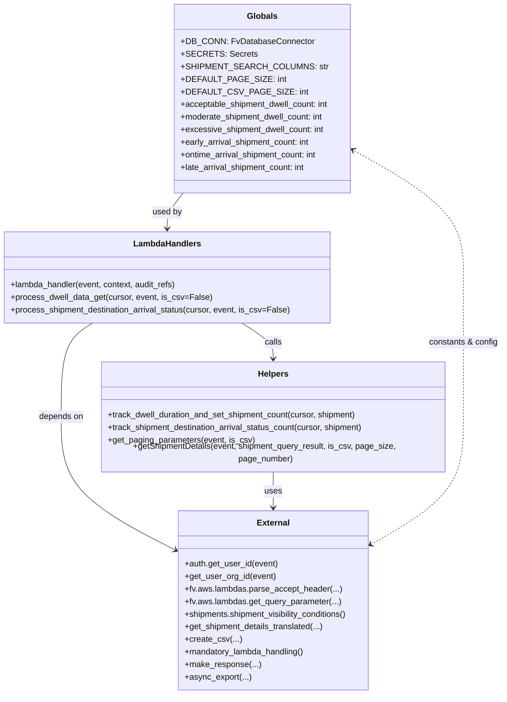

# Diagram: shipment_core/shipment_service/shipment_service/ng_shipments/ng_get_dwell_data.py


> Auto-generated by Obscura crawlers

## Diagram 1

```mermaid
flowchart TD
    A[lambda_handler(event, context, audit_refs)] --> B{establish DB_CONN}
    B --> C[DB_CONN.establish_connection()]
    C --> D{parse_accept_header VersionOptions.DwellData}
    D -->|requested_format & not CSV| E{path == /shipping-ng/dwell-data}
    E -->|yes| F[process_dwell_data_get(DB_CONN.cursor, event, False)]
    E -->|no| G[process_shipment_destination_arrival_status(DB_CONN.cursor, event, False)]
    D -->|is_csv & asyncExport| H[async_export(event, CSV_LAMBDAS.DWELL_SHIPMENTS)]
    D -->|is_csv & not asyncExport| I{path == /shipping-ng/dwell-data}
    I -->|yes| J[process_dwell_data_get(DB_CONN.cursor, event, True) -> make_response(..., content_type="text/csv")]
    I -->|no| K[process_shipment_destination_arrival_status(DB_CONN.cursor, event, True) -> make_response(..., content_type="text/csv")]
    F --> L[make_response(result)]
    G --> L
    H --> M[return async export response]
    J --> N[return CSV response]
    K --> N
```

> SVG rendering failed for this diagram.

## Diagram 2



### SVG

<svg id="container" width="966.666015625" xmlns="http://www.w3.org/2000/svg" class="classDiagram" height="1312" viewBox="0 0 966.666015625 1312" role="graphics-document document" aria-roledescription="class"><style>#container{font-family:"trebuchet ms",verdana,arial,sans-serif;font-size:16px;fill:#333;}@keyframes edge-animation-frame{from{stroke-dashoffset:0;}}@keyframes dash{to{stroke-dashoffset:0;}}#container .edge-animation-slow{stroke-dasharray:9,5!important;stroke-dashoffset:900;animation:dash 50s linear infinite;stroke-linecap:round;}#container .edge-animation-fast{stroke-dasharray:9,5!important;stroke-dashoffset:900;animation:dash 20s linear infinite;stroke-linecap:round;}#container .error-icon{fill:#552222;}#container .error-text{fill:#552222;stroke:#552222;}#container .edge-thickness-normal{stroke-width:1px;}#container .edge-thickness-thick{stroke-width:3.5px;}#container .edge-pattern-solid{stroke-dasharray:0;}#container .edge-thickness-invisible{stroke-width:0;fill:none;}#container .edge-pattern-dashed{stroke-dasharray:3;}#container .edge-pattern-dotted{stroke-dasharray:2;}#container .marker{fill:#333333;stroke:#333333;}#container .marker.cross{stroke:#333333;}#container svg{font-family:"trebuchet ms",verdana,arial,sans-serif;font-size:16px;}#container p{margin:0;}#container g.classGroup text{fill:#9370DB;stroke:none;font-family:"trebuchet ms",verdana,arial,sans-serif;font-size:10px;}#container g.classGroup text .title{font-weight:bolder;}#container .nodeLabel,#container .edgeLabel{color:#131300;}#container .edgeLabel .label rect{fill:#ECECFF;}#container .label text{fill:#131300;}#container .labelBkg{background:#ECECFF;}#container .edgeLabel .label span{background:#ECECFF;}#container .classTitle{font-weight:bolder;}#container .node rect,#container .node circle,#container .node ellipse,#container .node polygon,#container .node path{fill:#ECECFF;stroke:#9370DB;stroke-width:1px;}#container .divider{stroke:#9370DB;stroke-width:1;}#container g.clickable{cursor:pointer;}#container g.classGroup rect{fill:#ECECFF;stroke:#9370DB;}#container g.classGroup line{stroke:#9370DB;stroke-width:1;}#container .classLabel .box{stroke:none;stroke-width:0;fill:#ECECFF;opacity:0.5;}#container .classLabel .label{fill:#9370DB;font-size:10px;}#container .relation{stroke:#333333;stroke-width:1;fill:none;}#container .dashed-line{stroke-dasharray:3;}#container .dotted-line{stroke-dasharray:1 2;}#container #compositionStart,#container .composition{fill:#333333!important;stroke:#333333!important;stroke-width:1;}#container #compositionEnd,#container .composition{fill:#333333!important;stroke:#333333!important;stroke-width:1;}#container #dependencyStart,#container .dependency{fill:#333333!important;stroke:#333333!important;stroke-width:1;}#container #dependencyStart,#container .dependency{fill:#333333!important;stroke:#333333!important;stroke-width:1;}#container #extensionStart,#container .extension{fill:transparent!important;stroke:#333333!important;stroke-width:1;}#container #extensionEnd,#container .extension{fill:transparent!important;stroke:#333333!important;stroke-width:1;}#container #aggregationStart,#container .aggregation{fill:transparent!important;stroke:#333333!important;stroke-width:1;}#container #aggregationEnd,#container .aggregation{fill:transparent!important;stroke:#333333!important;stroke-width:1;}#container #lollipopStart,#container .lollipop{fill:#ECECFF!important;stroke:#333333!important;stroke-width:1;}#container #lollipopEnd,#container .lollipop{fill:#ECECFF!important;stroke:#333333!important;stroke-width:1;}#container .edgeTerminals{font-size:11px;line-height:initial;}#container .classTitleText{text-anchor:middle;font-size:18px;fill:#333;}#container .label-icon{display:inline-block;height:1em;overflow:visible;vertical-align:-0.125em;}#container .node .label-icon path{fill:currentColor;stroke:revert;stroke-width:revert;}#container :root{--mermaid-font-family:"trebuchet ms",verdana,arial,sans-serif;}</style><g><defs><marker id="container_class-aggregationStart" class="marker aggregation class" refX="18" refY="7" markerWidth="190" markerHeight="240" orient="auto"><path d="M 18,7 L9,13 L1,7 L9,1 Z"></path></marker></defs><defs><marker id="container_class-aggregationEnd" class="marker aggregation class" refX="1" refY="7" markerWidth="20" markerHeight="28" orient="auto"><path d="M 18,7 L9,13 L1,7 L9,1 Z"></path></marker></defs><defs><marker id="container_class-extensionStart" class="marker extension class" refX="18" refY="7" markerWidth="190" markerHeight="240" orient="auto"><path d="M 1,7 L18,13 V 1 Z"></path></marker></defs><defs><marker id="container_class-extensionEnd" class="marker extension class" refX="1" refY="7" markerWidth="20" markerHeight="28" orient="auto"><path d="M 1,1 V 13 L18,7 Z"></path></marker></defs><defs><marker id="container_class-compositionStart" class="marker composition class" refX="18" refY="7" markerWidth="190" markerHeight="240" orient="auto"><path d="M 18,7 L9,13 L1,7 L9,1 Z"></path></marker></defs><defs><marker id="container_class-compositionEnd" class="marker composition class" refX="1" refY="7" markerWidth="20" markerHeight="28" orient="auto"><path d="M 18,7 L9,13 L1,7 L9,1 Z"></path></marker></defs><defs><marker id="container_class-dependencyStart" class="marker dependency class" refX="6" refY="7" markerWidth="190" markerHeight="240" orient="auto"><path d="M 5,7 L9,13 L1,7 L9,1 Z"></path></marker></defs><defs><marker id="container_class-dependencyEnd" class="marker dependency class" refX="13" refY="7" markerWidth="20" markerHeight="28" orient="auto"><path d="M 18,7 L9,13 L14,7 L9,1 Z"></path></marker></defs><defs><marker id="container_class-lollipopStart" class="marker lollipop class" refX="13" refY="7" markerWidth="190" markerHeight="240" orient="auto"><circle stroke="black" fill="transparent" cx="7" cy="7" r="6"></circle></marker></defs><defs><marker id="container_class-lollipopEnd" class="marker lollipop class" refX="1" refY="7" markerWidth="190" markerHeight="240" orient="auto"><circle stroke="black" fill="transparent" cx="7" cy="7" r="6"></circle></marker></defs><g class="root"><g class="clusters"></g><g class="edgePaths"><path d="M350.394,368L345.175,374.167C339.956,380.333,329.517,392.667,324.298,404C319.078,415.333,319.078,425.667,319.078,430.833L319.078,436" id="id_Globals_LambdaHandlers_1" class="edge-thickness-normal edge-pattern-solid relation" style=";;;" data-edge="true" data-et="edge" data-id="id_Globals_LambdaHandlers_1" data-points="W3sieCI6MzUwLjM5NDQ1MDI0NDgxNTYzLCJ5IjozNjh9LHsieCI6MzE5LjA3ODEyNSwieSI6NDA1fSx7IngiOjMxOS4wNzgxMjUsInkiOjQ0Mn1d" marker-end="url(#container_class-dependencyEnd)"></path><path d="M463.006,616L473.208,622.167C483.41,628.333,503.813,640.667,514.015,652C524.217,663.333,524.217,673.667,524.217,678.833L524.217,684" id="id_LambdaHandlers_Helpers_2" class="edge-thickness-normal edge-pattern-solid relation" style=";;;" data-edge="true" data-et="edge" data-id="id_LambdaHandlers_Helpers_2" data-points="W3sieCI6NDYzLjAwNjA2NDEzODEwNDksInkiOjYxNn0seyJ4Ijo1MjQuMjE2Nzk2ODc1LCJ5Ijo2NTN9LHsieCI6NTI0LjIxNjc5Njg3NSwieSI6NjkwfV0=" marker-end="url(#container_class-dependencyEnd)"></path><path d="M175.15,616L164.948,622.167C154.747,628.333,134.343,640.667,124.141,669.5C113.939,698.333,113.939,743.667,113.939,789C113.939,834.333,113.939,879.667,150.267,920.75C186.594,961.834,259.249,998.668,295.577,1017.085L331.904,1035.503" id="id_LambdaHandlers_External_3" class="edge-thickness-normal edge-pattern-solid relation" style=";;;" data-edge="true" data-et="edge" data-id="id_LambdaHandlers_External_3" data-points="W3sieCI6MTc1LjE1MDE4NTg2MTg5NTE1LCJ5Ijo2MTZ9LHsieCI6MTEzLjkzOTQ1MzEyNSwieSI6NjUzfSx7IngiOjExMy45Mzk0NTMxMjUsInkiOjc4OX0seyJ4IjoxMTMuOTM5NDUzMTI1LCJ5Ijo5MjV9LHsieCI6MzM3LjI1NTg1OTM3NSwieSI6MTAzOC4yMTU2NDEwOTY0MzgzfV0=" marker-end="url(#container_class-dependencyEnd)"></path><path d="M524.217,888L524.217,894.167C524.217,900.333,524.217,912.667,524.217,924C524.217,935.333,524.217,945.667,524.217,950.833L524.217,956" id="id_Helpers_External_4" class="edge-thickness-normal edge-pattern-solid relation" style=";;;" data-edge="true" data-et="edge" data-id="id_Helpers_External_4" data-points="W3sieCI6NTI0LjIxNjc5Njg3NSwieSI6ODg4fSx7IngiOjUyNC4yMTY3OTY4NzUsInkiOjkyNX0seyJ4Ijo1MjQuMjE2Nzk2ODc1LCJ5Ijo5NjJ9XQ==" marker-end="url(#container_class-dependencyEnd)"></path><path d="M716.399,1024.178L745.59,1007.648C774.782,991.119,833.165,958.059,862.357,918.863C891.549,879.667,891.549,834.333,891.549,789C891.549,743.667,891.549,698.333,891.549,655C891.549,611.667,891.549,570.333,891.549,529C891.549,487.667,891.549,446.333,855.828,405.73C820.106,365.127,748.664,325.253,712.943,305.316L677.222,285.38" id="id_External_Globals_5" class="edge-thickness-normal edge-pattern-dashed relation" style=";;;" data-edge="true" data-et="edge" data-id="id_External_Globals_5" data-points="W3sieCI6NzExLjE3NzczNDM3NSwieSI6MTAyNy4xMzQyNjYyOTk0MzUyfSx7IngiOjg5MS41NDg4MjgxMjUsInkiOjkyNX0seyJ4Ijo4OTEuNTQ4ODI4MTI1LCJ5Ijo3ODl9LHsieCI6ODkxLjU0ODgyODEyNSwieSI6NjUzfSx7IngiOjg5MS41NDg4MjgxMjUsInkiOjUyOX0seyJ4Ijo4OTEuNTQ4ODI4MTI1LCJ5Ijo0MDV9LHsieCI6NjcxLjk4MjQyMTg3NSwieSI6MjgyLjQ1NTQxMjIyMDk0OTZ9XQ==" marker-start="url(#container_class-dependencyStart)" marker-end="url(#container_class-dependencyEnd)"></path></g><g class="edgeLabels"><g class="edgeLabel" transform="translate(319.078125, 405)"><g class="label" data-id="id_Globals_LambdaHandlers_1" transform="translate(-28.3125, -12)"><foreignObject width="56.625" height="24"><div xmlns="http://www.w3.org/1999/xhtml" class="labelBkg" style="display: table-cell; white-space: nowrap; line-height: 1.5; max-width: 200px; text-align: center;"><span class="edgeLabel"><p>used by</p></span></div></foreignObject></g></g><g class="edgeLabel" transform="translate(524.216796875, 653)"><g class="label" data-id="id_LambdaHandlers_Helpers_2" transform="translate(-16.4453125, -12)"><foreignObject width="32.890625" height="24"><div xmlns="http://www.w3.org/1999/xhtml" class="labelBkg" style="display: table-cell; white-space: nowrap; line-height: 1.5; max-width: 200px; text-align: center;"><span class="edgeLabel"><p>calls</p></span></div></foreignObject></g></g><g class="edgeLabel" transform="translate(113.939453125, 789)"><g class="label" data-id="id_LambdaHandlers_External_3" transform="translate(-42.9453125, -12)"><foreignObject width="85.890625" height="24"><div xmlns="http://www.w3.org/1999/xhtml" class="labelBkg" style="display: table-cell; white-space: nowrap; line-height: 1.5; max-width: 200px; text-align: center;"><span class="edgeLabel"><p>depends on</p></span></div></foreignObject></g></g><g class="edgeLabel" transform="translate(524.216796875, 925)"><g class="label" data-id="id_Helpers_External_4" transform="translate(-16.4921875, -12)"><foreignObject width="32.984375" height="24"><div xmlns="http://www.w3.org/1999/xhtml" class="labelBkg" style="display: table-cell; white-space: nowrap; line-height: 1.5; max-width: 200px; text-align: center;"><span class="edgeLabel"><p>uses</p></span></div></foreignObject></g></g><g class="edgeLabel" transform="translate(891.548828125, 653)"><g class="label" data-id="id_External_Globals_5" transform="translate(-67.1171875, -12)"><foreignObject width="134.234375" height="24"><div xmlns="http://www.w3.org/1999/xhtml" class="labelBkg" style="display: table-cell; white-space: nowrap; line-height: 1.5; max-width: 200px; text-align: center;"><span class="edgeLabel"><p>constants &amp; config</p></span></div></foreignObject></g></g></g><g class="nodes"><g class="node default" id="classId-Globals-0" transform="translate(502.744140625, 188)"><g class="basic label-container"><path d="M-169.23828125 -180 L169.23828125 -180 L169.23828125 180 L-169.23828125 180" stroke="none" stroke-width="0" fill="#ECECFF" style=""></path><path d="M-169.23828125 -180 C-66.23906703427762 -180, 36.76014718144475 -180, 169.23828125 -180 M-169.23828125 -180 C-59.87040038846159 -180, 49.49748047307682 -180, 169.23828125 -180 M169.23828125 -180 C169.23828125 -66.19405727667396, 169.23828125 47.61188544665208, 169.23828125 180 M169.23828125 -180 C169.23828125 -70.59963173264636, 169.23828125 38.80073653470728, 169.23828125 180 M169.23828125 180 C79.2841645865129 180, -10.669952076974198 180, -169.23828125 180 M169.23828125 180 C94.43701474896476 180, 19.635748247929513 180, -169.23828125 180 M-169.23828125 180 C-169.23828125 81.97879452543705, -169.23828125 -16.042410949125895, -169.23828125 -180 M-169.23828125 180 C-169.23828125 106.12528415401215, -169.23828125 32.2505683080243, -169.23828125 -180" stroke="#9370DB" stroke-width="1.3" fill="none" stroke-dasharray="0 0" style=""></path></g><g class="annotation-group text" transform="translate(0, -156)"></g><g class="label-group text" transform="translate(-27.4140625, -156)"><g class="label" style="font-weight: bolder" transform="translate(0,-12)"><foreignObject width="54.828125" height="24"><div xmlns="http://www.w3.org/1999/xhtml" style="display: table-cell; white-space: nowrap; line-height: 1.5; max-width: 104px; text-align: center;"><span class="nodeLabel markdown-node-label" style=""><p>Globals</p></span></div></foreignObject></g></g><g class="members-group text" transform="translate(-157.23828125, -108)"><g class="label" style="" transform="translate(0,-12)"><foreignObject width="241.65625" height="24"><div xmlns="http://www.w3.org/1999/xhtml" style="display: table-cell; white-space: nowrap; line-height: 1.5; max-width: 300px; text-align: center;"><span class="nodeLabel markdown-node-label" style=""><p>+DB_CONN: FvDatabaseConnector</p></span></div></foreignObject></g><g class="label" style="" transform="translate(0,12)"><foreignObject width="129.140625" height="24"><div xmlns="http://www.w3.org/1999/xhtml" style="display: table-cell; white-space: nowrap; line-height: 1.5; max-width: 187px; text-align: center;"><span class="nodeLabel markdown-node-label" style=""><p>+SECRETS: Secrets</p></span></div></foreignObject></g><g class="label" style="" transform="translate(0,36)"><foreignObject width="248.875" height="24"><div xmlns="http://www.w3.org/1999/xhtml" style="display: table-cell; white-space: nowrap; line-height: 1.5; max-width: 307px; text-align: center;"><span class="nodeLabel markdown-node-label" style=""><p>+SHIPMENT_SEARCH_COLUMNS: str</p></span></div></foreignObject></g><g class="label" style="" transform="translate(0,60)"><foreignObject width="178.046875" height="24"><div xmlns="http://www.w3.org/1999/xhtml" style="display: table-cell; white-space: nowrap; line-height: 1.5; max-width: 236px; text-align: center;"><span class="nodeLabel markdown-node-label" style=""><p>+DEFAULT_PAGE_SIZE: int</p></span></div></foreignObject></g><g class="label" style="" transform="translate(0,84)"><foreignObject width="211.015625" height="24"><div xmlns="http://www.w3.org/1999/xhtml" style="display: table-cell; white-space: nowrap; line-height: 1.5; max-width: 269px; text-align: center;"><span class="nodeLabel markdown-node-label" style=""><p>+DEFAULT_CSV_PAGE_SIZE: int</p></span></div></foreignObject></g><g class="label" style="" transform="translate(0,108)"><foreignObject width="287.0625" height="24"><div xmlns="http://www.w3.org/1999/xhtml" style="display: table-cell; white-space: nowrap; line-height: 1.5; max-width: 345px; text-align: center;"><span class="nodeLabel markdown-node-label" style=""><p>+acceptable_shipment_dwell_count: int</p></span></div></foreignObject></g><g class="label" style="" transform="translate(0,132)"><foreignObject width="278.4375" height="24"><div xmlns="http://www.w3.org/1999/xhtml" style="display: table-cell; white-space: nowrap; line-height: 1.5; max-width: 336px; text-align: center;"><span class="nodeLabel markdown-node-label" style=""><p>+moderate_shipment_dwell_count: int</p></span></div></foreignObject></g><g class="label" style="" transform="translate(0,156)"><foreignObject width="276.578125" height="24"><div xmlns="http://www.w3.org/1999/xhtml" style="display: table-cell; white-space: nowrap; line-height: 1.5; max-width: 334px; text-align: center;"><span class="nodeLabel markdown-node-label" style=""><p>+excessive_shipment_dwell_count: int</p></span></div></foreignObject></g><g class="label" style="" transform="translate(0,180)"><foreignObject width="251.484375" height="24"><div xmlns="http://www.w3.org/1999/xhtml" style="display: table-cell; white-space: nowrap; line-height: 1.5; max-width: 309px; text-align: center;"><span class="nodeLabel markdown-node-label" style=""><p>+early_arrival_shipment_count: int</p></span></div></foreignObject></g><g class="label" style="" transform="translate(0,204)"><foreignObject width="267.234375" height="24"><div xmlns="http://www.w3.org/1999/xhtml" style="display: table-cell; white-space: nowrap; line-height: 1.5; max-width: 325px; text-align: center;"><span class="nodeLabel markdown-node-label" style=""><p>+ontime_arrival_shipment_count: int</p></span></div></foreignObject></g><g class="label" style="" transform="translate(0,228)"><foreignObject width="243.375" height="24"><div xmlns="http://www.w3.org/1999/xhtml" style="display: table-cell; white-space: nowrap; line-height: 1.5; max-width: 301px; text-align: center;"><span class="nodeLabel markdown-node-label" style=""><p>+late_arrival_shipment_count: int</p></span></div></foreignObject></g></g><g class="methods-group text" transform="translate(-157.23828125, 180)"></g><g class="divider" style=""><path d="M-169.23828125 -132 C-51.201214612158196 -132, 66.83585202568361 -132, 169.23828125 -132 M-169.23828125 -132 C-44.75394331788037 -132, 79.73039461423926 -132, 169.23828125 -132" stroke="#9370DB" stroke-width="1.3" fill="none" stroke-dasharray="0 0" style=""></path></g><g class="divider" style=""><path d="M-169.23828125 156 C-43.825269537635506 156, 81.58774217472899 156, 169.23828125 156 M-169.23828125 156 C-99.05710427561007 156, -28.875927301220145 156, 169.23828125 156" stroke="#9370DB" stroke-width="1.3" fill="none" stroke-dasharray="0 0" style=""></path></g></g><g class="node default" id="classId-LambdaHandlers-1" transform="translate(319.078125, 529)"><g class="basic label-container"><path d="M-311.078125 -87 L311.078125 -87 L311.078125 87 L-311.078125 87" stroke="none" stroke-width="0" fill="#ECECFF" style=""></path><path d="M-311.078125 -87 C-79.15186734562187 -87, 152.77439030875627 -87, 311.078125 -87 M-311.078125 -87 C-172.4593614469554 -87, -33.8405978939108 -87, 311.078125 -87 M311.078125 -87 C311.078125 -36.51954897421887, 311.078125 13.960902051562257, 311.078125 87 M311.078125 -87 C311.078125 -36.17968949643424, 311.078125 14.640621007131514, 311.078125 87 M311.078125 87 C103.76946145833142 87, -103.53920208333716 87, -311.078125 87 M311.078125 87 C93.35094356284122 87, -124.37623787431755 87, -311.078125 87 M-311.078125 87 C-311.078125 34.24248240980287, -311.078125 -18.515035180394264, -311.078125 -87 M-311.078125 87 C-311.078125 20.00582905327353, -311.078125 -46.98834189345294, -311.078125 -87" stroke="#9370DB" stroke-width="1.3" fill="none" stroke-dasharray="0 0" style=""></path></g><g class="annotation-group text" transform="translate(0, -63)"></g><g class="label-group text" transform="translate(-61.984375, -63)"><g class="label" style="font-weight: bolder" transform="translate(0,-12)"><foreignObject width="123.96875" height="24"><div xmlns="http://www.w3.org/1999/xhtml" style="display: table-cell; white-space: nowrap; line-height: 1.5; max-width: 173px; text-align: center;"><span class="nodeLabel markdown-node-label" style=""><p>LambdaHandlers</p></span></div></foreignObject></g></g><g class="members-group text" transform="translate(-299.078125, -15)"></g><g class="methods-group text" transform="translate(-299.078125, 15)"><g class="label" style="" transform="translate(0,-12)"><foreignObject width="321.6875" height="24"><div xmlns="http://www.w3.org/1999/xhtml" style="display: table-cell; white-space: nowrap; line-height: 1.5; max-width: 379px; text-align: center;"><span class="nodeLabel markdown-node-label" style=""><p>+lambda_handler(event, context, audit_refs)</p></span></div></foreignObject></g><g class="label" style="" transform="translate(0,12)"><foreignObject width="379.921875" height="24"><div xmlns="http://www.w3.org/1999/xhtml" style="display: table-cell; white-space: nowrap; line-height: 1.5; max-width: 437px; text-align: center;"><span class="nodeLabel markdown-node-label" style=""><p>+process_dwell_data_get(cursor, event, is_csv=False)</p></span></div></foreignObject></g><g class="label" style="" transform="translate(0,36)"><foreignObject width="536.171875" height="24"><div xmlns="http://www.w3.org/1999/xhtml" style="display: table-cell; white-space: nowrap; line-height: 1.5; max-width: 594px; text-align: center;"><span class="nodeLabel markdown-node-label" style=""><p>+process_shipment_destination_arrival_status(cursor, event, is_csv=False)</p></span></div></foreignObject></g></g><g class="divider" style=""><path d="M-311.078125 -39 C-86.00860925600782 -39, 139.06090648798437 -39, 311.078125 -39 M-311.078125 -39 C-107.15878951699833 -39, 96.76054596600335 -39, 311.078125 -39" stroke="#9370DB" stroke-width="1.3" fill="none" stroke-dasharray="0 0" style=""></path></g><g class="divider" style=""><path d="M-311.078125 -15 C-146.54008838807607 -15, 17.997948223847857 -15, 311.078125 -15 M-311.078125 -15 C-89.15951214010778 -15, 132.75910071978444 -15, 311.078125 -15" stroke="#9370DB" stroke-width="1.3" fill="none" stroke-dasharray="0 0" style=""></path></g></g><g class="node default" id="classId-Helpers-2" transform="translate(524.216796875, 789)"><g class="basic label-container"><path d="M-332.33203125 -99 L332.33203125 -99 L332.33203125 99 L-332.33203125 99" stroke="none" stroke-width="0" fill="#ECECFF" style=""></path><path d="M-332.33203125 -99 C-100.34707156332448 -99, 131.63788812335105 -99, 332.33203125 -99 M-332.33203125 -99 C-131.98573806681887 -99, 68.36055511636226 -99, 332.33203125 -99 M332.33203125 -99 C332.33203125 -39.319134718801266, 332.33203125 20.36173056239747, 332.33203125 99 M332.33203125 -99 C332.33203125 -20.42707093048557, 332.33203125 58.14585813902886, 332.33203125 99 M332.33203125 99 C70.07000018359145 99, -192.1920308828171 99, -332.33203125 99 M332.33203125 99 C153.68382642333714 99, -24.964378403325725 99, -332.33203125 99 M-332.33203125 99 C-332.33203125 28.833165424538933, -332.33203125 -41.333669150922134, -332.33203125 -99 M-332.33203125 99 C-332.33203125 49.99695091649703, -332.33203125 0.9939018329940552, -332.33203125 -99" stroke="#9370DB" stroke-width="1.3" fill="none" stroke-dasharray="0 0" style=""></path></g><g class="annotation-group text" transform="translate(0, -75)"></g><g class="label-group text" transform="translate(-28.2890625, -75)"><g class="label" style="font-weight: bolder" transform="translate(0,-12)"><foreignObject width="56.578125" height="24"><div xmlns="http://www.w3.org/1999/xhtml" style="display: table-cell; white-space: nowrap; line-height: 1.5; max-width: 106px; text-align: center;"><span class="nodeLabel markdown-node-label" style=""><p>Helpers</p></span></div></foreignObject></g></g><g class="members-group text" transform="translate(-320.33203125, -27)"></g><g class="methods-group text" transform="translate(-320.33203125, 3)"><g class="label" style="" transform="translate(0,-12)"><foreignObject width="484.375" height="24"><div xmlns="http://www.w3.org/1999/xhtml" style="display: table-cell; white-space: nowrap; line-height: 1.5; max-width: 542px; text-align: center;"><span class="nodeLabel markdown-node-label" style=""><p>+track_dwell_duration_and_set_shipment_count(cursor, shipment)</p></span></div></foreignObject></g><g class="label" style="" transform="translate(0,12)"><foreignObject width="499.046875" height="24"><div xmlns="http://www.w3.org/1999/xhtml" style="display: table-cell; white-space: nowrap; line-height: 1.5; max-width: 556px; text-align: center;"><span class="nodeLabel markdown-node-label" style=""><p>+track_shipment_destination_arrival_status_count(cursor, shipment)</p></span></div></foreignObject></g><g class="label" style="" transform="translate(0,36)"><foreignObject width="279.375" height="24"><div xmlns="http://www.w3.org/1999/xhtml" style="display: table-cell; white-space: nowrap; line-height: 1.5; max-width: 337px; text-align: center;"><span class="nodeLabel markdown-node-label" style=""><p>+get_paging_parameters(event, is_csv)</p></span></div></foreignObject></g><g class="label" style="" transform="translate(0,60)"><foreignObject width="612.375" height="24"><div xmlns="http://www.w3.org/1999/xhtml" style="display: table-cell; white-space: nowrap; line-height: 1.5; max-width: 670px; text-align: center;"><span class="nodeLabel markdown-node-label" style=""><p>+getShipmentDetails(event, shipment_query_result, is_csv, page_size, page_number)</p></span></div></foreignObject></g></g><g class="divider" style=""><path d="M-332.33203125 -51 C-164.2415092256982 -51, 3.84901279860361 -51, 332.33203125 -51 M-332.33203125 -51 C-156.85777055101806 -51, 18.616490147963873 -51, 332.33203125 -51" stroke="#9370DB" stroke-width="1.3" fill="none" stroke-dasharray="0 0" style=""></path></g><g class="divider" style=""><path d="M-332.33203125 -27 C-163.18566532578987 -27, 5.96070059842026 -27, 332.33203125 -27 M-332.33203125 -27 C-73.77294730351872 -27, 184.78613664296256 -27, 332.33203125 -27" stroke="#9370DB" stroke-width="1.3" fill="none" stroke-dasharray="0 0" style=""></path></g></g><g class="node default" id="classId-External-3" transform="translate(524.216796875, 1133)"><g class="basic label-container"><path d="M-186.9609375 -171 L186.9609375 -171 L186.9609375 171 L-186.9609375 171" stroke="none" stroke-width="0" fill="#ECECFF" style=""></path><path d="M-186.9609375 -171 C-100.97562391573263 -171, -14.990310331465253 -171, 186.9609375 -171 M-186.9609375 -171 C-47.07618402246143 -171, 92.80856945507713 -171, 186.9609375 -171 M186.9609375 -171 C186.9609375 -87.7158059355349, 186.9609375 -4.431611871069805, 186.9609375 171 M186.9609375 -171 C186.9609375 -43.24563289122817, 186.9609375 84.50873421754366, 186.9609375 171 M186.9609375 171 C101.55032490979272 171, 16.139712319585442 171, -186.9609375 171 M186.9609375 171 C39.084886888419874 171, -108.79116372316025 171, -186.9609375 171 M-186.9609375 171 C-186.9609375 80.25868873780405, -186.9609375 -10.4826225243919, -186.9609375 -171 M-186.9609375 171 C-186.9609375 85.27967792912922, -186.9609375 -0.44064414174155786, -186.9609375 -171" stroke="#9370DB" stroke-width="1.3" fill="none" stroke-dasharray="0 0" style=""></path></g><g class="annotation-group text" transform="translate(0, -147)"></g><g class="label-group text" transform="translate(-30.171875, -147)"><g class="label" style="font-weight: bolder" transform="translate(0,-12)"><foreignObject width="60.34375" height="24"><div xmlns="http://www.w3.org/1999/xhtml" style="display: table-cell; white-space: nowrap; line-height: 1.5; max-width: 110px; text-align: center;"><span class="nodeLabel markdown-node-label" style=""><p>External</p></span></div></foreignObject></g></g><g class="members-group text" transform="translate(-174.9609375, -99)"></g><g class="methods-group text" transform="translate(-174.9609375, -69)"><g class="label" style="" transform="translate(0,-12)"><foreignObject width="178.671875" height="24"><div xmlns="http://www.w3.org/1999/xhtml" style="display: table-cell; white-space: nowrap; line-height: 1.5; max-width: 236px; text-align: center;"><span class="nodeLabel markdown-node-label" style=""><p>+auth.get_user_id(event)</p></span></div></foreignObject></g><g class="label" style="" transform="translate(0,12)"><foreignObject width="173.71875" height="24"><div xmlns="http://www.w3.org/1999/xhtml" style="display: table-cell; white-space: nowrap; line-height: 1.5; max-width: 231px; text-align: center;"><span class="nodeLabel markdown-node-label" style=""><p>+get_user_org_id(event)</p></span></div></foreignObject></g><g class="label" style="" transform="translate(0,36)"><foreignObject width="298.078125" height="24"><div xmlns="http://www.w3.org/1999/xhtml" style="display: table-cell; white-space: nowrap; line-height: 1.5; max-width: 355px; text-align: center;"><span class="nodeLabel markdown-node-label" style=""><p>+fv.aws.lambdas.parse_accept_header(...)</p></span></div></foreignObject></g><g class="label" style="" transform="translate(0,60)"><foreignObject width="298.546875" height="24"><div xmlns="http://www.w3.org/1999/xhtml" style="display: table-cell; white-space: nowrap; line-height: 1.5; max-width: 356px; text-align: center;"><span class="nodeLabel markdown-node-label" style=""><p>+fv.aws.lambdas.get_query_parameter(...)</p></span></div></foreignObject></g><g class="label" style="" transform="translate(0,84)"><foreignObject width="319.75" height="24"><div xmlns="http://www.w3.org/1999/xhtml" style="display: table-cell; white-space: nowrap; line-height: 1.5; max-width: 377px; text-align: center;"><span class="nodeLabel markdown-node-label" style=""><p>+shipments.shipment_visibility_conditions()</p></span></div></foreignObject></g><g class="label" style="" transform="translate(0,108)"><foreignObject width="268.296875" height="24"><div xmlns="http://www.w3.org/1999/xhtml" style="display: table-cell; white-space: nowrap; line-height: 1.5; max-width: 326px; text-align: center;"><span class="nodeLabel markdown-node-label" style=""><p>+get_shipment_details_translated(...)</p></span></div></foreignObject></g><g class="label" style="" transform="translate(0,132)"><foreignObject width="105.140625" height="24"><div xmlns="http://www.w3.org/1999/xhtml" style="display: table-cell; white-space: nowrap; line-height: 1.5; max-width: 163px; text-align: center;"><span class="nodeLabel markdown-node-label" style=""><p>+create_csv(...)</p></span></div></foreignObject></g><g class="label" style="" transform="translate(0,156)"><foreignObject width="232.078125" height="24"><div xmlns="http://www.w3.org/1999/xhtml" style="display: table-cell; white-space: nowrap; line-height: 1.5; max-width: 289px; text-align: center;"><span class="nodeLabel markdown-node-label" style=""><p>+mandatory_lambda_handling()</p></span></div></foreignObject></g><g class="label" style="" transform="translate(0,180)"><foreignObject width="143.375" height="24"><div xmlns="http://www.w3.org/1999/xhtml" style="display: table-cell; white-space: nowrap; line-height: 1.5; max-width: 201px; text-align: center;"><span class="nodeLabel markdown-node-label" style=""><p>+make_response(...)</p></span></div></foreignObject></g><g class="label" style="" transform="translate(0,204)"><foreignObject width="125.421875" height="24"><div xmlns="http://www.w3.org/1999/xhtml" style="display: table-cell; white-space: nowrap; line-height: 1.5; max-width: 183px; text-align: center;"><span class="nodeLabel markdown-node-label" style=""><p>+async_export(...)</p></span></div></foreignObject></g></g><g class="divider" style=""><path d="M-186.9609375 -123 C-103.05371573577486 -123, -19.146493971549717 -123, 186.9609375 -123 M-186.9609375 -123 C-65.5029411643341 -123, 55.95505517133179 -123, 186.9609375 -123" stroke="#9370DB" stroke-width="1.3" fill="none" stroke-dasharray="0 0" style=""></path></g><g class="divider" style=""><path d="M-186.9609375 -99 C-59.48548090442924 -99, 67.98997569114152 -99, 186.9609375 -99 M-186.9609375 -99 C-46.04159274194964 -99, 94.87775201610071 -99, 186.9609375 -99" stroke="#9370DB" stroke-width="1.3" fill="none" stroke-dasharray="0 0" style=""></path></g></g></g></g></g></svg>
