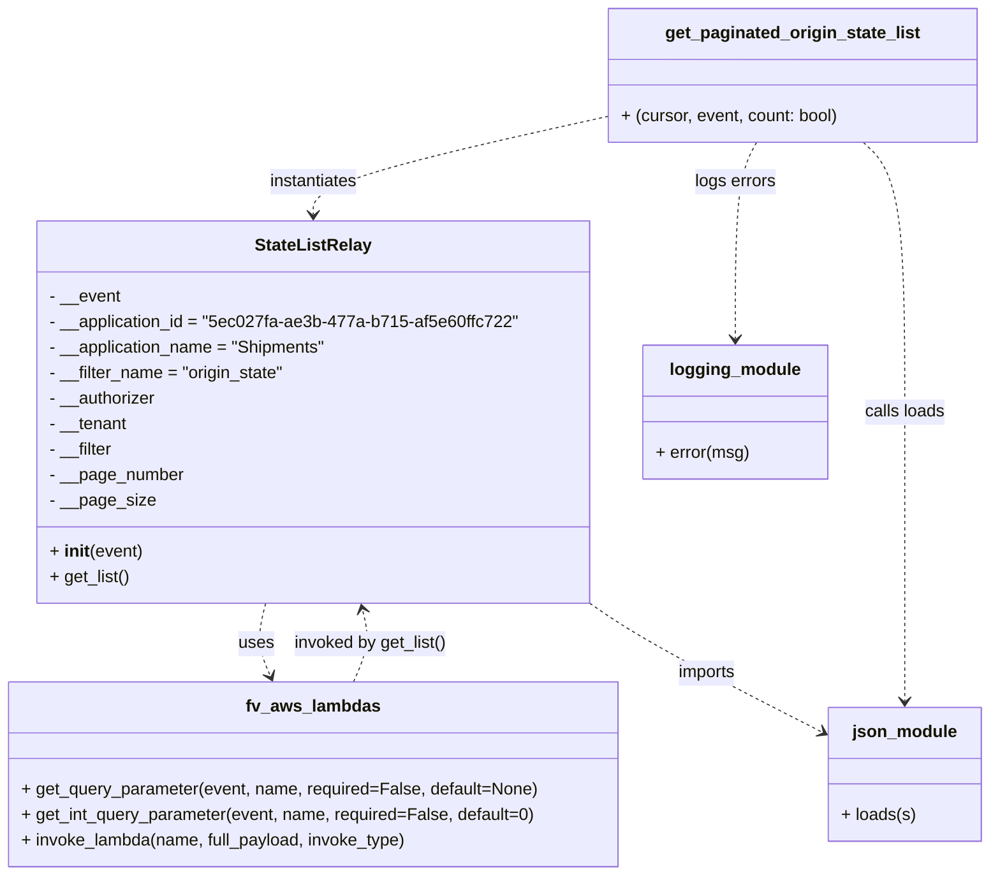

# Diagram: shipment_core/shipment_service/shipment_service/ng_shipments/ng_get_origin_state.py

> Auto-generated by Obscura crawlers

## Mermaid

### SVG

<svg id="container" width="920.50390625" xmlns="http://www.w3.org/2000/svg" class="classDiagram" height="824" viewBox="0 0 920.50390625 824" role="graphics-document document" aria-roledescription="class"><g><defs><marker id="container_class-aggregationStart" class="marker aggregation class" refX="18" refY="7" markerWidth="190" markerHeight="240" orient="auto"><path d="M 18,7 L9,13 L1,7 L9,1 Z"></path></marker></defs><defs><marker id="container_class-aggregationEnd" class="marker aggregation class" refX="1" refY="7" markerWidth="20" markerHeight="28" orient="auto"><path d="M 18,7 L9,13 L1,7 L9,1 Z"></path></marker></defs><defs><marker id="container_class-extensionStart" class="marker extension class" refX="18" refY="7" markerWidth="190" markerHeight="240" orient="auto"><path d="M 1,7 L18,13 V 1 Z"></path></marker></defs><defs><marker id="container_class-extensionEnd" class="marker extension class" refX="1" refY="7" markerWidth="20" markerHeight="28" orient="auto"><path d="M 1,1 V 13 L18,7 Z"></path></marker></defs><defs><marker id="container_class-compositionStart" class="marker composition class" refX="18" refY="7" markerWidth="190" markerHeight="240" orient="auto"><path d="M 18,7 L9,13 L1,7 L9,1 Z"></path></marker></defs><defs><marker id="container_class-compositionEnd" class="marker composition class" refX="1" refY="7" markerWidth="20" markerHeight="28" orient="auto"><path d="M 18,7 L9,13 L1,7 L9,1 Z"></path></marker></defs><defs><marker id="container_class-dependencyStart" class="marker dependency class" refX="6" refY="7" markerWidth="190" markerHeight="240" orient="auto"><path d="M 5,7 L9,13 L1,7 L9,1 Z"></path></marker></defs><defs><marker id="container_class-dependencyEnd" class="marker dependency class" refX="13" refY="7" markerWidth="20" markerHeight="28" orient="auto"><path d="M 18,7 L9,13 L14,7 L9,1 Z"></path></marker></defs><defs><marker id="container_class-lollipopStart" class="marker lollipop class" refX="13" refY="7" markerWidth="190" markerHeight="240" orient="auto"><circle stroke="black" fill="transparent" cx="7" cy="7" r="6"></circle></marker></defs><defs><marker id="container_class-lollipopEnd" class="marker lollipop class" refX="1" refY="7" markerWidth="190" markerHeight="240" orient="auto"><circle stroke="black" fill="transparent" cx="7" cy="7" r="6"></circle></marker></defs><g class="root"><g class="clusters"></g><g class="edgePaths"><path d="M247.981,568L246.421,574.167C244.861,580.333,241.741,592.667,242.506,604.086C243.271,615.505,247.922,626.009,250.247,631.261L252.572,636.514" id="id_StateListRelay_fv_aws_lambdas_1" class="edge-thickness-normal edge-pattern-dashed relation" style=";;;" data-edge="true" data-et="edge" data-id="id_StateListRelay_fv_aws_lambdas_1" data-points="W3sieCI6MjQ3Ljk4MDk5MDc4MzQxMDE0LCJ5Ijo1Njh9LHsieCI6MjM4LjYyMTA5Mzc1LCJ5Ijo2MDV9LHsieCI6MjU1LjAwMDkxMzU1ODQ2Nzc0LCJ5Ijo2NDJ9XQ==" marker-end="url(#container_class-dependencyEnd)"></path><path d="M547.699,565.38L557.162,571.983C566.624,578.587,585.549,591.793,622.008,612.482C658.466,633.17,712.458,661.34,739.454,675.425L766.45,689.511" id="id_StateListRelay_json_module_2" class="edge-thickness-normal edge-pattern-dashed relation" style=";;;" data-edge="true" data-et="edge" data-id="id_StateListRelay_json_module_2" data-points="W3sieCI6NTQ3LjY5OTIxODc1LCJ5Ijo1NjUuMzc5NzkxNTk3MzE0Mn0seyJ4Ijo2MDQuNDc0NjA5Mzc1LCJ5Ijo2MDV9LHsieCI6NzcxLjc2OTUzMTI1LCJ5Ijo2OTIuMjg1OTgwNzg2MTQxMX1d" marker-end="url(#container_class-dependencyEnd)"></path><path d="M565.063,109.928L519.805,120.107C474.547,130.285,384.031,150.643,338.773,165.988C293.516,181.333,293.516,191.667,293.516,196.833L293.516,202" id="id_get_paginated_origin_state_list_StateListRelay_3" class="edge-thickness-normal edge-pattern-dashed relation" style=";;;" data-edge="true" data-et="edge" data-id="id_get_paginated_origin_state_list_StateListRelay_3" data-points="W3sieCI6NTY1LjA2MjUsInkiOjEwOS45Mjc4MzcyMjUyMzg1Mn0seyJ4IjoyOTMuNTE1NjI1LCJ5IjoxNzF9LHsieCI6MjkzLjUxNTYyNSwieSI6MjA4fV0=" marker-end="url(#container_class-dependencyEnd)"></path><path d="M803.661,134L810.074,140.167C816.486,146.333,829.311,158.667,835.724,201C842.137,243.333,842.137,315.667,842.137,388C842.137,460.333,842.137,532.667,842.137,578C842.137,623.333,842.137,641.667,842.137,650.833L842.137,660" id="id_get_paginated_origin_state_list_json_module_4" class="edge-thickness-normal edge-pattern-dashed relation" style=";;;" data-edge="true" data-et="edge" data-id="id_get_paginated_origin_state_list_json_module_4" data-points="W3sieCI6ODAzLjY2MTA1NDY4NzUsInkiOjEzNH0seyJ4Ijo4NDIuMTM2NzE4NzUsInkiOjE3MX0seyJ4Ijo4NDIuMTM2NzE4NzUsInkiOjM4OH0seyJ4Ijo4NDIuMTM2NzE4NzUsInkiOjYwNX0seyJ4Ijo4NDIuMTM2NzE4NzUsInkiOjY2Nn1d" marker-end="url(#container_class-dependencyEnd)"></path><path d="M703.565,134L700.18,140.167C696.795,146.333,690.024,158.667,686.639,189.5C683.254,220.333,683.254,269.667,683.254,294.333L683.254,319" id="id_get_paginated_origin_state_list_logging_module_5" class="edge-thickness-normal edge-pattern-dashed relation" style=";;;" data-edge="true" data-et="edge" data-id="id_get_paginated_origin_state_list_logging_module_5" data-points="W3sieCI6NzAzLjU2NDg4MjgxMjUsInkiOjEzNH0seyJ4Ijo2ODMuMjUzOTA2MjUsInkiOjE3MX0seyJ4Ijo2ODMuMjUzOTA2MjUsInkiOjMyNX1d" marker-end="url(#container_class-dependencyEnd)"></path><path d="M332.03,642L334.76,635.833C337.49,629.667,342.95,617.333,344.365,605.969C345.781,594.606,343.151,584.211,341.836,579.014L340.522,573.817" id="id_fv_aws_lambdas_StateListRelay_6" class="edge-thickness-normal edge-pattern-dashed relation" style=";;;" data-edge="true" data-et="edge" data-id="id_fv_aws_lambdas_StateListRelay_6" data-points="W3sieCI6MzMyLjAzMDMzNjQ0MTUzMjI2LCJ5Ijo2NDJ9LHsieCI6MzQ4LjQxMDE1NjI1LCJ5Ijo2MDV9LHsieCI6MzM5LjA1MDI1OTIxNjU4OTksInkiOjU2OH1d" marker-end="url(#container_class-dependencyEnd)"></path></g><g class="edgeLabels"><g class="edgeLabel" transform="translate(239.08622, 606.05066)"><g class="label" data-id="id_StateListRelay_fv_aws_lambdas_1" transform="translate(-16.4921875, -12)"><foreignObject width="32.984375" height="24">

uses

</foreignObject></g></g><g class="edgeLabel" transform="translate(657.43174, 632.63034)"><g class="label" data-id="id_StateListRelay_json_module_2" transform="translate(-28.25, -12)"><foreignObject width="56.5" height="24">

imports

</foreignObject></g></g><g class="edgeLabel" transform="translate(293.515625, 171)"><g class="label" data-id="id_get_paginated_origin_state_list_StateListRelay_3" transform="translate(-42.9140625, -12)"><foreignObject width="85.828125" height="24">

instantiates

</foreignObject></g></g><g class="edgeLabel" transform="translate(842.13671875, 388)"><g class="label" data-id="id_get_paginated_origin_state_list_json_module_4" transform="translate(-38.328125, -12)"><foreignObject width="76.65625" height="24">

calls loads

</foreignObject></g></g><g class="edgeLabel" transform="translate(683.25390625, 171)"><g class="label" data-id="id_get_paginated_origin_state_list_logging_module_5" transform="translate(-38.609375, -12)"><foreignObject width="77.21875" height="24">

logs errors

</foreignObject></g></g><g class="edgeLabel" transform="translate(347.94503, 606.05066)"><g class="label" data-id="id_fv_aws_lambdas_StateListRelay_6" transform="translate(-73.296875, -12)"><foreignObject width="146.59375" height="24">

invoked by get_list()

</foreignObject></g></g></g><g class="nodes"><g class="node default" id="classId-StateListRelay-0" transform="translate(293.515625, 388)"><g class="basic label-container"><path d="M-254.18359375 -180 L254.18359375 -180 L254.18359375 180 L-254.18359375 180" stroke="none" stroke-width="0" fill="#ECECFF" style=""></path><path d="M-254.18359375 -180 C-100.4932727446807 -180, 53.19704826063861 -180, 254.18359375 -180 M-254.18359375 -180 C-82.1023002634899 -180, 89.97899322302021 -180, 254.18359375 -180 M254.18359375 -180 C254.18359375 -92.9720099935173, 254.18359375 -5.944019987034608, 254.18359375 180 M254.18359375 -180 C254.18359375 -102.24481204253566, 254.18359375 -24.489624085071313, 254.18359375 180 M254.18359375 180 C74.96766331790516 180, -104.24826711418967 180, -254.18359375 180 M254.18359375 180 C120.34876776003256 180, -13.486058229934883 180, -254.18359375 180 M-254.18359375 180 C-254.18359375 44.7571308640932, -254.18359375 -90.4857382718136, -254.18359375 -180 M-254.18359375 180 C-254.18359375 94.62400839718987, -254.18359375 9.248016794379737, -254.18359375 -180" stroke="#9370DB" stroke-width="1.3" fill="none" stroke-dasharray="0 0" style=""></path></g><g class="annotation-group text" transform="translate(0, -156)"></g><g class="label-group text" transform="translate(-52.6015625, -156)"><g class="label" style="font-weight: bolder" transform="translate(0,-12)"><foreignObject width="105.203125" height="24">

StateListRelay

</foreignObject></g></g><g class="members-group text" transform="translate(-242.18359375, -108)"><g class="label" style="" transform="translate(0,-12)"><foreignObject width="67.1875" height="24">

- __event

</foreignObject></g><g class="label" style="" transform="translate(0,12)"><foreignObject width="431.765625" height="24">

- __application_id = "5ec027fa-ae3b-477a-b715-af5e60ffc722"

</foreignObject></g><g class="label" style="" transform="translate(0,36)"><foreignObject width="263.96875" height="24">

- __application_name = "Shipments"

</foreignObject></g><g class="label" style="" transform="translate(0,60)"><foreignObject width="224.3125" height="24">

- __filter_name = "origin_state"

</foreignObject></g><g class="label" style="" transform="translate(0,84)"><foreignObject width="101.828125" height="24">

- __authorizer

</foreignObject></g><g class="label" style="" transform="translate(0,108)"><foreignObject width="74.34375" height="24">

- __tenant

</foreignObject></g><g class="label" style="" transform="translate(0,132)"><foreignObject width="61.171875" height="24">

- __filter

</foreignObject></g><g class="label" style="" transform="translate(0,156)"><foreignObject width="126.640625" height="24">

- __page_number

</foreignObject></g><g class="label" style="" transform="translate(0,180)"><foreignObject width="97.4375" height="24">

- __page_size

</foreignObject></g></g><g class="methods-group text" transform="translate(-242.18359375, 132)"><g class="label" style="" transform="translate(0,-12)"><foreignObject width="87.390625" height="24">

+ <strong>init</strong>(event)

</foreignObject></g><g class="label" style="" transform="translate(0,12)"><foreignObject width="75.765625" height="24">

+ get_list()

</foreignObject></g></g><g class="divider" style=""><path d="M-254.18359375 -132 C-133.40680340181956 -132, -12.630013053639118 -132, 254.18359375 -132 M-254.18359375 -132 C-131.74361906625253 -132, -9.30364438250507 -132, 254.18359375 -132" stroke="#9370DB" stroke-width="1.3" fill="none" stroke-dasharray="0 0" style=""></path></g><g class="divider" style=""><path d="M-254.18359375 108 C-141.52668480433937 108, -28.869775858678764 108, 254.18359375 108 M-254.18359375 108 C-144.2721509302371 108, -34.36070811047421 108, 254.18359375 108" stroke="#9370DB" stroke-width="1.3" fill="none" stroke-dasharray="0 0" style=""></path></g></g><g class="node default" id="classId-get_paginated_origin_state_list-1" transform="translate(738.1484375, 71)"><g class="basic label-container"><path d="M-173.0859375 -63 L173.0859375 -63 L173.0859375 63 L-173.0859375 63" stroke="none" stroke-width="0" fill="#ECECFF" style=""></path><path d="M-173.0859375 -63 C-84.24057721565191 -63, 4.604783068696179 -63, 173.0859375 -63 M-173.0859375 -63 C-60.57532231206619 -63, 51.93529287586762 -63, 173.0859375 -63 M173.0859375 -63 C173.0859375 -33.03953124106893, 173.0859375 -3.079062482137857, 173.0859375 63 M173.0859375 -63 C173.0859375 -23.348335557884184, 173.0859375 16.303328884231632, 173.0859375 63 M173.0859375 63 C34.75889127671704 63, -103.56815494656593 63, -173.0859375 63 M173.0859375 63 C44.06549728648119 63, -84.95494292703762 63, -173.0859375 63 M-173.0859375 63 C-173.0859375 21.84522232629316, -173.0859375 -19.309555347413678, -173.0859375 -63 M-173.0859375 63 C-173.0859375 26.570056349861474, -173.0859375 -9.859887300277052, -173.0859375 -63" stroke="#9370DB" stroke-width="1.3" fill="none" stroke-dasharray="0 0" style=""></path></g><g class="annotation-group text" transform="translate(0, -39)"></g><g class="label-group text" transform="translate(-116.40625, -39)"><g class="label" style="font-weight: bolder" transform="translate(0,-12)"><foreignObject width="232.8125" height="24">

get_paginated_origin_state_list

</foreignObject></g></g><g class="members-group text" transform="translate(-161.0859375, 9)"></g><g class="methods-group text" transform="translate(-161.0859375, 39)"><g class="label" style="" transform="translate(0,-12)"><foreignObject width="205.765625" height="24">

+ (cursor, event, count: bool)

</foreignObject></g></g><g class="divider" style=""><path d="M-173.0859375 -15 C-96.63179424893642 -15, -20.17765099787283 -15, 173.0859375 -15 M-173.0859375 -15 C-67.42749409736987 -15, 38.23094930526025 -15, 173.0859375 -15" stroke="#9370DB" stroke-width="1.3" fill="none" stroke-dasharray="0 0" style=""></path></g><g class="divider" style=""><path d="M-173.0859375 9 C-102.993410253925 9, -32.90088300785001 9, 173.0859375 9 M-173.0859375 9 C-56.703070516118544 9, 59.67979646776291 9, 173.0859375 9" stroke="#9370DB" stroke-width="1.3" fill="none" stroke-dasharray="0 0" style=""></path></g></g><g class="node default" id="classId-fv_aws_lambdas-2" transform="translate(293.515625, 729)"><g class="basic label-container"><path d="M-285.515625 -87 L285.515625 -87 L285.515625 87 L-285.515625 87" stroke="none" stroke-width="0" fill="#ECECFF" style=""></path><path d="M-285.515625 -87 C-164.59256210131275 -87, -43.669499202625474 -87, 285.515625 -87 M-285.515625 -87 C-153.55501101197956 -87, -21.594397023959118 -87, 285.515625 -87 M285.515625 -87 C285.515625 -24.854786168391954, 285.515625 37.29042766321609, 285.515625 87 M285.515625 -87 C285.515625 -44.73019320026159, 285.515625 -2.460386400523177, 285.515625 87 M285.515625 87 C89.36905180609932 87, -106.77752138780136 87, -285.515625 87 M285.515625 87 C136.45550212116916 87, -12.604620757661678 87, -285.515625 87 M-285.515625 87 C-285.515625 20.83918210505216, -285.515625 -45.32163578989568, -285.515625 -87 M-285.515625 87 C-285.515625 45.49026001005828, -285.515625 3.9805200201165576, -285.515625 -87" stroke="#9370DB" stroke-width="1.3" fill="none" stroke-dasharray="0 0" style=""></path></g><g class="annotation-group text" transform="translate(0, -63)"></g><g class="label-group text" transform="translate(-60.0625, -63)"><g class="label" style="font-weight: bolder" transform="translate(0,-12)"><foreignObject width="120.125" height="24">

fv_aws_lambdas

</foreignObject></g></g><g class="members-group text" transform="translate(-273.515625, -15)"></g><g class="methods-group text" transform="translate(-273.515625, 15)"><g class="label" style="" transform="translate(0,-12)"><foreignObject width="486.96875" height="24">

+ get_query_parameter(event, name, required=False, default=None)

</foreignObject></g><g class="label" style="" transform="translate(0,12)"><foreignObject width="485.515625" height="24">

+ get_int_query_parameter(event, name, required=False, default=0)

</foreignObject></g><g class="label" style="" transform="translate(0,36)"><foreignObject width="366.734375" height="24">

+ invoke_lambda(name, full_payload, invoke_type)

</foreignObject></g></g><g class="divider" style=""><path d="M-285.515625 -39 C-105.60940347698028 -39, 74.29681804603945 -39, 285.515625 -39 M-285.515625 -39 C-67.22599119957533 -39, 151.06364260084933 -39, 285.515625 -39" stroke="#9370DB" stroke-width="1.3" fill="none" stroke-dasharray="0 0" style=""></path></g><g class="divider" style=""><path d="M-285.515625 -15 C-148.98758075472944 -15, -12.459536509458871 -15, 285.515625 -15 M-285.515625 -15 C-149.38585205709902 -15, -13.25607911419803 -15, 285.515625 -15" stroke="#9370DB" stroke-width="1.3" fill="none" stroke-dasharray="0 0" style=""></path></g></g><g class="node default" id="classId-json_module-3" transform="translate(842.13671875, 729)"><g class="basic label-container"><path d="M-70.3671875 -63 L70.3671875 -63 L70.3671875 63 L-70.3671875 63" stroke="none" stroke-width="0" fill="#ECECFF" style=""></path><path d="M-70.3671875 -63 C-31.399800544616447 -63, 7.567586410767106 -63, 70.3671875 -63 M-70.3671875 -63 C-20.308233291839926 -63, 29.750720916320148 -63, 70.3671875 -63 M70.3671875 -63 C70.3671875 -19.966181883850354, 70.3671875 23.067636232299293, 70.3671875 63 M70.3671875 -63 C70.3671875 -28.092027446891052, 70.3671875 6.815945106217896, 70.3671875 63 M70.3671875 63 C37.33520880439013 63, 4.303230108780255 63, -70.3671875 63 M70.3671875 63 C16.514638352999157 63, -37.33791079400169 63, -70.3671875 63 M-70.3671875 63 C-70.3671875 19.488906884508943, -70.3671875 -24.022186230982115, -70.3671875 -63 M-70.3671875 63 C-70.3671875 35.85068328271914, -70.3671875 8.701366565438278, -70.3671875 -63" stroke="#9370DB" stroke-width="1.3" fill="none" stroke-dasharray="0 0" style=""></path></g><g class="annotation-group text" transform="translate(0, -39)"></g><g class="label-group text" transform="translate(-47.125, -39)"><g class="label" style="font-weight: bolder" transform="translate(0,-12)"><foreignObject width="94.25" height="24">

json_module

</foreignObject></g></g><g class="members-group text" transform="translate(-58.3671875, 9)"></g><g class="methods-group text" transform="translate(-58.3671875, 39)"><g class="label" style="" transform="translate(0,-12)"><foreignObject width="69.609375" height="24">

+ loads(s)

</foreignObject></g></g><g class="divider" style=""><path d="M-70.3671875 -15 C-20.89254531351081 -15, 28.582096872978383 -15, 70.3671875 -15 M-70.3671875 -15 C-23.034239942773794 -15, 24.29870761445241 -15, 70.3671875 -15" stroke="#9370DB" stroke-width="1.3" fill="none" stroke-dasharray="0 0" style=""></path></g><g class="divider" style=""><path d="M-70.3671875 9 C-38.52147851163701 9, -6.675769523274013 9, 70.3671875 9 M-70.3671875 9 C-41.960700198084695 9, -13.554212896169382 9, 70.3671875 9" stroke="#9370DB" stroke-width="1.3" fill="none" stroke-dasharray="0 0" style=""></path></g></g><g class="node default" id="classId-logging_module-4" transform="translate(683.25390625, 388)"><g class="basic label-container"><path d="M-85.5546875 -63 L85.5546875 -63 L85.5546875 63 L-85.5546875 63" stroke="none" stroke-width="0" fill="#ECECFF" style=""></path><path d="M-85.5546875 -63 C-33.85191876913349 -63, 17.85084996173302 -63, 85.5546875 -63 M-85.5546875 -63 C-43.072115371812096 -63, -0.5895432436241919 -63, 85.5546875 -63 M85.5546875 -63 C85.5546875 -27.763620614327067, 85.5546875 7.472758771345866, 85.5546875 63 M85.5546875 -63 C85.5546875 -24.140274665849454, 85.5546875 14.719450668301093, 85.5546875 63 M85.5546875 63 C36.72342323913324 63, -12.10784102173352 63, -85.5546875 63 M85.5546875 63 C48.40110436962675 63, 11.247521239253501 63, -85.5546875 63 M-85.5546875 63 C-85.5546875 34.07051821821169, -85.5546875 5.141036436423377, -85.5546875 -63 M-85.5546875 63 C-85.5546875 23.220023990413175, -85.5546875 -16.55995201917365, -85.5546875 -63" stroke="#9370DB" stroke-width="1.3" fill="none" stroke-dasharray="0 0" style=""></path></g><g class="annotation-group text" transform="translate(0, -39)"></g><g class="label-group text" transform="translate(-58.890625, -39)"><g class="label" style="font-weight: bolder" transform="translate(0,-12)"><foreignObject width="117.78125" height="24">

logging_module

</foreignObject></g></g><g class="members-group text" transform="translate(-73.5546875, 9)"></g><g class="methods-group text" transform="translate(-73.5546875, 39)"><g class="label" style="" transform="translate(0,-12)"><foreignObject width="88.21875" height="24">

+ error(msg)

</foreignObject></g></g><g class="divider" style=""><path d="M-85.5546875 -15 C-32.18180657254673 -15, 21.191074354906533 -15, 85.5546875 -15 M-85.5546875 -15 C-30.388874331638256 -15, 24.776938836723488 -15, 85.5546875 -15" stroke="#9370DB" stroke-width="1.3" fill="none" stroke-dasharray="0 0" style=""></path></g><g class="divider" style=""><path d="M-85.5546875 9 C-31.921765046844214 9, 21.71115740631157 9, 85.5546875 9 M-85.5546875 9 C-50.73752567481248 9, -15.920363849624962 9, 85.5546875 9" stroke="#9370DB" stroke-width="1.3" fill="none" stroke-dasharray="0 0" style=""></path></g></g></g></g></g></svg>
