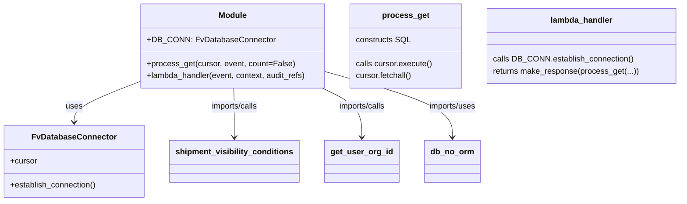

# Diagram: shipment_core/shipment_service/shipment_service/ng_shipments/ng_get_pro_numbers.py


> Auto-generated by Obscura crawlers

## Diagram 1



### SVG

<svg id="container" width="1330.482421875" xmlns="http://www.w3.org/2000/svg" class="classDiagram" height="402" viewBox="0 0 1330.482421875 402" role="graphics-document document" aria-roledescription="class"><style>#container{font-family:"trebuchet ms",verdana,arial,sans-serif;font-size:16px;fill:#333;}@keyframes edge-animation-frame{from{stroke-dashoffset:0;}}@keyframes dash{to{stroke-dashoffset:0;}}#container .edge-animation-slow{stroke-dasharray:9,5!important;stroke-dashoffset:900;animation:dash 50s linear infinite;stroke-linecap:round;}#container .edge-animation-fast{stroke-dasharray:9,5!important;stroke-dashoffset:900;animation:dash 20s linear infinite;stroke-linecap:round;}#container .error-icon{fill:#552222;}#container .error-text{fill:#552222;stroke:#552222;}#container .edge-thickness-normal{stroke-width:1px;}#container .edge-thickness-thick{stroke-width:3.5px;}#container .edge-pattern-solid{stroke-dasharray:0;}#container .edge-thickness-invisible{stroke-width:0;fill:none;}#container .edge-pattern-dashed{stroke-dasharray:3;}#container .edge-pattern-dotted{stroke-dasharray:2;}#container .marker{fill:#333333;stroke:#333333;}#container .marker.cross{stroke:#333333;}#container svg{font-family:"trebuchet ms",verdana,arial,sans-serif;font-size:16px;}#container p{margin:0;}#container g.classGroup text{fill:#9370DB;stroke:none;font-family:"trebuchet ms",verdana,arial,sans-serif;font-size:10px;}#container g.classGroup text .title{font-weight:bolder;}#container .nodeLabel,#container .edgeLabel{color:#131300;}#container .edgeLabel .label rect{fill:#ECECFF;}#container .label text{fill:#131300;}#container .labelBkg{background:#ECECFF;}#container .edgeLabel .label span{background:#ECECFF;}#container .classTitle{font-weight:bolder;}#container .node rect,#container .node circle,#container .node ellipse,#container .node polygon,#container .node path{fill:#ECECFF;stroke:#9370DB;stroke-width:1px;}#container .divider{stroke:#9370DB;stroke-width:1;}#container g.clickable{cursor:pointer;}#container g.classGroup rect{fill:#ECECFF;stroke:#9370DB;}#container g.classGroup line{stroke:#9370DB;stroke-width:1;}#container .classLabel .box{stroke:none;stroke-width:0;fill:#ECECFF;opacity:0.5;}#container .classLabel .label{fill:#9370DB;font-size:10px;}#container .relation{stroke:#333333;stroke-width:1;fill:none;}#container .dashed-line{stroke-dasharray:3;}#container .dotted-line{stroke-dasharray:1 2;}#container #compositionStart,#container .composition{fill:#333333!important;stroke:#333333!important;stroke-width:1;}#container #compositionEnd,#container .composition{fill:#333333!important;stroke:#333333!important;stroke-width:1;}#container #dependencyStart,#container .dependency{fill:#333333!important;stroke:#333333!important;stroke-width:1;}#container #dependencyStart,#container .dependency{fill:#333333!important;stroke:#333333!important;stroke-width:1;}#container #extensionStart,#container .extension{fill:transparent!important;stroke:#333333!important;stroke-width:1;}#container #extensionEnd,#container .extension{fill:transparent!important;stroke:#333333!important;stroke-width:1;}#container #aggregationStart,#container .aggregation{fill:transparent!important;stroke:#333333!important;stroke-width:1;}#container #aggregationEnd,#container .aggregation{fill:transparent!important;stroke:#333333!important;stroke-width:1;}#container #lollipopStart,#container .lollipop{fill:#ECECFF!important;stroke:#333333!important;stroke-width:1;}#container #lollipopEnd,#container .lollipop{fill:#ECECFF!important;stroke:#333333!important;stroke-width:1;}#container .edgeTerminals{font-size:11px;line-height:initial;}#container .classTitleText{text-anchor:middle;font-size:18px;fill:#333;}#container .label-icon{display:inline-block;height:1em;overflow:visible;vertical-align:-0.125em;}#container .node .label-icon path{fill:currentColor;stroke:revert;stroke-width:revert;}#container :root{--mermaid-font-family:"trebuchet ms",verdana,arial,sans-serif;}</style><g><defs><marker id="container_class-aggregationStart" class="marker aggregation class" refX="18" refY="7" markerWidth="190" markerHeight="240" orient="auto"><path d="M 18,7 L9,13 L1,7 L9,1 Z"></path></marker></defs><defs><marker id="container_class-aggregationEnd" class="marker aggregation class" refX="1" refY="7" markerWidth="20" markerHeight="28" orient="auto"><path d="M 18,7 L9,13 L1,7 L9,1 Z"></path></marker></defs><defs><marker id="container_class-extensionStart" class="marker extension class" refX="18" refY="7" markerWidth="190" markerHeight="240" orient="auto"><path d="M 1,7 L18,13 V 1 Z"></path></marker></defs><defs><marker id="container_class-extensionEnd" class="marker extension class" refX="1" refY="7" markerWidth="20" markerHeight="28" orient="auto"><path d="M 1,1 V 13 L18,7 Z"></path></marker></defs><defs><marker id="container_class-compositionStart" class="marker composition class" refX="18" refY="7" markerWidth="190" markerHeight="240" orient="auto"><path d="M 18,7 L9,13 L1,7 L9,1 Z"></path></marker></defs><defs><marker id="container_class-compositionEnd" class="marker composition class" refX="1" refY="7" markerWidth="20" markerHeight="28" orient="auto"><path d="M 18,7 L9,13 L1,7 L9,1 Z"></path></marker></defs><defs><marker id="container_class-dependencyStart" class="marker dependency class" refX="6" refY="7" markerWidth="190" markerHeight="240" orient="auto"><path d="M 5,7 L9,13 L1,7 L9,1 Z"></path></marker></defs><defs><marker id="container_class-dependencyEnd" class="marker dependency class" refX="13" refY="7" markerWidth="20" markerHeight="28" orient="auto"><path d="M 18,7 L9,13 L14,7 L9,1 Z"></path></marker></defs><defs><marker id="container_class-lollipopStart" class="marker lollipop class" refX="13" refY="7" markerWidth="190" markerHeight="240" orient="auto"><circle stroke="black" fill="transparent" cx="7" cy="7" r="6"></circle></marker></defs><defs><marker id="container_class-lollipopEnd" class="marker lollipop class" refX="1" refY="7" markerWidth="190" markerHeight="240" orient="auto"><circle stroke="black" fill="transparent" cx="7" cy="7" r="6"></circle></marker></defs><g class="root"><g class="clusters"></g><g class="edgePaths"><path d="M257.49,167.785L238.956,175.321C220.422,182.857,183.354,197.928,164.819,210.631C146.285,223.333,146.285,233.667,146.285,238.833L146.285,244" id="id_Module_FvDatabaseConnector_1" class="edge-thickness-normal edge-pattern-solid relation" style=";;;" data-edge="true" data-et="edge" data-id="id_Module_FvDatabaseConnector_1" data-points="W3sieCI6MjU3LjQ5MDIzNDM3NSwieSI6MTY3Ljc4NDkxNjg3OTQxNzcyfSx7IngiOjE0Ni4yODUxNTYyNSwieSI6MjEzfSx7IngiOjE0Ni4yODUxNTYyNSwieSI6MjUwfV0=" marker-end="url(#container_class-dependencyEnd)"></path><path d="M454.024,176L454.769,182.167C455.514,188.333,457.003,200.667,457.748,217C458.492,233.333,458.492,253.667,458.492,263.833L458.492,274" id="id_Module_shipment_visibility_conditions_2" class="edge-thickness-normal edge-pattern-solid relation" style=";;;" data-edge="true" data-et="edge" data-id="id_Module_shipment_visibility_conditions_2" data-points="W3sieCI6NDU0LjAyNDI2MDcxNzk3NTIsInkiOjE3Nn0seyJ4Ijo0NTguNDkyMTg3NSwieSI6MjEzfSx7IngiOjQ1OC40OTIxODc1LCJ5IjoyODB9XQ==" marker-end="url(#container_class-dependencyEnd)"></path><path d="M623.798,176L637.006,182.167C650.214,188.333,676.631,200.667,689.839,217C703.047,233.333,703.047,253.667,703.047,263.833L703.047,274" id="id_Module_get_user_org_id_3" class="edge-thickness-normal edge-pattern-solid relation" style=";;;" data-edge="true" data-et="edge" data-id="id_Module_get_user_org_id_3" data-points="W3sieCI6NjIzLjc5Nzc2Mjc4NDA5MDksInkiOjE3Nn0seyJ4Ijo3MDMuMDQ2ODc1LCJ5IjoyMTN9LHsieCI6NzAzLjA0Njg3NSwieSI6MjgwfV0=" marker-end="url(#container_class-dependencyEnd)"></path><path d="M630.271,144.068L671.398,155.557C712.525,167.045,794.778,190.023,835.905,211.678C877.031,233.333,877.031,253.667,877.031,263.833L877.031,274" id="id_Module_db_no_orm_4" class="edge-thickness-normal edge-pattern-solid relation" style=";;;" data-edge="true" data-et="edge" data-id="id_Module_db_no_orm_4" data-points="W3sieCI6NjMwLjI3MTQ4NDM3NSwieSI6MTQ0LjA2Nzk3OTQyMDM5ODMzfSx7IngiOjg3Ny4wMzEyNSwieSI6MjEzfSx7IngiOjg3Ny4wMzEyNSwieSI6MjgwfV0=" marker-end="url(#container_class-dependencyEnd)"></path></g><g class="edgeLabels"><g class="edgeLabel" transform="translate(146.28515625, 213)"><g class="label" data-id="id_Module_FvDatabaseConnector_1" transform="translate(-16.4921875, -12)"><foreignObject width="32.984375" height="24"><div xmlns="http://www.w3.org/1999/xhtml" class="labelBkg" style="display: table-cell; white-space: nowrap; line-height: 1.5; max-width: 200px; text-align: center;"><span class="edgeLabel"><p>uses</p></span></div></foreignObject></g></g><g class="edgeLabel" transform="translate(458.4921875, 213)"><g class="label" data-id="id_Module_shipment_visibility_conditions_2" transform="translate(-48.453125, -12)"><foreignObject width="96.90625" height="24"><div xmlns="http://www.w3.org/1999/xhtml" class="labelBkg" style="display: table-cell; white-space: nowrap; line-height: 1.5; max-width: 200px; text-align: center;"><span class="edgeLabel"><p>imports/calls</p></span></div></foreignObject></g></g><g class="edgeLabel" transform="translate(703.046875, 213)"><g class="label" data-id="id_Module_get_user_org_id_3" transform="translate(-48.453125, -12)"><foreignObject width="96.90625" height="24"><div xmlns="http://www.w3.org/1999/xhtml" class="labelBkg" style="display: table-cell; white-space: nowrap; line-height: 1.5; max-width: 200px; text-align: center;"><span class="edgeLabel"><p>imports/calls</p></span></div></foreignObject></g></g><g class="edgeLabel" transform="translate(877.03125, 213)"><g class="label" data-id="id_Module_db_no_orm_4" transform="translate(-48.65625, -12)"><foreignObject width="97.3125" height="24"><div xmlns="http://www.w3.org/1999/xhtml" class="labelBkg" style="display: table-cell; white-space: nowrap; line-height: 1.5; max-width: 200px; text-align: center;"><span class="edgeLabel"><p>imports/uses</p></span></div></foreignObject></g></g></g><g class="nodes"><g class="node default" id="classId-Module-0" transform="translate(443.880859375, 92)"><g class="basic label-container"><path d="M-186.390625 -84 L186.390625 -84 L186.390625 84 L-186.390625 84" stroke="none" stroke-width="0" fill="#ECECFF" style=""></path><path d="M-186.390625 -84 C-91.33046294226115 -84, 3.7296991154777004 -84, 186.390625 -84 M-186.390625 -84 C-83.35472228090545 -84, 19.681180438189102 -84, 186.390625 -84 M186.390625 -84 C186.390625 -33.36799298311717, 186.390625 17.264014033765662, 186.390625 84 M186.390625 -84 C186.390625 -37.19082787663786, 186.390625 9.618344246724277, 186.390625 84 M186.390625 84 C74.84949380959353 84, -36.69163738081295 84, -186.390625 84 M186.390625 84 C103.88028428464742 84, 21.369943569294833 84, -186.390625 84 M-186.390625 84 C-186.390625 23.32177571161943, -186.390625 -37.35644857676114, -186.390625 -84 M-186.390625 84 C-186.390625 32.71324998331309, -186.390625 -18.57350003337382, -186.390625 -84" stroke="#9370DB" stroke-width="1.3" fill="none" stroke-dasharray="0 0" style=""></path></g><g class="annotation-group text" transform="translate(0, -60)"></g><g class="label-group text" transform="translate(-27.09375, -60)"><g class="label" style="font-weight: bolder" transform="translate(0,-12)"><foreignObject width="54.1875" height="24"><div xmlns="http://www.w3.org/1999/xhtml" style="display: table-cell; white-space: nowrap; line-height: 1.5; max-width: 104px; text-align: center;"><span class="nodeLabel markdown-node-label" style=""><p>Module</p></span></div></foreignObject></g></g><g class="members-group text" transform="translate(-174.390625, -12)"><g class="label" style="" transform="translate(0,-12)"><foreignObject width="241.65625" height="24"><div xmlns="http://www.w3.org/1999/xhtml" style="display: table-cell; white-space: nowrap; line-height: 1.5; max-width: 300px; text-align: center;"><span class="nodeLabel markdown-node-label" style=""><p>+DB_CONN: FvDatabaseConnector</p></span></div></foreignObject></g></g><g class="methods-group text" transform="translate(-174.390625, 36)"><g class="label" style="" transform="translate(0,-12)"><foreignObject width="290.90625" height="24"><div xmlns="http://www.w3.org/1999/xhtml" style="display: table-cell; white-space: nowrap; line-height: 1.5; max-width: 348px; text-align: center;"><span class="nodeLabel markdown-node-label" style=""><p>+process_get(cursor, event, count=False)</p></span></div></foreignObject></g><g class="label" style="" transform="translate(0,12)"><foreignObject width="321.6875" height="24"><div xmlns="http://www.w3.org/1999/xhtml" style="display: table-cell; white-space: nowrap; line-height: 1.5; max-width: 379px; text-align: center;"><span class="nodeLabel markdown-node-label" style=""><p>+lambda_handler(event, context, audit_refs)</p></span></div></foreignObject></g></g><g class="divider" style=""><path d="M-186.390625 -36 C-110.89640428123009 -36, -35.40218356246018 -36, 186.390625 -36 M-186.390625 -36 C-55.36937348950559 -36, 75.65187802098882 -36, 186.390625 -36" stroke="#9370DB" stroke-width="1.3" fill="none" stroke-dasharray="0 0" style=""></path></g><g class="divider" style=""><path d="M-186.390625 12 C-87.43439694139752 12, 11.521831117204954 12, 186.390625 12 M-186.390625 12 C-66.93583283499905 12, 52.518959330001906 12, 186.390625 12" stroke="#9370DB" stroke-width="1.3" fill="none" stroke-dasharray="0 0" style=""></path></g></g><g class="node default" id="classId-FvDatabaseConnector-1" transform="translate(146.28515625, 322)"><g class="basic label-container"><path d="M-138.28515625 -72 L138.28515625 -72 L138.28515625 72 L-138.28515625 72" stroke="none" stroke-width="0" fill="#ECECFF" style=""></path><path d="M-138.28515625 -72 C-65.85257105613407 -72, 6.580014137731865 -72, 138.28515625 -72 M-138.28515625 -72 C-66.77708631791711 -72, 4.73098361416578 -72, 138.28515625 -72 M138.28515625 -72 C138.28515625 -25.220882426648217, 138.28515625 21.558235146703566, 138.28515625 72 M138.28515625 -72 C138.28515625 -41.08795118865068, 138.28515625 -10.175902377301362, 138.28515625 72 M138.28515625 72 C55.486311577665575 72, -27.31253309466885 72, -138.28515625 72 M138.28515625 72 C79.59131819218106 72, 20.89748013436214 72, -138.28515625 72 M-138.28515625 72 C-138.28515625 40.78945553160072, -138.28515625 9.578911063201446, -138.28515625 -72 M-138.28515625 72 C-138.28515625 15.51432760310174, -138.28515625 -40.97134479379652, -138.28515625 -72" stroke="#9370DB" stroke-width="1.3" fill="none" stroke-dasharray="0 0" style=""></path></g><g class="annotation-group text" transform="translate(0, -48)"></g><g class="label-group text" transform="translate(-79.3046875, -48)"><g class="label" style="font-weight: bolder" transform="translate(0,-12)"><foreignObject width="158.609375" height="24"><div xmlns="http://www.w3.org/1999/xhtml" style="display: table-cell; white-space: nowrap; line-height: 1.5; max-width: 207px; text-align: center;"><span class="nodeLabel markdown-node-label" style=""><p>FvDatabaseConnector</p></span></div></foreignObject></g></g><g class="members-group text" transform="translate(-126.28515625, 0)"><g class="label" style="" transform="translate(0,-12)"><foreignObject width="53.71875" height="24"><div xmlns="http://www.w3.org/1999/xhtml" style="display: table-cell; white-space: nowrap; line-height: 1.5; max-width: 112px; text-align: center;"><span class="nodeLabel markdown-node-label" style=""><p>+cursor</p></span></div></foreignObject></g></g><g class="methods-group text" transform="translate(-126.28515625, 48)"><g class="label" style="" transform="translate(0,-12)"><foreignObject width="173.265625" height="24"><div xmlns="http://www.w3.org/1999/xhtml" style="display: table-cell; white-space: nowrap; line-height: 1.5; max-width: 231px; text-align: center;"><span class="nodeLabel markdown-node-label" style=""><p>+establish_connection()</p></span></div></foreignObject></g></g><g class="divider" style=""><path d="M-138.28515625 -24 C-40.243121237253646 -24, 57.79891377549271 -24, 138.28515625 -24 M-138.28515625 -24 C-41.9080600860014 -24, 54.4690360779972 -24, 138.28515625 -24" stroke="#9370DB" stroke-width="1.3" fill="none" stroke-dasharray="0 0" style=""></path></g><g class="divider" style=""><path d="M-138.28515625 24 C-60.01663566550647 24, 18.25188491898706 24, 138.28515625 24 M-138.28515625 24 C-65.22341215756383 24, 7.838331934872343 24, 138.28515625 24" stroke="#9370DB" stroke-width="1.3" fill="none" stroke-dasharray="0 0" style=""></path></g></g><g class="node default" id="classId-shipment_visibility_conditions-2" transform="translate(458.4921875, 322)"><g class="basic label-container"><path d="M-123.921875 -42 L123.921875 -42 L123.921875 42 L-123.921875 42" stroke="none" stroke-width="0" fill="#ECECFF" style=""></path><path d="M-123.921875 -42 C-41.19577860544442 -42, 41.530317789111166 -42, 123.921875 -42 M-123.921875 -42 C-36.33720679053677 -42, 51.24746141892646 -42, 123.921875 -42 M123.921875 -42 C123.921875 -13.340676200764392, 123.921875 15.318647598471216, 123.921875 42 M123.921875 -42 C123.921875 -16.51725451080209, 123.921875 8.96549097839582, 123.921875 42 M123.921875 42 C50.40133478548486 42, -23.119205429030274 42, -123.921875 42 M123.921875 42 C47.46542699143055 42, -28.991021017138905 42, -123.921875 42 M-123.921875 42 C-123.921875 9.113600025841848, -123.921875 -23.772799948316305, -123.921875 -42 M-123.921875 42 C-123.921875 18.5143568761953, -123.921875 -4.971286247609399, -123.921875 -42" stroke="#9370DB" stroke-width="1.3" fill="none" stroke-dasharray="0 0" style=""></path></g><g class="annotation-group text" transform="translate(0, -18)"></g><g class="label-group text" transform="translate(-111.921875, -18)"><g class="label" style="font-weight: bolder" transform="translate(0,-12)"><foreignObject width="223.84375" height="24"><div xmlns="http://www.w3.org/1999/xhtml" style="display: table-cell; white-space: nowrap; line-height: 1.5; max-width: 272px; text-align: center;"><span class="nodeLabel markdown-node-label" style=""><p>shipment_visibility_conditions</p></span></div></foreignObject></g></g><g class="members-group text" transform="translate(-111.921875, 30)"></g><g class="methods-group text" transform="translate(-111.921875, 60)"></g><g class="divider" style=""><path d="M-123.921875 6 C-51.22793628015941 6, 21.466002439681176 6, 123.921875 6 M-123.921875 6 C-72.33377546040967 6, -20.74567592081935 6, 123.921875 6" stroke="#9370DB" stroke-width="1.3" fill="none" stroke-dasharray="0 0" style=""></path></g><g class="divider" style=""><path d="M-123.921875 24 C-30.781163620783587 24, 62.359547758432825 24, 123.921875 24 M-123.921875 24 C-24.937381942723235 24, 74.04711111455353 24, 123.921875 24" stroke="#9370DB" stroke-width="1.3" fill="none" stroke-dasharray="0 0" style=""></path></g></g><g class="node default" id="classId-get_user_org_id-3" transform="translate(703.046875, 322)"><g class="basic label-container"><path d="M-70.6328125 -42 L70.6328125 -42 L70.6328125 42 L-70.6328125 42" stroke="none" stroke-width="0" fill="#ECECFF" style=""></path><path d="M-70.6328125 -42 C-35.08697238264848 -42, 0.4588677347030341 -42, 70.6328125 -42 M-70.6328125 -42 C-28.220580504046666 -42, 14.191651491906669 -42, 70.6328125 -42 M70.6328125 -42 C70.6328125 -12.425471667426308, 70.6328125 17.149056665147384, 70.6328125 42 M70.6328125 -42 C70.6328125 -15.817060931804104, 70.6328125 10.365878136391792, 70.6328125 42 M70.6328125 42 C35.64586716082046 42, 0.6589218216409165 42, -70.6328125 42 M70.6328125 42 C29.301815006870648 42, -12.029182486258705 42, -70.6328125 42 M-70.6328125 42 C-70.6328125 16.02603567087385, -70.6328125 -9.947928658252302, -70.6328125 -42 M-70.6328125 42 C-70.6328125 15.901807928631861, -70.6328125 -10.196384142736278, -70.6328125 -42" stroke="#9370DB" stroke-width="1.3" fill="none" stroke-dasharray="0 0" style=""></path></g><g class="annotation-group text" transform="translate(0, -18)"></g><g class="label-group text" transform="translate(-58.6328125, -18)"><g class="label" style="font-weight: bolder" transform="translate(0,-12)"><foreignObject width="117.265625" height="24"><div xmlns="http://www.w3.org/1999/xhtml" style="display: table-cell; white-space: nowrap; line-height: 1.5; max-width: 165px; text-align: center;"><span class="nodeLabel markdown-node-label" style=""><p>get_user_org_id</p></span></div></foreignObject></g></g><g class="members-group text" transform="translate(-58.6328125, 30)"></g><g class="methods-group text" transform="translate(-58.6328125, 60)"></g><g class="divider" style=""><path d="M-70.6328125 6 C-18.122282618814097 6, 34.388247262371806 6, 70.6328125 6 M-70.6328125 6 C-36.221467374171986 6, -1.8101222483439727 6, 70.6328125 6" stroke="#9370DB" stroke-width="1.3" fill="none" stroke-dasharray="0 0" style=""></path></g><g class="divider" style=""><path d="M-70.6328125 24 C-16.17790341797329 24, 38.27700566405342 24, 70.6328125 24 M-70.6328125 24 C-14.65874617561078 24, 41.31532014877844 24, 70.6328125 24" stroke="#9370DB" stroke-width="1.3" fill="none" stroke-dasharray="0 0" style=""></path></g></g><g class="node default" id="classId-db_no_orm-4" transform="translate(877.03125, 322)"><g class="basic label-container"><path d="M-53.3515625 -42 L53.3515625 -42 L53.3515625 42 L-53.3515625 42" stroke="none" stroke-width="0" fill="#ECECFF" style=""></path><path d="M-53.3515625 -42 C-25.521375407629794 -42, 2.3088116847404123 -42, 53.3515625 -42 M-53.3515625 -42 C-28.18318779999504 -42, -3.0148130999900786 -42, 53.3515625 -42 M53.3515625 -42 C53.3515625 -17.233460489366898, 53.3515625 7.533079021266204, 53.3515625 42 M53.3515625 -42 C53.3515625 -18.27997334996008, 53.3515625 5.440053300079839, 53.3515625 42 M53.3515625 42 C23.95918564273042 42, -5.433191214539157 42, -53.3515625 42 M53.3515625 42 C28.52924808440501 42, 3.7069336688100165 42, -53.3515625 42 M-53.3515625 42 C-53.3515625 18.900031573719026, -53.3515625 -4.199936852561947, -53.3515625 -42 M-53.3515625 42 C-53.3515625 17.149716513684453, -53.3515625 -7.700566972631094, -53.3515625 -42" stroke="#9370DB" stroke-width="1.3" fill="none" stroke-dasharray="0 0" style=""></path></g><g class="annotation-group text" transform="translate(0, -18)"></g><g class="label-group text" transform="translate(-41.3515625, -18)"><g class="label" style="font-weight: bolder" transform="translate(0,-12)"><foreignObject width="82.703125" height="24"><div xmlns="http://www.w3.org/1999/xhtml" style="display: table-cell; white-space: nowrap; line-height: 1.5; max-width: 133px; text-align: center;"><span class="nodeLabel markdown-node-label" style=""><p>db_no_orm</p></span></div></foreignObject></g></g><g class="members-group text" transform="translate(-41.3515625, 30)"></g><g class="methods-group text" transform="translate(-41.3515625, 60)"></g><g class="divider" style=""><path d="M-53.3515625 6 C-12.592183232034586 6, 28.16719603593083 6, 53.3515625 6 M-53.3515625 6 C-11.890773536052443 6, 29.570015427895115 6, 53.3515625 6" stroke="#9370DB" stroke-width="1.3" fill="none" stroke-dasharray="0 0" style=""></path></g><g class="divider" style=""><path d="M-53.3515625 24 C-10.709325828101349 24, 31.932910843797302 24, 53.3515625 24 M-53.3515625 24 C-22.752978869959122 24, 7.845604760081756 24, 53.3515625 24" stroke="#9370DB" stroke-width="1.3" fill="none" stroke-dasharray="0 0" style=""></path></g></g><g class="node default" id="classId-process_get-5" transform="translate(790.091796875, 92)"><g class="basic label-container"><path d="M-109.8203125 -84 L109.8203125 -84 L109.8203125 84 L-109.8203125 84" stroke="none" stroke-width="0" fill="#ECECFF" style=""></path><path d="M-109.8203125 -84 C-61.25038413678873 -84, -12.680455773577464 -84, 109.8203125 -84 M-109.8203125 -84 C-22.131080584731748 -84, 65.5581513305365 -84, 109.8203125 -84 M109.8203125 -84 C109.8203125 -17.44021822758944, 109.8203125 49.11956354482112, 109.8203125 84 M109.8203125 -84 C109.8203125 -38.02517663052509, 109.8203125 7.9496467389498235, 109.8203125 84 M109.8203125 84 C62.750873881737064 84, 15.681435263474128 84, -109.8203125 84 M109.8203125 84 C30.401531222191224 84, -49.01725005561755 84, -109.8203125 84 M-109.8203125 84 C-109.8203125 24.98264263714865, -109.8203125 -34.0347147257027, -109.8203125 -84 M-109.8203125 84 C-109.8203125 39.207798082527304, -109.8203125 -5.584403834945391, -109.8203125 -84" stroke="#9370DB" stroke-width="1.3" fill="none" stroke-dasharray="0 0" style=""></path></g><g class="annotation-group text" transform="translate(0, -60)"></g><g class="label-group text" transform="translate(-44.046875, -60)"><g class="label" style="font-weight: bolder" transform="translate(0,-12)"><foreignObject width="88.09375" height="24"><div xmlns="http://www.w3.org/1999/xhtml" style="display: table-cell; white-space: nowrap; line-height: 1.5; max-width: 136px; text-align: center;"><span class="nodeLabel markdown-node-label" style=""><p>process_get</p></span></div></foreignObject></g></g><g class="members-group text" transform="translate(-97.8203125, -12)"><g class="label" style="" transform="translate(0,-12)"><foreignObject width="107.671875" height="24"><div xmlns="http://www.w3.org/1999/xhtml" style="display: table-cell; white-space: nowrap; line-height: 1.5; max-width: 158px; text-align: center;"><span class="nodeLabel markdown-node-label" style=""><p>constructs SQL</p></span></div></foreignObject></g></g><g class="methods-group text" transform="translate(-97.8203125, 36)"><g class="label" style="" transform="translate(0,-12)"><foreignObject width="151.59375" height="24"><div xmlns="http://www.w3.org/1999/xhtml" style="display: table-cell; white-space: nowrap; line-height: 1.5; max-width: 202px; text-align: center;"><span class="nodeLabel markdown-node-label" style=""><p>calls cursor.execute()</p></span></div></foreignObject></g><g class="label" style="" transform="translate(0,12)"><foreignObject width="112.84375" height="24"><div xmlns="http://www.w3.org/1999/xhtml" style="display: table-cell; white-space: nowrap; line-height: 1.5; max-width: 163px; text-align: center;"><span class="nodeLabel markdown-node-label" style=""><p>cursor.fetchall()</p></span></div></foreignObject></g></g><g class="divider" style=""><path d="M-109.8203125 -36 C-51.46665167794439 -36, 6.887009144111218 -36, 109.8203125 -36 M-109.8203125 -36 C-45.09891415879821 -36, 19.622484182403582 -36, 109.8203125 -36" stroke="#9370DB" stroke-width="1.3" fill="none" stroke-dasharray="0 0" style=""></path></g><g class="divider" style=""><path d="M-109.8203125 12 C-27.816560730511284 12, 54.18719103897743 12, 109.8203125 12 M-109.8203125 12 C-24.53464706037184 12, 60.75101837925632 12, 109.8203125 12" stroke="#9370DB" stroke-width="1.3" fill="none" stroke-dasharray="0 0" style=""></path></g></g><g class="node default" id="classId-lambda_handler-6" transform="translate(1136.197265625, 92)"><g class="basic label-container"><path d="M-186.28515625 -75 L186.28515625 -75 L186.28515625 75 L-186.28515625 75" stroke="none" stroke-width="0" fill="#ECECFF" style=""></path><path d="M-186.28515625 -75 C-38.90190662346964 -75, 108.48134300306072 -75, 186.28515625 -75 M-186.28515625 -75 C-58.956443446491534 -75, 68.37226935701693 -75, 186.28515625 -75 M186.28515625 -75 C186.28515625 -31.74774689948883, 186.28515625 11.504506201022338, 186.28515625 75 M186.28515625 -75 C186.28515625 -32.061390933118716, 186.28515625 10.877218133762568, 186.28515625 75 M186.28515625 75 C39.7041685781312 75, -106.8768190937376 75, -186.28515625 75 M186.28515625 75 C104.9961973525827 75, 23.707238455165395 75, -186.28515625 75 M-186.28515625 75 C-186.28515625 43.16500133033389, -186.28515625 11.330002660667773, -186.28515625 -75 M-186.28515625 75 C-186.28515625 32.16530008744973, -186.28515625 -10.669399825100541, -186.28515625 -75" stroke="#9370DB" stroke-width="1.3" fill="none" stroke-dasharray="0 0" style=""></path></g><g class="annotation-group text" transform="translate(0, -51)"></g><g class="label-group text" transform="translate(-59.9765625, -51)"><g class="label" style="font-weight: bolder" transform="translate(0,-12)"><foreignObject width="119.953125" height="24"><div xmlns="http://www.w3.org/1999/xhtml" style="display: table-cell; white-space: nowrap; line-height: 1.5; max-width: 170px; text-align: center;"><span class="nodeLabel markdown-node-label" style=""><p>lambda_handler</p></span></div></foreignObject></g></g><g class="members-group text" transform="translate(-174.28515625, -3)"></g><g class="methods-group text" transform="translate(-174.28515625, 27)"><g class="label" style="" transform="translate(0,-12)"><foreignObject width="275.046875" height="24"><div xmlns="http://www.w3.org/1999/xhtml" style="display: table-cell; white-space: nowrap; line-height: 1.5; max-width: 325px; text-align: center;"><span class="nodeLabel markdown-node-label" style=""><p>calls DB_CONN.establish_connection()</p></span></div></foreignObject></g><g class="label" style="" transform="translate(0,12)"><foreignObject width="288.59375" height="24"><div xmlns="http://www.w3.org/1999/xhtml" style="display: table-cell; white-space: nowrap; line-height: 1.5; max-width: 339px; text-align: center;"><span class="nodeLabel markdown-node-label" style=""><p>returns make_response(process_get(...))</p></span></div></foreignObject></g></g><g class="divider" style=""><path d="M-186.28515625 -27 C-50.63038861307567 -27, 85.02437902384867 -27, 186.28515625 -27 M-186.28515625 -27 C-97.31656049076365 -27, -8.347964731527298 -27, 186.28515625 -27" stroke="#9370DB" stroke-width="1.3" fill="none" stroke-dasharray="0 0" style=""></path></g><g class="divider" style=""><path d="M-186.28515625 -3 C-86.78144923140188 -3, 12.722257787196241 -3, 186.28515625 -3 M-186.28515625 -3 C-96.9353015691555 -3, -7.585446888310997 -3, 186.28515625 -3" stroke="#9370DB" stroke-width="1.3" fill="none" stroke-dasharray="0 0" style=""></path></g></g></g></g></g></svg>

## Diagram 2

```mermaid
flowchart TD
    A[Invoke lambda_handler(event, context, audit_refs)] --> B[DB_CONN.establish_connection()]
    B --> C{DB_CONN.cursor available}
    C --> D[Call process_get(cursor, event, count=False)]
    D --> E[get_user_org_id(event)]
    D --> F[Build SQL with shipment_visibility_conditions and optional fuzzy]
    F --> G[cursor.execute(sql, params)]
    G --> H[cursor.fetchall()]
    H --> I[Filter and strip pro_number values]
    I --> J[fv.aws.lambdas.make_response(result)]
    J --> K[Return HTTP response]
```

> SVG rendering failed for this diagram.
