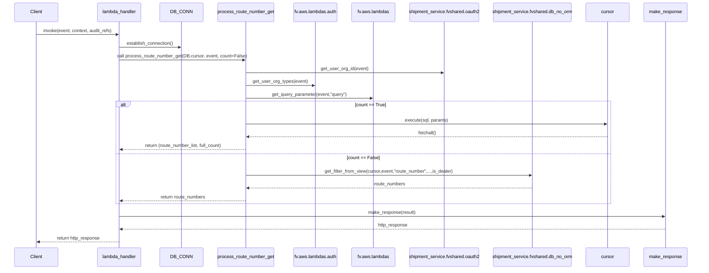
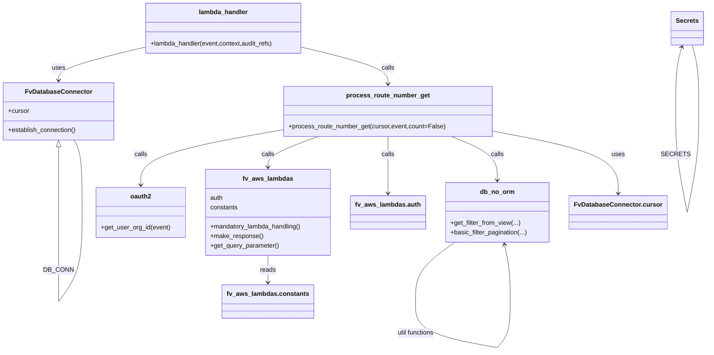

# Diagram: shipment_core/shipment_service/shipment_service/ng_shipments/ng_get_route_numbers.py

> Auto-generated by Obscura crawlers

## Diagram 1

### SVG

<svg id="container" width="2568" xmlns="http://www.w3.org/2000/svg" height="991" viewBox="-50 -10 2568 991" role="graphics-document document" aria-roledescription="sequence"><g><rect x="2318" y="905" fill="#eaeaea" stroke="#666" width="150" height="65" name="MakeResp" rx="3" ry="3" class="actor actor-bottom"></rect><text x="2393" y="937.5" dominant-baseline="central" alignment-baseline="central" class="actor actor-box" style="text-anchor: middle; font-size: 16px; font-weight: 400;"><tspan x="2393" dy="0">make_response</tspan></text></g><g><rect x="2118" y="905" fill="#eaeaea" stroke="#666" width="150" height="65" name="Cursor" rx="3" ry="3" class="actor actor-bottom"></rect><text x="2193" y="937.5" dominant-baseline="central" alignment-baseline="central" class="actor actor-box" style="text-anchor: middle; font-size: 16px; font-weight: 400;"><tspan x="2193" dy="0">cursor</tspan></text></g><g><rect x="1768" y="905" fill="#eaeaea" stroke="#666" width="300" height="65" name="DBNoORM" rx="3" ry="3" class="actor actor-bottom"></rect><text x="1918" y="937.5" dominant-baseline="central" alignment-baseline="central" class="actor actor-box" style="text-anchor: middle; font-size: 16px; font-weight: 400;"><tspan x="1918" dy="0">shipment_service.fvshared.db_no_orm</tspan></text></g><g><rect x="1450" y="905" fill="#eaeaea" stroke="#666" width="268" height="65" name="OAuth" rx="3" ry="3" class="actor actor-bottom"></rect><text x="1584" y="937.5" dominant-baseline="central" alignment-baseline="central" class="actor actor-box" style="text-anchor: middle; font-size: 16px; font-weight: 400;"><tspan x="1584" dy="0">shipment_service.fvshared.oauth2</tspan></text></g><g><rect x="1250" y="905" fill="#eaeaea" stroke="#666" width="150" height="65" name="Query" rx="3" ry="3" class="actor actor-bottom"></rect><text x="1325" y="937.5" dominant-baseline="central" alignment-baseline="central" class="actor actor-box" style="text-anchor: middle; font-size: 16px; font-weight: 400;"><tspan x="1325" dy="0">fv.aws.lambdas</tspan></text></g><g><rect x="1033" y="905" fill="#eaeaea" stroke="#666" width="167" height="65" name="Auth" rx="3" ry="3" class="actor actor-bottom"></rect><text x="1116.5" y="937.5" dominant-baseline="central" alignment-baseline="central" class="actor actor-box" style="text-anchor: middle; font-size: 16px; font-weight: 400;"><tspan x="1116.5" dy="0">fv.aws.lambdas.auth</tspan></text></g><g><rect x="747" y="905" fill="#eaeaea" stroke="#666" width="217" height="65" name="Proc" rx="3" ry="3" class="actor actor-bottom"></rect><text x="855.5" y="937.5" dominant-baseline="central" alignment-baseline="central" class="actor actor-box" style="text-anchor: middle; font-size: 16px; font-weight: 400;"><tspan x="855.5" dy="0">process_route_number_get</tspan></text></g><g><rect x="547" y="905" fill="#eaeaea" stroke="#666" width="150" height="65" name="DB" rx="3" ry="3" class="actor actor-bottom"></rect><text x="622" y="937.5" dominant-baseline="central" alignment-baseline="central" class="actor actor-box" style="text-anchor: middle; font-size: 16px; font-weight: 400;"><tspan x="622" dy="0">DB_CONN</tspan></text></g><g><rect x="312" y="905" fill="#eaeaea" stroke="#666" width="150" height="65" name="Lambda" rx="3" ry="3" class="actor actor-bottom"></rect><text x="387" y="937.5" dominant-baseline="central" alignment-baseline="central" class="actor actor-box" style="text-anchor: middle; font-size: 16px; font-weight: 400;"><tspan x="387" dy="0">lambda_handler</tspan></text></g><g><rect x="0" y="905" fill="#eaeaea" stroke="#666" width="150" height="65" name="Client" rx="3" ry="3" class="actor actor-bottom"></rect><text x="75" y="937.5" dominant-baseline="central" alignment-baseline="central" class="actor actor-box" style="text-anchor: middle; font-size: 16px; font-weight: 400;"><tspan x="75" dy="0">Client</tspan></text></g><g><line id="actor9" x1="2393" y1="65" x2="2393" y2="905" class="actor-line 200" stroke-width="0.5px" stroke="#999" name="MakeResp"></line><g id="root-9"><rect x="2318" y="0" fill="#eaeaea" stroke="#666" width="150" height="65" name="MakeResp" rx="3" ry="3" class="actor actor-top"></rect><text x="2393" y="32.5" dominant-baseline="central" alignment-baseline="central" class="actor actor-box" style="text-anchor: middle; font-size: 16px; font-weight: 400;"><tspan x="2393" dy="0">make_response</tspan></text></g></g><g><line id="actor8" x1="2193" y1="65" x2="2193" y2="905" class="actor-line 200" stroke-width="0.5px" stroke="#999" name="Cursor"></line><g id="root-8"><rect x="2118" y="0" fill="#eaeaea" stroke="#666" width="150" height="65" name="Cursor" rx="3" ry="3" class="actor actor-top"></rect><text x="2193" y="32.5" dominant-baseline="central" alignment-baseline="central" class="actor actor-box" style="text-anchor: middle; font-size: 16px; font-weight: 400;"><tspan x="2193" dy="0">cursor</tspan></text></g></g><g><line id="actor7" x1="1918" y1="65" x2="1918" y2="905" class="actor-line 200" stroke-width="0.5px" stroke="#999" name="DBNoORM"></line><g id="root-7"><rect x="1768" y="0" fill="#eaeaea" stroke="#666" width="300" height="65" name="DBNoORM" rx="3" ry="3" class="actor actor-top"></rect><text x="1918" y="32.5" dominant-baseline="central" alignment-baseline="central" class="actor actor-box" style="text-anchor: middle; font-size: 16px; font-weight: 400;"><tspan x="1918" dy="0">shipment_service.fvshared.db_no_orm</tspan></text></g></g><g><line id="actor6" x1="1584" y1="65" x2="1584" y2="905" class="actor-line 200" stroke-width="0.5px" stroke="#999" name="OAuth"></line><g id="root-6"><rect x="1450" y="0" fill="#eaeaea" stroke="#666" width="268" height="65" name="OAuth" rx="3" ry="3" class="actor actor-top"></rect><text x="1584" y="32.5" dominant-baseline="central" alignment-baseline="central" class="actor actor-box" style="text-anchor: middle; font-size: 16px; font-weight: 400;"><tspan x="1584" dy="0">shipment_service.fvshared.oauth2</tspan></text></g></g><g><line id="actor5" x1="1325" y1="65" x2="1325" y2="905" class="actor-line 200" stroke-width="0.5px" stroke="#999" name="Query"></line><g id="root-5"><rect x="1250" y="0" fill="#eaeaea" stroke="#666" width="150" height="65" name="Query" rx="3" ry="3" class="actor actor-top"></rect><text x="1325" y="32.5" dominant-baseline="central" alignment-baseline="central" class="actor actor-box" style="text-anchor: middle; font-size: 16px; font-weight: 400;"><tspan x="1325" dy="0">fv.aws.lambdas</tspan></text></g></g><g><line id="actor4" x1="1116.5" y1="65" x2="1116.5" y2="905" class="actor-line 200" stroke-width="0.5px" stroke="#999" name="Auth"></line><g id="root-4"><rect x="1033" y="0" fill="#eaeaea" stroke="#666" width="167" height="65" name="Auth" rx="3" ry="3" class="actor actor-top"></rect><text x="1116.5" y="32.5" dominant-baseline="central" alignment-baseline="central" class="actor actor-box" style="text-anchor: middle; font-size: 16px; font-weight: 400;"><tspan x="1116.5" dy="0">fv.aws.lambdas.auth</tspan></text></g></g><g><line id="actor3" x1="855.5" y1="65" x2="855.5" y2="905" class="actor-line 200" stroke-width="0.5px" stroke="#999" name="Proc"></line><g id="root-3"><rect x="747" y="0" fill="#eaeaea" stroke="#666" width="217" height="65" name="Proc" rx="3" ry="3" class="actor actor-top"></rect><text x="855.5" y="32.5" dominant-baseline="central" alignment-baseline="central" class="actor actor-box" style="text-anchor: middle; font-size: 16px; font-weight: 400;"><tspan x="855.5" dy="0">process_route_number_get</tspan></text></g></g><g><line id="actor2" x1="622" y1="65" x2="622" y2="905" class="actor-line 200" stroke-width="0.5px" stroke="#999" name="DB"></line><g id="root-2"><rect x="547" y="0" fill="#eaeaea" stroke="#666" width="150" height="65" name="DB" rx="3" ry="3" class="actor actor-top"></rect><text x="622" y="32.5" dominant-baseline="central" alignment-baseline="central" class="actor actor-box" style="text-anchor: middle; font-size: 16px; font-weight: 400;"><tspan x="622" dy="0">DB_CONN</tspan></text></g></g><g><line id="actor1" x1="387" y1="65" x2="387" y2="905" class="actor-line 200" stroke-width="0.5px" stroke="#999" name="Lambda"></line><g id="root-1"><rect x="312" y="0" fill="#eaeaea" stroke="#666" width="150" height="65" name="Lambda" rx="3" ry="3" class="actor actor-top"></rect><text x="387" y="32.5" dominant-baseline="central" alignment-baseline="central" class="actor actor-box" style="text-anchor: middle; font-size: 16px; font-weight: 400;"><tspan x="387" dy="0">lambda_handler</tspan></text></g></g><g><line id="actor0" x1="75" y1="65" x2="75" y2="905" class="actor-line 200" stroke-width="0.5px" stroke="#999" name="Client"></line><g id="root-0"><rect x="0" y="0" fill="#eaeaea" stroke="#666" width="150" height="65" name="Client" rx="3" ry="3" class="actor actor-top"></rect><text x="75" y="32.5" dominant-baseline="central" alignment-baseline="central" class="actor actor-box" style="text-anchor: middle; font-size: 16px; font-weight: 400;"><tspan x="75" dy="0">Client</tspan></text></g></g><g></g><defs><symbol id="computer" width="24" height="24"><path transform="scale(.5)" d="M2 2v13h20v-13h-20zm18 11h-16v-9h16v9zm-10.228 6l.466-1h3.524l.467 1h-4.457zm14.228 3h-24l2-6h2.104l-1.33 4h18.45l-1.297-4h2.073l2 6zm-5-10h-14v-7h14v7z"></path></symbol></defs><defs><symbol id="database" fill-rule="evenodd" clip-rule="evenodd"><path transform="scale(.5)" d="M12.258.001l.256.004.255.005.253.008.251.01.249.012.247.015.246.016.242.019.241.02.239.023.236.024.233.027.231.028.229.031.225.032.223.034.22.036.217.038.214.04.211.041.208.043.205.045.201.046.198.048.194.05.191.051.187.053.183.054.18.056.175.057.172.059.168.06.163.061.16.063.155.064.15.066.074.033.073.033.071.034.07.034.069.035.068.035.067.035.066.035.064.036.064.036.062.036.06.036.06.037.058.037.058.037.055.038.055.038.053.038.052.038.051.039.05.039.048.039.047.039.045.04.044.04.043.04.041.04.04.041.039.041.037.041.036.041.034.041.033.042.032.042.03.042.029.042.027.042.026.043.024.043.023.043.021.043.02.043.018.044.017.043.015.044.013.044.012.044.011.045.009.044.007.045.006.045.004.045.002.045.001.045v17l-.001.045-.002.045-.004.045-.006.045-.007.045-.009.044-.011.045-.012.044-.013.044-.015.044-.017.043-.018.044-.02.043-.021.043-.023.043-.024.043-.026.043-.027.042-.029.042-.03.042-.032.042-.033.042-.034.041-.036.041-.037.041-.039.041-.04.041-.041.04-.043.04-.044.04-.045.04-.047.039-.048.039-.05.039-.051.039-.052.038-.053.038-.055.038-.055.038-.058.037-.058.037-.06.037-.06.036-.062.036-.064.036-.064.036-.066.035-.067.035-.068.035-.069.035-.07.034-.071.034-.073.033-.074.033-.15.066-.155.064-.16.063-.163.061-.168.06-.172.059-.175.057-.18.056-.183.054-.187.053-.191.051-.194.05-.198.048-.201.046-.205.045-.208.043-.211.041-.214.04-.217.038-.22.036-.223.034-.225.032-.229.031-.231.028-.233.027-.236.024-.239.023-.241.02-.242.019-.246.016-.247.015-.249.012-.251.01-.253.008-.255.005-.256.004-.258.001-.258-.001-.256-.004-.255-.005-.253-.008-.251-.01-.249-.012-.247-.015-.245-.016-.243-.019-.241-.02-.238-.023-.236-.024-.234-.027-.231-.028-.228-.031-.226-.032-.223-.034-.22-.036-.217-.038-.214-.04-.211-.041-.208-.043-.204-.045-.201-.046-.198-.048-.195-.05-.19-.051-.187-.053-.184-.054-.179-.056-.176-.057-.172-.059-.167-.06-.164-.061-.159-.063-.155-.064-.151-.066-.074-.033-.072-.033-.072-.034-.07-.034-.069-.035-.068-.035-.067-.035-.066-.035-.064-.036-.063-.036-.062-.036-.061-.036-.06-.037-.058-.037-.057-.037-.056-.038-.055-.038-.053-.038-.052-.038-.051-.039-.049-.039-.049-.039-.046-.039-.046-.04-.044-.04-.043-.04-.041-.04-.04-.041-.039-.041-.037-.041-.036-.041-.034-.041-.033-.042-.032-.042-.03-.042-.029-.042-.027-.042-.026-.043-.024-.043-.023-.043-.021-.043-.02-.043-.018-.044-.017-.043-.015-.044-.013-.044-.012-.044-.011-.045-.009-.044-.007-.045-.006-.045-.004-.045-.002-.045-.001-.045v-17l.001-.045.002-.045.004-.045.006-.045.007-.045.009-.044.011-.045.012-.044.013-.044.015-.044.017-.043.018-.044.02-.043.021-.043.023-.043.024-.043.026-.043.027-.042.029-.042.03-.042.032-.042.033-.042.034-.041.036-.041.037-.041.039-.041.04-.041.041-.04.043-.04.044-.04.046-.04.046-.039.049-.039.049-.039.051-.039.052-.038.053-.038.055-.038.056-.038.057-.037.058-.037.06-.037.061-.036.062-.036.063-.036.064-.036.066-.035.067-.035.068-.035.069-.035.07-.034.072-.034.072-.033.074-.033.151-.066.155-.064.159-.063.164-.061.167-.06.172-.059.176-.057.179-.056.184-.054.187-.053.19-.051.195-.05.198-.048.201-.046.204-.045.208-.043.211-.041.214-.04.217-.038.22-.036.223-.034.226-.032.228-.031.231-.028.234-.027.236-.024.238-.023.241-.02.243-.019.245-.016.247-.015.249-.012.251-.01.253-.008.255-.005.256-.004.258-.001.258.001zm-9.258 20.499v.01l.001.021.003.021.004.022.005.021.006.022.007.022.009.023.01.022.011.023.012.023.013.023.015.023.016.024.017.023.018.024.019.024.021.024.022.025.023.024.024.025.052.049.056.05.061.051.066.051.07.051.075.051.079.052.084.052.088.052.092.052.097.052.102.051.105.052.11.052.114.051.119.051.123.051.127.05.131.05.135.05.139.048.144.049.147.047.152.047.155.047.16.045.163.045.167.043.171.043.176.041.178.041.183.039.187.039.19.037.194.035.197.035.202.033.204.031.209.03.212.029.216.027.219.025.222.024.226.021.23.02.233.018.236.016.24.015.243.012.246.01.249.008.253.005.256.004.259.001.26-.001.257-.004.254-.005.25-.008.247-.011.244-.012.241-.014.237-.016.233-.018.231-.021.226-.021.224-.024.22-.026.216-.027.212-.028.21-.031.205-.031.202-.034.198-.034.194-.036.191-.037.187-.039.183-.04.179-.04.175-.042.172-.043.168-.044.163-.045.16-.046.155-.046.152-.047.148-.048.143-.049.139-.049.136-.05.131-.05.126-.05.123-.051.118-.052.114-.051.11-.052.106-.052.101-.052.096-.052.092-.052.088-.053.083-.051.079-.052.074-.052.07-.051.065-.051.06-.051.056-.05.051-.05.023-.024.023-.025.021-.024.02-.024.019-.024.018-.024.017-.024.015-.023.014-.024.013-.023.012-.023.01-.023.01-.022.008-.022.006-.022.006-.022.004-.022.004-.021.001-.021.001-.021v-4.127l-.077.055-.08.053-.083.054-.085.053-.087.052-.09.052-.093.051-.095.05-.097.05-.1.049-.102.049-.105.048-.106.047-.109.047-.111.046-.114.045-.115.045-.118.044-.12.043-.122.042-.124.042-.126.041-.128.04-.13.04-.132.038-.134.038-.135.037-.138.037-.139.035-.142.035-.143.034-.144.033-.147.032-.148.031-.15.03-.151.03-.153.029-.154.027-.156.027-.158.026-.159.025-.161.024-.162.023-.163.022-.165.021-.166.02-.167.019-.169.018-.169.017-.171.016-.173.015-.173.014-.175.013-.175.012-.177.011-.178.01-.179.008-.179.008-.181.006-.182.005-.182.004-.184.003-.184.002h-.37l-.184-.002-.184-.003-.182-.004-.182-.005-.181-.006-.179-.008-.179-.008-.178-.01-.176-.011-.176-.012-.175-.013-.173-.014-.172-.015-.171-.016-.17-.017-.169-.018-.167-.019-.166-.02-.165-.021-.163-.022-.162-.023-.161-.024-.159-.025-.157-.026-.156-.027-.155-.027-.153-.029-.151-.03-.15-.03-.148-.031-.146-.032-.145-.033-.143-.034-.141-.035-.14-.035-.137-.037-.136-.037-.134-.038-.132-.038-.13-.04-.128-.04-.126-.041-.124-.042-.122-.042-.12-.044-.117-.043-.116-.045-.113-.045-.112-.046-.109-.047-.106-.047-.105-.048-.102-.049-.1-.049-.097-.05-.095-.05-.093-.052-.09-.051-.087-.052-.085-.053-.083-.054-.08-.054-.077-.054v4.127zm0-5.654v.011l.001.021.003.021.004.021.005.022.006.022.007.022.009.022.01.022.011.023.012.023.013.023.015.024.016.023.017.024.018.024.019.024.021.024.022.024.023.025.024.024.052.05.056.05.061.05.066.051.07.051.075.052.079.051.084.052.088.052.092.052.097.052.102.052.105.052.11.051.114.051.119.052.123.05.127.051.131.05.135.049.139.049.144.048.147.048.152.047.155.046.16.045.163.045.167.044.171.042.176.042.178.04.183.04.187.038.19.037.194.036.197.034.202.033.204.032.209.03.212.028.216.027.219.025.222.024.226.022.23.02.233.018.236.016.24.014.243.012.246.01.249.008.253.006.256.003.259.001.26-.001.257-.003.254-.006.25-.008.247-.01.244-.012.241-.015.237-.016.233-.018.231-.02.226-.022.224-.024.22-.025.216-.027.212-.029.21-.03.205-.032.202-.033.198-.035.194-.036.191-.037.187-.039.183-.039.179-.041.175-.042.172-.043.168-.044.163-.045.16-.045.155-.047.152-.047.148-.048.143-.048.139-.05.136-.049.131-.05.126-.051.123-.051.118-.051.114-.052.11-.052.106-.052.101-.052.096-.052.092-.052.088-.052.083-.052.079-.052.074-.051.07-.052.065-.051.06-.05.056-.051.051-.049.023-.025.023-.024.021-.025.02-.024.019-.024.018-.024.017-.024.015-.023.014-.023.013-.024.012-.022.01-.023.01-.023.008-.022.006-.022.006-.022.004-.021.004-.022.001-.021.001-.021v-4.139l-.077.054-.08.054-.083.054-.085.052-.087.053-.09.051-.093.051-.095.051-.097.05-.1.049-.102.049-.105.048-.106.047-.109.047-.111.046-.114.045-.115.044-.118.044-.12.044-.122.042-.124.042-.126.041-.128.04-.13.039-.132.039-.134.038-.135.037-.138.036-.139.036-.142.035-.143.033-.144.033-.147.033-.148.031-.15.03-.151.03-.153.028-.154.028-.156.027-.158.026-.159.025-.161.024-.162.023-.163.022-.165.021-.166.02-.167.019-.169.018-.169.017-.171.016-.173.015-.173.014-.175.013-.175.012-.177.011-.178.009-.179.009-.179.007-.181.007-.182.005-.182.004-.184.003-.184.002h-.37l-.184-.002-.184-.003-.182-.004-.182-.005-.181-.007-.179-.007-.179-.009-.178-.009-.176-.011-.176-.012-.175-.013-.173-.014-.172-.015-.171-.016-.17-.017-.169-.018-.167-.019-.166-.02-.165-.021-.163-.022-.162-.023-.161-.024-.159-.025-.157-.026-.156-.027-.155-.028-.153-.028-.151-.03-.15-.03-.148-.031-.146-.033-.145-.033-.143-.033-.141-.035-.14-.036-.137-.036-.136-.037-.134-.038-.132-.039-.13-.039-.128-.04-.126-.041-.124-.042-.122-.043-.12-.043-.117-.044-.116-.044-.113-.046-.112-.046-.109-.046-.106-.047-.105-.048-.102-.049-.1-.049-.097-.05-.095-.051-.093-.051-.09-.051-.087-.053-.085-.052-.083-.054-.08-.054-.077-.054v4.139zm0-5.666v.011l.001.02.003.022.004.021.005.022.006.021.007.022.009.023.01.022.011.023.012.023.013.023.015.023.016.024.017.024.018.023.019.024.021.025.022.024.023.024.024.025.052.05.056.05.061.05.066.051.07.051.075.052.079.051.084.052.088.052.092.052.097.052.102.052.105.051.11.052.114.051.119.051.123.051.127.05.131.05.135.05.139.049.144.048.147.048.152.047.155.046.16.045.163.045.167.043.171.043.176.042.178.04.183.04.187.038.19.037.194.036.197.034.202.033.204.032.209.03.212.028.216.027.219.025.222.024.226.021.23.02.233.018.236.017.24.014.243.012.246.01.249.008.253.006.256.003.259.001.26-.001.257-.003.254-.006.25-.008.247-.01.244-.013.241-.014.237-.016.233-.018.231-.02.226-.022.224-.024.22-.025.216-.027.212-.029.21-.03.205-.032.202-.033.198-.035.194-.036.191-.037.187-.039.183-.039.179-.041.175-.042.172-.043.168-.044.163-.045.16-.045.155-.047.152-.047.148-.048.143-.049.139-.049.136-.049.131-.051.126-.05.123-.051.118-.052.114-.051.11-.052.106-.052.101-.052.096-.052.092-.052.088-.052.083-.052.079-.052.074-.052.07-.051.065-.051.06-.051.056-.05.051-.049.023-.025.023-.025.021-.024.02-.024.019-.024.018-.024.017-.024.015-.023.014-.024.013-.023.012-.023.01-.022.01-.023.008-.022.006-.022.006-.022.004-.022.004-.021.001-.021.001-.021v-4.153l-.077.054-.08.054-.083.053-.085.053-.087.053-.09.051-.093.051-.095.051-.097.05-.1.049-.102.048-.105.048-.106.048-.109.046-.111.046-.114.046-.115.044-.118.044-.12.043-.122.043-.124.042-.126.041-.128.04-.13.039-.132.039-.134.038-.135.037-.138.036-.139.036-.142.034-.143.034-.144.033-.147.032-.148.032-.15.03-.151.03-.153.028-.154.028-.156.027-.158.026-.159.024-.161.024-.162.023-.163.023-.165.021-.166.02-.167.019-.169.018-.169.017-.171.016-.173.015-.173.014-.175.013-.175.012-.177.01-.178.01-.179.009-.179.007-.181.006-.182.006-.182.004-.184.003-.184.001-.185.001-.185-.001-.184-.001-.184-.003-.182-.004-.182-.006-.181-.006-.179-.007-.179-.009-.178-.01-.176-.01-.176-.012-.175-.013-.173-.014-.172-.015-.171-.016-.17-.017-.169-.018-.167-.019-.166-.02-.165-.021-.163-.023-.162-.023-.161-.024-.159-.024-.157-.026-.156-.027-.155-.028-.153-.028-.151-.03-.15-.03-.148-.032-.146-.032-.145-.033-.143-.034-.141-.034-.14-.036-.137-.036-.136-.037-.134-.038-.132-.039-.13-.039-.128-.041-.126-.041-.124-.041-.122-.043-.12-.043-.117-.044-.116-.044-.113-.046-.112-.046-.109-.046-.106-.048-.105-.048-.102-.048-.1-.05-.097-.049-.095-.051-.093-.051-.09-.052-.087-.052-.085-.053-.083-.053-.08-.054-.077-.054v4.153zm8.74-8.179l-.257.004-.254.005-.25.008-.247.011-.244.012-.241.014-.237.016-.233.018-.231.021-.226.022-.224.023-.22.026-.216.027-.212.028-.21.031-.205.032-.202.033-.198.034-.194.036-.191.038-.187.038-.183.04-.179.041-.175.042-.172.043-.168.043-.163.045-.16.046-.155.046-.152.048-.148.048-.143.048-.139.049-.136.05-.131.05-.126.051-.123.051-.118.051-.114.052-.11.052-.106.052-.101.052-.096.052-.092.052-.088.052-.083.052-.079.052-.074.051-.07.052-.065.051-.06.05-.056.05-.051.05-.023.025-.023.024-.021.024-.02.025-.019.024-.018.024-.017.023-.015.024-.014.023-.013.023-.012.023-.01.023-.01.022-.008.022-.006.023-.006.021-.004.022-.004.021-.001.021-.001.021.001.021.001.021.004.021.004.022.006.021.006.023.008.022.01.022.01.023.012.023.013.023.014.023.015.024.017.023.018.024.019.024.02.025.021.024.023.024.023.025.051.05.056.05.06.05.065.051.07.052.074.051.079.052.083.052.088.052.092.052.096.052.101.052.106.052.11.052.114.052.118.051.123.051.126.051.131.05.136.05.139.049.143.048.148.048.152.048.155.046.16.046.163.045.168.043.172.043.175.042.179.041.183.04.187.038.191.038.194.036.198.034.202.033.205.032.21.031.212.028.216.027.22.026.224.023.226.022.231.021.233.018.237.016.241.014.244.012.247.011.25.008.254.005.257.004.26.001.26-.001.257-.004.254-.005.25-.008.247-.011.244-.012.241-.014.237-.016.233-.018.231-.021.226-.022.224-.023.22-.026.216-.027.212-.028.21-.031.205-.032.202-.033.198-.034.194-.036.191-.038.187-.038.183-.04.179-.041.175-.042.172-.043.168-.043.163-.045.16-.046.155-.046.152-.048.148-.048.143-.048.139-.049.136-.05.131-.05.126-.051.123-.051.118-.051.114-.052.11-.052.106-.052.101-.052.096-.052.092-.052.088-.052.083-.052.079-.052.074-.051.07-.052.065-.051.06-.05.056-.05.051-.05.023-.025.023-.024.021-.024.02-.025.019-.024.018-.024.017-.023.015-.024.014-.023.013-.023.012-.023.01-.023.01-.022.008-.022.006-.023.006-.021.004-.022.004-.021.001-.021.001-.021-.001-.021-.001-.021-.004-.021-.004-.022-.006-.021-.006-.023-.008-.022-.01-.022-.01-.023-.012-.023-.013-.023-.014-.023-.015-.024-.017-.023-.018-.024-.019-.024-.02-.025-.021-.024-.023-.024-.023-.025-.051-.05-.056-.05-.06-.05-.065-.051-.07-.052-.074-.051-.079-.052-.083-.052-.088-.052-.092-.052-.096-.052-.101-.052-.106-.052-.11-.052-.114-.052-.118-.051-.123-.051-.126-.051-.131-.05-.136-.05-.139-.049-.143-.048-.148-.048-.152-.048-.155-.046-.16-.046-.163-.045-.168-.043-.172-.043-.175-.042-.179-.041-.183-.04-.187-.038-.191-.038-.194-.036-.198-.034-.202-.033-.205-.032-.21-.031-.212-.028-.216-.027-.22-.026-.224-.023-.226-.022-.231-.021-.233-.018-.237-.016-.241-.014-.244-.012-.247-.011-.25-.008-.254-.005-.257-.004-.26-.001-.26.001z"></path></symbol></defs><defs><symbol id="clock" width="24" height="24"><path transform="scale(.5)" d="M12 2c5.514 0 10 4.486 10 10s-4.486 10-10 10-10-4.486-10-10 4.486-10 10-10zm0-2c-6.627 0-12 5.373-12 12s5.373 12 12 12 12-5.373 12-12-5.373-12-12-12zm5.848 12.459c.202.038.202.333.001.372-1.907.361-6.045 1.111-6.547 1.111-.719 0-1.301-.582-1.301-1.301 0-.512.77-5.447 1.125-7.445.034-.192.312-.181.343.014l.985 6.238 5.394 1.011z"></path></symbol></defs><defs><marker id="arrowhead" refX="7.9" refY="5" markerUnits="userSpaceOnUse" markerWidth="12" markerHeight="12" orient="auto-start-reverse"><path d="M -1 0 L 10 5 L 0 10 z"></path></marker></defs><defs><marker id="crosshead" markerWidth="15" markerHeight="8" orient="auto" refX="4" refY="4.5"><path fill="none" stroke="#000000" stroke-width="1pt" d="M 1,2 L 6,7 M 6,2 L 1,7" style="stroke-dasharray: 0, 0;"></path></marker></defs><defs><marker id="filled-head" refX="15.5" refY="7" markerWidth="20" markerHeight="28" orient="auto"><path d="M 18,7 L9,13 L14,7 L9,1 Z"></path></marker></defs><defs><marker id="sequencenumber" refX="15" refY="15" markerWidth="60" markerHeight="40" orient="auto"><circle cx="15" cy="15" r="6"></circle></marker></defs><g><line x1="376" y1="363" x2="2204" y2="363" class="loopLine"></line><line x1="2204" y1="363" x2="2204" y2="741" class="loopLine"></line><line x1="376" y1="741" x2="2204" y2="741" class="loopLine"></line><line x1="376" y1="363" x2="376" y2="741" class="loopLine"></line><line x1="376" y1="557" x2="2204" y2="557" class="loopLine" style="stroke-dasharray: 3, 3;"></line><polygon points="376,363 426,363 426,376 417.6,383 376,383" class="labelBox"></polygon><text x="401" y="376" text-anchor="middle" dominant-baseline="middle" alignment-baseline="middle" class="labelText" style="font-size: 16px; font-weight: 400;">alt</text><text x="1315" y="381" text-anchor="middle" class="loopText" style="font-size: 16px; font-weight: 400;"><tspan x="1315">[count == True]</tspan></text><text x="1290" y="575" text-anchor="middle" class="loopText" style="font-size: 16px; font-weight: 400;">[count == False]</text></g><text x="230" y="80" text-anchor="middle" dominant-baseline="middle" alignment-baseline="middle" class="messageText" dy="1em" style="font-size: 16px; font-weight: 400;">invoke(event, context, audit_refs)</text><line x1="76" y1="113" x2="383" y2="113" class="messageLine0" stroke-width="2" stroke="none" marker-end="url(#arrowhead)" style="fill: none;"></line><text x="503" y="128" text-anchor="middle" dominant-baseline="middle" alignment-baseline="middle" class="messageText" dy="1em" style="font-size: 16px; font-weight: 400;">establish_connection()</text><line x1="388" y1="161" x2="618" y2="161" class="messageLine0" stroke-width="2" stroke="none" marker-end="url(#arrowhead)" style="fill: none;"></line><text x="620" y="176" text-anchor="middle" dominant-baseline="middle" alignment-baseline="middle" class="messageText" dy="1em" style="font-size: 16px; font-weight: 400;">call process_route_number_get(DB.cursor, event, count=False)</text><line x1="388" y1="209" x2="851.5" y2="209" class="messageLine0" stroke-width="2" stroke="none" marker-end="url(#arrowhead)" style="fill: none;"></line><text x="1218" y="224" text-anchor="middle" dominant-baseline="middle" alignment-baseline="middle" class="messageText" dy="1em" style="font-size: 16px; font-weight: 400;">get_user_org_id(event)</text><line x1="856.5" y1="257" x2="1580" y2="257" class="messageLine0" stroke-width="2" stroke="none" marker-end="url(#arrowhead)" style="fill: none;"></line><text x="985" y="272" text-anchor="middle" dominant-baseline="middle" alignment-baseline="middle" class="messageText" dy="1em" style="font-size: 16px; font-weight: 400;">get_user_org_types(event)</text><line x1="856.5" y1="305" x2="1112.5" y2="305" class="messageLine0" stroke-width="2" stroke="none" marker-end="url(#arrowhead)" style="fill: none;"></line><text x="1089" y="320" text-anchor="middle" dominant-baseline="middle" alignment-baseline="middle" class="messageText" dy="1em" style="font-size: 16px; font-weight: 400;">get_query_parameter(event,"query")</text><line x1="856.5" y1="353" x2="1321" y2="353" class="messageLine0" stroke-width="2" stroke="none" marker-end="url(#arrowhead)" style="fill: none;"></line><text x="1523" y="413" text-anchor="middle" dominant-baseline="middle" alignment-baseline="middle" class="messageText" dy="1em" style="font-size: 16px; font-weight: 400;">execute(sql, params)</text><line x1="856.5" y1="446" x2="2189" y2="446" class="messageLine0" stroke-width="2" stroke="none" marker-end="url(#arrowhead)" style="fill: none;"></line><text x="1526" y="461" text-anchor="middle" dominant-baseline="middle" alignment-baseline="middle" class="messageText" dy="1em" style="font-size: 16px; font-weight: 400;">fetchall()</text><line x1="2192" y1="494" x2="859.5" y2="494" class="messageLine1" stroke-width="2" stroke="none" marker-end="url(#arrowhead)" style="stroke-dasharray: 3, 3; fill: none;"></line><text x="623" y="509" text-anchor="middle" dominant-baseline="middle" alignment-baseline="middle" class="messageText" dy="1em" style="font-size: 16px; font-weight: 400;">return (route_number_list, full_count)</text><line x1="854.5" y1="542" x2="391" y2="542" class="messageLine1" stroke-width="2" stroke="none" marker-end="url(#arrowhead)" style="stroke-dasharray: 3, 3; fill: none;"></line><text x="1385" y="602" text-anchor="middle" dominant-baseline="middle" alignment-baseline="middle" class="messageText" dy="1em" style="font-size: 16px; font-weight: 400;">get_filter_from_view(cursor,event,"route_number",...,is_dealer)</text><line x1="856.5" y1="635" x2="1914" y2="635" class="messageLine0" stroke-width="2" stroke="none" marker-end="url(#arrowhead)" style="fill: none;"></line><text x="1388" y="650" text-anchor="middle" dominant-baseline="middle" alignment-baseline="middle" class="messageText" dy="1em" style="font-size: 16px; font-weight: 400;">route_numbers</text><line x1="1917" y1="683" x2="859.5" y2="683" class="messageLine1" stroke-width="2" stroke="none" marker-end="url(#arrowhead)" style="stroke-dasharray: 3, 3; fill: none;"></line><text x="623" y="698" text-anchor="middle" dominant-baseline="middle" alignment-baseline="middle" class="messageText" dy="1em" style="font-size: 16px; font-weight: 400;">return route_numbers</text><line x1="854.5" y1="731" x2="391" y2="731" class="messageLine1" stroke-width="2" stroke="none" marker-end="url(#arrowhead)" style="stroke-dasharray: 3, 3; fill: none;"></line><text x="1389" y="756" text-anchor="middle" dominant-baseline="middle" alignment-baseline="middle" class="messageText" dy="1em" style="font-size: 16px; font-weight: 400;">make_response(result)</text><line x1="388" y1="789" x2="2389" y2="789" class="messageLine0" stroke-width="2" stroke="none" marker-end="url(#arrowhead)" style="fill: none;"></line><text x="1392" y="804" text-anchor="middle" dominant-baseline="middle" alignment-baseline="middle" class="messageText" dy="1em" style="font-size: 16px; font-weight: 400;">http_response</text><line x1="2392" y1="837" x2="391" y2="837" class="messageLine1" stroke-width="2" stroke="none" marker-end="url(#arrowhead)" style="stroke-dasharray: 3, 3; fill: none;"></line><text x="233" y="852" text-anchor="middle" dominant-baseline="middle" alignment-baseline="middle" class="messageText" dy="1em" style="font-size: 16px; font-weight: 400;">return http_response</text><line x1="386" y1="885" x2="79" y2="885" class="messageLine1" stroke-width="2" stroke="none" marker-end="url(#arrowhead)" style="stroke-dasharray: 3, 3; fill: none;"></line></svg>

## Diagram 2

### SVG

<svg id="container" width="1744.827392578125" xmlns="http://www.w3.org/2000/svg" class="classDiagram" height="882.1499633789062" viewBox="0 0 1744.827392578125 882.1499633789062" role="graphics-document document" aria-roledescription="class"><g><defs><marker id="container_class-aggregationStart" class="marker aggregation class" refX="18" refY="7" markerWidth="190" markerHeight="240" orient="auto"><path d="M 18,7 L9,13 L1,7 L9,1 Z"></path></marker></defs><defs><marker id="container_class-aggregationEnd" class="marker aggregation class" refX="1" refY="7" markerWidth="20" markerHeight="28" orient="auto"><path d="M 18,7 L9,13 L1,7 L9,1 Z"></path></marker></defs><defs><marker id="container_class-extensionStart" class="marker extension class" refX="18" refY="7" markerWidth="190" markerHeight="240" orient="auto"><path d="M 1,7 L18,13 V 1 Z"></path></marker></defs><defs><marker id="container_class-extensionEnd" class="marker extension class" refX="1" refY="7" markerWidth="20" markerHeight="28" orient="auto"><path d="M 1,1 V 13 L18,7 Z"></path></marker></defs><defs><marker id="container_class-compositionStart" class="marker composition class" refX="18" refY="7" markerWidth="190" markerHeight="240" orient="auto"><path d="M 18,7 L9,13 L1,7 L9,1 Z"></path></marker></defs><defs><marker id="container_class-compositionEnd" class="marker composition class" refX="1" refY="7" markerWidth="20" markerHeight="28" orient="auto"><path d="M 18,7 L9,13 L1,7 L9,1 Z"></path></marker></defs><defs><marker id="container_class-dependencyStart" class="marker dependency class" refX="6" refY="7" markerWidth="190" markerHeight="240" orient="auto"><path d="M 5,7 L9,13 L1,7 L9,1 Z"></path></marker></defs><defs><marker id="container_class-dependencyEnd" class="marker dependency class" refX="13" refY="7" markerWidth="20" markerHeight="28" orient="auto"><path d="M 18,7 L9,13 L14,7 L9,1 Z"></path></marker></defs><defs><marker id="container_class-lollipopStart" class="marker lollipop class" refX="13" refY="7" markerWidth="190" markerHeight="240" orient="auto"><circle stroke="black" fill="transparent" cx="7" cy="7" r="6"></circle></marker></defs><defs><marker id="container_class-lollipopEnd" class="marker lollipop class" refX="1" refY="7" markerWidth="190" markerHeight="240" orient="auto"><circle stroke="black" fill="transparent" cx="7" cy="7" r="6"></circle></marker></defs><g class="root"><g class="clusters"></g><g class="edgePaths"><path d="M146.285,369.25L146.285,372.542C146.285,375.833,146.285,382.417,146.285,409.867C146.285,437.317,146.285,485.633,146.285,509.792L146.285,533.95" id="FvDatabaseConnector-cyclic-special-1" class="edge-thickness-normal edge-pattern-solid relation" style=";;;" data-edge="true" data-et="edge" data-id="FvDatabaseConnector-cyclic-special-1" data-points="W3sieCI6MTQ2LjI4NTE1NjI1LCJ5IjozNTJ9LHsieCI6MTQ2LjI4NTE1NjI1LCJ5IjozODl9LHsieCI6MTQ2LjI4NTE1NjI1LCJ5Ijo1MzMuOTQ5OTk5OTk5MjU0OX1d" marker-start="url(#container_class-extensionStart)"></path><path d="M146.285,534.05L146.285,558.208C146.285,582.367,146.285,630.683,146.285,668C146.285,705.317,146.285,731.633,146.285,744.792L146.285,757.95" id="FvDatabaseConnector-cyclic-special-mid" class="edge-thickness-normal edge-pattern-solid relation" style=";;;" data-edge="true" data-et="edge" data-id="FvDatabaseConnector-cyclic-special-mid" data-points="W3sieCI6MTQ2LjI4NTE1NjI1LCJ5Ijo1MzQuMDUwMDAwMDAwNzQ1MX0seyJ4IjoxNDYuMjg1MTU2MjUsInkiOjY3OX0seyJ4IjoxNDYuMjg1MTU2MjUsInkiOjc1Ny45NDk5OTk5OTkyNTQ5fV0="></path><path d="M146.32,757.95L155.395,744.792C164.47,731.633,182.62,705.317,191.695,667.992C200.77,630.667,200.77,582.333,200.77,534C200.77,485.667,200.77,437.333,197.687,407C194.605,376.667,188.44,364.333,185.357,358.167L182.275,352" id="FvDatabaseConnector-cyclic-special-2" class="edge-thickness-normal edge-pattern-solid relation" style=";;;" data-edge="true" data-et="edge" data-id="FvDatabaseConnector-cyclic-special-2" data-points="W3sieCI6MTQ2LjMxOTY0MDAzMjE1OTQsInkiOjc1Ny45NDk5OTk5OTkyNTQ5fSx7IngiOjIwMC43Njk1MzEyNSwieSI6Njc5fSx7IngiOjIwMC43Njk1MzEyNSwieSI6NTM0fSx7IngiOjIwMC43Njk1MzEyNSwieSI6Mzg5fSx7IngiOjE4Mi4yNzQ4MzUxNDkwODI1OCwieSI6MzUyfV0="></path><path d="M1685.593,118.818L1683.398,127.515C1681.202,136.212,1676.812,153.606,1674.616,180.461C1672.421,207.317,1672.421,243.633,1672.421,261.792L1672.421,279.95" id="Secrets-cyclic-special-1" class="edge-thickness-normal edge-pattern-solid relation" style=";;;" data-edge="true" data-et="edge" data-id="Secrets-cyclic-special-1" data-points="W3sieCI6MTY4Ny4wNjE1NjI1MDA3NDUxLCJ5IjoxMTN9LHsieCI6MTY3Mi40MjEwOTM3NTA3NDUsInkiOjE3MX0seyJ4IjoxNjcyLjQyMTA5Mzc1MDc0NSwieSI6Mjc5Ljk0OTk5OTk5OTI1NDk0fV0=" marker-start="url(#container_class-dependencyStart)"></path><path d="M1672.421,280.05L1672.421,298.208C1672.421,316.367,1672.421,352.683,1676.627,395C1680.832,437.317,1689.243,485.633,1693.449,509.792L1697.655,533.95" id="Secrets-cyclic-special-mid" class="edge-thickness-normal edge-pattern-solid relation" style=";;;" data-edge="true" data-et="edge" data-id="Secrets-cyclic-special-mid" data-points="W3sieCI6MTY3Mi40MjEwOTM3NTA3NDUsInkiOjI4MC4wNTAwMDAwMDA3NDUwNn0seyJ4IjoxNjcyLjQyMTA5Mzc1MDc0NSwieSI6Mzg5fSx7IngiOjE2OTcuNjU0NTc3MDQ4MDI5LCJ5Ijo1MzMuOTQ5OTk5OTk5MjU0OX1d"></path><path d="M1697.672,533.95L1701.878,509.792C1706.083,485.633,1714.494,437.317,1718.7,394.992C1722.905,352.667,1722.905,316.333,1722.905,280C1722.905,243.667,1722.905,207.333,1720.465,179.5C1718.025,151.667,1713.145,132.333,1710.705,122.667L1708.265,113" id="Secrets-cyclic-special-2" class="edge-thickness-normal edge-pattern-solid relation" style=";;;" data-edge="true" data-et="edge" data-id="Secrets-cyclic-special-2" data-points="W3sieCI6MTY5Ny42NzE5ODU0NTM0NjEsInkiOjUzMy45NDk5OTk5OTkyNTQ5fSx7IngiOjE3MjIuOTA1NDY4NzUwNzQ1LCJ5IjozODl9LHsieCI6MTcyMi45MDU0Njg3NTA3NDUsInkiOjI4MH0seyJ4IjoxNzIyLjkwNTQ2ODc1MDc0NSwieSI6MTcxfSx7IngiOjE3MDguMjY1MDAwMDAwNzQ1LCJ5IjoxMTN9XQ=="></path><path d="M357.465,119.454L322.268,128.045C287.072,136.636,216.678,153.818,181.482,167.576C146.285,181.333,146.285,191.667,146.285,196.833L146.285,202" id="id_lambda_handler_FvDatabaseConnector_3" class="edge-thickness-normal edge-pattern-solid relation" style=";;;" data-edge="true" data-et="edge" data-id="id_lambda_handler_FvDatabaseConnector_3" data-points="W3sieCI6MzU3LjQ2NDg0Mzc1LCJ5IjoxMTkuNDUzOTYyMTA5NDM4MzJ9LHsieCI6MTQ2LjI4NTE1NjI1LCJ5IjoxNzF9LHsieCI6MTQ2LjI4NTE1NjI1LCJ5IjoyMDh9XQ==" marker-end="url(#container_class-dependencyEnd)"></path><path d="M754.488,119.454L789.685,128.045C824.882,136.636,895.275,153.818,930.471,169.076C965.668,184.333,965.668,197.667,965.668,204.333L965.668,211" id="id_lambda_handler_process_route_number_get_4" class="edge-thickness-normal edge-pattern-solid relation" style=";;;" data-edge="true" data-et="edge" data-id="id_lambda_handler_process_route_number_get_4" data-points="W3sieCI6NzU0LjQ4ODI4MTI1LCJ5IjoxMTkuNDUzOTYyMTA5NDM4MzJ9LHsieCI6OTY1LjY2Nzk2ODc1LCJ5IjoxNzF9LHsieCI6OTY1LjY2Nzk2ODc1LCJ5IjoyMTd9XQ==" marker-end="url(#container_class-dependencyEnd)"></path><path d="M707.648,325.483L647.595,336.069C587.542,346.656,467.435,367.828,407.382,391.081C347.328,414.333,347.328,439.667,347.328,452.333L347.328,465" id="id_process_route_number_get_oauth2_5" class="edge-thickness-normal edge-pattern-solid relation" style=";;;" data-edge="true" data-et="edge" data-id="id_process_route_number_get_oauth2_5" data-points="W3sieCI6NzA3LjY0ODQzNzUsInkiOjMyNS40ODMyODc1MzI3NzExfSx7IngiOjM0Ny4zMjgxMjUsInkiOjM4OX0seyJ4IjozNDcuMzI4MTI1LCJ5Ijo0NzF9XQ==" marker-end="url(#container_class-dependencyEnd)"></path><path d="M793.019,343L772.008,350.667C750.998,358.333,708.978,373.667,687.967,386.5C666.957,399.333,666.957,409.667,666.957,414.833L666.957,420" id="id_process_route_number_get_fv_aws_lambdas_6" class="edge-thickness-normal edge-pattern-solid relation" style=";;;" data-edge="true" data-et="edge" data-id="id_process_route_number_get_fv_aws_lambdas_6" data-points="W3sieCI6NzkzLjAxODUyNzgwOTYzMywieSI6MzQzfSx7IngiOjY2Ni45NTcwMzEyNSwieSI6Mzg5fSx7IngiOjY2Ni45NTcwMzEyNSwieSI6NDI2fV0=" marker-end="url(#container_class-dependencyEnd)"></path><path d="M965.668,343L965.668,350.667C965.668,358.333,965.668,373.667,965.668,397.5C965.668,421.333,965.668,453.667,965.668,469.833L965.668,486" id="id_process_route_number_get_fv_aws_lambdas.auth_7" class="edge-thickness-normal edge-pattern-solid relation" style=";;;" data-edge="true" data-et="edge" data-id="id_process_route_number_get_fv_aws_lambdas.auth_7" data-points="W3sieCI6OTY1LjY2Nzk2ODc1LCJ5IjozNDN9LHsieCI6OTY1LjY2Nzk2ODc1LCJ5IjozODl9LHsieCI6OTY1LjY2Nzk2ODc1LCJ5Ijo0OTJ9XQ==" marker-end="url(#container_class-dependencyEnd)"></path><path d="M1122.068,343L1141.101,350.667C1160.134,358.333,1198.2,373.667,1217.233,392C1236.266,410.333,1236.266,431.667,1236.266,442.333L1236.266,453" id="id_process_route_number_get_db_no_orm_8" class="edge-thickness-normal edge-pattern-solid relation" style=";;;" data-edge="true" data-et="edge" data-id="id_process_route_number_get_db_no_orm_8" data-points="W3sieCI6MTEyMi4wNjg0NDg5Njc4OSwieSI6MzQzfSx7IngiOjEyMzYuMjY1NjI1LCJ5IjozODl9LHsieCI6MTIzNi4yNjU2MjUsInkiOjQ1OX1d" marker-end="url(#container_class-dependencyEnd)"></path><path d="M1223.688,329.667L1275.059,339.556C1326.431,349.445,1429.174,369.222,1480.546,395.278C1531.918,421.333,1531.918,453.667,1531.918,469.833L1531.918,486" id="id_process_route_number_get_FvDatabaseConnector.cursor_9" class="edge-thickness-normal edge-pattern-solid relation" style=";;;" data-edge="true" data-et="edge" data-id="id_process_route_number_get_FvDatabaseConnector.cursor_9" data-points="W3sieCI6MTIyMy42ODc1LCJ5IjozMjkuNjY3MzM1ODE2Nzc3MDR9LHsieCI6MTUzMS45MTc5Njg3NSwieSI6Mzg5fSx7IngiOjE1MzEuOTE3OTY4NzUsInkiOjQ5Mn1d" marker-end="url(#container_class-dependencyEnd)"></path><path d="M666.957,642L666.957,648.167C666.957,654.333,666.957,666.667,666.957,678C666.957,689.333,666.957,699.667,666.957,704.833L666.957,710" id="id_fv_aws_lambdas_fv_aws_lambdas.constants_10" class="edge-thickness-normal edge-pattern-solid relation" style=";;;" data-edge="true" data-et="edge" data-id="id_fv_aws_lambdas_fv_aws_lambdas.constants_10" data-points="W3sieCI6NjY2Ljk1NzAzMTI1LCJ5Ijo2NDJ9LHsieCI6NjY2Ljk1NzAzMTI1LCJ5Ijo2Nzl9LHsieCI6NjY2Ljk1NzAzMTI1LCJ5Ijo3MTZ9XQ==" marker-end="url(#container_class-dependencyEnd)"></path><path d="M1130.338,609L1113.86,620.667C1097.383,632.333,1064.428,655.667,1047.95,680.492C1031.472,705.317,1031.472,731.633,1031.472,744.792L1031.472,757.95" id="db_no_orm-cyclic-special-1" class="edge-thickness-normal edge-pattern-solid relation" style=";;;" data-edge="true" data-et="edge" data-id="db_no_orm-cyclic-special-1" data-points="W3sieCI6MTEzMC4zMzgwMjUzMjM0Njg2LCJ5Ijo2MDl9LHsieCI6MTAzMS40NzIyNjU2MjUzNzI1LCJ5Ijo2Nzl9LHsieCI6MTAzMS40NzIyNjU2MjUzNzI1LCJ5Ijo3NTcuOTQ5OTk5OTk5MjU0OX1d"></path><path d="M1031.472,758.05L1031.472,771.208C1031.472,784.367,1031.472,810.683,1065.596,830.015C1099.72,849.347,1167.968,861.694,1202.092,867.867L1236.216,874.041" id="db_no_orm-cyclic-special-mid" class="edge-thickness-normal edge-pattern-solid relation" style=";;;" data-edge="true" data-et="edge" data-id="db_no_orm-cyclic-special-mid" data-points="W3sieCI6MTAzMS40NzIyNjU2MjUzNzI1LCJ5Ijo3NTguMDUwMDAwMDAwNzQ1MX0seyJ4IjoxMDMxLjQ3MjI2NTYyNTM3MjUsInkiOjgzN30seyJ4IjoxMjM2LjIxNTYyNDk5OTI1NSwieSI6ODc0LjA0MDk1NDI5NzE0NzZ9XQ=="></path><path d="M1236.312,874L1242.001,867.833C1247.69,861.667,1259.067,849.333,1264.756,830C1270.445,810.667,1270.445,784.333,1270.445,758C1270.445,731.667,1270.445,705.333,1267.925,681.473C1265.404,657.613,1260.363,636.227,1257.842,625.533L1255.321,614.84" id="db_no_orm-cyclic-special-2" class="edge-thickness-normal edge-pattern-solid relation" style=";;;" data-edge="true" data-et="edge" data-id="db_no_orm-cyclic-special-2" data-points="W3sieCI6MTIzNi4zMTE3NTE0MzQ1NTk1LCJ5Ijo4NzR9LHsieCI6MTI3MC40NDUzMTI1LCJ5Ijo4Mzd9LHsieCI6MTI3MC40NDUzMTI1LCJ5Ijo3NTh9LHsieCI6MTI3MC40NDUzMTI1LCJ5Ijo2Nzl9LHsieCI6MTI1My45NDQ3NzM3MDY4OTY1LCJ5Ijo2MDl9XQ==" marker-end="url(#container_class-dependencyEnd)"></path></g><g class="edgeLabels"><g class="edgeLabel"><g class="label" data-id="FvDatabaseConnector-cyclic-special-1" transform="translate(0, 0)"><foreignObject width="0" height="0">

</foreignObject></g></g><g class="edgeLabel" transform="translate(146.28515625, 679)"><g class="label" data-id="FvDatabaseConnector-cyclic-special-mid" transform="translate(-34.484375, -12)"><foreignObject width="68.96875" height="24">

DB_CONN

</foreignObject></g></g><g class="edgeLabel"><g class="label" data-id="FvDatabaseConnector-cyclic-special-2" transform="translate(0, 0)"><foreignObject width="0" height="0">

</foreignObject></g></g><g class="edgeLabel"><g class="label" data-id="Secrets-cyclic-special-1" transform="translate(0, 0)"><foreignObject width="0" height="0">

</foreignObject></g></g><g class="edgeLabel" transform="translate(1672.421093750745, 389)"><g class="label" data-id="Secrets-cyclic-special-mid" transform="translate(-30.484375, -12)"><foreignObject width="60.96875" height="24">

SECRETS

</foreignObject></g></g><g class="edgeLabel"><g class="label" data-id="Secrets-cyclic-special-2" transform="translate(0, 0)"><foreignObject width="0" height="0">

</foreignObject></g></g><g class="edgeLabel" transform="translate(146.28515625, 171)"><g class="label" data-id="id_lambda_handler_FvDatabaseConnector_3" transform="translate(-16.4921875, -12)"><foreignObject width="32.984375" height="24">

uses

</foreignObject></g></g><g class="edgeLabel" transform="translate(965.66796875, 171)"><g class="label" data-id="id_lambda_handler_process_route_number_get_4" transform="translate(-16.4453125, -12)"><foreignObject width="32.890625" height="24">

calls

</foreignObject></g></g><g class="edgeLabel" transform="translate(347.328125, 389)"><g class="label" data-id="id_process_route_number_get_oauth2_5" transform="translate(-16.4453125, -12)"><foreignObject width="32.890625" height="24">

calls

</foreignObject></g></g><g class="edgeLabel" transform="translate(666.95703125, 389)"><g class="label" data-id="id_process_route_number_get_fv_aws_lambdas_6" transform="translate(-16.4453125, -12)"><foreignObject width="32.890625" height="24">

calls

</foreignObject></g></g><g class="edgeLabel" transform="translate(965.66796875, 389)"><g class="label" data-id="id_process_route_number_get_fv_aws_lambdas.auth_7" transform="translate(-16.4453125, -12)"><foreignObject width="32.890625" height="24">

calls

</foreignObject></g></g><g class="edgeLabel" transform="translate(1236.265625, 389)"><g class="label" data-id="id_process_route_number_get_db_no_orm_8" transform="translate(-16.4453125, -12)"><foreignObject width="32.890625" height="24">

calls

</foreignObject></g></g><g class="edgeLabel" transform="translate(1531.91796875, 389)"><g class="label" data-id="id_process_route_number_get_FvDatabaseConnector.cursor_9" transform="translate(-16.4921875, -12)"><foreignObject width="32.984375" height="24">

uses

</foreignObject></g></g><g class="edgeLabel" transform="translate(666.95703125, 679)"><g class="label" data-id="id_fv_aws_lambdas_fv_aws_lambdas.constants_10" transform="translate(-20.0078125, -12)"><foreignObject width="40.015625" height="24">

reads

</foreignObject></g></g><g class="edgeLabel"><g class="label" data-id="db_no_orm-cyclic-special-1" transform="translate(0, 0)"><foreignObject width="0" height="0">

</foreignObject></g></g><g class="edgeLabel" transform="translate(1031.4722656253725, 837)"><g class="label" data-id="db_no_orm-cyclic-special-mid" transform="translate(-48.359375, -12)"><foreignObject width="96.71875" height="24">

util functions

</foreignObject></g></g><g class="edgeLabel"><g class="label" data-id="db_no_orm-cyclic-special-2" transform="translate(0, 0)"><foreignObject width="0" height="0">

</foreignObject></g></g></g><g class="nodes"><g class="node default" id="classId-FvDatabaseConnector-0" transform="translate(146.28515625, 280)"><g class="basic label-container"><path d="M-138.28515625 -72 L138.28515625 -72 L138.28515625 72 L-138.28515625 72" stroke="none" stroke-width="0" fill="#ECECFF" style=""></path><path d="M-138.28515625 -72 C-54.535870749608975 -72, 29.21341475078205 -72, 138.28515625 -72 M-138.28515625 -72 C-42.27426867919284 -72, 53.73661889161431 -72, 138.28515625 -72 M138.28515625 -72 C138.28515625 -27.357883126498763, 138.28515625 17.284233747002475, 138.28515625 72 M138.28515625 -72 C138.28515625 -24.12962719307216, 138.28515625 23.74074561385568, 138.28515625 72 M138.28515625 72 C49.55773302164317 72, -39.16969020671365 72, -138.28515625 72 M138.28515625 72 C57.8691300442303 72, -22.546896161539394 72, -138.28515625 72 M-138.28515625 72 C-138.28515625 18.37581057040976, -138.28515625 -35.24837885918048, -138.28515625 -72 M-138.28515625 72 C-138.28515625 20.44475332954392, -138.28515625 -31.110493340912157, -138.28515625 -72" stroke="#9370DB" stroke-width="1.3" fill="none" stroke-dasharray="0 0" style=""></path></g><g class="annotation-group text" transform="translate(0, -48)"></g><g class="label-group text" transform="translate(-79.3046875, -48)"><g class="label" style="font-weight: bolder" transform="translate(0,-12)"><foreignObject width="158.609375" height="24">

FvDatabaseConnector

</foreignObject></g></g><g class="members-group text" transform="translate(-126.28515625, 0)"><g class="label" style="" transform="translate(0,-12)"><foreignObject width="53.71875" height="24">

+cursor

</foreignObject></g></g><g class="methods-group text" transform="translate(-126.28515625, 48)"><g class="label" style="" transform="translate(0,-12)"><foreignObject width="173.265625" height="24">

+establish_connection()

</foreignObject></g></g><g class="divider" style=""><path d="M-138.28515625 -24 C-70.69141206425067 -24, -3.0976678785013405 -24, 138.28515625 -24 M-138.28515625 -24 C-81.9981775488275 -24, -25.711198847654998 -24, 138.28515625 -24" stroke="#9370DB" stroke-width="1.3" fill="none" stroke-dasharray="0 0" style=""></path></g><g class="divider" style=""><path d="M-138.28515625 24 C-54.106667747210835 24, 30.07182075557833 24, 138.28515625 24 M-138.28515625 24 C-70.05286361430889 24, -1.8205709786177806 24, 138.28515625 24" stroke="#9370DB" stroke-width="1.3" fill="none" stroke-dasharray="0 0" style=""></path></g></g><g class="node default" id="classId-Secrets-1" transform="translate(1697.663281250745, 71)"><g class="basic label-container"><path d="M-39.1640625 -42 L39.1640625 -42 L39.1640625 42 L-39.1640625 42" stroke="none" stroke-width="0" fill="#ECECFF" style=""></path><path d="M-39.1640625 -42 C-13.317910241727173 -42, 12.528242016545654 -42, 39.1640625 -42 M-39.1640625 -42 C-9.934548567261324 -42, 19.294965365477353 -42, 39.1640625 -42 M39.1640625 -42 C39.1640625 -15.499539791082114, 39.1640625 11.000920417835772, 39.1640625 42 M39.1640625 -42 C39.1640625 -17.192055878520776, 39.1640625 7.615888242958448, 39.1640625 42 M39.1640625 42 C13.097307294594671 42, -12.969447910810658 42, -39.1640625 42 M39.1640625 42 C16.26697594787411 42, -6.630110604251783 42, -39.1640625 42 M-39.1640625 42 C-39.1640625 16.359954815386963, -39.1640625 -9.280090369226073, -39.1640625 -42 M-39.1640625 42 C-39.1640625 20.087202478498714, -39.1640625 -1.825595043002572, -39.1640625 -42" stroke="#9370DB" stroke-width="1.3" fill="none" stroke-dasharray="0 0" style=""></path></g><g class="annotation-group text" transform="translate(0, -18)"></g><g class="label-group text" transform="translate(-27.1640625, -18)"><g class="label" style="font-weight: bolder" transform="translate(0,-12)"><foreignObject width="54.328125" height="24">

Secrets

</foreignObject></g></g><g class="members-group text" transform="translate(-27.1640625, 30)"></g><g class="methods-group text" transform="translate(-27.1640625, 60)"></g><g class="divider" style=""><path d="M-39.1640625 6 C-12.972639494685765 6, 13.21878351062847 6, 39.1640625 6 M-39.1640625 6 C-20.410494295029228 6, -1.6569260900584553 6, 39.1640625 6" stroke="#9370DB" stroke-width="1.3" fill="none" stroke-dasharray="0 0" style=""></path></g><g class="divider" style=""><path d="M-39.1640625 24 C-20.185484241590316 24, -1.2069059831806328 24, 39.1640625 24 M-39.1640625 24 C-10.359956620898721 24, 18.444149258202557 24, 39.1640625 24" stroke="#9370DB" stroke-width="1.3" fill="none" stroke-dasharray="0 0" style=""></path></g></g><g class="node default" id="classId-process_route_number_get-2" transform="translate(965.66796875, 280)"><g class="basic label-container"><path d="M-258.01953125 -63 L258.01953125 -63 L258.01953125 63 L-258.01953125 63" stroke="none" stroke-width="0" fill="#ECECFF" style=""></path><path d="M-258.01953125 -63 C-100.11875651372921 -63, 57.78201822254158 -63, 258.01953125 -63 M-258.01953125 -63 C-98.58814617835557 -63, 60.843238893288856 -63, 258.01953125 -63 M258.01953125 -63 C258.01953125 -20.234153901995995, 258.01953125 22.53169219600801, 258.01953125 63 M258.01953125 -63 C258.01953125 -32.184396037526255, 258.01953125 -1.3687920750525038, 258.01953125 63 M258.01953125 63 C70.8681029571157 63, -116.28332533576861 63, -258.01953125 63 M258.01953125 63 C64.9789875433033 63, -128.0615561633934 63, -258.01953125 63 M-258.01953125 63 C-258.01953125 21.894491776049165, -258.01953125 -19.21101644790167, -258.01953125 -63 M-258.01953125 63 C-258.01953125 21.114003987373145, -258.01953125 -20.77199202525371, -258.01953125 -63" stroke="#9370DB" stroke-width="1.3" fill="none" stroke-dasharray="0 0" style=""></path></g><g class="annotation-group text" transform="translate(0, -39)"></g><g class="label-group text" transform="translate(-99.4921875, -39)"><g class="label" style="font-weight: bolder" transform="translate(0,-12)"><foreignObject width="198.984375" height="24">

process_route_number_get

</foreignObject></g></g><g class="members-group text" transform="translate(-246.01953125, 9)"></g><g class="methods-group text" transform="translate(-246.01953125, 39)"><g class="label" style="" transform="translate(0,-12)"><foreignObject width="392.546875" height="24">

+process_route_number_get(cursor,event,count=False)

</foreignObject></g></g><g class="divider" style=""><path d="M-258.01953125 -15 C-121.45475707342757 -15, 15.110017103144855 -15, 258.01953125 -15 M-258.01953125 -15 C-139.83308551893856 -15, -21.64663978787715 -15, 258.01953125 -15" stroke="#9370DB" stroke-width="1.3" fill="none" stroke-dasharray="0 0" style=""></path></g><g class="divider" style=""><path d="M-258.01953125 9 C-72.85696653049496 9, 112.30559818901008 9, 258.01953125 9 M-258.01953125 9 C-82.65243829188648 9, 92.71465466622703 9, 258.01953125 9" stroke="#9370DB" stroke-width="1.3" fill="none" stroke-dasharray="0 0" style=""></path></g></g><g class="node default" id="classId-lambda_handler-3" transform="translate(555.9765625, 71)"><g class="basic label-container"><path d="M-198.51171875 -63 L198.51171875 -63 L198.51171875 63 L-198.51171875 63" stroke="none" stroke-width="0" fill="#ECECFF" style=""></path><path d="M-198.51171875 -63 C-55.166683002580015 -63, 88.17835274483997 -63, 198.51171875 -63 M-198.51171875 -63 C-71.64013496327105 -63, 55.231448823457896 -63, 198.51171875 -63 M198.51171875 -63 C198.51171875 -14.924945817102596, 198.51171875 33.15010836579481, 198.51171875 63 M198.51171875 -63 C198.51171875 -21.71341509770444, 198.51171875 19.573169804591117, 198.51171875 63 M198.51171875 63 C61.21280784463465 63, -76.0861030607307 63, -198.51171875 63 M198.51171875 63 C46.0918135342406 63, -106.3280916815188 63, -198.51171875 63 M-198.51171875 63 C-198.51171875 37.27399265843778, -198.51171875 11.547985316875561, -198.51171875 -63 M-198.51171875 63 C-198.51171875 19.297987030867553, -198.51171875 -24.404025938264894, -198.51171875 -63" stroke="#9370DB" stroke-width="1.3" fill="none" stroke-dasharray="0 0" style=""></path></g><g class="annotation-group text" transform="translate(0, -39)"></g><g class="label-group text" transform="translate(-59.9765625, -39)"><g class="label" style="font-weight: bolder" transform="translate(0,-12)"><foreignObject width="119.953125" height="24">

lambda_handler

</foreignObject></g></g><g class="members-group text" transform="translate(-186.51171875, 9)"></g><g class="methods-group text" transform="translate(-186.51171875, 39)"><g class="label" style="" transform="translate(0,-12)"><foreignObject width="313.046875" height="24">

+lambda_handler(event,context,audit_refs)

</foreignObject></g></g><g class="divider" style=""><path d="M-198.51171875 -15 C-54.37748731476728 -15, 89.75674412046544 -15, 198.51171875 -15 M-198.51171875 -15 C-42.630934106452685 -15, 113.24985053709463 -15, 198.51171875 -15" stroke="#9370DB" stroke-width="1.3" fill="none" stroke-dasharray="0 0" style=""></path></g><g class="divider" style=""><path d="M-198.51171875 9 C-108.42647669651723 9, -18.341234643034454 9, 198.51171875 9 M-198.51171875 9 C-96.9011865434445 9, 4.709345663111009 9, 198.51171875 9" stroke="#9370DB" stroke-width="1.3" fill="none" stroke-dasharray="0 0" style=""></path></g></g><g class="node default" id="classId-db_no_orm-4" transform="translate(1236.265625, 534)"><g class="basic label-container"><path d="M-129.95703125 -75 L129.95703125 -75 L129.95703125 75 L-129.95703125 75" stroke="none" stroke-width="0" fill="#ECECFF" style=""></path><path d="M-129.95703125 -75 C-68.12062164242917 -75, -6.284212034858342 -75, 129.95703125 -75 M-129.95703125 -75 C-72.06659453135524 -75, -14.176157812710485 -75, 129.95703125 -75 M129.95703125 -75 C129.95703125 -18.276839265778378, 129.95703125 38.446321468443244, 129.95703125 75 M129.95703125 -75 C129.95703125 -29.58671533888343, 129.95703125 15.82656932223314, 129.95703125 75 M129.95703125 75 C68.50725290849482 75, 7.05747456698964 75, -129.95703125 75 M129.95703125 75 C34.59289287046305 75, -60.77124550907391 75, -129.95703125 75 M-129.95703125 75 C-129.95703125 41.578531724007384, -129.95703125 8.157063448014767, -129.95703125 -75 M-129.95703125 75 C-129.95703125 43.779427460469854, -129.95703125 12.558854920939709, -129.95703125 -75" stroke="#9370DB" stroke-width="1.3" fill="none" stroke-dasharray="0 0" style=""></path></g><g class="annotation-group text" transform="translate(0, -51)"></g><g class="label-group text" transform="translate(-41.3515625, -51)"><g class="label" style="font-weight: bolder" transform="translate(0,-12)"><foreignObject width="82.703125" height="24">

db_no_orm

</foreignObject></g></g><g class="members-group text" transform="translate(-117.95703125, -3)"></g><g class="methods-group text" transform="translate(-117.95703125, 27)"><g class="label" style="" transform="translate(0,-12)"><foreignObject width="176.015625" height="24">

+get_filter_from_view(...)

</foreignObject></g><g class="label" style="" transform="translate(0,12)"><foreignObject width="194.5625" height="24">

+basic_filter_pagination(...)

</foreignObject></g></g><g class="divider" style=""><path d="M-129.95703125 -27 C-35.93978566470777 -27, 58.07745992058446 -27, 129.95703125 -27 M-129.95703125 -27 C-65.69974100618052 -27, -1.4424507623610339 -27, 129.95703125 -27" stroke="#9370DB" stroke-width="1.3" fill="none" stroke-dasharray="0 0" style=""></path></g><g class="divider" style=""><path d="M-129.95703125 -3 C-35.31969716762363 -3, 59.31763691475274 -3, 129.95703125 -3 M-129.95703125 -3 C-75.43660795690833 -3, -20.916184663816665 -3, 129.95703125 -3" stroke="#9370DB" stroke-width="1.3" fill="none" stroke-dasharray="0 0" style=""></path></g></g><g class="node default" id="classId-fv_aws_lambdas-5" transform="translate(666.95703125, 534)"><g class="basic label-container"><path d="M-158.0703125 -108 L158.0703125 -108 L158.0703125 108 L-158.0703125 108" stroke="none" stroke-width="0" fill="#ECECFF" style=""></path><path d="M-158.0703125 -108 C-58.880088161141074 -108, 40.31013617771785 -108, 158.0703125 -108 M-158.0703125 -108 C-93.34042845036971 -108, -28.61054440073943 -108, 158.0703125 -108 M158.0703125 -108 C158.0703125 -42.4231950386761, 158.0703125 23.153609922647803, 158.0703125 108 M158.0703125 -108 C158.0703125 -53.05023624359517, 158.0703125 1.8995275128096551, 158.0703125 108 M158.0703125 108 C48.77931235729989 108, -60.51168778540023 108, -158.0703125 108 M158.0703125 108 C78.97134502552342 108, -0.12762244895316144 108, -158.0703125 108 M-158.0703125 108 C-158.0703125 58.534803638220396, -158.0703125 9.069607276440792, -158.0703125 -108 M-158.0703125 108 C-158.0703125 31.245471875734097, -158.0703125 -45.509056248531806, -158.0703125 -108" stroke="#9370DB" stroke-width="1.3" fill="none" stroke-dasharray="0 0" style=""></path></g><g class="annotation-group text" transform="translate(0, -84)"></g><g class="label-group text" transform="translate(-60.0625, -84)"><g class="label" style="font-weight: bolder" transform="translate(0,-12)"><foreignObject width="120.125" height="24">

fv_aws_lambdas

</foreignObject></g></g><g class="members-group text" transform="translate(-146.0703125, -36)"><g class="label" style="" transform="translate(0,-12)"><foreignObject width="33.171875" height="24">

auth

</foreignObject></g><g class="label" style="" transform="translate(0,12)"><foreignObject width="70.515625" height="24">

constants

</foreignObject></g></g><g class="methods-group text" transform="translate(-146.0703125, 36)"><g class="label" style="" transform="translate(0,-12)"><foreignObject width="232.078125" height="24">

+mandatory_lambda_handling()

</foreignObject></g><g class="label" style="" transform="translate(0,12)"><foreignObject width="131.84375" height="24">

+make_response()

</foreignObject></g><g class="label" style="" transform="translate(0,36)"><foreignObject width="173.640625" height="24">

+get_query_parameter()

</foreignObject></g></g><g class="divider" style=""><path d="M-158.0703125 -60 C-62.533327939226595 -60, 33.00365662154681 -60, 158.0703125 -60 M-158.0703125 -60 C-43.07297609158799 -60, 71.92436031682402 -60, 158.0703125 -60" stroke="#9370DB" stroke-width="1.3" fill="none" stroke-dasharray="0 0" style=""></path></g><g class="divider" style=""><path d="M-158.0703125 12 C-45.681928531874064 12, 66.70645543625187 12, 158.0703125 12 M-158.0703125 12 C-43.2993571654287 12, 71.4715981691426 12, 158.0703125 12" stroke="#9370DB" stroke-width="1.3" fill="none" stroke-dasharray="0 0" style=""></path></g></g><g class="node default" id="classId-oauth2-6" transform="translate(347.328125, 534)"><g class="basic label-container"><path d="M-111.55859375 -63 L111.55859375 -63 L111.55859375 63 L-111.55859375 63" stroke="none" stroke-width="0" fill="#ECECFF" style=""></path><path d="M-111.55859375 -63 C-22.583016438883575 -63, 66.39256087223285 -63, 111.55859375 -63 M-111.55859375 -63 C-49.40318680320036 -63, 12.752220143599274 -63, 111.55859375 -63 M111.55859375 -63 C111.55859375 -28.167205390141334, 111.55859375 6.665589219717333, 111.55859375 63 M111.55859375 -63 C111.55859375 -36.79912262085206, 111.55859375 -10.598245241704113, 111.55859375 63 M111.55859375 63 C53.77856789765436 63, -4.001457954691276 63, -111.55859375 63 M111.55859375 63 C48.92474339303524 63, -13.709106963929514 63, -111.55859375 63 M-111.55859375 63 C-111.55859375 12.997655852834434, -111.55859375 -37.00468829433113, -111.55859375 -63 M-111.55859375 63 C-111.55859375 34.15831376383585, -111.55859375 5.316627527671706, -111.55859375 -63" stroke="#9370DB" stroke-width="1.3" fill="none" stroke-dasharray="0 0" style=""></path></g><g class="annotation-group text" transform="translate(0, -39)"></g><g class="label-group text" transform="translate(-25.3984375, -39)"><g class="label" style="font-weight: bolder" transform="translate(0,-12)"><foreignObject width="50.796875" height="24">

oauth2

</foreignObject></g></g><g class="members-group text" transform="translate(-99.55859375, 9)"></g><g class="methods-group text" transform="translate(-99.55859375, 39)"><g class="label" style="" transform="translate(0,-12)"><foreignObject width="173.71875" height="24">

+get_user_org_id(event)

</foreignObject></g></g><g class="divider" style=""><path d="M-111.55859375 -15 C-45.94868473509375 -15, 19.6612242798125 -15, 111.55859375 -15 M-111.55859375 -15 C-53.07817667260762 -15, 5.402240404784763 -15, 111.55859375 -15" stroke="#9370DB" stroke-width="1.3" fill="none" stroke-dasharray="0 0" style=""></path></g><g class="divider" style=""><path d="M-111.55859375 9 C-25.241038530906692 9, 61.076516688186615 9, 111.55859375 9 M-111.55859375 9 C-23.817832738192408 9, 63.922928273615184 9, 111.55859375 9" stroke="#9370DB" stroke-width="1.3" fill="none" stroke-dasharray="0 0" style=""></path></g></g><g class="node default" id="classId-fv_aws_lambdas.auth-7" transform="translate(965.66796875, 534)"><g class="basic label-container"><path d="M-90.640625 -42 L90.640625 -42 L90.640625 42 L-90.640625 42" stroke="none" stroke-width="0" fill="#ECECFF" style=""></path><path d="M-90.640625 -42 C-47.05541352540712 -42, -3.470202050814237 -42, 90.640625 -42 M-90.640625 -42 C-44.10377151386304 -42, 2.433081972273925 -42, 90.640625 -42 M90.640625 -42 C90.640625 -14.478955745886179, 90.640625 13.042088508227643, 90.640625 42 M90.640625 -42 C90.640625 -17.76134344587556, 90.640625 6.477313108248879, 90.640625 42 M90.640625 42 C22.58969832010061 42, -45.46122835979878 42, -90.640625 42 M90.640625 42 C39.26843382258993 42, -12.103757354820146 42, -90.640625 42 M-90.640625 42 C-90.640625 22.29693436645681, -90.640625 2.59386873291362, -90.640625 -42 M-90.640625 42 C-90.640625 23.593397585730933, -90.640625 5.186795171461867, -90.640625 -42" stroke="#9370DB" stroke-width="1.3" fill="none" stroke-dasharray="0 0" style=""></path></g><g class="annotation-group text" transform="translate(0, -18)"></g><g class="label-group text" transform="translate(-78.640625, -18)"><g class="label" style="font-weight: bolder" transform="translate(0,-12)"><foreignObject width="157.28125" height="24">

fv_aws_lambdas.auth

</foreignObject></g></g><g class="members-group text" transform="translate(-78.640625, 30)"></g><g class="methods-group text" transform="translate(-78.640625, 60)"></g><g class="divider" style=""><path d="M-90.640625 6 C-33.06909560177424 6, 24.502433796451527 6, 90.640625 6 M-90.640625 6 C-44.4962863427809 6, 1.6480523144382033 6, 90.640625 6" stroke="#9370DB" stroke-width="1.3" fill="none" stroke-dasharray="0 0" style=""></path></g><g class="divider" style=""><path d="M-90.640625 24 C-41.549531777820505 24, 7.54156144435899 24, 90.640625 24 M-90.640625 24 C-42.16818342033255 24, 6.304258159334907 24, 90.640625 24" stroke="#9370DB" stroke-width="1.3" fill="none" stroke-dasharray="0 0" style=""></path></g></g><g class="node default" id="classId-FvDatabaseConnector.cursor-8" transform="translate(1531.91796875, 534)"><g class="basic label-container"><path d="M-115.6953125 -42 L115.6953125 -42 L115.6953125 42 L-115.6953125 42" stroke="none" stroke-width="0" fill="#ECECFF" style=""></path><path d="M-115.6953125 -42 C-62.94455834943685 -42, -10.193804198873707 -42, 115.6953125 -42 M-115.6953125 -42 C-54.69506088632637 -42, 6.3051907273472665 -42, 115.6953125 -42 M115.6953125 -42 C115.6953125 -13.044160463819388, 115.6953125 15.911679072361224, 115.6953125 42 M115.6953125 -42 C115.6953125 -12.25981213033845, 115.6953125 17.4803757393231, 115.6953125 42 M115.6953125 42 C61.78701922501852 42, 7.878725950037037 42, -115.6953125 42 M115.6953125 42 C61.07735973739882 42, 6.459406974797645 42, -115.6953125 42 M-115.6953125 42 C-115.6953125 22.132283099707745, -115.6953125 2.2645661994154906, -115.6953125 -42 M-115.6953125 42 C-115.6953125 9.841352439887345, -115.6953125 -22.31729512022531, -115.6953125 -42" stroke="#9370DB" stroke-width="1.3" fill="none" stroke-dasharray="0 0" style=""></path></g><g class="annotation-group text" transform="translate(0, -18)"></g><g class="label-group text" transform="translate(-103.6953125, -18)"><g class="label" style="font-weight: bolder" transform="translate(0,-12)"><foreignObject width="207.390625" height="24">

FvDatabaseConnector.cursor

</foreignObject></g></g><g class="members-group text" transform="translate(-103.6953125, 30)"></g><g class="methods-group text" transform="translate(-103.6953125, 60)"></g><g class="divider" style=""><path d="M-115.6953125 6 C-60.933866568705014 6, -6.172420637410028 6, 115.6953125 6 M-115.6953125 6 C-23.4823185352501 6, 68.7306754294998 6, 115.6953125 6" stroke="#9370DB" stroke-width="1.3" fill="none" stroke-dasharray="0 0" style=""></path></g><g class="divider" style=""><path d="M-115.6953125 24 C-61.35498542324089 24, -7.014658346481781 24, 115.6953125 24 M-115.6953125 24 C-52.356160579496574 24, 10.982991341006851 24, 115.6953125 24" stroke="#9370DB" stroke-width="1.3" fill="none" stroke-dasharray="0 0" style=""></path></g></g><g class="node default" id="classId-fv_aws_lambdas.constants-9" transform="translate(666.95703125, 758)"><g class="basic label-container"><path d="M-109.671875 -42 L109.671875 -42 L109.671875 42 L-109.671875 42" stroke="none" stroke-width="0" fill="#ECECFF" style=""></path><path d="M-109.671875 -42 C-59.61300323996998 -42, -9.554131479939954 -42, 109.671875 -42 M-109.671875 -42 C-40.598996626312484 -42, 28.47388174737503 -42, 109.671875 -42 M109.671875 -42 C109.671875 -14.838872304767541, 109.671875 12.322255390464917, 109.671875 42 M109.671875 -42 C109.671875 -14.077566023763808, 109.671875 13.844867952472384, 109.671875 42 M109.671875 42 C52.28469794895801 42, -5.102479102083976 42, -109.671875 42 M109.671875 42 C65.65996746391284 42, 21.648059927825685 42, -109.671875 42 M-109.671875 42 C-109.671875 23.527768238053312, -109.671875 5.055536476106624, -109.671875 -42 M-109.671875 42 C-109.671875 12.631862300419844, -109.671875 -16.736275399160313, -109.671875 -42" stroke="#9370DB" stroke-width="1.3" fill="none" stroke-dasharray="0 0" style=""></path></g><g class="annotation-group text" transform="translate(0, -18)"></g><g class="label-group text" transform="translate(-97.671875, -18)"><g class="label" style="font-weight: bolder" transform="translate(0,-12)"><foreignObject width="195.34375" height="24">

fv_aws_lambdas.constants

</foreignObject></g></g><g class="members-group text" transform="translate(-97.671875, 30)"></g><g class="methods-group text" transform="translate(-97.671875, 60)"></g><g class="divider" style=""><path d="M-109.671875 6 C-62.75327839579048 6, -15.834681791580962 6, 109.671875 6 M-109.671875 6 C-57.300097868377286 6, -4.928320736754571 6, 109.671875 6" stroke="#9370DB" stroke-width="1.3" fill="none" stroke-dasharray="0 0" style=""></path></g><g class="divider" style=""><path d="M-109.671875 24 C-30.990460800432828 24, 47.690953399134344 24, 109.671875 24 M-109.671875 24 C-25.733663926418146 24, 58.20454714716371 24, 109.671875 24" stroke="#9370DB" stroke-width="1.3" fill="none" stroke-dasharray="0 0" style=""></path></g></g><g class="label edgeLabel" id="FvDatabaseConnector---FvDatabaseConnector---1" transform="translate(146.28515625, 534)"><rect width="0.1" height="0.1"></rect><g class="label" style="" transform="translate(0, 0)"><rect></rect><foreignObject width="0" height="0">

</foreignObject></g></g><g class="label edgeLabel" id="FvDatabaseConnector---FvDatabaseConnector---2" transform="translate(146.28515625, 758)"><rect width="0.1" height="0.1"></rect><g class="label" style="" transform="translate(0, 0)"><rect></rect><foreignObject width="0" height="0">

</foreignObject></g></g><g class="label edgeLabel" id="Secrets---Secrets---1" transform="translate(1672.421093750745, 280)"><rect width="0.1" height="0.1"></rect><g class="label" style="" transform="translate(0, 0)"><rect></rect><foreignObject width="0" height="0">

</foreignObject></g></g><g class="label edgeLabel" id="Secrets---Secrets---2" transform="translate(1697.663281250745, 534)"><rect width="0.1" height="0.1"></rect><g class="label" style="" transform="translate(0, 0)"><rect></rect><foreignObject width="0" height="0">

</foreignObject></g></g><g class="label edgeLabel" id="db_no_orm---db_no_orm---1" transform="translate(1031.4722656253725, 758)"><rect width="0.1" height="0.1"></rect><g class="label" style="" transform="translate(0, 0)"><rect></rect><foreignObject width="0" height="0">

</foreignObject></g></g><g class="label edgeLabel" id="db_no_orm---db_no_orm---2" transform="translate(1236.265625, 874.0500000007451)"><rect width="0.1" height="0.1"></rect><g class="label" style="" transform="translate(0, 0)"><rect></rect><foreignObject width="0" height="0">

</foreignObject></g></g></g></g></g></svg>
