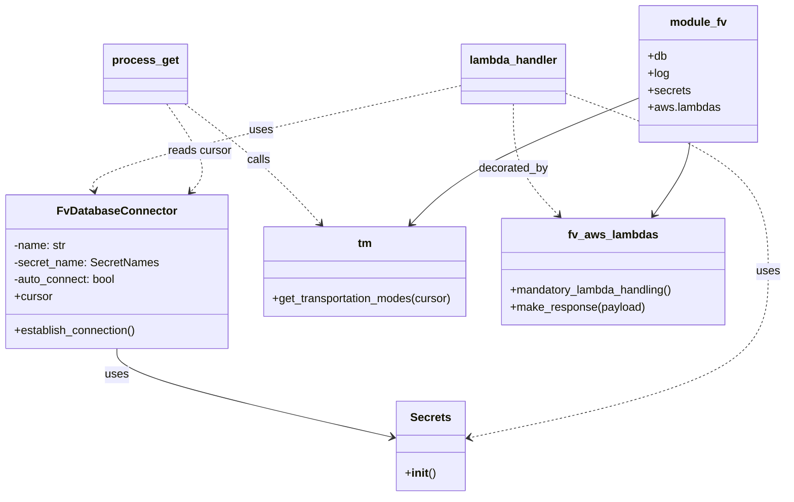

# Diagram: shipment_core/shipment_service/shipment_service/ng_shipments/ng_get_shipment_modes.py


> Auto-generated by Obscura crawlers

## Diagram 1



### SVG

<svg id="container" width="1103.73828125" xmlns="http://www.w3.org/2000/svg" class="classDiagram" height="698" viewBox="0 0 1103.73828125 698" role="graphics-document document" aria-roledescription="class"><style>#container{font-family:"trebuchet ms",verdana,arial,sans-serif;font-size:16px;fill:#333;}@keyframes edge-animation-frame{from{stroke-dashoffset:0;}}@keyframes dash{to{stroke-dashoffset:0;}}#container .edge-animation-slow{stroke-dasharray:9,5!important;stroke-dashoffset:900;animation:dash 50s linear infinite;stroke-linecap:round;}#container .edge-animation-fast{stroke-dasharray:9,5!important;stroke-dashoffset:900;animation:dash 20s linear infinite;stroke-linecap:round;}#container .error-icon{fill:#552222;}#container .error-text{fill:#552222;stroke:#552222;}#container .edge-thickness-normal{stroke-width:1px;}#container .edge-thickness-thick{stroke-width:3.5px;}#container .edge-pattern-solid{stroke-dasharray:0;}#container .edge-thickness-invisible{stroke-width:0;fill:none;}#container .edge-pattern-dashed{stroke-dasharray:3;}#container .edge-pattern-dotted{stroke-dasharray:2;}#container .marker{fill:#333333;stroke:#333333;}#container .marker.cross{stroke:#333333;}#container svg{font-family:"trebuchet ms",verdana,arial,sans-serif;font-size:16px;}#container p{margin:0;}#container g.classGroup text{fill:#9370DB;stroke:none;font-family:"trebuchet ms",verdana,arial,sans-serif;font-size:10px;}#container g.classGroup text .title{font-weight:bolder;}#container .nodeLabel,#container .edgeLabel{color:#131300;}#container .edgeLabel .label rect{fill:#ECECFF;}#container .label text{fill:#131300;}#container .labelBkg{background:#ECECFF;}#container .edgeLabel .label span{background:#ECECFF;}#container .classTitle{font-weight:bolder;}#container .node rect,#container .node circle,#container .node ellipse,#container .node polygon,#container .node path{fill:#ECECFF;stroke:#9370DB;stroke-width:1px;}#container .divider{stroke:#9370DB;stroke-width:1;}#container g.clickable{cursor:pointer;}#container g.classGroup rect{fill:#ECECFF;stroke:#9370DB;}#container g.classGroup line{stroke:#9370DB;stroke-width:1;}#container .classLabel .box{stroke:none;stroke-width:0;fill:#ECECFF;opacity:0.5;}#container .classLabel .label{fill:#9370DB;font-size:10px;}#container .relation{stroke:#333333;stroke-width:1;fill:none;}#container .dashed-line{stroke-dasharray:3;}#container .dotted-line{stroke-dasharray:1 2;}#container #compositionStart,#container .composition{fill:#333333!important;stroke:#333333!important;stroke-width:1;}#container #compositionEnd,#container .composition{fill:#333333!important;stroke:#333333!important;stroke-width:1;}#container #dependencyStart,#container .dependency{fill:#333333!important;stroke:#333333!important;stroke-width:1;}#container #dependencyStart,#container .dependency{fill:#333333!important;stroke:#333333!important;stroke-width:1;}#container #extensionStart,#container .extension{fill:transparent!important;stroke:#333333!important;stroke-width:1;}#container #extensionEnd,#container .extension{fill:transparent!important;stroke:#333333!important;stroke-width:1;}#container #aggregationStart,#container .aggregation{fill:transparent!important;stroke:#333333!important;stroke-width:1;}#container #aggregationEnd,#container .aggregation{fill:transparent!important;stroke:#333333!important;stroke-width:1;}#container #lollipopStart,#container .lollipop{fill:#ECECFF!important;stroke:#333333!important;stroke-width:1;}#container #lollipopEnd,#container .lollipop{fill:#ECECFF!important;stroke:#333333!important;stroke-width:1;}#container .edgeTerminals{font-size:11px;line-height:initial;}#container .classTitleText{text-anchor:middle;font-size:18px;fill:#333;}#container .label-icon{display:inline-block;height:1em;overflow:visible;vertical-align:-0.125em;}#container .node .label-icon path{fill:currentColor;stroke:revert;stroke-width:revert;}#container :root{--mermaid-font-family:"trebuchet ms",verdana,arial,sans-serif;}</style><g><defs><marker id="container_class-aggregationStart" class="marker aggregation class" refX="18" refY="7" markerWidth="190" markerHeight="240" orient="auto"><path d="M 18,7 L9,13 L1,7 L9,1 Z"></path></marker></defs><defs><marker id="container_class-aggregationEnd" class="marker aggregation class" refX="1" refY="7" markerWidth="20" markerHeight="28" orient="auto"><path d="M 18,7 L9,13 L1,7 L9,1 Z"></path></marker></defs><defs><marker id="container_class-extensionStart" class="marker extension class" refX="18" refY="7" markerWidth="190" markerHeight="240" orient="auto"><path d="M 1,7 L18,13 V 1 Z"></path></marker></defs><defs><marker id="container_class-extensionEnd" class="marker extension class" refX="1" refY="7" markerWidth="20" markerHeight="28" orient="auto"><path d="M 1,1 V 13 L18,7 Z"></path></marker></defs><defs><marker id="container_class-compositionStart" class="marker composition class" refX="18" refY="7" markerWidth="190" markerHeight="240" orient="auto"><path d="M 18,7 L9,13 L1,7 L9,1 Z"></path></marker></defs><defs><marker id="container_class-compositionEnd" class="marker composition class" refX="1" refY="7" markerWidth="20" markerHeight="28" orient="auto"><path d="M 18,7 L9,13 L1,7 L9,1 Z"></path></marker></defs><defs><marker id="container_class-dependencyStart" class="marker dependency class" refX="6" refY="7" markerWidth="190" markerHeight="240" orient="auto"><path d="M 5,7 L9,13 L1,7 L9,1 Z"></path></marker></defs><defs><marker id="container_class-dependencyEnd" class="marker dependency class" refX="13" refY="7" markerWidth="20" markerHeight="28" orient="auto"><path d="M 18,7 L9,13 L14,7 L9,1 Z"></path></marker></defs><defs><marker id="container_class-lollipopStart" class="marker lollipop class" refX="13" refY="7" markerWidth="190" markerHeight="240" orient="auto"><circle stroke="black" fill="transparent" cx="7" cy="7" r="6"></circle></marker></defs><defs><marker id="container_class-lollipopEnd" class="marker lollipop class" refX="1" refY="7" markerWidth="190" markerHeight="240" orient="auto"><circle stroke="black" fill="transparent" cx="7" cy="7" r="6"></circle></marker></defs><g class="root"><g class="clusters"></g><g class="edgePaths"><path d="M160.762,490L160.762,496.167C160.762,502.333,160.762,514.667,225.757,535.511C290.752,556.356,420.741,585.712,485.736,600.39L550.731,615.068" id="id_FvDatabaseConnector_Secrets_1" class="edge-thickness-normal edge-pattern-solid relation" style=";;;" data-edge="true" data-et="edge" data-id="id_FvDatabaseConnector_Secrets_1" data-points="W3sieCI6MTYwLjc2MTcxODc1LCJ5Ijo0OTB9LHsieCI6MTYwLjc2MTcxODc1LCJ5Ijo1Mjd9LHsieCI6NTU2LjU4Mzk4NDM3NSwieSI6NjE2LjM5MDIwMzU1OTUzNX1d" marker-end="url(#container_class-dependencyEnd)"></path><path d="M648.502,119.943L560.422,139.452C472.342,158.962,296.183,197.981,209.565,222.694C122.948,247.408,125.872,257.816,127.334,263.02L128.796,268.224" id="id_lambda_handler_FvDatabaseConnector_2" class="edge-thickness-normal edge-pattern-dashed relation" style=";;;" data-edge="true" data-et="edge" data-id="id_lambda_handler_FvDatabaseConnector_2" data-points="W3sieCI6NjQ4LjUwMTk1MzEyNSwieSI6MTE5Ljk0MjcxMjcyMTE0NTc0fSx7IngiOjEyMC4wMjM0Mzc1LCJ5IjoyMzd9LHsieCI6MTMwLjQxODcyMzA2MDM0NDgzLCJ5IjoyNzR9XQ==" marker-end="url(#container_class-dependencyEnd)"></path><path d="M792.455,130.683L840.254,148.402C888.052,166.122,983.649,201.561,1031.448,243.447C1079.246,285.333,1079.246,333.667,1079.246,382C1079.246,430.333,1079.246,478.667,1008.775,517.648C938.303,556.63,797.36,586.259,726.888,601.074L656.417,615.889" id="id_lambda_handler_Secrets_3" class="edge-thickness-normal edge-pattern-dashed relation" style=";;;" data-edge="true" data-et="edge" data-id="id_lambda_handler_Secrets_3" data-points="W3sieCI6NzkyLjQ1NTA3ODEyNSwieSI6MTMwLjY4MjY4NjQ5NzI4NjE3fSx7IngiOjEwNzkuMjQ2MDkzNzUsInkiOjIzN30seyJ4IjoxMDc5LjI0NjA5Mzc1LCJ5IjozODJ9LHsieCI6MTA3OS4yNDYwOTM3NSwieSI6NTI3fSx7IngiOjY1MC41NDQ5MjE4NzUsInkiOjYxNy4xMjM1NDgwMzM0NTUzfV0=" marker-end="url(#container_class-dependencyEnd)"></path><path d="M720.479,146L720.479,161.167C720.479,176.333,720.479,206.667,731.211,232.786C741.944,258.905,763.41,280.81,774.142,291.762L784.875,302.715" id="id_lambda_handler_fv_aws_lambdas_4" class="edge-thickness-normal edge-pattern-dashed relation" style=";;;" data-edge="true" data-et="edge" data-id="id_lambda_handler_fv_aws_lambdas_4" data-points="W3sieCI6NzIwLjQ3ODUxNTYyNSwieSI6MTQ2fSx7IngiOjcyMC40Nzg1MTU2MjUsInkiOjIzN30seyJ4Ijo3ODkuMDc0NTU1NDk1Njg5NywieSI6MzA3fV0=" marker-end="url(#container_class-dependencyEnd)"></path><path d="M256.463,146L276.32,161.167C296.176,176.333,335.889,206.667,367.642,234.764C399.396,262.862,423.19,288.723,435.088,301.654L446.985,314.585" id="id_process_get_tm_5" class="edge-thickness-normal edge-pattern-dashed relation" style=";;;" data-edge="true" data-et="edge" data-id="id_process_get_tm_5" data-points="W3sieCI6MjU2LjQ2MzQwNDYwNTI2MzIsInkiOjE0Nn0seyJ4IjozNzUuNjAxNTYyNSwieSI6MjM3fSx7IngiOjQ1MS4wNDczMDYwMzQ0ODI3NCwieSI6MzE5fV0=" marker-end="url(#container_class-dependencyEnd)"></path><path d="M230.749,146L241.319,161.167C251.89,176.333,273.031,206.667,278.605,227.264C284.179,247.862,274.185,258.723,269.188,264.154L264.192,269.585" id="id_process_get_FvDatabaseConnector_6" class="edge-thickness-normal edge-pattern-dashed relation" style=";;;" data-edge="true" data-et="edge" data-id="id_process_get_FvDatabaseConnector_6" data-points="W3sieCI6MjMwLjc0ODc2NjQ0NzM2ODQsInkiOjE0Nn0seyJ4IjoyOTQuMTcxODc1LCJ5IjoyMzd9LHsieCI6MjYwLjEyOTI4MzQwNTE3MjQzLCJ5IjoyNzR9XQ==" marker-end="url(#container_class-dependencyEnd)"></path><path d="M968.244,200L967.614,206.167C966.985,212.333,965.725,224.667,957.471,241.682C949.218,258.697,933.971,280.394,926.348,291.242L918.724,302.091" id="id_module_fv_fv_aws_lambdas_7" class="edge-thickness-normal edge-pattern-solid relation" style=";;;" data-edge="true" data-et="edge" data-id="id_module_fv_fv_aws_lambdas_7" data-points="W3sieCI6OTY4LjI0NDM5MDI3MjU1NjQsInkiOjIwMH0seyJ4Ijo5NjQuNDY0ODQzNzUsInkiOjIzN30seyJ4Ijo5MTUuMjc0MzgwMzg3OTMxLCJ5IjozMDd9XQ==" marker-end="url(#container_class-dependencyEnd)"></path><path d="M896.238,137.281L855.382,153.901C814.527,170.521,732.815,203.76,679.267,233.333C625.718,262.905,600.333,288.81,587.64,301.762L574.948,314.715" id="id_module_fv_tm_8" class="edge-thickness-normal edge-pattern-solid relation" style=";;;" data-edge="true" data-et="edge" data-id="id_module_fv_tm_8" data-points="W3sieCI6ODk2LjIzODI4MTI1LCJ5IjoxMzcuMjgwNzg3NTg4Nzg1OTN9LHsieCI6NjUxLjEwMzUxNTYyNSwieSI6MjM3fSx7IngiOjU3MC43NDgxNTQ2MzM2MjA3LCJ5IjozMTl9XQ==" marker-end="url(#container_class-dependencyEnd)"></path></g><g class="edgeLabels"><g class="edgeLabel" transform="translate(160.76171875, 527)"><g class="label" data-id="id_FvDatabaseConnector_Secrets_1" transform="translate(-16.4921875, -12)"><foreignObject width="32.984375" height="24"><div xmlns="http://www.w3.org/1999/xhtml" class="labelBkg" style="display: table-cell; white-space: nowrap; line-height: 1.5; max-width: 200px; text-align: center;"><span class="edgeLabel"><p>uses</p></span></div></foreignObject></g></g><g class="edgeLabel" transform="translate(120.0234375, 237)"><g class="label" data-id="id_lambda_handler_FvDatabaseConnector_2" transform="translate(-16.4921875, -12)"><foreignObject width="32.984375" height="24"><div xmlns="http://www.w3.org/1999/xhtml" class="labelBkg" style="display: table-cell; white-space: nowrap; line-height: 1.5; max-width: 200px; text-align: center;"><span class="edgeLabel"><p>uses</p></span></div></foreignObject></g></g><g class="edgeLabel" transform="translate(1079.24609375, 382)"><g class="label" data-id="id_lambda_handler_Secrets_3" transform="translate(-16.4921875, -12)"><foreignObject width="32.984375" height="24"><div xmlns="http://www.w3.org/1999/xhtml" class="labelBkg" style="display: table-cell; white-space: nowrap; line-height: 1.5; max-width: 200px; text-align: center;"><span class="edgeLabel"><p>uses</p></span></div></foreignObject></g></g><g class="edgeLabel" transform="translate(720.478515625, 237)"><g class="label" data-id="id_lambda_handler_fv_aws_lambdas_4" transform="translate(-49.375, -12)"><foreignObject width="98.75" height="24"><div xmlns="http://www.w3.org/1999/xhtml" class="labelBkg" style="display: table-cell; white-space: nowrap; line-height: 1.5; max-width: 200px; text-align: center;"><span class="edgeLabel"><p>decorated_by</p></span></div></foreignObject></g></g><g class="edgeLabel" transform="translate(360.30803, 225.31851)"><g class="label" data-id="id_process_get_tm_5" transform="translate(-16.4453125, -12)"><foreignObject width="32.890625" height="24"><div xmlns="http://www.w3.org/1999/xhtml" class="labelBkg" style="display: table-cell; white-space: nowrap; line-height: 1.5; max-width: 200px; text-align: center;"><span class="edgeLabel"><p>calls</p></span></div></foreignObject></g></g><g class="edgeLabel" transform="translate(276.8345, 212.12419)"><g class="label" data-id="id_process_get_FvDatabaseConnector_6" transform="translate(-44.984375, -12)"><foreignObject width="89.96875" height="24"><div xmlns="http://www.w3.org/1999/xhtml" class="labelBkg" style="display: table-cell; white-space: nowrap; line-height: 1.5; max-width: 200px; text-align: center;"><span class="edgeLabel"><p>reads cursor</p></span></div></foreignObject></g></g><g class="edgeLabel"><g class="label" data-id="id_module_fv_fv_aws_lambdas_7" transform="translate(0, 0)"><foreignObject width="0" height="0"><div xmlns="http://www.w3.org/1999/xhtml" class="labelBkg" style="display: table-cell; white-space: nowrap; line-height: 1.5; max-width: 200px; text-align: center;"><span class="edgeLabel"></span></div></foreignObject></g></g><g class="edgeLabel"><g class="label" data-id="id_module_fv_tm_8" transform="translate(0, 0)"><foreignObject width="0" height="0"><div xmlns="http://www.w3.org/1999/xhtml" class="labelBkg" style="display: table-cell; white-space: nowrap; line-height: 1.5; max-width: 200px; text-align: center;"><span class="edgeLabel"></span></div></foreignObject></g></g></g><g class="nodes"><g class="node default" id="classId-FvDatabaseConnector-0" transform="translate(160.76171875, 382)"><g class="basic label-container"><path d="M-152.76171875 -108 L152.76171875 -108 L152.76171875 108 L-152.76171875 108" stroke="none" stroke-width="0" fill="#ECECFF" style=""></path><path d="M-152.76171875 -108 C-44.51806697923713 -108, 63.72558479152573 -108, 152.76171875 -108 M-152.76171875 -108 C-38.33788769070773 -108, 76.08594336858454 -108, 152.76171875 -108 M152.76171875 -108 C152.76171875 -26.5158936617796, 152.76171875 54.9682126764408, 152.76171875 108 M152.76171875 -108 C152.76171875 -26.326080361721026, 152.76171875 55.34783927655795, 152.76171875 108 M152.76171875 108 C89.81812891738666 108, 26.874539084773318 108, -152.76171875 108 M152.76171875 108 C40.664204796479794 108, -71.43330915704041 108, -152.76171875 108 M-152.76171875 108 C-152.76171875 23.881274402430847, -152.76171875 -60.237451195138306, -152.76171875 -108 M-152.76171875 108 C-152.76171875 46.914684727402005, -152.76171875 -14.17063054519599, -152.76171875 -108" stroke="#9370DB" stroke-width="1.3" fill="none" stroke-dasharray="0 0" style=""></path></g><g class="annotation-group text" transform="translate(0, -84)"></g><g class="label-group text" transform="translate(-79.3046875, -84)"><g class="label" style="font-weight: bolder" transform="translate(0,-12)"><foreignObject width="158.609375" height="24"><div xmlns="http://www.w3.org/1999/xhtml" style="display: table-cell; white-space: nowrap; line-height: 1.5; max-width: 207px; text-align: center;"><span class="nodeLabel markdown-node-label" style=""><p>FvDatabaseConnector</p></span></div></foreignObject></g></g><g class="members-group text" transform="translate(-140.76171875, -36)"><g class="label" style="" transform="translate(0,-12)"><foreignObject width="74.46875" height="24"><div xmlns="http://www.w3.org/1999/xhtml" style="display: table-cell; white-space: nowrap; line-height: 1.5; max-width: 133px; text-align: center;"><span class="nodeLabel markdown-node-label" style=""><p>-name: str</p></span></div></foreignObject></g><g class="label" style="" transform="translate(0,12)"><foreignObject width="202.21875" height="24"><div xmlns="http://www.w3.org/1999/xhtml" style="display: table-cell; white-space: nowrap; line-height: 1.5; max-width: 260px; text-align: center;"><span class="nodeLabel markdown-node-label" style=""><p>-secret_name: SecretNames</p></span></div></foreignObject></g><g class="label" style="" transform="translate(0,36)"><foreignObject width="145.390625" height="24"><div xmlns="http://www.w3.org/1999/xhtml" style="display: table-cell; white-space: nowrap; line-height: 1.5; max-width: 203px; text-align: center;"><span class="nodeLabel markdown-node-label" style=""><p>-auto_connect: bool</p></span></div></foreignObject></g><g class="label" style="" transform="translate(0,60)"><foreignObject width="53.71875" height="24"><div xmlns="http://www.w3.org/1999/xhtml" style="display: table-cell; white-space: nowrap; line-height: 1.5; max-width: 112px; text-align: center;"><span class="nodeLabel markdown-node-label" style=""><p>+cursor</p></span></div></foreignObject></g></g><g class="methods-group text" transform="translate(-140.76171875, 84)"><g class="label" style="" transform="translate(0,-12)"><foreignObject width="173.265625" height="24"><div xmlns="http://www.w3.org/1999/xhtml" style="display: table-cell; white-space: nowrap; line-height: 1.5; max-width: 231px; text-align: center;"><span class="nodeLabel markdown-node-label" style=""><p>+establish_connection()</p></span></div></foreignObject></g></g><g class="divider" style=""><path d="M-152.76171875 -60 C-81.59995728645897 -60, -10.438195822917947 -60, 152.76171875 -60 M-152.76171875 -60 C-31.078069651374037 -60, 90.60557944725193 -60, 152.76171875 -60" stroke="#9370DB" stroke-width="1.3" fill="none" stroke-dasharray="0 0" style=""></path></g><g class="divider" style=""><path d="M-152.76171875 60 C-48.625280762193015 60, 55.51115722561397 60, 152.76171875 60 M-152.76171875 60 C-41.62971865436958 60, 69.50228144126083 60, 152.76171875 60" stroke="#9370DB" stroke-width="1.3" fill="none" stroke-dasharray="0 0" style=""></path></g></g><g class="node default" id="classId-Secrets-1" transform="translate(603.564453125, 627)"><g class="basic label-container"><path d="M-46.98046875 -63 L46.98046875 -63 L46.98046875 63 L-46.98046875 63" stroke="none" stroke-width="0" fill="#ECECFF" style=""></path><path d="M-46.98046875 -63 C-9.461932705711916 -63, 28.056603338576167 -63, 46.98046875 -63 M-46.98046875 -63 C-18.3948286523443 -63, 10.190811445311397 -63, 46.98046875 -63 M46.98046875 -63 C46.98046875 -24.92512943447256, 46.98046875 13.149741131054881, 46.98046875 63 M46.98046875 -63 C46.98046875 -30.137641020791136, 46.98046875 2.7247179584177275, 46.98046875 63 M46.98046875 63 C10.271160290872096 63, -26.438148168255807 63, -46.98046875 63 M46.98046875 63 C25.010329418758232 63, 3.0401900875164642 63, -46.98046875 63 M-46.98046875 63 C-46.98046875 16.461941114398932, -46.98046875 -30.076117771202135, -46.98046875 -63 M-46.98046875 63 C-46.98046875 14.27294567362091, -46.98046875 -34.45410865275818, -46.98046875 -63" stroke="#9370DB" stroke-width="1.3" fill="none" stroke-dasharray="0 0" style=""></path></g><g class="annotation-group text" transform="translate(0, -39)"></g><g class="label-group text" transform="translate(-27.1640625, -39)"><g class="label" style="font-weight: bolder" transform="translate(0,-12)"><foreignObject width="54.328125" height="24"><div xmlns="http://www.w3.org/1999/xhtml" style="display: table-cell; white-space: nowrap; line-height: 1.5; max-width: 103px; text-align: center;"><span class="nodeLabel markdown-node-label" style=""><p>Secrets</p></span></div></foreignObject></g></g><g class="members-group text" transform="translate(-34.98046875, 9)"></g><g class="methods-group text" transform="translate(-34.98046875, 39)"><g class="label" style="" transform="translate(0,-12)"><foreignObject width="42.796875" height="24"><div xmlns="http://www.w3.org/1999/xhtml" style="display: table-cell; white-space: nowrap; line-height: 1.5; max-width: 132px; text-align: center;"><span class="nodeLabel markdown-node-label" style=""><p>+<strong>init</strong>()</p></span></div></foreignObject></g></g><g class="divider" style=""><path d="M-46.98046875 -15 C-21.463151430797136 -15, 4.054165888405727 -15, 46.98046875 -15 M-46.98046875 -15 C-15.537061272545678 -15, 15.906346204908644 -15, 46.98046875 -15" stroke="#9370DB" stroke-width="1.3" fill="none" stroke-dasharray="0 0" style=""></path></g><g class="divider" style=""><path d="M-46.98046875 9 C-18.72163127446567 9, 9.537206201068663 9, 46.98046875 9 M-46.98046875 9 C-21.18728069380651 9, 4.605907362386979 9, 46.98046875 9" stroke="#9370DB" stroke-width="1.3" fill="none" stroke-dasharray="0 0" style=""></path></g></g><g class="node default" id="classId-tm-2" transform="translate(509.01171875, 382)"><g class="basic label-container"><path d="M-145.48828125 -63 L145.48828125 -63 L145.48828125 63 L-145.48828125 63" stroke="none" stroke-width="0" fill="#ECECFF" style=""></path><path d="M-145.48828125 -63 C-82.10190645850608 -63, -18.715531667012144 -63, 145.48828125 -63 M-145.48828125 -63 C-77.77345831613393 -63, -10.058635382267852 -63, 145.48828125 -63 M145.48828125 -63 C145.48828125 -28.016694816770404, 145.48828125 6.966610366459193, 145.48828125 63 M145.48828125 -63 C145.48828125 -24.675734281097803, 145.48828125 13.648531437804394, 145.48828125 63 M145.48828125 63 C82.66103808026571 63, 19.833794910531424 63, -145.48828125 63 M145.48828125 63 C81.79842840940576 63, 18.108575568811517 63, -145.48828125 63 M-145.48828125 63 C-145.48828125 26.340909644055138, -145.48828125 -10.318180711889724, -145.48828125 -63 M-145.48828125 63 C-145.48828125 20.903665048772474, -145.48828125 -21.19266990245505, -145.48828125 -63" stroke="#9370DB" stroke-width="1.3" fill="none" stroke-dasharray="0 0" style=""></path></g><g class="annotation-group text" transform="translate(0, -39)"></g><g class="label-group text" transform="translate(-9.8515625, -39)"><g class="label" style="font-weight: bolder" transform="translate(0,-12)"><foreignObject width="19.703125" height="24"><div xmlns="http://www.w3.org/1999/xhtml" style="display: table-cell; white-space: nowrap; line-height: 1.5; max-width: 70px; text-align: center;"><span class="nodeLabel markdown-node-label" style=""><p>tm</p></span></div></foreignObject></g></g><g class="members-group text" transform="translate(-133.48828125, 9)"></g><g class="methods-group text" transform="translate(-133.48828125, 39)"><g class="label" style="" transform="translate(0,-12)"><foreignObject width="257.125" height="24"><div xmlns="http://www.w3.org/1999/xhtml" style="display: table-cell; white-space: nowrap; line-height: 1.5; max-width: 314px; text-align: center;"><span class="nodeLabel markdown-node-label" style=""><p>+get_transportation_modes(cursor)</p></span></div></foreignObject></g></g><g class="divider" style=""><path d="M-145.48828125 -15 C-41.67823563745378 -15, 62.13180997509244 -15, 145.48828125 -15 M-145.48828125 -15 C-54.60944911943997 -15, 36.269383011120055 -15, 145.48828125 -15" stroke="#9370DB" stroke-width="1.3" fill="none" stroke-dasharray="0 0" style=""></path></g><g class="divider" style=""><path d="M-145.48828125 9 C-41.3818213158666 9, 62.724638618266795 9, 145.48828125 9 M-145.48828125 9 C-71.37235963418573 9, 2.7435619816285453 9, 145.48828125 9" stroke="#9370DB" stroke-width="1.3" fill="none" stroke-dasharray="0 0" style=""></path></g></g><g class="node default" id="classId-fv_aws_lambdas-3" transform="translate(862.5703125, 382)"><g class="basic label-container"><path d="M-158.0703125 -75 L158.0703125 -75 L158.0703125 75 L-158.0703125 75" stroke="none" stroke-width="0" fill="#ECECFF" style=""></path><path d="M-158.0703125 -75 C-70.70644567656919 -75, 16.657421146861623 -75, 158.0703125 -75 M-158.0703125 -75 C-42.28738399693299 -75, 73.49554450613402 -75, 158.0703125 -75 M158.0703125 -75 C158.0703125 -38.895772801303856, 158.0703125 -2.7915456026077123, 158.0703125 75 M158.0703125 -75 C158.0703125 -41.07796259395435, 158.0703125 -7.155925187908693, 158.0703125 75 M158.0703125 75 C81.04521879157912 75, 4.020125083158234 75, -158.0703125 75 M158.0703125 75 C66.77299390424018 75, -24.524324691519638 75, -158.0703125 75 M-158.0703125 75 C-158.0703125 35.23301197453367, -158.0703125 -4.533976050932665, -158.0703125 -75 M-158.0703125 75 C-158.0703125 33.42394132648371, -158.0703125 -8.152117347032586, -158.0703125 -75" stroke="#9370DB" stroke-width="1.3" fill="none" stroke-dasharray="0 0" style=""></path></g><g class="annotation-group text" transform="translate(0, -51)"></g><g class="label-group text" transform="translate(-60.0625, -51)"><g class="label" style="font-weight: bolder" transform="translate(0,-12)"><foreignObject width="120.125" height="24"><div xmlns="http://www.w3.org/1999/xhtml" style="display: table-cell; white-space: nowrap; line-height: 1.5; max-width: 168px; text-align: center;"><span class="nodeLabel markdown-node-label" style=""><p>fv_aws_lambdas</p></span></div></foreignObject></g></g><g class="members-group text" transform="translate(-146.0703125, -3)"></g><g class="methods-group text" transform="translate(-146.0703125, 27)"><g class="label" style="" transform="translate(0,-12)"><foreignObject width="232.078125" height="24"><div xmlns="http://www.w3.org/1999/xhtml" style="display: table-cell; white-space: nowrap; line-height: 1.5; max-width: 289px; text-align: center;"><span class="nodeLabel markdown-node-label" style=""><p>+mandatory_lambda_handling()</p></span></div></foreignObject></g><g class="label" style="" transform="translate(0,12)"><foreignObject width="189.59375" height="24"><div xmlns="http://www.w3.org/1999/xhtml" style="display: table-cell; white-space: nowrap; line-height: 1.5; max-width: 247px; text-align: center;"><span class="nodeLabel markdown-node-label" style=""><p>+make_response(payload)</p></span></div></foreignObject></g></g><g class="divider" style=""><path d="M-158.0703125 -27 C-63.88072146837402 -27, 30.30886956325196 -27, 158.0703125 -27 M-158.0703125 -27 C-72.57403086376182 -27, 12.92225077247636 -27, 158.0703125 -27" stroke="#9370DB" stroke-width="1.3" fill="none" stroke-dasharray="0 0" style=""></path></g><g class="divider" style=""><path d="M-158.0703125 -3 C-77.34826094224425 -3, 3.3737906155114956 -3, 158.0703125 -3 M-158.0703125 -3 C-53.663787086936594 -3, 50.74273832612681 -3, 158.0703125 -3" stroke="#9370DB" stroke-width="1.3" fill="none" stroke-dasharray="0 0" style=""></path></g></g><g class="node default" id="classId-module_fv-4" transform="translate(978.05078125, 104)"><g class="basic label-container"><path d="M-81.8125 -96 L81.8125 -96 L81.8125 96 L-81.8125 96" stroke="none" stroke-width="0" fill="#ECECFF" style=""></path><path d="M-81.8125 -96 C-36.91987350066572 -96, 7.972752998668554 -96, 81.8125 -96 M-81.8125 -96 C-28.198347494376087 -96, 25.415805011247826 -96, 81.8125 -96 M81.8125 -96 C81.8125 -43.86458962897079, 81.8125 8.270820742058419, 81.8125 96 M81.8125 -96 C81.8125 -56.50846520426566, 81.8125 -17.016930408531323, 81.8125 96 M81.8125 96 C28.66784061158576 96, -24.47681877682848 96, -81.8125 96 M81.8125 96 C19.139559561976412 96, -43.533380876047175 96, -81.8125 96 M-81.8125 96 C-81.8125 19.565890947582943, -81.8125 -56.86821810483411, -81.8125 -96 M-81.8125 96 C-81.8125 35.431780449025425, -81.8125 -25.13643910194915, -81.8125 -96" stroke="#9370DB" stroke-width="1.3" fill="none" stroke-dasharray="0 0" style=""></path></g><g class="annotation-group text" transform="translate(0, -72)"></g><g class="label-group text" transform="translate(-38.359375, -72)"><g class="label" style="font-weight: bolder" transform="translate(0,-12)"><foreignObject width="76.71875" height="24"><div xmlns="http://www.w3.org/1999/xhtml" style="display: table-cell; white-space: nowrap; line-height: 1.5; max-width: 126px; text-align: center;"><span class="nodeLabel markdown-node-label" style=""><p>module_fv</p></span></div></foreignObject></g></g><g class="members-group text" transform="translate(-69.8125, -24)"><g class="label" style="" transform="translate(0,-12)"><foreignObject width="27.0625" height="24"><div xmlns="http://www.w3.org/1999/xhtml" style="display: table-cell; white-space: nowrap; line-height: 1.5; max-width: 84px; text-align: center;"><span class="nodeLabel markdown-node-label" style=""><p>+db</p></span></div></foreignObject></g><g class="label" style="" transform="translate(0,12)"><foreignObject width="30.265625" height="24"><div xmlns="http://www.w3.org/1999/xhtml" style="display: table-cell; white-space: nowrap; line-height: 1.5; max-width: 88px; text-align: center;"><span class="nodeLabel markdown-node-label" style=""><p>+log</p></span></div></foreignObject></g><g class="label" style="" transform="translate(0,36)"><foreignObject width="59.5" height="24"><div xmlns="http://www.w3.org/1999/xhtml" style="display: table-cell; white-space: nowrap; line-height: 1.5; max-width: 117px; text-align: center;"><span class="nodeLabel markdown-node-label" style=""><p>+secrets</p></span></div></foreignObject></g><g class="label" style="" transform="translate(0,60)"><foreignObject width="101.265625" height="24"><div xmlns="http://www.w3.org/1999/xhtml" style="display: table-cell; white-space: nowrap; line-height: 1.5; max-width: 159px; text-align: center;"><span class="nodeLabel markdown-node-label" style=""><p>+aws.lambdas</p></span></div></foreignObject></g></g><g class="methods-group text" transform="translate(-69.8125, 96)"></g><g class="divider" style=""><path d="M-81.8125 -48 C-32.632111330672956 -48, 16.54827733865409 -48, 81.8125 -48 M-81.8125 -48 C-43.53560955121179 -48, -5.2587191024235835 -48, 81.8125 -48" stroke="#9370DB" stroke-width="1.3" fill="none" stroke-dasharray="0 0" style=""></path></g><g class="divider" style=""><path d="M-81.8125 72 C-46.95838232287977 72, -12.104264645759542 72, 81.8125 72 M-81.8125 72 C-16.734635724456425 72, 48.34322855108715 72, 81.8125 72" stroke="#9370DB" stroke-width="1.3" fill="none" stroke-dasharray="0 0" style=""></path></g></g><g class="node default" id="classId-lambda_handler-5" transform="translate(720.478515625, 104)"><g class="basic label-container"><path d="M-71.9765625 -42 L71.9765625 -42 L71.9765625 42 L-71.9765625 42" stroke="none" stroke-width="0" fill="#ECECFF" style=""></path><path d="M-71.9765625 -42 C-14.890616436924581 -42, 42.19532962615084 -42, 71.9765625 -42 M-71.9765625 -42 C-25.175457864284766 -42, 21.625646771430468 -42, 71.9765625 -42 M71.9765625 -42 C71.9765625 -21.894952447705432, 71.9765625 -1.7899048954108636, 71.9765625 42 M71.9765625 -42 C71.9765625 -18.870044309656773, 71.9765625 4.259911380686454, 71.9765625 42 M71.9765625 42 C26.177740075845264 42, -19.62108234830947 42, -71.9765625 42 M71.9765625 42 C23.195667054881227 42, -25.585228390237546 42, -71.9765625 42 M-71.9765625 42 C-71.9765625 11.078390108959699, -71.9765625 -19.843219782080602, -71.9765625 -42 M-71.9765625 42 C-71.9765625 11.571112495776504, -71.9765625 -18.857775008446993, -71.9765625 -42" stroke="#9370DB" stroke-width="1.3" fill="none" stroke-dasharray="0 0" style=""></path></g><g class="annotation-group text" transform="translate(0, -18)"></g><g class="label-group text" transform="translate(-59.9765625, -18)"><g class="label" style="font-weight: bolder" transform="translate(0,-12)"><foreignObject width="119.953125" height="24"><div xmlns="http://www.w3.org/1999/xhtml" style="display: table-cell; white-space: nowrap; line-height: 1.5; max-width: 170px; text-align: center;"><span class="nodeLabel markdown-node-label" style=""><p>lambda_handler</p></span></div></foreignObject></g></g><g class="members-group text" transform="translate(-59.9765625, 30)"></g><g class="methods-group text" transform="translate(-59.9765625, 60)"></g><g class="divider" style=""><path d="M-71.9765625 6 C-37.82942678125934 6, -3.6822910625186864 6, 71.9765625 6 M-71.9765625 6 C-36.319488207643076 6, -0.6624139152861517 6, 71.9765625 6" stroke="#9370DB" stroke-width="1.3" fill="none" stroke-dasharray="0 0" style=""></path></g><g class="divider" style=""><path d="M-71.9765625 24 C-23.326434802648976 24, 25.32369289470205 24, 71.9765625 24 M-71.9765625 24 C-19.79674424545415 24, 32.3830740090917 24, 71.9765625 24" stroke="#9370DB" stroke-width="1.3" fill="none" stroke-dasharray="0 0" style=""></path></g></g><g class="node default" id="classId-process_get-6" transform="translate(201.4765625, 104)"><g class="basic label-container"><path d="M-56.046875 -42 L56.046875 -42 L56.046875 42 L-56.046875 42" stroke="none" stroke-width="0" fill="#ECECFF" style=""></path><path d="M-56.046875 -42 C-17.330469454369613 -42, 21.385936091260774 -42, 56.046875 -42 M-56.046875 -42 C-31.111947104282443 -42, -6.177019208564886 -42, 56.046875 -42 M56.046875 -42 C56.046875 -12.461745823181584, 56.046875 17.076508353636832, 56.046875 42 M56.046875 -42 C56.046875 -22.157508815799762, 56.046875 -2.315017631599524, 56.046875 42 M56.046875 42 C19.953269676975808 42, -16.140335646048385 42, -56.046875 42 M56.046875 42 C12.913204281227138 42, -30.220466437545724 42, -56.046875 42 M-56.046875 42 C-56.046875 24.405836517677155, -56.046875 6.8116730353543105, -56.046875 -42 M-56.046875 42 C-56.046875 24.50834835418137, -56.046875 7.016696708362737, -56.046875 -42" stroke="#9370DB" stroke-width="1.3" fill="none" stroke-dasharray="0 0" style=""></path></g><g class="annotation-group text" transform="translate(0, -18)"></g><g class="label-group text" transform="translate(-44.046875, -18)"><g class="label" style="font-weight: bolder" transform="translate(0,-12)"><foreignObject width="88.09375" height="24"><div xmlns="http://www.w3.org/1999/xhtml" style="display: table-cell; white-space: nowrap; line-height: 1.5; max-width: 136px; text-align: center;"><span class="nodeLabel markdown-node-label" style=""><p>process_get</p></span></div></foreignObject></g></g><g class="members-group text" transform="translate(-44.046875, 30)"></g><g class="methods-group text" transform="translate(-44.046875, 60)"></g><g class="divider" style=""><path d="M-56.046875 6 C-25.82349498136416 6, 4.39988503727168 6, 56.046875 6 M-56.046875 6 C-21.701870385704886 6, 12.643134228590228 6, 56.046875 6" stroke="#9370DB" stroke-width="1.3" fill="none" stroke-dasharray="0 0" style=""></path></g><g class="divider" style=""><path d="M-56.046875 24 C-18.2189176479516 24, 19.6090397040968 24, 56.046875 24 M-56.046875 24 C-11.31071604840082 24, 33.42544290319836 24, 56.046875 24" stroke="#9370DB" stroke-width="1.3" fill="none" stroke-dasharray="0 0" style=""></path></g></g></g></g></g></svg>

## Diagram 2

```mermaid
flowchart TD
    A[Invoke lambda_handler(event, context, audit_refs)] --> B[DB_CONN.establish_connection()]
    B --> C[Get cursor from DB_CONN]
    C --> D[process_get(cursor, event)]
    D --> E[tm.get_transportation_modes(cursor)]
    E --> F[Convert namedtuples to dicts]
    F --> G[fv.aws.lambdas.make_response(modes)]
    G --> H[Return HTTP response]
```

> SVG rendering failed for this diagram.
