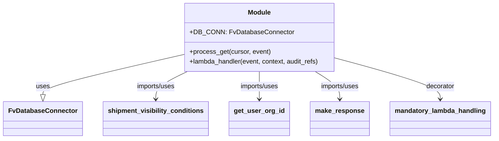

# Diagram: shipment_core/shipment_service/shipment_service/ng_shipments/ng_get_trailer_numbers.py


> Auto-generated by Obscura crawlers

## Diagram 1



### SVG

<svg id="container" width="1165.515625" xmlns="http://www.w3.org/2000/svg" class="classDiagram" height="342" viewBox="0 0 1165.515625 342" role="graphics-document document" aria-roledescription="class"><style>#container{font-family:"trebuchet ms",verdana,arial,sans-serif;font-size:16px;fill:#333;}@keyframes edge-animation-frame{from{stroke-dashoffset:0;}}@keyframes dash{to{stroke-dashoffset:0;}}#container .edge-animation-slow{stroke-dasharray:9,5!important;stroke-dashoffset:900;animation:dash 50s linear infinite;stroke-linecap:round;}#container .edge-animation-fast{stroke-dasharray:9,5!important;stroke-dashoffset:900;animation:dash 20s linear infinite;stroke-linecap:round;}#container .error-icon{fill:#552222;}#container .error-text{fill:#552222;stroke:#552222;}#container .edge-thickness-normal{stroke-width:1px;}#container .edge-thickness-thick{stroke-width:3.5px;}#container .edge-pattern-solid{stroke-dasharray:0;}#container .edge-thickness-invisible{stroke-width:0;fill:none;}#container .edge-pattern-dashed{stroke-dasharray:3;}#container .edge-pattern-dotted{stroke-dasharray:2;}#container .marker{fill:#333333;stroke:#333333;}#container .marker.cross{stroke:#333333;}#container svg{font-family:"trebuchet ms",verdana,arial,sans-serif;font-size:16px;}#container p{margin:0;}#container g.classGroup text{fill:#9370DB;stroke:none;font-family:"trebuchet ms",verdana,arial,sans-serif;font-size:10px;}#container g.classGroup text .title{font-weight:bolder;}#container .nodeLabel,#container .edgeLabel{color:#131300;}#container .edgeLabel .label rect{fill:#ECECFF;}#container .label text{fill:#131300;}#container .labelBkg{background:#ECECFF;}#container .edgeLabel .label span{background:#ECECFF;}#container .classTitle{font-weight:bolder;}#container .node rect,#container .node circle,#container .node ellipse,#container .node polygon,#container .node path{fill:#ECECFF;stroke:#9370DB;stroke-width:1px;}#container .divider{stroke:#9370DB;stroke-width:1;}#container g.clickable{cursor:pointer;}#container g.classGroup rect{fill:#ECECFF;stroke:#9370DB;}#container g.classGroup line{stroke:#9370DB;stroke-width:1;}#container .classLabel .box{stroke:none;stroke-width:0;fill:#ECECFF;opacity:0.5;}#container .classLabel .label{fill:#9370DB;font-size:10px;}#container .relation{stroke:#333333;stroke-width:1;fill:none;}#container .dashed-line{stroke-dasharray:3;}#container .dotted-line{stroke-dasharray:1 2;}#container #compositionStart,#container .composition{fill:#333333!important;stroke:#333333!important;stroke-width:1;}#container #compositionEnd,#container .composition{fill:#333333!important;stroke:#333333!important;stroke-width:1;}#container #dependencyStart,#container .dependency{fill:#333333!important;stroke:#333333!important;stroke-width:1;}#container #dependencyStart,#container .dependency{fill:#333333!important;stroke:#333333!important;stroke-width:1;}#container #extensionStart,#container .extension{fill:transparent!important;stroke:#333333!important;stroke-width:1;}#container #extensionEnd,#container .extension{fill:transparent!important;stroke:#333333!important;stroke-width:1;}#container #aggregationStart,#container .aggregation{fill:transparent!important;stroke:#333333!important;stroke-width:1;}#container #aggregationEnd,#container .aggregation{fill:transparent!important;stroke:#333333!important;stroke-width:1;}#container #lollipopStart,#container .lollipop{fill:#ECECFF!important;stroke:#333333!important;stroke-width:1;}#container #lollipopEnd,#container .lollipop{fill:#ECECFF!important;stroke:#333333!important;stroke-width:1;}#container .edgeTerminals{font-size:11px;line-height:initial;}#container .classTitleText{text-anchor:middle;font-size:18px;fill:#333;}#container .label-icon{display:inline-block;height:1em;overflow:visible;vertical-align:-0.125em;}#container .node .label-icon path{fill:currentColor;stroke:revert;stroke-width:revert;}#container :root{--mermaid-font-family:"trebuchet ms",verdana,arial,sans-serif;}</style><g><defs><marker id="container_class-aggregationStart" class="marker aggregation class" refX="18" refY="7" markerWidth="190" markerHeight="240" orient="auto"><path d="M 18,7 L9,13 L1,7 L9,1 Z"></path></marker></defs><defs><marker id="container_class-aggregationEnd" class="marker aggregation class" refX="1" refY="7" markerWidth="20" markerHeight="28" orient="auto"><path d="M 18,7 L9,13 L1,7 L9,1 Z"></path></marker></defs><defs><marker id="container_class-extensionStart" class="marker extension class" refX="18" refY="7" markerWidth="190" markerHeight="240" orient="auto"><path d="M 1,7 L18,13 V 1 Z"></path></marker></defs><defs><marker id="container_class-extensionEnd" class="marker extension class" refX="1" refY="7" markerWidth="20" markerHeight="28" orient="auto"><path d="M 1,1 V 13 L18,7 Z"></path></marker></defs><defs><marker id="container_class-compositionStart" class="marker composition class" refX="18" refY="7" markerWidth="190" markerHeight="240" orient="auto"><path d="M 18,7 L9,13 L1,7 L9,1 Z"></path></marker></defs><defs><marker id="container_class-compositionEnd" class="marker composition class" refX="1" refY="7" markerWidth="20" markerHeight="28" orient="auto"><path d="M 18,7 L9,13 L1,7 L9,1 Z"></path></marker></defs><defs><marker id="container_class-dependencyStart" class="marker dependency class" refX="6" refY="7" markerWidth="190" markerHeight="240" orient="auto"><path d="M 5,7 L9,13 L1,7 L9,1 Z"></path></marker></defs><defs><marker id="container_class-dependencyEnd" class="marker dependency class" refX="13" refY="7" markerWidth="20" markerHeight="28" orient="auto"><path d="M 18,7 L9,13 L14,7 L9,1 Z"></path></marker></defs><defs><marker id="container_class-lollipopStart" class="marker lollipop class" refX="13" refY="7" markerWidth="190" markerHeight="240" orient="auto"><circle stroke="black" fill="transparent" cx="7" cy="7" r="6"></circle></marker></defs><defs><marker id="container_class-lollipopEnd" class="marker lollipop class" refX="1" refY="7" markerWidth="190" markerHeight="240" orient="auto"><circle stroke="black" fill="transparent" cx="7" cy="7" r="6"></circle></marker></defs><g class="root"><g class="clusters"></g><g class="edgePaths"><path d="M422.695,136.241L368.797,149.034C314.898,161.827,207.102,187.414,153.203,203.499C99.305,219.583,99.305,226.167,99.305,229.458L99.305,232.75" id="id_Module_FvDatabaseConnector_1" class="edge-thickness-normal edge-pattern-solid relation" style=";;;" data-edge="true" data-et="edge" data-id="id_Module_FvDatabaseConnector_1" data-points="W3sieCI6NDIyLjY5NTMxMjUsInkiOjEzNi4yNDEwNjU0MDc5NTY4NX0seyJ4Ijo5OS4zMDQ2ODc1LCJ5IjoyMTN9LHsieCI6OTkuMzA0Njg3NSwieSI6MjUwfV0=" marker-end="url(#container_class-extensionEnd)"></path><path d="M439.312,176L426.849,182.167C414.385,188.333,389.458,200.667,376.995,212C364.531,223.333,364.531,233.667,364.531,238.833L364.531,244" id="id_Module_shipment_visibility_conditions_2" class="edge-thickness-normal edge-pattern-solid relation" style=";;;" data-edge="true" data-et="edge" data-id="id_Module_shipment_visibility_conditions_2" data-points="W3sieCI6NDM5LjMxMjQzNTQzMzg4NDMsInkiOjE3Nn0seyJ4IjozNjQuNTMxMjUsInkiOjIxM30seyJ4IjozNjQuNTMxMjUsInkiOjI1MH1d" marker-end="url(#container_class-dependencyEnd)"></path><path d="M609.086,176L609.086,182.167C609.086,188.333,609.086,200.667,609.086,212C609.086,223.333,609.086,233.667,609.086,238.833L609.086,244" id="id_Module_get_user_org_id_3" class="edge-thickness-normal edge-pattern-solid relation" style=";;;" data-edge="true" data-et="edge" data-id="id_Module_get_user_org_id_3" data-points="W3sieCI6NjA5LjA4NTkzNzUsInkiOjE3Nn0seyJ4Ijo2MDkuMDg1OTM3NSwieSI6MjEzfSx7IngiOjYwOS4wODU5Mzc1LCJ5IjoyNTB9XQ==" marker-end="url(#container_class-dependencyEnd)"></path><path d="M741.057,176L750.746,182.167C760.434,188.333,779.811,200.667,789.499,212C799.188,223.333,799.188,233.667,799.188,238.833L799.188,244" id="id_Module_make_response_4" class="edge-thickness-normal edge-pattern-solid relation" style=";;;" data-edge="true" data-et="edge" data-id="id_Module_make_response_4" data-points="W3sieCI6NzQxLjA1NzI3MDE0NDYyODEsInkiOjE3Nn0seyJ4Ijo3OTkuMTg3NSwieSI6MjEzfSx7IngiOjc5OS4xODc1LCJ5IjoyNTB9XQ==" marker-end="url(#container_class-dependencyEnd)"></path><path d="M795.477,144.572L835.911,155.976C876.346,167.381,957.216,190.191,997.651,206.762C1038.086,223.333,1038.086,233.667,1038.086,238.833L1038.086,244" id="id_Module_mandatory_lambda_handling_5" class="edge-thickness-normal edge-pattern-solid relation" style=";;;" data-edge="true" data-et="edge" data-id="id_Module_mandatory_lambda_handling_5" data-points="W3sieCI6Nzk1LjQ3NjU2MjUsInkiOjE0NC41NzE3MTQ3NDM1ODk3NX0seyJ4IjoxMDM4LjA4NTkzNzUsInkiOjIxM30seyJ4IjoxMDM4LjA4NTkzNzUsInkiOjI1MH1d" marker-end="url(#container_class-dependencyEnd)"></path></g><g class="edgeLabels"><g class="edgeLabel" transform="translate(99.3046875, 213)"><g class="label" data-id="id_Module_FvDatabaseConnector_1" transform="translate(-16.4921875, -12)"><foreignObject width="32.984375" height="24"><div xmlns="http://www.w3.org/1999/xhtml" class="labelBkg" style="display: table-cell; white-space: nowrap; line-height: 1.5; max-width: 200px; text-align: center;"><span class="edgeLabel"><p>uses</p></span></div></foreignObject></g></g><g class="edgeLabel" transform="translate(364.53125, 213)"><g class="label" data-id="id_Module_shipment_visibility_conditions_2" transform="translate(-48.65625, -12)"><foreignObject width="97.3125" height="24"><div xmlns="http://www.w3.org/1999/xhtml" class="labelBkg" style="display: table-cell; white-space: nowrap; line-height: 1.5; max-width: 200px; text-align: center;"><span class="edgeLabel"><p>imports/uses</p></span></div></foreignObject></g></g><g class="edgeLabel" transform="translate(609.0859375, 213)"><g class="label" data-id="id_Module_get_user_org_id_3" transform="translate(-48.65625, -12)"><foreignObject width="97.3125" height="24"><div xmlns="http://www.w3.org/1999/xhtml" class="labelBkg" style="display: table-cell; white-space: nowrap; line-height: 1.5; max-width: 200px; text-align: center;"><span class="edgeLabel"><p>imports/uses</p></span></div></foreignObject></g></g><g class="edgeLabel" transform="translate(799.1875, 213)"><g class="label" data-id="id_Module_make_response_4" transform="translate(-48.65625, -12)"><foreignObject width="97.3125" height="24"><div xmlns="http://www.w3.org/1999/xhtml" class="labelBkg" style="display: table-cell; white-space: nowrap; line-height: 1.5; max-width: 200px; text-align: center;"><span class="edgeLabel"><p>imports/uses</p></span></div></foreignObject></g></g><g class="edgeLabel" transform="translate(1038.0859375, 213)"><g class="label" data-id="id_Module_mandatory_lambda_handling_5" transform="translate(-35.171875, -12)"><foreignObject width="70.34375" height="24"><div xmlns="http://www.w3.org/1999/xhtml" class="labelBkg" style="display: table-cell; white-space: nowrap; line-height: 1.5; max-width: 200px; text-align: center;"><span class="edgeLabel"><p>decorator</p></span></div></foreignObject></g></g></g><g class="nodes"><g class="node default" id="classId-Module-0" transform="translate(609.0859375, 92)"><g class="basic label-container"><path d="M-186.390625 -84 L186.390625 -84 L186.390625 84 L-186.390625 84" stroke="none" stroke-width="0" fill="#ECECFF" style=""></path><path d="M-186.390625 -84 C-78.62998064813885 -84, 29.13066370372229 -84, 186.390625 -84 M-186.390625 -84 C-49.065046274322526 -84, 88.26053245135495 -84, 186.390625 -84 M186.390625 -84 C186.390625 -24.784834745339346, 186.390625 34.43033050932131, 186.390625 84 M186.390625 -84 C186.390625 -19.586695489417608, 186.390625 44.826609021164785, 186.390625 84 M186.390625 84 C104.87012851393384 84, 23.34963202786767 84, -186.390625 84 M186.390625 84 C105.70745930744926 84, 25.02429361489851 84, -186.390625 84 M-186.390625 84 C-186.390625 49.21814268711965, -186.390625 14.436285374239304, -186.390625 -84 M-186.390625 84 C-186.390625 37.75950788273165, -186.390625 -8.480984234536706, -186.390625 -84" stroke="#9370DB" stroke-width="1.3" fill="none" stroke-dasharray="0 0" style=""></path></g><g class="annotation-group text" transform="translate(0, -60)"></g><g class="label-group text" transform="translate(-27.09375, -60)"><g class="label" style="font-weight: bolder" transform="translate(0,-12)"><foreignObject width="54.1875" height="24"><div xmlns="http://www.w3.org/1999/xhtml" style="display: table-cell; white-space: nowrap; line-height: 1.5; max-width: 104px; text-align: center;"><span class="nodeLabel markdown-node-label" style=""><p>Module</p></span></div></foreignObject></g></g><g class="members-group text" transform="translate(-174.390625, -12)"><g class="label" style="" transform="translate(0,-12)"><foreignObject width="241.65625" height="24"><div xmlns="http://www.w3.org/1999/xhtml" style="display: table-cell; white-space: nowrap; line-height: 1.5; max-width: 300px; text-align: center;"><span class="nodeLabel markdown-node-label" style=""><p>+DB_CONN: FvDatabaseConnector</p></span></div></foreignObject></g></g><g class="methods-group text" transform="translate(-174.390625, 36)"><g class="label" style="" transform="translate(0,-12)"><foreignObject width="197.296875" height="24"><div xmlns="http://www.w3.org/1999/xhtml" style="display: table-cell; white-space: nowrap; line-height: 1.5; max-width: 255px; text-align: center;"><span class="nodeLabel markdown-node-label" style=""><p>+process_get(cursor, event)</p></span></div></foreignObject></g><g class="label" style="" transform="translate(0,12)"><foreignObject width="321.6875" height="24"><div xmlns="http://www.w3.org/1999/xhtml" style="display: table-cell; white-space: nowrap; line-height: 1.5; max-width: 379px; text-align: center;"><span class="nodeLabel markdown-node-label" style=""><p>+lambda_handler(event, context, audit_refs)</p></span></div></foreignObject></g></g><g class="divider" style=""><path d="M-186.390625 -36 C-71.76377216290055 -36, 42.8630806741989 -36, 186.390625 -36 M-186.390625 -36 C-55.155892167535484 -36, 76.07884066492903 -36, 186.390625 -36" stroke="#9370DB" stroke-width="1.3" fill="none" stroke-dasharray="0 0" style=""></path></g><g class="divider" style=""><path d="M-186.390625 12 C-82.30401779685123 12, 21.782589406297546 12, 186.390625 12 M-186.390625 12 C-76.87047890222931 12, 32.64966719554138 12, 186.390625 12" stroke="#9370DB" stroke-width="1.3" fill="none" stroke-dasharray="0 0" style=""></path></g></g><g class="node default" id="classId-FvDatabaseConnector-1" transform="translate(99.3046875, 292)"><g class="basic label-container"><path d="M-91.3046875 -42 L91.3046875 -42 L91.3046875 42 L-91.3046875 42" stroke="none" stroke-width="0" fill="#ECECFF" style=""></path><path d="M-91.3046875 -42 C-43.08762048712221 -42, 5.129446525755583 -42, 91.3046875 -42 M-91.3046875 -42 C-29.690818577789408 -42, 31.923050344421185 -42, 91.3046875 -42 M91.3046875 -42 C91.3046875 -17.968601267137615, 91.3046875 6.0627974657247705, 91.3046875 42 M91.3046875 -42 C91.3046875 -24.16196311378621, 91.3046875 -6.3239262275724215, 91.3046875 42 M91.3046875 42 C51.151772749640166 42, 10.998857999280332 42, -91.3046875 42 M91.3046875 42 C32.780825761502285 42, -25.74303597699543 42, -91.3046875 42 M-91.3046875 42 C-91.3046875 17.905716952579805, -91.3046875 -6.1885660948403896, -91.3046875 -42 M-91.3046875 42 C-91.3046875 10.74740698417747, -91.3046875 -20.50518603164506, -91.3046875 -42" stroke="#9370DB" stroke-width="1.3" fill="none" stroke-dasharray="0 0" style=""></path></g><g class="annotation-group text" transform="translate(0, -18)"></g><g class="label-group text" transform="translate(-79.3046875, -18)"><g class="label" style="font-weight: bolder" transform="translate(0,-12)"><foreignObject width="158.609375" height="24"><div xmlns="http://www.w3.org/1999/xhtml" style="display: table-cell; white-space: nowrap; line-height: 1.5; max-width: 207px; text-align: center;"><span class="nodeLabel markdown-node-label" style=""><p>FvDatabaseConnector</p></span></div></foreignObject></g></g><g class="members-group text" transform="translate(-79.3046875, 30)"></g><g class="methods-group text" transform="translate(-79.3046875, 60)"></g><g class="divider" style=""><path d="M-91.3046875 6 C-26.542337381423735 6, 38.22001273715253 6, 91.3046875 6 M-91.3046875 6 C-29.751414740566318 6, 31.801858018867364 6, 91.3046875 6" stroke="#9370DB" stroke-width="1.3" fill="none" stroke-dasharray="0 0" style=""></path></g><g class="divider" style=""><path d="M-91.3046875 24 C-30.723205010341353 24, 29.858277479317294 24, 91.3046875 24 M-91.3046875 24 C-26.58929292430919 24, 38.12610165138162 24, 91.3046875 24" stroke="#9370DB" stroke-width="1.3" fill="none" stroke-dasharray="0 0" style=""></path></g></g><g class="node default" id="classId-shipment_visibility_conditions-2" transform="translate(364.53125, 292)"><g class="basic label-container"><path d="M-123.921875 -42 L123.921875 -42 L123.921875 42 L-123.921875 42" stroke="none" stroke-width="0" fill="#ECECFF" style=""></path><path d="M-123.921875 -42 C-25.386635910100807 -42, 73.14860317979839 -42, 123.921875 -42 M-123.921875 -42 C-44.894823562173244 -42, 34.13222787565351 -42, 123.921875 -42 M123.921875 -42 C123.921875 -9.77029548547673, 123.921875 22.45940902904654, 123.921875 42 M123.921875 -42 C123.921875 -13.001327659248716, 123.921875 15.997344681502568, 123.921875 42 M123.921875 42 C44.116632087733535 42, -35.68861082453293 42, -123.921875 42 M123.921875 42 C57.71827514643584 42, -8.485324707128314 42, -123.921875 42 M-123.921875 42 C-123.921875 11.87936870177915, -123.921875 -18.2412625964417, -123.921875 -42 M-123.921875 42 C-123.921875 17.80122509835215, -123.921875 -6.397549803295703, -123.921875 -42" stroke="#9370DB" stroke-width="1.3" fill="none" stroke-dasharray="0 0" style=""></path></g><g class="annotation-group text" transform="translate(0, -18)"></g><g class="label-group text" transform="translate(-111.921875, -18)"><g class="label" style="font-weight: bolder" transform="translate(0,-12)"><foreignObject width="223.84375" height="24"><div xmlns="http://www.w3.org/1999/xhtml" style="display: table-cell; white-space: nowrap; line-height: 1.5; max-width: 272px; text-align: center;"><span class="nodeLabel markdown-node-label" style=""><p>shipment_visibility_conditions</p></span></div></foreignObject></g></g><g class="members-group text" transform="translate(-111.921875, 30)"></g><g class="methods-group text" transform="translate(-111.921875, 60)"></g><g class="divider" style=""><path d="M-123.921875 6 C-36.30102472364585 6, 51.319825552708295 6, 123.921875 6 M-123.921875 6 C-61.285726070842216 6, 1.350422858315568 6, 123.921875 6" stroke="#9370DB" stroke-width="1.3" fill="none" stroke-dasharray="0 0" style=""></path></g><g class="divider" style=""><path d="M-123.921875 24 C-67.09368083242134 24, -10.265486664842669 24, 123.921875 24 M-123.921875 24 C-43.56571150153691 24, 36.79045199692618 24, 123.921875 24" stroke="#9370DB" stroke-width="1.3" fill="none" stroke-dasharray="0 0" style=""></path></g></g><g class="node default" id="classId-get_user_org_id-3" transform="translate(609.0859375, 292)"><g class="basic label-container"><path d="M-70.6328125 -42 L70.6328125 -42 L70.6328125 42 L-70.6328125 42" stroke="none" stroke-width="0" fill="#ECECFF" style=""></path><path d="M-70.6328125 -42 C-41.25777754578681 -42, -11.88274259157361 -42, 70.6328125 -42 M-70.6328125 -42 C-16.0241654790404 -42, 38.5844815419192 -42, 70.6328125 -42 M70.6328125 -42 C70.6328125 -16.08211614556749, 70.6328125 9.83576770886502, 70.6328125 42 M70.6328125 -42 C70.6328125 -20.003789832052874, 70.6328125 1.992420335894252, 70.6328125 42 M70.6328125 42 C26.25088579801664 42, -18.13104090396672 42, -70.6328125 42 M70.6328125 42 C24.286043809277736 42, -22.06072488144453 42, -70.6328125 42 M-70.6328125 42 C-70.6328125 15.834138314736272, -70.6328125 -10.331723370527456, -70.6328125 -42 M-70.6328125 42 C-70.6328125 15.576104821210503, -70.6328125 -10.847790357578994, -70.6328125 -42" stroke="#9370DB" stroke-width="1.3" fill="none" stroke-dasharray="0 0" style=""></path></g><g class="annotation-group text" transform="translate(0, -18)"></g><g class="label-group text" transform="translate(-58.6328125, -18)"><g class="label" style="font-weight: bolder" transform="translate(0,-12)"><foreignObject width="117.265625" height="24"><div xmlns="http://www.w3.org/1999/xhtml" style="display: table-cell; white-space: nowrap; line-height: 1.5; max-width: 165px; text-align: center;"><span class="nodeLabel markdown-node-label" style=""><p>get_user_org_id</p></span></div></foreignObject></g></g><g class="members-group text" transform="translate(-58.6328125, 30)"></g><g class="methods-group text" transform="translate(-58.6328125, 60)"></g><g class="divider" style=""><path d="M-70.6328125 6 C-38.03457252713237 6, -5.436332554264737 6, 70.6328125 6 M-70.6328125 6 C-41.279290658046264 6, -11.925768816092528 6, 70.6328125 6" stroke="#9370DB" stroke-width="1.3" fill="none" stroke-dasharray="0 0" style=""></path></g><g class="divider" style=""><path d="M-70.6328125 24 C-31.119461692493857 24, 8.393889115012286 24, 70.6328125 24 M-70.6328125 24 C-32.63745356832623 24, 5.357905363347541 24, 70.6328125 24" stroke="#9370DB" stroke-width="1.3" fill="none" stroke-dasharray="0 0" style=""></path></g></g><g class="node default" id="classId-make_response-4" transform="translate(799.1875, 292)"><g class="basic label-container"><path d="M-69.46875 -42 L69.46875 -42 L69.46875 42 L-69.46875 42" stroke="none" stroke-width="0" fill="#ECECFF" style=""></path><path d="M-69.46875 -42 C-40.987844282249256 -42, -12.506938564498505 -42, 69.46875 -42 M-69.46875 -42 C-35.74141342225148 -42, -2.0140768445029664 -42, 69.46875 -42 M69.46875 -42 C69.46875 -9.328491666514509, 69.46875 23.343016666970982, 69.46875 42 M69.46875 -42 C69.46875 -12.237571188478881, 69.46875 17.524857623042237, 69.46875 42 M69.46875 42 C19.80768938486711 42, -29.85337123026578 42, -69.46875 42 M69.46875 42 C38.68403784018458 42, 7.899325680369159 42, -69.46875 42 M-69.46875 42 C-69.46875 13.587303222496331, -69.46875 -14.825393555007338, -69.46875 -42 M-69.46875 42 C-69.46875 23.688486944909215, -69.46875 5.37697388981843, -69.46875 -42" stroke="#9370DB" stroke-width="1.3" fill="none" stroke-dasharray="0 0" style=""></path></g><g class="annotation-group text" transform="translate(0, -18)"></g><g class="label-group text" transform="translate(-57.46875, -18)"><g class="label" style="font-weight: bolder" transform="translate(0,-12)"><foreignObject width="114.9375" height="24"><div xmlns="http://www.w3.org/1999/xhtml" style="display: table-cell; white-space: nowrap; line-height: 1.5; max-width: 164px; text-align: center;"><span class="nodeLabel markdown-node-label" style=""><p>make_response</p></span></div></foreignObject></g></g><g class="members-group text" transform="translate(-57.46875, 30)"></g><g class="methods-group text" transform="translate(-57.46875, 60)"></g><g class="divider" style=""><path d="M-69.46875 6 C-39.177938832212945 6, -8.887127664425897 6, 69.46875 6 M-69.46875 6 C-17.764216384055757 6, 33.940317231888486 6, 69.46875 6" stroke="#9370DB" stroke-width="1.3" fill="none" stroke-dasharray="0 0" style=""></path></g><g class="divider" style=""><path d="M-69.46875 24 C-32.603222542338926 24, 4.262304915322147 24, 69.46875 24 M-69.46875 24 C-13.92271032687006 24, 41.62332934625988 24, 69.46875 24" stroke="#9370DB" stroke-width="1.3" fill="none" stroke-dasharray="0 0" style=""></path></g></g><g class="node default" id="classId-mandatory_lambda_handling-5" transform="translate(1038.0859375, 292)"><g class="basic label-container"><path d="M-119.4296875 -42 L119.4296875 -42 L119.4296875 42 L-119.4296875 42" stroke="none" stroke-width="0" fill="#ECECFF" style=""></path><path d="M-119.4296875 -42 C-58.40336146378157 -42, 2.6229645724368567 -42, 119.4296875 -42 M-119.4296875 -42 C-63.679881609435036 -42, -7.9300757188700715 -42, 119.4296875 -42 M119.4296875 -42 C119.4296875 -10.078502236513472, 119.4296875 21.842995526973056, 119.4296875 42 M119.4296875 -42 C119.4296875 -22.43758670506053, 119.4296875 -2.8751734101210573, 119.4296875 42 M119.4296875 42 C30.32859252066922 42, -58.77250245866156 42, -119.4296875 42 M119.4296875 42 C31.524582812329584 42, -56.38052187534083 42, -119.4296875 42 M-119.4296875 42 C-119.4296875 22.359685165080183, -119.4296875 2.7193703301603662, -119.4296875 -42 M-119.4296875 42 C-119.4296875 22.96710855907305, -119.4296875 3.934217118146101, -119.4296875 -42" stroke="#9370DB" stroke-width="1.3" fill="none" stroke-dasharray="0 0" style=""></path></g><g class="annotation-group text" transform="translate(0, -18)"></g><g class="label-group text" transform="translate(-107.4296875, -18)"><g class="label" style="font-weight: bolder" transform="translate(0,-12)"><foreignObject width="214.859375" height="24"><div xmlns="http://www.w3.org/1999/xhtml" style="display: table-cell; white-space: nowrap; line-height: 1.5; max-width: 264px; text-align: center;"><span class="nodeLabel markdown-node-label" style=""><p>mandatory_lambda_handling</p></span></div></foreignObject></g></g><g class="members-group text" transform="translate(-107.4296875, 30)"></g><g class="methods-group text" transform="translate(-107.4296875, 60)"></g><g class="divider" style=""><path d="M-119.4296875 6 C-55.324459223232736 6, 8.780769053534527 6, 119.4296875 6 M-119.4296875 6 C-63.66505544411991 6, -7.900423388239815 6, 119.4296875 6" stroke="#9370DB" stroke-width="1.3" fill="none" stroke-dasharray="0 0" style=""></path></g><g class="divider" style=""><path d="M-119.4296875 24 C-51.39164916080456 24, 16.646389178390876 24, 119.4296875 24 M-119.4296875 24 C-47.56641509022157 24, 24.296857319556864 24, 119.4296875 24" stroke="#9370DB" stroke-width="1.3" fill="none" stroke-dasharray="0 0" style=""></path></g></g></g></g></g></svg>

## Diagram 2

```mermaid
flowchart TD
    A[Incoming GET /shipments/trailer_numbers event] --> B[lambda_handler(event, context, audit_refs)]
    B --> C[DB_CONN.establish_connection()]
    C --> D[cursor = DB_CONN.cursor]
    B --> E[call process_get(cursor, event)]
    E --> F[get_user_org_id(event) -> user_org_id]
    F --> G[Build SQL with shipment_visibility_conditions]
    G --> H[cursor.execute(sql, {organization_id: user_org_id})]
    H --> I[trailer_numbers = cursor.fetchall()]
    I --> J[res = filter trailer_numbers (non-empty, strip())]
    J --> K[return res]
    E --> L[make_response(process_get(...))]
    L --> M[Lambda returns HTTP response with trailer numbers]
```

> SVG rendering failed for this diagram.
