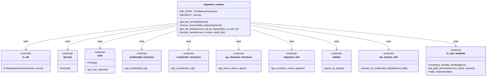

# Diagram: shipment_core/shipment_service/shipment_service/ng_shipments/ng_get_trip.py


> Auto-generated by Obscura crawlers

## Diagram 1



> SVG rendering failed for this diagram.

## Diagram 2

```mermaid
flowchart TD
    Start([Start])
    A[Receive event]
    B[Extract trip_id path param]
    C{trip_id integer?}
    D[Update audit_refs with org & trip id]
    E[DB_CONN.establish_connection()]
    F[Get DB cursor]
    G[get_trip_details(cursor, trip_id, org_id, user_id)]
    H[Execute shipment existence query]
    I{shipment_data.submode_id == CROSS_BORDER and not parent_shipment_id?}
    J[Build crossborder SQL via crosborder_functions.get_crossborder_sql()]
    K[Build multimodal SQL via multimodal_functions.get_multimodal_sql()]
    L[Execute chosen query]
    M[Fetch row -> if none raise NotFoundError]
    N[Transform res to dict, set destination_eta, handle TBD]
    O[Compute active_leg, active_exception_ng, active_status_ng]
    P[Deduplicate child_shipments and set child_ids]
    Q[Return response via fv.aws.lambdas.make_response]
    End([End])
    Start --> A --> B --> C
    C -- yes --> D --> E --> F --> G --> H --> I
    C -- no --> R[Raise BadRequestError] --> End
    I -- true --> J --> L
    I -- false --> K --> L
    L --> M --> N --> O --> P --> Q --> End
```

> SVG rendering failed for this diagram.
