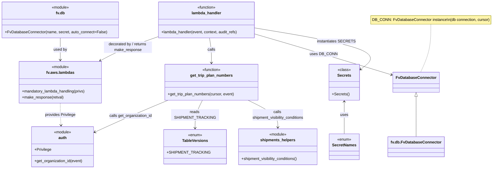

# Diagram: shipment_core/shipment_service/shipment_service/ng_shipments/ng_get_trip_plan_numbers.py

> Auto-generated by Obscura crawlers

## Mermaid

### SVG

<svg id="container" width="2013.9140625" xmlns="http://www.w3.org/2000/svg" class="classDiagram" height="704" viewBox="0 0 2013.9140625 704" role="graphics-document document" aria-roledescription="class"><g><defs><marker id="container_class-aggregationStart" class="marker aggregation class" refX="18" refY="7" markerWidth="190" markerHeight="240" orient="auto"><path d="M 18,7 L9,13 L1,7 L9,1 Z"></path></marker></defs><defs><marker id="container_class-aggregationEnd" class="marker aggregation class" refX="1" refY="7" markerWidth="20" markerHeight="28" orient="auto"><path d="M 18,7 L9,13 L1,7 L9,1 Z"></path></marker></defs><defs><marker id="container_class-extensionStart" class="marker extension class" refX="18" refY="7" markerWidth="190" markerHeight="240" orient="auto"><path d="M 1,7 L18,13 V 1 Z"></path></marker></defs><defs><marker id="container_class-extensionEnd" class="marker extension class" refX="1" refY="7" markerWidth="20" markerHeight="28" orient="auto"><path d="M 1,1 V 13 L18,7 Z"></path></marker></defs><defs><marker id="container_class-compositionStart" class="marker composition class" refX="18" refY="7" markerWidth="190" markerHeight="240" orient="auto"><path d="M 18,7 L9,13 L1,7 L9,1 Z"></path></marker></defs><defs><marker id="container_class-compositionEnd" class="marker composition class" refX="1" refY="7" markerWidth="20" markerHeight="28" orient="auto"><path d="M 18,7 L9,13 L1,7 L9,1 Z"></path></marker></defs><defs><marker id="container_class-dependencyStart" class="marker dependency class" refX="6" refY="7" markerWidth="190" markerHeight="240" orient="auto"><path d="M 5,7 L9,13 L1,7 L9,1 Z"></path></marker></defs><defs><marker id="container_class-dependencyEnd" class="marker dependency class" refX="13" refY="7" markerWidth="20" markerHeight="28" orient="auto"><path d="M 18,7 L9,13 L14,7 L9,1 Z"></path></marker></defs><defs><marker id="container_class-lollipopStart" class="marker lollipop class" refX="13" refY="7" markerWidth="190" markerHeight="240" orient="auto"><circle stroke="black" fill="transparent" cx="7" cy="7" r="6"></circle></marker></defs><defs><marker id="container_class-lollipopEnd" class="marker lollipop class" refX="1" refY="7" markerWidth="190" markerHeight="240" orient="auto"><circle stroke="black" fill="transparent" cx="7" cy="7" r="6"></circle></marker></defs><g class="root"><g class="clusters"></g><g class="edgePaths"><path d="M1757.789,101L1757.789,118.667C1757.789,136.333,1757.789,171.667,1751.154,205C1744.52,238.333,1731.251,269.667,1724.616,285.333L1717.982,301" id="edgeNote1" class="edge-thickness-normal edge-pattern-dotted relation" style="fill: none;;;fill: none" data-edge="true" data-et="edge" data-id="edgeNote1" data-points="W3sieCI6MTc1Ny43ODkwNjI1LCJ5IjoxMDF9LHsieCI6MTc1Ny43ODkwNjI1LCJ5IjoyMDd9LHsieCI6MTcxNy45ODE2MTc2NDcwNTg4LCJ5IjozMDF9XQ=="></path><path d="M247.332,158L247.332,166.167C247.332,174.333,247.332,190.667,247.332,206C247.332,221.333,247.332,235.667,247.332,242.833L247.332,250" id="id_fv.db_fv.aws.lambdas_1" class="edge-thickness-normal edge-pattern-solid relation" style=";;;" data-edge="true" data-et="edge" data-id="id_fv.db_fv.aws.lambdas_1" data-points="W3sieCI6MjQ3LjMzMjAzMTI1LCJ5IjoxNTh9LHsieCI6MjQ3LjMzMjAzMTI1LCJ5IjoyMDd9LHsieCI6MjQ3LjMzMjAzMTI1LCJ5IjoyNTZ9XQ==" marker-end="url(#container_class-dependencyEnd)"></path><path d="M247.332,430L247.332,438.167C247.332,446.333,247.332,462.667,247.724,478.001C248.115,493.336,248.898,507.673,249.29,514.841L249.682,522.009" id="id_fv.aws.lambdas_auth_2" class="edge-thickness-normal edge-pattern-dashed relation" style=";;;" data-edge="true" data-et="edge" data-id="id_fv.aws.lambdas_auth_2" data-points="W3sieCI6MjQ3LjMzMjAzMTI1LCJ5Ijo0MzB9LHsieCI6MjQ3LjMzMjAzMTI1LCJ5Ijo0Nzl9LHsieCI6MjUwLjAwODg0MDQ2MDUyNjMzLCJ5Ijo1Mjh9XQ==" marker-end="url(#container_class-dependencyEnd)"></path><path d="M645.902,154.987L621.477,163.656C597.051,172.324,548.199,189.662,509.52,206.023C470.841,222.384,442.335,237.767,428.081,245.459L413.828,253.151" id="id_lambda_handler_fv.aws.lambdas_3" class="edge-thickness-normal edge-pattern-solid relation" style=";;;" data-edge="true" data-et="edge" data-id="id_lambda_handler_fv.aws.lambdas_3" data-points="W3sieCI6NjQ1LjkwMjM0Mzc1LCJ5IjoxNTQuOTg2NjI4MzU1NDg4OTZ9LHsieCI6NDk5LjM0NzY1NjI1LCJ5IjoyMDd9LHsieCI6NDA4LjU0NzkwOTAwNzM1MjksInkiOjI1Nn1d" marker-end="url(#container_class-dependencyEnd)"></path><path d="M862.92,158L864.464,166.167C866.009,174.333,869.098,190.667,870.643,208C872.188,225.333,872.188,243.667,872.188,252.833L872.188,262" id="id_lambda_handler_get_trip_plan_numbers_4" class="edge-thickness-normal edge-pattern-solid relation" style=";;;" data-edge="true" data-et="edge" data-id="id_lambda_handler_get_trip_plan_numbers_4" data-points="W3sieCI6ODYyLjkxOTczMjg2MjkwMzIsInkiOjE1OH0seyJ4Ijo4NzIuMTg3NSwieSI6MjA3fSx7IngiOjg3Mi4xODc1LCJ5IjoyNjh9XQ==" marker-end="url(#container_class-dependencyEnd)"></path><path d="M1051.566,143.503L1087.045,154.086C1122.523,164.669,1193.479,185.834,1285.412,214.037C1377.345,242.239,1490.254,277.478,1546.709,295.097L1603.163,312.716" id="id_lambda_handler_FvDatabaseConnector_5" class="edge-thickness-normal edge-pattern-solid relation" style=";;;" data-edge="true" data-et="edge" data-id="id_lambda_handler_FvDatabaseConnector_5" data-points="W3sieCI6MTA1MS41NjY0MDYyNSwieSI6MTQzLjUwMzAwOTMxNjkwMTV9LHsieCI6MTI2NC40MzU1NDY4NzUsInkiOjIwN30seyJ4IjoxNjA4Ljg5MDYyNSwieSI6MzE0LjUwMzkzNzUzNzI1NzU3fV0=" marker-end="url(#container_class-dependencyEnd)"></path><path d="M695.049,418L671.037,428.167C647.025,438.333,599.001,458.667,548.389,480.77C497.778,502.873,444.579,526.746,417.98,538.682L391.38,550.619" id="id_get_trip_plan_numbers_auth_6" class="edge-thickness-normal edge-pattern-solid relation" style=";;;" data-edge="true" data-et="edge" data-id="id_get_trip_plan_numbers_auth_6" data-points="W3sieCI6Njk1LjA0OTExNTM0OTI2NDYsInkiOjQxOH0seyJ4Ijo1NTAuOTc2NTYyNSwieSI6NDc5fSx7IngiOjM4NS45MDYyNSwieSI6NTUzLjA3NTI4MzY5Nzc1ODF9XQ==" marker-end="url(#container_class-dependencyEnd)"></path><path d="M834.565,418L829.465,428.167C824.365,438.333,814.165,458.667,809.065,478C803.965,497.333,803.965,515.667,803.965,524.833L803.965,534" id="id_get_trip_plan_numbers_TableVersions_7" class="edge-thickness-normal edge-pattern-solid relation" style=";;;" data-edge="true" data-et="edge" data-id="id_get_trip_plan_numbers_TableVersions_7" data-points="W3sieCI6ODM0LjU2NDcxMTYyNjgzODMsInkiOjQxOH0seyJ4Ijo4MDMuOTY0ODQzNzUsInkiOjQ3OX0seyJ4Ijo4MDMuOTY0ODQzNzUsInkiOjU0MH1d" marker-end="url(#container_class-dependencyEnd)"></path><path d="M1018.549,418L1038.389,428.167C1058.229,438.333,1097.91,458.667,1117.75,477.5C1137.59,496.333,1137.59,513.667,1137.59,522.333L1137.59,531" id="id_get_trip_plan_numbers_shipments_helpers_8" class="edge-thickness-normal edge-pattern-solid relation" style=";;;" data-edge="true" data-et="edge" data-id="id_get_trip_plan_numbers_shipments_helpers_8" data-points="W3sieCI6MTAxOC41NDkwODY2MjY4MzgzLCJ5Ijo0MTh9LHsieCI6MTEzNy41ODk4NDM3NSwieSI6NDc5fSx7IngiOjExMzcuNTg5ODQzNzUsInkiOjUzN31d" marker-end="url(#container_class-dependencyEnd)"></path><path d="M1051.566,117.083L1140.753,132.069C1229.939,147.055,1408.311,177.028,1479.721,206.055C1551.131,235.082,1515.578,263.163,1497.801,277.204L1480.025,291.245" id="id_lambda_handler_Secrets_9" class="edge-thickness-normal edge-pattern-solid relation" style=";;;" data-edge="true" data-et="edge" data-id="id_lambda_handler_Secrets_9" data-points="W3sieCI6MTA1MS41NjY0MDYyNSwieSI6MTE3LjA4MjUyMzg4NjQwMzk1fSx7IngiOjE1ODYuNjgzNTkzNzUsInkiOjIwN30seyJ4IjoxNDc1LjMxNjQwNjI1LCJ5IjoyOTQuOTYzODgzMDI4MTk5MzV9XQ==" marker-end="url(#container_class-dependencyEnd)"></path><path d="M1700.195,402.25L1700.195,415.042C1700.195,427.833,1700.195,453.417,1700.195,481.375C1700.195,509.333,1700.195,539.667,1700.195,554.833L1700.195,570" id="id_FvDatabaseConnector_fv.db.FvDatabaseConnector_10" class="edge-thickness-normal edge-pattern-solid relation" style=";;;" data-edge="true" data-et="edge" data-id="id_FvDatabaseConnector_fv.db.FvDatabaseConnector_10" data-points="W3sieCI6MTcwMC4xOTUzMTI1LCJ5IjozODV9LHsieCI6MTcwMC4xOTUzMTI1LCJ5Ijo0Nzl9LHsieCI6MTcwMC4xOTUzMTI1LCJ5Ijo1NzB9XQ==" marker-start="url(#container_class-extensionStart)"></path><path d="M1414.5,424L1414.5,433.167C1414.5,442.333,1414.5,460.667,1414.5,483C1414.5,505.333,1414.5,531.667,1414.5,544.833L1414.5,558" id="id_Secrets_SecretNames_11" class="edge-thickness-normal edge-pattern-solid relation" style=";;;" data-edge="true" data-et="edge" data-id="id_Secrets_SecretNames_11" data-points="W3sieCI6MTQxNC41LCJ5Ijo0MTh9LHsieCI6MTQxNC41LCJ5Ijo0Nzl9LHsieCI6MTQxNC41LCJ5Ijo1NTh9XQ==" marker-start="url(#container_class-dependencyStart)"></path></g><g class="edgeLabels"><g class="edgeLabel"><g class="label" data-id="edgeNote1" transform="translate(0, 0)"><foreignObject width="0" height="0">

</foreignObject></g></g><g class="edgeLabel" transform="translate(247.33203125, 207)"><g class="label" data-id="id_fv.db_fv.aws.lambdas_1" transform="translate(-28.3125, -12)"><foreignObject width="56.625" height="24">

used by

</foreignObject></g></g><g class="edgeLabel" transform="translate(247.33203125, 479)"><g class="label" data-id="id_fv.aws.lambdas_auth_2" transform="translate(-64.515625, -12)"><foreignObject width="129.03125" height="24">

provides Privilege

</foreignObject></g></g><g class="edgeLabel" transform="translate(524.00739, 198.24807)"><g class="label" data-id="id_lambda_handler_fv.aws.lambdas_3" transform="translate(-100, -24)"><foreignObject width="200" height="48">

decorated by / returns make_response

</foreignObject></g></g><g class="edgeLabel" transform="translate(872.1875, 207)"><g class="label" data-id="id_lambda_handler_get_trip_plan_numbers_4" transform="translate(-16.4453125, -12)"><foreignObject width="32.890625" height="24">

calls

</foreignObject></g></g><g class="edgeLabel" transform="translate(1330.638, 227.66169)"><g class="label" data-id="id_lambda_handler_FvDatabaseConnector_5" transform="translate(-53.09375, -12)"><foreignObject width="106.1875" height="24">

uses DB_CONN

</foreignObject></g></g><g class="edgeLabel" transform="translate(550.9765625, 479)"><g class="label" data-id="id_get_trip_plan_numbers_auth_6" transform="translate(-90.21875, -12)"><foreignObject width="180.4375" height="24">

calls get_organization_id

</foreignObject></g></g><g class="edgeLabel" transform="translate(803.96484375, 479)"><g class="label" data-id="id_get_trip_plan_numbers_TableVersions_7" transform="translate(-97.703125, -12)"><foreignObject width="195.40625" height="24">

reads SHIPMENT_TRACKING

</foreignObject></g></g><g class="edgeLabel" transform="translate(1137.58984375, 479)"><g class="label" data-id="id_get_trip_plan_numbers_shipments_helpers_8" transform="translate(-110.7890625, -24)"><foreignObject width="221.578125" height="48">

calls shipment_visibility_conditions

</foreignObject></g></g><g class="edgeLabel" transform="translate(1389.10222, 173.79976)"><g class="label" data-id="id_lambda_handler_Secrets_9" transform="translate(-75.515625, -12)"><foreignObject width="151.03125" height="24">

instantiates SECRETS

</foreignObject></g></g><g class="edgeLabel"><g class="label" data-id="id_FvDatabaseConnector_fv.db.FvDatabaseConnector_10" transform="translate(0, 0)"><foreignObject width="0" height="0">

</foreignObject></g></g><g class="edgeLabel" transform="translate(1414.5, 479)"><g class="label" data-id="id_Secrets_SecretNames_11" transform="translate(-16.4921875, -12)"><foreignObject width="32.984375" height="24">

uses

</foreignObject></g></g></g><g class="nodes"><g class="node default" id="classId-fv.aws.lambdas-0" transform="translate(247.33203125, 343)"><g class="basic label-container"><path d="M-173.69921875 -87 L173.69921875 -87 L173.69921875 87 L-173.69921875 87" stroke="none" stroke-width="0" fill="#ECECFF" style=""></path><path d="M-173.69921875 -87 C-53.85366668390199 -87, 65.99188538219602 -87, 173.69921875 -87 M-173.69921875 -87 C-60.911486686391285 -87, 51.87624537721743 -87, 173.69921875 -87 M173.69921875 -87 C173.69921875 -37.10902583348982, 173.69921875 12.781948333020367, 173.69921875 87 M173.69921875 -87 C173.69921875 -19.86827258021411, 173.69921875 47.26345483957178, 173.69921875 87 M173.69921875 87 C75.79831096575029 87, -22.10259681849942 87, -173.69921875 87 M173.69921875 87 C98.05900890277827 87, 22.418799055556548 87, -173.69921875 87 M-173.69921875 87 C-173.69921875 50.48086050246767, -173.69921875 13.961721004935342, -173.69921875 -87 M-173.69921875 87 C-173.69921875 32.265222529662985, -173.69921875 -22.46955494067403, -173.69921875 -87" stroke="#9370DB" stroke-width="1.3" fill="none" stroke-dasharray="0 0" style=""></path></g><g class="annotation-group text" transform="translate(-36.6015625, -63)"><g class="label" style="" transform="translate(0,-12)"><foreignObject width="73.203125" height="24">

«module»

</foreignObject></g></g><g class="label-group text" transform="translate(-55.8984375, -39)"><g class="label" style="font-weight: bolder" transform="translate(0,-12)"><foreignObject width="111.796875" height="24">

fv.aws.lambdas

</foreignObject></g></g><g class="members-group text" transform="translate(-161.69921875, 9)"></g><g class="methods-group text" transform="translate(-161.69921875, 39)"><g class="label" style="" transform="translate(0,-12)"><foreignObject width="267.5" height="24">

+mandatory_lambda_handling(privs)

</foreignObject></g><g class="label" style="" transform="translate(0,12)"><foreignObject width="172.8125" height="24">

+make_response(retval)

</foreignObject></g></g><g class="divider" style=""><path d="M-173.69921875 -15 C-40.240327703125274 -15, 93.21856334374945 -15, 173.69921875 -15 M-173.69921875 -15 C-90.01531055330429 -15, -6.331402356608578 -15, 173.69921875 -15" stroke="#9370DB" stroke-width="1.3" fill="none" stroke-dasharray="0 0" style=""></path></g><g class="divider" style=""><path d="M-173.69921875 9 C-77.41630941748247 9, 18.866599915035067 9, 173.69921875 9 M-173.69921875 9 C-86.62478081854432 9, 0.44965711291135335 9, 173.69921875 9" stroke="#9370DB" stroke-width="1.3" fill="none" stroke-dasharray="0 0" style=""></path></g></g><g class="node default" id="classId-fv.db-1" transform="translate(247.33203125, 83)"><g class="basic label-container"><path d="M-239.33203125 -75 L239.33203125 -75 L239.33203125 75 L-239.33203125 75" stroke="none" stroke-width="0" fill="#ECECFF" style=""></path><path d="M-239.33203125 -75 C-50.84350730693299 -75, 137.64501663613402 -75, 239.33203125 -75 M-239.33203125 -75 C-57.14233168979629 -75, 125.04736787040741 -75, 239.33203125 -75 M239.33203125 -75 C239.33203125 -22.918440551180147, 239.33203125 29.163118897639706, 239.33203125 75 M239.33203125 -75 C239.33203125 -36.76187801608469, 239.33203125 1.4762439678306265, 239.33203125 75 M239.33203125 75 C69.05868689111307 75, -101.21465746777386 75, -239.33203125 75 M239.33203125 75 C57.43427509185915 75, -124.4634810662817 75, -239.33203125 75 M-239.33203125 75 C-239.33203125 37.36276036309799, -239.33203125 -0.27447927380401893, -239.33203125 -75 M-239.33203125 75 C-239.33203125 42.85667034567444, -239.33203125 10.713340691348876, -239.33203125 -75" stroke="#9370DB" stroke-width="1.3" fill="none" stroke-dasharray="0 0" style=""></path></g><g class="annotation-group text" transform="translate(-36.6015625, -51)"><g class="label" style="" transform="translate(0,-12)"><foreignObject width="73.203125" height="24">

«module»

</foreignObject></g></g><g class="label-group text" transform="translate(-18.0546875, -27)"><g class="label" style="font-weight: bolder" transform="translate(0,-12)"><foreignObject width="36.109375" height="24">

fv.db

</foreignObject></g></g><g class="members-group text" transform="translate(-227.33203125, 21)"></g><g class="methods-group text" transform="translate(-227.33203125, 51)"><g class="label" style="" transform="translate(0,-12)"><foreignObject width="418.0625" height="24">

+FvDatabaseConnector(name, secret, auto_connect=False)

</foreignObject></g></g><g class="divider" style=""><path d="M-239.33203125 -3 C-92.23015413075476 -3, 54.87172298849049 -3, 239.33203125 -3 M-239.33203125 -3 C-122.18885853307555 -3, -5.045685816151092 -3, 239.33203125 -3" stroke="#9370DB" stroke-width="1.3" fill="none" stroke-dasharray="0 0" style=""></path></g><g class="divider" style=""><path d="M-239.33203125 21 C-101.59045062876376 21, 36.15112999247248 21, 239.33203125 21 M-239.33203125 21 C-132.7515533271842 21, -26.171075404368423 21, 239.33203125 21" stroke="#9370DB" stroke-width="1.3" fill="none" stroke-dasharray="0 0" style=""></path></g></g><g class="node default" id="classId-Secrets-2" transform="translate(1414.5, 343)"><g class="basic label-container"><path d="M-60.81640625 -75 L60.81640625 -75 L60.81640625 75 L-60.81640625 75" stroke="none" stroke-width="0" fill="#ECECFF" style=""></path><path d="M-60.81640625 -75 C-20.776953280491277 -75, 19.262499689017446 -75, 60.81640625 -75 M-60.81640625 -75 C-17.061212114314387 -75, 26.693982021371227 -75, 60.81640625 -75 M60.81640625 -75 C60.81640625 -22.061829537412066, 60.81640625 30.876340925175867, 60.81640625 75 M60.81640625 -75 C60.81640625 -23.83332260063738, 60.81640625 27.33335479872524, 60.81640625 75 M60.81640625 75 C34.24677827733646 75, 7.677150304672921 75, -60.81640625 75 M60.81640625 75 C15.77017217658404 75, -29.27606189683192 75, -60.81640625 75 M-60.81640625 75 C-60.81640625 41.17361390515632, -60.81640625 7.347227810312646, -60.81640625 -75 M-60.81640625 75 C-60.81640625 38.73005260348479, -60.81640625 2.460105206969587, -60.81640625 -75" stroke="#9370DB" stroke-width="1.3" fill="none" stroke-dasharray="0 0" style=""></path></g><g class="annotation-group text" transform="translate(-26.765625, -51)"><g class="label" style="" transform="translate(0,-12)"><foreignObject width="53.53125" height="24">

«class»

</foreignObject></g></g><g class="label-group text" transform="translate(-27.1640625, -27)"><g class="label" style="font-weight: bolder" transform="translate(0,-12)"><foreignObject width="54.328125" height="24">

Secrets

</foreignObject></g></g><g class="members-group text" transform="translate(-48.81640625, 21)"></g><g class="methods-group text" transform="translate(-48.81640625, 51)"><g class="label" style="" transform="translate(0,-12)"><foreignObject width="70.46875" height="24">

+Secrets()

</foreignObject></g></g><g class="divider" style=""><path d="M-60.81640625 -3 C-22.533508341341346 -3, 15.749389567317309 -3, 60.81640625 -3 M-60.81640625 -3 C-19.843405271847573 -3, 21.129595706304855 -3, 60.81640625 -3" stroke="#9370DB" stroke-width="1.3" fill="none" stroke-dasharray="0 0" style=""></path></g><g class="divider" style=""><path d="M-60.81640625 21 C-26.88591972968039 21, 7.044566790639223 21, 60.81640625 21 M-60.81640625 21 C-28.280428576135954 21, 4.2555490977280925 21, 60.81640625 21" stroke="#9370DB" stroke-width="1.3" fill="none" stroke-dasharray="0 0" style=""></path></g></g><g class="node default" id="classId-SecretNames-3" transform="translate(1414.5, 612)"><g class="basic label-container"><path d="M-60.03125 -54 L60.03125 -54 L60.03125 54 L-60.03125 54" stroke="none" stroke-width="0" fill="#ECECFF" style=""></path><path d="M-60.03125 -54 C-15.131742749180262 -54, 29.767764501639476 -54, 60.03125 -54 M-60.03125 -54 C-21.73411022092666 -54, 16.56302955814668 -54, 60.03125 -54 M60.03125 -54 C60.03125 -25.850159219334248, 60.03125 2.2996815613315036, 60.03125 54 M60.03125 -54 C60.03125 -28.863897422641173, 60.03125 -3.7277948452823466, 60.03125 54 M60.03125 54 C13.68571458806047 54, -32.65982082387906 54, -60.03125 54 M60.03125 54 C31.209382982026 54, 2.3875159640519996 54, -60.03125 54 M-60.03125 54 C-60.03125 16.059357420088418, -60.03125 -21.881285159823165, -60.03125 -54 M-60.03125 54 C-60.03125 31.033177794193243, -60.03125 8.066355588386486, -60.03125 -54" stroke="#9370DB" stroke-width="1.3" fill="none" stroke-dasharray="0 0" style=""></path></g><g class="annotation-group text" transform="translate(-29.53125, -30)"><g class="label" style="" transform="translate(0,-12)"><foreignObject width="59.0625" height="24">

«enum»

</foreignObject></g></g><g class="label-group text" transform="translate(-48.03125, -6)"><g class="label" style="font-weight: bolder" transform="translate(0,-12)"><foreignObject width="96.0625" height="24">

SecretNames

</foreignObject></g></g><g class="members-group text" transform="translate(-48.03125, 42)"></g><g class="methods-group text" transform="translate(-48.03125, 72)"></g><g class="divider" style=""><path d="M-60.03125 18 C-34.45467977470541 18, -8.878109549410823 18, 60.03125 18 M-60.03125 18 C-24.435895664658283 18, 11.159458670683435 18, 60.03125 18" stroke="#9370DB" stroke-width="1.3" fill="none" stroke-dasharray="0 0" style=""></path></g><g class="divider" style=""><path d="M-60.03125 36 C-14.838559349371863 36, 30.354131301256274 36, 60.03125 36 M-60.03125 36 C-31.62611447274305 36, -3.2209789454861024 36, 60.03125 36" stroke="#9370DB" stroke-width="1.3" fill="none" stroke-dasharray="0 0" style=""></path></g></g><g class="node default" id="classId-auth-4" transform="translate(254.59765625, 612)"><g class="basic label-container"><path d="M-131.30859375 -84 L131.30859375 -84 L131.30859375 84 L-131.30859375 84" stroke="none" stroke-width="0" fill="#ECECFF" style=""></path><path d="M-131.30859375 -84 C-26.41673979019191 -84, 78.47511416961618 -84, 131.30859375 -84 M-131.30859375 -84 C-28.142956588881532 -84, 75.02268057223694 -84, 131.30859375 -84 M131.30859375 -84 C131.30859375 -32.91150910578384, 131.30859375 18.176981788432315, 131.30859375 84 M131.30859375 -84 C131.30859375 -33.601090915649046, 131.30859375 16.79781816870191, 131.30859375 84 M131.30859375 84 C44.804146339752364 84, -41.70030107049527 84, -131.30859375 84 M131.30859375 84 C76.53968340393536 84, 21.770773057870713 84, -131.30859375 84 M-131.30859375 84 C-131.30859375 37.2096753716936, -131.30859375 -9.580649256612801, -131.30859375 -84 M-131.30859375 84 C-131.30859375 23.487635098900043, -131.30859375 -37.024729802199914, -131.30859375 -84" stroke="#9370DB" stroke-width="1.3" fill="none" stroke-dasharray="0 0" style=""></path></g><g class="annotation-group text" transform="translate(-36.6015625, -60)"><g class="label" style="" transform="translate(0,-12)"><foreignObject width="73.203125" height="24">

«module»

</foreignObject></g></g><g class="label-group text" transform="translate(-16.6640625, -36)"><g class="label" style="font-weight: bolder" transform="translate(0,-12)"><foreignObject width="33.328125" height="24">

auth

</foreignObject></g></g><g class="members-group text" transform="translate(-119.30859375, 12)"><g class="label" style="" transform="translate(0,-12)"><foreignObject width="70.15625" height="24">

+Privilege

</foreignObject></g></g><g class="methods-group text" transform="translate(-119.30859375, 60)"><g class="label" style="" transform="translate(0,-12)"><foreignObject width="202.015625" height="24">

+get_organization_id(event)

</foreignObject></g></g><g class="divider" style=""><path d="M-131.30859375 -12 C-59.4452749182238 -12, 12.418043913552395 -12, 131.30859375 -12 M-131.30859375 -12 C-64.30681715711864 -12, 2.694959435762712 -12, 131.30859375 -12" stroke="#9370DB" stroke-width="1.3" fill="none" stroke-dasharray="0 0" style=""></path></g><g class="divider" style=""><path d="M-131.30859375 36 C-42.56515495663339 36, 46.178283836733215 36, 131.30859375 36 M-131.30859375 36 C-48.8892243487371 36, 33.530145052525796 36, 131.30859375 36" stroke="#9370DB" stroke-width="1.3" fill="none" stroke-dasharray="0 0" style=""></path></g></g><g class="node default" id="classId-TableVersions-5" transform="translate(803.96484375, 612)"><g class="basic label-container"><path d="M-116.74609375 -72 L116.74609375 -72 L116.74609375 72 L-116.74609375 72" stroke="none" stroke-width="0" fill="#ECECFF" style=""></path><path d="M-116.74609375 -72 C-45.55043934419581 -72, 25.645215061608383 -72, 116.74609375 -72 M-116.74609375 -72 C-59.886833402308156 -72, -3.0275730546163118 -72, 116.74609375 -72 M116.74609375 -72 C116.74609375 -35.9494015187182, 116.74609375 0.10119696256360555, 116.74609375 72 M116.74609375 -72 C116.74609375 -37.42480683121004, 116.74609375 -2.849613662420083, 116.74609375 72 M116.74609375 72 C46.7520137181922 72, -23.242066313615595 72, -116.74609375 72 M116.74609375 72 C56.37888791675847 72, -3.988317916483055 72, -116.74609375 72 M-116.74609375 72 C-116.74609375 38.70113689077519, -116.74609375 5.402273781550377, -116.74609375 -72 M-116.74609375 72 C-116.74609375 19.27076107304341, -116.74609375 -33.45847785391318, -116.74609375 -72" stroke="#9370DB" stroke-width="1.3" fill="none" stroke-dasharray="0 0" style=""></path></g><g class="annotation-group text" transform="translate(-29.53125, -48)"><g class="label" style="" transform="translate(0,-12)"><foreignObject width="59.0625" height="24">

«enum»

</foreignObject></g></g><g class="label-group text" transform="translate(-50.9921875, -24)"><g class="label" style="font-weight: bolder" transform="translate(0,-12)"><foreignObject width="101.984375" height="24">

TableVersions

</foreignObject></g></g><g class="members-group text" transform="translate(-104.74609375, 24)"><g class="label" style="" transform="translate(0,-12)"><foreignObject width="158.5" height="24">

+SHIPMENT_TRACKING

</foreignObject></g></g><g class="methods-group text" transform="translate(-104.74609375, 72)"></g><g class="divider" style=""><path d="M-116.74609375 0 C-25.2028937058531 0, 66.3403063382938 0, 116.74609375 0 M-116.74609375 0 C-38.78955464528629 0, 39.166984459427425 0, 116.74609375 0" stroke="#9370DB" stroke-width="1.3" fill="none" stroke-dasharray="0 0" style=""></path></g><g class="divider" style=""><path d="M-116.74609375 48 C-57.37018241577169 48, 2.005728918456626 48, 116.74609375 48 M-116.74609375 48 C-45.95336782329474 48, 24.839358103410518 48, 116.74609375 48" stroke="#9370DB" stroke-width="1.3" fill="none" stroke-dasharray="0 0" style=""></path></g></g><g class="node default" id="classId-shipments_helpers-6" transform="translate(1137.58984375, 612)"><g class="basic label-container"><path d="M-166.87890625 -75 L166.87890625 -75 L166.87890625 75 L-166.87890625 75" stroke="none" stroke-width="0" fill="#ECECFF" style=""></path><path d="M-166.87890625 -75 C-71.84361132686479 -75, 23.191683596270423 -75, 166.87890625 -75 M-166.87890625 -75 C-42.42904704168254 -75, 82.02081216663493 -75, 166.87890625 -75 M166.87890625 -75 C166.87890625 -19.85050969179575, 166.87890625 35.2989806164085, 166.87890625 75 M166.87890625 -75 C166.87890625 -40.9126724640048, 166.87890625 -6.825344928009599, 166.87890625 75 M166.87890625 75 C71.81317166180766 75, -23.252562926384684 75, -166.87890625 75 M166.87890625 75 C55.919387496697354 75, -55.04013125660529 75, -166.87890625 75 M-166.87890625 75 C-166.87890625 22.271865036547325, -166.87890625 -30.45626992690535, -166.87890625 -75 M-166.87890625 75 C-166.87890625 31.969647493969568, -166.87890625 -11.060705012060865, -166.87890625 -75" stroke="#9370DB" stroke-width="1.3" fill="none" stroke-dasharray="0 0" style=""></path></g><g class="annotation-group text" transform="translate(-36.6015625, -51)"><g class="label" style="" transform="translate(0,-12)"><foreignObject width="73.203125" height="24">

«module»

</foreignObject></g></g><g class="label-group text" transform="translate(-69.8359375, -27)"><g class="label" style="font-weight: bolder" transform="translate(0,-12)"><foreignObject width="139.671875" height="24">

shipments_helpers

</foreignObject></g></g><g class="members-group text" transform="translate(-154.87890625, 21)"></g><g class="methods-group text" transform="translate(-154.87890625, 51)"><g class="label" style="" transform="translate(0,-12)"><foreignObject width="239.921875" height="24">

+shipment_visibility_conditions()

</foreignObject></g></g><g class="divider" style=""><path d="M-166.87890625 -3 C-74.44341757633715 -3, 17.99207109732569 -3, 166.87890625 -3 M-166.87890625 -3 C-92.93315667090967 -3, -18.987407091819335 -3, 166.87890625 -3" stroke="#9370DB" stroke-width="1.3" fill="none" stroke-dasharray="0 0" style=""></path></g><g class="divider" style=""><path d="M-166.87890625 21 C-44.50676392202368 21, 77.86537840595264 21, 166.87890625 21 M-166.87890625 21 C-93.16904089624661 21, -19.459175542493227 21, 166.87890625 21" stroke="#9370DB" stroke-width="1.3" fill="none" stroke-dasharray="0 0" style=""></path></g></g><g class="node default" id="classId-get_trip_plan_numbers-7" transform="translate(872.1875, 343)"><g class="basic label-container"><path d="M-194.87890625 -75 L194.87890625 -75 L194.87890625 75 L-194.87890625 75" stroke="none" stroke-width="0" fill="#ECECFF" style=""></path><path d="M-194.87890625 -75 C-69.06340700487229 -75, 56.75209224025542 -75, 194.87890625 -75 M-194.87890625 -75 C-69.90176684921944 -75, 55.07537255156112 -75, 194.87890625 -75 M194.87890625 -75 C194.87890625 -26.36725478754984, 194.87890625 22.26549042490032, 194.87890625 75 M194.87890625 -75 C194.87890625 -37.43563101874211, 194.87890625 0.1287379625157854, 194.87890625 75 M194.87890625 75 C101.6637312022008 75, 8.448556154401587 75, -194.87890625 75 M194.87890625 75 C95.5342054253832 75, -3.810495399233588 75, -194.87890625 75 M-194.87890625 75 C-194.87890625 26.175348792563383, -194.87890625 -22.649302414873233, -194.87890625 -75 M-194.87890625 75 C-194.87890625 36.4939792960871, -194.87890625 -2.012041407825805, -194.87890625 -75" stroke="#9370DB" stroke-width="1.3" fill="none" stroke-dasharray="0 0" style=""></path></g><g class="annotation-group text" transform="translate(-39.484375, -51)"><g class="label" style="" transform="translate(0,-12)"><foreignObject width="78.96875" height="24">

«function»

</foreignObject></g></g><g class="label-group text" transform="translate(-85.4609375, -27)"><g class="label" style="font-weight: bolder" transform="translate(0,-12)"><foreignObject width="170.921875" height="24">

get_trip_plan_numbers

</foreignObject></g></g><g class="members-group text" transform="translate(-182.87890625, 21)"></g><g class="methods-group text" transform="translate(-182.87890625, 51)"><g class="label" style="" transform="translate(0,-12)"><foreignObject width="280.296875" height="24">

+get_trip_plan_numbers(cursor, event)

</foreignObject></g></g><g class="divider" style=""><path d="M-194.87890625 -3 C-65.21692945244419 -3, 64.44504734511162 -3, 194.87890625 -3 M-194.87890625 -3 C-81.14860821148083 -3, 32.58168982703833 -3, 194.87890625 -3" stroke="#9370DB" stroke-width="1.3" fill="none" stroke-dasharray="0 0" style=""></path></g><g class="divider" style=""><path d="M-194.87890625 21 C-88.35126631809645 21, 18.1763736138071 21, 194.87890625 21 M-194.87890625 21 C-89.35483824944997 21, 16.16922975110006 21, 194.87890625 21" stroke="#9370DB" stroke-width="1.3" fill="none" stroke-dasharray="0 0" style=""></path></g></g><g class="node default" id="classId-lambda_handler-8" transform="translate(848.734375, 83)"><g class="basic label-container"><path d="M-202.83203125 -75 L202.83203125 -75 L202.83203125 75 L-202.83203125 75" stroke="none" stroke-width="0" fill="#ECECFF" style=""></path><path d="M-202.83203125 -75 C-78.56531217678342 -75, 45.701406896433156 -75, 202.83203125 -75 M-202.83203125 -75 C-63.29694451160853 -75, 76.23814222678294 -75, 202.83203125 -75 M202.83203125 -75 C202.83203125 -27.356172941077112, 202.83203125 20.287654117845776, 202.83203125 75 M202.83203125 -75 C202.83203125 -17.396629969203794, 202.83203125 40.20674006159241, 202.83203125 75 M202.83203125 75 C64.38536120171693 75, -74.06130884656613 75, -202.83203125 75 M202.83203125 75 C60.93455647281158 75, -80.96291830437684 75, -202.83203125 75 M-202.83203125 75 C-202.83203125 20.189446658285803, -202.83203125 -34.621106683428394, -202.83203125 -75 M-202.83203125 75 C-202.83203125 25.29200826054842, -202.83203125 -24.415983478903158, -202.83203125 -75" stroke="#9370DB" stroke-width="1.3" fill="none" stroke-dasharray="0 0" style=""></path></g><g class="annotation-group text" transform="translate(-39.484375, -51)"><g class="label" style="" transform="translate(0,-12)"><foreignObject width="78.96875" height="24">

«function»

</foreignObject></g></g><g class="label-group text" transform="translate(-59.9765625, -27)"><g class="label" style="font-weight: bolder" transform="translate(0,-12)"><foreignObject width="119.953125" height="24">

lambda_handler

</foreignObject></g></g><g class="members-group text" transform="translate(-190.83203125, 21)"></g><g class="methods-group text" transform="translate(-190.83203125, 51)"><g class="label" style="" transform="translate(0,-12)"><foreignObject width="321.6875" height="24">

+lambda_handler(event, context, audit_refs)

</foreignObject></g></g><g class="divider" style=""><path d="M-202.83203125 -3 C-74.71751743752412 -3, 53.396996374951755 -3, 202.83203125 -3 M-202.83203125 -3 C-42.56895574826268 -3, 117.69411975347464 -3, 202.83203125 -3" stroke="#9370DB" stroke-width="1.3" fill="none" stroke-dasharray="0 0" style=""></path></g><g class="divider" style=""><path d="M-202.83203125 21 C-79.05340744011998 21, 44.725216369760034 21, 202.83203125 21 M-202.83203125 21 C-74.86663663631029 21, 53.09875797737942 21, 202.83203125 21" stroke="#9370DB" stroke-width="1.3" fill="none" stroke-dasharray="0 0" style=""></path></g></g><g class="node default" id="classId-FvDatabaseConnector-9" transform="translate(1700.1953125, 343)"><g class="basic label-container"><path d="M-91.3046875 -42 L91.3046875 -42 L91.3046875 42 L-91.3046875 42" stroke="none" stroke-width="0" fill="#ECECFF" style=""></path><path d="M-91.3046875 -42 C-37.055937836187276 -42, 17.192811827625448 -42, 91.3046875 -42 M-91.3046875 -42 C-42.221124275006936 -42, 6.862438949986128 -42, 91.3046875 -42 M91.3046875 -42 C91.3046875 -16.167296883259915, 91.3046875 9.66540623348017, 91.3046875 42 M91.3046875 -42 C91.3046875 -21.414213080160696, 91.3046875 -0.828426160321392, 91.3046875 42 M91.3046875 42 C45.52715338384951 42, -0.25038073230098234 42, -91.3046875 42 M91.3046875 42 C53.179788188504496 42, 15.054888877008992 42, -91.3046875 42 M-91.3046875 42 C-91.3046875 24.19064090021564, -91.3046875 6.381281800431282, -91.3046875 -42 M-91.3046875 42 C-91.3046875 22.359932830571633, -91.3046875 2.7198656611432668, -91.3046875 -42" stroke="#9370DB" stroke-width="1.3" fill="none" stroke-dasharray="0 0" style=""></path></g><g class="annotation-group text" transform="translate(0, -18)"></g><g class="label-group text" transform="translate(-79.3046875, -18)"><g class="label" style="font-weight: bolder" transform="translate(0,-12)"><foreignObject width="158.609375" height="24">

FvDatabaseConnector

</foreignObject></g></g><g class="members-group text" transform="translate(-79.3046875, 30)"></g><g class="methods-group text" transform="translate(-79.3046875, 60)"></g><g class="divider" style=""><path d="M-91.3046875 6 C-46.86603143818718 6, -2.427375376374357 6, 91.3046875 6 M-91.3046875 6 C-21.23037808453786 6, 48.84393133092428 6, 91.3046875 6" stroke="#9370DB" stroke-width="1.3" fill="none" stroke-dasharray="0 0" style=""></path></g><g class="divider" style=""><path d="M-91.3046875 24 C-22.949782081543972 24, 45.405123336912055 24, 91.3046875 24 M-91.3046875 24 C-18.467418394005435 24, 54.36985071198913 24, 91.3046875 24" stroke="#9370DB" stroke-width="1.3" fill="none" stroke-dasharray="0 0" style=""></path></g></g><g class="node default" id="classId-fv.db.FvDatabaseConnector-10" transform="translate(1700.1953125, 612)"><g class="basic label-container"><path d="M-111.1953125 -42 L111.1953125 -42 L111.1953125 42 L-111.1953125 42" stroke="none" stroke-width="0" fill="#ECECFF" style=""></path><path d="M-111.1953125 -42 C-38.49996771964308 -42, 34.19537706071384 -42, 111.1953125 -42 M-111.1953125 -42 C-54.07765965177887 -42, 3.0399931964422535 -42, 111.1953125 -42 M111.1953125 -42 C111.1953125 -9.244288495329158, 111.1953125 23.511423009341684, 111.1953125 42 M111.1953125 -42 C111.1953125 -13.640260074899686, 111.1953125 14.719479850200628, 111.1953125 42 M111.1953125 42 C52.36696687837409 42, -6.461378743251814 42, -111.1953125 42 M111.1953125 42 C51.200768392468824 42, -8.793775715062353 42, -111.1953125 42 M-111.1953125 42 C-111.1953125 9.298550558805111, -111.1953125 -23.402898882389778, -111.1953125 -42 M-111.1953125 42 C-111.1953125 21.944275638870558, -111.1953125 1.888551277741115, -111.1953125 -42" stroke="#9370DB" stroke-width="1.3" fill="none" stroke-dasharray="0 0" style=""></path></g><g class="annotation-group text" transform="translate(0, -18)"></g><g class="label-group text" transform="translate(-99.1953125, -18)"><g class="label" style="font-weight: bolder" transform="translate(0,-12)"><foreignObject width="198.390625" height="24">

fv.db.FvDatabaseConnector

</foreignObject></g></g><g class="members-group text" transform="translate(-99.1953125, 30)"></g><g class="methods-group text" transform="translate(-99.1953125, 60)"></g><g class="divider" style=""><path d="M-111.1953125 6 C-36.176808134404254 6, 38.84169623119149 6, 111.1953125 6 M-111.1953125 6 C-51.403248949999686 6, 8.388814600000629 6, 111.1953125 6" stroke="#9370DB" stroke-width="1.3" fill="none" stroke-dasharray="0 0" style=""></path></g><g class="divider" style=""><path d="M-111.1953125 24 C-24.23232818848672 24, 62.73065612302656 24, 111.1953125 24 M-111.1953125 24 C-50.81549655248152 24, 9.56431939503696 24, 111.1953125 24" stroke="#9370DB" stroke-width="1.3" fill="none" stroke-dasharray="0 0" style=""></path></g></g><g class="node undefined" id="note0" transform="translate(1757.7890625, 83)"><g class="basic label-container"><path d="M-248.125 -18 L248.125 -18 L248.125 18 L-248.125 18" stroke="none" stroke-width="0" fill="#fff5ad" style="fill:#fff5ad !important;stroke:#aaaa33 !important"></path><path d="M-248.125 -18 C-130.43143958061324 -18, -12.737879161226488 -18, 248.125 -18 M-248.125 -18 C-75.19590064582755 -18, 97.7331987083449 -18, 248.125 -18 M248.125 -18 C248.125 -7.640086747623457, 248.125 2.7198265047530867, 248.125 18 M248.125 -18 C248.125 -5.195983146586135, 248.125 7.6080337068277295, 248.125 18 M248.125 18 C102.82426524252463 18, -42.476469514950736 18, -248.125 18 M248.125 18 C113.21206850642773 18, -21.700862987144546 18, -248.125 18 M-248.125 18 C-248.125 8.461178836769188, -248.125 -1.0776423264616248, -248.125 -18 M-248.125 18 C-248.125 4.170181163140889, -248.125 -9.659637673718223, -248.125 -18" stroke="#aaaa33" stroke-width="1.3" fill="none" stroke-dasharray="0 0" style="fill:#fff5ad !important;stroke:#aaaa33 !important"></path></g><g class="label" style="text-align:left !important;white-space:nowrap !important" transform="translate(-242.125, -12)"><rect></rect><foreignObject width="484.25" height="24">

DB_CONN: FvDatabaseConnector instance\n(db connection, cursor)

</foreignObject></g></g></g></g></g></svg>
