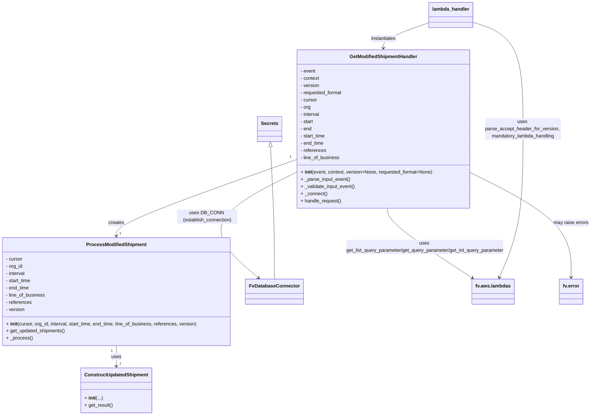

# Diagram: shipment_core/shipment_service/shipment_service/ng_shipments/ng_modified_shipment.py


> Auto-generated by Obscura crawlers

## Diagram 1



### SVG

<svg id="container" width="1957.125" xmlns="http://www.w3.org/2000/svg" class="classDiagram" height="1384" viewBox="0 0 1957.125 1384" role="graphics-document document" aria-roledescription="class"><style>#container{font-family:"trebuchet ms",verdana,arial,sans-serif;font-size:16px;fill:#333;}@keyframes edge-animation-frame{from{stroke-dashoffset:0;}}@keyframes dash{to{stroke-dashoffset:0;}}#container .edge-animation-slow{stroke-dasharray:9,5!important;stroke-dashoffset:900;animation:dash 50s linear infinite;stroke-linecap:round;}#container .edge-animation-fast{stroke-dasharray:9,5!important;stroke-dashoffset:900;animation:dash 20s linear infinite;stroke-linecap:round;}#container .error-icon{fill:#552222;}#container .error-text{fill:#552222;stroke:#552222;}#container .edge-thickness-normal{stroke-width:1px;}#container .edge-thickness-thick{stroke-width:3.5px;}#container .edge-pattern-solid{stroke-dasharray:0;}#container .edge-thickness-invisible{stroke-width:0;fill:none;}#container .edge-pattern-dashed{stroke-dasharray:3;}#container .edge-pattern-dotted{stroke-dasharray:2;}#container .marker{fill:#333333;stroke:#333333;}#container .marker.cross{stroke:#333333;}#container svg{font-family:"trebuchet ms",verdana,arial,sans-serif;font-size:16px;}#container p{margin:0;}#container g.classGroup text{fill:#9370DB;stroke:none;font-family:"trebuchet ms",verdana,arial,sans-serif;font-size:10px;}#container g.classGroup text .title{font-weight:bolder;}#container .nodeLabel,#container .edgeLabel{color:#131300;}#container .edgeLabel .label rect{fill:#ECECFF;}#container .label text{fill:#131300;}#container .labelBkg{background:#ECECFF;}#container .edgeLabel .label span{background:#ECECFF;}#container .classTitle{font-weight:bolder;}#container .node rect,#container .node circle,#container .node ellipse,#container .node polygon,#container .node path{fill:#ECECFF;stroke:#9370DB;stroke-width:1px;}#container .divider{stroke:#9370DB;stroke-width:1;}#container g.clickable{cursor:pointer;}#container g.classGroup rect{fill:#ECECFF;stroke:#9370DB;}#container g.classGroup line{stroke:#9370DB;stroke-width:1;}#container .classLabel .box{stroke:none;stroke-width:0;fill:#ECECFF;opacity:0.5;}#container .classLabel .label{fill:#9370DB;font-size:10px;}#container .relation{stroke:#333333;stroke-width:1;fill:none;}#container .dashed-line{stroke-dasharray:3;}#container .dotted-line{stroke-dasharray:1 2;}#container #compositionStart,#container .composition{fill:#333333!important;stroke:#333333!important;stroke-width:1;}#container #compositionEnd,#container .composition{fill:#333333!important;stroke:#333333!important;stroke-width:1;}#container #dependencyStart,#container .dependency{fill:#333333!important;stroke:#333333!important;stroke-width:1;}#container #dependencyStart,#container .dependency{fill:#333333!important;stroke:#333333!important;stroke-width:1;}#container #extensionStart,#container .extension{fill:transparent!important;stroke:#333333!important;stroke-width:1;}#container #extensionEnd,#container .extension{fill:transparent!important;stroke:#333333!important;stroke-width:1;}#container #aggregationStart,#container .aggregation{fill:transparent!important;stroke:#333333!important;stroke-width:1;}#container #aggregationEnd,#container .aggregation{fill:transparent!important;stroke:#333333!important;stroke-width:1;}#container #lollipopStart,#container .lollipop{fill:#ECECFF!important;stroke:#333333!important;stroke-width:1;}#container #lollipopEnd,#container .lollipop{fill:#ECECFF!important;stroke:#333333!important;stroke-width:1;}#container .edgeTerminals{font-size:11px;line-height:initial;}#container .classTitleText{text-anchor:middle;font-size:18px;fill:#333;}#container .label-icon{display:inline-block;height:1em;overflow:visible;vertical-align:-0.125em;}#container .node .label-icon path{fill:currentColor;stroke:revert;stroke-width:revert;}#container :root{--mermaid-font-family:"trebuchet ms",verdana,arial,sans-serif;}</style><g><defs><marker id="container_class-aggregationStart" class="marker aggregation class" refX="18" refY="7" markerWidth="190" markerHeight="240" orient="auto"><path d="M 18,7 L9,13 L1,7 L9,1 Z"></path></marker></defs><defs><marker id="container_class-aggregationEnd" class="marker aggregation class" refX="1" refY="7" markerWidth="20" markerHeight="28" orient="auto"><path d="M 18,7 L9,13 L1,7 L9,1 Z"></path></marker></defs><defs><marker id="container_class-extensionStart" class="marker extension class" refX="18" refY="7" markerWidth="190" markerHeight="240" orient="auto"><path d="M 1,7 L18,13 V 1 Z"></path></marker></defs><defs><marker id="container_class-extensionEnd" class="marker extension class" refX="1" refY="7" markerWidth="20" markerHeight="28" orient="auto"><path d="M 1,1 V 13 L18,7 Z"></path></marker></defs><defs><marker id="container_class-compositionStart" class="marker composition class" refX="18" refY="7" markerWidth="190" markerHeight="240" orient="auto"><path d="M 18,7 L9,13 L1,7 L9,1 Z"></path></marker></defs><defs><marker id="container_class-compositionEnd" class="marker composition class" refX="1" refY="7" markerWidth="20" markerHeight="28" orient="auto"><path d="M 18,7 L9,13 L1,7 L9,1 Z"></path></marker></defs><defs><marker id="container_class-dependencyStart" class="marker dependency class" refX="6" refY="7" markerWidth="190" markerHeight="240" orient="auto"><path d="M 5,7 L9,13 L1,7 L9,1 Z"></path></marker></defs><defs><marker id="container_class-dependencyEnd" class="marker dependency class" refX="13" refY="7" markerWidth="20" markerHeight="28" orient="auto"><path d="M 18,7 L9,13 L14,7 L9,1 Z"></path></marker></defs><defs><marker id="container_class-lollipopStart" class="marker lollipop class" refX="13" refY="7" markerWidth="190" markerHeight="240" orient="auto"><circle stroke="black" fill="transparent" cx="7" cy="7" r="6"></circle></marker></defs><defs><marker id="container_class-lollipopEnd" class="marker lollipop class" refX="1" refY="7" markerWidth="190" markerHeight="240" orient="auto"><circle stroke="black" fill="transparent" cx="7" cy="7" r="6"></circle></marker></defs><g class="root"><g class="clusters"></g><g class="edgePaths"><path d="M388.555,1152L388.555,1158.167C388.555,1164.333,388.555,1176.667,388.555,1188C388.555,1199.333,388.555,1209.667,388.555,1214.833L388.555,1220" id="id_ProcessModifiedShipment_ConstructUpdatedShipment_1" class="edge-thickness-normal edge-pattern-solid relation" style=";;;" data-edge="true" data-et="edge" data-id="id_ProcessModifiedShipment_ConstructUpdatedShipment_1" data-points="W3sieCI6Mzg4LjU1NDY4NzUsInkiOjExNTJ9LHsieCI6Mzg4LjU1NDY4NzUsInkiOjExODl9LHsieCI6Mzg4LjU1NDY4NzUsInkiOjEyMjZ9XQ==" marker-end="url(#container_class-dependencyEnd)"></path><path d="M973.221,533.093L875.776,568.078C778.332,603.062,583.443,673.031,485.999,715.182C388.555,757.333,388.555,771.667,388.555,778.833L388.555,786" id="id_GetModifiedShipmentHandler_ProcessModifiedShipment_2" class="edge-thickness-normal edge-pattern-solid relation" style=";;;" data-edge="true" data-et="edge" data-id="id_GetModifiedShipmentHandler_ProcessModifiedShipment_2" data-points="W3sieCI6OTczLjIyMDcwMzEyNSwieSI6NTMzLjA5MzM1OTU1OTY0ODh9LHsieCI6Mzg4LjU1NDY4NzUsInkiOjc0M30seyJ4IjozODguNTU0Njg3NSwieSI6NzkyfV0=" marker-end="url(#container_class-dependencyEnd)"></path><path d="M973.221,573.999L917.053,602.166C860.885,630.333,748.549,686.666,728.932,745.359C709.315,804.051,782.417,865.103,818.968,895.628L855.519,926.154" id="id_GetModifiedShipmentHandler_FvDatabaseConnector_3" class="edge-thickness-normal edge-pattern-solid relation" style=";;;" data-edge="true" data-et="edge" data-id="id_GetModifiedShipmentHandler_FvDatabaseConnector_3" data-points="W3sieCI6OTczLjIyMDcwMzEyNSwieSI6NTczLjk5OTM5MjkzNDI1NTR9LHsieCI6NjM2LjIxMjg5MDYyNSwieSI6NzQzfSx7IngiOjg2MC4xMjM4OTEyMzkwODI5LCJ5Ijo5MzB9XQ==" marker-end="url(#container_class-dependencyEnd)"></path><path d="M1282.604,694L1283.292,702.167C1283.98,710.333,1285.355,726.667,1331.723,765.443C1378.091,804.22,1469.451,865.44,1515.131,896.05L1560.811,926.66" id="id_GetModifiedShipmentHandler_fv.aws.lambdas_4" class="edge-thickness-normal edge-pattern-solid relation" style=";;;" data-edge="true" data-et="edge" data-id="id_GetModifiedShipmentHandler_fv.aws.lambdas_4" data-points="W3sieCI6MTI4Mi42MDQyMjY5ODY4MjEsInkiOjY5NH0seyJ4IjoxMjg2LjczMDQ2ODc1LCJ5Ijo3NDN9LHsieCI6MTU2NS43OTUwNDk4MDg5NTIsInkiOjkzMH1d" marker-end="url(#container_class-dependencyEnd)"></path><path d="M1547.525,572.597L1604.716,600.997C1661.908,629.398,1776.29,686.199,1833.481,744.766C1890.672,803.333,1890.672,863.667,1890.672,893.833L1890.672,924" id="id_GetModifiedShipmentHandler_fv.error_5" class="edge-thickness-normal edge-pattern-solid relation" style=";;;" data-edge="true" data-et="edge" data-id="id_GetModifiedShipmentHandler_fv.error_5" data-points="W3sieCI6MTU0Ny41MjUzOTA2MjUsInkiOjU3Mi41OTY5MzkwNzU4OTcxfSx7IngiOjE4OTAuNjcxODc1LCJ5Ijo3NDN9LHsieCI6MTg5MC42NzE4NzUsInkiOjkzMH1d" marker-end="url(#container_class-dependencyEnd)"></path><path d="M1411.945,75.436L1386.683,84.363C1361.421,93.291,1310.897,111.145,1285.635,125.239C1260.373,139.333,1260.373,149.667,1260.373,154.833L1260.373,160" id="id_lambda_handler_GetModifiedShipmentHandler_6" class="edge-thickness-normal edge-pattern-solid relation" style=";;;" data-edge="true" data-et="edge" data-id="id_lambda_handler_GetModifiedShipmentHandler_6" data-points="W3sieCI6MTQxMS45NDUzMTI1LCJ5Ijo3NS40MzU4MjMwNjAxODg1NH0seyJ4IjoxMjYwLjM3MzA0Njg3NSwieSI6MTI5fSx7IngiOjEyNjAuMzczMDQ2ODc1LCJ5IjoxNjZ9XQ==" marker-end="url(#container_class-dependencyEnd)"></path><path d="M1555.898,72.753L1585.553,82.128C1615.208,91.502,1674.518,110.251,1704.173,169.792C1733.828,229.333,1733.828,329.667,1733.828,432C1733.828,534.333,1733.828,638.667,1719.907,721.092C1705.986,803.516,1678.145,864.033,1664.224,894.291L1650.303,924.549" id="id_lambda_handler_fv.aws.lambdas_7" class="edge-thickness-normal edge-pattern-solid relation" style=";;;" data-edge="true" data-et="edge" data-id="id_lambda_handler_fv.aws.lambdas_7" data-points="W3sieCI6MTU1NS44OTg0Mzc1LCJ5Ijo3Mi43NTMxMjYxNzIzMTQ2Mn0seyJ4IjoxNzMzLjgyODEyNSwieSI6MTI5fSx7IngiOjE3MzMuODI4MTI1LCJ5Ijo0MzB9LHsieCI6MTczMy44MjgxMjUsInkiOjc0M30seyJ4IjoxNjQ3Ljc5NTQ5MzMxMzMxODcsInkiOjkzMH1d" marker-end="url(#container_class-dependencyEnd)"></path><path d="M889.041,489.189L892.603,531.491C896.165,573.793,903.29,658.396,906.852,731.865C910.414,805.333,910.414,867.667,910.414,898.833L910.414,930" id="id_Secrets_FvDatabaseConnector_8" class="edge-thickness-normal edge-pattern-solid relation" style=";;;" data-edge="true" data-et="edge" data-id="id_Secrets_FvDatabaseConnector_8" data-points="W3sieCI6ODg3LjU5MzQxOTI3OTE1MzQsInkiOjQ3Mn0seyJ4Ijo5MTAuNDE0MDYyNSwieSI6NzQzfSx7IngiOjkxMC40MTQwNjI1LCJ5Ijo5MzB9XQ==" marker-start="url(#container_class-extensionStart)"></path></g><g class="edgeLabels"><g class="edgeLabel" transform="translate(388.5546875, 1189)"><g class="label" data-id="id_ProcessModifiedShipment_ConstructUpdatedShipment_1" transform="translate(-16.4921875, -12)"><foreignObject width="32.984375" height="24"><div xmlns="http://www.w3.org/1999/xhtml" class="labelBkg" style="display: table-cell; white-space: nowrap; line-height: 1.5; max-width: 200px; text-align: center;"><span class="edgeLabel"><p>uses</p></span></div></foreignObject></g></g><g class="edgeLabel" transform="translate(388.5546875, 743)"><g class="label" data-id="id_GetModifiedShipmentHandler_ProcessModifiedShipment_2" transform="translate(-26.171875, -12)"><foreignObject width="52.34375" height="24"><div xmlns="http://www.w3.org/1999/xhtml" class="labelBkg" style="display: table-cell; white-space: nowrap; line-height: 1.5; max-width: 200px; text-align: center;"><span class="edgeLabel"><p>creates</p></span></div></foreignObject></g></g><g class="edgeLabel" transform="translate(674.3291, 723.88572)"><g class="label" data-id="id_GetModifiedShipmentHandler_FvDatabaseConnector_3" transform="translate(-100, -24)"><foreignObject width="200" height="48"><div xmlns="http://www.w3.org/1999/xhtml" class="labelBkg" style="display: table; white-space: break-spaces; line-height: 1.5; max-width: 200px; text-align: center; width: 200px;"><span class="edgeLabel"><p>uses DB_CONN (establish_connection)</p></span></div></foreignObject></g></g><g class="edgeLabel" transform="translate(1405.83776, 822.81329)"><g class="label" data-id="id_GetModifiedShipmentHandler_fv.aws.lambdas_4" transform="translate(-269.1015625, -24)"><foreignObject width="538.203125" height="48"><div xmlns="http://www.w3.org/1999/xhtml" class="labelBkg" style="display: table; white-space: break-spaces; line-height: 1.5; max-width: 200px; text-align: center; width: 200px;"><span class="edgeLabel"><p>uses get_list_query_parameter/get_query_parameter/get_int_query_parameter</p></span></div></foreignObject></g></g><g class="edgeLabel" transform="translate(1890.671875, 743)"><g class="label" data-id="id_GetModifiedShipmentHandler_fv.error_5" transform="translate(-58.453125, -12)"><foreignObject width="116.90625" height="24"><div xmlns="http://www.w3.org/1999/xhtml" class="labelBkg" style="display: table-cell; white-space: nowrap; line-height: 1.5; max-width: 200px; text-align: center;"><span class="edgeLabel"><p>may raise errors</p></span></div></foreignObject></g></g><g class="edgeLabel" transform="translate(1260.373046875, 129)"><g class="label" data-id="id_lambda_handler_GetModifiedShipmentHandler_6" transform="translate(-42.9140625, -12)"><foreignObject width="85.828125" height="24"><div xmlns="http://www.w3.org/1999/xhtml" class="labelBkg" style="display: table-cell; white-space: nowrap; line-height: 1.5; max-width: 200px; text-align: center;"><span class="edgeLabel"><p>instantiates</p></span></div></foreignObject></g></g><g class="edgeLabel" transform="translate(1733.828125, 430)"><g class="label" data-id="id_lambda_handler_fv.aws.lambdas_7" transform="translate(-124.9453125, -36)"><foreignObject width="249.890625" height="72"><div xmlns="http://www.w3.org/1999/xhtml" class="labelBkg" style="display: table; white-space: break-spaces; line-height: 1.5; max-width: 200px; text-align: center; width: 200px;"><span class="edgeLabel"><p>uses parse_accept_header_for_version, mandatory_lambda_handling</p></span></div></foreignObject></g></g><g class="edgeLabel"><g class="label" data-id="id_Secrets_FvDatabaseConnector_8" transform="translate(0, 0)"><foreignObject width="0" height="0"><div xmlns="http://www.w3.org/1999/xhtml" class="labelBkg" style="display: table-cell; white-space: nowrap; line-height: 1.5; max-width: 200px; text-align: center;"><span class="edgeLabel"></span></div></foreignObject></g></g><g class="edgeTerminals" transform="translate(373.55468875, 1169.5000010714286)"><g class="inner" transform="translate(0, 0)"><foreignObject style="width: 9px; height: 12px;"><div xmlns="http://www.w3.org/1999/xhtml" style="display: inline-block; padding-right: 1px; white-space: nowrap;"><span class="edgeLabel">1</span></div></foreignObject></g></g><g class="edgeTerminals" transform="translate(951.6814971186055, 524.8889386789217)"><g class="inner" transform="translate(0, 0)"><foreignObject style="width: 9px; height: 12px;"><div xmlns="http://www.w3.org/1999/xhtml" style="display: inline-block; padding-right: 1px; white-space: nowrap;"><span class="edgeLabel">1</span></div></foreignObject></g></g><g class="edgeTerminals" transform="translate(398.5546887499999, 1203.5000010714286)"><g class="inner" transform="translate(0, 0)"></g><foreignObject style="width: 9px; height: 12px;"><div xmlns="http://www.w3.org/1999/xhtml" style="display: inline-block; padding-right: 1px; white-space: nowrap;"><span class="edgeLabel">1</span></div></foreignObject></g><g class="edgeTerminals" transform="translate(398.5546887499999, 769.5000010714285)"><g class="inner" transform="translate(0, 0)"></g><foreignObject style="width: 9px; height: 12px;"><div xmlns="http://www.w3.org/1999/xhtml" style="display: inline-block; padding-right: 1px; white-space: nowrap;"><span class="edgeLabel">1</span></div></foreignObject></g></g><g class="nodes"><g class="node default" id="classId-ProcessModifiedShipment-0" transform="translate(388.5546875, 972)"><g class="basic label-container"><path d="M-380.5546875 -180 L380.5546875 -180 L380.5546875 180 L-380.5546875 180" stroke="none" stroke-width="0" fill="#ECECFF" style=""></path><path d="M-380.5546875 -180 C-197.0539121226312 -180, -13.553136745262407 -180, 380.5546875 -180 M-380.5546875 -180 C-161.26695858360046 -180, 58.02077033279909 -180, 380.5546875 -180 M380.5546875 -180 C380.5546875 -89.43646058896027, 380.5546875 1.1270788220794543, 380.5546875 180 M380.5546875 -180 C380.5546875 -98.6309314997571, 380.5546875 -17.261862999514193, 380.5546875 180 M380.5546875 180 C224.78965100445154 180, 69.02461450890308 180, -380.5546875 180 M380.5546875 180 C140.8200492928503 180, -98.91458891429937 180, -380.5546875 180 M-380.5546875 180 C-380.5546875 67.74151313535049, -380.5546875 -44.516973729299025, -380.5546875 -180 M-380.5546875 180 C-380.5546875 56.17227993753592, -380.5546875 -67.65544012492816, -380.5546875 -180" stroke="#9370DB" stroke-width="1.3" fill="none" stroke-dasharray="0 0" style=""></path></g><g class="annotation-group text" transform="translate(0, -156)"></g><g class="label-group text" transform="translate(-95.171875, -156)"><g class="label" style="font-weight: bolder" transform="translate(0,-12)"><foreignObject width="190.34375" height="24"><div xmlns="http://www.w3.org/1999/xhtml" style="display: table-cell; white-space: nowrap; line-height: 1.5; max-width: 238px; text-align: center;"><span class="nodeLabel markdown-node-label" style=""><p>ProcessModifiedShipment</p></span></div></foreignObject></g></g><g class="members-group text" transform="translate(-368.5546875, -108)"><g class="label" style="" transform="translate(0,-12)"><foreignObject width="56.421875" height="24"><div xmlns="http://www.w3.org/1999/xhtml" style="display: table-cell; white-space: nowrap; line-height: 1.5; max-width: 115px; text-align: center;"><span class="nodeLabel markdown-node-label" style=""><p>- cursor</p></span></div></foreignObject></g><g class="label" style="" transform="translate(0,12)"><foreignObject width="56.765625" height="24"><div xmlns="http://www.w3.org/1999/xhtml" style="display: table-cell; white-space: nowrap; line-height: 1.5; max-width: 114px; text-align: center;"><span class="nodeLabel markdown-node-label" style=""><p>- org_id</p></span></div></foreignObject></g><g class="label" style="" transform="translate(0,36)"><foreignObject width="65.859375" height="24"><div xmlns="http://www.w3.org/1999/xhtml" style="display: table-cell; white-space: nowrap; line-height: 1.5; max-width: 124px; text-align: center;"><span class="nodeLabel markdown-node-label" style=""><p>- interval</p></span></div></foreignObject></g><g class="label" style="" transform="translate(0,60)"><foreignObject width="85.203125" height="24"><div xmlns="http://www.w3.org/1999/xhtml" style="display: table-cell; white-space: nowrap; line-height: 1.5; max-width: 143px; text-align: center;"><span class="nodeLabel markdown-node-label" style=""><p>- start_time</p></span></div></foreignObject></g><g class="label" style="" transform="translate(0,84)"><foreignObject width="79.078125" height="24"><div xmlns="http://www.w3.org/1999/xhtml" style="display: table-cell; white-space: nowrap; line-height: 1.5; max-width: 136px; text-align: center;"><span class="nodeLabel markdown-node-label" style=""><p>- end_time</p></span></div></foreignObject></g><g class="label" style="" transform="translate(0,108)"><foreignObject width="131.890625" height="24"><div xmlns="http://www.w3.org/1999/xhtml" style="display: table-cell; white-space: nowrap; line-height: 1.5; max-width: 189px; text-align: center;"><span class="nodeLabel markdown-node-label" style=""><p>- line_of_business</p></span></div></foreignObject></g><g class="label" style="" transform="translate(0,132)"><foreignObject width="86.34375" height="24"><div xmlns="http://www.w3.org/1999/xhtml" style="display: table-cell; white-space: nowrap; line-height: 1.5; max-width: 144px; text-align: center;"><span class="nodeLabel markdown-node-label" style=""><p>- references</p></span></div></foreignObject></g><g class="label" style="" transform="translate(0,156)"><foreignObject width="63.859375" height="24"><div xmlns="http://www.w3.org/1999/xhtml" style="display: table-cell; white-space: nowrap; line-height: 1.5; max-width: 121px; text-align: center;"><span class="nodeLabel markdown-node-label" style=""><p>- version</p></span></div></foreignObject></g></g><g class="methods-group text" transform="translate(-368.5546875, 108)"><g class="label" style="" transform="translate(0,-12)"><foreignObject width="641.9375" height="24"><div xmlns="http://www.w3.org/1999/xhtml" style="display: table-cell; white-space: nowrap; line-height: 1.5; max-width: 732px; text-align: center;"><span class="nodeLabel markdown-node-label" style=""><p>+ <strong>init</strong>(cursor, org_id, interval, start_time, end_time, line_of_business, references, version)</p></span></div></foreignObject></g><g class="label" style="" transform="translate(0,12)"><foreignObject width="198.3125" height="24"><div xmlns="http://www.w3.org/1999/xhtml" style="display: table-cell; white-space: nowrap; line-height: 1.5; max-width: 256px; text-align: center;"><span class="nodeLabel markdown-node-label" style=""><p>+ get_updated_shipments()</p></span></div></foreignObject></g><g class="label" style="" transform="translate(0,36)"><foreignObject width="86.296875" height="24"><div xmlns="http://www.w3.org/1999/xhtml" style="display: table-cell; white-space: nowrap; line-height: 1.5; max-width: 144px; text-align: center;"><span class="nodeLabel markdown-node-label" style=""><p>+ _process()</p></span></div></foreignObject></g></g><g class="divider" style=""><path d="M-380.5546875 -132 C-77.34190369102896 -132, 225.87088011794208 -132, 380.5546875 -132 M-380.5546875 -132 C-183.85336238366222 -132, 12.847962732675569 -132, 380.5546875 -132" stroke="#9370DB" stroke-width="1.3" fill="none" stroke-dasharray="0 0" style=""></path></g><g class="divider" style=""><path d="M-380.5546875 84 C-124.64941620120396 84, 131.25585509759208 84, 380.5546875 84 M-380.5546875 84 C-202.99714893346683 84, -25.439610366933664 84, 380.5546875 84" stroke="#9370DB" stroke-width="1.3" fill="none" stroke-dasharray="0 0" style=""></path></g></g><g class="node default" id="classId-GetModifiedShipmentHandler-1" transform="translate(1260.373046875, 430)"><g class="basic label-container"><path d="M-287.15234375 -264 L287.15234375 -264 L287.15234375 264 L-287.15234375 264" stroke="none" stroke-width="0" fill="#ECECFF" style=""></path><path d="M-287.15234375 -264 C-71.97735681197904 -264, 143.19763012604193 -264, 287.15234375 -264 M-287.15234375 -264 C-133.36809189553657 -264, 20.41615995892687 -264, 287.15234375 -264 M287.15234375 -264 C287.15234375 -109.18307245068004, 287.15234375 45.63385509863991, 287.15234375 264 M287.15234375 -264 C287.15234375 -117.22429048806893, 287.15234375 29.551419023862138, 287.15234375 264 M287.15234375 264 C164.45423053999016 264, 41.75611732998033 264, -287.15234375 264 M287.15234375 264 C115.91249816401083 264, -55.327347421978345 264, -287.15234375 264 M-287.15234375 264 C-287.15234375 79.60219399932055, -287.15234375 -104.7956120013589, -287.15234375 -264 M-287.15234375 264 C-287.15234375 79.69577391196782, -287.15234375 -104.60845217606436, -287.15234375 -264" stroke="#9370DB" stroke-width="1.3" fill="none" stroke-dasharray="0 0" style=""></path></g><g class="annotation-group text" transform="translate(0, -240)"></g><g class="label-group text" transform="translate(-108.8828125, -240)"><g class="label" style="font-weight: bolder" transform="translate(0,-12)"><foreignObject width="217.765625" height="24"><div xmlns="http://www.w3.org/1999/xhtml" style="display: table-cell; white-space: nowrap; line-height: 1.5; max-width: 267px; text-align: center;"><span class="nodeLabel markdown-node-label" style=""><p>GetModifiedShipmentHandler</p></span></div></foreignObject></g></g><g class="members-group text" transform="translate(-275.15234375, -192)"><g class="label" style="" transform="translate(0,-12)"><foreignObject width="51.03125" height="24"><div xmlns="http://www.w3.org/1999/xhtml" style="display: table-cell; white-space: nowrap; line-height: 1.5; max-width: 109px; text-align: center;"><span class="nodeLabel markdown-node-label" style=""><p>- event</p></span></div></foreignObject></g><g class="label" style="" transform="translate(0,12)"><foreignObject width="64.390625" height="24"><div xmlns="http://www.w3.org/1999/xhtml" style="display: table-cell; white-space: nowrap; line-height: 1.5; max-width: 122px; text-align: center;"><span class="nodeLabel markdown-node-label" style=""><p>- context</p></span></div></foreignObject></g><g class="label" style="" transform="translate(0,36)"><foreignObject width="63.859375" height="24"><div xmlns="http://www.w3.org/1999/xhtml" style="display: table-cell; white-space: nowrap; line-height: 1.5; max-width: 121px; text-align: center;"><span class="nodeLabel markdown-node-label" style=""><p>- version</p></span></div></foreignObject></g><g class="label" style="" transform="translate(0,60)"><foreignObject width="140.921875" height="24"><div xmlns="http://www.w3.org/1999/xhtml" style="display: table-cell; white-space: nowrap; line-height: 1.5; max-width: 198px; text-align: center;"><span class="nodeLabel markdown-node-label" style=""><p>- requested_format</p></span></div></foreignObject></g><g class="label" style="" transform="translate(0,84)"><foreignObject width="56.421875" height="24"><div xmlns="http://www.w3.org/1999/xhtml" style="display: table-cell; white-space: nowrap; line-height: 1.5; max-width: 115px; text-align: center;"><span class="nodeLabel markdown-node-label" style=""><p>- cursor</p></span></div></foreignObject></g><g class="label" style="" transform="translate(0,108)"><foreignObject width="34.296875" height="24"><div xmlns="http://www.w3.org/1999/xhtml" style="display: table-cell; white-space: nowrap; line-height: 1.5; max-width: 92px; text-align: center;"><span class="nodeLabel markdown-node-label" style=""><p>- org</p></span></div></foreignObject></g><g class="label" style="" transform="translate(0,132)"><foreignObject width="65.859375" height="24"><div xmlns="http://www.w3.org/1999/xhtml" style="display: table-cell; white-space: nowrap; line-height: 1.5; max-width: 124px; text-align: center;"><span class="nodeLabel markdown-node-label" style=""><p>- interval</p></span></div></foreignObject></g><g class="label" style="" transform="translate(0,156)"><foreignObject width="44.484375" height="24"><div xmlns="http://www.w3.org/1999/xhtml" style="display: table-cell; white-space: nowrap; line-height: 1.5; max-width: 102px; text-align: center;"><span class="nodeLabel markdown-node-label" style=""><p>- start</p></span></div></foreignObject></g><g class="label" style="" transform="translate(0,180)"><foreignObject width="38.359375" height="24"><div xmlns="http://www.w3.org/1999/xhtml" style="display: table-cell; white-space: nowrap; line-height: 1.5; max-width: 96px; text-align: center;"><span class="nodeLabel markdown-node-label" style=""><p>- end</p></span></div></foreignObject></g><g class="label" style="" transform="translate(0,204)"><foreignObject width="85.203125" height="24"><div xmlns="http://www.w3.org/1999/xhtml" style="display: table-cell; white-space: nowrap; line-height: 1.5; max-width: 143px; text-align: center;"><span class="nodeLabel markdown-node-label" style=""><p>- start_time</p></span></div></foreignObject></g><g class="label" style="" transform="translate(0,228)"><foreignObject width="79.078125" height="24"><div xmlns="http://www.w3.org/1999/xhtml" style="display: table-cell; white-space: nowrap; line-height: 1.5; max-width: 136px; text-align: center;"><span class="nodeLabel markdown-node-label" style=""><p>- end_time</p></span></div></foreignObject></g><g class="label" style="" transform="translate(0,252)"><foreignObject width="86.34375" height="24"><div xmlns="http://www.w3.org/1999/xhtml" style="display: table-cell; white-space: nowrap; line-height: 1.5; max-width: 144px; text-align: center;"><span class="nodeLabel markdown-node-label" style=""><p>- references</p></span></div></foreignObject></g><g class="label" style="" transform="translate(0,276)"><foreignObject width="131.890625" height="24"><div xmlns="http://www.w3.org/1999/xhtml" style="display: table-cell; white-space: nowrap; line-height: 1.5; max-width: 189px; text-align: center;"><span class="nodeLabel markdown-node-label" style=""><p>- line_of_business</p></span></div></foreignObject></g></g><g class="methods-group text" transform="translate(-275.15234375, 144)"><g class="label" style="" transform="translate(0,-12)"><foreignObject width="441.421875" height="24"><div xmlns="http://www.w3.org/1999/xhtml" style="display: table-cell; white-space: nowrap; line-height: 1.5; max-width: 531px; text-align: center;"><span class="nodeLabel markdown-node-label" style=""><p>+ <strong>init</strong>(event, context, version=None, requested_format=None)</p></span></div></foreignObject></g><g class="label" style="" transform="translate(0,12)"><foreignObject width="165.90625" height="24"><div xmlns="http://www.w3.org/1999/xhtml" style="display: table-cell; white-space: nowrap; line-height: 1.5; max-width: 223px; text-align: center;"><span class="nodeLabel markdown-node-label" style=""><p>+ _parse_input_event()</p></span></div></foreignObject></g><g class="label" style="" transform="translate(0,36)"><foreignObject width="183.140625" height="24"><div xmlns="http://www.w3.org/1999/xhtml" style="display: table-cell; white-space: nowrap; line-height: 1.5; max-width: 241px; text-align: center;"><span class="nodeLabel markdown-node-label" style=""><p>+ _validate_input_event()</p></span></div></foreignObject></g><g class="label" style="" transform="translate(0,60)"><foreignObject width="88.171875" height="24"><div xmlns="http://www.w3.org/1999/xhtml" style="display: table-cell; white-space: nowrap; line-height: 1.5; max-width: 146px; text-align: center;"><span class="nodeLabel markdown-node-label" style=""><p>+ _connect()</p></span></div></foreignObject></g><g class="label" style="" transform="translate(0,84)"><foreignObject width="136.21875" height="24"><div xmlns="http://www.w3.org/1999/xhtml" style="display: table-cell; white-space: nowrap; line-height: 1.5; max-width: 194px; text-align: center;"><span class="nodeLabel markdown-node-label" style=""><p>+ handle_request()</p></span></div></foreignObject></g></g><g class="divider" style=""><path d="M-287.15234375 -216 C-67.37464848184257 -216, 152.40304678631486 -216, 287.15234375 -216 M-287.15234375 -216 C-163.24445629445006 -216, -39.33656883890009 -216, 287.15234375 -216" stroke="#9370DB" stroke-width="1.3" fill="none" stroke-dasharray="0 0" style=""></path></g><g class="divider" style=""><path d="M-287.15234375 120 C-132.3278173878897 120, 22.49670897422061 120, 287.15234375 120 M-287.15234375 120 C-157.6039085430334 120, -28.055473336066825 120, 287.15234375 120" stroke="#9370DB" stroke-width="1.3" fill="none" stroke-dasharray="0 0" style=""></path></g></g><g class="node default" id="classId-ConstructUpdatedShipment-2" transform="translate(388.5546875, 1301)"><g class="basic label-container"><path d="M-113.8203125 -75 L113.8203125 -75 L113.8203125 75 L-113.8203125 75" stroke="none" stroke-width="0" fill="#ECECFF" style=""></path><path d="M-113.8203125 -75 C-49.26915848437271 -75, 15.28199553125458 -75, 113.8203125 -75 M-113.8203125 -75 C-42.38143052882599 -75, 29.057451442348025 -75, 113.8203125 -75 M113.8203125 -75 C113.8203125 -31.892245066396697, 113.8203125 11.215509867206606, 113.8203125 75 M113.8203125 -75 C113.8203125 -37.561247913581994, 113.8203125 -0.12249582716398777, 113.8203125 75 M113.8203125 75 C66.4160636203267 75, 19.011814740653406 75, -113.8203125 75 M113.8203125 75 C54.89776256631023 75, -4.024787367379545 75, -113.8203125 75 M-113.8203125 75 C-113.8203125 15.81141569041214, -113.8203125 -43.37716861917572, -113.8203125 -75 M-113.8203125 75 C-113.8203125 16.17970573875771, -113.8203125 -42.64058852248458, -113.8203125 -75" stroke="#9370DB" stroke-width="1.3" fill="none" stroke-dasharray="0 0" style=""></path></g><g class="annotation-group text" transform="translate(0, -51)"></g><g class="label-group text" transform="translate(-101.8203125, -51)"><g class="label" style="font-weight: bolder" transform="translate(0,-12)"><foreignObject width="203.640625" height="24"><div xmlns="http://www.w3.org/1999/xhtml" style="display: table-cell; white-space: nowrap; line-height: 1.5; max-width: 252px; text-align: center;"><span class="nodeLabel markdown-node-label" style=""><p>ConstructUpdatedShipment</p></span></div></foreignObject></g></g><g class="members-group text" transform="translate(-101.8203125, -3)"></g><g class="methods-group text" transform="translate(-101.8203125, 27)"><g class="label" style="" transform="translate(0,-12)"><foreignObject width="58.5625" height="24"><div xmlns="http://www.w3.org/1999/xhtml" style="display: table-cell; white-space: nowrap; line-height: 1.5; max-width: 149px; text-align: center;"><span class="nodeLabel markdown-node-label" style=""><p>+ <strong>init</strong>(...)</p></span></div></foreignObject></g><g class="label" style="" transform="translate(0,12)"><foreignObject width="95.140625" height="24"><div xmlns="http://www.w3.org/1999/xhtml" style="display: table-cell; white-space: nowrap; line-height: 1.5; max-width: 153px; text-align: center;"><span class="nodeLabel markdown-node-label" style=""><p>+ get_result()</p></span></div></foreignObject></g></g><g class="divider" style=""><path d="M-113.8203125 -27 C-23.011343127884217 -27, 67.79762624423157 -27, 113.8203125 -27 M-113.8203125 -27 C-41.713482877306674 -27, 30.39334674538665 -27, 113.8203125 -27" stroke="#9370DB" stroke-width="1.3" fill="none" stroke-dasharray="0 0" style=""></path></g><g class="divider" style=""><path d="M-113.8203125 -3 C-49.67165901701564 -3, 14.476994465968716 -3, 113.8203125 -3 M-113.8203125 -3 C-62.122966579338026 -3, -10.425620658676053 -3, 113.8203125 -3" stroke="#9370DB" stroke-width="1.3" fill="none" stroke-dasharray="0 0" style=""></path></g></g><g class="node default" id="classId-Secrets-3" transform="translate(884.056640625, 430)"><g class="basic label-container"><path d="M-39.1640625 -42 L39.1640625 -42 L39.1640625 42 L-39.1640625 42" stroke="none" stroke-width="0" fill="#ECECFF" style=""></path><path d="M-39.1640625 -42 C-20.920113250323027 -42, -2.676164000646054 -42, 39.1640625 -42 M-39.1640625 -42 C-21.19769383468404 -42, -3.231325169368077 -42, 39.1640625 -42 M39.1640625 -42 C39.1640625 -16.64579867636524, 39.1640625 8.708402647269523, 39.1640625 42 M39.1640625 -42 C39.1640625 -22.888160611658193, 39.1640625 -3.776321223316387, 39.1640625 42 M39.1640625 42 C11.582769267406238 42, -15.998523965187523 42, -39.1640625 42 M39.1640625 42 C20.59623253722131 42, 2.028402574442623 42, -39.1640625 42 M-39.1640625 42 C-39.1640625 10.957200420320135, -39.1640625 -20.08559915935973, -39.1640625 -42 M-39.1640625 42 C-39.1640625 19.07662302167283, -39.1640625 -3.8467539566543394, -39.1640625 -42" stroke="#9370DB" stroke-width="1.3" fill="none" stroke-dasharray="0 0" style=""></path></g><g class="annotation-group text" transform="translate(0, -18)"></g><g class="label-group text" transform="translate(-27.1640625, -18)"><g class="label" style="font-weight: bolder" transform="translate(0,-12)"><foreignObject width="54.328125" height="24"><div xmlns="http://www.w3.org/1999/xhtml" style="display: table-cell; white-space: nowrap; line-height: 1.5; max-width: 103px; text-align: center;"><span class="nodeLabel markdown-node-label" style=""><p>Secrets</p></span></div></foreignObject></g></g><g class="members-group text" transform="translate(-27.1640625, 30)"></g><g class="methods-group text" transform="translate(-27.1640625, 60)"></g><g class="divider" style=""><path d="M-39.1640625 6 C-19.324722085017424 6, 0.5146183299651526 6, 39.1640625 6 M-39.1640625 6 C-20.386967293716285 6, -1.6098720874325707 6, 39.1640625 6" stroke="#9370DB" stroke-width="1.3" fill="none" stroke-dasharray="0 0" style=""></path></g><g class="divider" style=""><path d="M-39.1640625 24 C-17.111191010719786 24, 4.9416804785604285 24, 39.1640625 24 M-39.1640625 24 C-11.071375965878616 24, 17.021310568242768 24, 39.1640625 24" stroke="#9370DB" stroke-width="1.3" fill="none" stroke-dasharray="0 0" style=""></path></g></g><g class="node default" id="classId-FvDatabaseConnector-4" transform="translate(910.4140625, 972)"><g class="basic label-container"><path d="M-91.3046875 -42 L91.3046875 -42 L91.3046875 42 L-91.3046875 42" stroke="none" stroke-width="0" fill="#ECECFF" style=""></path><path d="M-91.3046875 -42 C-32.599003888304956 -42, 26.106679723390087 -42, 91.3046875 -42 M-91.3046875 -42 C-36.76768004670857 -42, 17.76932740658286 -42, 91.3046875 -42 M91.3046875 -42 C91.3046875 -17.73337121969227, 91.3046875 6.533257560615461, 91.3046875 42 M91.3046875 -42 C91.3046875 -11.970116032598689, 91.3046875 18.059767934802622, 91.3046875 42 M91.3046875 42 C19.904708973718968 42, -51.495269552562064 42, -91.3046875 42 M91.3046875 42 C42.61176975035516 42, -6.0811479992896835 42, -91.3046875 42 M-91.3046875 42 C-91.3046875 15.293396111575127, -91.3046875 -11.413207776849745, -91.3046875 -42 M-91.3046875 42 C-91.3046875 9.887740406161733, -91.3046875 -22.224519187676535, -91.3046875 -42" stroke="#9370DB" stroke-width="1.3" fill="none" stroke-dasharray="0 0" style=""></path></g><g class="annotation-group text" transform="translate(0, -18)"></g><g class="label-group text" transform="translate(-79.3046875, -18)"><g class="label" style="font-weight: bolder" transform="translate(0,-12)"><foreignObject width="158.609375" height="24"><div xmlns="http://www.w3.org/1999/xhtml" style="display: table-cell; white-space: nowrap; line-height: 1.5; max-width: 207px; text-align: center;"><span class="nodeLabel markdown-node-label" style=""><p>FvDatabaseConnector</p></span></div></foreignObject></g></g><g class="members-group text" transform="translate(-79.3046875, 30)"></g><g class="methods-group text" transform="translate(-79.3046875, 60)"></g><g class="divider" style=""><path d="M-91.3046875 6 C-21.08570542032615 6, 49.1332766593477 6, 91.3046875 6 M-91.3046875 6 C-34.980618437605585 6, 21.34345062478883 6, 91.3046875 6" stroke="#9370DB" stroke-width="1.3" fill="none" stroke-dasharray="0 0" style=""></path></g><g class="divider" style=""><path d="M-91.3046875 24 C-39.517137744665476 24, 12.270412010669048 24, 91.3046875 24 M-91.3046875 24 C-43.86494667760989 24, 3.5747941447802134 24, 91.3046875 24" stroke="#9370DB" stroke-width="1.3" fill="none" stroke-dasharray="0 0" style=""></path></g></g><g class="node default" id="classId-fv.aws.lambdas-5" transform="translate(1628.47265625, 972)"><g class="basic label-container"><path d="M-67.8984375 -42 L67.8984375 -42 L67.8984375 42 L-67.8984375 42" stroke="none" stroke-width="0" fill="#ECECFF" style=""></path><path d="M-67.8984375 -42 C-16.47551408004051 -42, 34.94740933991898 -42, 67.8984375 -42 M-67.8984375 -42 C-14.02489314054528 -42, 39.84865121890944 -42, 67.8984375 -42 M67.8984375 -42 C67.8984375 -16.968060892636885, 67.8984375 8.06387821472623, 67.8984375 42 M67.8984375 -42 C67.8984375 -24.267698271218045, 67.8984375 -6.535396542436089, 67.8984375 42 M67.8984375 42 C26.40987359968352 42, -15.078690300632957 42, -67.8984375 42 M67.8984375 42 C21.31391956944946 42, -25.27059836110108 42, -67.8984375 42 M-67.8984375 42 C-67.8984375 9.270238284610492, -67.8984375 -23.459523430779015, -67.8984375 -42 M-67.8984375 42 C-67.8984375 14.188752186740203, -67.8984375 -13.622495626519594, -67.8984375 -42" stroke="#9370DB" stroke-width="1.3" fill="none" stroke-dasharray="0 0" style=""></path></g><g class="annotation-group text" transform="translate(0, -18)"></g><g class="label-group text" transform="translate(-55.8984375, -18)"><g class="label" style="font-weight: bolder" transform="translate(0,-12)"><foreignObject width="111.796875" height="24"><div xmlns="http://www.w3.org/1999/xhtml" style="display: table-cell; white-space: nowrap; line-height: 1.5; max-width: 160px; text-align: center;"><span class="nodeLabel markdown-node-label" style=""><p>fv.aws.lambdas</p></span></div></foreignObject></g></g><g class="members-group text" transform="translate(-55.8984375, 30)"></g><g class="methods-group text" transform="translate(-55.8984375, 60)"></g><g class="divider" style=""><path d="M-67.8984375 6 C-16.10117072076354 6, 35.69609605847292 6, 67.8984375 6 M-67.8984375 6 C-16.943790908052186 6, 34.01085568389563 6, 67.8984375 6" stroke="#9370DB" stroke-width="1.3" fill="none" stroke-dasharray="0 0" style=""></path></g><g class="divider" style=""><path d="M-67.8984375 24 C-15.048181412863002 24, 37.802074674273996 24, 67.8984375 24 M-67.8984375 24 C-29.46294553160918 24, 8.972546436781641 24, 67.8984375 24" stroke="#9370DB" stroke-width="1.3" fill="none" stroke-dasharray="0 0" style=""></path></g></g><g class="node default" id="classId-fv.error-6" transform="translate(1890.671875, 972)"><g class="basic label-container"><path d="M-38.9453125 -42 L38.9453125 -42 L38.9453125 42 L-38.9453125 42" stroke="none" stroke-width="0" fill="#ECECFF" style=""></path><path d="M-38.9453125 -42 C-22.369887242134944 -42, -5.794461984269887 -42, 38.9453125 -42 M-38.9453125 -42 C-12.483245401075045 -42, 13.97882169784991 -42, 38.9453125 -42 M38.9453125 -42 C38.9453125 -14.984444323920023, 38.9453125 12.031111352159954, 38.9453125 42 M38.9453125 -42 C38.9453125 -21.997223511580476, 38.9453125 -1.9944470231609515, 38.9453125 42 M38.9453125 42 C11.893626408677182 42, -15.158059682645636 42, -38.9453125 42 M38.9453125 42 C9.458172712562614 42, -20.02896707487477 42, -38.9453125 42 M-38.9453125 42 C-38.9453125 23.923243396118473, -38.9453125 5.846486792236945, -38.9453125 -42 M-38.9453125 42 C-38.9453125 16.18969948723037, -38.9453125 -9.620601025539258, -38.9453125 -42" stroke="#9370DB" stroke-width="1.3" fill="none" stroke-dasharray="0 0" style=""></path></g><g class="annotation-group text" transform="translate(0, -18)"></g><g class="label-group text" transform="translate(-26.9453125, -18)"><g class="label" style="font-weight: bolder" transform="translate(0,-12)"><foreignObject width="53.890625" height="24"><div xmlns="http://www.w3.org/1999/xhtml" style="display: table-cell; white-space: nowrap; line-height: 1.5; max-width: 103px; text-align: center;"><span class="nodeLabel markdown-node-label" style=""><p>fv.error</p></span></div></foreignObject></g></g><g class="members-group text" transform="translate(-26.9453125, 30)"></g><g class="methods-group text" transform="translate(-26.9453125, 60)"></g><g class="divider" style=""><path d="M-38.9453125 6 C-14.667248677564583 6, 9.610815144870834 6, 38.9453125 6 M-38.9453125 6 C-10.4165281860414 6, 18.1122561279172 6, 38.9453125 6" stroke="#9370DB" stroke-width="1.3" fill="none" stroke-dasharray="0 0" style=""></path></g><g class="divider" style=""><path d="M-38.9453125 24 C-14.971606965777163 24, 9.002098568445675 24, 38.9453125 24 M-38.9453125 24 C-19.681401346484055 24, -0.41749019296810985 24, 38.9453125 24" stroke="#9370DB" stroke-width="1.3" fill="none" stroke-dasharray="0 0" style=""></path></g></g><g class="node default" id="classId-lambda_handler-7" transform="translate(1483.921875, 50)"><g class="basic label-container"><path d="M-71.9765625 -42 L71.9765625 -42 L71.9765625 42 L-71.9765625 42" stroke="none" stroke-width="0" fill="#ECECFF" style=""></path><path d="M-71.9765625 -42 C-38.42085719893829 -42, -4.865151897876586 -42, 71.9765625 -42 M-71.9765625 -42 C-28.37801759134839 -42, 15.220527317303223 -42, 71.9765625 -42 M71.9765625 -42 C71.9765625 -14.204040399008896, 71.9765625 13.591919201982208, 71.9765625 42 M71.9765625 -42 C71.9765625 -17.346108516213448, 71.9765625 7.307782967573104, 71.9765625 42 M71.9765625 42 C22.05502755944658 42, -27.866507381106842 42, -71.9765625 42 M71.9765625 42 C27.058757246001065 42, -17.85904800799787 42, -71.9765625 42 M-71.9765625 42 C-71.9765625 14.71006780654994, -71.9765625 -12.57986438690012, -71.9765625 -42 M-71.9765625 42 C-71.9765625 18.164554326397717, -71.9765625 -5.670891347204567, -71.9765625 -42" stroke="#9370DB" stroke-width="1.3" fill="none" stroke-dasharray="0 0" style=""></path></g><g class="annotation-group text" transform="translate(0, -18)"></g><g class="label-group text" transform="translate(-59.9765625, -18)"><g class="label" style="font-weight: bolder" transform="translate(0,-12)"><foreignObject width="119.953125" height="24"><div xmlns="http://www.w3.org/1999/xhtml" style="display: table-cell; white-space: nowrap; line-height: 1.5; max-width: 170px; text-align: center;"><span class="nodeLabel markdown-node-label" style=""><p>lambda_handler</p></span></div></foreignObject></g></g><g class="members-group text" transform="translate(-59.9765625, 30)"></g><g class="methods-group text" transform="translate(-59.9765625, 60)"></g><g class="divider" style=""><path d="M-71.9765625 6 C-21.04849645238538 6, 29.879569595229242 6, 71.9765625 6 M-71.9765625 6 C-14.414383179921352 6, 43.1477961401573 6, 71.9765625 6" stroke="#9370DB" stroke-width="1.3" fill="none" stroke-dasharray="0 0" style=""></path></g><g class="divider" style=""><path d="M-71.9765625 24 C-42.678180424317915 24, -13.379798348635838 24, 71.9765625 24 M-71.9765625 24 C-26.684718179171078 24, 18.607126141657844 24, 71.9765625 24" stroke="#9370DB" stroke-width="1.3" fill="none" stroke-dasharray="0 0" style=""></path></g></g></g></g></g></svg>

## Diagram 2

```mermaid
flowchart LR
    A[lambda_handler(event, context, audit_refs)] --> B{extract version}
    B -->|path version present| C[get_version_from_path(event)]
    B -->|accept header present| D[fv.aws.lambdas.parse_accept_header_for_version(event)]
    C & D --> E{conflict?}
    E -->|both present| F[raise BadRequestError]
    E -->|choose version| G[version = chosen version or default]
    G --> H[validate_version(version)]
    H -->|invalid| I[raise NotFoundError]
    H -->|valid| J[Create GetModifiedShipmentHandler(event, context, version, requested_format)]
    J --> K[handler._parse_input_event()]
    K --> L[handler._validate_input_event()]
    L -->|error| M[make_error_response(...) -> return]
    L -->|ok| N[handler._connect() -> cursor]
    N --> O[ProcessModifiedShipment(...)]
    O --> P[ProcessModifiedShipment._process() -> get_updated_shipments()]
    P --> Q[ConstructUpdatedShipment.get_result() -> shipment_results]
    Q --> R[process references (part -> strip qty, condense BOLs)]
    R --> S[make_response(json.dumps(shipment_results)) -> return]
```

> SVG rendering failed for this diagram.
