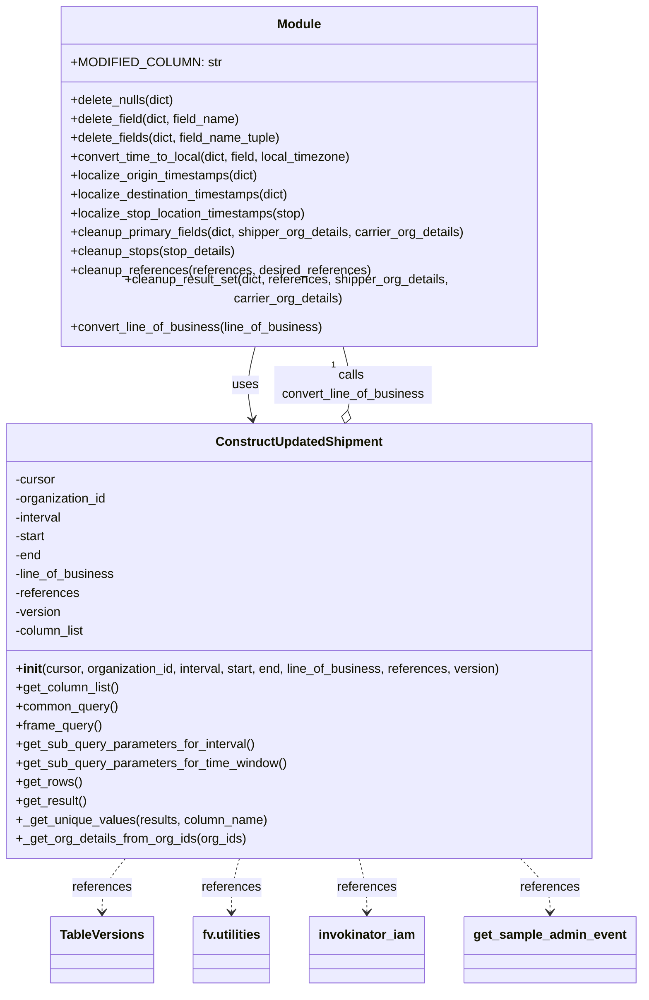

# Diagram: shipment_core/shipment_service/shipment_service/ng_shipments/ng_modified_shipment_API.py


> Auto-generated by Obscura crawlers

## Diagram 1



### SVG

<svg id="container" width="807.375" xmlns="http://www.w3.org/2000/svg" class="classDiagram" height="1232" viewBox="0 0 807.375 1232" role="graphics-document document" aria-roledescription="class"><style>#container{font-family:"trebuchet ms",verdana,arial,sans-serif;font-size:16px;fill:#333;}@keyframes edge-animation-frame{from{stroke-dashoffset:0;}}@keyframes dash{to{stroke-dashoffset:0;}}#container .edge-animation-slow{stroke-dasharray:9,5!important;stroke-dashoffset:900;animation:dash 50s linear infinite;stroke-linecap:round;}#container .edge-animation-fast{stroke-dasharray:9,5!important;stroke-dashoffset:900;animation:dash 20s linear infinite;stroke-linecap:round;}#container .error-icon{fill:#552222;}#container .error-text{fill:#552222;stroke:#552222;}#container .edge-thickness-normal{stroke-width:1px;}#container .edge-thickness-thick{stroke-width:3.5px;}#container .edge-pattern-solid{stroke-dasharray:0;}#container .edge-thickness-invisible{stroke-width:0;fill:none;}#container .edge-pattern-dashed{stroke-dasharray:3;}#container .edge-pattern-dotted{stroke-dasharray:2;}#container .marker{fill:#333333;stroke:#333333;}#container .marker.cross{stroke:#333333;}#container svg{font-family:"trebuchet ms",verdana,arial,sans-serif;font-size:16px;}#container p{margin:0;}#container g.classGroup text{fill:#9370DB;stroke:none;font-family:"trebuchet ms",verdana,arial,sans-serif;font-size:10px;}#container g.classGroup text .title{font-weight:bolder;}#container .nodeLabel,#container .edgeLabel{color:#131300;}#container .edgeLabel .label rect{fill:#ECECFF;}#container .label text{fill:#131300;}#container .labelBkg{background:#ECECFF;}#container .edgeLabel .label span{background:#ECECFF;}#container .classTitle{font-weight:bolder;}#container .node rect,#container .node circle,#container .node ellipse,#container .node polygon,#container .node path{fill:#ECECFF;stroke:#9370DB;stroke-width:1px;}#container .divider{stroke:#9370DB;stroke-width:1;}#container g.clickable{cursor:pointer;}#container g.classGroup rect{fill:#ECECFF;stroke:#9370DB;}#container g.classGroup line{stroke:#9370DB;stroke-width:1;}#container .classLabel .box{stroke:none;stroke-width:0;fill:#ECECFF;opacity:0.5;}#container .classLabel .label{fill:#9370DB;font-size:10px;}#container .relation{stroke:#333333;stroke-width:1;fill:none;}#container .dashed-line{stroke-dasharray:3;}#container .dotted-line{stroke-dasharray:1 2;}#container #compositionStart,#container .composition{fill:#333333!important;stroke:#333333!important;stroke-width:1;}#container #compositionEnd,#container .composition{fill:#333333!important;stroke:#333333!important;stroke-width:1;}#container #dependencyStart,#container .dependency{fill:#333333!important;stroke:#333333!important;stroke-width:1;}#container #dependencyStart,#container .dependency{fill:#333333!important;stroke:#333333!important;stroke-width:1;}#container #extensionStart,#container .extension{fill:transparent!important;stroke:#333333!important;stroke-width:1;}#container #extensionEnd,#container .extension{fill:transparent!important;stroke:#333333!important;stroke-width:1;}#container #aggregationStart,#container .aggregation{fill:transparent!important;stroke:#333333!important;stroke-width:1;}#container #aggregationEnd,#container .aggregation{fill:transparent!important;stroke:#333333!important;stroke-width:1;}#container #lollipopStart,#container .lollipop{fill:#ECECFF!important;stroke:#333333!important;stroke-width:1;}#container #lollipopEnd,#container .lollipop{fill:#ECECFF!important;stroke:#333333!important;stroke-width:1;}#container .edgeTerminals{font-size:11px;line-height:initial;}#container .classTitleText{text-anchor:middle;font-size:18px;fill:#333;}#container .label-icon{display:inline-block;height:1em;overflow:visible;vertical-align:-0.125em;}#container .node .label-icon path{fill:currentColor;stroke:revert;stroke-width:revert;}#container :root{--mermaid-font-family:"trebuchet ms",verdana,arial,sans-serif;}</style><g><defs><marker id="container_class-aggregationStart" class="marker aggregation class" refX="18" refY="7" markerWidth="190" markerHeight="240" orient="auto"><path d="M 18,7 L9,13 L1,7 L9,1 Z"></path></marker></defs><defs><marker id="container_class-aggregationEnd" class="marker aggregation class" refX="1" refY="7" markerWidth="20" markerHeight="28" orient="auto"><path d="M 18,7 L9,13 L1,7 L9,1 Z"></path></marker></defs><defs><marker id="container_class-extensionStart" class="marker extension class" refX="18" refY="7" markerWidth="190" markerHeight="240" orient="auto"><path d="M 1,7 L18,13 V 1 Z"></path></marker></defs><defs><marker id="container_class-extensionEnd" class="marker extension class" refX="1" refY="7" markerWidth="20" markerHeight="28" orient="auto"><path d="M 1,1 V 13 L18,7 Z"></path></marker></defs><defs><marker id="container_class-compositionStart" class="marker composition class" refX="18" refY="7" markerWidth="190" markerHeight="240" orient="auto"><path d="M 18,7 L9,13 L1,7 L9,1 Z"></path></marker></defs><defs><marker id="container_class-compositionEnd" class="marker composition class" refX="1" refY="7" markerWidth="20" markerHeight="28" orient="auto"><path d="M 18,7 L9,13 L1,7 L9,1 Z"></path></marker></defs><defs><marker id="container_class-dependencyStart" class="marker dependency class" refX="6" refY="7" markerWidth="190" markerHeight="240" orient="auto"><path d="M 5,7 L9,13 L1,7 L9,1 Z"></path></marker></defs><defs><marker id="container_class-dependencyEnd" class="marker dependency class" refX="13" refY="7" markerWidth="20" markerHeight="28" orient="auto"><path d="M 18,7 L9,13 L14,7 L9,1 Z"></path></marker></defs><defs><marker id="container_class-lollipopStart" class="marker lollipop class" refX="13" refY="7" markerWidth="190" markerHeight="240" orient="auto"><circle stroke="black" fill="transparent" cx="7" cy="7" r="6"></circle></marker></defs><defs><marker id="container_class-lollipopEnd" class="marker lollipop class" refX="1" refY="7" markerWidth="190" markerHeight="240" orient="auto"><circle stroke="black" fill="transparent" cx="7" cy="7" r="6"></circle></marker></defs><g class="root"><g class="clusters"></g><g class="edgePaths"><path d="M327.546,416L325.343,424.167C323.14,432.333,318.734,448.667,318.04,464.021C317.347,479.376,320.366,493.752,321.875,500.94L323.385,508.128" id="id_Module_ConstructUpdatedShipment_1" class="edge-thickness-normal edge-pattern-solid relation" style=";;;" data-edge="true" data-et="edge" data-id="id_Module_ConstructUpdatedShipment_1" data-points="W3sieCI6MzI3LjU0NTc0NzkwMDE5NzYsInkiOjQxNn0seyJ4IjozMTQuMzI4MTI1LCJ5Ijo0NjV9LHsieCI6MzI0LjYxNzUzNjA1NzY5MjMsInkiOjUxNH1d" marker-end="url(#container_class-dependencyEnd)"></path><path d="M444.076,497.118L445.2,491.765C446.324,486.412,448.572,475.706,447.493,462.186C446.414,448.667,442.009,432.333,439.806,424.167L437.603,416" id="id_ConstructUpdatedShipment_Module_2" class="edge-thickness-normal edge-pattern-solid relation" style=";;;" data-edge="true" data-et="edge" data-id="id_ConstructUpdatedShipment_Module_2" data-points="W3sieCI6NDQwLjUzMDkwMTQ0MjMwNzcsInkiOjUxNH0seyJ4Ijo0NTAuODIwMzEyNSwieSI6NDY1fSx7IngiOjQzNy42MDI2ODk1OTk4MDI0LCJ5Ijo0MTZ9XQ==" marker-start="url(#container_class-aggregationStart)"></path><path d="M165.265,1066L160.41,1072.167C155.554,1078.333,145.843,1090.667,140.988,1102C136.133,1113.333,136.133,1123.667,136.133,1128.833L136.133,1134" id="id_ConstructUpdatedShipment_TableVersions_3" class="edge-thickness-normal edge-pattern-dashed relation" style=";;;" data-edge="true" data-et="edge" data-id="id_ConstructUpdatedShipment_TableVersions_3" data-points="W3sieCI6MTY1LjI2NDg2MzcxODA1MTEyLCJ5IjoxMDY2fSx7IngiOjEzNi4xMzI4MTI1LCJ5IjoxMTAzfSx7IngiOjEzNi4xMzI4MTI1LCJ5IjoxMTQwfV0=" marker-end="url(#container_class-dependencyEnd)"></path><path d="M307.798,1066L306.127,1072.167C304.456,1078.333,301.115,1090.667,299.444,1102C297.773,1113.333,297.773,1123.667,297.773,1128.833L297.773,1134" id="id_ConstructUpdatedShipment_fv.utilities_4" class="edge-thickness-normal edge-pattern-dashed relation" style=";;;" data-edge="true" data-et="edge" data-id="id_ConstructUpdatedShipment_fv.utilities_4" data-points="W3sieCI6MzA3Ljc5NzgxMTAwMjM5NjE0LCJ5IjoxMDY2fSx7IngiOjI5Ny43NzM0Mzc1LCJ5IjoxMTAzfSx7IngiOjI5Ny43NzM0Mzc1LCJ5IjoxMTQwfV0=" marker-end="url(#container_class-dependencyEnd)"></path><path d="M457.351,1066L459.021,1072.167C460.692,1078.333,464.034,1090.667,465.704,1102C467.375,1113.333,467.375,1123.667,467.375,1128.833L467.375,1134" id="id_ConstructUpdatedShipment_invokinator_iam_5" class="edge-thickness-normal edge-pattern-dashed relation" style=";;;" data-edge="true" data-et="edge" data-id="id_ConstructUpdatedShipment_invokinator_iam_5" data-points="W3sieCI6NDU3LjM1MDYyNjQ5NzYwMzg2LCJ5IjoxMDY2fSx7IngiOjQ2Ny4zNzUsInkiOjExMDN9LHsieCI6NDY3LjM3NSwieSI6MTE0MH1d" marker-end="url(#container_class-dependencyEnd)"></path><path d="M657.055,1066L663.188,1072.167C669.321,1078.333,681.586,1090.667,687.719,1102C693.852,1113.333,693.852,1123.667,693.852,1128.833L693.852,1134" id="id_ConstructUpdatedShipment_get_sample_admin_event_6" class="edge-thickness-normal edge-pattern-dashed relation" style=";;;" data-edge="true" data-et="edge" data-id="id_ConstructUpdatedShipment_get_sample_admin_event_6" data-points="W3sieCI6NjU3LjA1NTE5OTE4MTMxLCJ5IjoxMDY2fSx7IngiOjY5My44NTE1NjI1LCJ5IjoxMTAzfSx7IngiOjY5My44NTE1NjI1LCJ5IjoxMTQwfV0=" marker-end="url(#container_class-dependencyEnd)"></path></g><g class="edgeLabels"><g class="edgeLabel" transform="translate(314.41703, 464.67041)"><g class="label" data-id="id_Module_ConstructUpdatedShipment_1" transform="translate(-16.4921875, -12)"><foreignObject width="32.984375" height="24"><div xmlns="http://www.w3.org/1999/xhtml" class="labelBkg" style="display: table-cell; white-space: nowrap; line-height: 1.5; max-width: 200px; text-align: center;"><span class="edgeLabel"><p>uses</p></span></div></foreignObject></g></g><g class="edgeLabel" transform="translate(450.73141, 464.67041)"><g class="label" data-id="id_ConstructUpdatedShipment_Module_2" transform="translate(-100, -24)"><foreignObject width="200" height="48"><div xmlns="http://www.w3.org/1999/xhtml" class="labelBkg" style="display: table; white-space: break-spaces; line-height: 1.5; max-width: 200px; text-align: center; width: 200px;"><span class="edgeLabel"><p>calls convert_line_of_business</p></span></div></foreignObject></g></g><g class="edgeLabel" transform="translate(136.1328125, 1103)"><g class="label" data-id="id_ConstructUpdatedShipment_TableVersions_3" transform="translate(-37.828125, -12)"><foreignObject width="75.65625" height="24"><div xmlns="http://www.w3.org/1999/xhtml" class="labelBkg" style="display: table-cell; white-space: nowrap; line-height: 1.5; max-width: 200px; text-align: center;"><span class="edgeLabel"><p>references</p></span></div></foreignObject></g></g><g class="edgeLabel" transform="translate(297.7734375, 1103)"><g class="label" data-id="id_ConstructUpdatedShipment_fv.utilities_4" transform="translate(-37.828125, -12)"><foreignObject width="75.65625" height="24"><div xmlns="http://www.w3.org/1999/xhtml" class="labelBkg" style="display: table-cell; white-space: nowrap; line-height: 1.5; max-width: 200px; text-align: center;"><span class="edgeLabel"><p>references</p></span></div></foreignObject></g></g><g class="edgeLabel" transform="translate(467.375, 1103)"><g class="label" data-id="id_ConstructUpdatedShipment_invokinator_iam_5" transform="translate(-37.828125, -12)"><foreignObject width="75.65625" height="24"><div xmlns="http://www.w3.org/1999/xhtml" class="labelBkg" style="display: table-cell; white-space: nowrap; line-height: 1.5; max-width: 200px; text-align: center;"><span class="edgeLabel"><p>references</p></span></div></foreignObject></g></g><g class="edgeLabel" transform="translate(693.8515625, 1103)"><g class="label" data-id="id_ConstructUpdatedShipment_get_sample_admin_event_6" transform="translate(-37.828125, -12)"><foreignObject width="75.65625" height="24"><div xmlns="http://www.w3.org/1999/xhtml" class="labelBkg" style="display: table-cell; white-space: nowrap; line-height: 1.5; max-width: 200px; text-align: center;"><span class="edgeLabel"><p>references</p></span></div></foreignObject></g></g><g class="edgeTerminals" transform="translate(422.6780086839952, 431.8026592366314)"><g class="inner" transform="translate(0, 0)"></g><foreignObject style="width: 9px; height: 12px;"><div xmlns="http://www.w3.org/1999/xhtml" style="display: inline-block; padding-right: 1px; white-space: nowrap;"><span class="edgeLabel">1</span></div></foreignObject></g></g><g class="nodes"><g class="node default" id="classId-Module-0" transform="translate(382.57421875, 212)"><g class="basic label-container"><path d="M-306.609375 -204 L306.609375 -204 L306.609375 204 L-306.609375 204" stroke="none" stroke-width="0" fill="#ECECFF" style=""></path><path d="M-306.609375 -204 C-133.77254837869822 -204, 39.064278242603564 -204, 306.609375 -204 M-306.609375 -204 C-145.4368159871946 -204, 15.735743025610816 -204, 306.609375 -204 M306.609375 -204 C306.609375 -68.34455146141738, 306.609375 67.31089707716524, 306.609375 204 M306.609375 -204 C306.609375 -84.30921877682502, 306.609375 35.38156244634996, 306.609375 204 M306.609375 204 C136.96473628981653 204, -32.67990242036694 204, -306.609375 204 M306.609375 204 C117.32534057661286 204, -71.95869384677428 204, -306.609375 204 M-306.609375 204 C-306.609375 88.03062422524906, -306.609375 -27.938751549501887, -306.609375 -204 M-306.609375 204 C-306.609375 65.13573831944689, -306.609375 -73.72852336110623, -306.609375 -204" stroke="#9370DB" stroke-width="1.3" fill="none" stroke-dasharray="0 0" style=""></path></g><g class="annotation-group text" transform="translate(0, -180)"></g><g class="label-group text" transform="translate(-27.09375, -180)"><g class="label" style="font-weight: bolder" transform="translate(0,-12)"><foreignObject width="54.1875" height="24"><div xmlns="http://www.w3.org/1999/xhtml" style="display: table-cell; white-space: nowrap; line-height: 1.5; max-width: 104px; text-align: center;"><span class="nodeLabel markdown-node-label" style=""><p>Module</p></span></div></foreignObject></g></g><g class="members-group text" transform="translate(-294.609375, -132)"><g class="label" style="" transform="translate(0,-12)"><foreignObject width="173.609375" height="24"><div xmlns="http://www.w3.org/1999/xhtml" style="display: table-cell; white-space: nowrap; line-height: 1.5; max-width: 232px; text-align: center;"><span class="nodeLabel markdown-node-label" style=""><p>+MODIFIED_COLUMN: str</p></span></div></foreignObject></g></g><g class="methods-group text" transform="translate(-294.609375, -84)"><g class="label" style="" transform="translate(0,-12)"><foreignObject width="135.265625" height="24"><div xmlns="http://www.w3.org/1999/xhtml" style="display: table-cell; white-space: nowrap; line-height: 1.5; max-width: 193px; text-align: center;"><span class="nodeLabel markdown-node-label" style=""><p>+delete_nulls(dict)</p></span></div></foreignObject></g><g class="label" style="" transform="translate(0,12)"><foreignObject width="220.578125" height="24"><div xmlns="http://www.w3.org/1999/xhtml" style="display: table-cell; white-space: nowrap; line-height: 1.5; max-width: 278px; text-align: center;"><span class="nodeLabel markdown-node-label" style=""><p>+delete_field(dict, field_name)</p></span></div></foreignObject></g><g class="label" style="" transform="translate(0,36)"><foreignObject width="273.65625" height="24"><div xmlns="http://www.w3.org/1999/xhtml" style="display: table-cell; white-space: nowrap; line-height: 1.5; max-width: 331px; text-align: center;"><span class="nodeLabel markdown-node-label" style=""><p>+delete_fields(dict, field_name_tuple)</p></span></div></foreignObject></g><g class="label" style="" transform="translate(0,60)"><foreignObject width="364" height="24"><div xmlns="http://www.w3.org/1999/xhtml" style="display: table-cell; white-space: nowrap; line-height: 1.5; max-width: 421px; text-align: center;"><span class="nodeLabel markdown-node-label" style=""><p>+convert_time_to_local(dict, field, local_timezone)</p></span></div></foreignObject></g><g class="label" style="" transform="translate(0,84)"><foreignObject width="243.8125" height="24"><div xmlns="http://www.w3.org/1999/xhtml" style="display: table-cell; white-space: nowrap; line-height: 1.5; max-width: 301px; text-align: center;"><span class="nodeLabel markdown-node-label" style=""><p>+localize_origin_timestamps(dict)</p></span></div></foreignObject></g><g class="label" style="" transform="translate(0,108)"><foreignObject width="284.71875" height="24"><div xmlns="http://www.w3.org/1999/xhtml" style="display: table-cell; white-space: nowrap; line-height: 1.5; max-width: 342px; text-align: center;"><span class="nodeLabel markdown-node-label" style=""><p>+localize_destination_timestamps(dict)</p></span></div></foreignObject></g><g class="label" style="" transform="translate(0,132)"><foreignObject width="305.09375" height="24"><div xmlns="http://www.w3.org/1999/xhtml" style="display: table-cell; white-space: nowrap; line-height: 1.5; max-width: 362px; text-align: center;"><span class="nodeLabel markdown-node-label" style=""><p>+localize_stop_location_timestamps(stop)</p></span></div></foreignObject></g><g class="label" style="" transform="translate(0,156)"><foreignObject width="510.1875" height="24"><div xmlns="http://www.w3.org/1999/xhtml" style="display: table-cell; white-space: nowrap; line-height: 1.5; max-width: 568px; text-align: center;"><span class="nodeLabel markdown-node-label" style=""><p>+cleanup_primary_fields(dict, shipper_org_details, carrier_org_details)</p></span></div></foreignObject></g><g class="label" style="" transform="translate(0,180)"><foreignObject width="212.265625" height="24"><div xmlns="http://www.w3.org/1999/xhtml" style="display: table-cell; white-space: nowrap; line-height: 1.5; max-width: 270px; text-align: center;"><span class="nodeLabel markdown-node-label" style=""><p>+cleanup_stops(stop_details)</p></span></div></foreignObject></g><g class="label" style="" transform="translate(0,204)"><foreignObject width="381.671875" height="24"><div xmlns="http://www.w3.org/1999/xhtml" style="display: table-cell; white-space: nowrap; line-height: 1.5; max-width: 439px; text-align: center;"><span class="nodeLabel markdown-node-label" style=""><p>+cleanup_references(references, desired_references)</p></span></div></foreignObject></g><g class="label" style="" transform="translate(0,228)"><foreignObject width="562.125" height="24"><div xmlns="http://www.w3.org/1999/xhtml" style="display: table-cell; white-space: nowrap; line-height: 1.5; max-width: 619px; text-align: center;"><span class="nodeLabel markdown-node-label" style=""><p>+cleanup_result_set(dict, references, shipper_org_details, carrier_org_details)</p></span></div></foreignObject></g><g class="label" style="" transform="translate(0,252)"><foreignObject width="323.34375" height="24"><div xmlns="http://www.w3.org/1999/xhtml" style="display: table-cell; white-space: nowrap; line-height: 1.5; max-width: 381px; text-align: center;"><span class="nodeLabel markdown-node-label" style=""><p>+convert_line_of_business(line_of_business)</p></span></div></foreignObject></g></g><g class="divider" style=""><path d="M-306.609375 -156 C-144.81712692632544 -156, 16.975121147349114 -156, 306.609375 -156 M-306.609375 -156 C-72.79096563789048 -156, 161.02744372421904 -156, 306.609375 -156" stroke="#9370DB" stroke-width="1.3" fill="none" stroke-dasharray="0 0" style=""></path></g><g class="divider" style=""><path d="M-306.609375 -108 C-72.10591900123404 -108, 162.39753699753192 -108, 306.609375 -108 M-306.609375 -108 C-85.6425257344072 -108, 135.3243235311856 -108, 306.609375 -108" stroke="#9370DB" stroke-width="1.3" fill="none" stroke-dasharray="0 0" style=""></path></g></g><g class="node default" id="classId-ConstructUpdatedShipment-1" transform="translate(382.57421875, 790)"><g class="basic label-container"><path d="M-374.57421875 -276 L374.57421875 -276 L374.57421875 276 L-374.57421875 276" stroke="none" stroke-width="0" fill="#ECECFF" style=""></path><path d="M-374.57421875 -276 C-207.98573999602525 -276, -41.39726124205049 -276, 374.57421875 -276 M-374.57421875 -276 C-96.70037796284021 -276, 181.17346282431959 -276, 374.57421875 -276 M374.57421875 -276 C374.57421875 -111.43626345938407, 374.57421875 53.12747308123187, 374.57421875 276 M374.57421875 -276 C374.57421875 -114.30624158138534, 374.57421875 47.38751683722933, 374.57421875 276 M374.57421875 276 C172.21766455885245 276, -30.138889632295104 276, -374.57421875 276 M374.57421875 276 C79.00185591317751 276, -216.57050692364498 276, -374.57421875 276 M-374.57421875 276 C-374.57421875 78.64576099608885, -374.57421875 -118.7084780078223, -374.57421875 -276 M-374.57421875 276 C-374.57421875 58.05094981744173, -374.57421875 -159.89810036511653, -374.57421875 -276" stroke="#9370DB" stroke-width="1.3" fill="none" stroke-dasharray="0 0" style=""></path></g><g class="annotation-group text" transform="translate(0, -252)"></g><g class="label-group text" transform="translate(-101.8203125, -252)"><g class="label" style="font-weight: bolder" transform="translate(0,-12)"><foreignObject width="203.640625" height="24"><div xmlns="http://www.w3.org/1999/xhtml" style="display: table-cell; white-space: nowrap; line-height: 1.5; max-width: 252px; text-align: center;"><span class="nodeLabel markdown-node-label" style=""><p>ConstructUpdatedShipment</p></span></div></foreignObject></g></g><g class="members-group text" transform="translate(-362.57421875, -204)"><g class="label" style="" transform="translate(0,-12)"><foreignObject width="52.1875" height="24"><div xmlns="http://www.w3.org/1999/xhtml" style="display: table-cell; white-space: nowrap; line-height: 1.5; max-width: 110px; text-align: center;"><span class="nodeLabel markdown-node-label" style=""><p>-cursor</p></span></div></foreignObject></g><g class="label" style="" transform="translate(0,12)"><foreignObject width="119.203125" height="24"><div xmlns="http://www.w3.org/1999/xhtml" style="display: table-cell; white-space: nowrap; line-height: 1.5; max-width: 177px; text-align: center;"><span class="nodeLabel markdown-node-label" style=""><p>-organization_id</p></span></div></foreignObject></g><g class="label" style="" transform="translate(0,36)"><foreignObject width="61.625" height="24"><div xmlns="http://www.w3.org/1999/xhtml" style="display: table-cell; white-space: nowrap; line-height: 1.5; max-width: 119px; text-align: center;"><span class="nodeLabel markdown-node-label" style=""><p>-interval</p></span></div></foreignObject></g><g class="label" style="" transform="translate(0,60)"><foreignObject width="40.25" height="24"><div xmlns="http://www.w3.org/1999/xhtml" style="display: table-cell; white-space: nowrap; line-height: 1.5; max-width: 98px; text-align: center;"><span class="nodeLabel markdown-node-label" style=""><p>-start</p></span></div></foreignObject></g><g class="label" style="" transform="translate(0,84)"><foreignObject width="34.125" height="24"><div xmlns="http://www.w3.org/1999/xhtml" style="display: table-cell; white-space: nowrap; line-height: 1.5; max-width: 91px; text-align: center;"><span class="nodeLabel markdown-node-label" style=""><p>-end</p></span></div></foreignObject></g><g class="label" style="" transform="translate(0,108)"><foreignObject width="127.65625" height="24"><div xmlns="http://www.w3.org/1999/xhtml" style="display: table-cell; white-space: nowrap; line-height: 1.5; max-width: 185px; text-align: center;"><span class="nodeLabel markdown-node-label" style=""><p>-line_of_business</p></span></div></foreignObject></g><g class="label" style="" transform="translate(0,132)"><foreignObject width="82.109375" height="24"><div xmlns="http://www.w3.org/1999/xhtml" style="display: table-cell; white-space: nowrap; line-height: 1.5; max-width: 139px; text-align: center;"><span class="nodeLabel markdown-node-label" style=""><p>-references</p></span></div></foreignObject></g><g class="label" style="" transform="translate(0,156)"><foreignObject width="59.46875" height="24"><div xmlns="http://www.w3.org/1999/xhtml" style="display: table-cell; white-space: nowrap; line-height: 1.5; max-width: 117px; text-align: center;"><span class="nodeLabel markdown-node-label" style=""><p>-version</p></span></div></foreignObject></g><g class="label" style="" transform="translate(0,180)"><foreignObject width="90.828125" height="24"><div xmlns="http://www.w3.org/1999/xhtml" style="display: table-cell; white-space: nowrap; line-height: 1.5; max-width: 148px; text-align: center;"><span class="nodeLabel markdown-node-label" style=""><p>-column_list</p></span></div></foreignObject></g></g><g class="methods-group text" transform="translate(-362.57421875, 36)"><g class="label" style="" transform="translate(0,-12)"><foreignObject width="623.328125" height="24"><div xmlns="http://www.w3.org/1999/xhtml" style="display: table-cell; white-space: nowrap; line-height: 1.5; max-width: 712px; text-align: center;"><span class="nodeLabel markdown-node-label" style=""><p>+<strong>init</strong>(cursor, organization_id, interval, start, end, line_of_business, references, version)</p></span></div></foreignObject></g><g class="label" style="" transform="translate(0,12)"><foreignObject width="133.28125" height="24"><div xmlns="http://www.w3.org/1999/xhtml" style="display: table-cell; white-space: nowrap; line-height: 1.5; max-width: 191px; text-align: center;"><span class="nodeLabel markdown-node-label" style=""><p>+get_column_list()</p></span></div></foreignObject></g><g class="label" style="" transform="translate(0,36)"><foreignObject width="130.828125" height="24"><div xmlns="http://www.w3.org/1999/xhtml" style="display: table-cell; white-space: nowrap; line-height: 1.5; max-width: 188px; text-align: center;"><span class="nodeLabel markdown-node-label" style=""><p>+common_query()</p></span></div></foreignObject></g><g class="label" style="" transform="translate(0,60)"><foreignObject width="109.5625" height="24"><div xmlns="http://www.w3.org/1999/xhtml" style="display: table-cell; white-space: nowrap; line-height: 1.5; max-width: 167px; text-align: center;"><span class="nodeLabel markdown-node-label" style=""><p>+frame_query()</p></span></div></foreignObject></g><g class="label" style="" transform="translate(0,84)"><foreignObject width="305.765625" height="24"><div xmlns="http://www.w3.org/1999/xhtml" style="display: table-cell; white-space: nowrap; line-height: 1.5; max-width: 363px; text-align: center;"><span class="nodeLabel markdown-node-label" style=""><p>+get_sub_query_parameters_for_interval()</p></span></div></foreignObject></g><g class="label" style="" transform="translate(0,108)"><foreignObject width="346.421875" height="24"><div xmlns="http://www.w3.org/1999/xhtml" style="display: table-cell; white-space: nowrap; line-height: 1.5; max-width: 404px; text-align: center;"><span class="nodeLabel markdown-node-label" style=""><p>+get_sub_query_parameters_for_time_window()</p></span></div></foreignObject></g><g class="label" style="" transform="translate(0,132)"><foreignObject width="83.21875" height="24"><div xmlns="http://www.w3.org/1999/xhtml" style="display: table-cell; white-space: nowrap; line-height: 1.5; max-width: 141px; text-align: center;"><span class="nodeLabel markdown-node-label" style=""><p>+get_rows()</p></span></div></foreignObject></g><g class="label" style="" transform="translate(0,156)"><foreignObject width="90.90625" height="24"><div xmlns="http://www.w3.org/1999/xhtml" style="display: table-cell; white-space: nowrap; line-height: 1.5; max-width: 148px; text-align: center;"><span class="nodeLabel markdown-node-label" style=""><p>+get_result()</p></span></div></foreignObject></g><g class="label" style="" transform="translate(0,180)"><foreignObject width="320.578125" height="24"><div xmlns="http://www.w3.org/1999/xhtml" style="display: table-cell; white-space: nowrap; line-height: 1.5; max-width: 378px; text-align: center;"><span class="nodeLabel markdown-node-label" style=""><p>+_get_unique_values(results, column_name)</p></span></div></foreignObject></g><g class="label" style="" transform="translate(0,204)"><foreignObject width="293.953125" height="24"><div xmlns="http://www.w3.org/1999/xhtml" style="display: table-cell; white-space: nowrap; line-height: 1.5; max-width: 351px; text-align: center;"><span class="nodeLabel markdown-node-label" style=""><p>+_get_org_details_from_org_ids(org_ids)</p></span></div></foreignObject></g></g><g class="divider" style=""><path d="M-374.57421875 -228 C-110.43070644419447 -228, 153.71280586161106 -228, 374.57421875 -228 M-374.57421875 -228 C-156.4201545054279 -228, 61.733909739144224 -228, 374.57421875 -228" stroke="#9370DB" stroke-width="1.3" fill="none" stroke-dasharray="0 0" style=""></path></g><g class="divider" style=""><path d="M-374.57421875 12 C-151.26086197320663 12, 72.05249480358674 12, 374.57421875 12 M-374.57421875 12 C-178.552199477276 12, 17.469819795448018 12, 374.57421875 12" stroke="#9370DB" stroke-width="1.3" fill="none" stroke-dasharray="0 0" style=""></path></g></g><g class="node default" id="classId-TableVersions-2" transform="translate(136.1328125, 1182)"><g class="basic label-container"><path d="M-62.9921875 -42 L62.9921875 -42 L62.9921875 42 L-62.9921875 42" stroke="none" stroke-width="0" fill="#ECECFF" style=""></path><path d="M-62.9921875 -42 C-33.63673874054094 -42, -4.281289981081883 -42, 62.9921875 -42 M-62.9921875 -42 C-20.046764005263185 -42, 22.89865948947363 -42, 62.9921875 -42 M62.9921875 -42 C62.9921875 -14.360554166546521, 62.9921875 13.278891666906958, 62.9921875 42 M62.9921875 -42 C62.9921875 -10.513034251896237, 62.9921875 20.973931496207527, 62.9921875 42 M62.9921875 42 C34.13363520811241 42, 5.275082916224825 42, -62.9921875 42 M62.9921875 42 C27.360321479449915 42, -8.27154454110017 42, -62.9921875 42 M-62.9921875 42 C-62.9921875 20.714354876767025, -62.9921875 -0.5712902464659493, -62.9921875 -42 M-62.9921875 42 C-62.9921875 24.6829823141565, -62.9921875 7.365964628313002, -62.9921875 -42" stroke="#9370DB" stroke-width="1.3" fill="none" stroke-dasharray="0 0" style=""></path></g><g class="annotation-group text" transform="translate(0, -18)"></g><g class="label-group text" transform="translate(-50.9921875, -18)"><g class="label" style="font-weight: bolder" transform="translate(0,-12)"><foreignObject width="101.984375" height="24"><div xmlns="http://www.w3.org/1999/xhtml" style="display: table-cell; white-space: nowrap; line-height: 1.5; max-width: 150px; text-align: center;"><span class="nodeLabel markdown-node-label" style=""><p>TableVersions</p></span></div></foreignObject></g></g><g class="members-group text" transform="translate(-50.9921875, 30)"></g><g class="methods-group text" transform="translate(-50.9921875, 60)"></g><g class="divider" style=""><path d="M-62.9921875 6 C-32.44414186580012 6, -1.8960962316002323 6, 62.9921875 6 M-62.9921875 6 C-22.461463187924842 6, 18.069261124150316 6, 62.9921875 6" stroke="#9370DB" stroke-width="1.3" fill="none" stroke-dasharray="0 0" style=""></path></g><g class="divider" style=""><path d="M-62.9921875 24 C-30.29473157401908 24, 2.4027243519618366 24, 62.9921875 24 M-62.9921875 24 C-21.753501785230398 24, 19.485183929539204 24, 62.9921875 24" stroke="#9370DB" stroke-width="1.3" fill="none" stroke-dasharray="0 0" style=""></path></g></g><g class="node default" id="classId-fv.utilities-3" transform="translate(297.7734375, 1182)"><g class="basic label-container"><path d="M-48.6484375 -42 L48.6484375 -42 L48.6484375 42 L-48.6484375 42" stroke="none" stroke-width="0" fill="#ECECFF" style=""></path><path d="M-48.6484375 -42 C-15.01152209683137 -42, 18.62539330633726 -42, 48.6484375 -42 M-48.6484375 -42 C-11.033774322959253 -42, 26.580888854081493 -42, 48.6484375 -42 M48.6484375 -42 C48.6484375 -23.07667463343983, 48.6484375 -4.153349266879658, 48.6484375 42 M48.6484375 -42 C48.6484375 -16.217781250186228, 48.6484375 9.564437499627545, 48.6484375 42 M48.6484375 42 C17.42300225112936 42, -13.802432997741278 42, -48.6484375 42 M48.6484375 42 C18.031414813710423 42, -12.585607872579153 42, -48.6484375 42 M-48.6484375 42 C-48.6484375 8.59374427636574, -48.6484375 -24.81251144726852, -48.6484375 -42 M-48.6484375 42 C-48.6484375 13.061388907183357, -48.6484375 -15.877222185633286, -48.6484375 -42" stroke="#9370DB" stroke-width="1.3" fill="none" stroke-dasharray="0 0" style=""></path></g><g class="annotation-group text" transform="translate(0, -18)"></g><g class="label-group text" transform="translate(-36.6484375, -18)"><g class="label" style="font-weight: bolder" transform="translate(0,-12)"><foreignObject width="73.296875" height="24"><div xmlns="http://www.w3.org/1999/xhtml" style="display: table-cell; white-space: nowrap; line-height: 1.5; max-width: 122px; text-align: center;"><span class="nodeLabel markdown-node-label" style=""><p>fv.utilities</p></span></div></foreignObject></g></g><g class="members-group text" transform="translate(-36.6484375, 30)"></g><g class="methods-group text" transform="translate(-36.6484375, 60)"></g><g class="divider" style=""><path d="M-48.6484375 6 C-9.926587934489774 6, 28.795261631020452 6, 48.6484375 6 M-48.6484375 6 C-24.790881855660956 6, -0.9333262113219121 6, 48.6484375 6" stroke="#9370DB" stroke-width="1.3" fill="none" stroke-dasharray="0 0" style=""></path></g><g class="divider" style=""><path d="M-48.6484375 24 C-19.57160251313801 24, 9.505232473723979 24, 48.6484375 24 M-48.6484375 24 C-19.00666143184201 24, 10.635114636315983 24, 48.6484375 24" stroke="#9370DB" stroke-width="1.3" fill="none" stroke-dasharray="0 0" style=""></path></g></g><g class="node default" id="classId-invokinator_iam-4" transform="translate(467.375, 1182)"><g class="basic label-container"><path d="M-70.953125 -42 L70.953125 -42 L70.953125 42 L-70.953125 42" stroke="none" stroke-width="0" fill="#ECECFF" style=""></path><path d="M-70.953125 -42 C-23.810989567079773 -42, 23.331145865840455 -42, 70.953125 -42 M-70.953125 -42 C-20.07674695625313 -42, 30.799631087493736 -42, 70.953125 -42 M70.953125 -42 C70.953125 -17.926058026826468, 70.953125 6.147883946347065, 70.953125 42 M70.953125 -42 C70.953125 -23.849107218986312, 70.953125 -5.698214437972624, 70.953125 42 M70.953125 42 C16.102657985848907 42, -38.747809028302186 42, -70.953125 42 M70.953125 42 C21.54128489753701 42, -27.870555204925978 42, -70.953125 42 M-70.953125 42 C-70.953125 15.134677657562854, -70.953125 -11.730644684874292, -70.953125 -42 M-70.953125 42 C-70.953125 13.996125799901563, -70.953125 -14.007748400196874, -70.953125 -42" stroke="#9370DB" stroke-width="1.3" fill="none" stroke-dasharray="0 0" style=""></path></g><g class="annotation-group text" transform="translate(0, -18)"></g><g class="label-group text" transform="translate(-58.953125, -18)"><g class="label" style="font-weight: bolder" transform="translate(0,-12)"><foreignObject width="117.90625" height="24"><div xmlns="http://www.w3.org/1999/xhtml" style="display: table-cell; white-space: nowrap; line-height: 1.5; max-width: 167px; text-align: center;"><span class="nodeLabel markdown-node-label" style=""><p>invokinator_iam</p></span></div></foreignObject></g></g><g class="members-group text" transform="translate(-58.953125, 30)"></g><g class="methods-group text" transform="translate(-58.953125, 60)"></g><g class="divider" style=""><path d="M-70.953125 6 C-25.988748557706728 6, 18.975627884586544 6, 70.953125 6 M-70.953125 6 C-41.891678001253695 6, -12.830231002507396 6, 70.953125 6" stroke="#9370DB" stroke-width="1.3" fill="none" stroke-dasharray="0 0" style=""></path></g><g class="divider" style=""><path d="M-70.953125 24 C-25.111737162390263 24, 20.729650675219474 24, 70.953125 24 M-70.953125 24 C-22.362110521575126 24, 26.22890395684975 24, 70.953125 24" stroke="#9370DB" stroke-width="1.3" fill="none" stroke-dasharray="0 0" style=""></path></g></g><g class="node default" id="classId-get_sample_admin_event-5" transform="translate(693.8515625, 1182)"><g class="basic label-container"><path d="M-105.5234375 -42 L105.5234375 -42 L105.5234375 42 L-105.5234375 42" stroke="none" stroke-width="0" fill="#ECECFF" style=""></path><path d="M-105.5234375 -42 C-48.29843022426048 -42, 8.926577051479043 -42, 105.5234375 -42 M-105.5234375 -42 C-52.18591552617137 -42, 1.151606447657258 -42, 105.5234375 -42 M105.5234375 -42 C105.5234375 -22.954067386675934, 105.5234375 -3.9081347733518683, 105.5234375 42 M105.5234375 -42 C105.5234375 -10.49441276513723, 105.5234375 21.01117446972554, 105.5234375 42 M105.5234375 42 C47.84671435382883 42, -9.83000879234234 42, -105.5234375 42 M105.5234375 42 C21.806689517821553 42, -61.910058464356894 42, -105.5234375 42 M-105.5234375 42 C-105.5234375 13.054022240544398, -105.5234375 -15.891955518911203, -105.5234375 -42 M-105.5234375 42 C-105.5234375 20.37673770239978, -105.5234375 -1.246524595200441, -105.5234375 -42" stroke="#9370DB" stroke-width="1.3" fill="none" stroke-dasharray="0 0" style=""></path></g><g class="annotation-group text" transform="translate(0, -18)"></g><g class="label-group text" transform="translate(-93.5234375, -18)"><g class="label" style="font-weight: bolder" transform="translate(0,-12)"><foreignObject width="187.046875" height="24"><div xmlns="http://www.w3.org/1999/xhtml" style="display: table-cell; white-space: nowrap; line-height: 1.5; max-width: 236px; text-align: center;"><span class="nodeLabel markdown-node-label" style=""><p>get_sample_admin_event</p></span></div></foreignObject></g></g><g class="members-group text" transform="translate(-93.5234375, 30)"></g><g class="methods-group text" transform="translate(-93.5234375, 60)"></g><g class="divider" style=""><path d="M-105.5234375 6 C-22.03646603172183 6, 61.45050543655634 6, 105.5234375 6 M-105.5234375 6 C-54.516560833298264 6, -3.5096841665965286 6, 105.5234375 6" stroke="#9370DB" stroke-width="1.3" fill="none" stroke-dasharray="0 0" style=""></path></g><g class="divider" style=""><path d="M-105.5234375 24 C-31.650288368991184 24, 42.22286076201763 24, 105.5234375 24 M-105.5234375 24 C-27.13009851983479 24, 51.26324046033042 24, 105.5234375 24" stroke="#9370DB" stroke-width="1.3" fill="none" stroke-dasharray="0 0" style=""></path></g></g></g></g></g></svg>

## Diagram 2

```mermaid
flowchart TD
    A[Start: ConstructUpdatedShipment.get_result()] --> B[get_rows()]
    B -->|no results| C[Return empty list]
    B -->|results found| D[_get_unique_values(created_by_org_id)]
    B --> D2[_get_unique_values(carrier_organization_id)]
    D --> E[_get_org_details_from_org_ids(created_by_org_id_unique_values)]
    D2 --> F[_get_org_details_from_org_ids(carrier_organization_id_unique_values)]
    E --> G[iterate rows]
    F --> G
    G --> H[cleanup_result_set(row_details, references, created_by_org_details, carrier_org_details)]
    H --> H1[cleanup_primary_fields(...)]
    H --> H2[cleanup_stops(stop_details)]
    H --> H3[cleanup_references(references, desired_references)]
    H1 --> I[localize_origin_timestamps -> convert_time_to_local]
    H1 --> J[localize_destination_timestamps -> convert_time_to_local]
    H2 --> K[localize_stop_location_timestamps -> convert_time_to_local]
    H3 --> L[filter & delete id/quantity/nulls]
    H --> M[append cleaned row to retval]
    M --> N[Return retval]
    style C fill:#f8d7da,stroke:#842029
    style N fill:#d1e7dd,stroke:#0f5132
```

> SVG rendering failed for this diagram.
