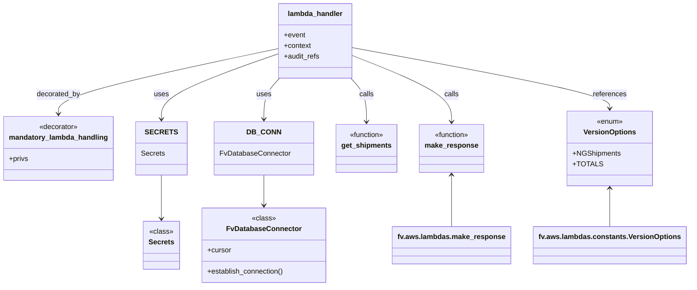

# Diagram: shipment_core/shipment_service/shipment_service/ng_shipments/ng_shipment_totals.py


> Auto-generated by Obscura crawlers

## Diagram 1

```mermaid
flowchart TD
    A[lambda_handler(event, context, audit_refs)] --> D[mandatory_lambda_handling decorator]
    D --> B{extract organization_id from\nevent.requestContext.authorizer}
    B --> C[DB_CONN.establish_connection()]
    C --> CURS[cursor = DB_CONN.cursor]
    CURS --> INFO1[logging.info("Filtering shipments V2")]
    INFO1 --> OPTS[options = event.queryStringParameters or {}]
    OPTS --> ISEMPTY{len(options) == 0}
    ISEMPTY -- yes --> FILTER_CALL[get_filter_result_solution(cursor,\nFILTER_RESULT_KEY.SHIPPING_TOTAL_COUNT,\norganization_id, event)]
    FILTER_CALL --> FILTER_RET[count_result, has_stored_data]
    FILTER_RET --> HAS{has_stored_data?}
    HAS -- true --> LOG_TRUE[logging.info("Filtering shipments has_stored_data=True")]
    LOG_TRUE --> RESP1[make_response(count_result)]
    HAS -- false --> CONTINUE[proceed to get_shipments]
    ISEMPTY -- no --> CONTINUE
    CONTINUE --> GETS[get_shipments(cursor, organization_id, event, False,\nrequest_type=VersionOptions.NGShipments.TOTALS)]
    GETS --> RESP2[make_response(result_of_get_shipments)]
    RESP1 --> END[return response]
    RESP2 --> END
```

> SVG rendering failed for this diagram.

## Diagram 2



### SVG

<svg id="container" width="1499.09765625" xmlns="http://www.w3.org/2000/svg" class="classDiagram" height="644" viewBox="0 0 1499.09765625 644" role="graphics-document document" aria-roledescription="class"><style>#container{font-family:"trebuchet ms",verdana,arial,sans-serif;font-size:16px;fill:#333;}@keyframes edge-animation-frame{from{stroke-dashoffset:0;}}@keyframes dash{to{stroke-dashoffset:0;}}#container .edge-animation-slow{stroke-dasharray:9,5!important;stroke-dashoffset:900;animation:dash 50s linear infinite;stroke-linecap:round;}#container .edge-animation-fast{stroke-dasharray:9,5!important;stroke-dashoffset:900;animation:dash 20s linear infinite;stroke-linecap:round;}#container .error-icon{fill:#552222;}#container .error-text{fill:#552222;stroke:#552222;}#container .edge-thickness-normal{stroke-width:1px;}#container .edge-thickness-thick{stroke-width:3.5px;}#container .edge-pattern-solid{stroke-dasharray:0;}#container .edge-thickness-invisible{stroke-width:0;fill:none;}#container .edge-pattern-dashed{stroke-dasharray:3;}#container .edge-pattern-dotted{stroke-dasharray:2;}#container .marker{fill:#333333;stroke:#333333;}#container .marker.cross{stroke:#333333;}#container svg{font-family:"trebuchet ms",verdana,arial,sans-serif;font-size:16px;}#container p{margin:0;}#container g.classGroup text{fill:#9370DB;stroke:none;font-family:"trebuchet ms",verdana,arial,sans-serif;font-size:10px;}#container g.classGroup text .title{font-weight:bolder;}#container .nodeLabel,#container .edgeLabel{color:#131300;}#container .edgeLabel .label rect{fill:#ECECFF;}#container .label text{fill:#131300;}#container .labelBkg{background:#ECECFF;}#container .edgeLabel .label span{background:#ECECFF;}#container .classTitle{font-weight:bolder;}#container .node rect,#container .node circle,#container .node ellipse,#container .node polygon,#container .node path{fill:#ECECFF;stroke:#9370DB;stroke-width:1px;}#container .divider{stroke:#9370DB;stroke-width:1;}#container g.clickable{cursor:pointer;}#container g.classGroup rect{fill:#ECECFF;stroke:#9370DB;}#container g.classGroup line{stroke:#9370DB;stroke-width:1;}#container .classLabel .box{stroke:none;stroke-width:0;fill:#ECECFF;opacity:0.5;}#container .classLabel .label{fill:#9370DB;font-size:10px;}#container .relation{stroke:#333333;stroke-width:1;fill:none;}#container .dashed-line{stroke-dasharray:3;}#container .dotted-line{stroke-dasharray:1 2;}#container #compositionStart,#container .composition{fill:#333333!important;stroke:#333333!important;stroke-width:1;}#container #compositionEnd,#container .composition{fill:#333333!important;stroke:#333333!important;stroke-width:1;}#container #dependencyStart,#container .dependency{fill:#333333!important;stroke:#333333!important;stroke-width:1;}#container #dependencyStart,#container .dependency{fill:#333333!important;stroke:#333333!important;stroke-width:1;}#container #extensionStart,#container .extension{fill:transparent!important;stroke:#333333!important;stroke-width:1;}#container #extensionEnd,#container .extension{fill:transparent!important;stroke:#333333!important;stroke-width:1;}#container #aggregationStart,#container .aggregation{fill:transparent!important;stroke:#333333!important;stroke-width:1;}#container #aggregationEnd,#container .aggregation{fill:transparent!important;stroke:#333333!important;stroke-width:1;}#container #lollipopStart,#container .lollipop{fill:#ECECFF!important;stroke:#333333!important;stroke-width:1;}#container #lollipopEnd,#container .lollipop{fill:#ECECFF!important;stroke:#333333!important;stroke-width:1;}#container .edgeTerminals{font-size:11px;line-height:initial;}#container .classTitleText{text-anchor:middle;font-size:18px;fill:#333;}#container .label-icon{display:inline-block;height:1em;overflow:visible;vertical-align:-0.125em;}#container .node .label-icon path{fill:currentColor;stroke:revert;stroke-width:revert;}#container :root{--mermaid-font-family:"trebuchet ms",verdana,arial,sans-serif;}</style><g><defs><marker id="container_class-aggregationStart" class="marker aggregation class" refX="18" refY="7" markerWidth="190" markerHeight="240" orient="auto"><path d="M 18,7 L9,13 L1,7 L9,1 Z"></path></marker></defs><defs><marker id="container_class-aggregationEnd" class="marker aggregation class" refX="1" refY="7" markerWidth="20" markerHeight="28" orient="auto"><path d="M 18,7 L9,13 L1,7 L9,1 Z"></path></marker></defs><defs><marker id="container_class-extensionStart" class="marker extension class" refX="18" refY="7" markerWidth="190" markerHeight="240" orient="auto"><path d="M 1,7 L18,13 V 1 Z"></path></marker></defs><defs><marker id="container_class-extensionEnd" class="marker extension class" refX="1" refY="7" markerWidth="20" markerHeight="28" orient="auto"><path d="M 1,1 V 13 L18,7 Z"></path></marker></defs><defs><marker id="container_class-compositionStart" class="marker composition class" refX="18" refY="7" markerWidth="190" markerHeight="240" orient="auto"><path d="M 18,7 L9,13 L1,7 L9,1 Z"></path></marker></defs><defs><marker id="container_class-compositionEnd" class="marker composition class" refX="1" refY="7" markerWidth="20" markerHeight="28" orient="auto"><path d="M 18,7 L9,13 L1,7 L9,1 Z"></path></marker></defs><defs><marker id="container_class-dependencyStart" class="marker dependency class" refX="6" refY="7" markerWidth="190" markerHeight="240" orient="auto"><path d="M 5,7 L9,13 L1,7 L9,1 Z"></path></marker></defs><defs><marker id="container_class-dependencyEnd" class="marker dependency class" refX="13" refY="7" markerWidth="20" markerHeight="28" orient="auto"><path d="M 18,7 L9,13 L14,7 L9,1 Z"></path></marker></defs><defs><marker id="container_class-lollipopStart" class="marker lollipop class" refX="13" refY="7" markerWidth="190" markerHeight="240" orient="auto"><circle stroke="black" fill="transparent" cx="7" cy="7" r="6"></circle></marker></defs><defs><marker id="container_class-lollipopEnd" class="marker lollipop class" refX="1" refY="7" markerWidth="190" markerHeight="240" orient="auto"><circle stroke="black" fill="transparent" cx="7" cy="7" r="6"></circle></marker></defs><g class="root"><g class="clusters"></g><g class="edgePaths"><path d="M607.563,109.75L527.54,126.959C447.518,144.167,287.474,178.583,207.452,202.958C127.43,227.333,127.43,241.667,127.43,248.833L127.43,256" id="id_lambda_handler_mandatory_lambda_handling_1" class="edge-thickness-normal edge-pattern-solid relation" style=";;;" data-edge="true" data-et="edge" data-id="id_lambda_handler_mandatory_lambda_handling_1" data-points="W3sieCI6NjA3LjU2MjUsInkiOjEwOS43NTAzNjI3MzM4Njc4OX0seyJ4IjoxMjcuNDI5Njg3NSwieSI6MjEzfSx7IngiOjEyNy40Mjk2ODc1LCJ5IjoyNjJ9XQ==" marker-end="url(#container_class-dependencyEnd)"></path><path d="M607.563,121.437L564.772,136.698C521.982,151.958,436.401,182.479,393.611,206.906C350.82,231.333,350.82,249.667,350.82,258.833L350.82,268" id="id_lambda_handler_SECRETS_2" class="edge-thickness-normal edge-pattern-solid relation" style=";;;" data-edge="true" data-et="edge" data-id="id_lambda_handler_SECRETS_2" data-points="W3sieCI6NjA3LjU2MjUsInkiOjEyMS40Mzc0Nzc2OTMyMTk4OX0seyJ4IjozNTAuODIwMzEyNSwieSI6MjEzfSx7IngiOjM1MC44MjAzMTI1LCJ5IjoyNzR9XQ==" marker-end="url(#container_class-dependencyEnd)"></path><path d="M612.467,176L606.768,182.167C601.068,188.333,589.669,200.667,583.969,216C578.27,231.333,578.27,249.667,578.27,258.833L578.27,268" id="id_lambda_handler_DB_CONN_3" class="edge-thickness-normal edge-pattern-solid relation" style=";;;" data-edge="true" data-et="edge" data-id="id_lambda_handler_DB_CONN_3" data-points="W3sieCI6NjEyLjQ2NzI5NzI2MjM5NjYsInkiOjE3Nn0seyJ4Ijo1NzguMjY5NTMxMjUsInkiOjIxM30seyJ4Ijo1NzguMjY5NTMxMjUsInkiOjI3NH1d" marker-end="url(#container_class-dependencyEnd)"></path><path d="M772.648,125.577L808.468,140.147C844.288,154.718,915.927,183.859,951.747,208.596C987.566,233.333,987.566,253.667,987.566,263.833L987.566,274" id="id_lambda_handler_make_response_4" class="edge-thickness-normal edge-pattern-solid relation" style=";;;" data-edge="true" data-et="edge" data-id="id_lambda_handler_make_response_4" data-points="W3sieCI6NzcyLjY0ODQzNzUsInkiOjEyNS41NzY1MDY4OTQyODc1OX0seyJ4Ijo5ODcuNTY2NDA2MjUsInkiOjIxM30seyJ4Ijo5ODcuNTY2NDA2MjUsInkiOjI4MH1d" marker-end="url(#container_class-dependencyEnd)"></path><path d="M767.744,176L773.443,182.167C779.143,188.333,790.542,200.667,796.242,217C801.941,233.333,801.941,253.667,801.941,263.833L801.941,274" id="id_lambda_handler_get_shipments_5" class="edge-thickness-normal edge-pattern-solid relation" style=";;;" data-edge="true" data-et="edge" data-id="id_lambda_handler_get_shipments_5" data-points="W3sieCI6NzY3Ljc0MzY0MDIzNzYwMzQsInkiOjE3Nn0seyJ4Ijo4MDEuOTQxNDA2MjUsInkiOjIxM30seyJ4Ijo4MDEuOTQxNDA2MjUsInkiOjI4MH1d" marker-end="url(#container_class-dependencyEnd)"></path><path d="M772.648,107.658L865.202,125.215C957.757,142.772,1142.865,177.886,1235.419,200.61C1327.973,223.333,1327.973,233.667,1327.973,238.833L1327.973,244" id="id_lambda_handler_VersionOptions_6" class="edge-thickness-normal edge-pattern-solid relation" style=";;;" data-edge="true" data-et="edge" data-id="id_lambda_handler_VersionOptions_6" data-points="W3sieCI6NzcyLjY0ODQzNzUsInkiOjEwNy42NTc5NjA0ODg0NDQxNn0seyJ4IjoxMzI3Ljk3MjY1NjI1LCJ5IjoyMTN9LHsieCI6MTMyNy45NzI2NTYyNSwieSI6MjUwfV0=" marker-end="url(#container_class-dependencyEnd)"></path><path d="M578.27,394L578.27,402.167C578.27,410.333,578.27,426.667,578.27,438C578.27,449.333,578.27,455.667,578.27,458.833L578.27,462" id="id_DB_CONN_FvDatabaseConnector_7" class="edge-thickness-normal edge-pattern-solid relation" style=";;;" data-edge="true" data-et="edge" data-id="id_DB_CONN_FvDatabaseConnector_7" data-points="W3sieCI6NTc4LjI2OTUzMTI1LCJ5IjozOTR9LHsieCI6NTc4LjI2OTUzMTI1LCJ5Ijo0NDN9LHsieCI6NTc4LjI2OTUzMTI1LCJ5Ijo0Njh9XQ==" marker-end="url(#container_class-dependencyEnd)"></path><path d="M350.82,394L350.82,402.167C350.82,410.333,350.82,426.667,350.82,443C350.82,459.333,350.82,475.667,350.82,483.833L350.82,492" id="id_SECRETS_Secrets_8" class="edge-thickness-normal edge-pattern-solid relation" style=";;;" data-edge="true" data-et="edge" data-id="id_SECRETS_Secrets_8" data-points="W3sieCI6MzUwLjgyMDMxMjUsInkiOjM5NH0seyJ4IjozNTAuODIwMzEyNSwieSI6NDQzfSx7IngiOjM1MC44MjAzMTI1LCJ5Ijo0OTh9XQ==" marker-end="url(#container_class-dependencyEnd)"></path><path d="M987.566,394L987.566,402.167C987.566,410.333,987.566,426.667,987.566,446C987.566,465.333,987.566,487.667,987.566,498.833L987.566,510" id="id_make_response_fv.aws.lambdas.make_response_9" class="edge-thickness-normal edge-pattern-solid relation" style=";;;" data-edge="true" data-et="edge" data-id="id_make_response_fv.aws.lambdas.make_response_9" data-points="W3sieCI6OTg3LjU2NjQwNjI1LCJ5IjozODh9LHsieCI6OTg3LjU2NjQwNjI1LCJ5Ijo0NDN9LHsieCI6OTg3LjU2NjQwNjI1LCJ5Ijo1MTB9XQ==" marker-start="url(#container_class-dependencyStart)"></path><path d="M1327.973,424L1327.973,427.167C1327.973,430.333,1327.973,436.667,1327.973,451C1327.973,465.333,1327.973,487.667,1327.973,498.833L1327.973,510" id="id_VersionOptions_fv.aws.lambdas.constants.VersionOptions_10" class="edge-thickness-normal edge-pattern-solid relation" style=";;;" data-edge="true" data-et="edge" data-id="id_VersionOptions_fv.aws.lambdas.constants.VersionOptions_10" data-points="W3sieCI6MTMyNy45NzI2NTYyNSwieSI6NDE4fSx7IngiOjEzMjcuOTcyNjU2MjUsInkiOjQ0M30seyJ4IjoxMzI3Ljk3MjY1NjI1LCJ5Ijo1MTB9XQ==" marker-start="url(#container_class-dependencyStart)"></path></g><g class="edgeLabels"><g class="edgeLabel" transform="translate(127.4296875, 213)"><g class="label" data-id="id_lambda_handler_mandatory_lambda_handling_1" transform="translate(-49.375, -12)"><foreignObject width="98.75" height="24"><div xmlns="http://www.w3.org/1999/xhtml" class="labelBkg" style="display: table-cell; white-space: nowrap; line-height: 1.5; max-width: 200px; text-align: center;"><span class="edgeLabel"><p>decorated_by</p></span></div></foreignObject></g></g><g class="edgeLabel" transform="translate(350.8203125, 213)"><g class="label" data-id="id_lambda_handler_SECRETS_2" transform="translate(-16.4921875, -12)"><foreignObject width="32.984375" height="24"><div xmlns="http://www.w3.org/1999/xhtml" class="labelBkg" style="display: table-cell; white-space: nowrap; line-height: 1.5; max-width: 200px; text-align: center;"><span class="edgeLabel"><p>uses</p></span></div></foreignObject></g></g><g class="edgeLabel" transform="translate(578.26953125, 213)"><g class="label" data-id="id_lambda_handler_DB_CONN_3" transform="translate(-16.4921875, -12)"><foreignObject width="32.984375" height="24"><div xmlns="http://www.w3.org/1999/xhtml" class="labelBkg" style="display: table-cell; white-space: nowrap; line-height: 1.5; max-width: 200px; text-align: center;"><span class="edgeLabel"><p>uses</p></span></div></foreignObject></g></g><g class="edgeLabel" transform="translate(987.56640625, 213)"><g class="label" data-id="id_lambda_handler_make_response_4" transform="translate(-16.4453125, -12)"><foreignObject width="32.890625" height="24"><div xmlns="http://www.w3.org/1999/xhtml" class="labelBkg" style="display: table-cell; white-space: nowrap; line-height: 1.5; max-width: 200px; text-align: center;"><span class="edgeLabel"><p>calls</p></span></div></foreignObject></g></g><g class="edgeLabel" transform="translate(801.94140625, 213)"><g class="label" data-id="id_lambda_handler_get_shipments_5" transform="translate(-16.4453125, -12)"><foreignObject width="32.890625" height="24"><div xmlns="http://www.w3.org/1999/xhtml" class="labelBkg" style="display: table-cell; white-space: nowrap; line-height: 1.5; max-width: 200px; text-align: center;"><span class="edgeLabel"><p>calls</p></span></div></foreignObject></g></g><g class="edgeLabel" transform="translate(1327.97265625, 213)"><g class="label" data-id="id_lambda_handler_VersionOptions_6" transform="translate(-37.828125, -12)"><foreignObject width="75.65625" height="24"><div xmlns="http://www.w3.org/1999/xhtml" class="labelBkg" style="display: table-cell; white-space: nowrap; line-height: 1.5; max-width: 200px; text-align: center;"><span class="edgeLabel"><p>references</p></span></div></foreignObject></g></g><g class="edgeLabel"><g class="label" data-id="id_DB_CONN_FvDatabaseConnector_7" transform="translate(0, 0)"><foreignObject width="0" height="0"><div xmlns="http://www.w3.org/1999/xhtml" class="labelBkg" style="display: table-cell; white-space: nowrap; line-height: 1.5; max-width: 200px; text-align: center;"><span class="edgeLabel"></span></div></foreignObject></g></g><g class="edgeLabel"><g class="label" data-id="id_SECRETS_Secrets_8" transform="translate(0, 0)"><foreignObject width="0" height="0"><div xmlns="http://www.w3.org/1999/xhtml" class="labelBkg" style="display: table-cell; white-space: nowrap; line-height: 1.5; max-width: 200px; text-align: center;"><span class="edgeLabel"></span></div></foreignObject></g></g><g class="edgeLabel"><g class="label" data-id="id_make_response_fv.aws.lambdas.make_response_9" transform="translate(0, 0)"><foreignObject width="0" height="0"><div xmlns="http://www.w3.org/1999/xhtml" class="labelBkg" style="display: table-cell; white-space: nowrap; line-height: 1.5; max-width: 200px; text-align: center;"><span class="edgeLabel"></span></div></foreignObject></g></g><g class="edgeLabel"><g class="label" data-id="id_VersionOptions_fv.aws.lambdas.constants.VersionOptions_10" transform="translate(0, 0)"><foreignObject width="0" height="0"><div xmlns="http://www.w3.org/1999/xhtml" class="labelBkg" style="display: table-cell; white-space: nowrap; line-height: 1.5; max-width: 200px; text-align: center;"><span class="edgeLabel"></span></div></foreignObject></g></g></g><g class="nodes"><g class="node default" id="classId-lambda_handler-0" transform="translate(690.10546875, 92)"><g class="basic label-container"><path d="M-82.54296875 -84 L82.54296875 -84 L82.54296875 84 L-82.54296875 84" stroke="none" stroke-width="0" fill="#ECECFF" style=""></path><path d="M-82.54296875 -84 C-46.402945029341424 -84, -10.262921308682849 -84, 82.54296875 -84 M-82.54296875 -84 C-17.52956624948399 -84, 47.48383625103202 -84, 82.54296875 -84 M82.54296875 -84 C82.54296875 -35.00559235986366, 82.54296875 13.988815280272675, 82.54296875 84 M82.54296875 -84 C82.54296875 -36.98757008979957, 82.54296875 10.024859820400863, 82.54296875 84 M82.54296875 84 C22.48950493971239 84, -37.56395887057522 84, -82.54296875 84 M82.54296875 84 C43.92226964480056 84, 5.301570539601116 84, -82.54296875 84 M-82.54296875 84 C-82.54296875 36.66898036074199, -82.54296875 -10.66203927851602, -82.54296875 -84 M-82.54296875 84 C-82.54296875 42.02434265800208, -82.54296875 0.04868531600415338, -82.54296875 -84" stroke="#9370DB" stroke-width="1.3" fill="none" stroke-dasharray="0 0" style=""></path></g><g class="annotation-group text" transform="translate(0, -60)"></g><g class="label-group text" transform="translate(-59.9765625, -60)"><g class="label" style="font-weight: bolder" transform="translate(0,-12)"><foreignObject width="119.953125" height="24"><div xmlns="http://www.w3.org/1999/xhtml" style="display: table-cell; white-space: nowrap; line-height: 1.5; max-width: 170px; text-align: center;"><span class="nodeLabel markdown-node-label" style=""><p>lambda_handler</p></span></div></foreignObject></g></g><g class="members-group text" transform="translate(-70.54296875, -12)"><g class="label" style="" transform="translate(0,-12)"><foreignObject width="48.328125" height="24"><div xmlns="http://www.w3.org/1999/xhtml" style="display: table-cell; white-space: nowrap; line-height: 1.5; max-width: 106px; text-align: center;"><span class="nodeLabel markdown-node-label" style=""><p>+event</p></span></div></foreignObject></g><g class="label" style="" transform="translate(0,12)"><foreignObject width="61.6875" height="24"><div xmlns="http://www.w3.org/1999/xhtml" style="display: table-cell; white-space: nowrap; line-height: 1.5; max-width: 119px; text-align: center;"><span class="nodeLabel markdown-node-label" style=""><p>+context</p></span></div></foreignObject></g><g class="label" style="" transform="translate(0,36)"><foreignObject width="81.109375" height="24"><div xmlns="http://www.w3.org/1999/xhtml" style="display: table-cell; white-space: nowrap; line-height: 1.5; max-width: 138px; text-align: center;"><span class="nodeLabel markdown-node-label" style=""><p>+audit_refs</p></span></div></foreignObject></g></g><g class="methods-group text" transform="translate(-70.54296875, 84)"></g><g class="divider" style=""><path d="M-82.54296875 -36 C-28.401575392748754 -36, 25.739817964502492 -36, 82.54296875 -36 M-82.54296875 -36 C-16.680775696214894 -36, 49.18141735757021 -36, 82.54296875 -36" stroke="#9370DB" stroke-width="1.3" fill="none" stroke-dasharray="0 0" style=""></path></g><g class="divider" style=""><path d="M-82.54296875 60 C-41.67481829306576 60, -0.806667836131524 60, 82.54296875 60 M-82.54296875 60 C-30.404909224410524 60, 21.733150301178952 60, 82.54296875 60" stroke="#9370DB" stroke-width="1.3" fill="none" stroke-dasharray="0 0" style=""></path></g></g><g class="node default" id="classId-mandatory_lambda_handling-1" transform="translate(127.4296875, 334)"><g class="basic label-container"><path d="M-119.4296875 -72 L119.4296875 -72 L119.4296875 72 L-119.4296875 72" stroke="none" stroke-width="0" fill="#ECECFF" style=""></path><path d="M-119.4296875 -72 C-69.5896947778038 -72, -19.749702055607585 -72, 119.4296875 -72 M-119.4296875 -72 C-29.11100195203342 -72, 61.20768359593316 -72, 119.4296875 -72 M119.4296875 -72 C119.4296875 -21.177591231941037, 119.4296875 29.644817536117927, 119.4296875 72 M119.4296875 -72 C119.4296875 -19.890899484645225, 119.4296875 32.21820103070955, 119.4296875 72 M119.4296875 72 C60.17601527306826 72, 0.9223430461365183 72, -119.4296875 72 M119.4296875 72 C31.118201590220735 72, -57.19328431955853 72, -119.4296875 72 M-119.4296875 72 C-119.4296875 33.65579404144441, -119.4296875 -4.688411917111182, -119.4296875 -72 M-119.4296875 72 C-119.4296875 39.75075572690206, -119.4296875 7.501511453804113, -119.4296875 -72" stroke="#9370DB" stroke-width="1.3" fill="none" stroke-dasharray="0 0" style=""></path></g><g class="annotation-group text" transform="translate(-44.0625, -48)"><g class="label" style="" transform="translate(0,-12)"><foreignObject width="88.125" height="24"><div xmlns="http://www.w3.org/1999/xhtml" style="display: table-cell; white-space: nowrap; line-height: 1.5; max-width: 138px; text-align: center;"><span class="nodeLabel markdown-node-label" style=""><p>«decorator»</p></span></div></foreignObject></g></g><g class="label-group text" transform="translate(-107.4296875, -24)"><g class="label" style="font-weight: bolder" transform="translate(0,-12)"><foreignObject width="214.859375" height="24"><div xmlns="http://www.w3.org/1999/xhtml" style="display: table-cell; white-space: nowrap; line-height: 1.5; max-width: 264px; text-align: center;"><span class="nodeLabel markdown-node-label" style=""><p>mandatory_lambda_handling</p></span></div></foreignObject></g></g><g class="members-group text" transform="translate(-107.4296875, 24)"><g class="label" style="" transform="translate(0,-12)"><foreignObject width="43.421875" height="24"><div xmlns="http://www.w3.org/1999/xhtml" style="display: table-cell; white-space: nowrap; line-height: 1.5; max-width: 101px; text-align: center;"><span class="nodeLabel markdown-node-label" style=""><p>+privs</p></span></div></foreignObject></g></g><g class="methods-group text" transform="translate(-107.4296875, 72)"></g><g class="divider" style=""><path d="M-119.4296875 0 C-25.264670940200972 0, 68.90034561959806 0, 119.4296875 0 M-119.4296875 0 C-38.055348844787474 0, 43.31898981042505 0, 119.4296875 0" stroke="#9370DB" stroke-width="1.3" fill="none" stroke-dasharray="0 0" style=""></path></g><g class="divider" style=""><path d="M-119.4296875 48 C-61.49578780103451 48, -3.5618881020690196 48, 119.4296875 48 M-119.4296875 48 C-58.05100676960892 48, 3.327673960782164 48, 119.4296875 48" stroke="#9370DB" stroke-width="1.3" fill="none" stroke-dasharray="0 0" style=""></path></g></g><g class="node default" id="classId-Secrets-2" transform="translate(350.8203125, 552)"><g class="basic label-container"><path d="M-39.1640625 -54 L39.1640625 -54 L39.1640625 54 L-39.1640625 54" stroke="none" stroke-width="0" fill="#ECECFF" style=""></path><path d="M-39.1640625 -54 C-15.315125788915317 -54, 8.533810922169366 -54, 39.1640625 -54 M-39.1640625 -54 C-8.46208987290542 -54, 22.23988275418916 -54, 39.1640625 -54 M39.1640625 -54 C39.1640625 -25.05525755119891, 39.1640625 3.8894848976021805, 39.1640625 54 M39.1640625 -54 C39.1640625 -28.62103245744348, 39.1640625 -3.24206491488696, 39.1640625 54 M39.1640625 54 C8.330940573620516 54, -22.502181352758967 54, -39.1640625 54 M39.1640625 54 C16.98646004139169 54, -5.191142417216618 54, -39.1640625 54 M-39.1640625 54 C-39.1640625 11.688045871229122, -39.1640625 -30.623908257541757, -39.1640625 -54 M-39.1640625 54 C-39.1640625 25.056651634312338, -39.1640625 -3.8866967313753236, -39.1640625 -54" stroke="#9370DB" stroke-width="1.3" fill="none" stroke-dasharray="0 0" style=""></path></g><g class="annotation-group text" transform="translate(-26.765625, -30)"><g class="label" style="" transform="translate(0,-12)"><foreignObject width="53.53125" height="24"><div xmlns="http://www.w3.org/1999/xhtml" style="display: table-cell; white-space: nowrap; line-height: 1.5; max-width: 104px; text-align: center;"><span class="nodeLabel markdown-node-label" style=""><p>«class»</p></span></div></foreignObject></g></g><g class="label-group text" transform="translate(-27.1640625, -6)"><g class="label" style="font-weight: bolder" transform="translate(0,-12)"><foreignObject width="54.328125" height="24"><div xmlns="http://www.w3.org/1999/xhtml" style="display: table-cell; white-space: nowrap; line-height: 1.5; max-width: 103px; text-align: center;"><span class="nodeLabel markdown-node-label" style=""><p>Secrets</p></span></div></foreignObject></g></g><g class="members-group text" transform="translate(-27.1640625, 42)"></g><g class="methods-group text" transform="translate(-27.1640625, 72)"></g><g class="divider" style=""><path d="M-39.1640625 18 C-22.303279587769584 18, -5.442496675539168 18, 39.1640625 18 M-39.1640625 18 C-10.13249318985811 18, 18.89907612028378 18, 39.1640625 18" stroke="#9370DB" stroke-width="1.3" fill="none" stroke-dasharray="0 0" style=""></path></g><g class="divider" style=""><path d="M-39.1640625 36 C-19.873942307843183 36, -0.5838221156863668 36, 39.1640625 36 M-39.1640625 36 C-19.368368589652956 36, 0.4273253206940879 36, 39.1640625 36" stroke="#9370DB" stroke-width="1.3" fill="none" stroke-dasharray="0 0" style=""></path></g></g><g class="node default" id="classId-FvDatabaseConnector-3" transform="translate(578.26953125, 552)"><g class="basic label-container"><path d="M-138.28515625 -84 L138.28515625 -84 L138.28515625 84 L-138.28515625 84" stroke="none" stroke-width="0" fill="#ECECFF" style=""></path><path d="M-138.28515625 -84 C-50.29737709770001 -84, 37.690402054599986 -84, 138.28515625 -84 M-138.28515625 -84 C-72.34431253089774 -84, -6.403468811795477 -84, 138.28515625 -84 M138.28515625 -84 C138.28515625 -48.69132230494383, 138.28515625 -13.382644609887663, 138.28515625 84 M138.28515625 -84 C138.28515625 -33.19882241186247, 138.28515625 17.602355176275054, 138.28515625 84 M138.28515625 84 C77.14533154909793 84, 16.00550684819588 84, -138.28515625 84 M138.28515625 84 C71.6974704708924 84, 5.109784691784796 84, -138.28515625 84 M-138.28515625 84 C-138.28515625 19.256928412181352, -138.28515625 -45.486143175637295, -138.28515625 -84 M-138.28515625 84 C-138.28515625 46.55000981621988, -138.28515625 9.100019632439754, -138.28515625 -84" stroke="#9370DB" stroke-width="1.3" fill="none" stroke-dasharray="0 0" style=""></path></g><g class="annotation-group text" transform="translate(-26.765625, -60)"><g class="label" style="" transform="translate(0,-12)"><foreignObject width="53.53125" height="24"><div xmlns="http://www.w3.org/1999/xhtml" style="display: table-cell; white-space: nowrap; line-height: 1.5; max-width: 104px; text-align: center;"><span class="nodeLabel markdown-node-label" style=""><p>«class»</p></span></div></foreignObject></g></g><g class="label-group text" transform="translate(-79.3046875, -36)"><g class="label" style="font-weight: bolder" transform="translate(0,-12)"><foreignObject width="158.609375" height="24"><div xmlns="http://www.w3.org/1999/xhtml" style="display: table-cell; white-space: nowrap; line-height: 1.5; max-width: 207px; text-align: center;"><span class="nodeLabel markdown-node-label" style=""><p>FvDatabaseConnector</p></span></div></foreignObject></g></g><g class="members-group text" transform="translate(-126.28515625, 12)"><g class="label" style="" transform="translate(0,-12)"><foreignObject width="53.71875" height="24"><div xmlns="http://www.w3.org/1999/xhtml" style="display: table-cell; white-space: nowrap; line-height: 1.5; max-width: 112px; text-align: center;"><span class="nodeLabel markdown-node-label" style=""><p>+cursor</p></span></div></foreignObject></g></g><g class="methods-group text" transform="translate(-126.28515625, 60)"><g class="label" style="" transform="translate(0,-12)"><foreignObject width="173.265625" height="24"><div xmlns="http://www.w3.org/1999/xhtml" style="display: table-cell; white-space: nowrap; line-height: 1.5; max-width: 231px; text-align: center;"><span class="nodeLabel markdown-node-label" style=""><p>+establish_connection()</p></span></div></foreignObject></g></g><g class="divider" style=""><path d="M-138.28515625 -12 C-67.03341460608269 -12, 4.2183270378346265 -12, 138.28515625 -12 M-138.28515625 -12 C-31.698717425313944 -12, 74.88772139937211 -12, 138.28515625 -12" stroke="#9370DB" stroke-width="1.3" fill="none" stroke-dasharray="0 0" style=""></path></g><g class="divider" style=""><path d="M-138.28515625 36 C-30.562048404885132 36, 77.16105944022974 36, 138.28515625 36 M-138.28515625 36 C-34.065128832814565 36, 70.15489858437087 36, 138.28515625 36" stroke="#9370DB" stroke-width="1.3" fill="none" stroke-dasharray="0 0" style=""></path></g></g><g class="node default" id="classId-make_response-4" transform="translate(987.56640625, 334)"><g class="basic label-container"><path d="M-69.46875 -54 L69.46875 -54 L69.46875 54 L-69.46875 54" stroke="none" stroke-width="0" fill="#ECECFF" style=""></path><path d="M-69.46875 -54 C-31.99249431657435 -54, 5.483761366851297 -54, 69.46875 -54 M-69.46875 -54 C-39.38881321187648 -54, -9.308876423752963 -54, 69.46875 -54 M69.46875 -54 C69.46875 -24.258780530557853, 69.46875 5.482438938884293, 69.46875 54 M69.46875 -54 C69.46875 -24.920215944914386, 69.46875 4.159568110171229, 69.46875 54 M69.46875 54 C21.427478098293363 54, -26.613793803413273 54, -69.46875 54 M69.46875 54 C29.707245863436455 54, -10.05425827312709 54, -69.46875 54 M-69.46875 54 C-69.46875 16.17174057547392, -69.46875 -21.656518849052162, -69.46875 -54 M-69.46875 54 C-69.46875 14.36030406155649, -69.46875 -25.27939187688702, -69.46875 -54" stroke="#9370DB" stroke-width="1.3" fill="none" stroke-dasharray="0 0" style=""></path></g><g class="annotation-group text" transform="translate(-39.484375, -30)"><g class="label" style="" transform="translate(0,-12)"><foreignObject width="78.96875" height="24"><div xmlns="http://www.w3.org/1999/xhtml" style="display: table-cell; white-space: nowrap; line-height: 1.5; max-width: 129px; text-align: center;"><span class="nodeLabel markdown-node-label" style=""><p>«function»</p></span></div></foreignObject></g></g><g class="label-group text" transform="translate(-57.46875, -6)"><g class="label" style="font-weight: bolder" transform="translate(0,-12)"><foreignObject width="114.9375" height="24"><div xmlns="http://www.w3.org/1999/xhtml" style="display: table-cell; white-space: nowrap; line-height: 1.5; max-width: 164px; text-align: center;"><span class="nodeLabel markdown-node-label" style=""><p>make_response</p></span></div></foreignObject></g></g><g class="members-group text" transform="translate(-57.46875, 42)"></g><g class="methods-group text" transform="translate(-57.46875, 72)"></g><g class="divider" style=""><path d="M-69.46875 18 C-21.09367336211067 18, 27.281403275778658 18, 69.46875 18 M-69.46875 18 C-40.14445521876757 18, -10.820160437535137 18, 69.46875 18" stroke="#9370DB" stroke-width="1.3" fill="none" stroke-dasharray="0 0" style=""></path></g><g class="divider" style=""><path d="M-69.46875 36 C-25.82674425070161 36, 17.815261498596783 36, 69.46875 36 M-69.46875 36 C-24.301537047518472 36, 20.865675904963055 36, 69.46875 36" stroke="#9370DB" stroke-width="1.3" fill="none" stroke-dasharray="0 0" style=""></path></g></g><g class="node default" id="classId-VersionOptions-5" transform="translate(1327.97265625, 334)"><g class="basic label-container"><path d="M-93.14453125 -84 L93.14453125 -84 L93.14453125 84 L-93.14453125 84" stroke="none" stroke-width="0" fill="#ECECFF" style=""></path><path d="M-93.14453125 -84 C-35.90521321531543 -84, 21.334104819369145 -84, 93.14453125 -84 M-93.14453125 -84 C-25.28333492567235 -84, 42.5778613986553 -84, 93.14453125 -84 M93.14453125 -84 C93.14453125 -46.636119270781734, 93.14453125 -9.272238541563468, 93.14453125 84 M93.14453125 -84 C93.14453125 -28.191442451439002, 93.14453125 27.617115097121996, 93.14453125 84 M93.14453125 84 C37.65060530956341 84, -17.84332063087318 84, -93.14453125 84 M93.14453125 84 C26.527365706389958 84, -40.089799837220085 84, -93.14453125 84 M-93.14453125 84 C-93.14453125 30.034855286491442, -93.14453125 -23.930289427017115, -93.14453125 -84 M-93.14453125 84 C-93.14453125 18.727882796203005, -93.14453125 -46.54423440759399, -93.14453125 -84" stroke="#9370DB" stroke-width="1.3" fill="none" stroke-dasharray="0 0" style=""></path></g><g class="annotation-group text" transform="translate(-29.53125, -60)"><g class="label" style="" transform="translate(0,-12)"><foreignObject width="59.0625" height="24"><div xmlns="http://www.w3.org/1999/xhtml" style="display: table-cell; white-space: nowrap; line-height: 1.5; max-width: 109px; text-align: center;"><span class="nodeLabel markdown-node-label" style=""><p>«enum»</p></span></div></foreignObject></g></g><g class="label-group text" transform="translate(-56.1015625, -36)"><g class="label" style="font-weight: bolder" transform="translate(0,-12)"><foreignObject width="112.203125" height="24"><div xmlns="http://www.w3.org/1999/xhtml" style="display: table-cell; white-space: nowrap; line-height: 1.5; max-width: 161px; text-align: center;"><span class="nodeLabel markdown-node-label" style=""><p>VersionOptions</p></span></div></foreignObject></g></g><g class="members-group text" transform="translate(-81.14453125, 12)"><g class="label" style="" transform="translate(0,-12)"><foreignObject width="106.1875" height="24"><div xmlns="http://www.w3.org/1999/xhtml" style="display: table-cell; white-space: nowrap; line-height: 1.5; max-width: 164px; text-align: center;"><span class="nodeLabel markdown-node-label" style=""><p>+NGShipments</p></span></div></foreignObject></g><g class="label" style="" transform="translate(0,12)"><foreignObject width="58.5" height="24"><div xmlns="http://www.w3.org/1999/xhtml" style="display: table-cell; white-space: nowrap; line-height: 1.5; max-width: 116px; text-align: center;"><span class="nodeLabel markdown-node-label" style=""><p>+TOTALS</p></span></div></foreignObject></g></g><g class="methods-group text" transform="translate(-81.14453125, 84)"></g><g class="divider" style=""><path d="M-93.14453125 -12 C-31.186272624845564 -12, 30.77198600030887 -12, 93.14453125 -12 M-93.14453125 -12 C-19.533863855089194 -12, 54.07680353982161 -12, 93.14453125 -12" stroke="#9370DB" stroke-width="1.3" fill="none" stroke-dasharray="0 0" style=""></path></g><g class="divider" style=""><path d="M-93.14453125 60 C-39.443366552888484 60, 14.257798144223031 60, 93.14453125 60 M-93.14453125 60 C-36.481346750523734 60, 20.181837748952532 60, 93.14453125 60" stroke="#9370DB" stroke-width="1.3" fill="none" stroke-dasharray="0 0" style=""></path></g></g><g class="node default" id="classId-get_shipments-6" transform="translate(801.94140625, 334)"><g class="basic label-container"><path d="M-66.15625 -54 L66.15625 -54 L66.15625 54 L-66.15625 54" stroke="none" stroke-width="0" fill="#ECECFF" style=""></path><path d="M-66.15625 -54 C-26.940586701584316 -54, 12.275076596831369 -54, 66.15625 -54 M-66.15625 -54 C-35.19135785847504 -54, -4.226465716950074 -54, 66.15625 -54 M66.15625 -54 C66.15625 -15.131698471234735, 66.15625 23.73660305753053, 66.15625 54 M66.15625 -54 C66.15625 -21.312686585759344, 66.15625 11.374626828481311, 66.15625 54 M66.15625 54 C15.55784421910446 54, -35.04056156179108 54, -66.15625 54 M66.15625 54 C16.48316736717181 54, -33.18991526565638 54, -66.15625 54 M-66.15625 54 C-66.15625 19.83110741731057, -66.15625 -14.337785165378861, -66.15625 -54 M-66.15625 54 C-66.15625 29.591402937989013, -66.15625 5.182805875978026, -66.15625 -54" stroke="#9370DB" stroke-width="1.3" fill="none" stroke-dasharray="0 0" style=""></path></g><g class="annotation-group text" transform="translate(-39.484375, -30)"><g class="label" style="" transform="translate(0,-12)"><foreignObject width="78.96875" height="24"><div xmlns="http://www.w3.org/1999/xhtml" style="display: table-cell; white-space: nowrap; line-height: 1.5; max-width: 129px; text-align: center;"><span class="nodeLabel markdown-node-label" style=""><p>«function»</p></span></div></foreignObject></g></g><g class="label-group text" transform="translate(-54.15625, -6)"><g class="label" style="font-weight: bolder" transform="translate(0,-12)"><foreignObject width="108.3125" height="24"><div xmlns="http://www.w3.org/1999/xhtml" style="display: table-cell; white-space: nowrap; line-height: 1.5; max-width: 157px; text-align: center;"><span class="nodeLabel markdown-node-label" style=""><p>get_shipments</p></span></div></foreignObject></g></g><g class="members-group text" transform="translate(-54.15625, 42)"></g><g class="methods-group text" transform="translate(-54.15625, 72)"></g><g class="divider" style=""><path d="M-66.15625 18 C-26.545186255014876 18, 13.065877489970248 18, 66.15625 18 M-66.15625 18 C-27.087164450398518 18, 11.981921099202964 18, 66.15625 18" stroke="#9370DB" stroke-width="1.3" fill="none" stroke-dasharray="0 0" style=""></path></g><g class="divider" style=""><path d="M-66.15625 36 C-28.49073171201107 36, 9.174786575977862 36, 66.15625 36 M-66.15625 36 C-29.992266842745366 36, 6.171716314509268 36, 66.15625 36" stroke="#9370DB" stroke-width="1.3" fill="none" stroke-dasharray="0 0" style=""></path></g></g><g class="node default" id="classId-SECRETS-7" transform="translate(350.8203125, 334)"><g class="basic label-container"><path d="M-53.9609375 -60 L53.9609375 -60 L53.9609375 60 L-53.9609375 60" stroke="none" stroke-width="0" fill="#ECECFF" style=""></path><path d="M-53.9609375 -60 C-31.873491279981625 -60, -9.78604505996325 -60, 53.9609375 -60 M-53.9609375 -60 C-22.83716550058163 -60, 8.28660649883674 -60, 53.9609375 -60 M53.9609375 -60 C53.9609375 -19.972454865421327, 53.9609375 20.055090269157347, 53.9609375 60 M53.9609375 -60 C53.9609375 -32.06844728514216, 53.9609375 -4.136894570284326, 53.9609375 60 M53.9609375 60 C12.936851756550269 60, -28.087233986899463 60, -53.9609375 60 M53.9609375 60 C30.358884881557902 60, 6.756832263115804 60, -53.9609375 60 M-53.9609375 60 C-53.9609375 33.73025101955075, -53.9609375 7.460502039101506, -53.9609375 -60 M-53.9609375 60 C-53.9609375 27.0420306542442, -53.9609375 -5.915938691511599, -53.9609375 -60" stroke="#9370DB" stroke-width="1.3" fill="none" stroke-dasharray="0 0" style=""></path></g><g class="annotation-group text" transform="translate(0, -36)"></g><g class="label-group text" transform="translate(-31.15625, -36)"><g class="label" style="font-weight: bolder" transform="translate(0,-12)"><foreignObject width="62.3125" height="24"><div xmlns="http://www.w3.org/1999/xhtml" style="display: table-cell; white-space: nowrap; line-height: 1.5; max-width: 111px; text-align: center;"><span class="nodeLabel markdown-node-label" style=""><p>SECRETS</p></span></div></foreignObject></g></g><g class="members-group text" transform="translate(-41.9609375, 12)"><g class="label" style="" transform="translate(0,-12)"><foreignObject width="52.765625" height="24"><div xmlns="http://www.w3.org/1999/xhtml" style="display: table-cell; white-space: nowrap; line-height: 1.5; max-width: 103px; text-align: center;"><span class="nodeLabel markdown-node-label" style=""><p>Secrets</p></span></div></foreignObject></g></g><g class="methods-group text" transform="translate(-41.9609375, 60)"></g><g class="divider" style=""><path d="M-53.9609375 -12 C-11.358725698687302 -12, 31.243486102625397 -12, 53.9609375 -12 M-53.9609375 -12 C-11.648443003041216 -12, 30.66405149391757 -12, 53.9609375 -12" stroke="#9370DB" stroke-width="1.3" fill="none" stroke-dasharray="0 0" style=""></path></g><g class="divider" style=""><path d="M-53.9609375 36 C-25.98856456458336 36, 1.9838083708332803 36, 53.9609375 36 M-53.9609375 36 C-22.741200573336375 36, 8.47853635332725 36, 53.9609375 36" stroke="#9370DB" stroke-width="1.3" fill="none" stroke-dasharray="0 0" style=""></path></g></g><g class="node default" id="classId-DB_CONN-8" transform="translate(578.26953125, 334)"><g class="basic label-container"><path d="M-107.515625 -60 L107.515625 -60 L107.515625 60 L-107.515625 60" stroke="none" stroke-width="0" fill="#ECECFF" style=""></path><path d="M-107.515625 -60 C-28.44809713145665 -60, 50.6194307370867 -60, 107.515625 -60 M-107.515625 -60 C-45.89831318250417 -60, 15.718998634991664 -60, 107.515625 -60 M107.515625 -60 C107.515625 -24.742900031771683, 107.515625 10.514199936456635, 107.515625 60 M107.515625 -60 C107.515625 -16.459522293849574, 107.515625 27.080955412300852, 107.515625 60 M107.515625 60 C60.189495226732205 60, 12.86336545346441 60, -107.515625 60 M107.515625 60 C31.069737641920852 60, -45.376149716158295 60, -107.515625 60 M-107.515625 60 C-107.515625 24.16655909527119, -107.515625 -11.666881809457621, -107.515625 -60 M-107.515625 60 C-107.515625 20.364694120392947, -107.515625 -19.270611759214106, -107.515625 -60" stroke="#9370DB" stroke-width="1.3" fill="none" stroke-dasharray="0 0" style=""></path></g><g class="annotation-group text" transform="translate(0, -36)"></g><g class="label-group text" transform="translate(-34.40625, -36)"><g class="label" style="font-weight: bolder" transform="translate(0,-12)"><foreignObject width="68.8125" height="24"><div xmlns="http://www.w3.org/1999/xhtml" style="display: table-cell; white-space: nowrap; line-height: 1.5; max-width: 119px; text-align: center;"><span class="nodeLabel markdown-node-label" style=""><p>DB_CONN</p></span></div></foreignObject></g></g><g class="members-group text" transform="translate(-95.515625, 12)"><g class="label" style="" transform="translate(0,-12)"><foreignObject width="156.625" height="24"><div xmlns="http://www.w3.org/1999/xhtml" style="display: table-cell; white-space: nowrap; line-height: 1.5; max-width: 207px; text-align: center;"><span class="nodeLabel markdown-node-label" style=""><p>FvDatabaseConnector</p></span></div></foreignObject></g></g><g class="methods-group text" transform="translate(-95.515625, 60)"></g><g class="divider" style=""><path d="M-107.515625 -12 C-57.22269042853047 -12, -6.92975585706094 -12, 107.515625 -12 M-107.515625 -12 C-26.62261213820595 -12, 54.2704007235881 -12, 107.515625 -12" stroke="#9370DB" stroke-width="1.3" fill="none" stroke-dasharray="0 0" style=""></path></g><g class="divider" style=""><path d="M-107.515625 36 C-22.884752402167408 36, 61.746120195665185 36, 107.515625 36 M-107.515625 36 C-51.00702381672675 36, 5.501577366546499 36, 107.515625 36" stroke="#9370DB" stroke-width="1.3" fill="none" stroke-dasharray="0 0" style=""></path></g></g><g class="node default" id="classId-fv.aws.lambdas.make_response-9" transform="translate(987.56640625, 552)"><g class="basic label-container"><path d="M-127.28125 -42 L127.28125 -42 L127.28125 42 L-127.28125 42" stroke="none" stroke-width="0" fill="#ECECFF" style=""></path><path d="M-127.28125 -42 C-38.63377380475501 -42, 50.01370239048998 -42, 127.28125 -42 M-127.28125 -42 C-66.79810459281607 -42, -6.314959185632148 -42, 127.28125 -42 M127.28125 -42 C127.28125 -11.671518875775035, 127.28125 18.65696224844993, 127.28125 42 M127.28125 -42 C127.28125 -23.70470055901525, 127.28125 -5.409401118030502, 127.28125 42 M127.28125 42 C49.65566362722902 42, -27.969922745541965 42, -127.28125 42 M127.28125 42 C53.11952943227496 42, -21.042191135450082 42, -127.28125 42 M-127.28125 42 C-127.28125 21.034670380395504, -127.28125 0.06934076079100748, -127.28125 -42 M-127.28125 42 C-127.28125 9.405300383206402, -127.28125 -23.189399233587196, -127.28125 -42" stroke="#9370DB" stroke-width="1.3" fill="none" stroke-dasharray="0 0" style=""></path></g><g class="annotation-group text" transform="translate(0, -18)"></g><g class="label-group text" transform="translate(-115.28125, -18)"><g class="label" style="font-weight: bolder" transform="translate(0,-12)"><foreignObject width="230.5625" height="24"><div xmlns="http://www.w3.org/1999/xhtml" style="display: table-cell; white-space: nowrap; line-height: 1.5; max-width: 277px; text-align: center;"><span class="nodeLabel markdown-node-label" style=""><p>fv.aws.lambdas.make_response</p></span></div></foreignObject></g></g><g class="members-group text" transform="translate(-115.28125, 30)"></g><g class="methods-group text" transform="translate(-115.28125, 60)"></g><g class="divider" style=""><path d="M-127.28125 6 C-68.60321162369704 6, -9.925173247394056 6, 127.28125 6 M-127.28125 6 C-29.126812751760937 6, 69.02762449647813 6, 127.28125 6" stroke="#9370DB" stroke-width="1.3" fill="none" stroke-dasharray="0 0" style=""></path></g><g class="divider" style=""><path d="M-127.28125 24 C-28.466685525051943 24, 70.34787894989611 24, 127.28125 24 M-127.28125 24 C-44.09256929050203 24, 39.096111418995946 24, 127.28125 24" stroke="#9370DB" stroke-width="1.3" fill="none" stroke-dasharray="0 0" style=""></path></g></g><g class="node default" id="classId-fv.aws.lambdas.constants.VersionOptions-10" transform="translate(1327.97265625, 552)"><g class="basic label-container"><path d="M-163.125 -42 L163.125 -42 L163.125 42 L-163.125 42" stroke="none" stroke-width="0" fill="#ECECFF" style=""></path><path d="M-163.125 -42 C-93.84700234633826 -42, -24.569004692676515 -42, 163.125 -42 M-163.125 -42 C-74.17880428830364 -42, 14.767391423392723 -42, 163.125 -42 M163.125 -42 C163.125 -10.886483095628769, 163.125 20.227033808742462, 163.125 42 M163.125 -42 C163.125 -21.053049985541243, 163.125 -0.10609997108248592, 163.125 42 M163.125 42 C85.72431469790662 42, 8.323629395813242 42, -163.125 42 M163.125 42 C57.18880808136923 42, -48.74738383726154 42, -163.125 42 M-163.125 42 C-163.125 13.351860262256555, -163.125 -15.296279475486891, -163.125 -42 M-163.125 42 C-163.125 14.70311133477713, -163.125 -12.59377733044574, -163.125 -42" stroke="#9370DB" stroke-width="1.3" fill="none" stroke-dasharray="0 0" style=""></path></g><g class="annotation-group text" transform="translate(0, -18)"></g><g class="label-group text" transform="translate(-151.125, -18)"><g class="label" style="font-weight: bolder" transform="translate(0,-12)"><foreignObject width="302.25" height="24"><div xmlns="http://www.w3.org/1999/xhtml" style="display: table-cell; white-space: nowrap; line-height: 1.5; max-width: 348px; text-align: center;"><span class="nodeLabel markdown-node-label" style=""><p>fv.aws.lambdas.constants.VersionOptions</p></span></div></foreignObject></g></g><g class="members-group text" transform="translate(-151.125, 30)"></g><g class="methods-group text" transform="translate(-151.125, 60)"></g><g class="divider" style=""><path d="M-163.125 6 C-97.26114797232135 6, -31.397295944642707 6, 163.125 6 M-163.125 6 C-94.95074982527824 6, -26.776499650556474 6, 163.125 6" stroke="#9370DB" stroke-width="1.3" fill="none" stroke-dasharray="0 0" style=""></path></g><g class="divider" style=""><path d="M-163.125 24 C-46.592938022119355 24, 69.93912395576129 24, 163.125 24 M-163.125 24 C-47.1646046478282 24, 68.7957907043436 24, 163.125 24" stroke="#9370DB" stroke-width="1.3" fill="none" stroke-dasharray="0 0" style=""></path></g></g></g></g></g></svg>
