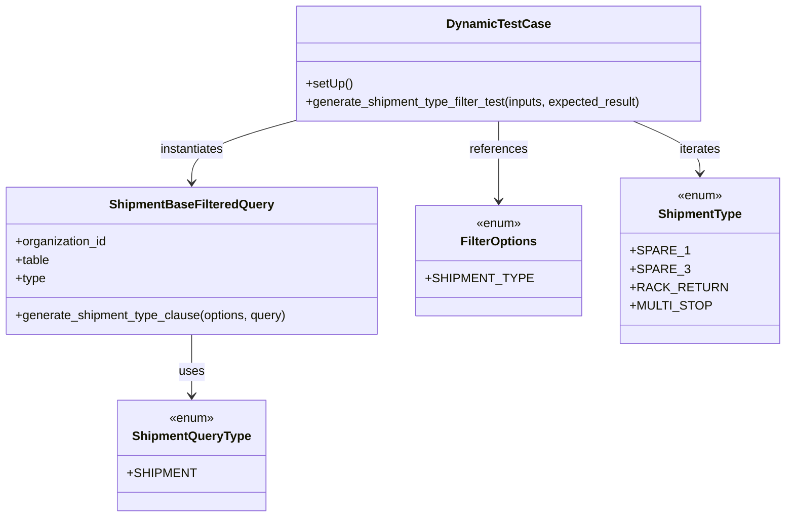

# Diagram: shipment_core/shipment_service/shipment_service/ng_shipments/tests/test_ng_shipment_search_support.py


> Auto-generated by Obscura crawlers

## Diagram 1



### SVG

<svg id="container" width="981.140625" xmlns="http://www.w3.org/2000/svg" class="classDiagram" height="674" viewBox="0 0 981.140625 674" role="graphics-document document" aria-roledescription="class"><style>#container{font-family:"trebuchet ms",verdana,arial,sans-serif;font-size:16px;fill:#333;}@keyframes edge-animation-frame{from{stroke-dashoffset:0;}}@keyframes dash{to{stroke-dashoffset:0;}}#container .edge-animation-slow{stroke-dasharray:9,5!important;stroke-dashoffset:900;animation:dash 50s linear infinite;stroke-linecap:round;}#container .edge-animation-fast{stroke-dasharray:9,5!important;stroke-dashoffset:900;animation:dash 20s linear infinite;stroke-linecap:round;}#container .error-icon{fill:#552222;}#container .error-text{fill:#552222;stroke:#552222;}#container .edge-thickness-normal{stroke-width:1px;}#container .edge-thickness-thick{stroke-width:3.5px;}#container .edge-pattern-solid{stroke-dasharray:0;}#container .edge-thickness-invisible{stroke-width:0;fill:none;}#container .edge-pattern-dashed{stroke-dasharray:3;}#container .edge-pattern-dotted{stroke-dasharray:2;}#container .marker{fill:#333333;stroke:#333333;}#container .marker.cross{stroke:#333333;}#container svg{font-family:"trebuchet ms",verdana,arial,sans-serif;font-size:16px;}#container p{margin:0;}#container g.classGroup text{fill:#9370DB;stroke:none;font-family:"trebuchet ms",verdana,arial,sans-serif;font-size:10px;}#container g.classGroup text .title{font-weight:bolder;}#container .nodeLabel,#container .edgeLabel{color:#131300;}#container .edgeLabel .label rect{fill:#ECECFF;}#container .label text{fill:#131300;}#container .labelBkg{background:#ECECFF;}#container .edgeLabel .label span{background:#ECECFF;}#container .classTitle{font-weight:bolder;}#container .node rect,#container .node circle,#container .node ellipse,#container .node polygon,#container .node path{fill:#ECECFF;stroke:#9370DB;stroke-width:1px;}#container .divider{stroke:#9370DB;stroke-width:1;}#container g.clickable{cursor:pointer;}#container g.classGroup rect{fill:#ECECFF;stroke:#9370DB;}#container g.classGroup line{stroke:#9370DB;stroke-width:1;}#container .classLabel .box{stroke:none;stroke-width:0;fill:#ECECFF;opacity:0.5;}#container .classLabel .label{fill:#9370DB;font-size:10px;}#container .relation{stroke:#333333;stroke-width:1;fill:none;}#container .dashed-line{stroke-dasharray:3;}#container .dotted-line{stroke-dasharray:1 2;}#container #compositionStart,#container .composition{fill:#333333!important;stroke:#333333!important;stroke-width:1;}#container #compositionEnd,#container .composition{fill:#333333!important;stroke:#333333!important;stroke-width:1;}#container #dependencyStart,#container .dependency{fill:#333333!important;stroke:#333333!important;stroke-width:1;}#container #dependencyStart,#container .dependency{fill:#333333!important;stroke:#333333!important;stroke-width:1;}#container #extensionStart,#container .extension{fill:transparent!important;stroke:#333333!important;stroke-width:1;}#container #extensionEnd,#container .extension{fill:transparent!important;stroke:#333333!important;stroke-width:1;}#container #aggregationStart,#container .aggregation{fill:transparent!important;stroke:#333333!important;stroke-width:1;}#container #aggregationEnd,#container .aggregation{fill:transparent!important;stroke:#333333!important;stroke-width:1;}#container #lollipopStart,#container .lollipop{fill:#ECECFF!important;stroke:#333333!important;stroke-width:1;}#container #lollipopEnd,#container .lollipop{fill:#ECECFF!important;stroke:#333333!important;stroke-width:1;}#container .edgeTerminals{font-size:11px;line-height:initial;}#container .classTitleText{text-anchor:middle;font-size:18px;fill:#333;}#container .label-icon{display:inline-block;height:1em;overflow:visible;vertical-align:-0.125em;}#container .node .label-icon path{fill:currentColor;stroke:revert;stroke-width:revert;}#container :root{--mermaid-font-family:"trebuchet ms",verdana,arial,sans-serif;}</style><g><defs><marker id="container_class-aggregationStart" class="marker aggregation class" refX="18" refY="7" markerWidth="190" markerHeight="240" orient="auto"><path d="M 18,7 L9,13 L1,7 L9,1 Z"></path></marker></defs><defs><marker id="container_class-aggregationEnd" class="marker aggregation class" refX="1" refY="7" markerWidth="20" markerHeight="28" orient="auto"><path d="M 18,7 L9,13 L1,7 L9,1 Z"></path></marker></defs><defs><marker id="container_class-extensionStart" class="marker extension class" refX="18" refY="7" markerWidth="190" markerHeight="240" orient="auto"><path d="M 1,7 L18,13 V 1 Z"></path></marker></defs><defs><marker id="container_class-extensionEnd" class="marker extension class" refX="1" refY="7" markerWidth="20" markerHeight="28" orient="auto"><path d="M 1,1 V 13 L18,7 Z"></path></marker></defs><defs><marker id="container_class-compositionStart" class="marker composition class" refX="18" refY="7" markerWidth="190" markerHeight="240" orient="auto"><path d="M 18,7 L9,13 L1,7 L9,1 Z"></path></marker></defs><defs><marker id="container_class-compositionEnd" class="marker composition class" refX="1" refY="7" markerWidth="20" markerHeight="28" orient="auto"><path d="M 18,7 L9,13 L1,7 L9,1 Z"></path></marker></defs><defs><marker id="container_class-dependencyStart" class="marker dependency class" refX="6" refY="7" markerWidth="190" markerHeight="240" orient="auto"><path d="M 5,7 L9,13 L1,7 L9,1 Z"></path></marker></defs><defs><marker id="container_class-dependencyEnd" class="marker dependency class" refX="13" refY="7" markerWidth="20" markerHeight="28" orient="auto"><path d="M 18,7 L9,13 L14,7 L9,1 Z"></path></marker></defs><defs><marker id="container_class-lollipopStart" class="marker lollipop class" refX="13" refY="7" markerWidth="190" markerHeight="240" orient="auto"><circle stroke="black" fill="transparent" cx="7" cy="7" r="6"></circle></marker></defs><defs><marker id="container_class-lollipopEnd" class="marker lollipop class" refX="1" refY="7" markerWidth="190" markerHeight="240" orient="auto"><circle stroke="black" fill="transparent" cx="7" cy="7" r="6"></circle></marker></defs><g class="root"><g class="clusters"></g><g class="edgePaths"><path d="M249.793,436L249.793,444.167C249.793,452.333,249.793,468.667,249.793,482C249.793,495.333,249.793,505.667,249.793,510.833L249.793,516" id="id_ShipmentBaseFilteredQuery_ShipmentQueryType_1" class="edge-thickness-normal edge-pattern-solid relation" style=";;;" data-edge="true" data-et="edge" data-id="id_ShipmentBaseFilteredQuery_ShipmentQueryType_1" data-points="W3sieCI6MjQ5Ljc5Mjk2ODc1LCJ5Ijo0MzZ9LHsieCI6MjQ5Ljc5Mjk2ODc1LCJ5Ijo0ODV9LHsieCI6MjQ5Ljc5Mjk2ODc1LCJ5Ijo1MjJ9XQ==" marker-end="url(#container_class-dependencyEnd)"></path><path d="M378.236,158L356.829,164.167C335.422,170.333,292.607,182.667,271.2,196C249.793,209.333,249.793,223.667,249.793,230.833L249.793,238" id="id_DynamicTestCase_ShipmentBaseFilteredQuery_2" class="edge-thickness-normal edge-pattern-solid relation" style=";;;" data-edge="true" data-et="edge" data-id="id_DynamicTestCase_ShipmentBaseFilteredQuery_2" data-points="W3sieCI6Mzc4LjIzNjA4Mzk4NDM3NSwieSI6MTU4fSx7IngiOjI0OS43OTI5Njg3NSwieSI6MTk1fSx7IngiOjI0OS43OTI5Njg3NSwieSI6MjQ0fV0=" marker-end="url(#container_class-dependencyEnd)"></path><path d="M638.594,158L638.594,164.167C638.594,170.333,638.594,182.667,638.594,200C638.594,217.333,638.594,239.667,638.594,250.833L638.594,262" id="id_DynamicTestCase_FilterOptions_3" class="edge-thickness-normal edge-pattern-solid relation" style=";;;" data-edge="true" data-et="edge" data-id="id_DynamicTestCase_FilterOptions_3" data-points="W3sieCI6NjM4LjU5Mzc1LCJ5IjoxNTh9LHsieCI6NjM4LjU5Mzc1LCJ5IjoxOTV9LHsieCI6NjM4LjU5Mzc1LCJ5IjoyNjh9XQ==" marker-end="url(#container_class-dependencyEnd)"></path><path d="M799.829,158L813.086,164.167C826.343,170.333,852.857,182.667,866.114,194C879.371,205.333,879.371,215.667,879.371,220.833L879.371,226" id="id_DynamicTestCase_ShipmentType_4" class="edge-thickness-normal edge-pattern-solid relation" style=";;;" data-edge="true" data-et="edge" data-id="id_DynamicTestCase_ShipmentType_4" data-points="W3sieCI6Nzk5LjgyODU3ODQwNDAxNzksInkiOjE1OH0seyJ4Ijo4NzkuMzcxMDkzNzUsInkiOjE5NX0seyJ4Ijo4NzkuMzcxMDkzNzUsInkiOjIzMn1d" marker-end="url(#container_class-dependencyEnd)"></path></g><g class="edgeLabels"><g class="edgeLabel" transform="translate(249.79296875, 485)"><g class="label" data-id="id_ShipmentBaseFilteredQuery_ShipmentQueryType_1" transform="translate(-16.4921875, -12)"><foreignObject width="32.984375" height="24"><div xmlns="http://www.w3.org/1999/xhtml" class="labelBkg" style="display: table-cell; white-space: nowrap; line-height: 1.5; max-width: 200px; text-align: center;"><span class="edgeLabel"><p>uses</p></span></div></foreignObject></g></g><g class="edgeLabel" transform="translate(249.79296875, 195)"><g class="label" data-id="id_DynamicTestCase_ShipmentBaseFilteredQuery_2" transform="translate(-42.9140625, -12)"><foreignObject width="85.828125" height="24"><div xmlns="http://www.w3.org/1999/xhtml" class="labelBkg" style="display: table-cell; white-space: nowrap; line-height: 1.5; max-width: 200px; text-align: center;"><span class="edgeLabel"><p>instantiates</p></span></div></foreignObject></g></g><g class="edgeLabel" transform="translate(638.59375, 195)"><g class="label" data-id="id_DynamicTestCase_FilterOptions_3" transform="translate(-37.828125, -12)"><foreignObject width="75.65625" height="24"><div xmlns="http://www.w3.org/1999/xhtml" class="labelBkg" style="display: table-cell; white-space: nowrap; line-height: 1.5; max-width: 200px; text-align: center;"><span class="edgeLabel"><p>references</p></span></div></foreignObject></g></g><g class="edgeLabel" transform="translate(879.37109375, 195)"><g class="label" data-id="id_DynamicTestCase_ShipmentType_4" transform="translate(-27.4140625, -12)"><foreignObject width="54.828125" height="24"><div xmlns="http://www.w3.org/1999/xhtml" class="labelBkg" style="display: table-cell; white-space: nowrap; line-height: 1.5; max-width: 200px; text-align: center;"><span class="edgeLabel"><p>iterates</p></span></div></foreignObject></g></g></g><g class="nodes"><g class="node default" id="classId-ShipmentBaseFilteredQuery-0" transform="translate(249.79296875, 340)"><g class="basic label-container"><path d="M-241.79296875 -96 L241.79296875 -96 L241.79296875 96 L-241.79296875 96" stroke="none" stroke-width="0" fill="#ECECFF" style=""></path><path d="M-241.79296875 -96 C-73.91831274114807 -96, 93.95634326770386 -96, 241.79296875 -96 M-241.79296875 -96 C-142.283729817434 -96, -42.774490884868015 -96, 241.79296875 -96 M241.79296875 -96 C241.79296875 -40.75877227253157, 241.79296875 14.482455454936854, 241.79296875 96 M241.79296875 -96 C241.79296875 -40.11227873766179, 241.79296875 15.775442524676421, 241.79296875 96 M241.79296875 96 C123.49184580454981 96, 5.190722859099623 96, -241.79296875 96 M241.79296875 96 C56.962538583168794 96, -127.86789158366241 96, -241.79296875 96 M-241.79296875 96 C-241.79296875 23.601103797743306, -241.79296875 -48.79779240451339, -241.79296875 -96 M-241.79296875 96 C-241.79296875 50.626499704832824, -241.79296875 5.252999409665648, -241.79296875 -96" stroke="#9370DB" stroke-width="1.3" fill="none" stroke-dasharray="0 0" style=""></path></g><g class="annotation-group text" transform="translate(0, -72)"></g><g class="label-group text" transform="translate(-102.3359375, -72)"><g class="label" style="font-weight: bolder" transform="translate(0,-12)"><foreignObject width="204.671875" height="24"><div xmlns="http://www.w3.org/1999/xhtml" style="display: table-cell; white-space: nowrap; line-height: 1.5; max-width: 252px; text-align: center;"><span class="nodeLabel markdown-node-label" style=""><p>ShipmentBaseFilteredQuery</p></span></div></foreignObject></g></g><g class="members-group text" transform="translate(-229.79296875, -24)"><g class="label" style="" transform="translate(0,-12)"><foreignObject width="120.75" height="24"><div xmlns="http://www.w3.org/1999/xhtml" style="display: table-cell; white-space: nowrap; line-height: 1.5; max-width: 178px; text-align: center;"><span class="nodeLabel markdown-node-label" style=""><p>+organization_id</p></span></div></foreignObject></g><g class="label" style="" transform="translate(0,12)"><foreignObject width="45.109375" height="24"><div xmlns="http://www.w3.org/1999/xhtml" style="display: table-cell; white-space: nowrap; line-height: 1.5; max-width: 102px; text-align: center;"><span class="nodeLabel markdown-node-label" style=""><p>+table</p></span></div></foreignObject></g><g class="label" style="" transform="translate(0,36)"><foreignObject width="39.703125" height="24"><div xmlns="http://www.w3.org/1999/xhtml" style="display: table-cell; white-space: nowrap; line-height: 1.5; max-width: 97px; text-align: center;"><span class="nodeLabel markdown-node-label" style=""><p>+type</p></span></div></foreignObject></g></g><g class="methods-group text" transform="translate(-229.79296875, 72)"><g class="label" style="" transform="translate(0,-12)"><foreignObject width="357.25" height="24"><div xmlns="http://www.w3.org/1999/xhtml" style="display: table-cell; white-space: nowrap; line-height: 1.5; max-width: 415px; text-align: center;"><span class="nodeLabel markdown-node-label" style=""><p>+generate_shipment_type_clause(options, query)</p></span></div></foreignObject></g></g><g class="divider" style=""><path d="M-241.79296875 -48 C-127.85719806427045 -48, -13.921427378540898 -48, 241.79296875 -48 M-241.79296875 -48 C-72.33393746394978 -48, 97.12509382210044 -48, 241.79296875 -48" stroke="#9370DB" stroke-width="1.3" fill="none" stroke-dasharray="0 0" style=""></path></g><g class="divider" style=""><path d="M-241.79296875 48 C-121.33217973466883 48, -0.8713907193376542 48, 241.79296875 48 M-241.79296875 48 C-97.640094222258 48, 46.512780305484 48, 241.79296875 48" stroke="#9370DB" stroke-width="1.3" fill="none" stroke-dasharray="0 0" style=""></path></g></g><g class="node default" id="classId-FilterOptions-1" transform="translate(638.59375, 340)"><g class="basic label-container"><path d="M-97.0078125 -72 L97.0078125 -72 L97.0078125 72 L-97.0078125 72" stroke="none" stroke-width="0" fill="#ECECFF" style=""></path><path d="M-97.0078125 -72 C-30.98575201328589 -72, 35.03630847342822 -72, 97.0078125 -72 M-97.0078125 -72 C-40.84014518288948 -72, 15.327522134221041 -72, 97.0078125 -72 M97.0078125 -72 C97.0078125 -35.57718147274349, 97.0078125 0.8456370545130198, 97.0078125 72 M97.0078125 -72 C97.0078125 -39.79271082354909, 97.0078125 -7.585421647098187, 97.0078125 72 M97.0078125 72 C52.360696764735486 72, 7.713581029470973 72, -97.0078125 72 M97.0078125 72 C40.02802313811627 72, -16.951766223767464 72, -97.0078125 72 M-97.0078125 72 C-97.0078125 24.549886710892643, -97.0078125 -22.900226578214713, -97.0078125 -72 M-97.0078125 72 C-97.0078125 40.863764692655366, -97.0078125 9.727529385310731, -97.0078125 -72" stroke="#9370DB" stroke-width="1.3" fill="none" stroke-dasharray="0 0" style=""></path></g><g class="annotation-group text" transform="translate(-29.53125, -48)"><g class="label" style="" transform="translate(0,-12)"><foreignObject width="59.0625" height="24"><div xmlns="http://www.w3.org/1999/xhtml" style="display: table-cell; white-space: nowrap; line-height: 1.5; max-width: 109px; text-align: center;"><span class="nodeLabel markdown-node-label" style=""><p>«enum»</p></span></div></foreignObject></g></g><g class="label-group text" transform="translate(-47.671875, -24)"><g class="label" style="font-weight: bolder" transform="translate(0,-12)"><foreignObject width="95.34375" height="24"><div xmlns="http://www.w3.org/1999/xhtml" style="display: table-cell; white-space: nowrap; line-height: 1.5; max-width: 144px; text-align: center;"><span class="nodeLabel markdown-node-label" style=""><p>FilterOptions</p></span></div></foreignObject></g></g><g class="members-group text" transform="translate(-85.0078125, 24)"><g class="label" style="" transform="translate(0,-12)"><foreignObject width="122.34375" height="24"><div xmlns="http://www.w3.org/1999/xhtml" style="display: table-cell; white-space: nowrap; line-height: 1.5; max-width: 180px; text-align: center;"><span class="nodeLabel markdown-node-label" style=""><p>+SHIPMENT_TYPE</p></span></div></foreignObject></g></g><g class="methods-group text" transform="translate(-85.0078125, 72)"></g><g class="divider" style=""><path d="M-97.0078125 0 C-26.124129317862227 0, 44.759553864275546 0, 97.0078125 0 M-97.0078125 0 C-46.91324002437436 0, 3.1813324512512793 0, 97.0078125 0" stroke="#9370DB" stroke-width="1.3" fill="none" stroke-dasharray="0 0" style=""></path></g><g class="divider" style=""><path d="M-97.0078125 48 C-43.60521578191933 48, 9.797380936161346 48, 97.0078125 48 M-97.0078125 48 C-53.75451049605935 48, -10.501208492118707 48, 97.0078125 48" stroke="#9370DB" stroke-width="1.3" fill="none" stroke-dasharray="0 0" style=""></path></g></g><g class="node default" id="classId-ShipmentQueryType-2" transform="translate(249.79296875, 594)"><g class="basic label-container"><path d="M-89.50390625 -72 L89.50390625 -72 L89.50390625 72 L-89.50390625 72" stroke="none" stroke-width="0" fill="#ECECFF" style=""></path><path d="M-89.50390625 -72 C-46.47847169093054 -72, -3.4530371318610804 -72, 89.50390625 -72 M-89.50390625 -72 C-52.857543940660115 -72, -16.21118163132023 -72, 89.50390625 -72 M89.50390625 -72 C89.50390625 -31.446088013113332, 89.50390625 9.107823973773336, 89.50390625 72 M89.50390625 -72 C89.50390625 -30.762038968673004, 89.50390625 10.475922062653993, 89.50390625 72 M89.50390625 72 C29.913234276038047 72, -29.677437697923907 72, -89.50390625 72 M89.50390625 72 C37.42655068297256 72, -14.650804884054878 72, -89.50390625 72 M-89.50390625 72 C-89.50390625 19.655978144389294, -89.50390625 -32.68804371122141, -89.50390625 -72 M-89.50390625 72 C-89.50390625 16.570169541375257, -89.50390625 -38.859660917249485, -89.50390625 -72" stroke="#9370DB" stroke-width="1.3" fill="none" stroke-dasharray="0 0" style=""></path></g><g class="annotation-group text" transform="translate(-29.53125, -48)"><g class="label" style="" transform="translate(0,-12)"><foreignObject width="59.0625" height="24"><div xmlns="http://www.w3.org/1999/xhtml" style="display: table-cell; white-space: nowrap; line-height: 1.5; max-width: 109px; text-align: center;"><span class="nodeLabel markdown-node-label" style=""><p>«enum»</p></span></div></foreignObject></g></g><g class="label-group text" transform="translate(-74.3046875, -24)"><g class="label" style="font-weight: bolder" transform="translate(0,-12)"><foreignObject width="148.609375" height="24"><div xmlns="http://www.w3.org/1999/xhtml" style="display: table-cell; white-space: nowrap; line-height: 1.5; max-width: 197px; text-align: center;"><span class="nodeLabel markdown-node-label" style=""><p>ShipmentQueryType</p></span></div></foreignObject></g></g><g class="members-group text" transform="translate(-77.50390625, 24)"><g class="label" style="" transform="translate(0,-12)"><foreignObject width="80.703125" height="24"><div xmlns="http://www.w3.org/1999/xhtml" style="display: table-cell; white-space: nowrap; line-height: 1.5; max-width: 139px; text-align: center;"><span class="nodeLabel markdown-node-label" style=""><p>+SHIPMENT</p></span></div></foreignObject></g></g><g class="methods-group text" transform="translate(-77.50390625, 72)"></g><g class="divider" style=""><path d="M-89.50390625 0 C-26.800201765500233 0, 35.90350271899953 0, 89.50390625 0 M-89.50390625 0 C-36.10698224480154 0, 17.289941760396914 0, 89.50390625 0" stroke="#9370DB" stroke-width="1.3" fill="none" stroke-dasharray="0 0" style=""></path></g><g class="divider" style=""><path d="M-89.50390625 48 C-18.4254219685064 48, 52.6530623129872 48, 89.50390625 48 M-89.50390625 48 C-26.31382274866045 48, 36.8762607526791 48, 89.50390625 48" stroke="#9370DB" stroke-width="1.3" fill="none" stroke-dasharray="0 0" style=""></path></g></g><g class="node default" id="classId-ShipmentType-3" transform="translate(879.37109375, 340)"><g class="basic label-container"><path d="M-93.76953125 -108 L93.76953125 -108 L93.76953125 108 L-93.76953125 108" stroke="none" stroke-width="0" fill="#ECECFF" style=""></path><path d="M-93.76953125 -108 C-27.323441611111406 -108, 39.12264802777719 -108, 93.76953125 -108 M-93.76953125 -108 C-30.435880546458755 -108, 32.89777015708249 -108, 93.76953125 -108 M93.76953125 -108 C93.76953125 -43.281554735143715, 93.76953125 21.43689052971257, 93.76953125 108 M93.76953125 -108 C93.76953125 -41.49521248779092, 93.76953125 25.009575024418154, 93.76953125 108 M93.76953125 108 C47.67703535732499 108, 1.5845394646499784 108, -93.76953125 108 M93.76953125 108 C55.141153036361615 108, 16.51277482272323 108, -93.76953125 108 M-93.76953125 108 C-93.76953125 44.441345292761795, -93.76953125 -19.11730941447641, -93.76953125 -108 M-93.76953125 108 C-93.76953125 49.41816376402512, -93.76953125 -9.163672471949766, -93.76953125 -108" stroke="#9370DB" stroke-width="1.3" fill="none" stroke-dasharray="0 0" style=""></path></g><g class="annotation-group text" transform="translate(-29.53125, -84)"><g class="label" style="" transform="translate(0,-12)"><foreignObject width="59.0625" height="24"><div xmlns="http://www.w3.org/1999/xhtml" style="display: table-cell; white-space: nowrap; line-height: 1.5; max-width: 109px; text-align: center;"><span class="nodeLabel markdown-node-label" style=""><p>«enum»</p></span></div></foreignObject></g></g><g class="label-group text" transform="translate(-52.4453125, -60)"><g class="label" style="font-weight: bolder" transform="translate(0,-12)"><foreignObject width="104.890625" height="24"><div xmlns="http://www.w3.org/1999/xhtml" style="display: table-cell; white-space: nowrap; line-height: 1.5; max-width: 153px; text-align: center;"><span class="nodeLabel markdown-node-label" style=""><p>ShipmentType</p></span></div></foreignObject></g></g><g class="members-group text" transform="translate(-81.76953125, -12)"><g class="label" style="" transform="translate(0,-12)"><foreignObject width="65.46875" height="24"><div xmlns="http://www.w3.org/1999/xhtml" style="display: table-cell; white-space: nowrap; line-height: 1.5; max-width: 123px; text-align: center;"><span class="nodeLabel markdown-node-label" style=""><p>+SPARE_1</p></span></div></foreignObject></g><g class="label" style="" transform="translate(0,12)"><foreignObject width="68.125" height="24"><div xmlns="http://www.w3.org/1999/xhtml" style="display: table-cell; white-space: nowrap; line-height: 1.5; max-width: 125px; text-align: center;"><span class="nodeLabel markdown-node-label" style=""><p>+SPARE_3</p></span></div></foreignObject></g><g class="label" style="" transform="translate(0,36)"><foreignObject width="111.09375" height="24"><div xmlns="http://www.w3.org/1999/xhtml" style="display: table-cell; white-space: nowrap; line-height: 1.5; max-width: 168px; text-align: center;"><span class="nodeLabel markdown-node-label" style=""><p>+RACK_RETURN</p></span></div></foreignObject></g><g class="label" style="" transform="translate(0,60)"><foreignObject width="95.109375" height="24"><div xmlns="http://www.w3.org/1999/xhtml" style="display: table-cell; white-space: nowrap; line-height: 1.5; max-width: 152px; text-align: center;"><span class="nodeLabel markdown-node-label" style=""><p>+MULTI_STOP</p></span></div></foreignObject></g></g><g class="methods-group text" transform="translate(-81.76953125, 108)"></g><g class="divider" style=""><path d="M-93.76953125 -36 C-35.12676783911193 -36, 23.515995571776145 -36, 93.76953125 -36 M-93.76953125 -36 C-23.24599381560357 -36, 47.27754361879286 -36, 93.76953125 -36" stroke="#9370DB" stroke-width="1.3" fill="none" stroke-dasharray="0 0" style=""></path></g><g class="divider" style=""><path d="M-93.76953125 84 C-44.24576568058335 84, 5.277999888833307 84, 93.76953125 84 M-93.76953125 84 C-52.947431682089565 84, -12.12533211417913 84, 93.76953125 84" stroke="#9370DB" stroke-width="1.3" fill="none" stroke-dasharray="0 0" style=""></path></g></g><g class="node default" id="classId-DynamicTestCase-4" transform="translate(638.59375, 83)"><g class="basic label-container"><path d="M-265.94140625 -75 L265.94140625 -75 L265.94140625 75 L-265.94140625 75" stroke="none" stroke-width="0" fill="#ECECFF" style=""></path><path d="M-265.94140625 -75 C-106.19251203588757 -75, 53.55638217822485 -75, 265.94140625 -75 M-265.94140625 -75 C-154.83272903133735 -75, -43.724051812674674 -75, 265.94140625 -75 M265.94140625 -75 C265.94140625 -34.53545341706948, 265.94140625 5.929093165861033, 265.94140625 75 M265.94140625 -75 C265.94140625 -38.77539768026483, 265.94140625 -2.550795360529662, 265.94140625 75 M265.94140625 75 C139.33232524253108 75, 12.723244235062168 75, -265.94140625 75 M265.94140625 75 C132.83035371501748 75, -0.2806988199650391 75, -265.94140625 75 M-265.94140625 75 C-265.94140625 26.168821879297937, -265.94140625 -22.662356241404126, -265.94140625 -75 M-265.94140625 75 C-265.94140625 21.72402529185588, -265.94140625 -31.551949416288238, -265.94140625 -75" stroke="#9370DB" stroke-width="1.3" fill="none" stroke-dasharray="0 0" style=""></path></g><g class="annotation-group text" transform="translate(0, -51)"></g><g class="label-group text" transform="translate(-63.5546875, -51)"><g class="label" style="font-weight: bolder" transform="translate(0,-12)"><foreignObject width="127.109375" height="24"><div xmlns="http://www.w3.org/1999/xhtml" style="display: table-cell; white-space: nowrap; line-height: 1.5; max-width: 175px; text-align: center;"><span class="nodeLabel markdown-node-label" style=""><p>DynamicTestCase</p></span></div></foreignObject></g></g><g class="members-group text" transform="translate(-253.94140625, -3)"></g><g class="methods-group text" transform="translate(-253.94140625, 27)"><g class="label" style="" transform="translate(0,-12)"><foreignObject width="60.421875" height="24"><div xmlns="http://www.w3.org/1999/xhtml" style="display: table-cell; white-space: nowrap; line-height: 1.5; max-width: 118px; text-align: center;"><span class="nodeLabel markdown-node-label" style=""><p>+setUp()</p></span></div></foreignObject></g><g class="label" style="" transform="translate(0,12)"><foreignObject width="444.328125" height="24"><div xmlns="http://www.w3.org/1999/xhtml" style="display: table-cell; white-space: nowrap; line-height: 1.5; max-width: 502px; text-align: center;"><span class="nodeLabel markdown-node-label" style=""><p>+generate_shipment_type_filter_test(inputs, expected_result)</p></span></div></foreignObject></g></g><g class="divider" style=""><path d="M-265.94140625 -27 C-121.18922372903467 -27, 23.56295879193067 -27, 265.94140625 -27 M-265.94140625 -27 C-81.07894229993494 -27, 103.78352165013013 -27, 265.94140625 -27" stroke="#9370DB" stroke-width="1.3" fill="none" stroke-dasharray="0 0" style=""></path></g><g class="divider" style=""><path d="M-265.94140625 -3 C-148.36211421052707 -3, -30.782822171054107 -3, 265.94140625 -3 M-265.94140625 -3 C-71.2485733719617 -3, 123.4442595060766 -3, 265.94140625 -3" stroke="#9370DB" stroke-width="1.3" fill="none" stroke-dasharray="0 0" style=""></path></g></g></g></g></g></svg>

## Diagram 2

```mermaid
sequenceDiagram
    participant Main as __main__
    participant Loop as Test Generator
    participant DTC as DynamicTestCase
    participant SBQ as ShipmentBaseFilteredQuery
    participant Unittest as unittest
    Main->>Loop: iterate cases
    Loop->>DTC: create test method for inputs, expected_result
    DTC->>SBQ: generate_shipment_type_clause(options, query)
    SBQ-->>DTC: SQL clause result
    DTC->>Unittest: self.assertEqual(result, expected_result)
    Unittest-->>Main: test pass/fail results
```

> SVG rendering failed for this diagram.
