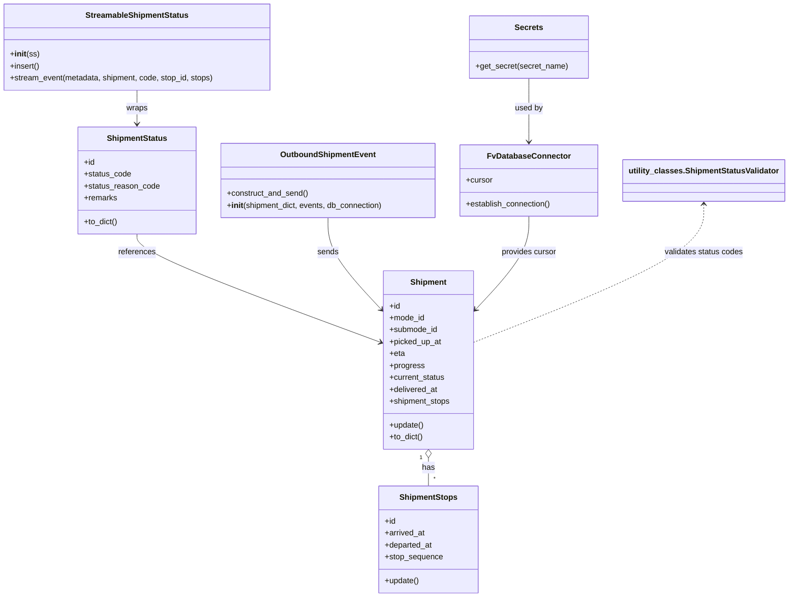

# Diagram: shipment_core/shipment_service/shipment_service/proxy_endpoints/general_mode_update.py


> Auto-generated by Obscura crawlers

## Diagram 1

```mermaid
flowchart TD
    A[lambda_handler(event)] -->|extracts & validates| B[process_update(cursor, shipment_id, ...)]
    B --> C[current_shipment = db_no_orm.get_existing_shipments_by_db_id]
    B --> D[process_shipment_update(cursor, current_shipment, ...)]
    D --> E[update_shipment_status_flags(cursor, shipment, code)]
    E -->|flags| D
    D --> F{mode == OCEAN or AIR?}
    F -->|yes| G[utilities.is_ocean_origin_arrival_eligible / destination_eligible]
    G -->|eligible| H[update_stop_and_handle_stop_based_exception(stop, shipment, ...)]
    H --> I[stop.update()]
    D --> J[HERE.get_city_state_postal_country(latitude, longitude)]
    D --> K[db_no_orm.update_shipment_status_details_loc(...)]
    K --> L[ShipmentStatus(ss) created]
    L --> M[StreamableShipmentStatus(ss).insert().stream_event(...)]
    D --> N{call_update_shipment_eta_and_tracking?}
    N -->|true| O[db_no_orm.update_shipment_eta_and_tracking(...)]
    O --> P[eta_shared_utils.manually_trigger_segment_for_ocean(...)]
    D --> Q[utilities.invoke_update_route_timing(...)]
    D --> R[update_shipment_progress(body_datetime, updated_shipment, finished_vehicle_detail)]
    R --> S[get_progress(start_ts, eta_ts, now_ts, shipment)]
    S -->|returns progress| R
    D --> T[OutboundShipmentEvent.construct_and_send()] 
    A --> U[SECRETS.get_secret(DATABASE)]
    A --> V[DB_CONN.establish_connection()]
    V -->|provides| B
    style A fill:#f9f,stroke:#333,stroke-width:1px
    style D fill:#bbf,stroke:#333
```

> SVG rendering failed for this diagram.

## Diagram 2



### SVG

<svg id="container" width="1579.32421875" xmlns="http://www.w3.org/2000/svg" class="classDiagram" height="1204" viewBox="0 0 1579.32421875 1204" role="graphics-document document" aria-roledescription="class"><style>#container{font-family:"trebuchet ms",verdana,arial,sans-serif;font-size:16px;fill:#333;}@keyframes edge-animation-frame{from{stroke-dashoffset:0;}}@keyframes dash{to{stroke-dashoffset:0;}}#container .edge-animation-slow{stroke-dasharray:9,5!important;stroke-dashoffset:900;animation:dash 50s linear infinite;stroke-linecap:round;}#container .edge-animation-fast{stroke-dasharray:9,5!important;stroke-dashoffset:900;animation:dash 20s linear infinite;stroke-linecap:round;}#container .error-icon{fill:#552222;}#container .error-text{fill:#552222;stroke:#552222;}#container .edge-thickness-normal{stroke-width:1px;}#container .edge-thickness-thick{stroke-width:3.5px;}#container .edge-pattern-solid{stroke-dasharray:0;}#container .edge-thickness-invisible{stroke-width:0;fill:none;}#container .edge-pattern-dashed{stroke-dasharray:3;}#container .edge-pattern-dotted{stroke-dasharray:2;}#container .marker{fill:#333333;stroke:#333333;}#container .marker.cross{stroke:#333333;}#container svg{font-family:"trebuchet ms",verdana,arial,sans-serif;font-size:16px;}#container p{margin:0;}#container g.classGroup text{fill:#9370DB;stroke:none;font-family:"trebuchet ms",verdana,arial,sans-serif;font-size:10px;}#container g.classGroup text .title{font-weight:bolder;}#container .nodeLabel,#container .edgeLabel{color:#131300;}#container .edgeLabel .label rect{fill:#ECECFF;}#container .label text{fill:#131300;}#container .labelBkg{background:#ECECFF;}#container .edgeLabel .label span{background:#ECECFF;}#container .classTitle{font-weight:bolder;}#container .node rect,#container .node circle,#container .node ellipse,#container .node polygon,#container .node path{fill:#ECECFF;stroke:#9370DB;stroke-width:1px;}#container .divider{stroke:#9370DB;stroke-width:1;}#container g.clickable{cursor:pointer;}#container g.classGroup rect{fill:#ECECFF;stroke:#9370DB;}#container g.classGroup line{stroke:#9370DB;stroke-width:1;}#container .classLabel .box{stroke:none;stroke-width:0;fill:#ECECFF;opacity:0.5;}#container .classLabel .label{fill:#9370DB;font-size:10px;}#container .relation{stroke:#333333;stroke-width:1;fill:none;}#container .dashed-line{stroke-dasharray:3;}#container .dotted-line{stroke-dasharray:1 2;}#container #compositionStart,#container .composition{fill:#333333!important;stroke:#333333!important;stroke-width:1;}#container #compositionEnd,#container .composition{fill:#333333!important;stroke:#333333!important;stroke-width:1;}#container #dependencyStart,#container .dependency{fill:#333333!important;stroke:#333333!important;stroke-width:1;}#container #dependencyStart,#container .dependency{fill:#333333!important;stroke:#333333!important;stroke-width:1;}#container #extensionStart,#container .extension{fill:transparent!important;stroke:#333333!important;stroke-width:1;}#container #extensionEnd,#container .extension{fill:transparent!important;stroke:#333333!important;stroke-width:1;}#container #aggregationStart,#container .aggregation{fill:transparent!important;stroke:#333333!important;stroke-width:1;}#container #aggregationEnd,#container .aggregation{fill:transparent!important;stroke:#333333!important;stroke-width:1;}#container #lollipopStart,#container .lollipop{fill:#ECECFF!important;stroke:#333333!important;stroke-width:1;}#container #lollipopEnd,#container .lollipop{fill:#ECECFF!important;stroke:#333333!important;stroke-width:1;}#container .edgeTerminals{font-size:11px;line-height:initial;}#container .classTitleText{text-anchor:middle;font-size:18px;fill:#333;}#container .label-icon{display:inline-block;height:1em;overflow:visible;vertical-align:-0.125em;}#container .node .label-icon path{fill:currentColor;stroke:revert;stroke-width:revert;}#container :root{--mermaid-font-family:"trebuchet ms",verdana,arial,sans-serif;}</style><g><defs><marker id="container_class-aggregationStart" class="marker aggregation class" refX="18" refY="7" markerWidth="190" markerHeight="240" orient="auto"><path d="M 18,7 L9,13 L1,7 L9,1 Z"></path></marker></defs><defs><marker id="container_class-aggregationEnd" class="marker aggregation class" refX="1" refY="7" markerWidth="20" markerHeight="28" orient="auto"><path d="M 18,7 L9,13 L1,7 L9,1 Z"></path></marker></defs><defs><marker id="container_class-extensionStart" class="marker extension class" refX="18" refY="7" markerWidth="190" markerHeight="240" orient="auto"><path d="M 1,7 L18,13 V 1 Z"></path></marker></defs><defs><marker id="container_class-extensionEnd" class="marker extension class" refX="1" refY="7" markerWidth="20" markerHeight="28" orient="auto"><path d="M 1,1 V 13 L18,7 Z"></path></marker></defs><defs><marker id="container_class-compositionStart" class="marker composition class" refX="18" refY="7" markerWidth="190" markerHeight="240" orient="auto"><path d="M 18,7 L9,13 L1,7 L9,1 Z"></path></marker></defs><defs><marker id="container_class-compositionEnd" class="marker composition class" refX="1" refY="7" markerWidth="20" markerHeight="28" orient="auto"><path d="M 18,7 L9,13 L1,7 L9,1 Z"></path></marker></defs><defs><marker id="container_class-dependencyStart" class="marker dependency class" refX="6" refY="7" markerWidth="190" markerHeight="240" orient="auto"><path d="M 5,7 L9,13 L1,7 L9,1 Z"></path></marker></defs><defs><marker id="container_class-dependencyEnd" class="marker dependency class" refX="13" refY="7" markerWidth="20" markerHeight="28" orient="auto"><path d="M 18,7 L9,13 L14,7 L9,1 Z"></path></marker></defs><defs><marker id="container_class-lollipopStart" class="marker lollipop class" refX="13" refY="7" markerWidth="190" markerHeight="240" orient="auto"><circle stroke="black" fill="transparent" cx="7" cy="7" r="6"></circle></marker></defs><defs><marker id="container_class-lollipopEnd" class="marker lollipop class" refX="1" refY="7" markerWidth="190" markerHeight="240" orient="auto"><circle stroke="black" fill="transparent" cx="7" cy="7" r="6"></circle></marker></defs><g class="root"><g class="clusters"></g><g class="edgePaths"><path d="M865.094,923.25L865.094,926.542C865.094,929.833,865.094,936.417,865.094,945.875C865.094,955.333,865.094,967.667,865.094,973.833L865.094,980" id="id_Shipment_ShipmentStops_1" class="edge-thickness-normal edge-pattern-solid relation" style=";;;" data-edge="true" data-et="edge" data-id="id_Shipment_ShipmentStops_1" data-points="W3sieCI6ODY1LjA5Mzc1LCJ5Ijo5MDZ9LHsieCI6ODY1LjA5Mzc1LCJ5Ijo5NDN9LHsieCI6ODY1LjA5Mzc1LCJ5Ijo5ODB9XQ==" marker-start="url(#container_class-aggregationStart)"></path><path d="M277.781,472L277.781,478.167C277.781,484.333,277.781,496.667,359.462,533.013C441.142,569.359,604.503,629.717,686.184,659.896L767.864,690.076" id="id_ShipmentStatus_Shipment_2" class="edge-thickness-normal edge-pattern-solid relation" style=";;;" data-edge="true" data-et="edge" data-id="id_ShipmentStatus_Shipment_2" data-points="W3sieCI6Mjc3Ljc4MTI1LCJ5Ijo0NzJ9LHsieCI6Mjc3Ljc4MTI1LCJ5Ijo1MDl9LHsieCI6NzczLjQ5MjE4NzUsInkiOjY5Mi4xNTUwODkzOTAyMzF9XQ==" marker-end="url(#container_class-dependencyEnd)"></path><path d="M277.781,182L277.781,188.167C277.781,194.333,277.781,206.667,277.781,218C277.781,229.333,277.781,239.667,277.781,244.833L277.781,250" id="id_StreamableShipmentStatus_ShipmentStatus_3" class="edge-thickness-normal edge-pattern-solid relation" style=";;;" data-edge="true" data-et="edge" data-id="id_StreamableShipmentStatus_ShipmentStatus_3" data-points="W3sieCI6Mjc3Ljc4MTI1LCJ5IjoxODJ9LHsieCI6Mjc3Ljc4MTI1LCJ5IjoyMTl9LHsieCI6Mjc3Ljc4MTI1LCJ5IjoyNTZ9XQ==" marker-end="url(#container_class-dependencyEnd)"></path><path d="M662.383,439L662.383,450.667C662.383,462.333,662.383,485.667,680.218,516.426C698.054,547.186,733.725,585.371,751.561,604.464L769.396,623.557" id="id_OutboundShipmentEvent_Shipment_4" class="edge-thickness-normal edge-pattern-solid relation" style=";;;" data-edge="true" data-et="edge" data-id="id_OutboundShipmentEvent_Shipment_4" data-points="W3sieCI6NjYyLjM4MjgxMjUsInkiOjQzOX0seyJ4Ijo2NjIuMzgyODEyNSwieSI6NTA5fSx7IngiOjc3My40OTIxODc1LCJ5Ijo2MjcuOTQxNDU3NTg2NjE4OX1d" marker-end="url(#container_class-dependencyEnd)"></path><path d="M1067.805,436L1067.805,448.167C1067.805,460.333,1067.805,484.667,1049.969,515.926C1032.134,547.186,996.462,585.371,978.627,604.464L960.791,623.557" id="id_FvDatabaseConnector_Shipment_5" class="edge-thickness-normal edge-pattern-solid relation" style=";;;" data-edge="true" data-et="edge" data-id="id_FvDatabaseConnector_Shipment_5" data-points="W3sieCI6MTA2Ny44MDQ2ODc1LCJ5Ijo0MzZ9LHsieCI6MTA2Ny44MDQ2ODc1LCJ5Ijo1MDl9LHsieCI6OTU2LjY5NTMxMjUsInkiOjYyNy45NDE0NTc1ODY2MTg5fV0=" marker-end="url(#container_class-dependencyEnd)"></path><path d="M1067.805,158L1067.805,168.167C1067.805,178.333,1067.805,198.667,1067.805,220C1067.805,241.333,1067.805,263.667,1067.805,274.833L1067.805,286" id="id_Secrets_FvDatabaseConnector_6" class="edge-thickness-normal edge-pattern-solid relation" style=";;;" data-edge="true" data-et="edge" data-id="id_Secrets_FvDatabaseConnector_6" data-points="W3sieCI6MTA2Ny44MDQ2ODc1LCJ5IjoxNTh9LHsieCI6MTA2Ny44MDQ2ODc1LCJ5IjoyMTl9LHsieCI6MTA2Ny44MDQ2ODc1LCJ5IjoyOTJ9XQ==" marker-end="url(#container_class-dependencyEnd)"></path><path d="M1413.707,412L1413.707,428.167C1413.707,444.333,1413.707,476.667,1337.538,522.961C1261.37,569.256,1109.033,629.512,1032.864,659.64L956.695,689.768" id="id_utility_classes.ShipmentStatusValidator_Shipment_7" class="edge-thickness-normal edge-pattern-dashed relation" style=";;;" data-edge="true" data-et="edge" data-id="id_utility_classes.ShipmentStatusValidator_Shipment_7" data-points="W3sieCI6MTQxMy43MDcwMzEyNSwieSI6NDA2fSx7IngiOjE0MTMuNzA3MDMxMjUsInkiOjUwOX0seyJ4Ijo5NTYuNjk1MzEyNSwieSI6Njg5Ljc2NzY2NzA1ODI3OX1d" marker-start="url(#container_class-dependencyStart)"></path></g><g class="edgeLabels"><g class="edgeLabel" transform="translate(865.09375, 943)"><g class="label" data-id="id_Shipment_ShipmentStops_1" transform="translate(-12.703125, -12)"><foreignObject width="25.40625" height="24"><div xmlns="http://www.w3.org/1999/xhtml" class="labelBkg" style="display: table-cell; white-space: nowrap; line-height: 1.5; max-width: 200px; text-align: center;"><span class="edgeLabel"><p>has</p></span></div></foreignObject></g></g><g class="edgeLabel" transform="translate(277.78125, 509)"><g class="label" data-id="id_ShipmentStatus_Shipment_2" transform="translate(-37.828125, -12)"><foreignObject width="75.65625" height="24"><div xmlns="http://www.w3.org/1999/xhtml" class="labelBkg" style="display: table-cell; white-space: nowrap; line-height: 1.5; max-width: 200px; text-align: center;"><span class="edgeLabel"><p>references</p></span></div></foreignObject></g></g><g class="edgeLabel" transform="translate(277.78125, 219)"><g class="label" data-id="id_StreamableShipmentStatus_ShipmentStatus_3" transform="translate(-21.390625, -12)"><foreignObject width="42.78125" height="24"><div xmlns="http://www.w3.org/1999/xhtml" class="labelBkg" style="display: table-cell; white-space: nowrap; line-height: 1.5; max-width: 200px; text-align: center;"><span class="edgeLabel"><p>wraps</p></span></div></foreignObject></g></g><g class="edgeLabel" transform="translate(662.3828125, 509)"><g class="label" data-id="id_OutboundShipmentEvent_Shipment_4" transform="translate(-21.3046875, -12)"><foreignObject width="42.609375" height="24"><div xmlns="http://www.w3.org/1999/xhtml" class="labelBkg" style="display: table-cell; white-space: nowrap; line-height: 1.5; max-width: 200px; text-align: center;"><span class="edgeLabel"><p>sends</p></span></div></foreignObject></g></g><g class="edgeLabel" transform="translate(1067.8046875, 509)"><g class="label" data-id="id_FvDatabaseConnector_Shipment_5" transform="translate(-56.296875, -12)"><foreignObject width="112.59375" height="24"><div xmlns="http://www.w3.org/1999/xhtml" class="labelBkg" style="display: table-cell; white-space: nowrap; line-height: 1.5; max-width: 200px; text-align: center;"><span class="edgeLabel"><p>provides cursor</p></span></div></foreignObject></g></g><g class="edgeLabel" transform="translate(1067.8046875, 219)"><g class="label" data-id="id_Secrets_FvDatabaseConnector_6" transform="translate(-28.3125, -12)"><foreignObject width="56.625" height="24"><div xmlns="http://www.w3.org/1999/xhtml" class="labelBkg" style="display: table-cell; white-space: nowrap; line-height: 1.5; max-width: 200px; text-align: center;"><span class="edgeLabel"><p>used by</p></span></div></foreignObject></g></g><g class="edgeLabel" transform="translate(1413.70703125, 509)"><g class="label" data-id="id_utility_classes.ShipmentStatusValidator_Shipment_7" transform="translate(-80.34375, -12)"><foreignObject width="160.6875" height="24"><div xmlns="http://www.w3.org/1999/xhtml" class="labelBkg" style="display: table-cell; white-space: nowrap; line-height: 1.5; max-width: 200px; text-align: center;"><span class="edgeLabel"><p>validates status codes</p></span></div></foreignObject></g></g><g class="edgeTerminals" transform="translate(850.09375, 923.5)"><g class="inner" transform="translate(0, 0)"><foreignObject style="width: 9px; height: 12px;"><div xmlns="http://www.w3.org/1999/xhtml" style="display: inline-block; padding-right: 1px; white-space: nowrap;"><span class="edgeLabel">1</span></div></foreignObject></g></g><g class="edgeTerminals" transform="translate(875.09375, 957.5)"><g class="inner" transform="translate(0, 0)"></g><foreignObject style="width: 9px; height: 12px;"><div xmlns="http://www.w3.org/1999/xhtml" style="display: inline-block; padding-right: 1px; white-space: nowrap;"><span class="edgeLabel">*</span></div></foreignObject></g></g><g class="nodes"><g class="node default" id="classId-Shipment-0" transform="translate(865.09375, 726)"><g class="basic label-container"><path d="M-91.6015625 -180 L91.6015625 -180 L91.6015625 180 L-91.6015625 180" stroke="none" stroke-width="0" fill="#ECECFF" style=""></path><path d="M-91.6015625 -180 C-41.96318153796728 -180, 7.67519942406544 -180, 91.6015625 -180 M-91.6015625 -180 C-53.43277254375587 -180, -15.263982587511734 -180, 91.6015625 -180 M91.6015625 -180 C91.6015625 -36.106303651207696, 91.6015625 107.78739269758461, 91.6015625 180 M91.6015625 -180 C91.6015625 -103.94205750643239, 91.6015625 -27.884115012864783, 91.6015625 180 M91.6015625 180 C23.881109556708054 180, -43.83934338658389 180, -91.6015625 180 M91.6015625 180 C22.747327610754795 180, -46.10690727849041 180, -91.6015625 180 M-91.6015625 180 C-91.6015625 48.60108860162708, -91.6015625 -82.79782279674583, -91.6015625 -180 M-91.6015625 180 C-91.6015625 37.02620676123448, -91.6015625 -105.94758647753105, -91.6015625 -180" stroke="#9370DB" stroke-width="1.3" fill="none" stroke-dasharray="0 0" style=""></path></g><g class="annotation-group text" transform="translate(0, -156)"></g><g class="label-group text" transform="translate(-35.109375, -156)"><g class="label" style="font-weight: bolder" transform="translate(0,-12)"><foreignObject width="70.21875" height="24"><div xmlns="http://www.w3.org/1999/xhtml" style="display: table-cell; white-space: nowrap; line-height: 1.5; max-width: 120px; text-align: center;"><span class="nodeLabel markdown-node-label" style=""><p>Shipment</p></span></div></foreignObject></g></g><g class="members-group text" transform="translate(-79.6015625, -108)"><g class="label" style="" transform="translate(0,-12)"><foreignObject width="22.078125" height="24"><div xmlns="http://www.w3.org/1999/xhtml" style="display: table-cell; white-space: nowrap; line-height: 1.5; max-width: 79px; text-align: center;"><span class="nodeLabel markdown-node-label" style=""><p>+id</p></span></div></foreignObject></g><g class="label" style="" transform="translate(0,12)"><foreignObject width="71.421875" height="24"><div xmlns="http://www.w3.org/1999/xhtml" style="display: table-cell; white-space: nowrap; line-height: 1.5; max-width: 129px; text-align: center;"><span class="nodeLabel markdown-node-label" style=""><p>+mode_id</p></span></div></foreignObject></g><g class="label" style="" transform="translate(0,36)"><foreignObject width="97.703125" height="24"><div xmlns="http://www.w3.org/1999/xhtml" style="display: table-cell; white-space: nowrap; line-height: 1.5; max-width: 155px; text-align: center;"><span class="nodeLabel markdown-node-label" style=""><p>+submode_id</p></span></div></foreignObject></g><g class="label" style="" transform="translate(0,60)"><foreignObject width="104.96875" height="24"><div xmlns="http://www.w3.org/1999/xhtml" style="display: table-cell; white-space: nowrap; line-height: 1.5; max-width: 163px; text-align: center;"><span class="nodeLabel markdown-node-label" style=""><p>+picked_up_at</p></span></div></foreignObject></g><g class="label" style="" transform="translate(0,84)"><foreignObject width="31.078125" height="24"><div xmlns="http://www.w3.org/1999/xhtml" style="display: table-cell; white-space: nowrap; line-height: 1.5; max-width: 88px; text-align: center;"><span class="nodeLabel markdown-node-label" style=""><p>+eta</p></span></div></foreignObject></g><g class="label" style="" transform="translate(0,108)"><foreignObject width="70.0625" height="24"><div xmlns="http://www.w3.org/1999/xhtml" style="display: table-cell; white-space: nowrap; line-height: 1.5; max-width: 127px; text-align: center;"><span class="nodeLabel markdown-node-label" style=""><p>+progress</p></span></div></foreignObject></g><g class="label" style="" transform="translate(0,132)"><foreignObject width="113.25" height="24"><div xmlns="http://www.w3.org/1999/xhtml" style="display: table-cell; white-space: nowrap; line-height: 1.5; max-width: 171px; text-align: center;"><span class="nodeLabel markdown-node-label" style=""><p>+current_status</p></span></div></foreignObject></g><g class="label" style="" transform="translate(0,156)"><foreignObject width="98.46875" height="24"><div xmlns="http://www.w3.org/1999/xhtml" style="display: table-cell; white-space: nowrap; line-height: 1.5; max-width: 156px; text-align: center;"><span class="nodeLabel markdown-node-label" style=""><p>+delivered_at</p></span></div></foreignObject></g><g class="label" style="" transform="translate(0,180)"><foreignObject width="124.09375" height="24"><div xmlns="http://www.w3.org/1999/xhtml" style="display: table-cell; white-space: nowrap; line-height: 1.5; max-width: 181px; text-align: center;"><span class="nodeLabel markdown-node-label" style=""><p>+shipment_stops</p></span></div></foreignObject></g></g><g class="methods-group text" transform="translate(-79.6015625, 132)"><g class="label" style="" transform="translate(0,-12)"><foreignObject width="69.703125" height="24"><div xmlns="http://www.w3.org/1999/xhtml" style="display: table-cell; white-space: nowrap; line-height: 1.5; max-width: 127px; text-align: center;"><span class="nodeLabel markdown-node-label" style=""><p>+update()</p></span></div></foreignObject></g><g class="label" style="" transform="translate(0,12)"><foreignObject width="68.34375" height="24"><div xmlns="http://www.w3.org/1999/xhtml" style="display: table-cell; white-space: nowrap; line-height: 1.5; max-width: 126px; text-align: center;"><span class="nodeLabel markdown-node-label" style=""><p>+to_dict()</p></span></div></foreignObject></g></g><g class="divider" style=""><path d="M-91.6015625 -132 C-51.250067724630526 -132, -10.898572949261052 -132, 91.6015625 -132 M-91.6015625 -132 C-25.875157781139492 -132, 39.851246937721015 -132, 91.6015625 -132" stroke="#9370DB" stroke-width="1.3" fill="none" stroke-dasharray="0 0" style=""></path></g><g class="divider" style=""><path d="M-91.6015625 108 C-44.08796590415428 108, 3.4256306916914383 108, 91.6015625 108 M-91.6015625 108 C-31.185421254681245 108, 29.23071999063751 108, 91.6015625 108" stroke="#9370DB" stroke-width="1.3" fill="none" stroke-dasharray="0 0" style=""></path></g></g><g class="node default" id="classId-ShipmentStops-1" transform="translate(865.09375, 1088)"><g class="basic label-container"><path d="M-98.5 -108 L98.5 -108 L98.5 108 L-98.5 108" stroke="none" stroke-width="0" fill="#ECECFF" style=""></path><path d="M-98.5 -108 C-46.74296929857091 -108, 5.014061402858175 -108, 98.5 -108 M-98.5 -108 C-53.318543758025086 -108, -8.137087516050173 -108, 98.5 -108 M98.5 -108 C98.5 -46.60890364103049, 98.5 14.782192717939026, 98.5 108 M98.5 -108 C98.5 -35.74408496451936, 98.5 36.51183007096128, 98.5 108 M98.5 108 C21.754270894805728 108, -54.991458210388544 108, -98.5 108 M98.5 108 C51.633251623705036 108, 4.766503247410071 108, -98.5 108 M-98.5 108 C-98.5 28.008669240919104, -98.5 -51.98266151816179, -98.5 -108 M-98.5 108 C-98.5 28.89700138907071, -98.5 -50.20599722185858, -98.5 -108" stroke="#9370DB" stroke-width="1.3" fill="none" stroke-dasharray="0 0" style=""></path></g><g class="annotation-group text" transform="translate(0, -84)"></g><g class="label-group text" transform="translate(-55.9375, -84)"><g class="label" style="font-weight: bolder" transform="translate(0,-12)"><foreignObject width="111.875" height="24"><div xmlns="http://www.w3.org/1999/xhtml" style="display: table-cell; white-space: nowrap; line-height: 1.5; max-width: 160px; text-align: center;"><span class="nodeLabel markdown-node-label" style=""><p>ShipmentStops</p></span></div></foreignObject></g></g><g class="members-group text" transform="translate(-86.5, -36)"><g class="label" style="" transform="translate(0,-12)"><foreignObject width="22.078125" height="24"><div xmlns="http://www.w3.org/1999/xhtml" style="display: table-cell; white-space: nowrap; line-height: 1.5; max-width: 79px; text-align: center;"><span class="nodeLabel markdown-node-label" style=""><p>+id</p></span></div></foreignObject></g><g class="label" style="" transform="translate(0,12)"><foreignObject width="81.890625" height="24"><div xmlns="http://www.w3.org/1999/xhtml" style="display: table-cell; white-space: nowrap; line-height: 1.5; max-width: 139px; text-align: center;"><span class="nodeLabel markdown-node-label" style=""><p>+arrived_at</p></span></div></foreignObject></g><g class="label" style="" transform="translate(0,36)"><foreignObject width="96.8125" height="24"><div xmlns="http://www.w3.org/1999/xhtml" style="display: table-cell; white-space: nowrap; line-height: 1.5; max-width: 154px; text-align: center;"><span class="nodeLabel markdown-node-label" style=""><p>+departed_at</p></span></div></foreignObject></g><g class="label" style="" transform="translate(0,60)"><foreignObject width="117.0625" height="24"><div xmlns="http://www.w3.org/1999/xhtml" style="display: table-cell; white-space: nowrap; line-height: 1.5; max-width: 174px; text-align: center;"><span class="nodeLabel markdown-node-label" style=""><p>+stop_sequence</p></span></div></foreignObject></g></g><g class="methods-group text" transform="translate(-86.5, 84)"><g class="label" style="" transform="translate(0,-12)"><foreignObject width="69.703125" height="24"><div xmlns="http://www.w3.org/1999/xhtml" style="display: table-cell; white-space: nowrap; line-height: 1.5; max-width: 127px; text-align: center;"><span class="nodeLabel markdown-node-label" style=""><p>+update()</p></span></div></foreignObject></g></g><g class="divider" style=""><path d="M-98.5 -60 C-48.259532974927595 -60, 1.9809340501448105 -60, 98.5 -60 M-98.5 -60 C-44.940053056210125 -60, 8.61989388757975 -60, 98.5 -60" stroke="#9370DB" stroke-width="1.3" fill="none" stroke-dasharray="0 0" style=""></path></g><g class="divider" style=""><path d="M-98.5 60 C-54.78832007710254 60, -11.07664015420508 60, 98.5 60 M-98.5 60 C-45.08431914660871 60, 8.331361706782573 60, 98.5 60" stroke="#9370DB" stroke-width="1.3" fill="none" stroke-dasharray="0 0" style=""></path></g></g><g class="node default" id="classId-ShipmentStatus-2" transform="translate(277.78125, 364)"><g class="basic label-container"><path d="M-117.46484375 -108 L117.46484375 -108 L117.46484375 108 L-117.46484375 108" stroke="none" stroke-width="0" fill="#ECECFF" style=""></path><path d="M-117.46484375 -108 C-64.04628214527135 -108, -10.627720540542697 -108, 117.46484375 -108 M-117.46484375 -108 C-57.569532075097655 -108, 2.32577959980469 -108, 117.46484375 -108 M117.46484375 -108 C117.46484375 -29.683042615678843, 117.46484375 48.63391476864231, 117.46484375 108 M117.46484375 -108 C117.46484375 -26.35417009078718, 117.46484375 55.29165981842564, 117.46484375 108 M117.46484375 108 C37.492750851401254 108, -42.47934204719749 108, -117.46484375 108 M117.46484375 108 C56.475780628716876 108, -4.513282492566248 108, -117.46484375 108 M-117.46484375 108 C-117.46484375 45.352306522835256, -117.46484375 -17.295386954329487, -117.46484375 -108 M-117.46484375 108 C-117.46484375 34.77834723855878, -117.46484375 -38.44330552288244, -117.46484375 -108" stroke="#9370DB" stroke-width="1.3" fill="none" stroke-dasharray="0 0" style=""></path></g><g class="annotation-group text" transform="translate(0, -84)"></g><g class="label-group text" transform="translate(-58.5859375, -84)"><g class="label" style="font-weight: bolder" transform="translate(0,-12)"><foreignObject width="117.171875" height="24"><div xmlns="http://www.w3.org/1999/xhtml" style="display: table-cell; white-space: nowrap; line-height: 1.5; max-width: 165px; text-align: center;"><span class="nodeLabel markdown-node-label" style=""><p>ShipmentStatus</p></span></div></foreignObject></g></g><g class="members-group text" transform="translate(-105.46484375, -36)"><g class="label" style="" transform="translate(0,-12)"><foreignObject width="22.078125" height="24"><div xmlns="http://www.w3.org/1999/xhtml" style="display: table-cell; white-space: nowrap; line-height: 1.5; max-width: 79px; text-align: center;"><span class="nodeLabel markdown-node-label" style=""><p>+id</p></span></div></foreignObject></g><g class="label" style="" transform="translate(0,12)"><foreignObject width="95.03125" height="24"><div xmlns="http://www.w3.org/1999/xhtml" style="display: table-cell; white-space: nowrap; line-height: 1.5; max-width: 152px; text-align: center;"><span class="nodeLabel markdown-node-label" style=""><p>+status_code</p></span></div></foreignObject></g><g class="label" style="" transform="translate(0,36)"><foreignObject width="152.34375" height="24"><div xmlns="http://www.w3.org/1999/xhtml" style="display: table-cell; white-space: nowrap; line-height: 1.5; max-width: 210px; text-align: center;"><span class="nodeLabel markdown-node-label" style=""><p>+status_reason_code</p></span></div></foreignObject></g><g class="label" style="" transform="translate(0,60)"><foreignObject width="66.578125" height="24"><div xmlns="http://www.w3.org/1999/xhtml" style="display: table-cell; white-space: nowrap; line-height: 1.5; max-width: 124px; text-align: center;"><span class="nodeLabel markdown-node-label" style=""><p>+remarks</p></span></div></foreignObject></g></g><g class="methods-group text" transform="translate(-105.46484375, 84)"><g class="label" style="" transform="translate(0,-12)"><foreignObject width="68.34375" height="24"><div xmlns="http://www.w3.org/1999/xhtml" style="display: table-cell; white-space: nowrap; line-height: 1.5; max-width: 126px; text-align: center;"><span class="nodeLabel markdown-node-label" style=""><p>+to_dict()</p></span></div></foreignObject></g></g><g class="divider" style=""><path d="M-117.46484375 -60 C-67.56858134501127 -60, -17.67231894002252 -60, 117.46484375 -60 M-117.46484375 -60 C-41.57632796361197 -60, 34.31218782277605 -60, 117.46484375 -60" stroke="#9370DB" stroke-width="1.3" fill="none" stroke-dasharray="0 0" style=""></path></g><g class="divider" style=""><path d="M-117.46484375 60 C-61.8873485049855 60, -6.309853259971007 60, 117.46484375 60 M-117.46484375 60 C-38.45324287388026 60, 40.55835800223949 60, 117.46484375 60" stroke="#9370DB" stroke-width="1.3" fill="none" stroke-dasharray="0 0" style=""></path></g></g><g class="node default" id="classId-OutboundShipmentEvent-3" transform="translate(662.3828125, 364)"><g class="basic label-container"><path d="M-217.13671875 -75 L217.13671875 -75 L217.13671875 75 L-217.13671875 75" stroke="none" stroke-width="0" fill="#ECECFF" style=""></path><path d="M-217.13671875 -75 C-97.31595393222484 -75, 22.504810885550313 -75, 217.13671875 -75 M-217.13671875 -75 C-112.6923587409704 -75, -8.247998731940811 -75, 217.13671875 -75 M217.13671875 -75 C217.13671875 -18.286203547545995, 217.13671875 38.42759290490801, 217.13671875 75 M217.13671875 -75 C217.13671875 -38.63897470723165, 217.13671875 -2.2779494144632935, 217.13671875 75 M217.13671875 75 C49.756511961162005 75, -117.62369482767599 75, -217.13671875 75 M217.13671875 75 C85.09653351273033 75, -46.943651724539336 75, -217.13671875 75 M-217.13671875 75 C-217.13671875 36.49687038019193, -217.13671875 -2.006259239616142, -217.13671875 -75 M-217.13671875 75 C-217.13671875 37.141914787143676, -217.13671875 -0.7161704257126473, -217.13671875 -75" stroke="#9370DB" stroke-width="1.3" fill="none" stroke-dasharray="0 0" style=""></path></g><g class="annotation-group text" transform="translate(0, -51)"></g><g class="label-group text" transform="translate(-91.9453125, -51)"><g class="label" style="font-weight: bolder" transform="translate(0,-12)"><foreignObject width="183.890625" height="24"><div xmlns="http://www.w3.org/1999/xhtml" style="display: table-cell; white-space: nowrap; line-height: 1.5; max-width: 233px; text-align: center;"><span class="nodeLabel markdown-node-label" style=""><p>OutboundShipmentEvent</p></span></div></foreignObject></g></g><g class="members-group text" transform="translate(-205.13671875, -3)"></g><g class="methods-group text" transform="translate(-205.13671875, 27)"><g class="label" style="" transform="translate(0,-12)"><foreignObject width="165.671875" height="24"><div xmlns="http://www.w3.org/1999/xhtml" style="display: table-cell; white-space: nowrap; line-height: 1.5; max-width: 223px; text-align: center;"><span class="nodeLabel markdown-node-label" style=""><p>+construct_and_send()</p></span></div></foreignObject></g><g class="label" style="" transform="translate(0,12)"><foreignObject width="318.328125" height="24"><div xmlns="http://www.w3.org/1999/xhtml" style="display: table-cell; white-space: nowrap; line-height: 1.5; max-width: 407px; text-align: center;"><span class="nodeLabel markdown-node-label" style=""><p>+<strong>init</strong>(shipment_dict, events, db_connection)</p></span></div></foreignObject></g></g><g class="divider" style=""><path d="M-217.13671875 -27 C-98.23875304057472 -27, 20.659212668850557 -27, 217.13671875 -27 M-217.13671875 -27 C-87.6338442580203 -27, 41.86903023395939 -27, 217.13671875 -27" stroke="#9370DB" stroke-width="1.3" fill="none" stroke-dasharray="0 0" style=""></path></g><g class="divider" style=""><path d="M-217.13671875 -3 C-123.62922772143139 -3, -30.121736692862783 -3, 217.13671875 -3 M-217.13671875 -3 C-128.29380874833095 -3, -39.45089874666189 -3, 217.13671875 -3" stroke="#9370DB" stroke-width="1.3" fill="none" stroke-dasharray="0 0" style=""></path></g></g><g class="node default" id="classId-StreamableShipmentStatus-4" transform="translate(277.78125, 95)"><g class="basic label-container"><path d="M-269.78125 -87 L269.78125 -87 L269.78125 87 L-269.78125 87" stroke="none" stroke-width="0" fill="#ECECFF" style=""></path><path d="M-269.78125 -87 C-115.27221252502261 -87, 39.23682494995478 -87, 269.78125 -87 M-269.78125 -87 C-117.07464601381338 -87, 35.63195797237324 -87, 269.78125 -87 M269.78125 -87 C269.78125 -22.178061647211578, 269.78125 42.643876705576844, 269.78125 87 M269.78125 -87 C269.78125 -47.27059108851573, 269.78125 -7.541182177031459, 269.78125 87 M269.78125 87 C107.84055693151146 87, -54.100136136977085 87, -269.78125 87 M269.78125 87 C67.75639663054187 87, -134.26845673891626 87, -269.78125 87 M-269.78125 87 C-269.78125 47.8687682688667, -269.78125 8.737536537733405, -269.78125 -87 M-269.78125 87 C-269.78125 32.015425858713456, -269.78125 -22.969148282573087, -269.78125 -87" stroke="#9370DB" stroke-width="1.3" fill="none" stroke-dasharray="0 0" style=""></path></g><g class="annotation-group text" transform="translate(0, -63)"></g><g class="label-group text" transform="translate(-100.609375, -63)"><g class="label" style="font-weight: bolder" transform="translate(0,-12)"><foreignObject width="201.21875" height="24"><div xmlns="http://www.w3.org/1999/xhtml" style="display: table-cell; white-space: nowrap; line-height: 1.5; max-width: 248px; text-align: center;"><span class="nodeLabel markdown-node-label" style=""><p>StreamableShipmentStatus</p></span></div></foreignObject></g></g><g class="members-group text" transform="translate(-257.78125, -15)"></g><g class="methods-group text" transform="translate(-257.78125, 15)"><g class="label" style="" transform="translate(0,-12)"><foreignObject width="57.578125" height="24"><div xmlns="http://www.w3.org/1999/xhtml" style="display: table-cell; white-space: nowrap; line-height: 1.5; max-width: 146px; text-align: center;"><span class="nodeLabel markdown-node-label" style=""><p>+<strong>init</strong>(ss)</p></span></div></foreignObject></g><g class="label" style="" transform="translate(0,12)"><foreignObject width="60.390625" height="24"><div xmlns="http://www.w3.org/1999/xhtml" style="display: table-cell; white-space: nowrap; line-height: 1.5; max-width: 118px; text-align: center;"><span class="nodeLabel markdown-node-label" style=""><p>+insert()</p></span></div></foreignObject></g><g class="label" style="" transform="translate(0,36)"><foreignObject width="414.953125" height="24"><div xmlns="http://www.w3.org/1999/xhtml" style="display: table-cell; white-space: nowrap; line-height: 1.5; max-width: 472px; text-align: center;"><span class="nodeLabel markdown-node-label" style=""><p>+stream_event(metadata, shipment, code, stop_id, stops)</p></span></div></foreignObject></g></g><g class="divider" style=""><path d="M-269.78125 -39 C-128.32925075306707 -39, 13.122748493865856 -39, 269.78125 -39 M-269.78125 -39 C-80.31478742225471 -39, 109.15167515549058 -39, 269.78125 -39" stroke="#9370DB" stroke-width="1.3" fill="none" stroke-dasharray="0 0" style=""></path></g><g class="divider" style=""><path d="M-269.78125 -15 C-134.2101174891856 -15, 1.3610150216288162 -15, 269.78125 -15 M-269.78125 -15 C-54.29107449140051 -15, 161.19910101719898 -15, 269.78125 -15" stroke="#9370DB" stroke-width="1.3" fill="none" stroke-dasharray="0 0" style=""></path></g></g><g class="node default" id="classId-FvDatabaseConnector-5" transform="translate(1067.8046875, 364)"><g class="basic label-container"><path d="M-138.28515625 -72 L138.28515625 -72 L138.28515625 72 L-138.28515625 72" stroke="none" stroke-width="0" fill="#ECECFF" style=""></path><path d="M-138.28515625 -72 C-45.00271133009791 -72, 48.27973358980418 -72, 138.28515625 -72 M-138.28515625 -72 C-39.001269176848936 -72, 60.28261789630213 -72, 138.28515625 -72 M138.28515625 -72 C138.28515625 -17.641994557865004, 138.28515625 36.71601088426999, 138.28515625 72 M138.28515625 -72 C138.28515625 -42.48130539888824, 138.28515625 -12.96261079777647, 138.28515625 72 M138.28515625 72 C31.27556877300512 72, -75.73401870398976 72, -138.28515625 72 M138.28515625 72 C42.34592248355399 72, -53.59331128289202 72, -138.28515625 72 M-138.28515625 72 C-138.28515625 39.22386537955738, -138.28515625 6.447730759114762, -138.28515625 -72 M-138.28515625 72 C-138.28515625 20.282951748731513, -138.28515625 -31.434096502536974, -138.28515625 -72" stroke="#9370DB" stroke-width="1.3" fill="none" stroke-dasharray="0 0" style=""></path></g><g class="annotation-group text" transform="translate(0, -48)"></g><g class="label-group text" transform="translate(-79.3046875, -48)"><g class="label" style="font-weight: bolder" transform="translate(0,-12)"><foreignObject width="158.609375" height="24"><div xmlns="http://www.w3.org/1999/xhtml" style="display: table-cell; white-space: nowrap; line-height: 1.5; max-width: 207px; text-align: center;"><span class="nodeLabel markdown-node-label" style=""><p>FvDatabaseConnector</p></span></div></foreignObject></g></g><g class="members-group text" transform="translate(-126.28515625, 0)"><g class="label" style="" transform="translate(0,-12)"><foreignObject width="53.71875" height="24"><div xmlns="http://www.w3.org/1999/xhtml" style="display: table-cell; white-space: nowrap; line-height: 1.5; max-width: 112px; text-align: center;"><span class="nodeLabel markdown-node-label" style=""><p>+cursor</p></span></div></foreignObject></g></g><g class="methods-group text" transform="translate(-126.28515625, 48)"><g class="label" style="" transform="translate(0,-12)"><foreignObject width="173.265625" height="24"><div xmlns="http://www.w3.org/1999/xhtml" style="display: table-cell; white-space: nowrap; line-height: 1.5; max-width: 231px; text-align: center;"><span class="nodeLabel markdown-node-label" style=""><p>+establish_connection()</p></span></div></foreignObject></g></g><g class="divider" style=""><path d="M-138.28515625 -24 C-30.927417639329974 -24, 76.43032097134005 -24, 138.28515625 -24 M-138.28515625 -24 C-51.73188890991254 -24, 34.82137843017492 -24, 138.28515625 -24" stroke="#9370DB" stroke-width="1.3" fill="none" stroke-dasharray="0 0" style=""></path></g><g class="divider" style=""><path d="M-138.28515625 24 C-68.9413193228552 24, 0.4025176042896135 24, 138.28515625 24 M-138.28515625 24 C-78.09810376378174 24, -17.911051277563473 24, 138.28515625 24" stroke="#9370DB" stroke-width="1.3" fill="none" stroke-dasharray="0 0" style=""></path></g></g><g class="node default" id="classId-Secrets-6" transform="translate(1067.8046875, 95)"><g class="basic label-container"><path d="M-118.65234375 -63 L118.65234375 -63 L118.65234375 63 L-118.65234375 63" stroke="none" stroke-width="0" fill="#ECECFF" style=""></path><path d="M-118.65234375 -63 C-38.510118436824314 -63, 41.63210687635137 -63, 118.65234375 -63 M-118.65234375 -63 C-62.37748162247852 -63, -6.10261949495704 -63, 118.65234375 -63 M118.65234375 -63 C118.65234375 -15.499608076177793, 118.65234375 32.00078384764441, 118.65234375 63 M118.65234375 -63 C118.65234375 -15.496706259349253, 118.65234375 32.006587481301494, 118.65234375 63 M118.65234375 63 C65.04429001765757 63, 11.436236285315147 63, -118.65234375 63 M118.65234375 63 C48.00300876959588 63, -22.64632621080824 63, -118.65234375 63 M-118.65234375 63 C-118.65234375 14.218318053123241, -118.65234375 -34.56336389375352, -118.65234375 -63 M-118.65234375 63 C-118.65234375 18.603480360717604, -118.65234375 -25.79303927856479, -118.65234375 -63" stroke="#9370DB" stroke-width="1.3" fill="none" stroke-dasharray="0 0" style=""></path></g><g class="annotation-group text" transform="translate(0, -39)"></g><g class="label-group text" transform="translate(-27.1640625, -39)"><g class="label" style="font-weight: bolder" transform="translate(0,-12)"><foreignObject width="54.328125" height="24"><div xmlns="http://www.w3.org/1999/xhtml" style="display: table-cell; white-space: nowrap; line-height: 1.5; max-width: 103px; text-align: center;"><span class="nodeLabel markdown-node-label" style=""><p>Secrets</p></span></div></foreignObject></g></g><g class="members-group text" transform="translate(-106.65234375, 9)"></g><g class="methods-group text" transform="translate(-106.65234375, 39)"><g class="label" style="" transform="translate(0,-12)"><foreignObject width="186.140625" height="24"><div xmlns="http://www.w3.org/1999/xhtml" style="display: table-cell; white-space: nowrap; line-height: 1.5; max-width: 244px; text-align: center;"><span class="nodeLabel markdown-node-label" style=""><p>+get_secret(secret_name)</p></span></div></foreignObject></g></g><g class="divider" style=""><path d="M-118.65234375 -15 C-68.86119832293085 -15, -19.070052895861707 -15, 118.65234375 -15 M-118.65234375 -15 C-45.24068768500514 -15, 28.170968379989716 -15, 118.65234375 -15" stroke="#9370DB" stroke-width="1.3" fill="none" stroke-dasharray="0 0" style=""></path></g><g class="divider" style=""><path d="M-118.65234375 9 C-42.713703412188394 9, 33.22493692562321 9, 118.65234375 9 M-118.65234375 9 C-32.954074413552064 9, 52.74419492289587 9, 118.65234375 9" stroke="#9370DB" stroke-width="1.3" fill="none" stroke-dasharray="0 0" style=""></path></g></g><g class="node default" id="classId-utility_classes.ShipmentStatusValidator-7" transform="translate(1413.70703125, 364)"><g class="basic label-container"><path d="M-157.6171875 -42 L157.6171875 -42 L157.6171875 42 L-157.6171875 42" stroke="none" stroke-width="0" fill="#ECECFF" style=""></path><path d="M-157.6171875 -42 C-78.06315478659387 -42, 1.49087792681226 -42, 157.6171875 -42 M-157.6171875 -42 C-88.9169372011768 -42, -20.216686902353587 -42, 157.6171875 -42 M157.6171875 -42 C157.6171875 -14.130000954806807, 157.6171875 13.739998090386386, 157.6171875 42 M157.6171875 -42 C157.6171875 -16.041530341656593, 157.6171875 9.916939316686815, 157.6171875 42 M157.6171875 42 C64.50284232392298 42, -28.611502852154047 42, -157.6171875 42 M157.6171875 42 C78.22258358497345 42, -1.1720203300531011 42, -157.6171875 42 M-157.6171875 42 C-157.6171875 12.040651651792665, -157.6171875 -17.91869669641467, -157.6171875 -42 M-157.6171875 42 C-157.6171875 9.283460156955385, -157.6171875 -23.43307968608923, -157.6171875 -42" stroke="#9370DB" stroke-width="1.3" fill="none" stroke-dasharray="0 0" style=""></path></g><g class="annotation-group text" transform="translate(0, -18)"></g><g class="label-group text" transform="translate(-145.6171875, -18)"><g class="label" style="font-weight: bolder" transform="translate(0,-12)"><foreignObject width="291.234375" height="24"><div xmlns="http://www.w3.org/1999/xhtml" style="display: table-cell; white-space: nowrap; line-height: 1.5; max-width: 337px; text-align: center;"><span class="nodeLabel markdown-node-label" style=""><p>utility_classes.ShipmentStatusValidator</p></span></div></foreignObject></g></g><g class="members-group text" transform="translate(-145.6171875, 30)"></g><g class="methods-group text" transform="translate(-145.6171875, 60)"></g><g class="divider" style=""><path d="M-157.6171875 6 C-86.19873453804826 6, -14.780281576096513 6, 157.6171875 6 M-157.6171875 6 C-64.10523515913611 6, 29.40671718172777 6, 157.6171875 6" stroke="#9370DB" stroke-width="1.3" fill="none" stroke-dasharray="0 0" style=""></path></g><g class="divider" style=""><path d="M-157.6171875 24 C-42.53582755603108 24, 72.54553238793784 24, 157.6171875 24 M-157.6171875 24 C-68.11317947523443 24, 21.390828549531136 24, 157.6171875 24" stroke="#9370DB" stroke-width="1.3" fill="none" stroke-dasharray="0 0" style=""></path></g></g></g></g></g></svg>
