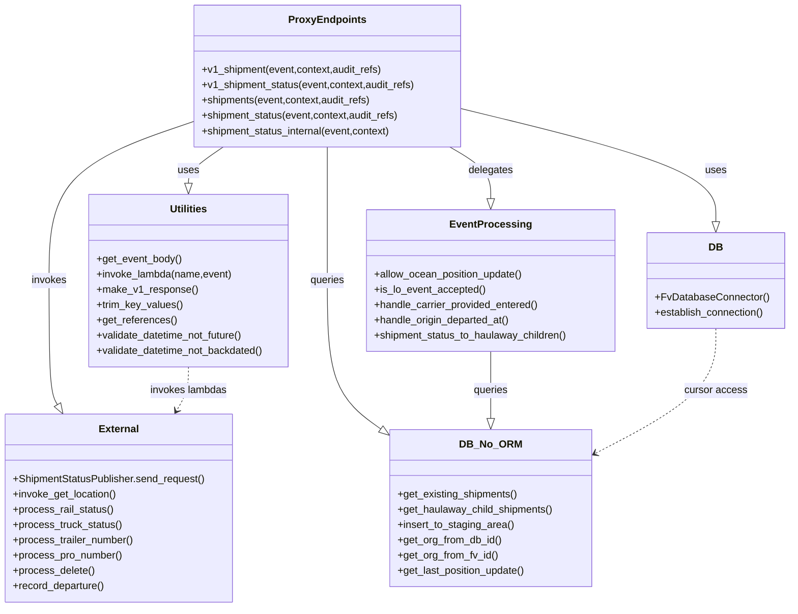

# Diagram: shipment_core/shipment_service/shipment_service/proxy_endpoints/proxy_endpoints.py


> Auto-generated by Obscura crawlers

## Diagram 1



### SVG

<svg id="container" width="1237.265625" xmlns="http://www.w3.org/2000/svg" class="classDiagram" height="950" viewBox="0 0 1237.265625 950" role="graphics-document document" aria-roledescription="class"><style>#container{font-family:"trebuchet ms",verdana,arial,sans-serif;font-size:16px;fill:#333;}@keyframes edge-animation-frame{from{stroke-dashoffset:0;}}@keyframes dash{to{stroke-dashoffset:0;}}#container .edge-animation-slow{stroke-dasharray:9,5!important;stroke-dashoffset:900;animation:dash 50s linear infinite;stroke-linecap:round;}#container .edge-animation-fast{stroke-dasharray:9,5!important;stroke-dashoffset:900;animation:dash 20s linear infinite;stroke-linecap:round;}#container .error-icon{fill:#552222;}#container .error-text{fill:#552222;stroke:#552222;}#container .edge-thickness-normal{stroke-width:1px;}#container .edge-thickness-thick{stroke-width:3.5px;}#container .edge-pattern-solid{stroke-dasharray:0;}#container .edge-thickness-invisible{stroke-width:0;fill:none;}#container .edge-pattern-dashed{stroke-dasharray:3;}#container .edge-pattern-dotted{stroke-dasharray:2;}#container .marker{fill:#333333;stroke:#333333;}#container .marker.cross{stroke:#333333;}#container svg{font-family:"trebuchet ms",verdana,arial,sans-serif;font-size:16px;}#container p{margin:0;}#container g.classGroup text{fill:#9370DB;stroke:none;font-family:"trebuchet ms",verdana,arial,sans-serif;font-size:10px;}#container g.classGroup text .title{font-weight:bolder;}#container .nodeLabel,#container .edgeLabel{color:#131300;}#container .edgeLabel .label rect{fill:#ECECFF;}#container .label text{fill:#131300;}#container .labelBkg{background:#ECECFF;}#container .edgeLabel .label span{background:#ECECFF;}#container .classTitle{font-weight:bolder;}#container .node rect,#container .node circle,#container .node ellipse,#container .node polygon,#container .node path{fill:#ECECFF;stroke:#9370DB;stroke-width:1px;}#container .divider{stroke:#9370DB;stroke-width:1;}#container g.clickable{cursor:pointer;}#container g.classGroup rect{fill:#ECECFF;stroke:#9370DB;}#container g.classGroup line{stroke:#9370DB;stroke-width:1;}#container .classLabel .box{stroke:none;stroke-width:0;fill:#ECECFF;opacity:0.5;}#container .classLabel .label{fill:#9370DB;font-size:10px;}#container .relation{stroke:#333333;stroke-width:1;fill:none;}#container .dashed-line{stroke-dasharray:3;}#container .dotted-line{stroke-dasharray:1 2;}#container #compositionStart,#container .composition{fill:#333333!important;stroke:#333333!important;stroke-width:1;}#container #compositionEnd,#container .composition{fill:#333333!important;stroke:#333333!important;stroke-width:1;}#container #dependencyStart,#container .dependency{fill:#333333!important;stroke:#333333!important;stroke-width:1;}#container #dependencyStart,#container .dependency{fill:#333333!important;stroke:#333333!important;stroke-width:1;}#container #extensionStart,#container .extension{fill:transparent!important;stroke:#333333!important;stroke-width:1;}#container #extensionEnd,#container .extension{fill:transparent!important;stroke:#333333!important;stroke-width:1;}#container #aggregationStart,#container .aggregation{fill:transparent!important;stroke:#333333!important;stroke-width:1;}#container #aggregationEnd,#container .aggregation{fill:transparent!important;stroke:#333333!important;stroke-width:1;}#container #lollipopStart,#container .lollipop{fill:#ECECFF!important;stroke:#333333!important;stroke-width:1;}#container #lollipopEnd,#container .lollipop{fill:#ECECFF!important;stroke:#333333!important;stroke-width:1;}#container .edgeTerminals{font-size:11px;line-height:initial;}#container .classTitleText{text-anchor:middle;font-size:18px;fill:#333;}#container .label-icon{display:inline-block;height:1em;overflow:visible;vertical-align:-0.125em;}#container .node .label-icon path{fill:currentColor;stroke:revert;stroke-width:revert;}#container :root{--mermaid-font-family:"trebuchet ms",verdana,arial,sans-serif;}</style><g><defs><marker id="container_class-aggregationStart" class="marker aggregation class" refX="18" refY="7" markerWidth="190" markerHeight="240" orient="auto"><path d="M 18,7 L9,13 L1,7 L9,1 Z"></path></marker></defs><defs><marker id="container_class-aggregationEnd" class="marker aggregation class" refX="1" refY="7" markerWidth="20" markerHeight="28" orient="auto"><path d="M 18,7 L9,13 L1,7 L9,1 Z"></path></marker></defs><defs><marker id="container_class-extensionStart" class="marker extension class" refX="18" refY="7" markerWidth="190" markerHeight="240" orient="auto"><path d="M 1,7 L18,13 V 1 Z"></path></marker></defs><defs><marker id="container_class-extensionEnd" class="marker extension class" refX="1" refY="7" markerWidth="20" markerHeight="28" orient="auto"><path d="M 1,1 V 13 L18,7 Z"></path></marker></defs><defs><marker id="container_class-compositionStart" class="marker composition class" refX="18" refY="7" markerWidth="190" markerHeight="240" orient="auto"><path d="M 18,7 L9,13 L1,7 L9,1 Z"></path></marker></defs><defs><marker id="container_class-compositionEnd" class="marker composition class" refX="1" refY="7" markerWidth="20" markerHeight="28" orient="auto"><path d="M 18,7 L9,13 L1,7 L9,1 Z"></path></marker></defs><defs><marker id="container_class-dependencyStart" class="marker dependency class" refX="6" refY="7" markerWidth="190" markerHeight="240" orient="auto"><path d="M 5,7 L9,13 L1,7 L9,1 Z"></path></marker></defs><defs><marker id="container_class-dependencyEnd" class="marker dependency class" refX="13" refY="7" markerWidth="20" markerHeight="28" orient="auto"><path d="M 18,7 L9,13 L14,7 L9,1 Z"></path></marker></defs><defs><marker id="container_class-lollipopStart" class="marker lollipop class" refX="13" refY="7" markerWidth="190" markerHeight="240" orient="auto"><circle stroke="black" fill="transparent" cx="7" cy="7" r="6"></circle></marker></defs><defs><marker id="container_class-lollipopEnd" class="marker lollipop class" refX="1" refY="7" markerWidth="190" markerHeight="240" orient="auto"><circle stroke="black" fill="transparent" cx="7" cy="7" r="6"></circle></marker></defs><g class="root"><g class="clusters"></g><g class="edgePaths"><path d="M352.887,230L343.658,236.167C334.43,242.333,315.973,254.667,306.744,264.125C297.516,273.583,297.516,280.167,297.516,283.458L297.516,286.75" id="id_ProxyEndpoints_Utilities_1" class="edge-thickness-normal edge-pattern-solid relation" style=";;;" data-edge="true" data-et="edge" data-id="id_ProxyEndpoints_Utilities_1" data-points="W3sieCI6MzUyLjg4NjcxODc1LCJ5IjoyMzB9LHsieCI6Mjk3LjUxNTYyNSwieSI6MjY3fSx7IngiOjI5Ny41MTU2MjUsInkiOjMwNH1d" marker-end="url(#container_class-extensionEnd)"></path><path d="M728.383,170.162L794.436,186.301C860.488,202.441,992.594,234.721,1058.646,264.152C1124.699,293.583,1124.699,320.167,1124.699,333.458L1124.699,346.75" id="id_ProxyEndpoints_DB_2" class="edge-thickness-normal edge-pattern-solid relation" style=";;;" data-edge="true" data-et="edge" data-id="id_ProxyEndpoints_DB_2" data-points="W3sieCI6NzI4LjM4MjgxMjUsInkiOjE3MC4xNjE3OTAwMjgzMTE4fSx7IngiOjExMjQuNjk5MjE4NzUsInkiOjI2N30seyJ4IjoxMTI0LjY5OTIxODc1LCJ5IjozNjR9XQ==" marker-end="url(#container_class-extensionEnd)"></path><path d="M519,230L519,236.167C519,242.333,519,254.667,519,289.5C519,324.333,519,381.667,519,439C519,496.333,519,553.667,533.319,592.597C547.638,631.528,576.276,652.057,590.595,662.321L604.914,672.585" id="id_ProxyEndpoints_DB_No_ORM_3" class="edge-thickness-normal edge-pattern-solid relation" style=";;;" data-edge="true" data-et="edge" data-id="id_ProxyEndpoints_DB_No_ORM_3" data-points="W3sieCI6NTE5LCJ5IjoyMzB9LHsieCI6NTE5LCJ5IjoyNjd9LHsieCI6NTE5LCJ5Ijo0Mzl9LHsieCI6NTE5LCJ5Ijo2MTF9LHsieCI6NjE4LjkzMzU5Mzc1LCJ5Ijo2ODIuNjM0ODkxNjQ4NDA1Mn1d" marker-end="url(#container_class-extensionEnd)"></path><path d="M711.516,230L722.211,236.167C732.906,242.333,754.297,254.667,764.992,268.125C775.688,281.583,775.688,296.167,775.688,303.458L775.688,310.75" id="id_ProxyEndpoints_EventProcessing_4" class="edge-thickness-normal edge-pattern-solid relation" style=";;;" data-edge="true" data-et="edge" data-id="id_ProxyEndpoints_EventProcessing_4" data-points="W3sieCI6NzExLjUxNTYyNSwieSI6MjMwfSx7IngiOjc3NS42ODc1LCJ5IjoyNjd9LHsieCI6Nzc1LjY4NzUsInkiOjMyOH1d" marker-end="url(#container_class-extensionEnd)"></path><path d="M309.617,188.903L270.629,201.919C231.641,214.935,153.664,240.968,114.676,282.65C75.688,324.333,75.688,381.667,75.688,439C75.688,496.333,75.688,553.667,77.92,586.038C80.153,618.409,84.619,625.818,86.852,629.522L89.085,633.226" id="id_ProxyEndpoints_External_5" class="edge-thickness-normal edge-pattern-solid relation" style=";;;" data-edge="true" data-et="edge" data-id="id_ProxyEndpoints_External_5" data-points="W3sieCI6MzA5LjYxNzE4NzUsInkiOjE4OC45MDI1MDk1MTY0MjQ2M30seyJ4Ijo3NS42ODc1LCJ5IjoyNjd9LHsieCI6NzUuNjg3NSwieSI6NDM5fSx7IngiOjc1LjY4NzUsInkiOjYxMX0seyJ4Ijo5Ny45OTA4NzEyNjM1ODY5NSwieSI6NjQ4fV0=" marker-end="url(#container_class-extensionEnd)"></path><path d="M775.688,550L775.688,560.167C775.688,570.333,775.688,590.667,775.688,608.125C775.688,625.583,775.688,640.167,775.688,647.458L775.688,654.75" id="id_EventProcessing_DB_No_ORM_6" class="edge-thickness-normal edge-pattern-solid relation" style=";;;" data-edge="true" data-et="edge" data-id="id_EventProcessing_DB_No_ORM_6" data-points="W3sieCI6Nzc1LjY4NzUsInkiOjU1MH0seyJ4Ijo3NzUuNjg3NSwieSI6NjExfSx7IngiOjc3NS42ODc1LCJ5Ijo2NzJ9XQ==" marker-end="url(#container_class-extensionEnd)"></path><path d="M297.516,574L297.516,580.167C297.516,586.333,297.516,598.667,294.315,610.144C291.114,621.62,284.712,632.241,281.511,637.551L278.31,642.861" id="id_Utilities_External_7" class="edge-thickness-normal edge-pattern-dashed relation" style=";;;" data-edge="true" data-et="edge" data-id="id_Utilities_External_7" data-points="W3sieCI6Mjk3LjUxNTYyNSwieSI6NTc0fSx7IngiOjI5Ny41MTU2MjUsInkiOjYxMX0seyJ4IjoyNzUuMjEyMjUzNzM2NDEzMDYsInkiOjY0OH1d" marker-end="url(#container_class-dependencyEnd)"></path><path d="M1124.699,514L1124.699,530.167C1124.699,546.333,1124.699,578.667,1093.541,611.26C1062.382,643.854,1000.066,676.707,968.907,693.134L937.749,709.561" id="id_DB_DB_No_ORM_8" class="edge-thickness-normal edge-pattern-dashed relation" style=";;;" data-edge="true" data-et="edge" data-id="id_DB_DB_No_ORM_8" data-points="W3sieCI6MTEyNC42OTkyMTg3NSwieSI6NTE0fSx7IngiOjExMjQuNjk5MjE4NzUsInkiOjYxMX0seyJ4Ijo5MzIuNDQxNDA2MjUsInkiOjcxMi4zNTg4ODE2NjM2MjYxfV0=" marker-end="url(#container_class-dependencyEnd)"></path></g><g class="edgeLabels"><g class="edgeLabel" transform="translate(297.515625, 267)"><g class="label" data-id="id_ProxyEndpoints_Utilities_1" transform="translate(-16.4921875, -12)"><foreignObject width="32.984375" height="24"><div xmlns="http://www.w3.org/1999/xhtml" class="labelBkg" style="display: table-cell; white-space: nowrap; line-height: 1.5; max-width: 200px; text-align: center;"><span class="edgeLabel"><p>uses</p></span></div></foreignObject></g></g><g class="edgeLabel" transform="translate(1124.69921875, 267)"><g class="label" data-id="id_ProxyEndpoints_DB_2" transform="translate(-16.4921875, -12)"><foreignObject width="32.984375" height="24"><div xmlns="http://www.w3.org/1999/xhtml" class="labelBkg" style="display: table-cell; white-space: nowrap; line-height: 1.5; max-width: 200px; text-align: center;"><span class="edgeLabel"><p>uses</p></span></div></foreignObject></g></g><g class="edgeLabel" transform="translate(519, 439)"><g class="label" data-id="id_ProxyEndpoints_DB_No_ORM_3" transform="translate(-27.2421875, -12)"><foreignObject width="54.484375" height="24"><div xmlns="http://www.w3.org/1999/xhtml" class="labelBkg" style="display: table-cell; white-space: nowrap; line-height: 1.5; max-width: 200px; text-align: center;"><span class="edgeLabel"><p>queries</p></span></div></foreignObject></g></g><g class="edgeLabel" transform="translate(775.6875, 267)"><g class="label" data-id="id_ProxyEndpoints_EventProcessing_4" transform="translate(-35.0390625, -12)"><foreignObject width="70.078125" height="24"><div xmlns="http://www.w3.org/1999/xhtml" class="labelBkg" style="display: table-cell; white-space: nowrap; line-height: 1.5; max-width: 200px; text-align: center;"><span class="edgeLabel"><p>delegates</p></span></div></foreignObject></g></g><g class="edgeLabel" transform="translate(75.6875, 439)"><g class="label" data-id="id_ProxyEndpoints_External_5" transform="translate(-27.5859375, -12)"><foreignObject width="55.171875" height="24"><div xmlns="http://www.w3.org/1999/xhtml" class="labelBkg" style="display: table-cell; white-space: nowrap; line-height: 1.5; max-width: 200px; text-align: center;"><span class="edgeLabel"><p>invokes</p></span></div></foreignObject></g></g><g class="edgeLabel" transform="translate(775.6875, 611)"><g class="label" data-id="id_EventProcessing_DB_No_ORM_6" transform="translate(-27.2421875, -12)"><foreignObject width="54.484375" height="24"><div xmlns="http://www.w3.org/1999/xhtml" class="labelBkg" style="display: table-cell; white-space: nowrap; line-height: 1.5; max-width: 200px; text-align: center;"><span class="edgeLabel"><p>queries</p></span></div></foreignObject></g></g><g class="edgeLabel" transform="translate(297.515625, 611)"><g class="label" data-id="id_Utilities_External_7" transform="translate(-60.765625, -12)"><foreignObject width="121.53125" height="24"><div xmlns="http://www.w3.org/1999/xhtml" class="labelBkg" style="display: table-cell; white-space: nowrap; line-height: 1.5; max-width: 200px; text-align: center;"><span class="edgeLabel"><p>invokes lambdas</p></span></div></foreignObject></g></g><g class="edgeLabel" transform="translate(1124.69921875, 611)"><g class="label" data-id="id_DB_DB_No_ORM_8" transform="translate(-48.421875, -12)"><foreignObject width="96.84375" height="24"><div xmlns="http://www.w3.org/1999/xhtml" class="labelBkg" style="display: table-cell; white-space: nowrap; line-height: 1.5; max-width: 200px; text-align: center;"><span class="edgeLabel"><p>cursor access</p></span></div></foreignObject></g></g></g><g class="nodes"><g class="node default" id="classId-ProxyEndpoints-0" transform="translate(519, 119)"><g class="basic label-container"><path d="M-209.3828125 -111 L209.3828125 -111 L209.3828125 111 L-209.3828125 111" stroke="none" stroke-width="0" fill="#ECECFF" style=""></path><path d="M-209.3828125 -111 C-50.4154675371536 -111, 108.5518774256928 -111, 209.3828125 -111 M-209.3828125 -111 C-102.21831437587349 -111, 4.94618374825302 -111, 209.3828125 -111 M209.3828125 -111 C209.3828125 -52.24326295644742, 209.3828125 6.513474087105166, 209.3828125 111 M209.3828125 -111 C209.3828125 -41.78641698067739, 209.3828125 27.427166038645225, 209.3828125 111 M209.3828125 111 C70.0959502356587 111, -69.19091202868259 111, -209.3828125 111 M209.3828125 111 C77.5029621249542 111, -54.37688825009161 111, -209.3828125 111 M-209.3828125 111 C-209.3828125 49.53736309618073, -209.3828125 -11.925273807638547, -209.3828125 -111 M-209.3828125 111 C-209.3828125 58.42433762183383, -209.3828125 5.848675243667657, -209.3828125 -111" stroke="#9370DB" stroke-width="1.3" fill="none" stroke-dasharray="0 0" style=""></path></g><g class="annotation-group text" transform="translate(0, -87)"></g><g class="label-group text" transform="translate(-57.234375, -87)"><g class="label" style="font-weight: bolder" transform="translate(0,-12)"><foreignObject width="114.46875" height="24"><div xmlns="http://www.w3.org/1999/xhtml" style="display: table-cell; white-space: nowrap; line-height: 1.5; max-width: 163px; text-align: center;"><span class="nodeLabel markdown-node-label" style=""><p>ProxyEndpoints</p></span></div></foreignObject></g></g><g class="members-group text" transform="translate(-197.3828125, -39)"></g><g class="methods-group text" transform="translate(-197.3828125, -9)"><g class="label" style="" transform="translate(0,-12)"><foreignObject width="284.8125" height="24"><div xmlns="http://www.w3.org/1999/xhtml" style="display: table-cell; white-space: nowrap; line-height: 1.5; max-width: 342px; text-align: center;"><span class="nodeLabel markdown-node-label" style=""><p>+v1_shipment(event,context,audit_refs)</p></span></div></foreignObject></g><g class="label" style="" transform="translate(0,12)"><foreignObject width="337.53125" height="24"><div xmlns="http://www.w3.org/1999/xhtml" style="display: table-cell; white-space: nowrap; line-height: 1.5; max-width: 395px; text-align: center;"><span class="nodeLabel markdown-node-label" style=""><p>+v1_shipment_status(event,context,audit_refs)</p></span></div></foreignObject></g><g class="label" style="" transform="translate(0,36)"><foreignObject width="269.328125" height="24"><div xmlns="http://www.w3.org/1999/xhtml" style="display: table-cell; white-space: nowrap; line-height: 1.5; max-width: 327px; text-align: center;"><span class="nodeLabel markdown-node-label" style=""><p>+shipments(event,context,audit_refs)</p></span></div></foreignObject></g><g class="label" style="" transform="translate(0,60)"><foreignObject width="314.5625" height="24"><div xmlns="http://www.w3.org/1999/xhtml" style="display: table-cell; white-space: nowrap; line-height: 1.5; max-width: 372px; text-align: center;"><span class="nodeLabel markdown-node-label" style=""><p>+shipment_status(event,context,audit_refs)</p></span></div></foreignObject></g><g class="label" style="" transform="translate(0,84)"><foreignObject width="302.234375" height="24"><div xmlns="http://www.w3.org/1999/xhtml" style="display: table-cell; white-space: nowrap; line-height: 1.5; max-width: 360px; text-align: center;"><span class="nodeLabel markdown-node-label" style=""><p>+shipment_status_internal(event,context)</p></span></div></foreignObject></g></g><g class="divider" style=""><path d="M-209.3828125 -63 C-125.3938731560352 -63, -41.4049338120704 -63, 209.3828125 -63 M-209.3828125 -63 C-74.32806453640066 -63, 60.72668342719868 -63, 209.3828125 -63" stroke="#9370DB" stroke-width="1.3" fill="none" stroke-dasharray="0 0" style=""></path></g><g class="divider" style=""><path d="M-209.3828125 -39 C-101.62926006668683 -39, 6.124292366626349 -39, 209.3828125 -39 M-209.3828125 -39 C-86.03414336285871 -39, 37.31452577428257 -39, 209.3828125 -39" stroke="#9370DB" stroke-width="1.3" fill="none" stroke-dasharray="0 0" style=""></path></g></g><g class="node default" id="classId-Utilities-1" transform="translate(297.515625, 439)"><g class="basic label-container"><path d="M-159.2421875 -135 L159.2421875 -135 L159.2421875 135 L-159.2421875 135" stroke="none" stroke-width="0" fill="#ECECFF" style=""></path><path d="M-159.2421875 -135 C-81.49278613397756 -135, -3.7433847679551207 -135, 159.2421875 -135 M-159.2421875 -135 C-60.83771469666321 -135, 37.566758106673575 -135, 159.2421875 -135 M159.2421875 -135 C159.2421875 -47.413173745682585, 159.2421875 40.17365250863483, 159.2421875 135 M159.2421875 -135 C159.2421875 -36.4057662965443, 159.2421875 62.1884674069114, 159.2421875 135 M159.2421875 135 C73.2783547504759 135, -12.685477999048203 135, -159.2421875 135 M159.2421875 135 C52.688164870634466 135, -53.86585775873107 135, -159.2421875 135 M-159.2421875 135 C-159.2421875 69.76964090961576, -159.2421875 4.539281819231519, -159.2421875 -135 M-159.2421875 135 C-159.2421875 71.97457920448602, -159.2421875 8.949158408972053, -159.2421875 -135" stroke="#9370DB" stroke-width="1.3" fill="none" stroke-dasharray="0 0" style=""></path></g><g class="annotation-group text" transform="translate(0, -111)"></g><g class="label-group text" transform="translate(-28.8125, -111)"><g class="label" style="font-weight: bolder" transform="translate(0,-12)"><foreignObject width="57.625" height="24"><div xmlns="http://www.w3.org/1999/xhtml" style="display: table-cell; white-space: nowrap; line-height: 1.5; max-width: 107px; text-align: center;"><span class="nodeLabel markdown-node-label" style=""><p>Utilities</p></span></div></foreignObject></g></g><g class="members-group text" transform="translate(-147.2421875, -63)"></g><g class="methods-group text" transform="translate(-147.2421875, -33)"><g class="label" style="" transform="translate(0,-12)"><foreignObject width="133.859375" height="24"><div xmlns="http://www.w3.org/1999/xhtml" style="display: table-cell; white-space: nowrap; line-height: 1.5; max-width: 191px; text-align: center;"><span class="nodeLabel markdown-node-label" style=""><p>+get_event_body()</p></span></div></foreignObject></g><g class="label" style="" transform="translate(0,12)"><foreignObject width="213.0625" height="24"><div xmlns="http://www.w3.org/1999/xhtml" style="display: table-cell; white-space: nowrap; line-height: 1.5; max-width: 270px; text-align: center;"><span class="nodeLabel markdown-node-label" style=""><p>+invoke_lambda(name,event)</p></span></div></foreignObject></g><g class="label" style="" transform="translate(0,36)"><foreignObject width="154.484375" height="24"><div xmlns="http://www.w3.org/1999/xhtml" style="display: table-cell; white-space: nowrap; line-height: 1.5; max-width: 212px; text-align: center;"><span class="nodeLabel markdown-node-label" style=""><p>+make_v1_response()</p></span></div></foreignObject></g><g class="label" style="" transform="translate(0,60)"><foreignObject width="135.0625" height="24"><div xmlns="http://www.w3.org/1999/xhtml" style="display: table-cell; white-space: nowrap; line-height: 1.5; max-width: 192px; text-align: center;"><span class="nodeLabel markdown-node-label" style=""><p>+trim_key_values()</p></span></div></foreignObject></g><g class="label" style="" transform="translate(0,84)"><foreignObject width="124.890625" height="24"><div xmlns="http://www.w3.org/1999/xhtml" style="display: table-cell; white-space: nowrap; line-height: 1.5; max-width: 182px; text-align: center;"><span class="nodeLabel markdown-node-label" style=""><p>+get_references()</p></span></div></foreignObject></g><g class="label" style="" transform="translate(0,108)"><foreignObject width="233.6875" height="24"><div xmlns="http://www.w3.org/1999/xhtml" style="display: table-cell; white-space: nowrap; line-height: 1.5; max-width: 291px; text-align: center;"><span class="nodeLabel markdown-node-label" style=""><p>+validate_datetime_not_future()</p></span></div></foreignObject></g><g class="label" style="" transform="translate(0,132)"><foreignObject width="265.671875" height="24"><div xmlns="http://www.w3.org/1999/xhtml" style="display: table-cell; white-space: nowrap; line-height: 1.5; max-width: 323px; text-align: center;"><span class="nodeLabel markdown-node-label" style=""><p>+validate_datetime_not_backdated()</p></span></div></foreignObject></g></g><g class="divider" style=""><path d="M-159.2421875 -87 C-72.1259399425727 -87, 14.9903076148546 -87, 159.2421875 -87 M-159.2421875 -87 C-92.29550020909846 -87, -25.348812918196927 -87, 159.2421875 -87" stroke="#9370DB" stroke-width="1.3" fill="none" stroke-dasharray="0 0" style=""></path></g><g class="divider" style=""><path d="M-159.2421875 -63 C-32.351425441255586 -63, 94.53933661748883 -63, 159.2421875 -63 M-159.2421875 -63 C-50.817509302812496 -63, 57.60716889437501 -63, 159.2421875 -63" stroke="#9370DB" stroke-width="1.3" fill="none" stroke-dasharray="0 0" style=""></path></g></g><g class="node default" id="classId-DB-2" transform="translate(1124.69921875, 439)"><g class="basic label-container"><path d="M-104.56640625 -75 L104.56640625 -75 L104.56640625 75 L-104.56640625 75" stroke="none" stroke-width="0" fill="#ECECFF" style=""></path><path d="M-104.56640625 -75 C-33.37374152229029 -75, 37.81892320541942 -75, 104.56640625 -75 M-104.56640625 -75 C-21.37990254012054 -75, 61.80660116975892 -75, 104.56640625 -75 M104.56640625 -75 C104.56640625 -22.661482795022295, 104.56640625 29.67703440995541, 104.56640625 75 M104.56640625 -75 C104.56640625 -17.01599971095338, 104.56640625 40.96800057809324, 104.56640625 75 M104.56640625 75 C51.18980569600631 75, -2.1867948579873797 75, -104.56640625 75 M104.56640625 75 C42.01621347850808 75, -20.533979292983844 75, -104.56640625 75 M-104.56640625 75 C-104.56640625 17.01862978338432, -104.56640625 -40.96274043323136, -104.56640625 -75 M-104.56640625 75 C-104.56640625 31.71687166026628, -104.56640625 -11.566256679467443, -104.56640625 -75" stroke="#9370DB" stroke-width="1.3" fill="none" stroke-dasharray="0 0" style=""></path></g><g class="annotation-group text" transform="translate(0, -51)"></g><g class="label-group text" transform="translate(-10.1484375, -51)"><g class="label" style="font-weight: bolder" transform="translate(0,-12)"><foreignObject width="20.296875" height="24"><div xmlns="http://www.w3.org/1999/xhtml" style="display: table-cell; white-space: nowrap; line-height: 1.5; max-width: 70px; text-align: center;"><span class="nodeLabel markdown-node-label" style=""><p>DB</p></span></div></foreignObject></g></g><g class="members-group text" transform="translate(-92.56640625, -3)"></g><g class="methods-group text" transform="translate(-92.56640625, 27)"><g class="label" style="" transform="translate(0,-12)"><foreignObject width="174.984375" height="24"><div xmlns="http://www.w3.org/1999/xhtml" style="display: table-cell; white-space: nowrap; line-height: 1.5; max-width: 232px; text-align: center;"><span class="nodeLabel markdown-node-label" style=""><p>+FvDatabaseConnector()</p></span></div></foreignObject></g><g class="label" style="" transform="translate(0,12)"><foreignObject width="173.265625" height="24"><div xmlns="http://www.w3.org/1999/xhtml" style="display: table-cell; white-space: nowrap; line-height: 1.5; max-width: 231px; text-align: center;"><span class="nodeLabel markdown-node-label" style=""><p>+establish_connection()</p></span></div></foreignObject></g></g><g class="divider" style=""><path d="M-104.56640625 -27 C-23.2035070994271 -27, 58.1593920511458 -27, 104.56640625 -27 M-104.56640625 -27 C-27.509176808490736 -27, 49.54805263301853 -27, 104.56640625 -27" stroke="#9370DB" stroke-width="1.3" fill="none" stroke-dasharray="0 0" style=""></path></g><g class="divider" style=""><path d="M-104.56640625 -3 C-37.202431370432606 -3, 30.161543509134788 -3, 104.56640625 -3 M-104.56640625 -3 C-43.80123029458963 -3, 16.96394566082074 -3, 104.56640625 -3" stroke="#9370DB" stroke-width="1.3" fill="none" stroke-dasharray="0 0" style=""></path></g></g><g class="node default" id="classId-DB_No_ORM-3" transform="translate(775.6875, 795)"><g class="basic label-container"><path d="M-156.75390625 -123 L156.75390625 -123 L156.75390625 123 L-156.75390625 123" stroke="none" stroke-width="0" fill="#ECECFF" style=""></path><path d="M-156.75390625 -123 C-38.67384771431351 -123, 79.40621082137298 -123, 156.75390625 -123 M-156.75390625 -123 C-62.24170836667288 -123, 32.27048951665424 -123, 156.75390625 -123 M156.75390625 -123 C156.75390625 -53.706552742396596, 156.75390625 15.586894515206808, 156.75390625 123 M156.75390625 -123 C156.75390625 -70.07138257211622, 156.75390625 -17.142765144232428, 156.75390625 123 M156.75390625 123 C58.62590916974712 123, -39.502087910505765 123, -156.75390625 123 M156.75390625 123 C81.71709870709665 123, 6.6802911641933065 123, -156.75390625 123 M-156.75390625 123 C-156.75390625 46.478541333553025, -156.75390625 -30.04291733289395, -156.75390625 -123 M-156.75390625 123 C-156.75390625 44.46223600476735, -156.75390625 -34.075527990465304, -156.75390625 -123" stroke="#9370DB" stroke-width="1.3" fill="none" stroke-dasharray="0 0" style=""></path></g><g class="annotation-group text" transform="translate(0, -99)"></g><g class="label-group text" transform="translate(-44.5546875, -99)"><g class="label" style="font-weight: bolder" transform="translate(0,-12)"><foreignObject width="89.109375" height="24"><div xmlns="http://www.w3.org/1999/xhtml" style="display: table-cell; white-space: nowrap; line-height: 1.5; max-width: 139px; text-align: center;"><span class="nodeLabel markdown-node-label" style=""><p>DB_No_ORM</p></span></div></foreignObject></g></g><g class="members-group text" transform="translate(-144.75390625, -51)"></g><g class="methods-group text" transform="translate(-144.75390625, -21)"><g class="label" style="" transform="translate(0,-12)"><foreignObject width="189.53125" height="24"><div xmlns="http://www.w3.org/1999/xhtml" style="display: table-cell; white-space: nowrap; line-height: 1.5; max-width: 247px; text-align: center;"><span class="nodeLabel markdown-node-label" style=""><p>+get_existing_shipments()</p></span></div></foreignObject></g><g class="label" style="" transform="translate(0,12)"><foreignObject width="244.953125" height="24"><div xmlns="http://www.w3.org/1999/xhtml" style="display: table-cell; white-space: nowrap; line-height: 1.5; max-width: 302px; text-align: center;"><span class="nodeLabel markdown-node-label" style=""><p>+get_haulaway_child_shipments()</p></span></div></foreignObject></g><g class="label" style="" transform="translate(0,36)"><foreignObject width="183.203125" height="24"><div xmlns="http://www.w3.org/1999/xhtml" style="display: table-cell; white-space: nowrap; line-height: 1.5; max-width: 241px; text-align: center;"><span class="nodeLabel markdown-node-label" style=""><p>+insert_to_staging_area()</p></span></div></foreignObject></g><g class="label" style="" transform="translate(0,60)"><foreignObject width="163.84375" height="24"><div xmlns="http://www.w3.org/1999/xhtml" style="display: table-cell; white-space: nowrap; line-height: 1.5; max-width: 221px; text-align: center;"><span class="nodeLabel markdown-node-label" style=""><p>+get_org_from_db_id()</p></span></div></foreignObject></g><g class="label" style="" transform="translate(0,84)"><foreignObject width="157.84375" height="24"><div xmlns="http://www.w3.org/1999/xhtml" style="display: table-cell; white-space: nowrap; line-height: 1.5; max-width: 215px; text-align: center;"><span class="nodeLabel markdown-node-label" style=""><p>+get_org_from_fv_id()</p></span></div></foreignObject></g><g class="label" style="" transform="translate(0,108)"><foreignObject width="202.984375" height="24"><div xmlns="http://www.w3.org/1999/xhtml" style="display: table-cell; white-space: nowrap; line-height: 1.5; max-width: 260px; text-align: center;"><span class="nodeLabel markdown-node-label" style=""><p>+get_last_position_update()</p></span></div></foreignObject></g></g><g class="divider" style=""><path d="M-156.75390625 -75 C-65.52099968641703 -75, 25.711906877165944 -75, 156.75390625 -75 M-156.75390625 -75 C-33.885549314340125 -75, 88.98280762131975 -75, 156.75390625 -75" stroke="#9370DB" stroke-width="1.3" fill="none" stroke-dasharray="0 0" style=""></path></g><g class="divider" style=""><path d="M-156.75390625 -51 C-89.07052078404466 -51, -21.38713531808932 -51, 156.75390625 -51 M-156.75390625 -51 C-44.28185268981801 -51, 68.19020087036398 -51, 156.75390625 -51" stroke="#9370DB" stroke-width="1.3" fill="none" stroke-dasharray="0 0" style=""></path></g></g><g class="node default" id="classId-EventProcessing-4" transform="translate(775.6875, 439)"><g class="basic label-container"><path d="M-194.4453125 -111 L194.4453125 -111 L194.4453125 111 L-194.4453125 111" stroke="none" stroke-width="0" fill="#ECECFF" style=""></path><path d="M-194.4453125 -111 C-45.25956500204069 -111, 103.92618249591862 -111, 194.4453125 -111 M-194.4453125 -111 C-69.01642218510736 -111, 56.41246812978528 -111, 194.4453125 -111 M194.4453125 -111 C194.4453125 -42.8342699859531, 194.4453125 25.3314600280938, 194.4453125 111 M194.4453125 -111 C194.4453125 -50.859143149108945, 194.4453125 9.28171370178211, 194.4453125 111 M194.4453125 111 C93.6568281433685 111, -7.131656213263 111, -194.4453125 111 M194.4453125 111 C85.97759237837579 111, -22.490127743248422 111, -194.4453125 111 M-194.4453125 111 C-194.4453125 55.262610440841726, -194.4453125 -0.4747791183165475, -194.4453125 -111 M-194.4453125 111 C-194.4453125 48.2873945177694, -194.4453125 -14.4252109644612, -194.4453125 -111" stroke="#9370DB" stroke-width="1.3" fill="none" stroke-dasharray="0 0" style=""></path></g><g class="annotation-group text" transform="translate(0, -87)"></g><g class="label-group text" transform="translate(-59.53125, -87)"><g class="label" style="font-weight: bolder" transform="translate(0,-12)"><foreignObject width="119.0625" height="24"><div xmlns="http://www.w3.org/1999/xhtml" style="display: table-cell; white-space: nowrap; line-height: 1.5; max-width: 168px; text-align: center;"><span class="nodeLabel markdown-node-label" style=""><p>EventProcessing</p></span></div></foreignObject></g></g><g class="members-group text" transform="translate(-182.4453125, -39)"></g><g class="methods-group text" transform="translate(-182.4453125, -9)"><g class="label" style="" transform="translate(0,-12)"><foreignObject width="235.265625" height="24"><div xmlns="http://www.w3.org/1999/xhtml" style="display: table-cell; white-space: nowrap; line-height: 1.5; max-width: 293px; text-align: center;"><span class="nodeLabel markdown-node-label" style=""><p>+allow_ocean_position_update()</p></span></div></foreignObject></g><g class="label" style="" transform="translate(0,12)"><foreignObject width="173.5625" height="24"><div xmlns="http://www.w3.org/1999/xhtml" style="display: table-cell; white-space: nowrap; line-height: 1.5; max-width: 231px; text-align: center;"><span class="nodeLabel markdown-node-label" style=""><p>+is_lo_event_accepted()</p></span></div></foreignObject></g><g class="label" style="" transform="translate(0,36)"><foreignObject width="260.4375" height="24"><div xmlns="http://www.w3.org/1999/xhtml" style="display: table-cell; white-space: nowrap; line-height: 1.5; max-width: 318px; text-align: center;"><span class="nodeLabel markdown-node-label" style=""><p>+handle_carrier_provided_entered()</p></span></div></foreignObject></g><g class="label" style="" transform="translate(0,60)"><foreignObject width="215.453125" height="24"><div xmlns="http://www.w3.org/1999/xhtml" style="display: table-cell; white-space: nowrap; line-height: 1.5; max-width: 273px; text-align: center;"><span class="nodeLabel markdown-node-label" style=""><p>+handle_origin_departed_at()</p></span></div></foreignObject></g><g class="label" style="" transform="translate(0,84)"><foreignObject width="305.359375" height="24"><div xmlns="http://www.w3.org/1999/xhtml" style="display: table-cell; white-space: nowrap; line-height: 1.5; max-width: 363px; text-align: center;"><span class="nodeLabel markdown-node-label" style=""><p>+shipment_status_to_haulaway_children()</p></span></div></foreignObject></g></g><g class="divider" style=""><path d="M-194.4453125 -63 C-38.91294153665467 -63, 116.61942942669066 -63, 194.4453125 -63 M-194.4453125 -63 C-89.37352391967688 -63, 15.698264660646231 -63, 194.4453125 -63" stroke="#9370DB" stroke-width="1.3" fill="none" stroke-dasharray="0 0" style=""></path></g><g class="divider" style=""><path d="M-194.4453125 -39 C-40.64757333327569 -39, 113.15016583344863 -39, 194.4453125 -39 M-194.4453125 -39 C-94.60566370754628 -39, 5.233985084907431 -39, 194.4453125 -39" stroke="#9370DB" stroke-width="1.3" fill="none" stroke-dasharray="0 0" style=""></path></g></g><g class="node default" id="classId-External-5" transform="translate(186.6015625, 795)"><g class="basic label-container"><path d="M-178.6015625 -147 L178.6015625 -147 L178.6015625 147 L-178.6015625 147" stroke="none" stroke-width="0" fill="#ECECFF" style=""></path><path d="M-178.6015625 -147 C-89.95411176298258 -147, -1.3066610259651554 -147, 178.6015625 -147 M-178.6015625 -147 C-87.74606901707405 -147, 3.1094244658519017 -147, 178.6015625 -147 M178.6015625 -147 C178.6015625 -63.377097612309285, 178.6015625 20.24580477538143, 178.6015625 147 M178.6015625 -147 C178.6015625 -49.545129025190334, 178.6015625 47.90974194961933, 178.6015625 147 M178.6015625 147 C72.46443882653993 147, -33.672684846920134 147, -178.6015625 147 M178.6015625 147 C86.94054764455828 147, -4.720467210883442 147, -178.6015625 147 M-178.6015625 147 C-178.6015625 35.97609125841184, -178.6015625 -75.04781748317632, -178.6015625 -147 M-178.6015625 147 C-178.6015625 30.88320118444959, -178.6015625 -85.23359763110082, -178.6015625 -147" stroke="#9370DB" stroke-width="1.3" fill="none" stroke-dasharray="0 0" style=""></path></g><g class="annotation-group text" transform="translate(0, -123)"></g><g class="label-group text" transform="translate(-30.171875, -123)"><g class="label" style="font-weight: bolder" transform="translate(0,-12)"><foreignObject width="60.34375" height="24"><div xmlns="http://www.w3.org/1999/xhtml" style="display: table-cell; white-space: nowrap; line-height: 1.5; max-width: 110px; text-align: center;"><span class="nodeLabel markdown-node-label" style=""><p>External</p></span></div></foreignObject></g></g><g class="members-group text" transform="translate(-166.6015625, -75)"></g><g class="methods-group text" transform="translate(-166.6015625, -45)"><g class="label" style="" transform="translate(0,-12)"><foreignObject width="303.03125" height="24"><div xmlns="http://www.w3.org/1999/xhtml" style="display: table-cell; white-space: nowrap; line-height: 1.5; max-width: 360px; text-align: center;"><span class="nodeLabel markdown-node-label" style=""><p>+ShipmentStatusPublisher.send_request()</p></span></div></foreignObject></g><g class="label" style="" transform="translate(0,12)"><foreignObject width="164.078125" height="24"><div xmlns="http://www.w3.org/1999/xhtml" style="display: table-cell; white-space: nowrap; line-height: 1.5; max-width: 221px; text-align: center;"><span class="nodeLabel markdown-node-label" style=""><p>+invoke_get_location()</p></span></div></foreignObject></g><g class="label" style="" transform="translate(0,36)"><foreignObject width="157.96875" height="24"><div xmlns="http://www.w3.org/1999/xhtml" style="display: table-cell; white-space: nowrap; line-height: 1.5; max-width: 215px; text-align: center;"><span class="nodeLabel markdown-node-label" style=""><p>+process_rail_status()</p></span></div></foreignObject></g><g class="label" style="" transform="translate(0,60)"><foreignObject width="171.234375" height="24"><div xmlns="http://www.w3.org/1999/xhtml" style="display: table-cell; white-space: nowrap; line-height: 1.5; max-width: 229px; text-align: center;"><span class="nodeLabel markdown-node-label" style=""><p>+process_truck_status()</p></span></div></foreignObject></g><g class="label" style="" transform="translate(0,84)"><foreignObject width="189.375" height="24"><div xmlns="http://www.w3.org/1999/xhtml" style="display: table-cell; white-space: nowrap; line-height: 1.5; max-width: 247px; text-align: center;"><span class="nodeLabel markdown-node-label" style=""><p>+process_trailer_number()</p></span></div></foreignObject></g><g class="label" style="" transform="translate(0,108)"><foreignObject width="171.078125" height="24"><div xmlns="http://www.w3.org/1999/xhtml" style="display: table-cell; white-space: nowrap; line-height: 1.5; max-width: 228px; text-align: center;"><span class="nodeLabel markdown-node-label" style=""><p>+process_pro_number()</p></span></div></foreignObject></g><g class="label" style="" transform="translate(0,132)"><foreignObject width="127.28125" height="24"><div xmlns="http://www.w3.org/1999/xhtml" style="display: table-cell; white-space: nowrap; line-height: 1.5; max-width: 185px; text-align: center;"><span class="nodeLabel markdown-node-label" style=""><p>+process_delete()</p></span></div></foreignObject></g><g class="label" style="" transform="translate(0,156)"><foreignObject width="144.734375" height="24"><div xmlns="http://www.w3.org/1999/xhtml" style="display: table-cell; white-space: nowrap; line-height: 1.5; max-width: 202px; text-align: center;"><span class="nodeLabel markdown-node-label" style=""><p>+record_departure()</p></span></div></foreignObject></g></g><g class="divider" style=""><path d="M-178.6015625 -99 C-38.368404185353256 -99, 101.86475412929349 -99, 178.6015625 -99 M-178.6015625 -99 C-50.09710530745306 -99, 78.40735188509387 -99, 178.6015625 -99" stroke="#9370DB" stroke-width="1.3" fill="none" stroke-dasharray="0 0" style=""></path></g><g class="divider" style=""><path d="M-178.6015625 -75 C-67.59119708206036 -75, 43.41916833587928 -75, 178.6015625 -75 M-178.6015625 -75 C-57.118784091286656 -75, 64.36399431742669 -75, 178.6015625 -75" stroke="#9370DB" stroke-width="1.3" fill="none" stroke-dasharray="0 0" style=""></path></g></g></g></g></g></svg>

## Diagram 2

```mermaid
flowchart TD
    A[shipment_status(event)] --> B{status_code in EVENTS_HANDLED_BY_JAVA_PUBLISHER?}
    B -- Yes --> C[Build ShipmentStatusPublisher and send_request]
    C --> D{result.success?}
    D -- No --> E[make_error_response -> return 400/ACCEPTED]
    D -- Yes --> F[make_response ACCEPTED -> return]
    B -- No --> G[shipment_status_internal(event)]
    G --> H[establish DB connection, load event body, parse status & datetime]
    H --> I[validate payload and orgs]
    I --> J{existing_shipments found?}
    J -- No --> K[insert_to_staging_area -> make_response ACCEPTED -> return]
    J -- Yes --> L[wrap shipments in tables.Shipments; check active_until]
    L --> M{status_code == LO and not is_lo_event_accepted?}
    M -- True --> N[return 200 OK]
    M -- False --> O[determine mode_id, obc_provider_name, creator/carrier orgs]
    O --> P[process trailer/pro numbers and lat/lon parsing]
    P --> Q{mode in RAIL/INTERMODAL?}
    Q -- RAIL/INTERMODAL --> R[process_rail_status]
    Q -- TRUCK/OCEAN --> S[process_truck_status]
    R --> T[maybe update shipment.sync_types and call shipment.update()]
    S --> T
    T --> U[determine action by status_code]
    U --> V{status_code matches specific handlers}
    V -->|XB/XX| W[invoke asset_assign]
    V -->|SCAC_UPDATE_CODE| X[scac_assignment_check]
    V -->|Z1| Y[invoke asn]
    V -->|CA| Z[process_delete]
    V -->|scheduled events| AA[process_shipment_scheduled_events]
    V -->|rail codes| AB[invoke rail_update]
    V -->|LTL| AC[invoke ltl_update]
    V -->|ocean/air| AD[invoke general_mode_update]
    V -->|CP/D1| AE[invoke unload]
    V -->|window pickup| AF[invoke window_time]
    V -->|else| AG[invoke unknown_code]
    AG --> AH[collect response, enrich shipment_status_body, handle event references]
    AH --> AI{sync_types and status in (XB,XX)?}
    AI -- Yes --> AJ[create OutboundShipmentEvent and send]
    AI -- No --> AK[skip outbound]
    AJ --> AL[maybe update haulaway children]
    AK --> AL
    AL --> AM[handle no-activity monitoring -> update flags if eligible]
    AM --> AN[shipment.update() -> return response]
```

> SVG rendering failed for this diagram.
