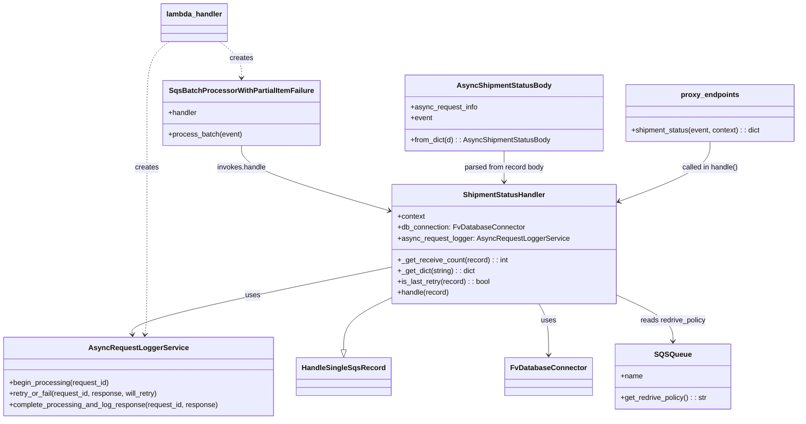
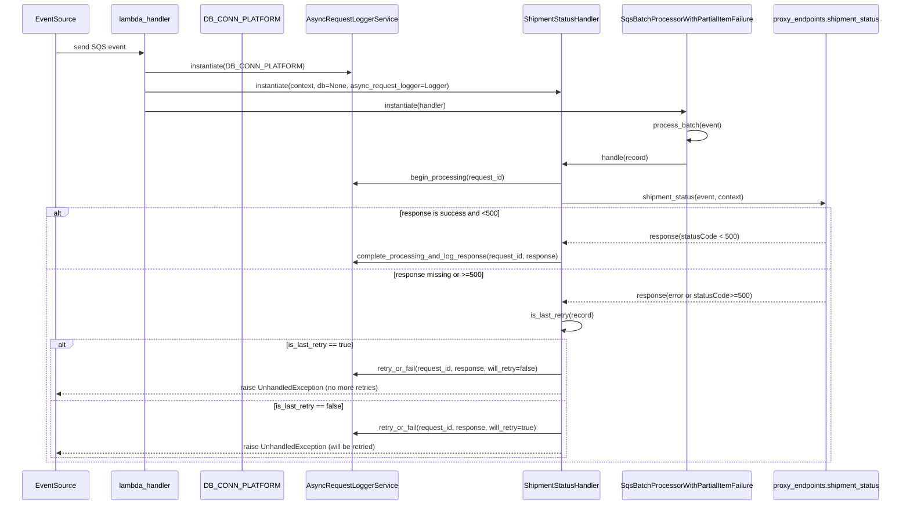

# Diagram: shipment_core/shipment_service/shipment_service/proxy_endpoints/proxy_shipment_status_subscriber.py

> Auto-generated by Obscura crawlers

## Diagram 1

### SVG

<svg id="container" width="1744.974609375" xmlns="http://www.w3.org/2000/svg" class="classDiagram" height="928" viewBox="0 0 1744.974609375 928" role="graphics-document document" aria-roledescription="class"><g><defs><marker id="container_class-aggregationStart" class="marker aggregation class" refX="18" refY="7" markerWidth="190" markerHeight="240" orient="auto"><path d="M 18,7 L9,13 L1,7 L9,1 Z"></path></marker></defs><defs><marker id="container_class-aggregationEnd" class="marker aggregation class" refX="1" refY="7" markerWidth="20" markerHeight="28" orient="auto"><path d="M 18,7 L9,13 L1,7 L9,1 Z"></path></marker></defs><defs><marker id="container_class-extensionStart" class="marker extension class" refX="18" refY="7" markerWidth="190" markerHeight="240" orient="auto"><path d="M 1,7 L18,13 V 1 Z"></path></marker></defs><defs><marker id="container_class-extensionEnd" class="marker extension class" refX="1" refY="7" markerWidth="20" markerHeight="28" orient="auto"><path d="M 1,1 V 13 L18,7 Z"></path></marker></defs><defs><marker id="container_class-compositionStart" class="marker composition class" refX="18" refY="7" markerWidth="190" markerHeight="240" orient="auto"><path d="M 18,7 L9,13 L1,7 L9,1 Z"></path></marker></defs><defs><marker id="container_class-compositionEnd" class="marker composition class" refX="1" refY="7" markerWidth="20" markerHeight="28" orient="auto"><path d="M 18,7 L9,13 L1,7 L9,1 Z"></path></marker></defs><defs><marker id="container_class-dependencyStart" class="marker dependency class" refX="6" refY="7" markerWidth="190" markerHeight="240" orient="auto"><path d="M 5,7 L9,13 L1,7 L9,1 Z"></path></marker></defs><defs><marker id="container_class-dependencyEnd" class="marker dependency class" refX="13" refY="7" markerWidth="20" markerHeight="28" orient="auto"><path d="M 18,7 L9,13 L14,7 L9,1 Z"></path></marker></defs><defs><marker id="container_class-lollipopStart" class="marker lollipop class" refX="13" refY="7" markerWidth="190" markerHeight="240" orient="auto"><circle stroke="black" fill="transparent" cx="7" cy="7" r="6"></circle></marker></defs><defs><marker id="container_class-lollipopEnd" class="marker lollipop class" refX="1" refY="7" markerWidth="190" markerHeight="240" orient="auto"><circle stroke="black" fill="transparent" cx="7" cy="7" r="6"></circle></marker></defs><g class="root"><g class="clusters"></g><g class="edgePaths"><path d="M852.545,658.104L835.099,666.586C817.652,675.069,782.76,692.035,765.313,711.309C747.867,730.583,747.867,752.167,747.867,762.958L747.867,773.75" id="id_ShipmentStatusHandler_HandleSingleSqsRecord_1" class="edge-thickness-normal edge-pattern-solid relation" style=";;;" data-edge="true" data-et="edge" data-id="id_ShipmentStatusHandler_HandleSingleSqsRecord_1" data-points="W3sieCI6ODUyLjU0NDkyMTg3NSwieSI6NjU4LjEwMzcwODExNTgyMzF9LHsieCI6NzQ3Ljg2NzE4NzUsInkiOjcwOX0seyJ4Ijo3NDcuODY3MTg3NSwieSI6NzkxfV0=" marker-end="url(#container_class-extensionEnd)"></path><path d="M1171.372,672L1174.919,678.167C1178.466,684.333,1185.56,696.667,1189.107,715.5C1192.654,734.333,1192.654,759.667,1192.654,772.333L1192.654,785" id="id_ShipmentStatusHandler_FvDatabaseConnector_2" class="edge-thickness-normal edge-pattern-solid relation" style=";;;" data-edge="true" data-et="edge" data-id="id_ShipmentStatusHandler_FvDatabaseConnector_2" data-points="W3sieCI6MTE3MS4zNzIyODQxMTYxMjQzLCJ5Ijo2NzJ9LHsieCI6MTE5Mi42NTQyOTY4NzUsInkiOjcwOX0seyJ4IjoxMTkyLjY1NDI5Njg3NSwieSI6NzkxfV0=" marker-end="url(#container_class-dependencyEnd)"></path><path d="M852.545,590.661L757.979,610.384C663.413,630.107,474.281,669.554,380.476,694.454C286.672,719.355,288.196,729.709,288.958,734.887L289.719,740.064" id="id_ShipmentStatusHandler_AsyncRequestLoggerService_3" class="edge-thickness-normal edge-pattern-solid relation" style=";;;" data-edge="true" data-et="edge" data-id="id_ShipmentStatusHandler_AsyncRequestLoggerService_3" data-points="W3sieCI6ODUyLjU0NDkyMTg3NSwieSI6NTkwLjY2MDkzNDc5MjA5M30seyJ4IjoyODUuMTQ4NDM3NSwieSI6NzA5fSx7IngiOjI5MC41OTI4MzY0NDE1MzIyNiwieSI6NzQ2fV0=" marker-end="url(#container_class-dependencyEnd)"></path><path d="M1338.35,652.308L1358.785,661.757C1379.221,671.206,1420.092,690.103,1440.527,707.218C1460.963,724.333,1460.963,739.667,1460.963,747.333L1460.963,755" id="id_ShipmentStatusHandler_SQSQueue_4" class="edge-thickness-normal edge-pattern-solid relation" style=";;;" data-edge="true" data-et="edge" data-id="id_ShipmentStatusHandler_SQSQueue_4" data-points="W3sieCI6MTMzOC4zNDk2MDkzNzUsInkiOjY1Mi4zMDg0NTc2NTgyNzM4fSx7IngiOjE0NjAuOTYyODkwNjI1LCJ5Ijo3MDl9LHsieCI6MTQ2MC45NjI4OTA2MjUsInkiOjc2MX1d" marker-end="url(#container_class-dependencyEnd)"></path><path d="M525.719,322L525.719,330.167C525.719,338.333,525.719,354.667,579.231,378.707C632.743,402.747,739.768,434.494,793.28,450.367L846.793,466.241" id="id_SqsBatchProcessorWithPartialItemFailure_ShipmentStatusHandler_5" class="edge-thickness-normal edge-pattern-solid relation" style=";;;" data-edge="true" data-et="edge" data-id="id_SqsBatchProcessorWithPartialItemFailure_ShipmentStatusHandler_5" data-points="W3sieCI6NTI1LjcxODc1LCJ5IjozMjJ9LHsieCI6NTI1LjcxODc1LCJ5IjozNzF9LHsieCI6ODUyLjU0NDkyMTg3NSwieSI6NDY3Ljk0NzI2NzkyMTYwNDYzfV0=" marker-end="url(#container_class-dependencyEnd)"></path><path d="M369.431,92L361.466,98.167C353.501,104.333,337.571,116.667,329.606,143C321.641,169.333,321.641,209.667,321.641,250C321.641,290.333,321.641,330.667,321.641,379C321.641,427.333,321.641,483.667,321.641,540C321.641,596.333,321.641,652.667,320.879,686.011C320.117,719.355,318.593,729.709,317.832,734.887L317.07,740.064" id="id_lambda_handler_AsyncRequestLoggerService_6" class="edge-thickness-normal edge-pattern-dashed relation" style=";;;" data-edge="true" data-et="edge" data-id="id_lambda_handler_AsyncRequestLoggerService_6" data-points="W3sieCI6MzY5LjQzMTA3MTk5MzY3MDksInkiOjkyfSx7IngiOjMyMS42NDA2MjUsInkiOjEyOX0seyJ4IjozMjEuNjQwNjI1LCJ5IjoyNTB9LHsieCI6MzIxLjY0MDYyNSwieSI6MzcxfSx7IngiOjMyMS42NDA2MjUsInkiOjU0MH0seyJ4IjozMjEuNjQwNjI1LCJ5Ijo3MDl9LHsieCI6MzE2LjE5NjIyNjA1ODQ2Nzc0LCJ5Ijo3NDZ9XQ==" marker-end="url(#container_class-dependencyEnd)"></path><path d="M477.928,92L485.893,98.167C493.858,104.333,509.789,116.667,517.754,130C525.719,143.333,525.719,157.667,525.719,164.833L525.719,172" id="id_lambda_handler_SqsBatchProcessorWithPartialItemFailure_7" class="edge-thickness-normal edge-pattern-dashed relation" style=";;;" data-edge="true" data-et="edge" data-id="id_lambda_handler_SqsBatchProcessorWithPartialItemFailure_7" data-points="W3sieCI6NDc3LjkyODMwMzAwNjMyOTEsInkiOjkyfSx7IngiOjUyNS43MTg3NSwieSI6MTI5fSx7IngiOjUyNS43MTg3NSwieSI6MTc4fV0=" marker-end="url(#container_class-dependencyEnd)"></path><path d="M1095.447,334L1095.447,340.167C1095.447,346.333,1095.447,358.667,1095.447,370C1095.447,381.333,1095.447,391.667,1095.447,396.833L1095.447,402" id="id_AsyncShipmentStatusBody_ShipmentStatusHandler_8" class="edge-thickness-normal edge-pattern-solid relation" style=";;;" data-edge="true" data-et="edge" data-id="id_AsyncShipmentStatusBody_ShipmentStatusHandler_8" data-points="W3sieCI6MTA5NS40NDcyNjU2MjUsInkiOjMzNH0seyJ4IjoxMDk1LjQ0NzI2NTYyNSwieSI6MzcxfSx7IngiOjEwOTUuNDQ3MjY1NjI1LCJ5Ijo0MDh9XQ==" marker-end="url(#container_class-dependencyEnd)"></path><path d="M1549.459,313L1549.459,322.667C1549.459,332.333,1549.459,351.667,1515.211,374.082C1480.964,396.497,1412.468,421.993,1378.22,434.741L1343.973,447.49" id="id_proxy_endpoints_ShipmentStatusHandler_9" class="edge-thickness-normal edge-pattern-solid relation" style=";;;" data-edge="true" data-et="edge" data-id="id_proxy_endpoints_ShipmentStatusHandler_9" data-points="W3sieCI6MTU0OS40NTg5ODQzNzUsInkiOjMxM30seyJ4IjoxNTQ5LjQ1ODk4NDM3NSwieSI6MzcxfSx7IngiOjEzMzguMzQ5NjA5Mzc1LCJ5Ijo0NDkuNTgyNzM4OTUwNTAyMDZ9XQ==" marker-end="url(#container_class-dependencyEnd)"></path></g><g class="edgeLabels"><g class="edgeLabel"><g class="label" data-id="id_ShipmentStatusHandler_HandleSingleSqsRecord_1" transform="translate(0, 0)"><foreignObject width="0" height="0">

</foreignObject></g></g><g class="edgeLabel" transform="translate(1192.654296875, 709)"><g class="label" data-id="id_ShipmentStatusHandler_FvDatabaseConnector_2" transform="translate(-16.4921875, -12)"><foreignObject width="32.984375" height="24">

uses

</foreignObject></g></g><g class="edgeLabel" transform="translate(550.54137, 653.64832)"><g class="label" data-id="id_ShipmentStatusHandler_AsyncRequestLoggerService_3" transform="translate(-16.4921875, -12)"><foreignObject width="32.984375" height="24">

uses

</foreignObject></g></g><g class="edgeLabel" transform="translate(1460.962890625, 709)"><g class="label" data-id="id_ShipmentStatusHandler_SQSQueue_4" transform="translate(-73.5078125, -12)"><foreignObject width="147.015625" height="24">

reads redrive_policy

</foreignObject></g></g><g class="edgeLabel" transform="translate(525.71875, 371)"><g class="label" data-id="id_SqsBatchProcessorWithPartialItemFailure_ShipmentStatusHandler_5" transform="translate(-54.6875, -12)"><foreignObject width="109.375" height="24">

invokes.handle

</foreignObject></g></g><g class="edgeLabel" transform="translate(321.640625, 371)"><g class="label" data-id="id_lambda_handler_AsyncRequestLoggerService_6" transform="translate(-26.171875, -12)"><foreignObject width="52.34375" height="24">

creates

</foreignObject></g></g><g class="edgeLabel" transform="translate(525.71875, 129)"><g class="label" data-id="id_lambda_handler_SqsBatchProcessorWithPartialItemFailure_7" transform="translate(-26.171875, -12)"><foreignObject width="52.34375" height="24">

creates

</foreignObject></g></g><g class="edgeLabel" transform="translate(1095.447265625, 371)"><g class="label" data-id="id_AsyncShipmentStatusBody_ShipmentStatusHandler_8" transform="translate(-89.609375, -12)"><foreignObject width="179.21875" height="24">

parsed from record body

</foreignObject></g></g><g class="edgeLabel" transform="translate(1549.458984375, 371)"><g class="label" data-id="id_proxy_endpoints_ShipmentStatusHandler_9" transform="translate(-63.359375, -12)"><foreignObject width="126.71875" height="24">

called in handle()

</foreignObject></g></g></g><g class="nodes"><g class="node default" id="classId-ShipmentStatusHandler-0" transform="translate(1095.447265625, 540)"><g class="basic label-container"><path d="M-242.90234375 -132 L242.90234375 -132 L242.90234375 132 L-242.90234375 132" stroke="none" stroke-width="0" fill="#ECECFF" style=""></path><path d="M-242.90234375 -132 C-64.25713674170933 -132, 114.38807026658134 -132, 242.90234375 -132 M-242.90234375 -132 C-132.52291316131345 -132, -22.14348257262688 -132, 242.90234375 -132 M242.90234375 -132 C242.90234375 -72.67967026123165, 242.90234375 -13.359340522463313, 242.90234375 132 M242.90234375 -132 C242.90234375 -78.40347056806328, 242.90234375 -24.806941136126568, 242.90234375 132 M242.90234375 132 C123.15817275373225 132, 3.41400175746449 132, -242.90234375 132 M242.90234375 132 C49.71431941993421 132, -143.47370491013157 132, -242.90234375 132 M-242.90234375 132 C-242.90234375 44.32149396015028, -242.90234375 -43.357012079699444, -242.90234375 -132 M-242.90234375 132 C-242.90234375 53.97526207500505, -242.90234375 -24.049475849989904, -242.90234375 -132" stroke="#9370DB" stroke-width="1.3" fill="none" stroke-dasharray="0 0" style=""></path></g><g class="annotation-group text" transform="translate(0, -108)"></g><g class="label-group text" transform="translate(-87.6796875, -108)"><g class="label" style="font-weight: bolder" transform="translate(0,-12)"><foreignObject width="175.359375" height="24">

ShipmentStatusHandler

</foreignObject></g></g><g class="members-group text" transform="translate(-230.90234375, -60)"><g class="label" style="" transform="translate(0,-12)"><foreignObject width="61.6875" height="24">

+context

</foreignObject></g><g class="label" style="" transform="translate(0,12)"><foreignObject width="280.25" height="24">

+db_connection: FvDatabaseConnector

</foreignObject></g><g class="label" style="" transform="translate(0,36)"><foreignObject width="374.125" height="24">

+async_request_logger: AsyncRequestLoggerService

</foreignObject></g></g><g class="methods-group text" transform="translate(-230.90234375, 36)"><g class="label" style="" transform="translate(0,-12)"><foreignObject width="243.15625" height="24">

+_get_receive_count(record) : : int

</foreignObject></g><g class="label" style="" transform="translate(0,12)"><foreignObject width="173.140625" height="24">

+_get_dict(string) : : dict

</foreignObject></g><g class="label" style="" transform="translate(0,36)"><foreignObject width="206.78125" height="24">

+is_last_retry(record) : : bool

</foreignObject></g><g class="label" style="" transform="translate(0,60)"><foreignObject width="115.0625" height="24">

+handle(record)

</foreignObject></g></g><g class="divider" style=""><path d="M-242.90234375 -84 C-128.1972774326859 -84, -13.492211115371788 -84, 242.90234375 -84 M-242.90234375 -84 C-137.01180759357337 -84, -31.12127143714673 -84, 242.90234375 -84" stroke="#9370DB" stroke-width="1.3" fill="none" stroke-dasharray="0 0" style=""></path></g><g class="divider" style=""><path d="M-242.90234375 12 C-118.91773214953348 12, 5.066879450933044 12, 242.90234375 12 M-242.90234375 12 C-51.426302739318004 12, 140.049738271364 12, 242.90234375 12" stroke="#9370DB" stroke-width="1.3" fill="none" stroke-dasharray="0 0" style=""></path></g></g><g class="node default" id="classId-HandleSingleSqsRecord-1" transform="translate(747.8671875, 833)"><g class="basic label-container"><path d="M-99.078125 -42 L99.078125 -42 L99.078125 42 L-99.078125 42" stroke="none" stroke-width="0" fill="#ECECFF" style=""></path><path d="M-99.078125 -42 C-41.0413975167303 -42, 16.9953299665394 -42, 99.078125 -42 M-99.078125 -42 C-27.54878509907755 -42, 43.9805548018449 -42, 99.078125 -42 M99.078125 -42 C99.078125 -18.27972431931139, 99.078125 5.440551361377217, 99.078125 42 M99.078125 -42 C99.078125 -12.809216256253347, 99.078125 16.381567487493307, 99.078125 42 M99.078125 42 C54.66701312995453 42, 10.255901259909066 42, -99.078125 42 M99.078125 42 C28.271205181173357 42, -42.535714637653285 42, -99.078125 42 M-99.078125 42 C-99.078125 23.65690273109039, -99.078125 5.313805462180781, -99.078125 -42 M-99.078125 42 C-99.078125 23.656454138179523, -99.078125 5.312908276359046, -99.078125 -42" stroke="#9370DB" stroke-width="1.3" fill="none" stroke-dasharray="0 0" style=""></path></g><g class="annotation-group text" transform="translate(0, -18)"></g><g class="label-group text" transform="translate(-87.078125, -18)"><g class="label" style="font-weight: bolder" transform="translate(0,-12)"><foreignObject width="174.15625" height="24">

HandleSingleSqsRecord

</foreignObject></g></g><g class="members-group text" transform="translate(-87.078125, 30)"></g><g class="methods-group text" transform="translate(-87.078125, 60)"></g><g class="divider" style=""><path d="M-99.078125 6 C-58.01742934747078 6, -16.956733694941562 6, 99.078125 6 M-99.078125 6 C-25.888920575613867 6, 47.30028384877227 6, 99.078125 6" stroke="#9370DB" stroke-width="1.3" fill="none" stroke-dasharray="0 0" style=""></path></g><g class="divider" style=""><path d="M-99.078125 24 C-46.28042651993594 24, 6.517271960128113 24, 99.078125 24 M-99.078125 24 C-48.738901856634584 24, 1.600321286730832 24, 99.078125 24" stroke="#9370DB" stroke-width="1.3" fill="none" stroke-dasharray="0 0" style=""></path></g></g><g class="node default" id="classId-SQSQueue-2" transform="translate(1460.962890625, 833)"><g class="basic label-container"><path d="M-127.00390625 -72 L127.00390625 -72 L127.00390625 72 L-127.00390625 72" stroke="none" stroke-width="0" fill="#ECECFF" style=""></path><path d="M-127.00390625 -72 C-47.19772441207671 -72, 32.60845742584658 -72, 127.00390625 -72 M-127.00390625 -72 C-42.763848928806794 -72, 41.47620839238641 -72, 127.00390625 -72 M127.00390625 -72 C127.00390625 -25.136139013024817, 127.00390625 21.727721973950366, 127.00390625 72 M127.00390625 -72 C127.00390625 -32.99104934406206, 127.00390625 6.017901311875875, 127.00390625 72 M127.00390625 72 C39.062504869910995 72, -48.87889651017801 72, -127.00390625 72 M127.00390625 72 C41.89402401747664 72, -43.21585821504672 72, -127.00390625 72 M-127.00390625 72 C-127.00390625 43.16647481843772, -127.00390625 14.33294963687544, -127.00390625 -72 M-127.00390625 72 C-127.00390625 20.842771671132923, -127.00390625 -30.314456657734155, -127.00390625 -72" stroke="#9370DB" stroke-width="1.3" fill="none" stroke-dasharray="0 0" style=""></path></g><g class="annotation-group text" transform="translate(0, -48)"></g><g class="label-group text" transform="translate(-38.1796875, -48)"><g class="label" style="font-weight: bolder" transform="translate(0,-12)"><foreignObject width="76.359375" height="24">

SQSQueue

</foreignObject></g></g><g class="members-group text" transform="translate(-115.00390625, 0)"><g class="label" style="" transform="translate(0,-12)"><foreignObject width="48.5" height="24">

+name

</foreignObject></g></g><g class="methods-group text" transform="translate(-115.00390625, 48)"><g class="label" style="" transform="translate(0,-12)"><foreignObject width="191.828125" height="24">

+get_redrive_policy() : : str

</foreignObject></g></g><g class="divider" style=""><path d="M-127.00390625 -24 C-67.44286338928578 -24, -7.881820528571538 -24, 127.00390625 -24 M-127.00390625 -24 C-61.31592145128293 -24, 4.3720633474341355 -24, 127.00390625 -24" stroke="#9370DB" stroke-width="1.3" fill="none" stroke-dasharray="0 0" style=""></path></g><g class="divider" style=""><path d="M-127.00390625 24 C-35.041441758846275 24, 56.92102273230745 24, 127.00390625 24 M-127.00390625 24 C-72.86159453021918 24, -18.719282810438372 24, 127.00390625 24" stroke="#9370DB" stroke-width="1.3" fill="none" stroke-dasharray="0 0" style=""></path></g></g><g class="node default" id="classId-FvDatabaseConnector-3" transform="translate(1192.654296875, 833)"><g class="basic label-container"><path d="M-91.3046875 -42 L91.3046875 -42 L91.3046875 42 L-91.3046875 42" stroke="none" stroke-width="0" fill="#ECECFF" style=""></path><path d="M-91.3046875 -42 C-49.98686656433724 -42, -8.669045628674482 -42, 91.3046875 -42 M-91.3046875 -42 C-52.772160248932124 -42, -14.239632997864248 -42, 91.3046875 -42 M91.3046875 -42 C91.3046875 -20.403549593717972, 91.3046875 1.192900812564055, 91.3046875 42 M91.3046875 -42 C91.3046875 -9.182112364815517, 91.3046875 23.635775270368967, 91.3046875 42 M91.3046875 42 C45.11339191339404 42, -1.077903673211921 42, -91.3046875 42 M91.3046875 42 C21.596972827764688 42, -48.110741844470624 42, -91.3046875 42 M-91.3046875 42 C-91.3046875 8.758995836767276, -91.3046875 -24.482008326465447, -91.3046875 -42 M-91.3046875 42 C-91.3046875 20.960728711266274, -91.3046875 -0.07854257746745219, -91.3046875 -42" stroke="#9370DB" stroke-width="1.3" fill="none" stroke-dasharray="0 0" style=""></path></g><g class="annotation-group text" transform="translate(0, -18)"></g><g class="label-group text" transform="translate(-79.3046875, -18)"><g class="label" style="font-weight: bolder" transform="translate(0,-12)"><foreignObject width="158.609375" height="24">

FvDatabaseConnector

</foreignObject></g></g><g class="members-group text" transform="translate(-79.3046875, 30)"></g><g class="methods-group text" transform="translate(-79.3046875, 60)"></g><g class="divider" style=""><path d="M-91.3046875 6 C-44.22616193190541 6, 2.8523636361891818 6, 91.3046875 6 M-91.3046875 6 C-29.878108118918178 6, 31.548471262163645 6, 91.3046875 6" stroke="#9370DB" stroke-width="1.3" fill="none" stroke-dasharray="0 0" style=""></path></g><g class="divider" style=""><path d="M-91.3046875 24 C-44.672961616610586 24, 1.9587642667788288 24, 91.3046875 24 M-91.3046875 24 C-24.865584188357545 24, 41.57351912328491 24, 91.3046875 24" stroke="#9370DB" stroke-width="1.3" fill="none" stroke-dasharray="0 0" style=""></path></g></g><g class="node default" id="classId-AsyncRequestLoggerService-4" transform="translate(303.39453125, 833)"><g class="basic label-container"><path d="M-295.39453125 -87 L295.39453125 -87 L295.39453125 87 L-295.39453125 87" stroke="none" stroke-width="0" fill="#ECECFF" style=""></path><path d="M-295.39453125 -87 C-82.72765238986364 -87, 129.93922647027273 -87, 295.39453125 -87 M-295.39453125 -87 C-111.24808592702732 -87, 72.89835939594536 -87, 295.39453125 -87 M295.39453125 -87 C295.39453125 -50.955081415011676, 295.39453125 -14.910162830023353, 295.39453125 87 M295.39453125 -87 C295.39453125 -22.701617461508974, 295.39453125 41.59676507698205, 295.39453125 87 M295.39453125 87 C93.77467418868983 87, -107.84518287262034 87, -295.39453125 87 M295.39453125 87 C149.1051562599687 87, 2.8157812699374176 87, -295.39453125 87 M-295.39453125 87 C-295.39453125 52.149226117806975, -295.39453125 17.29845223561395, -295.39453125 -87 M-295.39453125 87 C-295.39453125 36.25674847020531, -295.39453125 -14.486503059589381, -295.39453125 -87" stroke="#9370DB" stroke-width="1.3" fill="none" stroke-dasharray="0 0" style=""></path></g><g class="annotation-group text" transform="translate(0, -63)"></g><g class="label-group text" transform="translate(-102.4921875, -63)"><g class="label" style="font-weight: bolder" transform="translate(0,-12)"><foreignObject width="204.984375" height="24">

AsyncRequestLoggerService

</foreignObject></g></g><g class="members-group text" transform="translate(-283.39453125, -15)"></g><g class="methods-group text" transform="translate(-283.39453125, 15)"><g class="label" style="" transform="translate(0,-12)"><foreignObject width="222.359375" height="24">

+begin_processing(request_id)

</foreignObject></g><g class="label" style="" transform="translate(0,12)"><foreignObject width="333.15625" height="24">

+retry_or_fail(request_id, response, will_retry)

</foreignObject></g><g class="label" style="" transform="translate(0,36)"><foreignObject width="464.296875" height="24">

+complete_processing_and_log_response(request_id, response)

</foreignObject></g></g><g class="divider" style=""><path d="M-295.39453125 -39 C-91.50763260201438 -39, 112.37926604597124 -39, 295.39453125 -39 M-295.39453125 -39 C-148.61672487875182 -39, -1.8389185075036494 -39, 295.39453125 -39" stroke="#9370DB" stroke-width="1.3" fill="none" stroke-dasharray="0 0" style=""></path></g><g class="divider" style=""><path d="M-295.39453125 -15 C-105.12599772837211 -15, 85.14253579325577 -15, 295.39453125 -15 M-295.39453125 -15 C-176.69150948202991 -15, -57.9884877140598 -15, 295.39453125 -15" stroke="#9370DB" stroke-width="1.3" fill="none" stroke-dasharray="0 0" style=""></path></g></g><g class="node default" id="classId-SqsBatchProcessorWithPartialItemFailure-5" transform="translate(525.71875, 250)"><g class="basic label-container"><path d="M-169.078125 -72 L169.078125 -72 L169.078125 72 L-169.078125 72" stroke="none" stroke-width="0" fill="#ECECFF" style=""></path><path d="M-169.078125 -72 C-34.17060649632077 -72, 100.73691200735846 -72, 169.078125 -72 M-169.078125 -72 C-54.105486484234376 -72, 60.86715203153125 -72, 169.078125 -72 M169.078125 -72 C169.078125 -15.440575243811146, 169.078125 41.11884951237771, 169.078125 72 M169.078125 -72 C169.078125 -14.69497437835016, 169.078125 42.61005124329968, 169.078125 72 M169.078125 72 C41.84276787671877 72, -85.39258924656247 72, -169.078125 72 M169.078125 72 C54.153483873212494 72, -60.77115725357501 72, -169.078125 72 M-169.078125 72 C-169.078125 29.461620976105436, -169.078125 -13.076758047789127, -169.078125 -72 M-169.078125 72 C-169.078125 41.09010938189479, -169.078125 10.180218763789583, -169.078125 -72" stroke="#9370DB" stroke-width="1.3" fill="none" stroke-dasharray="0 0" style=""></path></g><g class="annotation-group text" transform="translate(0, -48)"></g><g class="label-group text" transform="translate(-151.46875, -48)"><g class="label" style="font-weight: bolder" transform="translate(0,-12)"><foreignObject width="302.9375" height="24">

SqsBatchProcessorWithPartialItemFailure

</foreignObject></g></g><g class="members-group text" transform="translate(-157.078125, 0)"><g class="label" style="" transform="translate(0,-12)"><foreignObject width="64.515625" height="24">

+handler

</foreignObject></g></g><g class="methods-group text" transform="translate(-157.078125, 48)"><g class="label" style="" transform="translate(0,-12)"><foreignObject width="162.6875" height="24">

+process_batch(event)

</foreignObject></g></g><g class="divider" style=""><path d="M-169.078125 -24 C-89.21516563386737 -24, -9.352206267734744 -24, 169.078125 -24 M-169.078125 -24 C-89.90378472839694 -24, -10.729444456793885 -24, 169.078125 -24" stroke="#9370DB" stroke-width="1.3" fill="none" stroke-dasharray="0 0" style=""></path></g><g class="divider" style=""><path d="M-169.078125 24 C-38.399962621560576 24, 92.27819975687885 24, 169.078125 24 M-169.078125 24 C-65.82205089971266 24, 37.43402320057467 24, 169.078125 24" stroke="#9370DB" stroke-width="1.3" fill="none" stroke-dasharray="0 0" style=""></path></g></g><g class="node default" id="classId-AsyncShipmentStatusBody-6" transform="translate(1095.447265625, 250)"><g class="basic label-container"><path d="M-216.49609375 -84 L216.49609375 -84 L216.49609375 84 L-216.49609375 84" stroke="none" stroke-width="0" fill="#ECECFF" style=""></path><path d="M-216.49609375 -84 C-86.5960088459679 -84, 43.3040760580642 -84, 216.49609375 -84 M-216.49609375 -84 C-108.68218812328678 -84, -0.8682824965735563 -84, 216.49609375 -84 M216.49609375 -84 C216.49609375 -47.382680538865614, 216.49609375 -10.765361077731228, 216.49609375 84 M216.49609375 -84 C216.49609375 -29.0804489996127, 216.49609375 25.839102000774602, 216.49609375 84 M216.49609375 84 C115.53033439810179 84, 14.564575046203572 84, -216.49609375 84 M216.49609375 84 C71.94475079427943 84, -72.60659216144114 84, -216.49609375 84 M-216.49609375 84 C-216.49609375 33.937456009833404, -216.49609375 -16.12508798033319, -216.49609375 -84 M-216.49609375 84 C-216.49609375 47.501421509015096, -216.49609375 11.002843018030191, -216.49609375 -84" stroke="#9370DB" stroke-width="1.3" fill="none" stroke-dasharray="0 0" style=""></path></g><g class="annotation-group text" transform="translate(0, -60)"></g><g class="label-group text" transform="translate(-98.1640625, -60)"><g class="label" style="font-weight: bolder" transform="translate(0,-12)"><foreignObject width="196.328125" height="24">

AsyncShipmentStatusBody

</foreignObject></g></g><g class="members-group text" transform="translate(-204.49609375, -12)"><g class="label" style="" transform="translate(0,-12)"><foreignObject width="148.734375" height="24">

+async_request_info

</foreignObject></g><g class="label" style="" transform="translate(0,12)"><foreignObject width="48.328125" height="24">

+event

</foreignObject></g></g><g class="methods-group text" transform="translate(-204.49609375, 60)"><g class="label" style="" transform="translate(0,-12)"><foreignObject width="310.828125" height="24">

+from_dict(d) : : AsyncShipmentStatusBody

</foreignObject></g></g><g class="divider" style=""><path d="M-216.49609375 -36 C-97.77486562666765 -36, 20.946362496664705 -36, 216.49609375 -36 M-216.49609375 -36 C-86.1351994453697 -36, 44.225694859260614 -36, 216.49609375 -36" stroke="#9370DB" stroke-width="1.3" fill="none" stroke-dasharray="0 0" style=""></path></g><g class="divider" style=""><path d="M-216.49609375 36 C-60.30800306102461 36, 95.88008762795079 36, 216.49609375 36 M-216.49609375 36 C-72.74997378464337 36, 70.99614618071325 36, 216.49609375 36" stroke="#9370DB" stroke-width="1.3" fill="none" stroke-dasharray="0 0" style=""></path></g></g><g class="node default" id="classId-proxy_endpoints-7" transform="translate(1549.458984375, 250)"><g class="basic label-container"><path d="M-187.515625 -63 L187.515625 -63 L187.515625 63 L-187.515625 63" stroke="none" stroke-width="0" fill="#ECECFF" style=""></path><path d="M-187.515625 -63 C-101.89445491273096 -63, -16.27328482546193 -63, 187.515625 -63 M-187.515625 -63 C-79.20284765446411 -63, 29.109929691071784 -63, 187.515625 -63 M187.515625 -63 C187.515625 -23.271709838468105, 187.515625 16.45658032306379, 187.515625 63 M187.515625 -63 C187.515625 -35.424372304076314, 187.515625 -7.8487446081526215, 187.515625 63 M187.515625 63 C54.24595904457817 63, -79.02370691084366 63, -187.515625 63 M187.515625 63 C50.39912285131308 63, -86.71737929737384 63, -187.515625 63 M-187.515625 63 C-187.515625 31.74612358638626, -187.515625 0.4922471727725224, -187.515625 -63 M-187.515625 63 C-187.515625 34.80154756022161, -187.515625 6.603095120443221, -187.515625 -63" stroke="#9370DB" stroke-width="1.3" fill="none" stroke-dasharray="0 0" style=""></path></g><g class="annotation-group text" transform="translate(0, -39)"></g><g class="label-group text" transform="translate(-61.421875, -39)"><g class="label" style="font-weight: bolder" transform="translate(0,-12)"><foreignObject width="122.84375" height="24">

proxy_endpoints

</foreignObject></g></g><g class="members-group text" transform="translate(-175.515625, 9)"></g><g class="methods-group text" transform="translate(-175.515625, 39)"><g class="label" style="" transform="translate(0,-12)"><foreignObject width="289.609375" height="24">

+shipment_status(event, context) : : dict

</foreignObject></g></g><g class="divider" style=""><path d="M-187.515625 -15 C-68.61793308221486 -15, 50.27975883557028 -15, 187.515625 -15 M-187.515625 -15 C-37.824467501253594 -15, 111.86668999749281 -15, 187.515625 -15" stroke="#9370DB" stroke-width="1.3" fill="none" stroke-dasharray="0 0" style=""></path></g><g class="divider" style=""><path d="M-187.515625 9 C-66.23344811052642 9, 55.04872877894715 9, 187.515625 9 M-187.515625 9 C-38.30247725074494 9, 110.91067049851011 9, 187.515625 9" stroke="#9370DB" stroke-width="1.3" fill="none" stroke-dasharray="0 0" style=""></path></g></g><g class="node default" id="classId-lambda_handler-8" transform="translate(423.6796875, 50)"><g class="basic label-container"><path d="M-71.9765625 -42 L71.9765625 -42 L71.9765625 42 L-71.9765625 42" stroke="none" stroke-width="0" fill="#ECECFF" style=""></path><path d="M-71.9765625 -42 C-35.968597260780555 -42, 0.039367978438889395 -42, 71.9765625 -42 M-71.9765625 -42 C-33.74017374849293 -42, 4.496215003014143 -42, 71.9765625 -42 M71.9765625 -42 C71.9765625 -11.312242137234787, 71.9765625 19.375515725530427, 71.9765625 42 M71.9765625 -42 C71.9765625 -9.384557275455755, 71.9765625 23.23088544908849, 71.9765625 42 M71.9765625 42 C35.35074655154786 42, -1.2750693969042857 42, -71.9765625 42 M71.9765625 42 C38.26972159776739 42, 4.562880695534787 42, -71.9765625 42 M-71.9765625 42 C-71.9765625 18.76045585481062, -71.9765625 -4.479088290378762, -71.9765625 -42 M-71.9765625 42 C-71.9765625 11.4776117995603, -71.9765625 -19.0447764008794, -71.9765625 -42" stroke="#9370DB" stroke-width="1.3" fill="none" stroke-dasharray="0 0" style=""></path></g><g class="annotation-group text" transform="translate(0, -18)"></g><g class="label-group text" transform="translate(-59.9765625, -18)"><g class="label" style="font-weight: bolder" transform="translate(0,-12)"><foreignObject width="119.953125" height="24">

lambda_handler

</foreignObject></g></g><g class="members-group text" transform="translate(-59.9765625, 30)"></g><g class="methods-group text" transform="translate(-59.9765625, 60)"></g><g class="divider" style=""><path d="M-71.9765625 6 C-27.80030974190022 6, 16.375943016199557 6, 71.9765625 6 M-71.9765625 6 C-19.01342657822348 6, 33.94970934355304 6, 71.9765625 6" stroke="#9370DB" stroke-width="1.3" fill="none" stroke-dasharray="0 0" style=""></path></g><g class="divider" style=""><path d="M-71.9765625 24 C-34.52029442654244 24, 2.935973646915116 24, 71.9765625 24 M-71.9765625 24 C-23.207928007205545 24, 25.56070648558891 24, 71.9765625 24" stroke="#9370DB" stroke-width="1.3" fill="none" stroke-dasharray="0 0" style=""></path></g></g></g></g></g></svg>

## Diagram 2

### SVG

<svg id="container" width="2139.5" xmlns="http://www.w3.org/2000/svg" height="1199" viewBox="-50 -10 2139.5 1199" role="graphics-document document" aria-roledescription="sequence"><g><rect x="1773.5" y="1113" fill="#eaeaea" stroke="#666" width="266" height="65" name="Proxy" rx="3" ry="3" class="actor actor-bottom"></rect><text x="1906.5" y="1145.5" dominant-baseline="central" alignment-baseline="central" class="actor actor-box" style="text-anchor: middle; font-size: 16px; font-weight: 400;"><tspan x="1906.5" dy="0">proxy_endpoints.shipment_status</tspan></text></g><g><rect x="1405.5" y="1113" fill="#eaeaea" stroke="#666" width="318" height="65" name="BatchProc" rx="3" ry="3" class="actor actor-bottom"></rect><text x="1564.5" y="1145.5" dominant-baseline="central" alignment-baseline="central" class="actor actor-box" style="text-anchor: middle; font-size: 16px; font-weight: 400;"><tspan x="1564.5" dy="0">SqsBatchProcessorWithPartialItemFailure</tspan></text></g><g><rect x="1161.5" y="1113" fill="#eaeaea" stroke="#666" width="194" height="65" name="Handler" rx="3" ry="3" class="actor actor-bottom"></rect><text x="1258.5" y="1145.5" dominant-baseline="central" alignment-baseline="central" class="actor actor-box" style="text-anchor: middle; font-size: 16px; font-weight: 400;"><tspan x="1258.5" dy="0">ShipmentStatusHandler</tspan></text></g><g><rect x="622" y="1113" fill="#eaeaea" stroke="#666" width="221" height="65" name="Logger" rx="3" ry="3" class="actor actor-bottom"></rect><text x="732.5" y="1145.5" dominant-baseline="central" alignment-baseline="central" class="actor actor-box" style="text-anchor: middle; font-size: 16px; font-weight: 400;"><tspan x="732.5" dy="0">AsyncRequestLoggerService</tspan></text></g><g><rect x="400" y="1113" fill="#eaeaea" stroke="#666" width="172" height="65" name="DB" rx="3" ry="3" class="actor actor-bottom"></rect><text x="486" y="1145.5" dominant-baseline="central" alignment-baseline="central" class="actor actor-box" style="text-anchor: middle; font-size: 16px; font-weight: 400;"><tspan x="486" dy="0">DB_CONN_PLATFORM</tspan></text></g><g><rect x="200" y="1113" fill="#eaeaea" stroke="#666" width="150" height="65" name="Lambda" rx="3" ry="3" class="actor actor-bottom"></rect><text x="275" y="1145.5" dominant-baseline="central" alignment-baseline="central" class="actor actor-box" style="text-anchor: middle; font-size: 16px; font-weight: 400;"><tspan x="275" dy="0">lambda_handler</tspan></text></g><g><rect x="0" y="1113" fill="#eaeaea" stroke="#666" width="150" height="65" name="Client" rx="3" ry="3" class="actor actor-bottom"></rect><text x="75" y="1145.5" dominant-baseline="central" alignment-baseline="central" class="actor actor-box" style="text-anchor: middle; font-size: 16px; font-weight: 400;"><tspan x="75" dy="0">EventSource</tspan></text></g><g><line id="actor6" x1="1906.5" y1="65" x2="1906.5" y2="1113" class="actor-line 200" stroke-width="0.5px" stroke="#999" name="Proxy"></line><g id="root-6"><rect x="1773.5" y="0" fill="#eaeaea" stroke="#666" width="266" height="65" name="Proxy" rx="3" ry="3" class="actor actor-top"></rect><text x="1906.5" y="32.5" dominant-baseline="central" alignment-baseline="central" class="actor actor-box" style="text-anchor: middle; font-size: 16px; font-weight: 400;"><tspan x="1906.5" dy="0">proxy_endpoints.shipment_status</tspan></text></g></g><g><line id="actor5" x1="1564.5" y1="65" x2="1564.5" y2="1113" class="actor-line 200" stroke-width="0.5px" stroke="#999" name="BatchProc"></line><g id="root-5"><rect x="1405.5" y="0" fill="#eaeaea" stroke="#666" width="318" height="65" name="BatchProc" rx="3" ry="3" class="actor actor-top"></rect><text x="1564.5" y="32.5" dominant-baseline="central" alignment-baseline="central" class="actor actor-box" style="text-anchor: middle; font-size: 16px; font-weight: 400;"><tspan x="1564.5" dy="0">SqsBatchProcessorWithPartialItemFailure</tspan></text></g></g><g><line id="actor4" x1="1258.5" y1="65" x2="1258.5" y2="1113" class="actor-line 200" stroke-width="0.5px" stroke="#999" name="Handler"></line><g id="root-4"><rect x="1161.5" y="0" fill="#eaeaea" stroke="#666" width="194" height="65" name="Handler" rx="3" ry="3" class="actor actor-top"></rect><text x="1258.5" y="32.5" dominant-baseline="central" alignment-baseline="central" class="actor actor-box" style="text-anchor: middle; font-size: 16px; font-weight: 400;"><tspan x="1258.5" dy="0">ShipmentStatusHandler</tspan></text></g></g><g><line id="actor3" x1="732.5" y1="65" x2="732.5" y2="1113" class="actor-line 200" stroke-width="0.5px" stroke="#999" name="Logger"></line><g id="root-3"><rect x="622" y="0" fill="#eaeaea" stroke="#666" width="221" height="65" name="Logger" rx="3" ry="3" class="actor actor-top"></rect><text x="732.5" y="32.5" dominant-baseline="central" alignment-baseline="central" class="actor actor-box" style="text-anchor: middle; font-size: 16px; font-weight: 400;"><tspan x="732.5" dy="0">AsyncRequestLoggerService</tspan></text></g></g><g><line id="actor2" x1="486" y1="65" x2="486" y2="1113" class="actor-line 200" stroke-width="0.5px" stroke="#999" name="DB"></line><g id="root-2"><rect x="400" y="0" fill="#eaeaea" stroke="#666" width="172" height="65" name="DB" rx="3" ry="3" class="actor actor-top"></rect><text x="486" y="32.5" dominant-baseline="central" alignment-baseline="central" class="actor actor-box" style="text-anchor: middle; font-size: 16px; font-weight: 400;"><tspan x="486" dy="0">DB_CONN_PLATFORM</tspan></text></g></g><g><line id="actor1" x1="275" y1="65" x2="275" y2="1113" class="actor-line 200" stroke-width="0.5px" stroke="#999" name="Lambda"></line><g id="root-1"><rect x="200" y="0" fill="#eaeaea" stroke="#666" width="150" height="65" name="Lambda" rx="3" ry="3" class="actor actor-top"></rect><text x="275" y="32.5" dominant-baseline="central" alignment-baseline="central" class="actor actor-box" style="text-anchor: middle; font-size: 16px; font-weight: 400;"><tspan x="275" dy="0">lambda_handler</tspan></text></g></g><g><line id="actor0" x1="75" y1="65" x2="75" y2="1113" class="actor-line 200" stroke-width="0.5px" stroke="#999" name="Client"></line><g id="root-0"><rect x="0" y="0" fill="#eaeaea" stroke="#666" width="150" height="65" name="Client" rx="3" ry="3" class="actor actor-top"></rect><text x="75" y="32.5" dominant-baseline="central" alignment-baseline="central" class="actor actor-box" style="text-anchor: middle; font-size: 16px; font-weight: 400;"><tspan x="75" dy="0">EventSource</tspan></text></g></g><g></g><defs><symbol id="computer" width="24" height="24"><path transform="scale(.5)" d="M2 2v13h20v-13h-20zm18 11h-16v-9h16v9zm-10.228 6l.466-1h3.524l.467 1h-4.457zm14.228 3h-24l2-6h2.104l-1.33 4h18.45l-1.297-4h2.073l2 6zm-5-10h-14v-7h14v7z"></path></symbol></defs><defs><symbol id="database" fill-rule="evenodd" clip-rule="evenodd"><path transform="scale(.5)" d="M12.258.001l.256.004.255.005.253.008.251.01.249.012.247.015.246.016.242.019.241.02.239.023.236.024.233.027.231.028.229.031.225.032.223.034.22.036.217.038.214.04.211.041.208.043.205.045.201.046.198.048.194.05.191.051.187.053.183.054.18.056.175.057.172.059.168.06.163.061.16.063.155.064.15.066.074.033.073.033.071.034.07.034.069.035.068.035.067.035.066.035.064.036.064.036.062.036.06.036.06.037.058.037.058.037.055.038.055.038.053.038.052.038.051.039.05.039.048.039.047.039.045.04.044.04.043.04.041.04.04.041.039.041.037.041.036.041.034.041.033.042.032.042.03.042.029.042.027.042.026.043.024.043.023.043.021.043.02.043.018.044.017.043.015.044.013.044.012.044.011.045.009.044.007.045.006.045.004.045.002.045.001.045v17l-.001.045-.002.045-.004.045-.006.045-.007.045-.009.044-.011.045-.012.044-.013.044-.015.044-.017.043-.018.044-.02.043-.021.043-.023.043-.024.043-.026.043-.027.042-.029.042-.03.042-.032.042-.033.042-.034.041-.036.041-.037.041-.039.041-.04.041-.041.04-.043.04-.044.04-.045.04-.047.039-.048.039-.05.039-.051.039-.052.038-.053.038-.055.038-.055.038-.058.037-.058.037-.06.037-.06.036-.062.036-.064.036-.064.036-.066.035-.067.035-.068.035-.069.035-.07.034-.071.034-.073.033-.074.033-.15.066-.155.064-.16.063-.163.061-.168.06-.172.059-.175.057-.18.056-.183.054-.187.053-.191.051-.194.05-.198.048-.201.046-.205.045-.208.043-.211.041-.214.04-.217.038-.22.036-.223.034-.225.032-.229.031-.231.028-.233.027-.236.024-.239.023-.241.02-.242.019-.246.016-.247.015-.249.012-.251.01-.253.008-.255.005-.256.004-.258.001-.258-.001-.256-.004-.255-.005-.253-.008-.251-.01-.249-.012-.247-.015-.245-.016-.243-.019-.241-.02-.238-.023-.236-.024-.234-.027-.231-.028-.228-.031-.226-.032-.223-.034-.22-.036-.217-.038-.214-.04-.211-.041-.208-.043-.204-.045-.201-.046-.198-.048-.195-.05-.19-.051-.187-.053-.184-.054-.179-.056-.176-.057-.172-.059-.167-.06-.164-.061-.159-.063-.155-.064-.151-.066-.074-.033-.072-.033-.072-.034-.07-.034-.069-.035-.068-.035-.067-.035-.066-.035-.064-.036-.063-.036-.062-.036-.061-.036-.06-.037-.058-.037-.057-.037-.056-.038-.055-.038-.053-.038-.052-.038-.051-.039-.049-.039-.049-.039-.046-.039-.046-.04-.044-.04-.043-.04-.041-.04-.04-.041-.039-.041-.037-.041-.036-.041-.034-.041-.033-.042-.032-.042-.03-.042-.029-.042-.027-.042-.026-.043-.024-.043-.023-.043-.021-.043-.02-.043-.018-.044-.017-.043-.015-.044-.013-.044-.012-.044-.011-.045-.009-.044-.007-.045-.006-.045-.004-.045-.002-.045-.001-.045v-17l.001-.045.002-.045.004-.045.006-.045.007-.045.009-.044.011-.045.012-.044.013-.044.015-.044.017-.043.018-.044.02-.043.021-.043.023-.043.024-.043.026-.043.027-.042.029-.042.03-.042.032-.042.033-.042.034-.041.036-.041.037-.041.039-.041.04-.041.041-.04.043-.04.044-.04.046-.04.046-.039.049-.039.049-.039.051-.039.052-.038.053-.038.055-.038.056-.038.057-.037.058-.037.06-.037.061-.036.062-.036.063-.036.064-.036.066-.035.067-.035.068-.035.069-.035.07-.034.072-.034.072-.033.074-.033.151-.066.155-.064.159-.063.164-.061.167-.06.172-.059.176-.057.179-.056.184-.054.187-.053.19-.051.195-.05.198-.048.201-.046.204-.045.208-.043.211-.041.214-.04.217-.038.22-.036.223-.034.226-.032.228-.031.231-.028.234-.027.236-.024.238-.023.241-.02.243-.019.245-.016.247-.015.249-.012.251-.01.253-.008.255-.005.256-.004.258-.001.258.001zm-9.258 20.499v.01l.001.021.003.021.004.022.005.021.006.022.007.022.009.023.01.022.011.023.012.023.013.023.015.023.016.024.017.023.018.024.019.024.021.024.022.025.023.024.024.025.052.049.056.05.061.051.066.051.07.051.075.051.079.052.084.052.088.052.092.052.097.052.102.051.105.052.11.052.114.051.119.051.123.051.127.05.131.05.135.05.139.048.144.049.147.047.152.047.155.047.16.045.163.045.167.043.171.043.176.041.178.041.183.039.187.039.19.037.194.035.197.035.202.033.204.031.209.03.212.029.216.027.219.025.222.024.226.021.23.02.233.018.236.016.24.015.243.012.246.01.249.008.253.005.256.004.259.001.26-.001.257-.004.254-.005.25-.008.247-.011.244-.012.241-.014.237-.016.233-.018.231-.021.226-.021.224-.024.22-.026.216-.027.212-.028.21-.031.205-.031.202-.034.198-.034.194-.036.191-.037.187-.039.183-.04.179-.04.175-.042.172-.043.168-.044.163-.045.16-.046.155-.046.152-.047.148-.048.143-.049.139-.049.136-.05.131-.05.126-.05.123-.051.118-.052.114-.051.11-.052.106-.052.101-.052.096-.052.092-.052.088-.053.083-.051.079-.052.074-.052.07-.051.065-.051.06-.051.056-.05.051-.05.023-.024.023-.025.021-.024.02-.024.019-.024.018-.024.017-.024.015-.023.014-.024.013-.023.012-.023.01-.023.01-.022.008-.022.006-.022.006-.022.004-.022.004-.021.001-.021.001-.021v-4.127l-.077.055-.08.053-.083.054-.085.053-.087.052-.09.052-.093.051-.095.05-.097.05-.1.049-.102.049-.105.048-.106.047-.109.047-.111.046-.114.045-.115.045-.118.044-.12.043-.122.042-.124.042-.126.041-.128.04-.13.04-.132.038-.134.038-.135.037-.138.037-.139.035-.142.035-.143.034-.144.033-.147.032-.148.031-.15.03-.151.03-.153.029-.154.027-.156.027-.158.026-.159.025-.161.024-.162.023-.163.022-.165.021-.166.02-.167.019-.169.018-.169.017-.171.016-.173.015-.173.014-.175.013-.175.012-.177.011-.178.01-.179.008-.179.008-.181.006-.182.005-.182.004-.184.003-.184.002h-.37l-.184-.002-.184-.003-.182-.004-.182-.005-.181-.006-.179-.008-.179-.008-.178-.01-.176-.011-.176-.012-.175-.013-.173-.014-.172-.015-.171-.016-.17-.017-.169-.018-.167-.019-.166-.02-.165-.021-.163-.022-.162-.023-.161-.024-.159-.025-.157-.026-.156-.027-.155-.027-.153-.029-.151-.03-.15-.03-.148-.031-.146-.032-.145-.033-.143-.034-.141-.035-.14-.035-.137-.037-.136-.037-.134-.038-.132-.038-.13-.04-.128-.04-.126-.041-.124-.042-.122-.042-.12-.044-.117-.043-.116-.045-.113-.045-.112-.046-.109-.047-.106-.047-.105-.048-.102-.049-.1-.049-.097-.05-.095-.05-.093-.052-.09-.051-.087-.052-.085-.053-.083-.054-.08-.054-.077-.054v4.127zm0-5.654v.011l.001.021.003.021.004.021.005.022.006.022.007.022.009.022.01.022.011.023.012.023.013.023.015.024.016.023.017.024.018.024.019.024.021.024.022.024.023.025.024.024.052.05.056.05.061.05.066.051.07.051.075.052.079.051.084.052.088.052.092.052.097.052.102.052.105.052.11.051.114.051.119.052.123.05.127.051.131.05.135.049.139.049.144.048.147.048.152.047.155.046.16.045.163.045.167.044.171.042.176.042.178.04.183.04.187.038.19.037.194.036.197.034.202.033.204.032.209.03.212.028.216.027.219.025.222.024.226.022.23.02.233.018.236.016.24.014.243.012.246.01.249.008.253.006.256.003.259.001.26-.001.257-.003.254-.006.25-.008.247-.01.244-.012.241-.015.237-.016.233-.018.231-.02.226-.022.224-.024.22-.025.216-.027.212-.029.21-.03.205-.032.202-.033.198-.035.194-.036.191-.037.187-.039.183-.039.179-.041.175-.042.172-.043.168-.044.163-.045.16-.045.155-.047.152-.047.148-.048.143-.048.139-.05.136-.049.131-.05.126-.051.123-.051.118-.051.114-.052.11-.052.106-.052.101-.052.096-.052.092-.052.088-.052.083-.052.079-.052.074-.051.07-.052.065-.051.06-.05.056-.051.051-.049.023-.025.023-.024.021-.025.02-.024.019-.024.018-.024.017-.024.015-.023.014-.023.013-.024.012-.022.01-.023.01-.023.008-.022.006-.022.006-.022.004-.021.004-.022.001-.021.001-.021v-4.139l-.077.054-.08.054-.083.054-.085.052-.087.053-.09.051-.093.051-.095.051-.097.05-.1.049-.102.049-.105.048-.106.047-.109.047-.111.046-.114.045-.115.044-.118.044-.12.044-.122.042-.124.042-.126.041-.128.04-.13.039-.132.039-.134.038-.135.037-.138.036-.139.036-.142.035-.143.033-.144.033-.147.033-.148.031-.15.03-.151.03-.153.028-.154.028-.156.027-.158.026-.159.025-.161.024-.162.023-.163.022-.165.021-.166.02-.167.019-.169.018-.169.017-.171.016-.173.015-.173.014-.175.013-.175.012-.177.011-.178.009-.179.009-.179.007-.181.007-.182.005-.182.004-.184.003-.184.002h-.37l-.184-.002-.184-.003-.182-.004-.182-.005-.181-.007-.179-.007-.179-.009-.178-.009-.176-.011-.176-.012-.175-.013-.173-.014-.172-.015-.171-.016-.17-.017-.169-.018-.167-.019-.166-.02-.165-.021-.163-.022-.162-.023-.161-.024-.159-.025-.157-.026-.156-.027-.155-.028-.153-.028-.151-.03-.15-.03-.148-.031-.146-.033-.145-.033-.143-.033-.141-.035-.14-.036-.137-.036-.136-.037-.134-.038-.132-.039-.13-.039-.128-.04-.126-.041-.124-.042-.122-.043-.12-.043-.117-.044-.116-.044-.113-.046-.112-.046-.109-.046-.106-.047-.105-.048-.102-.049-.1-.049-.097-.05-.095-.051-.093-.051-.09-.051-.087-.053-.085-.052-.083-.054-.08-.054-.077-.054v4.139zm0-5.666v.011l.001.02.003.022.004.021.005.022.006.021.007.022.009.023.01.022.011.023.012.023.013.023.015.023.016.024.017.024.018.023.019.024.021.025.022.024.023.024.024.025.052.05.056.05.061.05.066.051.07.051.075.052.079.051.084.052.088.052.092.052.097.052.102.052.105.051.11.052.114.051.119.051.123.051.127.05.131.05.135.05.139.049.144.048.147.048.152.047.155.046.16.045.163.045.167.043.171.043.176.042.178.04.183.04.187.038.19.037.194.036.197.034.202.033.204.032.209.03.212.028.216.027.219.025.222.024.226.021.23.02.233.018.236.017.24.014.243.012.246.01.249.008.253.006.256.003.259.001.26-.001.257-.003.254-.006.25-.008.247-.01.244-.013.241-.014.237-.016.233-.018.231-.02.226-.022.224-.024.22-.025.216-.027.212-.029.21-.03.205-.032.202-.033.198-.035.194-.036.191-.037.187-.039.183-.039.179-.041.175-.042.172-.043.168-.044.163-.045.16-.045.155-.047.152-.047.148-.048.143-.049.139-.049.136-.049.131-.051.126-.05.123-.051.118-.052.114-.051.11-.052.106-.052.101-.052.096-.052.092-.052.088-.052.083-.052.079-.052.074-.052.07-.051.065-.051.06-.051.056-.05.051-.049.023-.025.023-.025.021-.024.02-.024.019-.024.018-.024.017-.024.015-.023.014-.024.013-.023.012-.023.01-.022.01-.023.008-.022.006-.022.006-.022.004-.022.004-.021.001-.021.001-.021v-4.153l-.077.054-.08.054-.083.053-.085.053-.087.053-.09.051-.093.051-.095.051-.097.05-.1.049-.102.048-.105.048-.106.048-.109.046-.111.046-.114.046-.115.044-.118.044-.12.043-.122.043-.124.042-.126.041-.128.04-.13.039-.132.039-.134.038-.135.037-.138.036-.139.036-.142.034-.143.034-.144.033-.147.032-.148.032-.15.03-.151.03-.153.028-.154.028-.156.027-.158.026-.159.024-.161.024-.162.023-.163.023-.165.021-.166.02-.167.019-.169.018-.169.017-.171.016-.173.015-.173.014-.175.013-.175.012-.177.01-.178.01-.179.009-.179.007-.181.006-.182.006-.182.004-.184.003-.184.001-.185.001-.185-.001-.184-.001-.184-.003-.182-.004-.182-.006-.181-.006-.179-.007-.179-.009-.178-.01-.176-.01-.176-.012-.175-.013-.173-.014-.172-.015-.171-.016-.17-.017-.169-.018-.167-.019-.166-.02-.165-.021-.163-.023-.162-.023-.161-.024-.159-.024-.157-.026-.156-.027-.155-.028-.153-.028-.151-.03-.15-.03-.148-.032-.146-.032-.145-.033-.143-.034-.141-.034-.14-.036-.137-.036-.136-.037-.134-.038-.132-.039-.13-.039-.128-.041-.126-.041-.124-.041-.122-.043-.12-.043-.117-.044-.116-.044-.113-.046-.112-.046-.109-.046-.106-.048-.105-.048-.102-.048-.1-.05-.097-.049-.095-.051-.093-.051-.09-.052-.087-.052-.085-.053-.083-.053-.08-.054-.077-.054v4.153zm8.74-8.179l-.257.004-.254.005-.25.008-.247.011-.244.012-.241.014-.237.016-.233.018-.231.021-.226.022-.224.023-.22.026-.216.027-.212.028-.21.031-.205.032-.202.033-.198.034-.194.036-.191.038-.187.038-.183.04-.179.041-.175.042-.172.043-.168.043-.163.045-.16.046-.155.046-.152.048-.148.048-.143.048-.139.049-.136.05-.131.05-.126.051-.123.051-.118.051-.114.052-.11.052-.106.052-.101.052-.096.052-.092.052-.088.052-.083.052-.079.052-.074.051-.07.052-.065.051-.06.05-.056.05-.051.05-.023.025-.023.024-.021.024-.02.025-.019.024-.018.024-.017.023-.015.024-.014.023-.013.023-.012.023-.01.023-.01.022-.008.022-.006.023-.006.021-.004.022-.004.021-.001.021-.001.021.001.021.001.021.004.021.004.022.006.021.006.023.008.022.01.022.01.023.012.023.013.023.014.023.015.024.017.023.018.024.019.024.02.025.021.024.023.024.023.025.051.05.056.05.06.05.065.051.07.052.074.051.079.052.083.052.088.052.092.052.096.052.101.052.106.052.11.052.114.052.118.051.123.051.126.051.131.05.136.05.139.049.143.048.148.048.152.048.155.046.16.046.163.045.168.043.172.043.175.042.179.041.183.04.187.038.191.038.194.036.198.034.202.033.205.032.21.031.212.028.216.027.22.026.224.023.226.022.231.021.233.018.237.016.241.014.244.012.247.011.25.008.254.005.257.004.26.001.26-.001.257-.004.254-.005.25-.008.247-.011.244-.012.241-.014.237-.016.233-.018.231-.021.226-.022.224-.023.22-.026.216-.027.212-.028.21-.031.205-.032.202-.033.198-.034.194-.036.191-.038.187-.038.183-.04.179-.041.175-.042.172-.043.168-.043.163-.045.16-.046.155-.046.152-.048.148-.048.143-.048.139-.049.136-.05.131-.05.126-.051.123-.051.118-.051.114-.052.11-.052.106-.052.101-.052.096-.052.092-.052.088-.052.083-.052.079-.052.074-.051.07-.052.065-.051.06-.05.056-.05.051-.05.023-.025.023-.024.021-.024.02-.025.019-.024.018-.024.017-.023.015-.024.014-.023.013-.023.012-.023.01-.023.01-.022.008-.022.006-.023.006-.021.004-.022.004-.021.001-.021.001-.021-.001-.021-.001-.021-.004-.021-.004-.022-.006-.021-.006-.023-.008-.022-.01-.022-.01-.023-.012-.023-.013-.023-.014-.023-.015-.024-.017-.023-.018-.024-.019-.024-.02-.025-.021-.024-.023-.024-.023-.025-.051-.05-.056-.05-.06-.05-.065-.051-.07-.052-.074-.051-.079-.052-.083-.052-.088-.052-.092-.052-.096-.052-.101-.052-.106-.052-.11-.052-.114-.052-.118-.051-.123-.051-.126-.051-.131-.05-.136-.05-.139-.049-.143-.048-.148-.048-.152-.048-.155-.046-.16-.046-.163-.045-.168-.043-.172-.043-.175-.042-.179-.041-.183-.04-.187-.038-.191-.038-.194-.036-.198-.034-.202-.033-.205-.032-.21-.031-.212-.028-.216-.027-.22-.026-.224-.023-.226-.022-.231-.021-.233-.018-.237-.016-.241-.014-.244-.012-.247-.011-.25-.008-.254-.005-.257-.004-.26-.001-.26.001z"></path></symbol></defs><defs><symbol id="clock" width="24" height="24"><path transform="scale(.5)" d="M12 2c5.514 0 10 4.486 10 10s-4.486 10-10 10-10-4.486-10-10 4.486-10 10-10zm0-2c-6.627 0-12 5.373-12 12s5.373 12 12 12 12-5.373 12-12-5.373-12-12-12zm5.848 12.459c.202.038.202.333.001.372-1.907.361-6.045 1.111-6.547 1.111-.719 0-1.301-.582-1.301-1.301 0-.512.77-5.447 1.125-7.445.034-.192.312-.181.343.014l.985 6.238 5.394 1.011z"></path></symbol></defs><defs><marker id="arrowhead" refX="7.9" refY="5" markerUnits="userSpaceOnUse" markerWidth="12" markerHeight="12" orient="auto-start-reverse"><path d="M -1 0 L 10 5 L 0 10 z"></path></marker></defs><defs><marker id="crosshead" markerWidth="15" markerHeight="8" orient="auto" refX="4" refY="4.5"><path fill="none" stroke="#000000" stroke-width="1pt" d="M 1,2 L 6,7 M 6,2 L 1,7" style="stroke-dasharray: 0, 0;"></path></marker></defs><defs><marker id="filled-head" refX="15.5" refY="7" markerWidth="20" markerHeight="28" orient="auto"><path d="M 18,7 L9,13 L14,7 L9,1 Z"></path></marker></defs><defs><marker id="sequencenumber" refX="15" refY="15" markerWidth="60" markerHeight="40" orient="auto"><circle cx="15" cy="15" r="6"></circle></marker></defs><g><line x1="64" y1="801" x2="1269.5" y2="801" class="loopLine"></line><line x1="1269.5" y1="801" x2="1269.5" y2="1083" class="loopLine"></line><line x1="64" y1="1083" x2="1269.5" y2="1083" class="loopLine"></line><line x1="64" y1="801" x2="64" y2="1083" class="loopLine"></line><line x1="64" y1="947" x2="1269.5" y2="947" class="loopLine" style="stroke-dasharray: 3, 3;"></line><polygon points="64,801 114,801 114,814 105.6,821 64,821" class="labelBox"></polygon><text x="89" y="814" text-anchor="middle" dominant-baseline="middle" alignment-baseline="middle" class="labelText" style="font-size: 16px; font-weight: 400;">alt</text><text x="691.75" y="819" text-anchor="middle" class="loopText" style="font-size: 16px; font-weight: 400;"><tspan x="691.75">[is_last_retry == true]</tspan></text><text x="666.75" y="965" text-anchor="middle" class="loopText" style="font-size: 16px; font-weight: 400;">[is_last_retry == false]</text></g><g><line x1="54" y1="489" x2="1917.5" y2="489" class="loopLine"></line><line x1="1917.5" y1="489" x2="1917.5" y2="1093" class="loopLine"></line><line x1="54" y1="1093" x2="1917.5" y2="1093" class="loopLine"></line><line x1="54" y1="489" x2="54" y2="1093" class="loopLine"></line><line x1="54" y1="635" x2="1917.5" y2="635" class="loopLine" style="stroke-dasharray: 3, 3;"></line><polygon points="54,489 104,489 104,502 95.6,509 54,509" class="labelBox"></polygon><text x="79" y="502" text-anchor="middle" dominant-baseline="middle" alignment-baseline="middle" class="labelText" style="font-size: 16px; font-weight: 400;">alt</text><text x="1010.75" y="507" text-anchor="middle" class="loopText" style="font-size: 16px; font-weight: 400;"><tspan x="1010.75">[response is success and &lt;500]</tspan></text><text x="985.75" y="653" text-anchor="middle" class="loopText" style="font-size: 16px; font-weight: 400;">[response missing or &gt;=500]</text></g><text x="174" y="80" text-anchor="middle" dominant-baseline="middle" alignment-baseline="middle" class="messageText" dy="1em" style="font-size: 16px; font-weight: 400;">send SQS event</text><line x1="76" y1="113" x2="271" y2="113" class="messageLine0" stroke-width="2" stroke="none" marker-end="url(#arrowhead)" style="fill: none;"></line><text x="502" y="128" text-anchor="middle" dominant-baseline="middle" alignment-baseline="middle" class="messageText" dy="1em" style="font-size: 16px; font-weight: 400;">instantiate(DB_CONN_PLATFORM)</text><line x1="276" y1="161" x2="728.5" y2="161" class="messageLine0" stroke-width="2" stroke="none" marker-end="url(#arrowhead)" style="fill: none;"></line><text x="765" y="176" text-anchor="middle" dominant-baseline="middle" alignment-baseline="middle" class="messageText" dy="1em" style="font-size: 16px; font-weight: 400;">instantiate(context, db=None, async_request_logger=Logger)</text><line x1="276" y1="209" x2="1254.5" y2="209" class="messageLine0" stroke-width="2" stroke="none" marker-end="url(#arrowhead)" style="fill: none;"></line><text x="918" y="224" text-anchor="middle" dominant-baseline="middle" alignment-baseline="middle" class="messageText" dy="1em" style="font-size: 16px; font-weight: 400;">instantiate(handler)</text><line x1="276" y1="257" x2="1560.5" y2="257" class="messageLine0" stroke-width="2" stroke="none" marker-end="url(#arrowhead)" style="fill: none;"></line><text x="1566" y="272" text-anchor="middle" dominant-baseline="middle" alignment-baseline="middle" class="messageText" dy="1em" style="font-size: 16px; font-weight: 400;">process_batch(event)</text><path d="M 1565.5,305 C 1625.5,295 1625.5,335 1565.5,325" class="messageLine0" stroke-width="2" stroke="none" marker-end="url(#arrowhead)" style="fill: none;"></path><text x="1413" y="350" text-anchor="middle" dominant-baseline="middle" alignment-baseline="middle" class="messageText" dy="1em" style="font-size: 16px; font-weight: 400;">handle(record)</text><line x1="1563.5" y1="383" x2="1262.5" y2="383" class="messageLine0" stroke-width="2" stroke="none" marker-end="url(#arrowhead)" style="fill: none;"></line><text x="997" y="398" text-anchor="middle" dominant-baseline="middle" alignment-baseline="middle" class="messageText" dy="1em" style="font-size: 16px; font-weight: 400;">begin_processing(request_id)</text><line x1="1257.5" y1="431" x2="736.5" y2="431" class="messageLine0" stroke-width="2" stroke="none" marker-end="url(#arrowhead)" style="fill: none;"></line><text x="1581" y="446" text-anchor="middle" dominant-baseline="middle" alignment-baseline="middle" class="messageText" dy="1em" style="font-size: 16px; font-weight: 400;">shipment_status(event, context)</text><line x1="1259.5" y1="479" x2="1902.5" y2="479" class="messageLine0" stroke-width="2" stroke="none" marker-end="url(#arrowhead)" style="fill: none;"></line><text x="1584" y="539" text-anchor="middle" dominant-baseline="middle" alignment-baseline="middle" class="messageText" dy="1em" style="font-size: 16px; font-weight: 400;">response(statusCode &lt; 500)</text><line x1="1905.5" y1="572" x2="1262.5" y2="572" class="messageLine1" stroke-width="2" stroke="none" marker-end="url(#arrowhead)" style="stroke-dasharray: 3, 3; fill: none;"></line><text x="997" y="587" text-anchor="middle" dominant-baseline="middle" alignment-baseline="middle" class="messageText" dy="1em" style="font-size: 16px; font-weight: 400;">complete_processing_and_log_response(request_id, response)</text><line x1="1257.5" y1="620" x2="736.5" y2="620" class="messageLine0" stroke-width="2" stroke="none" marker-end="url(#arrowhead)" style="fill: none;"></line><text x="1584" y="680" text-anchor="middle" dominant-baseline="middle" alignment-baseline="middle" class="messageText" dy="1em" style="font-size: 16px; font-weight: 400;">response(error or statusCode&gt;=500)</text><line x1="1905.5" y1="713" x2="1262.5" y2="713" class="messageLine1" stroke-width="2" stroke="none" marker-end="url(#arrowhead)" style="stroke-dasharray: 3, 3; fill: none;"></line><text x="1260" y="728" text-anchor="middle" dominant-baseline="middle" alignment-baseline="middle" class="messageText" dy="1em" style="font-size: 16px; font-weight: 400;">is_last_retry(record)</text><path d="M 1259.5,761 C 1319.5,751 1319.5,791 1259.5,781" class="messageLine0" stroke-width="2" stroke="none" marker-end="url(#arrowhead)" style="fill: none;"></path><text x="997" y="851" text-anchor="middle" dominant-baseline="middle" alignment-baseline="middle" class="messageText" dy="1em" style="font-size: 16px; font-weight: 400;">retry_or_fail(request_id, response, will_retry=false)</text><line x1="1257.5" y1="884" x2="736.5" y2="884" class="messageLine0" stroke-width="2" stroke="none" marker-end="url(#arrowhead)" style="fill: none;"></line><text x="668" y="899" text-anchor="middle" dominant-baseline="middle" alignment-baseline="middle" class="messageText" dy="1em" style="font-size: 16px; font-weight: 400;">raise UnhandledException (no more retries)</text><line x1="1257.5" y1="932" x2="79" y2="932" class="messageLine1" stroke-width="2" stroke="none" marker-end="url(#arrowhead)" style="stroke-dasharray: 3, 3; fill: none;"></line><text x="997" y="992" text-anchor="middle" dominant-baseline="middle" alignment-baseline="middle" class="messageText" dy="1em" style="font-size: 16px; font-weight: 400;">retry_or_fail(request_id, response, will_retry=true)</text><line x1="1257.5" y1="1025" x2="736.5" y2="1025" class="messageLine0" stroke-width="2" stroke="none" marker-end="url(#arrowhead)" style="fill: none;"></line><text x="668" y="1040" text-anchor="middle" dominant-baseline="middle" alignment-baseline="middle" class="messageText" dy="1em" style="font-size: 16px; font-weight: 400;">raise UnhandledException (will be retried)</text><line x1="1257.5" y1="1073" x2="79" y2="1073" class="messageLine1" stroke-width="2" stroke="none" marker-end="url(#arrowhead)" style="stroke-dasharray: 3, 3; fill: none;"></line></svg>
