# Diagram: shipment_core/shipment_service/shipment_service/proxy_endpoints/rail_handling.py

> Auto-generated by Obscura crawlers

## Mermaid

```mermaid
flowchart LR
  Start([Start: process_rail_status]) --> ParseDates[/"db_no_orm.parse_shipment_stop_dates(shipment)"/]
  ParseDates --> CheckStatus{"status in message?"}
  CheckStatus -- no --> LogWarn1(["log warning and return"])
  CheckStatus -- yes --> CheckRef{"reference present and non-empty?"}
  CheckRef -- no --> LogWarn2(["log warning and return"])
  CheckRef -- yes --> Auth[/"actor_org_id = auth.get_organization_id(event)"/]
  Auth --> HandleRefs[/"db_no_orm.handle_shipment_references(...)" /]
  HandleRefs --> ExtractSPLC[/"event_splc, shipment_status_code = extract_splc(reference)"/]
  ExtractSPLC --> BuildStops[/"shipment_stops = tables.ShipmentStops(cursor, stop) ... sorted_stops"/]
  BuildStops --> NoStops{"any stops?"}
  NoStops -- no --> LogError(["log error and return"])
  NoStops -- yes --> RailStops[/"sorted_rail_stops = filter by RAIL_MODE"/]
  RailStops --> MaybeUpdateStatus{"arrival at dest & status code triggers update?"}
  MaybeUpdateStatus -- yes --> UpdateCurrentStatus[/"shipment.current_status = ..."/]
  MaybeUpdateStatus --> DetermineBodyDt[/"body_datetime = utilities.convert_status_date_time(...)"/]
  DetermineBodyDt --> CheckFrozenEta{"shipment_stop_has_frozen_eta?"}
  CheckFrozenEta -- yes --> Unfreeze[/"unfreeze_eta_for_configured_status_codes(...)" /]
  CheckFrozenEta -- no --> SkipUnfreeze(["log: skipping unfreeze"])
  SkipUnfreeze --> CanUpdateEta[/"can_update_eta, skip_eta_reason = can_update_shipment_eta(...)" /]
  CanUpdateEta -- no --> LogSkip(["log: Eta processing skipped; return to flow"])
  CanUpdateEta -- yes --> ExtractETAD[/"etad_ref = find qualifier 'etad' -> extract_value_from_eta_refs(etad_ref)"/]
  ExtractETAD --> FVetaCalcCheck{"call_for_eta?"}
  FVetaCalcCheck -- yes --> CalcFVeta[/"fv_eta_datetime, eta_message = eta_shared_utils.get_fv_eta(...)" /]
  FVetaCalcCheck -- no --> SkipCalc(["fv_eta_datetime remains None"])
  CalcFVeta --> FVetaDecision
  SkipCalc --> FVetaDecision
  FVetaDecision{"fv_eta_datetime is None?"}
  FVetaDecision -- yes --> MetaNoUpdate[/"other_status_details.Metadata = 'no historical data'"/]
  FVetaDecision -- no --> MetaUpdate[/"other_status_details['FV EST Calculation'] = fv_eta_datetime"/]
  MetaUpdate --> Prioritize[/"determine_finveh_rail_prioritized_eta(...)" /]
  MetaNoUpdate --> Prioritize
  Prioritize --> PrioritizedExists{"prioritized_eta found?"}
  PrioritizedExists -- yes --> PrepareSendEntities[/"send_eta_to_entities = True; set prioritized_eta_datetime, is_fv_eta, eta_level, level_source"/]
  PrioritizedExists -- no --> MaybeUseEtadOrStops[/"fallthrough: use fv_eta or etad or last stop eta"/]
  PrepareSendEntities --> HistoricalUnprioritized{"fv_eta exists & (is_fv_eta==False or prioritized None)?"}
  HistoricalUnprioritized -- yes --> HistoricalCall[/"process_new_updated_eta(... historical_only=True, is_fv_eta=True, eta=fv_eta_datetime)"/]
  HistoricalUnprioritized -- no --> CheckEtadForHistorical
  CheckEtadForHistorical{"etad_datetime present && is_fv_eta True?"}
  CheckEtadForHistorical -- yes --> EtadHistoricalCall[/"process_new_updated_eta(... historical_only=True, is_fv_eta=False, eta=etad_datetime)"/]
  CheckEtadForHistorical -- no --> ContinueFlow
  ContinueFlow --> SendEntitiesIfNeeded{"call_for_eta && send_eta_to_entities && prioritized_eta_datetime?"}
  SendEntitiesIfNeeded -- yes --> HandleEntities[/"eta_shared_utils.handle_entities_on_shipment(...)" /]
  SendEntitiesIfNeeded --> ModeBranch
  ModeBranch{"shipment_mode_id == RAIL_MODE?"}
  ModeBranch -- yes --> UpdateStatusDetails[/"db_no_orm.update_shipment_status_details_loc(..., eta=prioritized_eta_datetime, eta_level)"/]
  UpdateStatusDetails --> CheckHoldBadOrder{"status code in HOLD/BAD_ORDER?"}
  CheckHoldBadOrder -- yes --> SetExceptions[/"set status_exception, update shipment.shipment_details, shipment.update()"/]
  CheckHoldBadOrder --> UpdateStopsAndFlag[/"shipment_stops[-1].update(); create_new_eta_update=True; modified=True"/]
  ModeBranch -- no --> IntermodalBranch{"shipment_mode_id == INTERMODAL_MODE?"}
  IntermodalBranch -- yes --> IntermodalUpdate[/"update last rail stop earliest/latest to prioritized_eta_datetime; update delivery window; sorted_rail_stops[-1].update(); create_new_eta_update=True"/]
  IntermodalBranch -- no --> ContinueRefs
  ContinueRefs --> LoopRefs[/"for ref in status['status']['reference'] -> handle qualifiers (train_id, load_status, etad, etai2)"/]
  LoopRefs --> MaybeInsertInterchange{"qualifier == 'etai2' and fields valid?"}
  MaybeInsertInterchange -- yes --> GeocodeValidate[/"validate_location_update -> invoke locations-get or locations-post -> handle_shipper_location_create -> insert or update ShipmentStops row"/]
  MaybeInsertInterchange --> PatchSequences[/"shift existing stop_sequence >= new one -> update each -> set new stop_row fields -> insert/upsert"/]
  MaybeInsertInterchange -- no --> SkipRef(["log warning for unexpected qualifier or soft_err"])
  PatchSequences --> UpdateShipment
  UpdateShipment[/"shipment.update()"/] --> AfterUpdate
  AfterUpdate --> CreateNewEtaCheck{"create_new_eta_update?"}
  CreateNewEtaCheck -- yes --> CallProcessNewEta[/"process_new_updated_eta(... prioritized_eta_datetime)"/]
  CreateNewEtaCheck --> SyncAndNotify{"modified && sync_types present?"}
  SyncAndNotify -- yes --> OutboundEvent[/"construct OutboundShipmentEvent -> construct_and_send()"/]
  OutboundEvent --> End([End])
  SyncAndNotify -- no --> End
```

### SVG

<svg id="container" width="13834.724609375" xmlns="http://www.w3.org/2000/svg" class="flowchart" height="1176.5" viewBox="0 0 13834.724609375 1176.5" role="graphics-document document" aria-roledescription="flowchart-v2"><g><marker id="container_flowchart-v2-pointEnd" class="marker flowchart-v2" viewBox="0 0 10 10" refX="5" refY="5" markerUnits="userSpaceOnUse" markerWidth="8" markerHeight="8" orient="auto"><path d="M 0 0 L 10 5 L 0 10 z" class="arrowMarkerPath" style="stroke-width: 1; stroke-dasharray: 1, 0;"></path></marker><marker id="container_flowchart-v2-pointStart" class="marker flowchart-v2" viewBox="0 0 10 10" refX="4.5" refY="5" markerUnits="userSpaceOnUse" markerWidth="8" markerHeight="8" orient="auto"><path d="M 0 5 L 10 10 L 10 0 z" class="arrowMarkerPath" style="stroke-width: 1; stroke-dasharray: 1, 0;"></path></marker><marker id="container_flowchart-v2-circleEnd" class="marker flowchart-v2" viewBox="0 0 10 10" refX="11" refY="5" markerUnits="userSpaceOnUse" markerWidth="11" markerHeight="11" orient="auto"><circle cx="5" cy="5" r="5" class="arrowMarkerPath" style="stroke-width: 1; stroke-dasharray: 1, 0;"></circle></marker><marker id="container_flowchart-v2-circleStart" class="marker flowchart-v2" viewBox="0 0 10 10" refX="-1" refY="5" markerUnits="userSpaceOnUse" markerWidth="11" markerHeight="11" orient="auto"><circle cx="5" cy="5" r="5" class="arrowMarkerPath" style="stroke-width: 1; stroke-dasharray: 1, 0;"></circle></marker><marker id="container_flowchart-v2-crossEnd" class="marker cross flowchart-v2" viewBox="0 0 11 11" refX="12" refY="5.2" markerUnits="userSpaceOnUse" markerWidth="11" markerHeight="11" orient="auto"><path d="M 1,1 l 9,9 M 10,1 l -9,9" class="arrowMarkerPath" style="stroke-width: 2; stroke-dasharray: 1, 0;"></path></marker><marker id="container_flowchart-v2-crossStart" class="marker cross flowchart-v2" viewBox="0 0 11 11" refX="-1" refY="5.2" markerUnits="userSpaceOnUse" markerWidth="11" markerHeight="11" orient="auto"><path d="M 1,1 l 9,9 M 10,1 l -9,9" class="arrowMarkerPath" style="stroke-width: 2; stroke-dasharray: 1, 0;"></path></marker><g class="root"><g class="clusters"></g><g class="edgePaths"><path d="M216.042,132.25L220.126,132.167C224.209,132.083,232.376,131.917,241.668,131.907C250.959,131.898,261.376,132.046,266.584,132.119L271.793,132.193" id="L_Start_ParseDates_0" class="edge-thickness-normal edge-pattern-solid edge-thickness-normal edge-pattern-solid flowchart-link" style=";" data-edge="true" data-et="edge" data-id="L_Start_ParseDates_0" data-points="W3sieCI6MjE2LjA0MjQ2MjQzMTgyNjA3LCJ5IjoxMzIuMjV9LHsieCI6MjQwLjU0MjQ2NTIwOTk2MDk0LCJ5IjoxMzEuNzV9LHsieCI6Mjc1Ljc5MjQ2NTIwOTk2MDk0LCJ5IjoxMzIuMjV9XQ==" marker-end="url(#container_flowchart-v2-pointEnd)"></path><path d="M680.136,132.25L685.845,132.167C691.553,132.083,702.97,131.917,712.178,131.833C721.386,131.75,728.386,131.75,731.886,131.75L735.386,131.75" id="L_ParseDates_CheckStatus_0" class="edge-thickness-normal edge-pattern-solid edge-thickness-normal edge-pattern-solid flowchart-link" style=";" data-edge="true" data-et="edge" data-id="L_ParseDates_CheckStatus_0" data-points="W3sieCI6NjgwLjEzNjIxNTIwOTk2MDksInkiOjEzMi4yNX0seyJ4Ijo3MTQuMzg2MjE1MjA5OTYwOSwieSI6MTMxLjc1fSx7IngiOjczOS4zODYyMTUyMDk5NjEsInkiOjEzMS43NX1d" marker-end="url(#container_flowchart-v2-pointEnd)"></path><path d="M887.345,89.849L900.496,79.458C913.648,69.066,939.951,48.283,966.005,37.971C992.059,27.658,1017.864,27.817,1030.767,27.896L1043.67,27.975" id="L_CheckStatus_LogWarn1_0" class="edge-thickness-normal edge-pattern-solid edge-thickness-normal edge-pattern-solid flowchart-link" style=";" data-edge="true" data-et="edge" data-id="L_CheckStatus_LogWarn1_0" data-points="W3sieCI6ODg3LjM0NDg5NzIzNTYyOTEsInkiOjg5Ljg0OTMwNzAyNTY2ODE3fSx7IngiOjk2Ni4yNTM0MDI3MDk5NjA5LCJ5IjoyNy41fSx7IngiOjEwNDcuNjY5NjcwMTA0OTc4OSwieSI6Mjh9XQ==" marker-end="url(#container_flowchart-v2-pointEnd)"></path><path d="M887.345,173.651L900.496,184.042C913.648,194.434,939.951,215.217,958.603,225.608C977.256,236,988.259,236,993.76,236L999.261,236" id="L_CheckStatus_CheckRef_0" class="edge-thickness-normal edge-pattern-solid edge-thickness-normal edge-pattern-solid flowchart-link" style=";" data-edge="true" data-et="edge" data-id="L_CheckStatus_CheckRef_0" data-points="W3sieCI6ODg3LjM0NDg5NzIzNTYyOTEsInkiOjE3My42NTA2OTI5NzQzMzE4M30seyJ4Ijo5NjYuMjUzNDAyNzA5OTYwOSwieSI6MjM2fSx7IngiOjEwMDMuMjYxMjE1MjA5OTYwOSwieSI6MjM2fV0=" marker-end="url(#container_flowchart-v2-pointEnd)"></path><path d="M1250.271,205.01L1261.604,201.758C1272.937,198.507,1295.603,192.003,1322.41,188.832C1349.218,185.66,1380.166,185.82,1395.641,185.899L1411.115,185.979" id="L_CheckRef_LogWarn2_0" class="edge-thickness-normal edge-pattern-solid edge-thickness-normal edge-pattern-solid flowchart-link" style=";" data-edge="true" data-et="edge" data-id="L_CheckRef_LogWarn2_0" data-points="W3sieCI6MTI1MC4yNzExMTQxNTEwODQ3LCJ5IjoyMDUuMDA5ODk4OTQxMTIzN30seyJ4IjoxMzE4LjI2OTAyNzcwOTk2MSwieSI6MTg1LjV9LHsieCI6MTQxNS4xMTQ5ODI2MDQ5NTczLCJ5IjoxODZ9XQ==" marker-end="url(#container_flowchart-v2-pointEnd)"></path><path d="M1250.271,266.99L1261.604,270.242C1272.937,273.493,1295.603,279.997,1315.146,283.325C1334.688,286.654,1351.108,286.808,1359.317,286.885L1367.527,286.962" id="L_CheckRef_Auth_0" class="edge-thickness-normal edge-pattern-solid edge-thickness-normal edge-pattern-solid flowchart-link" style=";" data-edge="true" data-et="edge" data-id="L_CheckRef_Auth_0" data-points="W3sieCI6MTI1MC4yNzExMTQxNTEwODQ3LCJ5IjoyNjYuOTkwMTAxMDU4ODc2M30seyJ4IjoxMzE4LjI2OTAyNzcwOTk2MSwieSI6Mjg2LjV9LHsieCI6MTM3MS41MjY4NDAyMDk5NjEsInkiOjI4N31d" marker-end="url(#container_flowchart-v2-pointEnd)"></path><path d="M1648.886,287L1655.595,286.917C1662.303,286.833,1675.72,286.667,1687.636,286.657C1699.553,286.648,1709.97,286.796,1715.178,286.869L1720.387,286.943" id="L_Auth_HandleRefs_0" class="edge-thickness-normal edge-pattern-solid edge-thickness-normal edge-pattern-solid flowchart-link" style=";" data-edge="true" data-et="edge" data-id="L_Auth_HandleRefs_0" data-points="W3sieCI6MTY0OC44ODYyMTUyMDk5NjEsInkiOjI4N30seyJ4IjoxNjg5LjEzNjIxNTIwOTk2MSwieSI6Mjg2LjV9LHsieCI6MTcyNC4zODYyMTUyMDk5NjEsInkiOjI4N31d" marker-end="url(#container_flowchart-v2-pointEnd)"></path><path d="M2078.089,287L2083.798,286.917C2089.506,286.833,2100.923,286.667,2113.839,286.66C2126.756,286.653,2141.173,286.805,2148.381,286.881L2155.59,286.958" id="L_HandleRefs_ExtractSPLC_0" class="edge-thickness-normal edge-pattern-solid edge-thickness-normal edge-pattern-solid flowchart-link" style=";" data-edge="true" data-et="edge" data-id="L_HandleRefs_ExtractSPLC_0" data-points="W3sieCI6MjA3OC4wODkzNDAyMDk5NjEsInkiOjI4N30seyJ4IjoyMTEyLjMzOTM0MDIwOTk2MSwieSI6Mjg2LjV9LHsieCI6MjE1OS41ODkzNDAyMDk5NjEsInkiOjI4N31d" marker-end="url(#container_flowchart-v2-pointEnd)"></path><path d="M2418.089,287L2425.798,286.917C2433.506,286.833,2448.923,286.667,2463.839,286.66C2478.756,286.653,2493.173,286.805,2500.381,286.881L2507.59,286.958" id="L_ExtractSPLC_BuildStops_0" class="edge-thickness-normal edge-pattern-solid edge-thickness-normal edge-pattern-solid flowchart-link" style=";" data-edge="true" data-et="edge" data-id="L_ExtractSPLC_BuildStops_0" data-points="W3sieCI6MjQxOC4wODkzNDAyMDk5NjEsInkiOjI4N30seyJ4IjoyNDY0LjMzOTM0MDIwOTk2MSwieSI6Mjg2LjV9LHsieCI6MjUxMS41ODkzNDAyMDk5NjEsInkiOjI4N31d" marker-end="url(#container_flowchart-v2-pointEnd)"></path><path d="M2786.589,287L2794.298,286.917C2802.006,286.833,2817.423,286.667,2828.631,286.583C2839.839,286.5,2846.839,286.5,2850.339,286.5L2853.839,286.5" id="L_BuildStops_NoStops_0" class="edge-thickness-normal edge-pattern-solid edge-thickness-normal edge-pattern-solid flowchart-link" style=";" data-edge="true" data-et="edge" data-id="L_BuildStops_NoStops_0" data-points="W3sieCI6Mjc4Ni41ODkzNDAyMDk5NjEsInkiOjI4N30seyJ4IjoyODMyLjgzOTM0MDIwOTk2MSwieSI6Mjg2LjV9LHsieCI6Mjg1Ny44MzkzNDAyMDk5NjEsInkiOjI4Ni41fV0=" marker-end="url(#container_flowchart-v2-pointEnd)"></path><path d="M2966.57,264.95L2976.33,260.125C2986.09,255.3,3005.609,245.65,3030.075,240.905C3054.541,236.159,3083.953,236.319,3098.659,236.399L3113.365,236.478" id="L_NoStops_LogError_0" class="edge-thickness-normal edge-pattern-solid edge-thickness-normal edge-pattern-solid flowchart-link" style=";" data-edge="true" data-et="edge" data-id="L_NoStops_LogError_0" data-points="W3sieCI6Mjk2Ni41NzA0MDg1MjIwNTQ1LCJ5IjoyNjQuOTQ5ODE4MzEyMDkzOH0seyJ4IjozMDI1LjEyODQwMjcwOTk2MSwieSI6MjM2fSx7IngiOjMxMTcuMzY0OTgyNjA0OTA5NSwieSI6MjM2LjV9XQ==" marker-end="url(#container_flowchart-v2-pointEnd)"></path><path d="M2966.57,308.05L2976.33,312.875C2986.09,317.7,3005.609,327.35,3023.578,332.252C3041.548,337.154,3057.967,337.308,3066.177,337.385L3074.386,337.462" id="L_NoStops_RailStops_0" class="edge-thickness-normal edge-pattern-solid edge-thickness-normal edge-pattern-solid flowchart-link" style=";" data-edge="true" data-et="edge" data-id="L_NoStops_RailStops_0" data-points="W3sieCI6Mjk2Ni41NzA0MDg1MjIwNTQ1LCJ5IjozMDguMDUwMTgxNjg3OTA2Mn0seyJ4IjozMDI1LjEyODQwMjcwOTk2MSwieSI6MzM3fSx7IngiOjMwNzguMzg2MjE1MjA5OTYxLCJ5IjozMzcuNX1d" marker-end="url(#container_flowchart-v2-pointEnd)"></path><path d="M3324.886,337.5L3331.595,337.417C3338.303,337.333,3351.72,337.167,3361.928,337.083C3372.136,337,3379.136,337,3382.636,337L3386.136,337" id="L_RailStops_MaybeUpdateStatus_0" class="edge-thickness-normal edge-pattern-solid edge-thickness-normal edge-pattern-solid flowchart-link" style=";" data-edge="true" data-et="edge" data-id="L_RailStops_MaybeUpdateStatus_0" data-points="W3sieCI6MzMyNC44ODYyMTUyMDk5NjEsInkiOjMzNy41fSx7IngiOjMzNjUuMTM2MjE1MjA5OTYxLCJ5IjozMzd9LHsieCI6MzM5MC4xMzYyMTUyMDk5NjEsInkiOjMzN31d" marker-end="url(#container_flowchart-v2-pointEnd)"></path><path d="M3634.359,303.223L3646.156,299.436C3657.954,295.648,3681.549,288.074,3707.272,284.367C3732.996,280.659,3760.847,280.818,3774.773,280.898L3788.699,280.977" id="L_MaybeUpdateStatus_UpdateCurrentStatus_0" class="edge-thickness-normal edge-pattern-solid edge-thickness-normal edge-pattern-solid flowchart-link" style=";" data-edge="true" data-et="edge" data-id="L_MaybeUpdateStatus_UpdateCurrentStatus_0" data-points="W3sieCI6MzYzNC4zNTg4NTU1NzgyMjgsInkiOjMwMy4yMjI2NDAzNjgyNjcyfSx7IngiOjM3MDUuMTQ0MDI3NzA5OTYxLCJ5IjoyODAuNX0seyJ4IjozNzkyLjY5ODcxNTIwOTk2MSwieSI6MjgxfV0=" marker-end="url(#container_flowchart-v2-pointEnd)"></path><path d="M3634.359,370.777L3646.156,374.564C3657.954,378.352,3681.549,385.926,3701.556,389.79C3721.563,393.654,3737.983,393.808,3746.192,393.885L3754.402,393.962" id="L_MaybeUpdateStatus_DetermineBodyDt_0" class="edge-thickness-normal edge-pattern-solid edge-thickness-normal edge-pattern-solid flowchart-link" style=";" data-edge="true" data-et="edge" data-id="L_MaybeUpdateStatus_DetermineBodyDt_0" data-points="W3sieCI6MzYzNC4zNTg4NTU1NzgyMjgsInkiOjM3MC43NzczNTk2MzE3MzI4fSx7IngiOjM3MDUuMTQ0MDI3NzA5OTYxLCJ5IjozOTMuNX0seyJ4IjozNzU4LjQwMTg0MDIwOTk2MSwieSI6Mzk0fV0=" marker-end="url(#container_flowchart-v2-pointEnd)"></path><path d="M4073.496,394L4080.204,393.917C4086.912,393.833,4100.329,393.667,4110.537,393.583C4120.746,393.5,4127.746,393.5,4131.246,393.5L4134.746,393.5" id="L_DetermineBodyDt_CheckFrozenEta_0" class="edge-thickness-normal edge-pattern-solid edge-thickness-normal edge-pattern-solid flowchart-link" style=";" data-edge="true" data-et="edge" data-id="L_DetermineBodyDt_CheckFrozenEta_0" data-points="W3sieCI6NDA3My40OTU1OTAyMDk5NjEsInkiOjM5NH0seyJ4Ijo0MTEzLjc0NTU5MDIwOTk2MSwieSI6MzkzLjV9LHsieCI6NDEzOC43NDU1OTAyMDk5NjEsInkiOjM5My41fV0=" marker-end="url(#container_flowchart-v2-pointEnd)"></path><path d="M4397.29,365.123L4408.188,362.436C4419.085,359.748,4440.88,354.374,4458.987,351.763C4477.095,349.153,4491.514,349.305,4498.724,349.381L4505.933,349.458" id="L_CheckFrozenEta_Unfreeze_0" class="edge-thickness-normal edge-pattern-solid edge-thickness-normal edge-pattern-solid flowchart-link" style=";" data-edge="true" data-et="edge" data-id="L_CheckFrozenEta_Unfreeze_0" data-points="W3sieCI6NDM5Ny4yOTAxMzg0OTc5MTgsInkiOjM2NS4xMjI2NzMyODc5NTY3fSx7IngiOjQ0NjIuNjc1Mjc3NzA5OTYxLCJ5IjozNDl9LHsieCI6NDUwOS45MzMwOTAyMDk5NjEsInkiOjM0OS41fV0=" marker-end="url(#container_flowchart-v2-pointEnd)"></path><path d="M4397.29,421.877L4408.188,424.564C4419.085,427.252,4440.88,432.626,4474.105,435.394C4507.33,438.162,4551.984,438.324,4574.311,438.405L4596.638,438.486" id="L_CheckFrozenEta_SkipUnfreeze_0" class="edge-thickness-normal edge-pattern-solid edge-thickness-normal edge-pattern-solid flowchart-link" style=";" data-edge="true" data-et="edge" data-id="L_CheckFrozenEta_SkipUnfreeze_0" data-points="W3sieCI6NDM5Ny4yOTAxMzg0OTc5MTgsInkiOjQyMS44NzczMjY3MTIwNDMzfSx7IngiOjQ0NjIuNjc1Mjc3NzA5OTYxLCJ5Ijo0Mzh9LHsieCI6NDYwMC42Mzg0MjAxMDQ4NzksInkiOjQzOC41fV0=" marker-end="url(#container_flowchart-v2-pointEnd)"></path><path d="M4784.04,438.5L4804.866,438.417C4825.692,438.333,4867.344,438.167,4895.378,438.16C4923.412,438.153,4937.829,438.305,4945.037,438.381L4952.246,438.458" id="L_SkipUnfreeze_CanUpdateEta_0" class="edge-thickness-normal edge-pattern-solid edge-thickness-normal edge-pattern-solid flowchart-link" style=";" data-edge="true" data-et="edge" data-id="L_SkipUnfreeze_CanUpdateEta_0" data-points="W3sieCI6NDc4NC4wNDAyNTc1MzY3MiwieSI6NDM4LjV9LHsieCI6NDkwOC45OTU1OTAyMDk5NjEsInkiOjQzOH0seyJ4Ijo0OTU2LjI0NTU5MDIwOTk2MSwieSI6NDM4LjV9XQ==" marker-end="url(#container_flowchart-v2-pointEnd)"></path><path d="M5242.925,395L5250.326,392.75C5257.727,390.5,5272.529,386,5295.901,383.83C5319.272,381.66,5351.212,381.82,5367.182,381.9L5383.152,381.98" id="L_CanUpdateEta_LogSkip_0" class="edge-thickness-normal edge-pattern-solid edge-thickness-normal edge-pattern-solid flowchart-link" style=";" data-edge="true" data-et="edge" data-id="L_CanUpdateEta_LogSkip_0" data-points="W3sieCI6NTI0Mi45MjQ3MjQ2MTI2MTYsInkiOjM5NX0seyJ4Ijo1Mjg3LjMzMTUyNzcwOTk2MSwieSI6MzgxLjV9LHsieCI6NTM4Ny4xNTIzOTcxNTU2NzksInkiOjM4Mn1d" marker-end="url(#container_flowchart-v2-pointEnd)"></path><path d="M5211.825,472.997L5224.41,476.581C5236.994,480.165,5262.163,487.332,5282.957,490.993C5303.751,494.654,5320.17,494.808,5328.38,494.885L5336.59,494.962" id="L_CanUpdateEta_ExtractETAD_0" class="edge-thickness-normal edge-pattern-solid edge-thickness-normal edge-pattern-solid flowchart-link" style=";" data-edge="true" data-et="edge" data-id="L_CanUpdateEta_ExtractETAD_0" data-points="W3sieCI6NTIxMS44MjUxOTI1ODYwMDEsInkiOjQ3Mi45OTcwNDUyNDc5MTk0Nn0seyJ4Ijo1Mjg3LjMzMTUyNzcwOTk2MSwieSI6NDk0LjV9LHsieCI6NTM0MC41ODkzNDAyMDk5NjEsInkiOjQ5NX1d" marker-end="url(#container_flowchart-v2-pointEnd)"></path><path d="M5664.433,495L5671.141,494.917C5677.85,494.833,5691.266,494.667,5701.475,494.583C5711.683,494.5,5718.683,494.5,5722.183,494.5L5725.683,494.5" id="L_ExtractETAD_FVetaCalcCheck_0" class="edge-thickness-normal edge-pattern-solid edge-thickness-normal edge-pattern-solid flowchart-link" style=";" data-edge="true" data-et="edge" data-id="L_ExtractETAD_FVetaCalcCheck_0" data-points="W3sieCI6NTY2NC40MzMwOTAyMDk5NjEsInkiOjQ5NX0seyJ4Ijo1NzA0LjY4MzA5MDIwOTk2MSwieSI6NDk0LjV9LHsieCI6NTcyOS42ODMwOTAyMDk5NjEsInkiOjQ5NC41fV0=" marker-end="url(#container_flowchart-v2-pointEnd)"></path><path d="M5848.172,468.176L5858.727,462.147C5869.282,456.118,5890.393,444.059,5910.158,438.107C5929.923,432.155,5948.342,432.311,5957.552,432.389L5966.761,432.466" id="L_FVetaCalcCheck_CalcFVeta_0" class="edge-thickness-normal edge-pattern-solid edge-thickness-normal edge-pattern-solid flowchart-link" style=";" data-edge="true" data-et="edge" data-id="L_FVetaCalcCheck_CalcFVeta_0" data-points="W3sieCI6NTg0OC4xNzIwMjczODMzMzEsInkiOjQ2OC4xNzY0MzcxNzMzNjk2Nn0seyJ4Ijo1OTExLjUwMzQwMjcwOTk2MSwieSI6NDMyfSx7IngiOjU5NzAuNzYxMjE1MjA5OTYxLCJ5Ijo0MzIuNX1d" marker-end="url(#container_flowchart-v2-pointEnd)"></path><path d="M5848.172,520.824L5858.727,526.853C5869.282,532.882,5890.393,544.941,5914.196,551.05C5937.998,557.159,5964.493,557.317,5977.741,557.397L5990.988,557.476" id="L_FVetaCalcCheck_SkipCalc_0" class="edge-thickness-normal edge-pattern-solid edge-thickness-normal edge-pattern-solid flowchart-link" style=";" data-edge="true" data-et="edge" data-id="L_FVetaCalcCheck_SkipCalc_0" data-points="W3sieCI6NTg0OC4xNzIwMjczODMzMzEsInkiOjUyMC44MjM1NjI4MjY2MzAzfSx7IngiOjU5MTEuNTAzNDAyNzA5OTYxLCJ5Ijo1NTd9LHsieCI6NTk5NC45ODgzMzQ2NTU1NjksInkiOjU1Ny40OTk5OTk5OTk5OTk5fV0=" marker-end="url(#container_flowchart-v2-pointEnd)"></path><path d="M6249.933,432.5L6257.641,432.417C6265.35,432.333,6280.766,432.167,6298.018,436.245C6315.27,440.324,6334.358,448.648,6343.901,452.81L6353.445,456.973" id="L_CalcFVeta_FVetaDecision_0" class="edge-thickness-normal edge-pattern-solid edge-thickness-normal edge-pattern-solid flowchart-link" style=";" data-edge="true" data-et="edge" data-id="L_CalcFVeta_FVetaDecision_0" data-points="W3sieCI6NjI0OS45MzMwOTAyMDk5NjEsInkiOjQzMi41fSx7IngiOjYyOTYuMTgzMDkwMjA5OTYxLCJ5Ijo0MzJ9LHsieCI6NjM1Ny4xMTE1NzQ4NzQ0MDA1LCJ5Ijo0NTguNTcxNTE1MzM1NTYwMjZ9XQ==" marker-end="url(#container_flowchart-v2-pointEnd)"></path><path d="M6225.706,557.5L6237.452,557.417C6249.198,557.333,6272.691,557.167,6293.981,552.921C6315.27,548.676,6334.358,540.352,6343.901,536.19L6353.445,532.027" id="L_SkipCalc_FVetaDecision_0" class="edge-thickness-normal edge-pattern-solid edge-thickness-normal edge-pattern-solid flowchart-link" style=";" data-edge="true" data-et="edge" data-id="L_SkipCalc_FVetaDecision_0" data-points="W3sieCI6NjIyNS43MDU5NjYyNzYzOTcsInkiOjU1Ny41fSx7IngiOjYyOTYuMTgzMDkwMjA5OTYxLCJ5Ijo1NTd9LHsieCI6NjM1Ny4xMTE1NzQ4NzQ0MDA1LCJ5Ijo1MzAuNDI4NDg0NjY0NDM5N31d" marker-end="url(#container_flowchart-v2-pointEnd)"></path><path d="M6523.86,528.448L6535.686,533.207C6547.512,537.965,6571.164,547.483,6591.2,552.318C6611.235,557.154,6627.655,557.308,6635.864,557.385L6644.074,557.462" id="L_FVetaDecision_MetaNoUpdate_0" class="edge-thickness-normal edge-pattern-solid edge-thickness-normal edge-pattern-solid flowchart-link" style=";" data-edge="true" data-et="edge" data-id="L_FVetaDecision_MetaNoUpdate_0" data-points="W3sieCI6NjUyMy44NjAyNDA0MTk3ODIsInkiOjUyOC40NDc4NDk3OTAxNzk3fSx7IngiOjY1OTQuODE1OTAyNzA5OTYxLCJ5Ijo1NTd9LHsieCI6NjY0OC4wNzM3MTUyMDk5NjEsInkiOjU1Ny41fV0=" marker-end="url(#container_flowchart-v2-pointEnd)"></path><path d="M6523.86,460.552L6535.686,455.793C6547.512,451.035,6571.164,441.517,6592.209,436.836C6613.253,432.155,6631.691,432.311,6640.91,432.389L6650.129,432.466" id="L_FVetaDecision_MetaUpdate_0" class="edge-thickness-normal edge-pattern-solid edge-thickness-normal edge-pattern-solid flowchart-link" style=";" data-edge="true" data-et="edge" data-id="L_FVetaDecision_MetaUpdate_0" data-points="W3sieCI6NjUyMy44NjAyNDA0MTk3ODIsInkiOjQ2MC41NTIxNTAyMDk4MjAzfSx7IngiOjY1OTQuODE1OTAyNzA5OTYxLCJ5Ijo0MzJ9LHsieCI6NjY1NC4xMjg0MDI3MDk5NjEsInkiOjQzMi41fV0=" marker-end="url(#container_flowchart-v2-pointEnd)"></path><path d="M6912.628,432.5L6920.346,432.417C6928.063,432.333,6943.498,432.167,6973.591,439.133C7003.684,446.099,7048.435,460.199,7070.81,467.248L7093.186,474.298" id="L_MetaUpdate_Prioritize_0" class="edge-thickness-normal edge-pattern-solid edge-thickness-normal edge-pattern-solid flowchart-link" style=";" data-edge="true" data-et="edge" data-id="L_MetaUpdate_Prioritize_0" data-points="W3sieCI6NjkxMi42Mjg0MDI3MDk5NjEsInkiOjQzMi41fSx7IngiOjY5NTguOTMzMDkwMjA5OTYxLCJ5Ijo0MzJ9LHsieCI6NzA5Ny4wMDA4NDAyMDk5NjEsInkiOjQ3NS41fV0=" marker-end="url(#container_flowchart-v2-pointEnd)"></path><path d="M6918.683,557.5L6925.391,557.417C6932.1,557.333,6945.516,557.167,6974.599,550.196C7003.681,543.226,7048.43,529.451,7070.804,522.564L7093.178,515.677" id="L_MetaNoUpdate_Prioritize_0" class="edge-thickness-normal edge-pattern-solid edge-thickness-normal edge-pattern-solid flowchart-link" style=";" data-edge="true" data-et="edge" data-id="L_MetaNoUpdate_Prioritize_0" data-points="W3sieCI6NjkxOC42ODMwOTAyMDk5NjEsInkiOjU1Ny41fSx7IngiOjY5NTguOTMzMDkwMjA5OTYxLCJ5Ijo1NTd9LHsieCI6NzA5Ny4wMDA4NDAyMDk5NjEsInkiOjUxNC41fV0=" marker-end="url(#container_flowchart-v2-pointEnd)"></path><path d="M7324.589,495L7330.298,494.917C7336.006,494.833,7347.423,494.667,7356.631,494.583C7365.839,494.5,7372.839,494.5,7376.339,494.5L7379.839,494.5" id="L_Prioritize_PrioritizedExists_0" class="edge-thickness-normal edge-pattern-solid edge-thickness-normal edge-pattern-solid flowchart-link" style=";" data-edge="true" data-et="edge" data-id="L_Prioritize_PrioritizedExists_0" data-points="W3sieCI6NzMyNC41ODkzNDAyMDk5NjEsInkiOjQ5NX0seyJ4Ijo3MzU4LjgzOTM0MDIwOTk2MSwieSI6NDk0LjV9LHsieCI6NzM4My44MzkzNDAyMDk5NjEsInkiOjQ5NC41fV0=" marker-end="url(#container_flowchart-v2-pointEnd)"></path><path d="M7562.414,457.918L7574.679,451.598C7586.944,445.279,7611.474,432.639,7634.948,426.398C7658.423,420.157,7680.842,420.315,7692.052,420.393L7703.261,420.472" id="L_PrioritizedExists_PrepareSendEntities_0" class="edge-thickness-normal edge-pattern-solid edge-thickness-normal edge-pattern-solid flowchart-link" style=";" data-edge="true" data-et="edge" data-id="L_PrioritizedExists_PrepareSendEntities_0" data-points="W3sieCI6NzU2Mi40MTM3MzM3NzUxOTksInkiOjQ1Ny45MTgxNDM1NjUyMzkxfSx7IngiOjc2MzYuMDAzNDAyNzA5OTYxLCJ5Ijo0MjB9LHsieCI6NzcwNy4yNjEyMTUyMDk5NjEsInkiOjQyMC41fV0=" marker-end="url(#container_flowchart-v2-pointEnd)"></path><path d="M7562.414,531.082L7574.679,537.402C7586.944,543.721,7611.474,556.361,7637.948,562.76C7664.423,569.159,7692.842,569.318,7707.052,569.398L7721.261,569.478" id="L_PrioritizedExists_MaybeUseEtadOrStops_0" class="edge-thickness-normal edge-pattern-solid edge-thickness-normal edge-pattern-solid flowchart-link" style=";" data-edge="true" data-et="edge" data-id="L_PrioritizedExists_MaybeUseEtadOrStops_0" data-points="W3sieCI6NzU2Mi40MTM3MzM3NzUxOTksInkiOjUzMS4wODE4NTY0MzQ3NjA5fSx7IngiOjc2MzYuMDAzNDAyNzA5OTYxLCJ5Ijo1Njl9LHsieCI6NzcyNS4yNjEyMTUyMDk5NjEsInkiOjU2OS41fV0=" marker-end="url(#container_flowchart-v2-pointEnd)"></path><path d="M7989.761,420.5L7999.47,420.417C8009.178,420.333,8028.595,420.167,8041.803,420.083C8055.011,420,8062.011,420,8065.511,420L8069.011,420" id="L_PrepareSendEntities_HistoricalUnprioritized_0" class="edge-thickness-normal edge-pattern-solid edge-thickness-normal edge-pattern-solid flowchart-link" style=";" data-edge="true" data-et="edge" data-id="L_PrepareSendEntities_HistoricalUnprioritized_0" data-points="W3sieCI6Nzk4OS43NjEyMTUyMDk5NjEsInkiOjQyMC41fSx7IngiOjgwNDguMDExMjE1MjA5OTYxLCJ5Ijo0MjB9LHsieCI6ODA3My4wMTEyMTUyMDk5NjEsInkiOjQyMH1d" marker-end="url(#container_flowchart-v2-pointEnd)"></path><path d="M8315.513,360.502L8331.597,350.043C8347.682,339.585,8379.85,318.667,8406.144,308.287C8432.438,297.906,8452.858,298.063,8463.067,298.141L8473.277,298.219" id="L_HistoricalUnprioritized_HistoricalCall_0" class="edge-thickness-normal edge-pattern-solid edge-thickness-normal edge-pattern-solid flowchart-link" style=";" data-edge="true" data-et="edge" data-id="L_HistoricalUnprioritized_HistoricalCall_0" data-points="W3sieCI6ODMxNS41MTMxMTYzNTA2NDUsInkiOjM2MC41MDE5MDExNDA2ODQ0fSx7IngiOjg0MTIuMDE5MDI3NzA5OTYxLCJ5IjoyOTcuNzV9LHsieCI6ODQ3Ny4yNzY4NDAyMDk5NjEsInkiOjI5OC4yNX1d" marker-end="url(#container_flowchart-v2-pointEnd)"></path><path d="M8315.513,479.498L8331.597,489.957C8347.682,500.415,8379.85,521.333,8406.568,531.791C8433.285,542.25,8454.55,542.25,8465.183,542.25L8475.816,542.25" id="L_HistoricalUnprioritized_CheckEtadForHistorical_0" class="edge-thickness-normal edge-pattern-solid edge-thickness-normal edge-pattern-solid flowchart-link" style=";" data-edge="true" data-et="edge" data-id="L_HistoricalUnprioritized_CheckEtadForHistorical_0" data-points="W3sieCI6ODMxNS41MTMxMTYzNTA2NDUsInkiOjQ3OS40OTgwOTg4NTkzMTU2fSx7IngiOjg0MTIuMDE5MDI3NzA5OTYxLCJ5Ijo1NDIuMjV9LHsieCI6ODQ3OS44MTU5MDI3MDk5NjEsInkiOjU0Mi4yNX1d" marker-end="url(#container_flowchart-v2-pointEnd)"></path><path d="M8724.09,508.524L8741.01,503.103C8757.931,497.683,8791.772,486.841,8818.902,481.499C8846.032,476.156,8866.451,476.313,8876.661,476.391L8886.871,476.469" id="L_CheckEtadForHistorical_EtadHistoricalCall_0" class="edge-thickness-normal edge-pattern-solid edge-thickness-normal edge-pattern-solid flowchart-link" style=";" data-edge="true" data-et="edge" data-id="L_CheckEtadForHistorical_EtadHistoricalCall_0" data-points="W3sieCI6ODcyNC4wOTAwMDg1NzU0ODQsInkiOjUwOC41MjQxMDU4NjU1MjIyfSx7IngiOjg4MjUuNjEyNzc3NzA5OTYxLCJ5Ijo0NzZ9LHsieCI6ODg5MC44NzA1OTAyMDk5NjEsInkiOjQ3Ni41fV0=" marker-end="url(#container_flowchart-v2-pointEnd)"></path><path d="M8724.09,575.976L8741.01,581.397C8757.931,586.817,8791.772,597.659,8829.31,603.079C8866.847,608.5,8908.082,608.5,8928.699,608.5L8949.316,608.5" id="L_CheckEtadForHistorical_ContinueFlow_0" class="edge-thickness-normal edge-pattern-solid edge-thickness-normal edge-pattern-solid flowchart-link" style=";" data-edge="true" data-et="edge" data-id="L_CheckEtadForHistorical_ContinueFlow_0" data-points="W3sieCI6ODcyNC4wOTAwMDg1NzU0ODQsInkiOjU3NS45NzU4OTQxMzQ0Nzc4fSx7IngiOjg4MjUuNjEyNzc3NzA5OTYxLCJ5Ijo2MDguNX0seyJ4Ijo4OTUzLjMxNTkwMjcwOTk2MSwieSI6NjA4LjV9XQ==" marker-end="url(#container_flowchart-v2-pointEnd)"></path><path d="M9111.503,608.5L9130.786,608.5C9150.069,608.5,9188.634,608.5,9211.416,608.5C9234.199,608.5,9241.199,608.5,9244.699,608.5L9248.199,608.5" id="L_ContinueFlow_SendEntitiesIfNeeded_0" class="edge-thickness-normal edge-pattern-solid edge-thickness-normal edge-pattern-solid flowchart-link" style=";" data-edge="true" data-et="edge" data-id="L_ContinueFlow_SendEntitiesIfNeeded_0" data-points="W3sieCI6OTExMS41MDM0MDI3MDk5NjEsInkiOjYwOC41fSx7IngiOjkyMjcuMTk4NzE1MjA5OTYxLCJ5Ijo2MDguNX0seyJ4Ijo5MjUyLjE5ODcxNTIwOTk2MSwieSI6NjA4LjV9XQ==" marker-end="url(#container_flowchart-v2-pointEnd)"></path><path d="M9500.336,554.637L9515.481,546.24C9530.626,537.842,9560.916,521.046,9583.271,512.724C9605.626,504.403,9620.045,504.555,9627.255,504.631L9634.465,504.708" id="L_SendEntitiesIfNeeded_HandleEntities_0" class="edge-thickness-normal edge-pattern-solid edge-thickness-normal edge-pattern-solid flowchart-link" style=";" data-edge="true" data-et="edge" data-id="L_SendEntitiesIfNeeded_HandleEntities_0" data-points="W3sieCI6OTUwMC4zMzYxNjg3NjM5MTksInkiOjU1NC42Mzc0NTM1NTM5NTc2fSx7IngiOjk1OTEuMjA2NTI3NzA5OTYxLCJ5Ijo1MDQuMjV9LHsieCI6OTYzOC40NjQzNDAyMDk5NjEsInkiOjUwNC43NX1d" marker-end="url(#container_flowchart-v2-pointEnd)"></path><path d="M9500.336,662.363L9515.481,670.76C9530.626,679.158,9560.916,695.954,9593.104,704.352C9625.292,712.75,9659.378,712.75,9676.421,712.75L9693.464,712.75" id="L_SendEntitiesIfNeeded_ModeBranch_0" class="edge-thickness-normal edge-pattern-solid edge-thickness-normal edge-pattern-solid flowchart-link" style=";" data-edge="true" data-et="edge" data-id="L_SendEntitiesIfNeeded_ModeBranch_0" data-points="W3sieCI6OTUwMC4zMzYxNjg3NjM5MTksInkiOjY2Mi4zNjI1NDY0NDYwNDI0fSx7IngiOjk1OTEuMjA2NTI3NzA5OTYxLCJ5Ijo3MTIuNzV9LHsieCI6OTY5Ny40NjQzNDAyMDk5NjEsInkiOjcxMi43NX1d" marker-end="url(#container_flowchart-v2-pointEnd)"></path><path d="M9910.938,648.224L9939.402,623.561C9967.866,598.899,10024.794,549.575,10061.468,524.989C10098.141,500.404,10114.561,500.558,10122.77,500.635L10130.98,500.712" id="L_ModeBranch_UpdateStatusDetails_0" class="edge-thickness-normal edge-pattern-solid edge-thickness-normal edge-pattern-solid flowchart-link" style=";" data-edge="true" data-et="edge" data-id="L_ModeBranch_UpdateStatusDetails_0" data-points="W3sieCI6OTkxMC45Mzc4NjA5Mzc2OTMsInkiOjY0OC4yMjM1MjA3Mjc3MzJ9LHsieCI6MTAwODEuNzIyMTUyNzA5OTYxLCJ5Ijo1MDAuMjV9LHsieCI6MTAxMzQuOTc5OTY1MjA5OTYxLCJ5Ijo1MDAuNzV9XQ==" marker-end="url(#container_flowchart-v2-pointEnd)"></path><path d="M10559.621,500.75L10568.33,500.667C10577.04,500.583,10594.459,500.417,10618.532,500.333C10642.605,500.25,10673.332,500.25,10688.695,500.25L10704.058,500.25" id="L_UpdateStatusDetails_CheckHoldBadOrder_0" class="edge-thickness-normal edge-pattern-solid edge-thickness-normal edge-pattern-solid flowchart-link" style=";" data-edge="true" data-et="edge" data-id="L_UpdateStatusDetails_CheckHoldBadOrder_0" data-points="W3sieCI6MTA1NTkuNjIwNTkwMjA5OTYxLCJ5Ijo1MDAuNzV9LHsieCI6MTA2MTEuODc4NDAyNzA5OTYxLCJ5Ijo1MDAuMjV9LHsieCI6MTA3MDguMDU4MDkwMjA5OTYxLCJ5Ijo1MDAuMjV9XQ==" marker-end="url(#container_flowchart-v2-pointEnd)"></path><path d="M10952.619,466.811L10974.222,459.967C10995.825,453.124,11039.031,439.437,11070.844,432.672C11102.657,425.906,11123.076,426.063,11133.286,426.141L11143.496,426.219" id="L_CheckHoldBadOrder_SetExceptions_0" class="edge-thickness-normal edge-pattern-solid edge-thickness-normal edge-pattern-solid flowchart-link" style=";" data-edge="true" data-et="edge" data-id="L_CheckHoldBadOrder_SetExceptions_0" data-points="W3sieCI6MTA5NTIuNjE4Njk5NzEwNzA1LCJ5Ijo0NjYuODEwNjA5NTAwNzQ0Mn0seyJ4IjoxMTA4Mi4yMzc3Nzc3MDk5NjEsInkiOjQyNS43NX0seyJ4IjoxMTE0Ny40OTU1OTAyMDk5NjEsInkiOjQyNi4yNX1d" marker-end="url(#container_flowchart-v2-pointEnd)"></path><path d="M10934.657,551.652L10959.253,566.085C10983.85,580.518,11033.044,609.384,11067.654,623.895C11102.264,638.406,11122.29,638.563,11132.303,638.641L11142.316,638.719" id="L_CheckHoldBadOrder_UpdateStopsAndFlag_0" class="edge-thickness-normal edge-pattern-solid edge-thickness-normal edge-pattern-solid flowchart-link" style=";" data-edge="true" data-et="edge" data-id="L_CheckHoldBadOrder_UpdateStopsAndFlag_0" data-points="W3sieCI6MTA5MzQuNjU2NTc4NzA2MjAzLCJ5Ijo1NTEuNjUxNTExNTAzNzU3OH0seyJ4IjoxMTA4Mi4yMzc3Nzc3MDk5NjEsInkiOjYzOC4yNX0seyJ4IjoxMTE0Ni4zMTU5MDI3MDk5NjEsInkiOjYzOC43NX1d" marker-end="url(#container_flowchart-v2-pointEnd)"></path><path d="M9926.293,761.921L9952.198,776.101C9978.103,790.281,10029.913,818.64,10076.164,832.82C10122.415,847,10163.108,847,10183.454,847L10203.8,847" id="L_ModeBranch_IntermodalBranch_0" class="edge-thickness-normal edge-pattern-solid edge-thickness-normal edge-pattern-solid flowchart-link" style=";" data-edge="true" data-et="edge" data-id="L_ModeBranch_IntermodalBranch_0" data-points="W3sieCI6OTkyNi4yOTM0MTU2OTgzNjEsInkiOjc2MS45MjA5MjQ1MTE2MDAxfSx7IngiOjEwMDgxLjcyMjE1MjcwOTk2MSwieSI6ODQ3fSx7IngiOjEwMjA3LjgwMDI3NzcwOTk2MSwieSI6ODQ3fV0=" marker-end="url(#container_flowchart-v2-pointEnd)"></path><path d="M10454.12,815.32L10480.413,807.558C10506.706,799.796,10559.292,784.273,10597.795,776.591C10636.298,768.908,10660.717,769.066,10672.927,769.145L10685.136,769.224" id="L_IntermodalBranch_IntermodalUpdate_0" class="edge-thickness-normal edge-pattern-solid edge-thickness-normal edge-pattern-solid flowchart-link" style=";" data-edge="true" data-et="edge" data-id="L_IntermodalBranch_IntermodalUpdate_0" data-points="W3sieCI6MTA0NTQuMTE5OTQyNzUzNDIzLCJ5Ijo4MTUuMzE5NjY1MDQzNDYyNX0seyJ4IjoxMDYxMS44Nzg0MDI3MDk5NjEsInkiOjc2OC43NX0seyJ4IjoxMDY4OS4xMzYyMTUyMDk5NjEsInkiOjc2OS4yNX1d" marker-end="url(#container_flowchart-v2-pointEnd)"></path><path d="M10454.12,878.68L10480.413,886.442C10506.706,894.204,10559.292,909.727,10611.118,917.488C10662.944,925.25,10714.009,925.25,10739.541,925.25L10765.074,925.25" id="L_IntermodalBranch_ContinueRefs_0" class="edge-thickness-normal edge-pattern-solid edge-thickness-normal edge-pattern-solid flowchart-link" style=";" data-edge="true" data-et="edge" data-id="L_IntermodalBranch_ContinueRefs_0" data-points="W3sieCI6MTA0NTQuMTE5OTQyNzUzNDIzLCJ5Ijo4NzguNjgwMzM0OTU2NTM3NX0seyJ4IjoxMDYxMS44Nzg0MDI3MDk5NjEsInkiOjkyNS4yNX0seyJ4IjoxMDc2OS4wNzM3MTUyMDk5NjEsInkiOjkyNS4yNX1d" marker-end="url(#container_flowchart-v2-pointEnd)"></path><path d="M10925.042,925.25L10951.242,925.25C10977.441,925.25,11029.839,925.25,11066.77,925.328C11103.701,925.407,11125.165,925.564,11135.897,925.642L11146.629,925.721" id="L_ContinueRefs_LoopRefs_0" class="edge-thickness-normal edge-pattern-solid edge-thickness-normal edge-pattern-solid flowchart-link" style=";" data-edge="true" data-et="edge" data-id="L_ContinueRefs_LoopRefs_0" data-points="W3sieCI6MTA5MjUuMDQyNDY1MjA5OTYxLCJ5Ijo5MjUuMjV9LHsieCI6MTEwODIuMjM3Nzc3NzA5OTYxLCJ5Ijo5MjUuMjV9LHsieCI6MTExNTAuNjI4NDAyNzA5OTYxLCJ5Ijo5MjUuNzV9XQ==" marker-end="url(#container_flowchart-v2-pointEnd)"></path><path d="M11421.128,925.75L11430.359,925.667C11439.589,925.583,11458.05,925.417,11470.781,925.333C11483.511,925.25,11490.511,925.25,11494.011,925.25L11497.511,925.25" id="L_LoopRefs_MaybeInsertInterchange_0" class="edge-thickness-normal edge-pattern-solid edge-thickness-normal edge-pattern-solid flowchart-link" style=";" data-edge="true" data-et="edge" data-id="L_LoopRefs_MaybeInsertInterchange_0" data-points="W3sieCI6MTE0MjEuMTI4NDAyNzA5OTYxLCJ5Ijo5MjUuNzV9LHsieCI6MTE0NzYuNTExMjE1MjA5OTYxLCJ5Ijo5MjUuMjV9LHsieCI6MTE1MDEuNTExMjE1MjA5OTYxLCJ5Ijo5MjUuMjV9XQ==" marker-end="url(#container_flowchart-v2-pointEnd)"></path><path d="M11705.062,850.8L11723.638,829.375C11742.214,807.95,11779.367,765.1,11810.152,743.754C11840.938,722.408,11865.358,722.566,11877.567,722.645L11889.777,722.724" id="L_MaybeInsertInterchange_GeocodeValidate_0" class="edge-thickness-normal edge-pattern-solid edge-thickness-normal edge-pattern-solid flowchart-link" style=";" data-edge="true" data-et="edge" data-id="L_MaybeInsertInterchange_GeocodeValidate_0" data-points="W3sieCI6MTE3MDUuMDYxNTYyNTM5NTQyLCJ5Ijo4NTAuODAwMzQ3MzI5NTgxOH0seyJ4IjoxMTgxNi41MTkwMjc3MDk5NjEsInkiOjcyMi4yNX0seyJ4IjoxMTg5My43NzY4NDAyMDk5NjEsInkiOjcyMi43NX1d" marker-end="url(#container_flowchart-v2-pointEnd)"></path><path d="M11774.929,920.668L11781.861,920.431C11788.792,920.195,11802.656,919.723,11825.859,919.566C11849.063,919.41,11881.608,919.57,11897.88,919.65L11914.152,919.73" id="L_MaybeInsertInterchange_PatchSequences_0" class="edge-thickness-normal edge-pattern-solid edge-thickness-normal edge-pattern-solid flowchart-link" style=";" data-edge="true" data-et="edge" data-id="L_MaybeInsertInterchange_PatchSequences_0" data-points="W3sieCI6MTE3NzQuOTI4OTk0MzIzMTUsInkiOjkyMC42Njc3NzkxMTMxOTA2fSx7IngiOjExODE2LjUxOTAyNzcwOTk2MSwieSI6OTE5LjI1fSx7IngiOjExOTE4LjE1MTg0MDIwOTk2MSwieSI6OTE5Ljc1fV0=" marker-end="url(#container_flowchart-v2-pointEnd)"></path><path d="M11714.422,990.339L11731.438,1005.324C11748.454,1020.309,11782.487,1050.28,11819.591,1065.346C11856.696,1080.411,11896.872,1080.573,11916.961,1080.653L11937.049,1080.734" id="L_MaybeInsertInterchange_SkipRef_0" class="edge-thickness-normal edge-pattern-solid edge-thickness-normal edge-pattern-solid flowchart-link" style=";" data-edge="true" data-et="edge" data-id="L_MaybeInsertInterchange_SkipRef_0" data-points="W3sieCI6MTE3MTQuNDIyMTE3MDQ4NTY5LCJ5Ijo5OTAuMzM5MDk4MTYxMzkxNn0seyJ4IjoxMTgxNi41MTkwMjc3MDk5NjEsInkiOjEwODAuMjV9LHsieCI6MTE5NDEuMDQ5MTg2NzA2OTY1LCJ5IjoxMDgwLjc1fV0=" marker-end="url(#container_flowchart-v2-pointEnd)"></path><path d="M12200.652,919.75L12215.423,919.667C12230.194,919.583,12259.735,919.417,12279.714,919.407C12299.694,919.398,12310.11,919.546,12315.319,919.619L12320.527,919.693" id="L_PatchSequences_UpdateShipment_0" class="edge-thickness-normal edge-pattern-solid edge-thickness-normal edge-pattern-solid flowchart-link" style=";" data-edge="true" data-et="edge" data-id="L_PatchSequences_UpdateShipment_0" data-points="W3sieCI6MTIyMDAuNjUxODQwMjA5OTYxLCJ5Ijo5MTkuNzV9LHsieCI6MTIyODkuMjc2ODQwMjA5OTYxLCJ5Ijo5MTkuMjV9LHsieCI6MTIzMjQuNTI2ODQwMjA5OTYxLCJ5Ijo5MTkuNzV9XQ==" marker-end="url(#container_flowchart-v2-pointEnd)"></path><path d="M12492.933,919.75L12498.641,919.667C12504.35,919.583,12515.766,919.417,12524.975,919.333C12534.183,919.25,12541.183,919.25,12544.683,919.25L12548.183,919.25" id="L_UpdateShipment_AfterUpdate_0" class="edge-thickness-normal edge-pattern-solid edge-thickness-normal edge-pattern-solid flowchart-link" style=";" data-edge="true" data-et="edge" data-id="L_UpdateShipment_AfterUpdate_0" data-points="W3sieCI6MTI0OTIuOTMzMDkwMjA5OTYxLCJ5Ijo5MTkuNzV9LHsieCI6MTI1MjcuMTgzMDkwMjA5OTYxLCJ5Ijo5MTkuMjV9LHsieCI6MTI1NTIuMTgzMDkwMjA5OTYxLCJ5Ijo5MTkuMjV9XQ==" marker-end="url(#container_flowchart-v2-pointEnd)"></path><path d="M12699.777,919.25L12703.944,919.25C12708.11,919.25,12716.444,919.25,12724.11,919.25C12731.777,919.25,12738.777,919.25,12742.277,919.25L12745.777,919.25" id="L_AfterUpdate_CreateNewEtaCheck_0" class="edge-thickness-normal edge-pattern-solid edge-thickness-normal edge-pattern-solid flowchart-link" style=";" data-edge="true" data-et="edge" data-id="L_AfterUpdate_CreateNewEtaCheck_0" data-points="W3sieCI6MTI2OTkuNzc2ODQwMjA5OTYxLCJ5Ijo5MTkuMjV9LHsieCI6MTI3MjQuNzc2ODQwMjA5OTYxLCJ5Ijo5MTkuMjV9LHsieCI6MTI3NDkuNzc2ODQwMjA5OTYxLCJ5Ijo5MTkuMjV9XQ==" marker-end="url(#container_flowchart-v2-pointEnd)"></path><path d="M12934.301,870.524L12948.59,860.27C12962.879,850.016,12991.457,829.508,13013.955,819.331C13036.454,809.154,13052.873,809.308,13061.083,809.385L13069.293,809.462" id="L_CreateNewEtaCheck_CallProcessNewEta_0" class="edge-thickness-normal edge-pattern-solid edge-thickness-normal edge-pattern-solid flowchart-link" style=";" data-edge="true" data-et="edge" data-id="L_CreateNewEtaCheck_CallProcessNewEta_0" data-points="W3sieCI6MTI5MzQuMzAxMDIwODY1NDM4LCJ5Ijo4NzAuNTI0MTgwNjU1NDc1N30seyJ4IjoxMzAyMC4wMzQ2NTI3MDk5NjEsInkiOjgwOX0seyJ4IjoxMzA3My4yOTI0NjUyMDk5NjEsInkiOjgwOS41fV0=" marker-end="url(#container_flowchart-v2-pointEnd)"></path><path d="M12934.301,967.976L12948.59,978.23C12962.879,988.484,12991.457,1008.992,13012.379,1019.246C13033.3,1029.5,13046.566,1029.5,13053.199,1029.5L13059.832,1029.5" id="L_CreateNewEtaCheck_SyncAndNotify_0" class="edge-thickness-normal edge-pattern-solid edge-thickness-normal edge-pattern-solid flowchart-link" style=";" data-edge="true" data-et="edge" data-id="L_CreateNewEtaCheck_SyncAndNotify_0" data-points="W3sieCI6MTI5MzQuMzAxMDIwODY1NDM4LCJ5Ijo5NjcuOTc1ODE5MzQ0NTI0M30seyJ4IjoxMzAyMC4wMzQ2NTI3MDk5NjEsInkiOjEwMjkuNX0seyJ4IjoxMzA2My44MzE1Mjc3MDk5NjEsInkiOjEwMjkuNX1d" marker-end="url(#container_flowchart-v2-pointEnd)"></path><path d="M13314.251,1001.919L13326.147,998.974C13338.043,996.029,13361.836,990.14,13382.942,987.273C13404.048,984.405,13422.467,984.561,13431.677,984.639L13440.886,984.716" id="L_SyncAndNotify_OutboundEvent_0" class="edge-thickness-normal edge-pattern-solid edge-thickness-normal edge-pattern-solid flowchart-link" style=";" data-edge="true" data-et="edge" data-id="L_SyncAndNotify_OutboundEvent_0" data-points="W3sieCI6MTMzMTQuMjUwNTc1MzI5MDA4LCJ5IjoxMDAxLjkxOTA0NzYxOTA0Nzd9LHsieCI6MTMzODUuNjI4NDAyNzA5OTYxLCJ5Ijo5ODQuMjV9LHsieCI6MTM0NDQuODg2MjE1MjA5OTYxLCJ5Ijo5ODQuNzV9XQ==" marker-end="url(#container_flowchart-v2-pointEnd)"></path><path d="M13703.386,984.75L13711.095,984.667C13718.803,984.583,13734.22,984.417,13747.039,988.873C13759.858,993.329,13770.08,1002.407,13775.191,1006.947L13780.302,1011.486" id="L_OutboundEvent_End_0" class="edge-thickness-normal edge-pattern-solid edge-thickness-normal edge-pattern-solid flowchart-link" style=";" data-edge="true" data-et="edge" data-id="L_OutboundEvent_End_0" data-points="W3sieCI6MTM3MDMuMzg2MjE1MjA5OTYxLCJ5Ijo5ODQuNzV9LHsieCI6MTM3NDkuNjM2MjE1MjA5OTYxLCJ5Ijo5ODQuMjV9LHsieCI6MTM3ODMuMjkyNjc5OTY1MDA5LCJ5IjoxMDE0LjE0MjQ5MjU1ODgxMDR9XQ==" marker-end="url(#container_flowchart-v2-pointEnd)"></path><path d="M13314.251,1057.081L13326.147,1060.026C13338.043,1062.971,13361.836,1068.86,13405.067,1071.805C13448.298,1074.75,13510.967,1074.75,13571.635,1074.75C13632.303,1074.75,13690.97,1074.75,13725.406,1070.369C13759.843,1065.988,13770.05,1057.225,13775.154,1052.844L13780.258,1048.463" id="L_SyncAndNotify_End_0" class="edge-thickness-normal edge-pattern-solid edge-thickness-normal edge-pattern-solid flowchart-link" style=";" data-edge="true" data-et="edge" data-id="L_SyncAndNotify_End_0" data-points="W3sieCI6MTMzMTQuMjUwNTc1MzI5MDA4LCJ5IjoxMDU3LjA4MDk1MjM4MDk1MjN9LHsieCI6MTMzODUuNjI4NDAyNzA5OTYxLCJ5IjoxMDc0Ljc1fSx7IngiOjEzNTczLjYzNjIxNTIwOTk2MSwieSI6MTA3NC43NX0seyJ4IjoxMzc0OS42MzYyMTUyMDk5NjEsInkiOjEwNzQuNzV9LHsieCI6MTM3ODMuMjkyNjc5OTY0NzQsInkiOjEwNDUuODU3NTA3NDQxNDI4Mn1d" marker-end="url(#container_flowchart-v2-pointEnd)"></path></g><g class="edgeLabels"><g class="edgeLabel"><g class="label" data-id="L_Start_ParseDates_0" transform="translate(0, 0)"><foreignObject width="0" height="0">

</foreignObject></g></g><g class="edgeLabel"><g class="label" data-id="L_ParseDates_CheckStatus_0" transform="translate(0, 0)"><foreignObject width="0" height="0">

</foreignObject></g></g><g class="edgeLabel" transform="translate(966.2534027099609, 27.5)"><g class="label" data-id="L_CheckStatus_LogWarn1_0" transform="translate(-9.3671875, -12)"><foreignObject width="18.734375" height="24">

no

</foreignObject></g></g><g class="edgeLabel" transform="translate(966.2534027099609, 236)"><g class="label" data-id="L_CheckStatus_CheckRef_0" transform="translate(-12.0078125, -12)"><foreignObject width="24.015625" height="24">

yes

</foreignObject></g></g><g class="edgeLabel" transform="translate(1318.269027709961, 185.5)"><g class="label" data-id="L_CheckRef_LogWarn2_0" transform="translate(-9.3671875, -12)"><foreignObject width="18.734375" height="24">

no

</foreignObject></g></g><g class="edgeLabel" transform="translate(1318.269027709961, 286.5)"><g class="label" data-id="L_CheckRef_Auth_0" transform="translate(-12.0078125, -12)"><foreignObject width="24.015625" height="24">

yes

</foreignObject></g></g><g class="edgeLabel"><g class="label" data-id="L_Auth_HandleRefs_0" transform="translate(0, 0)"><foreignObject width="0" height="0">

</foreignObject></g></g><g class="edgeLabel"><g class="label" data-id="L_HandleRefs_ExtractSPLC_0" transform="translate(0, 0)"><foreignObject width="0" height="0">

</foreignObject></g></g><g class="edgeLabel"><g class="label" data-id="L_ExtractSPLC_BuildStops_0" transform="translate(0, 0)"><foreignObject width="0" height="0">

</foreignObject></g></g><g class="edgeLabel"><g class="label" data-id="L_BuildStops_NoStops_0" transform="translate(0, 0)"><foreignObject width="0" height="0">

</foreignObject></g></g><g class="edgeLabel" transform="translate(3025.128402709961, 236)"><g class="label" data-id="L_NoStops_LogError_0" transform="translate(-9.3671875, -12)"><foreignObject width="18.734375" height="24">

no

</foreignObject></g></g><g class="edgeLabel" transform="translate(3025.128402709961, 337)"><g class="label" data-id="L_NoStops_RailStops_0" transform="translate(-12.0078125, -12)"><foreignObject width="24.015625" height="24">

yes

</foreignObject></g></g><g class="edgeLabel"><g class="label" data-id="L_RailStops_MaybeUpdateStatus_0" transform="translate(0, 0)"><foreignObject width="0" height="0">

</foreignObject></g></g><g class="edgeLabel" transform="translate(3705.144027709961, 280.5)"><g class="label" data-id="L_MaybeUpdateStatus_UpdateCurrentStatus_0" transform="translate(-12.0078125, -12)"><foreignObject width="24.015625" height="24">

yes

</foreignObject></g></g><g class="edgeLabel"><g class="label" data-id="L_MaybeUpdateStatus_DetermineBodyDt_0" transform="translate(0, 0)"><foreignObject width="0" height="0">

</foreignObject></g></g><g class="edgeLabel"><g class="label" data-id="L_DetermineBodyDt_CheckFrozenEta_0" transform="translate(0, 0)"><foreignObject width="0" height="0">

</foreignObject></g></g><g class="edgeLabel" transform="translate(4462.675277709961, 349)"><g class="label" data-id="L_CheckFrozenEta_Unfreeze_0" transform="translate(-12.0078125, -12)"><foreignObject width="24.015625" height="24">

yes

</foreignObject></g></g><g class="edgeLabel" transform="translate(4462.675277709961, 438)"><g class="label" data-id="L_CheckFrozenEta_SkipUnfreeze_0" transform="translate(-9.3671875, -12)"><foreignObject width="18.734375" height="24">

no

</foreignObject></g></g><g class="edgeLabel"><g class="label" data-id="L_SkipUnfreeze_CanUpdateEta_0" transform="translate(0, 0)"><foreignObject width="0" height="0">

</foreignObject></g></g><g class="edgeLabel" transform="translate(5287.331527709961, 381.5)"><g class="label" data-id="L_CanUpdateEta_LogSkip_0" transform="translate(-9.3671875, -12)"><foreignObject width="18.734375" height="24">

no

</foreignObject></g></g><g class="edgeLabel" transform="translate(5287.331527709961, 494.5)"><g class="label" data-id="L_CanUpdateEta_ExtractETAD_0" transform="translate(-12.0078125, -12)"><foreignObject width="24.015625" height="24">

yes

</foreignObject></g></g><g class="edgeLabel"><g class="label" data-id="L_ExtractETAD_FVetaCalcCheck_0" transform="translate(0, 0)"><foreignObject width="0" height="0">

</foreignObject></g></g><g class="edgeLabel" transform="translate(5911.503402709961, 432)"><g class="label" data-id="L_FVetaCalcCheck_CalcFVeta_0" transform="translate(-12.0078125, -12)"><foreignObject width="24.015625" height="24">

yes

</foreignObject></g></g><g class="edgeLabel" transform="translate(5911.503402709961, 557)"><g class="label" data-id="L_FVetaCalcCheck_SkipCalc_0" transform="translate(-9.3671875, -12)"><foreignObject width="18.734375" height="24">

no

</foreignObject></g></g><g class="edgeLabel"><g class="label" data-id="L_CalcFVeta_FVetaDecision_0" transform="translate(0, 0)"><foreignObject width="0" height="0">

</foreignObject></g></g><g class="edgeLabel"><g class="label" data-id="L_SkipCalc_FVetaDecision_0" transform="translate(0, 0)"><foreignObject width="0" height="0">

</foreignObject></g></g><g class="edgeLabel" transform="translate(6594.815902709961, 557)"><g class="label" data-id="L_FVetaDecision_MetaNoUpdate_0" transform="translate(-12.0078125, -12)"><foreignObject width="24.015625" height="24">

yes

</foreignObject></g></g><g class="edgeLabel" transform="translate(6594.815902709961, 432)"><g class="label" data-id="L_FVetaDecision_MetaUpdate_0" transform="translate(-9.3671875, -12)"><foreignObject width="18.734375" height="24">

no

</foreignObject></g></g><g class="edgeLabel"><g class="label" data-id="L_MetaUpdate_Prioritize_0" transform="translate(0, 0)"><foreignObject width="0" height="0">

</foreignObject></g></g><g class="edgeLabel"><g class="label" data-id="L_MetaNoUpdate_Prioritize_0" transform="translate(0, 0)"><foreignObject width="0" height="0">

</foreignObject></g></g><g class="edgeLabel"><g class="label" data-id="L_Prioritize_PrioritizedExists_0" transform="translate(0, 0)"><foreignObject width="0" height="0">

</foreignObject></g></g><g class="edgeLabel" transform="translate(7636.003402709961, 420)"><g class="label" data-id="L_PrioritizedExists_PrepareSendEntities_0" transform="translate(-12.0078125, -12)"><foreignObject width="24.015625" height="24">

yes

</foreignObject></g></g><g class="edgeLabel" transform="translate(7636.003402709961, 569)"><g class="label" data-id="L_PrioritizedExists_MaybeUseEtadOrStops_0" transform="translate(-9.3671875, -12)"><foreignObject width="18.734375" height="24">

no

</foreignObject></g></g><g class="edgeLabel"><g class="label" data-id="L_PrepareSendEntities_HistoricalUnprioritized_0" transform="translate(0, 0)"><foreignObject width="0" height="0">

</foreignObject></g></g><g class="edgeLabel" transform="translate(8412.019027709961, 297.75)"><g class="label" data-id="L_HistoricalUnprioritized_HistoricalCall_0" transform="translate(-12.0078125, -12)"><foreignObject width="24.015625" height="24">

yes

</foreignObject></g></g><g class="edgeLabel" transform="translate(8412.019027709961, 542.25)"><g class="label" data-id="L_HistoricalUnprioritized_CheckEtadForHistorical_0" transform="translate(-9.3671875, -12)"><foreignObject width="18.734375" height="24">

no

</foreignObject></g></g><g class="edgeLabel" transform="translate(8825.612777709961, 476)"><g class="label" data-id="L_CheckEtadForHistorical_EtadHistoricalCall_0" transform="translate(-12.0078125, -12)"><foreignObject width="24.015625" height="24">

yes

</foreignObject></g></g><g class="edgeLabel" transform="translate(8825.612777709961, 608.5)"><g class="label" data-id="L_CheckEtadForHistorical_ContinueFlow_0" transform="translate(-9.3671875, -12)"><foreignObject width="18.734375" height="24">

no

</foreignObject></g></g><g class="edgeLabel"><g class="label" data-id="L_ContinueFlow_SendEntitiesIfNeeded_0" transform="translate(0, 0)"><foreignObject width="0" height="0">

</foreignObject></g></g><g class="edgeLabel" transform="translate(9591.206527709961, 504.25)"><g class="label" data-id="L_SendEntitiesIfNeeded_HandleEntities_0" transform="translate(-12.0078125, -12)"><foreignObject width="24.015625" height="24">

yes

</foreignObject></g></g><g class="edgeLabel"><g class="label" data-id="L_SendEntitiesIfNeeded_ModeBranch_0" transform="translate(0, 0)"><foreignObject width="0" height="0">

</foreignObject></g></g><g class="edgeLabel" transform="translate(10081.722152709961, 500.25)"><g class="label" data-id="L_ModeBranch_UpdateStatusDetails_0" transform="translate(-12.0078125, -12)"><foreignObject width="24.015625" height="24">

yes

</foreignObject></g></g><g class="edgeLabel"><g class="label" data-id="L_UpdateStatusDetails_CheckHoldBadOrder_0" transform="translate(0, 0)"><foreignObject width="0" height="0">

</foreignObject></g></g><g class="edgeLabel" transform="translate(11082.237777709961, 425.75)"><g class="label" data-id="L_CheckHoldBadOrder_SetExceptions_0" transform="translate(-12.0078125, -12)"><foreignObject width="24.015625" height="24">

yes

</foreignObject></g></g><g class="edgeLabel"><g class="label" data-id="L_CheckHoldBadOrder_UpdateStopsAndFlag_0" transform="translate(0, 0)"><foreignObject width="0" height="0">

</foreignObject></g></g><g class="edgeLabel" transform="translate(10081.722152709961, 847)"><g class="label" data-id="L_ModeBranch_IntermodalBranch_0" transform="translate(-9.3671875, -12)"><foreignObject width="18.734375" height="24">

no

</foreignObject></g></g><g class="edgeLabel" transform="translate(10611.878402709961, 768.75)"><g class="label" data-id="L_IntermodalBranch_IntermodalUpdate_0" transform="translate(-12.0078125, -12)"><foreignObject width="24.015625" height="24">

yes

</foreignObject></g></g><g class="edgeLabel" transform="translate(10611.878402709961, 925.25)"><g class="label" data-id="L_IntermodalBranch_ContinueRefs_0" transform="translate(-9.3671875, -12)"><foreignObject width="18.734375" height="24">

no

</foreignObject></g></g><g class="edgeLabel"><g class="label" data-id="L_ContinueRefs_LoopRefs_0" transform="translate(0, 0)"><foreignObject width="0" height="0">

</foreignObject></g></g><g class="edgeLabel"><g class="label" data-id="L_LoopRefs_MaybeInsertInterchange_0" transform="translate(0, 0)"><foreignObject width="0" height="0">

</foreignObject></g></g><g class="edgeLabel" transform="translate(11816.519027709961, 722.25)"><g class="label" data-id="L_MaybeInsertInterchange_GeocodeValidate_0" transform="translate(-12.0078125, -12)"><foreignObject width="24.015625" height="24">

yes

</foreignObject></g></g><g class="edgeLabel"><g class="label" data-id="L_MaybeInsertInterchange_PatchSequences_0" transform="translate(0, 0)"><foreignObject width="0" height="0">

</foreignObject></g></g><g class="edgeLabel" transform="translate(11816.519027709961, 1080.25)"><g class="label" data-id="L_MaybeInsertInterchange_SkipRef_0" transform="translate(-9.3671875, -12)"><foreignObject width="18.734375" height="24">

no

</foreignObject></g></g><g class="edgeLabel"><g class="label" data-id="L_PatchSequences_UpdateShipment_0" transform="translate(0, 0)"><foreignObject width="0" height="0">

</foreignObject></g></g><g class="edgeLabel"><g class="label" data-id="L_UpdateShipment_AfterUpdate_0" transform="translate(0, 0)"><foreignObject width="0" height="0">

</foreignObject></g></g><g class="edgeLabel"><g class="label" data-id="L_AfterUpdate_CreateNewEtaCheck_0" transform="translate(0, 0)"><foreignObject width="0" height="0">

</foreignObject></g></g><g class="edgeLabel" transform="translate(13020.034652709961, 809)"><g class="label" data-id="L_CreateNewEtaCheck_CallProcessNewEta_0" transform="translate(-12.0078125, -12)"><foreignObject width="24.015625" height="24">

yes

</foreignObject></g></g><g class="edgeLabel"><g class="label" data-id="L_CreateNewEtaCheck_SyncAndNotify_0" transform="translate(0, 0)"><foreignObject width="0" height="0">

</foreignObject></g></g><g class="edgeLabel" transform="translate(13385.628402709961, 984.25)"><g class="label" data-id="L_SyncAndNotify_OutboundEvent_0" transform="translate(-12.0078125, -12)"><foreignObject width="24.015625" height="24">

yes

</foreignObject></g></g><g class="edgeLabel"><g class="label" data-id="L_OutboundEvent_End_0" transform="translate(0, 0)"><foreignObject width="0" height="0">

</foreignObject></g></g><g class="edgeLabel" transform="translate(13573.636215209961, 1074.75)"><g class="label" data-id="L_SyncAndNotify_End_0" transform="translate(-9.3671875, -12)"><foreignObject width="18.734375" height="24">

no

</foreignObject></g></g></g><g class="nodes"><g class="node default" id="flowchart-Start-0" transform="translate(111.77123260498047, 131.75)"><g class="basic label-container outer-path"><path d="M-84.28125 -19.5 C-41.04045645412029 -19.5, 2.2003370917594225 -19.5, 84.28125 -19.5 C84.28125 -19.5, 84.28125 -19.5, 84.28125 -19.5 C84.64896507307886 -19.48820809332033, 85.01668014615773 -19.476416186640662, 85.5306192896239 -19.45993515863156 C85.9600025833242 -19.418513068697255, 86.38938587702448 -19.37709097876295, 86.77485465284786 -19.3399052695533 C87.21463771083843 -19.268804555305937, 87.654420768829 -19.197703841058573, 88.00884325967675 -19.140403561325776 C88.43849811431687 -19.04233764451412, 88.86815296895698 -18.944271727702468, 89.22751438623538 -18.862249829261074 C89.63019535399168 -18.742736231746537, 90.03287632174798 -18.623222634232004, 90.4258602514606 -18.50658706670804 C90.76033063205325 -18.383498874839642, 91.09480101264589 -18.26041068297124, 91.5989565951478 -18.074876768247425 C91.83083603562795 -17.97223061840607, 92.06271547610811 -17.869584468564714, 92.74198291279238 -17.568892924097174 C93.16937684680788 -17.34592178248017, 93.59677078082338 -17.122950640863163, 93.85024226407678 -16.990714730406097 C94.13513363273047 -16.818011908520717, 94.42002500138415 -16.645309086635336, 94.9191805736057 -16.342718045390892 C95.20349284484544 -16.144394112653906, 95.48780511608518 -15.94607017991692, 95.94440534457871 -15.627565626425154 C96.25288429153137 -15.381561875199933, 96.56136323848405 -15.135558123974713, 96.92170370850187 -14.848196188198123 C97.28027569243315 -14.522550599686541, 97.63884767636443 -14.196905011174959, 97.84705973676799 -14.007812326905688 C98.18070257478905 -13.663298704062498, 98.51434541281013 -13.318785081219307, 98.71667094296865 -13.10986736009568 C98.97061111240808 -12.811574787467137, 99.22455128184752 -12.513282214838593, 99.52696390812658 -12.158051136245305 C99.78098707284829 -11.817683237504596, 100.03501023756999 -11.477315338763885, 100.27460896464063 -11.156274872382312 C100.46297228750366 -10.866898225830285, 100.65133561036667 -10.577521579278258, 100.95653387860425 -10.108655082055241 C101.09530220061883 -9.86225787450202, 101.23407052263342 -9.615860666948798, 101.5699364742735 -9.019496659696287 C101.68842970014207 -8.773442940831336, 101.80692292601063 -8.527389221966386, 102.11229614880834 -7.893275190886684 C102.26369498864645 -7.519317129389128, 102.41509382848454 -7.1453590678915715, 102.58138422997033 -6.734618561215508 C102.69306227959672 -6.398262069221617, 102.80474032922312 -6.0619055772277255, 102.97527313421489 -5.548287939305138 C103.06227744019492 -5.216502812698559, 103.14928174617494 -4.884717686091981, 103.29234428754556 -4.339158212148133 C103.35124891532007 -4.036695398023493, 103.41015354309458 -3.734232583898854, 103.53129477658177 -3.1121979531509023 C103.59050418103284 -2.652981504447771, 103.64971358548392 -2.19376505574464, 103.69114270250937 -1.872449005199798 C103.71523335803388 -1.4972175997783448, 103.7393240135584 -1.1219861943568914, 103.77123121591342 -0.6250057626472757 C103.77123121591342 -0.17625529208965302, 103.77123121591342 0.27249517846796967, 103.77123121591342 0.625005762647271 C103.74687139442844 1.0044296451698826, 103.72251157294345 1.3838535276924944, 103.69114270250937 1.8724490051997846 C103.64172410845981 2.25572986184298, 103.59230551441024 2.6390107184861757, 103.53129477658177 3.1121979531508885 C103.46209798294515 3.4675088637274656, 103.39290118930852 3.822819774304042, 103.29234428754556 4.339158212148129 C103.21536871006455 4.632699450509513, 103.13839313258356 4.926240688870897, 102.97527313421489 5.548287939305125 C102.8549768406494 5.910601208912864, 102.73468054708391 6.272914478520602, 102.58138422997033 6.734618561215495 C102.39807399264116 7.1873983914808885, 102.21476375531198 7.640178221746282, 102.11229614880834 7.893275190886679 C101.90969859068122 8.31397335523095, 101.7071010325541 8.734671519575219, 101.5699364742735 9.019496659696284 C101.33362757483185 9.439087039525763, 101.0973186753902 9.858677419355242, 100.95653387860425 10.108655082055236 C100.72552613160471 10.463545015712226, 100.49451838460516 10.818434949369218, 100.27460896464065 11.156274872382301 C100.12462916228718 11.357234144094875, 99.97464935993371 11.558193415807448, 99.52696390812659 12.158051136245302 C99.25967805987801 12.472020302593696, 98.99239221162944 12.785989468942091, 98.71667094296866 13.10986736009567 C98.37047005951791 13.467348195879708, 98.02426917606716 13.824829031663747, 97.84705973676799 14.007812326905684 C97.51291806253853 14.31127095453665, 97.17877638830907 14.614729582167616, 96.9217037085019 14.848196188198111 C96.66244825931332 15.054945509848746, 96.40319281012475 15.261694831499382, 95.94440534457871 15.627565626425152 C95.5491364310733 15.903288109571049, 95.15386751756786 16.179010592716946, 94.9191805736057 16.34271804539089 C94.51246451663721 16.58927170925404, 94.10574845966872 16.83582537311719, 93.85024226407678 16.990714730406093 C93.52123248737855 17.16235892016874, 93.19222271068033 17.33400310993138, 92.74198291279238 17.56889292409717 C92.36978538527339 17.733653728682455, 91.9975878577544 17.898414533267744, 91.5989565951478 18.07487676824742 C91.27072932423287 18.195667438043742, 90.94250205331797 18.316458107840063, 90.42586025146062 18.506587066708033 C90.11070884390784 18.600122350206203, 89.79555743635507 18.69365763370437, 89.22751438623541 18.86224982926107 C88.85461756916207 18.947361094378916, 88.48172075208873 19.032472359496765, 88.00884325967677 19.140403561325773 C87.76165008547102 19.18036783671966, 87.51445691126527 19.220332112113553, 86.77485465284788 19.3399052695533 C86.35593412209802 19.380318029329086, 85.93701359134818 19.420730789104873, 85.5306192896239 19.45993515863156 C85.20340981041606 19.47042812975514, 84.87620033120822 19.48092110087872, 84.28125 19.5 C84.28125 19.5, 84.28125 19.5, 84.28125 19.5 C46.97951604912233 19.5, 9.677782098244663 19.5, -84.28125 19.5 C-84.74982202353515 19.484973807225344, -85.21839404707029 19.469947614450685, -85.5306192896239 19.45993515863156 C-85.97706560390732 19.416867019622885, -86.42351191819073 19.373798880614213, -86.77485465284786 19.3399052695533 C-87.25536050106584 19.262220810391923, -87.73586634928382 19.184536351230545, -88.00884325967675 19.140403561325773 C-88.32560327687267 19.068105154453093, -88.64236329406859 18.995806747580414, -89.22751438623538 18.862249829261074 C-89.58097723191669 18.757343912027203, -89.934440077598 18.65243799479333, -90.42586025146059 18.506587066708043 C-90.70660892979416 18.40326895786896, -90.98735760812772 18.299950849029873, -91.5989565951478 18.074876768247425 C-91.83777926806542 17.969157055369678, -92.07660194098302 17.86343734249193, -92.74198291279238 17.568892924097174 C-93.04468881135469 17.410971450709596, -93.34739470991701 17.253049977322018, -93.85024226407678 16.990714730406097 C-94.18535371500614 16.787568199519235, -94.52046516593552 16.584421668632377, -94.91918057360569 16.3427180453909 C-95.16978018449886 16.167910605114134, -95.42037979539204 15.993103164837368, -95.94440534457871 15.627565626425156 C-96.21277036818523 15.413551661592154, -96.48113539179175 15.199537696759151, -96.92170370850187 14.848196188198125 C-97.1655137442997 14.626774364546579, -97.40932378009755 14.405352540895032, -97.84705973676797 14.007812326905697 C-98.13868082057628 13.706689615337362, -98.43030190438459 13.405566903769028, -98.71667094296865 13.109867360095677 C-98.93851093262948 12.84928148518706, -99.1603509222903 12.58869561027844, -99.52696390812658 12.158051136245307 C-99.7974978879995 11.79556024936817, -100.06803186787243 11.433069362491032, -100.27460896464063 11.156274872382316 C-100.52413587377963 10.772934532587803, -100.77366278291862 10.38959419279329, -100.95653387860425 10.108655082055249 C-101.1698918229465 9.729816447040962, -101.38324976728876 9.350977812026674, -101.5699364742735 9.019496659696289 C-101.73219457292913 8.682564246070731, -101.89445267158476 8.345631832445175, -102.11229614880834 7.893275190886686 C-102.21395011497215 7.642187929116347, -102.31560408113596 7.391100667346009, -102.58138422997033 6.73461856121551 C-102.6628083696806 6.489382025583012, -102.74423250939088 6.244145489950515, -102.97527313421489 5.5482879393051325 C-103.04416290076834 5.285581402423099, -103.11305266732181 5.022874865541064, -103.29234428754556 4.339158212148136 C-103.38243003110055 3.8765869586219, -103.47251577465553 3.4140157050956645, -103.53129477658177 3.112197953150904 C-103.58277269138398 2.7129454114090885, -103.63425060618619 2.3136928696672734, -103.69114270250937 1.872449005199809 C-103.71984195630567 1.425434961701688, -103.74854121010198 0.9784209182035667, -103.77123121591342 0.6250057626472781 C-103.77123121591342 0.3250744443528426, -103.77123121591342 0.025143126058407073, -103.77123121591342 -0.6250057626472687 C-103.74823962225527 -0.9831183923532498, -103.72524802859712 -1.341231022059231, -103.69114270250937 -1.8724490051997822 C-103.65683132638229 -2.138561262893844, -103.6225199502552 -2.404673520587906, -103.53129477658177 -3.112197953150895 C-103.44851771358529 -3.5372406766993953, -103.3657406505888 -3.9622834002478955, -103.29234428754556 -4.339158212148126 C-103.21581071732643 -4.631013885252803, -103.13927714710731 -4.92286955835748, -102.97527313421489 -5.548287939305123 C-102.84085876008183 -5.953122618171733, -102.70644438594876 -6.357957297038343, -102.58138422997033 -6.734618561215485 C-102.4646117174662 -7.023048924743615, -102.34783920496209 -7.311479288271746, -102.11229614880834 -7.893275190886676 C-101.91955129360196 -8.29351400680197, -101.72680643839557 -8.693752822717265, -101.5699364742735 -9.019496659696282 C-101.35925211801401 -9.39358806833946, -101.14856776175453 -9.76767947698264, -100.95653387860425 -10.108655082055243 C-100.76805577594847 -10.398208061191632, -100.57957767329269 -10.687761040328018, -100.27460896464063 -11.156274872382308 C-100.10583956620631 -11.38241049107581, -99.93707016777199 -11.608546109769312, -99.52696390812659 -12.158051136245302 C-99.28527265243889 -12.441955437798114, -99.0435813967512 -12.725859739350925, -98.71667094296866 -13.10986736009567 C-98.45746836643582 -13.377515301293124, -98.19826578990299 -13.64516324249058, -97.84705973676799 -14.007812326905677 C-97.49505766062967 -14.327491298989928, -97.14305558449136 -14.647170271074177, -96.9217037085019 -14.848196188198107 C-96.59940846238761 -15.105218070337544, -96.27711321627335 -15.362239952476981, -95.94440534457871 -15.627565626425149 C-95.63595339243089 -15.842728355573668, -95.32750144028307 -16.057891084722186, -94.91918057360571 -16.342718045390885 C-94.62551483694348 -16.52073994072696, -94.33184910028123 -16.698761836063035, -93.85024226407678 -16.99071473040609 C-93.42564371764627 -17.212227520110545, -93.00104517121575 -17.433740309814997, -92.7419829127924 -17.56889292409717 C-92.37833579497372 -17.72986871594702, -92.01468867715504 -17.890844507796867, -91.59895659514781 -18.07487676824742 C-91.28582528583627 -18.19011198462816, -90.97269397652472 -18.305347201008903, -90.42586025146062 -18.506587066708033 C-89.95281567825667 -18.64698421297333, -89.47977110505272 -18.787381359238626, -89.22751438623541 -18.862249829261067 C-88.75931303088885 -18.969113733319546, -88.2911116755423 -19.07597763737802, -88.00884325967677 -19.140403561325773 C-87.52239430771033 -19.219048855411742, -87.03594535574389 -19.297694149497712, -86.77485465284788 -19.3399052695533 C-86.39581507376433 -19.3764707618857, -86.01677549468077 -19.413036254218103, -85.5306192896239 -19.45993515863156 C-85.04997740170553 -19.47534840846442, -84.56933551378718 -19.49076165829728, -84.28125 -19.5 C-84.28125 -19.5, -84.28125 -19.5, -84.28125 -19.5" stroke="none" stroke-width="0" fill="#ECECFF" style=""></path><path d="M-84.28125 -19.5 C-20.295156482400948 -19.5, 43.690937035198104 -19.5, 84.28125 -19.5 M-84.28125 -19.5 C-33.00174679132026 -19.5, 18.277756417359484 -19.5, 84.28125 -19.5 M84.28125 -19.5 C84.28125 -19.5, 84.28125 -19.5, 84.28125 -19.5 M84.28125 -19.5 C84.28125 -19.5, 84.28125 -19.5, 84.28125 -19.5 M84.28125 -19.5 C84.64160040300827 -19.488444263955035, 85.00195080601655 -19.47688852791007, 85.5306192896239 -19.45993515863156 M84.28125 -19.5 C84.54826160957069 -19.491437457387637, 84.81527321914137 -19.482874914775277, 85.5306192896239 -19.45993515863156 M85.5306192896239 -19.45993515863156 C85.93319261488547 -19.421099394108836, 86.33576594014703 -19.38226362958611, 86.77485465284786 -19.3399052695533 M85.5306192896239 -19.45993515863156 C85.7981309605066 -19.43412862947136, 86.06564263138931 -19.40832210031116, 86.77485465284786 -19.3399052695533 M86.77485465284786 -19.3399052695533 C87.24652492988912 -19.2636492770189, 87.71819520693036 -19.1873932844845, 88.00884325967675 -19.140403561325776 M86.77485465284786 -19.3399052695533 C87.15462193240575 -19.27850744093362, 87.53438921196364 -19.21710961231394, 88.00884325967675 -19.140403561325776 M88.00884325967675 -19.140403561325776 C88.44156981889508 -19.04163654798889, 88.8742963781134 -18.942869534652004, 89.22751438623538 -18.862249829261074 M88.00884325967675 -19.140403561325776 C88.2544733327243 -19.084340100038695, 88.50010340577187 -19.028276638751613, 89.22751438623538 -18.862249829261074 M89.22751438623538 -18.862249829261074 C89.5672403840435 -18.761420936369777, 89.90696638185162 -18.660592043478484, 90.4258602514606 -18.50658706670804 M89.22751438623538 -18.862249829261074 C89.52858383279927 -18.772893997866685, 89.82965327936317 -18.6835381664723, 90.4258602514606 -18.50658706670804 M90.4258602514606 -18.50658706670804 C90.86112149672789 -18.346406904938835, 91.29638274199517 -18.186226743169627, 91.5989565951478 -18.074876768247425 M90.4258602514606 -18.50658706670804 C90.6676030455729 -18.41762348382882, 90.90934583968522 -18.3286599009496, 91.5989565951478 -18.074876768247425 M91.5989565951478 -18.074876768247425 C92.05107676525033 -17.874736580611366, 92.50319693535285 -17.674596392975303, 92.74198291279238 -17.568892924097174 M91.5989565951478 -18.074876768247425 C91.93916872826603 -17.92427494895034, 92.27938086138427 -17.773673129653258, 92.74198291279238 -17.568892924097174 M92.74198291279238 -17.568892924097174 C93.02676622573605 -17.420321652146878, 93.31154953867973 -17.27175038019658, 93.85024226407678 -16.990714730406097 M92.74198291279238 -17.568892924097174 C93.04725847080286 -17.409630861021437, 93.35253402881332 -17.2503687979457, 93.85024226407678 -16.990714730406097 M93.85024226407678 -16.990714730406097 C94.26397377280631 -16.739908258458033, 94.67770528153585 -16.48910178650997, 94.9191805736057 -16.342718045390892 M93.85024226407678 -16.990714730406097 C94.10661199390486 -16.83530189358855, 94.36298172373296 -16.679889056771, 94.9191805736057 -16.342718045390892 M94.9191805736057 -16.342718045390892 C95.23094339452037 -16.12524579751582, 95.54270621543503 -15.90777354964075, 95.94440534457871 -15.627565626425154 M94.9191805736057 -16.342718045390892 C95.208745311598 -16.140730219222945, 95.49831004959029 -15.938742393054996, 95.94440534457871 -15.627565626425154 M95.94440534457871 -15.627565626425154 C96.21872524640808 -15.408802804675398, 96.49304514823746 -15.19003998292564, 96.92170370850187 -14.848196188198123 M95.94440534457871 -15.627565626425154 C96.23152672141195 -15.398593969021372, 96.51864809824518 -15.169622311617587, 96.92170370850187 -14.848196188198123 M96.92170370850187 -14.848196188198123 C97.20939481239363 -14.586922739533113, 97.4970859162854 -14.325649290868105, 97.84705973676799 -14.007812326905688 M96.92170370850187 -14.848196188198123 C97.28630477511835 -14.517075146312624, 97.65090584173484 -14.185954104427124, 97.84705973676799 -14.007812326905688 M97.84705973676799 -14.007812326905688 C98.06687476264237 -13.780835265541128, 98.28668978851675 -13.553858204176569, 98.71667094296865 -13.10986736009568 M97.84705973676799 -14.007812326905688 C98.14535289224742 -13.69980015354966, 98.44364604772683 -13.391787980193634, 98.71667094296865 -13.10986736009568 M98.71667094296865 -13.10986736009568 C98.96790295029604 -12.814755948782743, 99.21913495762342 -12.519644537469803, 99.52696390812658 -12.158051136245305 M98.71667094296865 -13.10986736009568 C98.88872132434152 -12.907767192191072, 99.06077170571439 -12.705667024286464, 99.52696390812658 -12.158051136245305 M99.52696390812658 -12.158051136245305 C99.76165298770431 -11.843589150226133, 99.99634206728204 -11.529127164206963, 100.27460896464063 -11.156274872382312 M99.52696390812658 -12.158051136245305 C99.70076071431234 -11.925179249171142, 99.87455752049812 -11.69230736209698, 100.27460896464063 -11.156274872382312 M100.27460896464063 -11.156274872382312 C100.47431623846694 -10.849470870873331, 100.67402351229325 -10.54266686936435, 100.95653387860425 -10.108655082055241 M100.27460896464063 -11.156274872382312 C100.49347272621591 -10.820041361453685, 100.71233648779119 -10.483807850525057, 100.95653387860425 -10.108655082055241 M100.95653387860425 -10.108655082055241 C101.10751197126339 -9.840578190349257, 101.25849006392254 -9.572501298643271, 101.5699364742735 -9.019496659696287 M100.95653387860425 -10.108655082055241 C101.0854323788335 -9.879782742509695, 101.21433087906276 -9.650910402964147, 101.5699364742735 -9.019496659696287 M101.5699364742735 -9.019496659696287 C101.70471374770862 -8.739628767636583, 101.83949102114374 -8.45976087557688, 102.11229614880834 -7.893275190886684 M101.5699364742735 -9.019496659696287 C101.74900700852206 -8.647652863833523, 101.92807754277061 -8.27580906797076, 102.11229614880834 -7.893275190886684 M102.11229614880834 -7.893275190886684 C102.20998137598484 -7.651990791145341, 102.30766660316134 -7.410706391403998, 102.58138422997033 -6.734618561215508 M102.11229614880834 -7.893275190886684 C102.20682881093651 -7.659777687765414, 102.30136147306469 -7.426280184644143, 102.58138422997033 -6.734618561215508 M102.58138422997033 -6.734618561215508 C102.71901366990512 -6.320100616405226, 102.85664310983994 -5.905582671594943, 102.97527313421489 -5.548287939305138 M102.58138422997033 -6.734618561215508 C102.66980807672526 -6.468300023216374, 102.7582319234802 -6.201981485217241, 102.97527313421489 -5.548287939305138 M102.97527313421489 -5.548287939305138 C103.07807143493301 -5.156273465601563, 103.18086973565114 -4.7642589918979885, 103.29234428754556 -4.339158212148133 M102.97527313421489 -5.548287939305138 C103.04755785484018 -5.272634971164788, 103.11984257546548 -4.996982003024438, 103.29234428754556 -4.339158212148133 M103.29234428754556 -4.339158212148133 C103.37145064684725 -3.932963776268934, 103.45055700614893 -3.526769340389735, 103.53129477658177 -3.1121979531509023 M103.29234428754556 -4.339158212148133 C103.3770029951297 -3.9044536413277244, 103.46166170271385 -3.4697490705073153, 103.53129477658177 -3.1121979531509023 M103.53129477658177 -3.1121979531509023 C103.5800464118994 -2.7340898967266427, 103.62879804721705 -2.355981840302383, 103.69114270250937 -1.872449005199798 M103.53129477658177 -3.1121979531509023 C103.57766087493907 -2.7525916503134775, 103.62402697329637 -2.3929853474760527, 103.69114270250937 -1.872449005199798 M103.69114270250937 -1.872449005199798 C103.71052929415617 -1.5704871917257228, 103.72991588580297 -1.2685253782516475, 103.77123121591342 -0.6250057626472757 M103.69114270250937 -1.872449005199798 C103.71678455967687 -1.47305638208148, 103.74242641684435 -1.0736637589631617, 103.77123121591342 -0.6250057626472757 M103.77123121591342 -0.6250057626472757 C103.77123121591342 -0.25912363920873904, 103.77123121591342 0.10675848422979761, 103.77123121591342 0.625005762647271 M103.77123121591342 -0.6250057626472757 C103.77123121591342 -0.27456767651479513, 103.77123121591342 0.07587040961768543, 103.77123121591342 0.625005762647271 M103.77123121591342 0.625005762647271 C103.74239499829767 1.0741531281884111, 103.71355878068192 1.5233004937295513, 103.69114270250937 1.8724490051997846 M103.77123121591342 0.625005762647271 C103.74348538546067 1.0571694679799764, 103.71573955500793 1.4893331733126818, 103.69114270250937 1.8724490051997846 M103.69114270250937 1.8724490051997846 C103.65084991709872 2.1849518921342606, 103.61055713168808 2.4974547790687365, 103.53129477658177 3.1121979531508885 M103.69114270250937 1.8724490051997846 C103.63861116138537 2.2798732646313997, 103.58607962026137 2.6872975240630153, 103.53129477658177 3.1121979531508885 M103.53129477658177 3.1121979531508885 C103.43987054407206 3.5816420645698726, 103.34844631156236 4.051086175988856, 103.29234428754556 4.339158212148129 M103.53129477658177 3.1121979531508885 C103.45499552739491 3.5039784718733884, 103.37869627820805 3.8957589905958883, 103.29234428754556 4.339158212148129 M103.29234428754556 4.339158212148129 C103.19516442613293 4.709747141732844, 103.0979845647203 5.080336071317561, 102.97527313421489 5.548287939305125 M103.29234428754556 4.339158212148129 C103.19314319454323 4.717454973791687, 103.0939421015409 5.095751735435246, 102.97527313421489 5.548287939305125 M102.97527313421489 5.548287939305125 C102.83983126530205 5.956217268739334, 102.70438939638923 6.3641465981735434, 102.58138422997033 6.734618561215495 M102.97527313421489 5.548287939305125 C102.83609123528203 5.967481643266812, 102.69690933634917 6.386675347228498, 102.58138422997033 6.734618561215495 M102.58138422997033 6.734618561215495 C102.43994229898992 7.083982865330786, 102.29850036800953 7.433347169446078, 102.11229614880834 7.893275190886679 M102.58138422997033 6.734618561215495 C102.46909395041801 7.011977722694572, 102.3568036708657 7.2893368841736494, 102.11229614880834 7.893275190886679 M102.11229614880834 7.893275190886679 C101.96858973314433 8.191684637837728, 101.82488331748031 8.490094084788776, 101.5699364742735 9.019496659696284 M102.11229614880834 7.893275190886679 C101.95657192015166 8.216639883656997, 101.80084769149498 8.540004576427314, 101.5699364742735 9.019496659696284 M101.5699364742735 9.019496659696284 C101.39001238427026 9.338970100786788, 101.21008829426701 9.658443541877292, 100.95653387860425 10.108655082055236 M101.5699364742735 9.019496659696284 C101.36362487299158 9.385823799087348, 101.15731327170965 9.752150938478412, 100.95653387860425 10.108655082055236 M100.95653387860425 10.108655082055236 C100.7117374503126 10.484728132956269, 100.46694102202095 10.860801183857301, 100.27460896464065 11.156274872382301 M100.95653387860425 10.108655082055236 C100.72957486234573 10.457325078057575, 100.50261584608721 10.805995074059917, 100.27460896464065 11.156274872382301 M100.27460896464065 11.156274872382301 C100.0819495697055 11.414420909963452, 99.88929017477035 11.6725669475446, 99.52696390812659 12.158051136245302 M100.27460896464065 11.156274872382301 C100.07691132787811 11.421171695018879, 99.87921369111558 11.686068517655457, 99.52696390812659 12.158051136245302 M99.52696390812659 12.158051136245302 C99.29191699366612 12.434150616518892, 99.05687007920564 12.710250096792482, 98.71667094296866 13.10986736009567 M99.52696390812659 12.158051136245302 C99.31818077883747 12.403299680004894, 99.10939764954837 12.648548223764486, 98.71667094296866 13.10986736009567 M98.71667094296866 13.10986736009567 C98.40545729475119 13.431221002995915, 98.09424364653371 13.75257464589616, 97.84705973676799 14.007812326905684 M98.71667094296866 13.10986736009567 C98.422473514137 13.413650359422471, 98.12827608530534 13.717433358749272, 97.84705973676799 14.007812326905684 M97.84705973676799 14.007812326905684 C97.49222614761761 14.330062804189756, 97.13739255846724 14.65231328147383, 96.9217037085019 14.848196188198111 M97.84705973676799 14.007812326905684 C97.5373315174288 14.289099300749923, 97.22760329808962 14.570386274594162, 96.9217037085019 14.848196188198111 M96.9217037085019 14.848196188198111 C96.71480484972265 15.01319252226469, 96.50790599094341 15.17818885633127, 95.94440534457871 15.627565626425152 M96.9217037085019 14.848196188198111 C96.61350879400983 15.09397343109442, 96.30531387951775 15.33975067399073, 95.94440534457871 15.627565626425152 M95.94440534457871 15.627565626425152 C95.71816321467128 15.785382342384619, 95.49192108476386 15.943199058344085, 94.9191805736057 16.34271804539089 M95.94440534457871 15.627565626425152 C95.67174342511251 15.817762778100516, 95.39908150564631 16.00795992977588, 94.9191805736057 16.34271804539089 M94.9191805736057 16.34271804539089 C94.64291012648307 16.51019481398198, 94.36663967936046 16.677671582573073, 93.85024226407678 16.990714730406093 M94.9191805736057 16.34271804539089 C94.62129356288597 16.52329890186758, 94.32340655216622 16.70387975834427, 93.85024226407678 16.990714730406093 M93.85024226407678 16.990714730406093 C93.47096250272497 17.188584738963048, 93.09168274137318 17.386454747520002, 92.74198291279238 17.56889292409717 M93.85024226407678 16.990714730406093 C93.48144873846483 17.18311407649432, 93.11265521285287 17.37551342258255, 92.74198291279238 17.56889292409717 M92.74198291279238 17.56889292409717 C92.38759363836994 17.72577054329967, 92.0332043639475 17.882648162502175, 91.5989565951478 18.07487676824742 M92.74198291279238 17.56889292409717 C92.40474860160822 17.718176549957988, 92.06751429042407 17.867460175818803, 91.5989565951478 18.07487676824742 M91.5989565951478 18.07487676824742 C91.34524926881947 18.168243409581063, 91.09154194249113 18.261610050914705, 90.42586025146062 18.506587066708033 M91.5989565951478 18.07487676824742 C91.30008055300543 18.18486591453566, 91.00120451086306 18.294855060823902, 90.42586025146062 18.506587066708033 M90.42586025146062 18.506587066708033 C90.04315638009842 18.62017156687472, 89.66045250873623 18.73375606704141, 89.22751438623541 18.86224982926107 M90.42586025146062 18.506587066708033 C89.95634280936552 18.645937378974512, 89.48682536727044 18.785287691240992, 89.22751438623541 18.86224982926107 M89.22751438623541 18.86224982926107 C88.7914988348629 18.961767533594468, 88.3554832834904 19.061285237927866, 88.00884325967677 19.140403561325773 M89.22751438623541 18.86224982926107 C88.83377034422692 18.952119337429508, 88.44002630221843 19.04198884559795, 88.00884325967677 19.140403561325773 M88.00884325967677 19.140403561325773 C87.74554481127629 19.1829716125532, 87.48224636287581 19.225539663780623, 86.77485465284788 19.3399052695533 M88.00884325967677 19.140403561325773 C87.63730841415821 19.200470433853454, 87.26577356863966 19.260537306381135, 86.77485465284788 19.3399052695533 M86.77485465284788 19.3399052695533 C86.4648497467507 19.369811070009046, 86.15484484065351 19.399716870464793, 85.5306192896239 19.45993515863156 M86.77485465284788 19.3399052695533 C86.50201939791758 19.366225358464025, 86.22918414298728 19.392545447374747, 85.5306192896239 19.45993515863156 M85.5306192896239 19.45993515863156 C85.09895453763538 19.473777807043362, 84.66728978564686 19.487620455455165, 84.28125 19.5 M85.5306192896239 19.45993515863156 C85.18916555857851 19.470884915186815, 84.84771182753313 19.48183467174207, 84.28125 19.5 M84.28125 19.5 C84.28125 19.5, 84.28125 19.5, 84.28125 19.5 M84.28125 19.5 C84.28125 19.5, 84.28125 19.5, 84.28125 19.5 M84.28125 19.5 C48.439708235997436 19.5, 12.598166471994872 19.5, -84.28125 19.5 M84.28125 19.5 C30.982545526497503 19.5, -22.316158947004993 19.5, -84.28125 19.5 M-84.28125 19.5 C-84.58730890017767 19.49018528677881, -84.89336780035535 19.480370573557625, -85.5306192896239 19.45993515863156 M-84.28125 19.5 C-84.67347208073744 19.487422201284716, -85.0656941614749 19.474844402569435, -85.5306192896239 19.45993515863156 M-85.5306192896239 19.45993515863156 C-85.93142818994959 19.421269606060367, -86.33223709027527 19.382604053489175, -86.77485465284786 19.3399052695533 M-85.5306192896239 19.45993515863156 C-85.9513301748853 19.419349685509257, -86.3720410601467 19.378764212386958, -86.77485465284786 19.3399052695533 M-86.77485465284786 19.3399052695533 C-87.10570562937033 19.286415849456787, -87.4365566058928 19.232926429360276, -88.00884325967675 19.140403561325773 M-86.77485465284786 19.3399052695533 C-87.03917900599438 19.297171358002544, -87.3035033591409 19.254437446451785, -88.00884325967675 19.140403561325773 M-88.00884325967675 19.140403561325773 C-88.38603606934996 19.05431176393098, -88.76322887902315 18.968219966536186, -89.22751438623538 18.862249829261074 M-88.00884325967675 19.140403561325773 C-88.4401168759347 19.041968172738255, -88.87139049219265 18.943532784150737, -89.22751438623538 18.862249829261074 M-89.22751438623538 18.862249829261074 C-89.66963900970087 18.731029561776026, -90.11176363316636 18.599809294290974, -90.42586025146059 18.506587066708043 M-89.22751438623538 18.862249829261074 C-89.5118539800015 18.777859330360275, -89.79619357376764 18.693468831459473, -90.42586025146059 18.506587066708043 M-90.42586025146059 18.506587066708043 C-90.8158775796617 18.363057084649377, -91.2058949078628 18.21952710259071, -91.5989565951478 18.074876768247425 M-90.42586025146059 18.506587066708043 C-90.66783511701955 18.41753807939121, -90.9098099825785 18.32848909207438, -91.5989565951478 18.074876768247425 M-91.5989565951478 18.074876768247425 C-91.83396761123213 17.97084436278099, -92.06897862731645 17.866811957314557, -92.74198291279238 17.568892924097174 M-91.5989565951478 18.074876768247425 C-91.84593753404543 17.965545633026686, -92.09291847294307 17.856214497805947, -92.74198291279238 17.568892924097174 M-92.74198291279238 17.568892924097174 C-93.13747739994106 17.36256370347802, -93.53297188708973 17.156234482858867, -93.85024226407678 16.990714730406097 M-92.74198291279238 17.568892924097174 C-93.14530030648761 17.358482498143488, -93.54861770018286 17.1480720721898, -93.85024226407678 16.990714730406097 M-93.85024226407678 16.990714730406097 C-94.12803261738823 16.822316585751384, -94.40582297069966 16.653918441096668, -94.91918057360569 16.3427180453909 M-93.85024226407678 16.990714730406097 C-94.17061488389123 16.796502965556083, -94.49098750370568 16.602291200706073, -94.91918057360569 16.3427180453909 M-94.91918057360569 16.3427180453909 C-95.2121422566413 16.13836065741212, -95.5051039396769 15.93400326943334, -95.94440534457871 15.627565626425156 M-94.91918057360569 16.3427180453909 C-95.23905798796797 16.119585408401864, -95.55893540233025 15.896452771412825, -95.94440534457871 15.627565626425156 M-95.94440534457871 15.627565626425156 C-96.22446855224415 15.404222671106918, -96.5045317599096 15.18087971578868, -96.92170370850187 14.848196188198125 M-95.94440534457871 15.627565626425156 C-96.25625822809643 15.378871250573528, -96.56811111161416 15.1301768747219, -96.92170370850187 14.848196188198125 M-96.92170370850187 14.848196188198125 C-97.18354250270356 14.610401123179006, -97.44538129690525 14.372606058159887, -97.84705973676797 14.007812326905697 M-96.92170370850187 14.848196188198125 C-97.12037747672309 14.667765928519465, -97.3190512449443 14.487335668840805, -97.84705973676797 14.007812326905697 M-97.84705973676797 14.007812326905697 C-98.0303285564815 13.818572223901539, -98.21359737619505 13.62933212089738, -98.71667094296865 13.109867360095677 M-97.84705973676797 14.007812326905697 C-98.112525451068 13.733697181750442, -98.37799116536803 13.459582036595185, -98.71667094296865 13.109867360095677 M-98.71667094296865 13.109867360095677 C-98.98621313390582 12.793247765235723, -99.255755324843 12.476628170375767, -99.52696390812658 12.158051136245307 M-98.71667094296865 13.109867360095677 C-98.89117275041168 12.904887607638948, -99.06567455785473 12.69990785518222, -99.52696390812658 12.158051136245307 M-99.52696390812658 12.158051136245307 C-99.77316386910317 11.828165617814529, -100.01936383007977 11.498280099383752, -100.27460896464063 11.156274872382316 M-99.52696390812658 12.158051136245307 C-99.80646168534842 11.783549577539363, -100.08595946257026 11.40904801883342, -100.27460896464063 11.156274872382316 M-100.27460896464063 11.156274872382316 C-100.52972067508591 10.764354778052224, -100.78483238553119 10.372434683722133, -100.95653387860425 10.108655082055249 M-100.27460896464063 11.156274872382316 C-100.4210173167714 10.931352327362136, -100.56742566890216 10.706429782341955, -100.95653387860425 10.108655082055249 M-100.95653387860425 10.108655082055249 C-101.13040835281001 9.799923346403208, -101.30428282701577 9.491191610751166, -101.5699364742735 9.019496659696289 M-100.95653387860425 10.108655082055249 C-101.07960450136169 9.890130729097496, -101.20267512411914 9.671606376139742, -101.5699364742735 9.019496659696289 M-101.5699364742735 9.019496659696289 C-101.71800741592187 8.712024181152842, -101.86607835757023 8.404551702609393, -102.11229614880834 7.893275190886686 M-101.5699364742735 9.019496659696289 C-101.7636157983868 8.617317399101383, -101.95729512250007 8.215138138506479, -102.11229614880834 7.893275190886686 M-102.11229614880834 7.893275190886686 C-102.21974572313836 7.627872664895355, -102.32719529746836 7.362470138904023, -102.58138422997033 6.73461856121551 M-102.11229614880834 7.893275190886686 C-102.2135136244479 7.643266069150229, -102.31473110008744 7.393256947413773, -102.58138422997033 6.73461856121551 M-102.58138422997033 6.73461856121551 C-102.69126705352853 6.403669004108555, -102.80114987708674 6.072719447001601, -102.97527313421489 5.5482879393051325 M-102.58138422997033 6.73461856121551 C-102.69110989227757 6.404142348756251, -102.8008355545848 6.073666136296992, -102.97527313421489 5.5482879393051325 M-102.97527313421489 5.5482879393051325 C-103.08430210623897 5.132513215521961, -103.19333107826303 4.716738491738788, -103.29234428754556 4.339158212148136 M-102.97527313421489 5.5482879393051325 C-103.07003113060031 5.186934630712063, -103.16478912698575 4.825581322118993, -103.29234428754556 4.339158212148136 M-103.29234428754556 4.339158212148136 C-103.38436537177093 3.866649393313935, -103.47638645599628 3.3941405744797346, -103.53129477658177 3.112197953150904 M-103.29234428754556 4.339158212148136 C-103.37725523267027 3.9031584548673535, -103.46216617779498 3.4671586975865716, -103.53129477658177 3.112197953150904 M-103.53129477658177 3.112197953150904 C-103.5829801666094 2.711336274531268, -103.63466555663705 2.310474595911632, -103.69114270250937 1.872449005199809 M-103.53129477658177 3.112197953150904 C-103.57817259784589 2.7486228284992276, -103.62505041911002 2.385047703847551, -103.69114270250937 1.872449005199809 M-103.69114270250937 1.872449005199809 C-103.71565416085672 1.4906632561467072, -103.74016561920408 1.1088775070936054, -103.77123121591342 0.6250057626472781 M-103.69114270250937 1.872449005199809 C-103.71644069175778 1.4784124024863137, -103.7417386810062 1.084375799772818, -103.77123121591342 0.6250057626472781 M-103.77123121591342 0.6250057626472781 C-103.77123121591342 0.3124464657962304, -103.77123121591342 -0.00011283105481729727, -103.77123121591342 -0.6250057626472687 M-103.77123121591342 0.6250057626472781 C-103.77123121591342 0.34049051306479217, -103.77123121591342 0.05597526348230619, -103.77123121591342 -0.6250057626472687 M-103.77123121591342 -0.6250057626472687 C-103.74471563937026 -1.0380072702951892, -103.7182000628271 -1.4510087779431096, -103.69114270250937 -1.8724490051997822 M-103.77123121591342 -0.6250057626472687 C-103.73967675376616 -1.116491980894183, -103.7081222916189 -1.607978199141097, -103.69114270250937 -1.8724490051997822 M-103.69114270250937 -1.8724490051997822 C-103.63309410290265 -2.3226624807569194, -103.57504550329594 -2.7728759563140564, -103.53129477658177 -3.112197953150895 M-103.69114270250937 -1.8724490051997822 C-103.65847635814983 -2.125802721353059, -103.62581001379029 -2.379156437506335, -103.53129477658177 -3.112197953150895 M-103.53129477658177 -3.112197953150895 C-103.45093755229308 -3.524815316367952, -103.3705803280044 -3.937432679585009, -103.29234428754556 -4.339158212148126 M-103.53129477658177 -3.112197953150895 C-103.47233412351899 -3.4149484452898733, -103.4133734704562 -3.7176989374288514, -103.29234428754556 -4.339158212148126 M-103.29234428754556 -4.339158212148126 C-103.22385731249004 -4.600328730477583, -103.15537033743452 -4.861499248807039, -102.97527313421489 -5.548287939305123 M-103.29234428754556 -4.339158212148126 C-103.21450728572356 -4.635984434865443, -103.13667028390154 -4.93281065758276, -102.97527313421489 -5.548287939305123 M-102.97527313421489 -5.548287939305123 C-102.87399375940309 -5.8533252795612825, -102.7727143845913 -6.158362619817442, -102.58138422997033 -6.734618561215485 M-102.97527313421489 -5.548287939305123 C-102.85574367865905 -5.90829161500685, -102.7362142231032 -6.268295290708577, -102.58138422997033 -6.734618561215485 M-102.58138422997033 -6.734618561215485 C-102.46740942285386 -7.016138538346149, -102.3534346157374 -7.297658515476813, -102.11229614880834 -7.893275190886676 M-102.58138422997033 -6.734618561215485 C-102.40735527649991 -7.16447344090834, -102.23332632302949 -7.594328320601195, -102.11229614880834 -7.893275190886676 M-102.11229614880834 -7.893275190886676 C-101.98728287197358 -8.152867935089688, -101.86226959513881 -8.4124606792927, -101.5699364742735 -9.019496659696282 M-102.11229614880834 -7.893275190886676 C-101.95029077144422 -8.22968282334306, -101.78828539408009 -8.566090455799444, -101.5699364742735 -9.019496659696282 M-101.5699364742735 -9.019496659696282 C-101.44010469006435 -9.250026139453393, -101.31027290585519 -9.480555619210506, -100.95653387860425 -10.108655082055243 M-101.5699364742735 -9.019496659696282 C-101.3633142202679 -9.386375394455246, -101.15669196626229 -9.753254129214211, -100.95653387860425 -10.108655082055243 M-100.95653387860425 -10.108655082055243 C-100.80395894012715 -10.34305115966368, -100.65138400165006 -10.57744723727212, -100.27460896464063 -11.156274872382308 M-100.95653387860425 -10.108655082055243 C-100.78383360267587 -10.37396908239865, -100.61113332674748 -10.639283082742057, -100.27460896464063 -11.156274872382308 M-100.27460896464063 -11.156274872382308 C-100.08130430699295 -11.41528550321363, -99.88799964934525 -11.67429613404495, -99.52696390812659 -12.158051136245302 M-100.27460896464063 -11.156274872382308 C-100.01078663372405 -11.509772761101738, -99.74696430280748 -11.86327064982117, -99.52696390812659 -12.158051136245302 M-99.52696390812659 -12.158051136245302 C-99.25428539875158 -12.47835482920391, -98.98160688937658 -12.798658522162519, -98.71667094296866 -13.10986736009567 M-99.52696390812659 -12.158051136245302 C-99.34212472288236 -12.375173760880758, -99.15728553763815 -12.592296385516214, -98.71667094296866 -13.10986736009567 M-98.71667094296866 -13.10986736009567 C-98.47991873754613 -13.354333449911993, -98.2431665321236 -13.598799539728315, -97.84705973676799 -14.007812326905677 M-98.71667094296866 -13.10986736009567 C-98.3693373042136 -13.468517858732348, -98.02200366545854 -13.827168357369025, -97.84705973676799 -14.007812326905677 M-97.84705973676799 -14.007812326905677 C-97.57363665027798 -14.256127939677476, -97.30021356378796 -14.504443552449276, -96.9217037085019 -14.848196188198107 M-97.84705973676799 -14.007812326905677 C-97.5391182614236 -14.2874766271285, -97.2311767860792 -14.567140927351323, -96.9217037085019 -14.848196188198107 M-96.9217037085019 -14.848196188198107 C-96.6275843150741 -15.082748577611005, -96.33346492164631 -15.317300967023902, -95.94440534457871 -15.627565626425149 M-96.9217037085019 -14.848196188198107 C-96.54826603767776 -15.146002793086573, -96.17482836685363 -15.44380939797504, -95.94440534457871 -15.627565626425149 M-95.94440534457871 -15.627565626425149 C-95.55151191884264 -15.901631072136365, -95.15861849310654 -16.17569651784758, -94.91918057360571 -16.342718045390885 M-95.94440534457871 -15.627565626425149 C-95.56447925845647 -15.892585617368834, -95.18455317233423 -16.15760560831252, -94.91918057360571 -16.342718045390885 M-94.91918057360571 -16.342718045390885 C-94.52202986835134 -16.583473136832687, -94.12487916309698 -16.82422822827449, -93.85024226407678 -16.99071473040609 M-94.91918057360571 -16.342718045390885 C-94.61801949387421 -16.525283661743067, -94.31685841414273 -16.70784927809525, -93.85024226407678 -16.99071473040609 M-93.85024226407678 -16.99071473040609 C-93.46617992834982 -17.191079804951187, -93.08211759262284 -17.391444879496287, -92.7419829127924 -17.56889292409717 M-93.85024226407678 -16.99071473040609 C-93.43899757797259 -17.205260819731862, -93.02775289186837 -17.419806909057638, -92.7419829127924 -17.56889292409717 M-92.7419829127924 -17.56889292409717 C-92.36587027336547 -17.73538683258643, -91.98975763393855 -17.901880741075686, -91.59895659514781 -18.07487676824742 M-92.7419829127924 -17.56889292409717 C-92.37264394723346 -17.732388328098967, -92.00330498167452 -17.895883732100764, -91.59895659514781 -18.07487676824742 M-91.59895659514781 -18.07487676824742 C-91.35120371853657 -18.16605211704284, -91.10345084192532 -18.257227465838266, -90.42586025146062 -18.506587066708033 M-91.59895659514781 -18.07487676824742 C-91.18601281655938 -18.22684389597841, -90.77306903797094 -18.378811023709396, -90.42586025146062 -18.506587066708033 M-90.42586025146062 -18.506587066708033 C-90.06805367222739 -18.612782181259394, -89.71024709299417 -18.718977295810753, -89.22751438623541 -18.862249829261067 M-90.42586025146062 -18.506587066708033 C-90.09389917298803 -18.605111372299437, -89.76193809451544 -18.703635677890844, -89.22751438623541 -18.862249829261067 M-89.22751438623541 -18.862249829261067 C-88.83023778971301 -18.952925619945237, -88.43296119319061 -19.043601410629403, -88.00884325967677 -19.140403561325773 M-89.22751438623541 -18.862249829261067 C-88.81269353308868 -18.956929982032765, -88.39787267994193 -19.051610134804466, -88.00884325967677 -19.140403561325773 M-88.00884325967677 -19.140403561325773 C-87.57808709559566 -19.21004487737046, -87.14733093151457 -19.27968619341515, -86.77485465284788 -19.3399052695533 M-88.00884325967677 -19.140403561325773 C-87.66312066857613 -19.196297308736188, -87.3173980774755 -19.2521910561466, -86.77485465284788 -19.3399052695533 M-86.77485465284788 -19.3399052695533 C-86.45063741638926 -19.371182116426187, -86.12642017993063 -19.402458963299075, -85.5306192896239 -19.45993515863156 M-86.77485465284788 -19.3399052695533 C-86.43524010040616 -19.372667476981093, -86.09562554796445 -19.40542968440889, -85.5306192896239 -19.45993515863156 M-85.5306192896239 -19.45993515863156 C-85.1782345471113 -19.471235451448646, -84.8258498045987 -19.482535744265732, -84.28125 -19.5 M-85.5306192896239 -19.45993515863156 C-85.16576281713536 -19.471635395554223, -84.80090634464682 -19.48333563247689, -84.28125 -19.5 M-84.28125 -19.5 C-84.28125 -19.5, -84.28125 -19.5, -84.28125 -19.5 M-84.28125 -19.5 C-84.28125 -19.5, -84.28125 -19.5, -84.28125 -19.5" stroke="#9370DB" stroke-width="1.3" fill="none" stroke-dasharray="0 0" style=""></path></g><g class="label" style="" transform="translate(-91.40625, -12)"><rect></rect><foreignObject width="182.8125" height="24">

Start: process_rail_status

</foreignObject></g></g><g class="node default" id="flowchart-ParseDates-1" transform="translate(477.46434020996094, 131.75)"><polygon points="-19.5,0 384.84375,0 404.34375,-39 0,-39" class="label-container" transform="translate(-192.421875,19.5)"></polygon><g class="label" style="" transform="translate(-184.921875, -12)"><rect></rect><foreignObject width="369.84375" height="24">

db_no_orm.parse_shipment_stop_dates(shipment)

</foreignObject></g></g><g class="node default" id="flowchart-CheckStatus-3" transform="translate(834.3159027099609, 131.75)"><polygon points="94.9296875,0 189.859375,-94.9296875 94.9296875,-189.859375 0,-94.9296875" class="label-container" transform="translate(-94.4296875, 94.9296875)"></polygon><g class="label" style="" transform="translate(-67.9296875, -12)"><rect></rect><foreignObject width="135.859375" height="24">

status in message?

</foreignObject></g></g><g class="node default" id="flowchart-LogWarn1-5" transform="translate(1142.261215209961, 27.5)"><g class="basic label-container outer-path"><path d="M-75.6015625 -19.5 C-35.30362956545157 -19.5, 4.994303369096855 -19.5, 75.6015625 -19.5 C75.6015625 -19.5, 75.6015625 -19.5, 75.6015625 -19.5 C75.9221563853476 -19.489719178095044, 76.24275027069521 -19.47943835619009, 76.8509317896239 -19.45993515863156 C77.12235389011852 -19.433751395029677, 77.39377599061314 -19.407567631427796, 78.09516715284786 -19.3399052695533 C78.34775612810222 -19.299068642890933, 78.60034510335656 -19.258232016228572, 79.32915575967675 -19.140403561325776 C79.73907851330733 -19.046841367805555, 80.14900126693792 -18.953279174285335, 80.54782688623538 -18.862249829261074 C80.9828682316843 -18.73313184151046, 81.41790957713322 -18.604013853759845, 81.7461727514606 -18.50658706670804 C82.13742090634506 -18.362604129052265, 82.5286690612295 -18.21862119139649, 82.9192690951478 -18.074876768247425 C83.24125119578014 -17.932344843557143, 83.56323329641249 -17.78981291886686, 84.06229541279238 -17.568892924097174 C84.32984724068052 -17.429311306863056, 84.59739906856865 -17.289729689628942, 85.17055476407678 -16.990714730406097 C85.55059062849965 -16.760334756054323, 85.9306264929225 -16.52995478170255, 86.2394930736057 -16.342718045390892 C86.55339079811594 -16.123756581186033, 86.86728852262618 -15.904795116981175, 87.26471784457871 -15.627565626425154 C87.64968286763697 -15.32056626488569, 88.03464789069523 -15.013566903346224, 88.24201620850187 -14.848196188198123 C88.53637762121049 -14.580864941552345, 88.83073903391912 -14.313533694906567, 89.16737223676799 -14.007812326905688 C89.34901816600694 -13.820247991558318, 89.53066409524591 -13.632683656210949, 90.03698344296865 -13.10986736009568 C90.31459978513008 -12.783763407775476, 90.59221612729154 -12.457659455455273, 90.84727640812658 -12.158051136245305 C91.06711311839764 -11.863489972018382, 91.28694982866872 -11.568928807791458, 91.59492146464063 -11.156274872382312 C91.83916172661887 -10.781056242290267, 92.08340198859709 -10.405837612198223, 92.27684637860425 -10.108655082055241 C92.43819295447325 -9.822167898487384, 92.59953953034224 -9.535680714919527, 92.8902489742735 -9.019496659696287 C93.05514795242571 -8.677080403290304, 93.22004693057792 -8.334664146884322, 93.43260864880834 -7.893275190886684 C93.60432129042873 -7.469141646246254, 93.77603393204912 -7.045008101605824, 93.90169672997033 -6.734618561215508 C94.00500888574194 -6.423458808588018, 94.10832104151358 -6.112299055960529, 94.29558563421489 -5.548287939305138 C94.41802921219747 -5.081357509075181, 94.54047279018003 -4.614427078845225, 94.61265678754556 -4.339158212148133 C94.7038118834149 -3.8710960604953786, 94.79496697928425 -3.403033908842624, 94.85160727658177 -3.1121979531509023 C94.90884454341173 -2.6682770143945236, 94.96608181024169 -2.2243560756381453, 95.01145520250937 -1.872449005199798 C95.03939856776668 -1.437208535838669, 95.067341933024 -1.00196806647754, 95.09154371591342 -0.6250057626472757 C95.09154371591342 -0.14411121534536148, 95.09154371591342 0.33678333195655275, 95.09154371591342 0.625005762647271 C95.07121207675218 0.9416874539873104, 95.05088043759093 1.2583691453273498, 95.01145520250937 1.8724490051997846 C94.95493212930243 2.3108307992494383, 94.8984090560955 2.7492125932990925, 94.85160727658177 3.1121979531508885 C94.76811443384378 3.540916054391969, 94.68462159110577 3.969634155633049, 94.61265678754556 4.339158212148129 C94.54324125825866 4.603869710199771, 94.47382572897176 4.868581208251413, 94.29558563421489 5.548287939305125 C94.17375676820127 5.915217072944358, 94.05192790218766 6.282146206583591, 93.90169672997033 6.734618561215495 C93.73632339925551 7.14309388535693, 93.5709500685407 7.551569209498366, 93.43260864880834 7.893275190886679 C93.30043560484923 8.167735344717887, 93.1682625608901 8.442195498549093, 92.8902489742735 9.019496659696284 C92.71549983240583 9.329781456351759, 92.54075069053816 9.640066253007234, 92.27684637860425 10.108655082055236 C92.03562074455385 10.479242434109194, 91.79439511050344 10.849829786163154, 91.59492146464065 11.156274872382301 C91.35620694115276 11.476130586515596, 91.11749241766488 11.795986300648892, 90.84727640812659 12.158051136245302 C90.56459074301333 12.490109803757361, 90.28190507790006 12.82216847126942, 90.03698344296866 13.10986736009567 C89.71894330766096 13.438269911381585, 89.40090317235327 13.7666724626675, 89.16737223676799 14.007812326905684 C88.95698150185999 14.198883625715338, 88.74659076695197 14.38995492452499, 88.2420162085019 14.848196188198111 C87.95712643480825 15.07538820148353, 87.67223666111458 15.302580214768948, 87.26471784457871 15.627565626425152 C86.87017028856668 15.90278492181072, 86.47562273255465 16.17800421719629, 86.2394930736057 16.34271804539089 C85.93602910323324 16.526679687582913, 85.63256513286079 16.710641329774937, 85.17055476407678 16.990714730406093 C84.9152562101791 17.123903822447993, 84.65995765628139 17.257092914489892, 84.06229541279238 17.56889292409717 C83.68769892342848 17.734715677928524, 83.31310243406458 17.900538431759877, 82.9192690951478 18.07487676824742 C82.5749317061964 18.201596110401468, 82.230594317245 18.328315452555515, 81.74617275146062 18.506587066708033 C81.33847312159696 18.62759017679254, 80.9307734917333 18.748593286877046, 80.54782688623541 18.86224982926107 C80.23639175028295 18.93333286673803, 79.92495661433047 19.00441590421499, 79.32915575967677 19.140403561325773 C79.01983552427315 19.190412058171578, 78.71051528886952 19.240420555017383, 78.09516715284788 19.3399052695533 C77.60216478072603 19.387464615469792, 77.10916240860419 19.43502396138629, 76.8509317896239 19.45993515863156 C76.4051298727506 19.474231158404894, 75.95932795587731 19.48852715817823, 75.6015625 19.5 C75.6015625 19.5, 75.6015625 19.5, 75.6015625 19.5 C26.938804234236073 19.5, -21.723954031527853 19.5, -75.6015625 19.5 C-75.91653146236523 19.489899558426842, -76.23150042473047 19.47979911685368, -76.8509317896239 19.45993515863156 C-77.30848610412089 19.415795444201606, -77.76604041861788 19.371655729771657, -78.09516715284786 19.3399052695533 C-78.37330826986236 19.294937570770973, -78.65144938687688 19.249969871988643, -79.32915575967675 19.140403561325773 C-79.72801962658767 19.049365486533336, -80.12688349349858 18.9583274117409, -80.54782688623538 18.862249829261074 C-80.99523840959651 18.7294604376385, -81.44264993295765 18.59667104601593, -81.74617275146059 18.506587066708043 C-82.18935428003459 18.343492167467673, -82.63253580860858 18.180397268227303, -82.9192690951478 18.074876768247425 C-83.35417325490246 17.88235759769756, -83.78907741465713 17.6898384271477, -84.06229541279238 17.568892924097174 C-84.31389331029239 17.43763446212757, -84.56549120779238 17.306376000157965, -85.17055476407678 16.990714730406097 C-85.46999733902908 16.809190881750116, -85.76943991398137 16.627667033094138, -86.23949307360569 16.3427180453909 C-86.64541383471324 16.059565294468808, -87.0513345958208 15.776412543546714, -87.26471784457871 15.627565626425156 C-87.48896284379803 15.448736206957792, -87.71320784301736 15.269906787490426, -88.24201620850187 14.848196188198125 C-88.51724503281132 14.598240652115923, -88.79247385712077 14.34828511603372, -89.16737223676797 14.007812326905697 C-89.40963224361515 13.757658979919519, -89.65189225046232 13.507505632933343, -90.03698344296865 13.109867360095677 C-90.30829600814286 12.791168182919753, -90.57960857331706 12.472469005743827, -90.84727640812658 12.158051136245307 C-91.1179803203646 11.795332555480101, -91.38868423260263 11.432613974714895, -91.59492146464063 11.156274872382316 C-91.82175075134181 10.807804175817319, -92.04858003804299 10.459333479252322, -92.27684637860425 10.108655082055249 C-92.40731865981033 9.876988335022745, -92.53779094101641 9.64532158799024, -92.8902489742735 9.019496659696289 C-93.0721860293777 8.641700471943063, -93.2541230844819 8.263904284189836, -93.43260864880834 7.893275190886686 C-93.57856480365632 7.532760666541892, -93.7245209585043 7.172246142197098, -93.90169672997033 6.73461856121551 C-93.9832282028813 6.489058755083733, -94.06475967579229 6.243498948951956, -94.29558563421489 5.5482879393051325 C-94.39955850394473 5.151794324898431, -94.50353137367458 4.755300710491728, -94.61265678754556 4.339158212148136 C-94.6747993634629 4.020069218650693, -94.73694193938023 3.700980225153251, -94.85160727658177 3.112197953150904 C-94.90074252255248 2.7311146882539816, -94.94987776852317 2.3500314233570587, -95.01145520250937 1.872449005199809 C-95.03634592790826 1.4847558656801911, -95.06123665330715 1.0970627261605732, -95.09154371591342 0.6250057626472781 C-95.09154371591342 0.15569804078522614, -95.09154371591342 -0.31360968107682585, -95.09154371591342 -0.6250057626472687 C-95.06429579029957 -1.0494141982126526, -95.03704786468572 -1.4738226337780365, -95.01145520250937 -1.8724490051997822 C-94.96288232480777 -2.249170652853784, -94.91430944710616 -2.625892300507785, -94.85160727658177 -3.112197953150895 C-94.79401348949217 -3.4079298774047913, -94.73641970240257 -3.7036618016586873, -94.61265678754556 -4.339158212148126 C-94.5079643825706 -4.738395726292962, -94.40327197759565 -5.137633240437799, -94.29558563421489 -5.548287939305123 C-94.19523112577494 -5.850539729406716, -94.09487661733499 -6.152791519508309, -93.90169672997033 -6.734618561215485 C-93.78933362700018 -7.0121575979445545, -93.67697052403004 -7.289696634673623, -93.43260864880834 -7.893275190886676 C-93.29993318656176 -8.168778627041837, -93.16725772431518 -8.444282063196999, -92.8902489742735 -9.019496659696282 C-92.66442479043761 -9.42047036527517, -92.4386006066017 -9.821444070854056, -92.27684637860425 -10.108655082055243 C-92.13786937599576 -10.322161078612433, -91.99889237338729 -10.535667075169624, -91.59492146464063 -11.156274872382308 C-91.30452774002916 -11.545376007949136, -91.0141340154177 -11.934477143515961, -90.84727640812659 -12.158051136245302 C-90.63265536878116 -12.410157221343535, -90.41803432943574 -12.662263306441767, -90.03698344296866 -13.10986736009567 C-89.86179102522337 -13.29076791498268, -89.68659860747807 -13.471668469869693, -89.16737223676799 -14.007812326905677 C-88.83369330119075 -14.310850707536085, -88.50001436561352 -14.613889088166495, -88.2420162085019 -14.848196188198107 C-88.0415500229341 -15.008062636559183, -87.84108383736631 -15.167929084920258, -87.26471784457871 -15.627565626425149 C-86.99396020037807 -15.816434438110008, -86.72320255617743 -16.005303249794867, -86.23949307360571 -16.342718045390885 C-85.85785635947182 -16.574068464245123, -85.47621964533793 -16.805418883099357, -85.17055476407678 -16.99071473040609 C-84.91717093495132 -17.12290491176076, -84.66378710582585 -17.25509509311543, -84.0622954127924 -17.56889292409717 C-83.80202742228693 -17.684105842918314, -83.54175943178147 -17.799318761739457, -82.91926909514781 -18.07487676824742 C-82.61756883339184 -18.185905253460263, -82.31586857163587 -18.296933738673104, -81.74617275146062 -18.506587066708033 C-81.42995733516987 -18.600438142414536, -81.11374191887913 -18.69428921812104, -80.54782688623541 -18.862249829261067 C-80.25719320795632 -18.928585069766275, -79.96655952967724 -18.994920310271482, -79.32915575967677 -19.140403561325773 C-78.99906181037646 -19.193770591131837, -78.66896786107617 -19.2471376209379, -78.09516715284788 -19.3399052695533 C-77.70103999725404 -19.377926242246183, -77.3069128416602 -19.415947214939067, -76.8509317896239 -19.45993515863156 C-76.46810090349535 -19.472211800014588, -76.08527001736682 -19.484488441397612, -75.6015625 -19.5 C-75.6015625 -19.5, -75.6015625 -19.5, -75.6015625 -19.5" stroke="none" stroke-width="0" fill="#ECECFF" style=""></path><path d="M-75.6015625 -19.5 C-21.927600944798733 -19.5, 31.746360610402533 -19.5, 75.6015625 -19.5 M-75.6015625 -19.5 C-33.417915055177325 -19.5, 8.76573238964535 -19.5, 75.6015625 -19.5 M75.6015625 -19.5 C75.6015625 -19.5, 75.6015625 -19.5, 75.6015625 -19.5 M75.6015625 -19.5 C75.6015625 -19.5, 75.6015625 -19.5, 75.6015625 -19.5 M75.6015625 -19.5 C76.0935346614905 -19.484223410346722, 76.585506822981 -19.46844682069344, 76.8509317896239 -19.45993515863156 M75.6015625 -19.5 C75.99273824745309 -19.48745575515658, 76.38391399490617 -19.474911510313163, 76.8509317896239 -19.45993515863156 M76.8509317896239 -19.45993515863156 C77.14331857977551 -19.431728956632195, 77.4357053699271 -19.40352275463283, 78.09516715284786 -19.3399052695533 M76.8509317896239 -19.45993515863156 C77.18525683632028 -19.427683223461454, 77.51958188301664 -19.395431288291352, 78.09516715284786 -19.3399052695533 M78.09516715284786 -19.3399052695533 C78.39964117542519 -19.290680270814306, 78.70411519800253 -19.241455272075314, 79.32915575967675 -19.140403561325776 M78.09516715284786 -19.3399052695533 C78.45882344806765 -19.281112139938855, 78.82247974328742 -19.222319010324412, 79.32915575967675 -19.140403561325776 M79.32915575967675 -19.140403561325776 C79.61222942156114 -19.07579384522894, 79.89530308344551 -19.011184129132108, 80.54782688623538 -18.862249829261074 M79.32915575967675 -19.140403561325776 C79.63998014818189 -19.06945992296817, 79.95080453668702 -18.998516284610567, 80.54782688623538 -18.862249829261074 M80.54782688623538 -18.862249829261074 C80.84564758100291 -18.773858210346802, 81.14346827577043 -18.685466591432533, 81.7461727514606 -18.50658706670804 M80.54782688623538 -18.862249829261074 C80.93995427909563 -18.745868477378842, 81.33208167195588 -18.62948712549661, 81.7461727514606 -18.50658706670804 M81.7461727514606 -18.50658706670804 C82.16517206703521 -18.352391445389365, 82.58417138260984 -18.19819582407069, 82.9192690951478 -18.074876768247425 M81.7461727514606 -18.50658706670804 C82.17132637857344 -18.350126601853468, 82.59648000568627 -18.193666136998896, 82.9192690951478 -18.074876768247425 M82.9192690951478 -18.074876768247425 C83.28729232886094 -17.91196379970396, 83.65531556257409 -17.749050831160496, 84.06229541279238 -17.568892924097174 M82.9192690951478 -18.074876768247425 C83.30737915756201 -17.903071956492603, 83.69548921997621 -17.731267144737778, 84.06229541279238 -17.568892924097174 M84.06229541279238 -17.568892924097174 C84.37559991408884 -17.405442166451923, 84.6889044153853 -17.241991408806673, 85.17055476407678 -16.990714730406097 M84.06229541279238 -17.568892924097174 C84.42213786743322 -17.381163346001138, 84.78198032207408 -17.1934337679051, 85.17055476407678 -16.990714730406097 M85.17055476407678 -16.990714730406097 C85.4954991962388 -16.79373150604404, 85.82044362840081 -16.596748281681986, 86.2394930736057 -16.342718045390892 M85.17055476407678 -16.990714730406097 C85.47796575664698 -16.804360380162525, 85.78537674921718 -16.618006029918952, 86.2394930736057 -16.342718045390892 M86.2394930736057 -16.342718045390892 C86.55196484772088 -16.12475126245323, 86.86443662183606 -15.90678447951557, 87.26471784457871 -15.627565626425154 M86.2394930736057 -16.342718045390892 C86.59319596962692 -16.095990216678086, 86.94689886564812 -15.849262387965275, 87.26471784457871 -15.627565626425154 M87.26471784457871 -15.627565626425154 C87.58792158065326 -15.36981924771833, 87.9111253167278 -15.112072869011508, 88.24201620850187 -14.848196188198123 M87.26471784457871 -15.627565626425154 C87.622334476215 -15.342375879273455, 87.97995110785128 -15.057186132121755, 88.24201620850187 -14.848196188198123 M88.24201620850187 -14.848196188198123 C88.59411094736052 -14.528433062282991, 88.94620568621917 -14.208669936367858, 89.16737223676799 -14.007812326905688 M88.24201620850187 -14.848196188198123 C88.60709137658785 -14.516644579902076, 88.97216654467381 -14.185092971606029, 89.16737223676799 -14.007812326905688 M89.16737223676799 -14.007812326905688 C89.36077011753444 -13.80811313675302, 89.55416799830088 -13.608413946600352, 90.03698344296865 -13.10986736009568 M89.16737223676799 -14.007812326905688 C89.3694662370813 -13.79913367935619, 89.57156023739462 -13.590455031806693, 90.03698344296865 -13.10986736009568 M90.03698344296865 -13.10986736009568 C90.24161645763174 -12.869493777124019, 90.44624947229484 -12.629120194152355, 90.84727640812658 -12.158051136245305 M90.03698344296865 -13.10986736009568 C90.31194734925462 -12.786879109882682, 90.58691125554058 -12.463890859669682, 90.84727640812658 -12.158051136245305 M90.84727640812658 -12.158051136245305 C91.01211301794906 -11.937185096007255, 91.17694962777155 -11.716319055769205, 91.59492146464063 -11.156274872382312 M90.84727640812658 -12.158051136245305 C91.02009497339232 -11.926490002884403, 91.19291353865805 -11.6949288695235, 91.59492146464063 -11.156274872382312 M91.59492146464063 -11.156274872382312 C91.77516801741099 -10.87936776435056, 91.95541457018136 -10.602460656318808, 92.27684637860425 -10.108655082055241 M91.59492146464063 -11.156274872382312 C91.81987210146266 -10.810690286519817, 92.0448227382847 -10.46510570065732, 92.27684637860425 -10.108655082055241 M92.27684637860425 -10.108655082055241 C92.45254878842113 -9.7966776616271, 92.628251198238 -9.48470024119896, 92.8902489742735 -9.019496659696287 M92.27684637860425 -10.108655082055241 C92.43187785842122 -9.833380991000592, 92.58690933823817 -9.558106899945942, 92.8902489742735 -9.019496659696287 M92.8902489742735 -9.019496659696287 C93.00530695006722 -8.780576311114318, 93.12036492586095 -8.54165596253235, 93.43260864880834 -7.893275190886684 M92.8902489742735 -9.019496659696287 C93.10448167846589 -8.574637865595252, 93.31871438265827 -8.129779071494218, 93.43260864880834 -7.893275190886684 M93.43260864880834 -7.893275190886684 C93.58072847018946 -7.527416368373388, 93.72884829157059 -7.1615575458600915, 93.90169672997033 -6.734618561215508 M93.43260864880834 -7.893275190886684 C93.61372419391623 -7.445916292839365, 93.7948397390241 -6.998557394792046, 93.90169672997033 -6.734618561215508 M93.90169672997033 -6.734618561215508 C94.03100277395079 -6.345169358866637, 94.16030881793125 -5.955720156517766, 94.29558563421489 -5.548287939305138 M93.90169672997033 -6.734618561215508 C94.040588987903 -6.3162972097983445, 94.17948124583569 -5.897975858381181, 94.29558563421489 -5.548287939305138 M94.29558563421489 -5.548287939305138 C94.38291123848994 -5.2152775630480726, 94.47023684276499 -4.882267186791008, 94.61265678754556 -4.339158212148133 M94.29558563421489 -5.548287939305138 C94.41241018095013 -5.102785310524811, 94.52923472768538 -4.657282681744485, 94.61265678754556 -4.339158212148133 M94.61265678754556 -4.339158212148133 C94.68885626058422 -3.9478900228589486, 94.76505573362287 -3.5566218335697646, 94.85160727658177 -3.1121979531509023 M94.61265678754556 -4.339158212148133 C94.66553979021297 -4.067615170277527, 94.71842279288039 -3.7960721284069203, 94.85160727658177 -3.1121979531509023 M94.85160727658177 -3.1121979531509023 C94.8850127661014 -2.8531115730967276, 94.91841825562102 -2.5940251930425524, 95.01145520250937 -1.872449005199798 M94.85160727658177 -3.1121979531509023 C94.90769074915997 -2.677225614768786, 94.96377422173815 -2.2422532763866703, 95.01145520250937 -1.872449005199798 M95.01145520250937 -1.872449005199798 C95.04300265840553 -1.3810719149691075, 95.07455011430167 -0.8896948247384171, 95.09154371591342 -0.6250057626472757 M95.01145520250937 -1.872449005199798 C95.03425231272097 -1.5173656121580286, 95.05704942293256 -1.1622822191162592, 95.09154371591342 -0.6250057626472757 M95.09154371591342 -0.6250057626472757 C95.09154371591342 -0.2047011694825293, 95.09154371591342 0.21560342368221708, 95.09154371591342 0.625005762647271 M95.09154371591342 -0.6250057626472757 C95.09154371591342 -0.3457660591570059, 95.09154371591342 -0.06652635566673615, 95.09154371591342 0.625005762647271 M95.09154371591342 0.625005762647271 C95.0672772108822 1.002976166078846, 95.04301070585097 1.3809465695104213, 95.01145520250937 1.8724490051997846 M95.09154371591342 0.625005762647271 C95.06305060212934 1.0688090090617903, 95.03455748834526 1.5126122554763097, 95.01145520250937 1.8724490051997846 M95.01145520250937 1.8724490051997846 C94.96448925087168 2.236707651625493, 94.91752329923399 2.600966298051202, 94.85160727658177 3.1121979531508885 M95.01145520250937 1.8724490051997846 C94.96491967341858 2.2333693793482716, 94.9183841443278 2.5942897534967586, 94.85160727658177 3.1121979531508885 M94.85160727658177 3.1121979531508885 C94.76079688330456 3.5784901298459584, 94.66998649002736 4.044782306541029, 94.61265678754556 4.339158212148129 M94.85160727658177 3.1121979531508885 C94.75603593337792 3.6029366014921527, 94.66046459017406 4.093675249833416, 94.61265678754556 4.339158212148129 M94.61265678754556 4.339158212148129 C94.54541360849817 4.59558559723401, 94.47817042945077 4.8520129823198905, 94.29558563421489 5.548287939305125 M94.61265678754556 4.339158212148129 C94.54681331336512 4.590247915940374, 94.48096983918468 4.841337619732619, 94.29558563421489 5.548287939305125 M94.29558563421489 5.548287939305125 C94.16234758957951 5.949579701147345, 94.02910954494415 6.350871462989565, 93.90169672997033 6.734618561215495 M94.29558563421489 5.548287939305125 C94.17196233404292 5.920621622725065, 94.04833903387096 6.292955306145005, 93.90169672997033 6.734618561215495 M93.90169672997033 6.734618561215495 C93.74666931885119 7.117539263930846, 93.59164190773205 7.500459966646196, 93.43260864880834 7.893275190886679 M93.90169672997033 6.734618561215495 C93.76951357064388 7.061113520339338, 93.63733041131744 7.3876084794631804, 93.43260864880834 7.893275190886679 M93.43260864880834 7.893275190886679 C93.322451216072 8.122019456955174, 93.21229378333565 8.35076372302367, 92.8902489742735 9.019496659696284 M93.43260864880834 7.893275190886679 C93.31632908502392 8.13473219306912, 93.2000495212395 8.376189195251559, 92.8902489742735 9.019496659696284 M92.8902489742735 9.019496659696284 C92.7573234975082 9.255519303857184, 92.62439802074289 9.491541948018083, 92.27684637860425 10.108655082055236 M92.8902489742735 9.019496659696284 C92.76583782677525 9.240401250074177, 92.64142667927702 9.461305840452072, 92.27684637860425 10.108655082055236 M92.27684637860425 10.108655082055236 C92.04857804083932 10.459336547493487, 91.82030970307439 10.810018012931737, 91.59492146464065 11.156274872382301 M92.27684637860425 10.108655082055236 C92.00475936032068 10.52665380773337, 91.73267234203709 10.944652533411503, 91.59492146464065 11.156274872382301 M91.59492146464065 11.156274872382301 C91.43358727835772 11.372447984154693, 91.27225309207479 11.588621095927083, 90.84727640812659 12.158051136245302 M91.59492146464065 11.156274872382301 C91.36377875993593 11.465985039153045, 91.13263605523119 11.77569520592379, 90.84727640812659 12.158051136245302 M90.84727640812659 12.158051136245302 C90.66448442392192 12.372769002050665, 90.48169243971724 12.587486867856027, 90.03698344296866 13.10986736009567 M90.84727640812659 12.158051136245302 C90.53194371645692 12.528458858818947, 90.21661102478726 12.898866581392591, 90.03698344296866 13.10986736009567 M90.03698344296866 13.10986736009567 C89.764232639142 13.39150495830416, 89.49148183531531 13.673142556512651, 89.16737223676799 14.007812326905684 M90.03698344296866 13.10986736009567 C89.74039057351554 13.416123848533456, 89.44379770406243 13.722380336971241, 89.16737223676799 14.007812326905684 M89.16737223676799 14.007812326905684 C88.93146237877032 14.22205941810637, 88.69555252077265 14.436306509307055, 88.2420162085019 14.848196188198111 M89.16737223676799 14.007812326905684 C88.8394372358741 14.305634218032864, 88.5115022349802 14.603456109160046, 88.2420162085019 14.848196188198111 M88.2420162085019 14.848196188198111 C87.91529982709926 15.108743808078657, 87.58858344569664 15.369291427959205, 87.26471784457871 15.627565626425152 M88.2420162085019 14.848196188198111 C88.00601684193973 15.036399402824548, 87.77001747537754 15.224602617450984, 87.26471784457871 15.627565626425152 M87.26471784457871 15.627565626425152 C86.8803033785574 15.895716516887592, 86.49588891253609 16.163867407350033, 86.2394930736057 16.34271804539089 M87.26471784457871 15.627565626425152 C86.91301576822414 15.872897769952596, 86.56131369186957 16.11822991348004, 86.2394930736057 16.34271804539089 M86.2394930736057 16.34271804539089 C85.91739668944705 16.537974766316328, 85.59530030528838 16.733231487241763, 85.17055476407678 16.990714730406093 M86.2394930736057 16.34271804539089 C86.01291645355845 16.480070123975555, 85.78633983351118 16.617422202560217, 85.17055476407678 16.990714730406093 M85.17055476407678 16.990714730406093 C84.84077518606843 17.162760525019152, 84.51099560806007 17.334806319632207, 84.06229541279238 17.56889292409717 M85.17055476407678 16.990714730406093 C84.7776429560627 17.19569656897501, 84.38473114804864 17.400678407543925, 84.06229541279238 17.56889292409717 M84.06229541279238 17.56889292409717 C83.76629009138337 17.69992569919906, 83.47028476997434 17.830958474300953, 82.9192690951478 18.07487676824742 M84.06229541279238 17.56889292409717 C83.8019619312749 17.68413483384661, 83.54162844975743 17.799376743596053, 82.9192690951478 18.07487676824742 M82.9192690951478 18.07487676824742 C82.4726269266774 18.23924521495947, 82.02598475820702 18.403613661671518, 81.74617275146062 18.506587066708033 M82.9192690951478 18.07487676824742 C82.5886766166567 18.196537856295517, 82.2580841381656 18.318198944343614, 81.74617275146062 18.506587066708033 M81.74617275146062 18.506587066708033 C81.38808449739263 18.61286578087181, 81.02999624332465 18.71914449503559, 80.54782688623541 18.86224982926107 M81.74617275146062 18.506587066708033 C81.4732110227404 18.587600674986845, 81.20024929402017 18.668614283265654, 80.54782688623541 18.86224982926107 M80.54782688623541 18.86224982926107 C80.24934553643232 18.93037624958079, 79.95086418662922 18.99850266990051, 79.32915575967677 19.140403561325773 M80.54782688623541 18.86224982926107 C80.2884508960868 18.921450706425972, 80.0290749059382 18.980651583590877, 79.32915575967677 19.140403561325773 M79.32915575967677 19.140403561325773 C79.07839828943655 19.180944084460986, 78.82764081919633 19.2214846075962, 78.09516715284788 19.3399052695533 M79.32915575967677 19.140403561325773 C78.93095399116987 19.20478173515713, 78.53275222266299 19.269159908988488, 78.09516715284788 19.3399052695533 M78.09516715284788 19.3399052695533 C77.66877189614488 19.381039107152112, 77.24237663944189 19.422172944750926, 76.8509317896239 19.45993515863156 M78.09516715284788 19.3399052695533 C77.76361140166566 19.371890054115717, 77.43205565048343 19.403874838678135, 76.8509317896239 19.45993515863156 M76.8509317896239 19.45993515863156 C76.43335826262941 19.47332592888471, 76.01578473563492 19.486716699137858, 75.6015625 19.5 M76.8509317896239 19.45993515863156 C76.5285110388485 19.470274564555005, 76.20609028807313 19.48061397047845, 75.6015625 19.5 M75.6015625 19.5 C75.6015625 19.5, 75.6015625 19.5, 75.6015625 19.5 M75.6015625 19.5 C75.6015625 19.5, 75.6015625 19.5, 75.6015625 19.5 M75.6015625 19.5 C30.31775160842752 19.5, -14.966059283144958 19.5, -75.6015625 19.5 M75.6015625 19.5 C35.4772564021755 19.5, -4.647049695649002 19.5, -75.6015625 19.5 M-75.6015625 19.5 C-75.89048084832709 19.4907349509146, -76.17939919665416 19.4814699018292, -76.8509317896239 19.45993515863156 M-75.6015625 19.5 C-75.96051384378684 19.48848912906116, -76.3194651875737 19.476978258122323, -76.8509317896239 19.45993515863156 M-76.8509317896239 19.45993515863156 C-77.32231258897085 19.414461619836914, -77.79369338831779 19.368988081042268, -78.09516715284786 19.3399052695533 M-76.8509317896239 19.45993515863156 C-77.20002828097566 19.426258239960813, -77.54912477232742 19.392581321290063, -78.09516715284786 19.3399052695533 M-78.09516715284786 19.3399052695533 C-78.42655812631122 19.286328546939124, -78.75794909977456 19.232751824324954, -79.32915575967675 19.140403561325773 M-78.09516715284786 19.3399052695533 C-78.49520186302054 19.275230759928093, -78.8952365731932 19.210556250302883, -79.32915575967675 19.140403561325773 M-79.32915575967675 19.140403561325773 C-79.79796924851998 19.033399941791227, -80.2667827373632 18.926396322256686, -80.54782688623538 18.862249829261074 M-79.32915575967675 19.140403561325773 C-79.70298573331922 19.05507930931044, -80.07681570696168 18.969755057295103, -80.54782688623538 18.862249829261074 M-80.54782688623538 18.862249829261074 C-80.78793256530231 18.79098772405444, -81.02803824436924 18.7197256188478, -81.74617275146059 18.506587066708043 M-80.54782688623538 18.862249829261074 C-80.82347396594159 18.780439222905322, -81.09912104564779 18.69862861654957, -81.74617275146059 18.506587066708043 M-81.74617275146059 18.506587066708043 C-82.02836004577944 18.402739533887953, -82.3105473400983 18.298892001067863, -82.9192690951478 18.074876768247425 M-81.74617275146059 18.506587066708043 C-82.12816060784905 18.366012004500057, -82.5101484642375 18.225436942292067, -82.9192690951478 18.074876768247425 M-82.9192690951478 18.074876768247425 C-83.34245827982836 17.887543469650478, -83.76564746450892 17.70021017105353, -84.06229541279238 17.568892924097174 M-82.9192690951478 18.074876768247425 C-83.15102445324224 17.97228554599745, -83.38277981133668 17.86969432374748, -84.06229541279238 17.568892924097174 M-84.06229541279238 17.568892924097174 C-84.48067096996247 17.350626663903867, -84.89904652713258 17.13236040371056, -85.17055476407678 16.990714730406097 M-84.06229541279238 17.568892924097174 C-84.4872846362695 17.347176318427756, -84.9122738597466 17.125459712758335, -85.17055476407678 16.990714730406097 M-85.17055476407678 16.990714730406097 C-85.48591561795708 16.799541127517774, -85.80127647183738 16.608367524629447, -86.23949307360569 16.3427180453909 M-85.17055476407678 16.990714730406097 C-85.51636712267756 16.781081246403314, -85.86217948127833 16.57144776240053, -86.23949307360569 16.3427180453909 M-86.23949307360569 16.3427180453909 C-86.50232584761824 16.159377280087156, -86.76515862163077 15.976036514783415, -87.26471784457871 15.627565626425156 M-86.23949307360569 16.3427180453909 C-86.50989843658711 16.15409496983456, -86.78030379956854 15.965471894278219, -87.26471784457871 15.627565626425156 M-87.26471784457871 15.627565626425156 C-87.63831875964021 15.329628838601497, -88.0119196747017 15.031692050777838, -88.24201620850187 14.848196188198125 M-87.26471784457871 15.627565626425156 C-87.4937738071431 15.444899591715215, -87.72282976970747 15.262233557005274, -88.24201620850187 14.848196188198125 M-88.24201620850187 14.848196188198125 C-88.43691884593166 14.671190769725586, -88.63182148336146 14.494185351253044, -89.16737223676797 14.007812326905697 M-88.24201620850187 14.848196188198125 C-88.56175245458186 14.557820189265756, -88.88148870066188 14.267444190333388, -89.16737223676797 14.007812326905697 M-89.16737223676797 14.007812326905697 C-89.48795490216641 13.676784404555491, -89.80853756756484 13.345756482205283, -90.03698344296865 13.109867360095677 M-89.16737223676797 14.007812326905697 C-89.37292765480413 13.795559481369692, -89.57848307284027 13.583306635833686, -90.03698344296865 13.109867360095677 M-90.03698344296865 13.109867360095677 C-90.35833984542126 12.732383844077527, -90.67969624787388 12.354900328059376, -90.84727640812658 12.158051136245307 M-90.03698344296865 13.109867360095677 C-90.23281946723769 12.879827222603794, -90.42865549150675 12.64978708511191, -90.84727640812658 12.158051136245307 M-90.84727640812658 12.158051136245307 C-91.07394999839434 11.854329175675403, -91.30062358866209 11.550607215105497, -91.59492146464063 11.156274872382316 M-90.84727640812658 12.158051136245307 C-91.02396025033626 11.921310883913488, -91.20064409254594 11.684570631581668, -91.59492146464063 11.156274872382316 M-91.59492146464063 11.156274872382316 C-91.85914453773444 10.750357278280646, -92.12336761082823 10.344439684178976, -92.27684637860425 10.108655082055249 M-91.59492146464063 11.156274872382316 C-91.84238985998405 10.77609696256616, -92.08985825532747 10.395919052750003, -92.27684637860425 10.108655082055249 M-92.27684637860425 10.108655082055249 C-92.43073680814639 9.835407041307397, -92.58462723768855 9.562159000559546, -92.8902489742735 9.019496659696289 M-92.27684637860425 10.108655082055249 C-92.50403533111292 9.705258091500038, -92.7312242836216 9.301861100944828, -92.8902489742735 9.019496659696289 M-92.8902489742735 9.019496659696289 C-93.04357768548087 8.701106310165326, -93.19690639668823 8.382715960634364, -93.43260864880834 7.893275190886686 M-92.8902489742735 9.019496659696289 C-93.061071833653 8.664779337171085, -93.2318946930325 8.310062014645881, -93.43260864880834 7.893275190886686 M-93.43260864880834 7.893275190886686 C-93.59416658020945 7.494223976815832, -93.75572451161057 7.095172762744976, -93.90169672997033 6.73461856121551 M-93.43260864880834 7.893275190886686 C-93.59325723640129 7.496470073602949, -93.75390582399424 7.099664956319212, -93.90169672997033 6.73461856121551 M-93.90169672997033 6.73461856121551 C-93.99820316372674 6.443956558953288, -94.09470959748315 6.1532945566910655, -94.29558563421489 5.5482879393051325 M-93.90169672997033 6.73461856121551 C-94.04708296206097 6.296738394308816, -94.19246919415161 5.858858227402123, -94.29558563421489 5.5482879393051325 M-94.29558563421489 5.5482879393051325 C-94.36257946794947 5.292811415963924, -94.42957330168407 5.037334892622715, -94.61265678754556 4.339158212148136 M-94.29558563421489 5.5482879393051325 C-94.40904262338086 5.115627267045129, -94.52249961254682 4.6829665947851264, -94.61265678754556 4.339158212148136 M-94.61265678754556 4.339158212148136 C-94.70795871930837 3.849802934616563, -94.80326065107116 3.3604476570849906, -94.85160727658177 3.112197953150904 M-94.61265678754556 4.339158212148136 C-94.69926037113747 3.894467114077545, -94.78586395472938 3.449776016006954, -94.85160727658177 3.112197953150904 M-94.85160727658177 3.112197953150904 C-94.89398859811132 2.783496792506261, -94.93636991964088 2.4547956318616184, -95.01145520250937 1.872449005199809 M-94.85160727658177 3.112197953150904 C-94.89887379169801 2.7456081957385123, -94.94614030681424 2.3790184383261206, -95.01145520250937 1.872449005199809 M-95.01145520250937 1.872449005199809 C-95.03244363088056 1.5455372917640005, -95.05343205925176 1.2186255783281918, -95.09154371591342 0.6250057626472781 M-95.01145520250937 1.872449005199809 C-95.03699439819306 1.4746554175585795, -95.06253359387675 1.0768618299173502, -95.09154371591342 0.6250057626472781 M-95.09154371591342 0.6250057626472781 C-95.09154371591342 0.12558821831240075, -95.09154371591342 -0.37382932602247665, -95.09154371591342 -0.6250057626472687 M-95.09154371591342 0.6250057626472781 C-95.09154371591342 0.1697377144168365, -95.09154371591342 -0.28553033381360515, -95.09154371591342 -0.6250057626472687 M-95.09154371591342 -0.6250057626472687 C-95.0677874516327 -0.9950287545307914, -95.04403118735199 -1.3650517464143141, -95.01145520250937 -1.8724490051997822 M-95.09154371591342 -0.6250057626472687 C-95.06010378893512 -1.1147080031865801, -95.02866386195682 -1.6044102437258916, -95.01145520250937 -1.8724490051997822 M-95.01145520250937 -1.8724490051997822 C-94.97527816615437 -2.153030955205301, -94.93910112979937 -2.4336129052108193, -94.85160727658177 -3.112197953150895 M-95.01145520250937 -1.8724490051997822 C-94.95635051487189 -2.299830080864655, -94.90124582723442 -2.7272111565295276, -94.85160727658177 -3.112197953150895 M-94.85160727658177 -3.112197953150895 C-94.77013563555388 -3.5305376107916646, -94.688663994526 -3.9488772684324336, -94.61265678754556 -4.339158212148126 M-94.85160727658177 -3.112197953150895 C-94.78391435214665 -3.4597868132205685, -94.71622142771155 -3.8073756732902413, -94.61265678754556 -4.339158212148126 M-94.61265678754556 -4.339158212148126 C-94.49511391715664 -4.787400120343327, -94.37757104676774 -5.235642028538529, -94.29558563421489 -5.548287939305123 M-94.61265678754556 -4.339158212148126 C-94.51482080286416 -4.71224922412228, -94.41698481818277 -5.085340236096433, -94.29558563421489 -5.548287939305123 M-94.29558563421489 -5.548287939305123 C-94.18721584053488 -5.874680491487508, -94.07884604685486 -6.2010730436698935, -93.90169672997033 -6.734618561215485 M-94.29558563421489 -5.548287939305123 C-94.19110120774671 -5.862978384494644, -94.08661678127854 -6.1776688296841655, -93.90169672997033 -6.734618561215485 M-93.90169672997033 -6.734618561215485 C-93.73369202095398 -7.149593440635925, -93.56568731193765 -7.564568320056367, -93.43260864880834 -7.893275190886676 M-93.90169672997033 -6.734618561215485 C-93.74731437443967 -7.115945964156005, -93.59293201890901 -7.497273367096525, -93.43260864880834 -7.893275190886676 M-93.43260864880834 -7.893275190886676 C-93.30039078396086 -8.167828416251563, -93.1681729191134 -8.44238164161645, -92.8902489742735 -9.019496659696282 M-93.43260864880834 -7.893275190886676 C-93.23075009734218 -8.312438792087258, -93.02889154587602 -8.73160239328784, -92.8902489742735 -9.019496659696282 M-92.8902489742735 -9.019496659696282 C-92.73439494096677 -9.296231277764594, -92.57854090766004 -9.572965895832905, -92.27684637860425 -10.108655082055243 M-92.8902489742735 -9.019496659696282 C-92.70462992041979 -9.34908208578093, -92.51901086656606 -9.678667511865578, -92.27684637860425 -10.108655082055243 M-92.27684637860425 -10.108655082055243 C-92.1160490675663 -10.35568293193334, -91.95525175652834 -10.602710781811437, -91.59492146464063 -11.156274872382308 M-92.27684637860425 -10.108655082055243 C-92.09270571527854 -10.39154458961509, -91.90856505195285 -10.674434097174938, -91.59492146464063 -11.156274872382308 M-91.59492146464063 -11.156274872382308 C-91.32483803837974 -11.518162058465604, -91.05475461211884 -11.8800492445489, -90.84727640812659 -12.158051136245302 M-91.59492146464063 -11.156274872382308 C-91.42973768413113 -11.377606089713069, -91.26455390362162 -11.59893730704383, -90.84727640812659 -12.158051136245302 M-90.84727640812659 -12.158051136245302 C-90.60387511504453 -12.443964145025415, -90.36047382196247 -12.729877153805528, -90.03698344296866 -13.10986736009567 M-90.84727640812659 -12.158051136245302 C-90.62064670296621 -12.424263283522215, -90.39401699780585 -12.690475430799127, -90.03698344296866 -13.10986736009567 M-90.03698344296866 -13.10986736009567 C-89.70213185194002 -13.45562911965963, -89.3672802609114 -13.801390879223591, -89.16737223676799 -14.007812326905677 M-90.03698344296866 -13.10986736009567 C-89.79868225488688 -13.355932901681495, -89.56038106680512 -13.601998443267322, -89.16737223676799 -14.007812326905677 M-89.16737223676799 -14.007812326905677 C-88.81529729457121 -14.327557474016292, -88.46322235237443 -14.647302621126906, -88.2420162085019 -14.848196188198107 M-89.16737223676799 -14.007812326905677 C-88.87703752516539 -14.271486630147637, -88.58670281356281 -14.535160933389594, -88.2420162085019 -14.848196188198107 M-88.2420162085019 -14.848196188198107 C-87.98194904159638 -15.055592833127296, -87.72188187469085 -15.262989478056486, -87.26471784457871 -15.627565626425149 M-88.2420162085019 -14.848196188198107 C-87.91924704505143 -15.105596006801678, -87.59647788160099 -15.362995825405248, -87.26471784457871 -15.627565626425149 M-87.26471784457871 -15.627565626425149 C-87.00024306771962 -15.812051781833484, -86.73576829086053 -15.996537937241818, -86.23949307360571 -16.342718045390885 M-87.26471784457871 -15.627565626425149 C-86.93600610368625 -15.856860707169812, -86.6072943627938 -16.086155787914475, -86.23949307360571 -16.342718045390885 M-86.23949307360571 -16.342718045390885 C-85.9491506729437 -16.518725314913535, -85.65880827228168 -16.694732584436185, -85.17055476407678 -16.99071473040609 M-86.23949307360571 -16.342718045390885 C-85.83517115200503 -16.58782037032457, -85.43084923040433 -16.832922695258258, -85.17055476407678 -16.99071473040609 M-85.17055476407678 -16.99071473040609 C-84.92290894570186 -17.119911395227568, -84.67526312732694 -17.24910806004905, -84.0622954127924 -17.56889292409717 M-85.17055476407678 -16.99071473040609 C-84.7289093495115 -17.221120860297415, -84.28726393494621 -17.45152699018874, -84.0622954127924 -17.56889292409717 M-84.0622954127924 -17.56889292409717 C-83.73238223566327 -17.71493570108555, -83.40246905853414 -17.860978478073932, -82.91926909514781 -18.07487676824742 M-84.0622954127924 -17.56889292409717 C-83.6963079649896 -17.730904710607565, -83.3303205171868 -17.89291649711796, -82.91926909514781 -18.07487676824742 M-82.91926909514781 -18.07487676824742 C-82.53401309145323 -18.216654538874483, -82.14875708775867 -18.358432309501545, -81.74617275146062 -18.506587066708033 M-82.91926909514781 -18.07487676824742 C-82.48395907756223 -18.235074878680607, -82.04864905997664 -18.39527298911379, -81.74617275146062 -18.506587066708033 M-81.74617275146062 -18.506587066708033 C-81.45908792533372 -18.591792336163493, -81.17200309920683 -18.67699760561895, -80.54782688623541 -18.862249829261067 M-81.74617275146062 -18.506587066708033 C-81.3309125065408 -18.62983412765473, -80.91565226162098 -18.753081188601428, -80.54782688623541 -18.862249829261067 M-80.54782688623541 -18.862249829261067 C-80.1944489312374 -18.9429060414827, -79.8410709762394 -19.02356225370433, -79.32915575967677 -19.140403561325773 M-80.54782688623541 -18.862249829261067 C-80.20531739815343 -18.940425384832494, -79.86280791007142 -19.018600940403918, -79.32915575967677 -19.140403561325773 M-79.32915575967677 -19.140403561325773 C-78.85880099769491 -19.216446871587344, -78.38844623571306 -19.292490181848912, -78.09516715284788 -19.3399052695533 M-79.32915575967677 -19.140403561325773 C-78.90781407283067 -19.208522817701468, -78.48647238598458 -19.27664207407716, -78.09516715284788 -19.3399052695533 M-78.09516715284788 -19.3399052695533 C-77.71265553159976 -19.376805705617574, -77.33014391035164 -19.41370614168185, -76.8509317896239 -19.45993515863156 M-78.09516715284788 -19.3399052695533 C-77.79019005397868 -19.369326043492585, -77.48521295510949 -19.398746817431874, -76.8509317896239 -19.45993515863156 M-76.8509317896239 -19.45993515863156 C-76.4275956141179 -19.473510725806157, -76.00425943861191 -19.487086292980756, -75.6015625 -19.5 M-76.8509317896239 -19.45993515863156 C-76.55192120532053 -19.469523846081373, -76.25291062101715 -19.479112533531186, -75.6015625 -19.5 M-75.6015625 -19.5 C-75.6015625 -19.5, -75.6015625 -19.5, -75.6015625 -19.5 M-75.6015625 -19.5 C-75.6015625 -19.5, -75.6015625 -19.5, -75.6015625 -19.5" stroke="#9370DB" stroke-width="1.3" fill="none" stroke-dasharray="0 0" style=""></path></g><g class="label" style="" transform="translate(-82.7265625, -12)"><rect></rect><foreignObject width="165.453125" height="24">

log warning and return

</foreignObject></g></g><g class="node default" id="flowchart-CheckRef-7" transform="translate(1142.261215209961, 236)"><polygon points="139,0 278,-139 139,-278 0,-139" class="label-container" transform="translate(-138.5, 139)"></polygon><g class="label" style="" transform="translate(-100, -24)"><rect></rect><foreignObject width="200" height="48">

reference present and non-empty?

</foreignObject></g></g><g class="node default" id="flowchart-LogWarn2-9" transform="translate(1509.706527709961, 185.5)"><g class="basic label-container outer-path"><path d="M-75.6015625 -19.5 C-43.55978270993697 -19.5, -11.518002919873936 -19.5, 75.6015625 -19.5 C75.6015625 -19.5, 75.6015625 -19.5, 75.6015625 -19.5 C75.85544204046485 -19.49185857728384, 76.1093215809297 -19.483717154567678, 76.8509317896239 -19.45993515863156 C77.10115755253432 -19.4357961802241, 77.35138331544474 -19.41165720181664, 78.09516715284786 -19.3399052695533 C78.48926722360169 -19.276190226405514, 78.88336729435551 -19.212475183257734, 79.32915575967675 -19.140403561325776 C79.78814872710689 -19.035641411718878, 80.24714169453702 -18.93087926211198, 80.54782688623538 -18.862249829261074 C80.91878745651317 -18.752150679214395, 81.28974802679097 -18.642051529167716, 81.7461727514606 -18.50658706670804 C82.05437000737749 -18.393167627586422, 82.36256726329437 -18.279748188464808, 82.9192690951478 -18.074876768247425 C83.15987627557102 -17.96836710683248, 83.40048345599425 -17.861857445417535, 84.06229541279238 -17.568892924097174 C84.44137838637948 -17.371125579591013, 84.8204613599666 -17.17335823508485, 85.17055476407678 -16.990714730406097 C85.44311338844861 -16.825488090579626, 85.71567201282045 -16.660261450753158, 86.2394930736057 -16.342718045390892 C86.58144043023124 -16.104190372071404, 86.9233877868568 -15.865662698751917, 87.26471784457871 -15.627565626425154 C87.61372832850927 -15.349239053049564, 87.96273881243982 -15.070912479673975, 88.24201620850187 -14.848196188198123 C88.55457015177983 -14.564342966637254, 88.86712409505779 -14.280489745076382, 89.16737223676799 -14.007812326905688 C89.4999552780662 -13.664393031189789, 89.83253831936439 -13.32097373547389, 90.03698344296865 -13.10986736009568 C90.24581509529128 -12.864561818419883, 90.4546467476139 -12.619256276744085, 90.84727640812658 -12.158051136245305 C91.14490459249495 -11.759256483677076, 91.44253277686333 -11.360461831108847, 91.59492146464063 -11.156274872382312 C91.74579702004472 -10.924489503522276, 91.8966725754488 -10.69270413466224, 92.27684637860425 -10.108655082055241 C92.52192408883752 -9.673494790726858, 92.7670017990708 -9.238334499398475, 92.8902489742735 -9.019496659696287 C93.03643840314686 -8.715931182688081, 93.1826278320202 -8.412365705679873, 93.43260864880834 -7.893275190886684 C93.61988577089897 -7.4306970785659905, 93.8071628929896 -6.968118966245297, 93.90169672997033 -6.734618561215508 C94.02707716962198 -6.356992653644918, 94.15245760927363 -5.979366746074327, 94.29558563421489 -5.548287939305138 C94.42154719125989 -5.067941930208379, 94.54750874830489 -4.587595921111621, 94.61265678754556 -4.339158212148133 C94.6773085195263 -4.007185232575428, 94.74196025150704 -3.675212253002722, 94.85160727658177 -3.1121979531509023 C94.8874143131469 -2.8344856484508423, 94.92322134971205 -2.5567733437507822, 95.01145520250937 -1.872449005199798 C95.04244365988626 -1.389778768122139, 95.07343211726315 -0.9071085310444801, 95.09154371591342 -0.6250057626472757 C95.09154371591342 -0.22867257851531064, 95.09154371591342 0.1676606056166544, 95.09154371591342 0.625005762647271 C95.07393721466583 0.8992412312903173, 95.05633071341826 1.1734766999333635, 95.01145520250937 1.8724490051997846 C94.96520048541329 2.231191456969868, 94.91894576831723 2.589933908739952, 94.85160727658177 3.1121979531508885 C94.75931046696259 3.586122563607777, 94.6670136573434 4.060047174064665, 94.61265678754556 4.339158212148129 C94.50484612012899 4.750287012446332, 94.39703545271243 5.1614158127445355, 94.29558563421489 5.548287939305125 C94.16044245845629 5.955317652549072, 94.0252992826977 6.362347365793019, 93.90169672997033 6.734618561215495 C93.80343334812295 6.977331014171741, 93.70516996627559 7.220043467127987, 93.43260864880834 7.893275190886679 C93.25824217900008 8.255350896288324, 93.08387570919182 8.617426601689969, 92.8902489742735 9.019496659696284 C92.66894952949744 9.412436232894919, 92.44765008472137 9.805375806093554, 92.27684637860425 10.108655082055236 C92.07033808491838 10.42590727639807, 91.86382979123249 10.743159470740903, 91.59492146464065 11.156274872382301 C91.43990046269107 11.363988892290932, 91.2848794607415 11.57170291219956, 90.84727640812659 12.158051136245302 C90.61752685527578 12.427928034143758, 90.38777730242498 12.697804932042212, 90.03698344296866 13.10986736009567 C89.83808734237937 13.315243913627658, 89.63919124179009 13.520620467159645, 89.16737223676799 14.007812326905684 C88.91048440168763 14.241111061846013, 88.65359656660726 14.474409796786341, 88.2420162085019 14.848196188198111 C87.95957365529031 15.073436608272342, 87.67713110207875 15.298677028346575, 87.26471784457871 15.627565626425152 C86.9367997818478 15.85630707164209, 86.60888171911688 16.08504851685903, 86.2394930736057 16.34271804539089 C85.97655474848077 16.502112803278735, 85.71361642335584 16.66150756116658, 85.17055476407678 16.990714730406093 C84.92836218494374 17.117066443808056, 84.68616960581068 17.243418157210016, 84.06229541279238 17.56889292409717 C83.72240693621482 17.719351470244625, 83.38251845963727 17.86981001639208, 82.9192690951478 18.07487676824742 C82.46576208576984 18.24177153987135, 82.01225507639188 18.408666311495278, 81.74617275146062 18.506587066708033 C81.43529924950339 18.59885269028063, 81.12442574754616 18.691118313853224, 80.54782688623541 18.86224982926107 C80.26626236533859 18.92651509377556, 79.98469784444177 18.99078035829005, 79.32915575967677 19.140403561325773 C79.07040851769709 19.182235808794218, 78.81166127571741 19.22406805626266, 78.09516715284788 19.3399052695533 C77.74266389844537 19.37391083455832, 77.39016064404287 19.40791639956334, 76.8509317896239 19.45993515863156 C76.5990187137573 19.468013520655546, 76.3471056378907 19.47609188267953, 75.6015625 19.5 C75.6015625 19.5, 75.6015625 19.5, 75.6015625 19.5 C15.23878578033419 19.5, -45.12399093933162 19.5, -75.6015625 19.5 C-76.0064611385683 19.487015688748503, -76.41135977713661 19.47403137749701, -76.8509317896239 19.45993515863156 C-77.34378500349963 19.412390201831677, -77.83663821737537 19.364845245031795, -78.09516715284786 19.3399052695533 C-78.37456684934352 19.294734093400887, -78.65396654583918 19.249562917248475, -79.32915575967675 19.140403561325773 C-79.78848683423662 19.035564240972867, -80.24781790879649 18.930724920619962, -80.54782688623538 18.862249829261074 C-80.94092583502328 18.745580124679318, -81.33402478381117 18.62891042009756, -81.74617275146059 18.506587066708043 C-82.07275412641746 18.38640210183878, -82.39933550137432 18.266217136969516, -82.9192690951478 18.074876768247425 C-83.20345663746446 17.94907537338776, -83.48764417978111 17.823273978528093, -84.06229541279238 17.568892924097174 C-84.31544083935871 17.436827117204903, -84.56858626592505 17.30476131031263, -85.17055476407678 16.990714730406097 C-85.49542932643187 16.793773861531594, -85.82030388878698 16.596832992657088, -86.23949307360569 16.3427180453909 C-86.4498453297242 16.19598541752503, -86.66019758584271 16.04925278965916, -87.26471784457871 15.627565626425156 C-87.47825034873594 15.457279136698347, -87.69178285289317 15.286992646971536, -88.24201620850187 14.848196188198125 C-88.56213985005348 14.557468366948365, -88.88226349160509 14.266740545698607, -89.16737223676797 14.007812326905697 C-89.43009292342458 13.736531648163226, -89.6928136100812 13.465250969420756, -90.03698344296865 13.109867360095677 C-90.34348778348485 12.749829921134298, -90.64999212400106 12.389792482172918, -90.84727640812658 12.158051136245307 C-91.05376170946724 11.881379643646753, -91.2602470108079 11.604708151048198, -91.59492146464063 11.156274872382316 C-91.76626150409957 10.893050560530611, -91.93760154355851 10.629826248678908, -92.27684637860425 10.108655082055249 C-92.42679202554137 9.84241140227516, -92.57673767247852 9.57616772249507, -92.8902489742735 9.019496659696289 C-93.04599854588362 8.69607934174091, -93.20174811749374 8.372662023785532, -93.43260864880834 7.893275190886686 C-93.58819418151822 7.508975917051655, -93.7437797142281 7.124676643216622, -93.90169672997033 6.73461856121551 C-93.985014301072 6.4836793119094756, -94.06833187217367 6.232740062603442, -94.29558563421489 5.5482879393051325 C-94.40943835920608 5.114118154830557, -94.52329108419728 4.679948370355981, -94.61265678754556 4.339158212148136 C-94.70813362274616 3.848904842429316, -94.80361045794676 3.3586514727104966, -94.85160727658177 3.112197953150904 C-94.89175395291508 2.800828259367708, -94.93190062924839 2.489458565584512, -95.01145520250937 1.872449005199809 C-95.03292805108202 1.5379920561093372, -95.05440089965467 1.2035351070188651, -95.09154371591342 0.6250057626472781 C-95.09154371591342 0.3418433492277364, -95.09154371591342 0.05868093580819467, -95.09154371591342 -0.6250057626472687 C-95.0720323552126 -0.928910954849389, -95.05252099451178 -1.2328161470515093, -95.01145520250937 -1.8724490051997822 C-94.96010278310635 -2.2707282294073305, -94.90875036370335 -2.669007453614879, -94.85160727658177 -3.112197953150895 C-94.77542737891056 -3.5033656270654814, -94.69924748123935 -3.8945333009800676, -94.61265678754556 -4.339158212148126 C-94.48819327681527 -4.813791521389525, -94.36372976608497 -5.288424830630923, -94.29558563421489 -5.548287939305123 C-94.19701831436558 -5.845157002121526, -94.09845099451628 -6.142026064937928, -93.90169672997033 -6.734618561215485 C-93.79103325879002 -7.007959474563484, -93.68036978760973 -7.281300387911483, -93.43260864880834 -7.893275190886676 C-93.30552616430127 -8.157164689095197, -93.17844367979419 -8.421054187303715, -92.8902489742735 -9.019496659696282 C-92.65458432601763 -9.437943106307912, -92.41891967776175 -9.856389552919541, -92.27684637860425 -10.108655082055243 C-92.07923169055009 -10.412244309880249, -91.88161700249593 -10.715833537705254, -91.59492146464063 -11.156274872382308 C-91.31646336204213 -11.529383361809291, -91.03800525944362 -11.902491851236272, -90.84727640812659 -12.158051136245302 C-90.62425846460144 -12.420020702790431, -90.40124052107628 -12.68199026933556, -90.03698344296866 -13.10986736009567 C-89.8233651927616 -13.330445741818975, -89.60974694255452 -13.55102412354228, -89.16737223676799 -14.007812326905677 C-88.85962225929808 -14.287302713825659, -88.55187228182815 -14.566793100745638, -88.2420162085019 -14.848196188198107 C-87.9964747571617 -15.044008961509471, -87.75093330582152 -15.239821734820834, -87.26471784457871 -15.627565626425149 C-86.94137480025509 -15.85311573685052, -86.61803175593147 -16.07866584727589, -86.23949307360571 -16.342718045390885 C-85.96246386567921 -16.510654779240262, -85.68543465775271 -16.678591513089636, -85.17055476407678 -16.99071473040609 C-84.77281675023157 -17.198214397465783, -84.37507873638637 -17.405714064525473, -84.0622954127924 -17.56889292409717 C-83.66667065367017 -17.744024269169074, -83.27104589454794 -17.919155614240978, -82.91926909514781 -18.07487676824742 C-82.4796855327802 -18.23664758266461, -82.04010197041258 -18.398418397081798, -81.74617275146062 -18.506587066708033 C-81.41384315108535 -18.605220747665744, -81.08151355071007 -18.70385442862346, -80.54782688623541 -18.862249829261067 C-80.16010427282052 -18.950744985646512, -79.77238165940561 -19.039240142031957, -79.32915575967677 -19.140403561325773 C-79.0376508699867 -19.18753181123668, -78.74614598029665 -19.234660061147586, -78.09516715284788 -19.3399052695533 C-77.66048736248948 -19.38183830615024, -77.22580757213107 -19.42377134274718, -76.8509317896239 -19.45993515863156 C-76.53585916465438 -19.47003892446267, -76.22078653968488 -19.480142690293782, -75.6015625 -19.5 C-75.6015625 -19.5, -75.6015625 -19.5, -75.6015625 -19.5" stroke="none" stroke-width="0" fill="#ECECFF" style=""></path><path d="M-75.6015625 -19.5 C-28.31995527386856 -19.5, 18.961651952262883 -19.5, 75.6015625 -19.5 M-75.6015625 -19.5 C-43.550010998069205 -19.5, -11.498459496138409 -19.5, 75.6015625 -19.5 M75.6015625 -19.5 C75.6015625 -19.5, 75.6015625 -19.5, 75.6015625 -19.5 M75.6015625 -19.5 C75.6015625 -19.5, 75.6015625 -19.5, 75.6015625 -19.5 M75.6015625 -19.5 C75.98002343208798 -19.487863494537454, 76.35848436417595 -19.47572698907491, 76.8509317896239 -19.45993515863156 M75.6015625 -19.5 C76.07833232003054 -19.484710919847778, 76.5551021400611 -19.469421839695556, 76.8509317896239 -19.45993515863156 M76.8509317896239 -19.45993515863156 C77.11518799953942 -19.4344426798756, 77.37944420945492 -19.40895020111964, 78.09516715284786 -19.3399052695533 M76.8509317896239 -19.45993515863156 C77.32208805295504 -19.414483280556315, 77.79324431628619 -19.369031402481067, 78.09516715284786 -19.3399052695533 M78.09516715284786 -19.3399052695533 C78.3918320109323 -19.29194279596854, 78.68849686901675 -19.243980322383784, 79.32915575967675 -19.140403561325776 M78.09516715284786 -19.3399052695533 C78.44893715768293 -19.282710478698927, 78.80270716251802 -19.225515687844553, 79.32915575967675 -19.140403561325776 M79.32915575967675 -19.140403561325776 C79.68583252678215 -19.058994416767394, 80.04250929388755 -18.97758527220901, 80.54782688623538 -18.862249829261074 M79.32915575967675 -19.140403561325776 C79.66135072465896 -19.064582228343323, 79.99354568964118 -18.988760895360866, 80.54782688623538 -18.862249829261074 M80.54782688623538 -18.862249829261074 C80.85176080703668 -18.772043836948953, 81.155694727838 -18.681837844636835, 81.7461727514606 -18.50658706670804 M80.54782688623538 -18.862249829261074 C80.81365402394984 -18.783353730142544, 81.07948116166429 -18.704457631024017, 81.7461727514606 -18.50658706670804 M81.7461727514606 -18.50658706670804 C82.08123964493637 -18.383279352584545, 82.41630653841216 -18.25997163846105, 82.9192690951478 -18.074876768247425 M81.7461727514606 -18.50658706670804 C82.06730560024403 -18.388407209836227, 82.38843844902745 -18.27022735296441, 82.9192690951478 -18.074876768247425 M82.9192690951478 -18.074876768247425 C83.32977953742069 -17.893155972812817, 83.7402899796936 -17.711435177378213, 84.06229541279238 -17.568892924097174 M82.9192690951478 -18.074876768247425 C83.25796658501825 -17.924945436585837, 83.59666407488871 -17.77501410492425, 84.06229541279238 -17.568892924097174 M84.06229541279238 -17.568892924097174 C84.41456358760871 -17.385114842934026, 84.76683176242506 -17.20133676177088, 85.17055476407678 -16.990714730406097 M84.06229541279238 -17.568892924097174 C84.36510000638296 -17.410919961576564, 84.66790459997355 -17.252946999055954, 85.17055476407678 -16.990714730406097 M85.17055476407678 -16.990714730406097 C85.44753977025172 -16.822804791918276, 85.72452477642665 -16.65489485343046, 86.2394930736057 -16.342718045390892 M85.17055476407678 -16.990714730406097 C85.59516373504837 -16.73331427692383, 86.01977270601996 -16.47591382344157, 86.2394930736057 -16.342718045390892 M86.2394930736057 -16.342718045390892 C86.6386012103448 -16.064317486314476, 87.0377093470839 -15.78591692723806, 87.26471784457871 -15.627565626425154 M86.2394930736057 -16.342718045390892 C86.5419652029107 -16.13172658179516, 86.84443733221572 -15.92073511819943, 87.26471784457871 -15.627565626425154 M87.26471784457871 -15.627565626425154 C87.6333750071298 -15.333571349669768, 88.00203216968089 -15.03957707291438, 88.24201620850187 -14.848196188198123 M87.26471784457871 -15.627565626425154 C87.51551905149488 -15.427558338009923, 87.76632025841104 -15.227551049594691, 88.24201620850187 -14.848196188198123 M88.24201620850187 -14.848196188198123 C88.4978115466076 -14.615889630104276, 88.75360688471332 -14.383583072010426, 89.16737223676799 -14.007812326905688 M88.24201620850187 -14.848196188198123 C88.4441132924927 -14.664656963713474, 88.64621037648354 -14.481117739228827, 89.16737223676799 -14.007812326905688 M89.16737223676799 -14.007812326905688 C89.35443363749054 -13.814656072633033, 89.54149503821309 -13.621499818360379, 90.03698344296865 -13.10986736009568 M89.16737223676799 -14.007812326905688 C89.49208665673892 -13.672518028736022, 89.81680107670985 -13.337223730566354, 90.03698344296865 -13.10986736009568 M90.03698344296865 -13.10986736009568 C90.3338112958381 -12.761196474131912, 90.63063914870756 -12.412525588168144, 90.84727640812658 -12.158051136245305 M90.03698344296865 -13.10986736009568 C90.24800462031004 -12.861989877745332, 90.45902579765144 -12.614112395394981, 90.84727640812658 -12.158051136245305 M90.84727640812658 -12.158051136245305 C91.06152135696752 -11.870982422914803, 91.27576630580847 -11.583913709584301, 91.59492146464063 -11.156274872382312 M90.84727640812658 -12.158051136245305 C91.00038507860044 -11.952899466297154, 91.1534937490743 -11.747747796349003, 91.59492146464063 -11.156274872382312 M91.59492146464063 -11.156274872382312 C91.8029443287998 -10.8366958910734, 92.01096719295896 -10.517116909764487, 92.27684637860425 -10.108655082055241 M91.59492146464063 -11.156274872382312 C91.80741358285891 -10.829829916675854, 92.01990570107718 -10.503384960969395, 92.27684637860425 -10.108655082055241 M92.27684637860425 -10.108655082055241 C92.5104669281701 -9.693838139655174, 92.74408747773597 -9.279021197255105, 92.8902489742735 -9.019496659696287 M92.27684637860425 -10.108655082055241 C92.48026317590761 -9.747467960258817, 92.68367997321096 -9.386280838462394, 92.8902489742735 -9.019496659696287 M92.8902489742735 -9.019496659696287 C93.10212257103751 -8.579536602647073, 93.31399616780153 -8.139576545597858, 93.43260864880834 -7.893275190886684 M92.8902489742735 -9.019496659696287 C93.00611329767385 -8.778901913056089, 93.1219776210742 -8.53830716641589, 93.43260864880834 -7.893275190886684 M93.43260864880834 -7.893275190886684 C93.57192129058382 -7.549170272274568, 93.71123393235929 -7.205065353662452, 93.90169672997033 -6.734618561215508 M93.43260864880834 -7.893275190886684 C93.59268249047317 -7.497889707157392, 93.75275633213798 -7.1025042234281, 93.90169672997033 -6.734618561215508 M93.90169672997033 -6.734618561215508 C94.01258697591537 -6.400634808390382, 94.12347722186041 -6.066651055565257, 94.29558563421489 -5.548287939305138 M93.90169672997033 -6.734618561215508 C94.0465420619522 -6.298367499255712, 94.19138739393408 -5.862116437295915, 94.29558563421489 -5.548287939305138 M94.29558563421489 -5.548287939305138 C94.40915660187852 -5.1151926176349525, 94.52272756954216 -4.682097295964766, 94.61265678754556 -4.339158212148133 M94.29558563421489 -5.548287939305138 C94.38203024707262 -5.218637165146379, 94.46847485993035 -4.888986390987622, 94.61265678754556 -4.339158212148133 M94.61265678754556 -4.339158212148133 C94.67185198887476 -4.03520336423289, 94.73104719020397 -3.731248516317647, 94.85160727658177 -3.1121979531509023 M94.61265678754556 -4.339158212148133 C94.67362982331339 -4.026074560135982, 94.73460285908122 -3.712990908123832, 94.85160727658177 -3.1121979531509023 M94.85160727658177 -3.1121979531509023 C94.89644249509301 -2.7644648520931185, 94.94127771360424 -2.4167317510353343, 95.01145520250937 -1.872449005199798 M94.85160727658177 -3.1121979531509023 C94.9025076960024 -2.717424351549215, 94.95340811542303 -2.322650749947527, 95.01145520250937 -1.872449005199798 M95.01145520250937 -1.872449005199798 C95.0358696642531 -1.49217405654229, 95.06028412599684 -1.1118991078847822, 95.09154371591342 -0.6250057626472757 M95.01145520250937 -1.872449005199798 C95.03131460160502 -1.5631228340667191, 95.05117400070066 -1.2537966629336403, 95.09154371591342 -0.6250057626472757 M95.09154371591342 -0.6250057626472757 C95.09154371591342 -0.3052331114868033, 95.09154371591342 0.014539539673669055, 95.09154371591342 0.625005762647271 M95.09154371591342 -0.6250057626472757 C95.09154371591342 -0.18242813958106857, 95.09154371591342 0.26014948348513856, 95.09154371591342 0.625005762647271 M95.09154371591342 0.625005762647271 C95.06679910776322 1.0104230080749383, 95.042054499613 1.3958402535026058, 95.01145520250937 1.8724490051997846 M95.09154371591342 0.625005762647271 C95.06101634346263 1.1004942298199527, 95.03048897101182 1.5759826969926345, 95.01145520250937 1.8724490051997846 M95.01145520250937 1.8724490051997846 C94.96132992012683 2.2612107970021333, 94.91120463774429 2.649972588804482, 94.85160727658177 3.1121979531508885 M95.01145520250937 1.8724490051997846 C94.96784760057575 2.2106609545019342, 94.92423999864212 2.548872903804084, 94.85160727658177 3.1121979531508885 M94.85160727658177 3.1121979531508885 C94.79965205558997 3.3789770322039656, 94.74769683459816 3.6457561112570422, 94.61265678754556 4.339158212148129 M94.85160727658177 3.1121979531508885 C94.77561435540117 3.502405542303716, 94.69962143422056 3.892613131456544, 94.61265678754556 4.339158212148129 M94.61265678754556 4.339158212148129 C94.50329544967181 4.75620039096441, 94.39393411179806 5.173242569780691, 94.29558563421489 5.548287939305125 M94.61265678754556 4.339158212148129 C94.53411678373688 4.638665286123598, 94.45557677992821 4.938172360099068, 94.29558563421489 5.548287939305125 M94.29558563421489 5.548287939305125 C94.15208309043169 5.980494737154772, 94.00858054664847 6.412701535004419, 93.90169672997033 6.734618561215495 M94.29558563421489 5.548287939305125 C94.15156613093245 5.982051736800157, 94.00754662765002 6.415815534295189, 93.90169672997033 6.734618561215495 M93.90169672997033 6.734618561215495 C93.73005205459441 7.158584227918065, 93.55840737921848 7.582549894620636, 93.43260864880834 7.893275190886679 M93.90169672997033 6.734618561215495 C93.77603198081364 7.045012921195137, 93.65036723165697 7.355407281174779, 93.43260864880834 7.893275190886679 M93.43260864880834 7.893275190886679 C93.2943597034495 8.180352083977857, 93.15611075809068 8.467428977069034, 92.8902489742735 9.019496659696284 M93.43260864880834 7.893275190886679 C93.3075582734613 8.152944970944219, 93.18250789811425 8.41261475100176, 92.8902489742735 9.019496659696284 M92.8902489742735 9.019496659696284 C92.75633329154014 9.257277514822691, 92.62241760880677 9.495058369949097, 92.27684637860425 10.108655082055236 M92.8902489742735 9.019496659696284 C92.73751291904287 9.29069499196096, 92.58477686381224 9.561893324225638, 92.27684637860425 10.108655082055236 M92.27684637860425 10.108655082055236 C92.08235500747628 10.407446056353585, 91.88786363634831 10.706237030651936, 91.59492146464065 11.156274872382301 M92.27684637860425 10.108655082055236 C92.12016831711911 10.34935465844683, 91.96349025563397 10.590054234838423, 91.59492146464065 11.156274872382301 M91.59492146464065 11.156274872382301 C91.38675714257303 11.435196099793043, 91.17859282050541 11.714117327203782, 90.84727640812659 12.158051136245302 M91.59492146464065 11.156274872382301 C91.42997540562568 11.377287564567254, 91.2650293466107 11.598300256752209, 90.84727640812659 12.158051136245302 M90.84727640812659 12.158051136245302 C90.536364311373 12.523266176491546, 90.22545221461941 12.888481216737791, 90.03698344296866 13.10986736009567 M90.84727640812659 12.158051136245302 C90.58227631202111 12.469335328063428, 90.31727621591564 12.780619519881553, 90.03698344296866 13.10986736009567 M90.03698344296866 13.10986736009567 C89.71869205615224 13.438529349192482, 89.40040066933581 13.767191338289296, 89.16737223676799 14.007812326905684 M90.03698344296866 13.10986736009567 C89.78257774154449 13.37256213391267, 89.5281720401203 13.635256907729671, 89.16737223676799 14.007812326905684 M89.16737223676799 14.007812326905684 C88.7976890746635 14.343548793448521, 88.42800591255899 14.679285259991358, 88.2420162085019 14.848196188198111 M89.16737223676799 14.007812326905684 C88.81702308604947 14.325990155857681, 88.46667393533096 14.64416798480968, 88.2420162085019 14.848196188198111 M88.2420162085019 14.848196188198111 C87.90758140868867 15.11489904136537, 87.57314660887545 15.381601894532626, 87.26471784457871 15.627565626425152 M88.2420162085019 14.848196188198111 C88.03332664004334 15.014620565581163, 87.82463707158477 15.181044942964213, 87.26471784457871 15.627565626425152 M87.26471784457871 15.627565626425152 C86.90244493427771 15.880271526109597, 86.54017202397672 16.132977425794042, 86.2394930736057 16.34271804539089 M87.26471784457871 15.627565626425152 C86.96476896868563 15.836796977670605, 86.66482009279254 16.04602832891606, 86.2394930736057 16.34271804539089 M86.2394930736057 16.34271804539089 C85.85185833726923 16.577704500552617, 85.46422360093277 16.812690955714345, 85.17055476407678 16.990714730406093 M86.2394930736057 16.34271804539089 C85.91873396115022 16.537164104351174, 85.59797484869475 16.731610163311462, 85.17055476407678 16.990714730406093 M85.17055476407678 16.990714730406093 C84.78545768615743 17.191619629290166, 84.40036060823809 17.39252452817424, 84.06229541279238 17.56889292409717 M85.17055476407678 16.990714730406093 C84.73361149045074 17.21866775638128, 84.29666821682468 17.44662078235646, 84.06229541279238 17.56889292409717 M84.06229541279238 17.56889292409717 C83.82468890503138 17.67407427673634, 83.58708239727036 17.779255629375516, 82.9192690951478 18.07487676824742 M84.06229541279238 17.56889292409717 C83.74210603180173 17.710631264981217, 83.42191665081107 17.85236960586526, 82.9192690951478 18.07487676824742 M82.9192690951478 18.07487676824742 C82.60337073951439 18.191130283252907, 82.28747238388097 18.307383798258392, 81.74617275146062 18.506587066708033 M82.9192690951478 18.07487676824742 C82.45708867533445 18.2449634350877, 81.9949082555211 18.41505010192798, 81.74617275146062 18.506587066708033 M81.74617275146062 18.506587066708033 C81.2769355397875 18.645854208056228, 80.80769832811438 18.785121349404424, 80.54782688623541 18.86224982926107 M81.74617275146062 18.506587066708033 C81.43677324040836 18.59841521751717, 81.12737372935608 18.69024336832631, 80.54782688623541 18.86224982926107 M80.54782688623541 18.86224982926107 C80.22246729305303 18.93651103323518, 79.89710769987065 19.010772237209295, 79.32915575967677 19.140403561325773 M80.54782688623541 18.86224982926107 C80.28909692265876 18.921303255076644, 80.03036695908209 18.980356680892218, 79.32915575967677 19.140403561325773 M79.32915575967677 19.140403561325773 C78.8831982042374 19.212502520436715, 78.43724064879804 19.284601479547657, 78.09516715284788 19.3399052695533 M79.32915575967677 19.140403561325773 C78.91327223926405 19.20764038368123, 78.49738871885133 19.27487720603669, 78.09516715284788 19.3399052695533 M78.09516715284788 19.3399052695533 C77.74722441054575 19.373470887440813, 77.39928166824365 19.40703650532833, 76.8509317896239 19.45993515863156 M78.09516715284788 19.3399052695533 C77.66889548151448 19.38102718502014, 77.24262381018109 19.422149100486983, 76.8509317896239 19.45993515863156 M76.8509317896239 19.45993515863156 C76.51241609383088 19.47079069811481, 76.17390039803787 19.481646237598063, 75.6015625 19.5 M76.8509317896239 19.45993515863156 C76.3894724637647 19.474733261035773, 75.92801313790552 19.48953136343999, 75.6015625 19.5 M75.6015625 19.5 C75.6015625 19.5, 75.6015625 19.5, 75.6015625 19.5 M75.6015625 19.5 C75.6015625 19.5, 75.6015625 19.5, 75.6015625 19.5 M75.6015625 19.5 C38.47213783919586 19.5, 1.342713178391719 19.5, -75.6015625 19.5 M75.6015625 19.5 C22.324549226541485 19.5, -30.95246404691703 19.5, -75.6015625 19.5 M-75.6015625 19.5 C-75.9839654439928 19.487737081888326, -76.3663683879856 19.475474163776656, -76.8509317896239 19.45993515863156 M-75.6015625 19.5 C-75.85896305979351 19.49174566504722, -76.11636361958703 19.483491330094434, -76.8509317896239 19.45993515863156 M-76.8509317896239 19.45993515863156 C-77.31874414710623 19.414805863131914, -77.78655650458856 19.36967656763227, -78.09516715284786 19.3399052695533 M-76.8509317896239 19.45993515863156 C-77.1216012623717 19.433824000123245, -77.3922707351195 19.407712841614934, -78.09516715284786 19.3399052695533 M-78.09516715284786 19.3399052695533 C-78.51688869688792 19.27172460081232, -78.93861024092799 19.203543932071344, -79.32915575967675 19.140403561325773 M-78.09516715284786 19.3399052695533 C-78.54556578251768 19.26708831200182, -78.99596441218752 19.19427135445034, -79.32915575967675 19.140403561325773 M-79.32915575967675 19.140403561325773 C-79.63890731481331 19.069704790183653, -79.94865886994988 18.99900601904153, -80.54782688623538 18.862249829261074 M-79.32915575967675 19.140403561325773 C-79.59917836575433 19.078772663550744, -79.8692009718319 19.017141765775715, -80.54782688623538 18.862249829261074 M-80.54782688623538 18.862249829261074 C-81.00513951213814 18.726521842376094, -81.46245213804092 18.590793855491114, -81.74617275146059 18.506587066708043 M-80.54782688623538 18.862249829261074 C-80.909616954444 18.754872436091578, -81.27140702265264 18.647495042922078, -81.74617275146059 18.506587066708043 M-81.74617275146059 18.506587066708043 C-82.20037323445129 18.339437090384227, -82.65457371744199 18.17228711406041, -82.9192690951478 18.074876768247425 M-81.74617275146059 18.506587066708043 C-82.01237805678163 18.408621053575036, -82.27858336210265 18.31065504044203, -82.9192690951478 18.074876768247425 M-82.9192690951478 18.074876768247425 C-83.31153059909491 17.90123423647412, -83.70379210304203 17.72759170470082, -84.06229541279238 17.568892924097174 M-82.9192690951478 18.074876768247425 C-83.26207208484799 17.923128053596542, -83.60487507454816 17.771379338945657, -84.06229541279238 17.568892924097174 M-84.06229541279238 17.568892924097174 C-84.44249731880139 17.37054183326322, -84.82269922481039 17.17219074242927, -85.17055476407678 16.990714730406097 M-84.06229541279238 17.568892924097174 C-84.3520120251243 17.417747953015958, -84.64172863745623 17.266602981934746, -85.17055476407678 16.990714730406097 M-85.17055476407678 16.990714730406097 C-85.49057015254807 16.796719521295636, -85.81058554101935 16.602724312185174, -86.23949307360569 16.3427180453909 M-85.17055476407678 16.990714730406097 C-85.55179366997709 16.759605465240842, -85.93303257587739 16.528496200075583, -86.23949307360569 16.3427180453909 M-86.23949307360569 16.3427180453909 C-86.49372032689422 16.16538011881724, -86.74794758018275 15.988042192243578, -87.26471784457871 15.627565626425156 M-86.23949307360569 16.3427180453909 C-86.59073474691087 16.097707059100184, -86.94197642021604 15.852696072809469, -87.26471784457871 15.627565626425156 M-87.26471784457871 15.627565626425156 C-87.61848072653372 15.345449142091693, -87.97224360848871 15.06333265775823, -88.24201620850187 14.848196188198125 M-87.26471784457871 15.627565626425156 C-87.54129390924639 15.407003574850858, -87.81786997391407 15.186441523276562, -88.24201620850187 14.848196188198125 M-88.24201620850187 14.848196188198125 C-88.51528029420841 14.600024975730944, -88.78854437991497 14.351853763263763, -89.16737223676797 14.007812326905697 M-88.24201620850187 14.848196188198125 C-88.5838433818225 14.537757793639713, -88.92567055514316 14.227319399081303, -89.16737223676797 14.007812326905697 M-89.16737223676797 14.007812326905697 C-89.45679802684828 13.708956436348496, -89.74622381692859 13.410100545791297, -90.03698344296865 13.109867360095677 M-89.16737223676797 14.007812326905697 C-89.46889435119193 13.69646598833698, -89.77041646561588 13.385119649768262, -90.03698344296865 13.109867360095677 M-90.03698344296865 13.109867360095677 C-90.2322451283427 12.880501873750678, -90.42750681371673 12.651136387405677, -90.84727640812658 12.158051136245307 M-90.03698344296865 13.109867360095677 C-90.3255962149492 12.770846375595369, -90.61420898692975 12.431825391095058, -90.84727640812658 12.158051136245307 M-90.84727640812658 12.158051136245307 C-91.12418795563416 11.787014889746104, -91.40109950314174 11.4159786432469, -91.59492146464063 11.156274872382316 M-90.84727640812658 12.158051136245307 C-91.04590563135757 11.891906072610274, -91.24453485458857 11.62576100897524, -91.59492146464063 11.156274872382316 M-91.59492146464063 11.156274872382316 C-91.73816069087405 10.936220955769926, -91.88139991710746 10.716167039157536, -92.27684637860425 10.108655082055249 M-91.59492146464063 11.156274872382316 C-91.77949206927326 10.872724859519616, -91.9640626739059 10.589174846656917, -92.27684637860425 10.108655082055249 M-92.27684637860425 10.108655082055249 C-92.46226712214151 9.779421776018568, -92.64768786567878 9.450188469981887, -92.8902489742735 9.019496659696289 M-92.27684637860425 10.108655082055249 C-92.4779912506955 9.751501993530296, -92.67913612278674 9.394348905005344, -92.8902489742735 9.019496659696289 M-92.8902489742735 9.019496659696289 C-93.02596553254118 8.737678322584298, -93.16168209080887 8.455859985472305, -93.43260864880834 7.893275190886686 M-92.8902489742735 9.019496659696289 C-93.00747551139074 8.776073247126277, -93.12470204850797 8.532649834556267, -93.43260864880834 7.893275190886686 M-93.43260864880834 7.893275190886686 C-93.55752780798758 7.584722452566332, -93.68244696716681 7.276169714245977, -93.90169672997033 6.73461856121551 M-93.43260864880834 7.893275190886686 C-93.5973647259397 7.486324495030182, -93.76212080307106 7.079373799173679, -93.90169672997033 6.73461856121551 M-93.90169672997033 6.73461856121551 C-94.0027657924248 6.430214648270885, -94.10383485487928 6.125810735326261, -94.29558563421489 5.5482879393051325 M-93.90169672997033 6.73461856121551 C-94.0378396034895 6.3245779175968995, -94.17398247700868 5.914537273978289, -94.29558563421489 5.5482879393051325 M-94.29558563421489 5.5482879393051325 C-94.37212364611841 5.256415328132778, -94.44866165802195 4.964542716960425, -94.61265678754556 4.339158212148136 M-94.29558563421489 5.5482879393051325 C-94.41785700466441 5.082014211033904, -94.54012837511395 4.615740482762676, -94.61265678754556 4.339158212148136 M-94.61265678754556 4.339158212148136 C-94.69525380171262 3.915040001285371, -94.77785081587969 3.490921790422607, -94.85160727658177 3.112197953150904 M-94.61265678754556 4.339158212148136 C-94.70041145088251 3.888556562867534, -94.78816611421946 3.437954913586932, -94.85160727658177 3.112197953150904 M-94.85160727658177 3.112197953150904 C-94.89919262554929 2.7431353833488785, -94.9467779745168 2.374072813546853, -95.01145520250937 1.872449005199809 M-94.85160727658177 3.112197953150904 C-94.91362209202019 2.6312232908209845, -94.97563690745861 2.1502486284910654, -95.01145520250937 1.872449005199809 M-95.01145520250937 1.872449005199809 C-95.04167203629315 1.4017974284281114, -95.07188887007695 0.931145851656414, -95.09154371591342 0.6250057626472781 M-95.01145520250937 1.872449005199809 C-95.03182203881236 1.5552190899661837, -95.05218887511538 1.2379891747325584, -95.09154371591342 0.6250057626472781 M-95.09154371591342 0.6250057626472781 C-95.09154371591342 0.21001772450775769, -95.09154371591342 -0.20497031363176277, -95.09154371591342 -0.6250057626472687 M-95.09154371591342 0.6250057626472781 C-95.09154371591342 0.37294537492843866, -95.09154371591342 0.12088498720959917, -95.09154371591342 -0.6250057626472687 M-95.09154371591342 -0.6250057626472687 C-95.06153806681318 -1.0923679675072866, -95.03153241771297 -1.5597301723673047, -95.01145520250937 -1.8724490051997822 M-95.09154371591342 -0.6250057626472687 C-95.07260727944687 -0.919956045830114, -95.05367084298032 -1.2149063290129594, -95.01145520250937 -1.8724490051997822 M-95.01145520250937 -1.8724490051997822 C-94.94968208894548 -2.3515490755202206, -94.8879089753816 -2.8306491458406593, -94.85160727658177 -3.112197953150895 M-95.01145520250937 -1.8724490051997822 C-94.95921241935534 -2.277633714837968, -94.90696963620132 -2.682818424476154, -94.85160727658177 -3.112197953150895 M-94.85160727658177 -3.112197953150895 C-94.77784451618597 -3.4909541380184415, -94.70408175579016 -3.8697103228859877, -94.61265678754556 -4.339158212148126 M-94.85160727658177 -3.112197953150895 C-94.77294842687326 -3.5160945218503628, -94.69428957716474 -3.9199910905498307, -94.61265678754556 -4.339158212148126 M-94.61265678754556 -4.339158212148126 C-94.48883687950999 -4.811337185375372, -94.36501697147442 -5.283516158602617, -94.29558563421489 -5.548287939305123 M-94.61265678754556 -4.339158212148126 C-94.49470465256405 -4.788960823611315, -94.37675251758253 -5.238763435074502, -94.29558563421489 -5.548287939305123 M-94.29558563421489 -5.548287939305123 C-94.16328808617887 -5.946747075237871, -94.03099053814285 -6.345206211170621, -93.90169672997033 -6.734618561215485 M-94.29558563421489 -5.548287939305123 C-94.15096142787701 -5.983873006056778, -94.00633722153914 -6.419458072808434, -93.90169672997033 -6.734618561215485 M-93.90169672997033 -6.734618561215485 C-93.73972150466648 -7.134700499293949, -93.57774627936261 -7.534782437372413, -93.43260864880834 -7.893275190886676 M-93.90169672997033 -6.734618561215485 C-93.7508818345546 -7.1071342686999515, -93.6000669391389 -7.479649976184418, -93.43260864880834 -7.893275190886676 M-93.43260864880834 -7.893275190886676 C-93.31870973551321 -8.129788721390355, -93.20481082221808 -8.366302251894036, -92.8902489742735 -9.019496659696282 M-93.43260864880834 -7.893275190886676 C-93.2644404449867 -8.242480064345447, -93.09627224116507 -8.591684937804215, -92.8902489742735 -9.019496659696282 M-92.8902489742735 -9.019496659696282 C-92.74311129814505 -9.280754502967678, -92.5959736220166 -9.542012346239076, -92.27684637860425 -10.108655082055243 M-92.8902489742735 -9.019496659696282 C-92.72795157425678 -9.307672127819814, -92.56565417424005 -9.595847595943344, -92.27684637860425 -10.108655082055243 M-92.27684637860425 -10.108655082055243 C-92.00687010476467 -10.52341113745314, -91.7368938309251 -10.938167192851036, -91.59492146464063 -11.156274872382308 M-92.27684637860425 -10.108655082055243 C-92.0228839718345 -10.498809537308471, -91.76892156506476 -10.888963992561699, -91.59492146464063 -11.156274872382308 M-91.59492146464063 -11.156274872382308 C-91.37801422832594 -11.44691080838826, -91.16110699201124 -11.737546744394214, -90.84727640812659 -12.158051136245302 M-91.59492146464063 -11.156274872382308 C-91.43568152001313 -11.369641891125761, -91.27644157538565 -11.583008909869212, -90.84727640812659 -12.158051136245302 M-90.84727640812659 -12.158051136245302 C-90.67018150024548 -12.366076892028184, -90.49308659236436 -12.574102647811067, -90.03698344296866 -13.10986736009567 M-90.84727640812659 -12.158051136245302 C-90.52873982214838 -12.532222335380512, -90.21020323617017 -12.90639353451572, -90.03698344296866 -13.10986736009567 M-90.03698344296866 -13.10986736009567 C-89.72385284844445 -13.433200407441841, -89.41072225392023 -13.756533454788013, -89.16737223676799 -14.007812326905677 M-90.03698344296866 -13.10986736009567 C-89.75788002985834 -13.398064548948453, -89.47877661674801 -13.686261737801235, -89.16737223676799 -14.007812326905677 M-89.16737223676799 -14.007812326905677 C-88.95605449264703 -14.199725510955213, -88.74473674852607 -14.39163869500475, -88.2420162085019 -14.848196188198107 M-89.16737223676799 -14.007812326905677 C-88.90928638926219 -14.242199065033118, -88.6512005417564 -14.476585803160557, -88.2420162085019 -14.848196188198107 M-88.2420162085019 -14.848196188198107 C-87.97113188264555 -15.064219229533885, -87.70024755678922 -15.280242270869662, -87.26471784457871 -15.627565626425149 M-88.2420162085019 -14.848196188198107 C-87.99685691550454 -15.043704200400727, -87.75169762250717 -15.239212212603347, -87.26471784457871 -15.627565626425149 M-87.26471784457871 -15.627565626425149 C-86.85987072766851 -15.909969449632479, -86.45502361075832 -16.19237327283981, -86.23949307360571 -16.342718045390885 M-87.26471784457871 -15.627565626425149 C-86.96809575576667 -15.834476355017161, -86.67147366695463 -16.041387083609173, -86.23949307360571 -16.342718045390885 M-86.23949307360571 -16.342718045390885 C-85.9773284934196 -16.501643754549786, -85.7151639132335 -16.66056946370869, -85.17055476407678 -16.99071473040609 M-86.23949307360571 -16.342718045390885 C-85.95723630747844 -16.51382375574211, -85.67497954135116 -16.684929466093337, -85.17055476407678 -16.99071473040609 M-85.17055476407678 -16.99071473040609 C-84.90860193041141 -17.12737535594052, -84.64664909674605 -17.264035981474944, -84.0622954127924 -17.56889292409717 M-85.17055476407678 -16.99071473040609 C-84.81646070115151 -17.175445376226136, -84.46236663822623 -17.360176022046186, -84.0622954127924 -17.56889292409717 M-84.0622954127924 -17.56889292409717 C-83.75623145034093 -17.704378361209567, -83.45016748788946 -17.839863798321968, -82.91926909514781 -18.07487676824742 M-84.0622954127924 -17.56889292409717 C-83.76497953499899 -17.70050584363416, -83.46766365720556 -17.83211876317115, -82.91926909514781 -18.07487676824742 M-82.91926909514781 -18.07487676824742 C-82.56167501414889 -18.206474695618475, -82.20408093314995 -18.338072622989525, -81.74617275146062 -18.506587066708033 M-82.91926909514781 -18.07487676824742 C-82.52096688477677 -18.221455663529238, -82.12266467440573 -18.36803455881105, -81.74617275146062 -18.506587066708033 M-81.74617275146062 -18.506587066708033 C-81.42261581059904 -18.602617068370712, -81.09905886973745 -18.698647070033388, -80.54782688623541 -18.862249829261067 M-81.74617275146062 -18.506587066708033 C-81.28442713842136 -18.643630740905902, -80.82268152538211 -18.780674415103768, -80.54782688623541 -18.862249829261067 M-80.54782688623541 -18.862249829261067 C-80.2507394403778 -18.930058100101306, -79.95365199452017 -18.997866370941544, -79.32915575967677 -19.140403561325773 M-80.54782688623541 -18.862249829261067 C-80.13458523708192 -18.956569539026574, -79.72134358792843 -19.050889248792085, -79.32915575967677 -19.140403561325773 M-79.32915575967677 -19.140403561325773 C-78.88092986540833 -19.212869247867367, -78.4327039711399 -19.285334934408965, -78.09516715284788 -19.3399052695533 M-79.32915575967677 -19.140403561325773 C-78.9188757250522 -19.206734455554685, -78.50859569042763 -19.273065349783597, -78.09516715284788 -19.3399052695533 M-78.09516715284788 -19.3399052695533 C-77.84285402560279 -19.3642456134877, -77.59054089835769 -19.3885859574221, -76.8509317896239 -19.45993515863156 M-78.09516715284788 -19.3399052695533 C-77.72578693262227 -19.375538935153752, -77.35640671239668 -19.411172600754206, -76.8509317896239 -19.45993515863156 M-76.8509317896239 -19.45993515863156 C-76.5496527565357 -19.469596590818636, -76.24837372344751 -19.47925802300571, -75.6015625 -19.5 M-76.8509317896239 -19.45993515863156 C-76.42314314177253 -19.473653507928063, -75.99535449392116 -19.487371857224566, -75.6015625 -19.5 M-75.6015625 -19.5 C-75.6015625 -19.5, -75.6015625 -19.5, -75.6015625 -19.5 M-75.6015625 -19.5 C-75.6015625 -19.5, -75.6015625 -19.5, -75.6015625 -19.5" stroke="#9370DB" stroke-width="1.3" fill="none" stroke-dasharray="0 0" style=""></path></g><g class="label" style="" transform="translate(-82.7265625, -12)"><rect></rect><foreignObject width="165.453125" height="24">

log warning and return

</foreignObject></g></g><g class="node default" id="flowchart-Auth-11" transform="translate(1509.706527709961, 286.5)"><polygon points="-31.5,0 245.859375,0 277.359375,-63 0,-63" class="label-container" transform="translate(-122.9296875,31.5)"></polygon><g class="label" style="" transform="translate(-115.4296875, -24)"><rect></rect><foreignObject width="230.859375" height="48">

actor_org_id = auth.get_organization_id(event)

</foreignObject></g></g><g class="node default" id="flowchart-HandleRefs-13" transform="translate(1900.737777709961, 286.5)"><polygon points="-19.5,0 334.203125,0 353.703125,-39 0,-39" class="label-container" transform="translate(-167.1015625,19.5)"></polygon><g class="label" style="" transform="translate(-159.6015625, -12)"><rect></rect><foreignObject width="319.203125" height="24">

db_no_orm.handle_shipment_references(...)

</foreignObject></g></g><g class="node default" id="flowchart-ExtractSPLC-15" transform="translate(2288.339340209961, 286.5)"><polygon points="-43.5,0 215,0 258.5,-87 0,-87" class="label-container" transform="translate(-107.5,43.5)"></polygon><g class="label" style="" transform="translate(-100, -36)"><rect></rect><foreignObject width="200" height="72">

event_splc, shipment_status_code = extract_splc(reference)

</foreignObject></g></g><g class="node default" id="flowchart-BuildStops-17" transform="translate(2648.589340209961, 286.5)"><polygon points="-43.5,0 231.5,0 275,-87 0,-87" class="label-container" transform="translate(-115.75,43.5)"></polygon><g class="label" style="" transform="translate(-108.25, -36)"><rect></rect><foreignObject width="216.5" height="72">

shipment_stops = tables.ShipmentStops(cursor, stop) ... sorted_stops

</foreignObject></g></g><g class="node default" id="flowchart-NoStops-19" transform="translate(2922.979965209961, 286.5)"><polygon points="65.140625,0 130.28125,-65.140625 65.140625,-130.28125 0,-65.140625" class="label-container" transform="translate(-64.640625, 65.140625)"></polygon><g class="label" style="" transform="translate(-38.140625, -12)"><rect></rect><foreignObject width="76.28125" height="24">

any stops?

</foreignObject></g></g><g class="node default" id="flowchart-LogError-21" transform="translate(3201.136215209961, 236)"><g class="basic label-container outer-path"><path d="M-64.78125 -19.5 C-31.5858163945935 -19.5, 1.6096172108129991 -19.5, 64.78125 -19.5 C64.78125 -19.5, 64.78125 -19.5, 64.78125 -19.5 C65.08174568004326 -19.49036368842037, 65.38224136008652 -19.480727376840743, 66.0306192896239 -19.45993515863156 C66.45767141708082 -19.418737953501115, 66.88472354453774 -19.377540748370674, 67.27485465284786 -19.3399052695533 C67.74204908649303 -19.264372896668494, 68.2092435201382 -19.18884052378369, 68.50884325967675 -19.140403561325776 C68.98259006828454 -19.03227394374789, 69.45633687689232 -18.92414432617, 69.72751438623538 -18.862249829261074 C69.97357434063309 -18.789220526390892, 70.21963429503081 -18.716191223520706, 70.9258602514606 -18.50658706670804 C71.19609439423806 -18.407138404148906, 71.4663285370155 -18.307689741589773, 72.0989565951478 -18.074876768247425 C72.466858286691 -17.91201760281718, 72.83475997823417 -17.749158437386935, 73.24198291279238 -17.568892924097174 C73.54245674369268 -17.412135918979164, 73.84293057459297 -17.255378913861154, 74.35024226407678 -16.990714730406097 C74.63988133539183 -16.815133823266795, 74.9295204067069 -16.639552916127492, 75.4191805736057 -16.342718045390892 C75.66210506440348 -16.17326443664208, 75.90502955520125 -16.003810827893265, 76.44440534457871 -15.627565626425154 C76.76202582759544 -15.37427174345534, 77.07964631061216 -15.120977860485526, 77.42170370850187 -14.848196188198123 C77.6471530564398 -14.643449055463757, 77.87260240437776 -14.43870192272939, 78.34705973676799 -14.007812326905688 C78.6802785535588 -13.663736540795536, 79.0134973703496 -13.319660754685383, 79.21667094296865 -13.10986736009568 C79.38684504556964 -12.909971175999807, 79.55701914817062 -12.710074991903934, 80.02696390812658 -12.158051136245305 C80.24035084248197 -11.872132084158707, 80.45373777683737 -11.58621303207211, 80.77460896464063 -11.156274872382312 C80.97225154877421 -10.852642788688174, 81.16989413290779 -10.549010704994037, 81.45653387860425 -10.108655082055241 C81.62507290600315 -9.80939697248133, 81.79361193340208 -9.510138862907418, 82.0699364742735 -9.019496659696287 C82.202779688153 -8.743644883686086, 82.33562290203248 -8.467793107675885, 82.61229614880834 -7.893275190886684 C82.71295849168952 -7.644637257796175, 82.8136208345707 -7.395999324705665, 83.08138422997033 -6.734618561215508 C83.18149634600991 -6.433096818403827, 83.28160846204949 -6.131575075592146, 83.47527313421489 -5.548287939305138 C83.54618731732178 -5.277861424717195, 83.61710150042866 -5.007434910129254, 83.79234428754556 -4.339158212148133 C83.8868356313834 -3.853965132293391, 83.98132697522125 -3.368772052438649, 84.03129477658177 -3.1121979531509023 C84.07489804416007 -2.7740196202527514, 84.11850131173836 -2.4358412873546005, 84.19114270250937 -1.872449005199798 C84.2095194683046 -1.586216044480531, 84.22789623409986 -1.2999830837612645, 84.27123121591342 -0.6250057626472757 C84.27123121591342 -0.22592140570645652, 84.27123121591342 0.17316295123436265, 84.27123121591342 0.625005762647271 C84.24464459080117 1.0391139091079664, 84.21805796568893 1.453222055568662, 84.19114270250937 1.8724490051997846 C84.13626282502317 2.298086497725205, 84.08138294753695 2.723723990250626, 84.03129477658177 3.1121979531508885 C83.96459581701009 3.454683013721385, 83.89789685743841 3.797168074291881, 83.79234428754556 4.339158212148129 C83.71044104218527 4.651490783798043, 83.62853779682496 4.963823355447958, 83.47527313421489 5.548287939305125 C83.32200097400518 6.009919265254417, 83.16872881379547 6.471550591203707, 83.08138422997033 6.734618561215495 C82.98590306004021 6.9704588969457015, 82.8904218901101 7.206299232675908, 82.61229614880834 7.893275190886679 C82.49200934310402 8.143053316657042, 82.3717225373997 8.392831442427406, 82.0699364742735 9.019496659696284 C81.83833706012055 9.430724871508584, 81.60673764596758 9.841953083320885, 81.45653387860425 10.108655082055236 C81.19950925633884 10.503513922629804, 80.94248463407344 10.898372763204373, 80.77460896464065 11.156274872382301 C80.61680050224788 11.367723835341934, 80.4589920398551 11.579172798301567, 80.02696390812659 12.158051136245302 C79.7581452819799 12.473820790730349, 79.48932665583321 12.789590445215396, 79.21667094296866 13.10986736009567 C78.92782152388024 13.408128100282815, 78.6389721047918 13.706388840469959, 78.34705973676799 14.007812326905684 C78.09531133082574 14.236443568284626, 77.84356292488349 14.465074809663566, 77.4217037085019 14.848196188198111 C77.0339779620598 15.157397153170253, 76.64625221561768 15.466598118142395, 76.44440534457871 15.627565626425152 C76.10824124813605 15.862059147794355, 75.77207715169341 16.096552669163557, 75.4191805736057 16.34271804539089 C75.14412178634298 16.509460298654403, 74.86906299908027 16.676202551917918, 74.35024226407678 16.990714730406093 C73.99035168064084 17.178469417263702, 73.6304610972049 17.366224104121315, 73.24198291279238 17.56889292409717 C72.8748509129223 17.731411369855824, 72.50771891305222 17.893929815614477, 72.0989565951478 18.07487676824742 C71.75107177396188 18.202901598255874, 71.40318695277597 18.330926428264323, 70.92586025146062 18.506587066708033 C70.60496067809325 18.601828375647234, 70.28406110472588 18.697069684586438, 69.72751438623541 18.86224982926107 C69.4552806900805 18.92438539391754, 69.18304699392559 18.98652095857401, 68.50884325967677 19.140403561325773 C68.2522503045414 19.181887520403972, 67.99565734940605 19.22337147948217, 67.27485465284788 19.3399052695533 C66.90724155170437 19.375368463301175, 66.53962845056088 19.410831657049048, 66.0306192896239 19.45993515863156 C65.77355271306097 19.468178783392194, 65.51648613649803 19.476422408152832, 64.78125 19.5 C64.78125 19.5, 64.78125 19.5, 64.78125 19.5 C38.12667457635236 19.5, 11.472099152704715 19.5, -64.78125 19.5 C-65.26645579825497 19.484440394445755, -65.75166159650992 19.468880788891514, -66.0306192896239 19.45993515863156 C-66.3568424388583 19.428464803765657, -66.68306558809269 19.39699444889975, -67.27485465284786 19.3399052695533 C-67.69353547915475 19.272216200474304, -68.11221630546162 19.204527131395306, -68.50884325967675 19.140403561325773 C-68.91558329139808 19.047567803312138, -69.32232332311942 18.954732045298503, -69.72751438623538 18.862249829261074 C-70.00904700928625 18.778692424534473, -70.29057963233711 18.69513501980787, -70.92586025146059 18.506587066708043 C-71.26125990778323 18.383156892780878, -71.59665956410586 18.259726718853713, -72.0989565951478 18.074876768247425 C-72.48809925449989 17.9026148564591, -72.87724191385199 17.730352944670777, -73.24198291279238 17.568892924097174 C-73.63520401876261 17.363749724982647, -74.02842512473283 17.15860652586812, -74.35024226407678 16.990714730406097 C-74.71965538635762 16.766774324766985, -75.08906850863843 16.542833919127872, -75.41918057360569 16.3427180453909 C-75.63117661270707 16.194838785674403, -75.84317265180844 16.046959525957902, -76.44440534457871 15.627565626425156 C-76.77963035258014 15.360232603256128, -77.11485536058156 15.092899580087101, -77.42170370850187 14.848196188198125 C-77.69555214822745 14.599494280872023, -77.96940058795302 14.35079237354592, -78.34705973676797 14.007812326905697 C-78.63150599158115 13.71409821533926, -78.91595224639433 13.420384103772822, -79.21667094296865 13.109867360095677 C-79.39151777038542 12.904482327545608, -79.5663645978022 12.69909729499554, -80.02696390812658 12.158051136245307 C-80.21689028159709 11.9035670984434, -80.40681665506759 11.649083060641493, -80.77460896464063 11.156274872382316 C-80.97932496919844 10.841776115437217, -81.18404097375625 10.527277358492116, -81.45653387860425 10.108655082055249 C-81.67879517914692 9.71400763654456, -81.90105647968957 9.319360191033871, -82.0699364742735 9.019496659696289 C-82.26802760800659 8.608156182028264, -82.46611874173968 8.196815704360239, -82.61229614880834 7.893275190886686 C-82.72341038299275 7.618820884203628, -82.83452461717715 7.344366577520569, -83.08138422997033 6.73461856121551 C-83.21055344472741 6.345581466686698, -83.33972265948448 5.956544372157887, -83.47527313421489 5.5482879393051325 C-83.58734577149079 5.120906400783877, -83.69941840876669 4.693524862262621, -83.79234428754556 4.339158212148136 C-83.84156195965272 4.086435868036557, -83.89077963175988 3.8337135239249784, -84.03129477658177 3.112197953150904 C-84.07433400278204 2.7783942137981996, -84.1173732289823 2.444590474445495, -84.19114270250937 1.872449005199809 C-84.21786180459358 1.456277422967114, -84.2445809066778 1.040105840734419, -84.27123121591342 0.6250057626472781 C-84.27123121591342 0.3326978312688674, -84.27123121591342 0.040389899890456715, -84.27123121591342 -0.6250057626472687 C-84.25273077391844 -0.9131650800070694, -84.23423033192346 -1.2013243973668701, -84.19114270250937 -1.8724490051997822 C-84.1571368295246 -2.1361918408504708, -84.12313095653984 -2.3999346765011595, -84.03129477658177 -3.112197953150895 C-83.93613630285078 -3.600816604008956, -83.84097782911981 -4.089435254867017, -83.79234428754556 -4.339158212148126 C-83.6789174834344 -4.771703775711827, -83.56549067932326 -5.204249339275528, -83.47527313421489 -5.548287939305123 C-83.34233567195193 -5.94867439493293, -83.20939820968897 -6.349060850560737, -83.08138422997033 -6.734618561215485 C-82.98040682690267 -6.984034699057884, -82.879429423835 -7.233450836900284, -82.61229614880834 -7.893275190886676 C-82.49267134397482 -8.141678657684281, -82.3730465391413 -8.390082124481886, -82.0699364742735 -9.019496659696282 C-81.88442794111174 -9.348885845100929, -81.69891940794997 -9.678275030505574, -81.45653387860425 -10.108655082055243 C-81.23198596182714 -10.453620981783278, -81.00743804505002 -10.798586881511314, -80.77460896464063 -11.156274872382308 C-80.61411799900972 -11.371318145299982, -80.45362703337881 -11.586361418217658, -80.02696390812659 -12.158051136245302 C-79.73313848819184 -12.503195193640689, -79.43931306825708 -12.848339251036077, -79.21667094296866 -13.10986736009567 C-78.9991831524261 -13.334441359910551, -78.78169536188352 -13.55901535972543, -78.34705973676799 -14.007812326905677 C-78.02201218376857 -14.30301191425278, -77.69696463076916 -14.59821150159988, -77.4217037085019 -14.848196188198107 C-77.15589269858202 -15.06017339508116, -76.89008168866215 -15.272150601964212, -76.44440534457871 -15.627565626425149 C-76.09159349091411 -15.873671902562595, -75.73878163724949 -16.11977817870004, -75.41918057360571 -16.342718045390885 C-75.08373515479606 -16.546067029569386, -74.7482897359864 -16.749416013747886, -74.35024226407678 -16.99071473040609 C-74.03420250815735 -17.155592468636133, -73.71816275223793 -17.320470206866176, -73.2419829127924 -17.56889292409717 C-72.92456991642698 -17.709402241866144, -72.60715692006156 -17.849911559635117, -72.09895659514781 -18.07487676824742 C-71.70258636509772 -18.220744676912098, -71.30621613504762 -18.36661258557677, -70.92586025146062 -18.506587066708033 C-70.65862010419285 -18.585902539644948, -70.39137995692509 -18.66521801258186, -69.72751438623541 -18.862249829261067 C-69.25833534161835 -18.969336884515517, -68.78915629700128 -19.076423939769967, -68.50884325967677 -19.140403561325773 C-68.21741581800254 -19.187519290042097, -67.92598837632832 -19.23463501875842, -67.27485465284788 -19.3399052695533 C-66.86906419857878 -19.379051386642217, -66.46327374430967 -19.418197503731133, -66.0306192896239 -19.45993515863156 C-65.74833096326068 -19.468987595817133, -65.46604263689747 -19.478040033002706, -64.78125 -19.5 C-64.78125 -19.5, -64.78125 -19.5, -64.78125 -19.5" stroke="none" stroke-width="0" fill="#ECECFF" style=""></path><path d="M-64.78125 -19.5 C-26.104694302553895 -19.5, 12.57186139489221 -19.5, 64.78125 -19.5 M-64.78125 -19.5 C-29.05492470887568 -19.5, 6.671400582248637 -19.5, 64.78125 -19.5 M64.78125 -19.5 C64.78125 -19.5, 64.78125 -19.5, 64.78125 -19.5 M64.78125 -19.5 C64.78125 -19.5, 64.78125 -19.5, 64.78125 -19.5 M64.78125 -19.5 C65.24985408824313 -19.48497277897257, 65.71845817648625 -19.469945557945138, 66.0306192896239 -19.45993515863156 M64.78125 -19.5 C65.18716747958715 -19.486983016500083, 65.59308495917429 -19.473966033000167, 66.0306192896239 -19.45993515863156 M66.0306192896239 -19.45993515863156 C66.29289852592265 -19.43463339614275, 66.5551777622214 -19.40933163365394, 67.27485465284786 -19.3399052695533 M66.0306192896239 -19.45993515863156 C66.35486447480935 -19.428655615578606, 66.6791096599948 -19.397376072525656, 67.27485465284786 -19.3399052695533 M67.27485465284786 -19.3399052695533 C67.56845612540509 -19.29243806038367, 67.86205759796232 -19.244970851214045, 68.50884325967675 -19.140403561325776 M67.27485465284786 -19.3399052695533 C67.5749935054862 -19.291381147470297, 67.87513235812455 -19.242857025387295, 68.50884325967675 -19.140403561325776 M68.50884325967675 -19.140403561325776 C68.83450126377114 -19.066074247008313, 69.16015926786552 -18.991744932690846, 69.72751438623538 -18.862249829261074 M68.50884325967675 -19.140403561325776 C68.7818846288979 -19.078083650562498, 69.05492599811903 -19.015763739799223, 69.72751438623538 -18.862249829261074 M69.72751438623538 -18.862249829261074 C70.01795986971368 -18.776047134344168, 70.30840535319199 -18.689844439427265, 70.9258602514606 -18.50658706670804 M69.72751438623538 -18.862249829261074 C70.11049953868637 -18.74858184634371, 70.49348469113735 -18.63491386342635, 70.9258602514606 -18.50658706670804 M70.9258602514606 -18.50658706670804 C71.20389080094014 -18.404269254413347, 71.48192135041967 -18.30195144211865, 72.0989565951478 -18.074876768247425 M70.9258602514606 -18.50658706670804 C71.19394553665609 -18.407929203602894, 71.46203082185156 -18.309271340497748, 72.0989565951478 -18.074876768247425 M72.0989565951478 -18.074876768247425 C72.42623727315146 -17.92999932053158, 72.7535179511551 -17.785121872815733, 73.24198291279238 -17.568892924097174 M72.0989565951478 -18.074876768247425 C72.51938657104552 -17.88876488952962, 72.93981654694323 -17.70265301081182, 73.24198291279238 -17.568892924097174 M73.24198291279238 -17.568892924097174 C73.62472874413812 -17.369214669044503, 74.00747457548388 -17.169536413991832, 74.35024226407678 -16.990714730406097 M73.24198291279238 -17.568892924097174 C73.65923072853744 -17.35121500588296, 74.0764785442825 -17.133537087668742, 74.35024226407678 -16.990714730406097 M74.35024226407678 -16.990714730406097 C74.75184274953489 -16.747262156054983, 75.15344323499298 -16.503809581703866, 75.4191805736057 -16.342718045390892 M74.35024226407678 -16.990714730406097 C74.71617395122794 -16.768884791201774, 75.08210563837909 -16.54705485199745, 75.4191805736057 -16.342718045390892 M75.4191805736057 -16.342718045390892 C75.65276100664238 -16.179782446838484, 75.88634143967904 -16.01684684828608, 76.44440534457871 -15.627565626425154 M75.4191805736057 -16.342718045390892 C75.64824200693732 -16.182934705408382, 75.87730344026896 -16.023151365425868, 76.44440534457871 -15.627565626425154 M76.44440534457871 -15.627565626425154 C76.78691758134774 -15.35442123223527, 77.12942981811675 -15.081276838045387, 77.42170370850187 -14.848196188198123 M76.44440534457871 -15.627565626425154 C76.72626502611092 -15.402790031004349, 77.00812470764312 -15.178014435583544, 77.42170370850187 -14.848196188198123 M77.42170370850187 -14.848196188198123 C77.78480070152537 -14.518441106154167, 78.14789769454887 -14.188686024110213, 78.34705973676799 -14.007812326905688 M77.42170370850187 -14.848196188198123 C77.61000692247457 -14.677184191498144, 77.79831013644727 -14.506172194798165, 78.34705973676799 -14.007812326905688 M78.34705973676799 -14.007812326905688 C78.62927456802342 -13.716402343365905, 78.91148939927884 -13.424992359826122, 79.21667094296865 -13.10986736009568 M78.34705973676799 -14.007812326905688 C78.65528696796251 -13.689542404771037, 78.96351419915703 -13.371272482636385, 79.21667094296865 -13.10986736009568 M79.21667094296865 -13.10986736009568 C79.41855748255708 -12.872719943025585, 79.62044402214549 -12.635572525955489, 80.02696390812658 -12.158051136245305 M79.21667094296865 -13.10986736009568 C79.53061961069983 -12.74108539079337, 79.84456827843101 -12.372303421491056, 80.02696390812658 -12.158051136245305 M80.02696390812658 -12.158051136245305 C80.23985431753559 -11.872797382352505, 80.45274472694462 -11.587543628459708, 80.77460896464063 -11.156274872382312 M80.02696390812658 -12.158051136245305 C80.28320293366873 -11.814714185874267, 80.53944195921089 -11.471377235503232, 80.77460896464063 -11.156274872382312 M80.77460896464063 -11.156274872382312 C80.96416210681774 -10.865070343852636, 81.15371524899484 -10.57386581532296, 81.45653387860425 -10.108655082055241 M80.77460896464063 -11.156274872382312 C80.92265332930853 -10.928838972774216, 81.07069769397643 -10.701403073166121, 81.45653387860425 -10.108655082055241 M81.45653387860425 -10.108655082055241 C81.59604982829651 -9.86093038585478, 81.73556577798878 -9.61320568965432, 82.0699364742735 -9.019496659696287 M81.45653387860425 -10.108655082055241 C81.64146785313281 -9.780286083684226, 81.82640182766136 -9.451917085313209, 82.0699364742735 -9.019496659696287 M82.0699364742735 -9.019496659696287 C82.28221399545862 -8.57869784494405, 82.49449151664373 -8.137899030191814, 82.61229614880834 -7.893275190886684 M82.0699364742735 -9.019496659696287 C82.21047578145591 -8.727663781272577, 82.3510150886383 -8.435830902848867, 82.61229614880834 -7.893275190886684 M82.61229614880834 -7.893275190886684 C82.7657941256554 -7.514132220392938, 82.91929210250247 -7.134989249899192, 83.08138422997033 -6.734618561215508 M82.61229614880834 -7.893275190886684 C82.7417422905018 -7.5735407182329295, 82.87118843219527 -7.253806245579175, 83.08138422997033 -6.734618561215508 M83.08138422997033 -6.734618561215508 C83.18170282939698 -6.432474923340635, 83.28202142882364 -6.130331285465762, 83.47527313421489 -5.548287939305138 M83.08138422997033 -6.734618561215508 C83.16736590332368 -6.4756554603944245, 83.25334757667706 -6.21669235957334, 83.47527313421489 -5.548287939305138 M83.47527313421489 -5.548287939305138 C83.5542574292845 -5.247086590194685, 83.63324172435411 -4.945885241084231, 83.79234428754556 -4.339158212148133 M83.47527313421489 -5.548287939305138 C83.58538794399757 -5.128372445543281, 83.69550275378027 -4.708456951781423, 83.79234428754556 -4.339158212148133 M83.79234428754556 -4.339158212148133 C83.84766718068464 -4.055086848376545, 83.90299007382373 -3.771015484604957, 84.03129477658177 -3.1121979531509023 M83.79234428754556 -4.339158212148133 C83.8506659350879 -4.039688878302752, 83.90898758263026 -3.7402195444573714, 84.03129477658177 -3.1121979531509023 M84.03129477658177 -3.1121979531509023 C84.09201092339657 -2.6412955082146845, 84.15272707021137 -2.170393063278467, 84.19114270250937 -1.872449005199798 M84.03129477658177 -3.1121979531509023 C84.07314489001809 -2.7876167375785084, 84.1149950034544 -2.4630355220061144, 84.19114270250937 -1.872449005199798 M84.19114270250937 -1.872449005199798 C84.22228799108716 -1.387335995576299, 84.25343327966495 -0.9022229859528001, 84.27123121591342 -0.6250057626472757 M84.19114270250937 -1.872449005199798 C84.21562154243892 -1.491171314332965, 84.24010038236848 -1.1098936234661323, 84.27123121591342 -0.6250057626472757 M84.27123121591342 -0.6250057626472757 C84.27123121591342 -0.2404902612209175, 84.27123121591342 0.14402524020544072, 84.27123121591342 0.625005762647271 M84.27123121591342 -0.6250057626472757 C84.27123121591342 -0.268889021817183, 84.27123121591342 0.08722771901290971, 84.27123121591342 0.625005762647271 M84.27123121591342 0.625005762647271 C84.24961012782649 0.9617716618295091, 84.22798903973954 1.298537561011747, 84.19114270250937 1.8724490051997846 M84.27123121591342 0.625005762647271 C84.24164042819588 1.0859061666017538, 84.21204964047836 1.5468065705562366, 84.19114270250937 1.8724490051997846 M84.19114270250937 1.8724490051997846 C84.14573341628704 2.224634462062324, 84.10032413006472 2.5768199189248637, 84.03129477658177 3.1121979531508885 M84.19114270250937 1.8724490051997846 C84.1567330264804 2.139323657521384, 84.12232335045142 2.406198309842984, 84.03129477658177 3.1121979531508885 M84.03129477658177 3.1121979531508885 C83.98014739158091 3.3748289651266457, 83.92900000658005 3.6374599771024028, 83.79234428754556 4.339158212148129 M84.03129477658177 3.1121979531508885 C83.95478455742453 3.505061758082775, 83.87827433826729 3.8979255630146614, 83.79234428754556 4.339158212148129 M83.79234428754556 4.339158212148129 C83.69309205395356 4.717649995024567, 83.59383982036157 5.096141777901006, 83.47527313421489 5.548287939305125 M83.79234428754556 4.339158212148129 C83.67955529242971 4.769271533584592, 83.56676629731385 5.199384855021056, 83.47527313421489 5.548287939305125 M83.47527313421489 5.548287939305125 C83.3863442778306 5.816127485845514, 83.2974154214463 6.083967032385903, 83.08138422997033 6.734618561215495 M83.47527313421489 5.548287939305125 C83.33615727046617 5.967282755813457, 83.19704140671745 6.386277572321789, 83.08138422997033 6.734618561215495 M83.08138422997033 6.734618561215495 C82.93856165515699 7.087393082291063, 82.79573908034367 7.440167603366632, 82.61229614880834 7.893275190886679 M83.08138422997033 6.734618561215495 C82.95327509426488 7.051050603229567, 82.82516595855945 7.36748264524364, 82.61229614880834 7.893275190886679 M82.61229614880834 7.893275190886679 C82.44585629939023 8.23889109944568, 82.2794164499721 8.584507008004682, 82.0699364742735 9.019496659696284 M82.61229614880834 7.893275190886679 C82.40453350034181 8.324698775835953, 82.1967708518753 8.756122360785229, 82.0699364742735 9.019496659696284 M82.0699364742735 9.019496659696284 C81.92621582524977 9.274687225331743, 81.78249517622604 9.529877790967202, 81.45653387860425 10.108655082055236 M82.0699364742735 9.019496659696284 C81.85517609432429 9.40082546114272, 81.64041571437508 9.782154262589156, 81.45653387860425 10.108655082055236 M81.45653387860425 10.108655082055236 C81.19172815206258 10.5154677883172, 80.92692242552091 10.922280494579162, 80.77460896464065 11.156274872382301 M81.45653387860425 10.108655082055236 C81.26599843493116 10.401368689467622, 81.07546299125809 10.694082296880007, 80.77460896464065 11.156274872382301 M80.77460896464065 11.156274872382301 C80.55319135286952 11.452954300596216, 80.33177374109839 11.749633728810132, 80.02696390812659 12.158051136245302 M80.77460896464065 11.156274872382301 C80.61926763608656 11.364418100758614, 80.46392630753247 11.57256132913493, 80.02696390812659 12.158051136245302 M80.02696390812659 12.158051136245302 C79.74482084391268 12.48947243386611, 79.46267777969878 12.820893731486917, 79.21667094296866 13.10986736009567 M80.02696390812659 12.158051136245302 C79.75123796161145 12.481934522272788, 79.47551201509633 12.805817908300273, 79.21667094296866 13.10986736009567 M79.21667094296866 13.10986736009567 C78.88040139590504 13.457093275682114, 78.54413184884142 13.804319191268556, 78.34705973676799 14.007812326905684 M79.21667094296866 13.10986736009567 C78.9732280745438 13.361242108775551, 78.72978520611893 13.612616857455432, 78.34705973676799 14.007812326905684 M78.34705973676799 14.007812326905684 C78.11018847006706 14.222932544053197, 77.87331720336611 14.438052761200709, 77.4217037085019 14.848196188198111 M78.34705973676799 14.007812326905684 C78.0905579580493 14.240760455672826, 77.83405617933063 14.473708584439967, 77.4217037085019 14.848196188198111 M77.4217037085019 14.848196188198111 C77.21467419917784 15.013296712597423, 77.00764468985379 15.178397236996734, 76.44440534457871 15.627565626425152 M77.4217037085019 14.848196188198111 C77.09002876038068 15.112698133083729, 76.75835381225946 15.377200077969349, 76.44440534457871 15.627565626425152 M76.44440534457871 15.627565626425152 C76.09197414320123 15.873406376005272, 75.73954294182373 16.119247125585392, 75.4191805736057 16.34271804539089 M76.44440534457871 15.627565626425152 C76.1815898668706 15.810894326575673, 75.91877438916248 15.994223026726193, 75.4191805736057 16.34271804539089 M75.4191805736057 16.34271804539089 C75.15142305736899 16.50503422525141, 74.88366554113227 16.667350405111932, 74.35024226407678 16.990714730406093 M75.4191805736057 16.34271804539089 C75.06145765969394 16.55957177801738, 74.7037347457822 16.776425510643865, 74.35024226407678 16.990714730406093 M74.35024226407678 16.990714730406093 C73.91214703773745 17.219268729373933, 73.47405181139813 17.447822728341777, 73.24198291279238 17.56889292409717 M74.35024226407678 16.990714730406093 C73.9828943367706 17.18235990878415, 73.61554640946443 17.374005087162207, 73.24198291279238 17.56889292409717 M73.24198291279238 17.56889292409717 C72.79031258898428 17.768833978122906, 72.33864226517616 17.968775032148645, 72.0989565951478 18.07487676824742 M73.24198291279238 17.56889292409717 C72.80531516384784 17.76219278326638, 72.3686474149033 17.955492642435587, 72.0989565951478 18.07487676824742 M72.0989565951478 18.07487676824742 C71.76983727209202 18.195995721477622, 71.44071794903624 18.31711467470782, 70.92586025146062 18.506587066708033 M72.0989565951478 18.07487676824742 C71.76486153788767 18.197826837660003, 71.43076648062754 18.320776907072588, 70.92586025146062 18.506587066708033 M70.92586025146062 18.506587066708033 C70.6850291307451 18.578064479188054, 70.44419801002957 18.649541891668072, 69.72751438623541 18.86224982926107 M70.92586025146062 18.506587066708033 C70.6430923737882 18.590511088522327, 70.3603244961158 18.67443511033662, 69.72751438623541 18.86224982926107 M69.72751438623541 18.86224982926107 C69.36198308425654 18.945679963623085, 68.99645178227766 19.029110097985097, 68.50884325967677 19.140403561325773 M69.72751438623541 18.86224982926107 C69.43922554270065 18.92804987653736, 69.15093669916588 18.993849923813656, 68.50884325967677 19.140403561325773 M68.50884325967677 19.140403561325773 C68.09187667549308 19.207815485032437, 67.6749100913094 19.275227408739102, 67.27485465284788 19.3399052695533 M68.50884325967677 19.140403561325773 C68.03551759914433 19.216927183425337, 67.56219193861189 19.293450805524905, 67.27485465284788 19.3399052695533 M67.27485465284788 19.3399052695533 C66.94482672337611 19.371742666992784, 66.61479879390436 19.40358006443227, 66.0306192896239 19.45993515863156 M67.27485465284788 19.3399052695533 C66.84238705730252 19.38162489837718, 66.40991946175717 19.42334452720106, 66.0306192896239 19.45993515863156 M66.0306192896239 19.45993515863156 C65.77537025617235 19.468120498322246, 65.5201212227208 19.476305838012934, 64.78125 19.5 M66.0306192896239 19.45993515863156 C65.53218113860126 19.475919099983848, 65.03374298757862 19.49190304133614, 64.78125 19.5 M64.78125 19.5 C64.78125 19.5, 64.78125 19.5, 64.78125 19.5 M64.78125 19.5 C64.78125 19.5, 64.78125 19.5, 64.78125 19.5 M64.78125 19.5 C20.98449341760118 19.5, -22.812263164797642 19.5, -64.78125 19.5 M64.78125 19.5 C29.05564543098741 19.5, -6.6699591380251775 19.5, -64.78125 19.5 M-64.78125 19.5 C-65.12793868205573 19.488882368755057, -65.47462736411144 19.47776473751011, -66.0306192896239 19.45993515863156 M-64.78125 19.5 C-65.0443823421718 19.491561857942585, -65.30751468434362 19.483123715885167, -66.0306192896239 19.45993515863156 M-66.0306192896239 19.45993515863156 C-66.4880742574034 19.41580502805996, -66.9455292251829 19.371674897488365, -67.27485465284786 19.3399052695533 M-66.0306192896239 19.45993515863156 C-66.33049124770801 19.43100687148398, -66.63036320579214 19.402078584336397, -67.27485465284786 19.3399052695533 M-67.27485465284786 19.3399052695533 C-67.72705419318487 19.26679715473142, -68.17925373352188 19.193689039909543, -68.50884325967675 19.140403561325773 M-67.27485465284786 19.3399052695533 C-67.52699301821701 19.29914149400264, -67.77913138358618 19.25837771845198, -68.50884325967675 19.140403561325773 M-68.50884325967675 19.140403561325773 C-68.75746704289348 19.08365680522836, -69.00609082611021 19.026910049130954, -69.72751438623538 18.862249829261074 M-68.50884325967675 19.140403561325773 C-68.9571313894857 19.038084721050318, -69.40541951929464 18.935765880774863, -69.72751438623538 18.862249829261074 M-69.72751438623538 18.862249829261074 C-70.05754516820512 18.76429842553938, -70.38757595017488 18.666347021817685, -70.92586025146059 18.506587066708043 M-69.72751438623538 18.862249829261074 C-70.06649991417929 18.76164070393867, -70.4054854421232 18.661031578616267, -70.92586025146059 18.506587066708043 M-70.92586025146059 18.506587066708043 C-71.26994278333453 18.379961514314378, -71.61402531520847 18.253335961920712, -72.0989565951478 18.074876768247425 M-70.92586025146059 18.506587066708043 C-71.28720489379768 18.373608898094737, -71.64854953613477 18.24063072948143, -72.0989565951478 18.074876768247425 M-72.0989565951478 18.074876768247425 C-72.46138594801208 17.914440044819173, -72.82381530087635 17.754003321390925, -73.24198291279238 17.568892924097174 M-72.0989565951478 18.074876768247425 C-72.48661463177613 17.903272054899137, -72.87427266840447 17.731667341550853, -73.24198291279238 17.568892924097174 M-73.24198291279238 17.568892924097174 C-73.54522323409803 17.410692642706714, -73.84846355540367 17.252492361316257, -74.35024226407678 16.990714730406097 M-73.24198291279238 17.568892924097174 C-73.68383534689447 17.338378792246107, -74.12568778099656 17.10786466039504, -74.35024226407678 16.990714730406097 M-74.35024226407678 16.990714730406097 C-74.68521222919628 16.78765396904864, -75.02018219431578 16.584593207691185, -75.41918057360569 16.3427180453909 M-74.35024226407678 16.990714730406097 C-74.73171675655854 16.7594626512707, -75.11319124904031 16.528210572135297, -75.41918057360569 16.3427180453909 M-75.41918057360569 16.3427180453909 C-75.68962544350747 16.154067411517147, -75.96007031340925 15.965416777643393, -76.44440534457871 15.627565626425156 M-75.41918057360569 16.3427180453909 C-75.74287663569868 16.116921685051512, -76.06657269779167 15.891125324712126, -76.44440534457871 15.627565626425156 M-76.44440534457871 15.627565626425156 C-76.66783767389792 15.44938428957707, -76.89127000321714 15.271202952728986, -77.42170370850187 14.848196188198125 M-76.44440534457871 15.627565626425156 C-76.82968188301045 15.320317839665112, -77.21495842144219 15.013070052905066, -77.42170370850187 14.848196188198125 M-77.42170370850187 14.848196188198125 C-77.74626761528968 14.553435835543823, -78.0708315220775 14.258675482889519, -78.34705973676797 14.007812326905697 M-77.42170370850187 14.848196188198125 C-77.70959705217531 14.586739070714367, -77.99749039584874 14.325281953230611, -78.34705973676797 14.007812326905697 M-78.34705973676797 14.007812326905697 C-78.67434502852254 13.669863392546935, -79.00163032027709 13.331914458188175, -79.21667094296865 13.109867360095677 M-78.34705973676797 14.007812326905697 C-78.55581883228487 13.792251421344009, -78.76457792780177 13.576690515782321, -79.21667094296865 13.109867360095677 M-79.21667094296865 13.109867360095677 C-79.39499449594294 12.900398367874464, -79.57331804891723 12.69092937565325, -80.02696390812658 12.158051136245307 M-79.21667094296865 13.109867360095677 C-79.38594855017493 12.911024250502459, -79.55522615738121 12.712181140909243, -80.02696390812658 12.158051136245307 M-80.02696390812658 12.158051136245307 C-80.30507462439778 11.78540811284938, -80.58318534066896 11.412765089453451, -80.77460896464063 11.156274872382316 M-80.02696390812658 12.158051136245307 C-80.257062611943 11.849739835554464, -80.48716131575941 11.541428534863622, -80.77460896464063 11.156274872382316 M-80.77460896464063 11.156274872382316 C-81.02764990348294 10.767536039314425, -81.28069084232524 10.378797206246535, -81.45653387860425 10.108655082055249 M-80.77460896464063 11.156274872382316 C-80.96347466290996 10.866126442299532, -81.15234036117927 10.575978012216746, -81.45653387860425 10.108655082055249 M-81.45653387860425 10.108655082055249 C-81.58462299291352 9.881219889169827, -81.71271210722281 9.653784696284408, -82.0699364742735 9.019496659696289 M-81.45653387860425 10.108655082055249 C-81.67537541402577 9.720079775805921, -81.89421694944728 9.331504469556593, -82.0699364742735 9.019496659696289 M-82.0699364742735 9.019496659696289 C-82.25960827759266 8.625639101777606, -82.4492800809118 8.231781543858924, -82.61229614880834 7.893275190886686 M-82.0699364742735 9.019496659696289 C-82.2462219199027 8.65343615994299, -82.42250736553189 8.287375660189689, -82.61229614880834 7.893275190886686 M-82.61229614880834 7.893275190886686 C-82.77732184169635 7.485658538898591, -82.94234753458436 7.078041886910496, -83.08138422997033 6.73461856121551 M-82.61229614880834 7.893275190886686 C-82.77745038691135 7.485341029732284, -82.94260462501435 7.077406868577882, -83.08138422997033 6.73461856121551 M-83.08138422997033 6.73461856121551 C-83.21498481556218 6.332234883775434, -83.34858540115403 5.929851206335359, -83.47527313421489 5.5482879393051325 M-83.08138422997033 6.73461856121551 C-83.2082228066413 6.352600977265285, -83.33506138331228 5.970583393315061, -83.47527313421489 5.5482879393051325 M-83.47527313421489 5.5482879393051325 C-83.55165313033154 5.257017910812571, -83.62803312644822 4.965747882320009, -83.79234428754556 4.339158212148136 M-83.47527313421489 5.5482879393051325 C-83.57987941559026 5.149378851771706, -83.68448569696562 4.75046976423828, -83.79234428754556 4.339158212148136 M-83.79234428754556 4.339158212148136 C-83.86733380964054 3.954102865231516, -83.94232333173552 3.5690475183148958, -84.03129477658177 3.112197953150904 M-83.79234428754556 4.339158212148136 C-83.84487218934258 4.069438538196417, -83.8974000911396 3.7997188642446993, -84.03129477658177 3.112197953150904 M-84.03129477658177 3.112197953150904 C-84.07849035274769 2.746158384228757, -84.1256859289136 2.38011881530661, -84.19114270250937 1.872449005199809 M-84.03129477658177 3.112197953150904 C-84.07124307313093 2.8023668537991195, -84.11119136968007 2.4925357544473354, -84.19114270250937 1.872449005199809 M-84.19114270250937 1.872449005199809 C-84.22165721469635 1.3971608470167043, -84.25217172688332 0.9218726888335995, -84.27123121591342 0.6250057626472781 M-84.19114270250937 1.872449005199809 C-84.21012968359673 1.576711448748811, -84.2291166646841 1.2809738922978129, -84.27123121591342 0.6250057626472781 M-84.27123121591342 0.6250057626472781 C-84.27123121591342 0.29474640171962424, -84.27123121591342 -0.03551295920802966, -84.27123121591342 -0.6250057626472687 M-84.27123121591342 0.6250057626472781 C-84.27123121591342 0.36839722355922533, -84.27123121591342 0.11178868447117252, -84.27123121591342 -0.6250057626472687 M-84.27123121591342 -0.6250057626472687 C-84.24736389404475 -0.9967585661071992, -84.22349657217609 -1.3685113695671296, -84.19114270250937 -1.8724490051997822 M-84.27123121591342 -0.6250057626472687 C-84.24300687070547 -1.0646227215425097, -84.21478252549751 -1.5042396804377505, -84.19114270250937 -1.8724490051997822 M-84.19114270250937 -1.8724490051997822 C-84.15198786309278 -2.1761262077171684, -84.11283302367622 -2.4798034102345548, -84.03129477658177 -3.112197953150895 M-84.19114270250937 -1.8724490051997822 C-84.15896015881263 -2.122050458949592, -84.1267776151159 -2.3716519126994013, -84.03129477658177 -3.112197953150895 M-84.03129477658177 -3.112197953150895 C-83.96575674322449 -3.4487219029723066, -83.9002187098672 -3.7852458527937185, -83.79234428754556 -4.339158212148126 M-84.03129477658177 -3.112197953150895 C-83.95028310601222 -3.528175759702898, -83.86927143544267 -3.9441535662549003, -83.79234428754556 -4.339158212148126 M-83.79234428754556 -4.339158212148126 C-83.70080700600178 -4.688229539183323, -83.60926972445802 -5.03730086621852, -83.47527313421489 -5.548287939305123 M-83.79234428754556 -4.339158212148126 C-83.72660044219656 -4.589867988026717, -83.66085659684754 -4.8405777639053085, -83.47527313421489 -5.548287939305123 M-83.47527313421489 -5.548287939305123 C-83.33697042693152 -5.964833658098703, -83.19866771964814 -6.381379376892284, -83.08138422997033 -6.734618561215485 M-83.47527313421489 -5.548287939305123 C-83.37065088314664 -5.863393490230695, -83.2660286320784 -6.178499041156266, -83.08138422997033 -6.734618561215485 M-83.08138422997033 -6.734618561215485 C-82.90426750197115 -7.172100303692431, -82.72715077397197 -7.609582046169376, -82.61229614880834 -7.893275190886676 M-83.08138422997033 -6.734618561215485 C-82.91599623134469 -7.143130115380213, -82.75060823271907 -7.55164166954494, -82.61229614880834 -7.893275190886676 M-82.61229614880834 -7.893275190886676 C-82.49556681384098 -8.13566615255406, -82.37883747887362 -8.378057114221445, -82.0699364742735 -9.019496659696282 M-82.61229614880834 -7.893275190886676 C-82.4486253638725 -8.23314107779974, -82.28495457893666 -8.573006964712803, -82.0699364742735 -9.019496659696282 M-82.0699364742735 -9.019496659696282 C-81.89827639003076 -9.324296521737688, -81.72661630578803 -9.629096383779093, -81.45653387860425 -10.108655082055243 M-82.0699364742735 -9.019496659696282 C-81.91802545202128 -9.289230062364132, -81.76611442976908 -9.55896346503198, -81.45653387860425 -10.108655082055243 M-81.45653387860425 -10.108655082055243 C-81.2521782009967 -10.422600280043405, -81.04782252338914 -10.736545478031564, -80.77460896464063 -11.156274872382308 M-81.45653387860425 -10.108655082055243 C-81.2438966815707 -10.43532291778107, -81.03125948453716 -10.761990753506899, -80.77460896464063 -11.156274872382308 M-80.77460896464063 -11.156274872382308 C-80.60605311246879 -11.38212435853855, -80.43749726029695 -11.60797384469479, -80.02696390812659 -12.158051136245302 M-80.77460896464063 -11.156274872382308 C-80.56498101767102 -11.43715722382276, -80.3553530707014 -11.718039575263212, -80.02696390812659 -12.158051136245302 M-80.02696390812659 -12.158051136245302 C-79.78637427952333 -12.440661403940368, -79.54578465092008 -12.723271671635434, -79.21667094296866 -13.10986736009567 M-80.02696390812659 -12.158051136245302 C-79.77450787240802 -12.454600360955709, -79.52205183668946 -12.751149585666116, -79.21667094296866 -13.10986736009567 M-79.21667094296866 -13.10986736009567 C-78.8735214538037 -13.464197380755495, -78.53037196463875 -13.81852740141532, -78.34705973676799 -14.007812326905677 M-79.21667094296866 -13.10986736009567 C-78.98318441748134 -13.350961367261583, -78.749697891994 -13.592055374427495, -78.34705973676799 -14.007812326905677 M-78.34705973676799 -14.007812326905677 C-78.02305265119608 -14.302066989264375, -77.69904556562417 -14.596321651623072, -77.4217037085019 -14.848196188198107 M-78.34705973676799 -14.007812326905677 C-78.00473911297482 -14.318698860127256, -77.66241848918166 -14.629585393348835, -77.4217037085019 -14.848196188198107 M-77.4217037085019 -14.848196188198107 C-77.09592745290247 -15.107994082768396, -76.77015119730305 -15.367791977338685, -76.44440534457871 -15.627565626425149 M-77.4217037085019 -14.848196188198107 C-77.10124932397255 -15.10375003221094, -76.78079493944323 -15.35930387622377, -76.44440534457871 -15.627565626425149 M-76.44440534457871 -15.627565626425149 C-76.07298937326154 -15.886649329677757, -75.70157340194434 -16.145733032930366, -75.41918057360571 -16.342718045390885 M-76.44440534457871 -15.627565626425149 C-76.1568496827405 -15.828152008039519, -75.86929402090227 -16.02873838965389, -75.41918057360571 -16.342718045390885 M-75.41918057360571 -16.342718045390885 C-75.07722093166608 -16.55001598991261, -74.73526128972644 -16.757313934434332, -74.35024226407678 -16.99071473040609 M-75.41918057360571 -16.342718045390885 C-75.08357653917145 -16.546163183293153, -74.74797250473719 -16.749608321195424, -74.35024226407678 -16.99071473040609 M-74.35024226407678 -16.99071473040609 C-74.09210325506203 -17.125385686063158, -73.83396424604729 -17.26005664172023, -73.2419829127924 -17.56889292409717 M-74.35024226407678 -16.99071473040609 C-74.1163834775657 -17.112718709535223, -73.88252469105461 -17.234722688664355, -73.2419829127924 -17.56889292409717 M-73.2419829127924 -17.56889292409717 C-72.89904811293032 -17.720699987196713, -72.55611331306825 -17.872507050296257, -72.09895659514781 -18.07487676824742 M-73.2419829127924 -17.56889292409717 C-72.7960445975413 -17.76629658796871, -72.3501062822902 -17.96370025184025, -72.09895659514781 -18.07487676824742 M-72.09895659514781 -18.07487676824742 C-71.78081181659289 -18.191956987653725, -71.46266703803796 -18.309037207060033, -70.92586025146062 -18.506587066708033 M-72.09895659514781 -18.07487676824742 C-71.770733172779 -18.195666021743197, -71.4425097504102 -18.316455275238976, -70.92586025146062 -18.506587066708033 M-70.92586025146062 -18.506587066708033 C-70.50301841590262 -18.632084303959562, -70.08017658034461 -18.75758154121109, -69.72751438623541 -18.862249829261067 M-70.92586025146062 -18.506587066708033 C-70.51118623278676 -18.629660138782096, -70.09651221411288 -18.75273321085616, -69.72751438623541 -18.862249829261067 M-69.72751438623541 -18.862249829261067 C-69.33602791596145 -18.951604061413132, -68.9445414456875 -19.040958293565197, -68.50884325967677 -19.140403561325773 M-69.72751438623541 -18.862249829261067 C-69.43073754751622 -18.92998720604886, -69.13396070879702 -18.997724582836657, -68.50884325967677 -19.140403561325773 M-68.50884325967677 -19.140403561325773 C-68.21522785970167 -19.18787302217231, -67.92161245972657 -19.23534248301885, -67.27485465284788 -19.3399052695533 M-68.50884325967677 -19.140403561325773 C-68.18252420976752 -19.193160294673074, -67.85620515985826 -19.245917028020372, -67.27485465284788 -19.3399052695533 M-67.27485465284788 -19.3399052695533 C-66.84963811625934 -19.38092539744029, -66.42442157967079 -19.42194552532728, -66.0306192896239 -19.45993515863156 M-67.27485465284788 -19.3399052695533 C-66.78197859242604 -19.387452430332004, -66.28910253200422 -19.43499959111071, -66.0306192896239 -19.45993515863156 M-66.0306192896239 -19.45993515863156 C-65.74941583606251 -19.468952806057956, -65.46821238250112 -19.47797045348435, -64.78125 -19.5 M-66.0306192896239 -19.45993515863156 C-65.588899976895 -19.474100237236293, -65.14718066416607 -19.488265315841023, -64.78125 -19.5 M-64.78125 -19.5 C-64.78125 -19.5, -64.78125 -19.5, -64.78125 -19.5 M-64.78125 -19.5 C-64.78125 -19.5, -64.78125 -19.5, -64.78125 -19.5" stroke="#9370DB" stroke-width="1.3" fill="none" stroke-dasharray="0 0" style=""></path></g><g class="label" style="" transform="translate(-71.90625, -12)"><rect></rect><foreignObject width="143.8125" height="24">

log error and return

</foreignObject></g></g><g class="node default" id="flowchart-RailStops-23" transform="translate(3201.136215209961, 337)"><polygon points="-31.5,0 215,0 246.5,-63 0,-63" class="label-container" transform="translate(-107.5,31.5)"></polygon><g class="label" style="" transform="translate(-100, -24)"><rect></rect><foreignObject width="200" height="48">

sorted_rail_stops = filter by RAIL_MODE

</foreignObject></g></g><g class="node default" id="flowchart-MaybeUpdateStatus-25" transform="translate(3529.136215209961, 337)"><polygon points="139,0 278,-139 139,-278 0,-139" class="label-container" transform="translate(-138.5, 139)"></polygon><g class="label" style="" transform="translate(-100, -24)"><rect></rect><foreignObject width="200" height="48">

arrival at dest &amp; status code triggers update?

</foreignObject></g></g><g class="node default" id="flowchart-UpdateCurrentStatus-27" transform="translate(3915.448715209961, 280.5)"><polygon points="-31.5,0 215,0 246.5,-63 0,-63" class="label-container" transform="translate(-107.5,31.5)"></polygon><g class="label" style="" transform="translate(-100, -24)"><rect></rect><foreignObject width="200" height="48">

shipment.current_status = ...

</foreignObject></g></g><g class="node default" id="flowchart-DetermineBodyDt-29" transform="translate(3915.448715209961, 393.5)"><polygon points="-31.5,0 283.59375,0 315.09375,-63 0,-63" class="label-container" transform="translate(-141.796875,31.5)"></polygon><g class="label" style="" transform="translate(-134.296875, -24)"><rect></rect><foreignObject width="268.59375" height="48">

body_datetime = utilities.convert_status_date_time(...)

</foreignObject></g></g><g class="node default" id="flowchart-CheckFrozenEta-31" transform="translate(4282.206527709961, 393.5)"><polygon points="143.4609375,0 286.921875,-143.4609375 143.4609375,-286.921875 0,-143.4609375" class="label-container" transform="translate(-142.9609375, 143.4609375)"></polygon><g class="label" style="" transform="translate(-116.4609375, -12)"><rect></rect><foreignObject width="232.921875" height="24">

shipment_stop_has_frozen_eta?

</foreignObject></g></g><g class="node default" id="flowchart-Unfreeze-33" transform="translate(4691.839340209961, 349)"><polygon points="-19.5,0 345.3125,0 364.8125,-39 0,-39" class="label-container" transform="translate(-172.65625,19.5)"></polygon><g class="label" style="" transform="translate(-165.15625, -12)"><rect></rect><foreignObject width="330.3125" height="24">

unfreeze_eta_for_configured_status_codes(...)

</foreignObject></g></g><g class="node default" id="flowchart-SkipUnfreeze-35" transform="translate(4691.839340209961, 438)"><g class="basic label-container outer-path"><path d="M-72.2109375 -19.5 C-41.852211436038026 -19.5, -11.493485372076051 -19.5, 72.2109375 -19.5 C72.2109375 -19.5, 72.2109375 -19.5, 72.2109375 -19.5 C72.5264132996297 -19.489883305142268, 72.84188909925939 -19.479766610284535, 73.4603067896239 -19.45993515863156 C73.73617081903951 -19.43332288748887, 74.01203484845513 -19.40671061634618, 74.70454215284786 -19.3399052695533 C75.15929452270915 -19.266384433051424, 75.61404689257043 -19.192863596549554, 75.93853075967675 -19.140403561325776 C76.21081445029309 -19.078256585759732, 76.48309814090942 -19.016109610193688, 77.15720188623538 -18.862249829261074 C77.4916008318705 -18.763001977492458, 77.82599977750561 -18.66375412572384, 78.3555477514606 -18.50658706670804 C78.67247560080158 -18.389954688501636, 78.98940345014256 -18.27332231029523, 79.5286440951478 -18.074876768247425 C79.88370186193082 -17.917703227307015, 80.23875962871384 -17.760529686366606, 80.67167041279238 -17.568892924097174 C81.02068043986128 -17.386814616526923, 81.36969046693017 -17.204736308956676, 81.77992976407678 -16.990714730406097 C82.09561494496111 -16.799344518581968, 82.41130012584546 -16.60797430675784, 82.8488680736057 -16.342718045390892 C83.11995174277499 -16.153621812801298, 83.39103541194429 -15.964525580211705, 83.87409284457871 -15.627565626425154 C84.20592726924852 -15.362936503235884, 84.53776169391831 -15.098307380046613, 84.85139120850187 -14.848196188198123 C85.1988418699567 -14.53265069050559, 85.54629253141152 -14.217105192813058, 85.77674723676799 -14.007812326905688 C86.07056951128469 -13.704416705209828, 86.36439178580137 -13.40102108351397, 86.64635844296865 -13.10986736009568 C86.93147453231443 -12.774953777985049, 87.2165906216602 -12.440040195874419, 87.45665140812658 -12.158051136245305 C87.63089125951633 -11.924585608960053, 87.80513111090607 -11.691120081674798, 88.20429646464063 -11.156274872382312 C88.3926676305337 -10.866886176830002, 88.58103879642675 -10.577497481277693, 88.88622137860425 -10.108655082055241 C89.03093121689545 -9.851708110709113, 89.17564105518666 -9.594761139362985, 89.4996239742735 -9.019496659696287 C89.6238694196304 -8.761498333986031, 89.7481148649873 -8.503500008275775, 90.04198364880834 -7.893275190886684 C90.20048604698461 -7.501771202955923, 90.35898844516086 -7.1102672150251625, 90.51107172997033 -6.734618561215508 C90.62253497302315 -6.398909032396434, 90.73399821607597 -6.063199503577359, 90.90496063421489 -5.548287939305138 C90.97567474201044 -5.278624398592483, 91.04638884980601 -5.008960857879829, 91.22203178754556 -4.339158212148133 C91.31568893248802 -3.8582485673132214, 91.40934607743047 -3.3773389224783097, 91.46098227658177 -3.1121979531509023 C91.52062759485065 -2.6496006429578123, 91.58027291311953 -2.1870033327647223, 91.62083020250937 -1.872449005199798 C91.64242968647974 -1.5360196075715034, 91.66402917045012 -1.1995902099432088, 91.70091871591342 -0.6250057626472757 C91.70091871591342 -0.36341355578105944, 91.70091871591342 -0.10182134891484318, 91.70091871591342 0.625005762647271 C91.67079407454368 1.0942213681536825, 91.64066943317395 1.5634369736600942, 91.62083020250937 1.8724490051997846 C91.58081569410412 2.1827936306324967, 91.54080118569885 2.493138256065209, 91.46098227658177 3.1121979531508885 C91.38489913687839 3.5028687953505138, 91.308815997175 3.8935396375501394, 91.22203178754556 4.339158212148129 C91.14219683811596 4.643603475009165, 91.06236188868635 4.948048737870201, 90.90496063421489 5.548287939305125 C90.78881281968242 5.898106651035797, 90.67266500514994 6.247925362766469, 90.51107172997033 6.734618561215495 C90.39557485864033 7.019898066380674, 90.28007798731035 7.305177571545853, 90.04198364880834 7.893275190886679 C89.86115045977941 8.268779177115658, 89.68031727075049 8.644283163344637, 89.4996239742735 9.019496659696284 C89.37529716709672 9.240251495293036, 89.25097035991995 9.461006330889786, 88.88622137860425 10.108655082055236 C88.6882935132712 10.412725434280484, 88.49036564793816 10.716795786505731, 88.20429646464065 11.156274872382301 C88.01952831778662 11.403847356442231, 87.8347601709326 11.651419840502163, 87.45665140812659 12.158051136245302 C87.19748376870525 12.462484192566043, 86.93831612928393 12.766917248886784, 86.64635844296866 13.10986736009567 C86.3281361144365 13.43845804084418, 86.00991378590435 13.76704872159269, 85.77674723676799 14.007812326905684 C85.57197493921856 14.193781109561975, 85.36720264166914 14.379749892218264, 84.8513912085019 14.848196188198111 C84.56302089214589 15.078163841635627, 84.27465057578988 15.308131495073145, 83.87409284457871 15.627565626425152 C83.55126558502772 15.852755947721091, 83.22843832547674 16.07794626901703, 82.8488680736057 16.34271804539089 C82.62433352378135 16.47883220900589, 82.39979897395699 16.614946372620892, 81.77992976407678 16.990714730406093 C81.50175038176893 17.1358407359737, 81.22357099946109 17.280966741541306, 80.67167041279238 17.56889292409717 C80.41095087071331 17.684305731405146, 80.15023132863425 17.799718538713122, 79.5286440951478 18.07487676824742 C79.20137272229455 18.195315658720823, 78.87410134944132 18.31575454919422, 78.35554775146062 18.506587066708033 C77.93897265059601 18.630224369997325, 77.5223975497314 18.753861673286618, 77.15720188623541 18.86224982926107 C76.79757510300159 18.94433229575011, 76.43794831976777 19.026414762239153, 75.93853075967677 19.140403561325773 C75.57288498741899 19.199518334159094, 75.20723921516122 19.25863310699242, 74.70454215284788 19.3399052695533 C74.34984706817866 19.37412227778809, 73.99515198350943 19.408339286022876, 73.4603067896239 19.45993515863156 C73.19550256384818 19.46842691474203, 72.93069833807247 19.4769186708525, 72.2109375 19.5 C72.2109375 19.5, 72.2109375 19.5, 72.2109375 19.5 C24.86881149512154 19.5, -22.473314509756918 19.5, -72.2109375 19.5 C-72.62694353026421 19.486659496316044, -73.04294956052844 19.473318992632084, -73.4603067896239 19.45993515863156 C-73.88672502909046 19.418799103913184, -74.31314326855703 19.37766304919481, -74.70454215284786 19.3399052695533 C-75.13658940415544 19.270055220538364, -75.56863665546302 19.20020517152343, -75.93853075967675 19.140403561325773 C-76.30214840719225 19.057410206107264, -76.66576605470775 18.974416850888755, -77.15720188623538 18.862249829261074 C-77.41917305857675 18.784498160424903, -77.68114423091812 18.706746491588728, -78.35554775146059 18.506587066708043 C-78.68144202851563 18.386654960218113, -79.00733630557069 18.266722853728183, -79.5286440951478 18.074876768247425 C-79.79096401809507 17.958755519802708, -80.05328394104234 17.84263427135799, -80.67167041279238 17.568892924097174 C-81.0050502426893 17.39496888037993, -81.33843007258619 17.221044836662685, -81.77992976407678 16.990714730406097 C-82.10146429626694 16.79579860744578, -82.4229988284571 16.600882484485457, -82.84886807360569 16.3427180453909 C-83.20198900771331 16.096396168116293, -83.55510994182092 15.850074290841686, -83.87409284457871 15.627565626425156 C-84.08968353883911 15.455637784861803, -84.30527423309951 15.283709943298451, -84.85139120850187 14.848196188198125 C-85.18616010927767 14.544167930013286, -85.52092901005346 14.240139671828446, -85.77674723676797 14.007812326905697 C-86.07697574343233 13.697801744555939, -86.37720425009668 13.387791162206183, -86.64635844296865 13.109867360095677 C-86.8877371684435 12.826330174314354, -87.12911589391834 12.542792988533028, -87.45665140812658 12.158051136245307 C-87.71866625945091 11.80697510551471, -87.98068111077524 11.455899074784114, -88.20429646464063 11.156274872382316 C-88.47411843864005 10.741755862974205, -88.74394041263947 10.327236853566095, -88.88622137860425 10.108655082055249 C-89.01336585772016 9.882897184610352, -89.14051033683606 9.657139287165453, -89.4996239742735 9.019496659696289 C-89.61316403253237 8.783728299353683, -89.72670409079123 8.547959939011076, -90.04198364880834 7.893275190886686 C-90.2096775440111 7.479068027594972, -90.37737143921386 7.0648608643032595, -90.51107172997033 6.73461856121551 C-90.61816114049812 6.412082319086248, -90.72525055102591 6.089546076956987, -90.90496063421489 5.5482879393051325 C-91.00380559142363 5.171349277792779, -91.10265054863235 4.794410616280426, -91.22203178754556 4.339158212148136 C-91.27272088780221 4.078880395475406, -91.32340998805884 3.818602578802676, -91.46098227658177 3.112197953150904 C-91.50593365817826 2.763563914142795, -91.55088503977477 2.414929875134685, -91.62083020250937 1.872449005199809 C-91.6447856100577 1.4993241961776453, -91.66874101760602 1.1261993871554816, -91.70091871591342 0.6250057626472781 C-91.70091871591342 0.1905959985268858, -91.70091871591342 -0.24381376559350654, -91.70091871591342 -0.6250057626472687 C-91.67139147579479 -1.0849163614541952, -91.64186423567615 -1.5448269602611215, -91.62083020250937 -1.8724490051997822 C-91.58555922328033 -2.1460037550575355, -91.55028824405129 -2.419558504915289, -91.46098227658177 -3.112197953150895 C-91.37118686927244 -3.573278391418298, -91.2813914619631 -4.034358829685701, -91.22203178754556 -4.339158212148126 C-91.10586429491093 -4.7821552088737675, -90.9896968022763 -5.22515220559941, -90.90496063421489 -5.548287939305123 C-90.78149280798125 -5.9201533599942096, -90.65802498174762 -6.292018780683296, -90.51107172997033 -6.734618561215485 C-90.32676285719414 -7.189865040342296, -90.14245398441797 -7.645111519469107, -90.04198364880834 -7.893275190886676 C-89.92427104405073 -8.137707933312132, -89.80655843929311 -8.382140675737588, -89.4996239742735 -9.019496659696282 C-89.35774176795067 -9.271422884153772, -89.21585956162785 -9.523349108611262, -88.88622137860425 -10.108655082055243 C-88.69251372639535 -10.406242053635903, -88.49880607418645 -10.703829025216564, -88.20429646464063 -11.156274872382308 C-87.92646800198611 -11.52853970164575, -87.64863953933157 -11.900804530909191, -87.45665140812659 -12.158051136245302 C-87.24384274017518 -12.408028306777267, -87.03103407222378 -12.658005477309231, -86.64635844296866 -13.10986736009567 C-86.4721657852082 -13.28973558071651, -86.29797312744775 -13.469603801337351, -85.77674723676799 -14.007812326905677 C-85.58206477742225 -14.18461778546787, -85.38738231807652 -14.361423244030062, -84.8513912085019 -14.848196188198107 C-84.47101760702363 -15.151534013210389, -84.09064400554534 -15.454871838222672, -83.87409284457871 -15.627565626425149 C-83.50055276757939 -15.88813101385056, -83.12701269058009 -16.14869640127597, -82.84886807360571 -16.342718045390885 C-82.56461582960868 -16.515033426153487, -82.28036358561165 -16.68734880691609, -81.77992976407678 -16.99071473040609 C-81.39413609662212 -17.19198303960455, -81.00834242916747 -17.39325134880301, -80.6716704127924 -17.56889292409717 C-80.37281284068672 -17.701188305973464, -80.07395526858103 -17.833483687849753, -79.52864409514781 -18.07487676824742 C-79.16114023379922 -18.21012158639216, -78.7936363724506 -18.345366404536897, -78.35554775146062 -18.506587066708033 C-78.02531142792292 -18.604599474088186, -77.69507510438521 -18.702611881468343, -77.15720188623541 -18.862249829261067 C-76.6782056214603 -18.971577600953246, -76.19920935668517 -19.080905372645425, -75.93853075967677 -19.140403561325773 C-75.5513751605727 -19.202995876152404, -75.16421956146864 -19.265588190979038, -74.70454215284788 -19.3399052695533 C-74.31012818358953 -19.377953910815453, -73.91571421433117 -19.416002552077607, -73.4603067896239 -19.45993515863156 C-73.0651064966712 -19.472608462815845, -72.66990620371851 -19.485281767000135, -72.2109375 -19.5 C-72.2109375 -19.5, -72.2109375 -19.5, -72.2109375 -19.5" stroke="none" stroke-width="0" fill="#ECECFF" style=""></path><path d="M-72.2109375 -19.5 C-31.26162322109092 -19.5, 9.687691057818157 -19.5, 72.2109375 -19.5 M-72.2109375 -19.5 C-33.0446050336963 -19.5, 6.1217274326074005 -19.5, 72.2109375 -19.5 M72.2109375 -19.5 C72.2109375 -19.5, 72.2109375 -19.5, 72.2109375 -19.5 M72.2109375 -19.5 C72.2109375 -19.5, 72.2109375 -19.5, 72.2109375 -19.5 M72.2109375 -19.5 C72.59113338527936 -19.48780785796549, 72.97132927055873 -19.475615715930978, 73.4603067896239 -19.45993515863156 M72.2109375 -19.5 C72.56776277729658 -19.488557307875368, 72.92458805459317 -19.477114615750736, 73.4603067896239 -19.45993515863156 M73.4603067896239 -19.45993515863156 C73.7401587272493 -19.432938178780034, 74.0200106648747 -19.40594119892851, 74.70454215284786 -19.3399052695533 M73.4603067896239 -19.45993515863156 C73.85665717674244 -19.421699713467312, 74.25300756386099 -19.38346426830307, 74.70454215284786 -19.3399052695533 M74.70454215284786 -19.3399052695533 C75.02470870507521 -19.288143224317878, 75.34487525730255 -19.236381179082457, 75.93853075967675 -19.140403561325776 M74.70454215284786 -19.3399052695533 C75.0362293848411 -19.286280650157533, 75.36791661683435 -19.232656030761767, 75.93853075967675 -19.140403561325776 M75.93853075967675 -19.140403561325776 C76.41132681114473 -19.03249094786078, 76.88412286261271 -18.924578334395783, 77.15720188623538 -18.862249829261074 M75.93853075967675 -19.140403561325776 C76.23172910647723 -19.073482951966586, 76.52492745327771 -19.006562342607396, 77.15720188623538 -18.862249829261074 M77.15720188623538 -18.862249829261074 C77.62230069451675 -18.724210944316628, 78.08739950279812 -18.586172059372185, 78.3555477514606 -18.50658706670804 M77.15720188623538 -18.862249829261074 C77.60781530495608 -18.728510131902876, 78.05842872367678 -18.594770434544674, 78.3555477514606 -18.50658706670804 M78.3555477514606 -18.50658706670804 C78.62143740584798 -18.408737216036464, 78.88732706023535 -18.310887365364888, 79.5286440951478 -18.074876768247425 M78.3555477514606 -18.50658706670804 C78.74732537659132 -18.362409279107272, 79.13910300172202 -18.218231491506504, 79.5286440951478 -18.074876768247425 M79.5286440951478 -18.074876768247425 C79.80944605181217 -17.950574071726198, 80.09024800847655 -17.826271375204968, 80.67167041279238 -17.568892924097174 M79.5286440951478 -18.074876768247425 C79.98340005155845 -17.87356979620058, 80.4381560079691 -17.672262824153734, 80.67167041279238 -17.568892924097174 M80.67167041279238 -17.568892924097174 C81.04470939424205 -17.374278726417753, 81.41774837569173 -17.17966452873833, 81.77992976407678 -16.990714730406097 M80.67167041279238 -17.568892924097174 C81.08268732341917 -17.35446566509208, 81.49370423404595 -17.140038406086983, 81.77992976407678 -16.990714730406097 M81.77992976407678 -16.990714730406097 C82.02546681665115 -16.841868726199632, 82.27100386922551 -16.69302272199317, 82.8488680736057 -16.342718045390892 M81.77992976407678 -16.990714730406097 C82.09561865247377 -16.79934227106601, 82.41130754087077 -16.60796981172592, 82.8488680736057 -16.342718045390892 M82.8488680736057 -16.342718045390892 C83.21548661170566 -16.08698082387309, 83.5821051498056 -15.831243602355288, 83.87409284457871 -15.627565626425154 M82.8488680736057 -16.342718045390892 C83.23941397118465 -16.070290133699242, 83.62995986876359 -15.797862222007588, 83.87409284457871 -15.627565626425154 M83.87409284457871 -15.627565626425154 C84.2640851783473 -15.316557118376558, 84.65407751211589 -15.005548610327963, 84.85139120850187 -14.848196188198123 M83.87409284457871 -15.627565626425154 C84.07481983459348 -15.467491193457912, 84.27554682460824 -15.30741676049067, 84.85139120850187 -14.848196188198123 M84.85139120850187 -14.848196188198123 C85.13626568071028 -14.589480729903947, 85.4211401529187 -14.330765271609769, 85.77674723676799 -14.007812326905688 M84.85139120850187 -14.848196188198123 C85.05028274089902 -14.667568160856604, 85.24917427329618 -14.486940133515082, 85.77674723676799 -14.007812326905688 M85.77674723676799 -14.007812326905688 C85.97200089495556 -13.806196894203554, 86.16725455314314 -13.604581461501418, 86.64635844296865 -13.10986736009568 M85.77674723676799 -14.007812326905688 C86.00493003460117 -13.772194853986807, 86.23311283243437 -13.536577381067925, 86.64635844296865 -13.10986736009568 M86.64635844296865 -13.10986736009568 C86.95043706941094 -12.752679302912565, 87.25451569585321 -12.39549124572945, 87.45665140812658 -12.158051136245305 M86.64635844296865 -13.10986736009568 C86.8242294361424 -12.900929970367548, 87.00210042931617 -12.691992580639415, 87.45665140812658 -12.158051136245305 M87.45665140812658 -12.158051136245305 C87.69958155415317 -11.832546871961263, 87.94251170017976 -11.50704260767722, 88.20429646464063 -11.156274872382312 M87.45665140812658 -12.158051136245305 C87.7208811484043 -11.804007356097701, 87.98511088868202 -11.449963575950097, 88.20429646464063 -11.156274872382312 M88.20429646464063 -11.156274872382312 C88.43819993193824 -10.796936334737733, 88.67210339923584 -10.437597797093154, 88.88622137860425 -10.108655082055241 M88.20429646464063 -11.156274872382312 C88.36084687245258 -10.91577140631256, 88.51739728026452 -10.675267940242808, 88.88622137860425 -10.108655082055241 M88.88622137860425 -10.108655082055241 C89.07920584345261 -9.765991622920865, 89.27219030830098 -9.423328163786488, 89.4996239742735 -9.019496659696287 M88.88622137860425 -10.108655082055241 C89.07896932459548 -9.766411586101839, 89.2717172705867 -9.424168090148436, 89.4996239742735 -9.019496659696287 M89.4996239742735 -9.019496659696287 C89.6865805351324 -8.631277360843193, 89.87353709599131 -8.243058061990098, 90.04198364880834 -7.893275190886684 M89.4996239742735 -9.019496659696287 C89.68616437170932 -8.632141533095702, 89.87270476914514 -8.244786406495116, 90.04198364880834 -7.893275190886684 M90.04198364880834 -7.893275190886684 C90.20728569423834 -7.484975942776977, 90.37258773966832 -7.076676694667269, 90.51107172997033 -6.734618561215508 M90.04198364880834 -7.893275190886684 C90.1907479132012 -7.525824581674914, 90.33951217759407 -7.158373972463142, 90.51107172997033 -6.734618561215508 M90.51107172997033 -6.734618561215508 C90.6018662012881 -6.461160079740834, 90.69266067260588 -6.187701598266159, 90.90496063421489 -5.548287939305138 M90.51107172997033 -6.734618561215508 C90.667844451336 -6.262444102803161, 90.82461717270165 -5.790269644390814, 90.90496063421489 -5.548287939305138 M90.90496063421489 -5.548287939305138 C90.99400685590382 -5.208716103128645, 91.08305307759274 -4.869144266952152, 91.22203178754556 -4.339158212148133 M90.90496063421489 -5.548287939305138 C90.98222501416379 -5.253645371965902, 91.05948939411267 -4.959002804626667, 91.22203178754556 -4.339158212148133 M91.22203178754556 -4.339158212148133 C91.27259734278157 -4.079514773045094, 91.32316289801759 -3.8198713339420562, 91.46098227658177 -3.1121979531509023 M91.22203178754556 -4.339158212148133 C91.27988734549693 -4.042082149844377, 91.33774290344829 -3.74500608754062, 91.46098227658177 -3.1121979531509023 M91.46098227658177 -3.1121979531509023 C91.52390910820911 -2.624149873357738, 91.58683593983643 -2.1361017935645745, 91.62083020250937 -1.872449005199798 M91.46098227658177 -3.1121979531509023 C91.49595513387591 -2.840955378149356, 91.53092799117006 -2.5697128031478096, 91.62083020250937 -1.872449005199798 M91.62083020250937 -1.872449005199798 C91.65269071772596 -1.376195763356281, 91.68455123294257 -0.879942521512764, 91.70091871591342 -0.6250057626472757 M91.62083020250937 -1.872449005199798 C91.65097056878679 -1.40298847156319, 91.68111093506421 -0.9335279379265818, 91.70091871591342 -0.6250057626472757 M91.70091871591342 -0.6250057626472757 C91.70091871591342 -0.23219298439367003, 91.70091871591342 0.16061979385993563, 91.70091871591342 0.625005762647271 M91.70091871591342 -0.6250057626472757 C91.70091871591342 -0.35916865950315335, 91.70091871591342 -0.09333155635903101, 91.70091871591342 0.625005762647271 M91.70091871591342 0.625005762647271 C91.68253025218027 0.911420928191874, 91.66414178844711 1.197836093736477, 91.62083020250937 1.8724490051997846 M91.70091871591342 0.625005762647271 C91.67433411556895 1.0390823717154611, 91.64774951522449 1.4531589807836514, 91.62083020250937 1.8724490051997846 M91.62083020250937 1.8724490051997846 C91.55785017709483 2.36090964550219, 91.4948701516803 2.8493702858045946, 91.46098227658177 3.1121979531508885 M91.62083020250937 1.8724490051997846 C91.57082940924121 2.260245284014154, 91.52082861597306 2.6480415628285225, 91.46098227658177 3.1121979531508885 M91.46098227658177 3.1121979531508885 C91.36808596495062 3.589200879734469, 91.27518965331946 4.06620380631805, 91.22203178754556 4.339158212148129 M91.46098227658177 3.1121979531508885 C91.37285562348713 3.564709691217157, 91.2847289703925 4.017221429283426, 91.22203178754556 4.339158212148129 M91.22203178754556 4.339158212148129 C91.12670987260027 4.70266198661377, 91.031387957655 5.066165761079413, 90.90496063421489 5.548287939305125 M91.22203178754556 4.339158212148129 C91.11714930662671 4.739120568246448, 91.01226682570788 5.139082924344767, 90.90496063421489 5.548287939305125 M90.90496063421489 5.548287939305125 C90.80819643450744 5.83972629154244, 90.71143223479999 6.131164643779755, 90.51107172997033 6.734618561215495 M90.90496063421489 5.548287939305125 C90.82453699102008 5.790511138840474, 90.74411334782528 6.032734338375821, 90.51107172997033 6.734618561215495 M90.51107172997033 6.734618561215495 C90.37439555552605 7.072211354546922, 90.23771938108177 7.409804147878349, 90.04198364880834 7.893275190886679 M90.51107172997033 6.734618561215495 C90.40823128288953 6.98863645378985, 90.30539083580872 7.242654346364205, 90.04198364880834 7.893275190886679 M90.04198364880834 7.893275190886679 C89.84634721401687 8.29951843368028, 89.65071077922542 8.705761676473882, 89.4996239742735 9.019496659696284 M90.04198364880834 7.893275190886679 C89.86895116487884 8.252580846068344, 89.69591868094935 8.611886501250009, 89.4996239742735 9.019496659696284 M89.4996239742735 9.019496659696284 C89.3187953253227 9.340576236794716, 89.13796667637189 9.66165581389315, 88.88622137860425 10.108655082055236 M89.4996239742735 9.019496659696284 C89.33332106938099 9.314784307328141, 89.16701816448845 9.61007195496, 88.88622137860425 10.108655082055236 M88.88622137860425 10.108655082055236 C88.67908555724424 10.426871327420308, 88.47194973588424 10.74508757278538, 88.20429646464065 11.156274872382301 M88.88622137860425 10.108655082055236 C88.62727386226075 10.5064680043031, 88.36832634591727 10.904280926550964, 88.20429646464065 11.156274872382301 M88.20429646464065 11.156274872382301 C88.02624785338372 11.394843790904408, 87.8481992421268 11.633412709426516, 87.45665140812659 12.158051136245302 M88.20429646464065 11.156274872382301 C88.0266161323301 11.39435033066716, 87.84893580001956 11.632425788952022, 87.45665140812659 12.158051136245302 M87.45665140812659 12.158051136245302 C87.15577831519616 12.511473791365363, 86.85490522226573 12.864896446485423, 86.64635844296866 13.10986736009567 M87.45665140812659 12.158051136245302 C87.29446692985704 12.348562252978956, 87.1322824515875 12.539073369712613, 86.64635844296866 13.10986736009567 M86.64635844296866 13.10986736009567 C86.4665600651253 13.2955239469403, 86.28676168728192 13.48118053378493, 85.77674723676799 14.007812326905684 M86.64635844296866 13.10986736009567 C86.42025579787207 13.343336904530291, 86.19415315277548 13.576806448964915, 85.77674723676799 14.007812326905684 M85.77674723676799 14.007812326905684 C85.43266984414517 14.3202943110968, 85.08859245152235 14.632776295287917, 84.8513912085019 14.848196188198111 M85.77674723676799 14.007812326905684 C85.5147984980815 14.245707240596927, 85.252849759395 14.483602154288171, 84.8513912085019 14.848196188198111 M84.8513912085019 14.848196188198111 C84.54470820917584 15.092767718983282, 84.23802520984978 15.337339249768451, 83.87409284457871 15.627565626425152 M84.8513912085019 14.848196188198111 C84.52134502644664 15.111399235489408, 84.1912988443914 15.374602282780705, 83.87409284457871 15.627565626425152 M83.87409284457871 15.627565626425152 C83.55123267243587 15.852778906120406, 83.22837250029303 16.07799218581566, 82.8488680736057 16.34271804539089 M83.87409284457871 15.627565626425152 C83.53397198131704 15.864819217041626, 83.19385111805536 16.1020728076581, 82.8488680736057 16.34271804539089 M82.8488680736057 16.34271804539089 C82.56392076568503 16.51545477798866, 82.27897345776434 16.688191510586428, 81.77992976407678 16.990714730406093 M82.8488680736057 16.34271804539089 C82.47346594267616 16.57028902326817, 82.09806381174663 16.79786000114545, 81.77992976407678 16.990714730406093 M81.77992976407678 16.990714730406093 C81.51294788583238 17.129999005276144, 81.24596600758797 17.269283280146198, 80.67167041279238 17.56889292409717 M81.77992976407678 16.990714730406093 C81.38692800402525 17.195743496895332, 80.99392624397373 17.400772263384575, 80.67167041279238 17.56889292409717 M80.67167041279238 17.56889292409717 C80.43386572256868 17.6741620062337, 80.196061032345 17.77943108837023, 79.5286440951478 18.07487676824742 M80.67167041279238 17.56889292409717 C80.37497450515322 17.700231401237634, 80.07827859751406 17.831569878378097, 79.5286440951478 18.07487676824742 M79.5286440951478 18.07487676824742 C79.08363958690803 18.238642540856237, 78.63863507866826 18.402408313465052, 78.35554775146062 18.506587066708033 M79.5286440951478 18.07487676824742 C79.12821555901787 18.222238171064046, 78.72778702288795 18.369599573880667, 78.35554775146062 18.506587066708033 M78.35554775146062 18.506587066708033 C77.89631197872907 18.642885833476996, 77.43707620599753 18.77918460024596, 77.15720188623541 18.86224982926107 M78.35554775146062 18.506587066708033 C78.03287154799513 18.60235567013464, 77.71019534452962 18.69812427356124, 77.15720188623541 18.86224982926107 M77.15720188623541 18.86224982926107 C76.77067107977706 18.95047296348595, 76.38414027331872 19.03869609771083, 75.93853075967677 19.140403561325773 M77.15720188623541 18.86224982926107 C76.76271613411217 18.952288627923092, 76.36823038198892 19.042327426585114, 75.93853075967677 19.140403561325773 M75.93853075967677 19.140403561325773 C75.63931591525508 19.188778296926095, 75.3401010708334 19.23715303252642, 74.70454215284788 19.3399052695533 M75.93853075967677 19.140403561325773 C75.60980367131722 19.1935496076551, 75.28107658295768 19.246695653984425, 74.70454215284788 19.3399052695533 M74.70454215284788 19.3399052695533 C74.43987352234052 19.365437534027745, 74.17520489183316 19.39096979850219, 73.4603067896239 19.45993515863156 M74.70454215284788 19.3399052695533 C74.43451162239556 19.36595479006681, 74.16448109194324 19.392004310580315, 73.4603067896239 19.45993515863156 M73.4603067896239 19.45993515863156 C73.1664913461516 19.469357248026647, 72.8726759026793 19.478779337421738, 72.2109375 19.5 M73.4603067896239 19.45993515863156 C73.0722143778048 19.472380526902544, 72.6841219659857 19.48482589517353, 72.2109375 19.5 M72.2109375 19.5 C72.2109375 19.5, 72.2109375 19.5, 72.2109375 19.5 M72.2109375 19.5 C72.2109375 19.5, 72.2109375 19.5, 72.2109375 19.5 M72.2109375 19.5 C33.25423979873597 19.5, -5.702457902528053 19.5, -72.2109375 19.5 M72.2109375 19.5 C41.7309551835438 19.5, 11.250972867087597 19.5, -72.2109375 19.5 M-72.2109375 19.5 C-72.53955057723417 19.48946201821965, -72.86816365446833 19.478924036439306, -73.4603067896239 19.45993515863156 M-72.2109375 19.5 C-72.51253490007058 19.490328358403463, -72.81413230014115 19.480656716806926, -73.4603067896239 19.45993515863156 M-73.4603067896239 19.45993515863156 C-73.75542939886138 19.431465035455286, -74.05055200809886 19.402994912279013, -74.70454215284786 19.3399052695533 M-73.4603067896239 19.45993515863156 C-73.8643867965542 19.420954046340302, -74.26846680348451 19.381972934049042, -74.70454215284786 19.3399052695533 M-74.70454215284786 19.3399052695533 C-75.01775372883571 19.28926765093963, -75.33096530482358 19.23863003232596, -75.93853075967675 19.140403561325773 M-74.70454215284786 19.3399052695533 C-75.13644216704913 19.27007902469187, -75.56834218125039 19.200252779830446, -75.93853075967675 19.140403561325773 M-75.93853075967675 19.140403561325773 C-76.2279389752651 19.074348024682834, -76.51734719085344 19.0082924880399, -77.15720188623538 18.862249829261074 M-75.93853075967675 19.140403561325773 C-76.28775147834057 19.06069621116892, -76.63697219700437 18.98098886101207, -77.15720188623538 18.862249829261074 M-77.15720188623538 18.862249829261074 C-77.4523371298555 18.774655238151134, -77.7474723734756 18.687060647041196, -78.35554775146059 18.506587066708043 M-77.15720188623538 18.862249829261074 C-77.54049792697951 18.748489576330194, -77.92379396772364 18.634729323399313, -78.35554775146059 18.506587066708043 M-78.35554775146059 18.506587066708043 C-78.74511190089514 18.36322385862461, -79.13467605032967 18.219860650541175, -79.5286440951478 18.074876768247425 M-78.35554775146059 18.506587066708043 C-78.64077779825713 18.401619772849266, -78.92600784505368 18.296652478990488, -79.5286440951478 18.074876768247425 M-79.5286440951478 18.074876768247425 C-79.92581845619857 17.89905946036906, -80.32299281724934 17.7232421524907, -80.67167041279238 17.568892924097174 M-79.5286440951478 18.074876768247425 C-79.84489112303682 17.934883590135723, -80.16113815092585 17.79489041202402, -80.67167041279238 17.568892924097174 M-80.67167041279238 17.568892924097174 C-80.98840587184247 17.403652237989483, -81.30514133089257 17.238411551881796, -81.77992976407678 16.990714730406097 M-80.67167041279238 17.568892924097174 C-81.02254936155403 17.385839601276917, -81.37342831031566 17.202786278456664, -81.77992976407678 16.990714730406097 M-81.77992976407678 16.990714730406097 C-82.11230527221697 16.789226744116217, -82.44468078035716 16.58773875782634, -82.84886807360569 16.3427180453909 M-81.77992976407678 16.990714730406097 C-82.06462456895123 16.818131066638824, -82.3493193738257 16.64554740287155, -82.84886807360569 16.3427180453909 M-82.84886807360569 16.3427180453909 C-83.24949796700979 16.063255974740763, -83.6501278604139 15.783793904090624, -83.87409284457871 15.627565626425156 M-82.84886807360569 16.3427180453909 C-83.10609202774776 16.163289750026898, -83.36331598188983 15.9838614546629, -83.87409284457871 15.627565626425156 M-83.87409284457871 15.627565626425156 C-84.15409993948086 15.40426741954242, -84.43410703438302 15.180969212659685, -84.85139120850187 14.848196188198125 M-83.87409284457871 15.627565626425156 C-84.22499177800532 15.347733064830216, -84.57589071143192 15.067900503235276, -84.85139120850187 14.848196188198125 M-84.85139120850187 14.848196188198125 C-85.11218155665122 14.611353294143381, -85.37297190480056 14.374510400088639, -85.77674723676797 14.007812326905697 M-84.85139120850187 14.848196188198125 C-85.12708432322651 14.597818995845298, -85.40277743795116 14.347441803492469, -85.77674723676797 14.007812326905697 M-85.77674723676797 14.007812326905697 C-85.9881170979547 13.78955559144207, -86.19948695914141 13.571298855978442, -86.64635844296865 13.109867360095677 M-85.77674723676797 14.007812326905697 C-86.06251627887126 13.712732328859364, -86.34828532097454 13.41765233081303, -86.64635844296865 13.109867360095677 M-86.64635844296865 13.109867360095677 C-86.92177350698343 12.786349154342812, -87.19718857099822 12.462830948589946, -87.45665140812658 12.158051136245307 M-86.64635844296865 13.109867360095677 C-86.92089694850353 12.787378809810905, -87.1954354540384 12.464890259526133, -87.45665140812658 12.158051136245307 M-87.45665140812658 12.158051136245307 C-87.73655217740878 11.783009604891813, -88.01645294669098 11.407968073538319, -88.20429646464063 11.156274872382316 M-87.45665140812658 12.158051136245307 C-87.65946785351022 11.886295576389497, -87.86228429889388 11.614540016533686, -88.20429646464063 11.156274872382316 M-88.20429646464063 11.156274872382316 C-88.35633504472793 10.922702785293021, -88.5083736248152 10.689130698203726, -88.88622137860425 10.108655082055249 M-88.20429646464063 11.156274872382316 C-88.4650731271373 10.755651890448668, -88.72584978963397 10.35502890851502, -88.88622137860425 10.108655082055249 M-88.88622137860425 10.108655082055249 C-89.03248111565793 9.848956108512075, -89.17874085271161 9.589257134968902, -89.4996239742735 9.019496659696289 M-88.88622137860425 10.108655082055249 C-89.04437354051095 9.827839903946947, -89.20252570241765 9.547024725838646, -89.4996239742735 9.019496659696289 M-89.4996239742735 9.019496659696289 C-89.62688376074148 8.75523899017231, -89.75414354720945 8.490981320648332, -90.04198364880834 7.893275190886686 M-89.4996239742735 9.019496659696289 C-89.62285618915912 8.7636023287393, -89.74608840404474 8.507707997782312, -90.04198364880834 7.893275190886686 M-90.04198364880834 7.893275190886686 C-90.15201089549313 7.62150576434314, -90.26203814217793 7.349736337799593, -90.51107172997033 6.73461856121551 M-90.04198364880834 7.893275190886686 C-90.19249792733522 7.521502012929663, -90.34301220586212 7.14972883497264, -90.51107172997033 6.73461856121551 M-90.51107172997033 6.73461856121551 C-90.61365909980677 6.425641748345836, -90.71624646964321 6.1166649354761615, -90.90496063421489 5.5482879393051325 M-90.51107172997033 6.73461856121551 C-90.60489002353883 6.452052808902282, -90.69870831710735 6.169487056589055, -90.90496063421489 5.5482879393051325 M-90.90496063421489 5.5482879393051325 C-91.00455269465768 5.168500249364723, -91.10414475510048 4.788712559424314, -91.22203178754556 4.339158212148136 M-90.90496063421489 5.5482879393051325 C-91.00568347225183 5.164188104316089, -91.10640631028879 4.780088269327046, -91.22203178754556 4.339158212148136 M-91.22203178754556 4.339158212148136 C-91.27009681024958 4.092354479109122, -91.3181618329536 3.845550746070108, -91.46098227658177 3.112197953150904 M-91.22203178754556 4.339158212148136 C-91.3006375678635 3.935534143553056, -91.37924334818145 3.531910074957976, -91.46098227658177 3.112197953150904 M-91.46098227658177 3.112197953150904 C-91.52454176995711 2.6192430737734043, -91.58810126333245 2.1262881943959044, -91.62083020250937 1.872449005199809 M-91.46098227658177 3.112197953150904 C-91.50909244298738 2.7390650029359147, -91.557202609393 2.3659320527209258, -91.62083020250937 1.872449005199809 M-91.62083020250937 1.872449005199809 C-91.6473593519306 1.4592360890201554, -91.67388850135183 1.046023172840502, -91.70091871591342 0.6250057626472781 M-91.62083020250937 1.872449005199809 C-91.64162459343005 1.5485595816799913, -91.66241898435072 1.2246701581601735, -91.70091871591342 0.6250057626472781 M-91.70091871591342 0.6250057626472781 C-91.70091871591342 0.34239013111590844, -91.70091871591342 0.05977449958453873, -91.70091871591342 -0.6250057626472687 M-91.70091871591342 0.6250057626472781 C-91.70091871591342 0.15522499192930206, -91.70091871591342 -0.314555778788674, -91.70091871591342 -0.6250057626472687 M-91.70091871591342 -0.6250057626472687 C-91.67755133119472 -0.9889716414543386, -91.65418394647604 -1.3529375202614085, -91.62083020250937 -1.8724490051997822 M-91.70091871591342 -0.6250057626472687 C-91.68177405405018 -0.9231993244600694, -91.66262939218694 -1.22139288627287, -91.62083020250937 -1.8724490051997822 M-91.62083020250937 -1.8724490051997822 C-91.57726663760931 -2.2103194119656724, -91.53370307270926 -2.548189818731563, -91.46098227658177 -3.112197953150895 M-91.62083020250937 -1.8724490051997822 C-91.56399625639824 -2.3132418681056333, -91.5071623102871 -2.754034731011484, -91.46098227658177 -3.112197953150895 M-91.46098227658177 -3.112197953150895 C-91.39902387674654 -3.430341241392397, -91.3370654769113 -3.7484845296338993, -91.22203178754556 -4.339158212148126 M-91.46098227658177 -3.112197953150895 C-91.37022796758566 -3.578202148915909, -91.27947365858957 -4.044206344680923, -91.22203178754556 -4.339158212148126 M-91.22203178754556 -4.339158212148126 C-91.11198605976722 -4.758810266287082, -91.00194033198886 -5.1784623204260365, -90.90496063421489 -5.548287939305123 M-91.22203178754556 -4.339158212148126 C-91.09702854937098 -4.815849736053941, -90.9720253111964 -5.292541259959758, -90.90496063421489 -5.548287939305123 M-90.90496063421489 -5.548287939305123 C-90.80537930414617 -5.848211039341812, -90.70579797407746 -6.1481341393785005, -90.51107172997033 -6.734618561215485 M-90.90496063421489 -5.548287939305123 C-90.821637349129 -5.799244398221185, -90.73831406404314 -6.050200857137246, -90.51107172997033 -6.734618561215485 M-90.51107172997033 -6.734618561215485 C-90.34647265389216 -7.141181461435178, -90.18187357781402 -7.54774436165487, -90.04198364880834 -7.893275190886676 M-90.51107172997033 -6.734618561215485 C-90.33482876640005 -7.169942088659964, -90.15858580282978 -7.605265616104443, -90.04198364880834 -7.893275190886676 M-90.04198364880834 -7.893275190886676 C-89.91916446946355 -8.148311844705583, -89.79634529011877 -8.40334849852449, -89.4996239742735 -9.019496659696282 M-90.04198364880834 -7.893275190886676 C-89.84125681476188 -8.31008875665038, -89.64052998071541 -8.726902322414086, -89.4996239742735 -9.019496659696282 M-89.4996239742735 -9.019496659696282 C-89.30913211304704 -9.357734248696481, -89.11864025182058 -9.69597183769668, -88.88622137860425 -10.108655082055243 M-89.4996239742735 -9.019496659696282 C-89.35876026693747 -9.269614436068519, -89.21789655960143 -9.519732212440758, -88.88622137860425 -10.108655082055243 M-88.88622137860425 -10.108655082055243 C-88.68993647330848 -10.410201406466689, -88.49365156801271 -10.711747730878134, -88.20429646464063 -11.156274872382308 M-88.88622137860425 -10.108655082055243 C-88.67044334011997 -10.44014809368341, -88.45466530163571 -10.771641105311577, -88.20429646464063 -11.156274872382308 M-88.20429646464063 -11.156274872382308 C-88.02935426720111 -11.390681479389213, -87.8544120697616 -11.625088086396119, -87.45665140812659 -12.158051136245302 M-88.20429646464063 -11.156274872382308 C-87.97819084194644 -11.45923580814654, -87.75208521925227 -11.762196743910769, -87.45665140812659 -12.158051136245302 M-87.45665140812659 -12.158051136245302 C-87.15935178378975 -12.50727619181921, -86.86205215945292 -12.856501247393119, -86.64635844296866 -13.10986736009567 M-87.45665140812659 -12.158051136245302 C-87.29131653134267 -12.352262890336684, -87.12598165455877 -12.546474644428068, -86.64635844296866 -13.10986736009567 M-86.64635844296866 -13.10986736009567 C-86.31176488001788 -13.455362684484754, -85.97717131706709 -13.800858008873838, -85.77674723676799 -14.007812326905677 M-86.64635844296866 -13.10986736009567 C-86.43857709529658 -13.32441866073299, -86.23079574762451 -13.538969961370308, -85.77674723676799 -14.007812326905677 M-85.77674723676799 -14.007812326905677 C-85.51097765327003 -14.249177230760678, -85.24520806977208 -14.490542134615678, -84.8513912085019 -14.848196188198107 M-85.77674723676799 -14.007812326905677 C-85.49878350177484 -14.260251636509043, -85.2208197667817 -14.512690946112407, -84.8513912085019 -14.848196188198107 M-84.8513912085019 -14.848196188198107 C-84.46425515552252 -15.156926888326119, -84.07711910254316 -15.46565758845413, -83.87409284457871 -15.627565626425149 M-84.8513912085019 -14.848196188198107 C-84.57291325928274 -15.070274942090922, -84.29443531006359 -15.292353695983739, -83.87409284457871 -15.627565626425149 M-83.87409284457871 -15.627565626425149 C-83.47228553597084 -15.907849010951951, -83.07047822736298 -16.188132395478753, -82.84886807360571 -16.342718045390885 M-83.87409284457871 -15.627565626425149 C-83.49063019523375 -15.895052570777647, -83.1071675458888 -16.162539515130145, -82.84886807360571 -16.342718045390885 M-82.84886807360571 -16.342718045390885 C-82.52288909019168 -16.540328420801615, -82.19691010677764 -16.737938796212344, -81.77992976407678 -16.99071473040609 M-82.84886807360571 -16.342718045390885 C-82.55360728904832 -16.521706868134544, -82.25834650449092 -16.700695690878206, -81.77992976407678 -16.99071473040609 M-81.77992976407678 -16.99071473040609 C-81.52560710218583 -17.12339470021316, -81.27128444029488 -17.256074670020233, -80.6716704127924 -17.56889292409717 M-81.77992976407678 -16.99071473040609 C-81.34105452692853 -17.21967566051333, -80.90217928978028 -17.448636590620573, -80.6716704127924 -17.56889292409717 M-80.6716704127924 -17.56889292409717 C-80.40262993473904 -17.68798916292917, -80.13358945668567 -17.80708540176117, -79.52864409514781 -18.07487676824742 M-80.6716704127924 -17.56889292409717 C-80.35184311006725 -17.710470983673744, -80.03201580734209 -17.85204904325032, -79.52864409514781 -18.07487676824742 M-79.52864409514781 -18.07487676824742 C-79.06010542518968 -18.247303329915997, -78.59156675523155 -18.419729891584577, -78.35554775146062 -18.506587066708033 M-79.52864409514781 -18.07487676824742 C-79.17321857851849 -18.205676643884473, -78.81779306188915 -18.336476519521526, -78.35554775146062 -18.506587066708033 M-78.35554775146062 -18.506587066708033 C-78.08049810387892 -18.588220358345218, -77.80544845629723 -18.669853649982404, -77.15720188623541 -18.862249829261067 M-78.35554775146062 -18.506587066708033 C-77.87677818898824 -18.648683359737117, -77.39800862651587 -18.7907796527662, -77.15720188623541 -18.862249829261067 M-77.15720188623541 -18.862249829261067 C-76.91326346677181 -18.917927181656683, -76.6693250473082 -18.9736045340523, -75.93853075967677 -19.140403561325773 M-77.15720188623541 -18.862249829261067 C-76.88787745392234 -18.923721373430357, -76.61855302160929 -18.985192917599644, -75.93853075967677 -19.140403561325773 M-75.93853075967677 -19.140403561325773 C-75.60199878996299 -19.194811440344694, -75.2654668202492 -19.249219319363615, -74.70454215284788 -19.3399052695533 M-75.93853075967677 -19.140403561325773 C-75.62058401583323 -19.19180672515657, -75.30263727198971 -19.24320988898737, -74.70454215284788 -19.3399052695533 M-74.70454215284788 -19.3399052695533 C-74.29612128671427 -19.379305139311253, -73.88770042058064 -19.418705009069207, -73.4603067896239 -19.45993515863156 M-74.70454215284788 -19.3399052695533 C-74.3057914655804 -19.37837226878613, -73.9070407783129 -19.416839268018958, -73.4603067896239 -19.45993515863156 M-73.4603067896239 -19.45993515863156 C-73.08525318804368 -19.471962397636688, -72.71019958646347 -19.483989636641816, -72.2109375 -19.5 M-73.4603067896239 -19.45993515863156 C-73.0245399565393 -19.473909352799897, -72.58877312345471 -19.487883546968234, -72.2109375 -19.5 M-72.2109375 -19.5 C-72.2109375 -19.5, -72.2109375 -19.5, -72.2109375 -19.5 M-72.2109375 -19.5 C-72.2109375 -19.5, -72.2109375 -19.5, -72.2109375 -19.5" stroke="#9370DB" stroke-width="1.3" fill="none" stroke-dasharray="0 0" style=""></path></g><g class="label" style="" transform="translate(-79.3359375, -12)"><rect></rect><foreignObject width="158.671875" height="24">

log: skipping unfreeze

</foreignObject></g></g><g class="node default" id="flowchart-CanUpdateEta-37" transform="translate(5092.159652709961, 438)"><polygon points="-43.5,0 229.328125,0 272.828125,-87 0,-87" class="label-container" transform="translate(-114.6640625,43.5)"></polygon><g class="label" style="" transform="translate(-107.1640625, -36)"><rect></rect><foreignObject width="214.328125" height="72">

can_update_eta, skip_eta_reason = can_update_shipment_eta(...)

</foreignObject></g></g><g class="node default" id="flowchart-LogSkip-39" transform="translate(5502.011215209961, 381.5)"><g class="basic label-container outer-path"><path d="M-83.875 -31.5 C-47.29523359419931 -31.5, -10.71546718839862 -31.5, 83.875 -31.5 C83.875 -31.5, 83.875 -31.5, 83.875 -31.5 C84.4472321128549 -31.48164962992298, 85.0194642257098 -31.463299259845964, 85.89321192939245 -31.435279871635593 C86.31417411635982 -31.394670155739952, 86.73513630332718 -31.354060439844314, 87.90313059306193 -31.241385435432253 C88.34460531303372 -31.170011226394802, 88.78608003300552 -31.098637017357348, 89.89649680409322 -30.91911344521856 C90.43495552489428 -30.796213755967248, 90.97341424569535 -30.67331406671594, 91.86511939314947 -30.469788185729428 C92.38787145679112 -30.314638117222163, 92.91062352043276 -30.1594880487149, 93.80090886774406 -29.895256030836062 C94.41793479577724 -29.668184785594697, 95.03496072381041 -29.44111354035333, 95.69591065370028 -29.197877856399685 C96.2727348455665 -28.94253489754221, 96.84955903743273 -28.687191938684734, 97.54233778220308 -28.380519338926202 C97.90863760514497 -28.189420955923648, 98.27493742808687 -27.998322572921094, 99.33260288812403 -27.44653917988677 C99.99135315265006 -27.047200898284835, 100.65010341717608 -26.6478626166829, 101.05934938813228 -26.399775304092984 C101.53262735659995 -26.069637081162984, 102.00590532506762 -25.73949885823298, 102.7154817104733 -25.244529088840633 C103.34539427752945 -24.74219057929075, 103.9753068445856 -24.23985206974087, 104.29419445219533 -23.985547688627737 C104.66751798057354 -23.646505137753934, 105.04084150895174 -23.30746258688013, 105.78900034400982 -22.62800452807842 C106.21974385774423 -22.183226485447463, 106.65048737147865 -21.73844844281651, 107.19375690787243 -21.177478043231485 C107.4907895838779 -20.828566560357398, 107.78782225988336 -20.47965507748331, 108.50269169774293 -19.63992875855011 C108.97901113998941 -19.00170409953371, 109.45533058223589 -18.36347944051731, 109.7104260198041 -18.02167479384835 C110.03085834043017 -17.52940470124074, 110.35129066105625 -17.037134608633128, 110.8119970346684 -16.329365901781543 C111.08320031760935 -15.84781701060956, 111.35440360055031 -15.36626811943758, 111.8028781507495 -14.56995614258631 C112.08451195062888 -13.985137531138811, 112.36614575050827 -13.400318919691312, 112.67899762499809 -12.750675308355413 C112.90633393183151 -12.189150235228386, 113.13367023866492 -11.627625162101358, 113.43675529456745 -10.878999214271206 C113.68378079253769 -10.134997772553007, 113.93080629050793 -9.390996330834806, 114.07303737065482 -8.962618978877531 C114.27721697499271 -8.183993655536835, 114.4813965793306 -7.40536833219614, 114.58522923372745 -7.009409419623907 C114.69904053301514 -6.425012451808244, 114.81285183230283 -5.840615483992581, 114.97122617755518 -5.027396693551458 C115.02348955052435 -4.6220522933729224, 115.07575292349351 -4.216707893194388, 115.22944205789975 -3.024725316091981 C115.26929112107881 -2.404043991493262, 115.30914018425787 -1.7833626668945424, 115.35881581032167 -1.0096246935071378 C115.35881581032167 -0.27387380657663996, 115.35881581032167 0.4618770803538579, 115.35881581032167 1.00962469350713 C115.32265442511878 1.5728674569868748, 115.2864930399159 2.1361102204666196, 115.22944205789975 3.02472531609196 C115.1635017508624 3.536145316087223, 115.09756144382504 4.047565316082486, 114.97122617755518 5.027396693551435 C114.84819948083197 5.659112779523595, 114.72517278410875 6.290828865495756, 114.58522923372745 7.0094094196239 C114.38074140079507 7.789210152182427, 114.17625356786272 8.569010884740955, 114.07303737065482 8.96261897887751 C113.87531806351043 9.558118029702879, 113.67759875636607 10.153617080528246, 113.43675529456746 10.878999214271184 C113.27048224718165 11.289696855984817, 113.10420919979583 11.700394497698449, 112.67899762499809 12.750675308355405 C112.34850906555454 13.4369418733623, 112.018020506111 14.123208438369195, 111.8028781507495 14.569956142586303 C111.52175654569619 15.069116019007806, 111.24063494064286 15.568275895429307, 110.81199703466841 16.329365901781536 C110.45094032501717 16.884045965107678, 110.08988361536593 17.438726028433816, 109.71042601980412 18.021674793848334 C109.42450746514139 18.404779609380203, 109.13858891047867 18.787884424912072, 108.50269169774295 19.639928758550102 C108.06857082477244 20.149871838118717, 107.63444995180193 20.65981491768733, 107.19375690787246 21.177478043231467 C106.67091827150696 21.717351861129192, 106.14807963514147 22.257225679026917, 105.78900034400982 22.628004528078414 C105.21421202582475 23.15001207058858, 104.63942370763966 23.672019613098744, 104.29419445219536 23.985547688627715 C103.93556505252303 24.271545091337263, 103.57693565285072 24.557542494046814, 102.71548171047331 25.24452908884063 C102.10401350470906 25.671062839149766, 101.4925452989448 26.0975965894589, 101.05934938813229 26.399775304092973 C100.51458459345719 26.730014924018302, 99.9698197987821 27.060254543943632, 99.33260288812404 27.446539179886766 C98.81948176908482 27.714234139019766, 98.3063606500456 27.981929098152765, 97.54233778220309 28.3805193389262 C96.98876863261142 28.625567980405048, 96.43519948301976 28.870616621883897, 95.6959106537003 29.197877856399682 C94.94027316242594 29.475959438225043, 94.18463567115157 29.75404102005041, 93.80090886774407 29.895256030836055 C93.17514705768419 30.08097885137106, 92.5493852476243 30.266701671906066, 91.86511939314951 30.46978818572942 C91.4364674303557 30.567625199021634, 91.0078154675619 30.66546221231385, 89.89649680409323 30.919113445218557 C89.47335374179461 30.987523934007537, 89.050210679496 31.055934422796522, 87.90313059306196 31.24138543543225 C87.27330162125965 31.302144278861856, 86.64347264945732 31.362903122291463, 85.89321192939245 31.435279871635593 C85.15431718481423 31.458974787922845, 84.41542244023603 31.482669704210096, 83.875 31.5 C83.875 31.5, 83.875 31.5, 83.875 31.5 C44.32913387190866 31.5, 4.783267743817319 31.5, -83.875 31.5 C-84.3864548202756 31.483598639400174, -84.89790964055122 31.467197278800352, -85.89321192939244 31.435279871635593 C-86.36117566345091 31.390135973019703, -86.8291393975094 31.344992074403816, -87.90313059306195 31.24138543543225 C-88.65789656382339 31.119360726577064, -89.41266253458483 30.997336017721878, -89.89649680409323 30.919113445218557 C-90.29528414557896 30.828092836855042, -90.69407148706469 30.737072228491527, -91.86511939314947 30.469788185729428 C-92.35028658448682 30.325793110035058, -92.83545377582418 30.181798034340687, -93.80090886774403 29.89525603083607 C-94.290879634448 29.71494225944889, -94.78085040115198 29.534628488061706, -95.69591065370028 29.197877856399685 C-96.17175529889006 28.987235547404048, -96.64759994407986 28.776593238408406, -97.54233778220308 28.380519338926206 C-98.23539738540885 28.018950587859617, -98.92845698861461 27.657381836793032, -99.33260288812403 27.446539179886773 C-100.0090353636562 27.036481838060716, -100.68546783918835 26.626424496234655, -101.05934938813226 26.399775304092994 C-101.49774132184736 26.09397206881429, -101.93613325556245 25.78816883353558, -102.7154817104733 25.244529088840636 C-103.24002436342418 24.826220281778532, -103.76456701637505 24.40791147471643, -104.29419445219533 23.98554768862774 C-104.67354006341894 23.641036041449315, -105.05288567464257 23.29652439427089, -105.7890003440098 22.628004528078435 C-106.20119190771089 22.20238289700032, -106.61338347141198 21.776761265922207, -107.19375690787244 21.177478043231478 C-107.46359844861045 20.860506815061967, -107.73343998934847 20.543535586892457, -108.50269169774293 19.639928758550113 C-108.78738360653595 19.258467536733907, -109.07207551532898 18.8770063149177, -109.7104260198041 18.021674793848355 C-110.00929247573346 17.562535660660426, -110.30815893166282 17.1033965274725, -110.8119970346684 16.329365901781557 C-111.13281519297617 15.759720775344872, -111.45363335128395 15.190075648908188, -111.8028781507495 14.569956142586314 C-112.02590788468606 14.106830127995222, -112.24893761862262 13.64370411340413, -112.67899762499809 12.750675308355417 C-112.91805604377743 12.160196392090363, -113.15711446255675 11.569717475825309, -113.43675529456745 10.878999214271209 C-113.66764120167684 10.183607648731298, -113.89852710878623 9.488216083191388, -114.07303737065482 8.962618978877522 C-114.24553702194089 8.304803046701895, -114.41803667322698 7.646987114526269, -114.58522923372743 7.009409419623911 C-114.73272241106488 6.252063126690198, -114.88021558840234 5.494716833756484, -114.97122617755518 5.027396693551461 C-115.06218789272384 4.321915593125729, -115.15314960789249 3.6164344926999954, -115.22944205789975 3.024725316091999 C-115.25758012125819 2.5864522666484246, -115.28571818461661 2.1481792172048504, -115.35881581032167 1.0096246935071416 C-115.35881581032167 0.203464265249793, -115.35881581032167 -0.6026961630075556, -115.35881581032167 -1.0096246935071262 C-115.32797591867458 -1.489980899423024, -115.29713602702749 -1.9703371053389216, -115.22944205789975 -3.024725316091956 C-115.15497766647994 -3.6022564312866763, -115.08051327506014 -4.179787546481397, -114.97122617755518 -5.027396693551446 C-114.8923120562652 -5.432604027870041, -114.81339793497523 -5.837811362188635, -114.58522923372745 -7.009409419623896 C-114.46934991504489 -7.451307484174892, -114.35347059636233 -7.893205548725889, -114.07303737065482 -8.962618978877506 C-113.88915458893945 -9.516444619661646, -113.70527180722408 -10.070270260445787, -113.43675529456746 -10.878999214271168 C-113.17024132920199 -11.537293861420892, -112.9037273638365 -12.195588508570617, -112.67899762499809 -12.750675308355401 C-112.43996083506929 -13.247040317210521, -112.2009240451405 -13.743405326065641, -111.8028781507495 -14.5699561425863 C-111.50527308487639 -15.098384072824732, -111.2076680190033 -15.626812003063165, -110.8119970346684 -16.329365901781546 C-110.39682025688799 -16.96718892302723, -109.9816434791076 -17.60501194427291, -109.71042601980412 -18.021674793848344 C-109.4528567885846 -18.366794098642814, -109.19528755736508 -18.711913403437286, -108.50269169774295 -19.639928758550102 C-108.04761064859028 -20.174492853730097, -107.5925295994376 -20.709056948910092, -107.19375690787246 -21.177478043231467 C-106.86272305308448 -21.51929767668497, -106.53168919829652 -21.861117310138475, -105.78900034400984 -22.628004528078403 C-105.46399216371682 -22.92316835817529, -105.13898398342381 -23.21833218827217, -104.29419445219536 -23.98554768862771 C-103.77593430300928 -24.398846366121834, -103.2576741538232 -24.812145043615956, -102.71548171047331 -25.244529088840626 C-102.35273212478945 -25.497567496637213, -101.9899825391056 -25.7506059044338, -101.0593493881323 -26.39977530409297 C-100.6127173495644 -26.67052627057403, -100.1660853109965 -26.941277237055086, -99.33260288812404 -27.446539179886763 C-98.7142132279693 -27.769152669492016, -98.09582356781455 -28.09176615909727, -97.54233778220309 -28.3805193389262 C-97.0184454814641 -28.61243091975041, -96.4945531807251 -28.844342500574623, -95.6959106537003 -29.19787785639968 C-95.05693313297655 -29.433027490669467, -94.41795561225281 -29.668177124939255, -93.80090886774407 -29.895256030836055 C-93.26587102252631 -30.054052454825726, -92.73083317730855 -30.212848878815397, -91.86511939314951 -30.469788185729417 C-91.14092223089256 -30.63508146218643, -90.41672506863561 -30.800374738643445, -89.89649680409325 -30.919113445218553 C-89.15820205375141 -31.03847521489252, -88.41990730340956 -31.157836984566494, -87.90313059306196 -31.24138543543225 C-87.31429719346968 -31.298189485315145, -86.72546379387741 -31.354993535198037, -85.89321192939246 -31.435279871635593 C-85.13318809145156 -31.459652356821703, -84.37316425351067 -31.48402484200781, -83.87500000000001 -31.5 C-83.87500000000001 -31.5, -83.875 -31.5, -83.875 -31.5" stroke="none" stroke-width="0" fill="#ECECFF" style=""></path><path d="M-83.875 -31.5 C-46.79143458726314 -31.5, -9.70786917452628 -31.5, 83.875 -31.5 M-83.875 -31.5 C-27.923744289847036 -31.5, 28.027511420305927 -31.5, 83.875 -31.5 M83.875 -31.5 C83.875 -31.5, 83.875 -31.5, 83.875 -31.5 M83.875 -31.5 C83.875 -31.5, 83.875 -31.5, 83.875 -31.5 M83.875 -31.5 C84.53950154081161 -31.478690728959958, 85.20400308162323 -31.45738145791991, 85.89321192939245 -31.435279871635593 M83.875 -31.5 C84.65242657783146 -31.47506944281798, 85.42985315566293 -31.45013888563596, 85.89321192939245 -31.435279871635593 M85.89321192939245 -31.435279871635593 C86.67216806551399 -31.360134910015766, 87.45112420163552 -31.28498994839594, 87.90313059306193 -31.241385435432253 M85.89321192939245 -31.435279871635593 C86.35122814786723 -31.391095597884426, 86.809244366342 -31.34691132413326, 87.90313059306193 -31.241385435432253 M87.90313059306193 -31.241385435432253 C88.33864779790203 -31.170974391240073, 88.77416500274214 -31.100563347047892, 89.89649680409322 -30.91911344521856 M87.90313059306193 -31.241385435432253 C88.37847876263261 -31.164534829756175, 88.8538269322033 -31.0876842240801, 89.89649680409322 -30.91911344521856 M89.89649680409322 -30.91911344521856 C90.33275293078032 -30.81954083113951, 90.7690090574674 -30.719968217060458, 91.86511939314947 -30.469788185729428 M89.89649680409322 -30.91911344521856 C90.52558718073985 -30.775527671947327, 91.15467755738648 -30.63194189867609, 91.86511939314947 -30.469788185729428 M91.86511939314947 -30.469788185729428 C92.34511208981803 -30.32732887289128, 92.82510478648659 -30.18486956005313, 93.80090886774406 -29.895256030836062 M91.86511939314947 -30.469788185729428 C92.56040665731607 -30.26343057536211, 93.25569392148265 -30.05707296499479, 93.80090886774406 -29.895256030836062 M93.80090886774406 -29.895256030836062 C94.38017753907398 -29.68207980508575, 94.95944621040393 -29.468903579335432, 95.69591065370028 -29.197877856399685 M93.80090886774406 -29.895256030836062 C94.2301262545839 -29.737300064836973, 94.65934364142372 -29.579344098837886, 95.69591065370028 -29.197877856399685 M95.69591065370028 -29.197877856399685 C96.27251273197751 -28.942633220639287, 96.84911481025476 -28.687388584878892, 97.54233778220308 -28.380519338926202 M95.69591065370028 -29.197877856399685 C96.34591196640936 -28.91014155686724, 96.99591327911843 -28.6224052573348, 97.54233778220308 -28.380519338926202 M97.54233778220308 -28.380519338926202 C97.96926665571272 -28.157790819077217, 98.39619552922237 -27.93506229922823, 99.33260288812403 -27.44653917988677 M97.54233778220308 -28.380519338926202 C98.24423149177942 -28.014341840224606, 98.94612520135576 -27.648164341523007, 99.33260288812403 -27.44653917988677 M99.33260288812403 -27.44653917988677 C99.99617009941635 -27.04428083684759, 100.65973731070866 -26.64202249380841, 101.05934938813228 -26.399775304092984 M99.33260288812403 -27.44653917988677 C99.96089691848236 -27.065663646417992, 100.5891909488407 -26.684788112949214, 101.05934938813228 -26.399775304092984 M101.05934938813228 -26.399775304092984 C101.581490521246 -26.03555225275821, 102.1036316543597 -25.671329201423436, 102.7154817104733 -25.244529088840633 M101.05934938813228 -26.399775304092984 C101.52183333411871 -26.07716652398019, 101.98431728010516 -25.754557743867394, 102.7154817104733 -25.244529088840633 M102.7154817104733 -25.244529088840633 C103.11414023292566 -24.926609525933696, 103.51279875537803 -24.608689963026755, 104.29419445219533 -23.985547688627737 M102.7154817104733 -25.244529088840633 C103.27418483098634 -24.798978217945926, 103.83288795149937 -24.353427347051216, 104.29419445219533 -23.985547688627737 M104.29419445219533 -23.985547688627737 C104.72707053577072 -23.592421082798122, 105.1599466193461 -23.199294476968507, 105.78900034400982 -22.62800452807842 M104.29419445219533 -23.985547688627737 C104.7763949152583 -23.547625986399066, 105.25859537832127 -23.10970428417039, 105.78900034400982 -22.62800452807842 M105.78900034400982 -22.62800452807842 C106.30079511618783 -22.099534406672383, 106.81258988836584 -21.571064285266342, 107.19375690787243 -21.177478043231485 M105.78900034400982 -22.62800452807842 C106.3508548625537 -22.047843608567998, 106.9127093810976 -21.467682689057575, 107.19375690787243 -21.177478043231485 M107.19375690787243 -21.177478043231485 C107.69590237661244 -20.58762940276286, 108.19804784535245 -19.99778076229424, 108.50269169774293 -19.63992875855011 M107.19375690787243 -21.177478043231485 C107.70215010403338 -20.58029046662846, 108.21054330019435 -19.983102890025435, 108.50269169774293 -19.63992875855011 M108.50269169774293 -19.63992875855011 C108.92209305344991 -19.077969150152278, 109.3414944091569 -18.516009541754443, 109.7104260198041 -18.02167479384835 M108.50269169774293 -19.63992875855011 C108.93924082572755 -19.054992697494427, 109.37578995371219 -18.470056636438745, 109.7104260198041 -18.02167479384835 M109.7104260198041 -18.02167479384835 C110.13353563082256 -17.37166481048502, 110.55664524184103 -16.721654827121682, 110.8119970346684 -16.329365901781543 M109.7104260198041 -18.02167479384835 C110.11792520636655 -17.395646614435357, 110.525424392929 -16.769618435022362, 110.8119970346684 -16.329365901781543 M110.8119970346684 -16.329365901781543 C111.09167445446806 -15.83277032251753, 111.37135187426772 -15.336174743253517, 111.8028781507495 -14.56995614258631 M110.8119970346684 -16.329365901781543 C111.05932077383801 -15.89021755864159, 111.30664451300764 -15.451069215501635, 111.8028781507495 -14.56995614258631 M111.8028781507495 -14.56995614258631 C112.05600296952434 -14.044337040396867, 112.30912778829918 -13.518717938207423, 112.67899762499809 -12.750675308355413 M111.8028781507495 -14.56995614258631 C112.05261168620044 -14.051379112780788, 112.30234522165138 -13.532802082975268, 112.67899762499809 -12.750675308355413 M112.67899762499809 -12.750675308355413 C112.90542110040676 -12.191404946495908, 113.13184457581544 -11.632134584636404, 113.43675529456745 -10.878999214271206 M112.67899762499809 -12.750675308355413 C112.97906416803312 -12.009505145666935, 113.27913071106816 -11.268334982978457, 113.43675529456745 -10.878999214271206 M113.43675529456745 -10.878999214271206 C113.65575016424911 -10.219421558884086, 113.87474503393078 -9.559843903496967, 114.07303737065482 -8.962618978877531 M113.43675529456745 -10.878999214271206 C113.66277203937527 -10.198272789787982, 113.88878878418308 -9.517546365304757, 114.07303737065482 -8.962618978877531 M114.07303737065482 -8.962618978877531 C114.21924215564606 -8.405076768151286, 114.3654469406373 -7.847534557425039, 114.58522923372745 -7.009409419623907 M114.07303737065482 -8.962618978877531 C114.22594006635266 -8.37953473173411, 114.37884276205052 -7.796450484590687, 114.58522923372745 -7.009409419623907 M114.58522923372745 -7.009409419623907 C114.69595071823977 -6.440877997647162, 114.8066722027521 -5.8723465756704165, 114.97122617755518 -5.027396693551458 M114.58522923372745 -7.009409419623907 C114.68233211863489 -6.5108066283262005, 114.77943500354232 -6.012203837028495, 114.97122617755518 -5.027396693551458 M114.97122617755518 -5.027396693551458 C115.05139574324237 -4.405617373353056, 115.13156530892954 -3.783838053154655, 115.22944205789975 -3.024725316091981 M114.97122617755518 -5.027396693551458 C115.0639771433267 -4.308038518777413, 115.15672810909821 -3.588680344003369, 115.22944205789975 -3.024725316091981 M115.22944205789975 -3.024725316091981 C115.26057560542321 -2.5397951828667757, 115.29170915294668 -2.054865049641571, 115.35881581032167 -1.0096246935071378 M115.22944205789975 -3.024725316091981 C115.26270602981388 -2.506612103334488, 115.29597000172801 -1.9884988905769947, 115.35881581032167 -1.0096246935071378 M115.35881581032167 -1.0096246935071378 C115.35881581032167 -0.26719795211249997, 115.35881581032167 0.47522878928213785, 115.35881581032167 1.00962469350713 M115.35881581032167 -1.0096246935071378 C115.35881581032167 -0.23831242426462917, 115.35881581032167 0.5329998449778794, 115.35881581032167 1.00962469350713 M115.35881581032167 1.00962469350713 C115.32868169157871 1.4789879167517397, 115.29854757283573 1.9483511399963493, 115.22944205789975 3.02472531609196 M115.35881581032167 1.00962469350713 C115.3207280147984 1.602872852697245, 115.28264021927514 2.19612101188736, 115.22944205789975 3.02472531609196 M115.22944205789975 3.02472531609196 C115.1700674891213 3.485222746702846, 115.11069292034284 3.9457201773137323, 114.97122617755518 5.027396693551435 M115.22944205789975 3.02472531609196 C115.13844794475148 3.730457688849847, 115.04745383160322 4.436190061607734, 114.97122617755518 5.027396693551435 M114.97122617755518 5.027396693551435 C114.8359479135264 5.722021988268037, 114.70066964949761 6.416647282984638, 114.58522923372745 7.0094094196239 M114.97122617755518 5.027396693551435 C114.88762667576947 5.456662466460121, 114.80402717398376 5.8859282393688055, 114.58522923372745 7.0094094196239 M114.58522923372745 7.0094094196239 C114.44100657121102 7.559392938296346, 114.29678390869461 8.109376456968793, 114.07303737065482 8.96261897887751 M114.58522923372745 7.0094094196239 C114.44688289993493 7.536983950055086, 114.30853656614244 8.064558480486273, 114.07303737065482 8.96261897887751 M114.07303737065482 8.96261897887751 C113.88060766645971 9.542186588403458, 113.6881779622646 10.121754197929407, 113.43675529456746 10.878999214271184 M114.07303737065482 8.96261897887751 C113.90907456295656 9.456448831738962, 113.74511175525829 9.950278684600416, 113.43675529456746 10.878999214271184 M113.43675529456746 10.878999214271184 C113.22352701467524 11.40567718809331, 113.01029873478302 11.932355161915437, 112.67899762499809 12.750675308355405 M113.43675529456746 10.878999214271184 C113.15349774731926 11.578650832386359, 112.87024020007105 12.278302450501533, 112.67899762499809 12.750675308355405 M112.67899762499809 12.750675308355405 C112.44669137420253 13.233064208689878, 112.21438512340698 13.71545310902435, 111.8028781507495 14.569956142586303 M112.67899762499809 12.750675308355405 C112.36108462670752 13.410828451554224, 112.04317162841697 14.070981594753041, 111.8028781507495 14.569956142586303 M111.8028781507495 14.569956142586303 C111.43171152339778 15.22900007414585, 111.06054489604607 15.888044005705394, 110.81199703466841 16.329365901781536 M111.8028781507495 14.569956142586303 C111.57108971650337 14.981519978714427, 111.33930128225721 15.39308381484255, 110.81199703466841 16.329365901781536 M110.81199703466841 16.329365901781536 C110.58550723171118 16.677315060151688, 110.35901742875394 17.025264218521844, 109.71042601980412 18.021674793848334 M110.81199703466841 16.329365901781536 C110.47115017349498 16.852998210741596, 110.13030331232153 17.376630519701653, 109.71042601980412 18.021674793848334 M109.71042601980412 18.021674793848334 C109.29538410462472 18.577793149092415, 108.88034218944532 19.133911504336496, 108.50269169774295 19.639928758550102 M109.71042601980412 18.021674793848334 C109.31947650103399 18.545511532766458, 108.92852698226385 19.069348271684582, 108.50269169774295 19.639928758550102 M108.50269169774295 19.639928758550102 C107.99050892571472 20.2415677865998, 107.4783261536865 20.843206814649495, 107.19375690787246 21.177478043231467 M108.50269169774295 19.639928758550102 C108.20423480559516 19.990513206745142, 107.9057779134474 20.341097654940185, 107.19375690787246 21.177478043231467 M107.19375690787246 21.177478043231467 C106.76986546971821 21.61518075526002, 106.34597403156398 22.05288346728857, 105.78900034400982 22.628004528078414 M107.19375690787246 21.177478043231467 C106.66991848182768 21.71838422605731, 106.1460800557829 22.259290408883153, 105.78900034400982 22.628004528078414 M105.78900034400982 22.628004528078414 C105.38250463635086 22.997173174487234, 104.9760089286919 23.36634182089605, 104.29419445219536 23.985547688627715 M105.78900034400982 22.628004528078414 C105.28260712706478 23.087897449277598, 104.77621391011972 23.547790370476783, 104.29419445219536 23.985547688627715 M104.29419445219536 23.985547688627715 C103.86396288062747 24.328645918010164, 103.43373130905958 24.671744147392612, 102.71548171047331 25.24452908884063 M104.29419445219536 23.985547688627715 C103.84323932807379 24.345172399694828, 103.39228420395222 24.704797110761945, 102.71548171047331 25.24452908884063 M102.71548171047331 25.24452908884063 C102.23631155144446 25.578777448837293, 101.7571413924156 25.913025808833954, 101.05934938813229 26.399775304092973 M102.71548171047331 25.24452908884063 C102.15628805057028 25.634598378885592, 101.59709439066727 26.02466766893055, 101.05934938813229 26.399775304092973 M101.05934938813229 26.399775304092973 C100.44194268303734 26.774050877006065, 99.8245359779424 27.148326449919153, 99.33260288812404 27.446539179886766 M101.05934938813229 26.399775304092973 C100.56776771310925 26.697775004346525, 100.07618603808619 26.995774704600077, 99.33260288812404 27.446539179886766 M99.33260288812404 27.446539179886766 C98.85146048274088 27.69755086458875, 98.3703180773577 27.94856254929073, 97.54233778220309 28.3805193389262 M99.33260288812404 27.446539179886766 C98.67351136176744 27.790386807018738, 98.01441983541083 28.13423443415071, 97.54233778220309 28.3805193389262 M97.54233778220309 28.3805193389262 C97.03467065305202 28.605248517591054, 96.52700352390094 28.829977696255913, 95.6959106537003 29.197877856399682 M97.54233778220309 28.3805193389262 C97.15523491835486 28.551878293753347, 96.76813205450662 28.723237248580496, 95.6959106537003 29.197877856399682 M95.6959106537003 29.197877856399682 C94.97466896731203 29.46330146407563, 94.25342728092375 29.728725071751576, 93.80090886774407 29.895256030836055 M95.6959106537003 29.197877856399682 C95.21422563092206 29.375142397429613, 94.73254060814382 29.552406938459544, 93.80090886774407 29.895256030836055 M93.80090886774407 29.895256030836055 C93.39819712324507 30.014778762726277, 92.99548537874605 30.1343014946165, 91.86511939314951 30.46978818572942 M93.80090886774407 29.895256030836055 C93.14095651068142 30.091126426251638, 92.48100415361877 30.28699682166722, 91.86511939314951 30.46978818572942 M91.86511939314951 30.46978818572942 C91.2465820204017 30.610965304725536, 90.6280446476539 30.752142423721647, 89.89649680409323 30.919113445218557 M91.86511939314951 30.46978818572942 C91.33674410225558 30.590386397904958, 90.80836881136165 30.710984610080494, 89.89649680409323 30.919113445218557 M89.89649680409323 30.919113445218557 C89.21438992793556 31.0293911951379, 88.53228305177788 31.13966894505725, 87.90313059306196 31.24138543543225 M89.89649680409323 30.919113445218557 C89.35196402063472 31.007149282733323, 88.80743123717622 31.09518512024809, 87.90313059306196 31.24138543543225 M87.90313059306196 31.24138543543225 C87.22444468146459 31.30685744908482, 86.5457587698672 31.37232946273739, 85.89321192939245 31.435279871635593 M87.90313059306196 31.24138543543225 C87.1887368909376 31.310302136692055, 86.47434318881324 31.379218837951864, 85.89321192939245 31.435279871635593 M85.89321192939245 31.435279871635593 C85.48835979265648 31.448262691663835, 85.08350765592053 31.46124551169208, 83.875 31.5 M85.89321192939245 31.435279871635593 C85.17172826804233 31.458416448372336, 84.45024460669221 31.481553025109083, 83.875 31.5 M83.875 31.5 C83.875 31.5, 83.875 31.5, 83.875 31.5 M83.875 31.5 C83.875 31.5, 83.875 31.5, 83.875 31.5 M83.875 31.5 C43.7245229489015 31.5, 3.5740458978030034 31.5, -83.875 31.5 M83.875 31.5 C28.45675829843838 31.5, -26.96148340312324 31.5, -83.875 31.5 M-83.875 31.5 C-84.56348693452941 31.477921564068165, -85.2519738690588 31.455843128136326, -85.89321192939244 31.435279871635593 M-83.875 31.5 C-84.52793093573415 31.479061775743975, -85.18086187146828 31.458123551487947, -85.89321192939244 31.435279871635593 M-85.89321192939244 31.435279871635593 C-86.40293796419076 31.386107214093848, -86.91266399898907 31.336934556552098, -87.90313059306195 31.24138543543225 M-85.89321192939244 31.435279871635593 C-86.6433687543683 31.362913144925752, -87.39352557934414 31.290546418215907, -87.90313059306195 31.24138543543225 M-87.90313059306195 31.24138543543225 C-88.6607276153007 31.118903024129345, -89.41832463753944 30.996420612826437, -89.89649680409323 30.919113445218557 M-87.90313059306195 31.24138543543225 C-88.48334139334737 31.14758145284406, -89.06355219363279 31.053777470255874, -89.89649680409323 30.919113445218557 M-89.89649680409323 30.919113445218557 C-90.47454963362905 30.787176659024244, -91.05260246316486 30.65523987282993, -91.86511939314947 30.469788185729428 M-89.89649680409323 30.919113445218557 C-90.38560624551351 30.807477406951765, -90.8747156869338 30.695841368684974, -91.86511939314947 30.469788185729428 M-91.86511939314947 30.469788185729428 C-92.45794234407762 30.29384144568512, -93.05076529500579 30.117894705640815, -93.80090886774403 29.89525603083607 M-91.86511939314947 30.469788185729428 C-92.35839551989316 30.32338642057113, -92.85167164663685 30.176984655412827, -93.80090886774403 29.89525603083607 M-93.80090886774403 29.89525603083607 C-94.27324845595102 29.721430696116606, -94.74558804415801 29.547605361397142, -95.69591065370028 29.197877856399685 M-93.80090886774403 29.89525603083607 C-94.39070038272567 29.678207301349826, -94.98049189770731 29.461158571863585, -95.69591065370028 29.197877856399685 M-95.69591065370028 29.197877856399685 C-96.21774886698903 28.96687555915736, -96.73958708027777 28.73587326191503, -97.54233778220308 28.380519338926206 M-95.69591065370028 29.197877856399685 C-96.1365809884717 29.002806171217404, -96.57725132324315 28.807734486035123, -97.54233778220308 28.380519338926206 M-97.54233778220308 28.380519338926206 C-98.10108490139409 28.08902132473887, -98.65983202058509 27.797523310551533, -99.33260288812403 27.446539179886773 M-97.54233778220308 28.380519338926206 C-97.99883191894385 28.142366640186996, -98.45532605568461 27.90421394144779, -99.33260288812403 27.446539179886773 M-99.33260288812403 27.446539179886773 C-99.85742929378085 27.128386328555305, -100.38225569943766 26.81023347722384, -101.05934938813226 26.399775304092994 M-99.33260288812403 27.446539179886773 C-99.93324021755117 27.082429301051295, -100.53387754697832 26.718319422215814, -101.05934938813226 26.399775304092994 M-101.05934938813226 26.399775304092994 C-101.71943071518831 25.939331144798807, -102.37951204224434 25.47888698550462, -102.7154817104733 25.244529088840636 M-101.05934938813226 26.399775304092994 C-101.55544510339651 26.05372040876204, -102.05154081866077 25.707665513431085, -102.7154817104733 25.244529088840636 M-102.7154817104733 25.244529088840636 C-103.12088825950984 24.92122815430534, -103.5262948085464 24.597927219770046, -104.29419445219533 23.98554768862774 M-102.7154817104733 25.244529088840636 C-103.05233352363524 24.975898731847195, -103.3891853367972 24.707268374853758, -104.29419445219533 23.98554768862774 M-104.29419445219533 23.98554768862774 C-104.64231970274153 23.669389546971072, -104.99044495328772 23.353231405314403, -105.7890003440098 22.628004528078435 M-104.29419445219533 23.98554768862774 C-104.72264539427105 23.596439879225283, -105.1510963363468 23.207332069822826, -105.7890003440098 22.628004528078435 M-105.7890003440098 22.628004528078435 C-106.25771909687242 22.144013933222503, -106.72643784973502 21.660023338366575, -107.19375690787244 21.177478043231478 M-105.7890003440098 22.628004528078435 C-106.10710950516372 22.299530701939172, -106.42521866631763 21.97105687579991, -107.19375690787244 21.177478043231478 M-107.19375690787244 21.177478043231478 C-107.61262510934611 20.685451619504637, -108.0314933108198 20.193425195777795, -108.50269169774293 19.639928758550113 M-107.19375690787244 21.177478043231478 C-107.54570269077183 20.76406250035549, -107.89764847367121 20.3506469574795, -108.50269169774293 19.639928758550113 M-108.50269169774293 19.639928758550113 C-108.81701412177405 19.21876534571033, -109.13133654580517 18.79760193287055, -109.7104260198041 18.021674793848355 M-108.50269169774293 19.639928758550113 C-108.75583897348811 19.300734471242837, -109.00898624923327 18.96154018393556, -109.7104260198041 18.021674793848355 M-109.7104260198041 18.021674793848355 C-110.00835969084017 17.56396866874433, -110.30629336187624 17.106262543640305, -110.8119970346684 16.329365901781557 M-109.7104260198041 18.021674793848355 C-109.96032484753063 17.637763087229274, -110.21022367525715 17.25385138061019, -110.8119970346684 16.329365901781557 M-110.8119970346684 16.329365901781557 C-111.1891382405345 15.659713501078038, -111.56627944640061 14.990061100374518, -111.8028781507495 14.569956142586314 M-110.8119970346684 16.329365901781557 C-111.08434335217558 15.845787436992442, -111.35668966968277 15.362208972203327, -111.8028781507495 14.569956142586314 M-111.8028781507495 14.569956142586314 C-112.07065621728927 14.013909257883734, -112.33843428382902 13.457862373181154, -112.67899762499809 12.750675308355417 M-111.8028781507495 14.569956142586314 C-112.03869298940407 14.08028158449087, -112.27450782805862 13.590607026395423, -112.67899762499809 12.750675308355417 M-112.67899762499809 12.750675308355417 C-112.83231988634451 12.371966358545485, -112.98564214769094 11.993257408735554, -113.43675529456745 10.878999214271209 M-112.67899762499809 12.750675308355417 C-112.88978673165981 12.230022139570826, -113.10057583832153 11.709368970786235, -113.43675529456745 10.878999214271209 M-113.43675529456745 10.878999214271209 C-113.65324325048219 10.226971983727585, -113.86973120639693 9.574944753183962, -114.07303737065482 8.962618978877522 M-113.43675529456745 10.878999214271209 C-113.654903481589 10.22197163215576, -113.87305166861057 9.56494405004031, -114.07303737065482 8.962618978877522 M-114.07303737065482 8.962618978877522 C-114.27757496854842 8.182628470953503, -114.48211256644203 7.402637963029486, -114.58522923372743 7.009409419623911 M-114.07303737065482 8.962618978877522 C-114.26726178163358 8.221957122423259, -114.46148619261236 7.4812952659689955, -114.58522923372743 7.009409419623911 M-114.58522923372743 7.009409419623911 C-114.66838257422924 6.582434590611893, -114.75153591473105 6.155459761599874, -114.97122617755518 5.027396693551461 M-114.58522923372743 7.009409419623911 C-114.71198264864478 6.358557423367079, -114.83873606356212 5.7077054271102465, -114.97122617755518 5.027396693551461 M-114.97122617755518 5.027396693551461 C-115.07350380617659 4.234151602966017, -115.175781434798 3.4409065123805727, -115.22944205789975 3.024725316091999 M-114.97122617755518 5.027396693551461 C-115.05835762698231 4.351622377845483, -115.14548907640943 3.6758480621395044, -115.22944205789975 3.024725316091999 M-115.22944205789975 3.024725316091999 C-115.25693392297141 2.596517326566815, -115.28442578804307 2.168309337041631, -115.35881581032167 1.0096246935071416 M-115.22944205789975 3.024725316091999 C-115.25811417930838 2.578133881432706, -115.28678630071701 2.131542446773413, -115.35881581032167 1.0096246935071416 M-115.35881581032167 1.0096246935071416 C-115.35881581032167 0.4926867446944698, -115.35881581032167 -0.02425120411820192, -115.35881581032167 -1.0096246935071262 M-115.35881581032167 1.0096246935071416 C-115.35881581032167 0.4995792921985267, -115.35881581032167 -0.010466109110088162, -115.35881581032167 -1.0096246935071262 M-115.35881581032167 -1.0096246935071262 C-115.326678534515 -1.5101887049383262, -115.2945412587083 -2.0107527163695265, -115.22944205789975 -3.024725316091956 M-115.35881581032167 -1.0096246935071262 C-115.3074825826792 -1.8091811494741044, -115.25614935503674 -2.6087376054410827, -115.22944205789975 -3.024725316091956 M-115.22944205789975 -3.024725316091956 C-115.16436502215775 -3.5294499543926685, -115.09928798641575 -4.034174592693382, -114.97122617755518 -5.027396693551446 M-115.22944205789975 -3.024725316091956 C-115.15174632910784 -3.627318045844973, -115.07405060031593 -4.22991077559799, -114.97122617755518 -5.027396693551446 M-114.97122617755518 -5.027396693551446 C-114.84349640763719 -5.683262066383875, -114.71576663771921 -6.339127439216305, -114.58522923372745 -7.009409419623896 M-114.97122617755518 -5.027396693551446 C-114.82796726780242 -5.763000917350566, -114.68470835804966 -6.498605141149685, -114.58522923372745 -7.009409419623896 M-114.58522923372745 -7.009409419623896 C-114.44527239864573 -7.5431254894665045, -114.30531556356402 -8.076841559309113, -114.07303737065482 -8.962618978877506 M-114.58522923372745 -7.009409419623896 C-114.39437208072601 -7.737230462031717, -114.20351492772458 -8.465051504439538, -114.07303737065482 -8.962618978877506 M-114.07303737065482 -8.962618978877506 C-113.88634980650772 -9.524892177464599, -113.69966224236063 -10.08716537605169, -113.43675529456746 -10.878999214271168 M-114.07303737065482 -8.962618978877506 C-113.84567964328026 -9.647384229195186, -113.61832191590571 -10.332149479512864, -113.43675529456746 -10.878999214271168 M-113.43675529456746 -10.878999214271168 C-113.18369101499357 -11.504072877483686, -112.93062673541966 -12.129146540696205, -112.67899762499809 -12.750675308355401 M-113.43675529456746 -10.878999214271168 C-113.13477383587593 -11.624899255653546, -112.83279237718442 -12.370799297035923, -112.67899762499809 -12.750675308355401 M-112.67899762499809 -12.750675308355401 C-112.46310629614422 -13.198978272054902, -112.24721496729035 -13.647281235754402, -111.8028781507495 -14.5699561425863 M-112.67899762499809 -12.750675308355401 C-112.41530642338188 -13.298235730599332, -112.15161522176567 -13.845796152843265, -111.8028781507495 -14.5699561425863 M-111.8028781507495 -14.5699561425863 C-111.5840320842559 -14.958539494212955, -111.36518601776227 -15.34712284583961, -110.8119970346684 -16.329365901781546 M-111.8028781507495 -14.5699561425863 C-111.47254919344249 -15.156488655718967, -111.14222023613547 -15.743021168851632, -110.8119970346684 -16.329365901781546 M-110.8119970346684 -16.329365901781546 C-110.47811831676698 -16.842293271467312, -110.14423959886558 -17.35522064115308, -109.71042601980412 -18.021674793848344 M-110.8119970346684 -16.329365901781546 C-110.46206944325166 -16.866948650912814, -110.11214185183492 -17.404531400044082, -109.71042601980412 -18.021674793848344 M-109.71042601980412 -18.021674793848344 C-109.45651742332699 -18.361889181578707, -109.20260882684984 -18.702103569309067, -108.50269169774295 -19.639928758550102 M-109.71042601980412 -18.021674793848344 C-109.43219910590136 -18.39447351148475, -109.15397219199859 -18.767272229121154, -108.50269169774295 -19.639928758550102 M-108.50269169774295 -19.639928758550102 C-108.04350907225013 -20.179310798685535, -107.58432644675732 -20.718692838820967, -107.19375690787246 -21.177478043231467 M-108.50269169774295 -19.639928758550102 C-108.06647311489344 -20.152335927505654, -107.63025453204395 -20.66474309646121, -107.19375690787246 -21.177478043231467 M-107.19375690787246 -21.177478043231467 C-106.83773917308253 -21.54509558400169, -106.4817214382926 -21.91271312477191, -105.78900034400984 -22.628004528078403 M-107.19375690787246 -21.177478043231467 C-106.67937512508331 -21.708619465491026, -106.16499334229415 -22.239760887750585, -105.78900034400984 -22.628004528078403 M-105.78900034400984 -22.628004528078403 C-105.32316976609738 -23.051059533736808, -104.85733918818492 -23.47411453939521, -104.29419445219536 -23.98554768862771 M-105.78900034400984 -22.628004528078403 C-105.24211576996733 -23.124670628450904, -104.6952311959248 -23.621336728823408, -104.29419445219536 -23.98554768862771 M-104.29419445219536 -23.98554768862771 C-103.73537226749458 -24.431193510043705, -103.17655008279381 -24.876839331459703, -102.71548171047331 -25.244529088840626 M-104.29419445219536 -23.98554768862771 C-103.70756642937135 -24.45336792600256, -103.12093840654734 -24.92118816337741, -102.71548171047331 -25.244529088840626 M-102.71548171047331 -25.244529088840626 C-102.37133628365585 -25.48459004077307, -102.02719085683839 -25.72465099270552, -101.0593493881323 -26.39977530409297 M-102.71548171047331 -25.244529088840626 C-102.19775402979488 -25.605673506811826, -101.68002634911645 -25.966817924783026, -101.0593493881323 -26.39977530409297 M-101.0593493881323 -26.39977530409297 C-100.5641749811574 -26.699952939568973, -100.06900057418248 -27.00013057504498, -99.33260288812404 -27.446539179886763 M-101.0593493881323 -26.39977530409297 C-100.59105162580491 -26.683660159638958, -100.12275386347751 -26.96754501518495, -99.33260288812404 -27.446539179886763 M-99.33260288812404 -27.446539179886763 C-98.62463861144855 -27.81588368955561, -97.91667433477305 -28.185228199224454, -97.54233778220309 -28.3805193389262 M-99.33260288812404 -27.446539179886763 C-98.6958908212256 -27.778711457354138, -98.05917875432715 -28.110883734821517, -97.54233778220309 -28.3805193389262 M-97.54233778220309 -28.3805193389262 C-97.02015978170915 -28.611672049884838, -96.4979817812152 -28.842824760843474, -95.6959106537003 -29.19787785639968 M-97.54233778220309 -28.3805193389262 C-97.07109426692408 -28.58912486419801, -96.59985075164506 -28.797730389469816, -95.6959106537003 -29.19787785639968 M-95.6959106537003 -29.19787785639968 C-95.27940567940344 -29.3511555370707, -94.86290070510658 -29.50443321774172, -93.80090886774407 -29.895256030836055 M-95.6959106537003 -29.19787785639968 C-95.00967462640546 -29.450419057940476, -94.32343859911062 -29.702960259481276, -93.80090886774407 -29.895256030836055 M-93.80090886774407 -29.895256030836055 C-93.34626871432181 -30.03019084191692, -92.89162856089953 -30.165125652997787, -91.86511939314951 -30.469788185729417 M-93.80090886774407 -29.895256030836055 C-93.23856290450003 -30.06215736091269, -92.676216941256 -30.229058690989323, -91.86511939314951 -30.469788185729417 M-91.86511939314951 -30.469788185729417 C-91.2089975944416 -30.619543704689626, -90.5528757957337 -30.76929922364983, -89.89649680409325 -30.919113445218553 M-91.86511939314951 -30.469788185729417 C-91.43154505152756 -30.568748699867633, -90.99797070990562 -30.667709214005846, -89.89649680409325 -30.919113445218553 M-89.89649680409325 -30.919113445218553 C-89.3824417463861 -31.00222188039213, -88.86838668867898 -31.08533031556571, -87.90313059306196 -31.24138543543225 M-89.89649680409325 -30.919113445218553 C-89.17364776645034 -31.03597807184665, -88.45079872880744 -31.152842698474743, -87.90313059306196 -31.24138543543225 M-87.90313059306196 -31.24138543543225 C-87.42423310239136 -31.287584100398746, -86.94533561172074 -31.333782765365243, -85.89321192939246 -31.435279871635593 M-87.90313059306196 -31.24138543543225 C-87.27048935997404 -31.302415574325842, -86.63784812688611 -31.36344571321943, -85.89321192939246 -31.435279871635593 M-85.89321192939246 -31.435279871635593 C-85.3568485015329 -31.45248000279897, -84.82048507367332 -31.46968013396235, -83.87500000000001 -31.5 M-85.89321192939246 -31.435279871635593 C-85.35434762664204 -31.452560200989062, -84.81548332389161 -31.469840530342534, -83.87500000000001 -31.5 M-83.87500000000001 -31.5 C-83.87500000000001 -31.5, -83.87500000000001 -31.5, -83.875 -31.5 M-83.87500000000001 -31.5 C-83.87500000000001 -31.5, -83.875 -31.5, -83.875 -31.5" stroke="#9370DB" stroke-width="1.3" fill="none" stroke-dasharray="0 0" style=""></path></g><g class="label" style="" transform="translate(-100, -24)"><rect></rect><foreignObject width="200" height="48">

log: Eta processing skipped; return to flow

</foreignObject></g></g><g class="node default" id="flowchart-ExtractETAD-41" transform="translate(5502.011215209961, 494.5)"><polygon points="-31.5,0 292.34375,0 323.84375,-63 0,-63" class="label-container" transform="translate(-146.171875,31.5)"></polygon><g class="label" style="" transform="translate(-138.671875, -24)"><rect></rect><foreignObject width="277.34375" height="48">

etad_ref = find qualifier 'etad' -&gt; extract_value_from_eta_refs(etad_ref)

</foreignObject></g></g><g class="node default" id="flowchart-FVetaCalcCheck-43" transform="translate(5802.089340209961, 494.5)"><polygon points="72.40625,0 144.8125,-72.40625 72.40625,-144.8125 0,-72.40625" class="label-container" transform="translate(-71.90625, 72.40625)"></polygon><g class="label" style="" transform="translate(-45.40625, -12)"><rect></rect><foreignObject width="90.8125" height="24">

call_for_eta?

</foreignObject></g></g><g class="node default" id="flowchart-CalcFVeta-45" transform="translate(6109.847152709961, 432)"><polygon points="-43.5,0 235.671875,0 279.171875,-87 0,-87" class="label-container" transform="translate(-117.8359375,43.5)"></polygon><g class="label" style="" transform="translate(-110.3359375, -36)"><rect></rect><foreignObject width="220.671875" height="72">

fv_eta_datetime, eta_message = eta_shared_utils.get_fv_eta(...)

</foreignObject></g></g><g class="node default" id="flowchart-SkipCalc-47" transform="translate(6109.847152709961, 557)"><g class="basic label-container outer-path"><path d="M-83.875 -31.5 C-45.00923321758284 -31.5, -6.143466435165678 -31.5, 83.875 -31.5 C83.875 -31.5, 83.875 -31.5, 83.875 -31.5 C84.31915645148389 -31.485756767098998, 84.7633129029678 -31.471513534197996, 85.89321192939245 -31.435279871635593 C86.40287444893002 -31.386113341334664, 86.91253696846759 -31.336946811033734, 87.90313059306193 -31.241385435432253 C88.42979155029725 -31.156238976183168, 88.95645250753257 -31.071092516934087, 89.89649680409322 -30.91911344521856 C90.4243459171177 -30.79863532970809, 90.95219503014219 -30.678157214197626, 91.86511939314947 -30.469788185729428 C92.63353911695366 -30.241725245221787, 93.40195884075786 -30.013662304714142, 93.80090886774406 -29.895256030836062 C94.27794483980877 -29.719702383444062, 94.75498081187348 -29.544148736052062, 95.69591065370028 -29.197877856399685 C96.23428636953295 -28.959554897348745, 96.77266208536562 -28.721231938297805, 97.54233778220308 -28.380519338926202 C98.00600588630542 -28.138623986009602, 98.46967399040777 -27.896728633093005, 99.33260288812403 -27.44653917988677 C100.01217712852191 -27.034577281736052, 100.6917513689198 -26.622615383585334, 101.05934938813228 -26.399775304092984 C101.68108506421545 -25.96607941096099, 102.30282074029863 -25.532383517828997, 102.7154817104733 -25.244529088840633 C103.04413354071866 -24.982438000012454, 103.37278537096404 -24.720346911184276, 104.29419445219533 -23.985547688627737 C104.67129858905179 -23.643071689163406, 105.04840272590825 -23.30059568969908, 105.78900034400982 -22.62800452807842 C106.34166721531622 -22.057330608660564, 106.89433408662264 -21.486656689242704, 107.19375690787243 -21.177478043231485 C107.69200911219927 -20.59220265267558, 108.19026131652613 -20.006927262119675, 108.50269169774293 -19.63992875855011 C108.94284177223714 -19.05016775722456, 109.38299184673136 -18.46040675589901, 109.7104260198041 -18.02167479384835 C110.13414735238938 -17.370725041888157, 110.55786868497465 -16.71977528992796, 110.8119970346684 -16.329365901781543 C111.07461454856177 -15.863061912956944, 111.33723206245514 -15.396757924132343, 111.8028781507495 -14.56995614258631 C112.044026429918 -14.069206581146327, 112.2851747090865 -13.568457019706344, 112.67899762499809 -12.750675308355413 C112.89806191285268 -12.209582282034702, 113.11712620070726 -11.668489255713991, 113.43675529456745 -10.878999214271206 C113.59906771116708 -10.39014007644471, 113.76138012776671 -9.901280938618214, 114.07303737065482 -8.962618978877531 C114.24353882880061 -8.31242302316822, 114.4140402869464 -7.66222706745891, 114.58522923372745 -7.009409419623907 C114.67257408297631 -6.560912079071415, 114.75991893222518 -6.112414738518923, 114.97122617755518 -5.027396693551458 C115.03601984202754 -4.5248698268600895, 115.1008135064999 -4.022342960168722, 115.22944205789975 -3.024725316091981 C115.27792050335049 -2.269634397099784, 115.32639894880124 -1.514543478107587, 115.35881581032167 -1.0096246935071378 C115.35881581032167 -0.23380860563457118, 115.35881581032167 0.5420074822379954, 115.35881581032167 1.00962469350713 C115.3076640623967 1.8063544563863831, 115.25651231447172 2.603084219265636, 115.22944205789975 3.02472531609196 C115.14489457786503 3.6804588754528984, 115.0603470978303 4.336192434813837, 114.97122617755518 5.027396693551435 C114.87253129414215 5.5341740607063254, 114.77383641072913 6.040951427861216, 114.58522923372745 7.0094094196239 C114.39618364724879 7.730322173742483, 114.20713806077013 8.451234927861066, 114.07303737065482 8.96261897887751 C113.90258025014853 9.476008667188502, 113.73212312964225 9.989398355499493, 113.43675529456746 10.878999214271184 C113.17880155020812 11.516149950035112, 112.92084780584878 12.153300685799039, 112.67899762499809 12.750675308355405 C112.43199001793934 13.263591889529017, 112.18498241088061 13.776508470702629, 111.8028781507495 14.569956142586303 C111.60026155210076 14.929722430642569, 111.39764495345202 15.289488718698834, 110.81199703466841 16.329365901781536 C110.42465970477187 16.924420055139127, 110.03732237487532 17.519474208496717, 109.71042601980412 18.021674793848334 C109.32637632325589 18.53626639957585, 108.94232662670765 19.050858005303365, 108.50269169774295 19.639928758550102 C108.04702187186201 20.175184464377455, 107.59135204598108 20.71044017020481, 107.19375690787246 21.177478043231467 C106.86033561061669 21.52176290704564, 106.52691431336092 21.86604777085982, 105.78900034400982 22.628004528078414 C105.4836514402012 22.905314323428133, 105.17830253639258 23.182624118777852, 104.29419445219536 23.985547688627715 C103.79448430625908 24.384053232166437, 103.29477416032282 24.782558775705155, 102.71548171047331 25.24452908884063 C102.09632790231461 25.676423982675765, 101.47717409415591 26.1083188765109, 101.05934938813229 26.399775304092973 C100.42127609681195 26.786579083026236, 99.78320280549163 27.173382861959496, 99.33260288812404 27.446539179886766 C98.74285180949907 27.754211939851817, 98.15310073087412 28.061884699816865, 97.54233778220309 28.3805193389262 C96.87087947356777 28.677754014056024, 96.19942116493243 28.97498868918585, 95.6959106537003 29.197877856399682 C95.27556776639334 29.352567924535702, 94.85522487908636 29.50725799267172, 93.80090886774407 29.895256030836055 C93.36605978186634 30.024316956955136, 92.93121069598861 30.153377883074217, 91.86511939314951 30.46978818572942 C91.37025820473724 30.582737022713474, 90.87539701632498 30.695685859697527, 89.89649680409323 30.919113445218557 C89.41114086157782 30.9975820300129, 88.9257849190624 31.076050614807244, 87.90313059306196 31.24138543543225 C87.16857933774722 31.31224671160533, 86.43402808243246 31.38310798777841, 85.89321192939245 31.435279871635593 C85.48927636283386 31.448233299042244, 85.08534079627528 31.461186726448894, 83.875 31.5 C83.875 31.5, 83.875 31.5, 83.875 31.5 C49.24950748716335 31.5, 14.624014974326698 31.5, -83.875 31.5 C-84.48294037932621 31.48050453531917, -85.09088075865242 31.46100907063834, -85.89321192939244 31.435279871635593 C-86.65825462370468 31.361477123013746, -87.4232973180169 31.2876743743919, -87.90313059306195 31.24138543543225 C-88.34924648716094 31.169260877354752, -88.79536238125995 31.097136319277254, -89.89649680409323 30.919113445218557 C-90.52386097501945 30.775921667138462, -91.15122514594566 30.632729889058364, -91.86511939314947 30.469788185729428 C-92.47445293034524 30.28894119034673, -93.083786467541 30.108094194964032, -93.80090886774403 29.89525603083607 C-94.20354929667982 29.74708063102037, -94.60618972561562 29.59890523120467, -95.69591065370028 29.197877856399685 C-96.27510055803263 28.94148766680982, -96.85429046236499 28.68509747721996, -97.54233778220308 28.380519338926206 C-98.20455373650258 28.03504169973772, -98.86676969080207 27.689564060549234, -99.33260288812403 27.446539179886773 C-99.74277400329603 27.197891039436477, -100.15294511846804 26.949242898986178, -101.05934938813226 26.399775304092994 C-101.60488563431643 26.01923283463839, -102.1504218805006 25.638690365183788, -102.7154817104733 25.244529088840636 C-103.12483477862685 24.91808091033082, -103.53418784678038 24.591632731821004, -104.29419445219533 23.98554768862774 C-104.78000588350824 23.54434660057546, -105.26581731482115 23.103145512523177, -105.7890003440098 22.628004528078435 C-106.1222339870239 22.283913432675487, -106.45546763003799 21.93982233727254, -107.19375690787244 21.177478043231478 C-107.46686765342855 20.856666621059613, -107.73997839898465 20.53585519888775, -108.50269169774293 19.639928758550113 C-108.89368347679101 19.116035394709538, -109.28467525583909 18.592142030868963, -109.7104260198041 18.021674793848355 C-110.07601695931861 17.460028935841038, -110.44160789883311 16.898383077833717, -110.8119970346684 16.329365901781557 C-111.08784072723036 15.839577493435051, -111.36368441979234 15.349789085088544, -111.8028781507495 14.569956142586314 C-112.0498204771747 14.057175118045025, -112.29676280359992 13.544394093503737, -112.67899762499809 12.750675308355417 C-112.97166378602321 12.027784232308058, -113.26432994704835 11.304893156260698, -113.43675529456745 10.878999214271209 C-113.60399907670222 10.375287589159253, -113.771242858837 9.871575964047295, -114.07303737065482 8.962618978877522 C-114.21863390218901 8.407396302201702, -114.3642304337232 7.852173625525882, -114.58522923372743 7.009409419623911 C-114.73930481347155 6.218263881523232, -114.89338039321565 5.427118343422551, -114.97122617755518 5.027396693551461 C-115.03631464753425 4.522583373565984, -115.10140311751331 4.017770053580508, -115.22944205789975 3.024725316091999 C-115.27860471726937 2.258977213025628, -115.327767376639 1.4932291099592572, -115.35881581032167 1.0096246935071416 C-115.35881581032167 0.39401143313760145, -115.35881581032167 -0.22160182723193866, -115.35881581032167 -1.0096246935071262 C-115.31772658434267 -1.649622554756428, -115.27663735836366 -2.2896204160057296, -115.22944205789975 -3.024725316091956 C-115.15400435487129 -3.6098052439212367, -115.07856665184283 -4.194885171750518, -114.97122617755518 -5.027396693551446 C-114.8243168223049 -5.781745183458464, -114.67740746705459 -6.536093673365483, -114.58522923372745 -7.009409419623896 C-114.45486388561577 -7.506548992672997, -114.3244985375041 -8.003688565722097, -114.07303737065482 -8.962618978877506 C-113.94496256470154 -9.348359888459644, -113.81688775874825 -9.734100798041782, -113.43675529456746 -10.878999214271168 C-113.19081623539661 -11.486473445331413, -112.94487717622575 -12.093947676391656, -112.67899762499809 -12.750675308355401 C-112.43334717453503 -13.260773724819591, -112.18769672407196 -13.770872141283782, -111.8028781507495 -14.5699561425863 C-111.58128473833068 -14.963417685102108, -111.35969132591185 -15.356879227617917, -110.8119970346684 -16.329365901781546 C-110.50113721827361 -16.806930057312606, -110.19027740187882 -17.28449421284366, -109.71042601980412 -18.021674793848344 C-109.28250488496602 -18.59505013011402, -108.85458375012793 -19.168425466379695, -108.50269169774295 -19.639928758550102 C-108.03494063781947 -20.18937576932551, -107.56718957789602 -20.738822780100918, -107.19375690787246 -21.177478043231467 C-106.64068107349563 -21.748574250596025, -106.08760523911879 -22.319670457960584, -105.78900034400984 -22.628004528078403 C-105.42781075720606 -22.95602735426081, -105.06662117040227 -23.284050180443224, -104.29419445219536 -23.98554768862771 C-103.89707078657497 -24.302243244055404, -103.49994712095459 -24.618938799483097, -102.71548171047331 -25.244529088840626 C-102.26677646346172 -25.557526445018826, -101.81807121645015 -25.870523801197027, -101.0593493881323 -26.39977530409297 C-100.61787072712018 -26.66740226281511, -100.17639206610804 -26.935029221537253, -99.33260288812404 -27.446539179886763 C-98.96418350303313 -27.638743337104813, -98.59576411794222 -27.830947494322864, -97.54233778220309 -28.3805193389262 C-97.03813738431772 -28.603713898496654, -96.53393698643237 -28.82690845806711, -95.6959106537003 -29.19787785639968 C-95.24344358993208 -29.36438991842607, -94.79097652616387 -29.53090198045246, -93.80090886774407 -29.895256030836055 C-93.32130705456514 -30.03759933150627, -92.84170524138621 -30.179942632176488, -91.86511939314951 -30.469788185729417 C-91.44335226718948 -30.566053779942084, -91.02158514122944 -30.66231937415475, -89.89649680409325 -30.919113445218553 C-89.4318693888133 -30.994230802481596, -88.96724197353335 -31.06934815974464, -87.90313059306196 -31.24138543543225 C-87.3943895414531 -31.290463072830327, -86.88564848984423 -31.339540710228402, -85.89321192939246 -31.435279871635593 C-85.43302577356181 -31.45003714595507, -84.97283961773114 -31.464794420274547, -83.87500000000001 -31.5 C-83.87500000000001 -31.5, -83.875 -31.5, -83.875 -31.5" stroke="none" stroke-width="0" fill="#ECECFF" style=""></path><path d="M-83.875 -31.5 C-23.870741209099833 -31.5, 36.133517581800334 -31.5, 83.875 -31.5 M-83.875 -31.5 C-41.70191780994794 -31.5, 0.47116438010411343 -31.5, 83.875 -31.5 M83.875 -31.5 C83.875 -31.5, 83.875 -31.5, 83.875 -31.5 M83.875 -31.5 C83.875 -31.5, 83.875 -31.5, 83.875 -31.5 M83.875 -31.5 C84.61154500682153 -31.476380435229117, 85.34809001364306 -31.452760870458235, 85.89321192939245 -31.435279871635593 M83.875 -31.5 C84.4332507100723 -31.48209798629707, 84.9915014201446 -31.46419597259414, 85.89321192939245 -31.435279871635593 M85.89321192939245 -31.435279871635593 C86.63882000993468 -31.3633519568306, 87.3844280904769 -31.2914240420256, 87.90313059306193 -31.241385435432253 M85.89321192939245 -31.435279871635593 C86.29873135875809 -31.396159899993158, 86.70425078812373 -31.357039928350723, 87.90313059306193 -31.241385435432253 M87.90313059306193 -31.241385435432253 C88.35043207011653 -31.16906920149683, 88.79773354717112 -31.096752967561404, 89.89649680409322 -30.91911344521856 M87.90313059306193 -31.241385435432253 C88.41765838619412 -31.158200572061272, 88.93218617932631 -31.075015708690287, 89.89649680409322 -30.91911344521856 M89.89649680409322 -30.91911344521856 C90.53040098333868 -30.774428952917138, 91.16430516258416 -30.629744460615715, 91.86511939314947 -30.469788185729428 M89.89649680409322 -30.91911344521856 C90.54513562354876 -30.771065867441703, 91.1937744430043 -30.623018289664845, 91.86511939314947 -30.469788185729428 M91.86511939314947 -30.469788185729428 C92.41183058003365 -30.307527175207785, 92.95854176691783 -30.14526616468614, 93.80090886774406 -29.895256030836062 M91.86511939314947 -30.469788185729428 C92.41009090528618 -30.308043501541093, 92.9550624174229 -30.14629881735276, 93.80090886774406 -29.895256030836062 M93.80090886774406 -29.895256030836062 C94.31619606157633 -29.70562558024318, 94.83148325540861 -29.515995129650292, 95.69591065370028 -29.197877856399685 M93.80090886774406 -29.895256030836062 C94.27499029431729 -29.72078968349644, 94.74907172089054 -29.54632333615682, 95.69591065370028 -29.197877856399685 M95.69591065370028 -29.197877856399685 C96.08767028836044 -29.024457487272297, 96.4794299230206 -28.851037118144905, 97.54233778220308 -28.380519338926202 M95.69591065370028 -29.197877856399685 C96.3137557842297 -28.924376144838924, 96.93160091475912 -28.65087443327816, 97.54233778220308 -28.380519338926202 M97.54233778220308 -28.380519338926202 C98.04499773369 -28.118281964204538, 98.54765768517693 -27.856044589482877, 99.33260288812403 -27.44653917988677 M97.54233778220308 -28.380519338926202 C98.17736654263243 -28.049225241365544, 98.81239530306178 -27.717931143804886, 99.33260288812403 -27.44653917988677 M99.33260288812403 -27.44653917988677 C99.73372869306621 -27.20337435965393, 100.13485449800841 -26.960209539421093, 101.05934938813228 -26.399775304092984 M99.33260288812403 -27.44653917988677 C99.69390589054638 -27.22751517656623, 100.05520889296871 -27.008491173245687, 101.05934938813228 -26.399775304092984 M101.05934938813228 -26.399775304092984 C101.43717568236694 -26.13622003707155, 101.81500197660161 -25.872664770050115, 102.7154817104733 -25.244529088840633 M101.05934938813228 -26.399775304092984 C101.67535712612101 -25.970074972617226, 102.29136486410975 -25.54037464114147, 102.7154817104733 -25.244529088840633 M102.7154817104733 -25.244529088840633 C103.21875447172259 -24.843182454394956, 103.72202723297188 -24.44183581994928, 104.29419445219533 -23.985547688627737 M102.7154817104733 -25.244529088840633 C103.20502961575089 -24.854127661798636, 103.69457752102846 -24.463726234756642, 104.29419445219533 -23.985547688627737 M104.29419445219533 -23.985547688627737 C104.79729555075012 -23.52864458224591, 105.3003966493049 -23.07174147586408, 105.78900034400982 -22.62800452807842 M104.29419445219533 -23.985547688627737 C104.79947709191978 -23.52666336427604, 105.30475973164422 -23.067779039924343, 105.78900034400982 -22.62800452807842 M105.78900034400982 -22.62800452807842 C106.19863720781971 -22.20502083438271, 106.60827407162962 -21.782037140687002, 107.19375690787243 -21.177478043231485 M105.78900034400982 -22.62800452807842 C106.26085196916253 -22.14077898536936, 106.73270359431524 -21.6535534426603, 107.19375690787243 -21.177478043231485 M107.19375690787243 -21.177478043231485 C107.70093012315691 -20.58172352558484, 108.2081033384414 -19.985969007938195, 108.50269169774293 -19.63992875855011 M107.19375690787243 -21.177478043231485 C107.61975590815292 -20.67707537747221, 108.04575490843342 -20.176672711712932, 108.50269169774293 -19.63992875855011 M108.50269169774293 -19.63992875855011 C108.84188946910447 -19.18543464647832, 109.18108724046601 -18.730940534406535, 109.7104260198041 -18.02167479384835 M108.50269169774293 -19.63992875855011 C108.76097826171743 -19.29384829321434, 109.0192648256919 -18.94776782787857, 109.7104260198041 -18.02167479384835 M109.7104260198041 -18.02167479384835 C110.07458373345824 -17.462230755637574, 110.43874144711239 -16.9027867174268, 110.8119970346684 -16.329365901781543 M109.7104260198041 -18.02167479384835 C109.98587609628142 -17.598509507677065, 110.26132617275873 -17.175344221505775, 110.8119970346684 -16.329365901781543 M110.8119970346684 -16.329365901781543 C111.11173207687791 -15.797155982874328, 111.41146711908743 -15.264946063967113, 111.8028781507495 -14.56995614258631 M110.8119970346684 -16.329365901781543 C111.1936839731733 -15.651642092472517, 111.57537091167819 -14.973918283163492, 111.8028781507495 -14.56995614258631 M111.8028781507495 -14.56995614258631 C112.00249920967704 -14.15543874251687, 112.20212026860456 -13.740921342447429, 112.67899762499809 -12.750675308355413 M111.8028781507495 -14.56995614258631 C112.00660736797218 -14.1469080639165, 112.21033658519485 -13.723859985246692, 112.67899762499809 -12.750675308355413 M112.67899762499809 -12.750675308355413 C112.86585316730405 -12.289138506253526, 113.05270870961003 -11.827601704151638, 113.43675529456745 -10.878999214271206 M112.67899762499809 -12.750675308355413 C112.83696941470386 -12.360481933605397, 112.99494120440961 -11.970288558855382, 113.43675529456745 -10.878999214271206 M113.43675529456745 -10.878999214271206 C113.68110236897154 -10.143064757585398, 113.92544944337564 -9.40713030089959, 114.07303737065482 -8.962618978877531 M113.43675529456745 -10.878999214271206 C113.65298384342047 -10.227753276466597, 113.86921239227348 -9.57650733866199, 114.07303737065482 -8.962618978877531 M114.07303737065482 -8.962618978877531 C114.19132266340699 -8.511545892443296, 114.30960795615918 -8.06047280600906, 114.58522923372745 -7.009409419623907 M114.07303737065482 -8.962618978877531 C114.21527103189916 -8.420220384094076, 114.35750469314353 -7.877821789310621, 114.58522923372745 -7.009409419623907 M114.58522923372745 -7.009409419623907 C114.7276822520699 -6.277943277891543, 114.87013527041233 -5.54647713615918, 114.97122617755518 -5.027396693551458 M114.58522923372745 -7.009409419623907 C114.701862005824 -6.410524785253223, 114.81849477792055 -5.811640150882539, 114.97122617755518 -5.027396693551458 M114.97122617755518 -5.027396693551458 C115.06715966119494 -4.283355538650581, 115.16309314483469 -3.539314383749705, 115.22944205789975 -3.024725316091981 M114.97122617755518 -5.027396693551458 C115.07410247431689 -4.229508451090268, 115.1769787710786 -3.431620208629079, 115.22944205789975 -3.024725316091981 M115.22944205789975 -3.024725316091981 C115.26655199872303 -2.4467080331641897, 115.30366193954632 -1.8686907502363985, 115.35881581032167 -1.0096246935071378 M115.22944205789975 -3.024725316091981 C115.28046121821441 -2.2300607122660887, 115.33148037852908 -1.435396108440196, 115.35881581032167 -1.0096246935071378 M115.35881581032167 -1.0096246935071378 C115.35881581032167 -0.30703396891692514, 115.35881581032167 0.3955567556732875, 115.35881581032167 1.00962469350713 M115.35881581032167 -1.0096246935071378 C115.35881581032167 -0.3030392989749152, 115.35881581032167 0.40354609555730736, 115.35881581032167 1.00962469350713 M115.35881581032167 1.00962469350713 C115.30854414798581 1.7926464129435584, 115.25827248564995 2.5756681323799864, 115.22944205789975 3.02472531609196 M115.35881581032167 1.00962469350713 C115.31308113874012 1.721979119752222, 115.26734646715857 2.434333545997314, 115.22944205789975 3.02472531609196 M115.22944205789975 3.02472531609196 C115.13453447790164 3.7608097649357846, 115.03962689790353 4.496894213779609, 114.97122617755518 5.027396693551435 M115.22944205789975 3.02472531609196 C115.16799103963639 3.501327278866419, 115.10654002137304 3.977929241640878, 114.97122617755518 5.027396693551435 M114.97122617755518 5.027396693551435 C114.87135295015108 5.540224608057435, 114.77147972274697 6.0530525225634335, 114.58522923372745 7.0094094196239 M114.97122617755518 5.027396693551435 C114.8414017059866 5.694017916644357, 114.711577234418 6.360639139737279, 114.58522923372745 7.0094094196239 M114.58522923372745 7.0094094196239 C114.3859153015531 7.7694798262093565, 114.18660136937874 8.529550232794813, 114.07303737065482 8.96261897887751 M114.58522923372745 7.0094094196239 C114.44931839317357 7.527696358786754, 114.31340755261968 8.045983297949608, 114.07303737065482 8.96261897887751 M114.07303737065482 8.96261897887751 C113.84488000464769 9.649792613351387, 113.61672263864057 10.336966247825266, 113.43675529456746 10.878999214271184 M114.07303737065482 8.96261897887751 C113.89390475036232 9.502137890291387, 113.71477213006983 10.041656801705264, 113.43675529456746 10.878999214271184 M113.43675529456746 10.878999214271184 C113.24213619535358 11.35971215203378, 113.0475170961397 11.840425089796375, 112.67899762499809 12.750675308355405 M113.43675529456746 10.878999214271184 C113.17612697280218 11.522756207937228, 112.9154986510369 12.16651320160327, 112.67899762499809 12.750675308355405 M112.67899762499809 12.750675308355405 C112.39602104027121 13.33828224126974, 112.11304445554433 13.925889174184077, 111.8028781507495 14.569956142586303 M112.67899762499809 12.750675308355405 C112.33333935871363 13.468442094197187, 111.98768109242917 14.186208880038967, 111.8028781507495 14.569956142586303 M111.8028781507495 14.569956142586303 C111.41409391219379 15.260281926815123, 111.02530967363808 15.950607711043943, 110.81199703466841 16.329365901781536 M111.8028781507495 14.569956142586303 C111.48798116241394 15.129087632153842, 111.17308417407838 15.688219121721383, 110.81199703466841 16.329365901781536 M110.81199703466841 16.329365901781536 C110.50984743777347 16.793548821139396, 110.20769784087852 17.25773174049726, 109.71042601980412 18.021674793848334 M110.81199703466841 16.329365901781536 C110.43985852786689 16.90107058140971, 110.06772002106537 17.472775261037878, 109.71042601980412 18.021674793848334 M109.71042601980412 18.021674793848334 C109.38598665831502 18.456393981209846, 109.06154729682592 18.891113168571355, 108.50269169774295 19.639928758550102 M109.71042601980412 18.021674793848334 C109.40499340507215 18.430926672105556, 109.09956079034016 18.84017855036278, 108.50269169774295 19.639928758550102 M108.50269169774295 19.639928758550102 C108.04640429889923 20.17590990072043, 107.59011690005553 20.711891042890755, 107.19375690787246 21.177478043231467 M108.50269169774295 19.639928758550102 C108.203769768319 19.991059465991093, 107.90484783889507 20.342190173432083, 107.19375690787246 21.177478043231467 M107.19375690787246 21.177478043231467 C106.73167361343455 21.65461698248262, 106.26959031899665 22.13175592173377, 105.78900034400982 22.628004528078414 M107.19375690787246 21.177478043231467 C106.63959246467215 21.749698328582703, 106.08542802147186 22.321918613933935, 105.78900034400982 22.628004528078414 M105.78900034400982 22.628004528078414 C105.36346891142706 23.01446091620534, 104.9379374788443 23.400917304332264, 104.29419445219536 23.985547688627715 M105.78900034400982 22.628004528078414 C105.25065098334484 23.116919173490814, 104.71230162267986 23.60583381890321, 104.29419445219536 23.985547688627715 M104.29419445219536 23.985547688627715 C103.67968390161244 24.475603499905066, 103.06517335102953 24.965659311182417, 102.71548171047331 25.24452908884063 M104.29419445219536 23.985547688627715 C103.91587422613928 24.28724800138341, 103.5375540000832 24.588948314139103, 102.71548171047331 25.24452908884063 M102.71548171047331 25.24452908884063 C102.28777077765311 25.542881720268134, 101.8600598448329 25.841234351695636, 101.05934938813229 26.399775304092973 M102.71548171047331 25.24452908884063 C102.08014466456623 25.68771270876796, 101.44480761865915 26.130896328695293, 101.05934938813229 26.399775304092973 M101.05934938813229 26.399775304092973 C100.59751732129483 26.679740617036316, 100.13568525445739 26.959705929979663, 99.33260288812404 27.446539179886766 M101.05934938813229 26.399775304092973 C100.60031653460803 26.67804371747586, 100.14128368108376 26.956312130858745, 99.33260288812404 27.446539179886766 M99.33260288812404 27.446539179886766 C98.65057648383811 27.802351918143973, 97.96855007955219 28.158164656401183, 97.54233778220309 28.3805193389262 M99.33260288812404 27.446539179886766 C98.96490531018772 27.638366770774606, 98.5972077322514 27.830194361662443, 97.54233778220309 28.3805193389262 M97.54233778220309 28.3805193389262 C96.99612205069691 28.62231284035, 96.44990631919073 28.864106341773798, 95.6959106537003 29.197877856399682 M97.54233778220309 28.3805193389262 C96.94875689678413 28.643279988949818, 96.35517601136517 28.906040638973437, 95.6959106537003 29.197877856399682 M95.6959106537003 29.197877856399682 C95.19736874640658 29.381345886754637, 94.69882683911288 29.564813917109596, 93.80090886774407 29.895256030836055 M95.6959106537003 29.197877856399682 C95.14420717197773 29.40090983756467, 94.59250369025516 29.603941818729652, 93.80090886774407 29.895256030836055 M93.80090886774407 29.895256030836055 C93.13453534974208 30.09303219311307, 92.4681618317401 30.290808355390087, 91.86511939314951 30.46978818572942 M93.80090886774407 29.895256030836055 C93.23332693366868 30.063711369571262, 92.66574499959329 30.232166708306472, 91.86511939314951 30.46978818572942 M91.86511939314951 30.46978818572942 C91.41834734752479 30.571760989683202, 90.97157530190006 30.673733793636984, 89.89649680409323 30.919113445218557 M91.86511939314951 30.46978818572942 C91.29357932178054 30.60023847737187, 90.72203925041156 30.730688769014318, 89.89649680409323 30.919113445218557 M89.89649680409323 30.919113445218557 C89.48513072777398 30.985619922246286, 89.07376465145472 31.052126399274016, 87.90313059306196 31.24138543543225 M89.89649680409323 30.919113445218557 C89.15488804085744 31.039010998796666, 88.41327927762165 31.158908552374776, 87.90313059306196 31.24138543543225 M87.90313059306196 31.24138543543225 C87.2672993845489 31.302723307418596, 86.63146817603587 31.364061179404942, 85.89321192939245 31.435279871635593 M87.90313059306196 31.24138543543225 C87.13396492341474 31.315585922526058, 86.36479925376752 31.389786409619866, 85.89321192939245 31.435279871635593 M85.89321192939245 31.435279871635593 C85.1627135341987 31.458705533340588, 84.43221513900497 31.482131195045582, 83.875 31.5 M85.89321192939245 31.435279871635593 C85.22480919094812 31.4567142464905, 84.5564064525038 31.4781486213454, 83.875 31.5 M83.875 31.5 C83.875 31.5, 83.875 31.5, 83.875 31.5 M83.875 31.5 C83.875 31.5, 83.875 31.5, 83.875 31.5 M83.875 31.5 C19.366657828815704 31.5, -45.14168434236859 31.5, -83.875 31.5 M83.875 31.5 C31.270684900470258 31.5, -21.333630199059485 31.5, -83.875 31.5 M-83.875 31.5 C-84.40275058850793 31.483076065830755, -84.93050117701586 31.46615213166151, -85.89321192939244 31.435279871635593 M-83.875 31.5 C-84.55254371479879 31.47827249182524, -85.23008742959757 31.456544983650478, -85.89321192939244 31.435279871635593 M-85.89321192939244 31.435279871635593 C-86.48002994829577 31.37867024310391, -87.06684796719908 31.32206061457223, -87.90313059306195 31.24138543543225 M-85.89321192939244 31.435279871635593 C-86.33001801249914 31.393141714134465, -86.76682409560584 31.351003556633334, -87.90313059306195 31.24138543543225 M-87.90313059306195 31.24138543543225 C-88.34835046762848 31.169405738844027, -88.793570342195 31.097426042255805, -89.89649680409323 30.919113445218557 M-87.90313059306195 31.24138543543225 C-88.64046301024919 31.12217924831971, -89.37779542743642 31.002973061207175, -89.89649680409323 30.919113445218557 M-89.89649680409323 30.919113445218557 C-90.50935147553297 30.77923336571292, -91.1222061469727 30.639353286207278, -91.86511939314947 30.469788185729428 M-89.89649680409323 30.919113445218557 C-90.31602869869356 30.8233580279775, -90.73556059329387 30.727602610736437, -91.86511939314947 30.469788185729428 M-91.86511939314947 30.469788185729428 C-92.57830722168893 30.25811778181822, -93.29149505022839 30.046447377907015, -93.80090886774403 29.89525603083607 M-91.86511939314947 30.469788185729428 C-92.5806809974466 30.257413257633548, -93.29624260174374 30.045038329537665, -93.80090886774403 29.89525603083607 M-93.80090886774403 29.89525603083607 C-94.39151364329564 29.677908013942382, -94.98211841884724 29.460559997048694, -95.69591065370028 29.197877856399685 M-93.80090886774403 29.89525603083607 C-94.42127655071138 29.666954988888087, -95.04164423367874 29.4386539469401, -95.69591065370028 29.197877856399685 M-95.69591065370028 29.197877856399685 C-96.14043313538546 29.001100940048566, -96.58495561707065 28.804324023697447, -97.54233778220308 28.380519338926206 M-95.69591065370028 29.197877856399685 C-96.32094575030092 28.92119336014196, -96.94598084690158 28.64450886388423, -97.54233778220308 28.380519338926206 M-97.54233778220308 28.380519338926206 C-97.9178801608959 28.18459912050853, -98.29342253958873 27.988678902090854, -99.33260288812403 27.446539179886773 M-97.54233778220308 28.380519338926206 C-97.90802003504785 28.189743141847746, -98.27370228789263 27.998966944769286, -99.33260288812403 27.446539179886773 M-99.33260288812403 27.446539179886773 C-99.80843954033594 27.158084204989358, -100.28427619254785 26.869629230091938, -101.05934938813226 26.399775304092994 M-99.33260288812403 27.446539179886773 C-99.89909474866644 27.103128484950272, -100.46558660920884 26.759717790013767, -101.05934938813226 26.399775304092994 M-101.05934938813226 26.399775304092994 C-101.45619212000018 26.12295499338692, -101.8530348518681 25.846134682680844, -102.7154817104733 25.244529088840636 M-101.05934938813226 26.399775304092994 C-101.64018888729397 25.994606813614453, -102.22102838645569 25.589438323135912, -102.7154817104733 25.244529088840636 M-102.7154817104733 25.244529088840636 C-103.3403921414541 24.746179649698416, -103.9653025724349 24.247830210556195, -104.29419445219533 23.98554768862774 M-102.7154817104733 25.244529088840636 C-103.28197386281539 24.792766672337105, -103.84846601515747 24.341004255833578, -104.29419445219533 23.98554768862774 M-104.29419445219533 23.98554768862774 C-104.78054560393764 23.54385644076169, -105.26689675567997 23.102165192895644, -105.7890003440098 22.628004528078435 M-104.29419445219533 23.98554768862774 C-104.73358852479626 23.586501617621668, -105.1729825973972 23.187455546615592, -105.7890003440098 22.628004528078435 M-105.7890003440098 22.628004528078435 C-106.23221439239887 22.17034963456662, -106.67542844078793 21.712694741054804, -107.19375690787244 21.177478043231478 M-105.7890003440098 22.628004528078435 C-106.3411236910508 22.05789184208879, -106.8932470380918 21.487779156099144, -107.19375690787244 21.177478043231478 M-107.19375690787244 21.177478043231478 C-107.50436544038621 20.812619586814627, -107.81497397289996 20.447761130397776, -108.50269169774293 19.639928758550113 M-107.19375690787244 21.177478043231478 C-107.59056188869562 20.71136833391354, -107.98736686951878 20.2452586245956, -108.50269169774293 19.639928758550113 M-108.50269169774293 19.639928758550113 C-108.8352840256076 19.194285338995844, -109.16787635347228 18.748641919441575, -109.7104260198041 18.021674793848355 M-108.50269169774293 19.639928758550113 C-108.84672058277097 19.178961394288734, -109.190749467799 18.717994030027352, -109.7104260198041 18.021674793848355 M-109.7104260198041 18.021674793848355 C-110.14441358837819 17.35495334653899, -110.57840115695227 16.688231899229628, -110.8119970346684 16.329365901781557 M-109.7104260198041 18.021674793848355 C-110.0777267266263 17.457402274119623, -110.44502743344847 16.893129754390895, -110.8119970346684 16.329365901781557 M-110.8119970346684 16.329365901781557 C-111.1945059970134 15.650182505905484, -111.5770149593584 14.97099911002941, -111.8028781507495 14.569956142586314 M-110.8119970346684 16.329365901781557 C-111.02505845470225 15.951053775703183, -111.2381198747361 15.57274164962481, -111.8028781507495 14.569956142586314 M-111.8028781507495 14.569956142586314 C-112.10998577900908 13.932240581454739, -112.41709340726864 13.294525020323164, -112.67899762499809 12.750675308355417 M-111.8028781507495 14.569956142586314 C-112.04578874970713 14.06554708639661, -112.28869934866475 13.561138030206905, -112.67899762499809 12.750675308355417 M-112.67899762499809 12.750675308355417 C-112.91198407865198 12.175194263343663, -113.14497053230588 11.599713218331907, -113.43675529456745 10.878999214271209 M-112.67899762499809 12.750675308355417 C-112.96187194460084 12.051970269933706, -113.24474626420358 11.353265231511996, -113.43675529456745 10.878999214271209 M-113.43675529456745 10.878999214271209 C-113.6504449448414 10.235400034468196, -113.86413459511535 9.591800854665182, -114.07303737065482 8.962618978877522 M-113.43675529456745 10.878999214271209 C-113.66910374223193 10.179202709603564, -113.9014521898964 9.47940620493592, -114.07303737065482 8.962618978877522 M-114.07303737065482 8.962618978877522 C-114.25098968220324 8.284009689923659, -114.42894199375166 7.605400400969795, -114.58522923372743 7.009409419623911 M-114.07303737065482 8.962618978877522 C-114.27133542721317 8.206422546299114, -114.46963348377153 7.450226113720706, -114.58522923372743 7.009409419623911 M-114.58522923372743 7.009409419623911 C-114.70534655453271 6.392632364093594, -114.82546387533797 5.775855308563276, -114.97122617755518 5.027396693551461 M-114.58522923372743 7.009409419623911 C-114.66544542086196 6.597516252385319, -114.74566160799647 6.185623085146727, -114.97122617755518 5.027396693551461 M-114.97122617755518 5.027396693551461 C-115.06296934245773 4.315854823304274, -115.1547125073603 3.6043129530570868, -115.22944205789975 3.024725316091999 M-114.97122617755518 5.027396693551461 C-115.05215883211176 4.39969900677096, -115.13309148666833 3.7720013199904585, -115.22944205789975 3.024725316091999 M-115.22944205789975 3.024725316091999 C-115.26703450405307 2.439192623177666, -115.30462695020638 1.8536599302633332, -115.35881581032167 1.0096246935071416 M-115.22944205789975 3.024725316091999 C-115.26339528347393 2.4958764212236435, -115.29734850904812 1.9670275263552885, -115.35881581032167 1.0096246935071416 M-115.35881581032167 1.0096246935071416 C-115.35881581032167 0.43764685273460646, -115.35881581032167 -0.13433098803792864, -115.35881581032167 -1.0096246935071262 M-115.35881581032167 1.0096246935071416 C-115.35881581032167 0.30062973294673345, -115.35881581032167 -0.40836522761367466, -115.35881581032167 -1.0096246935071262 M-115.35881581032167 -1.0096246935071262 C-115.33095753821844 -1.4435397683075057, -115.3030992661152 -1.877454843107885, -115.22944205789975 -3.024725316091956 M-115.35881581032167 -1.0096246935071262 C-115.32798453771564 -1.489846650901429, -115.2971532651096 -1.9700686082957315, -115.22944205789975 -3.024725316091956 M-115.22944205789975 -3.024725316091956 C-115.15032089055133 -3.6383734658045808, -115.07119972320291 -4.252021615517206, -114.97122617755518 -5.027396693551446 M-115.22944205789975 -3.024725316091956 C-115.14057886506995 -3.713930691657544, -115.05171567224018 -4.403136067223133, -114.97122617755518 -5.027396693551446 M-114.97122617755518 -5.027396693551446 C-114.86675476594874 -5.563835312109866, -114.7622833543423 -6.100273930668285, -114.58522923372745 -7.009409419623896 M-114.97122617755518 -5.027396693551446 C-114.82946747484522 -5.755297671254722, -114.68770877213524 -6.4831986489579965, -114.58522923372745 -7.009409419623896 M-114.58522923372745 -7.009409419623896 C-114.47704319945443 -7.421969656430759, -114.36885716518141 -7.8345298932376215, -114.07303737065482 -8.962618978877506 M-114.58522923372745 -7.009409419623896 C-114.4526803778337 -7.514875654184308, -114.32013152193994 -8.020341888744719, -114.07303737065482 -8.962618978877506 M-114.07303737065482 -8.962618978877506 C-113.92006780324157 -9.423338943535473, -113.76709823582833 -9.884058908193442, -113.43675529456746 -10.878999214271168 M-114.07303737065482 -8.962618978877506 C-113.86501781177127 -9.589140746819021, -113.65699825288772 -10.215662514760536, -113.43675529456746 -10.878999214271168 M-113.43675529456746 -10.878999214271168 C-113.17349256809833 -11.529263238488502, -112.91022984162917 -12.179527262705836, -112.67899762499809 -12.750675308355401 M-113.43675529456746 -10.878999214271168 C-113.26986595072003 -11.291219120160275, -113.1029766068726 -11.70343902604938, -112.67899762499809 -12.750675308355401 M-112.67899762499809 -12.750675308355401 C-112.3303591659814 -13.474630528171547, -111.98172070696474 -14.198585747987693, -111.8028781507495 -14.5699561425863 M-112.67899762499809 -12.750675308355401 C-112.40243009624783 -13.324973699402472, -112.12586256749755 -13.899272090449541, -111.8028781507495 -14.5699561425863 M-111.8028781507495 -14.5699561425863 C-111.5352693661904 -15.045122637898853, -111.26766058163132 -15.520289133211406, -110.8119970346684 -16.329365901781546 M-111.8028781507495 -14.5699561425863 C-111.4731751987224 -15.155377119954572, -111.1434722466953 -15.740798097322845, -110.8119970346684 -16.329365901781546 M-110.8119970346684 -16.329365901781546 C-110.51375352159633 -16.787548027457095, -110.21551000852428 -17.245730153132644, -109.71042601980412 -18.021674793848344 M-110.8119970346684 -16.329365901781546 C-110.4605567565165 -16.86927254395128, -110.10911647836461 -17.409179186121012, -109.71042601980412 -18.021674793848344 M-109.71042601980412 -18.021674793848344 C-109.37695190941612 -18.468499721651835, -109.04347779902811 -18.91532464945532, -108.50269169774295 -19.639928758550102 M-109.71042601980412 -18.021674793848344 C-109.37259450036491 -18.474338252812313, -109.0347629809257 -18.927001711776285, -108.50269169774295 -19.639928758550102 M-108.50269169774295 -19.639928758550102 C-108.00566511248552 -20.223764467207364, -107.50863852722809 -20.807600175864625, -107.19375690787246 -21.177478043231467 M-108.50269169774295 -19.639928758550102 C-107.99894669912808 -20.231656297825563, -107.4952017005132 -20.823383837101023, -107.19375690787246 -21.177478043231467 M-107.19375690787246 -21.177478043231467 C-106.76293315244955 -21.622338941993746, -106.33210939702666 -22.06719984075603, -105.78900034400984 -22.628004528078403 M-107.19375690787246 -21.177478043231467 C-106.67994860813032 -21.70802729716115, -106.1661403083882 -22.238576551090826, -105.78900034400984 -22.628004528078403 M-105.78900034400984 -22.628004528078403 C-105.3327518300646 -23.0423573567693, -104.87650331611935 -23.456710185460196, -104.29419445219536 -23.98554768862771 M-105.78900034400984 -22.628004528078403 C-105.39072189086049 -22.98971048135823, -104.99244343771113 -23.351416434638057, -104.29419445219536 -23.98554768862771 M-104.29419445219536 -23.98554768862771 C-103.72585838256362 -24.438780580101046, -103.15752231293187 -24.892013471574376, -102.71548171047331 -25.244529088840626 M-104.29419445219536 -23.98554768862771 C-103.96483934077331 -24.248199625479195, -103.63548422935126 -24.510851562330682, -102.71548171047331 -25.244529088840626 M-102.71548171047331 -25.244529088840626 C-102.16419759644378 -25.629081022082957, -101.61291348241427 -26.01363295532529, -101.0593493881323 -26.39977530409297 M-102.71548171047331 -25.244529088840626 C-102.35654972358908 -25.49490450497578, -101.99761773670485 -25.74527992111093, -101.0593493881323 -26.39977530409297 M-101.0593493881323 -26.39977530409297 C-100.56788346679568 -26.697704833781565, -100.07641754545907 -26.99563436347016, -99.33260288812404 -27.446539179886763 M-101.0593493881323 -26.39977530409297 C-100.54166892141609 -26.713596245244446, -100.02398845469986 -27.027417186395922, -99.33260288812404 -27.446539179886763 M-99.33260288812404 -27.446539179886763 C-98.68844220309614 -27.78259739666121, -98.04428151806825 -28.118655613435653, -97.54233778220309 -28.3805193389262 M-99.33260288812404 -27.446539179886763 C-98.92629887947 -27.65850772095144, -98.51999487081595 -27.870476262016123, -97.54233778220309 -28.3805193389262 M-97.54233778220309 -28.3805193389262 C-97.15291106524114 -28.552906994592135, -96.7634843482792 -28.725294650258068, -95.6959106537003 -29.19787785639968 M-97.54233778220309 -28.3805193389262 C-96.86429223384236 -28.680669989678933, -96.18624668548163 -28.980820640431666, -95.6959106537003 -29.19787785639968 M-95.6959106537003 -29.19787785639968 C-95.20659782855819 -29.377949499210146, -94.71728500341608 -29.558021142020614, -93.80090886774407 -29.895256030836055 M-95.6959106537003 -29.19787785639968 C-94.94548239662713 -29.47404239188537, -94.19505413955396 -29.75020692737106, -93.80090886774407 -29.895256030836055 M-93.80090886774407 -29.895256030836055 C-93.3498592473405 -30.029125190564063, -92.89880962693692 -30.162994350292074, -91.86511939314951 -30.469788185729417 M-93.80090886774407 -29.895256030836055 C-93.36223625112933 -30.025451760807755, -92.92356363451461 -30.155647490779455, -91.86511939314951 -30.469788185729417 M-91.86511939314951 -30.469788185729417 C-91.4208295231111 -30.571194449303334, -90.97653965307269 -30.672600712877248, -89.89649680409325 -30.919113445218553 M-91.86511939314951 -30.469788185729417 C-91.46907656950816 -30.560182375804605, -91.07303374586681 -30.650576565879792, -89.89649680409325 -30.919113445218553 M-89.89649680409325 -30.919113445218553 C-89.27407201217403 -31.0197422585997, -88.65164722025483 -31.120371071980845, -87.90313059306196 -31.24138543543225 M-89.89649680409325 -30.919113445218553 C-89.17534750297972 -31.035703271626232, -88.4541982018662 -31.152293098033912, -87.90313059306196 -31.24138543543225 M-87.90313059306196 -31.24138543543225 C-87.45032685901651 -31.28506686707945, -86.99752312497107 -31.328748298726648, -85.89321192939246 -31.435279871635593 M-87.90313059306196 -31.24138543543225 C-87.33561787180001 -31.296132705118485, -86.76810515053806 -31.35087997480472, -85.89321192939246 -31.435279871635593 M-85.89321192939246 -31.435279871635593 C-85.22584331153777 -31.456681084255983, -84.55847469368307 -31.47808229687637, -83.87500000000001 -31.5 M-85.89321192939246 -31.435279871635593 C-85.36242821773138 -31.452301072160743, -84.8316445060703 -31.469322272685897, -83.87500000000001 -31.5 M-83.87500000000001 -31.5 C-83.87500000000001 -31.5, -83.875 -31.5, -83.875 -31.5 M-83.87500000000001 -31.5 C-83.87500000000001 -31.5, -83.87500000000001 -31.5, -83.875 -31.5" stroke="#9370DB" stroke-width="1.3" fill="none" stroke-dasharray="0 0" style=""></path></g><g class="label" style="" transform="translate(-100, -24)"><rect></rect><foreignObject width="200" height="48">

fv_eta_datetime remains None

</foreignObject></g></g><g class="node default" id="flowchart-FVetaDecision-49" transform="translate(6439.495590209961, 494.5)"><polygon points="118.3125,0 236.625,-118.3125 118.3125,-236.625 0,-118.3125" class="label-container" transform="translate(-117.8125, 118.3125)"></polygon><g class="label" style="" transform="translate(-91.3125, -12)"><rect></rect><foreignObject width="182.625" height="24">

fv_eta_datetime is None?

</foreignObject></g></g><g class="node default" id="flowchart-MetaNoUpdate-54" transform="translate(6782.878402709961, 557)"><polygon points="-31.5,0 239.109375,0 270.609375,-63 0,-63" class="label-container" transform="translate(-119.5546875,31.5)"></polygon><g class="label" style="" transform="translate(-112.0546875, -24)"><rect></rect><foreignObject width="224.109375" height="48">

other_status_details.Metadata = 'no historical data'

</foreignObject></g></g><g class="node default" id="flowchart-MetaUpdate-56" transform="translate(6782.878402709961, 432)"><polygon points="-43.5,0 215,0 258.5,-87 0,-87" class="label-container" transform="translate(-107.5,43.5)"></polygon><g class="label" style="" transform="translate(-100, -36)"><rect></rect><foreignObject width="200" height="72">

other_status_details['FV EST Calculation'] = fv_eta_datetime

</foreignObject></g></g><g class="node default" id="flowchart-Prioritize-58" transform="translate(7158.886215209961, 494.5)"><polygon points="-19.5,0 310.90625,0 330.40625,-39 0,-39" class="label-container" transform="translate(-155.453125,19.5)"></polygon><g class="label" style="" transform="translate(-147.953125, -12)"><rect></rect><foreignObject width="295.90625" height="24">

determine_finveh_rail_prioritized_eta(...)

</foreignObject></g></g><g class="node default" id="flowchart-PrioritizedExists-62" transform="translate(7491.417465209961, 494.5)"><polygon points="107.578125,0 215.15625,-107.578125 107.578125,-215.15625 0,-107.578125" class="label-container" transform="translate(-107.078125, 107.578125)"></polygon><g class="label" style="" transform="translate(-80.578125, -12)"><rect></rect><foreignObject width="161.15625" height="24">

prioritized_eta found?

</foreignObject></g></g><g class="node default" id="flowchart-PrepareSendEntities-64" transform="translate(7848.011215209961, 420)"><polygon points="-67.5,0 215,0 282.5,-135 0,-135" class="label-container" transform="translate(-107.5,67.5)"></polygon><g class="label" style="" transform="translate(-100, -60)"><rect></rect><foreignObject width="200" height="120">

send_eta_to_entities = True; set prioritized_eta_datetime, is_fv_eta, eta_level, level_source

</foreignObject></g></g><g class="node default" id="flowchart-MaybeUseEtadOrStops-66" transform="translate(7848.011215209961, 569)"><polygon points="-31.5,0 215,0 246.5,-63 0,-63" class="label-container" transform="translate(-107.5,31.5)"></polygon><g class="label" style="" transform="translate(-100, -24)"><rect></rect><foreignObject width="200" height="48">

fallthrough: use fv_eta or etad or last stop eta

</foreignObject></g></g><g class="node default" id="flowchart-HistoricalUnprioritized-68" transform="translate(8224.011215209961, 420)"><polygon points="151,0 302,-151 151,-302 0,-151" class="label-container" transform="translate(-150.5, 151)"></polygon><g class="label" style="" transform="translate(-100, -36)"><rect></rect><foreignObject width="200" height="72">

fv_eta exists &amp; (is_fv_eta==False or prioritized None)?

</foreignObject></g></g><g class="node default" id="flowchart-HistoricalCall-70" transform="translate(8618.815902709961, 297.75)"><polygon points="-55.5,0 228.578125,0 284.078125,-111 0,-111" class="label-container" transform="translate(-114.2890625,55.5)"></polygon><g class="label" style="" transform="translate(-106.7890625, -48)"><rect></rect><foreignObject width="213.578125" height="96">

process_new_updated_eta(... historical_only=True, is_fv_eta=True, eta=fv_eta_datetime)

</foreignObject></g></g><g class="node default" id="flowchart-CheckEtadForHistorical-72" transform="translate(8618.815902709961, 542.25)"><polygon points="139,0 278,-139 139,-278 0,-139" class="label-container" transform="translate(-138.5, 139)"></polygon><g class="label" style="" transform="translate(-100, -24)"><rect></rect><foreignObject width="200" height="48">

etad_datetime present &amp;&amp; is_fv_eta True?

</foreignObject></g></g><g class="node default" id="flowchart-EtadHistoricalCall-75" transform="translate(9032.409652709961, 476)"><polygon points="-55.5,0 228.578125,0 284.078125,-111 0,-111" class="label-container" transform="translate(-114.2890625,55.5)"></polygon><g class="label" style="" transform="translate(-106.7890625, -48)"><rect></rect><foreignObject width="213.578125" height="96">

process_new_updated_eta(... historical_only=True, is_fv_eta=False, eta=etad_datetime)

</foreignObject></g></g><g class="node default" id="flowchart-ContinueFlow-77" transform="translate(9032.409652709961, 608.5)"><rect class="basic label-container" style="" x="-79.09375" y="-27" width="158.1875" height="54"></rect><g class="label" style="" transform="translate(-49.09375, -12)"><rect></rect><foreignObject width="98.1875" height="24">

ContinueFlow

</foreignObject></g></g><g class="node default" id="flowchart-SendEntitiesIfNeeded-79" transform="translate(9403.198715209961, 608.5)"><polygon points="151,0 302,-151 151,-302 0,-151" class="label-container" transform="translate(-150.5, 151)"></polygon><g class="label" style="" transform="translate(-100, -36)"><rect></rect><foreignObject width="200" height="72">

call_for_eta &amp;&amp; send_eta_to_entities &amp;&amp; prioritized_eta_datetime?

</foreignObject></g></g><g class="node default" id="flowchart-HandleEntities-81" transform="translate(9836.464340209961, 504.25)"><polygon points="-19.5,0 377.5,0 397,-39 0,-39" class="label-container" transform="translate(-188.75,19.5)"></polygon><g class="label" style="" transform="translate(-181.25, -12)"><rect></rect><foreignObject width="362.5" height="24">

eta_shared_utils.handle_entities_on_shipment(...)

</foreignObject></g></g><g class="node default" id="flowchart-ModeBranch-83" transform="translate(9836.464340209961, 712.75)"><polygon points="139,0 278,-139 139,-278 0,-139" class="label-container" transform="translate(-138.5, 139)"></polygon><g class="label" style="" transform="translate(-100, -24)"><rect></rect><foreignObject width="200" height="48">

shipment_mode_id == RAIL_MODE?

</foreignObject></g></g><g class="node default" id="flowchart-UpdateStatusDetails-86" transform="translate(10346.800277709961, 500.25)"><polygon points="-31.5,0 393.140625,0 424.640625,-63 0,-63" class="label-container" transform="translate(-196.5703125,31.5)"></polygon><g class="label" style="" transform="translate(-189.0703125, -24)"><rect></rect><foreignObject width="378.140625" height="48">

db_no_orm.update_shipment_status_details_loc(..., eta=prioritized_eta_datetime, eta_level)

</foreignObject></g></g><g class="node default" id="flowchart-CheckHoldBadOrder-88" transform="translate(10847.058090209961, 500.25)"><polygon points="139,0 278,-139 139,-278 0,-139" class="label-container" transform="translate(-138.5, 139)"></polygon><g class="label" style="" transform="translate(-100, -24)"><rect></rect><foreignObject width="200" height="48">

status code in HOLD/BAD_ORDER?

</foreignObject></g></g><g class="node default" id="flowchart-SetExceptions-90" transform="translate(11285.378402709961, 425.75)"><polygon points="-55.5,0 221.265625,0 276.765625,-111 0,-111" class="label-container" transform="translate(-110.6328125,55.5)"></polygon><g class="label" style="" transform="translate(-103.1328125, -48)"><rect></rect><foreignObject width="206.265625" height="96">

set status_exception, update shipment.shipment_details, shipment.update()

</foreignObject></g></g><g class="node default" id="flowchart-UpdateStopsAndFlag-92" transform="translate(11285.378402709961, 638.25)"><polygon points="-43.5,0 235.625,0 279.125,-87 0,-87" class="label-container" transform="translate(-117.8125,43.5)"></polygon><g class="label" style="" transform="translate(-110.3125, -36)"><rect></rect><foreignObject width="220.625" height="72">

shipment_stops[-1].update(); create_new_eta_update=True; modified=True

</foreignObject></g></g><g class="node default" id="flowchart-IntermodalBranch-94" transform="translate(10346.800277709961, 847)"><polygon points="139,0 278,-139 139,-278 0,-139" class="label-container" transform="translate(-138.5, 139)"></polygon><g class="label" style="" transform="translate(-100, -24)"><rect></rect><foreignObject width="200" height="48">

shipment_mode_id == INTERMODAL_MODE?

</foreignObject></g></g><g class="node default" id="flowchart-IntermodalUpdate-96" transform="translate(10847.058090209961, 768.75)"><polygon points="-79.5,0 237.34375,0 316.84375,-159 0,-159" class="label-container" transform="translate(-118.671875,79.5)"></polygon><g class="label" style="" transform="translate(-111.171875, -72)"><rect></rect><foreignObject width="222.34375" height="144">

update last rail stop earliest/latest to prioritized_eta_datetime; update delivery window; sorted_rail_stops[-1].update(); create_new_eta_update=True

</foreignObject></g></g><g class="node default" id="flowchart-ContinueRefs-98" transform="translate(10847.058090209961, 925.25)"><rect class="basic label-container" style="" x="-77.984375" y="-27" width="155.96875" height="54"></rect><g class="label" style="" transform="translate(-47.984375, -12)"><rect></rect><foreignObject width="95.96875" height="24">

ContinueRefs

</foreignObject></g></g><g class="node default" id="flowchart-LoopRefs-100" transform="translate(11285.378402709961, 925.25)"><polygon points="-55.5,0 215,0 270.5,-111 0,-111" class="label-container" transform="translate(-107.5,55.5)"></polygon><g class="label" style="" transform="translate(-100, -48)"><rect></rect><foreignObject width="200" height="96">

for ref in status['status']['reference'] -&gt; handle qualifiers (train_id, load_status, etad, etai2)

</foreignObject></g></g><g class="node default" id="flowchart-MaybeInsertInterchange-102" transform="translate(11640.511215209961, 925.25)"><polygon points="139,0 278,-139 139,-278 0,-139" class="label-container" transform="translate(-138.5, 139)"></polygon><g class="label" style="" transform="translate(-100, -24)"><rect></rect><foreignObject width="200" height="48">

qualifier == 'etai2' and fields valid?

</foreignObject></g></g><g class="node default" id="flowchart-GeocodeValidate-104" transform="translate(12058.901840209961, 722.25)"><polygon points="-79.5,0 251.75,0 331.25,-159 0,-159" class="label-container" transform="translate(-125.875,79.5)"></polygon><g class="label" style="" transform="translate(-118.375, -72)"><rect></rect><foreignObject width="236.75" height="144">

validate_location_update -&gt; invoke locations-get or locations-post -&gt; handle_shipper_location_create -&gt; insert or update ShipmentStops row

</foreignObject></g></g><g class="node default" id="flowchart-PatchSequences-106" transform="translate(12058.901840209961, 919.25)"><polygon points="-67.5,0 215,0 282.5,-135 0,-135" class="label-container" transform="translate(-107.5,67.5)"></polygon><g class="label" style="" transform="translate(-100, -60)"><rect></rect><foreignObject width="200" height="120">

shift existing stop_sequence &gt;= new one -&gt; update each -&gt; set new stop_row fields -&gt; insert/upsert

</foreignObject></g></g><g class="node default" id="flowchart-SkipRef-108" transform="translate(12058.901840209961, 1080.25)"><g class="basic label-container outer-path"><path d="M-74.875 -43.5 C-24.84940382574299 -43.5, 25.17619234851402 -43.5, 74.875 -43.5 C74.875 -43.5, 74.875 -43.5, 74.875 -43.5 C75.83533123745879 -43.469204046386054, 76.79566247491756 -43.43840809277211, 77.66205456916101 -43.41062458463963 C78.25151147222431 -43.35376038612676, 78.84096837528759 -43.29689618761389, 80.43765653327601 -43.14286560131121 C81.09042918462585 -43.037330381368484, 81.74320183597568 -42.93179516142576, 83.19040034850968 -42.697823329111344 C84.27022562532788 -42.451360256196054, 85.35005090214607 -42.204897183280764, 85.90897440006356 -42.07732654219778 C86.56933526236615 -41.88133490457127, 87.22969612466876 -41.68534326694476, 88.58220748402749 -41.28392499496409 C89.21563319551203 -41.05081847781469, 89.84905890699658 -40.817711960665285, 91.19911471225277 -40.32087894455194 C91.85539743472687 -40.03036205124793, 92.51168015720097 -39.739845157943904, 93.74894265161377 -39.192145753755234 C94.58511902055832 -38.75591307767339, 95.42129538950286 -38.31968040159155, 96.22121351217129 -37.90236362936744 C97.01424270905561 -37.42162466985931, 97.80727190593994 -36.94088571035118, 98.60576820265887 -36.45683256279507 C99.41251107032573 -35.89408366164654, 100.2192539379926 -35.33133476049801, 100.8928080763679 -34.86149255125611 C101.35679680598523 -34.49147388664495, 101.82078553560254 -34.121455222033774, 103.07293519588879 -33.12289918905735 C103.49457563822637 -32.73997649532114, 103.91621608056394 -32.35705380158493, 105.13719095125165 -31.248196729251152 C105.57064444609642 -30.800620408630166, 106.00409794094121 -30.353044088009177, 107.07709287277622 -29.24508872636729 C107.7217823484913 -28.48779978432197, 108.3664718242064 -27.730510842276654, 108.8846694873593 -27.12180638085491 C109.28856140266741 -26.580628009652486, 109.6924533179755 -26.039449638450062, 110.55249307496757 -24.88707471531439 C110.98952706901825 -24.215673140393182, 111.42656106306895 -23.544271565471973, 112.07371019073256 -22.550076721507846 C112.42429204551765 -21.927583138074613, 112.77487390030272 -21.30508955464138, 113.44206982722551 -20.120415625476333 C113.9113002206845 -19.146048673536676, 114.3805306141435 -18.171681721597015, 114.65194910118784 -17.60807542582414 C115.0517595921617 -16.620535783308707, 115.45157008313556 -15.632996140793278, 115.69837635916457 -15.023379867326902 C115.98323963034409 -14.165417081332837, 116.26810290152359 -13.307454295338772, 116.57705160709475 -12.376950018449923 C116.81139171500126 -11.483309623357114, 117.04573182290778 -10.589669228264304, 117.28436417990932 -9.67966062709968 C117.49141374586813 -8.61650486584247, 117.69846331182694 -7.55334910458526, 117.81740757852859 -6.942595433952013 C117.8911395045399 -6.370745175823904, 117.96487143055121 -5.798894917695796, 118.17399141329012 -4.177001626984165 C118.23837166514838 -3.174227237487938, 118.30275191700663 -2.171452847991711, 118.35265040472993 -1.3942436243669998 C118.35265040472993 -0.6158511435185192, 118.35265040472993 0.16254133732996134, 118.35265040472993 1.3942436243669891 C118.3140504712115 1.995468746221993, 118.27545053769308 2.596693868076997, 118.17399141329012 4.177001626984135 C118.04639930295058 5.166580838865625, 117.91880719261104 6.156160050747115, 117.81740757852859 6.942595433951983 C117.70777895470536 7.505515247266418, 117.59815033088212 8.068435060580853, 117.28436417990932 9.679660627099672 C117.05345965545636 10.560199653492727, 116.82255513100341 11.440738679885783, 116.57705160709475 12.376950018449895 C116.22911062073439 13.424892832499552, 115.88116963437405 14.472835646549207, 115.69837635916457 15.023379867326874 C115.38018928977986 15.809308080435619, 115.06200222039514 16.595236293544364, 114.65194910118785 17.60807542582413 C114.30592989212333 18.32659171707165, 113.9599106830588 19.045108008319172, 113.44206982722551 20.120415625476323 C113.0654418119057 20.7891568043987, 112.68881379658589 21.45789798332108, 112.07371019073256 22.550076721507835 C111.64266730705369 23.212274342059555, 111.21162442337481 23.874471962611278, 110.5524930749676 24.887074715314366 C110.08473916380782 25.51382234301052, 109.61698525264805 26.14056997070667, 108.8846694873593 27.121806380854903 C108.50275961770114 27.570419445042575, 108.12084974804299 28.01903250923025, 107.07709287277623 29.245088726367264 C106.40491331519345 29.939169306539494, 105.73273375761069 30.633249886711727, 105.13719095125167 31.24819672925114 C104.41182378895695 31.90695599388379, 103.68645662666222 32.56571525851644, 103.07293519588882 33.12289918905732 C102.38996216872246 33.66755200354696, 101.70698914155611 34.21220481803659, 100.89280807636791 34.861492551256106 C100.19740253381136 35.34657735412281, 99.5019969912548 35.8316621569895, 98.60576820265888 36.45683256279506 C97.97099014261597 36.84163875316301, 97.33621208257307 37.22644494353097, 96.22121351217129 37.90236362936744 C95.28256730983748 38.392054751893404, 94.34392110750366 38.88174587441937, 93.74894265161379 39.19214575375523 C93.14254757851263 39.460578864546385, 92.53615250541147 39.72901197533754, 91.1991147122528 40.32087894455194 C90.26070075025352 40.66622395717125, 89.32228678825425 41.011568969790545, 88.58220748402752 41.283924994964075 C87.5947620403483 41.57699361944117, 86.60731659666908 41.87006224391826, 85.90897440006361 42.077326542197774 C84.952892707953 42.29554594940591, 83.9968110158424 42.51376535661405, 83.19040034850971 42.697823329111344 C82.57130638489325 42.79791364000346, 81.95221242127678 42.89800395089558, 80.43765653327604 43.1428656013112 C79.53897503700911 43.22956032443344, 78.64029354074219 43.316255047555686, 77.66205456916101 43.41062458463963 C77.03449310468761 43.430749259331, 76.40693164021422 43.450873934022376, 74.87500000000001 43.5 C74.87500000000001 43.5, 74.875 43.5, 74.875 43.5 C38.21241848484361 43.5, 1.5498369696872203 43.5, -74.87499999999999 43.5 C-75.45824135546358 43.48129658494071, -76.04148271092718 43.46259316988142, -77.66205456916099 43.41062458463963 C-78.7326250888811 43.30734793415166, -79.8031956086012 43.20407128366368, -80.43765653327603 43.1428656013112 C-81.41908288948426 42.98419619911452, -82.40050924569248 42.82552679691784, -83.1904003485097 42.697823329111344 C-84.01434378800319 42.50976361578038, -84.83828722749666 42.321703902449414, -85.90897440006356 42.07732654219778 C-86.8536845862208 41.79694151783127, -87.79839477237803 41.51655649346477, -88.58220748402748 41.283924994964096 C-89.40862600206025 40.979795340999004, -90.235044520093 40.675665687033906, -91.19911471225278 40.32087894455194 C-91.81657831703933 40.04754612311999, -92.43404192182587 39.77421330168804, -93.74894265161377 39.192145753755234 C-94.3849893357032 38.860320606073124, -95.02103601979263 38.52849545839101, -96.22121351217127 37.90236362936745 C-96.94972170114995 37.46073768401925, -97.67822989012863 37.01911173867105, -98.60576820265884 36.456832562795086 C-99.20228564732184 36.040727816222166, -99.79880309198484 35.624623069649246, -100.89280807636788 34.86149255125612 C-101.73346431715039 34.19109157003416, -102.57412055793289 33.520690588812194, -103.07293519588879 33.12289918905736 C-103.51273176905372 32.723487577688644, -103.95252834221864 32.32407596631993, -105.13719095125164 31.24819672925117 C-105.68292964087071 30.68467672623979, -106.22866833048978 30.12115672322841, -107.07709287277623 29.245088726367282 C-107.49116797515798 28.758692549568888, -107.90524307753972 28.272296372770498, -108.88466948735929 27.121806380854917 C-109.46175360753212 26.34856623326821, -110.03883772770496 25.5753260856815, -110.55249307496757 24.887074715314395 C-110.92953672095223 24.307834424686614, -111.3065803669369 23.728594134058834, -112.07371019073254 22.550076721507864 C-112.38099024620226 22.004469867541708, -112.68827030167199 21.458863013575552, -113.44206982722551 20.120415625476337 C-113.6945412673238 19.596153278088796, -113.9470127074221 19.071890930701258, -114.65194910118784 17.608075425824147 C-114.95577614016341 16.85761676545829, -115.25960317913899 16.10715810509243, -115.69837635916457 15.023379867326907 C-116.0461552993428 13.975925110559219, -116.39393423952104 12.928470353791528, -116.57705160709475 12.37695001844991 C-116.73791996738147 11.763489239888232, -116.8987883276682 11.150028461326553, -117.28436417990932 9.679660627099686 C-117.42716775579588 8.94639444646869, -117.56997133168244 8.21312826583769, -117.81740757852859 6.942595433952017 C-117.89049878402324 6.375714477626553, -117.96358998951789 5.808833521301088, -118.17399141329011 4.17700162698419 C-118.2223241463507 3.424180296085653, -118.27065687941129 2.6713589651871166, -118.35265040472993 1.394243624367005 C-118.35265040472993 0.6386753639427986, -118.35265040472993 -0.11689289648140799, -118.35265040472993 -1.394243624366984 C-118.2922025425353 -2.3357678706843954, -118.23175468034069 -3.2772921170018066, -118.17399141329012 -4.177001626984129 C-118.08760424375373 -4.847003454832276, -118.00121707421734 -5.517005282680423, -117.81740757852859 -6.942595433951997 C-117.63992396951589 -7.853936255058118, -117.4624403605032 -8.765277076164239, -117.28436417990932 -9.679660627099667 C-117.02962026476702 -10.651109582248484, -116.77487634962472 -11.622558537397301, -116.57705160709475 -12.37695001844989 C-116.35271066880195 -13.052629180713408, -116.12836973050915 -13.728308342976927, -115.6983763591646 -15.023379867326852 C-115.40184775628089 -15.75581124944013, -115.10531915339719 -16.48824263155341, -114.65194910118785 -17.608075425824126 C-114.17479725892245 -18.598891435702132, -113.69764541665705 -19.589707445580142, -113.44206982722551 -20.12041562547632 C-113.163975905745 -20.61419954312808, -112.8858819842645 -21.107983460779842, -112.07371019073256 -22.55007672150785 C-111.4708351898682 -23.47625461744062, -110.86796018900382 -24.40243251337339, -110.55249307496757 -24.88707471531438 C-110.0607588889442 -25.54595372667977, -109.56902470292084 -26.20483273804516, -108.8846694873593 -27.121806380854903 C-108.3260792254003 -27.777958287238256, -107.76748896344132 -28.43411019362161, -107.07709287277623 -29.245088726367264 C-106.34829397388732 -29.997633424972456, -105.61949507499841 -30.750178123577648, -105.13719095125168 -31.248196729251127 C-104.60352440771544 -31.732858564047756, -104.0698578641792 -32.217520398844385, -103.07293519588883 -33.12289918905732 C-102.54217117679121 -33.546169370063936, -102.01140715769361 -33.96943955107056, -100.89280807636791 -34.861492551256106 C-100.00482212702356 -35.48091310922653, -99.1168361776792 -36.10033366719694, -98.6057682026589 -36.45683256279505 C-97.92887279360379 -36.86717053764322, -97.25197738454868 -37.27750851249139, -96.2212135121713 -37.902363629367436 C-95.2409090332581 -38.413787848101464, -94.26060455434491 -38.92521206683549, -93.74894265161379 -39.19214575375523 C-93.02944355770713 -39.51064665944541, -92.30994446380045 -39.8291475651356, -91.1991147122528 -40.320878944551936 C-90.35685948347567 -40.630836654463906, -89.51460425469855 -40.94079436437587, -88.58220748402753 -41.283924994964075 C-87.72792470021187 -41.53747164097872, -86.87364191639621 -41.79101828699338, -85.90897440006361 -42.07732654219777 C-85.35893206434635 -42.20287011596355, -84.8088897286291 -42.32841368972933, -83.19040034850971 -42.69782332911134 C-82.49474924876951 -42.81029080406248, -81.7990981490293 -42.92275827901363, -80.43765653327604 -43.1428656013112 C-79.5321116459678 -43.230222427512764, -78.62656675865956 -43.31757925371432, -77.66205456916101 -43.41062458463963 C-76.61686557865808 -43.4441417612281, -75.57167658815514 -43.47765893781658, -74.87500000000001 -43.5 C-74.87500000000001 -43.5, -74.875 -43.5, -74.875 -43.5" stroke="none" stroke-width="0" fill="#ECECFF" style=""></path><path d="M-74.875 -43.5 C-20.68985451179234 -43.5, 33.49529097641532 -43.5, 74.875 -43.5 M-74.875 -43.5 C-26.400918024411133 -43.5, 22.073163951177733 -43.5, 74.875 -43.5 M74.875 -43.5 C74.875 -43.5, 74.875 -43.5, 74.875 -43.5 M74.875 -43.5 C74.875 -43.5, 74.875 -43.5, 74.875 -43.5 M74.875 -43.5 C75.6674423824509 -43.47458791519033, 76.4598847649018 -43.44917583038065, 77.66205456916101 -43.41062458463963 M74.875 -43.5 C75.63099131472417 -43.47575682998462, 76.38698262944834 -43.451513659969244, 77.66205456916101 -43.41062458463963 M77.66205456916101 -43.41062458463963 C78.76727511727994 -43.30400528758478, 79.87249566539884 -43.19738599052993, 80.43765653327601 -43.14286560131121 M77.66205456916101 -43.41062458463963 C78.58693188463164 -43.32140278234389, 79.51180920010226 -43.23218098004815, 80.43765653327601 -43.14286560131121 M80.43765653327601 -43.14286560131121 C81.31298815302631 -43.001348773328075, 82.18831977277661 -42.859831945344936, 83.19040034850968 -42.697823329111344 M80.43765653327601 -43.14286560131121 C81.4549548520433 -42.9783966983992, 82.47225317081059 -42.813927795487196, 83.19040034850968 -42.697823329111344 M83.19040034850968 -42.697823329111344 C84.0923454033381 -42.49196025608829, 84.9942904581665 -42.286097183065245, 85.90897440006356 -42.07732654219778 M83.19040034850968 -42.697823329111344 C83.9417370714476 -42.52633562503108, 84.69307379438553 -42.354847920950824, 85.90897440006356 -42.07732654219778 M85.90897440006356 -42.07732654219778 C86.62704160617928 -41.86420796463432, 87.345108812295 -41.651089387070854, 88.58220748402749 -41.28392499496409 M85.90897440006356 -42.07732654219778 C86.85869046171646 -41.795455800260534, 87.80840652336936 -41.513585058323294, 88.58220748402749 -41.28392499496409 M88.58220748402749 -41.28392499496409 C89.13224673741803 -41.081505465209254, 89.68228599080855 -40.87908593545441, 91.19911471225277 -40.32087894455194 M88.58220748402749 -41.28392499496409 C89.28155621180102 -41.02655819843466, 89.98090493957454 -40.769191401905225, 91.19911471225277 -40.32087894455194 M91.19911471225277 -40.32087894455194 C92.07125561104017 -39.93480803979932, 92.94339650982758 -39.5487371350467, 93.74894265161377 -39.192145753755234 M91.19911471225277 -40.32087894455194 C91.82228325003526 -40.04502071851351, 92.44545178781775 -39.76916249247508, 93.74894265161377 -39.192145753755234 M93.74894265161377 -39.192145753755234 C94.30378229971086 -38.90268626473474, 94.85862194780795 -38.613226775714246, 96.22121351217129 -37.90236362936744 M93.74894265161377 -39.192145753755234 C94.4184753091507 -38.84285099517436, 95.08800796668761 -38.493556236593484, 96.22121351217129 -37.90236362936744 M96.22121351217129 -37.90236362936744 C96.88246618584782 -37.50150837263269, 97.54371885952433 -37.100653115897934, 98.60576820265887 -36.45683256279507 M96.22121351217129 -37.90236362936744 C96.94126809871419 -37.46586230749469, 97.6613226852571 -37.02936098562194, 98.60576820265887 -36.45683256279507 M98.60576820265887 -36.45683256279507 C99.11041324496453 -36.104814027014434, 99.61505828727019 -35.75279549123379, 100.8928080763679 -34.86149255125611 M98.60576820265887 -36.45683256279507 C99.32035194044023 -35.95836988115023, 100.0349356782216 -35.459907199505395, 100.8928080763679 -34.86149255125611 M100.8928080763679 -34.86149255125611 C101.57445205371131 -34.31789961863278, 102.25609603105471 -33.77430668600945, 103.07293519588879 -33.12289918905735 M100.8928080763679 -34.86149255125611 C101.67372155172619 -34.2387348356382, 102.45463502708448 -33.61597712002028, 103.07293519588879 -33.12289918905735 M103.07293519588879 -33.12289918905735 C103.54355587759203 -32.69549393787536, 104.01417655929527 -32.26808868669337, 105.13719095125165 -31.248196729251152 M103.07293519588879 -33.12289918905735 C103.77115356642312 -32.488795738783814, 104.46937193695747 -31.85469228851027, 105.13719095125165 -31.248196729251152 M105.13719095125165 -31.248196729251152 C105.67980908876726 -30.687898952488695, 106.22242722628286 -30.127601175726234, 107.07709287277622 -29.24508872636729 M105.13719095125165 -31.248196729251152 C105.762449397411 -30.602566048918497, 106.38770784357037 -29.95693536858584, 107.07709287277622 -29.24508872636729 M107.07709287277622 -29.24508872636729 C107.68231552681638 -28.534159758787112, 108.28753818085654 -27.823230791206935, 108.8846694873593 -27.12180638085491 M107.07709287277622 -29.24508872636729 C107.4726852822084 -28.780403372402485, 107.86827769164057 -28.31571801843768, 108.8846694873593 -27.12180638085491 M108.8846694873593 -27.12180638085491 C109.24264952878632 -26.642145737995392, 109.60062957021333 -26.162485095135878, 110.55249307496757 -24.88707471531439 M108.8846694873593 -27.12180638085491 C109.49906255372345 -26.298575644286757, 110.11345562008759 -25.475344907718604, 110.55249307496757 -24.88707471531439 M110.55249307496757 -24.88707471531439 C110.90238893974208 -24.34954070682539, 111.25228480451658 -23.812006698336393, 112.07371019073256 -22.550076721507846 M110.55249307496757 -24.88707471531439 C111.0876806295421 -24.06488291350709, 111.62286818411664 -23.242691111699788, 112.07371019073256 -22.550076721507846 M112.07371019073256 -22.550076721507846 C112.45706790485465 -21.86938628090611, 112.84042561897674 -21.188695840304373, 113.44206982722551 -20.120415625476333 M112.07371019073256 -22.550076721507846 C112.37911773486233 -22.007794701038097, 112.68452527899211 -21.465512680568352, 113.44206982722551 -20.120415625476333 M113.44206982722551 -20.120415625476333 C113.82329867397151 -19.328785768217656, 114.20452752071752 -18.53715591095898, 114.65194910118784 -17.60807542582414 M113.44206982722551 -20.120415625476333 C113.91950700578651 -19.129007108675268, 114.39694418434753 -18.137598591874198, 114.65194910118784 -17.60807542582414 M114.65194910118784 -17.60807542582414 C114.98791837328912 -16.778224828209982, 115.3238876453904 -15.948374230595826, 115.69837635916457 -15.023379867326902 M114.65194910118784 -17.60807542582414 C114.97627421811063 -16.806986116625282, 115.30059933503343 -16.00589680742642, 115.69837635916457 -15.023379867326902 M115.69837635916457 -15.023379867326902 C116.02925519272543 -14.026825539024424, 116.3601340262863 -13.030271210721946, 116.57705160709475 -12.376950018449923 M115.69837635916457 -15.023379867326902 C115.99450529557811 -14.131486692587945, 116.29063423199165 -13.239593517848986, 116.57705160709475 -12.376950018449923 M116.57705160709475 -12.376950018449923 C116.83732603663874 -11.384410814947309, 117.09760046618274 -10.391871611444696, 117.28436417990932 -9.67966062709968 M116.57705160709475 -12.376950018449923 C116.7199286722441 -11.832097845723714, 116.86280573739343 -11.287245672997505, 117.28436417990932 -9.67966062709968 M117.28436417990932 -9.67966062709968 C117.44874647218907 -8.835592298452966, 117.61312876446883 -7.991523969806249, 117.81740757852859 -6.942595433952013 M117.28436417990932 -9.67966062709968 C117.4493109425652 -8.832693862372377, 117.61425770522109 -7.985727097645072, 117.81740757852859 -6.942595433952013 M117.81740757852859 -6.942595433952013 C117.90522013159955 -6.2615386128835855, 117.99303268467051 -5.580481791815158, 118.17399141329012 -4.177001626984165 M117.81740757852859 -6.942595433952013 C117.94375513734873 -5.962668717890452, 118.07010269616889 -4.982742001828892, 118.17399141329012 -4.177001626984165 M118.17399141329012 -4.177001626984165 C118.22117431389907 -3.4420898646478864, 118.26835721450803 -2.707178102311608, 118.35265040472993 -1.3942436243669998 M118.17399141329012 -4.177001626984165 C118.23095417180484 -3.2897606836063824, 118.28791693031955 -2.4025197402285996, 118.35265040472993 -1.3942436243669998 M118.35265040472993 -1.3942436243669998 C118.35265040472993 -0.7305773603240515, 118.35265040472993 -0.06691109628110326, 118.35265040472993 1.3942436243669891 M118.35265040472993 -1.3942436243669998 C118.35265040472993 -0.580131615094522, 118.35265040472993 0.2339803941779557, 118.35265040472993 1.3942436243669891 M118.35265040472993 1.3942436243669891 C118.28419536357562 2.460486146260026, 118.21574032242131 3.526728668153062, 118.17399141329012 4.177001626984135 M118.35265040472993 1.3942436243669891 C118.30270373746168 2.1722032832940545, 118.25275707019344 2.9501629422211204, 118.17399141329012 4.177001626984135 M118.17399141329012 4.177001626984135 C118.04925292279337 5.144448726875867, 117.92451443229663 6.111895826767599, 117.81740757852859 6.942595433951983 M118.17399141329012 4.177001626984135 C118.03961174088965 5.219223829854454, 117.90523206848918 6.261446032724773, 117.81740757852859 6.942595433951983 M117.81740757852859 6.942595433951983 C117.70973885699078 7.495451563256227, 117.60207013545299 8.04830769256047, 117.28436417990932 9.679660627099672 M117.81740757852859 6.942595433951983 C117.68266508640042 7.6344696531943095, 117.54792259427225 8.326343872436636, 117.28436417990932 9.679660627099672 M117.28436417990932 9.679660627099672 C117.01976304356108 10.68869943885342, 116.75516190721285 11.69773825060717, 116.57705160709475 12.376950018449895 M117.28436417990932 9.679660627099672 C117.04086989038758 10.60820988413871, 116.79737560086585 11.536759141177747, 116.57705160709475 12.376950018449895 M116.57705160709475 12.376950018449895 C116.34213926154013 13.084468575060992, 116.1072269159855 13.791987131672087, 115.69837635916457 15.023379867326874 M116.57705160709475 12.376950018449895 C116.37224009893907 12.993809648732476, 116.16742859078342 13.610669279015056, 115.69837635916457 15.023379867326874 M115.69837635916457 15.023379867326874 C115.47592871137722 15.572829858094337, 115.25348106358986 16.1222798488618, 114.65194910118785 17.60807542582413 M115.69837635916457 15.023379867326874 C115.31090314661431 15.980446193610963, 114.92342993406406 16.93751251989505, 114.65194910118785 17.60807542582413 M114.65194910118785 17.60807542582413 C114.40756215618279 18.11555014617009, 114.16317521117772 18.623024866516054, 113.44206982722551 20.120415625476323 M114.65194910118785 17.60807542582413 C114.23264567805624 18.47876795561292, 113.81334225492465 19.34946048540171, 113.44206982722551 20.120415625476323 M113.44206982722551 20.120415625476323 C113.1120741118606 20.70635643379639, 112.78207839649566 21.29229724211646, 112.07371019073256 22.550076721507835 M113.44206982722551 20.120415625476323 C113.01169864491804 20.884583239471073, 112.58132746261057 21.648750853465824, 112.07371019073256 22.550076721507835 M112.07371019073256 22.550076721507835 C111.62334825058387 23.24195360069023, 111.17298631043518 23.933830479872626, 110.5524930749676 24.887074715314366 M112.07371019073256 22.550076721507835 C111.6991050870193 23.125570756366436, 111.32449998330607 23.701064791225036, 110.5524930749676 24.887074715314366 M110.5524930749676 24.887074715314366 C109.89032940003662 25.774313715370102, 109.22816572510564 26.661552715425838, 108.8846694873593 27.121806380854903 M110.5524930749676 24.887074715314366 C109.9052351095566 25.754341422551406, 109.25797714414558 26.621608129788445, 108.8846694873593 27.121806380854903 M108.8846694873593 27.121806380854903 C108.39084927490572 27.701875701568987, 107.89702906245213 28.28194502228307, 107.07709287277623 29.245088726367264 M108.8846694873593 27.121806380854903 C108.19642919543357 27.930252589732895, 107.50818890350783 28.738698798610884, 107.07709287277623 29.245088726367264 M107.07709287277623 29.245088726367264 C106.34903113288055 29.99687224779007, 105.62096939298486 30.748655769212874, 105.13719095125167 31.24819672925114 M107.07709287277623 29.245088726367264 C106.43576890492055 29.90730837685524, 105.79444493706488 30.569528027343218, 105.13719095125167 31.24819672925114 M105.13719095125167 31.24819672925114 C104.63510800804457 31.704175173885115, 104.13302506483745 32.16015361851909, 103.07293519588882 33.12289918905732 M105.13719095125167 31.24819672925114 C104.49522028708998 31.831217500829798, 103.85324962292827 32.414238272408454, 103.07293519588882 33.12289918905732 M103.07293519588882 33.12289918905732 C102.49754727889628 33.58175574114335, 101.92215936190375 34.04061229322937, 100.89280807636791 34.861492551256106 M103.07293519588882 33.12289918905732 C102.57051028117155 33.52356968845586, 102.06808536645427 33.9242401878544, 100.89280807636791 34.861492551256106 M100.89280807636791 34.861492551256106 C100.39345156176311 35.20982203904929, 99.89409504715832 35.55815152684249, 98.60576820265888 36.45683256279506 M100.89280807636791 34.861492551256106 C100.2427401796812 35.31495177499905, 99.5926722829945 35.768410998742006, 98.60576820265888 36.45683256279506 M98.60576820265888 36.45683256279506 C97.72669561771758 36.9897315297904, 96.8476230327763 37.52263049678574, 96.22121351217129 37.90236362936744 M98.60576820265888 36.45683256279506 C97.92162419328909 36.871564681751494, 97.2374801839193 37.28629680070792, 96.22121351217129 37.90236362936744 M96.22121351217129 37.90236362936744 C95.57087207196683 38.24164634215853, 94.92053063176239 38.58092905494962, 93.74894265161379 39.19214575375523 M96.22121351217129 37.90236362936744 C95.4431350785043 38.30828664982849, 94.6650566448373 38.714209670289534, 93.74894265161379 39.19214575375523 M93.74894265161379 39.19214575375523 C92.73388201680788 39.64148298607991, 91.71882138200196 40.090820218404595, 91.1991147122528 40.32087894455194 M93.74894265161379 39.19214575375523 C92.83630043768481 39.596145389292204, 91.92365822375582 40.00014502482918, 91.1991147122528 40.32087894455194 M91.1991147122528 40.32087894455194 C90.33440737235249 40.63909923890228, 89.46970003245218 40.957319533252615, 88.58220748402752 41.283924994964075 M91.1991147122528 40.32087894455194 C90.33467632641981 40.63900026131932, 89.47023794058683 40.9571215780867, 88.58220748402752 41.283924994964075 M88.58220748402752 41.283924994964075 C87.82702024792485 41.508060602580656, 87.07183301182218 41.73219621019724, 85.90897440006361 42.077326542197774 M88.58220748402752 41.283924994964075 C87.90492954827322 41.48493753119153, 87.22765161251891 41.68595006741897, 85.90897440006361 42.077326542197774 M85.90897440006361 42.077326542197774 C85.08574259033105 42.26522383067962, 84.26251078059849 42.45312111916147, 83.19040034850971 42.697823329111344 M85.90897440006361 42.077326542197774 C85.06841293437421 42.2691792115652, 84.2278514686848 42.46103188093263, 83.19040034850971 42.697823329111344 M83.19040034850971 42.697823329111344 C82.19971525823102 42.85798961162998, 81.20903016795233 43.01815589414862, 80.43765653327604 43.1428656013112 M83.19040034850971 42.697823329111344 C82.18806263824341 42.85987351686216, 81.18572492797712 43.02192370461297, 80.43765653327604 43.1428656013112 M80.43765653327604 43.1428656013112 C79.42989515401437 43.240083129558194, 78.42213377475271 43.33730065780519, 77.66205456916101 43.41062458463963 M80.43765653327604 43.1428656013112 C79.56622093517734 43.22693194540514, 78.69478533707863 43.31099828949908, 77.66205456916101 43.41062458463963 M77.66205456916101 43.41062458463963 C76.86903374983764 43.436055218793946, 76.07601293051428 43.46148585294826, 74.87500000000001 43.5 M77.66205456916101 43.41062458463963 C76.80251117011561 43.43818846844729, 75.9429677710702 43.46575235225494, 74.87500000000001 43.5 M74.87500000000001 43.5 C74.87500000000001 43.5, 74.875 43.5, 74.875 43.5 M74.87500000000001 43.5 C74.87500000000001 43.5, 74.87500000000001 43.5, 74.875 43.5 M74.875 43.5 C33.8682322951987 43.5, -7.138535409602596 43.5, -74.87499999999999 43.5 M74.875 43.5 C40.36069110802648 43.5, 5.846382216052959 43.5, -74.87499999999999 43.5 M-74.87499999999999 43.5 C-75.92294217709738 43.466394534076194, -76.97088435419478 43.43278906815238, -77.66205456916099 43.41062458463963 M-74.87499999999999 43.5 C-75.5656035073556 43.477853689697284, -76.25620701471121 43.45570737939457, -77.66205456916099 43.41062458463963 M-77.66205456916099 43.41062458463963 C-78.52327220431606 43.32754395514196, -79.38448983947113 43.2444633256443, -80.43765653327603 43.1428656013112 M-77.66205456916099 43.41062458463963 C-78.60183791122545 43.3199648158855, -79.5416212532899 43.229305047131376, -80.43765653327603 43.1428656013112 M-80.43765653327603 43.1428656013112 C-81.01056046390505 43.05024293674344, -81.58346439453409 42.957620272175674, -83.1904003485097 42.697823329111344 M-80.43765653327603 43.1428656013112 C-81.14273454281809 43.02887405669007, -81.84781255236015 42.914882512068935, -83.1904003485097 42.697823329111344 M-83.1904003485097 42.697823329111344 C-83.86833063796536 42.54309016445166, -84.54626092742102 42.38835699979198, -85.90897440006356 42.07732654219778 M-83.1904003485097 42.697823329111344 C-83.95898034535938 42.5223999602836, -84.72756034220906 42.34697659145586, -85.90897440006356 42.07732654219778 M-85.90897440006356 42.07732654219778 C-86.65170930458807 41.85688672122998, -87.39444420911258 41.63644690026218, -88.58220748402748 41.283924994964096 M-85.90897440006356 42.07732654219778 C-86.57187944975544 41.880579803108844, -87.23478449944733 41.6838330640199, -88.58220748402748 41.283924994964096 M-88.58220748402748 41.283924994964096 C-89.22125710531814 41.04874882701919, -89.86030672660881 40.81357265907428, -91.19911471225278 40.32087894455194 M-88.58220748402748 41.283924994964096 C-89.1118618929855 41.089007276395854, -89.64151630194353 40.89408955782762, -91.19911471225278 40.32087894455194 M-91.19911471225278 40.32087894455194 C-92.1731742150378 39.88969169711754, -93.14723371782284 39.45850444968314, -93.74894265161377 39.192145753755234 M-91.19911471225278 40.32087894455194 C-92.11243978718305 39.91657702670605, -93.02576486211333 39.51227510886016, -93.74894265161377 39.192145753755234 M-93.74894265161377 39.192145753755234 C-94.67835905179828 38.70726981309859, -95.60777545198279 38.222393872441955, -96.22121351217127 37.90236362936745 M-93.74894265161377 39.192145753755234 C-94.73397825700457 38.67825330936828, -95.71901386239536 38.16436086498132, -96.22121351217127 37.90236362936745 M-96.22121351217127 37.90236362936745 C-96.96474359181073 37.451631325622266, -97.70827367145017 37.000899021877075, -98.60576820265884 36.456832562795086 M-96.22121351217127 37.90236362936745 C-96.9510985604315 37.45990302383146, -97.68098360869172 37.01744241829546, -98.60576820265884 36.456832562795086 M-98.60576820265884 36.456832562795086 C-99.50710364349183 35.82809997745237, -100.40843908432481 35.19936739210964, -100.89280807636788 34.86149255125612 M-98.60576820265884 36.456832562795086 C-99.35416432295631 35.934783826821466, -100.10256044325376 35.412735090847846, -100.89280807636788 34.86149255125612 M-100.89280807636788 34.86149255125612 C-101.38843172697666 34.466245878994876, -101.88405537758543 34.070999206733624, -103.07293519588879 33.12289918905736 M-100.89280807636788 34.86149255125612 C-101.66534670659314 34.24541355176781, -102.43788533681841 33.6293345522795, -103.07293519588879 33.12289918905736 M-103.07293519588879 33.12289918905736 C-103.7473224200651 32.510438555368594, -104.42170964424143 31.897977921679825, -105.13719095125164 31.24819672925117 M-103.07293519588879 33.12289918905736 C-103.5852379039436 32.65763942438886, -104.0975406119984 32.192379659720366, -105.13719095125164 31.24819672925117 M-105.13719095125164 31.24819672925117 C-105.89974402758068 30.460798071169542, -106.66229710390972 29.673399413087918, -107.07709287277623 29.245088726367282 M-105.13719095125164 31.24819672925117 C-105.8185523193702 30.544635175860083, -106.49991368748876 29.841073622468993, -107.07709287277623 29.245088726367282 M-107.07709287277623 29.245088726367282 C-107.64239848133903 28.58104859174904, -108.20770408990182 27.917008457130805, -108.88466948735929 27.121806380854917 M-107.07709287277623 29.245088726367282 C-107.72707338223485 28.48158463501846, -108.37705389169346 27.71808054366964, -108.88466948735929 27.121806380854917 M-108.88466948735929 27.121806380854917 C-109.24005441076214 26.645622959727664, -109.595439334165 26.169439538600408, -110.55249307496757 24.887074715314395 M-108.88466948735929 27.121806380854917 C-109.29280217744936 26.574945757787187, -109.70093486753943 26.028085134719454, -110.55249307496757 24.887074715314395 M-110.55249307496757 24.887074715314395 C-111.0321171836906 24.150243287209335, -111.51174129241363 23.413411859104272, -112.07371019073254 22.550076721507864 M-110.55249307496757 24.887074715314395 C-111.0804469785142 24.075995743993225, -111.60840088206083 23.26491677267206, -112.07371019073254 22.550076721507864 M-112.07371019073254 22.550076721507864 C-112.36619450166386 22.03074121020126, -112.65867881259516 21.51140569889466, -113.44206982722551 20.120415625476337 M-112.07371019073254 22.550076721507864 C-112.46927027973176 21.847719728687345, -112.86483036873099 21.145362735866826, -113.44206982722551 20.120415625476337 M-113.44206982722551 20.120415625476337 C-113.85227497214714 19.26861586506251, -114.26248011706878 18.41681610464868, -114.65194910118784 17.608075425824147 M-113.44206982722551 20.120415625476337 C-113.91692693143544 19.134364688270026, -114.39178403564537 18.14831375106371, -114.65194910118784 17.608075425824147 M-114.65194910118784 17.608075425824147 C-114.95572539321132 16.85774211141107, -115.25950168523481 16.107408796997994, -115.69837635916457 15.023379867326907 M-114.65194910118784 17.608075425824147 C-114.9554854297743 16.8583348257399, -115.25902175836076 16.108594225655654, -115.69837635916457 15.023379867326907 M-115.69837635916457 15.023379867326907 C-115.87984510769815 14.476824909862367, -116.06131385623173 13.930269952397829, -116.57705160709475 12.37695001844991 M-115.69837635916457 15.023379867326907 C-116.00103660908654 14.111815416924031, -116.30369685900851 13.200250966521155, -116.57705160709475 12.37695001844991 M-116.57705160709475 12.37695001844991 C-116.7731459633162 11.629157250345894, -116.96924031953766 10.881364482241876, -117.28436417990932 9.679660627099686 M-116.57705160709475 12.37695001844991 C-116.79738449105459 11.536725239035029, -117.01771737501444 10.696500459620147, -117.28436417990932 9.679660627099686 M-117.28436417990932 9.679660627099686 C-117.40325174226243 9.069198121311699, -117.52213930461554 8.458735615523711, -117.81740757852859 6.942595433952017 M-117.28436417990932 9.679660627099686 C-117.42717409291262 8.946361906713554, -117.56998400591593 8.213063186327421, -117.81740757852859 6.942595433952017 M-117.81740757852859 6.942595433952017 C-117.91580829887471 6.179418878367549, -118.01420901922083 5.416242322783081, -118.17399141329011 4.17700162698419 M-117.81740757852859 6.942595433952017 C-117.92002242510617 6.146734947489734, -118.02263727168373 5.350874461027451, -118.17399141329011 4.17700162698419 M-118.17399141329011 4.17700162698419 C-118.2113479240282 3.5951438186056484, -118.24870443476631 3.013286010227107, -118.35265040472993 1.394243624367005 M-118.17399141329011 4.17700162698419 C-118.2101054307664 3.6144966540808383, -118.24621944824268 3.0519916811774874, -118.35265040472993 1.394243624367005 M-118.35265040472993 1.394243624367005 C-118.35265040472993 0.7951633950519437, -118.35265040472993 0.19608316573688223, -118.35265040472993 -1.394243624366984 M-118.35265040472993 1.394243624367005 C-118.35265040472993 0.590164026436238, -118.35265040472993 -0.2139155714945291, -118.35265040472993 -1.394243624366984 M-118.35265040472993 -1.394243624366984 C-118.30831978257287 -2.084728847497286, -118.26398916041582 -2.7752140706275874, -118.17399141329012 -4.177001626984129 M-118.35265040472993 -1.394243624366984 C-118.29000914398017 -2.369931823660118, -118.2273678832304 -3.345620022953252, -118.17399141329012 -4.177001626984129 M-118.17399141329012 -4.177001626984129 C-118.04733464197831 -5.159326534070162, -117.9206778706665 -6.1416514411561955, -117.81740757852859 -6.942595433951997 M-118.17399141329012 -4.177001626984129 C-118.08682810994236 -4.853022995408335, -117.9996648065946 -5.52904436383254, -117.81740757852859 -6.942595433951997 M-117.81740757852859 -6.942595433951997 C-117.69529992456093 -7.56959242961413, -117.57319227059325 -8.196589425276263, -117.28436417990932 -9.679660627099667 M-117.81740757852859 -6.942595433951997 C-117.6374111478939 -7.866839063001989, -117.45741471725921 -8.791082692051981, -117.28436417990932 -9.679660627099667 M-117.28436417990932 -9.679660627099667 C-117.00510294733525 -10.74460473948842, -116.72584171476119 -11.809548851877175, -116.57705160709475 -12.37695001844989 M-117.28436417990932 -9.679660627099667 C-117.04139674407443 -10.606200762690907, -116.79842930823955 -11.532740898282146, -116.57705160709475 -12.37695001844989 M-116.57705160709475 -12.37695001844989 C-116.34787473048122 -13.067194256433305, -116.11869785386769 -13.75743849441672, -115.6983763591646 -15.023379867326852 M-116.57705160709475 -12.37695001844989 C-116.26837504663234 -13.306634637631658, -115.95969848616993 -14.23631925681343, -115.6983763591646 -15.023379867326852 M-115.6983763591646 -15.023379867326852 C-115.36562697277687 -15.845277284976298, -115.03287758638912 -16.667174702625744, -114.65194910118785 -17.608075425824126 M-115.6983763591646 -15.023379867326852 C-115.38411694334151 -15.79960670020236, -115.06985752751842 -16.57583353307787, -114.65194910118785 -17.608075425824126 M-114.65194910118785 -17.608075425824126 C-114.33018560480708 -18.276224210694707, -114.00842210842632 -18.94437299556529, -113.44206982722551 -20.12041562547632 M-114.65194910118785 -17.608075425824126 C-114.38150038264102 -18.16966797656219, -114.11105166409419 -18.731260527300254, -113.44206982722551 -20.12041562547632 M-113.44206982722551 -20.12041562547632 C-112.93159813846708 -21.026809799730568, -112.42112644970865 -21.93320397398482, -112.07371019073256 -22.55007672150785 M-113.44206982722551 -20.12041562547632 C-113.05228316475016 -20.81252131488087, -112.66249650227482 -21.50462700428542, -112.07371019073256 -22.55007672150785 M-112.07371019073256 -22.55007672150785 C-111.51824083887753 -23.403426810363115, -110.96277148702251 -24.256776899218384, -110.55249307496757 -24.88707471531438 M-112.07371019073256 -22.55007672150785 C-111.49567971360113 -23.438086757298073, -110.91764923646971 -24.3260967930883, -110.55249307496757 -24.88707471531438 M-110.55249307496757 -24.88707471531438 C-110.12227992681748 -25.463521140611416, -109.69206677866741 -26.03996756590845, -108.8846694873593 -27.121806380854903 M-110.55249307496757 -24.88707471531438 C-109.92546376183874 -25.727236871361445, -109.29843444870993 -26.567399027408506, -108.8846694873593 -27.121806380854903 M-108.8846694873593 -27.121806380854903 C-108.21541024256587 -27.90795637171911, -107.54615099777244 -28.694106362583312, -107.07709287277623 -29.245088726367264 M-108.8846694873593 -27.121806380854903 C-108.5137643813953 -27.557492623418618, -108.14285927543132 -27.993178865982333, -107.07709287277623 -29.245088726367264 M-107.07709287277623 -29.245088726367264 C-106.6362728612884 -29.700271580224477, -106.19545284980056 -30.155454434081694, -105.13719095125168 -31.248196729251127 M-107.07709287277623 -29.245088726367264 C-106.56804209878288 -29.770725444361204, -106.05899132478953 -30.296362162355145, -105.13719095125168 -31.248196729251127 M-105.13719095125168 -31.248196729251127 C-104.3387852634901 -31.9732876502193, -103.54037957572851 -32.698378571187476, -103.07293519588883 -33.12289918905732 M-105.13719095125168 -31.248196729251127 C-104.6220547024236 -31.716029840678534, -104.10691845359553 -32.18386295210594, -103.07293519588883 -33.12289918905732 M-103.07293519588883 -33.12289918905732 C-102.29790795818072 -33.740962786788586, -101.5228807204726 -34.35902638451985, -100.89280807636791 -34.861492551256106 M-103.07293519588883 -33.12289918905732 C-102.5875393930241 -33.50998942491715, -102.10214359015937 -33.89707966077698, -100.89280807636791 -34.861492551256106 M-100.89280807636791 -34.861492551256106 C-100.08708064637332 -35.42353312704204, -99.28135321637873 -35.98557370282798, -98.6057682026589 -36.45683256279505 M-100.89280807636791 -34.861492551256106 C-100.31042487883036 -35.26773785889601, -99.72804168129281 -35.67398316653592, -98.6057682026589 -36.45683256279505 M-98.6057682026589 -36.45683256279505 C-98.04436818248925 -36.797156554174606, -97.48296816231962 -37.13748054555416, -96.2212135121713 -37.902363629367436 M-98.6057682026589 -36.45683256279505 C-98.08609062459384 -36.77186416458252, -97.5664130465288 -37.086895766369985, -96.2212135121713 -37.902363629367436 M-96.2212135121713 -37.902363629367436 C-95.30796620370678 -38.37880416523056, -94.39471889524225 -38.85524470109368, -93.74894265161379 -39.19214575375523 M-96.2212135121713 -37.902363629367436 C-95.55151651824967 -38.25174412213495, -94.88181952432804 -38.601124614902474, -93.74894265161379 -39.19214575375523 M-93.74894265161379 -39.19214575375523 C-92.84732367028687 -39.59126573121184, -91.94570468895995 -39.990385708668455, -91.1991147122528 -40.320878944551936 M-93.74894265161379 -39.19214575375523 C-93.0379321516744 -39.506889010701286, -92.32692165173502 -39.82163226764735, -91.1991147122528 -40.320878944551936 M-91.1991147122528 -40.320878944551936 C-90.34754921401662 -40.63426291968802, -89.49598371578045 -40.94764689482411, -88.58220748402753 -41.283924994964075 M-91.1991147122528 -40.320878944551936 C-90.1708234321177 -40.69929964106205, -89.1425321519826 -41.07772033757215, -88.58220748402753 -41.283924994964075 M-88.58220748402753 -41.283924994964075 C-87.83386741598719 -41.50602839904128, -87.08552734794684 -41.72813180311847, -85.90897440006361 -42.07732654219777 M-88.58220748402753 -41.283924994964075 C-88.02693231982092 -41.44872774900178, -87.47165715561431 -41.61353050303949, -85.90897440006361 -42.07732654219777 M-85.90897440006361 -42.07732654219777 C-85.31818105766166 -42.212171267314154, -84.72738771525972 -42.34701599243055, -83.19040034850971 -42.69782332911134 M-85.90897440006361 -42.07732654219777 C-85.30967304220118 -42.214113166323024, -84.71037168433875 -42.350899790448274, -83.19040034850971 -42.69782332911134 M-83.19040034850971 -42.69782332911134 C-82.47279879956085 -42.813839582462265, -81.75519725061199 -42.929855835813186, -80.43765653327604 -43.1428656013112 M-83.19040034850971 -42.69782332911134 C-82.37280616540005 -42.83000561609892, -81.55521198229039 -42.96218790308651, -80.43765653327604 -43.1428656013112 M-80.43765653327604 -43.1428656013112 C-79.62554342387786 -43.22120917626593, -78.81343031447967 -43.299552751220666, -77.66205456916101 -43.41062458463963 M-80.43765653327604 -43.1428656013112 C-79.41434099240492 -43.24158362082204, -78.39102545153378 -43.34030164033288, -77.66205456916101 -43.41062458463963 M-77.66205456916101 -43.41062458463963 C-77.08693428510017 -43.42906757274574, -76.51181400103933 -43.447510560851846, -74.87500000000001 -43.5 M-77.66205456916101 -43.41062458463963 C-76.8445405853445 -43.436840666906186, -76.027026601528 -43.46305674917274, -74.87500000000001 -43.5 M-74.87500000000001 -43.5 C-74.87500000000001 -43.5, -74.875 -43.5, -74.875 -43.5 M-74.87500000000001 -43.5 C-74.87500000000001 -43.5, -74.875 -43.5, -74.875 -43.5" stroke="#9370DB" stroke-width="1.3" fill="none" stroke-dasharray="0 0" style=""></path></g><g class="label" style="" transform="translate(-100, -36)"><rect></rect><foreignObject width="200" height="72">

log warning for unexpected qualifier or soft_err

</foreignObject></g></g><g class="node default" id="flowchart-UpdateShipment-110" transform="translate(12408.229965209961, 919.25)"><polygon points="-19.5,0 148.90625,0 168.40625,-39 0,-39" class="label-container" transform="translate(-74.453125,19.5)"></polygon><g class="label" style="" transform="translate(-66.953125, -12)"><rect></rect><foreignObject width="133.90625" height="24">

shipment.update()

</foreignObject></g></g><g class="node default" id="flowchart-AfterUpdate-112" transform="translate(12625.979965209961, 919.25)"><rect class="basic label-container" style="" x="-73.796875" y="-27" width="147.59375" height="54"></rect><g class="label" style="" transform="translate(-43.796875, -12)"><rect></rect><foreignObject width="87.59375" height="24">

AfterUpdate

</foreignObject></g></g><g class="node default" id="flowchart-CreateNewEtaCheck-114" transform="translate(12866.401840209961, 919.25)"><polygon points="116.625,0 233.25,-116.625 116.625,-233.25 0,-116.625" class="label-container" transform="translate(-116.125, 116.625)"></polygon><g class="label" style="" transform="translate(-89.625, -12)"><rect></rect><foreignObject width="179.25" height="24">

create_new_eta_update?

</foreignObject></g></g><g class="node default" id="flowchart-CallProcessNewEta-116" transform="translate(13202.831527709961, 809)"><polygon points="-31.5,0 228.578125,0 260.078125,-63 0,-63" class="label-container" transform="translate(-114.2890625,31.5)"></polygon><g class="label" style="" transform="translate(-106.7890625, -24)"><rect></rect><foreignObject width="213.578125" height="48">

process_new_updated_eta(... prioritized_eta_datetime)

</foreignObject></g></g><g class="node default" id="flowchart-SyncAndNotify-118" transform="translate(13202.831527709961, 1029.5)"><polygon points="139,0 278,-139 139,-278 0,-139" class="label-container" transform="translate(-138.5, 139)"></polygon><g class="label" style="" transform="translate(-100, -24)"><rect></rect><foreignObject width="200" height="48">

modified &amp;&amp; sync_types present?

</foreignObject></g></g><g class="node default" id="flowchart-OutboundEvent-120" transform="translate(13573.636215209961, 984.25)"><polygon points="-43.5,0 215,0 258.5,-87 0,-87" class="label-container" transform="translate(-107.5,43.5)"></polygon><g class="label" style="" transform="translate(-100, -36)"><rect></rect><foreignObject width="200" height="72">

construct OutboundShipmentEvent -&gt; construct_and_send()

</foreignObject></g></g><g class="node default" id="flowchart-End-122" transform="translate(13800.680883407593, 1029.5)"><g class="basic label-container outer-path"><path d="M-6.5546875 -19.5 C-1.6447726357603045 -19.5, 3.265142228479391 -19.5, 6.5546875 -19.5 C6.5546875 -19.5, 6.554687499999999 -19.5, 6.554687499999999 -19.5 C6.970830419656142 -19.486655106539683, 7.386973339312285 -19.473310213079365, 7.8040567896239 -19.45993515863156 C8.216120772719814 -19.42018384176174, 8.628184755815727 -19.380432524891923, 9.048292152847864 -19.3399052695533 C9.43276591367917 -19.27774653354064, 9.817239674510475 -19.21558779752798, 10.282280759676757 -19.140403561325776 C10.752895986623853 -19.032988706826462, 11.22351121357095 -18.925573852327148, 11.50095188623539 -18.862249829261074 C11.798105190471011 -18.774056288353464, 12.095258494706634 -18.685862747445857, 12.699297751460602 -18.50658706670804 C13.150664464718615 -18.340479943840933, 13.602031177976627 -18.174372820973822, 13.872394095147794 -18.074876768247425 C14.17603679042955 -17.940463154286718, 14.479679485711305 -17.806049540326015, 15.015420412792382 -17.568892924097174 C15.321602018251289 -17.409158176647942, 15.627783623710194 -17.249423429198707, 16.123679764076783 -16.990714730406097 C16.465542485722377 -16.783475539536187, 16.807405207367974 -16.576236348666278, 17.192618073605697 -16.342718045390892 C17.600799565456906 -16.057988306567484, 18.008981057308116 -15.773258567744072, 18.217842844578712 -15.627565626425154 C18.454046590230117 -15.43919942491381, 18.690250335881526 -15.250833223402465, 19.19514120850187 -14.848196188198123 C19.53996932979032 -14.535032412096081, 19.88479745107877 -14.221868635994038, 20.120497236767985 -14.007812326905688 C20.298679056501953 -13.823824969030904, 20.47686087623592 -13.639837611156118, 20.990108442968648 -13.10986736009568 C21.289170343896284 -12.758572234161846, 21.588232244823917 -12.40727710822801, 21.800401408126582 -12.158051136245305 C22.00825917644493 -11.879540662930967, 22.21611694476328 -11.601030189616628, 22.548046464640635 -11.156274872382312 C22.779318584500864 -10.800978791017261, 23.010590704361096 -10.445682709652209, 23.229971378604247 -10.108655082055241 C23.447601933880588 -9.722229993678713, 23.66523248915693 -9.335804905302183, 23.8433739742735 -9.019496659696287 C24.03317809840802 -8.625364334773291, 24.222982222542534 -8.231232009850293, 24.38573364880834 -7.893275190886684 C24.530240024091036 -7.536341650097724, 24.67474639937373 -7.179408109308763, 24.854821729970325 -6.734618561215508 C24.961942315125388 -6.411988426075917, 25.069062900280446 -6.0893582909363255, 25.24871063421488 -5.548287939305138 C25.3220361069968 -5.268666132126746, 25.395361579778722 -4.989044324948354, 25.56578178754556 -4.339158212148133 C25.62319408838285 -4.044358181442736, 25.680606389220138 -3.7495581507373403, 25.804732276581777 -3.1121979531509023 C25.852865471580177 -2.738886397717759, 25.900998666578577 -2.3655748422846163, 25.964580202509367 -1.872449005199798 C25.980773072329676 -1.6202319870992088, 25.996965942149988 -1.3680149689986196, 26.044668715913414 -0.6250057626472757 C26.044668715913414 -0.1962934010588246, 26.044668715913414 0.23241896052962652, 26.044668715913414 0.625005762647271 C26.013884758832845 1.1044907425400536, 25.983100801752276 1.5839757224328364, 25.964580202509367 1.8724490051997846 C25.911255580277583 2.2860242450918027, 25.8579309580458 2.699599484983821, 25.804732276581777 3.1121979531508885 C25.742007385438722 3.4342770122600377, 25.67928249429567 3.7563560713691873, 25.56578178754556 4.339158212148129 C25.48869168921987 4.6331361681239525, 25.41160159089418 4.927114124099776, 25.248710634214884 5.548287939305125 C25.09158810128228 6.021515974422204, 24.934465568349673 6.494744009539284, 24.85482172997033 6.734618561215495 C24.69012645104719 7.141419084322258, 24.525431172124044 7.54821960742902, 24.385733648808344 7.893275190886679 C24.23469817899526 8.206903575594902, 24.083662709182178 8.520531960303126, 23.843373974273504 9.019496659696284 C23.643979047659883 9.373542542824515, 23.44458412104626 9.727588425952746, 23.22997137860425 10.108655082055236 C23.055808253654014 10.376216411326174, 22.881645128703777 10.64377774059711, 22.54804646464064 11.156274872382301 C22.32872180695714 11.450149932790831, 22.10939714927364 11.744024993199362, 21.800401408126582 12.158051136245302 C21.484397629817064 12.529247155372031, 21.168393851507542 12.900443174498763, 20.99010844296866 13.10986736009567 C20.771901013606904 13.335184446074807, 20.553693584245153 13.560501532053946, 20.12049723676799 14.007812326905684 C19.892238413421936 14.215110950871052, 19.663979590075886 14.42240957483642, 19.195141208501887 14.848196188198111 C18.815247369295975 15.151151415565199, 18.435353530090058 15.454106642932286, 18.217842844578715 15.627565626425152 C17.810660696524575 15.911598266276624, 17.403478548470435 16.195630906128095, 17.192618073605708 16.34271804539089 C16.932027684037575 16.500689470946202, 16.671437294469442 16.658660896501516, 16.123679764076787 16.990714730406093 C15.739309955496193 17.191240213341977, 15.3549401469156 17.391765696277858, 15.015420412792386 17.56889292409717 C14.775450406261228 17.67512052753119, 14.535480399730073 17.781348130965206, 13.872394095147804 18.07487676824742 C13.522349018025064 18.20369659240981, 13.172303940902324 18.3325164165722, 12.699297751460616 18.506587066708033 C12.247880937941215 18.640565207425386, 11.796464124421814 18.77454334814274, 11.500951886235413 18.86224982926107 C11.22458972872067 18.92532768828219, 10.948227571205928 18.988405547303316, 10.282280759676766 19.140403561325773 C9.863306327870452 19.208140098264973, 9.444331896064138 19.275876635204174, 9.048292152847878 19.3399052695533 C8.704628338111656 19.373058104444695, 8.360964523375433 19.40621093933609, 7.804056789623901 19.45993515863156 C7.5192996724333385 19.469066765133757, 7.234542555242776 19.47819837163595, 6.5546875000000036 19.5 C6.554687500000003 19.5, 6.554687500000002 19.5, 6.5546875 19.5 C3.421084907105123 19.5, 0.28748231421024606 19.5, -6.5546874999999964 19.5 C-6.980578117043711 19.486342516857206, -7.406468734087426 19.47268503371441, -7.8040567896238935 19.45993515863156 C-8.226776952423085 19.419155852921698, -8.649497115222276 19.378376547211836, -9.048292152847871 19.3399052695533 C-9.37420813095315 19.287213701729396, -9.70012410905843 19.234522133905493, -10.282280759676759 19.140403561325773 C-10.679737932958725 19.04968655517461, -11.077195106240692 18.958969549023447, -11.500951886235388 18.862249829261074 C-11.860974302870632 18.755397065799965, -12.220996719505877 18.648544302338852, -12.699297751460593 18.506587066708043 C-13.132811503215123 18.347049998705184, -13.566325254969655 18.187512930702326, -13.872394095147797 18.074876768247425 C-14.325742619447952 17.874192824645906, -14.77909114374811 17.673508881044388, -15.01542041279238 17.568892924097174 C-15.290394422593707 17.425439159313083, -15.565368432395035 17.281985394528988, -16.12367976407678 16.990714730406097 C-16.52158945508995 16.749499537337016, -16.919499146103114 16.50828434426793, -17.192618073605686 16.3427180453909 C-17.508898984919306 16.1220941732385, -17.82517989623292 15.901470301086105, -18.217842844578712 15.627565626425156 C-18.547645972017673 15.364556408722393, -18.87744909945663 15.10154719101963, -19.19514120850187 14.848196188198125 C-19.502198592779166 14.569334796090676, -19.80925597705646 14.290473403983228, -20.120497236767974 14.007812326905697 C-20.430421653442814 13.6877899214211, -20.740346070117656 13.367767515936501, -20.990108442968655 13.109867360095677 C-21.1717061414057 12.896552370309756, -21.353303839842745 12.683237380523835, -21.80040140812658 12.158051136245307 C-21.963421571028935 11.939618969398516, -22.126441733931287 11.721186802551724, -22.548046464640635 11.156274872382316 C-22.685980935496143 10.94437048455666, -22.82391540635165 10.732466096731004, -23.229971378604244 10.108655082055249 C-23.392099537722455 9.820780118284528, -23.554227696840666 9.53290515451381, -23.8433739742735 9.019496659696289 C-24.014669854640857 8.663797098968779, -24.185965735008214 8.308097538241269, -24.38573364880834 7.893275190886686 C-24.484159311085506 7.650161902131363, -24.58258497336267 7.407048613376039, -24.854821729970325 6.73461856121551 C-24.950412310531398 6.446714962856254, -25.04600289109247 6.158811364497, -25.24871063421488 5.5482879393051325 C-25.36613041704629 5.100515417313179, -25.483550199877698 4.652742895321227, -25.565781787545557 4.339158212148136 C-25.65740709020662 3.868681647998165, -25.74903239286768 3.3982050838481945, -25.804732276581777 3.112197953150904 C-25.837815481999062 2.8556111449522934, -25.870898687416343 2.5990243367536827, -25.964580202509364 1.872449005199809 C-25.99294818272387 1.4305948151373618, -26.02131616293838 0.9887406250749147, -26.044668715913414 0.6250057626472781 C-26.044668715913414 0.27204822844982485, -26.044668715913414 -0.08090930574762845, -26.044668715913414 -0.6250057626472687 C-26.015450128820866 -1.0801088414326911, -25.98623154172832 -1.5352119202181136, -25.964580202509367 -1.8724490051997822 C-25.919659444894606 -2.220845530652941, -25.874738687279848 -2.5692420561061, -25.804732276581777 -3.112197953150895 C-25.722670014161473 -3.5335703268138476, -25.64060775174117 -3.9549427004768005, -25.56578178754556 -4.339158212148126 C-25.46530443045755 -4.722321921886736, -25.36482707336954 -5.105485631625346, -25.248710634214884 -5.548287939305123 C-25.145204798494905 -5.86003102507836, -25.041698962774923 -6.171774110851597, -24.854821729970332 -6.734618561215485 C-24.723434893964694 -7.059146586341083, -24.59204805795905 -7.383674611466682, -24.385733648808344 -7.893275190886676 C-24.18490356216019 -8.310303162887042, -23.984073475512037 -8.72733113488741, -23.843373974273504 -9.019496659696282 C-23.665658388346458 -9.335048678164213, -23.487942802419408 -9.650600696632143, -23.229971378604247 -10.108655082055243 C-23.016404694553508 -10.4367508594417, -22.802838010502768 -10.764846636828157, -22.54804646464064 -11.156274872382308 C-22.33193387619097 -11.445846052643038, -22.115821287741294 -11.735417232903767, -21.800401408126586 -12.158051136245302 C-21.60096179230674 -12.39232425742292, -21.401522176486893 -12.62659737860054, -20.990108442968662 -13.10986736009567 C-20.651408951497224 -13.459602392785332, -20.312709460025786 -13.809337425474993, -20.120497236767996 -14.007812326905677 C-19.855971397081525 -14.248047695538743, -19.591445557395055 -14.488283064171808, -19.195141208501887 -14.848196188198107 C-18.9298239097021 -15.059779673601101, -18.66450661090231 -15.271363159004094, -18.21784284457872 -15.627565626425149 C-17.893390774691447 -15.853889345074775, -17.568938704804175 -16.0802130637244, -17.19261807360571 -16.342718045390885 C-16.7881033981238 -16.58793721886012, -16.383588722641885 -16.83315639232935, -16.12367976407679 -16.99071473040609 C-15.845117926383436 -17.13604026270334, -15.566556088690081 -17.281365795000593, -15.01542041279239 -17.56889292409717 C-14.674779729989305 -17.719684449627263, -14.334139047186222 -17.870475975157355, -13.872394095147806 -18.07487676824742 C-13.515100606583974 -18.206364074823714, -13.157807118020145 -18.337851381400004, -12.699297751460618 -18.506587066708033 C-12.381154056028606 -18.60101044554192, -12.063010360596595 -18.695433824375804, -11.500951886235413 -18.862249829261067 C-11.168522882254802 -18.93812458011766, -10.836093878274193 -19.01399933097425, -10.282280759676768 -19.140403561325773 C-9.982987654998837 -19.188790949437408, -9.683694550320906 -19.237178337549047, -9.04829215284788 -19.3399052695533 C-8.623785992699833 -19.380856868279427, -8.199279832551786 -19.421808467005558, -7.804056789623903 -19.45993515863156 C-7.543640456171825 -19.468286203575722, -7.283224122719746 -19.47663724851989, -6.554687500000006 -19.5 C-6.5546875000000036 -19.5, -6.554687500000002 -19.5, -6.5546875 -19.5" stroke="none" stroke-width="0" fill="#ECECFF" style=""></path><path d="M-6.5546875 -19.5 C-1.5476660150702237 -19.5, 3.4593554698595526 -19.5, 6.5546875 -19.5 M-6.5546875 -19.5 C-2.510480583527782 -19.5, 1.5337263329444362 -19.5, 6.5546875 -19.5 M6.5546875 -19.5 C6.5546875 -19.5, 6.5546875 -19.5, 6.554687499999999 -19.5 M6.5546875 -19.5 C6.5546875 -19.5, 6.554687499999999 -19.5, 6.554687499999999 -19.5 M6.554687499999999 -19.5 C7.039356485654985 -19.484457608980996, 7.5240254713099715 -19.468915217961992, 7.8040567896239 -19.45993515863156 M6.554687499999999 -19.5 C7.0447112473130185 -19.484285892197033, 7.534734994626038 -19.46857178439407, 7.8040567896239 -19.45993515863156 M7.8040567896239 -19.45993515863156 C8.266652605748083 -19.415309096602925, 8.729248421872267 -19.37068303457429, 9.048292152847864 -19.3399052695533 M7.8040567896239 -19.45993515863156 C8.10877379010256 -19.430539476071193, 8.41349079058122 -19.401143793510826, 9.048292152847864 -19.3399052695533 M9.048292152847864 -19.3399052695533 C9.401758594059856 -19.282759556511337, 9.75522503527185 -19.22561384346937, 10.282280759676757 -19.140403561325776 M9.048292152847864 -19.3399052695533 C9.470570067513814 -19.271634651124245, 9.892847982179763 -19.203364032695195, 10.282280759676757 -19.140403561325776 M10.282280759676757 -19.140403561325776 C10.725487826960633 -19.039244440414635, 11.16869489424451 -18.938085319503493, 11.50095188623539 -18.862249829261074 M10.282280759676757 -19.140403561325776 C10.688613379103266 -19.04766079250982, 11.094945998529775 -18.95491802369386, 11.50095188623539 -18.862249829261074 M11.50095188623539 -18.862249829261074 C11.977040838638079 -18.720949127229865, 12.453129791040766 -18.579648425198656, 12.699297751460602 -18.50658706670804 M11.50095188623539 -18.862249829261074 C11.801332783229528 -18.773098355764716, 12.101713680223666 -18.683946882268362, 12.699297751460602 -18.50658706670804 M12.699297751460602 -18.50658706670804 C13.027917387672051 -18.385652002855608, 13.356537023883503 -18.26471693900318, 13.872394095147794 -18.074876768247425 M12.699297751460602 -18.50658706670804 C13.157012368211534 -18.33814385667616, 13.614726984962466 -18.16970064664428, 13.872394095147794 -18.074876768247425 M13.872394095147794 -18.074876768247425 C14.219140911412483 -17.921382238565894, 14.565887727677172 -17.767887708884363, 15.015420412792382 -17.568892924097174 M13.872394095147794 -18.074876768247425 C14.225663164448507 -17.91849503062261, 14.57893223374922 -17.762113292997793, 15.015420412792382 -17.568892924097174 M15.015420412792382 -17.568892924097174 C15.299135554941754 -17.420878916166068, 15.582850697091127 -17.272864908234965, 16.123679764076783 -16.990714730406097 M15.015420412792382 -17.568892924097174 C15.446929187962485 -17.343775072485492, 15.87843796313259 -17.11865722087381, 16.123679764076783 -16.990714730406097 M16.123679764076783 -16.990714730406097 C16.463128162494492 -16.78493911646507, 16.8025765609122 -16.579163502524043, 17.192618073605697 -16.342718045390892 M16.123679764076783 -16.990714730406097 C16.436044140312287 -16.801357609875303, 16.748408516547787 -16.612000489344513, 17.192618073605697 -16.342718045390892 M17.192618073605697 -16.342718045390892 C17.534580370135824 -16.104179950640706, 17.87654266666595 -15.86564185589052, 18.217842844578712 -15.627565626425154 M17.192618073605697 -16.342718045390892 C17.598468222687334 -16.059614550361335, 18.004318371768974 -15.776511055331776, 18.217842844578712 -15.627565626425154 M18.217842844578712 -15.627565626425154 C18.42861552705213 -15.45948002104924, 18.639388209525553 -15.291394415673327, 19.19514120850187 -14.848196188198123 M18.217842844578712 -15.627565626425154 C18.58372877260329 -15.335781335459009, 18.94961470062787 -15.043997044492865, 19.19514120850187 -14.848196188198123 M19.19514120850187 -14.848196188198123 C19.462305293322913 -14.605564835137981, 19.729469378143953 -14.362933482077837, 20.120497236767985 -14.007812326905688 M19.19514120850187 -14.848196188198123 C19.476523943359375 -14.592651833379731, 19.757906678216877 -14.33710747856134, 20.120497236767985 -14.007812326905688 M20.120497236767985 -14.007812326905688 C20.366155303709615 -13.754150203886066, 20.611813370651248 -13.500488080866447, 20.990108442968648 -13.10986736009568 M20.120497236767985 -14.007812326905688 C20.457418739889036 -13.659913213163357, 20.794340243010087 -13.312014099421026, 20.990108442968648 -13.10986736009568 M20.990108442968648 -13.10986736009568 C21.2435412131703 -12.812170807483675, 21.496973983371955 -12.514474254871669, 21.800401408126582 -12.158051136245305 M20.990108442968648 -13.10986736009568 C21.20986108004119 -12.851733408310993, 21.42961371711373 -12.593599456526308, 21.800401408126582 -12.158051136245305 M21.800401408126582 -12.158051136245305 C21.980303750240537 -11.916998387253134, 22.160206092354493 -11.675945638260965, 22.548046464640635 -11.156274872382312 M21.800401408126582 -12.158051136245305 C22.040814574966028 -11.835919394770515, 22.28122774180547 -11.513787653295728, 22.548046464640635 -11.156274872382312 M22.548046464640635 -11.156274872382312 C22.818233916576975 -10.741194390718523, 23.088421368513316 -10.326113909054731, 23.229971378604247 -10.108655082055241 M22.548046464640635 -11.156274872382312 C22.79221505666454 -10.781166346586192, 23.036383648688442 -10.40605782079007, 23.229971378604247 -10.108655082055241 M23.229971378604247 -10.108655082055241 C23.410640587533447 -9.787858606860233, 23.591309796462642 -9.467062131665225, 23.8433739742735 -9.019496659696287 M23.229971378604247 -10.108655082055241 C23.37486238057019 -9.851386436259805, 23.519753382536134 -9.594117790464367, 23.8433739742735 -9.019496659696287 M23.8433739742735 -9.019496659696287 C24.008560057568396 -8.676484223318457, 24.17374614086329 -8.33347178694063, 24.38573364880834 -7.893275190886684 M23.8433739742735 -9.019496659696287 C23.996981382995912 -8.700527588812164, 24.150588791718327 -8.381558517928042, 24.38573364880834 -7.893275190886684 M24.38573364880834 -7.893275190886684 C24.561531538892712 -7.459051003557299, 24.737329428977088 -7.024826816227913, 24.854821729970325 -6.734618561215508 M24.38573364880834 -7.893275190886684 C24.54820837473242 -7.4919594766190825, 24.710683100656496 -7.09064376235148, 24.854821729970325 -6.734618561215508 M24.854821729970325 -6.734618561215508 C25.00566936710473 -6.280289512473733, 25.156517004239138 -5.825960463731957, 25.24871063421488 -5.548287939305138 M24.854821729970325 -6.734618561215508 C24.998430364125625 -6.30209223606831, 25.14203899828092 -5.8695659109211125, 25.24871063421488 -5.548287939305138 M25.24871063421488 -5.548287939305138 C25.314616804698097 -5.296959147337664, 25.38052297518131 -5.04563035537019, 25.56578178754556 -4.339158212148133 M25.24871063421488 -5.548287939305138 C25.316486141191994 -5.289830557110874, 25.384261648169105 -5.03137317491661, 25.56578178754556 -4.339158212148133 M25.56578178754556 -4.339158212148133 C25.642254280175703 -3.9464881249593993, 25.718726772805844 -3.5538180377706654, 25.804732276581777 -3.1121979531509023 M25.56578178754556 -4.339158212148133 C25.658271409460735 -3.8642435513022266, 25.75076103137591 -3.38932889045632, 25.804732276581777 -3.1121979531509023 M25.804732276581777 -3.1121979531509023 C25.863652097869437 -2.6552274542785423, 25.922571919157097 -2.198256955406183, 25.964580202509367 -1.872449005199798 M25.804732276581777 -3.1121979531509023 C25.862162791055976 -2.666778223826842, 25.919593305530178 -2.2213584945027813, 25.964580202509367 -1.872449005199798 M25.964580202509367 -1.872449005199798 C25.987109671436013 -1.521534341207258, 26.009639140362662 -1.170619677214718, 26.044668715913414 -0.6250057626472757 M25.964580202509367 -1.872449005199798 C25.980730288471115 -1.6208983802307924, 25.996880374432866 -1.3693477552617868, 26.044668715913414 -0.6250057626472757 M26.044668715913414 -0.6250057626472757 C26.044668715913414 -0.32452738232564915, 26.044668715913414 -0.0240490020040226, 26.044668715913414 0.625005762647271 M26.044668715913414 -0.6250057626472757 C26.044668715913414 -0.22271813656195338, 26.044668715913414 0.17956948952336893, 26.044668715913414 0.625005762647271 M26.044668715913414 0.625005762647271 C26.022756143721065 0.9663117620530259, 26.000843571528716 1.307617761458781, 25.964580202509367 1.8724490051997846 M26.044668715913414 0.625005762647271 C26.0270661522127 0.8991799008195787, 26.009463588511984 1.1733540389918862, 25.964580202509367 1.8724490051997846 M25.964580202509367 1.8724490051997846 C25.92683775727927 2.1651719573156174, 25.88909531204917 2.4578949094314497, 25.804732276581777 3.1121979531508885 M25.964580202509367 1.8724490051997846 C25.932255211388373 2.123155253042713, 25.89993022026738 2.373861500885642, 25.804732276581777 3.1121979531508885 M25.804732276581777 3.1121979531508885 C25.75650441508361 3.3598378289818425, 25.708276553585442 3.607477704812797, 25.56578178754556 4.339158212148129 M25.804732276581777 3.1121979531508885 C25.721781004285045 3.538135204636996, 25.638829731988316 3.964072456123103, 25.56578178754556 4.339158212148129 M25.56578178754556 4.339158212148129 C25.44743114043096 4.790480523091029, 25.329080493316358 5.24180283403393, 25.248710634214884 5.548287939305125 M25.56578178754556 4.339158212148129 C25.441815240183857 4.811896384679799, 25.31784869282215 5.284634557211469, 25.248710634214884 5.548287939305125 M25.248710634214884 5.548287939305125 C25.119490958474433 5.93747701427599, 24.990271282733982 6.326666089246853, 24.85482172997033 6.734618561215495 M25.248710634214884 5.548287939305125 C25.154804890463364 5.831117077636299, 25.060899146711844 6.113946215967473, 24.85482172997033 6.734618561215495 M24.85482172997033 6.734618561215495 C24.6903081013277 7.14097040461742, 24.52579447268507 7.547322248019345, 24.385733648808344 7.893275190886679 M24.85482172997033 6.734618561215495 C24.726312787099097 7.052038134658827, 24.597803844227865 7.369457708102159, 24.385733648808344 7.893275190886679 M24.385733648808344 7.893275190886679 C24.26967370835871 8.134276140515258, 24.153613767909075 8.375277090143838, 23.843373974273504 9.019496659696284 M24.385733648808344 7.893275190886679 C24.213635208578143 8.25064128434142, 24.04153676834794 8.60800737779616, 23.843373974273504 9.019496659696284 M23.843373974273504 9.019496659696284 C23.706194701309744 9.263072349751106, 23.56901542834598 9.50664803980593, 23.22997137860425 10.108655082055236 M23.843373974273504 9.019496659696284 C23.60394619642336 9.444624923960724, 23.364518418573216 9.869753188225165, 23.22997137860425 10.108655082055236 M23.22997137860425 10.108655082055236 C23.068555235461446 10.356633624226074, 22.90713909231864 10.604612166396912, 22.54804646464064 11.156274872382301 M23.22997137860425 10.108655082055236 C22.989616190984734 10.477905194643757, 22.749261003365216 10.847155307232278, 22.54804646464064 11.156274872382301 M22.54804646464064 11.156274872382301 C22.28132945201017 11.51365137088742, 22.014612439379693 11.87102786939254, 21.800401408126582 12.158051136245302 M22.54804646464064 11.156274872382301 C22.292314030152376 11.498933036892518, 22.03658159566411 11.841591201402734, 21.800401408126582 12.158051136245302 M21.800401408126582 12.158051136245302 C21.555637722296733 12.445564489069312, 21.31087403646689 12.733077841893321, 20.99010844296866 13.10986736009567 M21.800401408126582 12.158051136245302 C21.592244701160237 12.402563848700137, 21.38408799419389 12.647076561154972, 20.99010844296866 13.10986736009567 M20.99010844296866 13.10986736009567 C20.716889610159328 13.391988236654651, 20.443670777349993 13.674109113213634, 20.12049723676799 14.007812326905684 M20.99010844296866 13.10986736009567 C20.70057309064618 13.408836382663141, 20.411037738323703 13.707805405230612, 20.12049723676799 14.007812326905684 M20.12049723676799 14.007812326905684 C19.91857798848402 14.191190045706636, 19.716658740200053 14.374567764507585, 19.195141208501887 14.848196188198111 M20.12049723676799 14.007812326905684 C19.777970162248703 14.318886353214332, 19.43544308772942 14.629960379522979, 19.195141208501887 14.848196188198111 M19.195141208501887 14.848196188198111 C18.821775465705926 15.145945432398204, 18.44840972290996 15.443694676598296, 18.217842844578715 15.627565626425152 M19.195141208501887 14.848196188198111 C18.808897653734082 15.156215144752778, 18.422654098966277 15.464234101307447, 18.217842844578715 15.627565626425152 M18.217842844578715 15.627565626425152 C17.821451431269367 15.904071116842037, 17.425060017960014 16.18057660725892, 17.192618073605708 16.34271804539089 M18.217842844578715 15.627565626425152 C17.932104771286575 15.826884136951918, 17.64636669799443 16.026202647478684, 17.192618073605708 16.34271804539089 M17.192618073605708 16.34271804539089 C16.938974293515663 16.49647839545778, 16.68533051342562 16.650238745524664, 16.123679764076787 16.990714730406093 M17.192618073605708 16.34271804539089 C16.9298924678619 16.50198385153982, 16.667166862118094 16.66124965768875, 16.123679764076787 16.990714730406093 M16.123679764076787 16.990714730406093 C15.809742643442895 17.154495525154474, 15.495805522809002 17.31827631990285, 15.015420412792386 17.56889292409717 M16.123679764076787 16.990714730406093 C15.834968134103164 17.141335402834706, 15.546256504129541 17.29195607526332, 15.015420412792386 17.56889292409717 M15.015420412792386 17.56889292409717 C14.774461621329912 17.67555823328902, 14.53350282986744 17.78222354248087, 13.872394095147804 18.07487676824742 M15.015420412792386 17.56889292409717 C14.665038796384634 17.72399647197952, 14.314657179976884 17.87910001986187, 13.872394095147804 18.07487676824742 M13.872394095147804 18.07487676824742 C13.407640378891912 18.245910431965846, 12.94288666263602 18.416944095684272, 12.699297751460616 18.506587066708033 M13.872394095147804 18.07487676824742 C13.55004485958081 18.193504266699744, 13.227695624013817 18.312131765152067, 12.699297751460616 18.506587066708033 M12.699297751460616 18.506587066708033 C12.434615486005912 18.58514337374943, 12.169933220551208 18.66369968079082, 11.500951886235413 18.86224982926107 M12.699297751460616 18.506587066708033 C12.45179267494816 18.580045274236273, 12.204287598435705 18.653503481764513, 11.500951886235413 18.86224982926107 M11.500951886235413 18.86224982926107 C11.0145415447353 18.973269815584356, 10.528131203235185 19.08428980190764, 10.282280759676766 19.140403561325773 M11.500951886235413 18.86224982926107 C11.07971591561923 18.958394190732616, 10.65847994500305 19.054538552204157, 10.282280759676766 19.140403561325773 M10.282280759676766 19.140403561325773 C9.951719403902663 19.19384615778573, 9.62115804812856 19.247288754245687, 9.048292152847878 19.3399052695533 M10.282280759676766 19.140403561325773 C9.88571969805483 19.204516478391845, 9.489158636432894 19.268629395457914, 9.048292152847878 19.3399052695533 M9.048292152847878 19.3399052695533 C8.613908863695253 19.381809703035515, 8.179525574542627 19.42371413651773, 7.804056789623901 19.45993515863156 M9.048292152847878 19.3399052695533 C8.747656826018101 19.368907197965687, 8.447021499188326 19.397909126378078, 7.804056789623901 19.45993515863156 M7.804056789623901 19.45993515863156 C7.324996609679017 19.475297686168318, 6.8459364297341345 19.490660213705077, 6.5546875000000036 19.5 M7.804056789623901 19.45993515863156 C7.544157774872464 19.468269614171895, 7.284258760121028 19.47660406971223, 6.5546875000000036 19.5 M6.5546875000000036 19.5 C6.554687500000003 19.5, 6.554687500000002 19.5, 6.5546875 19.5 M6.5546875000000036 19.5 C6.554687500000003 19.5, 6.554687500000002 19.5, 6.5546875 19.5 M6.5546875 19.5 C2.0947048975966016 19.5, -2.3652777048067968 19.5, -6.5546874999999964 19.5 M6.5546875 19.5 C1.442808100672564 19.5, -3.669071298654872 19.5, -6.5546874999999964 19.5 M-6.5546874999999964 19.5 C-6.826249074843763 19.4912915488573, -7.0978106496875295 19.4825830977146, -7.8040567896238935 19.45993515863156 M-6.5546874999999964 19.5 C-7.053850348630011 19.48399281900598, -7.553013197260025 19.46798563801196, -7.8040567896238935 19.45993515863156 M-7.8040567896238935 19.45993515863156 C-8.282641881247 19.41376663042546, -8.761226972870109 19.367598102219365, -9.048292152847871 19.3399052695533 M-7.8040567896238935 19.45993515863156 C-8.236377351999735 19.41822971392071, -8.668697914375576 19.376524269209856, -9.048292152847871 19.3399052695533 M-9.048292152847871 19.3399052695533 C-9.322925192430867 19.29550472952455, -9.597558232013863 19.251104189495802, -10.282280759676759 19.140403561325773 M-9.048292152847871 19.3399052695533 C-9.327411765909522 19.29477937511842, -9.606531378971173 19.249653480683538, -10.282280759676759 19.140403561325773 M-10.282280759676759 19.140403561325773 C-10.724398536881147 19.039493063766994, -11.166516314085534 18.938582566208215, -11.500951886235388 18.862249829261074 M-10.282280759676759 19.140403561325773 C-10.734398913521279 19.03721054305744, -11.186517067365797 18.934017524789105, -11.500951886235388 18.862249829261074 M-11.500951886235388 18.862249829261074 C-11.835094374540466 18.76307809268184, -12.169236862845544 18.663906356102608, -12.699297751460593 18.506587066708043 M-11.500951886235388 18.862249829261074 C-11.7634909958218 18.784329599631736, -12.02603010540821 18.706409370002397, -12.699297751460593 18.506587066708043 M-12.699297751460593 18.506587066708043 C-12.99086269345634 18.39928847285683, -13.282427635452084 18.291989879005616, -13.872394095147797 18.074876768247425 M-12.699297751460593 18.506587066708043 C-13.126654035964586 18.349316003572383, -13.55401032046858 18.192044940436727, -13.872394095147797 18.074876768247425 M-13.872394095147797 18.074876768247425 C-14.126117749794421 17.962560832780163, -14.379841404441045 17.850244897312905, -15.01542041279238 17.568892924097174 M-13.872394095147797 18.074876768247425 C-14.171684428998914 17.942389815583848, -14.470974762850032 17.80990286292027, -15.01542041279238 17.568892924097174 M-15.01542041279238 17.568892924097174 C-15.305384634770148 17.41761877522232, -15.595348856747915 17.26634462634747, -16.12367976407678 16.990714730406097 M-15.01542041279238 17.568892924097174 C-15.430104466060186 17.352552519125172, -15.84478851932799 17.13621211415317, -16.12367976407678 16.990714730406097 M-16.12367976407678 16.990714730406097 C-16.516783166187746 16.752413137914417, -16.909886568298717 16.514111545422736, -17.192618073605686 16.3427180453909 M-16.12367976407678 16.990714730406097 C-16.33955556460171 16.859849551500865, -16.555431365126637 16.728984372595633, -17.192618073605686 16.3427180453909 M-17.192618073605686 16.3427180453909 C-17.452479198171005 16.16145017410091, -17.712340322736328 15.98018230281092, -18.217842844578712 15.627565626425156 M-17.192618073605686 16.3427180453909 C-17.483014149527765 16.140150313871175, -17.77341022544984 15.937582582351453, -18.217842844578712 15.627565626425156 M-18.217842844578712 15.627565626425156 C-18.566850638637227 15.349241198150938, -18.915858432695742 15.070916769876723, -19.19514120850187 14.848196188198125 M-18.217842844578712 15.627565626425156 C-18.473499645318984 15.423686131147978, -18.729156446059253 15.2198066358708, -19.19514120850187 14.848196188198125 M-19.19514120850187 14.848196188198125 C-19.40349639614169 14.658973519559812, -19.611851583781515 14.4697508509215, -20.120497236767974 14.007812326905697 M-19.19514120850187 14.848196188198125 C-19.386903088842928 14.674043122213696, -19.57866496918399 14.499890056229265, -20.120497236767974 14.007812326905697 M-20.120497236767974 14.007812326905697 C-20.329797351791246 13.791692774285151, -20.539097466814514 13.575573221664607, -20.990108442968655 13.109867360095677 M-20.120497236767974 14.007812326905697 C-20.41827270398109 13.700334709187631, -20.716048171194203 13.392857091469565, -20.990108442968655 13.109867360095677 M-20.990108442968655 13.109867360095677 C-21.24682185832509 12.808317175010865, -21.503535273681525 12.506766989926051, -21.80040140812658 12.158051136245307 M-20.990108442968655 13.109867360095677 C-21.257336546516683 12.79596602395831, -21.52456465006471 12.482064687820946, -21.80040140812658 12.158051136245307 M-21.80040140812658 12.158051136245307 C-21.977047789163663 11.921361078471987, -22.153694170200747 11.684671020698666, -22.548046464640635 11.156274872382316 M-21.80040140812658 12.158051136245307 C-22.06659353756489 11.801377933399843, -22.332785667003204 11.44470473055438, -22.548046464640635 11.156274872382316 M-22.548046464640635 11.156274872382316 C-22.754144002138776 10.83965370984733, -22.960241539636918 10.523032547312344, -23.229971378604244 10.108655082055249 M-22.548046464640635 11.156274872382316 C-22.691554512472937 10.935807973605323, -22.835062560305243 10.71534107482833, -23.229971378604244 10.108655082055249 M-23.229971378604244 10.108655082055249 C-23.402128419078963 9.802972823901687, -23.574285459553685 9.497290565748127, -23.8433739742735 9.019496659696289 M-23.229971378604244 10.108655082055249 C-23.404964135711122 9.797937721873842, -23.579956892818004 9.487220361692437, -23.8433739742735 9.019496659696289 M-23.8433739742735 9.019496659696289 C-24.005661536996325 8.682503063304772, -24.16794909971915 8.345509466913253, -24.38573364880834 7.893275190886686 M-23.8433739742735 9.019496659696289 C-24.015954613010106 8.661129270725606, -24.188535251746714 8.302761881754924, -24.38573364880834 7.893275190886686 M-24.38573364880834 7.893275190886686 C-24.564361658726085 7.452060552852229, -24.74298966864383 7.010845914817773, -24.854821729970325 6.73461856121551 M-24.38573364880834 7.893275190886686 C-24.494626871235955 7.6243068261832425, -24.603520093663573 7.355338461479799, -24.854821729970325 6.73461856121551 M-24.854821729970325 6.73461856121551 C-24.987007496184656 6.3364960943196555, -25.119193262398987 5.938373627423802, -25.24871063421488 5.5482879393051325 M-24.854821729970325 6.73461856121551 C-24.9855104690918 6.341004901404467, -25.11619920821327 5.947391241593426, -25.24871063421488 5.5482879393051325 M-25.24871063421488 5.5482879393051325 C-25.352899890439147 5.15096914941271, -25.457089146663417 4.753650359520286, -25.565781787545557 4.339158212148136 M-25.24871063421488 5.5482879393051325 C-25.322583643433926 5.266578138388183, -25.396456652652976 4.984868337471233, -25.565781787545557 4.339158212148136 M-25.565781787545557 4.339158212148136 C-25.619629911892723 4.062659474430558, -25.67347803623989 3.7861607367129797, -25.804732276581777 3.112197953150904 M-25.565781787545557 4.339158212148136 C-25.65725428853259 3.869466252299653, -25.748726789519626 3.39977429245117, -25.804732276581777 3.112197953150904 M-25.804732276581777 3.112197953150904 C-25.83951262642491 2.842448427924481, -25.874292976268045 2.572698902698058, -25.964580202509364 1.872449005199809 M-25.804732276581777 3.112197953150904 C-25.86361476152886 2.6555170275631577, -25.922497246475942 2.1988361019754112, -25.964580202509364 1.872449005199809 M-25.964580202509364 1.872449005199809 C-25.9847453094149 1.5583611881647452, -26.00491041632044 1.2442733711296816, -26.044668715913414 0.6250057626472781 M-25.964580202509364 1.872449005199809 C-25.98122174663124 1.6132435226889994, -25.99786329075311 1.3540380401781897, -26.044668715913414 0.6250057626472781 M-26.044668715913414 0.6250057626472781 C-26.044668715913414 0.3242252776910937, -26.044668715913414 0.023444792734909292, -26.044668715913414 -0.6250057626472687 M-26.044668715913414 0.6250057626472781 C-26.044668715913414 0.3152706995085393, -26.044668715913414 0.0055356363698004785, -26.044668715913414 -0.6250057626472687 M-26.044668715913414 -0.6250057626472687 C-26.022002800545323 -0.9780456901028761, -25.999336885177232 -1.3310856175584835, -25.964580202509367 -1.8724490051997822 M-26.044668715913414 -0.6250057626472687 C-26.024317755191785 -0.9419884028864874, -26.003966794470156 -1.2589710431257062, -25.964580202509367 -1.8724490051997822 M-25.964580202509367 -1.8724490051997822 C-25.918901759454737 -2.226721989302657, -25.873223316400107 -2.580994973405532, -25.804732276581777 -3.112197953150895 M-25.964580202509367 -1.8724490051997822 C-25.923169362349793 -2.1936233039821054, -25.88175852219022 -2.5147976027644288, -25.804732276581777 -3.112197953150895 M-25.804732276581777 -3.112197953150895 C-25.739155834485995 -3.4489191237267978, -25.67357939239021 -3.7856402943027003, -25.56578178754556 -4.339158212148126 M-25.804732276581777 -3.112197953150895 C-25.749805539129003 -3.3942351412008134, -25.694878801676232 -3.6762723292507316, -25.56578178754556 -4.339158212148126 M-25.56578178754556 -4.339158212148126 C-25.494817175929498 -4.609777032497401, -25.423852564313435 -4.880395852846675, -25.248710634214884 -5.548287939305123 M-25.56578178754556 -4.339158212148126 C-25.499120759279965 -4.593365603997248, -25.43245973101437 -4.847572995846371, -25.248710634214884 -5.548287939305123 M-25.248710634214884 -5.548287939305123 C-25.16097376532619 -5.812537409426195, -25.073236896437496 -6.076786879547267, -24.854821729970332 -6.734618561215485 M-25.248710634214884 -5.548287939305123 C-25.13523363846838 -5.890062570389644, -25.02175664272188 -6.231837201474166, -24.854821729970332 -6.734618561215485 M-24.854821729970332 -6.734618561215485 C-24.7032062149036 -7.109111814716893, -24.55159069983686 -7.4836050682183, -24.385733648808344 -7.893275190886676 M-24.854821729970332 -6.734618561215485 C-24.672661598106185 -7.1845576087464895, -24.49050146624204 -7.634496656277494, -24.385733648808344 -7.893275190886676 M-24.385733648808344 -7.893275190886676 C-24.20995604863316 -8.258281138688586, -24.034178448457975 -8.623287086490496, -23.843373974273504 -9.019496659696282 M-24.385733648808344 -7.893275190886676 C-24.242574684626067 -8.190547843122307, -24.09941572044379 -8.487820495357935, -23.843373974273504 -9.019496659696282 M-23.843373974273504 -9.019496659696282 C-23.65511788574968 -9.353764407866416, -23.466861797225853 -9.688032156036552, -23.229971378604247 -10.108655082055243 M-23.843373974273504 -9.019496659696282 C-23.64861142915281 -9.365317280404334, -23.453848884032112 -9.711137901112386, -23.229971378604247 -10.108655082055243 M-23.229971378604247 -10.108655082055243 C-23.0786381382229 -10.341143577945983, -22.927304897841555 -10.573632073836723, -22.54804646464064 -11.156274872382308 M-23.229971378604247 -10.108655082055243 C-23.016775102080103 -10.436181814012503, -22.80357882555596 -10.763708545969761, -22.54804646464064 -11.156274872382308 M-22.54804646464064 -11.156274872382308 C-22.286416251602674 -11.506835522850444, -22.024786038564706 -11.85739617331858, -21.800401408126586 -12.158051136245302 M-22.54804646464064 -11.156274872382308 C-22.249431234619944 -11.556392076202938, -21.95081600459925 -11.95650928002357, -21.800401408126586 -12.158051136245302 M-21.800401408126586 -12.158051136245302 C-21.506575281240146 -12.50319602406637, -21.212749154353705 -12.848340911887435, -20.990108442968662 -13.10986736009567 M-21.800401408126586 -12.158051136245302 C-21.56758108150486 -12.431535139747062, -21.33476075488313 -12.705019143248823, -20.990108442968662 -13.10986736009567 M-20.990108442968662 -13.10986736009567 C-20.812924604957466 -13.292824219905869, -20.635740766946267 -13.47578107971607, -20.120497236767996 -14.007812326905677 M-20.990108442968662 -13.10986736009567 C-20.648330005669937 -13.46278165713816, -20.306551568371212 -13.815695954180649, -20.120497236767996 -14.007812326905677 M-20.120497236767996 -14.007812326905677 C-19.880927840832154 -14.22538291363574, -19.641358444896312 -14.442953500365803, -19.195141208501887 -14.848196188198107 M-20.120497236767996 -14.007812326905677 C-19.876776476190987 -14.229153073163758, -19.633055715613978 -14.45049381942184, -19.195141208501887 -14.848196188198107 M-19.195141208501887 -14.848196188198107 C-18.938806456752964 -15.052616331363653, -18.68247170500404 -15.257036474529198, -18.21784284457872 -15.627565626425149 M-19.195141208501887 -14.848196188198107 C-18.909401358425615 -15.076066114777184, -18.623661508349343 -15.303936041356259, -18.21784284457872 -15.627565626425149 M-18.21784284457872 -15.627565626425149 C-17.89283788220549 -15.85427501893865, -17.567832919832263 -16.08098441145215, -17.19261807360571 -16.342718045390885 M-18.21784284457872 -15.627565626425149 C-17.98392636357422 -15.790735637492629, -17.75000988256972 -15.953905648560108, -17.19261807360571 -16.342718045390885 M-17.19261807360571 -16.342718045390885 C-16.859410345967063 -16.54471052803139, -16.526202618328416 -16.746703010671897, -16.12367976407679 -16.99071473040609 M-17.19261807360571 -16.342718045390885 C-16.78025742717118 -16.59269349255964, -16.367896780736643 -16.842668939728394, -16.12367976407679 -16.99071473040609 M-16.12367976407679 -16.99071473040609 C-15.872679742885431 -17.121661280688436, -15.62167972169407 -17.25260783097078, -15.01542041279239 -17.56889292409717 M-16.12367976407679 -16.99071473040609 C-15.684764053577887 -17.21969677543444, -15.24584834307898 -17.44867882046279, -15.01542041279239 -17.56889292409717 M-15.01542041279239 -17.56889292409717 C-14.653733710145483 -17.729000898304125, -14.292047007498574 -17.88910887251108, -13.872394095147806 -18.07487676824742 M-15.01542041279239 -17.56889292409717 C-14.672039634120516 -17.72089740878632, -14.328658855448642 -17.87290189347547, -13.872394095147806 -18.07487676824742 M-13.872394095147806 -18.07487676824742 C-13.498886234826895 -18.212331113514328, -13.125378374505981 -18.349785458781234, -12.699297751460618 -18.506587066708033 M-13.872394095147806 -18.07487676824742 C-13.61605167656711 -18.16921314788846, -13.359709257986413 -18.263549527529495, -12.699297751460618 -18.506587066708033 M-12.699297751460618 -18.506587066708033 C-12.378866480974558 -18.601689385810232, -12.0584352104885 -18.696791704912435, -11.500951886235413 -18.862249829261067 M-12.699297751460618 -18.506587066708033 C-12.39188267706822 -18.597826247133042, -12.084467602675824 -18.689065427558052, -11.500951886235413 -18.862249829261067 M-11.500951886235413 -18.862249829261067 C-11.201892731252654 -18.930508129842515, -10.902833576269893 -18.998766430423963, -10.282280759676768 -19.140403561325773 M-11.500951886235413 -18.862249829261067 C-11.210054631774616 -18.928645229309755, -10.919157377313821 -18.995040629358442, -10.282280759676768 -19.140403561325773 M-10.282280759676768 -19.140403561325773 C-9.86378881426679 -19.208062093606152, -9.445296868856813 -19.275720625886528, -9.04829215284788 -19.3399052695533 M-10.282280759676768 -19.140403561325773 C-9.904355111055795 -19.201503649337635, -9.526429462434823 -19.262603737349497, -9.04829215284788 -19.3399052695533 M-9.04829215284788 -19.3399052695533 C-8.687168837342446 -19.37474240148578, -8.326045521837013 -19.40957953341826, -7.804056789623903 -19.45993515863156 M-9.04829215284788 -19.3399052695533 C-8.596342437061088 -19.383504315086192, -8.144392721274293 -19.42710336061909, -7.804056789623903 -19.45993515863156 M-7.804056789623903 -19.45993515863156 C-7.507956960462207 -19.46943050382942, -7.211857131300509 -19.47892584902728, -6.554687500000006 -19.5 M-7.804056789623903 -19.45993515863156 C-7.340779033649392 -19.474791574550213, -6.877501277674882 -19.489647990468868, -6.554687500000006 -19.5 M-6.554687500000006 -19.5 C-6.554687500000004 -19.5, -6.554687500000003 -19.5, -6.5546875 -19.5 M-6.554687500000006 -19.5 C-6.5546875000000036 -19.5, -6.554687500000002 -19.5, -6.5546875 -19.5" stroke="#9370DB" stroke-width="1.3" fill="none" stroke-dasharray="0 0" style=""></path></g><g class="label" style="" transform="translate(-13.6796875, -12)"><rect></rect><foreignObject width="27.359375" height="24">

End

</foreignObject></g></g></g></g></g></svg>
