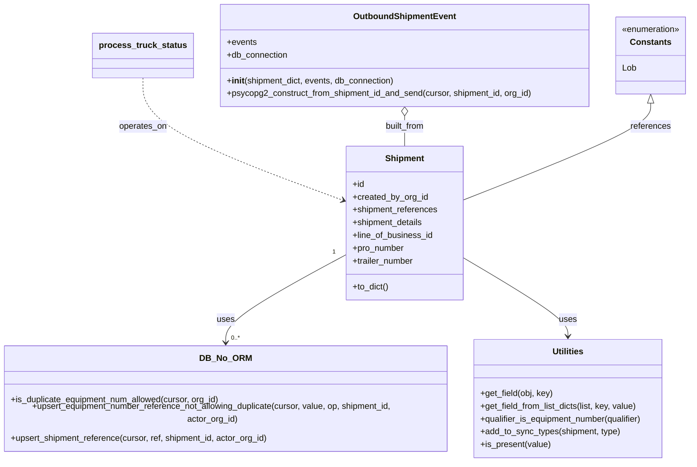

# Diagram: shipment_core/shipment_service/shipment_service/proxy_endpoints/truck_handling.py


> Auto-generated by Obscura crawlers

## Diagram 1

```mermaid
flowchart TD
  A[process_truck_status] --> B[process_references]
  A --> C[OutboundShipmentEvent.psycopg2_construct_from_shipment_id_and_send]
  B --> D[db_no_orm.is_duplicate_equipment_num_allowed]
  B --> E[utilities.get_field / get_field_from_list_dicts / qualifier_is_equipment_number / add_to_sync_types / is_present]
  B --> F[db_no_orm.upsert_equipment_number_reference_not_allowing_duplicate]
  B --> G[db_no_orm.upsert_shipment_reference]
  B --> H[shared_constants.EQUIPMENT_NUMBER_QUALIFIER]
  B --> I[constants.Lob.FINISHED_VEHICLE]
  C --> J[OutboundShipmentEvent(shipment.to_dict(), events=detail)]
  subgraph DB
    D
    F
    G
    C
  end
  style DB fill:#f9f,stroke:#333,stroke-width:1px
```

> SVG rendering failed for this diagram.

## Diagram 2



### SVG

<svg id="container" width="1316.517578125" xmlns="http://www.w3.org/2000/svg" class="classDiagram" height="866" viewBox="0 0 1316.517578125 866" role="graphics-document document" aria-roledescription="class"><style>#container{font-family:"trebuchet ms",verdana,arial,sans-serif;font-size:16px;fill:#333;}@keyframes edge-animation-frame{from{stroke-dashoffset:0;}}@keyframes dash{to{stroke-dashoffset:0;}}#container .edge-animation-slow{stroke-dasharray:9,5!important;stroke-dashoffset:900;animation:dash 50s linear infinite;stroke-linecap:round;}#container .edge-animation-fast{stroke-dasharray:9,5!important;stroke-dashoffset:900;animation:dash 20s linear infinite;stroke-linecap:round;}#container .error-icon{fill:#552222;}#container .error-text{fill:#552222;stroke:#552222;}#container .edge-thickness-normal{stroke-width:1px;}#container .edge-thickness-thick{stroke-width:3.5px;}#container .edge-pattern-solid{stroke-dasharray:0;}#container .edge-thickness-invisible{stroke-width:0;fill:none;}#container .edge-pattern-dashed{stroke-dasharray:3;}#container .edge-pattern-dotted{stroke-dasharray:2;}#container .marker{fill:#333333;stroke:#333333;}#container .marker.cross{stroke:#333333;}#container svg{font-family:"trebuchet ms",verdana,arial,sans-serif;font-size:16px;}#container p{margin:0;}#container g.classGroup text{fill:#9370DB;stroke:none;font-family:"trebuchet ms",verdana,arial,sans-serif;font-size:10px;}#container g.classGroup text .title{font-weight:bolder;}#container .nodeLabel,#container .edgeLabel{color:#131300;}#container .edgeLabel .label rect{fill:#ECECFF;}#container .label text{fill:#131300;}#container .labelBkg{background:#ECECFF;}#container .edgeLabel .label span{background:#ECECFF;}#container .classTitle{font-weight:bolder;}#container .node rect,#container .node circle,#container .node ellipse,#container .node polygon,#container .node path{fill:#ECECFF;stroke:#9370DB;stroke-width:1px;}#container .divider{stroke:#9370DB;stroke-width:1;}#container g.clickable{cursor:pointer;}#container g.classGroup rect{fill:#ECECFF;stroke:#9370DB;}#container g.classGroup line{stroke:#9370DB;stroke-width:1;}#container .classLabel .box{stroke:none;stroke-width:0;fill:#ECECFF;opacity:0.5;}#container .classLabel .label{fill:#9370DB;font-size:10px;}#container .relation{stroke:#333333;stroke-width:1;fill:none;}#container .dashed-line{stroke-dasharray:3;}#container .dotted-line{stroke-dasharray:1 2;}#container #compositionStart,#container .composition{fill:#333333!important;stroke:#333333!important;stroke-width:1;}#container #compositionEnd,#container .composition{fill:#333333!important;stroke:#333333!important;stroke-width:1;}#container #dependencyStart,#container .dependency{fill:#333333!important;stroke:#333333!important;stroke-width:1;}#container #dependencyStart,#container .dependency{fill:#333333!important;stroke:#333333!important;stroke-width:1;}#container #extensionStart,#container .extension{fill:transparent!important;stroke:#333333!important;stroke-width:1;}#container #extensionEnd,#container .extension{fill:transparent!important;stroke:#333333!important;stroke-width:1;}#container #aggregationStart,#container .aggregation{fill:transparent!important;stroke:#333333!important;stroke-width:1;}#container #aggregationEnd,#container .aggregation{fill:transparent!important;stroke:#333333!important;stroke-width:1;}#container #lollipopStart,#container .lollipop{fill:#ECECFF!important;stroke:#333333!important;stroke-width:1;}#container #lollipopEnd,#container .lollipop{fill:#ECECFF!important;stroke:#333333!important;stroke-width:1;}#container .edgeTerminals{font-size:11px;line-height:initial;}#container .classTitleText{text-anchor:middle;font-size:18px;fill:#333;}#container .label-icon{display:inline-block;height:1em;overflow:visible;vertical-align:-0.125em;}#container .node .label-icon path{fill:currentColor;stroke:revert;stroke-width:revert;}#container :root{--mermaid-font-family:"trebuchet ms",verdana,arial,sans-serif;}</style><g><defs><marker id="container_class-aggregationStart" class="marker aggregation class" refX="18" refY="7" markerWidth="190" markerHeight="240" orient="auto"><path d="M 18,7 L9,13 L1,7 L9,1 Z"></path></marker></defs><defs><marker id="container_class-aggregationEnd" class="marker aggregation class" refX="1" refY="7" markerWidth="20" markerHeight="28" orient="auto"><path d="M 18,7 L9,13 L1,7 L9,1 Z"></path></marker></defs><defs><marker id="container_class-extensionStart" class="marker extension class" refX="18" refY="7" markerWidth="190" markerHeight="240" orient="auto"><path d="M 1,7 L18,13 V 1 Z"></path></marker></defs><defs><marker id="container_class-extensionEnd" class="marker extension class" refX="1" refY="7" markerWidth="20" markerHeight="28" orient="auto"><path d="M 1,1 V 13 L18,7 Z"></path></marker></defs><defs><marker id="container_class-compositionStart" class="marker composition class" refX="18" refY="7" markerWidth="190" markerHeight="240" orient="auto"><path d="M 18,7 L9,13 L1,7 L9,1 Z"></path></marker></defs><defs><marker id="container_class-compositionEnd" class="marker composition class" refX="1" refY="7" markerWidth="20" markerHeight="28" orient="auto"><path d="M 18,7 L9,13 L1,7 L9,1 Z"></path></marker></defs><defs><marker id="container_class-dependencyStart" class="marker dependency class" refX="6" refY="7" markerWidth="190" markerHeight="240" orient="auto"><path d="M 5,7 L9,13 L1,7 L9,1 Z"></path></marker></defs><defs><marker id="container_class-dependencyEnd" class="marker dependency class" refX="13" refY="7" markerWidth="20" markerHeight="28" orient="auto"><path d="M 18,7 L9,13 L14,7 L9,1 Z"></path></marker></defs><defs><marker id="container_class-lollipopStart" class="marker lollipop class" refX="13" refY="7" markerWidth="190" markerHeight="240" orient="auto"><circle stroke="black" fill="transparent" cx="7" cy="7" r="6"></circle></marker></defs><defs><marker id="container_class-lollipopEnd" class="marker lollipop class" refX="1" refY="7" markerWidth="190" markerHeight="240" orient="auto"><circle stroke="black" fill="transparent" cx="7" cy="7" r="6"></circle></marker></defs><g class="root"><g class="clusters"></g><g class="edgePaths"><path d="M665.975,476.312L627.486,496.76C588.997,517.208,512.02,558.104,473.532,587.719C435.043,617.333,435.043,635.667,435.043,644.833L435.043,654" id="id_Shipment_DB_No_ORM_1" class="edge-thickness-normal edge-pattern-solid relation" style=";;;" data-edge="true" data-et="edge" data-id="id_Shipment_DB_No_ORM_1" data-points="W3sieCI6NjY1Ljk3NDYwOTM3NSwieSI6NDc2LjMxMTY0OTc0NTE3NDM1fSx7IngiOjQzNS4wNDI5Njg3NSwieSI6NTk5fSx7IngiOjQzNS4wNDI5Njg3NSwieSI6NjYwfV0=" marker-end="url(#container_class-dependencyEnd)"></path><path d="M885.49,480.438L920.226,500.198C954.962,519.959,1024.434,559.479,1059.17,584.406C1093.906,609.333,1093.906,619.667,1093.906,624.833L1093.906,630" id="id_Shipment_Utilities_2" class="edge-thickness-normal edge-pattern-solid relation" style=";;;" data-edge="true" data-et="edge" data-id="id_Shipment_Utilities_2" data-points="W3sieCI6ODg1LjQ5MDIzNDM3NSwieSI6NDgwLjQzODA4MzU0NTYyNDc1fSx7IngiOjEwOTMuOTA2MjUsInkiOjU5OX0seyJ4IjoxMDkzLjkwNjI1LCJ5Ijo2MzZ9XQ==" marker-end="url(#container_class-dependencyEnd)"></path><path d="M287.986,146L287.986,161.167C287.986,176.333,287.986,206.667,350.047,244.864C412.107,283.061,536.228,329.121,598.289,352.152L660.349,375.182" id="id_process_truck_status_Shipment_3" class="edge-thickness-normal edge-pattern-dashed relation" style=";;;" data-edge="true" data-et="edge" data-id="id_process_truck_status_Shipment_3" data-points="W3sieCI6Mjg3Ljk4NjMyODEyNSwieSI6MTQ2fSx7IngiOjI4Ny45ODYzMjgxMjUsInkiOjIzN30seyJ4Ijo2NjUuOTc0NjA5Mzc1LCJ5IjozNzcuMjY5NDU1MzIzMDM0MDR9XQ==" marker-end="url(#container_class-dependencyEnd)"></path><path d="M775.732,217.25L775.732,220.542C775.732,223.833,775.732,230.417,775.732,239.875C775.732,249.333,775.732,261.667,775.732,267.833L775.732,274" id="id_OutboundShipmentEvent_Shipment_4" class="edge-thickness-normal edge-pattern-solid relation" style=";;;" data-edge="true" data-et="edge" data-id="id_OutboundShipmentEvent_Shipment_4" data-points="W3sieCI6Nzc1LjczMjQyMTg3NSwieSI6MjAwfSx7IngiOjc3NS43MzI0MjE4NzUsInkiOjIzN30seyJ4Ijo3NzUuNzMyNDIxODc1LCJ5IjoyNzR9XQ==" marker-start="url(#container_class-aggregationStart)"></path><path d="M1240.963,193.25L1240.963,200.542C1240.963,207.833,1240.963,222.417,1181.717,252.758C1122.472,283.099,1003.981,329.199,944.736,352.249L885.49,375.298" id="id_Constants_Shipment_5" class="edge-thickness-normal edge-pattern-solid relation" style=";;;" data-edge="true" data-et="edge" data-id="id_Constants_Shipment_5" data-points="W3sieCI6MTI0MC45NjI4OTA2MjUsInkiOjE3Nn0seyJ4IjoxMjQwLjk2Mjg5MDYyNSwieSI6MjM3fSx7IngiOjg4NS40OTAyMzQzNzUsInkiOjM3NS4yOTgyMzA4ODM1NTA3fV0=" marker-start="url(#container_class-extensionStart)"></path></g><g class="edgeLabels"><g class="edgeLabel" transform="translate(435.04296875, 599)"><g class="label" data-id="id_Shipment_DB_No_ORM_1" transform="translate(-16.4921875, -12)"><foreignObject width="32.984375" height="24"><div xmlns="http://www.w3.org/1999/xhtml" class="labelBkg" style="display: table-cell; white-space: nowrap; line-height: 1.5; max-width: 200px; text-align: center;"><span class="edgeLabel"><p>uses</p></span></div></foreignObject></g></g><g class="edgeLabel" transform="translate(1093.90625, 599)"><g class="label" data-id="id_Shipment_Utilities_2" transform="translate(-16.4921875, -12)"><foreignObject width="32.984375" height="24"><div xmlns="http://www.w3.org/1999/xhtml" class="labelBkg" style="display: table-cell; white-space: nowrap; line-height: 1.5; max-width: 200px; text-align: center;"><span class="edgeLabel"><p>uses</p></span></div></foreignObject></g></g><g class="edgeLabel" transform="translate(287.986328125, 237)"><g class="label" data-id="id_process_truck_status_Shipment_3" transform="translate(-45.015625, -12)"><foreignObject width="90.03125" height="24"><div xmlns="http://www.w3.org/1999/xhtml" class="labelBkg" style="display: table-cell; white-space: nowrap; line-height: 1.5; max-width: 200px; text-align: center;"><span class="edgeLabel"><p>operates_on</p></span></div></foreignObject></g></g><g class="edgeLabel" transform="translate(775.732421875, 237)"><g class="label" data-id="id_OutboundShipmentEvent_Shipment_4" transform="translate(-37.953125, -12)"><foreignObject width="75.90625" height="24"><div xmlns="http://www.w3.org/1999/xhtml" class="labelBkg" style="display: table-cell; white-space: nowrap; line-height: 1.5; max-width: 200px; text-align: center;"><span class="edgeLabel"><p>built_from</p></span></div></foreignObject></g></g><g class="edgeLabel" transform="translate(1240.962890625, 237)"><g class="label" data-id="id_Constants_Shipment_5" transform="translate(-37.828125, -12)"><foreignObject width="75.65625" height="24"><div xmlns="http://www.w3.org/1999/xhtml" class="labelBkg" style="display: table-cell; white-space: nowrap; line-height: 1.5; max-width: 200px; text-align: center;"><span class="edgeLabel"><p>references</p></span></div></foreignObject></g></g><g class="edgeTerminals" transform="translate(643.4826562180989, 471.27557990786346)"><g class="inner" transform="translate(0, 0)"><foreignObject style="width: 9px; height: 12px;"><div xmlns="http://www.w3.org/1999/xhtml" style="display: inline-block; padding-right: 1px; white-space: nowrap;"><span class="edgeLabel">1</span></div></foreignObject></g></g><g class="edgeTerminals" transform="translate(445.042969375, 637.5000005357143)"><g class="inner" transform="translate(0, 0)"></g><foreignObject style="width: 36px; height: 12px;"><div xmlns="http://www.w3.org/1999/xhtml" style="display: inline-block; padding-right: 1px; white-space: nowrap;"><span class="edgeLabel">0..*</span></div></foreignObject></g></g><g class="nodes"><g class="node default" id="classId-Shipment-0" transform="translate(775.732421875, 418)"><g class="basic label-container"><path d="M-109.7578125 -144 L109.7578125 -144 L109.7578125 144 L-109.7578125 144" stroke="none" stroke-width="0" fill="#ECECFF" style=""></path><path d="M-109.7578125 -144 C-27.886879147856362 -144, 53.984054204287276 -144, 109.7578125 -144 M-109.7578125 -144 C-62.6199568390347 -144, -15.4821011780694 -144, 109.7578125 -144 M109.7578125 -144 C109.7578125 -39.80131621645444, 109.7578125 64.39736756709112, 109.7578125 144 M109.7578125 -144 C109.7578125 -36.42126273884314, 109.7578125 71.15747452231372, 109.7578125 144 M109.7578125 144 C57.24120991757019 144, 4.724607335140377 144, -109.7578125 144 M109.7578125 144 C47.31942548042861 144, -15.118961539142774 144, -109.7578125 144 M-109.7578125 144 C-109.7578125 83.06423044272091, -109.7578125 22.12846088544184, -109.7578125 -144 M-109.7578125 144 C-109.7578125 75.91153849264828, -109.7578125 7.823076985296552, -109.7578125 -144" stroke="#9370DB" stroke-width="1.3" fill="none" stroke-dasharray="0 0" style=""></path></g><g class="annotation-group text" transform="translate(0, -120)"></g><g class="label-group text" transform="translate(-35.109375, -120)"><g class="label" style="font-weight: bolder" transform="translate(0,-12)"><foreignObject width="70.21875" height="24"><div xmlns="http://www.w3.org/1999/xhtml" style="display: table-cell; white-space: nowrap; line-height: 1.5; max-width: 120px; text-align: center;"><span class="nodeLabel markdown-node-label" style=""><p>Shipment</p></span></div></foreignObject></g></g><g class="members-group text" transform="translate(-97.7578125, -72)"><g class="label" style="" transform="translate(0,-12)"><foreignObject width="22.078125" height="24"><div xmlns="http://www.w3.org/1999/xhtml" style="display: table-cell; white-space: nowrap; line-height: 1.5; max-width: 79px; text-align: center;"><span class="nodeLabel markdown-node-label" style=""><p>+id</p></span></div></foreignObject></g><g class="label" style="" transform="translate(0,12)"><foreignObject width="141.640625" height="24"><div xmlns="http://www.w3.org/1999/xhtml" style="display: table-cell; white-space: nowrap; line-height: 1.5; max-width: 199px; text-align: center;"><span class="nodeLabel markdown-node-label" style=""><p>+created_by_org_id</p></span></div></foreignObject></g><g class="label" style="" transform="translate(0,36)"><foreignObject width="160.40625" height="24"><div xmlns="http://www.w3.org/1999/xhtml" style="display: table-cell; white-space: nowrap; line-height: 1.5; max-width: 218px; text-align: center;"><span class="nodeLabel markdown-node-label" style=""><p>+shipment_references</p></span></div></foreignObject></g><g class="label" style="" transform="translate(0,60)"><foreignObject width="133.765625" height="24"><div xmlns="http://www.w3.org/1999/xhtml" style="display: table-cell; white-space: nowrap; line-height: 1.5; max-width: 191px; text-align: center;"><span class="nodeLabel markdown-node-label" style=""><p>+shipment_details</p></span></div></foreignObject></g><g class="label" style="" transform="translate(0,84)"><foreignObject width="151.265625" height="24"><div xmlns="http://www.w3.org/1999/xhtml" style="display: table-cell; white-space: nowrap; line-height: 1.5; max-width: 209px; text-align: center;"><span class="nodeLabel markdown-node-label" style=""><p>+line_of_business_id</p></span></div></foreignObject></g><g class="label" style="" transform="translate(0,108)"><foreignObject width="97.34375" height="24"><div xmlns="http://www.w3.org/1999/xhtml" style="display: table-cell; white-space: nowrap; line-height: 1.5; max-width: 156px; text-align: center;"><span class="nodeLabel markdown-node-label" style=""><p>+pro_number</p></span></div></foreignObject></g><g class="label" style="" transform="translate(0,132)"><foreignObject width="115.859375" height="24"><div xmlns="http://www.w3.org/1999/xhtml" style="display: table-cell; white-space: nowrap; line-height: 1.5; max-width: 174px; text-align: center;"><span class="nodeLabel markdown-node-label" style=""><p>+trailer_number</p></span></div></foreignObject></g></g><g class="methods-group text" transform="translate(-97.7578125, 120)"><g class="label" style="" transform="translate(0,-12)"><foreignObject width="68.34375" height="24"><div xmlns="http://www.w3.org/1999/xhtml" style="display: table-cell; white-space: nowrap; line-height: 1.5; max-width: 126px; text-align: center;"><span class="nodeLabel markdown-node-label" style=""><p>+to_dict()</p></span></div></foreignObject></g></g><g class="divider" style=""><path d="M-109.7578125 -96 C-37.08650805328918 -96, 35.58479639342164 -96, 109.7578125 -96 M-109.7578125 -96 C-62.79568587357376 -96, -15.83355924714752 -96, 109.7578125 -96" stroke="#9370DB" stroke-width="1.3" fill="none" stroke-dasharray="0 0" style=""></path></g><g class="divider" style=""><path d="M-109.7578125 96 C-24.7156190815805 96, 60.326574336839 96, 109.7578125 96 M-109.7578125 96 C-45.275749520024036 96, 19.20631345995193 96, 109.7578125 96" stroke="#9370DB" stroke-width="1.3" fill="none" stroke-dasharray="0 0" style=""></path></g></g><g class="node default" id="classId-OutboundShipmentEvent-1" transform="translate(775.732421875, 104)"><g class="basic label-container"><path d="M-347.67578125 -96 L347.67578125 -96 L347.67578125 96 L-347.67578125 96" stroke="none" stroke-width="0" fill="#ECECFF" style=""></path><path d="M-347.67578125 -96 C-131.6267979071626 -96, 84.4221854356748 -96, 347.67578125 -96 M-347.67578125 -96 C-111.1625210523458 -96, 125.35073914530841 -96, 347.67578125 -96 M347.67578125 -96 C347.67578125 -52.52660985176231, 347.67578125 -9.053219703524618, 347.67578125 96 M347.67578125 -96 C347.67578125 -38.04090362329152, 347.67578125 19.91819275341696, 347.67578125 96 M347.67578125 96 C154.03294011203647 96, -39.60990102592706 96, -347.67578125 96 M347.67578125 96 C76.79372574494954 96, -194.08832976010092 96, -347.67578125 96 M-347.67578125 96 C-347.67578125 49.91226282627473, -347.67578125 3.824525652549454, -347.67578125 -96 M-347.67578125 96 C-347.67578125 32.68028637830632, -347.67578125 -30.63942724338736, -347.67578125 -96" stroke="#9370DB" stroke-width="1.3" fill="none" stroke-dasharray="0 0" style=""></path></g><g class="annotation-group text" transform="translate(0, -72)"></g><g class="label-group text" transform="translate(-91.9453125, -72)"><g class="label" style="font-weight: bolder" transform="translate(0,-12)"><foreignObject width="183.890625" height="24"><div xmlns="http://www.w3.org/1999/xhtml" style="display: table-cell; white-space: nowrap; line-height: 1.5; max-width: 233px; text-align: center;"><span class="nodeLabel markdown-node-label" style=""><p>OutboundShipmentEvent</p></span></div></foreignObject></g></g><g class="members-group text" transform="translate(-335.67578125, -24)"><g class="label" style="" transform="translate(0,-12)"><foreignObject width="55.796875" height="24"><div xmlns="http://www.w3.org/1999/xhtml" style="display: table-cell; white-space: nowrap; line-height: 1.5; max-width: 113px; text-align: center;"><span class="nodeLabel markdown-node-label" style=""><p>+events</p></span></div></foreignObject></g><g class="label" style="" transform="translate(0,12)"><foreignObject width="115.546875" height="24"><div xmlns="http://www.w3.org/1999/xhtml" style="display: table-cell; white-space: nowrap; line-height: 1.5; max-width: 173px; text-align: center;"><span class="nodeLabel markdown-node-label" style=""><p>+db_connection</p></span></div></foreignObject></g></g><g class="methods-group text" transform="translate(-335.67578125, 48)"><g class="label" style="" transform="translate(0,-12)"><foreignObject width="318.328125" height="24"><div xmlns="http://www.w3.org/1999/xhtml" style="display: table-cell; white-space: nowrap; line-height: 1.5; max-width: 407px; text-align: center;"><span class="nodeLabel markdown-node-label" style=""><p>+<strong>init</strong>(shipment_dict, events, db_connection)</p></span></div></foreignObject></g><g class="label" style="" transform="translate(0,12)"><foreignObject width="579.40625" height="24"><div xmlns="http://www.w3.org/1999/xhtml" style="display: table-cell; white-space: nowrap; line-height: 1.5; max-width: 637px; text-align: center;"><span class="nodeLabel markdown-node-label" style=""><p>+psycopg2_construct_from_shipment_id_and_send(cursor, shipment_id, org_id)</p></span></div></foreignObject></g></g><g class="divider" style=""><path d="M-347.67578125 -48 C-114.2724422536252 -48, 119.1308967427496 -48, 347.67578125 -48 M-347.67578125 -48 C-200.59122661159674 -48, -53.50667197319348 -48, 347.67578125 -48" stroke="#9370DB" stroke-width="1.3" fill="none" stroke-dasharray="0 0" style=""></path></g><g class="divider" style=""><path d="M-347.67578125 24 C-100.87344462407904 24, 145.92889200184192 24, 347.67578125 24 M-347.67578125 24 C-94.46816434690197 24, 158.73945255619606 24, 347.67578125 24" stroke="#9370DB" stroke-width="1.3" fill="none" stroke-dasharray="0 0" style=""></path></g></g><g class="node default" id="classId-Utilities-2" transform="translate(1093.90625, 747)"><g class="basic label-container"><path d="M-181.8203125 -111 L181.8203125 -111 L181.8203125 111 L-181.8203125 111" stroke="none" stroke-width="0" fill="#ECECFF" style=""></path><path d="M-181.8203125 -111 C-60.36509364392981 -111, 61.09012521214038 -111, 181.8203125 -111 M-181.8203125 -111 C-101.8233298176578 -111, -21.826347135315586 -111, 181.8203125 -111 M181.8203125 -111 C181.8203125 -63.204092999159386, 181.8203125 -15.408185998318771, 181.8203125 111 M181.8203125 -111 C181.8203125 -23.462473166837228, 181.8203125 64.07505366632554, 181.8203125 111 M181.8203125 111 C108.07208410079858 111, 34.323855701597154 111, -181.8203125 111 M181.8203125 111 C44.08094056035634 111, -93.65843137928732 111, -181.8203125 111 M-181.8203125 111 C-181.8203125 66.47393156149167, -181.8203125 21.94786312298332, -181.8203125 -111 M-181.8203125 111 C-181.8203125 45.86478937493155, -181.8203125 -19.270421250136906, -181.8203125 -111" stroke="#9370DB" stroke-width="1.3" fill="none" stroke-dasharray="0 0" style=""></path></g><g class="annotation-group text" transform="translate(0, -87)"></g><g class="label-group text" transform="translate(-28.8125, -87)"><g class="label" style="font-weight: bolder" transform="translate(0,-12)"><foreignObject width="57.625" height="24"><div xmlns="http://www.w3.org/1999/xhtml" style="display: table-cell; white-space: nowrap; line-height: 1.5; max-width: 107px; text-align: center;"><span class="nodeLabel markdown-node-label" style=""><p>Utilities</p></span></div></foreignObject></g></g><g class="members-group text" transform="translate(-169.8203125, -39)"></g><g class="methods-group text" transform="translate(-169.8203125, -9)"><g class="label" style="" transform="translate(0,-12)"><foreignObject width="137" height="24"><div xmlns="http://www.w3.org/1999/xhtml" style="display: table-cell; white-space: nowrap; line-height: 1.5; max-width: 194px; text-align: center;"><span class="nodeLabel markdown-node-label" style=""><p>+get_field(obj, key)</p></span></div></foreignObject></g><g class="label" style="" transform="translate(0,12)"><foreignObject width="298.203125" height="24"><div xmlns="http://www.w3.org/1999/xhtml" style="display: table-cell; white-space: nowrap; line-height: 1.5; max-width: 356px; text-align: center;"><span class="nodeLabel markdown-node-label" style=""><p>+get_field_from_list_dicts(list, key, value)</p></span></div></foreignObject></g><g class="label" style="" transform="translate(0,36)"><foreignObject width="310.828125" height="24"><div xmlns="http://www.w3.org/1999/xhtml" style="display: table-cell; white-space: nowrap; line-height: 1.5; max-width: 368px; text-align: center;"><span class="nodeLabel markdown-node-label" style=""><p>+qualifier_is_equipment_number(qualifier)</p></span></div></foreignObject></g><g class="label" style="" transform="translate(0,60)"><foreignObject width="264.578125" height="24"><div xmlns="http://www.w3.org/1999/xhtml" style="display: table-cell; white-space: nowrap; line-height: 1.5; max-width: 322px; text-align: center;"><span class="nodeLabel markdown-node-label" style=""><p>+add_to_sync_types(shipment, type)</p></span></div></foreignObject></g><g class="label" style="" transform="translate(0,84)"><foreignObject width="132.484375" height="24"><div xmlns="http://www.w3.org/1999/xhtml" style="display: table-cell; white-space: nowrap; line-height: 1.5; max-width: 190px; text-align: center;"><span class="nodeLabel markdown-node-label" style=""><p>+is_present(value)</p></span></div></foreignObject></g></g><g class="divider" style=""><path d="M-181.8203125 -63 C-108.02989991452 -63, -34.23948732904 -63, 181.8203125 -63 M-181.8203125 -63 C-59.51911570881056 -63, 62.78208108237888 -63, 181.8203125 -63" stroke="#9370DB" stroke-width="1.3" fill="none" stroke-dasharray="0 0" style=""></path></g><g class="divider" style=""><path d="M-181.8203125 -39 C-93.91949947867968 -39, -6.018686457359365 -39, 181.8203125 -39 M-181.8203125 -39 C-57.56248595451524 -39, 66.69534059096952 -39, 181.8203125 -39" stroke="#9370DB" stroke-width="1.3" fill="none" stroke-dasharray="0 0" style=""></path></g></g><g class="node default" id="classId-DB_No_ORM-3" transform="translate(435.04296875, 747)"><g class="basic label-container"><path d="M-427.04296875 -87 L427.04296875 -87 L427.04296875 87 L-427.04296875 87" stroke="none" stroke-width="0" fill="#ECECFF" style=""></path><path d="M-427.04296875 -87 C-231.55252871127166 -87, -36.062088672543325 -87, 427.04296875 -87 M-427.04296875 -87 C-108.29912518630522 -87, 210.44471837738956 -87, 427.04296875 -87 M427.04296875 -87 C427.04296875 -19.65624407821653, 427.04296875 47.68751184356694, 427.04296875 87 M427.04296875 -87 C427.04296875 -27.873957683610485, 427.04296875 31.25208463277903, 427.04296875 87 M427.04296875 87 C213.3125649128392 87, -0.4178389243215861 87, -427.04296875 87 M427.04296875 87 C161.025273957695 87, -104.99242083461002 87, -427.04296875 87 M-427.04296875 87 C-427.04296875 22.426532429367427, -427.04296875 -42.146935141265146, -427.04296875 -87 M-427.04296875 87 C-427.04296875 40.85899856480465, -427.04296875 -5.2820028703906985, -427.04296875 -87" stroke="#9370DB" stroke-width="1.3" fill="none" stroke-dasharray="0 0" style=""></path></g><g class="annotation-group text" transform="translate(0, -63)"></g><g class="label-group text" transform="translate(-44.5546875, -63)"><g class="label" style="font-weight: bolder" transform="translate(0,-12)"><foreignObject width="89.109375" height="24"><div xmlns="http://www.w3.org/1999/xhtml" style="display: table-cell; white-space: nowrap; line-height: 1.5; max-width: 139px; text-align: center;"><span class="nodeLabel markdown-node-label" style=""><p>DB_No_ORM</p></span></div></foreignObject></g></g><g class="members-group text" transform="translate(-415.04296875, -15)"></g><g class="methods-group text" transform="translate(-415.04296875, 15)"><g class="label" style="" transform="translate(0,-12)"><foreignObject width="397.1875" height="24"><div xmlns="http://www.w3.org/1999/xhtml" style="display: table-cell; white-space: nowrap; line-height: 1.5; max-width: 455px; text-align: center;"><span class="nodeLabel markdown-node-label" style=""><p>+is_duplicate_equipment_num_allowed(cursor, org_id)</p></span></div></foreignObject></g><g class="label" style="" transform="translate(0,12)"><foreignObject width="785.53125" height="24"><div xmlns="http://www.w3.org/1999/xhtml" style="display: table-cell; white-space: nowrap; line-height: 1.5; max-width: 843px; text-align: center;"><span class="nodeLabel markdown-node-label" style=""><p>+upsert_equipment_number_reference_not_allowing_duplicate(cursor, value, op, shipment_id, actor_org_id)</p></span></div></foreignObject></g><g class="label" style="" transform="translate(0,36)"><foreignObject width="487.28125" height="24"><div xmlns="http://www.w3.org/1999/xhtml" style="display: table-cell; white-space: nowrap; line-height: 1.5; max-width: 545px; text-align: center;"><span class="nodeLabel markdown-node-label" style=""><p>+upsert_shipment_reference(cursor, ref, shipment_id, actor_org_id)</p></span></div></foreignObject></g></g><g class="divider" style=""><path d="M-427.04296875 -39 C-144.59189533157814 -39, 137.8591780868437 -39, 427.04296875 -39 M-427.04296875 -39 C-147.22717531744252 -39, 132.58861811511497 -39, 427.04296875 -39" stroke="#9370DB" stroke-width="1.3" fill="none" stroke-dasharray="0 0" style=""></path></g><g class="divider" style=""><path d="M-427.04296875 -15 C-185.07681068548987 -15, 56.88934737902025 -15, 427.04296875 -15 M-427.04296875 -15 C-243.28123976686084 -15, -59.51951078372167 -15, 427.04296875 -15" stroke="#9370DB" stroke-width="1.3" fill="none" stroke-dasharray="0 0" style=""></path></g></g><g class="node default" id="classId-Constants-4" transform="translate(1240.962890625, 104)"><g class="basic label-container"><path d="M-67.5546875 -72 L67.5546875 -72 L67.5546875 72 L-67.5546875 72" stroke="none" stroke-width="0" fill="#ECECFF" style=""></path><path d="M-67.5546875 -72 C-17.02550550053516 -72, 33.50367649892968 -72, 67.5546875 -72 M-67.5546875 -72 C-38.48873544995324 -72, -9.422783399906471 -72, 67.5546875 -72 M67.5546875 -72 C67.5546875 -16.33129905405776, 67.5546875 39.33740189188448, 67.5546875 72 M67.5546875 -72 C67.5546875 -30.72526662563353, 67.5546875 10.54946674873294, 67.5546875 72 M67.5546875 72 C32.94196763405471 72, -1.6707522318905745 72, -67.5546875 72 M67.5546875 72 C40.45892530183894 72, 13.363163103677877 72, -67.5546875 72 M-67.5546875 72 C-67.5546875 15.256496724454237, -67.5546875 -41.487006551091525, -67.5546875 -72 M-67.5546875 72 C-67.5546875 17.806629977641215, -67.5546875 -36.38674004471757, -67.5546875 -72" stroke="#9370DB" stroke-width="1.3" fill="none" stroke-dasharray="0 0" style=""></path></g><g class="annotation-group text" transform="translate(-55.5546875, -48)"><g class="label" style="" transform="translate(0,-12)"><foreignObject width="111.109375" height="24"><div xmlns="http://www.w3.org/1999/xhtml" style="display: table-cell; white-space: nowrap; line-height: 1.5; max-width: 161px; text-align: center;"><span class="nodeLabel markdown-node-label" style=""><p>«enumeration»</p></span></div></foreignObject></g></g><g class="label-group text" transform="translate(-36.5390625, -24)"><g class="label" style="font-weight: bolder" transform="translate(0,-12)"><foreignObject width="73.078125" height="24"><div xmlns="http://www.w3.org/1999/xhtml" style="display: table-cell; white-space: nowrap; line-height: 1.5; max-width: 122px; text-align: center;"><span class="nodeLabel markdown-node-label" style=""><p>Constants</p></span></div></foreignObject></g></g><g class="members-group text" transform="translate(-55.5546875, 24)"><g class="label" style="" transform="translate(0,-12)"><foreignObject width="26.421875" height="24"><div xmlns="http://www.w3.org/1999/xhtml" style="display: table-cell; white-space: nowrap; line-height: 1.5; max-width: 76px; text-align: center;"><span class="nodeLabel markdown-node-label" style=""><p>Lob</p></span></div></foreignObject></g></g><g class="methods-group text" transform="translate(-55.5546875, 72)"></g><g class="divider" style=""><path d="M-67.5546875 0 C-25.448692860734972 0, 16.657301778530055 0, 67.5546875 0 M-67.5546875 0 C-36.22994984943621 0, -4.905212198872427 0, 67.5546875 0" stroke="#9370DB" stroke-width="1.3" fill="none" stroke-dasharray="0 0" style=""></path></g><g class="divider" style=""><path d="M-67.5546875 48 C-17.998540391633888 48, 31.557606716732224 48, 67.5546875 48 M-67.5546875 48 C-35.749283564782374 48, -3.9438796295647407 48, 67.5546875 48" stroke="#9370DB" stroke-width="1.3" fill="none" stroke-dasharray="0 0" style=""></path></g></g><g class="node default" id="classId-process_truck_status-5" transform="translate(287.986328125, 104)"><g class="basic label-container"><path d="M-90.0703125 -42 L90.0703125 -42 L90.0703125 42 L-90.0703125 42" stroke="none" stroke-width="0" fill="#ECECFF" style=""></path><path d="M-90.0703125 -42 C-37.75004262529282 -42, 14.570227249414359 -42, 90.0703125 -42 M-90.0703125 -42 C-30.53492011087743 -42, 29.00047227824514 -42, 90.0703125 -42 M90.0703125 -42 C90.0703125 -18.62229552101441, 90.0703125 4.755408957971177, 90.0703125 42 M90.0703125 -42 C90.0703125 -17.687696501867, 90.0703125 6.624606996266003, 90.0703125 42 M90.0703125 42 C47.38115202445073 42, 4.691991548901456 42, -90.0703125 42 M90.0703125 42 C35.191332665843454 42, -19.68764716831309 42, -90.0703125 42 M-90.0703125 42 C-90.0703125 19.96295933652473, -90.0703125 -2.074081326950541, -90.0703125 -42 M-90.0703125 42 C-90.0703125 14.23439929139068, -90.0703125 -13.53120141721864, -90.0703125 -42" stroke="#9370DB" stroke-width="1.3" fill="none" stroke-dasharray="0 0" style=""></path></g><g class="annotation-group text" transform="translate(0, -18)"></g><g class="label-group text" transform="translate(-78.0703125, -18)"><g class="label" style="font-weight: bolder" transform="translate(0,-12)"><foreignObject width="156.140625" height="24"><div xmlns="http://www.w3.org/1999/xhtml" style="display: table-cell; white-space: nowrap; line-height: 1.5; max-width: 203px; text-align: center;"><span class="nodeLabel markdown-node-label" style=""><p>process_truck_status</p></span></div></foreignObject></g></g><g class="members-group text" transform="translate(-78.0703125, 30)"></g><g class="methods-group text" transform="translate(-78.0703125, 60)"></g><g class="divider" style=""><path d="M-90.0703125 6 C-25.262394932508073 6, 39.545522634983854 6, 90.0703125 6 M-90.0703125 6 C-25.763034971978612 6, 38.544242556042775 6, 90.0703125 6" stroke="#9370DB" stroke-width="1.3" fill="none" stroke-dasharray="0 0" style=""></path></g><g class="divider" style=""><path d="M-90.0703125 24 C-30.68601840700444 24, 28.69827568599112 24, 90.0703125 24 M-90.0703125 24 C-37.18205652120439 24, 15.706199457591225 24, 90.0703125 24" stroke="#9370DB" stroke-width="1.3" fill="none" stroke-dasharray="0 0" style=""></path></g></g></g></g></g></svg>
