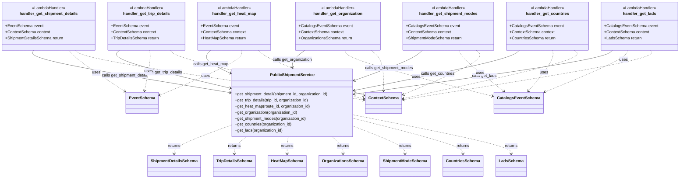

# Diagram: shipment_core/shipment_service/shipment_service/public/handlers.py

> Auto-generated by Obscura crawlers

## Mermaid

```mermaid
classDiagram
    class handler_get_shipment_details <<LambdaHandler>> {
        +EventSchema event
        +ContextSchema context
        +ShipmentDetailsSchema return
    }
    class handler_get_trip_details <<LambdaHandler>> {
        +EventSchema event
        +ContextSchema context
        +TripDetailsSchema return
    }
    class handler_get_heat_map <<LambdaHandler>> {
        +EventSchema event
        +ContextSchema context
        +HeatMapSchema return
    }
    class handler_get_organization <<LambdaHandler>> {
        +CatalogsEventSchema event
        +ContextSchema context
        +OrganizationsSchema return
    }
    class handler_get_shipment_modes <<LambdaHandler>> {
        +CatalogsEventSchema event
        +ContextSchema context
        +ShipmentModeSchema return
    }
    class handler_get_countries <<LambdaHandler>> {
        +CatalogsEventSchema event
        +ContextSchema context
        +CountriesSchema return
    }
    class handler_get_lads <<LambdaHandler>> {
        +CatalogsEventSchema event
        +ContextSchema context
        +LadsSchema return
    }

    class PublicShipmentService {
        +get_shipment_detail(shipment_id, organization_id)
        +get_trip_details(trip_id, organization_id)
        +get_heat_map(route_id, organization_id)
        +get_organization(organization_id)
        +get_shipment_modes(organization_id)
        +get_countries(organization_id)
        +get_lads(organization_id)
    }

    class EventSchema
    class CatalogsEventSchema
    class ContextSchema
    class ShipmentDetailsSchema
    class TripDetailsSchema
    class HeatMapSchema
    class OrganizationsSchema
    class ShipmentModeSchema
    class CountriesSchema
    class LadsSchema

    handler_get_shipment_details --> PublicShipmentService : calls get_shipment_detail
    handler_get_trip_details --> PublicShipmentService : calls get_trip_details
    handler_get_heat_map --> PublicShipmentService : calls get_heat_map
    handler_get_organization --> PublicShipmentService : calls get_organization
    handler_get_shipment_modes --> PublicShipmentService : calls get_shipment_modes
    handler_get_countries --> PublicShipmentService : calls get_countries
    handler_get_lads --> PublicShipmentService : calls get_lads

    handler_get_shipment_details ..> EventSchema : uses
    handler_get_trip_details ..> EventSchema : uses
    handler_get_heat_map ..> EventSchema : uses
    handler_get_organization ..> CatalogsEventSchema : uses
    handler_get_shipment_modes ..> CatalogsEventSchema : uses
    handler_get_countries ..> CatalogsEventSchema : uses
    handler_get_lads ..> CatalogsEventSchema : uses

    handler_get_shipment_details ..> ContextSchema
    handler_get_trip_details ..> ContextSchema
    handler_get_heat_map ..> ContextSchema
    handler_get_organization ..> ContextSchema
    handler_get_shipment_modes ..> ContextSchema
    handler_get_countries ..> ContextSchema
    handler_get_lads ..> ContextSchema

    PublicShipmentService ..> ShipmentDetailsSchema : returns
    PublicShipmentService ..> TripDetailsSchema : returns
    PublicShipmentService ..> HeatMapSchema : returns
    PublicShipmentService ..> OrganizationsSchema : returns
    PublicShipmentService ..> ShipmentModeSchema : returns
    PublicShipmentService ..> CountriesSchema : returns
    PublicShipmentService ..> LadsSchema : returns
```

> SVG rendering failed for this diagram.
