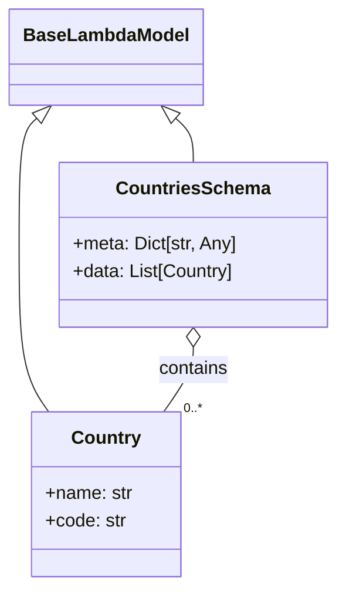

# Diagram: shipment_core/shipment_service/shipment_service/public/model/country.py

> Auto-generated by Obscura crawlers

## Mermaid

### SVG

<svg id="container" width="288.451171875" xmlns="http://www.w3.org/2000/svg" class="classDiagram" height="512" viewBox="0 0 288.451171875 512" role="graphics-document document" aria-roledescription="class"><g><defs><marker id="container_class-aggregationStart" class="marker aggregation class" refX="18" refY="7" markerWidth="190" markerHeight="240" orient="auto"><path d="M 18,7 L9,13 L1,7 L9,1 Z"></path></marker></defs><defs><marker id="container_class-aggregationEnd" class="marker aggregation class" refX="1" refY="7" markerWidth="20" markerHeight="28" orient="auto"><path d="M 18,7 L9,13 L1,7 L9,1 Z"></path></marker></defs><defs><marker id="container_class-extensionStart" class="marker extension class" refX="18" refY="7" markerWidth="190" markerHeight="240" orient="auto"><path d="M 1,7 L18,13 V 1 Z"></path></marker></defs><defs><marker id="container_class-extensionEnd" class="marker extension class" refX="1" refY="7" markerWidth="20" markerHeight="28" orient="auto"><path d="M 1,1 V 13 L18,7 Z"></path></marker></defs><defs><marker id="container_class-compositionStart" class="marker composition class" refX="18" refY="7" markerWidth="190" markerHeight="240" orient="auto"><path d="M 18,7 L9,13 L1,7 L9,1 Z"></path></marker></defs><defs><marker id="container_class-compositionEnd" class="marker composition class" refX="1" refY="7" markerWidth="20" markerHeight="28" orient="auto"><path d="M 18,7 L9,13 L1,7 L9,1 Z"></path></marker></defs><defs><marker id="container_class-dependencyStart" class="marker dependency class" refX="6" refY="7" markerWidth="190" markerHeight="240" orient="auto"><path d="M 5,7 L9,13 L1,7 L9,1 Z"></path></marker></defs><defs><marker id="container_class-dependencyEnd" class="marker dependency class" refX="13" refY="7" markerWidth="20" markerHeight="28" orient="auto"><path d="M 18,7 L9,13 L14,7 L9,1 Z"></path></marker></defs><defs><marker id="container_class-lollipopStart" class="marker lollipop class" refX="13" refY="7" markerWidth="190" markerHeight="240" orient="auto"><circle stroke="black" fill="transparent" cx="7" cy="7" r="6"></circle></marker></defs><defs><marker id="container_class-lollipopEnd" class="marker lollipop class" refX="1" refY="7" markerWidth="190" markerHeight="240" orient="auto"><circle stroke="black" fill="transparent" cx="7" cy="7" r="6"></circle></marker></defs><g class="root"><g class="clusters"></g><g class="edgePaths"><path d="M29.032,103.457L26.491,105.714C23.95,107.971,18.869,112.486,16.328,130.909C13.787,149.333,13.787,181.667,13.787,216C13.787,250.333,13.787,286.667,18.054,311C22.32,335.333,30.854,347.667,35.12,353.833L39.387,360" id="id_BaseLambdaModel_Country_1" class="edge-thickness-normal edge-pattern-solid relation" style=";;;" data-edge="true" data-et="edge" data-id="id_BaseLambdaModel_Country_1" data-points="W3sieCI6NDEuOTI3NDEzNzEyNjg2NTY1LCJ5Ijo5Mn0seyJ4IjoxMy43ODcxMDkzNzUsInkiOjExN30seyJ4IjoxMy43ODcxMDkzNzUsInkiOjIxNH0seyJ4IjoxMy43ODcxMDkzNzUsInkiOjMyM30seyJ4IjozOS4zODcwNDEyODQ0MDM2NywieSI6MzYwfV0=" marker-start="url(#container_class-extensionStart)"></path><path d="M149.375,103.457L151.915,105.714C154.456,107.971,159.538,112.486,162.078,118.909C164.619,125.333,164.619,133.667,164.619,137.833L164.619,142" id="id_BaseLambdaModel_CountriesSchema_2" class="edge-thickness-normal edge-pattern-solid relation" style=";;;" data-edge="true" data-et="edge" data-id="id_BaseLambdaModel_CountriesSchema_2" data-points="W3sieCI6MTM2LjQ3ODgzNjI4NzMxMzQ0LCJ5Ijo5Mn0seyJ4IjoxNjQuNjE5MTQwNjI1LCJ5IjoxMTd9LHsieCI6MTY0LjYxOTE0MDYyNSwieSI6MTQyfV0=" marker-start="url(#container_class-extensionStart)"></path><path d="M164.619,303.25L164.619,306.542C164.619,309.833,164.619,316.417,160.352,325.875C156.086,335.333,147.553,347.667,143.286,353.833L139.019,360" id="id_CountriesSchema_Country_3" class="edge-thickness-normal edge-pattern-solid relation" style=";;;" data-edge="true" data-et="edge" data-id="id_CountriesSchema_Country_3" data-points="W3sieCI6MTY0LjYxOTE0MDYyNSwieSI6Mjg2fSx7IngiOjE2NC42MTkxNDA2MjUsInkiOjMyM30seyJ4IjoxMzkuMDE5MjA4NzE1NTk2MzMsInkiOjM2MH1d" marker-start="url(#container_class-aggregationStart)"></path></g><g class="edgeLabels"><g class="edgeLabel"><g class="label" data-id="id_BaseLambdaModel_Country_1" transform="translate(0, 0)"><foreignObject width="0" height="0">

</foreignObject></g></g><g class="edgeLabel"><g class="label" data-id="id_BaseLambdaModel_CountriesSchema_2" transform="translate(0, 0)"><foreignObject width="0" height="0">

</foreignObject></g></g><g class="edgeLabel" transform="translate(164.619140625, 323)"><g class="label" data-id="id_CountriesSchema_Country_3" transform="translate(-30.890625, -12)"><foreignObject width="61.78125" height="24">

contains

</foreignObject></g></g><g class="edgeTerminals" transform="translate(156.31161281465432, 349.1434916796801)"><g class="inner" transform="translate(0, 0)"></g><foreignObject style="width: 36px; height: 12px;">
0..*
</foreignObject></g></g><g class="nodes"><g class="node default" id="classId-BaseLambdaModel-0" transform="translate(89.203125, 50)"><g class="basic label-container"><path d="M-81.203125 -42 L81.203125 -42 L81.203125 42 L-81.203125 42" stroke="none" stroke-width="0" fill="#ECECFF" style=""></path><path d="M-81.203125 -42 C-22.091647208379115 -42, 37.01983058324177 -42, 81.203125 -42 M-81.203125 -42 C-46.38303310392452 -42, -11.562941207849036 -42, 81.203125 -42 M81.203125 -42 C81.203125 -14.038544954384193, 81.203125 13.922910091231614, 81.203125 42 M81.203125 -42 C81.203125 -10.113524470571218, 81.203125 21.772951058857565, 81.203125 42 M81.203125 42 C30.532764217180834 42, -20.137596565638333 42, -81.203125 42 M81.203125 42 C19.722869769277843 42, -41.757385461444315 42, -81.203125 42 M-81.203125 42 C-81.203125 19.426396942942898, -81.203125 -3.147206114114205, -81.203125 -42 M-81.203125 42 C-81.203125 13.37248199682898, -81.203125 -15.255036006342038, -81.203125 -42" stroke="#9370DB" stroke-width="1.3" fill="none" stroke-dasharray="0 0" style=""></path></g><g class="annotation-group text" transform="translate(0, -18)"></g><g class="label-group text" transform="translate(-69.203125, -18)"><g class="label" style="font-weight: bolder" transform="translate(0,-12)"><foreignObject width="138.40625" height="24">

BaseLambdaModel

</foreignObject></g></g><g class="members-group text" transform="translate(-69.203125, 30)"></g><g class="methods-group text" transform="translate(-69.203125, 60)"></g><g class="divider" style=""><path d="M-81.203125 6 C-17.0710412404744 6, 47.0610425190512 6, 81.203125 6 M-81.203125 6 C-26.539182101600083 6, 28.124760796799833 6, 81.203125 6" stroke="#9370DB" stroke-width="1.3" fill="none" stroke-dasharray="0 0" style=""></path></g><g class="divider" style=""><path d="M-81.203125 24 C-25.86985073964255 24, 29.463423520714898 24, 81.203125 24 M-81.203125 24 C-35.45609377709143 24, 10.290937445817136 24, 81.203125 24" stroke="#9370DB" stroke-width="1.3" fill="none" stroke-dasharray="0 0" style=""></path></g></g><g class="node default" id="classId-Country-1" transform="translate(89.203125, 432)"><g class="basic label-container"><path d="M-64.3828125 -72 L64.3828125 -72 L64.3828125 72 L-64.3828125 72" stroke="none" stroke-width="0" fill="#ECECFF" style=""></path><path d="M-64.3828125 -72 C-38.41274006846102 -72, -12.442667636922046 -72, 64.3828125 -72 M-64.3828125 -72 C-13.959754076133265 -72, 36.46330434773347 -72, 64.3828125 -72 M64.3828125 -72 C64.3828125 -32.82064407077286, 64.3828125 6.358711858454285, 64.3828125 72 M64.3828125 -72 C64.3828125 -31.853737614891784, 64.3828125 8.292524770216431, 64.3828125 72 M64.3828125 72 C34.1281431162465 72, 3.8734737324929966 72, -64.3828125 72 M64.3828125 72 C26.171547915911276 72, -12.039716668177448 72, -64.3828125 72 M-64.3828125 72 C-64.3828125 29.354299064372604, -64.3828125 -13.291401871254791, -64.3828125 -72 M-64.3828125 72 C-64.3828125 29.85704702098397, -64.3828125 -12.28590595803206, -64.3828125 -72" stroke="#9370DB" stroke-width="1.3" fill="none" stroke-dasharray="0 0" style=""></path></g><g class="annotation-group text" transform="translate(0, -48)"></g><g class="label-group text" transform="translate(-28.75, -48)"><g class="label" style="font-weight: bolder" transform="translate(0,-12)"><foreignObject width="57.5" height="24">

Country

</foreignObject></g></g><g class="members-group text" transform="translate(-52.3828125, 0)"><g class="label" style="" transform="translate(0,-12)"><foreignObject width="76.015625" height="24">

+name: str

</foreignObject></g><g class="label" style="" transform="translate(0,12)"><foreignObject width="70.453125" height="24">

+code: str

</foreignObject></g></g><g class="methods-group text" transform="translate(-52.3828125, 72)"></g><g class="divider" style=""><path d="M-64.3828125 -24 C-16.588969885806094 -24, 31.204872728387812 -24, 64.3828125 -24 M-64.3828125 -24 C-26.649671163768744 -24, 11.083470172462512 -24, 64.3828125 -24" stroke="#9370DB" stroke-width="1.3" fill="none" stroke-dasharray="0 0" style=""></path></g><g class="divider" style=""><path d="M-64.3828125 48 C-23.619513313440706 48, 17.14378587311859 48, 64.3828125 48 M-64.3828125 48 C-28.95833751607981 48, 6.466137467840383 48, 64.3828125 48" stroke="#9370DB" stroke-width="1.3" fill="none" stroke-dasharray="0 0" style=""></path></g></g><g class="node default" id="classId-CountriesSchema-2" transform="translate(164.619140625, 214)"><g class="basic label-container"><path d="M-115.83203125 -72 L115.83203125 -72 L115.83203125 72 L-115.83203125 72" stroke="none" stroke-width="0" fill="#ECECFF" style=""></path><path d="M-115.83203125 -72 C-25.01978757147718 -72, 65.79245610704564 -72, 115.83203125 -72 M-115.83203125 -72 C-68.67745644997045 -72, -21.5228816499409 -72, 115.83203125 -72 M115.83203125 -72 C115.83203125 -19.948408888036163, 115.83203125 32.103182223927675, 115.83203125 72 M115.83203125 -72 C115.83203125 -17.34093096396898, 115.83203125 37.31813807206204, 115.83203125 72 M115.83203125 72 C66.60638841933837 72, 17.38074558867676 72, -115.83203125 72 M115.83203125 72 C45.348506243528945 72, -25.13501876294211 72, -115.83203125 72 M-115.83203125 72 C-115.83203125 30.574243203315383, -115.83203125 -10.851513593369233, -115.83203125 -72 M-115.83203125 72 C-115.83203125 24.583949511720043, -115.83203125 -22.832100976559914, -115.83203125 -72" stroke="#9370DB" stroke-width="1.3" fill="none" stroke-dasharray="0 0" style=""></path></g><g class="annotation-group text" transform="translate(0, -48)"></g><g class="label-group text" transform="translate(-63.7265625, -48)"><g class="label" style="font-weight: bolder" transform="translate(0,-12)"><foreignObject width="127.453125" height="24">

CountriesSchema

</foreignObject></g></g><g class="members-group text" transform="translate(-103.83203125, 0)"><g class="label" style="" transform="translate(0,-12)"><foreignObject width="143.9375" height="24">

+meta: Dict[str, Any]

</foreignObject></g><g class="label" style="" transform="translate(0,12)"><foreignObject width="141.234375" height="24">

+data: List[Country]

</foreignObject></g></g><g class="methods-group text" transform="translate(-103.83203125, 72)"></g><g class="divider" style=""><path d="M-115.83203125 -24 C-68.68376582515275 -24, -21.535500400305494 -24, 115.83203125 -24 M-115.83203125 -24 C-60.43983272617453 -24, -5.047634202349059 -24, 115.83203125 -24" stroke="#9370DB" stroke-width="1.3" fill="none" stroke-dasharray="0 0" style=""></path></g><g class="divider" style=""><path d="M-115.83203125 48 C-65.34813875916947 48, -14.86424626833896 48, 115.83203125 48 M-115.83203125 48 C-26.704093469640014 48, 62.42384431071997 48, 115.83203125 48" stroke="#9370DB" stroke-width="1.3" fill="none" stroke-dasharray="0 0" style=""></path></g></g></g></g></g></svg>
