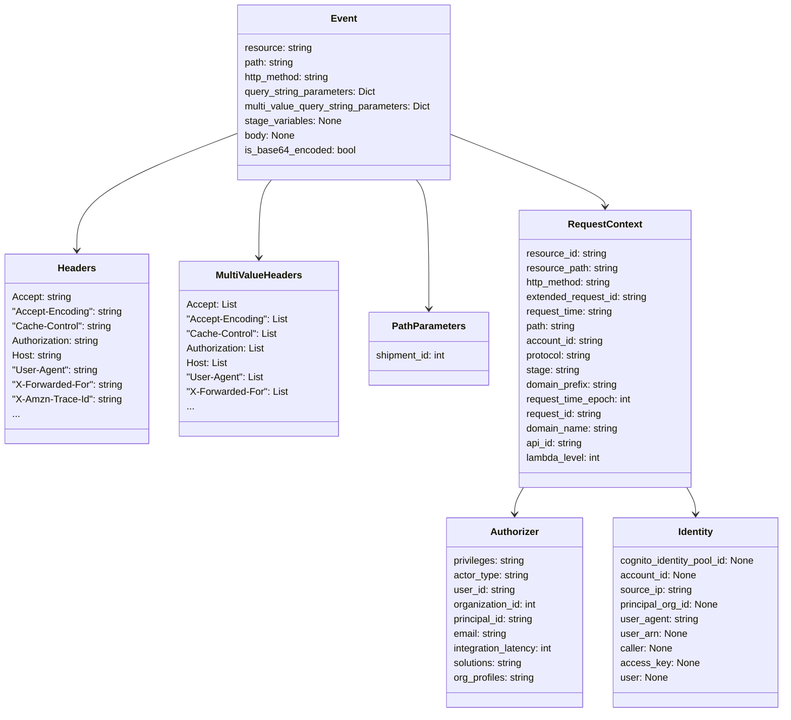

# Diagram: shipment_core/shipment_service/shipment_service/public/model/event.py

> Auto-generated by Obscura crawlers

## Mermaid

### SVG

<svg id="container" width="1298.740234375" xmlns="http://www.w3.org/2000/svg" class="classDiagram" height="1172" viewBox="0 0 1298.740234375 1172" role="graphics-document document" aria-roledescription="class"><g><defs><marker id="container_class-aggregationStart" class="marker aggregation class" refX="18" refY="7" markerWidth="190" markerHeight="240" orient="auto"><path d="M 18,7 L9,13 L1,7 L9,1 Z"></path></marker></defs><defs><marker id="container_class-aggregationEnd" class="marker aggregation class" refX="1" refY="7" markerWidth="20" markerHeight="28" orient="auto"><path d="M 18,7 L9,13 L1,7 L9,1 Z"></path></marker></defs><defs><marker id="container_class-extensionStart" class="marker extension class" refX="18" refY="7" markerWidth="190" markerHeight="240" orient="auto"><path d="M 1,7 L18,13 V 1 Z"></path></marker></defs><defs><marker id="container_class-extensionEnd" class="marker extension class" refX="1" refY="7" markerWidth="20" markerHeight="28" orient="auto"><path d="M 1,1 V 13 L18,7 Z"></path></marker></defs><defs><marker id="container_class-compositionStart" class="marker composition class" refX="18" refY="7" markerWidth="190" markerHeight="240" orient="auto"><path d="M 18,7 L9,13 L1,7 L9,1 Z"></path></marker></defs><defs><marker id="container_class-compositionEnd" class="marker composition class" refX="1" refY="7" markerWidth="20" markerHeight="28" orient="auto"><path d="M 18,7 L9,13 L1,7 L9,1 Z"></path></marker></defs><defs><marker id="container_class-dependencyStart" class="marker dependency class" refX="6" refY="7" markerWidth="190" markerHeight="240" orient="auto"><path d="M 5,7 L9,13 L1,7 L9,1 Z"></path></marker></defs><defs><marker id="container_class-dependencyEnd" class="marker dependency class" refX="13" refY="7" markerWidth="20" markerHeight="28" orient="auto"><path d="M 18,7 L9,13 L14,7 L9,1 Z"></path></marker></defs><defs><marker id="container_class-lollipopStart" class="marker lollipop class" refX="13" refY="7" markerWidth="190" markerHeight="240" orient="auto"><circle stroke="black" fill="transparent" cx="7" cy="7" r="6"></circle></marker></defs><defs><marker id="container_class-lollipopEnd" class="marker lollipop class" refX="1" refY="7" markerWidth="190" markerHeight="240" orient="auto"><circle stroke="black" fill="transparent" cx="7" cy="7" r="6"></circle></marker></defs><g class="root"><g class="clusters"></g><g class="edgePaths"><path d="M387.336,220.422L343.86,237.185C300.384,253.948,213.432,287.474,169.956,319.404C126.48,351.333,126.48,381.667,126.48,396.833L126.48,412" id="id_Event_Headers_1" class="edge-thickness-normal edge-pattern-solid relation" style=";;;" data-edge="true" data-et="edge" data-id="id_Event_Headers_1" data-points="W3sieCI6Mzg3LjMzNTkzNzUsInkiOjIyMC40MjIwNDY1NTYzOTUzfSx7IngiOjEyNi40ODA0Njg3NSwieSI6MzIxfSx7IngiOjEyNi40ODA0Njg3NSwieSI6NDE4fV0=" marker-end="url(#container_class-dependencyEnd)"></path><path d="M445.456,296L442.003,300.167C438.55,304.333,431.644,312.667,428.191,334C424.738,355.333,424.738,389.667,424.738,406.833L424.738,424" id="id_Event_MultiValueHeaders_2" class="edge-thickness-normal edge-pattern-solid relation" style=";;;" data-edge="true" data-et="edge" data-id="id_Event_MultiValueHeaders_2" data-points="W3sieCI6NDQ1LjQ1NjQzMDI4ODQ2MTU1LCJ5IjoyOTZ9LHsieCI6NDI0LjczODI4MTI1LCJ5IjozMjF9LHsieCI6NDI0LjczODI4MTI1LCJ5Ijo0MzB9XQ==" marker-end="url(#container_class-dependencyEnd)"></path><path d="M684.13,296L687.583,300.167C691.036,304.333,697.942,312.667,701.395,348C704.848,383.333,704.848,445.667,704.848,476.833L704.848,508" id="id_Event_PathParameters_3" class="edge-thickness-normal edge-pattern-solid relation" style=";;;" data-edge="true" data-et="edge" data-id="id_Event_PathParameters_3" data-points="W3sieCI6Njg0LjEyOTUwNzIxMTUzODUsInkiOjI5Nn0seyJ4Ijo3MDQuODQ3NjU2MjUsInkiOjMyMX0seyJ4Ijo3MDQuODQ3NjU2MjUsInkiOjUxNH1d" marker-end="url(#container_class-dependencyEnd)"></path><path d="M742.25,221.225L784.878,237.854C827.507,254.484,912.763,287.742,955.391,307.538C998.02,327.333,998.02,333.667,998.02,336.833L998.02,340" id="id_Event_RequestContext_4" class="edge-thickness-normal edge-pattern-solid relation" style=";;;" data-edge="true" data-et="edge" data-id="id_Event_RequestContext_4" data-points="W3sieCI6NzQyLjI1LCJ5IjoyMjEuMjI1Mjk4OTAxNzcyNjd9LHsieCI6OTk4LjAxOTUzMTI1LCJ5IjozMjF9LHsieCI6OTk4LjAxOTUzMTI1LCJ5IjozNDZ9XQ==" marker-end="url(#container_class-dependencyEnd)"></path><path d="M860.432,802L857.918,806.167C855.403,810.333,850.374,818.667,847.86,826C845.346,833.333,845.346,839.667,845.346,842.833L845.346,846" id="id_RequestContext_Authorizer_5" class="edge-thickness-normal edge-pattern-solid relation" style=";;;" data-edge="true" data-et="edge" data-id="id_RequestContext_Authorizer_5" data-points="W3sieCI6ODYwLjQzMjA0OTc3NzY2OCwieSI6ODAyfSx7IngiOjg0NS4zNDU3MDMxMjUsInkiOjgyN30seyJ4Ijo4NDUuMzQ1NzAzMTI1LCJ5Ijo4NTJ9XQ==" marker-end="url(#container_class-dependencyEnd)"></path><path d="M1135.607,802L1138.121,806.167C1140.636,810.333,1145.665,818.667,1148.179,826C1150.693,833.333,1150.693,839.667,1150.693,842.833L1150.693,846" id="id_RequestContext_Identity_6" class="edge-thickness-normal edge-pattern-solid relation" style=";;;" data-edge="true" data-et="edge" data-id="id_RequestContext_Identity_6" data-points="W3sieCI6MTEzNS42MDcwMTI3MjIzMzIsInkiOjgwMn0seyJ4IjoxMTUwLjY5MzM1OTM3NSwieSI6ODI3fSx7IngiOjExNTAuNjkzMzU5Mzc1LCJ5Ijo4NTJ9XQ==" marker-end="url(#container_class-dependencyEnd)"></path></g><g class="edgeLabels"><g class="edgeLabel"><g class="label" data-id="id_Event_Headers_1" transform="translate(0, 0)"><foreignObject width="0" height="0">

</foreignObject></g></g><g class="edgeLabel"><g class="label" data-id="id_Event_MultiValueHeaders_2" transform="translate(0, 0)"><foreignObject width="0" height="0">

</foreignObject></g></g><g class="edgeLabel"><g class="label" data-id="id_Event_PathParameters_3" transform="translate(0, 0)"><foreignObject width="0" height="0">

</foreignObject></g></g><g class="edgeLabel"><g class="label" data-id="id_Event_RequestContext_4" transform="translate(0, 0)"><foreignObject width="0" height="0">

</foreignObject></g></g><g class="edgeLabel"><g class="label" data-id="id_RequestContext_Authorizer_5" transform="translate(0, 0)"><foreignObject width="0" height="0">

</foreignObject></g></g><g class="edgeLabel"><g class="label" data-id="id_RequestContext_Identity_6" transform="translate(0, 0)"><foreignObject width="0" height="0">

</foreignObject></g></g></g><g class="nodes"><g class="node default" id="classId-Headers-0" transform="translate(126.48046875, 574)"><g class="basic label-container"><path d="M-118.48046875 -156 L118.48046875 -156 L118.48046875 156 L-118.48046875 156" stroke="none" stroke-width="0" fill="#ECECFF" style=""></path><path d="M-118.48046875 -156 C-42.23981019573168 -156, 34.00084835853664 -156, 118.48046875 -156 M-118.48046875 -156 C-51.52826056281093 -156, 15.423947624378144 -156, 118.48046875 -156 M118.48046875 -156 C118.48046875 -57.233599775385954, 118.48046875 41.53280044922809, 118.48046875 156 M118.48046875 -156 C118.48046875 -74.347344609501, 118.48046875 7.305310780998013, 118.48046875 156 M118.48046875 156 C50.637659843776916 156, -17.205149062446168 156, -118.48046875 156 M118.48046875 156 C56.62513806297153 156, -5.23019262405694 156, -118.48046875 156 M-118.48046875 156 C-118.48046875 61.963650778163185, -118.48046875 -32.07269844367363, -118.48046875 -156 M-118.48046875 156 C-118.48046875 38.722709909350996, -118.48046875 -78.55458018129801, -118.48046875 -156" stroke="#9370DB" stroke-width="1.3" fill="none" stroke-dasharray="0 0" style=""></path></g><g class="annotation-group text" transform="translate(0, -132)"></g><g class="label-group text" transform="translate(-30.2421875, -132)"><g class="label" style="font-weight: bolder" transform="translate(0,-12)"><foreignObject width="60.484375" height="24">

Headers

</foreignObject></g></g><g class="members-group text" transform="translate(-106.48046875, -84)"><g class="label" style="" transform="translate(0,-12)"><foreignObject width="97.609375" height="24">

Accept: string

</foreignObject></g><g class="label" style="" transform="translate(0,12)"><foreignObject width="181.859375" height="24">

"Accept-Encoding": string

</foreignObject></g><g class="label" style="" transform="translate(0,36)"><foreignObject width="164.8125" height="24">

"Cache-Control": string

</foreignObject></g><g class="label" style="" transform="translate(0,60)"><foreignObject width="147.84375" height="24">

Authorization: string

</foreignObject></g><g class="label" style="" transform="translate(0,84)"><foreignObject width="83.25" height="24">

Host: string

</foreignObject></g><g class="label" style="" transform="translate(0,108)"><foreignObject width="141.984375" height="24">

"User-Agent": string

</foreignObject></g><g class="label" style="" transform="translate(0,132)"><foreignObject width="182.71875" height="24">

"X-Forwarded-For": string

</foreignObject></g><g class="label" style="" transform="translate(0,156)"><foreignObject width="180.671875" height="24">

"X-Amzn-Trace-Id": string

</foreignObject></g><g class="label" style="" transform="translate(0,180)"><foreignObject width="11.53125" height="24">

...

</foreignObject></g></g><g class="methods-group text" transform="translate(-106.48046875, 156)"></g><g class="divider" style=""><path d="M-118.48046875 -108 C-32.749759607675784 -108, 52.98094953464843 -108, 118.48046875 -108 M-118.48046875 -108 C-36.77913045012829 -108, 44.922207849743415 -108, 118.48046875 -108" stroke="#9370DB" stroke-width="1.3" fill="none" stroke-dasharray="0 0" style=""></path></g><g class="divider" style=""><path d="M-118.48046875 132 C-41.135615790887044 132, 36.20923716822591 132, 118.48046875 132 M-118.48046875 132 C-54.593158505788516 132, 9.294151738422968 132, 118.48046875 132" stroke="#9370DB" stroke-width="1.3" fill="none" stroke-dasharray="0 0" style=""></path></g></g><g class="node default" id="classId-MultiValueHeaders-1" transform="translate(424.73828125, 574)"><g class="basic label-container"><path d="M-129.77734375 -144 L129.77734375 -144 L129.77734375 144 L-129.77734375 144" stroke="none" stroke-width="0" fill="#ECECFF" style=""></path><path d="M-129.77734375 -144 C-31.17479959776749 -144, 67.42774455446502 -144, 129.77734375 -144 M-129.77734375 -144 C-62.49512116649332 -144, 4.787101417013361 -144, 129.77734375 -144 M129.77734375 -144 C129.77734375 -43.63777672763304, 129.77734375 56.72444654473392, 129.77734375 144 M129.77734375 -144 C129.77734375 -34.421310915188414, 129.77734375 75.15737816962317, 129.77734375 144 M129.77734375 144 C76.97945776709085 144, 24.181571784181713 144, -129.77734375 144 M129.77734375 144 C48.382515133947734 144, -33.01231348210453 144, -129.77734375 144 M-129.77734375 144 C-129.77734375 40.26723561194355, -129.77734375 -63.465528776112905, -129.77734375 -144 M-129.77734375 144 C-129.77734375 77.04043605409166, -129.77734375 10.080872108183314, -129.77734375 -144" stroke="#9370DB" stroke-width="1.3" fill="none" stroke-dasharray="0 0" style=""></path></g><g class="annotation-group text" transform="translate(0, -120)"></g><g class="label-group text" transform="translate(-68.7421875, -120)"><g class="label" style="font-weight: bolder" transform="translate(0,-12)"><foreignObject width="137.484375" height="24">

MultiValueHeaders

</foreignObject></g></g><g class="members-group text" transform="translate(-117.77734375, -72)"><g class="label" style="" transform="translate(0,-12)"><foreignObject width="81.703125" height="24">

Accept: List

</foreignObject></g><g class="label" style="" transform="translate(0,12)"><foreignObject width="165.953125" height="24">

"Accept-Encoding": List

</foreignObject></g><g class="label" style="" transform="translate(0,36)"><foreignObject width="148.90625" height="24">

"Cache-Control": List

</foreignObject></g><g class="label" style="" transform="translate(0,60)"><foreignObject width="131.9375" height="24">

Authorization: List

</foreignObject></g><g class="label" style="" transform="translate(0,84)"><foreignObject width="67.359375" height="24">

Host: List

</foreignObject></g><g class="label" style="" transform="translate(0,108)"><foreignObject width="126.09375" height="24">

"User-Agent": List

</foreignObject></g><g class="label" style="" transform="translate(0,132)"><foreignObject width="166.8125" height="24">

"X-Forwarded-For": List

</foreignObject></g><g class="label" style="" transform="translate(0,156)"><foreignObject width="11.53125" height="24">

...

</foreignObject></g></g><g class="methods-group text" transform="translate(-117.77734375, 144)"></g><g class="divider" style=""><path d="M-129.77734375 -96 C-62.45399889796474 -96, 4.869345954070525 -96, 129.77734375 -96 M-129.77734375 -96 C-57.99285799745195 -96, 13.791627755096101 -96, 129.77734375 -96" stroke="#9370DB" stroke-width="1.3" fill="none" stroke-dasharray="0 0" style=""></path></g><g class="divider" style=""><path d="M-129.77734375 120 C-76.46858199518978 120, -23.15982024037956 120, 129.77734375 120 M-129.77734375 120 C-66.17680408135485 120, -2.5762644127097047 120, 129.77734375 120" stroke="#9370DB" stroke-width="1.3" fill="none" stroke-dasharray="0 0" style=""></path></g></g><g class="node default" id="classId-PathParameters-2" transform="translate(704.84765625, 574)"><g class="basic label-container"><path d="M-100.33203125 -60 L100.33203125 -60 L100.33203125 60 L-100.33203125 60" stroke="none" stroke-width="0" fill="#ECECFF" style=""></path><path d="M-100.33203125 -60 C-31.366084484518055 -60, 37.59986228096389 -60, 100.33203125 -60 M-100.33203125 -60 C-29.25979235650709 -60, 41.81244653698582 -60, 100.33203125 -60 M100.33203125 -60 C100.33203125 -31.105618736390937, 100.33203125 -2.2112374727818747, 100.33203125 60 M100.33203125 -60 C100.33203125 -30.26895492485415, 100.33203125 -0.5379098497082992, 100.33203125 60 M100.33203125 60 C32.27862698707999 60, -35.77477727584002 60, -100.33203125 60 M100.33203125 60 C34.016782094112955 60, -32.29846706177409 60, -100.33203125 60 M-100.33203125 60 C-100.33203125 15.301165335960313, -100.33203125 -29.397669328079374, -100.33203125 -60 M-100.33203125 60 C-100.33203125 23.252879681355367, -100.33203125 -13.494240637289266, -100.33203125 -60" stroke="#9370DB" stroke-width="1.3" fill="none" stroke-dasharray="0 0" style=""></path></g><g class="annotation-group text" transform="translate(0, -36)"></g><g class="label-group text" transform="translate(-58.0703125, -36)"><g class="label" style="font-weight: bolder" transform="translate(0,-12)"><foreignObject width="116.140625" height="24">

PathParameters

</foreignObject></g></g><g class="members-group text" transform="translate(-88.33203125, 12)"><g class="label" style="" transform="translate(0,-12)"><foreignObject width="118.59375" height="24">

shipment_id: int

</foreignObject></g></g><g class="methods-group text" transform="translate(-88.33203125, 60)"></g><g class="divider" style=""><path d="M-100.33203125 -12 C-48.81962693205529 -12, 2.692777385889414 -12, 100.33203125 -12 M-100.33203125 -12 C-25.65277197289423 -12, 49.02648730421154 -12, 100.33203125 -12" stroke="#9370DB" stroke-width="1.3" fill="none" stroke-dasharray="0 0" style=""></path></g><g class="divider" style=""><path d="M-100.33203125 36 C-42.19870308447018 36, 15.934625081059636 36, 100.33203125 36 M-100.33203125 36 C-40.07992212949861 36, 20.172186991002775 36, 100.33203125 36" stroke="#9370DB" stroke-width="1.3" fill="none" stroke-dasharray="0 0" style=""></path></g></g><g class="node default" id="classId-Authorizer-3" transform="translate(845.345703125, 1008)"><g class="basic label-container"><path d="M-115.30078125 -156 L115.30078125 -156 L115.30078125 156 L-115.30078125 156" stroke="none" stroke-width="0" fill="#ECECFF" style=""></path><path d="M-115.30078125 -156 C-58.081092632540404 -156, -0.861404015080808 -156, 115.30078125 -156 M-115.30078125 -156 C-36.875898788665694 -156, 41.54898367266861 -156, 115.30078125 -156 M115.30078125 -156 C115.30078125 -64.95726468587084, 115.30078125 26.08547062825832, 115.30078125 156 M115.30078125 -156 C115.30078125 -49.6731071827478, 115.30078125 56.6537856345044, 115.30078125 156 M115.30078125 156 C42.66266655873493 156, -29.975448132530147 156, -115.30078125 156 M115.30078125 156 C63.35329661442262 156, 11.405811978845236 156, -115.30078125 156 M-115.30078125 156 C-115.30078125 87.36094342190104, -115.30078125 18.721886843802082, -115.30078125 -156 M-115.30078125 156 C-115.30078125 52.30597132925608, -115.30078125 -51.38805734148784, -115.30078125 -156" stroke="#9370DB" stroke-width="1.3" fill="none" stroke-dasharray="0 0" style=""></path></g><g class="annotation-group text" transform="translate(0, -132)"></g><g class="label-group text" transform="translate(-38.3671875, -132)"><g class="label" style="font-weight: bolder" transform="translate(0,-12)"><foreignObject width="76.734375" height="24">

Authorizer

</foreignObject></g></g><g class="members-group text" transform="translate(-103.30078125, -84)"><g class="label" style="" transform="translate(0,-12)"><foreignObject width="119.875" height="24">

privileges: string

</foreignObject></g><g class="label" style="" transform="translate(0,12)"><foreignObject width="125.640625" height="24">

actor_type: string

</foreignObject></g><g class="label" style="" transform="translate(0,36)"><foreignObject width="102.515625" height="24">

user_id: string

</foreignObject></g><g class="label" style="" transform="translate(0,60)"><foreignObject width="140.5" height="24">

organization_id: int

</foreignObject></g><g class="label" style="" transform="translate(0,84)"><foreignObject width="136.421875" height="24">

principal_id: string

</foreignObject></g><g class="label" style="" transform="translate(0,108)"><foreignObject width="90.21875" height="24">

email: string

</foreignObject></g><g class="label" style="" transform="translate(0,132)"><foreignObject width="168.234375" height="24">

integration_latency: int

</foreignObject></g><g class="label" style="" transform="translate(0,156)"><foreignObject width="117.015625" height="24">

solutions: string

</foreignObject></g><g class="label" style="" transform="translate(0,180)"><foreignObject width="136.25" height="24">

org_profiles: string

</foreignObject></g></g><g class="methods-group text" transform="translate(-103.30078125, 156)"></g><g class="divider" style=""><path d="M-115.30078125 -108 C-32.948571291577494 -108, 49.40363866684501 -108, 115.30078125 -108 M-115.30078125 -108 C-23.289134829014074 -108, 68.72251159197185 -108, 115.30078125 -108" stroke="#9370DB" stroke-width="1.3" fill="none" stroke-dasharray="0 0" style=""></path></g><g class="divider" style=""><path d="M-115.30078125 132 C-30.175348202730817 132, 54.95008484453837 132, 115.30078125 132 M-115.30078125 132 C-37.0254033710094 132, 41.24997450798119 132, 115.30078125 132" stroke="#9370DB" stroke-width="1.3" fill="none" stroke-dasharray="0 0" style=""></path></g></g><g class="node default" id="classId-Identity-4" transform="translate(1150.693359375, 1008)"><g class="basic label-container"><path d="M-140.046875 -156 L140.046875 -156 L140.046875 156 L-140.046875 156" stroke="none" stroke-width="0" fill="#ECECFF" style=""></path><path d="M-140.046875 -156 C-51.31265706513943 -156, 37.421560869721134 -156, 140.046875 -156 M-140.046875 -156 C-36.37808711717278 -156, 67.29070076565444 -156, 140.046875 -156 M140.046875 -156 C140.046875 -60.601894551836224, 140.046875 34.79621089632755, 140.046875 156 M140.046875 -156 C140.046875 -44.339173282005774, 140.046875 67.32165343598845, 140.046875 156 M140.046875 156 C45.112262165464884 156, -49.82235066907023 156, -140.046875 156 M140.046875 156 C39.274150361565944 156, -61.49857427686811 156, -140.046875 156 M-140.046875 156 C-140.046875 85.973223650705, -140.046875 15.94644730140999, -140.046875 -156 M-140.046875 156 C-140.046875 74.38529170773158, -140.046875 -7.229416584536835, -140.046875 -156" stroke="#9370DB" stroke-width="1.3" fill="none" stroke-dasharray="0 0" style=""></path></g><g class="annotation-group text" transform="translate(0, -132)"></g><g class="label-group text" transform="translate(-28.71875, -132)"><g class="label" style="font-weight: bolder" transform="translate(0,-12)"><foreignObject width="57.4375" height="24">

Identity

</foreignObject></g></g><g class="members-group text" transform="translate(-128.046875, -84)"><g class="label" style="" transform="translate(0,-12)"><foreignObject width="227.375" height="24">

cognito_identity_pool_id: None

</foreignObject></g><g class="label" style="" transform="translate(0,12)"><foreignObject width="126.03125" height="24">

account_id: None

</foreignObject></g><g class="label" style="" transform="translate(0,36)"><foreignObject width="119.609375" height="24">

source_ip: string

</foreignObject></g><g class="label" style="" transform="translate(0,60)"><foreignObject width="164.828125" height="24">

principal_org_id: None

</foreignObject></g><g class="label" style="" transform="translate(0,84)"><foreignObject width="128.671875" height="24">

user_agent: string

</foreignObject></g><g class="label" style="" transform="translate(0,108)"><foreignObject width="109.109375" height="24">

user_arn: None

</foreignObject></g><g class="label" style="" transform="translate(0,132)"><foreignObject width="86.84375" height="24">

caller: None

</foreignObject></g><g class="label" style="" transform="translate(0,156)"><foreignObject width="125.953125" height="24">

access_key: None

</foreignObject></g><g class="label" style="" transform="translate(0,180)"><foreignObject width="78.296875" height="24">

user: None

</foreignObject></g></g><g class="methods-group text" transform="translate(-128.046875, 156)"></g><g class="divider" style=""><path d="M-140.046875 -108 C-46.43026216674831 -108, 47.18635066650339 -108, 140.046875 -108 M-140.046875 -108 C-63.57099195183902 -108, 12.904891096321961 -108, 140.046875 -108" stroke="#9370DB" stroke-width="1.3" fill="none" stroke-dasharray="0 0" style=""></path></g><g class="divider" style=""><path d="M-140.046875 132 C-62.339114485340176 132, 15.368646029319649 132, 140.046875 132 M-140.046875 132 C-72.08661483967352 132, -4.126354679347031 132, 140.046875 132" stroke="#9370DB" stroke-width="1.3" fill="none" stroke-dasharray="0 0" style=""></path></g></g><g class="node default" id="classId-RequestContext-5" transform="translate(998.01953125, 574)"><g class="basic label-container"><path d="M-142.83984375 -228 L142.83984375 -228 L142.83984375 228 L-142.83984375 228" stroke="none" stroke-width="0" fill="#ECECFF" style=""></path><path d="M-142.83984375 -228 C-61.26323657179647 -228, 20.313370606407062 -228, 142.83984375 -228 M-142.83984375 -228 C-39.5169283174517 -228, 63.8059871150966 -228, 142.83984375 -228 M142.83984375 -228 C142.83984375 -124.41114460172311, 142.83984375 -20.822289203446218, 142.83984375 228 M142.83984375 -228 C142.83984375 -113.33976012194967, 142.83984375 1.3204797561006671, 142.83984375 228 M142.83984375 228 C79.51405041507763 228, 16.188257080155253 228, -142.83984375 228 M142.83984375 228 C36.40204348202313 228, -70.03575678595374 228, -142.83984375 228 M-142.83984375 228 C-142.83984375 98.13518604667127, -142.83984375 -31.72962790665747, -142.83984375 -228 M-142.83984375 228 C-142.83984375 103.61922874200953, -142.83984375 -20.76154251598095, -142.83984375 -228" stroke="#9370DB" stroke-width="1.3" fill="none" stroke-dasharray="0 0" style=""></path></g><g class="annotation-group text" transform="translate(0, -204)"></g><g class="label-group text" transform="translate(-58.1484375, -204)"><g class="label" style="font-weight: bolder" transform="translate(0,-12)"><foreignObject width="116.296875" height="24">

RequestContext

</foreignObject></g></g><g class="members-group text" transform="translate(-130.83984375, -156)"><g class="label" style="" transform="translate(0,-12)"><foreignObject width="134.09375" height="24">

resource_id: string

</foreignObject></g><g class="label" style="" transform="translate(0,12)"><foreignObject width="153.203125" height="24">

resource_path: string

</foreignObject></g><g class="label" style="" transform="translate(0,36)"><foreignObject width="144.640625" height="24">

http_method: string

</foreignObject></g><g class="label" style="" transform="translate(0,60)"><foreignObject width="203.53125" height="24">

extended_request_id: string

</foreignObject></g><g class="label" style="" transform="translate(0,84)"><foreignObject width="145.703125" height="24">

request_time: string

</foreignObject></g><g class="label" style="" transform="translate(0,108)"><foreignObject width="82.921875" height="24">

path: string

</foreignObject></g><g class="label" style="" transform="translate(0,132)"><foreignObject width="129.28125" height="24">

account_id: string

</foreignObject></g><g class="label" style="" transform="translate(0,156)"><foreignObject width="110.65625" height="24">

protocol: string

</foreignObject></g><g class="label" style="" transform="translate(0,180)"><foreignObject width="88.1875" height="24">

stage: string

</foreignObject></g><g class="label" style="" transform="translate(0,204)"><foreignObject width="154.203125" height="24">

domain_prefix: string

</foreignObject></g><g class="label" style="" transform="translate(0,228)"><foreignObject width="176.015625" height="24">

request_time_epoch: int

</foreignObject></g><g class="label" style="" transform="translate(0,252)"><foreignObject width="127.390625" height="24">

request_id: string

</foreignObject></g><g class="label" style="" transform="translate(0,276)"><foreignObject width="153.765625" height="24">

domain_name: string

</foreignObject></g><g class="label" style="" transform="translate(0,300)"><foreignObject width="94.84375" height="24">

api_id: string

</foreignObject></g><g class="label" style="" transform="translate(0,324)"><foreignObject width="125.359375" height="24">

lambda_level: int

</foreignObject></g></g><g class="methods-group text" transform="translate(-130.83984375, 228)"></g><g class="divider" style=""><path d="M-142.83984375 -180 C-35.116611294456334 -180, 72.60662116108733 -180, 142.83984375 -180 M-142.83984375 -180 C-83.05468069455378 -180, -23.269517639107576 -180, 142.83984375 -180" stroke="#9370DB" stroke-width="1.3" fill="none" stroke-dasharray="0 0" style=""></path></g><g class="divider" style=""><path d="M-142.83984375 204 C-53.42290788792262 204, 35.99402797415476 204, 142.83984375 204 M-142.83984375 204 C-64.7085248773987 204, 13.422793995202596 204, 142.83984375 204" stroke="#9370DB" stroke-width="1.3" fill="none" stroke-dasharray="0 0" style=""></path></g></g><g class="node default" id="classId-Event-6" transform="translate(564.79296875, 152)"><g class="basic label-container"><path d="M-177.45703125 -144 L177.45703125 -144 L177.45703125 144 L-177.45703125 144" stroke="none" stroke-width="0" fill="#ECECFF" style=""></path><path d="M-177.45703125 -144 C-77.82788749679 -144, 21.801256256420004 -144, 177.45703125 -144 M-177.45703125 -144 C-102.70399985167441 -144, -27.95096845334882 -144, 177.45703125 -144 M177.45703125 -144 C177.45703125 -30.94566408611007, 177.45703125 82.10867182777986, 177.45703125 144 M177.45703125 -144 C177.45703125 -51.83768541649589, 177.45703125 40.324629167008226, 177.45703125 144 M177.45703125 144 C62.250332551236355 144, -52.95636614752729 144, -177.45703125 144 M177.45703125 144 C56.34147857825759 144, -64.77407409348481 144, -177.45703125 144 M-177.45703125 144 C-177.45703125 63.24098105125661, -177.45703125 -17.518037897486778, -177.45703125 -144 M-177.45703125 144 C-177.45703125 82.80158576608969, -177.45703125 21.60317153217936, -177.45703125 -144" stroke="#9370DB" stroke-width="1.3" fill="none" stroke-dasharray="0 0" style=""></path></g><g class="annotation-group text" transform="translate(0, -120)"></g><g class="label-group text" transform="translate(-20.2109375, -120)"><g class="label" style="font-weight: bolder" transform="translate(0,-12)"><foreignObject width="40.421875" height="24">

Event

</foreignObject></g></g><g class="members-group text" transform="translate(-165.45703125, -72)"><g class="label" style="" transform="translate(0,-12)"><foreignObject width="112.015625" height="24">

resource: string

</foreignObject></g><g class="label" style="" transform="translate(0,12)"><foreignObject width="82.921875" height="24">

path: string

</foreignObject></g><g class="label" style="" transform="translate(0,36)"><foreignObject width="144.640625" height="24">

http_method: string

</foreignObject></g><g class="label" style="" transform="translate(0,60)"><foreignObject width="218.296875" height="24">

query_string_parameters: Dict

</foreignObject></g><g class="label" style="" transform="translate(0,84)"><foreignObject width="310.703125" height="24">

multi_value_query_string_parameters: Dict

</foreignObject></g><g class="label" style="" transform="translate(0,108)"><foreignObject width="158.453125" height="24">

stage_variables: None

</foreignObject></g><g class="label" style="" transform="translate(0,132)"><foreignObject width="82.8125" height="24">

body: None

</foreignObject></g><g class="label" style="" transform="translate(0,156)"><foreignObject width="182.703125" height="24">

is_base64_encoded: bool

</foreignObject></g></g><g class="methods-group text" transform="translate(-165.45703125, 144)"></g><g class="divider" style=""><path d="M-177.45703125 -96 C-64.53528477574513 -96, 48.38646169850975 -96, 177.45703125 -96 M-177.45703125 -96 C-54.1098765718352 -96, 69.2372781063296 -96, 177.45703125 -96" stroke="#9370DB" stroke-width="1.3" fill="none" stroke-dasharray="0 0" style=""></path></g><g class="divider" style=""><path d="M-177.45703125 120 C-37.247646394404654 120, 102.96173846119069 120, 177.45703125 120 M-177.45703125 120 C-62.77200965407356 120, 51.913011941852886 120, 177.45703125 120" stroke="#9370DB" stroke-width="1.3" fill="none" stroke-dasharray="0 0" style=""></path></g></g></g></g></g></svg>
