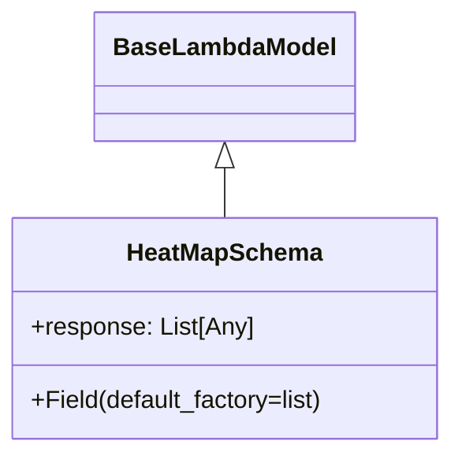

# Diagram: shipment_core/shipment_service/shipment_service/public/model/heat_map.py

> Auto-generated by Obscura crawlers

## Mermaid

### SVG

<svg id="container" width="294.75" xmlns="http://www.w3.org/2000/svg" class="classDiagram" height="294" viewBox="0 0 294.75 294" role="graphics-document document" aria-roledescription="class"><g><defs><marker id="container_class-aggregationStart" class="marker aggregation class" refX="18" refY="7" markerWidth="190" markerHeight="240" orient="auto"><path d="M 18,7 L9,13 L1,7 L9,1 Z"></path></marker></defs><defs><marker id="container_class-aggregationEnd" class="marker aggregation class" refX="1" refY="7" markerWidth="20" markerHeight="28" orient="auto"><path d="M 18,7 L9,13 L1,7 L9,1 Z"></path></marker></defs><defs><marker id="container_class-extensionStart" class="marker extension class" refX="18" refY="7" markerWidth="190" markerHeight="240" orient="auto"><path d="M 1,7 L18,13 V 1 Z"></path></marker></defs><defs><marker id="container_class-extensionEnd" class="marker extension class" refX="1" refY="7" markerWidth="20" markerHeight="28" orient="auto"><path d="M 1,1 V 13 L18,7 Z"></path></marker></defs><defs><marker id="container_class-compositionStart" class="marker composition class" refX="18" refY="7" markerWidth="190" markerHeight="240" orient="auto"><path d="M 18,7 L9,13 L1,7 L9,1 Z"></path></marker></defs><defs><marker id="container_class-compositionEnd" class="marker composition class" refX="1" refY="7" markerWidth="20" markerHeight="28" orient="auto"><path d="M 18,7 L9,13 L1,7 L9,1 Z"></path></marker></defs><defs><marker id="container_class-dependencyStart" class="marker dependency class" refX="6" refY="7" markerWidth="190" markerHeight="240" orient="auto"><path d="M 5,7 L9,13 L1,7 L9,1 Z"></path></marker></defs><defs><marker id="container_class-dependencyEnd" class="marker dependency class" refX="13" refY="7" markerWidth="20" markerHeight="28" orient="auto"><path d="M 18,7 L9,13 L14,7 L9,1 Z"></path></marker></defs><defs><marker id="container_class-lollipopStart" class="marker lollipop class" refX="13" refY="7" markerWidth="190" markerHeight="240" orient="auto"><circle stroke="black" fill="transparent" cx="7" cy="7" r="6"></circle></marker></defs><defs><marker id="container_class-lollipopEnd" class="marker lollipop class" refX="1" refY="7" markerWidth="190" markerHeight="240" orient="auto"><circle stroke="black" fill="transparent" cx="7" cy="7" r="6"></circle></marker></defs><g class="root"><g class="clusters"></g><g class="edgePaths"><path d="M147.375,109.25L147.375,110.542C147.375,111.833,147.375,114.417,147.375,119.875C147.375,125.333,147.375,133.667,147.375,137.833L147.375,142" id="id_BaseLambdaModel_HeatMapSchema_1" class="edge-thickness-normal edge-pattern-solid relation" style=";;;" data-edge="true" data-et="edge" data-id="id_BaseLambdaModel_HeatMapSchema_1" data-points="W3sieCI6MTQ3LjM3NSwieSI6OTJ9LHsieCI6MTQ3LjM3NSwieSI6MTE3fSx7IngiOjE0Ny4zNzUsInkiOjE0Mn1d" marker-start="url(#container_class-extensionStart)"></path></g><g class="edgeLabels"><g class="edgeLabel"><g class="label" data-id="id_BaseLambdaModel_HeatMapSchema_1" transform="translate(0, 0)"><foreignObject width="0" height="0">

</foreignObject></g></g></g><g class="nodes"><g class="node default" id="classId-BaseLambdaModel-0" transform="translate(147.375, 50)"><g class="basic label-container"><path d="M-81.203125 -42 L81.203125 -42 L81.203125 42 L-81.203125 42" stroke="none" stroke-width="0" fill="#ECECFF" style=""></path><path d="M-81.203125 -42 C-43.09771337950587 -42, -4.992301759011738 -42, 81.203125 -42 M-81.203125 -42 C-24.98926682001754 -42, 31.22459135996492 -42, 81.203125 -42 M81.203125 -42 C81.203125 -11.867554242727682, 81.203125 18.264891514544637, 81.203125 42 M81.203125 -42 C81.203125 -22.07649707657495, 81.203125 -2.1529941531498977, 81.203125 42 M81.203125 42 C39.246741626477636 42, -2.709641747044728 42, -81.203125 42 M81.203125 42 C38.68490045317019 42, -3.833324093659627 42, -81.203125 42 M-81.203125 42 C-81.203125 16.519702109450876, -81.203125 -8.960595781098249, -81.203125 -42 M-81.203125 42 C-81.203125 18.29654399286811, -81.203125 -5.406912014263781, -81.203125 -42" stroke="#9370DB" stroke-width="1.3" fill="none" stroke-dasharray="0 0" style=""></path></g><g class="annotation-group text" transform="translate(0, -18)"></g><g class="label-group text" transform="translate(-69.203125, -18)"><g class="label" style="font-weight: bolder" transform="translate(0,-12)"><foreignObject width="138.40625" height="24">

BaseLambdaModel

</foreignObject></g></g><g class="members-group text" transform="translate(-69.203125, 30)"></g><g class="methods-group text" transform="translate(-69.203125, 60)"></g><g class="divider" style=""><path d="M-81.203125 6 C-34.01636851277439 6, 13.170387974451216 6, 81.203125 6 M-81.203125 6 C-16.56819941882091 6, 48.06672616235818 6, 81.203125 6" stroke="#9370DB" stroke-width="1.3" fill="none" stroke-dasharray="0 0" style=""></path></g><g class="divider" style=""><path d="M-81.203125 24 C-30.65370321833627 24, 19.895718563327463 24, 81.203125 24 M-81.203125 24 C-36.01308143215889 24, 9.176962135682217 24, 81.203125 24" stroke="#9370DB" stroke-width="1.3" fill="none" stroke-dasharray="0 0" style=""></path></g></g><g class="node default" id="classId-HeatMapSchema-1" transform="translate(147.375, 214)"><g class="basic label-container"><path d="M-139.375 -72 L139.375 -72 L139.375 72 L-139.375 72" stroke="none" stroke-width="0" fill="#ECECFF" style=""></path><path d="M-139.375 -72 C-59.14314005126333 -72, 21.08871989747334 -72, 139.375 -72 M-139.375 -72 C-46.297628189735235 -72, 46.77974362052953 -72, 139.375 -72 M139.375 -72 C139.375 -28.47252072622957, 139.375 15.054958547540863, 139.375 72 M139.375 -72 C139.375 -16.30249043084965, 139.375 39.3950191383007, 139.375 72 M139.375 72 C71.50564259550022 72, 3.6362851910004395 72, -139.375 72 M139.375 72 C28.197868282209754 72, -82.97926343558049 72, -139.375 72 M-139.375 72 C-139.375 19.771218436210923, -139.375 -32.457563127578155, -139.375 -72 M-139.375 72 C-139.375 27.454757581508495, -139.375 -17.09048483698301, -139.375 -72" stroke="#9370DB" stroke-width="1.3" fill="none" stroke-dasharray="0 0" style=""></path></g><g class="annotation-group text" transform="translate(0, -48)"></g><g class="label-group text" transform="translate(-61.171875, -48)"><g class="label" style="font-weight: bolder" transform="translate(0,-12)"><foreignObject width="122.34375" height="24">

HeatMapSchema

</foreignObject></g></g><g class="members-group text" transform="translate(-127.375, 0)"><g class="label" style="" transform="translate(0,-12)"><foreignObject width="144.859375" height="24">

+response: List[Any]

</foreignObject></g></g><g class="methods-group text" transform="translate(-127.375, 48)"><g class="label" style="" transform="translate(0,-12)"><foreignObject width="193.578125" height="24">

+Field(default_factory=list)

</foreignObject></g></g><g class="divider" style=""><path d="M-139.375 -24 C-39.68239459361297 -24, 60.01021081277406 -24, 139.375 -24 M-139.375 -24 C-35.06543181469107 -24, 69.24413637061787 -24, 139.375 -24" stroke="#9370DB" stroke-width="1.3" fill="none" stroke-dasharray="0 0" style=""></path></g><g class="divider" style=""><path d="M-139.375 24 C-50.02635113082715 24, 39.322297738345696 24, 139.375 24 M-139.375 24 C-37.28233838734138 24, 64.81032322531723 24, 139.375 24" stroke="#9370DB" stroke-width="1.3" fill="none" stroke-dasharray="0 0" style=""></path></g></g></g></g></g></svg>
