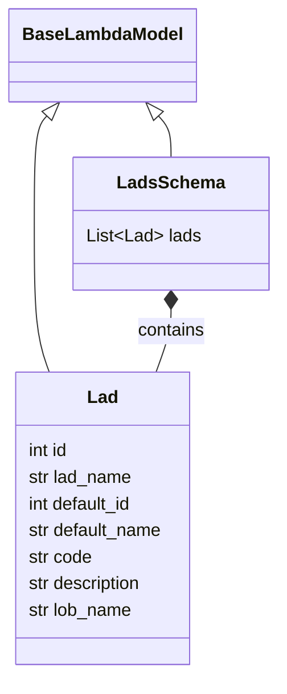

# Diagram: shipment_core/shipment_service/shipment_service/public/model/lad.py

> Auto-generated by Obscura crawlers

## Mermaid

### SVG

<svg id="container" width="243.75" xmlns="http://www.w3.org/2000/svg" class="classDiagram" height="608" viewBox="0 0 243.75 608" role="graphics-document document" aria-roledescription="class"><g><defs><marker id="container_class-aggregationStart" class="marker aggregation class" refX="18" refY="7" markerWidth="190" markerHeight="240" orient="auto"><path d="M 18,7 L9,13 L1,7 L9,1 Z"></path></marker></defs><defs><marker id="container_class-aggregationEnd" class="marker aggregation class" refX="1" refY="7" markerWidth="20" markerHeight="28" orient="auto"><path d="M 18,7 L9,13 L1,7 L9,1 Z"></path></marker></defs><defs><marker id="container_class-extensionStart" class="marker extension class" refX="18" refY="7" markerWidth="190" markerHeight="240" orient="auto"><path d="M 1,7 L18,13 V 1 Z"></path></marker></defs><defs><marker id="container_class-extensionEnd" class="marker extension class" refX="1" refY="7" markerWidth="20" markerHeight="28" orient="auto"><path d="M 1,1 V 13 L18,7 Z"></path></marker></defs><defs><marker id="container_class-compositionStart" class="marker composition class" refX="18" refY="7" markerWidth="190" markerHeight="240" orient="auto"><path d="M 18,7 L9,13 L1,7 L9,1 Z"></path></marker></defs><defs><marker id="container_class-compositionEnd" class="marker composition class" refX="1" refY="7" markerWidth="20" markerHeight="28" orient="auto"><path d="M 18,7 L9,13 L1,7 L9,1 Z"></path></marker></defs><defs><marker id="container_class-dependencyStart" class="marker dependency class" refX="6" refY="7" markerWidth="190" markerHeight="240" orient="auto"><path d="M 5,7 L9,13 L1,7 L9,1 Z"></path></marker></defs><defs><marker id="container_class-dependencyEnd" class="marker dependency class" refX="13" refY="7" markerWidth="20" markerHeight="28" orient="auto"><path d="M 18,7 L9,13 L14,7 L9,1 Z"></path></marker></defs><defs><marker id="container_class-lollipopStart" class="marker lollipop class" refX="13" refY="7" markerWidth="190" markerHeight="240" orient="auto"><circle stroke="black" fill="transparent" cx="7" cy="7" r="6"></circle></marker></defs><defs><marker id="container_class-lollipopEnd" class="marker lollipop class" refX="1" refY="7" markerWidth="190" markerHeight="240" orient="auto"><circle stroke="black" fill="transparent" cx="7" cy="7" r="6"></circle></marker></defs><g class="root"><g class="clusters"></g><g class="edgePaths"><path d="M39.706,104.801L37.869,106.834C36.033,108.868,32.36,112.934,30.524,129.134C28.688,145.333,28.688,173.667,28.688,204C28.688,234.333,28.688,266.667,30.896,289C33.104,311.333,37.52,323.667,39.728,329.833L41.936,336" id="id_BaseLambdaModel_Lad_1" class="edge-thickness-normal edge-pattern-solid relation" style=";;;" data-edge="true" data-et="edge" data-id="id_BaseLambdaModel_Lad_1" data-points="W3sieCI6NTEuMjY3OTU3MDg5NTUyMjQsInkiOjkyfSx7IngiOjI4LjY4NzUsInkiOjExN30seyJ4IjoyOC42ODc1LCJ5IjoyMDJ9LHsieCI6MjguNjg3NSwieSI6Mjk5fSx7IngiOjQxLjkzNjQ4Mjk4ODE2NTY4LCJ5IjozMzZ9XQ==" marker-start="url(#container_class-extensionStart)"></path><path d="M138.701,104.801L140.537,106.834C142.373,108.868,146.046,112.934,147.882,119.134C149.719,125.333,149.719,133.667,149.719,137.833L149.719,142" id="id_BaseLambdaModel_LadsSchema_2" class="edge-thickness-normal edge-pattern-solid relation" style=";;;" data-edge="true" data-et="edge" data-id="id_BaseLambdaModel_LadsSchema_2" data-points="W3sieCI6MTI3LjEzODI5MjkxMDQ0Nzc2LCJ5Ijo5Mn0seyJ4IjoxNDkuNzE4NzUsInkiOjExN30seyJ4IjoxNDkuNzE4NzUsInkiOjE0Mn1d" marker-start="url(#container_class-extensionStart)"></path><path d="M149.719,279.25L149.719,282.542C149.719,285.833,149.719,292.417,147.511,301.875C145.302,311.333,140.886,323.667,138.678,329.833L136.47,336" id="id_LadsSchema_Lad_3" class="edge-thickness-normal edge-pattern-solid relation" style=";;;" data-edge="true" data-et="edge" data-id="id_LadsSchema_Lad_3" data-points="W3sieCI6MTQ5LjcxODc1LCJ5IjoyNjJ9LHsieCI6MTQ5LjcxODc1LCJ5IjoyOTl9LHsieCI6MTM2LjQ2OTc2NzAxMTgzNDM0LCJ5IjozMzZ9XQ==" marker-start="url(#container_class-compositionStart)"></path></g><g class="edgeLabels"><g class="edgeLabel"><g class="label" data-id="id_BaseLambdaModel_Lad_1" transform="translate(0, 0)"><foreignObject width="0" height="0">

</foreignObject></g></g><g class="edgeLabel"><g class="label" data-id="id_BaseLambdaModel_LadsSchema_2" transform="translate(0, 0)"><foreignObject width="0" height="0">

</foreignObject></g></g><g class="edgeLabel" transform="translate(149.71875, 299)"><g class="label" data-id="id_LadsSchema_Lad_3" transform="translate(-30.890625, -12)"><foreignObject width="61.78125" height="24">

contains

</foreignObject></g></g></g><g class="nodes"><g class="node default" id="classId-BaseLambdaModel-0" transform="translate(89.203125, 50)"><g class="basic label-container"><path d="M-81.203125 -42 L81.203125 -42 L81.203125 42 L-81.203125 42" stroke="none" stroke-width="0" fill="#ECECFF" style=""></path><path d="M-81.203125 -42 C-35.772317198851006 -42, 9.658490602297988 -42, 81.203125 -42 M-81.203125 -42 C-44.3595344453063 -42, -7.515943890612604 -42, 81.203125 -42 M81.203125 -42 C81.203125 -15.282345592176249, 81.203125 11.435308815647502, 81.203125 42 M81.203125 -42 C81.203125 -19.743249315501263, 81.203125 2.513501368997474, 81.203125 42 M81.203125 42 C32.87194612215769 42, -15.459232755684624 42, -81.203125 42 M81.203125 42 C42.38993408171067 42, 3.576743163421341 42, -81.203125 42 M-81.203125 42 C-81.203125 10.348821854563337, -81.203125 -21.302356290873327, -81.203125 -42 M-81.203125 42 C-81.203125 23.29829722141431, -81.203125 4.596594442828618, -81.203125 -42" stroke="#9370DB" stroke-width="1.3" fill="none" stroke-dasharray="0 0" style=""></path></g><g class="annotation-group text" transform="translate(0, -18)"></g><g class="label-group text" transform="translate(-69.203125, -18)"><g class="label" style="font-weight: bolder" transform="translate(0,-12)"><foreignObject width="138.40625" height="24">

BaseLambdaModel

</foreignObject></g></g><g class="members-group text" transform="translate(-69.203125, 30)"></g><g class="methods-group text" transform="translate(-69.203125, 60)"></g><g class="divider" style=""><path d="M-81.203125 6 C-32.18419286257718 6, 16.834739274845646 6, 81.203125 6 M-81.203125 6 C-16.779992048349328 6, 47.643140903301344 6, 81.203125 6" stroke="#9370DB" stroke-width="1.3" fill="none" stroke-dasharray="0 0" style=""></path></g><g class="divider" style=""><path d="M-81.203125 24 C-43.011210358840565 24, -4.819295717681129 24, 81.203125 24 M-81.203125 24 C-31.293640810220992 24, 18.615843379558015 24, 81.203125 24" stroke="#9370DB" stroke-width="1.3" fill="none" stroke-dasharray="0 0" style=""></path></g></g><g class="node default" id="classId-Lad-1" transform="translate(89.203125, 468)"><g class="basic label-container"><path d="M-80.74609375 -132 L80.74609375 -132 L80.74609375 132 L-80.74609375 132" stroke="none" stroke-width="0" fill="#ECECFF" style=""></path><path d="M-80.74609375 -132 C-17.041102200682168 -132, 46.663889348635664 -132, 80.74609375 -132 M-80.74609375 -132 C-21.071631128877975 -132, 38.60283149224405 -132, 80.74609375 -132 M80.74609375 -132 C80.74609375 -53.8657350785672, 80.74609375 24.268529842865604, 80.74609375 132 M80.74609375 -132 C80.74609375 -54.7580861893741, 80.74609375 22.483827621251805, 80.74609375 132 M80.74609375 132 C22.527003014714396 132, -35.69208772057121 132, -80.74609375 132 M80.74609375 132 C26.56783612963995 132, -27.6104214907201 132, -80.74609375 132 M-80.74609375 132 C-80.74609375 50.85941956180815, -80.74609375 -30.281160876383694, -80.74609375 -132 M-80.74609375 132 C-80.74609375 69.73371363809868, -80.74609375 7.4674272761973555, -80.74609375 -132" stroke="#9370DB" stroke-width="1.3" fill="none" stroke-dasharray="0 0" style=""></path></g><g class="annotation-group text" transform="translate(0, -108)"></g><g class="label-group text" transform="translate(-13.2109375, -108)"><g class="label" style="font-weight: bolder" transform="translate(0,-12)"><foreignObject width="26.421875" height="24">

Lad

</foreignObject></g></g><g class="members-group text" transform="translate(-68.74609375, -60)"><g class="label" style="" transform="translate(0,-12)"><foreignObject width="37.984375" height="24">

int id

</foreignObject></g><g class="label" style="" transform="translate(0,12)"><foreignObject width="95.390625" height="24">

str lad_name

</foreignObject></g><g class="label" style="" transform="translate(0,36)"><foreignObject width="98.09375" height="24">

int default_id

</foreignObject></g><g class="label" style="" transform="translate(0,60)"><foreignObject width="124.28125" height="24">

str default_name

</foreignObject></g><g class="label" style="" transform="translate(0,84)"><foreignObject width="58.625" height="24">

str code

</foreignObject></g><g class="label" style="" transform="translate(0,108)"><foreignObject width="106.28125" height="24">

str description

</foreignObject></g><g class="label" style="" transform="translate(0,132)"><foreignObject width="95.640625" height="24">

str lob_name

</foreignObject></g></g><g class="methods-group text" transform="translate(-68.74609375, 132)"></g><g class="divider" style=""><path d="M-80.74609375 -84 C-29.831960610261255 -84, 21.08217252947749 -84, 80.74609375 -84 M-80.74609375 -84 C-43.24859932315274 -84, -5.751104896305478 -84, 80.74609375 -84" stroke="#9370DB" stroke-width="1.3" fill="none" stroke-dasharray="0 0" style=""></path></g><g class="divider" style=""><path d="M-80.74609375 108 C-35.95928787837839 108, 8.82751799324322 108, 80.74609375 108 M-80.74609375 108 C-43.87300504464816 108, -6.99991633929632 108, 80.74609375 108" stroke="#9370DB" stroke-width="1.3" fill="none" stroke-dasharray="0 0" style=""></path></g></g><g class="node default" id="classId-LadsSchema-2" transform="translate(149.71875, 202)"><g class="basic label-container"><path d="M-86.03125 -60 L86.03125 -60 L86.03125 60 L-86.03125 60" stroke="none" stroke-width="0" fill="#ECECFF" style=""></path><path d="M-86.03125 -60 C-31.855261533423395 -60, 22.32072693315321 -60, 86.03125 -60 M-86.03125 -60 C-22.83687114074396 -60, 40.35750771851208 -60, 86.03125 -60 M86.03125 -60 C86.03125 -16.76005314451217, 86.03125 26.47989371097566, 86.03125 60 M86.03125 -60 C86.03125 -14.236900223617063, 86.03125 31.526199552765874, 86.03125 60 M86.03125 60 C19.471943278497235 60, -47.08736344300553 60, -86.03125 60 M86.03125 60 C50.98458407221353 60, 15.937918144427059 60, -86.03125 60 M-86.03125 60 C-86.03125 27.061306195899014, -86.03125 -5.877387608201971, -86.03125 -60 M-86.03125 60 C-86.03125 34.546800270045935, -86.03125 9.093600540091877, -86.03125 -60" stroke="#9370DB" stroke-width="1.3" fill="none" stroke-dasharray="0 0" style=""></path></g><g class="annotation-group text" transform="translate(0, -36)"></g><g class="label-group text" transform="translate(-45.65625, -36)"><g class="label" style="font-weight: bolder" transform="translate(0,-12)"><foreignObject width="91.3125" height="24">

LadsSchema

</foreignObject></g></g><g class="members-group text" transform="translate(-74.03125, 12)"><g class="label" style="" transform="translate(0,-12)"><foreignObject width="102.40625" height="24">

List&lt;Lad&gt; lads

</foreignObject></g></g><g class="methods-group text" transform="translate(-74.03125, 60)"></g><g class="divider" style=""><path d="M-86.03125 -12 C-50.71368987123292 -12, -15.396129742465845 -12, 86.03125 -12 M-86.03125 -12 C-46.47572224132063 -12, -6.920194482641264 -12, 86.03125 -12" stroke="#9370DB" stroke-width="1.3" fill="none" stroke-dasharray="0 0" style=""></path></g><g class="divider" style=""><path d="M-86.03125 36 C-47.98634026796643 36, -9.941430535932867 36, 86.03125 36 M-86.03125 36 C-18.96274672409625 36, 48.1057565518075 36, 86.03125 36" stroke="#9370DB" stroke-width="1.3" fill="none" stroke-dasharray="0 0" style=""></path></g></g></g></g></g></svg>
