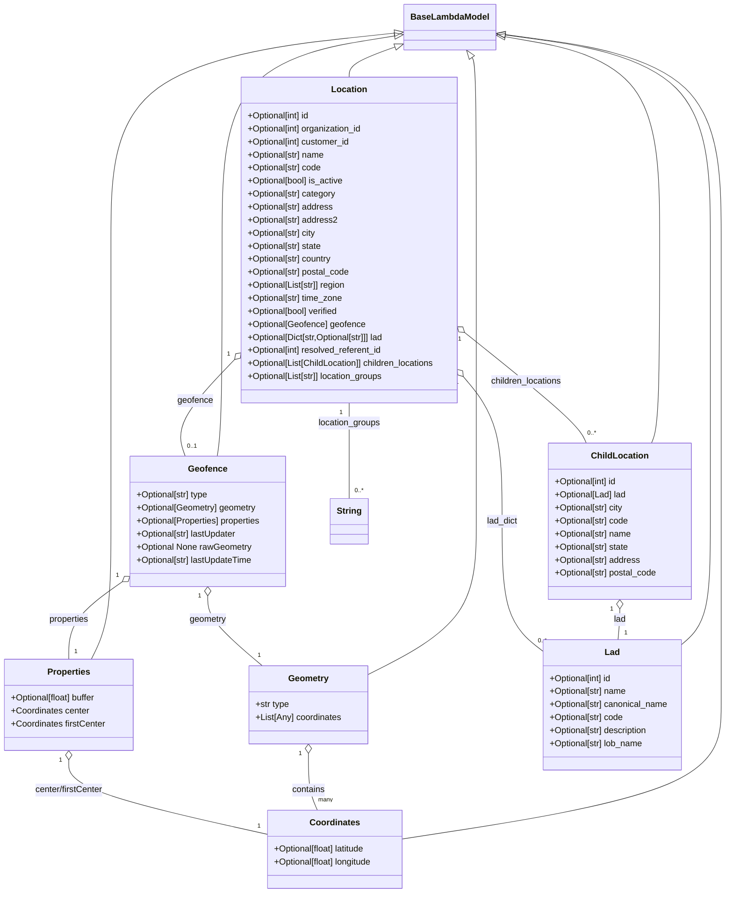

# Diagram: shipment_core/shipment_service/shipment_service/public/model/locations.py

> Auto-generated by Obscura crawlers

## Mermaid

### SVG

<svg id="container" width="1356.93798828125" xmlns="http://www.w3.org/2000/svg" class="classDiagram" height="1644" viewBox="0 0 1356.93798828125 1644" role="graphics-document document" aria-roledescription="class"><g><defs><marker id="container_class-aggregationStart" class="marker aggregation class" refX="18" refY="7" markerWidth="190" markerHeight="240" orient="auto"><path d="M 18,7 L9,13 L1,7 L9,1 Z"></path></marker></defs><defs><marker id="container_class-aggregationEnd" class="marker aggregation class" refX="1" refY="7" markerWidth="20" markerHeight="28" orient="auto"><path d="M 18,7 L9,13 L1,7 L9,1 Z"></path></marker></defs><defs><marker id="container_class-extensionStart" class="marker extension class" refX="18" refY="7" markerWidth="190" markerHeight="240" orient="auto"><path d="M 1,7 L18,13 V 1 Z"></path></marker></defs><defs><marker id="container_class-extensionEnd" class="marker extension class" refX="1" refY="7" markerWidth="20" markerHeight="28" orient="auto"><path d="M 1,1 V 13 L18,7 Z"></path></marker></defs><defs><marker id="container_class-compositionStart" class="marker composition class" refX="18" refY="7" markerWidth="190" markerHeight="240" orient="auto"><path d="M 18,7 L9,13 L1,7 L9,1 Z"></path></marker></defs><defs><marker id="container_class-compositionEnd" class="marker composition class" refX="1" refY="7" markerWidth="20" markerHeight="28" orient="auto"><path d="M 18,7 L9,13 L1,7 L9,1 Z"></path></marker></defs><defs><marker id="container_class-dependencyStart" class="marker dependency class" refX="6" refY="7" markerWidth="190" markerHeight="240" orient="auto"><path d="M 5,7 L9,13 L1,7 L9,1 Z"></path></marker></defs><defs><marker id="container_class-dependencyEnd" class="marker dependency class" refX="13" refY="7" markerWidth="20" markerHeight="28" orient="auto"><path d="M 18,7 L9,13 L14,7 L9,1 Z"></path></marker></defs><defs><marker id="container_class-lollipopStart" class="marker lollipop class" refX="13" refY="7" markerWidth="190" markerHeight="240" orient="auto"><circle stroke="black" fill="transparent" cx="7" cy="7" r="6"></circle></marker></defs><defs><marker id="container_class-lollipopEnd" class="marker lollipop class" refX="1" refY="7" markerWidth="190" markerHeight="240" orient="auto"><circle stroke="black" fill="transparent" cx="7" cy="7" r="6"></circle></marker></defs><g class="root"><g class="clusters"></g><g class="edgePaths"><path d="M883.445,105.74L884.87,107.617C886.294,109.493,889.143,113.247,890.568,169.29C891.992,225.333,891.992,333.667,891.992,444C891.992,554.333,891.992,666.667,891.992,753C891.992,839.333,891.992,899.667,891.992,960C891.992,1020.333,891.992,1080.667,857.468,1127.919C822.945,1175.172,753.897,1209.344,719.373,1226.43L684.85,1243.516" id="id_BaseLambdaModel_Geometry_1" class="edge-thickness-normal edge-pattern-solid relation" style=";;;" data-edge="true" data-et="edge" data-id="id_BaseLambdaModel_Geometry_1" data-points="W3sieCI6ODczLjAxNTUzNzU0NjY0MTgsInkiOjkyfSx7IngiOjg5MS45OTIxODc1LCJ5IjoxMTd9LHsieCI6ODkxLjk5MjE4NzUsInkiOjQ0Mn0seyJ4Ijo4OTEuOTkyMTg3NSwieSI6Nzc5fSx7IngiOjg5MS45OTIxODc1LCJ5Ijo5NjB9LHsieCI6ODkxLjk5MjE4NzUsInkiOjExNDF9LHsieCI6Njg0Ljg0OTYwOTM3NSwieSI6MTI0My41MTU5NTUyNTI2NDI3fV0=" marker-start="url(#container_class-extensionStart)"></path><path d="M939.44,62.97L1007.689,71.975C1075.939,80.98,1212.438,98.99,1280.688,162.162C1348.938,225.333,1348.938,333.667,1348.938,444C1348.938,554.333,1348.938,666.667,1348.938,753C1348.938,839.333,1348.938,899.667,1348.938,960C1348.938,1020.333,1348.938,1080.667,1348.938,1137C1348.938,1193.333,1348.938,1245.667,1348.938,1298C1348.938,1350.333,1348.938,1402.667,1249.73,1443.783C1150.522,1484.9,952.107,1514.8,852.899,1529.75L753.691,1544.7" id="id_BaseLambdaModel_Coordinates_2" class="edge-thickness-normal edge-pattern-solid relation" style=";;;" data-edge="true" data-et="edge" data-id="id_BaseLambdaModel_Coordinates_2" data-points="W3sieCI6OTIyLjMzNzg5MDYyNSwieSI6NjAuNzE0MDIxNDIzNDg4OTE2fSx7IngiOjEzNDguOTM3NSwieSI6MTE3fSx7IngiOjEzNDguOTM3NSwieSI6NDQyfSx7IngiOjEzNDguOTM3NSwieSI6Nzc5fSx7IngiOjEzNDguOTM3NSwieSI6OTYwfSx7IngiOjEzNDguOTM3NSwieSI6MTE0MX0seyJ4IjoxMzQ4LjkzNzUsInkiOjEyOTh9LHsieCI6MTM0OC45Mzc1LCJ5IjoxNDU1fSx7IngiOjc1My42OTE0MDYyNSwieSI6MTU0NC42OTk5ODkxOTkxMTQzfV0=" marker-start="url(#container_class-extensionStart)"></path><path d="M742.776,60.338L652.931,69.782C563.086,79.226,383.397,98.113,293.552,161.723C203.707,225.333,203.707,333.667,203.707,444C203.707,554.333,203.707,666.667,203.707,753C203.707,839.333,203.707,899.667,203.707,960C203.707,1020.333,203.707,1080.667,197.724,1123C191.741,1165.333,179.776,1189.667,173.793,1201.833L167.81,1214" id="id_BaseLambdaModel_Properties_3" class="edge-thickness-normal edge-pattern-solid relation" style=";;;" data-edge="true" data-et="edge" data-id="id_BaseLambdaModel_Properties_3" data-points="W3sieCI6NzU5LjkzMTY0MDYyNSwieSI6NTguNTM1MjU2NzUzOTgyNTN9LHsieCI6MjAzLjcwNzAzMTI1LCJ5IjoxMTd9LHsieCI6MjAzLjcwNzAzMTI1LCJ5Ijo0NDJ9LHsieCI6MjAzLjcwNzAzMTI1LCJ5Ijo3Nzl9LHsieCI6MjAzLjcwNzAzMTI1LCJ5Ijo5NjB9LHsieCI6MjAzLjcwNzAzMTI1LCJ5IjoxMTQxfSx7IngiOjE2Ny44MTAwMzY4MjMyNDg0MiwieSI6MTIxNH1d" marker-start="url(#container_class-extensionStart)"></path><path d="M742.888,65.339L687.737,73.949C632.587,82.559,522.286,99.78,467.135,162.556C411.984,225.333,411.984,333.667,411.984,444C411.984,554.333,411.984,666.667,410.503,733C409.022,799.333,406.059,819.667,404.578,829.833L403.097,840" id="id_BaseLambdaModel_Geofence_4" class="edge-thickness-normal edge-pattern-solid relation" style=";;;" data-edge="true" data-et="edge" data-id="id_BaseLambdaModel_Geofence_4" data-points="W3sieCI6NzU5LjkzMTY0MDYyNSwieSI6NjIuNjc3NjI4ODU0MjQ5NjN9LHsieCI6NDExLjk4NDM3NSwieSI6MTE3fSx7IngiOjQxMS45ODQzNzUsInkiOjQ0Mn0seyJ4Ijo0MTEuOTg0Mzc1LCJ5Ijo3Nzl9LHsieCI6NDAzLjA5Njg3OTMxNjI5ODMsInkiOjg0MH1d" marker-start="url(#container_class-extensionStart)"></path><path d="M939.427,63.501L1004.346,72.417C1069.264,81.334,1199.101,99.167,1264.019,162.25C1328.938,225.333,1328.938,333.667,1328.938,444C1328.938,554.333,1328.938,666.667,1328.938,753C1328.938,839.333,1328.938,899.667,1328.938,960C1328.938,1020.333,1328.938,1080.667,1320.479,1118.174C1312.02,1155.681,1295.103,1170.361,1286.644,1177.702L1278.186,1185.042" id="id_BaseLambdaModel_Lad_5" class="edge-thickness-normal edge-pattern-solid relation" style=";;;" data-edge="true" data-et="edge" data-id="id_BaseLambdaModel_Lad_5" data-points="W3sieCI6OTIyLjMzNzg5MDYyNSwieSI6NjEuMTUzMjk4MjMyMjY3NjJ9LHsieCI6MTMyOC45Mzc1LCJ5IjoxMTd9LHsieCI6MTMyOC45Mzc1LCJ5Ijo0NDJ9LHsieCI6MTMyOC45Mzc1LCJ5Ijo3Nzl9LHsieCI6MTMyOC45Mzc1LCJ5Ijo5NjB9LHsieCI6MTMyOC45Mzc1LCJ5IjoxMTQxfSx7IngiOjEyNzguMTg1NTQ2ODc1LCJ5IjoxMTg1LjA0MTg5NzQyMDk0OTd9XQ==" marker-start="url(#container_class-extensionStart)"></path><path d="M939.343,66.718L988.574,75.098C1037.806,83.478,1136.268,100.239,1185.499,162.786C1234.73,225.333,1234.73,333.667,1234.73,444C1234.73,554.333,1234.73,666.667,1232.202,729C1229.674,791.333,1224.618,803.667,1222.089,809.833L1219.561,816" id="id_BaseLambdaModel_ChildLocation_6" class="edge-thickness-normal edge-pattern-solid relation" style=";;;" data-edge="true" data-et="edge" data-id="id_BaseLambdaModel_ChildLocation_6" data-points="W3sieCI6OTIyLjMzNzg5MDYyNSwieSI6NjMuODIyODM3MzIyMTY0OTM2fSx7IngiOjEyMzQuNzMwNDY4NzUsInkiOjExN30seyJ4IjoxMjM0LjczMDQ2ODc1LCJ5Ijo0NDJ9LHsieCI6MTIzNC43MzA0Njg3NSwieSI6Nzc5fSx7IngiOjEyMTkuNTYxMDc1NjIxNTQ3LCJ5Ijo4MTZ9XQ==" marker-start="url(#container_class-extensionStart)"></path><path d="M743.672,84.524L728.391,89.936C713.11,95.349,682.549,106.175,667.269,115.754C651.988,125.333,651.988,133.667,651.988,137.833L651.988,142" id="id_BaseLambdaModel_Location_7" class="edge-thickness-normal edge-pattern-solid relation" style=";;;" data-edge="true" data-et="edge" data-id="id_BaseLambdaModel_Location_7" data-points="W3sieCI6NzU5LjkzMTY0MDYyNSwieSI6NzguNzYzOTk5NDYzMDQ4NDR9LHsieCI6NjUxLjk4ODI4MTI1LCJ5IjoxMTd9LHsieCI6NjUxLjk4ODI4MTI1LCJ5IjoxNDJ9XQ==" marker-start="url(#container_class-extensionStart)"></path><path d="M574.76,1387.25L574.76,1398.542C574.76,1409.833,574.76,1432.417,577.637,1449.875C580.514,1467.333,586.269,1479.667,589.146,1485.833L592.023,1492" id="id_Geometry_Coordinates_8" class="edge-thickness-normal edge-pattern-solid relation" style=";;;" data-edge="true" data-et="edge" data-id="id_Geometry_Coordinates_8" data-points="W3sieCI6NTc0Ljc1OTc2NTYyNSwieSI6MTM3MH0seyJ4Ijo1NzQuNzU5NzY1NjI1LCJ5IjoxNDU1fSx7IngiOjU5Mi4wMjMyOTQxNTEzNzYxLCJ5IjoxNDkyfV0=" marker-start="url(#container_class-aggregationStart)"></path><path d="M126.504,1399.25L126.504,1408.542C126.504,1417.833,126.504,1436.417,188.344,1459.213C250.184,1482.01,373.863,1509.02,435.703,1522.525L497.543,1536.03" id="id_Properties_Coordinates_9" class="edge-thickness-normal edge-pattern-solid relation" style=";;;" data-edge="true" data-et="edge" data-id="id_Properties_Coordinates_9" data-points="W3sieCI6MTI2LjUwMzkwNjI1LCJ5IjoxMzgyfSx7IngiOjEyNi41MDM5MDYyNSwieSI6MTQ1NX0seyJ4Ijo0OTcuNTQyOTY4NzUsInkiOjE1MzYuMDMwMjE3NjUxNjE2Nn1d" marker-start="url(#container_class-aggregationStart)"></path><path d="M385.613,1097.25L385.613,1104.542C385.613,1111.833,385.613,1126.417,402.681,1147.875C419.748,1169.333,453.883,1197.667,470.95,1211.833L488.017,1226" id="id_Geofence_Geometry_10" class="edge-thickness-normal edge-pattern-solid relation" style=";;;" data-edge="true" data-et="edge" data-id="id_Geofence_Geometry_10" data-points="W3sieCI6Mzg1LjYxMzI4MTI1LCJ5IjoxMDgwfSx7IngiOjM4NS42MTMyODEyNSwieSI6MTE0MX0seyJ4Ijo0ODguMDE3NDI4ODQxNTYwNSwieSI6MTIyNn1d" marker-start="url(#container_class-aggregationStart)"></path><path d="M224.566,1072.499L208.222,1083.916C191.878,1095.333,159.191,1118.166,142.848,1141.75C126.504,1165.333,126.504,1189.667,126.504,1201.833L126.504,1214" id="id_Geofence_Properties_11" class="edge-thickness-normal edge-pattern-solid relation" style=";;;" data-edge="true" data-et="edge" data-id="id_Geofence_Properties_11" data-points="W3sieCI6MjM4LjcwNzAzMTI1LCJ5IjoxMDYyLjYyMDg3NjgwMTU0Mzh9LHsieCI6MTI2LjUwMzkwNjI1LCJ5IjoxMTQxfSx7IngiOjEyNi41MDM5MDYyNSwieSI6MTIxNH1d" marker-start="url(#container_class-aggregationStart)"></path><path d="M1160.523,1121.25L1160.523,1124.542C1160.523,1127.833,1160.523,1134.417,1160.032,1143.875C1159.541,1153.333,1158.559,1165.667,1158.067,1171.833L1157.576,1178" id="id_ChildLocation_Lad_12" class="edge-thickness-normal edge-pattern-solid relation" style=";;;" data-edge="true" data-et="edge" data-id="id_ChildLocation_Lad_12" data-points="W3sieCI6MTE2MC41MjM0Mzc1LCJ5IjoxMTA0fSx7IngiOjExNjAuNTIzNDM3NSwieSI6MTE0MX0seyJ4IjoxMTU3LjU3NjE5Njc1NTU3MzIsInkiOjExNzh9XQ==" marker-start="url(#container_class-aggregationStart)"></path><path d="M434.898,663.055L415.92,682.379C396.942,701.703,358.987,740.352,343.637,769.842C328.286,799.333,335.541,819.667,339.169,829.833L342.796,840" id="id_Location_Geofence_13" class="edge-thickness-normal edge-pattern-solid relation" style=";;;" data-edge="true" data-et="edge" data-id="id_Location_Geofence_13" data-points="W3sieCI6NDQ2Ljk4NDM3NSwieSI6NjUwLjc0NzA4NzYzNjQ3MX0seyJ4IjozMjEuMDMxMjUsInkiOjc3OX0seyJ4IjozNDIuNzk2NDY0OTUxNjU3NDcsInkiOjg0MH1d" marker-start="url(#container_class-aggregationStart)"></path><path d="M870.588,612.695L906.085,640.412C941.581,668.13,1012.574,723.565,1050.692,757.449C1088.81,791.333,1094.054,803.667,1096.676,809.833L1099.298,816" id="id_Location_ChildLocation_14" class="edge-thickness-normal edge-pattern-solid relation" style=";;;" data-edge="true" data-et="edge" data-id="id_Location_ChildLocation_14" data-points="W3sieCI6ODU2Ljk5MjE4NzUsInkiOjYwMi4wNzgzNTUyMzY5NTczfSx7IngiOjEwODMuNTY2NDA2MjUsInkiOjc3OX0seyJ4IjoxMDk5LjI5Nzk1NDA3NDU4NTcsInkiOjgxNn1d" marker-start="url(#container_class-aggregationStart)"></path><path d="M868.226,693.979L880.386,708.149C892.546,722.319,916.867,750.66,929.027,794.996C941.188,839.333,941.188,899.667,941.188,960C941.188,1020.333,941.188,1080.667,953.965,1120.532C966.742,1160.397,992.296,1179.795,1005.073,1189.494L1017.85,1199.192" id="id_Location_Lad_15" class="edge-thickness-normal edge-pattern-solid relation" style=";;;" data-edge="true" data-et="edge" data-id="id_Location_Lad_15" data-points="W3sieCI6ODU2Ljk5MjE4NzUsInkiOjY4MC44ODgzMjMwOTA0MzAyfSx7IngiOjk0MS4xODc1LCJ5Ijo3Nzl9LHsieCI6OTQxLjE4NzUsInkiOjk2MH0seyJ4Ijo5NDEuMTg3NSwieSI6MTE0MX0seyJ4IjoxMDE3Ljg0OTYwOTM3NSwieSI6MTE5OS4xOTI0NjA1OTg1MDYyfV0=" marker-start="url(#container_class-aggregationStart)"></path><path d="M651.988,742L651.988,748.167C651.988,754.333,651.988,766.667,651.988,796C651.988,825.333,651.988,871.667,651.988,894.833L651.988,918" id="id_Location_String_16" class="edge-thickness-normal edge-pattern-solid relation" style=";;;" data-edge="true" data-et="edge" data-id="id_Location_String_16" data-points="W3sieCI6NjUxLjk4ODI4MTI1LCJ5Ijo3NDJ9LHsieCI6NjUxLjk4ODI4MTI1LCJ5Ijo3Nzl9LHsieCI6NjUxLjk4ODI4MTI1LCJ5Ijo5MTh9XQ=="></path></g><g class="edgeLabels"><g class="edgeLabel"><g class="label" data-id="id_BaseLambdaModel_Geometry_1" transform="translate(0, 0)"><foreignObject width="0" height="0">

</foreignObject></g></g><g class="edgeLabel"><g class="label" data-id="id_BaseLambdaModel_Coordinates_2" transform="translate(0, 0)"><foreignObject width="0" height="0">

</foreignObject></g></g><g class="edgeLabel"><g class="label" data-id="id_BaseLambdaModel_Properties_3" transform="translate(0, 0)"><foreignObject width="0" height="0">

</foreignObject></g></g><g class="edgeLabel"><g class="label" data-id="id_BaseLambdaModel_Geofence_4" transform="translate(0, 0)"><foreignObject width="0" height="0">

</foreignObject></g></g><g class="edgeLabel"><g class="label" data-id="id_BaseLambdaModel_Lad_5" transform="translate(0, 0)"><foreignObject width="0" height="0">

</foreignObject></g></g><g class="edgeLabel"><g class="label" data-id="id_BaseLambdaModel_ChildLocation_6" transform="translate(0, 0)"><foreignObject width="0" height="0">

</foreignObject></g></g><g class="edgeLabel"><g class="label" data-id="id_BaseLambdaModel_Location_7" transform="translate(0, 0)"><foreignObject width="0" height="0">

</foreignObject></g></g><g class="edgeLabel" transform="translate(574.759765625, 1455)"><g class="label" data-id="id_Geometry_Coordinates_8" transform="translate(-30.890625, -12)"><foreignObject width="61.78125" height="24">

contains

</foreignObject></g></g><g class="edgeLabel" transform="translate(126.50390625, 1455)"><g class="label" data-id="id_Properties_Coordinates_9" transform="translate(-64.1484375, -12)"><foreignObject width="128.296875" height="24">

center/firstCenter

</foreignObject></g></g><g class="edgeLabel" transform="translate(385.61328125, 1141)"><g class="label" data-id="id_Geofence_Geometry_10" transform="translate(-34.1953125, -12)"><foreignObject width="68.390625" height="24">

geometry

</foreignObject></g></g><g class="edgeLabel" transform="translate(126.50390625, 1141)"><g class="label" data-id="id_Geofence_Properties_11" transform="translate(-37.71875, -12)"><foreignObject width="75.4375" height="24">

properties

</foreignObject></g></g><g class="edgeLabel" transform="translate(1160.5234375, 1141)"><g class="label" data-id="id_ChildLocation_Lad_12" transform="translate(-11.4453125, -12)"><foreignObject width="22.890625" height="24">

lad

</foreignObject></g></g><g class="edgeLabel" transform="translate(361.31742, 737.97824)"><g class="label" data-id="id_Location_Geofence_13" transform="translate(-32.7421875, -12)"><foreignObject width="65.484375" height="24">

geofence

</foreignObject></g></g><g class="edgeLabel" transform="translate(986.12379, 702.91143)"><g class="label" data-id="id_Location_ChildLocation_14" transform="translate(-67.1484375, -12)"><foreignObject width="134.296875" height="24">

children_locations

</foreignObject></g></g><g class="edgeLabel" transform="translate(941.1875, 960)"><g class="label" data-id="id_Location_Lad_15" transform="translate(-29.1953125, -12)"><foreignObject width="58.390625" height="24">

lad_dict

</foreignObject></g></g><g class="edgeLabel" transform="translate(651.98828125, 779)"><g class="label" data-id="id_Location_String_16" transform="translate(-58.6328125, -12)"><foreignObject width="117.265625" height="24">

location_groups

</foreignObject></g></g><g class="edgeTerminals" transform="translate(559.7597678125002, 1387.500001875)"><g class="inner" transform="translate(0, 0)"><foreignObject style="width: 9px; height: 12px;">
1
</foreignObject></g></g><g class="edgeTerminals" transform="translate(111.5039081250001, 1399.5000016071428)"><g class="inner" transform="translate(0, 0)"><foreignObject style="width: 9px; height: 12px;">
1
</foreignObject></g></g><g class="edgeTerminals" transform="translate(370.613280625, 1097.4999994642858)"><g class="inner" transform="translate(0, 0)"><foreignObject style="width: 9px; height: 12px;">
1
</foreignObject></g></g><g class="edgeTerminals" transform="translate(215.77074900046685, 1060.345599336392)"><g class="inner" transform="translate(0, 0)"><foreignObject style="width: 9px; height: 12px;">
1
</foreignObject></g></g><g class="edgeTerminals" transform="translate(1145.52343875, 1121.5000010714286)"><g class="inner" transform="translate(0, 0)"><foreignObject style="width: 9px; height: 12px;">
1
</foreignObject></g></g><g class="edgeTerminals" transform="translate(424.02033751000516, 652.7226784198836)"><g class="inner" transform="translate(0, 0)"><foreignObject style="width: 9px; height: 12px;">
1
</foreignObject></g></g><g class="edgeTerminals" transform="translate(861.5534919454269, 624.6713723590916)"><g class="inner" transform="translate(0, 0)"><foreignObject style="width: 9px; height: 12px;">
1
</foreignObject></g></g><g class="edgeTerminals" transform="translate(857.0056648108782, 703.9371799857043)"><g class="inner" transform="translate(0, 0)"><foreignObject style="width: 9px; height: 12px;">
1
</foreignObject></g></g><g class="edgeTerminals" transform="translate(636.988280625, 759.4999994642857)"><g class="inner" transform="translate(0, 0)"><foreignObject style="width: 9px; height: 12px;">
1
</foreignObject></g></g><g class="edgeTerminals" transform="translate(593.2170905776936, 1464.7989439675162)"><g class="inner" transform="translate(0, 0)"></g><foreignObject style="width: 36px; height: 12px;">
many
</foreignObject></g><g class="edgeTerminals" transform="translate(478.6463060653823, 1512.6418300955875)"><g class="inner" transform="translate(0, 0)"></g><foreignObject style="width: 9px; height: 12px;">
1
</foreignObject></g><g class="edgeTerminals" transform="translate(479.132144048261, 1198.280963234379)"><g class="inner" transform="translate(0, 0)"></g><foreignObject style="width: 9px; height: 12px;">
1
</foreignObject></g><g class="edgeTerminals" transform="translate(136.50390812499992, 1191.5000016071428)"><g class="inner" transform="translate(0, 0)"></g><foreignObject style="width: 9px; height: 12px;">
1
</foreignObject></g><g class="edgeTerminals" transform="translate(1168.9183967144415, 1156.746307800339)"><g class="inner" transform="translate(0, 0)"></g><foreignObject style="width: 9px; height: 12px;">
1
</foreignObject></g><g class="edgeTerminals" transform="translate(346.0431246011626, 813.4769306909562)"><g class="inner" transform="translate(0, 0)"></g><foreignObject style="width: 36px; height: 12px;">
0..1
</foreignObject></g><g class="edgeTerminals" transform="translate(1101.254660692052, 789.0260549505881)"><g class="inner" transform="translate(0, 0)"></g><foreignObject style="width: 36px; height: 12px;">
0..*
</foreignObject></g><g class="edgeTerminals" transform="translate(1007.9798317464183, 1171.66391672989)"><g class="inner" transform="translate(0, 0)"></g><foreignObject style="width: 36px; height: 12px;">
0..*
</foreignObject></g><g class="edgeTerminals" transform="translate(661.988280625, 895.4999994642857)"><g class="inner" transform="translate(0, 0)"></g><foreignObject style="width: 36px; height: 12px;">
0..*
</foreignObject></g></g><g class="nodes"><g class="node default" id="classId-BaseLambdaModel-0" transform="translate(841.134765625, 50)"><g class="basic label-container"><path d="M-81.203125 -42 L81.203125 -42 L81.203125 42 L-81.203125 42" stroke="none" stroke-width="0" fill="#ECECFF" style=""></path><path d="M-81.203125 -42 C-39.52824917913895 -42, 2.1466266417220936 -42, 81.203125 -42 M-81.203125 -42 C-35.226929907676926 -42, 10.749265184646148 -42, 81.203125 -42 M81.203125 -42 C81.203125 -24.144035238436402, 81.203125 -6.288070476872804, 81.203125 42 M81.203125 -42 C81.203125 -20.040291815841417, 81.203125 1.9194163683171652, 81.203125 42 M81.203125 42 C31.258173072512648 42, -18.686778854974705 42, -81.203125 42 M81.203125 42 C16.377590680041294 42, -48.44794363991741 42, -81.203125 42 M-81.203125 42 C-81.203125 8.741250210484182, -81.203125 -24.517499579031636, -81.203125 -42 M-81.203125 42 C-81.203125 10.116003669557514, -81.203125 -21.76799266088497, -81.203125 -42" stroke="#9370DB" stroke-width="1.3" fill="none" stroke-dasharray="0 0" style=""></path></g><g class="annotation-group text" transform="translate(0, -18)"></g><g class="label-group text" transform="translate(-69.203125, -18)"><g class="label" style="font-weight: bolder" transform="translate(0,-12)"><foreignObject width="138.40625" height="24">

BaseLambdaModel

</foreignObject></g></g><g class="members-group text" transform="translate(-69.203125, 30)"></g><g class="methods-group text" transform="translate(-69.203125, 60)"></g><g class="divider" style=""><path d="M-81.203125 6 C-41.441923206138185 6, -1.6807214122763696 6, 81.203125 6 M-81.203125 6 C-44.98915682061751 6, -8.775188641235019 6, 81.203125 6" stroke="#9370DB" stroke-width="1.3" fill="none" stroke-dasharray="0 0" style=""></path></g><g class="divider" style=""><path d="M-81.203125 24 C-43.469932370196716 24, -5.736739740393432 24, 81.203125 24 M-81.203125 24 C-44.22346998887008 24, -7.243814977740158 24, 81.203125 24" stroke="#9370DB" stroke-width="1.3" fill="none" stroke-dasharray="0 0" style=""></path></g></g><g class="node default" id="classId-Geometry-1" transform="translate(574.759765625, 1298)"><g class="basic label-container"><path d="M-110.08984375 -72 L110.08984375 -72 L110.08984375 72 L-110.08984375 72" stroke="none" stroke-width="0" fill="#ECECFF" style=""></path><path d="M-110.08984375 -72 C-37.365827708066874 -72, 35.35818833386625 -72, 110.08984375 -72 M-110.08984375 -72 C-60.41454631474091 -72, -10.73924887948182 -72, 110.08984375 -72 M110.08984375 -72 C110.08984375 -37.702838223540375, 110.08984375 -3.405676447080751, 110.08984375 72 M110.08984375 -72 C110.08984375 -34.891821933023024, 110.08984375 2.2163561339539513, 110.08984375 72 M110.08984375 72 C29.68287739147803 72, -50.72408896704394 72, -110.08984375 72 M110.08984375 72 C63.75365995410205 72, 17.417476158204096 72, -110.08984375 72 M-110.08984375 72 C-110.08984375 34.68236052881895, -110.08984375 -2.635278942362106, -110.08984375 -72 M-110.08984375 72 C-110.08984375 31.342531892066205, -110.08984375 -9.31493621586759, -110.08984375 -72" stroke="#9370DB" stroke-width="1.3" fill="none" stroke-dasharray="0 0" style=""></path></g><g class="annotation-group text" transform="translate(0, -48)"></g><g class="label-group text" transform="translate(-35.8671875, -48)"><g class="label" style="font-weight: bolder" transform="translate(0,-12)"><foreignObject width="71.734375" height="24">

Geometry

</foreignObject></g></g><g class="members-group text" transform="translate(-98.08984375, 0)"><g class="label" style="" transform="translate(0,-12)"><foreignObject width="63.453125" height="24">

+str type

</foreignObject></g><g class="label" style="" transform="translate(0,12)"><foreignObject width="160.3125" height="24">

+List[Any] coordinates

</foreignObject></g></g><g class="methods-group text" transform="translate(-98.08984375, 72)"></g><g class="divider" style=""><path d="M-110.08984375 -24 C-27.7575817907273 -24, 54.5746801685454 -24, 110.08984375 -24 M-110.08984375 -24 C-43.99361655386387 -24, 22.102610642272253 -24, 110.08984375 -24" stroke="#9370DB" stroke-width="1.3" fill="none" stroke-dasharray="0 0" style=""></path></g><g class="divider" style=""><path d="M-110.08984375 48 C-29.353448074010316 48, 51.38294760197937 48, 110.08984375 48 M-110.08984375 48 C-56.83460385350501 48, -3.579363957010017 48, 110.08984375 48" stroke="#9370DB" stroke-width="1.3" fill="none" stroke-dasharray="0 0" style=""></path></g></g><g class="node default" id="classId-Coordinates-2" transform="translate(625.6171875, 1564)"><g class="basic label-container"><path d="M-128.07421875 -72 L128.07421875 -72 L128.07421875 72 L-128.07421875 72" stroke="none" stroke-width="0" fill="#ECECFF" style=""></path><path d="M-128.07421875 -72 C-65.33061394588003 -72, -2.5870091417600634 -72, 128.07421875 -72 M-128.07421875 -72 C-33.73911342120083 -72, 60.595991907598346 -72, 128.07421875 -72 M128.07421875 -72 C128.07421875 -19.316048137853244, 128.07421875 33.36790372429351, 128.07421875 72 M128.07421875 -72 C128.07421875 -40.7418450857858, 128.07421875 -9.483690171571588, 128.07421875 72 M128.07421875 72 C50.38857326469204 72, -27.297072220615917 72, -128.07421875 72 M128.07421875 72 C66.30316510003388 72, 4.5321114500677595 72, -128.07421875 72 M-128.07421875 72 C-128.07421875 35.85387747890525, -128.07421875 -0.2922450421895064, -128.07421875 -72 M-128.07421875 72 C-128.07421875 14.969704485057022, -128.07421875 -42.060591029885956, -128.07421875 -72" stroke="#9370DB" stroke-width="1.3" fill="none" stroke-dasharray="0 0" style=""></path></g><g class="annotation-group text" transform="translate(0, -48)"></g><g class="label-group text" transform="translate(-44.0390625, -48)"><g class="label" style="font-weight: bolder" transform="translate(0,-12)"><foreignObject width="88.078125" height="24">

Coordinates

</foreignObject></g></g><g class="members-group text" transform="translate(-116.07421875, 0)"><g class="label" style="" transform="translate(0,-12)"><foreignObject width="175.546875" height="24">

+Optional[float] latitude

</foreignObject></g><g class="label" style="" transform="translate(0,12)"><foreignObject width="188.109375" height="24">

+Optional[float] longitude

</foreignObject></g></g><g class="methods-group text" transform="translate(-116.07421875, 72)"></g><g class="divider" style=""><path d="M-128.07421875 -24 C-48.238362485348205 -24, 31.59749377930359 -24, 128.07421875 -24 M-128.07421875 -24 C-57.02063864265202 -24, 14.032941464695966 -24, 128.07421875 -24" stroke="#9370DB" stroke-width="1.3" fill="none" stroke-dasharray="0 0" style=""></path></g><g class="divider" style=""><path d="M-128.07421875 48 C-64.41141509146132 48, -0.7486114329226297 48, 128.07421875 48 M-128.07421875 48 C-51.72362267993819 48, 24.626973390123624 48, 128.07421875 48" stroke="#9370DB" stroke-width="1.3" fill="none" stroke-dasharray="0 0" style=""></path></g></g><g class="node default" id="classId-Properties-3" transform="translate(126.50390625, 1298)"><g class="basic label-container"><path d="M-118.50390625 -84 L118.50390625 -84 L118.50390625 84 L-118.50390625 84" stroke="none" stroke-width="0" fill="#ECECFF" style=""></path><path d="M-118.50390625 -84 C-29.436242562947996 -84, 59.63142112410401 -84, 118.50390625 -84 M-118.50390625 -84 C-38.28386960137904 -84, 41.93616704724192 -84, 118.50390625 -84 M118.50390625 -84 C118.50390625 -34.88586673711392, 118.50390625 14.228266525772156, 118.50390625 84 M118.50390625 -84 C118.50390625 -28.654873408632298, 118.50390625 26.690253182735404, 118.50390625 84 M118.50390625 84 C45.104606393526296 84, -28.294693462947407 84, -118.50390625 84 M118.50390625 84 C30.198429128425914 84, -58.10704799314817 84, -118.50390625 84 M-118.50390625 84 C-118.50390625 31.34074554001503, -118.50390625 -21.318508919969943, -118.50390625 -84 M-118.50390625 84 C-118.50390625 44.609030391092645, -118.50390625 5.21806078218529, -118.50390625 -84" stroke="#9370DB" stroke-width="1.3" fill="none" stroke-dasharray="0 0" style=""></path></g><g class="annotation-group text" transform="translate(0, -60)"></g><g class="label-group text" transform="translate(-38.3046875, -60)"><g class="label" style="font-weight: bolder" transform="translate(0,-12)"><foreignObject width="76.609375" height="24">

Properties

</foreignObject></g></g><g class="members-group text" transform="translate(-106.50390625, -12)"><g class="label" style="" transform="translate(0,-12)"><foreignObject width="162.84375" height="24">

+Optional[float] buffer

</foreignObject></g><g class="label" style="" transform="translate(0,12)"><foreignObject width="145" height="24">

+Coordinates center

</foreignObject></g><g class="label" style="" transform="translate(0,36)"><foreignObject width="174.703125" height="24">

+Coordinates firstCenter

</foreignObject></g></g><g class="methods-group text" transform="translate(-106.50390625, 84)"></g><g class="divider" style=""><path d="M-118.50390625 -36 C-54.31511251784147 -36, 9.87368121431706 -36, 118.50390625 -36 M-118.50390625 -36 C-34.28252220758846 -36, 49.938861834823086 -36, 118.50390625 -36" stroke="#9370DB" stroke-width="1.3" fill="none" stroke-dasharray="0 0" style=""></path></g><g class="divider" style=""><path d="M-118.50390625 60 C-33.84650369982242 60, 50.81089885035516 60, 118.50390625 60 M-118.50390625 60 C-48.92399098448382 60, 20.655924281032355 60, 118.50390625 60" stroke="#9370DB" stroke-width="1.3" fill="none" stroke-dasharray="0 0" style=""></path></g></g><g class="node default" id="classId-Geofence-4" transform="translate(385.61328125, 960)"><g class="basic label-container"><path d="M-146.90625 -120 L146.90625 -120 L146.90625 120 L-146.90625 120" stroke="none" stroke-width="0" fill="#ECECFF" style=""></path><path d="M-146.90625 -120 C-67.52972132620609 -120, 11.846807347587827 -120, 146.90625 -120 M-146.90625 -120 C-64.26621655392388 -120, 18.373816892152234 -120, 146.90625 -120 M146.90625 -120 C146.90625 -27.63547937417303, 146.90625 64.72904125165394, 146.90625 120 M146.90625 -120 C146.90625 -26.10924303301458, 146.90625 67.78151393397084, 146.90625 120 M146.90625 120 C59.87288474284513 120, -27.16048051430974 120, -146.90625 120 M146.90625 120 C63.68934532211743 120, -19.527559355765135 120, -146.90625 120 M-146.90625 120 C-146.90625 55.023798455631294, -146.90625 -9.952403088737412, -146.90625 -120 M-146.90625 120 C-146.90625 65.07981388155801, -146.90625 10.15962776311602, -146.90625 -120" stroke="#9370DB" stroke-width="1.3" fill="none" stroke-dasharray="0 0" style=""></path></g><g class="annotation-group text" transform="translate(0, -96)"></g><g class="label-group text" transform="translate(-34.140625, -96)"><g class="label" style="font-weight: bolder" transform="translate(0,-12)"><foreignObject width="68.28125" height="24">

Geofence

</foreignObject></g></g><g class="members-group text" transform="translate(-134.90625, -48)"><g class="label" style="" transform="translate(0,-12)"><foreignObject width="136.5625" height="24">

+Optional[str] type

</foreignObject></g><g class="label" style="" transform="translate(0,12)"><foreignObject width="224.15625" height="24">

+Optional[Geometry] geometry

</foreignObject></g><g class="label" style="" transform="translate(0,36)"><foreignObject width="235.671875" height="24">

+Optional[Properties] properties

</foreignObject></g><g class="label" style="" transform="translate(0,60)"><foreignObject width="189.96875" height="24">

+Optional[str] lastUpdater

</foreignObject></g><g class="label" style="" transform="translate(0,84)"><foreignObject width="213.78125" height="24">

+Optional None rawGeometry

</foreignObject></g><g class="label" style="" transform="translate(0,108)"><foreignObject width="219.015625" height="24">

+Optional[str] lastUpdateTime

</foreignObject></g></g><g class="methods-group text" transform="translate(-134.90625, 120)"></g><g class="divider" style=""><path d="M-146.90625 -72 C-43.244877672599856 -72, 60.41649465480029 -72, 146.90625 -72 M-146.90625 -72 C-45.30169240512939 -72, 56.302865189741226 -72, 146.90625 -72" stroke="#9370DB" stroke-width="1.3" fill="none" stroke-dasharray="0 0" style=""></path></g><g class="divider" style=""><path d="M-146.90625 96 C-32.58859613033512 96, 81.72905773932976 96, 146.90625 96 M-146.90625 96 C-50.94585120916905 96, 45.0145475816619 96, 146.90625 96" stroke="#9370DB" stroke-width="1.3" fill="none" stroke-dasharray="0 0" style=""></path></g></g><g class="node default" id="classId-Lad-5" transform="translate(1148.017578125, 1298)"><g class="basic label-container"><path d="M-130.16796875 -120 L130.16796875 -120 L130.16796875 120 L-130.16796875 120" stroke="none" stroke-width="0" fill="#ECECFF" style=""></path><path d="M-130.16796875 -120 C-43.198903228799864 -120, 43.77016229240027 -120, 130.16796875 -120 M-130.16796875 -120 C-48.357006336873326 -120, 33.45395607625335 -120, 130.16796875 -120 M130.16796875 -120 C130.16796875 -57.28248001873827, 130.16796875 5.4350399625234616, 130.16796875 120 M130.16796875 -120 C130.16796875 -41.65780793798089, 130.16796875 36.68438412403822, 130.16796875 120 M130.16796875 120 C41.285587487147794 120, -47.59679377570441 120, -130.16796875 120 M130.16796875 120 C42.32951661556227 120, -45.50893551887546 120, -130.16796875 120 M-130.16796875 120 C-130.16796875 64.55757090944685, -130.16796875 9.115141818893704, -130.16796875 -120 M-130.16796875 120 C-130.16796875 65.00130383961559, -130.16796875 10.00260767923119, -130.16796875 -120" stroke="#9370DB" stroke-width="1.3" fill="none" stroke-dasharray="0 0" style=""></path></g><g class="annotation-group text" transform="translate(0, -96)"></g><g class="label-group text" transform="translate(-13.2109375, -96)"><g class="label" style="font-weight: bolder" transform="translate(0,-12)"><foreignObject width="26.421875" height="24">

Lad

</foreignObject></g></g><g class="members-group text" transform="translate(-118.16796875, -48)"><g class="label" style="" transform="translate(0,-12)"><foreignObject width="119.25" height="24">

+Optional[int] id

</foreignObject></g><g class="label" style="" transform="translate(0,12)"><foreignObject width="145.28125" height="24">

+Optional[str] name

</foreignObject></g><g class="label" style="" transform="translate(0,36)"><foreignObject width="223.125" height="24">

+Optional[str] canonical_name

</foreignObject></g><g class="label" style="" transform="translate(0,60)"><foreignObject width="139.734375" height="24">

+Optional[str] code

</foreignObject></g><g class="label" style="" transform="translate(0,84)"><foreignObject width="187.390625" height="24">

+Optional[str] description

</foreignObject></g><g class="label" style="" transform="translate(0,108)"><foreignObject width="176.75" height="24">

+Optional[str] lob_name

</foreignObject></g></g><g class="methods-group text" transform="translate(-118.16796875, 120)"></g><g class="divider" style=""><path d="M-130.16796875 -72 C-34.159660267508855 -72, 61.84864821498229 -72, 130.16796875 -72 M-130.16796875 -72 C-27.952881474063787 -72, 74.26220580187243 -72, 130.16796875 -72" stroke="#9370DB" stroke-width="1.3" fill="none" stroke-dasharray="0 0" style=""></path></g><g class="divider" style=""><path d="M-130.16796875 96 C-54.01348586374243 96, 22.140997022515137 96, 130.16796875 96 M-130.16796875 96 C-41.764746294922645 96, 46.63847616015471 96, 130.16796875 96" stroke="#9370DB" stroke-width="1.3" fill="none" stroke-dasharray="0 0" style=""></path></g></g><g class="node default" id="classId-ChildLocation-6" transform="translate(1160.5234375, 960)"><g class="basic label-container"><path d="M-133.4140625 -144 L133.4140625 -144 L133.4140625 144 L-133.4140625 144" stroke="none" stroke-width="0" fill="#ECECFF" style=""></path><path d="M-133.4140625 -144 C-78.58431287478979 -144, -23.754563249579576 -144, 133.4140625 -144 M-133.4140625 -144 C-57.11305164138818 -144, 19.187959217223636 -144, 133.4140625 -144 M133.4140625 -144 C133.4140625 -31.79359885384551, 133.4140625 80.41280229230898, 133.4140625 144 M133.4140625 -144 C133.4140625 -57.0452735937652, 133.4140625 29.909452812469596, 133.4140625 144 M133.4140625 144 C51.48740965371978 144, -30.43924319256044 144, -133.4140625 144 M133.4140625 144 C72.0895710044595 144, 10.765079508919001 144, -133.4140625 144 M-133.4140625 144 C-133.4140625 60.101565252911996, -133.4140625 -23.796869494176008, -133.4140625 -144 M-133.4140625 144 C-133.4140625 74.73420926275445, -133.4140625 5.468418525508895, -133.4140625 -144" stroke="#9370DB" stroke-width="1.3" fill="none" stroke-dasharray="0 0" style=""></path></g><g class="annotation-group text" transform="translate(0, -120)"></g><g class="label-group text" transform="translate(-49.875, -120)"><g class="label" style="font-weight: bolder" transform="translate(0,-12)"><foreignObject width="99.75" height="24">

ChildLocation

</foreignObject></g></g><g class="members-group text" transform="translate(-121.4140625, -72)"><g class="label" style="" transform="translate(0,-12)"><foreignObject width="119.25" height="24">

+Optional[int] id

</foreignObject></g><g class="label" style="" transform="translate(0,12)"><foreignObject width="134.3125" height="24">

+Optional[Lad] lad

</foreignObject></g><g class="label" style="" transform="translate(0,36)"><foreignObject width="130.5" height="24">

+Optional[str] city

</foreignObject></g><g class="label" style="" transform="translate(0,60)"><foreignObject width="139.734375" height="24">

+Optional[str] code

</foreignObject></g><g class="label" style="" transform="translate(0,84)"><foreignObject width="145.28125" height="24">

+Optional[str] name

</foreignObject></g><g class="label" style="" transform="translate(0,108)"><foreignObject width="140.875" height="24">

+Optional[str] state

</foreignObject></g><g class="label" style="" transform="translate(0,132)"><foreignObject width="161.8125" height="24">

+Optional[str] address

</foreignObject></g><g class="label" style="" transform="translate(0,156)"><foreignObject width="192.953125" height="24">

+Optional[str] postal_code

</foreignObject></g></g><g class="methods-group text" transform="translate(-121.4140625, 144)"></g><g class="divider" style=""><path d="M-133.4140625 -96 C-27.394130758531233 -96, 78.62580098293753 -96, 133.4140625 -96 M-133.4140625 -96 C-27.67909175030097 -96, 78.05587899939806 -96, 133.4140625 -96" stroke="#9370DB" stroke-width="1.3" fill="none" stroke-dasharray="0 0" style=""></path></g><g class="divider" style=""><path d="M-133.4140625 120 C-53.10447558467101 120, 27.205111330657985 120, 133.4140625 120 M-133.4140625 120 C-30.054769987506646 120, 73.30452252498671 120, 133.4140625 120" stroke="#9370DB" stroke-width="1.3" fill="none" stroke-dasharray="0 0" style=""></path></g></g><g class="node default" id="classId-Location-7" transform="translate(651.98828125, 442)"><g class="basic label-container"><path d="M-205.00390625 -300 L205.00390625 -300 L205.00390625 300 L-205.00390625 300" stroke="none" stroke-width="0" fill="#ECECFF" style=""></path><path d="M-205.00390625 -300 C-72.03054892872927 -300, 60.94280839254145 -300, 205.00390625 -300 M-205.00390625 -300 C-50.87059412623239 -300, 103.26271799753522 -300, 205.00390625 -300 M205.00390625 -300 C205.00390625 -103.19763171636902, 205.00390625 93.60473656726197, 205.00390625 300 M205.00390625 -300 C205.00390625 -76.14038974007937, 205.00390625 147.71922051984126, 205.00390625 300 M205.00390625 300 C89.35745514866373 300, -26.288995952672536 300, -205.00390625 300 M205.00390625 300 C56.138153522770466 300, -92.72759920445907 300, -205.00390625 300 M-205.00390625 300 C-205.00390625 61.24703330901508, -205.00390625 -177.50593338196984, -205.00390625 -300 M-205.00390625 300 C-205.00390625 136.63088301293809, -205.00390625 -26.73823397412383, -205.00390625 -300" stroke="#9370DB" stroke-width="1.3" fill="none" stroke-dasharray="0 0" style=""></path></g><g class="annotation-group text" transform="translate(0, -276)"></g><g class="label-group text" transform="translate(-31.3515625, -276)"><g class="label" style="font-weight: bolder" transform="translate(0,-12)"><foreignObject width="62.703125" height="24">

Location

</foreignObject></g></g><g class="members-group text" transform="translate(-193.00390625, -228)"><g class="label" style="" transform="translate(0,-12)"><foreignObject width="119.25" height="24">

+Optional[int] id

</foreignObject></g><g class="label" style="" transform="translate(0,12)"><foreignObject width="217.921875" height="24">

+Optional[int] organization_id

</foreignObject></g><g class="label" style="" transform="translate(0,36)"><foreignObject width="194.0625" height="24">

+Optional[int] customer_id

</foreignObject></g><g class="label" style="" transform="translate(0,60)"><foreignObject width="145.28125" height="24">

+Optional[str] name

</foreignObject></g><g class="label" style="" transform="translate(0,84)"><foreignObject width="139.734375" height="24">

+Optional[str] code

</foreignObject></g><g class="label" style="" transform="translate(0,108)"><foreignObject width="181.125" height="24">

+Optional[bool] is_active

</foreignObject></g><g class="label" style="" transform="translate(0,132)"><foreignObject width="166.6875" height="24">

+Optional[str] category

</foreignObject></g><g class="label" style="" transform="translate(0,156)"><foreignObject width="161.8125" height="24">

+Optional[str] address

</foreignObject></g><g class="label" style="" transform="translate(0,180)"><foreignObject width="169.578125" height="24">

+Optional[str] address2

</foreignObject></g><g class="label" style="" transform="translate(0,204)"><foreignObject width="130.5" height="24">

+Optional[str] city

</foreignObject></g><g class="label" style="" transform="translate(0,228)"><foreignObject width="140.875" height="24">

+Optional[str] state

</foreignObject></g><g class="label" style="" transform="translate(0,252)"><foreignObject width="159.953125" height="24">

+Optional[str] country

</foreignObject></g><g class="label" style="" transform="translate(0,276)"><foreignObject width="192.953125" height="24">

+Optional[str] postal_code

</foreignObject></g><g class="label" style="" transform="translate(0,300)"><foreignObject width="186.78125" height="24">

+Optional[List[str]] region

</foreignObject></g><g class="label" style="" transform="translate(0,324)"><foreignObject width="179.8125" height="24">

+Optional[str] time_zone

</foreignObject></g><g class="label" style="" transform="translate(0,348)"><foreignObject width="173" height="24">

+Optional[bool] verified

</foreignObject></g><g class="label" style="" transform="translate(0,372)"><foreignObject width="218.328125" height="24">

+Optional[Geofence] geofence

</foreignObject></g><g class="label" style="" transform="translate(0,396)"><foreignObject width="260.984375" height="24">

+Optional[Dict[str,Optional[str]]] lad

</foreignObject></g><g class="label" style="" transform="translate(0,420)"><foreignObject width="255.65625" height="24">

+Optional[int] resolved_referent_id

</foreignObject></g><g class="label" style="" transform="translate(0,444)"><foreignObject width="354.65625" height="24">

+Optional[List[ChildLocation]] children_locations

</foreignObject></g><g class="label" style="" transform="translate(0,468)"><foreignObject width="258.078125" height="24">

+Optional[List[str]] location_groups

</foreignObject></g></g><g class="methods-group text" transform="translate(-193.00390625, 300)"></g><g class="divider" style=""><path d="M-205.00390625 -252 C-45.033975098081044 -252, 114.93595605383791 -252, 205.00390625 -252 M-205.00390625 -252 C-91.55519682121856 -252, 21.893512607562883 -252, 205.00390625 -252" stroke="#9370DB" stroke-width="1.3" fill="none" stroke-dasharray="0 0" style=""></path></g><g class="divider" style=""><path d="M-205.00390625 276 C-111.41458730540987 276, -17.825268360819734 276, 205.00390625 276 M-205.00390625 276 C-42.499739635896816 276, 120.00442697820637 276, 205.00390625 276" stroke="#9370DB" stroke-width="1.3" fill="none" stroke-dasharray="0 0" style=""></path></g></g><g class="node default" id="classId-String-8" transform="translate(651.98828125, 960)"><g class="basic label-container"><path d="M-34.15625 -42 L34.15625 -42 L34.15625 42 L-34.15625 42" stroke="none" stroke-width="0" fill="#ECECFF" style=""></path><path d="M-34.15625 -42 C-14.09699917994952 -42, 5.962251640100959 -42, 34.15625 -42 M-34.15625 -42 C-19.077251194111675 -42, -3.9982523882233494 -42, 34.15625 -42 M34.15625 -42 C34.15625 -18.101827461003406, 34.15625 5.7963450779931875, 34.15625 42 M34.15625 -42 C34.15625 -12.571841315681063, 34.15625 16.856317368637875, 34.15625 42 M34.15625 42 C10.290901344127946 42, -13.574447311744109 42, -34.15625 42 M34.15625 42 C15.926312491006339 42, -2.303625017987322 42, -34.15625 42 M-34.15625 42 C-34.15625 15.758308494033987, -34.15625 -10.483383011932027, -34.15625 -42 M-34.15625 42 C-34.15625 21.516080560694917, -34.15625 1.0321611213898336, -34.15625 -42" stroke="#9370DB" stroke-width="1.3" fill="none" stroke-dasharray="0 0" style=""></path></g><g class="annotation-group text" transform="translate(0, -18)"></g><g class="label-group text" transform="translate(-22.15625, -18)"><g class="label" style="font-weight: bolder" transform="translate(0,-12)"><foreignObject width="44.3125" height="24">

String

</foreignObject></g></g><g class="members-group text" transform="translate(-22.15625, 30)"></g><g class="methods-group text" transform="translate(-22.15625, 60)"></g><g class="divider" style=""><path d="M-34.15625 6 C-18.388071793907535 6, -2.619893587815074 6, 34.15625 6 M-34.15625 6 C-10.290036030624506 6, 13.576177938750988 6, 34.15625 6" stroke="#9370DB" stroke-width="1.3" fill="none" stroke-dasharray="0 0" style=""></path></g><g class="divider" style=""><path d="M-34.15625 24 C-15.853622754096644 24, 2.4490044918067113 24, 34.15625 24 M-34.15625 24 C-13.416586345919765 24, 7.323077308160471 24, 34.15625 24" stroke="#9370DB" stroke-width="1.3" fill="none" stroke-dasharray="0 0" style=""></path></g></g></g></g></g></svg>
