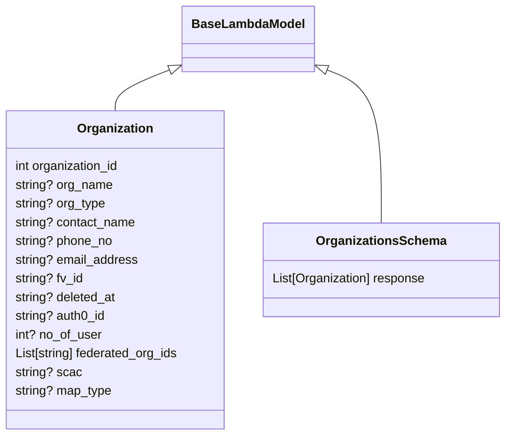

# Diagram: shipment_core/shipment_service/shipment_service/public/model/organization.py

> Auto-generated by Obscura crawlers

## Mermaid

### SVG

<svg id="container" width="652.3046875" xmlns="http://www.w3.org/2000/svg" class="classDiagram" height="558" viewBox="0 0 652.3046875 558" role="graphics-document document" aria-roledescription="class"><g><defs><marker id="container_class-aggregationStart" class="marker aggregation class" refX="18" refY="7" markerWidth="190" markerHeight="240" orient="auto"><path d="M 18,7 L9,13 L1,7 L9,1 Z"></path></marker></defs><defs><marker id="container_class-aggregationEnd" class="marker aggregation class" refX="1" refY="7" markerWidth="20" markerHeight="28" orient="auto"><path d="M 18,7 L9,13 L1,7 L9,1 Z"></path></marker></defs><defs><marker id="container_class-extensionStart" class="marker extension class" refX="18" refY="7" markerWidth="190" markerHeight="240" orient="auto"><path d="M 1,7 L18,13 V 1 Z"></path></marker></defs><defs><marker id="container_class-extensionEnd" class="marker extension class" refX="1" refY="7" markerWidth="20" markerHeight="28" orient="auto"><path d="M 1,1 V 13 L18,7 Z"></path></marker></defs><defs><marker id="container_class-compositionStart" class="marker composition class" refX="18" refY="7" markerWidth="190" markerHeight="240" orient="auto"><path d="M 18,7 L9,13 L1,7 L9,1 Z"></path></marker></defs><defs><marker id="container_class-compositionEnd" class="marker composition class" refX="1" refY="7" markerWidth="20" markerHeight="28" orient="auto"><path d="M 18,7 L9,13 L1,7 L9,1 Z"></path></marker></defs><defs><marker id="container_class-dependencyStart" class="marker dependency class" refX="6" refY="7" markerWidth="190" markerHeight="240" orient="auto"><path d="M 5,7 L9,13 L1,7 L9,1 Z"></path></marker></defs><defs><marker id="container_class-dependencyEnd" class="marker dependency class" refX="13" refY="7" markerWidth="20" markerHeight="28" orient="auto"><path d="M 18,7 L9,13 L14,7 L9,1 Z"></path></marker></defs><defs><marker id="container_class-lollipopStart" class="marker lollipop class" refX="13" refY="7" markerWidth="190" markerHeight="240" orient="auto"><circle stroke="black" fill="transparent" cx="7" cy="7" r="6"></circle></marker></defs><defs><marker id="container_class-lollipopEnd" class="marker lollipop class" refX="1" refY="7" markerWidth="190" markerHeight="240" orient="auto"><circle stroke="black" fill="transparent" cx="7" cy="7" r="6"></circle></marker></defs><g class="root"><g class="clusters"></g><g class="edgePaths"><path d="M224.551,87.984L212.167,92.82C199.783,97.656,175.014,107.328,162.63,116.331C150.246,125.333,150.246,133.667,150.246,137.833L150.246,142" id="id_BaseLambdaModel_Organization_1" class="edge-thickness-normal edge-pattern-solid relation" style=";;;" data-edge="true" data-et="edge" data-id="id_BaseLambdaModel_Organization_1" data-points="W3sieCI6MjQwLjYxOTE0MDYyNSwieSI6ODEuNzA5NTg1OTg0NzIzNDV9LHsieCI6MTUwLjI0NjA5Mzc1LCJ5IjoxMTd9LHsieCI6MTUwLjI0NjA5Mzc1LCJ5IjoxNDJ9XQ==" marker-start="url(#container_class-extensionStart)"></path><path d="M419.094,87.984L431.478,92.82C443.862,97.656,468.63,107.328,481.014,140.331C493.398,173.333,493.398,229.667,493.398,257.833L493.398,286" id="id_BaseLambdaModel_OrganizationsSchema_2" class="edge-thickness-normal edge-pattern-solid relation" style=";;;" data-edge="true" data-et="edge" data-id="id_BaseLambdaModel_OrganizationsSchema_2" data-points="W3sieCI6NDAzLjAyNTM5MDYyNSwieSI6ODEuNzA5NTg1OTg0NzIzNDV9LHsieCI6NDkzLjM5ODQzNzUsInkiOjExN30seyJ4Ijo0OTMuMzk4NDM3NSwieSI6Mjg2fV0=" marker-start="url(#container_class-extensionStart)"></path></g><g class="edgeLabels"><g class="edgeLabel"><g class="label" data-id="id_BaseLambdaModel_Organization_1" transform="translate(0, 0)"><foreignObject width="0" height="0">

</foreignObject></g></g><g class="edgeLabel"><g class="label" data-id="id_BaseLambdaModel_OrganizationsSchema_2" transform="translate(0, 0)"><foreignObject width="0" height="0">

</foreignObject></g></g></g><g class="nodes"><g class="node default" id="classId-BaseLambdaModel-0" transform="translate(321.822265625, 50)"><g class="basic label-container"><path d="M-81.203125 -42 L81.203125 -42 L81.203125 42 L-81.203125 42" stroke="none" stroke-width="0" fill="#ECECFF" style=""></path><path d="M-81.203125 -42 C-37.99358315630664 -42, 5.215958687386717 -42, 81.203125 -42 M-81.203125 -42 C-28.039866907526495 -42, 25.12339118494701 -42, 81.203125 -42 M81.203125 -42 C81.203125 -18.08460118419719, 81.203125 5.83079763160562, 81.203125 42 M81.203125 -42 C81.203125 -24.22740060012629, 81.203125 -6.454801200252582, 81.203125 42 M81.203125 42 C39.06354690329555 42, -3.0760311934088946 42, -81.203125 42 M81.203125 42 C45.20793371100084 42, 9.212742422001682 42, -81.203125 42 M-81.203125 42 C-81.203125 17.0311316522295, -81.203125 -7.937736695540998, -81.203125 -42 M-81.203125 42 C-81.203125 22.27675716950783, -81.203125 2.5535143390156634, -81.203125 -42" stroke="#9370DB" stroke-width="1.3" fill="none" stroke-dasharray="0 0" style=""></path></g><g class="annotation-group text" transform="translate(0, -18)"></g><g class="label-group text" transform="translate(-69.203125, -18)"><g class="label" style="font-weight: bolder" transform="translate(0,-12)"><foreignObject width="138.40625" height="24">

BaseLambdaModel

</foreignObject></g></g><g class="members-group text" transform="translate(-69.203125, 30)"></g><g class="methods-group text" transform="translate(-69.203125, 60)"></g><g class="divider" style=""><path d="M-81.203125 6 C-18.317617372160953 6, 44.567890255678094 6, 81.203125 6 M-81.203125 6 C-22.998428350325383 6, 35.20626829934923 6, 81.203125 6" stroke="#9370DB" stroke-width="1.3" fill="none" stroke-dasharray="0 0" style=""></path></g><g class="divider" style=""><path d="M-81.203125 24 C-32.94181937493726 24, 15.319486250125479 24, 81.203125 24 M-81.203125 24 C-23.01966383173447 24, 35.16379733653106 24, 81.203125 24" stroke="#9370DB" stroke-width="1.3" fill="none" stroke-dasharray="0 0" style=""></path></g></g><g class="node default" id="classId-Organization-1" transform="translate(150.24609375, 346)"><g class="basic label-container"><path d="M-142.24609375 -204 L142.24609375 -204 L142.24609375 204 L-142.24609375 204" stroke="none" stroke-width="0" fill="#ECECFF" style=""></path><path d="M-142.24609375 -204 C-29.03469514249676 -204, 84.17670346500648 -204, 142.24609375 -204 M-142.24609375 -204 C-47.29067636653495 -204, 47.664741016930094 -204, 142.24609375 -204 M142.24609375 -204 C142.24609375 -113.5380310236661, 142.24609375 -23.076062047332186, 142.24609375 204 M142.24609375 -204 C142.24609375 -98.96444106582395, 142.24609375 6.071117868352104, 142.24609375 204 M142.24609375 204 C37.359327990696755 204, -67.52743776860649 204, -142.24609375 204 M142.24609375 204 C39.17702218051603 204, -63.89204938896793 204, -142.24609375 204 M-142.24609375 204 C-142.24609375 64.6448307751397, -142.24609375 -74.71033844972061, -142.24609375 -204 M-142.24609375 204 C-142.24609375 85.43094054812362, -142.24609375 -33.13811890375277, -142.24609375 -204" stroke="#9370DB" stroke-width="1.3" fill="none" stroke-dasharray="0 0" style=""></path></g><g class="annotation-group text" transform="translate(0, -180)"></g><g class="label-group text" transform="translate(-46.6953125, -180)"><g class="label" style="font-weight: bolder" transform="translate(0,-12)"><foreignObject width="93.390625" height="24">

Organization

</foreignObject></g></g><g class="members-group text" transform="translate(-130.24609375, -132)"><g class="label" style="" transform="translate(0,-12)"><foreignObject width="136.671875" height="24">

int organization_id

</foreignObject></g><g class="label" style="" transform="translate(0,12)"><foreignObject width="125.40625" height="24">

string? org_name

</foreignObject></g><g class="label" style="" transform="translate(0,36)"><foreignObject width="116.359375" height="24">

string? org_type

</foreignObject></g><g class="label" style="" transform="translate(0,60)"><foreignObject width="155.578125" height="24">

string? contact_name

</foreignObject></g><g class="label" style="" transform="translate(0,84)"><foreignObject width="125.9375" height="24">

string? phone_no

</foreignObject></g><g class="label" style="" transform="translate(0,108)"><foreignObject width="158.28125" height="24">

string? email_address

</foreignObject></g><g class="label" style="" transform="translate(0,132)"><foreignObject width="88.0625" height="24">

string? fv_id

</foreignObject></g><g class="label" style="" transform="translate(0,156)"><foreignObject width="130.828125" height="24">

string? deleted_at

</foreignObject></g><g class="label" style="" transform="translate(0,180)"><foreignObject width="116.921875" height="24">

string? auth0_id

</foreignObject></g><g class="label" style="" transform="translate(0,204)"><foreignObject width="111.078125" height="24">

int? no_of_user

</foreignObject></g><g class="label" style="" transform="translate(0,228)"><foreignObject width="213.796875" height="24">

List[string] federated_org_ids

</foreignObject></g><g class="label" style="" transform="translate(0,252)"><foreignObject width="84.21875" height="24">

string? scac

</foreignObject></g><g class="label" style="" transform="translate(0,276)"><foreignObject width="124.296875" height="24">

string? map_type

</foreignObject></g></g><g class="methods-group text" transform="translate(-130.24609375, 204)"></g><g class="divider" style=""><path d="M-142.24609375 -156 C-85.26899289227043 -156, -28.29189203454085 -156, 142.24609375 -156 M-142.24609375 -156 C-58.369485458940716 -156, 25.50712283211857 -156, 142.24609375 -156" stroke="#9370DB" stroke-width="1.3" fill="none" stroke-dasharray="0 0" style=""></path></g><g class="divider" style=""><path d="M-142.24609375 180 C-57.091842203376174 180, 28.06240934324765 180, 142.24609375 180 M-142.24609375 180 C-46.58321744975868 180, 49.079658850482645 180, 142.24609375 180" stroke="#9370DB" stroke-width="1.3" fill="none" stroke-dasharray="0 0" style=""></path></g></g><g class="node default" id="classId-OrganizationsSchema-2" transform="translate(493.3984375, 346)"><g class="basic label-container"><path d="M-150.90625 -60 L150.90625 -60 L150.90625 60 L-150.90625 60" stroke="none" stroke-width="0" fill="#ECECFF" style=""></path><path d="M-150.90625 -60 C-75.68592506109782 -60, -0.46560012219563873 -60, 150.90625 -60 M-150.90625 -60 C-39.411856345207084 -60, 72.08253730958583 -60, 150.90625 -60 M150.90625 -60 C150.90625 -19.05380834999699, 150.90625 21.892383300006017, 150.90625 60 M150.90625 -60 C150.90625 -14.185383460877517, 150.90625 31.629233078244965, 150.90625 60 M150.90625 60 C42.899637002118496 60, -65.10697599576301 60, -150.90625 60 M150.90625 60 C65.32531383220622 60, -20.25562233558756 60, -150.90625 60 M-150.90625 60 C-150.90625 13.44330418106972, -150.90625 -33.11339163786056, -150.90625 -60 M-150.90625 60 C-150.90625 21.637402231828034, -150.90625 -16.725195536343932, -150.90625 -60" stroke="#9370DB" stroke-width="1.3" fill="none" stroke-dasharray="0 0" style=""></path></g><g class="annotation-group text" transform="translate(0, -36)"></g><g class="label-group text" transform="translate(-79.140625, -36)"><g class="label" style="font-weight: bolder" transform="translate(0,-12)"><foreignObject width="158.28125" height="24">

OrganizationsSchema

</foreignObject></g></g><g class="members-group text" transform="translate(-138.90625, 12)"><g class="label" style="" transform="translate(0,-12)"><foreignObject width="198.671875" height="24">

List[Organization] response

</foreignObject></g></g><g class="methods-group text" transform="translate(-138.90625, 60)"></g><g class="divider" style=""><path d="M-150.90625 -12 C-60.843495529896714 -12, 29.219258940206572 -12, 150.90625 -12 M-150.90625 -12 C-85.59110282100438 -12, -20.275955642008768 -12, 150.90625 -12" stroke="#9370DB" stroke-width="1.3" fill="none" stroke-dasharray="0 0" style=""></path></g><g class="divider" style=""><path d="M-150.90625 36 C-58.980426184413346 36, 32.94539763117331 36, 150.90625 36 M-150.90625 36 C-41.546178548555915 36, 67.81389290288817 36, 150.90625 36" stroke="#9370DB" stroke-width="1.3" fill="none" stroke-dasharray="0 0" style=""></path></g></g></g></g></g></svg>
