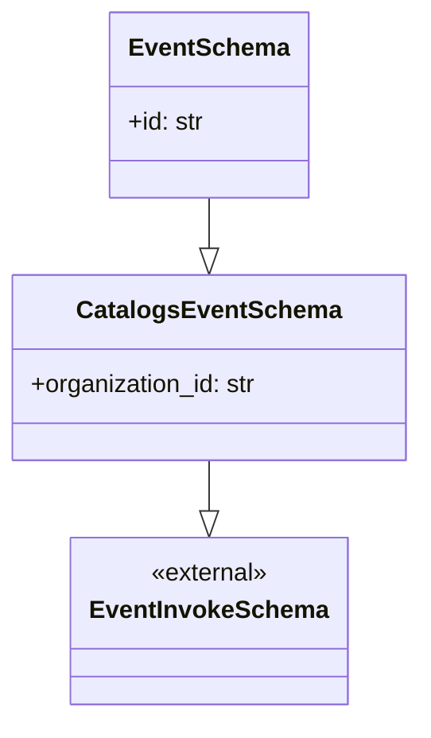

# Diagram: shipment_core/shipment_service/shipment_service/public/model/request.py

> Auto-generated by Obscura crawlers

## Mermaid

### SVG

<svg id="container" width="268.453125" xmlns="http://www.w3.org/2000/svg" class="classDiagram" height="464" viewBox="0 0 268.453125 464" role="graphics-document document" aria-roledescription="class"><g><defs><marker id="container_class-aggregationStart" class="marker aggregation class" refX="18" refY="7" markerWidth="190" markerHeight="240" orient="auto"><path d="M 18,7 L9,13 L1,7 L9,1 Z"></path></marker></defs><defs><marker id="container_class-aggregationEnd" class="marker aggregation class" refX="1" refY="7" markerWidth="20" markerHeight="28" orient="auto"><path d="M 18,7 L9,13 L1,7 L9,1 Z"></path></marker></defs><defs><marker id="container_class-extensionStart" class="marker extension class" refX="18" refY="7" markerWidth="190" markerHeight="240" orient="auto"><path d="M 1,7 L18,13 V 1 Z"></path></marker></defs><defs><marker id="container_class-extensionEnd" class="marker extension class" refX="1" refY="7" markerWidth="20" markerHeight="28" orient="auto"><path d="M 1,1 V 13 L18,7 Z"></path></marker></defs><defs><marker id="container_class-compositionStart" class="marker composition class" refX="18" refY="7" markerWidth="190" markerHeight="240" orient="auto"><path d="M 18,7 L9,13 L1,7 L9,1 Z"></path></marker></defs><defs><marker id="container_class-compositionEnd" class="marker composition class" refX="1" refY="7" markerWidth="20" markerHeight="28" orient="auto"><path d="M 18,7 L9,13 L1,7 L9,1 Z"></path></marker></defs><defs><marker id="container_class-dependencyStart" class="marker dependency class" refX="6" refY="7" markerWidth="190" markerHeight="240" orient="auto"><path d="M 5,7 L9,13 L1,7 L9,1 Z"></path></marker></defs><defs><marker id="container_class-dependencyEnd" class="marker dependency class" refX="13" refY="7" markerWidth="20" markerHeight="28" orient="auto"><path d="M 18,7 L9,13 L14,7 L9,1 Z"></path></marker></defs><defs><marker id="container_class-lollipopStart" class="marker lollipop class" refX="13" refY="7" markerWidth="190" markerHeight="240" orient="auto"><circle stroke="black" fill="transparent" cx="7" cy="7" r="6"></circle></marker></defs><defs><marker id="container_class-lollipopEnd" class="marker lollipop class" refX="1" refY="7" markerWidth="190" markerHeight="240" orient="auto"><circle stroke="black" fill="transparent" cx="7" cy="7" r="6"></circle></marker></defs><g class="root"><g class="clusters"></g><g class="edgePaths"><path d="M134.227,128L134.227,132.167C134.227,136.333,134.227,144.667,134.227,150.125C134.227,155.583,134.227,158.167,134.227,159.458L134.227,160.75" id="id_EventSchema_CatalogsEventSchema_1" class="edge-thickness-normal edge-pattern-solid relation" style=";;;" data-edge="true" data-et="edge" data-id="id_EventSchema_CatalogsEventSchema_1" data-points="W3sieCI6MTM0LjIyNjU2MjUsInkiOjEyOH0seyJ4IjoxMzQuMjI2NTYyNSwieSI6MTUzfSx7IngiOjEzNC4yMjY1NjI1LCJ5IjoxNzh9XQ==" marker-end="url(#container_class-extensionEnd)"></path><path d="M134.227,298L134.227,302.167C134.227,306.333,134.227,314.667,134.227,320.125C134.227,325.583,134.227,328.167,134.227,329.458L134.227,330.75" id="id_CatalogsEventSchema_EventInvokeSchema_2" class="edge-thickness-normal edge-pattern-solid relation" style=";;;" data-edge="true" data-et="edge" data-id="id_CatalogsEventSchema_EventInvokeSchema_2" data-points="W3sieCI6MTM0LjIyNjU2MjUsInkiOjI5OH0seyJ4IjoxMzQuMjI2NTYyNSwieSI6MzIzfSx7IngiOjEzNC4yMjY1NjI1LCJ5IjozNDh9XQ==" marker-end="url(#container_class-extensionEnd)"></path></g><g class="edgeLabels"><g class="edgeLabel"><g class="label" data-id="id_EventSchema_CatalogsEventSchema_1" transform="translate(0, 0)"><foreignObject width="0" height="0">

</foreignObject></g></g><g class="edgeLabel"><g class="label" data-id="id_CatalogsEventSchema_EventInvokeSchema_2" transform="translate(0, 0)"><foreignObject width="0" height="0">

</foreignObject></g></g></g><g class="nodes"><g class="node default" id="classId-EventInvokeSchema-0" transform="translate(134.2265625, 402)"><g class="basic label-container"><path d="M-85.1484375 -54 L85.1484375 -54 L85.1484375 54 L-85.1484375 54" stroke="none" stroke-width="0" fill="#ECECFF" style=""></path><path d="M-85.1484375 -54 C-17.11635792327462 -54, 50.91572165345076 -54, 85.1484375 -54 M-85.1484375 -54 C-48.221736070373304 -54, -11.295034640746607 -54, 85.1484375 -54 M85.1484375 -54 C85.1484375 -20.690687588174512, 85.1484375 12.618624823650975, 85.1484375 54 M85.1484375 -54 C85.1484375 -32.39286976803127, 85.1484375 -10.785739536062536, 85.1484375 54 M85.1484375 54 C27.958219487868995 54, -29.23199852426201 54, -85.1484375 54 M85.1484375 54 C33.671265876657536 54, -17.805905746684928 54, -85.1484375 54 M-85.1484375 54 C-85.1484375 16.222845481116828, -85.1484375 -21.554309037766345, -85.1484375 -54 M-85.1484375 54 C-85.1484375 32.19355563848191, -85.1484375 10.387111276963829, -85.1484375 -54" stroke="#9370DB" stroke-width="1.3" fill="none" stroke-dasharray="0 0" style=""></path></g><g class="annotation-group text" transform="translate(-38.65625, -30)"><g class="label" style="" transform="translate(0,-12)"><foreignObject width="77.3125" height="24">

«external»

</foreignObject></g></g><g class="label-group text" transform="translate(-73.1484375, -6)"><g class="label" style="font-weight: bolder" transform="translate(0,-12)"><foreignObject width="146.296875" height="24">

EventInvokeSchema

</foreignObject></g></g><g class="members-group text" transform="translate(-73.1484375, 42)"></g><g class="methods-group text" transform="translate(-73.1484375, 72)"></g><g class="divider" style=""><path d="M-85.1484375 18 C-38.05084893692007 18, 9.046739626159862 18, 85.1484375 18 M-85.1484375 18 C-34.58914673519409 18, 15.970144029611816 18, 85.1484375 18" stroke="#9370DB" stroke-width="1.3" fill="none" stroke-dasharray="0 0" style=""></path></g><g class="divider" style=""><path d="M-85.1484375 36 C-35.0164440656514 36, 15.115549368697202 36, 85.1484375 36 M-85.1484375 36 C-36.0275135527855 36, 13.093410394429 36, 85.1484375 36" stroke="#9370DB" stroke-width="1.3" fill="none" stroke-dasharray="0 0" style=""></path></g></g><g class="node default" id="classId-CatalogsEventSchema-1" transform="translate(134.2265625, 238)"><g class="basic label-container"><path d="M-126.2265625 -60 L126.2265625 -60 L126.2265625 60 L-126.2265625 60" stroke="none" stroke-width="0" fill="#ECECFF" style=""></path><path d="M-126.2265625 -60 C-47.514892929137844 -60, 31.196776641724313 -60, 126.2265625 -60 M-126.2265625 -60 C-30.289424491721064 -60, 65.64771351655787 -60, 126.2265625 -60 M126.2265625 -60 C126.2265625 -13.262911400232326, 126.2265625 33.47417719953535, 126.2265625 60 M126.2265625 -60 C126.2265625 -18.623726517045156, 126.2265625 22.752546965909687, 126.2265625 60 M126.2265625 60 C43.99090768809141 60, -38.24474712381718 60, -126.2265625 60 M126.2265625 60 C59.79995618250656 60, -6.626650134986875 60, -126.2265625 60 M-126.2265625 60 C-126.2265625 34.604979066417286, -126.2265625 9.20995813283458, -126.2265625 -60 M-126.2265625 60 C-126.2265625 19.550092697704827, -126.2265625 -20.899814604590347, -126.2265625 -60" stroke="#9370DB" stroke-width="1.3" fill="none" stroke-dasharray="0 0" style=""></path></g><g class="annotation-group text" transform="translate(0, -36)"></g><g class="label-group text" transform="translate(-80.203125, -36)"><g class="label" style="font-weight: bolder" transform="translate(0,-12)"><foreignObject width="160.40625" height="24">

CatalogsEventSchema

</foreignObject></g></g><g class="members-group text" transform="translate(-114.2265625, 12)"><g class="label" style="" transform="translate(0,-12)"><foreignObject width="148.25" height="24">

+organization_id: str

</foreignObject></g></g><g class="methods-group text" transform="translate(-114.2265625, 60)"></g><g class="divider" style=""><path d="M-126.2265625 -12 C-54.62002176395022 -12, 16.98651897209956 -12, 126.2265625 -12 M-126.2265625 -12 C-43.28001621458142 -12, 39.666530070837155 -12, 126.2265625 -12" stroke="#9370DB" stroke-width="1.3" fill="none" stroke-dasharray="0 0" style=""></path></g><g class="divider" style=""><path d="M-126.2265625 36 C-31.893963953284796 36, 62.43863459343041 36, 126.2265625 36 M-126.2265625 36 C-33.572689879280915 36, 59.08118274143817 36, 126.2265625 36" stroke="#9370DB" stroke-width="1.3" fill="none" stroke-dasharray="0 0" style=""></path></g></g><g class="node default" id="classId-EventSchema-2" transform="translate(134.2265625, 68)"><g class="basic label-container"><path d="M-61.1875 -60 L61.1875 -60 L61.1875 60 L-61.1875 60" stroke="none" stroke-width="0" fill="#ECECFF" style=""></path><path d="M-61.1875 -60 C-27.307844922080506 -60, 6.571810155838989 -60, 61.1875 -60 M-61.1875 -60 C-28.898229725297085 -60, 3.3910405494058296 -60, 61.1875 -60 M61.1875 -60 C61.1875 -18.139896506463778, 61.1875 23.720206987072444, 61.1875 60 M61.1875 -60 C61.1875 -19.103949286858757, 61.1875 21.792101426282485, 61.1875 60 M61.1875 60 C26.738703820700287 60, -7.710092358599425 60, -61.1875 60 M61.1875 60 C33.12276023971111 60, 5.0580204794222325 60, -61.1875 60 M-61.1875 60 C-61.1875 26.423315700581128, -61.1875 -7.153368598837744, -61.1875 -60 M-61.1875 60 C-61.1875 24.44698308806843, -61.1875 -11.106033823863143, -61.1875 -60" stroke="#9370DB" stroke-width="1.3" fill="none" stroke-dasharray="0 0" style=""></path></g><g class="annotation-group text" transform="translate(0, -36)"></g><g class="label-group text" transform="translate(-48.796875, -36)"><g class="label" style="font-weight: bolder" transform="translate(0,-12)"><foreignObject width="97.59375" height="24">

EventSchema

</foreignObject></g></g><g class="members-group text" transform="translate(-49.1875, 12)"><g class="label" style="" transform="translate(0,-12)"><foreignObject width="49.578125" height="24">

+id: str

</foreignObject></g></g><g class="methods-group text" transform="translate(-49.1875, 60)"></g><g class="divider" style=""><path d="M-61.1875 -12 C-22.014134126817716 -12, 17.15923174636457 -12, 61.1875 -12 M-61.1875 -12 C-31.448209681337605 -12, -1.7089193626752106 -12, 61.1875 -12" stroke="#9370DB" stroke-width="1.3" fill="none" stroke-dasharray="0 0" style=""></path></g><g class="divider" style=""><path d="M-61.1875 36 C-14.295086011203175 36, 32.59732797759365 36, 61.1875 36 M-61.1875 36 C-23.64850860462826 36, 13.890482790743476 36, 61.1875 36" stroke="#9370DB" stroke-width="1.3" fill="none" stroke-dasharray="0 0" style=""></path></g></g></g></g></g></svg>
