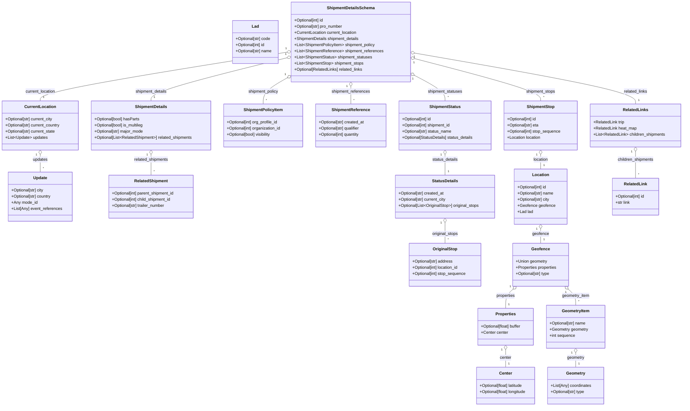

# Diagram: shipment_core/shipment_service/shipment_service/public/model/shipment.py

> Auto-generated by Obscura crawlers

## Mermaid

### SVG

<svg id="container" width="2693.8125" xmlns="http://www.w3.org/2000/svg" class="classDiagram" height="1586" viewBox="0 0 2693.8125 1586" role="graphics-document document" aria-roledescription="class"><g><defs><marker id="container_class-aggregationStart" class="marker aggregation class" refX="18" refY="7" markerWidth="190" markerHeight="240" orient="auto"><path d="M 18,7 L9,13 L1,7 L9,1 Z"></path></marker></defs><defs><marker id="container_class-aggregationEnd" class="marker aggregation class" refX="1" refY="7" markerWidth="20" markerHeight="28" orient="auto"><path d="M 18,7 L9,13 L1,7 L9,1 Z"></path></marker></defs><defs><marker id="container_class-extensionStart" class="marker extension class" refX="18" refY="7" markerWidth="190" markerHeight="240" orient="auto"><path d="M 1,7 L18,13 V 1 Z"></path></marker></defs><defs><marker id="container_class-extensionEnd" class="marker extension class" refX="1" refY="7" markerWidth="20" markerHeight="28" orient="auto"><path d="M 1,1 V 13 L18,7 Z"></path></marker></defs><defs><marker id="container_class-compositionStart" class="marker composition class" refX="18" refY="7" markerWidth="190" markerHeight="240" orient="auto"><path d="M 18,7 L9,13 L1,7 L9,1 Z"></path></marker></defs><defs><marker id="container_class-compositionEnd" class="marker composition class" refX="1" refY="7" markerWidth="20" markerHeight="28" orient="auto"><path d="M 18,7 L9,13 L1,7 L9,1 Z"></path></marker></defs><defs><marker id="container_class-dependencyStart" class="marker dependency class" refX="6" refY="7" markerWidth="190" markerHeight="240" orient="auto"><path d="M 5,7 L9,13 L1,7 L9,1 Z"></path></marker></defs><defs><marker id="container_class-dependencyEnd" class="marker dependency class" refX="13" refY="7" markerWidth="20" markerHeight="28" orient="auto"><path d="M 18,7 L9,13 L14,7 L9,1 Z"></path></marker></defs><defs><marker id="container_class-lollipopStart" class="marker lollipop class" refX="13" refY="7" markerWidth="190" markerHeight="240" orient="auto"><circle stroke="black" fill="transparent" cx="7" cy="7" r="6"></circle></marker></defs><defs><marker id="container_class-lollipopEnd" class="marker lollipop class" refX="1" refY="7" markerWidth="190" markerHeight="240" orient="auto"><circle stroke="black" fill="transparent" cx="7" cy="7" r="6"></circle></marker></defs><g class="root"><g class="clusters"></g><g class="edgePaths"><path d="M159.598,603.25L159.598,606.542C159.598,609.833,159.598,616.417,159.598,627.875C159.598,639.333,159.598,655.667,159.598,663.833L159.598,672" id="id_CurrentLocation_Update_1" class="edge-thickness-normal edge-pattern-solid relation" style=";;;" data-edge="true" data-et="edge" data-id="id_CurrentLocation_Update_1" data-points="W3sieCI6MTU5LjU5NzY1NjI1LCJ5Ijo1ODZ9LHsieCI6MTU5LjU5NzY1NjI1LCJ5Ijo2MjN9LHsieCI6MTU5LjU5NzY1NjI1LCJ5Ijo2NzJ9XQ==" marker-start="url(#container_class-aggregationStart)"></path><path d="M597.426,603.25L597.426,606.542C597.426,609.833,597.426,616.417,597.426,629.875C597.426,643.333,597.426,663.667,597.426,673.833L597.426,684" id="id_ShipmentDetails_RelatedShipment_2" class="edge-thickness-normal edge-pattern-solid relation" style=";;;" data-edge="true" data-et="edge" data-id="id_ShipmentDetails_RelatedShipment_2" data-points="W3sieCI6NTk3LjQyNTc4MTI1LCJ5Ijo1ODZ9LHsieCI6NTk3LjQyNTc4MTI1LCJ5Ijo2MjN9LHsieCI6NTk3LjQyNTc4MTI1LCJ5Ijo2ODR9XQ==" marker-start="url(#container_class-aggregationStart)"></path><path d="M1140.006,202.918L976.605,228.599C813.203,254.279,486.4,305.639,322.999,337.486C159.598,369.333,159.598,381.667,159.598,387.833L159.598,394" id="id_ShipmentDetailsSchema_CurrentLocation_3" class="edge-thickness-normal edge-pattern-solid relation" style=";;;" data-edge="true" data-et="edge" data-id="id_ShipmentDetailsSchema_CurrentLocation_3" data-points="W3sieCI6MTE1Ny4wNDY4NzUsInkiOjIwMC4yNDAyNTc3NzgwMzIyM30seyJ4IjoxNTkuNTk3NjU2MjUsInkiOjM1N30seyJ4IjoxNTkuNTk3NjU2MjUsInkiOjM5NH1d" marker-start="url(#container_class-aggregationStart)"></path><path d="M1140.289,224.412L1049.812,246.51C959.335,268.608,778.38,312.804,687.903,341.069C597.426,369.333,597.426,381.667,597.426,387.833L597.426,394" id="id_ShipmentDetailsSchema_ShipmentDetails_4" class="edge-thickness-normal edge-pattern-solid relation" style=";;;" data-edge="true" data-et="edge" data-id="id_ShipmentDetailsSchema_ShipmentDetails_4" data-points="W3sieCI6MTE1Ny4wNDY4NzUsInkiOjIyMC4zMTk2MTI0NDcxNjg3NH0seyJ4Ijo1OTcuNDI1NzgxMjUsInkiOjM1N30seyJ4Ijo1OTcuNDI1NzgxMjUsInkiOjM5NH1d" marker-start="url(#container_class-aggregationStart)"></path><path d="M1141.979,300.906L1125.203,310.255C1108.427,319.604,1074.876,338.302,1058.1,355.818C1041.324,373.333,1041.324,389.667,1041.324,397.833L1041.324,406" id="id_ShipmentDetailsSchema_ShipmentPolicyItem_5" class="edge-thickness-normal edge-pattern-solid relation" style=";;;" data-edge="true" data-et="edge" data-id="id_ShipmentDetailsSchema_ShipmentPolicyItem_5" data-points="W3sieCI6MTE1Ny4wNDY4NzUsInkiOjI5Mi41MDg0NzY0ODgwMzgxfSx7IngiOjEwNDEuMzI0MjE4NzUsInkiOjM1N30seyJ4IjoxMDQxLjMyNDIxODc1LCJ5Ijo0MDZ9XQ==" marker-start="url(#container_class-aggregationStart)"></path><path d="M1387.641,337.25L1387.641,340.542C1387.641,343.833,1387.641,350.417,1387.641,361.875C1387.641,373.333,1387.641,389.667,1387.641,397.833L1387.641,406" id="id_ShipmentDetailsSchema_ShipmentReference_6" class="edge-thickness-normal edge-pattern-solid relation" style=";;;" data-edge="true" data-et="edge" data-id="id_ShipmentDetailsSchema_ShipmentReference_6" data-points="W3sieCI6MTM4Ny42NDA2MjUsInkiOjMyMH0seyJ4IjoxMzg3LjY0MDYyNSwieSI6MzU3fSx7IngiOjEzODcuNjQwNjI1LCJ5Ijo0MDZ9XQ==" marker-start="url(#container_class-aggregationStart)"></path><path d="M1633.539,291.86L1654.419,302.716C1675.298,313.573,1717.057,335.287,1737.937,352.31C1758.816,369.333,1758.816,381.667,1758.816,387.833L1758.816,394" id="id_ShipmentDetailsSchema_ShipmentStatus_7" class="edge-thickness-normal edge-pattern-solid relation" style=";;;" data-edge="true" data-et="edge" data-id="id_ShipmentDetailsSchema_ShipmentStatus_7" data-points="W3sieCI6MTYxOC4yMzQzNzUsInkiOjI4My45MDE2NjM4NDI3Mjk1fSx7IngiOjE3NTguODE2NDA2MjUsInkiOjM1N30seyJ4IjoxNzU4LjgxNjQwNjI1LCJ5IjozOTR9XQ==" marker-start="url(#container_class-aggregationStart)"></path><path d="M1634.939,227.734L1718.533,249.279C1802.128,270.823,1969.318,313.911,2052.913,341.622C2136.508,369.333,2136.508,381.667,2136.508,387.833L2136.508,394" id="id_ShipmentDetailsSchema_ShipmentStop_8" class="edge-thickness-normal edge-pattern-solid relation" style=";;;" data-edge="true" data-et="edge" data-id="id_ShipmentDetailsSchema_ShipmentStop_8" data-points="W3sieCI6MTYxOC4yMzQzNzUsInkiOjIyMy40MjkyMjEyMTk1NTAzNn0seyJ4IjoyMTM2LjUwNzgxMjUsInkiOjM1N30seyJ4IjoyMTM2LjUwNzgxMjUsInkiOjM5NH1d" marker-start="url(#container_class-aggregationStart)"></path><path d="M2136.508,603.25L2136.508,606.542C2136.508,609.833,2136.508,616.417,2136.508,625.875C2136.508,635.333,2136.508,647.667,2136.508,653.833L2136.508,660" id="id_ShipmentStop_Location_9" class="edge-thickness-normal edge-pattern-solid relation" style=";;;" data-edge="true" data-et="edge" data-id="id_ShipmentStop_Location_9" data-points="W3sieCI6MjEzNi41MDc4MTI1LCJ5Ijo1ODZ9LHsieCI6MjEzNi41MDc4MTI1LCJ5Ijo2MjN9LHsieCI6MjEzNi41MDc4MTI1LCJ5Ijo2NjB9XQ==" marker-start="url(#container_class-aggregationStart)"></path><path d="M2136.508,893.25L2136.508,896.542C2136.508,899.833,2136.508,906.417,2136.508,915.875C2136.508,925.333,2136.508,937.667,2136.508,943.833L2136.508,950" id="id_Location_Geofence_10" class="edge-thickness-normal edge-pattern-solid relation" style=";;;" data-edge="true" data-et="edge" data-id="id_Location_Geofence_10" data-points="W3sieCI6MjEzNi41MDc4MTI1LCJ5Ijo4NzZ9LHsieCI6MjEzNi41MDc4MTI1LCJ5Ijo5MTN9LHsieCI6MjEzNi41MDc4MTI1LCJ5Ijo5NTB9XQ==" marker-start="url(#container_class-aggregationStart)"></path><path d="M2026.939,1129.322L2022.02,1133.602C2017.101,1137.881,2007.262,1146.441,2002.343,1158.887C1997.424,1171.333,1997.424,1187.667,1997.424,1195.833L1997.424,1204" id="id_Geofence_Properties_11" class="edge-thickness-normal edge-pattern-solid relation" style=";;;" data-edge="true" data-et="edge" data-id="id_Geofence_Properties_11" data-points="W3sieCI6MjAzOS45NTM2NDE1Mjg5MjU2LCJ5IjoxMTE4fSx7IngiOjE5OTcuNDIzODI4MTI1LCJ5IjoxMTU1fSx7IngiOjE5OTcuNDIzODI4MTI1LCJ5IjoxMjA0fV0=" marker-start="url(#container_class-aggregationStart)"></path><path d="M1997.424,1365.25L1997.424,1370.542C1997.424,1375.833,1997.424,1386.417,1997.424,1397.875C1997.424,1409.333,1997.424,1421.667,1997.424,1427.833L1997.424,1434" id="id_Properties_Center_12" class="edge-thickness-normal edge-pattern-solid relation" style=";;;" data-edge="true" data-et="edge" data-id="id_Properties_Center_12" data-points="W3sieCI6MTk5Ny40MjM4MjgxMjUsInkiOjEzNDh9LHsieCI6MTk5Ny40MjM4MjgxMjUsInkiOjEzOTd9LHsieCI6MTk5Ny40MjM4MjgxMjUsInkiOjE0MzR9XQ==" marker-start="url(#container_class-aggregationStart)"></path><path d="M2246.076,1129.322L2250.996,1133.602C2255.915,1137.881,2265.753,1146.441,2270.673,1156.887C2275.592,1167.333,2275.592,1179.667,2275.592,1185.833L2275.592,1192" id="id_Geofence_GeometryItem_13" class="edge-thickness-normal edge-pattern-solid relation" style=";;;" data-edge="true" data-et="edge" data-id="id_Geofence_GeometryItem_13" data-points="W3sieCI6MjIzMy4wNjE5ODM0NzEwNzQsInkiOjExMTh9LHsieCI6MjI3NS41OTE3OTY4NzUsInkiOjExNTV9LHsieCI6MjI3NS41OTE3OTY4NzUsInkiOjExOTJ9XQ==" marker-start="url(#container_class-aggregationStart)"></path><path d="M2275.592,1377.25L2275.592,1380.542C2275.592,1383.833,2275.592,1390.417,2275.592,1399.875C2275.592,1409.333,2275.592,1421.667,2275.592,1427.833L2275.592,1434" id="id_GeometryItem_Geometry_14" class="edge-thickness-normal edge-pattern-solid relation" style=";;;" data-edge="true" data-et="edge" data-id="id_GeometryItem_Geometry_14" data-points="W3sieCI6MjI3NS41OTE3OTY4NzUsInkiOjEzNjB9LHsieCI6MjI3NS41OTE3OTY4NzUsInkiOjEzOTd9LHsieCI6MjI3NS41OTE3OTY4NzUsInkiOjE0MzR9XQ==" marker-start="url(#container_class-aggregationStart)"></path><path d="M1758.816,603.25L1758.816,606.542C1758.816,609.833,1758.816,616.417,1758.816,629.875C1758.816,643.333,1758.816,663.667,1758.816,673.833L1758.816,684" id="id_ShipmentStatus_StatusDetails_15" class="edge-thickness-normal edge-pattern-solid relation" style=";;;" data-edge="true" data-et="edge" data-id="id_ShipmentStatus_StatusDetails_15" data-points="W3sieCI6MTc1OC44MTY0MDYyNSwieSI6NTg2fSx7IngiOjE3NTguODE2NDA2MjUsInkiOjYyM30seyJ4IjoxNzU4LjgxNjQwNjI1LCJ5Ijo2ODR9XQ==" marker-start="url(#container_class-aggregationStart)"></path><path d="M1758.816,869.25L1758.816,876.542C1758.816,883.833,1758.816,898.417,1758.816,911.875C1758.816,925.333,1758.816,937.667,1758.816,943.833L1758.816,950" id="id_StatusDetails_OriginalStop_16" class="edge-thickness-normal edge-pattern-solid relation" style=";;;" data-edge="true" data-et="edge" data-id="id_StatusDetails_OriginalStop_16" data-points="W3sieCI6MTc1OC44MTY0MDYyNSwieSI6ODUyfSx7IngiOjE3NTguODE2NDA2MjUsInkiOjkxM30seyJ4IjoxNzU4LjgxNjQwNjI1LCJ5Ijo5NTB9XQ==" marker-start="url(#container_class-aggregationStart)"></path><path d="M2508.742,591.25L2508.742,596.542C2508.742,601.833,2508.742,612.417,2508.742,629.875C2508.742,647.333,2508.742,671.667,2508.742,683.833L2508.742,696" id="id_RelatedLinks_RelatedLink_17" class="edge-thickness-normal edge-pattern-solid relation" style=";;;" data-edge="true" data-et="edge" data-id="id_RelatedLinks_RelatedLink_17" data-points="W3sieCI6MjUwOC43NDIxODc1LCJ5Ijo1NzR9LHsieCI6MjUwOC43NDIxODc1LCJ5Ijo2MjN9LHsieCI6MjUwOC43NDIxODc1LCJ5Ijo2OTZ9XQ==" marker-start="url(#container_class-aggregationStart)"></path><path d="M1635.234,206.624L1780.819,231.686C1926.404,256.749,2217.573,306.875,2363.158,340.104C2508.742,373.333,2508.742,389.667,2508.742,397.833L2508.742,406" id="id_ShipmentDetailsSchema_RelatedLinks_18" class="edge-thickness-normal edge-pattern-solid relation" style=";;;" data-edge="true" data-et="edge" data-id="id_ShipmentDetailsSchema_RelatedLinks_18" data-points="W3sieCI6MTYxOC4yMzQzNzUsInkiOjIwMy42OTcyMDA3MTYzNzEzfSx7IngiOjI1MDguNzQyMTg3NSwieSI6MzU3fSx7IngiOjI1MDguNzQyMTg3NSwieSI6NDA2fV0=" marker-start="url(#container_class-aggregationStart)"></path></g><g class="edgeLabels"><g class="edgeLabel" transform="translate(159.59765625, 623)"><g class="label" data-id="id_CurrentLocation_Update_1" transform="translate(-29.4140625, -12)"><foreignObject width="58.828125" height="24">

updates

</foreignObject></g></g><g class="edgeLabel" transform="translate(597.42578125, 623)"><g class="label" data-id="id_ShipmentDetails_RelatedShipment_2" transform="translate(-67.8984375, -12)"><foreignObject width="135.796875" height="24">

related_shipments

</foreignObject></g></g><g class="edgeLabel" transform="translate(159.59765625, 357)"><g class="label" data-id="id_ShipmentDetailsSchema_CurrentLocation_3" transform="translate(-59.9296875, -12)"><foreignObject width="119.859375" height="24">

current_location

</foreignObject></g></g><g class="edgeLabel" transform="translate(597.42578125, 357)"><g class="label" data-id="id_ShipmentDetailsSchema_ShipmentDetails_4" transform="translate(-62.890625, -12)"><foreignObject width="125.78125" height="24">

shipment_details

</foreignObject></g></g><g class="edgeLabel" transform="translate(1041.32421875, 357)"><g class="label" data-id="id_ShipmentDetailsSchema_ShipmentPolicyItem_5" transform="translate(-60.171875, -12)"><foreignObject width="120.34375" height="24">

shipment_policy

</foreignObject></g></g><g class="edgeLabel" transform="translate(1387.640625, 357)"><g class="label" data-id="id_ShipmentDetailsSchema_ShipmentReference_6" transform="translate(-76.2109375, -12)"><foreignObject width="152.421875" height="24">

shipment_references

</foreignObject></g></g><g class="edgeLabel" transform="translate(1758.81640625, 357)"><g class="label" data-id="id_ShipmentDetailsSchema_ShipmentStatus_7" transform="translate(-68.6875, -12)"><foreignObject width="137.375" height="24">

shipment_statuses

</foreignObject></g></g><g class="edgeLabel" transform="translate(2136.5078125, 357)"><g class="label" data-id="id_ShipmentDetailsSchema_ShipmentStop_8" transform="translate(-58.0546875, -12)"><foreignObject width="116.109375" height="24">

shipment_stops

</foreignObject></g></g><g class="edgeLabel" transform="translate(2136.5078125, 623)"><g class="label" data-id="id_ShipmentStop_Location_9" transform="translate(-29.578125, -12)"><foreignObject width="59.15625" height="24">

location

</foreignObject></g></g><g class="edgeLabel" transform="translate(2136.5078125, 913)"><g class="label" data-id="id_Location_Geofence_10" transform="translate(-32.7421875, -12)"><foreignObject width="65.484375" height="24">

geofence

</foreignObject></g></g><g class="edgeLabel" transform="translate(1997.423828125, 1155)"><g class="label" data-id="id_Geofence_Properties_11" transform="translate(-37.71875, -12)"><foreignObject width="75.4375" height="24">

properties

</foreignObject></g></g><g class="edgeLabel" transform="translate(1997.423828125, 1397)"><g class="label" data-id="id_Properties_Center_12" transform="translate(-22.9296875, -12)"><foreignObject width="45.859375" height="24">

center

</foreignObject></g></g><g class="edgeLabel" transform="translate(2275.591796875, 1155)"><g class="label" data-id="id_Geofence_GeometryItem_13" transform="translate(-54.359375, -12)"><foreignObject width="108.71875" height="24">

geometry_item

</foreignObject></g></g><g class="edgeLabel" transform="translate(2275.591796875, 1397)"><g class="label" data-id="id_GeometryItem_Geometry_14" transform="translate(-34.1953125, -12)"><foreignObject width="68.390625" height="24">

geometry

</foreignObject></g></g><g class="edgeLabel" transform="translate(1758.81640625, 623)"><g class="label" data-id="id_ShipmentStatus_StatusDetails_15" transform="translate(-50.7109375, -12)"><foreignObject width="101.421875" height="24">

status_details

</foreignObject></g></g><g class="edgeLabel" transform="translate(1758.81640625, 913)"><g class="label" data-id="id_StatusDetails_OriginalStop_16" transform="translate(-51.5625, -12)"><foreignObject width="103.125" height="24">

original_stops

</foreignObject></g></g><g class="edgeLabel" transform="translate(2508.7421875, 623)"><g class="label" data-id="id_RelatedLinks_RelatedLink_17" transform="translate(-71.875, -12)"><foreignObject width="143.75" height="24">

children_shipments

</foreignObject></g></g><g class="edgeLabel" transform="translate(2508.7421875, 357)"><g class="label" data-id="id_ShipmentDetailsSchema_RelatedLinks_18" transform="translate(-46.9375, -12)"><foreignObject width="93.875" height="24">

related_links

</foreignObject></g></g><g class="edgeTerminals" transform="translate(144.5976581250001, 603.5000016071428)"><g class="inner" transform="translate(0, 0)"><foreignObject style="width: 9px; height: 12px;">
1
</foreignObject></g></g><g class="edgeTerminals" transform="translate(582.425780625, 603.4999994642857)"><g class="inner" transform="translate(0, 0)"><foreignObject style="width: 9px; height: 12px;">
1
</foreignObject></g></g><g class="edgeTerminals" transform="translate(1137.430248663809, 188.13910229006913)"><g class="inner" transform="translate(0, 0)"><foreignObject style="width: 9px; height: 12px;">
1
</foreignObject></g></g><g class="edgeTerminals" transform="translate(1136.4876318434988, 209.90004080488904)"><g class="inner" transform="translate(0, 0)"><foreignObject style="width: 9px; height: 12px;">
1
</foreignObject></g></g><g class="edgeTerminals" transform="translate(1134.4583767144602, 287.924844114684)"><g class="inner" transform="translate(0, 0)"><foreignObject style="width: 9px; height: 12px;">
1
</foreignObject></g></g><g class="edgeTerminals" transform="translate(1372.6406275000002, 337.50000214285717)"><g class="inner" transform="translate(0, 0)"><foreignObject style="width: 9px; height: 12px;">
1
</foreignObject></g></g><g class="edgeTerminals" transform="translate(1626.8408922206866, 305.2833807355372)"><g class="inner" transform="translate(0, 0)"><foreignObject style="width: 9px; height: 12px;">
1
</foreignObject></g></g><g class="edgeTerminals" transform="translate(1631.4371120452427, 242.32201591649368)"><g class="inner" transform="translate(0, 0)"><foreignObject style="width: 9px; height: 12px;">
1
</foreignObject></g></g><g class="edgeTerminals" transform="translate(2121.50781125, 603.4999989285715)"><g class="inner" transform="translate(0, 0)"><foreignObject style="width: 9px; height: 12px;">
1
</foreignObject></g></g><g class="edgeTerminals" transform="translate(2121.50781125, 893.4999989285715)"><g class="inner" transform="translate(0, 0)"><foreignObject style="width: 9px; height: 12px;">
1
</foreignObject></g></g><g class="edgeTerminals" transform="translate(2016.9054047386212, 1118.169461022731)"><g class="inner" transform="translate(0, 0)"><foreignObject style="width: 9px; height: 12px;">
1
</foreignObject></g></g><g class="edgeTerminals" transform="translate(1982.4238290624999, 1365.5000008035713)"><g class="inner" transform="translate(0, 0)"><foreignObject style="width: 9px; height: 12px;">
1
</foreignObject></g></g><g class="edgeTerminals" transform="translate(2236.4195417708142, 1140.8029999004189)"><g class="inner" transform="translate(0, 0)"><foreignObject style="width: 9px; height: 12px;">
1
</foreignObject></g></g><g class="edgeTerminals" transform="translate(2260.5917984375, 1377.5000013392857)"><g class="inner" transform="translate(0, 0)"><foreignObject style="width: 9px; height: 12px;">
1
</foreignObject></g></g><g class="edgeTerminals" transform="translate(1743.816408125, 603.5000016071428)"><g class="inner" transform="translate(0, 0)"><foreignObject style="width: 9px; height: 12px;">
1
</foreignObject></g></g><g class="edgeTerminals" transform="translate(1743.816408125, 869.5000016071428)"><g class="inner" transform="translate(0, 0)"><foreignObject style="width: 9px; height: 12px;">
1
</foreignObject></g></g><g class="edgeTerminals" transform="translate(2493.74218875, 591.5000010714285)"><g class="inner" transform="translate(0, 0)"><foreignObject style="width: 9px; height: 12px;">
1
</foreignObject></g></g><g class="edgeTerminals" transform="translate(1632.9358343264867, 221.44873911588522)"><g class="inner" transform="translate(0, 0)"><foreignObject style="width: 9px; height: 12px;">
1
</foreignObject></g></g><g class="edgeTerminals" transform="translate(169.59765812499992, 649.5000016071428)"><g class="inner" transform="translate(0, 0)"></g><foreignObject style="width: 9px; height: 12px;">
*
</foreignObject></g><g class="edgeTerminals" transform="translate(607.425780625, 661.4999994642857)"><g class="inner" transform="translate(0, 0)"></g><foreignObject style="width: 9px; height: 12px;">
*
</foreignObject></g><g class="edgeTerminals" transform="translate(169.59765812499992, 371.50000160714285)"><g class="inner" transform="translate(0, 0)"></g><foreignObject style="width: 9px; height: 12px;">
1
</foreignObject></g><g class="edgeTerminals" transform="translate(607.425780625, 371.49999946428574)"><g class="inner" transform="translate(0, 0)"></g><foreignObject style="width: 9px; height: 12px;">
1
</foreignObject></g><g class="edgeTerminals" transform="translate(1051.324219375, 383.50000053571426)"><g class="inner" transform="translate(0, 0)"></g><foreignObject style="width: 9px; height: 12px;">
*
</foreignObject></g><g class="edgeTerminals" transform="translate(1397.6406274999997, 383.50000214285717)"><g class="inner" transform="translate(0, 0)"></g><foreignObject style="width: 9px; height: 12px;">
*
</foreignObject></g><g class="edgeTerminals" transform="translate(1768.816408125, 371.5000016071428)"><g class="inner" transform="translate(0, 0)"></g><foreignObject style="width: 9px; height: 12px;">
*
</foreignObject></g><g class="edgeTerminals" transform="translate(2146.50781125, 371.4999989285715)"><g class="inner" transform="translate(0, 0)"></g><foreignObject style="width: 9px; height: 12px;">
*
</foreignObject></g><g class="edgeTerminals" transform="translate(2146.50781125, 637.4999989285715)"><g class="inner" transform="translate(0, 0)"></g><foreignObject style="width: 9px; height: 12px;">
1
</foreignObject></g><g class="edgeTerminals" transform="translate(2146.50781125, 927.4999989285715)"><g class="inner" transform="translate(0, 0)"></g><foreignObject style="width: 9px; height: 12px;">
1
</foreignObject></g><g class="edgeTerminals" transform="translate(2007.4238290624999, 1181.5000008035713)"><g class="inner" transform="translate(0, 0)"></g><foreignObject style="width: 9px; height: 12px;">
1
</foreignObject></g><g class="edgeTerminals" transform="translate(2007.4238290624999, 1411.5000008035713)"><g class="inner" transform="translate(0, 0)"></g><foreignObject style="width: 9px; height: 12px;">
1
</foreignObject></g><g class="edgeTerminals" transform="translate(2285.5917984375, 1169.5000013392857)"><g class="inner" transform="translate(0, 0)"></g><foreignObject style="width: 9px; height: 12px;">
*
</foreignObject></g><g class="edgeTerminals" transform="translate(2285.5917984375, 1411.5000013392857)"><g class="inner" transform="translate(0, 0)"></g><foreignObject style="width: 9px; height: 12px;">
1
</foreignObject></g><g class="edgeTerminals" transform="translate(1768.816408125, 661.5000016071428)"><g class="inner" transform="translate(0, 0)"></g><foreignObject style="width: 9px; height: 12px;">
1
</foreignObject></g><g class="edgeTerminals" transform="translate(1768.816408125, 927.5000016071428)"><g class="inner" transform="translate(0, 0)"></g><foreignObject style="width: 9px; height: 12px;">
*
</foreignObject></g><g class="edgeTerminals" transform="translate(2518.74218875, 673.5000010714285)"><g class="inner" transform="translate(0, 0)"></g><foreignObject style="width: 9px; height: 12px;">
*
</foreignObject></g><g class="edgeTerminals" transform="translate(2518.74218875, 383.5000010714285)"><g class="inner" transform="translate(0, 0)"></g><foreignObject style="width: 9px; height: 12px;">
1
</foreignObject></g></g><g class="nodes"><g class="node default" id="classId-Update-0" transform="translate(159.59765625, 768)"><g class="basic label-container"><path d="M-124.7734375 -96 L124.7734375 -96 L124.7734375 96 L-124.7734375 96" stroke="none" stroke-width="0" fill="#ECECFF" style=""></path><path d="M-124.7734375 -96 C-57.57553037667904 -96, 9.622376746641919 -96, 124.7734375 -96 M-124.7734375 -96 C-41.421064225717714 -96, 41.93130904856457 -96, 124.7734375 -96 M124.7734375 -96 C124.7734375 -23.302303690063297, 124.7734375 49.395392619873405, 124.7734375 96 M124.7734375 -96 C124.7734375 -37.46862650125035, 124.7734375 21.062746997499303, 124.7734375 96 M124.7734375 96 C48.38241361558178 96, -28.008610268836435 96, -124.7734375 96 M124.7734375 96 C26.730193769704442 96, -71.31304996059112 96, -124.7734375 96 M-124.7734375 96 C-124.7734375 25.19931041610515, -124.7734375 -45.6013791677897, -124.7734375 -96 M-124.7734375 96 C-124.7734375 42.598321104020656, -124.7734375 -10.803357791958689, -124.7734375 -96" stroke="#9370DB" stroke-width="1.3" fill="none" stroke-dasharray="0 0" style=""></path></g><g class="annotation-group text" transform="translate(0, -72)"></g><g class="label-group text" transform="translate(-26.53125, -72)"><g class="label" style="font-weight: bolder" transform="translate(0,-12)"><foreignObject width="53.0625" height="24">

Update

</foreignObject></g></g><g class="members-group text" transform="translate(-112.7734375, -24)"><g class="label" style="" transform="translate(0,-12)"><foreignObject width="130.5" height="24">

+Optional[str] city

</foreignObject></g><g class="label" style="" transform="translate(0,12)"><foreignObject width="159.953125" height="24">

+Optional[str] country

</foreignObject></g><g class="label" style="" transform="translate(0,36)"><foreignObject width="101.796875" height="24">

+Any mode_id

</foreignObject></g><g class="label" style="" transform="translate(0,60)"><foreignObject width="199.015625" height="24">

+List[Any] event_references

</foreignObject></g></g><g class="methods-group text" transform="translate(-112.7734375, 96)"></g><g class="divider" style=""><path d="M-124.7734375 -48 C-74.3971625870568 -48, -24.020887674113595 -48, 124.7734375 -48 M-124.7734375 -48 C-58.79839775036952 -48, 7.176641999260966 -48, 124.7734375 -48" stroke="#9370DB" stroke-width="1.3" fill="none" stroke-dasharray="0 0" style=""></path></g><g class="divider" style=""><path d="M-124.7734375 72 C-31.043558304636704 72, 62.68632089072659 72, 124.7734375 72 M-124.7734375 72 C-59.81631353164492 72, 5.140810436710154 72, 124.7734375 72" stroke="#9370DB" stroke-width="1.3" fill="none" stroke-dasharray="0 0" style=""></path></g></g><g class="node default" id="classId-CurrentLocation-1" transform="translate(159.59765625, 490)"><g class="basic label-container"><path d="M-151.59765625 -96 L151.59765625 -96 L151.59765625 96 L-151.59765625 96" stroke="none" stroke-width="0" fill="#ECECFF" style=""></path><path d="M-151.59765625 -96 C-68.45916579175666 -96, 14.679324666486679 -96, 151.59765625 -96 M-151.59765625 -96 C-42.99483125453024 -96, 65.60799374093952 -96, 151.59765625 -96 M151.59765625 -96 C151.59765625 -35.596720647887, 151.59765625 24.806558704226006, 151.59765625 96 M151.59765625 -96 C151.59765625 -52.30075333506999, 151.59765625 -8.601506670139983, 151.59765625 96 M151.59765625 96 C44.504409912281034 96, -62.58883642543793 96, -151.59765625 96 M151.59765625 96 C63.81352715875954 96, -23.970601932480918 96, -151.59765625 96 M-151.59765625 96 C-151.59765625 43.398766171925274, -151.59765625 -9.202467656149452, -151.59765625 -96 M-151.59765625 96 C-151.59765625 42.045578491815945, -151.59765625 -11.90884301636811, -151.59765625 -96" stroke="#9370DB" stroke-width="1.3" fill="none" stroke-dasharray="0 0" style=""></path></g><g class="annotation-group text" transform="translate(0, -72)"></g><g class="label-group text" transform="translate(-58.6953125, -72)"><g class="label" style="font-weight: bolder" transform="translate(0,-12)"><foreignObject width="117.390625" height="24">

CurrentLocation

</foreignObject></g></g><g class="members-group text" transform="translate(-139.59765625, -24)"><g class="label" style="" transform="translate(0,-12)"><foreignObject width="191.046875" height="24">

+Optional[str] current_city

</foreignObject></g><g class="label" style="" transform="translate(0,12)"><foreignObject width="220.5" height="24">

+Optional[str] current_country

</foreignObject></g><g class="label" style="" transform="translate(0,36)"><foreignObject width="201.734375" height="24">

+Optional[str] current_state

</foreignObject></g><g class="label" style="" transform="translate(0,60)"><foreignObject width="165.40625" height="24">

+List&lt;Update&gt; updates

</foreignObject></g></g><g class="methods-group text" transform="translate(-139.59765625, 96)"></g><g class="divider" style=""><path d="M-151.59765625 -48 C-59.40989253887527 -48, 32.77787117224946 -48, 151.59765625 -48 M-151.59765625 -48 C-48.90200386020945 -48, 53.793648529581105 -48, 151.59765625 -48" stroke="#9370DB" stroke-width="1.3" fill="none" stroke-dasharray="0 0" style=""></path></g><g class="divider" style=""><path d="M-151.59765625 72 C-84.45748869763557 72, -17.317321145271137 72, 151.59765625 72 M-151.59765625 72 C-40.70626275236239 72, 70.18513074527522 72, 151.59765625 72" stroke="#9370DB" stroke-width="1.3" fill="none" stroke-dasharray="0 0" style=""></path></g></g><g class="node default" id="classId-RelatedShipment-2" transform="translate(597.42578125, 768)"><g class="basic label-container"><path d="M-169.5859375 -84 L169.5859375 -84 L169.5859375 84 L-169.5859375 84" stroke="none" stroke-width="0" fill="#ECECFF" style=""></path><path d="M-169.5859375 -84 C-51.72299955559065 -84, 66.1399383888187 -84, 169.5859375 -84 M-169.5859375 -84 C-74.62401579171646 -84, 20.33790591656708 -84, 169.5859375 -84 M169.5859375 -84 C169.5859375 -30.158523616341306, 169.5859375 23.68295276731739, 169.5859375 84 M169.5859375 -84 C169.5859375 -36.48435285880899, 169.5859375 11.03129428238202, 169.5859375 84 M169.5859375 84 C44.63611706855153 84, -80.31370336289694 84, -169.5859375 84 M169.5859375 84 C60.28052336707752 84, -49.02489076584496 84, -169.5859375 84 M-169.5859375 84 C-169.5859375 31.41247752462344, -169.5859375 -21.17504495075312, -169.5859375 -84 M-169.5859375 84 C-169.5859375 22.87410303236274, -169.5859375 -38.25179393527452, -169.5859375 -84" stroke="#9370DB" stroke-width="1.3" fill="none" stroke-dasharray="0 0" style=""></path></g><g class="annotation-group text" transform="translate(0, -60)"></g><g class="label-group text" transform="translate(-63.21875, -60)"><g class="label" style="font-weight: bolder" transform="translate(0,-12)"><foreignObject width="126.4375" height="24">

RelatedShipment

</foreignObject></g></g><g class="members-group text" transform="translate(-157.5859375, -12)"><g class="label" style="" transform="translate(0,-12)"><foreignObject width="251.953125" height="24">

+Optional[int] parent_shipment_id

</foreignObject></g><g class="label" style="" transform="translate(0,12)"><foreignObject width="240.0625" height="24">

+Optional[int] child_shipment_id

</foreignObject></g><g class="label" style="" transform="translate(0,36)"><foreignObject width="212.734375" height="24">

+Optional[str] trailer_number

</foreignObject></g></g><g class="methods-group text" transform="translate(-157.5859375, 84)"></g><g class="divider" style=""><path d="M-169.5859375 -36 C-100.15805918986428 -36, -30.73018087972855 -36, 169.5859375 -36 M-169.5859375 -36 C-37.15738819200692 -36, 95.27116111598616 -36, 169.5859375 -36" stroke="#9370DB" stroke-width="1.3" fill="none" stroke-dasharray="0 0" style=""></path></g><g class="divider" style=""><path d="M-169.5859375 60 C-97.22729891699142 60, -24.86866033398283 60, 169.5859375 60 M-169.5859375 60 C-43.17455797216647 60, 83.23682155566706 60, 169.5859375 60" stroke="#9370DB" stroke-width="1.3" fill="none" stroke-dasharray="0 0" style=""></path></g></g><g class="node default" id="classId-ShipmentDetails-3" transform="translate(597.42578125, 490)"><g class="basic label-container"><path d="M-236.23046875 -96 L236.23046875 -96 L236.23046875 96 L-236.23046875 96" stroke="none" stroke-width="0" fill="#ECECFF" style=""></path><path d="M-236.23046875 -96 C-90.1360683858777 -96, 55.95833197824459 -96, 236.23046875 -96 M-236.23046875 -96 C-80.64923924946086 -96, 74.93199025107828 -96, 236.23046875 -96 M236.23046875 -96 C236.23046875 -47.05346122120213, 236.23046875 1.8930775575957455, 236.23046875 96 M236.23046875 -96 C236.23046875 -44.11286596672161, 236.23046875 7.774268066556786, 236.23046875 96 M236.23046875 96 C127.95409969822772 96, 19.677730646455444 96, -236.23046875 96 M236.23046875 96 C102.72827819107388 96, -30.773912367852233 96, -236.23046875 96 M-236.23046875 96 C-236.23046875 42.82090912169701, -236.23046875 -10.358181756605987, -236.23046875 -96 M-236.23046875 96 C-236.23046875 32.929126897299994, -236.23046875 -30.14174620540001, -236.23046875 -96" stroke="#9370DB" stroke-width="1.3" fill="none" stroke-dasharray="0 0" style=""></path></g><g class="annotation-group text" transform="translate(0, -72)"></g><g class="label-group text" transform="translate(-60.6015625, -72)"><g class="label" style="font-weight: bolder" transform="translate(0,-12)"><foreignObject width="121.203125" height="24">

ShipmentDetails

</foreignObject></g></g><g class="members-group text" transform="translate(-224.23046875, -24)"><g class="label" style="" transform="translate(0,-12)"><foreignObject width="180.234375" height="24">

+Optional[bool] hasParts

</foreignObject></g><g class="label" style="" transform="translate(0,12)"><foreignObject width="197.921875" height="24">

+Optional[bool] is_multileg

</foreignObject></g><g class="label" style="" transform="translate(0,36)"><foreignObject width="195.421875" height="24">

+Optional[str] major_mode

</foreignObject></g><g class="label" style="" transform="translate(0,60)"><foreignObject width="387.859375" height="24">

+Optional[List&lt;RelatedShipment&gt;] related_shipments

</foreignObject></g></g><g class="methods-group text" transform="translate(-224.23046875, 96)"></g><g class="divider" style=""><path d="M-236.23046875 -48 C-56.03739906899355 -48, 124.1556706120129 -48, 236.23046875 -48 M-236.23046875 -48 C-91.36096521695788 -48, 53.50853831608424 -48, 236.23046875 -48" stroke="#9370DB" stroke-width="1.3" fill="none" stroke-dasharray="0 0" style=""></path></g><g class="divider" style=""><path d="M-236.23046875 72 C-105.21782554902856 72, 25.79481765194288 72, 236.23046875 72 M-236.23046875 72 C-93.13885927631966 72, 49.95275019736067 72, 236.23046875 72" stroke="#9370DB" stroke-width="1.3" fill="none" stroke-dasharray="0 0" style=""></path></g></g><g class="node default" id="classId-ShipmentPolicyItem-4" transform="translate(1041.32421875, 490)"><g class="basic label-container"><path d="M-157.66796875 -84 L157.66796875 -84 L157.66796875 84 L-157.66796875 84" stroke="none" stroke-width="0" fill="#ECECFF" style=""></path><path d="M-157.66796875 -84 C-45.246884219579925 -84, 67.17420031084015 -84, 157.66796875 -84 M-157.66796875 -84 C-67.63871072271384 -84, 22.390547304572323 -84, 157.66796875 -84 M157.66796875 -84 C157.66796875 -21.152619395378103, 157.66796875 41.694761209243794, 157.66796875 84 M157.66796875 -84 C157.66796875 -18.648099855928123, 157.66796875 46.70380028814375, 157.66796875 84 M157.66796875 84 C69.94224041916081 84, -17.783487911678378 84, -157.66796875 84 M157.66796875 84 C38.81014583972208 84, -80.04767707055584 84, -157.66796875 84 M-157.66796875 84 C-157.66796875 21.142282435494785, -157.66796875 -41.71543512901043, -157.66796875 -84 M-157.66796875 84 C-157.66796875 21.83923584558744, -157.66796875 -40.32152830882512, -157.66796875 -84" stroke="#9370DB" stroke-width="1.3" fill="none" stroke-dasharray="0 0" style=""></path></g><g class="annotation-group text" transform="translate(0, -60)"></g><g class="label-group text" transform="translate(-73.4140625, -60)"><g class="label" style="font-weight: bolder" transform="translate(0,-12)"><foreignObject width="146.828125" height="24">

ShipmentPolicyItem

</foreignObject></g></g><g class="members-group text" transform="translate(-145.66796875, -12)"><g class="label" style="" transform="translate(0,-12)"><foreignObject width="206.3125" height="24">

+Optional[int] org_profile_id

</foreignObject></g><g class="label" style="" transform="translate(0,12)"><foreignObject width="217.921875" height="24">

+Optional[int] organization_id

</foreignObject></g><g class="label" style="" transform="translate(0,36)"><foreignObject width="179.453125" height="24">

+Optional[bool] visibility

</foreignObject></g></g><g class="methods-group text" transform="translate(-145.66796875, 84)"></g><g class="divider" style=""><path d="M-157.66796875 -36 C-94.54762912469963 -36, -31.427289499399265 -36, 157.66796875 -36 M-157.66796875 -36 C-50.91028109105909 -36, 55.84740656788182 -36, 157.66796875 -36" stroke="#9370DB" stroke-width="1.3" fill="none" stroke-dasharray="0 0" style=""></path></g><g class="divider" style=""><path d="M-157.66796875 60 C-59.90955453727629 60, 37.848859675447414 60, 157.66796875 60 M-157.66796875 60 C-84.18577823054042 60, -10.703587711080843 60, 157.66796875 60" stroke="#9370DB" stroke-width="1.3" fill="none" stroke-dasharray="0 0" style=""></path></g></g><g class="node default" id="classId-ShipmentReference-5" transform="translate(1387.640625, 490)"><g class="basic label-container"><path d="M-138.6484375 -84 L138.6484375 -84 L138.6484375 84 L-138.6484375 84" stroke="none" stroke-width="0" fill="#ECECFF" style=""></path><path d="M-138.6484375 -84 C-77.51072414009602 -84, -16.37301078019202 -84, 138.6484375 -84 M-138.6484375 -84 C-62.16741488679149 -84, 14.313607726417018 -84, 138.6484375 -84 M138.6484375 -84 C138.6484375 -35.38822875480106, 138.6484375 13.223542490397875, 138.6484375 84 M138.6484375 -84 C138.6484375 -39.28529213551547, 138.6484375 5.429415728969062, 138.6484375 84 M138.6484375 84 C78.08010389862898 84, 17.51177029725794 84, -138.6484375 84 M138.6484375 84 C76.84834487252971 84, 15.048252245059416 84, -138.6484375 84 M-138.6484375 84 C-138.6484375 31.938020768800833, -138.6484375 -20.123958462398335, -138.6484375 -84 M-138.6484375 84 C-138.6484375 45.60373713824703, -138.6484375 7.207474276494054, -138.6484375 -84" stroke="#9370DB" stroke-width="1.3" fill="none" stroke-dasharray="0 0" style=""></path></g><g class="annotation-group text" transform="translate(0, -60)"></g><g class="label-group text" transform="translate(-71.609375, -60)"><g class="label" style="font-weight: bolder" transform="translate(0,-12)"><foreignObject width="143.21875" height="24">

ShipmentReference

</foreignObject></g></g><g class="members-group text" transform="translate(-126.6484375, -12)"><g class="label" style="" transform="translate(0,-12)"><foreignObject width="181.6875" height="24">

+Optional[str] created_at

</foreignObject></g><g class="label" style="" transform="translate(0,12)"><foreignObject width="165.5" height="24">

+Optional[str] qualifier

</foreignObject></g><g class="label" style="" transform="translate(0,36)"><foreignObject width="165.984375" height="24">

+Optional[int] quantity

</foreignObject></g></g><g class="methods-group text" transform="translate(-126.6484375, 84)"></g><g class="divider" style=""><path d="M-138.6484375 -36 C-60.98262255403661 -36, 16.68319239192678 -36, 138.6484375 -36 M-138.6484375 -36 C-74.98999453931401 -36, -11.331551578628009 -36, 138.6484375 -36" stroke="#9370DB" stroke-width="1.3" fill="none" stroke-dasharray="0 0" style=""></path></g><g class="divider" style=""><path d="M-138.6484375 60 C-51.903726591455936 60, 34.84098431708813 60, 138.6484375 60 M-138.6484375 60 C-33.785254667366885 60, 71.07792816526623 60, 138.6484375 60" stroke="#9370DB" stroke-width="1.3" fill="none" stroke-dasharray="0 0" style=""></path></g></g><g class="node default" id="classId-OriginalStop-6" transform="translate(1758.81640625, 1034)"><g class="basic label-container"><path d="M-142.0859375 -84 L142.0859375 -84 L142.0859375 84 L-142.0859375 84" stroke="none" stroke-width="0" fill="#ECECFF" style=""></path><path d="M-142.0859375 -84 C-34.86080114744475 -84, 72.3643352051105 -84, 142.0859375 -84 M-142.0859375 -84 C-79.82837253830078 -84, -17.570807576601567 -84, 142.0859375 -84 M142.0859375 -84 C142.0859375 -38.54571203399425, 142.0859375 6.908575932011502, 142.0859375 84 M142.0859375 -84 C142.0859375 -23.351775842703717, 142.0859375 37.29644831459257, 142.0859375 84 M142.0859375 84 C82.11912678278145 84, 22.1523160655629 84, -142.0859375 84 M142.0859375 84 C81.41765334467907 84, 20.749369189358134 84, -142.0859375 84 M-142.0859375 84 C-142.0859375 48.44940536505057, -142.0859375 12.898810730101147, -142.0859375 -84 M-142.0859375 84 C-142.0859375 25.819350127770832, -142.0859375 -32.361299744458336, -142.0859375 -84" stroke="#9370DB" stroke-width="1.3" fill="none" stroke-dasharray="0 0" style=""></path></g><g class="annotation-group text" transform="translate(0, -60)"></g><g class="label-group text" transform="translate(-45.921875, -60)"><g class="label" style="font-weight: bolder" transform="translate(0,-12)"><foreignObject width="91.84375" height="24">

OriginalStop

</foreignObject></g></g><g class="members-group text" transform="translate(-130.0859375, -12)"><g class="label" style="" transform="translate(0,-12)"><foreignObject width="161.8125" height="24">

+Optional[str] address

</foreignObject></g><g class="label" style="" transform="translate(0,12)"><foreignObject width="186.734375" height="24">

+Optional[int] location_id

</foreignObject></g><g class="label" style="" transform="translate(0,36)"><foreignObject width="214.25" height="24">

+Optional[int] stop_sequence

</foreignObject></g></g><g class="methods-group text" transform="translate(-130.0859375, 84)"></g><g class="divider" style=""><path d="M-142.0859375 -36 C-42.73269437476374 -36, 56.62054875047252 -36, 142.0859375 -36 M-142.0859375 -36 C-81.53119203449283 -36, -20.976446568985665 -36, 142.0859375 -36" stroke="#9370DB" stroke-width="1.3" fill="none" stroke-dasharray="0 0" style=""></path></g><g class="divider" style=""><path d="M-142.0859375 60 C-70.83360940415264 60, 0.4187186916947212 60, 142.0859375 60 M-142.0859375 60 C-80.0579675099425 60, -18.029997519884986 60, 142.0859375 60" stroke="#9370DB" stroke-width="1.3" fill="none" stroke-dasharray="0 0" style=""></path></g></g><g class="node default" id="classId-StatusDetails-7" transform="translate(1758.81640625, 768)"><g class="basic label-container"><path d="M-196.73828125 -84 L196.73828125 -84 L196.73828125 84 L-196.73828125 84" stroke="none" stroke-width="0" fill="#ECECFF" style=""></path><path d="M-196.73828125 -84 C-51.6112403322727 -84, 93.5158005854546 -84, 196.73828125 -84 M-196.73828125 -84 C-66.32466399646722 -84, 64.08895325706555 -84, 196.73828125 -84 M196.73828125 -84 C196.73828125 -32.20413729224491, 196.73828125 19.591725415510183, 196.73828125 84 M196.73828125 -84 C196.73828125 -38.54771984099543, 196.73828125 6.904560318009146, 196.73828125 84 M196.73828125 84 C40.48205044454815 84, -115.7741803609037 84, -196.73828125 84 M196.73828125 84 C83.63500844220468 84, -29.46826436559064 84, -196.73828125 84 M-196.73828125 84 C-196.73828125 43.30497866207712, -196.73828125 2.6099573241542373, -196.73828125 -84 M-196.73828125 84 C-196.73828125 30.536883901827068, -196.73828125 -22.926232196345865, -196.73828125 -84" stroke="#9370DB" stroke-width="1.3" fill="none" stroke-dasharray="0 0" style=""></path></g><g class="annotation-group text" transform="translate(0, -60)"></g><g class="label-group text" transform="translate(-48.9765625, -60)"><g class="label" style="font-weight: bolder" transform="translate(0,-12)"><foreignObject width="97.953125" height="24">

StatusDetails

</foreignObject></g></g><g class="members-group text" transform="translate(-184.73828125, -12)"><g class="label" style="" transform="translate(0,-12)"><foreignObject width="181.6875" height="24">

+Optional[str] created_at

</foreignObject></g><g class="label" style="" transform="translate(0,12)"><foreignObject width="191.046875" height="24">

+Optional[str] current_city

</foreignObject></g><g class="label" style="" transform="translate(0,36)"><foreignObject width="320.5" height="24">

+Optional[List&lt;OriginalStop&gt;] original_stops

</foreignObject></g></g><g class="methods-group text" transform="translate(-184.73828125, 84)"></g><g class="divider" style=""><path d="M-196.73828125 -36 C-41.7271204682751 -36, 113.2840403134498 -36, 196.73828125 -36 M-196.73828125 -36 C-117.90495682931385 -36, -39.07163240862769 -36, 196.73828125 -36" stroke="#9370DB" stroke-width="1.3" fill="none" stroke-dasharray="0 0" style=""></path></g><g class="divider" style=""><path d="M-196.73828125 60 C-70.6389754111361 60, 55.4603304277278 60, 196.73828125 60 M-196.73828125 60 C-54.384531754608076 60, 87.96921774078385 60, 196.73828125 60" stroke="#9370DB" stroke-width="1.3" fill="none" stroke-dasharray="0 0" style=""></path></g></g><g class="node default" id="classId-ShipmentStatus-8" transform="translate(1758.81640625, 490)"><g class="basic label-container"><path d="M-182.52734375 -96 L182.52734375 -96 L182.52734375 96 L-182.52734375 96" stroke="none" stroke-width="0" fill="#ECECFF" style=""></path><path d="M-182.52734375 -96 C-45.476371060132664 -96, 91.57460162973467 -96, 182.52734375 -96 M-182.52734375 -96 C-60.716414016538536 -96, 61.09451571692293 -96, 182.52734375 -96 M182.52734375 -96 C182.52734375 -34.220576324835335, 182.52734375 27.55884735032933, 182.52734375 96 M182.52734375 -96 C182.52734375 -46.76085691841776, 182.52734375 2.4782861631644835, 182.52734375 96 M182.52734375 96 C52.63951362645872 96, -77.24831649708256 96, -182.52734375 96 M182.52734375 96 C98.13957543558422 96, 13.75180712116844 96, -182.52734375 96 M-182.52734375 96 C-182.52734375 29.71132945800207, -182.52734375 -36.57734108399586, -182.52734375 -96 M-182.52734375 96 C-182.52734375 52.83343005898238, -182.52734375 9.66686011796476, -182.52734375 -96" stroke="#9370DB" stroke-width="1.3" fill="none" stroke-dasharray="0 0" style=""></path></g><g class="annotation-group text" transform="translate(0, -72)"></g><g class="label-group text" transform="translate(-58.5859375, -72)"><g class="label" style="font-weight: bolder" transform="translate(0,-12)"><foreignObject width="117.171875" height="24">

ShipmentStatus

</foreignObject></g></g><g class="members-group text" transform="translate(-170.52734375, -24)"><g class="label" style="" transform="translate(0,-12)"><foreignObject width="119.25" height="24">

+Optional[int] id

</foreignObject></g><g class="label" style="" transform="translate(0,12)"><foreignObject width="196.03125" height="24">

+Optional[int] shipment_id

</foreignObject></g><g class="label" style="" transform="translate(0,36)"><foreignObject width="197.6875" height="24">

+Optional[str] status_name

</foreignObject></g><g class="label" style="" transform="translate(0,60)"><foreignObject width="282.46875" height="24">

+Optional[StatusDetails] status_details

</foreignObject></g></g><g class="methods-group text" transform="translate(-170.52734375, 96)"></g><g class="divider" style=""><path d="M-182.52734375 -48 C-93.30403268773716 -48, -4.080721625474325 -48, 182.52734375 -48 M-182.52734375 -48 C-50.99191335378839 -48, 80.54351704242322 -48, 182.52734375 -48" stroke="#9370DB" stroke-width="1.3" fill="none" stroke-dasharray="0 0" style=""></path></g><g class="divider" style=""><path d="M-182.52734375 72 C-75.64736364882148 72, 31.232616452357036 72, 182.52734375 72 M-182.52734375 72 C-60.790744720655354 72, 60.94585430868929 72, 182.52734375 72" stroke="#9370DB" stroke-width="1.3" fill="none" stroke-dasharray="0 0" style=""></path></g></g><g class="node default" id="classId-Geometry-9" transform="translate(2275.591796875, 1506)"><g class="basic label-container"><path d="M-110.08984375 -72 L110.08984375 -72 L110.08984375 72 L-110.08984375 72" stroke="none" stroke-width="0" fill="#ECECFF" style=""></path><path d="M-110.08984375 -72 C-54.39005108088264 -72, 1.309741588234715 -72, 110.08984375 -72 M-110.08984375 -72 C-29.806509727124748 -72, 50.476824295750504 -72, 110.08984375 -72 M110.08984375 -72 C110.08984375 -33.2036250149858, 110.08984375 5.592749970028393, 110.08984375 72 M110.08984375 -72 C110.08984375 -26.101530638794323, 110.08984375 19.796938722411355, 110.08984375 72 M110.08984375 72 C47.07729432981235 72, -15.935255090375307 72, -110.08984375 72 M110.08984375 72 C65.83709901489371 72, 21.584354279787433 72, -110.08984375 72 M-110.08984375 72 C-110.08984375 23.532908357160558, -110.08984375 -24.934183285678884, -110.08984375 -72 M-110.08984375 72 C-110.08984375 17.582565644575624, -110.08984375 -36.83486871084875, -110.08984375 -72" stroke="#9370DB" stroke-width="1.3" fill="none" stroke-dasharray="0 0" style=""></path></g><g class="annotation-group text" transform="translate(0, -48)"></g><g class="label-group text" transform="translate(-35.8671875, -48)"><g class="label" style="font-weight: bolder" transform="translate(0,-12)"><foreignObject width="71.734375" height="24">

Geometry

</foreignObject></g></g><g class="members-group text" transform="translate(-98.08984375, 0)"><g class="label" style="" transform="translate(0,-12)"><foreignObject width="160.3125" height="24">

+List[Any] coordinates

</foreignObject></g><g class="label" style="" transform="translate(0,12)"><foreignObject width="136.5625" height="24">

+Optional[str] type

</foreignObject></g></g><g class="methods-group text" transform="translate(-98.08984375, 72)"></g><g class="divider" style=""><path d="M-110.08984375 -24 C-52.729668947837915 -24, 4.63050585432417 -24, 110.08984375 -24 M-110.08984375 -24 C-26.113890213982913 -24, 57.862063322034174 -24, 110.08984375 -24" stroke="#9370DB" stroke-width="1.3" fill="none" stroke-dasharray="0 0" style=""></path></g><g class="divider" style=""><path d="M-110.08984375 48 C-41.15544928480901 48, 27.77894518038198 48, 110.08984375 48 M-110.08984375 48 C-46.351418429267525 48, 17.38700689146495 48, 110.08984375 48" stroke="#9370DB" stroke-width="1.3" fill="none" stroke-dasharray="0 0" style=""></path></g></g><g class="node default" id="classId-GeometryItem-10" transform="translate(2275.591796875, 1276)"><g class="basic label-container"><path d="M-113.6796875 -84 L113.6796875 -84 L113.6796875 84 L-113.6796875 84" stroke="none" stroke-width="0" fill="#ECECFF" style=""></path><path d="M-113.6796875 -84 C-44.87234610030278 -84, 23.934995299394444 -84, 113.6796875 -84 M-113.6796875 -84 C-34.873243996919655 -84, 43.93319950616069 -84, 113.6796875 -84 M113.6796875 -84 C113.6796875 -49.61525562693782, 113.6796875 -15.230511253875633, 113.6796875 84 M113.6796875 -84 C113.6796875 -44.66390598151259, 113.6796875 -5.327811963025184, 113.6796875 84 M113.6796875 84 C38.352713705150336 84, -36.97426008969933 84, -113.6796875 84 M113.6796875 84 C30.340286546926208 84, -52.999114406147584 84, -113.6796875 84 M-113.6796875 84 C-113.6796875 40.03286908286232, -113.6796875 -3.934261834275361, -113.6796875 -84 M-113.6796875 84 C-113.6796875 26.642312141100106, -113.6796875 -30.715375717799787, -113.6796875 -84" stroke="#9370DB" stroke-width="1.3" fill="none" stroke-dasharray="0 0" style=""></path></g><g class="annotation-group text" transform="translate(0, -60)"></g><g class="label-group text" transform="translate(-52.328125, -60)"><g class="label" style="font-weight: bolder" transform="translate(0,-12)"><foreignObject width="104.65625" height="24">

GeometryItem

</foreignObject></g></g><g class="members-group text" transform="translate(-101.6796875, -12)"><g class="label" style="" transform="translate(0,-12)"><foreignObject width="145.28125" height="24">

+Optional[str] name

</foreignObject></g><g class="label" style="" transform="translate(0,12)"><foreignObject width="151.03125" height="24">

+Geometry geometry

</foreignObject></g><g class="label" style="" transform="translate(0,36)"><foreignObject width="101.109375" height="24">

+int sequence

</foreignObject></g></g><g class="methods-group text" transform="translate(-101.6796875, 84)"></g><g class="divider" style=""><path d="M-113.6796875 -36 C-25.37511384007955 -36, 62.9294598198409 -36, 113.6796875 -36 M-113.6796875 -36 C-39.43540727936701 -36, 34.808872941265975 -36, 113.6796875 -36" stroke="#9370DB" stroke-width="1.3" fill="none" stroke-dasharray="0 0" style=""></path></g><g class="divider" style=""><path d="M-113.6796875 60 C-55.37075799265578 60, 2.9381715146884346 60, 113.6796875 60 M-113.6796875 60 C-51.42533626803617 60, 10.829014963927662 60, 113.6796875 60" stroke="#9370DB" stroke-width="1.3" fill="none" stroke-dasharray="0 0" style=""></path></g></g><g class="node default" id="classId-Center-11" transform="translate(1997.423828125, 1506)"><g class="basic label-container"><path d="M-118.078125 -72 L118.078125 -72 L118.078125 72 L-118.078125 72" stroke="none" stroke-width="0" fill="#ECECFF" style=""></path><path d="M-118.078125 -72 C-24.998886015299107 -72, 68.08035296940179 -72, 118.078125 -72 M-118.078125 -72 C-51.37394484768227 -72, 15.330235304635465 -72, 118.078125 -72 M118.078125 -72 C118.078125 -25.13775288516672, 118.078125 21.72449422966656, 118.078125 72 M118.078125 -72 C118.078125 -24.06359206354027, 118.078125 23.87281587291946, 118.078125 72 M118.078125 72 C70.0520228307798 72, 22.025920661559596 72, -118.078125 72 M118.078125 72 C51.06215050894146 72, -15.953823982117086 72, -118.078125 72 M-118.078125 72 C-118.078125 35.88428434447605, -118.078125 -0.23143131104789916, -118.078125 -72 M-118.078125 72 C-118.078125 23.232433714207893, -118.078125 -25.535132571584214, -118.078125 -72" stroke="#9370DB" stroke-width="1.3" fill="none" stroke-dasharray="0 0" style=""></path></g><g class="annotation-group text" transform="translate(0, -48)"></g><g class="label-group text" transform="translate(-24.046875, -48)"><g class="label" style="font-weight: bolder" transform="translate(0,-12)"><foreignObject width="48.09375" height="24">

Center

</foreignObject></g></g><g class="members-group text" transform="translate(-106.078125, 0)"><g class="label" style="" transform="translate(0,-12)"><foreignObject width="175.546875" height="24">

+Optional[float] latitude

</foreignObject></g><g class="label" style="" transform="translate(0,12)"><foreignObject width="188.109375" height="24">

+Optional[float] longitude

</foreignObject></g></g><g class="methods-group text" transform="translate(-106.078125, 72)"></g><g class="divider" style=""><path d="M-118.078125 -24 C-49.935840026016265 -24, 18.20644494796747 -24, 118.078125 -24 M-118.078125 -24 C-61.71850647595874 -24, -5.358887951917481 -24, 118.078125 -24" stroke="#9370DB" stroke-width="1.3" fill="none" stroke-dasharray="0 0" style=""></path></g><g class="divider" style=""><path d="M-118.078125 48 C-34.416242882029096 48, 49.24563923594181 48, 118.078125 48 M-118.078125 48 C-25.991126518338376 48, 66.09587196332325 48, 118.078125 48" stroke="#9370DB" stroke-width="1.3" fill="none" stroke-dasharray="0 0" style=""></path></g></g><g class="node default" id="classId-Properties-12" transform="translate(1997.423828125, 1276)"><g class="basic label-container"><path d="M-112.57421875 -72 L112.57421875 -72 L112.57421875 72 L-112.57421875 72" stroke="none" stroke-width="0" fill="#ECECFF" style=""></path><path d="M-112.57421875 -72 C-64.67080876315703 -72, -16.767398776314067 -72, 112.57421875 -72 M-112.57421875 -72 C-37.005218030444965 -72, 38.56378268911007 -72, 112.57421875 -72 M112.57421875 -72 C112.57421875 -19.413877875347936, 112.57421875 33.17224424930413, 112.57421875 72 M112.57421875 -72 C112.57421875 -27.61708993475711, 112.57421875 16.76582013048578, 112.57421875 72 M112.57421875 72 C67.00908124231404 72, 21.44394373462808 72, -112.57421875 72 M112.57421875 72 C40.71848178881464 72, -31.137255172370715 72, -112.57421875 72 M-112.57421875 72 C-112.57421875 32.26695497753709, -112.57421875 -7.466090044925821, -112.57421875 -72 M-112.57421875 72 C-112.57421875 16.586194437151214, -112.57421875 -38.82761112569757, -112.57421875 -72" stroke="#9370DB" stroke-width="1.3" fill="none" stroke-dasharray="0 0" style=""></path></g><g class="annotation-group text" transform="translate(0, -48)"></g><g class="label-group text" transform="translate(-38.3046875, -48)"><g class="label" style="font-weight: bolder" transform="translate(0,-12)"><foreignObject width="76.609375" height="24">

Properties

</foreignObject></g></g><g class="members-group text" transform="translate(-100.57421875, 0)"><g class="label" style="" transform="translate(0,-12)"><foreignObject width="162.84375" height="24">

+Optional[float] buffer

</foreignObject></g><g class="label" style="" transform="translate(0,12)"><foreignObject width="105.25" height="24">

+Center center

</foreignObject></g></g><g class="methods-group text" transform="translate(-100.57421875, 72)"></g><g class="divider" style=""><path d="M-112.57421875 -24 C-27.396875141213997 -24, 57.78046846757201 -24, 112.57421875 -24 M-112.57421875 -24 C-46.68094575952459 -24, 19.21232723095082 -24, 112.57421875 -24" stroke="#9370DB" stroke-width="1.3" fill="none" stroke-dasharray="0 0" style=""></path></g><g class="divider" style=""><path d="M-112.57421875 48 C-25.353020058943102 48, 61.868178632113796 48, 112.57421875 48 M-112.57421875 48 C-51.58953525041445 48, 9.3951482491711 48, 112.57421875 48" stroke="#9370DB" stroke-width="1.3" fill="none" stroke-dasharray="0 0" style=""></path></g></g><g class="node default" id="classId-Geofence-13" transform="translate(2136.5078125, 1034)"><g class="basic label-container"><path d="M-110.34375 -84 L110.34375 -84 L110.34375 84 L-110.34375 84" stroke="none" stroke-width="0" fill="#ECECFF" style=""></path><path d="M-110.34375 -84 C-42.05264258990705 -84, 26.238464820185897 -84, 110.34375 -84 M-110.34375 -84 C-23.99717197294933 -84, 62.34940605410134 -84, 110.34375 -84 M110.34375 -84 C110.34375 -23.511271286342414, 110.34375 36.97745742731517, 110.34375 84 M110.34375 -84 C110.34375 -22.11019580520133, 110.34375 39.77960838959734, 110.34375 84 M110.34375 84 C53.135215296349706 84, -4.073319407300588 84, -110.34375 84 M110.34375 84 C38.71648594726854 84, -32.910778105462924 84, -110.34375 84 M-110.34375 84 C-110.34375 30.276788344952777, -110.34375 -23.446423310094445, -110.34375 -84 M-110.34375 84 C-110.34375 44.562457423817214, -110.34375 5.124914847634429, -110.34375 -84" stroke="#9370DB" stroke-width="1.3" fill="none" stroke-dasharray="0 0" style=""></path></g><g class="annotation-group text" transform="translate(0, -60)"></g><g class="label-group text" transform="translate(-34.140625, -60)"><g class="label" style="font-weight: bolder" transform="translate(0,-12)"><foreignObject width="68.28125" height="24">

Geofence

</foreignObject></g></g><g class="members-group text" transform="translate(-98.34375, -12)"><g class="label" style="" transform="translate(0,-12)"><foreignObject width="123.8125" height="24">

+Union geometry

</foreignObject></g><g class="label" style="" transform="translate(0,12)"><foreignObject width="162.546875" height="24">

+Properties properties

</foreignObject></g><g class="label" style="" transform="translate(0,36)"><foreignObject width="136.5625" height="24">

+Optional[str] type

</foreignObject></g></g><g class="methods-group text" transform="translate(-98.34375, 84)"></g><g class="divider" style=""><path d="M-110.34375 -36 C-29.19532827545207 -36, 51.95309344909586 -36, 110.34375 -36 M-110.34375 -36 C-45.326125453583785 -36, 19.69149909283243 -36, 110.34375 -36" stroke="#9370DB" stroke-width="1.3" fill="none" stroke-dasharray="0 0" style=""></path></g><g class="divider" style=""><path d="M-110.34375 60 C-28.03525018687411 60, 54.27324962625178 60, 110.34375 60 M-110.34375 60 C-58.06552427256213 60, -5.7872985451242585 60, 110.34375 60" stroke="#9370DB" stroke-width="1.3" fill="none" stroke-dasharray="0 0" style=""></path></g></g><g class="node default" id="classId-Lad-14" transform="translate(1015.80078125, 164)"><g class="basic label-container"><path d="M-91.24609375 -84 L91.24609375 -84 L91.24609375 84 L-91.24609375 84" stroke="none" stroke-width="0" fill="#ECECFF" style=""></path><path d="M-91.24609375 -84 C-40.07122667409632 -84, 11.103640401807354 -84, 91.24609375 -84 M-91.24609375 -84 C-42.22510436879378 -84, 6.795885012412441 -84, 91.24609375 -84 M91.24609375 -84 C91.24609375 -22.189366850555622, 91.24609375 39.621266298888756, 91.24609375 84 M91.24609375 -84 C91.24609375 -35.4316969702442, 91.24609375 13.136606059511607, 91.24609375 84 M91.24609375 84 C45.21062577977983 84, -0.8248421904403358 84, -91.24609375 84 M91.24609375 84 C48.40169930881556 84, 5.557304867631117 84, -91.24609375 84 M-91.24609375 84 C-91.24609375 39.09561074341522, -91.24609375 -5.808778513169557, -91.24609375 -84 M-91.24609375 84 C-91.24609375 42.35132502633548, -91.24609375 0.7026500526709611, -91.24609375 -84" stroke="#9370DB" stroke-width="1.3" fill="none" stroke-dasharray="0 0" style=""></path></g><g class="annotation-group text" transform="translate(0, -60)"></g><g class="label-group text" transform="translate(-13.2109375, -60)"><g class="label" style="font-weight: bolder" transform="translate(0,-12)"><foreignObject width="26.421875" height="24">

Lad

</foreignObject></g></g><g class="members-group text" transform="translate(-79.24609375, -12)"><g class="label" style="" transform="translate(0,-12)"><foreignObject width="139.734375" height="24">

+Optional[str] code

</foreignObject></g><g class="label" style="" transform="translate(0,12)"><foreignObject width="119.25" height="24">

+Optional[int] id

</foreignObject></g><g class="label" style="" transform="translate(0,36)"><foreignObject width="145.28125" height="24">

+Optional[str] name

</foreignObject></g></g><g class="methods-group text" transform="translate(-79.24609375, 84)"></g><g class="divider" style=""><path d="M-91.24609375 -36 C-50.829978385058524 -36, -10.413863020117049 -36, 91.24609375 -36 M-91.24609375 -36 C-42.884116430633675 -36, 5.47786088873265 -36, 91.24609375 -36" stroke="#9370DB" stroke-width="1.3" fill="none" stroke-dasharray="0 0" style=""></path></g><g class="divider" style=""><path d="M-91.24609375 60 C-32.47102282024735 60, 26.304048109505302 60, 91.24609375 60 M-91.24609375 60 C-41.36401074505128 60, 8.518072259897437 60, 91.24609375 60" stroke="#9370DB" stroke-width="1.3" fill="none" stroke-dasharray="0 0" style=""></path></g></g><g class="node default" id="classId-Location-15" transform="translate(2136.5078125, 768)"><g class="basic label-container"><path d="M-100.31640625 -108 L100.31640625 -108 L100.31640625 108 L-100.31640625 108" stroke="none" stroke-width="0" fill="#ECECFF" style=""></path><path d="M-100.31640625 -108 C-21.65914883806073 -108, 56.99810857387854 -108, 100.31640625 -108 M-100.31640625 -108 C-38.607487034594605 -108, 23.10143218081079 -108, 100.31640625 -108 M100.31640625 -108 C100.31640625 -55.54954603391312, 100.31640625 -3.099092067826234, 100.31640625 108 M100.31640625 -108 C100.31640625 -54.123268785866856, 100.31640625 -0.24653757173371105, 100.31640625 108 M100.31640625 108 C43.22281529380356 108, -13.870775662392873 108, -100.31640625 108 M100.31640625 108 C30.16799429790713 108, -39.98041765418574 108, -100.31640625 108 M-100.31640625 108 C-100.31640625 52.10005226215819, -100.31640625 -3.799895475683627, -100.31640625 -108 M-100.31640625 108 C-100.31640625 55.97400368757087, -100.31640625 3.948007375141742, -100.31640625 -108" stroke="#9370DB" stroke-width="1.3" fill="none" stroke-dasharray="0 0" style=""></path></g><g class="annotation-group text" transform="translate(0, -84)"></g><g class="label-group text" transform="translate(-31.3515625, -84)"><g class="label" style="font-weight: bolder" transform="translate(0,-12)"><foreignObject width="62.703125" height="24">

Location

</foreignObject></g></g><g class="members-group text" transform="translate(-88.31640625, -36)"><g class="label" style="" transform="translate(0,-12)"><foreignObject width="119.25" height="24">

+Optional[int] id

</foreignObject></g><g class="label" style="" transform="translate(0,12)"><foreignObject width="145.28125" height="24">

+Optional[str] name

</foreignObject></g><g class="label" style="" transform="translate(0,36)"><foreignObject width="130.5" height="24">

+Optional[str] city

</foreignObject></g><g class="label" style="" transform="translate(0,60)"><foreignObject width="145.203125" height="24">

+Geofence geofence

</foreignObject></g><g class="label" style="" transform="translate(0,84)"><foreignObject width="61.1875" height="24">

+Lad lad

</foreignObject></g></g><g class="methods-group text" transform="translate(-88.31640625, 108)"></g><g class="divider" style=""><path d="M-100.31640625 -60 C-36.96972550794541 -60, 26.376955234109175 -60, 100.31640625 -60 M-100.31640625 -60 C-43.009166534963505 -60, 14.29807318007299 -60, 100.31640625 -60" stroke="#9370DB" stroke-width="1.3" fill="none" stroke-dasharray="0 0" style=""></path></g><g class="divider" style=""><path d="M-100.31640625 84 C-37.6278134910989 84, 25.060779267802204 84, 100.31640625 84 M-100.31640625 84 C-40.526978187309886 84, 19.262449875380227 84, 100.31640625 84" stroke="#9370DB" stroke-width="1.3" fill="none" stroke-dasharray="0 0" style=""></path></g></g><g class="node default" id="classId-ShipmentStop-16" transform="translate(2136.5078125, 490)"><g class="basic label-container"><path d="M-145.1640625 -96 L145.1640625 -96 L145.1640625 96 L-145.1640625 96" stroke="none" stroke-width="0" fill="#ECECFF" style=""></path><path d="M-145.1640625 -96 C-68.7604262227981 -96, 7.643210054403795 -96, 145.1640625 -96 M-145.1640625 -96 C-85.68465674208278 -96, -26.205250984165545 -96, 145.1640625 -96 M145.1640625 -96 C145.1640625 -49.0174088843968, 145.1640625 -2.0348177687936015, 145.1640625 96 M145.1640625 -96 C145.1640625 -25.23679872807645, 145.1640625 45.5264025438471, 145.1640625 96 M145.1640625 96 C76.9976669842728 96, 8.831271468545594 96, -145.1640625 96 M145.1640625 96 C69.84175650064309 96, -5.4805494987138275 96, -145.1640625 96 M-145.1640625 96 C-145.1640625 47.766448282003836, -145.1640625 -0.4671034359923283, -145.1640625 -96 M-145.1640625 96 C-145.1640625 26.370127282105756, -145.1640625 -43.25974543578849, -145.1640625 -96" stroke="#9370DB" stroke-width="1.3" fill="none" stroke-dasharray="0 0" style=""></path></g><g class="annotation-group text" transform="translate(0, -72)"></g><g class="label-group text" transform="translate(-52.078125, -72)"><g class="label" style="font-weight: bolder" transform="translate(0,-12)"><foreignObject width="104.15625" height="24">

ShipmentStop

</foreignObject></g></g><g class="members-group text" transform="translate(-133.1640625, -24)"><g class="label" style="" transform="translate(0,-12)"><foreignObject width="119.25" height="24">

+Optional[int] id

</foreignObject></g><g class="label" style="" transform="translate(0,12)"><foreignObject width="127.859375" height="24">

+Optional[str] eta

</foreignObject></g><g class="label" style="" transform="translate(0,36)"><foreignObject width="214.25" height="24">

+Optional[int] stop_sequence

</foreignObject></g><g class="label" style="" transform="translate(0,60)"><foreignObject width="133.5" height="24">

+Location location

</foreignObject></g></g><g class="methods-group text" transform="translate(-133.1640625, 96)"></g><g class="divider" style=""><path d="M-145.1640625 -48 C-68.3311336929399 -48, 8.501795114120199 -48, 145.1640625 -48 M-145.1640625 -48 C-81.19916748627996 -48, -17.234272472559923 -48, 145.1640625 -48" stroke="#9370DB" stroke-width="1.3" fill="none" stroke-dasharray="0 0" style=""></path></g><g class="divider" style=""><path d="M-145.1640625 72 C-61.54238262055878 72, 22.079297258882434 72, 145.1640625 72 M-145.1640625 72 C-31.18011355327245 72, 82.8038353934551 72, 145.1640625 72" stroke="#9370DB" stroke-width="1.3" fill="none" stroke-dasharray="0 0" style=""></path></g></g><g class="node default" id="classId-RelatedLink-17" transform="translate(2508.7421875, 768)"><g class="basic label-container"><path d="M-93.37890625 -72 L93.37890625 -72 L93.37890625 72 L-93.37890625 72" stroke="none" stroke-width="0" fill="#ECECFF" style=""></path><path d="M-93.37890625 -72 C-44.072199695666534 -72, 5.234506858666933 -72, 93.37890625 -72 M-93.37890625 -72 C-34.052568186662576 -72, 25.273769876674848 -72, 93.37890625 -72 M93.37890625 -72 C93.37890625 -22.267381537990374, 93.37890625 27.46523692401925, 93.37890625 72 M93.37890625 -72 C93.37890625 -17.899472762510314, 93.37890625 36.20105447497937, 93.37890625 72 M93.37890625 72 C43.69175883520128 72, -5.995388579597446 72, -93.37890625 72 M93.37890625 72 C49.73875691253197 72, 6.098607575063937 72, -93.37890625 72 M-93.37890625 72 C-93.37890625 27.270827730457924, -93.37890625 -17.458344539084152, -93.37890625 -72 M-93.37890625 72 C-93.37890625 40.183796657681725, -93.37890625 8.36759331536345, -93.37890625 -72" stroke="#9370DB" stroke-width="1.3" fill="none" stroke-dasharray="0 0" style=""></path></g><g class="annotation-group text" transform="translate(0, -48)"></g><g class="label-group text" transform="translate(-43.5078125, -48)"><g class="label" style="font-weight: bolder" transform="translate(0,-12)"><foreignObject width="87.015625" height="24">

RelatedLink

</foreignObject></g></g><g class="members-group text" transform="translate(-81.37890625, 0)"><g class="label" style="" transform="translate(0,-12)"><foreignObject width="119.25" height="24">

+Optional[int] id

</foreignObject></g><g class="label" style="" transform="translate(0,12)"><foreignObject width="58.421875" height="24">

+str link

</foreignObject></g></g><g class="methods-group text" transform="translate(-81.37890625, 72)"></g><g class="divider" style=""><path d="M-93.37890625 -24 C-35.67865801811128 -24, 22.021590213777444 -24, 93.37890625 -24 M-93.37890625 -24 C-44.150342156745985 -24, 5.078221936508029 -24, 93.37890625 -24" stroke="#9370DB" stroke-width="1.3" fill="none" stroke-dasharray="0 0" style=""></path></g><g class="divider" style=""><path d="M-93.37890625 48 C-50.78987574394198 48, -8.200845237883954 48, 93.37890625 48 M-93.37890625 48 C-25.527408126750885 48, 42.32408999649823 48, 93.37890625 48" stroke="#9370DB" stroke-width="1.3" fill="none" stroke-dasharray="0 0" style=""></path></g></g><g class="node default" id="classId-RelatedLinks-18" transform="translate(2508.7421875, 490)"><g class="basic label-container"><path d="M-177.0703125 -84 L177.0703125 -84 L177.0703125 84 L-177.0703125 84" stroke="none" stroke-width="0" fill="#ECECFF" style=""></path><path d="M-177.0703125 -84 C-64.23381951591809 -84, 48.60267346816383 -84, 177.0703125 -84 M-177.0703125 -84 C-79.77658055145974 -84, 17.51715139708051 -84, 177.0703125 -84 M177.0703125 -84 C177.0703125 -39.58427843628938, 177.0703125 4.831443127421238, 177.0703125 84 M177.0703125 -84 C177.0703125 -43.213628660318854, 177.0703125 -2.4272573206377075, 177.0703125 84 M177.0703125 84 C77.43074399698843 84, -22.20882450602315 84, -177.0703125 84 M177.0703125 84 C56.65893049377409 84, -63.75245151245181 84, -177.0703125 84 M-177.0703125 84 C-177.0703125 31.88519240171911, -177.0703125 -20.22961519656178, -177.0703125 -84 M-177.0703125 84 C-177.0703125 36.736056069741586, -177.0703125 -10.527887860516827, -177.0703125 -84" stroke="#9370DB" stroke-width="1.3" fill="none" stroke-dasharray="0 0" style=""></path></g><g class="annotation-group text" transform="translate(0, -60)"></g><g class="label-group text" transform="translate(-47.328125, -60)"><g class="label" style="font-weight: bolder" transform="translate(0,-12)"><foreignObject width="94.65625" height="24">

RelatedLinks

</foreignObject></g></g><g class="members-group text" transform="translate(-165.0703125, -12)"><g class="label" style="" transform="translate(0,-12)"><foreignObject width="123.546875" height="24">

+RelatedLink trip

</foreignObject></g><g class="label" style="" transform="translate(0,12)"><foreignObject width="170.234375" height="24">

+RelatedLink heat_map

</foreignObject></g><g class="label" style="" transform="translate(0,36)"><foreignObject width="282.8125" height="24">

+List&lt;RelatedLink&gt; children_shipments

</foreignObject></g></g><g class="methods-group text" transform="translate(-165.0703125, 84)"></g><g class="divider" style=""><path d="M-177.0703125 -36 C-100.45055994662212 -36, -23.830807393244243 -36, 177.0703125 -36 M-177.0703125 -36 C-65.79524196859413 -36, 45.47982856281175 -36, 177.0703125 -36" stroke="#9370DB" stroke-width="1.3" fill="none" stroke-dasharray="0 0" style=""></path></g><g class="divider" style=""><path d="M-177.0703125 60 C-76.69668703997215 60, 23.676938420055706 60, 177.0703125 60 M-177.0703125 60 C-41.85611221346326 60, 93.35808807307347 60, 177.0703125 60" stroke="#9370DB" stroke-width="1.3" fill="none" stroke-dasharray="0 0" style=""></path></g></g><g class="node default" id="classId-ShipmentDetailsSchema-19" transform="translate(1387.640625, 164)"><g class="basic label-container"><path d="M-230.59375 -156 L230.59375 -156 L230.59375 156 L-230.59375 156" stroke="none" stroke-width="0" fill="#ECECFF" style=""></path><path d="M-230.59375 -156 C-105.09145250850467 -156, 20.410844982990653 -156, 230.59375 -156 M-230.59375 -156 C-70.22214642110728 -156, 90.14945715778543 -156, 230.59375 -156 M230.59375 -156 C230.59375 -86.14526972837133, 230.59375 -16.290539456742664, 230.59375 156 M230.59375 -156 C230.59375 -46.95694319324895, 230.59375 62.08611361350211, 230.59375 156 M230.59375 156 C59.476901958282724 156, -111.63994608343455 156, -230.59375 156 M230.59375 156 C105.37162001648198 156, -19.850509967036032 156, -230.59375 156 M-230.59375 156 C-230.59375 52.76851023897659, -230.59375 -50.46297952204682, -230.59375 -156 M-230.59375 156 C-230.59375 51.36778251185514, -230.59375 -53.26443497628972, -230.59375 -156" stroke="#9370DB" stroke-width="1.3" fill="none" stroke-dasharray="0 0" style=""></path></g><g class="annotation-group text" transform="translate(0, -132)"></g><g class="label-group text" transform="translate(-89.1875, -132)"><g class="label" style="font-weight: bolder" transform="translate(0,-12)"><foreignObject width="178.375" height="24">

ShipmentDetailsSchema

</foreignObject></g></g><g class="members-group text" transform="translate(-218.59375, -84)"><g class="label" style="" transform="translate(0,-12)"><foreignObject width="119.25" height="24">

+Optional[int] id

</foreignObject></g><g class="label" style="" transform="translate(0,12)"><foreignObject width="194.125" height="24">

+Optional[str] pro_number

</foreignObject></g><g class="label" style="" transform="translate(0,36)"><foreignObject width="247.9375" height="24">

+CurrentLocation current_location

</foreignObject></g><g class="label" style="" transform="translate(0,60)"><foreignObject width="257.125" height="24">

+ShipmentDetails shipment_details

</foreignObject></g><g class="label" style="" transform="translate(0,84)"><foreignObject width="319.5625" height="24">

+List&lt;ShipmentPolicyItem&gt; shipment_policy

</foreignObject></g><g class="label" style="" transform="translate(0,108)"><foreignObject width="348" height="24">

+List&lt;ShipmentReference&gt; shipment_references

</foreignObject></g><g class="label" style="" transform="translate(0,132)"><foreignObject width="306.671875" height="24">

+List&lt;ShipmentStatus&gt; shipment_statuses

</foreignObject></g><g class="label" style="" transform="translate(0,156)"><foreignObject width="272.859375" height="24">

+List&lt;ShipmentStop&gt; shipment_stops

</foreignObject></g><g class="label" style="" transform="translate(0,180)"><foreignObject width="271.953125" height="24">

+Optional[RelatedLinks] related_links

</foreignObject></g></g><g class="methods-group text" transform="translate(-218.59375, 156)"></g><g class="divider" style=""><path d="M-230.59375 -108 C-73.87839110384718 -108, 82.83696779230564 -108, 230.59375 -108 M-230.59375 -108 C-50.31751832793671 -108, 129.95871334412658 -108, 230.59375 -108" stroke="#9370DB" stroke-width="1.3" fill="none" stroke-dasharray="0 0" style=""></path></g><g class="divider" style=""><path d="M-230.59375 132 C-106.71235801046579 132, 17.169033979068416 132, 230.59375 132 M-230.59375 132 C-91.92625027242559 132, 46.74124945514882 132, 230.59375 132" stroke="#9370DB" stroke-width="1.3" fill="none" stroke-dasharray="0 0" style=""></path></g></g></g></g></g></svg>
