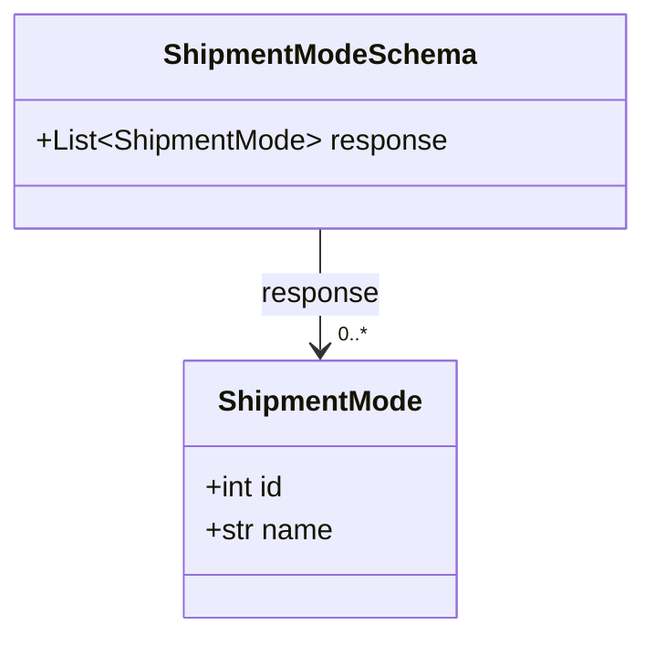

# Diagram: shipment_core/shipment_service/shipment_service/public/model/shipment_mode.py

> Auto-generated by Obscura crawlers

## Mermaid

### SVG

<svg id="container" width="353.9140625" xmlns="http://www.w3.org/2000/svg" class="classDiagram" height="354" viewBox="0 0 353.9140625 354" role="graphics-document document" aria-roledescription="class"><g><defs><marker id="container_class-aggregationStart" class="marker aggregation class" refX="18" refY="7" markerWidth="190" markerHeight="240" orient="auto"><path d="M 18,7 L9,13 L1,7 L9,1 Z"></path></marker></defs><defs><marker id="container_class-aggregationEnd" class="marker aggregation class" refX="1" refY="7" markerWidth="20" markerHeight="28" orient="auto"><path d="M 18,7 L9,13 L1,7 L9,1 Z"></path></marker></defs><defs><marker id="container_class-extensionStart" class="marker extension class" refX="18" refY="7" markerWidth="190" markerHeight="240" orient="auto"><path d="M 1,7 L18,13 V 1 Z"></path></marker></defs><defs><marker id="container_class-extensionEnd" class="marker extension class" refX="1" refY="7" markerWidth="20" markerHeight="28" orient="auto"><path d="M 1,1 V 13 L18,7 Z"></path></marker></defs><defs><marker id="container_class-compositionStart" class="marker composition class" refX="18" refY="7" markerWidth="190" markerHeight="240" orient="auto"><path d="M 18,7 L9,13 L1,7 L9,1 Z"></path></marker></defs><defs><marker id="container_class-compositionEnd" class="marker composition class" refX="1" refY="7" markerWidth="20" markerHeight="28" orient="auto"><path d="M 18,7 L9,13 L1,7 L9,1 Z"></path></marker></defs><defs><marker id="container_class-dependencyStart" class="marker dependency class" refX="6" refY="7" markerWidth="190" markerHeight="240" orient="auto"><path d="M 5,7 L9,13 L1,7 L9,1 Z"></path></marker></defs><defs><marker id="container_class-dependencyEnd" class="marker dependency class" refX="13" refY="7" markerWidth="20" markerHeight="28" orient="auto"><path d="M 18,7 L9,13 L14,7 L9,1 Z"></path></marker></defs><defs><marker id="container_class-lollipopStart" class="marker lollipop class" refX="13" refY="7" markerWidth="190" markerHeight="240" orient="auto"><circle stroke="black" fill="transparent" cx="7" cy="7" r="6"></circle></marker></defs><defs><marker id="container_class-lollipopEnd" class="marker lollipop class" refX="1" refY="7" markerWidth="190" markerHeight="240" orient="auto"><circle stroke="black" fill="transparent" cx="7" cy="7" r="6"></circle></marker></defs><g class="root"><g class="clusters"></g><g class="edgePaths"><path d="M176.957,128L176.957,134.167C176.957,140.333,176.957,152.667,176.957,164C176.957,175.333,176.957,185.667,176.957,190.833L176.957,196" id="id_ShipmentModeSchema_ShipmentMode_1" class="edge-thickness-normal edge-pattern-solid relation" style=";;;" data-edge="true" data-et="edge" data-id="id_ShipmentModeSchema_ShipmentMode_1" data-points="W3sieCI6MTc2Ljk1NzAzMTI1LCJ5IjoxMjh9LHsieCI6MTc2Ljk1NzAzMTI1LCJ5IjoxNjV9LHsieCI6MTc2Ljk1NzAzMTI1LCJ5IjoyMDJ9XQ==" marker-end="url(#container_class-dependencyEnd)"></path></g><g class="edgeLabels"><g class="edgeLabel" transform="translate(176.95703125, 165)"><g class="label" data-id="id_ShipmentModeSchema_ShipmentMode_1" transform="translate(-33.15625, -12)"><foreignObject width="66.3125" height="24">

response

</foreignObject></g></g><g class="edgeTerminals" transform="translate(186.95703062500002, 179.4999994642857)"><g class="inner" transform="translate(0, 0)"></g><foreignObject style="width: 36px; height: 12px;">
0..*
</foreignObject></g></g><g class="nodes"><g class="node default" id="classId-ShipmentMode-0" transform="translate(176.95703125, 274)"><g class="basic label-container"><path d="M-75.7265625 -72 L75.7265625 -72 L75.7265625 72 L-75.7265625 72" stroke="none" stroke-width="0" fill="#ECECFF" style=""></path><path d="M-75.7265625 -72 C-37.02826272870511 -72, 1.670037042589783 -72, 75.7265625 -72 M-75.7265625 -72 C-44.396919113832055 -72, -13.067275727664118 -72, 75.7265625 -72 M75.7265625 -72 C75.7265625 -42.76229484056432, 75.7265625 -13.524589681128653, 75.7265625 72 M75.7265625 -72 C75.7265625 -21.14513056455595, 75.7265625 29.709738870888103, 75.7265625 72 M75.7265625 72 C28.350518583422563 72, -19.025525333154874 72, -75.7265625 72 M75.7265625 72 C39.9653916190096 72, 4.2042207380192025 72, -75.7265625 72 M-75.7265625 72 C-75.7265625 17.72064576189829, -75.7265625 -36.55870847620342, -75.7265625 -72 M-75.7265625 72 C-75.7265625 30.03216267911177, -75.7265625 -11.935674641776458, -75.7265625 -72" stroke="#9370DB" stroke-width="1.3" fill="none" stroke-dasharray="0 0" style=""></path></g><g class="annotation-group text" transform="translate(0, -48)"></g><g class="label-group text" transform="translate(-55.28125, -48)"><g class="label" style="font-weight: bolder" transform="translate(0,-12)"><foreignObject width="110.5625" height="24">

ShipmentMode

</foreignObject></g></g><g class="members-group text" transform="translate(-63.7265625, 0)"><g class="label" style="" transform="translate(0,-12)"><foreignObject width="45.96875" height="24">

+int id

</foreignObject></g><g class="label" style="" transform="translate(0,12)"><foreignObject width="72.171875" height="24">

+str name

</foreignObject></g></g><g class="methods-group text" transform="translate(-63.7265625, 72)"></g><g class="divider" style=""><path d="M-75.7265625 -24 C-22.844010312283473 -24, 30.038541875433054 -24, 75.7265625 -24 M-75.7265625 -24 C-16.992789094723115 -24, 41.74098431055377 -24, 75.7265625 -24" stroke="#9370DB" stroke-width="1.3" fill="none" stroke-dasharray="0 0" style=""></path></g><g class="divider" style=""><path d="M-75.7265625 48 C-34.06391536950138 48, 7.598731760997239 48, 75.7265625 48 M-75.7265625 48 C-33.12098854519613 48, 9.484585409607746 48, 75.7265625 48" stroke="#9370DB" stroke-width="1.3" fill="none" stroke-dasharray="0 0" style=""></path></g></g><g class="node default" id="classId-ShipmentModeSchema-1" transform="translate(176.95703125, 68)"><g class="basic label-container"><path d="M-168.95703125 -60 L168.95703125 -60 L168.95703125 60 L-168.95703125 60" stroke="none" stroke-width="0" fill="#ECECFF" style=""></path><path d="M-168.95703125 -60 C-55.659433147378735 -60, 57.63816495524253 -60, 168.95703125 -60 M-168.95703125 -60 C-81.8899835536745 -60, 5.177064142651005 -60, 168.95703125 -60 M168.95703125 -60 C168.95703125 -16.138726667154103, 168.95703125 27.722546665691794, 168.95703125 60 M168.95703125 -60 C168.95703125 -30.41175093907704, 168.95703125 -0.823501878154083, 168.95703125 60 M168.95703125 60 C68.64056864608482 60, -31.675893957830368 60, -168.95703125 60 M168.95703125 60 C86.77880849971073 60, 4.6005857494214695 60, -168.95703125 60 M-168.95703125 60 C-168.95703125 24.960931815254163, -168.95703125 -10.078136369491673, -168.95703125 -60 M-168.95703125 60 C-168.95703125 28.362583774923436, -168.95703125 -3.274832450153127, -168.95703125 -60" stroke="#9370DB" stroke-width="1.3" fill="none" stroke-dasharray="0 0" style=""></path></g><g class="annotation-group text" transform="translate(0, -36)"></g><g class="label-group text" transform="translate(-83.8671875, -36)"><g class="label" style="font-weight: bolder" transform="translate(0,-12)"><foreignObject width="167.734375" height="24">

ShipmentModeSchema

</foreignObject></g></g><g class="members-group text" transform="translate(-156.95703125, 12)"><g class="label" style="" transform="translate(0,-12)"><foreignObject width="230.046875" height="24">

+List&lt;ShipmentMode&gt; response

</foreignObject></g></g><g class="methods-group text" transform="translate(-156.95703125, 60)"></g><g class="divider" style=""><path d="M-168.95703125 -12 C-93.60985515709271 -12, -18.26267906418542 -12, 168.95703125 -12 M-168.95703125 -12 C-65.88378206967307 -12, 37.18946711065385 -12, 168.95703125 -12" stroke="#9370DB" stroke-width="1.3" fill="none" stroke-dasharray="0 0" style=""></path></g><g class="divider" style=""><path d="M-168.95703125 36 C-34.35311438727402 36, 100.25080247545196 36, 168.95703125 36 M-168.95703125 36 C-92.07152305343868 36, -15.186014856877364 36, 168.95703125 36" stroke="#9370DB" stroke-width="1.3" fill="none" stroke-dasharray="0 0" style=""></path></g></g></g></g></g></svg>
