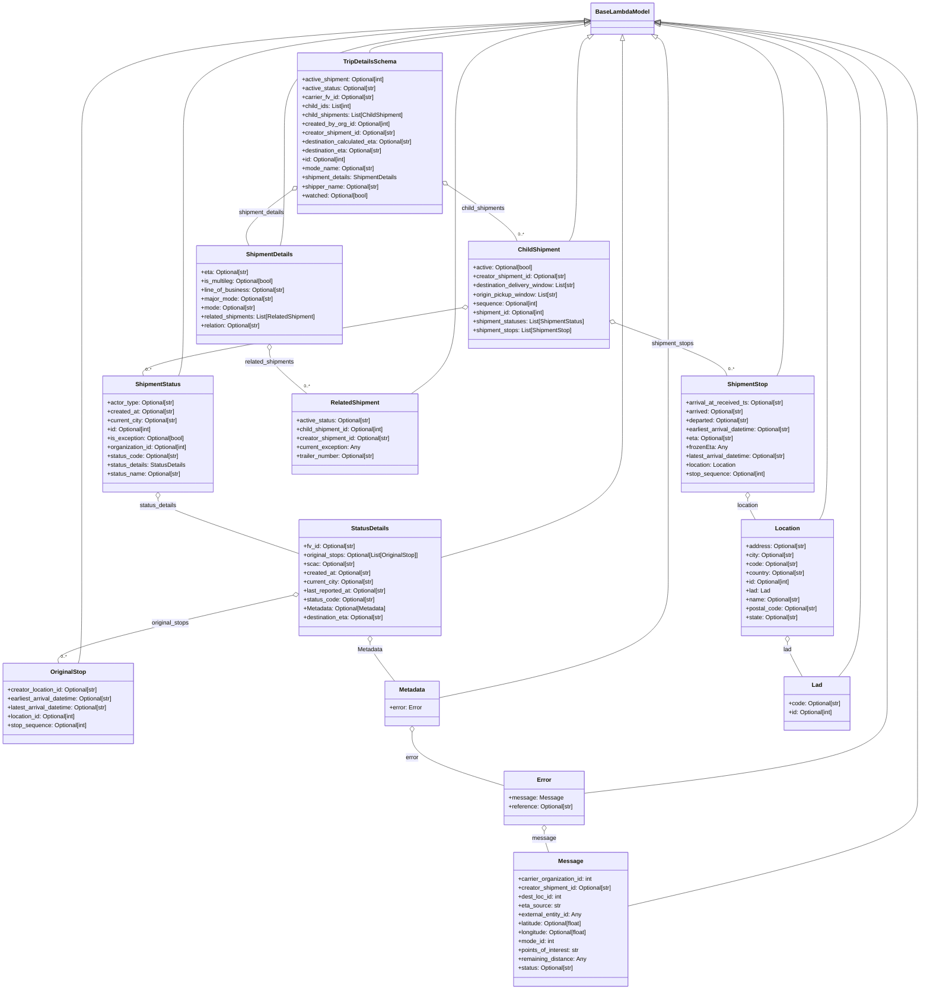

# Diagram: shipment_core/shipment_service/shipment_service/public/model/trip_details.py

> Auto-generated by Obscura crawlers

## Mermaid

### SVG

<svg id="container" width="2515.81591796875" xmlns="http://www.w3.org/2000/svg" class="classDiagram" height="2658" viewBox="0 0 2515.81591796875 2658" role="graphics-document document" aria-roledescription="class"><g><defs><marker id="container_class-aggregationStart" class="marker aggregation class" refX="18" refY="7" markerWidth="190" markerHeight="240" orient="auto"><path d="M 18,7 L9,13 L1,7 L9,1 Z"></path></marker></defs><defs><marker id="container_class-aggregationEnd" class="marker aggregation class" refX="1" refY="7" markerWidth="20" markerHeight="28" orient="auto"><path d="M 18,7 L9,13 L1,7 L9,1 Z"></path></marker></defs><defs><marker id="container_class-extensionStart" class="marker extension class" refX="18" refY="7" markerWidth="190" markerHeight="240" orient="auto"><path d="M 1,7 L18,13 V 1 Z"></path></marker></defs><defs><marker id="container_class-extensionEnd" class="marker extension class" refX="1" refY="7" markerWidth="20" markerHeight="28" orient="auto"><path d="M 1,1 V 13 L18,7 Z"></path></marker></defs><defs><marker id="container_class-compositionStart" class="marker composition class" refX="18" refY="7" markerWidth="190" markerHeight="240" orient="auto"><path d="M 18,7 L9,13 L1,7 L9,1 Z"></path></marker></defs><defs><marker id="container_class-compositionEnd" class="marker composition class" refX="1" refY="7" markerWidth="20" markerHeight="28" orient="auto"><path d="M 18,7 L9,13 L1,7 L9,1 Z"></path></marker></defs><defs><marker id="container_class-dependencyStart" class="marker dependency class" refX="6" refY="7" markerWidth="190" markerHeight="240" orient="auto"><path d="M 5,7 L9,13 L1,7 L9,1 Z"></path></marker></defs><defs><marker id="container_class-dependencyEnd" class="marker dependency class" refX="13" refY="7" markerWidth="20" markerHeight="28" orient="auto"><path d="M 18,7 L9,13 L14,7 L9,1 Z"></path></marker></defs><defs><marker id="container_class-lollipopStart" class="marker lollipop class" refX="13" refY="7" markerWidth="190" markerHeight="240" orient="auto"><circle stroke="black" fill="transparent" cx="7" cy="7" r="6"></circle></marker></defs><defs><marker id="container_class-lollipopEnd" class="marker lollipop class" refX="1" refY="7" markerWidth="190" markerHeight="240" orient="auto"><circle stroke="black" fill="transparent" cx="7" cy="7" r="6"></circle></marker></defs><g class="root"><g class="clusters"></g><g class="edgePaths"><path d="M1601.524,54.471L1372.086,64.893C1142.648,75.314,683.772,96.157,454.334,146.745C224.896,197.333,224.896,277.667,224.896,360C224.896,442.333,224.896,526.667,224.896,599C224.896,671.333,224.896,731.667,224.896,792C224.896,852.333,224.896,912.667,224.896,975C224.896,1037.333,224.896,1101.667,224.896,1166C224.896,1230.333,224.896,1294.667,224.896,1359C224.896,1423.333,224.896,1487.667,224.896,1552C224.896,1616.333,224.896,1680.667,223.345,1719C221.793,1757.333,218.689,1769.667,217.137,1775.833L215.585,1782" id="id_BaseLambdaModel_OriginalStop_1" class="edge-thickness-normal edge-pattern-solid relation" style=";;;" data-edge="true" data-et="edge" data-id="id_BaseLambdaModel_OriginalStop_1" data-points="W3sieCI6MTYxOC43NTU4NTkzNzUsInkiOjUzLjY4ODM5MjQ0MDk5ODI2NH0seyJ4IjoyMjQuODk2NDg0Mzc1LCJ5IjoxMTd9LHsieCI6MjI0Ljg5NjQ4NDM3NSwieSI6MzU4fSx7IngiOjIyNC44OTY0ODQzNzUsInkiOjYxMX0seyJ4IjoyMjQuODk2NDg0Mzc1LCJ5Ijo3OTJ9LHsieCI6MjI0Ljg5NjQ4NDM3NSwieSI6OTczfSx7IngiOjIyNC44OTY0ODQzNzUsInkiOjExNjZ9LHsieCI6MjI0Ljg5NjQ4NDM3NSwieSI6MTM1OX0seyJ4IjoyMjQuODk2NDg0Mzc1LCJ5IjoxNTUyfSx7IngiOjIyNC44OTY0ODQzNzUsInkiOjE3NDV9LHsieCI6MjE1LjU4NTE4MzE4OTY1NTE3LCJ5IjoxNzgyfV0=" marker-start="url(#container_class-extensionStart)"></path><path d="M1798.353,58.16L1916.597,67.967C2034.841,77.774,2271.329,97.387,2389.573,147.36C2507.816,197.333,2507.816,277.667,2507.816,360C2507.816,442.333,2507.816,526.667,2507.816,599C2507.816,671.333,2507.816,731.667,2507.816,792C2507.816,852.333,2507.816,912.667,2507.816,975C2507.816,1037.333,2507.816,1101.667,2507.816,1166C2507.816,1230.333,2507.816,1294.667,2507.816,1359C2507.816,1423.333,2507.816,1487.667,2507.816,1552C2507.816,1616.333,2507.816,1680.667,2507.816,1737C2507.816,1793.333,2507.816,1841.667,2507.816,1890C2507.816,1938.333,2507.816,1986.667,2507.816,2029C2507.816,2071.333,2507.816,2107.667,2507.816,2144C2507.816,2180.333,2507.816,2216.667,2376.018,2265.018C2244.219,2313.37,1980.622,2373.74,1848.824,2403.925L1717.025,2434.11" id="id_BaseLambdaModel_Message_2" class="edge-thickness-normal edge-pattern-solid relation" style=";;;" data-edge="true" data-et="edge" data-id="id_BaseLambdaModel_Message_2" data-points="W3sieCI6MTc4MS4xNjIxMDkzNzUsInkiOjU2LjczNDYxNTgyMTY1NDAyfSx7IngiOjI1MDcuODE2NDA2MjUsInkiOjExN30seyJ4IjoyNTA3LjgxNjQwNjI1LCJ5IjozNTh9LHsieCI6MjUwNy44MTY0MDYyNSwieSI6NjExfSx7IngiOjI1MDcuODE2NDA2MjUsInkiOjc5Mn0seyJ4IjoyNTA3LjgxNjQwNjI1LCJ5Ijo5NzN9LHsieCI6MjUwNy44MTY0MDYyNSwieSI6MTE2Nn0seyJ4IjoyNTA3LjgxNjQwNjI1LCJ5IjoxMzU5fSx7IngiOjI1MDcuODE2NDA2MjUsInkiOjE1NTJ9LHsieCI6MjUwNy44MTY0MDYyNSwieSI6MTc0NX0seyJ4IjoyNTA3LjgxNjQwNjI1LCJ5IjoxODkwfSx7IngiOjI1MDcuODE2NDA2MjUsInkiOjIwMzV9LHsieCI6MjUwNy44MTY0MDYyNSwieSI6MjE0NH0seyJ4IjoyNTA3LjgxNjQwNjI1LCJ5IjoyMjUzfSx7IngiOjE3MTcuMDI1MzkwNjI1LCJ5IjoyNDM0LjEwOTU0NzkyNzIxOH1d" marker-start="url(#container_class-extensionStart)"></path><path d="M1798.339,59.084L1902.878,68.737C2007.416,78.389,2216.493,97.695,2321.032,147.514C2425.57,197.333,2425.57,277.667,2425.57,360C2425.57,442.333,2425.57,526.667,2425.57,599C2425.57,671.333,2425.57,731.667,2425.57,792C2425.57,852.333,2425.57,912.667,2425.57,975C2425.57,1037.333,2425.57,1101.667,2425.57,1166C2425.57,1230.333,2425.57,1294.667,2425.57,1359C2425.57,1423.333,2425.57,1487.667,2425.57,1552C2425.57,1616.333,2425.57,1680.667,2425.57,1737C2425.57,1793.333,2425.57,1841.667,2425.57,1890C2425.57,1938.333,2425.57,1986.667,2287.569,2026.878C2149.567,2067.09,1873.564,2099.18,1735.562,2115.225L1597.561,2131.27" id="id_BaseLambdaModel_Error_3" class="edge-thickness-normal edge-pattern-solid relation" style=";;;" data-edge="true" data-et="edge" data-id="id_BaseLambdaModel_Error_3" data-points="W3sieCI6MTc4MS4xNjIxMDkzNzUsInkiOjU3LjQ5Nzk2NjQyMzc4NTk3NX0seyJ4IjoyNDI1LjU3MDMxMjUsInkiOjExN30seyJ4IjoyNDI1LjU3MDMxMjUsInkiOjM1OH0seyJ4IjoyNDI1LjU3MDMxMjUsInkiOjYxMX0seyJ4IjoyNDI1LjU3MDMxMjUsInkiOjc5Mn0seyJ4IjoyNDI1LjU3MDMxMjUsInkiOjk3M30seyJ4IjoyNDI1LjU3MDMxMjUsInkiOjExNjZ9LHsieCI6MjQyNS41NzAzMTI1LCJ5IjoxMzU5fSx7IngiOjI0MjUuNTcwMzEyNSwieSI6MTU1Mn0seyJ4IjoyNDI1LjU3MDMxMjUsInkiOjE3NDV9LHsieCI6MjQyNS41NzAzMTI1LCJ5IjoxODkwfSx7IngiOjI0MjUuNTcwMzEyNSwieSI6MjAzNX0seyJ4IjoxNTk3LjU2MDU0Njg3NSwieSI6MjEzMS4yNjk3MzQ4NTQ3MTl9XQ==" marker-start="url(#container_class-extensionStart)"></path><path d="M1793.788,100.129L1799.051,102.94C1804.314,105.752,1814.841,111.376,1820.104,154.355C1825.367,197.333,1825.367,277.667,1825.367,360C1825.367,442.333,1825.367,526.667,1825.367,599C1825.367,671.333,1825.367,731.667,1825.367,792C1825.367,852.333,1825.367,912.667,1825.367,975C1825.367,1037.333,1825.367,1101.667,1825.367,1166C1825.367,1230.333,1825.367,1294.667,1825.367,1359C1825.367,1423.333,1825.367,1487.667,1825.367,1552C1825.367,1616.333,1825.367,1680.667,1721.096,1734.463C1616.825,1788.259,1408.283,1831.518,1304.011,1853.147L1199.74,1874.776" id="id_BaseLambdaModel_Metadata_4" class="edge-thickness-normal edge-pattern-solid relation" style=";;;" data-edge="true" data-et="edge" data-id="id_BaseLambdaModel_Metadata_4" data-points="W3sieCI6MTc3OC41NzMwODE4NTYzNDM0LCJ5Ijo5Mn0seyJ4IjoxODI1LjM2NzE4NzUsInkiOjExN30seyJ4IjoxODI1LjM2NzE4NzUsInkiOjM1OH0seyJ4IjoxODI1LjM2NzE4NzUsInkiOjYxMX0seyJ4IjoxODI1LjM2NzE4NzUsInkiOjc5Mn0seyJ4IjoxODI1LjM2NzE4NzUsInkiOjk3M30seyJ4IjoxODI1LjM2NzE4NzUsInkiOjExNjZ9LHsieCI6MTgyNS4zNjcxODc1LCJ5IjoxMzU5fSx7IngiOjE4MjUuMzY3MTg3NSwieSI6MTU1Mn0seyJ4IjoxODI1LjM2NzE4NzUsInkiOjE3NDV9LHsieCI6MTE5OS43NDAyMzQzNzUsInkiOjE4NzQuNzc2MjkwMzg1MjIyNn1d" marker-start="url(#container_class-extensionStart)"></path><path d="M1699.959,109.25L1699.959,110.542C1699.959,111.833,1699.959,114.417,1699.959,155.875C1699.959,197.333,1699.959,277.667,1699.959,360C1699.959,442.333,1699.959,526.667,1699.959,599C1699.959,671.333,1699.959,731.667,1699.959,792C1699.959,852.333,1699.959,912.667,1699.959,975C1699.959,1037.333,1699.959,1101.667,1699.959,1166C1699.959,1230.333,1699.959,1294.667,1617.759,1349.858C1535.559,1405.05,1371.158,1451.1,1288.958,1474.125L1206.758,1497.15" id="id_BaseLambdaModel_StatusDetails_5" class="edge-thickness-normal edge-pattern-solid relation" style=";;;" data-edge="true" data-et="edge" data-id="id_BaseLambdaModel_StatusDetails_5" data-points="W3sieCI6MTY5OS45NTg5ODQzNzUsInkiOjkyfSx7IngiOjE2OTkuOTU4OTg0Mzc1LCJ5IjoxMTd9LHsieCI6MTY5OS45NTg5ODQzNzUsInkiOjM1OH0seyJ4IjoxNjk5Ljk1ODk4NDM3NSwieSI6NjExfSx7IngiOjE2OTkuOTU4OTg0Mzc1LCJ5Ijo3OTJ9LHsieCI6MTY5OS45NTg5ODQzNzUsInkiOjk3M30seyJ4IjoxNjk5Ljk1ODk4NDM3NSwieSI6MTE2Nn0seyJ4IjoxNjk5Ljk1ODk4NDM3NSwieSI6MTM1OX0seyJ4IjoxMjA2Ljc1NzgxMjUsInkiOjE0OTcuMTUwMDY5MzA3MjM5NH1d" marker-start="url(#container_class-extensionStart)"></path><path d="M1601.533,55.516L1418.68,65.763C1235.827,76.011,870.122,96.505,687.269,146.919C504.416,197.333,504.416,277.667,504.416,360C504.416,442.333,504.416,526.667,504.416,599C504.416,671.333,504.416,731.667,504.416,792C504.416,852.333,504.416,912.667,502.163,949C499.909,985.333,495.403,997.667,493.149,1003.833L490.896,1010" id="id_BaseLambdaModel_ShipmentStatus_6" class="edge-thickness-normal edge-pattern-solid relation" style=";;;" data-edge="true" data-et="edge" data-id="id_BaseLambdaModel_ShipmentStatus_6" data-points="W3sieCI6MTYxOC43NTU4NTkzNzUsInkiOjU0LjU1MDc0MzQ4NDA5OTQ3fSx7IngiOjUwNC40MTYwMTU2MjUsInkiOjExN30seyJ4Ijo1MDQuNDE2MDE1NjI1LCJ5IjozNTh9LHsieCI6NTA0LjQxNjAxNTYyNSwieSI6NjExfSx7IngiOjUwNC40MTYwMTU2MjUsInkiOjc5Mn0seyJ4Ijo1MDQuNDE2MDE1NjI1LCJ5Ijo5NzN9LHsieCI6NDkwLjg5NTk3ODM4NDA2NzM1LCJ5IjoxMDEwfV0=" marker-start="url(#container_class-extensionStart)"></path><path d="M1798.322,60.094L1890.747,69.578C1983.172,79.062,2168.023,98.031,2260.448,147.682C2352.873,197.333,2352.873,277.667,2352.873,360C2352.873,442.333,2352.873,526.667,2352.873,599C2352.873,671.333,2352.873,731.667,2352.873,792C2352.873,852.333,2352.873,912.667,2352.873,975C2352.873,1037.333,2352.873,1101.667,2352.873,1166C2352.873,1230.333,2352.873,1294.667,2352.873,1359C2352.873,1423.333,2352.873,1487.667,2352.873,1552C2352.873,1616.333,2352.873,1680.667,2342.868,1725C2332.862,1769.333,2312.852,1793.667,2302.846,1805.833L2292.841,1818" id="id_BaseLambdaModel_Lad_7" class="edge-thickness-normal edge-pattern-solid relation" style=";;;" data-edge="true" data-et="edge" data-id="id_BaseLambdaModel_Lad_7" data-points="W3sieCI6MTc4MS4xNjIxMDkzNzUsInkiOjU4LjMzMjgxMDgzNjAzNTU2fSx7IngiOjIzNTIuODczMDQ2ODc1LCJ5IjoxMTd9LHsieCI6MjM1Mi44NzMwNDY4NzUsInkiOjM1OH0seyJ4IjoyMzUyLjg3MzA0Njg3NSwieSI6NjExfSx7IngiOjIzNTIuODczMDQ2ODc1LCJ5Ijo3OTJ9LHsieCI6MjM1Mi44NzMwNDY4NzUsInkiOjk3M30seyJ4IjoyMzUyLjg3MzA0Njg3NSwieSI6MTE2Nn0seyJ4IjoyMzUyLjg3MzA0Njg3NSwieSI6MTM1OX0seyJ4IjoyMzUyLjg3MzA0Njg3NSwieSI6MTU1Mn0seyJ4IjoyMzUyLjg3MzA0Njg3NSwieSI6MTc0NX0seyJ4IjoyMjkyLjg0MDc3MzE2ODEwMzYsInkiOjE4MTh9XQ==" marker-start="url(#container_class-extensionStart)"></path><path d="M1798.291,61.715L1875.632,70.929C1952.973,80.143,2107.654,98.572,2184.995,147.952C2262.336,197.333,2262.336,277.667,2262.336,360C2262.336,442.333,2262.336,526.667,2262.336,599C2262.336,671.333,2262.336,731.667,2262.336,792C2262.336,852.333,2262.336,912.667,2262.336,975C2262.336,1037.333,2262.336,1101.667,2262.336,1166C2262.336,1230.333,2262.336,1294.667,2258.845,1333C2255.355,1371.333,2248.374,1383.667,2244.884,1389.833L2241.393,1396" id="id_BaseLambdaModel_Location_8" class="edge-thickness-normal edge-pattern-solid relation" style=";;;" data-edge="true" data-et="edge" data-id="id_BaseLambdaModel_Location_8" data-points="W3sieCI6MTc4MS4xNjIxMDkzNzUsInkiOjU5LjY3NDMxMDY5OTkxMDA1fSx7IngiOjIyNjIuMzM1OTM3NSwieSI6MTE3fSx7IngiOjIyNjIuMzM1OTM3NSwieSI6MzU4fSx7IngiOjIyNjIuMzM1OTM3NSwieSI6NjExfSx7IngiOjIyNjIuMzM1OTM3NSwieSI6NzkyfSx7IngiOjIyNjIuMzM1OTM3NSwieSI6OTczfSx7IngiOjIyNjIuMzM1OTM3NSwieSI6MTE2Nn0seyJ4IjoyMjYyLjMzNTkzNzUsInkiOjEzNTl9LHsieCI6MjI0MS4zOTMxMzQ3MTUwMjYsInkiOjEzOTZ9XQ==" marker-start="url(#container_class-extensionStart)"></path><path d="M1798.218,64.856L1855.698,73.547C1913.177,82.238,2028.135,99.619,2085.615,148.476C2143.094,197.333,2143.094,277.667,2143.094,360C2143.094,442.333,2143.094,526.667,2143.094,599C2143.094,671.333,2143.094,731.667,2143.094,792C2143.094,852.333,2143.094,912.667,2139.923,949C2136.752,985.333,2130.41,997.667,2127.239,1003.833L2124.068,1010" id="id_BaseLambdaModel_ShipmentStop_9" class="edge-thickness-normal edge-pattern-solid relation" style=";;;" data-edge="true" data-et="edge" data-id="id_BaseLambdaModel_ShipmentStop_9" data-points="W3sieCI6MTc4MS4xNjIxMDkzNzUsInkiOjYyLjI3NzU1MDMwMDgxMzE5fSx7IngiOjIxNDMuMDkzNzUsInkiOjExN30seyJ4IjoyMTQzLjA5Mzc1LCJ5IjozNTh9LHsieCI6MjE0My4wOTM3NSwieSI6NjExfSx7IngiOjIxNDMuMDkzNzUsInkiOjc5Mn0seyJ4IjoyMTQzLjA5Mzc1LCJ5Ijo5NzN9LHsieCI6MjEyNC4wNjgwNDU2NjA2MjIsInkiOjEwMTB9XQ==" marker-start="url(#container_class-extensionStart)"></path><path d="M1607.633,100.246L1602.502,103.038C1597.371,105.831,1587.109,111.415,1581.979,154.374C1576.848,197.333,1576.848,277.667,1576.848,360C1576.848,442.333,1576.848,526.667,1573.335,575C1569.822,623.333,1562.796,635.667,1559.283,641.833L1555.77,648" id="id_BaseLambdaModel_ChildShipment_10" class="edge-thickness-normal edge-pattern-solid relation" style=";;;" data-edge="true" data-et="edge" data-id="id_BaseLambdaModel_ChildShipment_10" data-points="W3sieCI6MTYyMi43ODQ3MTg5ODMyMDksInkiOjkyfSx7IngiOjE1NzYuODQ3NjU2MjUsInkiOjExN30seyJ4IjoxNTc2Ljg0NzY1NjI1LCJ5IjozNTh9LHsieCI6MTU3Ni44NDc2NTYyNSwieSI6NjExfSx7IngiOjE1NTUuNzY5NjQ5OTQ4MjA0NSwieSI6NjQ4fV0=" marker-start="url(#container_class-extensionStart)"></path><path d="M1601.692,64.552L1542.662,73.293C1483.633,82.035,1365.573,99.517,1306.543,148.425C1247.514,197.333,1247.514,277.667,1247.514,360C1247.514,442.333,1247.514,526.667,1247.514,599C1247.514,671.333,1247.514,731.667,1247.514,792C1247.514,852.333,1247.514,912.667,1227.302,957C1207.09,1001.333,1166.665,1029.667,1146.453,1043.833L1126.241,1058" id="id_BaseLambdaModel_RelatedShipment_11" class="edge-thickness-normal edge-pattern-solid relation" style=";;;" data-edge="true" data-et="edge" data-id="id_BaseLambdaModel_RelatedShipment_11" data-points="W3sieCI6MTYxOC43NTU4NTkzNzUsInkiOjYyLjAyNDg5OTQxODA5MjY2fSx7IngiOjEyNDcuNTEzNjcxODc1LCJ5IjoxMTd9LHsieCI6MTI0Ny41MTM2NzE4NzUsInkiOjM1OH0seyJ4IjoxMjQ3LjUxMzY3MTg3NSwieSI6NjExfSx7IngiOjEyNDcuNTEzNjcxODc1LCJ5Ijo3OTJ9LHsieCI6MTI0Ny41MTM2NzE4NzUsInkiOjk3M30seyJ4IjoxMTI2LjI0MTQwODI3Mzk2MzgsInkiOjEwNTh9XQ==" marker-start="url(#container_class-extensionStart)"></path><path d="M1601.551,57.165L1464.574,67.137C1327.596,77.11,1053.641,97.055,916.663,147.194C779.686,197.333,779.686,277.667,779.686,360C779.686,442.333,779.686,526.667,777.816,577C775.946,627.333,772.206,643.667,770.336,651.833L768.466,660" id="id_BaseLambdaModel_ShipmentDetails_12" class="edge-thickness-normal edge-pattern-solid relation" style=";;;" data-edge="true" data-et="edge" data-id="id_BaseLambdaModel_ShipmentDetails_12" data-points="W3sieCI6MTYxOC43NTU4NTkzNzUsInkiOjU1LjkxMTk0ODcyNDQ3ODk3fSx7IngiOjc3OS42ODU1NDY4NzUsInkiOjExN30seyJ4Ijo3NzkuNjg1NTQ2ODc1LCJ5IjozNTh9LHsieCI6Nzc5LjY4NTU0Njg3NSwieSI6NjExfSx7IngiOjc2OC40NjU1NDUxNDg0ODA3LCJ5Ijo2NjB9XQ==" marker-start="url(#container_class-extensionStart)"></path><path d="M1601.587,59.603L1503.589,69.169C1405.592,78.735,1209.596,97.868,1111.598,111.6C1013.6,125.333,1013.6,133.667,1013.6,137.833L1013.6,142" id="id_BaseLambdaModel_TripDetailsSchema_13" class="edge-thickness-normal edge-pattern-solid relation" style=";;;" data-edge="true" data-et="edge" data-id="id_BaseLambdaModel_TripDetailsSchema_13" data-points="W3sieCI6MTYxOC43NTU4NTkzNzUsInkiOjU3LjkyNjc2NDg1OTg4MTE3fSx7IngiOjEwMTMuNTk5NjA5Mzc1LCJ5IjoxMTd9LHsieCI6MTAxMy41OTk2MDkzNzUsInkiOjE0Mn1d" marker-start="url(#container_class-extensionStart)"></path><path d="M798.295,1599.815L690.684,1624.013C583.072,1648.21,367.848,1696.605,261.758,1726.969C155.668,1757.333,158.712,1769.667,160.234,1775.833L161.755,1782" id="id_StatusDetails_OriginalStop_14" class="edge-thickness-normal edge-pattern-solid relation" style=";;;" data-edge="true" data-et="edge" data-id="id_StatusDetails_OriginalStop_14" data-points="W3sieCI6ODE1LjEyNSwieSI6MTU5Ni4wMzEwNDI3ODQ1MjA5fSx7IngiOjE1Mi42MjUsInkiOjE3NDV9LHsieCI6MTYxLjc1NTM4NzkzMTAzNDQ4LCJ5IjoxNzgyfV0=" marker-start="url(#container_class-aggregationStart)"></path><path d="M1010.941,1725.25L1010.941,1728.542C1010.941,1731.833,1010.941,1738.417,1022.217,1755.875C1033.492,1773.333,1056.043,1801.667,1067.319,1815.833L1078.594,1830" id="id_StatusDetails_Metadata_15" class="edge-thickness-normal edge-pattern-solid relation" style=";;;" data-edge="true" data-et="edge" data-id="id_StatusDetails_Metadata_15" data-points="W3sieCI6MTAxMC45NDE0MDYyNSwieSI6MTcwOH0seyJ4IjoxMDEwLjk0MTQwNjI1LCJ5IjoxNzQ1fSx7IngiOjEwNzguNTk0NDkwODQwNTE3MiwieSI6MTgzMH1d" marker-start="url(#container_class-aggregationStart)"></path><path d="M1126.35,1967.25L1126.35,1978.542C1126.35,1989.833,1126.35,2012.417,1168.387,2036.376C1210.425,2060.335,1294.501,2085.67,1336.538,2098.338L1378.576,2111.006" id="id_Metadata_Error_16" class="edge-thickness-normal edge-pattern-solid relation" style=";;;" data-edge="true" data-et="edge" data-id="id_Metadata_Error_16" data-points="W3sieCI6MTEyNi4zNDk2MDkzNzUsInkiOjE5NTB9LHsieCI6MTEyNi4zNDk2MDkzNzUsInkiOjIwMzV9LHsieCI6MTM3OC41NzYxNzE4NzUsInkiOjIxMTEuMDA1NzIzNTQyMTE3fV0=" marker-start="url(#container_class-aggregationStart)"></path><path d="M1488.068,2233.25L1488.068,2236.542C1488.068,2239.833,1488.068,2246.417,1490.121,2255.875C1492.175,2265.333,1496.281,2277.667,1498.334,2283.833L1500.387,2290" id="id_Error_Message_17" class="edge-thickness-normal edge-pattern-solid relation" style=";;;" data-edge="true" data-et="edge" data-id="id_Error_Message_17" data-points="W3sieCI6MTQ4OC4wNjgzNTkzNzUsInkiOjIyMTZ9LHsieCI6MTQ4OC4wNjgzNTkzNzUsInkiOjIyNTN9LHsieCI6MTUwMC4zODY4MTc3NTYzMzYzLCJ5IjoyMjkwfV0=" marker-start="url(#container_class-aggregationStart)"></path><path d="M433.893,1339.25L433.893,1342.542C433.893,1345.833,433.893,1352.417,497.431,1376.96C560.97,1401.502,688.048,1444.005,751.586,1465.256L815.125,1486.507" id="id_ShipmentStatus_StatusDetails_18" class="edge-thickness-normal edge-pattern-solid relation" style=";;;" data-edge="true" data-et="edge" data-id="id_ShipmentStatus_StatusDetails_18" data-points="W3sieCI6NDMzLjg5MjU3ODEyNSwieSI6MTMyMn0seyJ4Ijo0MzMuODkyNTc4MTI1LCJ5IjoxMzU5fSx7IngiOjgxNS4xMjUsInkiOjE0ODYuNTA3MTYwMjg4MjM5Mn1d" marker-start="url(#container_class-aggregationStart)"></path><path d="M2043.852,1339.25L2043.852,1342.542C2043.852,1345.833,2043.852,1352.417,2047.342,1361.875C2050.832,1371.333,2057.813,1383.667,2061.304,1389.833L2064.794,1396" id="id_ShipmentStop_Location_19" class="edge-thickness-normal edge-pattern-solid relation" style=";;;" data-edge="true" data-et="edge" data-id="id_ShipmentStop_Location_19" data-points="W3sieCI6MjA0My44NTE1NjI1LCJ5IjoxMzIyfSx7IngiOjIwNDMuODUxNTYyNSwieSI6MTM1OX0seyJ4IjoyMDY0Ljc5NDM2NTI4NDk3NCwieSI6MTM5Nn1d" marker-start="url(#container_class-aggregationStart)"></path><path d="M2153.094,1725.25L2153.094,1728.542C2153.094,1731.833,2153.094,1738.417,2159.851,1753.875C2166.609,1769.333,2180.125,1793.667,2186.882,1805.833L2193.64,1818" id="id_Location_Lad_20" class="edge-thickness-normal edge-pattern-solid relation" style=";;;" data-edge="true" data-et="edge" data-id="id_Location_Lad_20" data-points="W3sieCI6MjE1My4wOTM3NSwieSI6MTcwOH0seyJ4IjoyMTUzLjA5Mzc1LCJ5IjoxNzQ1fSx7IngiOjIxOTMuNjQwMDE4ODU3NzU4NiwieSI6MTgxOH1d" marker-start="url(#container_class-aggregationStart)"></path><path d="M1265.497,826.608L1118.689,851.007C971.881,875.405,678.265,924.203,533.03,954.768C387.795,985.333,390.942,997.667,392.516,1003.833L394.089,1010" id="id_ChildShipment_ShipmentStatus_21" class="edge-thickness-normal edge-pattern-solid relation" style=";;;" data-edge="true" data-et="edge" data-id="id_ChildShipment_ShipmentStatus_21" data-points="W3sieCI6MTI4Mi41MTM2NzE4NzUsInkiOjgyMy43ODAwODA0NTAwNjEzfSx7IngiOjM4NC42NDg0Mzc1LCJ5Ijo5NzN9LHsieCI6Mzk0LjA4OTAyNDA0NDY4OTEsInkiOjEwMTB9XQ==" marker-start="url(#container_class-aggregationStart)"></path><path d="M1681.179,867.109L1729.922,884.758C1778.665,902.406,1876.151,937.703,1927.137,961.518C1978.124,985.333,1982.611,997.667,1984.854,1003.833L1987.098,1010" id="id_ChildShipment_ShipmentStop_22" class="edge-thickness-normal edge-pattern-solid relation" style=";;;" data-edge="true" data-et="edge" data-id="id_ChildShipment_ShipmentStop_22" data-points="W3sieCI6MTY2NC45NTg5ODQzNzUsInkiOjg2MS4yMzYzOTQ3NTA1MTY4fSx7IngiOjE5NzMuNjM2NzE4NzUsInkiOjk3M30seyJ4IjoxOTg3LjA5NzU5NTUzMTA4OCwieSI6MTAxMH1d" marker-start="url(#container_class-aggregationStart)"></path><path d="M738.24,941.25L738.24,946.542C738.24,951.833,738.24,962.417,755.41,981.875C772.58,1001.333,806.92,1029.667,824.09,1043.833L841.259,1058" id="id_ShipmentDetails_RelatedShipment_23" class="edge-thickness-normal edge-pattern-solid relation" style=";;;" data-edge="true" data-et="edge" data-id="id_ShipmentDetails_RelatedShipment_23" data-points="W3sieCI6NzM4LjI0MDIzNDM3NSwieSI6OTI0fSx7IngiOjczOC4yNDAyMzQzNzUsInkiOjk3M30seyJ4Ijo4NDEuMjU5MzgxMDcxODkxMiwieSI6MTA1OH1d" marker-start="url(#container_class-aggregationStart)"></path><path d="M1226.952,497.474L1255.896,516.395C1284.839,535.316,1342.726,573.158,1374.161,598.246C1405.596,623.333,1410.578,635.667,1413.07,641.833L1415.561,648" id="id_TripDetailsSchema_ChildShipment_24" class="edge-thickness-normal edge-pattern-solid relation" style=";;;" data-edge="true" data-et="edge" data-id="id_TripDetailsSchema_ChildShipment_24" data-points="W3sieCI6MTIxMi41MTM2NzE4NzUsInkiOjQ4OC4wMzQ4MzIwMjIwNDM4fSx7IngiOjE0MDAuNjEzMjgxMjUsInkiOjYxMX0seyJ4IjoxNDE1LjU2MTA4NjQxMjI5MjgsInkiOjY0OH1d" marker-start="url(#container_class-aggregationStart)"></path><path d="M800.694,511.538L777.707,528.115C754.721,544.692,708.747,577.846,689.165,602.59C669.584,627.333,676.394,643.667,679.799,651.833L683.204,660" id="id_TripDetailsSchema_ShipmentDetails_25" class="edge-thickness-normal edge-pattern-solid relation" style=";;;" data-edge="true" data-et="edge" data-id="id_TripDetailsSchema_ShipmentDetails_25" data-points="W3sieCI6ODE0LjY4NTU0Njg3NSwieSI6NTAxLjQ0Nzg0MzUzODk2NzczfSx7IngiOjY2Mi43NzM0Mzc1LCJ5Ijo2MTF9LHsieCI6NjgzLjIwMzY3NTMyODAzODcsInkiOjY2MH1d" marker-start="url(#container_class-aggregationStart)"></path></g><g class="edgeLabels"><g class="edgeLabel"><g class="label" data-id="id_BaseLambdaModel_OriginalStop_1" transform="translate(0, 0)"><foreignObject width="0" height="0">

</foreignObject></g></g><g class="edgeLabel"><g class="label" data-id="id_BaseLambdaModel_Message_2" transform="translate(0, 0)"><foreignObject width="0" height="0">

</foreignObject></g></g><g class="edgeLabel"><g class="label" data-id="id_BaseLambdaModel_Error_3" transform="translate(0, 0)"><foreignObject width="0" height="0">

</foreignObject></g></g><g class="edgeLabel"><g class="label" data-id="id_BaseLambdaModel_Metadata_4" transform="translate(0, 0)"><foreignObject width="0" height="0">

</foreignObject></g></g><g class="edgeLabel"><g class="label" data-id="id_BaseLambdaModel_StatusDetails_5" transform="translate(0, 0)"><foreignObject width="0" height="0">

</foreignObject></g></g><g class="edgeLabel"><g class="label" data-id="id_BaseLambdaModel_ShipmentStatus_6" transform="translate(0, 0)"><foreignObject width="0" height="0">

</foreignObject></g></g><g class="edgeLabel"><g class="label" data-id="id_BaseLambdaModel_Lad_7" transform="translate(0, 0)"><foreignObject width="0" height="0">

</foreignObject></g></g><g class="edgeLabel"><g class="label" data-id="id_BaseLambdaModel_Location_8" transform="translate(0, 0)"><foreignObject width="0" height="0">

</foreignObject></g></g><g class="edgeLabel"><g class="label" data-id="id_BaseLambdaModel_ShipmentStop_9" transform="translate(0, 0)"><foreignObject width="0" height="0">

</foreignObject></g></g><g class="edgeLabel"><g class="label" data-id="id_BaseLambdaModel_ChildShipment_10" transform="translate(0, 0)"><foreignObject width="0" height="0">

</foreignObject></g></g><g class="edgeLabel"><g class="label" data-id="id_BaseLambdaModel_RelatedShipment_11" transform="translate(0, 0)"><foreignObject width="0" height="0">

</foreignObject></g></g><g class="edgeLabel"><g class="label" data-id="id_BaseLambdaModel_ShipmentDetails_12" transform="translate(0, 0)"><foreignObject width="0" height="0">

</foreignObject></g></g><g class="edgeLabel"><g class="label" data-id="id_BaseLambdaModel_TripDetailsSchema_13" transform="translate(0, 0)"><foreignObject width="0" height="0">

</foreignObject></g></g><g class="edgeLabel" transform="translate(465.28425, 1674.69582)"><g class="label" data-id="id_StatusDetails_OriginalStop_14" transform="translate(-51.5625, -12)"><foreignObject width="103.125" height="24">

original_stops

</foreignObject></g></g><g class="edgeLabel" transform="translate(1010.94140625, 1745)"><g class="label" data-id="id_StatusDetails_Metadata_15" transform="translate(-34.09375, -12)"><foreignObject width="68.1875" height="24">

Metadata

</foreignObject></g></g><g class="edgeLabel" transform="translate(1126.349609375, 2035)"><g class="label" data-id="id_Metadata_Error_16" transform="translate(-18.0625, -12)"><foreignObject width="36.125" height="24">

error

</foreignObject></g></g><g class="edgeLabel" transform="translate(1488.068359375, 2253)"><g class="label" data-id="id_Error_Message_17" transform="translate(-31.1953125, -12)"><foreignObject width="62.390625" height="24">

message

</foreignObject></g></g><g class="edgeLabel" transform="translate(433.892578125, 1359)"><g class="label" data-id="id_ShipmentStatus_StatusDetails_18" transform="translate(-50.7109375, -12)"><foreignObject width="101.421875" height="24">

status_details

</foreignObject></g></g><g class="edgeLabel" transform="translate(2043.8515625, 1359)"><g class="label" data-id="id_ShipmentStop_Location_19" transform="translate(-29.578125, -12)"><foreignObject width="59.15625" height="24">

location

</foreignObject></g></g><g class="edgeLabel" transform="translate(2153.09375, 1745)"><g class="label" data-id="id_Location_Lad_20" transform="translate(-11.4453125, -12)"><foreignObject width="22.890625" height="24">

lad

</foreignObject></g></g><g class="edgeLabel" transform="translate(814.74669, 901.5202)"><g class="label" data-id="id_ChildShipment_ShipmentStatus_21" transform="translate(-68.6875, -12)"><foreignObject width="137.375" height="24">

shipment_statuses

</foreignObject></g></g><g class="edgeLabel" transform="translate(1837.80815, 923.82026)"><g class="label" data-id="id_ChildShipment_ShipmentStop_22" transform="translate(-58.0546875, -12)"><foreignObject width="116.109375" height="24">

shipment_stops

</foreignObject></g></g><g class="edgeLabel" transform="translate(738.240234375, 973)"><g class="label" data-id="id_ShipmentDetails_RelatedShipment_23" transform="translate(-67.8984375, -12)"><foreignObject width="135.796875" height="24">

related_shipments

</foreignObject></g></g><g class="edgeLabel" transform="translate(1323.2642, 560.43507)"><g class="label" data-id="id_TripDetailsSchema_ChildShipment_24" transform="translate(-59.9765625, -12)"><foreignObject width="119.953125" height="24">

child_shipments

</foreignObject></g></g><g class="edgeLabel" transform="translate(717.1997, 571.75024)"><g class="label" data-id="id_TripDetailsSchema_ShipmentDetails_25" transform="translate(-62.890625, -12)"><foreignObject width="125.78125" height="24">

shipment_details

</foreignObject></g></g><g class="edgeTerminals" transform="translate(167.1258765260439, 1756.4159525647285)"><g class="inner" transform="translate(0, 0)"></g><foreignObject style="width: 36px; height: 12px;">
0..*
</foreignObject></g><g class="edgeTerminals" transform="translate(399.2968429731645, 984.334799467248)"><g class="inner" transform="translate(0, 0)"></g><foreignObject style="width: 36px; height: 12px;">
0..*
</foreignObject></g><g class="edgeTerminals" transform="translate(1990.2107345147028, 983.4262443958963)"><g class="inner" transform="translate(0, 0)"></g><foreignObject style="width: 36px; height: 12px;">
0..*
</foreignObject></g><g class="edgeTerminals" transform="translate(832.3073002061659, 1030.2924885117363)"><g class="inner" transform="translate(0, 0)"></g><foreignObject style="width: 36px; height: 12px;">
0..*
</foreignObject></g><g class="edgeTerminals" transform="translate(1417.913817528, 621.1553810972707)"><g class="inner" transform="translate(0, 0)"></g><foreignObject style="width: 36px; height: 12px;">
0..*
</foreignObject></g></g><g class="nodes"><g class="node default" id="classId-BaseLambdaModel-0" transform="translate(1699.958984375, 50)"><g class="basic label-container"><path d="M-81.203125 -42 L81.203125 -42 L81.203125 42 L-81.203125 42" stroke="none" stroke-width="0" fill="#ECECFF" style=""></path><path d="M-81.203125 -42 C-33.86073873288996 -42, 13.481647534220073 -42, 81.203125 -42 M-81.203125 -42 C-19.472629691680034 -42, 42.25786561663993 -42, 81.203125 -42 M81.203125 -42 C81.203125 -20.122599488767932, 81.203125 1.754801022464136, 81.203125 42 M81.203125 -42 C81.203125 -13.98412301773843, 81.203125 14.03175396452314, 81.203125 42 M81.203125 42 C45.910186596470226 42, 10.617248192940451 42, -81.203125 42 M81.203125 42 C21.092656260352435 42, -39.01781247929513 42, -81.203125 42 M-81.203125 42 C-81.203125 21.889198929742847, -81.203125 1.7783978594856933, -81.203125 -42 M-81.203125 42 C-81.203125 20.538533839981323, -81.203125 -0.9229323200373543, -81.203125 -42" stroke="#9370DB" stroke-width="1.3" fill="none" stroke-dasharray="0 0" style=""></path></g><g class="annotation-group text" transform="translate(0, -18)"></g><g class="label-group text" transform="translate(-69.203125, -18)"><g class="label" style="font-weight: bolder" transform="translate(0,-12)"><foreignObject width="138.40625" height="24">

BaseLambdaModel

</foreignObject></g></g><g class="members-group text" transform="translate(-69.203125, 30)"></g><g class="methods-group text" transform="translate(-69.203125, 60)"></g><g class="divider" style=""><path d="M-81.203125 6 C-25.210384175604617 6, 30.782356648790767 6, 81.203125 6 M-81.203125 6 C-45.61980277221179 6, -10.036480544423583 6, 81.203125 6" stroke="#9370DB" stroke-width="1.3" fill="none" stroke-dasharray="0 0" style=""></path></g><g class="divider" style=""><path d="M-81.203125 24 C-45.33885794372793 24, -9.47459088745586 24, 81.203125 24 M-81.203125 24 C-19.65453366518036 24, 41.89405766963928 24, 81.203125 24" stroke="#9370DB" stroke-width="1.3" fill="none" stroke-dasharray="0 0" style=""></path></g></g><g class="node default" id="classId-OriginalStop-1" transform="translate(188.40625, 1890)"><g class="basic label-container"><path d="M-180.40625 -108 L180.40625 -108 L180.40625 108 L-180.40625 108" stroke="none" stroke-width="0" fill="#ECECFF" style=""></path><path d="M-180.40625 -108 C-59.31091543021181 -108, 61.784419139576386 -108, 180.40625 -108 M-180.40625 -108 C-93.82038853095453 -108, -7.234527061909063 -108, 180.40625 -108 M180.40625 -108 C180.40625 -36.64780704579063, 180.40625 34.70438590841874, 180.40625 108 M180.40625 -108 C180.40625 -27.93522219458204, 180.40625 52.12955561083592, 180.40625 108 M180.40625 108 C80.24181821954045 108, -19.922613560919103 108, -180.40625 108 M180.40625 108 C48.1768639605049 108, -84.0525220789902 108, -180.40625 108 M-180.40625 108 C-180.40625 37.54336251343419, -180.40625 -32.91327497313162, -180.40625 -108 M-180.40625 108 C-180.40625 62.991881103754366, -180.40625 17.983762207508732, -180.40625 -108" stroke="#9370DB" stroke-width="1.3" fill="none" stroke-dasharray="0 0" style=""></path></g><g class="annotation-group text" transform="translate(0, -84)"></g><g class="label-group text" transform="translate(-45.921875, -84)"><g class="label" style="font-weight: bolder" transform="translate(0,-12)"><foreignObject width="91.84375" height="24">

OriginalStop

</foreignObject></g></g><g class="members-group text" transform="translate(-168.40625, -36)"><g class="label" style="" transform="translate(0,-12)"><foreignObject width="248.71875" height="24">

+creator_location_id: Optional[str]

</foreignObject></g><g class="label" style="" transform="translate(0,12)"><foreignObject width="290.890625" height="24">

+earliest_arrival_datetime: Optional[str]

</foreignObject></g><g class="label" style="" transform="translate(0,36)"><foreignObject width="277.09375" height="24">

+latest_arrival_datetime: Optional[str]

</foreignObject></g><g class="label" style="" transform="translate(0,60)"><foreignObject width="190.5625" height="24">

+location_id: Optional[int]

</foreignObject></g><g class="label" style="" transform="translate(0,84)"><foreignObject width="218.09375" height="24">

+stop_sequence: Optional[int]

</foreignObject></g></g><g class="methods-group text" transform="translate(-168.40625, 108)"></g><g class="divider" style=""><path d="M-180.40625 -60 C-50.30849945543616 -60, 79.78925108912767 -60, 180.40625 -60 M-180.40625 -60 C-37.25668271771295 -60, 105.8928845645741 -60, 180.40625 -60" stroke="#9370DB" stroke-width="1.3" fill="none" stroke-dasharray="0 0" style=""></path></g><g class="divider" style=""><path d="M-180.40625 84 C-92.36799983563564 84, -4.329749671271287 84, 180.40625 84 M-180.40625 84 C-83.99333796714718 84, 12.419574065705632 84, 180.40625 84" stroke="#9370DB" stroke-width="1.3" fill="none" stroke-dasharray="0 0" style=""></path></g></g><g class="node default" id="classId-Message-2" transform="translate(1560.314453125, 2470)"><g class="basic label-container"><path d="M-156.7109375 -180 L156.7109375 -180 L156.7109375 180 L-156.7109375 180" stroke="none" stroke-width="0" fill="#ECECFF" style=""></path><path d="M-156.7109375 -180 C-42.19440698452864 -180, 72.32212353094272 -180, 156.7109375 -180 M-156.7109375 -180 C-58.95374970570202 -180, 38.803438088595954 -180, 156.7109375 -180 M156.7109375 -180 C156.7109375 -79.19063785190839, 156.7109375 21.618724296183217, 156.7109375 180 M156.7109375 -180 C156.7109375 -76.29253204452252, 156.7109375 27.414935910954966, 156.7109375 180 M156.7109375 180 C84.92501549739201 180, 13.13909349478402 180, -156.7109375 180 M156.7109375 180 C62.2982874073156 180, -32.1143626853688 180, -156.7109375 180 M-156.7109375 180 C-156.7109375 76.27609856980403, -156.7109375 -27.44780286039193, -156.7109375 -180 M-156.7109375 180 C-156.7109375 87.44476122605053, -156.7109375 -5.110477547898938, -156.7109375 -180" stroke="#9370DB" stroke-width="1.3" fill="none" stroke-dasharray="0 0" style=""></path></g><g class="annotation-group text" transform="translate(0, -156)"></g><g class="label-group text" transform="translate(-31.25, -156)"><g class="label" style="font-weight: bolder" transform="translate(0,-12)"><foreignObject width="62.5" height="24">

Message

</foreignObject></g></g><g class="members-group text" transform="translate(-144.7109375, -108)"><g class="label" style="" transform="translate(0,-12)"><foreignObject width="203.15625" height="24">

+carrier_organization_id: int

</foreignObject></g><g class="label" style="" transform="translate(0,12)"><foreignObject width="258.171875" height="24">

+creator_shipment_id: Optional[str]

</foreignObject></g><g class="label" style="" transform="translate(0,36)"><foreignObject width="119.4375" height="24">

+dest_loc_id: int

</foreignObject></g><g class="label" style="" transform="translate(0,60)"><foreignObject width="114.78125" height="24">

+eta_source: str

</foreignObject></g><g class="label" style="" transform="translate(0,84)"><foreignObject width="173.625" height="24">

+external_entity_id: Any

</foreignObject></g><g class="label" style="" transform="translate(0,108)"><foreignObject width="179.390625" height="24">

+latitude: Optional[float]

</foreignObject></g><g class="label" style="" transform="translate(0,132)"><foreignObject width="191.9375" height="24">

+longitude: Optional[float]

</foreignObject></g><g class="label" style="" transform="translate(0,156)"><foreignObject width="99.15625" height="24">

+mode_id: int

</foreignObject></g><g class="label" style="" transform="translate(0,180)"><foreignObject width="167.578125" height="24">

+points_of_interest: str

</foreignObject></g><g class="label" style="" transform="translate(0,204)"><foreignObject width="184.71875" height="24">

+remaining_distance: Any

</foreignObject></g><g class="label" style="" transform="translate(0,228)"><foreignObject width="153.015625" height="24">

+status: Optional[str]

</foreignObject></g></g><g class="methods-group text" transform="translate(-144.7109375, 180)"></g><g class="divider" style=""><path d="M-156.7109375 -132 C-75.83666421624582 -132, 5.037609067508356 -132, 156.7109375 -132 M-156.7109375 -132 C-36.92193231091153 -132, 82.86707287817694 -132, 156.7109375 -132" stroke="#9370DB" stroke-width="1.3" fill="none" stroke-dasharray="0 0" style=""></path></g><g class="divider" style=""><path d="M-156.7109375 156 C-53.683948766801564 156, 49.34303996639687 156, 156.7109375 156 M-156.7109375 156 C-53.68028994012593 156, 49.35035761974814 156, 156.7109375 156" stroke="#9370DB" stroke-width="1.3" fill="none" stroke-dasharray="0 0" style=""></path></g></g><g class="node default" id="classId-Error-3" transform="translate(1488.068359375, 2144)"><g class="basic label-container"><path d="M-109.4921875 -72 L109.4921875 -72 L109.4921875 72 L-109.4921875 72" stroke="none" stroke-width="0" fill="#ECECFF" style=""></path><path d="M-109.4921875 -72 C-35.961620195922364 -72, 37.56894710815527 -72, 109.4921875 -72 M-109.4921875 -72 C-34.967397146545366 -72, 39.55739320690927 -72, 109.4921875 -72 M109.4921875 -72 C109.4921875 -24.59618287501558, 109.4921875 22.807634249968842, 109.4921875 72 M109.4921875 -72 C109.4921875 -42.70644127092522, 109.4921875 -13.412882541850436, 109.4921875 72 M109.4921875 72 C39.065768757946046 72, -31.36064998410791 72, -109.4921875 72 M109.4921875 72 C48.98908624229636 72, -11.514015015407281 72, -109.4921875 72 M-109.4921875 72 C-109.4921875 16.000475674295515, -109.4921875 -39.99904865140897, -109.4921875 -72 M-109.4921875 72 C-109.4921875 37.758935376274074, -109.4921875 3.5178707525481485, -109.4921875 -72" stroke="#9370DB" stroke-width="1.3" fill="none" stroke-dasharray="0 0" style=""></path></g><g class="annotation-group text" transform="translate(0, -48)"></g><g class="label-group text" transform="translate(-18.1875, -48)"><g class="label" style="font-weight: bolder" transform="translate(0,-12)"><foreignObject width="36.375" height="24">

Error

</foreignObject></g></g><g class="members-group text" transform="translate(-97.4921875, 0)"><g class="label" style="" transform="translate(0,-12)"><foreignObject width="139.578125" height="24">

+message: Message

</foreignObject></g><g class="label" style="" transform="translate(0,12)"><foreignObject width="176.796875" height="24">

+reference: Optional[str]

</foreignObject></g></g><g class="methods-group text" transform="translate(-97.4921875, 72)"></g><g class="divider" style=""><path d="M-109.4921875 -24 C-38.44126029559858 -24, 32.609666908802836 -24, 109.4921875 -24 M-109.4921875 -24 C-39.06867951574242 -24, 31.354828468515166 -24, 109.4921875 -24" stroke="#9370DB" stroke-width="1.3" fill="none" stroke-dasharray="0 0" style=""></path></g><g class="divider" style=""><path d="M-109.4921875 48 C-48.75960671255243 48, 11.972974074895134 48, 109.4921875 48 M-109.4921875 48 C-31.140668301235607 48, 47.210850897528786 48, 109.4921875 48" stroke="#9370DB" stroke-width="1.3" fill="none" stroke-dasharray="0 0" style=""></path></g></g><g class="node default" id="classId-Metadata-4" transform="translate(1126.349609375, 1890)"><g class="basic label-container"><path d="M-73.390625 -60 L73.390625 -60 L73.390625 60 L-73.390625 60" stroke="none" stroke-width="0" fill="#ECECFF" style=""></path><path d="M-73.390625 -60 C-30.78469135954976 -60, 11.821242280900478 -60, 73.390625 -60 M-73.390625 -60 C-37.621097514946214 -60, -1.8515700298924287 -60, 73.390625 -60 M73.390625 -60 C73.390625 -15.715080977033239, 73.390625 28.569838045933523, 73.390625 60 M73.390625 -60 C73.390625 -22.431553879911107, 73.390625 15.136892240177787, 73.390625 60 M73.390625 60 C37.05333300532685 60, 0.7160410106536972 60, -73.390625 60 M73.390625 60 C39.28462613339883 60, 5.178627266797662 60, -73.390625 60 M-73.390625 60 C-73.390625 18.053463812167834, -73.390625 -23.89307237566433, -73.390625 -60 M-73.390625 60 C-73.390625 17.22629386201306, -73.390625 -25.547412275973883, -73.390625 -60" stroke="#9370DB" stroke-width="1.3" fill="none" stroke-dasharray="0 0" style=""></path></g><g class="annotation-group text" transform="translate(0, -36)"></g><g class="label-group text" transform="translate(-34.640625, -36)"><g class="label" style="font-weight: bolder" transform="translate(0,-12)"><foreignObject width="69.28125" height="24">

Metadata

</foreignObject></g></g><g class="members-group text" transform="translate(-61.390625, 12)"><g class="label" style="" transform="translate(0,-12)"><foreignObject width="88.140625" height="24">

+error: Error

</foreignObject></g></g><g class="methods-group text" transform="translate(-61.390625, 60)"></g><g class="divider" style=""><path d="M-73.390625 -12 C-21.636538337917678 -12, 30.117548324164645 -12, 73.390625 -12 M-73.390625 -12 C-36.037706029556716 -12, 1.3152129408865676 -12, 73.390625 -12" stroke="#9370DB" stroke-width="1.3" fill="none" stroke-dasharray="0 0" style=""></path></g><g class="divider" style=""><path d="M-73.390625 36 C-38.138315153956825 36, -2.886005307913649 36, 73.390625 36 M-73.390625 36 C-35.95107423202708 36, 1.4884765359458356 36, 73.390625 36" stroke="#9370DB" stroke-width="1.3" fill="none" stroke-dasharray="0 0" style=""></path></g></g><g class="node default" id="classId-StatusDetails-5" transform="translate(1010.94140625, 1552)"><g class="basic label-container"><path d="M-195.81640625 -156 L195.81640625 -156 L195.81640625 156 L-195.81640625 156" stroke="none" stroke-width="0" fill="#ECECFF" style=""></path><path d="M-195.81640625 -156 C-99.12723936036879 -156, -2.4380724707375805 -156, 195.81640625 -156 M-195.81640625 -156 C-80.08986181858737 -156, 35.63668261282527 -156, 195.81640625 -156 M195.81640625 -156 C195.81640625 -84.92288551718656, 195.81640625 -13.845771034373115, 195.81640625 156 M195.81640625 -156 C195.81640625 -56.012876652700086, 195.81640625 43.97424669459983, 195.81640625 156 M195.81640625 156 C55.66749518652131 156, -84.48141587695739 156, -195.81640625 156 M195.81640625 156 C88.98673964818006 156, -17.842926953639875 156, -195.81640625 156 M-195.81640625 156 C-195.81640625 84.31635542374433, -195.81640625 12.632710847488653, -195.81640625 -156 M-195.81640625 156 C-195.81640625 49.743691285516675, -195.81640625 -56.51261742896665, -195.81640625 -156" stroke="#9370DB" stroke-width="1.3" fill="none" stroke-dasharray="0 0" style=""></path></g><g class="annotation-group text" transform="translate(0, -132)"></g><g class="label-group text" transform="translate(-48.9765625, -132)"><g class="label" style="font-weight: bolder" transform="translate(0,-12)"><foreignObject width="97.953125" height="24">

StatusDetails

</foreignObject></g></g><g class="members-group text" transform="translate(-183.81640625, -84)"><g class="label" style="" transform="translate(0,-12)"><foreignObject width="143.53125" height="24">

+fv_id: Optional[str]

</foreignObject></g><g class="label" style="" transform="translate(0,12)"><foreignObject width="318.65625" height="24">

+original_stops: Optional[List[OriginalStop]]

</foreignObject></g><g class="label" style="" transform="translate(0,36)"><foreignObject width="139.984375" height="24">

+scac: Optional[str]

</foreignObject></g><g class="label" style="" transform="translate(0,60)"><foreignObject width="185.59375" height="24">

+created_at: Optional[str]

</foreignObject></g><g class="label" style="" transform="translate(0,84)"><foreignObject width="194.953125" height="24">

+current_city: Optional[str]

</foreignObject></g><g class="label" style="" transform="translate(0,108)"><foreignObject width="229.140625" height="24">

+last_reported_at: Optional[str]

</foreignObject></g><g class="label" style="" transform="translate(0,132)"><foreignObject width="195.65625" height="24">

+status_code: Optional[str]

</foreignObject></g><g class="label" style="" transform="translate(0,156)"><foreignObject width="225.546875" height="24">

+Metadata: Optional[Metadata]

</foreignObject></g><g class="label" style="" transform="translate(0,180)"><foreignObject width="222.84375" height="24">

+destination_eta: Optional[str]

</foreignObject></g></g><g class="methods-group text" transform="translate(-183.81640625, 156)"></g><g class="divider" style=""><path d="M-195.81640625 -108 C-58.3392678843999 -108, 79.1378704812002 -108, 195.81640625 -108 M-195.81640625 -108 C-112.08137854078132 -108, -28.34635083156263 -108, 195.81640625 -108" stroke="#9370DB" stroke-width="1.3" fill="none" stroke-dasharray="0 0" style=""></path></g><g class="divider" style=""><path d="M-195.81640625 132 C-64.53361624460373 132, 66.74917376079253 132, 195.81640625 132 M-195.81640625 132 C-60.20422068970734 132, 75.40796487058532 132, 195.81640625 132" stroke="#9370DB" stroke-width="1.3" fill="none" stroke-dasharray="0 0" style=""></path></g></g><g class="node default" id="classId-ShipmentStatus-6" transform="translate(433.892578125, 1166)"><g class="basic label-container"><path d="M-152.17578125 -156 L152.17578125 -156 L152.17578125 156 L-152.17578125 156" stroke="none" stroke-width="0" fill="#ECECFF" style=""></path><path d="M-152.17578125 -156 C-76.44162357340151 -156, -0.7074658968030292 -156, 152.17578125 -156 M-152.17578125 -156 C-40.68743822820025 -156, 70.8009047935995 -156, 152.17578125 -156 M152.17578125 -156 C152.17578125 -48.66057468373492, 152.17578125 58.67885063253016, 152.17578125 156 M152.17578125 -156 C152.17578125 -82.55627481380367, 152.17578125 -9.112549627607336, 152.17578125 156 M152.17578125 156 C72.18834789931137 156, -7.799085451377266 156, -152.17578125 156 M152.17578125 156 C34.09823506935251 156, -83.97931111129498 156, -152.17578125 156 M-152.17578125 156 C-152.17578125 70.65206406910998, -152.17578125 -14.695871861780034, -152.17578125 -156 M-152.17578125 156 C-152.17578125 60.65516564426821, -152.17578125 -34.68966871146358, -152.17578125 -156" stroke="#9370DB" stroke-width="1.3" fill="none" stroke-dasharray="0 0" style=""></path></g><g class="annotation-group text" transform="translate(0, -132)"></g><g class="label-group text" transform="translate(-58.5859375, -132)"><g class="label" style="font-weight: bolder" transform="translate(0,-12)"><foreignObject width="117.171875" height="24">

ShipmentStatus

</foreignObject></g></g><g class="members-group text" transform="translate(-140.17578125, -84)"><g class="label" style="" transform="translate(0,-12)"><foreignObject width="184.296875" height="24">

+actor_type: Optional[str]

</foreignObject></g><g class="label" style="" transform="translate(0,12)"><foreignObject width="185.59375" height="24">

+created_at: Optional[str]

</foreignObject></g><g class="label" style="" transform="translate(0,36)"><foreignObject width="194.953125" height="24">

+current_city: Optional[str]

</foreignObject></g><g class="label" style="" transform="translate(0,60)"><foreignObject width="123.09375" height="24">

+id: Optional[int]

</foreignObject></g><g class="label" style="" transform="translate(0,84)"><foreignObject width="212.546875" height="24">

+is_exception: Optional[bool]

</foreignObject></g><g class="label" style="" transform="translate(0,108)"><foreignObject width="221.765625" height="24">

+organization_id: Optional[int]

</foreignObject></g><g class="label" style="" transform="translate(0,132)"><foreignObject width="195.65625" height="24">

+status_code: Optional[str]

</foreignObject></g><g class="label" style="" transform="translate(0,156)"><foreignObject width="213.1875" height="24">

+status_details: StatusDetails

</foreignObject></g><g class="label" style="" transform="translate(0,180)"><foreignObject width="201.53125" height="24">

+status_name: Optional[str]

</foreignObject></g></g><g class="methods-group text" transform="translate(-140.17578125, 156)"></g><g class="divider" style=""><path d="M-152.17578125 -108 C-52.81602884559776 -108, 46.54372355880449 -108, 152.17578125 -108 M-152.17578125 -108 C-58.74218905721416 -108, 34.691403135571676 -108, 152.17578125 -108" stroke="#9370DB" stroke-width="1.3" fill="none" stroke-dasharray="0 0" style=""></path></g><g class="divider" style=""><path d="M-152.17578125 132 C-41.280296237791944 132, 69.61518877441611 132, 152.17578125 132 M-152.17578125 132 C-68.3111572559425 132, 15.553466738114992 132, 152.17578125 132" stroke="#9370DB" stroke-width="1.3" fill="none" stroke-dasharray="0 0" style=""></path></g></g><g class="node default" id="classId-Lad-7" transform="translate(2233.630859375, 1890)"><g class="basic label-container"><path d="M-90.39453125 -72 L90.39453125 -72 L90.39453125 72 L-90.39453125 72" stroke="none" stroke-width="0" fill="#ECECFF" style=""></path><path d="M-90.39453125 -72 C-49.93863660154106 -72, -9.482741953082126 -72, 90.39453125 -72 M-90.39453125 -72 C-43.40610599028422 -72, 3.582319269431565 -72, 90.39453125 -72 M90.39453125 -72 C90.39453125 -30.680074671674042, 90.39453125 10.639850656651916, 90.39453125 72 M90.39453125 -72 C90.39453125 -39.42721950021685, 90.39453125 -6.8544390004337, 90.39453125 72 M90.39453125 72 C47.90432713922646 72, 5.41412302845292 72, -90.39453125 72 M90.39453125 72 C29.879030587420182 72, -30.636470075159636 72, -90.39453125 72 M-90.39453125 72 C-90.39453125 40.99815598986427, -90.39453125 9.996311979728539, -90.39453125 -72 M-90.39453125 72 C-90.39453125 32.938888451365614, -90.39453125 -6.122223097268773, -90.39453125 -72" stroke="#9370DB" stroke-width="1.3" fill="none" stroke-dasharray="0 0" style=""></path></g><g class="annotation-group text" transform="translate(0, -48)"></g><g class="label-group text" transform="translate(-13.2109375, -48)"><g class="label" style="font-weight: bolder" transform="translate(0,-12)"><foreignObject width="26.421875" height="24">

Lad

</foreignObject></g></g><g class="members-group text" transform="translate(-78.39453125, 0)"><g class="label" style="" transform="translate(0,-12)"><foreignObject width="143.578125" height="24">

+code: Optional[str]

</foreignObject></g><g class="label" style="" transform="translate(0,12)"><foreignObject width="123.09375" height="24">

+id: Optional[int]

</foreignObject></g></g><g class="methods-group text" transform="translate(-78.39453125, 72)"></g><g class="divider" style=""><path d="M-90.39453125 -24 C-22.920088313057505 -24, 44.55435462388499 -24, 90.39453125 -24 M-90.39453125 -24 C-41.853622230444536 -24, 6.687286789110928 -24, 90.39453125 -24" stroke="#9370DB" stroke-width="1.3" fill="none" stroke-dasharray="0 0" style=""></path></g><g class="divider" style=""><path d="M-90.39453125 48 C-42.42039363555936 48, 5.553743978881286 48, 90.39453125 48 M-90.39453125 48 C-50.40564798973767 48, -10.416764729475346 48, 90.39453125 48" stroke="#9370DB" stroke-width="1.3" fill="none" stroke-dasharray="0 0" style=""></path></g></g><g class="node default" id="classId-Location-8" transform="translate(2153.09375, 1552)"><g class="basic label-container"><path d="M-126.07421875 -156 L126.07421875 -156 L126.07421875 156 L-126.07421875 156" stroke="none" stroke-width="0" fill="#ECECFF" style=""></path><path d="M-126.07421875 -156 C-35.271485199365586 -156, 55.53124835126883 -156, 126.07421875 -156 M-126.07421875 -156 C-47.484235673002715 -156, 31.10574740399457 -156, 126.07421875 -156 M126.07421875 -156 C126.07421875 -45.34974693041326, 126.07421875 65.30050613917348, 126.07421875 156 M126.07421875 -156 C126.07421875 -63.48016678068859, 126.07421875 29.039666438622817, 126.07421875 156 M126.07421875 156 C36.75349872252919 156, -52.567221304941626 156, -126.07421875 156 M126.07421875 156 C41.95669846687541 156, -42.16082181624918 156, -126.07421875 156 M-126.07421875 156 C-126.07421875 65.93224327334661, -126.07421875 -24.13551345330677, -126.07421875 -156 M-126.07421875 156 C-126.07421875 48.38599148534195, -126.07421875 -59.228017029316106, -126.07421875 -156" stroke="#9370DB" stroke-width="1.3" fill="none" stroke-dasharray="0 0" style=""></path></g><g class="annotation-group text" transform="translate(0, -132)"></g><g class="label-group text" transform="translate(-31.3515625, -132)"><g class="label" style="font-weight: bolder" transform="translate(0,-12)"><foreignObject width="62.703125" height="24">

Location

</foreignObject></g></g><g class="members-group text" transform="translate(-114.07421875, -84)"><g class="label" style="" transform="translate(0,-12)"><foreignObject width="165.421875" height="24">

+address: Optional[str]

</foreignObject></g><g class="label" style="" transform="translate(0,12)"><foreignObject width="134.40625" height="24">

+city: Optional[str]

</foreignObject></g><g class="label" style="" transform="translate(0,36)"><foreignObject width="143.578125" height="24">

+code: Optional[str]

</foreignObject></g><g class="label" style="" transform="translate(0,60)"><foreignObject width="163.859375" height="24">

+country: Optional[str]

</foreignObject></g><g class="label" style="" transform="translate(0,84)"><foreignObject width="123.09375" height="24">

+id: Optional[int]

</foreignObject></g><g class="label" style="" transform="translate(0,108)"><foreignObject width="65.03125" height="24">

+lad: Lad

</foreignObject></g><g class="label" style="" transform="translate(0,132)"><foreignObject width="149.125" height="24">

+name: Optional[str]

</foreignObject></g><g class="label" style="" transform="translate(0,156)"><foreignObject width="196.796875" height="24">

+postal_code: Optional[str]

</foreignObject></g><g class="label" style="" transform="translate(0,180)"><foreignObject width="144.71875" height="24">

+state: Optional[str]

</foreignObject></g></g><g class="methods-group text" transform="translate(-114.07421875, 156)"></g><g class="divider" style=""><path d="M-126.07421875 -108 C-53.05748650309431 -108, 19.95924574381138 -108, 126.07421875 -108 M-126.07421875 -108 C-36.97040920235756 -108, 52.13340034528488 -108, 126.07421875 -108" stroke="#9370DB" stroke-width="1.3" fill="none" stroke-dasharray="0 0" style=""></path></g><g class="divider" style=""><path d="M-126.07421875 132 C-74.14560100529624 132, -22.21698326059247 132, 126.07421875 132 M-126.07421875 132 C-25.49599101855253 132, 75.08223671289494 132, 126.07421875 132" stroke="#9370DB" stroke-width="1.3" fill="none" stroke-dasharray="0 0" style=""></path></g></g><g class="node default" id="classId-ShipmentStop-9" transform="translate(2043.8515625, 1166)"><g class="basic label-container"><path d="M-183.484375 -156 L183.484375 -156 L183.484375 156 L-183.484375 156" stroke="none" stroke-width="0" fill="#ECECFF" style=""></path><path d="M-183.484375 -156 C-51.43376477377791 -156, 80.61684545244418 -156, 183.484375 -156 M-183.484375 -156 C-40.55883012172913 -156, 102.36671475654174 -156, 183.484375 -156 M183.484375 -156 C183.484375 -52.442239218119596, 183.484375 51.11552156376081, 183.484375 156 M183.484375 -156 C183.484375 -52.413744739585056, 183.484375 51.17251052082989, 183.484375 156 M183.484375 156 C47.89376791388696 156, -87.69683917222608 156, -183.484375 156 M183.484375 156 C49.53516574139903 156, -84.41404351720195 156, -183.484375 156 M-183.484375 156 C-183.484375 84.73547895359147, -183.484375 13.470957907182935, -183.484375 -156 M-183.484375 156 C-183.484375 44.2788198004246, -183.484375 -67.4423603991508, -183.484375 -156" stroke="#9370DB" stroke-width="1.3" fill="none" stroke-dasharray="0 0" style=""></path></g><g class="annotation-group text" transform="translate(0, -132)"></g><g class="label-group text" transform="translate(-52.078125, -132)"><g class="label" style="font-weight: bolder" transform="translate(0,-12)"><foreignObject width="104.15625" height="24">

ShipmentStop

</foreignObject></g></g><g class="members-group text" transform="translate(-171.484375, -84)"><g class="label" style="" transform="translate(0,-12)"><foreignObject width="267.90625" height="24">

+arrival_at_received_ts: Optional[str]

</foreignObject></g><g class="label" style="" transform="translate(0,12)"><foreignObject width="160.046875" height="24">

+arrived: Optional[str]

</foreignObject></g><g class="label" style="" transform="translate(0,36)"><foreignObject width="174.953125" height="24">

+departed: Optional[str]

</foreignObject></g><g class="label" style="" transform="translate(0,60)"><foreignObject width="290.890625" height="24">

+earliest_arrival_datetime: Optional[str]

</foreignObject></g><g class="label" style="" transform="translate(0,84)"><foreignObject width="131.703125" height="24">

+eta: Optional[str]

</foreignObject></g><g class="label" style="" transform="translate(0,108)"><foreignObject width="110.109375" height="24">

+frozenEta: Any

</foreignObject></g><g class="label" style="" transform="translate(0,132)"><foreignObject width="277.09375" height="24">

+latest_arrival_datetime: Optional[str]

</foreignObject></g><g class="label" style="" transform="translate(0,156)"><foreignObject width="137.34375" height="24">

+location: Location

</foreignObject></g><g class="label" style="" transform="translate(0,180)"><foreignObject width="218.09375" height="24">

+stop_sequence: Optional[int]

</foreignObject></g></g><g class="methods-group text" transform="translate(-171.484375, 156)"></g><g class="divider" style=""><path d="M-183.484375 -108 C-56.94565653085695 -108, 69.5930619382861 -108, 183.484375 -108 M-183.484375 -108 C-46.68902873145683 -108, 90.10631753708634 -108, 183.484375 -108" stroke="#9370DB" stroke-width="1.3" fill="none" stroke-dasharray="0 0" style=""></path></g><g class="divider" style=""><path d="M-183.484375 132 C-65.26670512457869 132, 52.950964750842616 132, 183.484375 132 M-183.484375 132 C-50.16318885709617 132, 83.15799728580765 132, 183.484375 132" stroke="#9370DB" stroke-width="1.3" fill="none" stroke-dasharray="0 0" style=""></path></g></g><g class="node default" id="classId-ChildShipment-10" transform="translate(1473.736328125, 792)"><g class="basic label-container"><path d="M-191.22265625 -144 L191.22265625 -144 L191.22265625 144 L-191.22265625 144" stroke="none" stroke-width="0" fill="#ECECFF" style=""></path><path d="M-191.22265625 -144 C-57.35736189665036 -144, 76.50793245669928 -144, 191.22265625 -144 M-191.22265625 -144 C-100.95209259378323 -144, -10.681528937566469 -144, 191.22265625 -144 M191.22265625 -144 C191.22265625 -56.04254411713872, 191.22265625 31.914911765722564, 191.22265625 144 M191.22265625 -144 C191.22265625 -46.300975413353626, 191.22265625 51.39804917329275, 191.22265625 144 M191.22265625 144 C67.84112378011385 144, -55.540408689772306 144, -191.22265625 144 M191.22265625 144 C88.56483478309751 144, -14.09298668380498 144, -191.22265625 144 M-191.22265625 144 C-191.22265625 34.09391627130664, -191.22265625 -75.81216745738672, -191.22265625 -144 M-191.22265625 144 C-191.22265625 53.77896975701945, -191.22265625 -36.44206048596109, -191.22265625 -144" stroke="#9370DB" stroke-width="1.3" fill="none" stroke-dasharray="0 0" style=""></path></g><g class="annotation-group text" transform="translate(0, -120)"></g><g class="label-group text" transform="translate(-53.6328125, -120)"><g class="label" style="font-weight: bolder" transform="translate(0,-12)"><foreignObject width="107.265625" height="24">

ChildShipment

</foreignObject></g></g><g class="members-group text" transform="translate(-179.22265625, -72)"><g class="label" style="" transform="translate(0,-12)"><foreignObject width="165.0625" height="24">

+active: Optional[bool]

</foreignObject></g><g class="label" style="" transform="translate(0,12)"><foreignObject width="258.171875" height="24">

+creator_shipment_id: Optional[str]

</foreignObject></g><g class="label" style="" transform="translate(0,36)"><foreignObject width="284.0625" height="24">

+destination_delivery_window: List[str]

</foreignObject></g><g class="label" style="" transform="translate(0,60)"><foreignObject width="234.140625" height="24">

+origin_pickup_window: List[str]

</foreignObject></g><g class="label" style="" transform="translate(0,84)"><foreignObject width="178.234375" height="24">

+sequence: Optional[int]

</foreignObject></g><g class="label" style="" transform="translate(0,108)"><foreignObject width="199.859375" height="24">

+shipment_id: Optional[int]

</foreignObject></g><g class="label" style="" transform="translate(0,132)"><foreignObject width="304.8125" height="24">

+shipment_statuses: List[ShipmentStatus]

</foreignObject></g><g class="label" style="" transform="translate(0,156)"><foreignObject width="271" height="24">

+shipment_stops: List[ShipmentStop]

</foreignObject></g></g><g class="methods-group text" transform="translate(-179.22265625, 144)"></g><g class="divider" style=""><path d="M-191.22265625 -96 C-59.70157854591798 -96, 71.81949915816404 -96, 191.22265625 -96 M-191.22265625 -96 C-95.75890845229786 -96, -0.29516065459571905 -96, 191.22265625 -96" stroke="#9370DB" stroke-width="1.3" fill="none" stroke-dasharray="0 0" style=""></path></g><g class="divider" style=""><path d="M-191.22265625 120 C-68.39086778402564 120, 54.44092068194871 120, 191.22265625 120 M-191.22265625 120 C-80.93900534465752 120, 29.344645560684967 120, 191.22265625 120" stroke="#9370DB" stroke-width="1.3" fill="none" stroke-dasharray="0 0" style=""></path></g></g><g class="node default" id="classId-RelatedShipment-11" transform="translate(972.154296875, 1166)"><g class="basic label-container"><path d="M-172.6953125 -108 L172.6953125 -108 L172.6953125 108 L-172.6953125 108" stroke="none" stroke-width="0" fill="#ECECFF" style=""></path><path d="M-172.6953125 -108 C-40.26507566718203 -108, 92.16516116563594 -108, 172.6953125 -108 M-172.6953125 -108 C-87.7921997661557 -108, -2.8890870323114086 -108, 172.6953125 -108 M172.6953125 -108 C172.6953125 -45.40964361682198, 172.6953125 17.180712766356038, 172.6953125 108 M172.6953125 -108 C172.6953125 -39.22780540908447, 172.6953125 29.544389181831065, 172.6953125 108 M172.6953125 108 C45.31529815530091 108, -82.06471618939818 108, -172.6953125 108 M172.6953125 108 C57.017124990850164 108, -58.66106251829967 108, -172.6953125 108 M-172.6953125 108 C-172.6953125 32.49728942759191, -172.6953125 -43.00542114481618, -172.6953125 -108 M-172.6953125 108 C-172.6953125 38.91989167029796, -172.6953125 -30.160216659404085, -172.6953125 -108" stroke="#9370DB" stroke-width="1.3" fill="none" stroke-dasharray="0 0" style=""></path></g><g class="annotation-group text" transform="translate(0, -84)"></g><g class="label-group text" transform="translate(-63.21875, -84)"><g class="label" style="font-weight: bolder" transform="translate(0,-12)"><foreignObject width="126.4375" height="24">

RelatedShipment

</foreignObject></g></g><g class="members-group text" transform="translate(-160.6953125, -36)"><g class="label" style="" transform="translate(0,-12)"><foreignObject width="203.9375" height="24">

+active_status: Optional[str]

</foreignObject></g><g class="label" style="" transform="translate(0,12)"><foreignObject width="243.890625" height="24">

+child_shipment_id: Optional[int]

</foreignObject></g><g class="label" style="" transform="translate(0,36)"><foreignObject width="258.171875" height="24">

+creator_shipment_id: Optional[str]

</foreignObject></g><g class="label" style="" transform="translate(0,60)"><foreignObject width="173.671875" height="24">

+current_exception: Any

</foreignObject></g><g class="label" style="" transform="translate(0,84)"><foreignObject width="216.640625" height="24">

+trailer_number: Optional[str]

</foreignObject></g></g><g class="methods-group text" transform="translate(-160.6953125, 108)"></g><g class="divider" style=""><path d="M-172.6953125 -60 C-54.79928957454476 -60, 63.09673335091048 -60, 172.6953125 -60 M-172.6953125 -60 C-49.99610174385329 -60, 72.70310901229342 -60, 172.6953125 -60" stroke="#9370DB" stroke-width="1.3" fill="none" stroke-dasharray="0 0" style=""></path></g><g class="divider" style=""><path d="M-172.6953125 84 C-63.45258457188119 84, 45.79014335623762 84, 172.6953125 84 M-172.6953125 84 C-41.74141180534838 84, 89.21248888930324 84, 172.6953125 84" stroke="#9370DB" stroke-width="1.3" fill="none" stroke-dasharray="0 0" style=""></path></g></g><g class="node default" id="classId-ShipmentDetails-12" transform="translate(738.240234375, 792)"><g class="basic label-container"><path d="M-198.82421875 -132 L198.82421875 -132 L198.82421875 132 L-198.82421875 132" stroke="none" stroke-width="0" fill="#ECECFF" style=""></path><path d="M-198.82421875 -132 C-76.26256641517402 -132, 46.29908591965196 -132, 198.82421875 -132 M-198.82421875 -132 C-103.87978423822739 -132, -8.935349726454774 -132, 198.82421875 -132 M198.82421875 -132 C198.82421875 -38.79606521604596, 198.82421875 54.40786956790808, 198.82421875 132 M198.82421875 -132 C198.82421875 -57.84185444847036, 198.82421875 16.316291103059285, 198.82421875 132 M198.82421875 132 C51.76412705325046 132, -95.29596464349908 132, -198.82421875 132 M198.82421875 132 C112.3430839883299 132, 25.86194922665979 132, -198.82421875 132 M-198.82421875 132 C-198.82421875 68.45140498389975, -198.82421875 4.902809967799513, -198.82421875 -132 M-198.82421875 132 C-198.82421875 56.445952749539416, -198.82421875 -19.10809450092117, -198.82421875 -132" stroke="#9370DB" stroke-width="1.3" fill="none" stroke-dasharray="0 0" style=""></path></g><g class="annotation-group text" transform="translate(0, -108)"></g><g class="label-group text" transform="translate(-60.6015625, -108)"><g class="label" style="font-weight: bolder" transform="translate(0,-12)"><foreignObject width="121.203125" height="24">

ShipmentDetails

</foreignObject></g></g><g class="members-group text" transform="translate(-186.82421875, -60)"><g class="label" style="" transform="translate(0,-12)"><foreignObject width="131.703125" height="24">

+eta: Optional[str]

</foreignObject></g><g class="label" style="" transform="translate(0,12)"><foreignObject width="201.765625" height="24">

+is_multileg: Optional[bool]

</foreignObject></g><g class="label" style="" transform="translate(0,36)"><foreignObject width="229.8125" height="24">

+line_of_business: Optional[str]

</foreignObject></g><g class="label" style="" transform="translate(0,60)"><foreignObject width="199.25" height="24">

+major_mode: Optional[str]

</foreignObject></g><g class="label" style="" transform="translate(0,84)"><foreignObject width="149.953125" height="24">

+mode: Optional[str]

</foreignObject></g><g class="label" style="" transform="translate(0,108)"><foreignObject width="313.046875" height="24">

+related_shipments: List[RelatedShipment]

</foreignObject></g><g class="label" style="" transform="translate(0,132)"><foreignObject width="165.359375" height="24">

+relation: Optional[str]

</foreignObject></g></g><g class="methods-group text" transform="translate(-186.82421875, 132)"></g><g class="divider" style=""><path d="M-198.82421875 -84 C-44.16050815172835 -84, 110.5032024465433 -84, 198.82421875 -84 M-198.82421875 -84 C-67.41455474941642 -84, 63.99510925116715 -84, 198.82421875 -84" stroke="#9370DB" stroke-width="1.3" fill="none" stroke-dasharray="0 0" style=""></path></g><g class="divider" style=""><path d="M-198.82421875 108 C-85.1387480028311 108, 28.546722744337814 108, 198.82421875 108 M-198.82421875 108 C-48.39753341831849 108, 102.02915191336302 108, 198.82421875 108" stroke="#9370DB" stroke-width="1.3" fill="none" stroke-dasharray="0 0" style=""></path></g></g><g class="node default" id="classId-TripDetailsSchema-13" transform="translate(1013.599609375, 358)"><g class="basic label-container"><path d="M-198.9140625 -216 L198.9140625 -216 L198.9140625 216 L-198.9140625 216" stroke="none" stroke-width="0" fill="#ECECFF" style=""></path><path d="M-198.9140625 -216 C-108.49272001531283 -216, -18.071377530625654 -216, 198.9140625 -216 M-198.9140625 -216 C-42.56264213068212 -216, 113.78877823863576 -216, 198.9140625 -216 M198.9140625 -216 C198.9140625 -43.69737943197171, 198.9140625 128.60524113605658, 198.9140625 216 M198.9140625 -216 C198.9140625 -68.66204876618937, 198.9140625 78.67590246762126, 198.9140625 216 M198.9140625 216 C91.40607217187659 216, -16.101918156246825 216, -198.9140625 216 M198.9140625 216 C64.46965847343884 216, -69.97474555312232 216, -198.9140625 216 M-198.9140625 216 C-198.9140625 72.21048460790817, -198.9140625 -71.57903078418366, -198.9140625 -216 M-198.9140625 216 C-198.9140625 59.37070665432884, -198.9140625 -97.25858669134232, -198.9140625 -216" stroke="#9370DB" stroke-width="1.3" fill="none" stroke-dasharray="0 0" style=""></path></g><g class="annotation-group text" transform="translate(0, -192)"></g><g class="label-group text" transform="translate(-68.40625, -192)"><g class="label" style="font-weight: bolder" transform="translate(0,-12)"><foreignObject width="136.8125" height="24">

TripDetailsSchema

</foreignObject></g></g><g class="members-group text" transform="translate(-186.9140625, -144)"><g class="label" style="" transform="translate(0,-12)"><foreignObject width="228.453125" height="24">

+active_shipment: Optional[int]

</foreignObject></g><g class="label" style="" transform="translate(0,12)"><foreignObject width="203.9375" height="24">

+active_status: Optional[str]

</foreignObject></g><g class="label" style="" transform="translate(0,36)"><foreignObject width="198.4375" height="24">

+carrier_fv_id: Optional[str]

</foreignObject></g><g class="label" style="" transform="translate(0,60)"><foreignObject width="137.515625" height="24">

+child_ids: List[int]

</foreignObject></g><g class="label" style="" transform="translate(0,84)"><foreignObject width="278.78125" height="24">

+child_shipments: List[ChildShipment]

</foreignObject></g><g class="label" style="" transform="translate(0,108)"><foreignObject width="242.671875" height="24">

+created_by_org_id: Optional[int]

</foreignObject></g><g class="label" style="" transform="translate(0,132)"><foreignObject width="258.171875" height="24">

+creator_shipment_id: Optional[str]

</foreignObject></g><g class="label" style="" transform="translate(0,156)"><foreignObject width="305.421875" height="24">

+destination_calculated_eta: Optional[str]

</foreignObject></g><g class="label" style="" transform="translate(0,180)"><foreignObject width="222.84375" height="24">

+destination_eta: Optional[str]

</foreignObject></g><g class="label" style="" transform="translate(0,204)"><foreignObject width="123.09375" height="24">

+id: Optional[int]

</foreignObject></g><g class="label" style="" transform="translate(0,228)"><foreignObject width="198.46875" height="24">

+mode_name: Optional[str]

</foreignObject></g><g class="label" style="" transform="translate(0,252)"><foreignObject width="261.609375" height="24">

+shipment_details: ShipmentDetails

</foreignObject></g><g class="label" style="" transform="translate(0,276)"><foreignObject width="211.4375" height="24">

+shipper_name: Optional[str]

</foreignObject></g><g class="label" style="" transform="translate(0,300)"><foreignObject width="182.96875" height="24">

+watched: Optional[bool]

</foreignObject></g></g><g class="methods-group text" transform="translate(-186.9140625, 216)"></g><g class="divider" style=""><path d="M-198.9140625 -168 C-50.235895189324765 -168, 98.44227212135047 -168, 198.9140625 -168 M-198.9140625 -168 C-77.15990223167856 -168, 44.594258036642884 -168, 198.9140625 -168" stroke="#9370DB" stroke-width="1.3" fill="none" stroke-dasharray="0 0" style=""></path></g><g class="divider" style=""><path d="M-198.9140625 192 C-59.09718092742034 192, 80.71970064515932 192, 198.9140625 192 M-198.9140625 192 C-114.01383923491545 192, -29.113615969830903 192, 198.9140625 192" stroke="#9370DB" stroke-width="1.3" fill="none" stroke-dasharray="0 0" style=""></path></g></g></g></g></g></svg>
