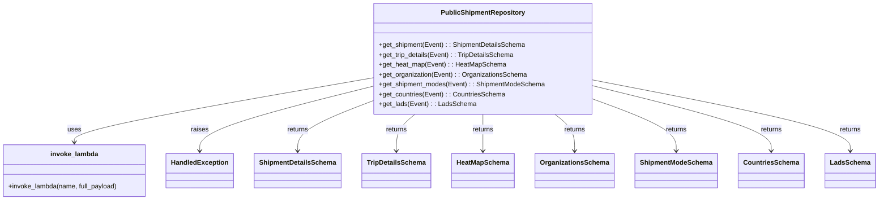
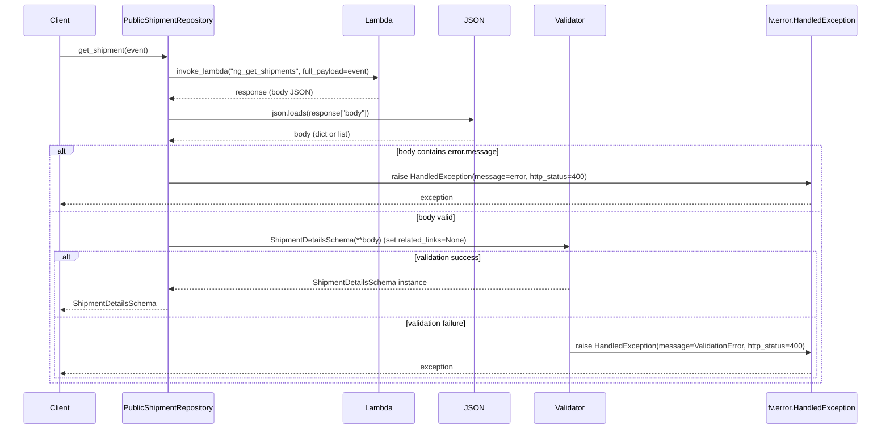

# Diagram: shipment_core/shipment_service/shipment_service/public/repository.py

> Auto-generated by Obscura crawlers

## Diagram 1

### SVG

<svg id="container" width="2069.9375" xmlns="http://www.w3.org/2000/svg" class="classDiagram" height="486" viewBox="0 0 2069.9375 486" role="graphics-document document" aria-roledescription="class"><g><defs><marker id="container_class-aggregationStart" class="marker aggregation class" refX="18" refY="7" markerWidth="190" markerHeight="240" orient="auto"><path d="M 18,7 L9,13 L1,7 L9,1 Z"></path></marker></defs><defs><marker id="container_class-aggregationEnd" class="marker aggregation class" refX="1" refY="7" markerWidth="20" markerHeight="28" orient="auto"><path d="M 18,7 L9,13 L1,7 L9,1 Z"></path></marker></defs><defs><marker id="container_class-extensionStart" class="marker extension class" refX="18" refY="7" markerWidth="190" markerHeight="240" orient="auto"><path d="M 1,7 L18,13 V 1 Z"></path></marker></defs><defs><marker id="container_class-extensionEnd" class="marker extension class" refX="1" refY="7" markerWidth="20" markerHeight="28" orient="auto"><path d="M 1,1 V 13 L18,7 Z"></path></marker></defs><defs><marker id="container_class-compositionStart" class="marker composition class" refX="18" refY="7" markerWidth="190" markerHeight="240" orient="auto"><path d="M 18,7 L9,13 L1,7 L9,1 Z"></path></marker></defs><defs><marker id="container_class-compositionEnd" class="marker composition class" refX="1" refY="7" markerWidth="20" markerHeight="28" orient="auto"><path d="M 18,7 L9,13 L1,7 L9,1 Z"></path></marker></defs><defs><marker id="container_class-dependencyStart" class="marker dependency class" refX="6" refY="7" markerWidth="190" markerHeight="240" orient="auto"><path d="M 5,7 L9,13 L1,7 L9,1 Z"></path></marker></defs><defs><marker id="container_class-dependencyEnd" class="marker dependency class" refX="13" refY="7" markerWidth="20" markerHeight="28" orient="auto"><path d="M 18,7 L9,13 L14,7 L9,1 Z"></path></marker></defs><defs><marker id="container_class-lollipopStart" class="marker lollipop class" refX="13" refY="7" markerWidth="190" markerHeight="240" orient="auto"><circle stroke="black" fill="transparent" cx="7" cy="7" r="6"></circle></marker></defs><defs><marker id="container_class-lollipopEnd" class="marker lollipop class" refX="1" refY="7" markerWidth="190" markerHeight="240" orient="auto"><circle stroke="black" fill="transparent" cx="7" cy="7" r="6"></circle></marker></defs><g class="root"><g class="clusters"></g><g class="edgePaths"><path d="M886.445,189.541L768.943,210.451C651.44,231.361,416.435,273.18,298.932,299.257C181.43,325.333,181.43,335.667,181.43,340.833L181.43,346" id="id_PublicShipmentRepository_invoke_lambda_1" class="edge-thickness-normal edge-pattern-solid relation" style=";;;" data-edge="true" data-et="edge" data-id="id_PublicShipmentRepository_invoke_lambda_1" data-points="W3sieCI6ODg2LjQ0NTMxMjUsInkiOjE4OS41NDEzMDczMTczODg2fSx7IngiOjE4MS40Mjk2ODc1LCJ5IjozMTV9LHsieCI6MTgxLjQyOTY4NzUsInkiOjM1Mn1d" marker-end="url(#container_class-dependencyEnd)"></path><path d="M886.445,210.672L819.245,228.06C752.044,245.448,617.643,280.224,550.443,306.279C483.242,332.333,483.242,349.667,483.242,358.333L483.242,367" id="id_PublicShipmentRepository_HandledException_2" class="edge-thickness-normal edge-pattern-solid relation" style=";;;" data-edge="true" data-et="edge" data-id="id_PublicShipmentRepository_HandledException_2" data-points="W3sieCI6ODg2LjQ0NTMxMjUsInkiOjIxMC42NzI0MjkzOTU3OTQ5fSx7IngiOjQ4My4yNDIxODc1LCJ5IjozMTV9LHsieCI6NDgzLjI0MjE4NzUsInkiOjM3M31d" marker-end="url(#container_class-dependencyEnd)"></path><path d="M886.445,246.372L857.507,257.81C828.568,269.248,770.69,292.124,741.751,312.229C712.813,332.333,712.813,349.667,712.813,358.333L712.813,367" id="id_PublicShipmentRepository_ShipmentDetailsSchema_3" class="edge-thickness-normal edge-pattern-solid relation" style=";;;" data-edge="true" data-et="edge" data-id="id_PublicShipmentRepository_ShipmentDetailsSchema_3" data-points="W3sieCI6ODg2LjQ0NTMxMjUsInkiOjI0Ni4zNzIzMDI2MTAzMTkyfSx7IngiOjcxMi44MTI1LCJ5IjozMTV9LHsieCI6NzEyLjgxMjUsInkiOjM3M31d" marker-end="url(#container_class-dependencyEnd)"></path><path d="M988.199,278L980.9,284.167C973.602,290.333,959.004,302.667,951.705,317.5C944.406,332.333,944.406,349.667,944.406,358.333L944.406,367" id="id_PublicShipmentRepository_TripDetailsSchema_4" class="edge-thickness-normal edge-pattern-solid relation" style=";;;" data-edge="true" data-et="edge" data-id="id_PublicShipmentRepository_TripDetailsSchema_4" data-points="W3sieCI6OTg4LjE5OTIxODc1LCJ5IjoyNzh9LHsieCI6OTQ0LjQwNjI1LCJ5IjozMTV9LHsieCI6OTQ0LjQwNjI1LCJ5IjozNzN9XQ==" marker-end="url(#container_class-dependencyEnd)"></path><path d="M1147.984,278L1147.984,284.167C1147.984,290.333,1147.984,302.667,1147.984,317.5C1147.984,332.333,1147.984,349.667,1147.984,358.333L1147.984,367" id="id_PublicShipmentRepository_HeatMapSchema_5" class="edge-thickness-normal edge-pattern-solid relation" style=";;;" data-edge="true" data-et="edge" data-id="id_PublicShipmentRepository_HeatMapSchema_5" data-points="W3sieCI6MTE0Ny45ODQzNzUsInkiOjI3OH0seyJ4IjoxMTQ3Ljk4NDM3NSwieSI6MzE1fSx7IngiOjExNDcuOTg0Mzc1LCJ5IjozNzN9XQ==" marker-end="url(#container_class-dependencyEnd)"></path><path d="M1316.195,278L1323.878,284.167C1331.562,290.333,1346.93,302.667,1354.613,317.5C1362.297,332.333,1362.297,349.667,1362.297,358.333L1362.297,367" id="id_PublicShipmentRepository_OrganizationsSchema_6" class="edge-thickness-normal edge-pattern-solid relation" style=";;;" data-edge="true" data-et="edge" data-id="id_PublicShipmentRepository_OrganizationsSchema_6" data-points="W3sieCI6MTMxNi4xOTQ3Njc0NDE4NjA0LCJ5IjoyNzh9LHsieCI6MTM2Mi4yOTY4NzUsInkiOjMxNX0seyJ4IjoxMzYyLjI5Njg3NSwieSI6MzczfV0=" marker-end="url(#container_class-dependencyEnd)"></path><path d="M1409.523,242.674L1441.154,254.728C1472.784,266.782,1536.044,290.891,1567.674,311.612C1599.305,332.333,1599.305,349.667,1599.305,358.333L1599.305,367" id="id_PublicShipmentRepository_ShipmentModeSchema_7" class="edge-thickness-normal edge-pattern-solid relation" style=";;;" data-edge="true" data-et="edge" data-id="id_PublicShipmentRepository_ShipmentModeSchema_7" data-points="W3sieCI6MTQwOS41MjM0Mzc1LCJ5IjoyNDIuNjczNTk2NTY1NjMyMDd9LHsieCI6MTU5OS4zMDQ2ODc1LCJ5IjozMTV9LHsieCI6MTU5OS4zMDQ2ODc1LCJ5IjozNzN9XQ==" marker-end="url(#container_class-dependencyEnd)"></path><path d="M1409.523,209.851L1478.086,227.376C1546.648,244.9,1683.773,279.95,1752.336,306.142C1820.898,332.333,1820.898,349.667,1820.898,358.333L1820.898,367" id="id_PublicShipmentRepository_CountriesSchema_8" class="edge-thickness-normal edge-pattern-solid relation" style=";;;" data-edge="true" data-et="edge" data-id="id_PublicShipmentRepository_CountriesSchema_8" data-points="W3sieCI6MTQwOS41MjM0Mzc1LCJ5IjoyMDkuODUwNjE0NzQ2OTYxMX0seyJ4IjoxODIwLjg5ODQzNzUsInkiOjMxNX0seyJ4IjoxODIwLjg5ODQzNzUsInkiOjM3M31d" marker-end="url(#container_class-dependencyEnd)"></path><path d="M1409.523,195.534L1508.65,215.445C1607.776,235.356,1806.029,275.178,1905.155,303.756C2004.281,332.333,2004.281,349.667,2004.281,358.333L2004.281,367" id="id_PublicShipmentRepository_LadsSchema_9" class="edge-thickness-normal edge-pattern-solid relation" style=";;;" data-edge="true" data-et="edge" data-id="id_PublicShipmentRepository_LadsSchema_9" data-points="W3sieCI6MTQwOS41MjM0Mzc1LCJ5IjoxOTUuNTM0MDIxODYwMTE3MTV9LHsieCI6MjAwNC4yODEyNSwieSI6MzE1fSx7IngiOjIwMDQuMjgxMjUsInkiOjM3M31d" marker-end="url(#container_class-dependencyEnd)"></path></g><g class="edgeLabels"><g class="edgeLabel" transform="translate(181.4296875, 315)"><g class="label" data-id="id_PublicShipmentRepository_invoke_lambda_1" transform="translate(-16.4921875, -12)"><foreignObject width="32.984375" height="24">

uses

</foreignObject></g></g><g class="edgeLabel" transform="translate(483.2421875, 315)"><g class="label" data-id="id_PublicShipmentRepository_HandledException_2" transform="translate(-21.25, -12)"><foreignObject width="42.5" height="24">

raises

</foreignObject></g></g><g class="edgeLabel" transform="translate(712.8125, 315)"><g class="label" data-id="id_PublicShipmentRepository_ShipmentDetailsSchema_3" transform="translate(-26.265625, -12)"><foreignObject width="52.53125" height="24">

returns

</foreignObject></g></g><g class="edgeLabel" transform="translate(944.40625, 315)"><g class="label" data-id="id_PublicShipmentRepository_TripDetailsSchema_4" transform="translate(-26.265625, -12)"><foreignObject width="52.53125" height="24">

returns

</foreignObject></g></g><g class="edgeLabel" transform="translate(1147.984375, 315)"><g class="label" data-id="id_PublicShipmentRepository_HeatMapSchema_5" transform="translate(-26.265625, -12)"><foreignObject width="52.53125" height="24">

returns

</foreignObject></g></g><g class="edgeLabel" transform="translate(1362.296875, 315)"><g class="label" data-id="id_PublicShipmentRepository_OrganizationsSchema_6" transform="translate(-26.265625, -12)"><foreignObject width="52.53125" height="24">

returns

</foreignObject></g></g><g class="edgeLabel" transform="translate(1599.3046875, 315)"><g class="label" data-id="id_PublicShipmentRepository_ShipmentModeSchema_7" transform="translate(-26.265625, -12)"><foreignObject width="52.53125" height="24">

returns

</foreignObject></g></g><g class="edgeLabel" transform="translate(1820.8984375, 315)"><g class="label" data-id="id_PublicShipmentRepository_CountriesSchema_8" transform="translate(-26.265625, -12)"><foreignObject width="52.53125" height="24">

returns

</foreignObject></g></g><g class="edgeLabel" transform="translate(2004.28125, 315)"><g class="label" data-id="id_PublicShipmentRepository_LadsSchema_9" transform="translate(-26.265625, -12)"><foreignObject width="52.53125" height="24">

returns

</foreignObject></g></g></g><g class="nodes"><g class="node default" id="classId-PublicShipmentRepository-0" transform="translate(1147.984375, 143)"><g class="basic label-container"><path d="M-261.5390625 -135 L261.5390625 -135 L261.5390625 135 L-261.5390625 135" stroke="none" stroke-width="0" fill="#ECECFF" style=""></path><path d="M-261.5390625 -135 C-137.80074107419793 -135, -14.06241964839586 -135, 261.5390625 -135 M-261.5390625 -135 C-82.97175985740463 -135, 95.59554278519073 -135, 261.5390625 -135 M261.5390625 -135 C261.5390625 -76.80503235469867, 261.5390625 -18.610064709397335, 261.5390625 135 M261.5390625 -135 C261.5390625 -75.12612549977143, 261.5390625 -15.252250999542866, 261.5390625 135 M261.5390625 135 C138.93534417992316 135, 16.331625859846326 135, -261.5390625 135 M261.5390625 135 C106.98497403164049 135, -47.56911443671902 135, -261.5390625 135 M-261.5390625 135 C-261.5390625 37.49813021725214, -261.5390625 -60.00373956549572, -261.5390625 -135 M-261.5390625 135 C-261.5390625 50.90219047422495, -261.5390625 -33.195619051550096, -261.5390625 -135" stroke="#9370DB" stroke-width="1.3" fill="none" stroke-dasharray="0 0" style=""></path></g><g class="annotation-group text" transform="translate(0, -111)"></g><g class="label-group text" transform="translate(-97.28125, -111)"><g class="label" style="font-weight: bolder" transform="translate(0,-12)"><foreignObject width="194.5625" height="24">

PublicShipmentRepository

</foreignObject></g></g><g class="members-group text" transform="translate(-249.5390625, -63)"></g><g class="methods-group text" transform="translate(-249.5390625, -33)"><g class="label" style="" transform="translate(0,-12)"><foreignObject width="354.65625" height="24">

+get_shipment(Event) : : ShipmentDetailsSchema

</foreignObject></g><g class="label" style="" transform="translate(0,12)"><foreignObject width="327.140625" height="24">

+get_trip_details(Event) : : TripDetailsSchema

</foreignObject></g><g class="label" style="" transform="translate(0,36)"><foreignObject width="303.671875" height="24">

+get_heat_map(Event) : : HeatMapSchema

</foreignObject></g><g class="label" style="" transform="translate(0,60)"><foreignObject width="356.03125" height="24">

+get_organization(Event) : : OrganizationsSchema

</foreignObject></g><g class="label" style="" transform="translate(0,84)"><foreignObject width="401.796875" height="24">

+get_shipment_modes(Event) : : ShipmentModeSchema

</foreignObject></g><g class="label" style="" transform="translate(0,108)"><foreignObject width="303.46875" height="24">

+get_countries(Event) : : CountriesSchema

</foreignObject></g><g class="label" style="" transform="translate(0,132)"><foreignObject width="230.1875" height="24">

+get_lads(Event) : : LadsSchema

</foreignObject></g></g><g class="divider" style=""><path d="M-261.5390625 -87 C-120.44910550923208 -87, 20.640851481535833 -87, 261.5390625 -87 M-261.5390625 -87 C-88.23069674254526 -87, 85.07766901490947 -87, 261.5390625 -87" stroke="#9370DB" stroke-width="1.3" fill="none" stroke-dasharray="0 0" style=""></path></g><g class="divider" style=""><path d="M-261.5390625 -63 C-52.51490821027275 -63, 156.5092460794545 -63, 261.5390625 -63 M-261.5390625 -63 C-79.69505801720933 -63, 102.14894646558133 -63, 261.5390625 -63" stroke="#9370DB" stroke-width="1.3" fill="none" stroke-dasharray="0 0" style=""></path></g></g><g class="node default" id="classId-invoke_lambda-1" transform="translate(181.4296875, 415)"><g class="basic label-container"><path d="M-173.4296875 -63 L173.4296875 -63 L173.4296875 63 L-173.4296875 63" stroke="none" stroke-width="0" fill="#ECECFF" style=""></path><path d="M-173.4296875 -63 C-84.84443405088875 -63, 3.7408193982224986 -63, 173.4296875 -63 M-173.4296875 -63 C-102.32042286506892 -63, -31.21115823013784 -63, 173.4296875 -63 M173.4296875 -63 C173.4296875 -14.388812426809274, 173.4296875 34.22237514638145, 173.4296875 63 M173.4296875 -63 C173.4296875 -32.86808389258736, 173.4296875 -2.7361677851747146, 173.4296875 63 M173.4296875 63 C94.78312964726317 63, 16.136571794526333 63, -173.4296875 63 M173.4296875 63 C65.10591646785083 63, -43.217854564298335 63, -173.4296875 63 M-173.4296875 63 C-173.4296875 13.683388370203794, -173.4296875 -35.63322325959241, -173.4296875 -63 M-173.4296875 63 C-173.4296875 16.50407522373896, -173.4296875 -29.991849552522083, -173.4296875 -63" stroke="#9370DB" stroke-width="1.3" fill="none" stroke-dasharray="0 0" style=""></path></g><g class="annotation-group text" transform="translate(0, -39)"></g><g class="label-group text" transform="translate(-55.625, -39)"><g class="label" style="font-weight: bolder" transform="translate(0,-12)"><foreignObject width="111.25" height="24">

invoke_lambda

</foreignObject></g></g><g class="members-group text" transform="translate(-161.4296875, 9)"></g><g class="methods-group text" transform="translate(-161.4296875, 39)"><g class="label" style="" transform="translate(0,-12)"><foreignObject width="267.234375" height="24">

+invoke_lambda(name, full_payload)

</foreignObject></g></g><g class="divider" style=""><path d="M-173.4296875 -15 C-49.67980536703929 -15, 74.07007676592141 -15, 173.4296875 -15 M-173.4296875 -15 C-96.05508218929887 -15, -18.680476878597744 -15, 173.4296875 -15" stroke="#9370DB" stroke-width="1.3" fill="none" stroke-dasharray="0 0" style=""></path></g><g class="divider" style=""><path d="M-173.4296875 9 C-55.20231051272087 9, 63.02506647455826 9, 173.4296875 9 M-173.4296875 9 C-55.507098220149246 9, 62.41549105970151 9, 173.4296875 9" stroke="#9370DB" stroke-width="1.3" fill="none" stroke-dasharray="0 0" style=""></path></g></g><g class="node default" id="classId-HandledException-2" transform="translate(483.2421875, 415)"><g class="basic label-container"><path d="M-78.3828125 -42 L78.3828125 -42 L78.3828125 42 L-78.3828125 42" stroke="none" stroke-width="0" fill="#ECECFF" style=""></path><path d="M-78.3828125 -42 C-22.886961680319786 -42, 32.60888913936043 -42, 78.3828125 -42 M-78.3828125 -42 C-33.63280198515623 -42, 11.117208529687545 -42, 78.3828125 -42 M78.3828125 -42 C78.3828125 -10.8550883339921, 78.3828125 20.2898233320158, 78.3828125 42 M78.3828125 -42 C78.3828125 -12.600259603666025, 78.3828125 16.79948079266795, 78.3828125 42 M78.3828125 42 C41.61962513947503 42, 4.856437778950067 42, -78.3828125 42 M78.3828125 42 C21.261035348510056 42, -35.86074180297989 42, -78.3828125 42 M-78.3828125 42 C-78.3828125 17.92867077759133, -78.3828125 -6.142658444817343, -78.3828125 -42 M-78.3828125 42 C-78.3828125 16.937930279762423, -78.3828125 -8.124139440475155, -78.3828125 -42" stroke="#9370DB" stroke-width="1.3" fill="none" stroke-dasharray="0 0" style=""></path></g><g class="annotation-group text" transform="translate(0, -18)"></g><g class="label-group text" transform="translate(-66.3828125, -18)"><g class="label" style="font-weight: bolder" transform="translate(0,-12)"><foreignObject width="132.765625" height="24">

HandledException

</foreignObject></g></g><g class="members-group text" transform="translate(-66.3828125, 30)"></g><g class="methods-group text" transform="translate(-66.3828125, 60)"></g><g class="divider" style=""><path d="M-78.3828125 6 C-34.21324580466071 6, 9.956320890678583 6, 78.3828125 6 M-78.3828125 6 C-43.595034500313666 6, -8.807256500627332 6, 78.3828125 6" stroke="#9370DB" stroke-width="1.3" fill="none" stroke-dasharray="0 0" style=""></path></g><g class="divider" style=""><path d="M-78.3828125 24 C-46.848870423638274 24, -15.314928347276549 24, 78.3828125 24 M-78.3828125 24 C-42.539741930132685 24, -6.69667136026537 24, 78.3828125 24" stroke="#9370DB" stroke-width="1.3" fill="none" stroke-dasharray="0 0" style=""></path></g></g><g class="node default" id="classId-ShipmentDetailsSchema-3" transform="translate(712.8125, 415)"><g class="basic label-container"><path d="M-101.1875 -42 L101.1875 -42 L101.1875 42 L-101.1875 42" stroke="none" stroke-width="0" fill="#ECECFF" style=""></path><path d="M-101.1875 -42 C-58.75618421423067 -42, -16.324868428461343 -42, 101.1875 -42 M-101.1875 -42 C-48.620722575536746 -42, 3.946054848926508 -42, 101.1875 -42 M101.1875 -42 C101.1875 -24.494436070940072, 101.1875 -6.988872141880144, 101.1875 42 M101.1875 -42 C101.1875 -24.072903269693057, 101.1875 -6.145806539386115, 101.1875 42 M101.1875 42 C55.80050521948366 42, 10.413510438967322 42, -101.1875 42 M101.1875 42 C21.780608059658945 42, -57.62628388068211 42, -101.1875 42 M-101.1875 42 C-101.1875 11.756225625332412, -101.1875 -18.487548749335176, -101.1875 -42 M-101.1875 42 C-101.1875 9.501673405598616, -101.1875 -22.996653188802767, -101.1875 -42" stroke="#9370DB" stroke-width="1.3" fill="none" stroke-dasharray="0 0" style=""></path></g><g class="annotation-group text" transform="translate(0, -18)"></g><g class="label-group text" transform="translate(-89.1875, -18)"><g class="label" style="font-weight: bolder" transform="translate(0,-12)"><foreignObject width="178.375" height="24">

ShipmentDetailsSchema

</foreignObject></g></g><g class="members-group text" transform="translate(-89.1875, 30)"></g><g class="methods-group text" transform="translate(-89.1875, 60)"></g><g class="divider" style=""><path d="M-101.1875 6 C-29.79261353557861 6, 41.60227292884278 6, 101.1875 6 M-101.1875 6 C-46.135092022267564 6, 8.917315955464872 6, 101.1875 6" stroke="#9370DB" stroke-width="1.3" fill="none" stroke-dasharray="0 0" style=""></path></g><g class="divider" style=""><path d="M-101.1875 24 C-38.117112543836534 24, 24.953274912326933 24, 101.1875 24 M-101.1875 24 C-37.4859618121645 24, 26.215576375671006 24, 101.1875 24" stroke="#9370DB" stroke-width="1.3" fill="none" stroke-dasharray="0 0" style=""></path></g></g><g class="node default" id="classId-TripDetailsSchema-4" transform="translate(944.40625, 415)"><g class="basic label-container"><path d="M-80.40625 -42 L80.40625 -42 L80.40625 42 L-80.40625 42" stroke="none" stroke-width="0" fill="#ECECFF" style=""></path><path d="M-80.40625 -42 C-37.03182694150349 -42, 6.342596116993022 -42, 80.40625 -42 M-80.40625 -42 C-44.65449724947928 -42, -8.902744498958555 -42, 80.40625 -42 M80.40625 -42 C80.40625 -9.096734148418932, 80.40625 23.806531703162136, 80.40625 42 M80.40625 -42 C80.40625 -13.20433251049895, 80.40625 15.591334979002099, 80.40625 42 M80.40625 42 C24.884405150758482 42, -30.637439698483035 42, -80.40625 42 M80.40625 42 C20.4412743849202 42, -39.5237012301596 42, -80.40625 42 M-80.40625 42 C-80.40625 18.62657035694459, -80.40625 -4.746859286110819, -80.40625 -42 M-80.40625 42 C-80.40625 16.49027174839874, -80.40625 -9.01945650320252, -80.40625 -42" stroke="#9370DB" stroke-width="1.3" fill="none" stroke-dasharray="0 0" style=""></path></g><g class="annotation-group text" transform="translate(0, -18)"></g><g class="label-group text" transform="translate(-68.40625, -18)"><g class="label" style="font-weight: bolder" transform="translate(0,-12)"><foreignObject width="136.8125" height="24">

TripDetailsSchema

</foreignObject></g></g><g class="members-group text" transform="translate(-68.40625, 30)"></g><g class="methods-group text" transform="translate(-68.40625, 60)"></g><g class="divider" style=""><path d="M-80.40625 6 C-43.11106734902382 6, -5.81588469804764 6, 80.40625 6 M-80.40625 6 C-17.366532334351 6, 45.673185331298 6, 80.40625 6" stroke="#9370DB" stroke-width="1.3" fill="none" stroke-dasharray="0 0" style=""></path></g><g class="divider" style=""><path d="M-80.40625 24 C-43.57621790132207 24, -6.746185802644135 24, 80.40625 24 M-80.40625 24 C-25.254461090140886 24, 29.897327819718228 24, 80.40625 24" stroke="#9370DB" stroke-width="1.3" fill="none" stroke-dasharray="0 0" style=""></path></g></g><g class="node default" id="classId-HeatMapSchema-5" transform="translate(1147.984375, 415)"><g class="basic label-container"><path d="M-73.171875 -42 L73.171875 -42 L73.171875 42 L-73.171875 42" stroke="none" stroke-width="0" fill="#ECECFF" style=""></path><path d="M-73.171875 -42 C-14.88138561809101 -42, 43.40910376381798 -42, 73.171875 -42 M-73.171875 -42 C-18.82869687168536 -42, 35.51448125662928 -42, 73.171875 -42 M73.171875 -42 C73.171875 -12.594314736386401, 73.171875 16.811370527227197, 73.171875 42 M73.171875 -42 C73.171875 -9.158298947525175, 73.171875 23.68340210494965, 73.171875 42 M73.171875 42 C42.92494776468239 42, 12.678020529364787 42, -73.171875 42 M73.171875 42 C37.37378616736312 42, 1.575697334726243 42, -73.171875 42 M-73.171875 42 C-73.171875 21.634104955709304, -73.171875 1.2682099114186087, -73.171875 -42 M-73.171875 42 C-73.171875 17.397132635601544, -73.171875 -7.205734728796912, -73.171875 -42" stroke="#9370DB" stroke-width="1.3" fill="none" stroke-dasharray="0 0" style=""></path></g><g class="annotation-group text" transform="translate(0, -18)"></g><g class="label-group text" transform="translate(-61.171875, -18)"><g class="label" style="font-weight: bolder" transform="translate(0,-12)"><foreignObject width="122.34375" height="24">

HeatMapSchema

</foreignObject></g></g><g class="members-group text" transform="translate(-61.171875, 30)"></g><g class="methods-group text" transform="translate(-61.171875, 60)"></g><g class="divider" style=""><path d="M-73.171875 6 C-27.373955250855047 6, 18.423964498289905 6, 73.171875 6 M-73.171875 6 C-39.73049240821448 6, -6.289109816428962 6, 73.171875 6" stroke="#9370DB" stroke-width="1.3" fill="none" stroke-dasharray="0 0" style=""></path></g><g class="divider" style=""><path d="M-73.171875 24 C-23.420787181616873 24, 26.330300636766253 24, 73.171875 24 M-73.171875 24 C-35.68681713298154 24, 1.7982407340369235 24, 73.171875 24" stroke="#9370DB" stroke-width="1.3" fill="none" stroke-dasharray="0 0" style=""></path></g></g><g class="node default" id="classId-OrganizationsSchema-6" transform="translate(1362.296875, 415)"><g class="basic label-container"><path d="M-91.140625 -42 L91.140625 -42 L91.140625 42 L-91.140625 42" stroke="none" stroke-width="0" fill="#ECECFF" style=""></path><path d="M-91.140625 -42 C-38.10208894819139 -42, 14.936447103617226 -42, 91.140625 -42 M-91.140625 -42 C-50.932555803272855 -42, -10.72448660654571 -42, 91.140625 -42 M91.140625 -42 C91.140625 -20.23195245445667, 91.140625 1.5360950910866578, 91.140625 42 M91.140625 -42 C91.140625 -8.821924115574369, 91.140625 24.356151768851262, 91.140625 42 M91.140625 42 C33.525003637627066 42, -24.09061772474587 42, -91.140625 42 M91.140625 42 C20.15350884528918 42, -50.83360730942164 42, -91.140625 42 M-91.140625 42 C-91.140625 18.936839352825285, -91.140625 -4.126321294349431, -91.140625 -42 M-91.140625 42 C-91.140625 18.807373317323826, -91.140625 -4.385253365352348, -91.140625 -42" stroke="#9370DB" stroke-width="1.3" fill="none" stroke-dasharray="0 0" style=""></path></g><g class="annotation-group text" transform="translate(0, -18)"></g><g class="label-group text" transform="translate(-79.140625, -18)"><g class="label" style="font-weight: bolder" transform="translate(0,-12)"><foreignObject width="158.28125" height="24">

OrganizationsSchema

</foreignObject></g></g><g class="members-group text" transform="translate(-79.140625, 30)"></g><g class="methods-group text" transform="translate(-79.140625, 60)"></g><g class="divider" style=""><path d="M-91.140625 6 C-20.77157952360244 6, 49.59746595279512 6, 91.140625 6 M-91.140625 6 C-23.228114632248634 6, 44.68439573550273 6, 91.140625 6" stroke="#9370DB" stroke-width="1.3" fill="none" stroke-dasharray="0 0" style=""></path></g><g class="divider" style=""><path d="M-91.140625 24 C-19.681332346459413 24, 51.77796030708117 24, 91.140625 24 M-91.140625 24 C-48.70357450236707 24, -6.266524004734137 24, 91.140625 24" stroke="#9370DB" stroke-width="1.3" fill="none" stroke-dasharray="0 0" style=""></path></g></g><g class="node default" id="classId-ShipmentModeSchema-7" transform="translate(1599.3046875, 415)"><g class="basic label-container"><path d="M-95.8671875 -42 L95.8671875 -42 L95.8671875 42 L-95.8671875 42" stroke="none" stroke-width="0" fill="#ECECFF" style=""></path><path d="M-95.8671875 -42 C-50.77968900722204 -42, -5.6921905144440785 -42, 95.8671875 -42 M-95.8671875 -42 C-32.03273960822584 -42, 31.801708283548322 -42, 95.8671875 -42 M95.8671875 -42 C95.8671875 -11.807972318518782, 95.8671875 18.384055362962435, 95.8671875 42 M95.8671875 -42 C95.8671875 -15.230790220868489, 95.8671875 11.538419558263023, 95.8671875 42 M95.8671875 42 C38.982013999818484 42, -17.90315950036303 42, -95.8671875 42 M95.8671875 42 C32.363920587493965 42, -31.13934632501207 42, -95.8671875 42 M-95.8671875 42 C-95.8671875 11.168164987833311, -95.8671875 -19.663670024333378, -95.8671875 -42 M-95.8671875 42 C-95.8671875 17.30652817169655, -95.8671875 -7.386943656606903, -95.8671875 -42" stroke="#9370DB" stroke-width="1.3" fill="none" stroke-dasharray="0 0" style=""></path></g><g class="annotation-group text" transform="translate(0, -18)"></g><g class="label-group text" transform="translate(-83.8671875, -18)"><g class="label" style="font-weight: bolder" transform="translate(0,-12)"><foreignObject width="167.734375" height="24">

ShipmentModeSchema

</foreignObject></g></g><g class="members-group text" transform="translate(-83.8671875, 30)"></g><g class="methods-group text" transform="translate(-83.8671875, 60)"></g><g class="divider" style=""><path d="M-95.8671875 6 C-24.416219114391964 6, 47.03474927121607 6, 95.8671875 6 M-95.8671875 6 C-20.163860869754615 6, 55.53946576049077 6, 95.8671875 6" stroke="#9370DB" stroke-width="1.3" fill="none" stroke-dasharray="0 0" style=""></path></g><g class="divider" style=""><path d="M-95.8671875 24 C-54.20871639998887 24, -12.550245299977746 24, 95.8671875 24 M-95.8671875 24 C-51.40729953194043 24, -6.947411563880863 24, 95.8671875 24" stroke="#9370DB" stroke-width="1.3" fill="none" stroke-dasharray="0 0" style=""></path></g></g><g class="node default" id="classId-CountriesSchema-8" transform="translate(1820.8984375, 415)"><g class="basic label-container"><path d="M-75.7265625 -42 L75.7265625 -42 L75.7265625 42 L-75.7265625 42" stroke="none" stroke-width="0" fill="#ECECFF" style=""></path><path d="M-75.7265625 -42 C-19.22150103431465 -42, 37.2835604313707 -42, 75.7265625 -42 M-75.7265625 -42 C-34.41749932154199 -42, 6.891563856916022 -42, 75.7265625 -42 M75.7265625 -42 C75.7265625 -11.78000733894422, 75.7265625 18.43998532211156, 75.7265625 42 M75.7265625 -42 C75.7265625 -23.357980920729236, 75.7265625 -4.715961841458473, 75.7265625 42 M75.7265625 42 C40.698267873953164 42, 5.669973247906327 42, -75.7265625 42 M75.7265625 42 C33.23959789178212 42, -9.247366716435764 42, -75.7265625 42 M-75.7265625 42 C-75.7265625 15.336023858299527, -75.7265625 -11.327952283400947, -75.7265625 -42 M-75.7265625 42 C-75.7265625 9.585282074944047, -75.7265625 -22.829435850111906, -75.7265625 -42" stroke="#9370DB" stroke-width="1.3" fill="none" stroke-dasharray="0 0" style=""></path></g><g class="annotation-group text" transform="translate(0, -18)"></g><g class="label-group text" transform="translate(-63.7265625, -18)"><g class="label" style="font-weight: bolder" transform="translate(0,-12)"><foreignObject width="127.453125" height="24">

CountriesSchema

</foreignObject></g></g><g class="members-group text" transform="translate(-63.7265625, 30)"></g><g class="methods-group text" transform="translate(-63.7265625, 60)"></g><g class="divider" style=""><path d="M-75.7265625 6 C-37.014721101343305 6, 1.6971202973133899 6, 75.7265625 6 M-75.7265625 6 C-33.83239109717516 6, 8.061780305649677 6, 75.7265625 6" stroke="#9370DB" stroke-width="1.3" fill="none" stroke-dasharray="0 0" style=""></path></g><g class="divider" style=""><path d="M-75.7265625 24 C-16.867314089063115 24, 41.99193432187377 24, 75.7265625 24 M-75.7265625 24 C-16.239724950495678 24, 43.247112599008645 24, 75.7265625 24" stroke="#9370DB" stroke-width="1.3" fill="none" stroke-dasharray="0 0" style=""></path></g></g><g class="node default" id="classId-LadsSchema-9" transform="translate(2004.28125, 415)"><g class="basic label-container"><path d="M-57.65625 -42 L57.65625 -42 L57.65625 42 L-57.65625 42" stroke="none" stroke-width="0" fill="#ECECFF" style=""></path><path d="M-57.65625 -42 C-15.531348674551133 -42, 26.593552650897735 -42, 57.65625 -42 M-57.65625 -42 C-33.53160149782168 -42, -9.406952995643366 -42, 57.65625 -42 M57.65625 -42 C57.65625 -11.200986479623136, 57.65625 19.598027040753728, 57.65625 42 M57.65625 -42 C57.65625 -23.976026495460058, 57.65625 -5.952052990920116, 57.65625 42 M57.65625 42 C33.002150320983944 42, 8.348050641967895 42, -57.65625 42 M57.65625 42 C17.85264461715157 42, -21.950960765696863 42, -57.65625 42 M-57.65625 42 C-57.65625 10.73409889641086, -57.65625 -20.53180220717828, -57.65625 -42 M-57.65625 42 C-57.65625 8.87847607816704, -57.65625 -24.24304784366592, -57.65625 -42" stroke="#9370DB" stroke-width="1.3" fill="none" stroke-dasharray="0 0" style=""></path></g><g class="annotation-group text" transform="translate(0, -18)"></g><g class="label-group text" transform="translate(-45.65625, -18)"><g class="label" style="font-weight: bolder" transform="translate(0,-12)"><foreignObject width="91.3125" height="24">

LadsSchema

</foreignObject></g></g><g class="members-group text" transform="translate(-45.65625, 30)"></g><g class="methods-group text" transform="translate(-45.65625, 60)"></g><g class="divider" style=""><path d="M-57.65625 6 C-15.82235160368544 6, 26.01154679262912 6, 57.65625 6 M-57.65625 6 C-19.33352482634603 6, 18.989200347307943 6, 57.65625 6" stroke="#9370DB" stroke-width="1.3" fill="none" stroke-dasharray="0 0" style=""></path></g><g class="divider" style=""><path d="M-57.65625 24 C-33.70283239279483 24, -9.749414785589671 24, 57.65625 24 M-57.65625 24 C-12.000996584204444 24, 33.65425683159111 24, 57.65625 24" stroke="#9370DB" stroke-width="1.3" fill="none" stroke-dasharray="0 0" style=""></path></g></g></g></g></g></svg>

## Diagram 2

### SVG

<svg id="container" width="1961.5" xmlns="http://www.w3.org/2000/svg" height="947" viewBox="-50 -10 1961.5 947" role="graphics-document document" aria-roledescription="sequence"><g><rect x="1654.5" y="861" fill="#eaeaea" stroke="#666" width="207" height="65" name="Error" rx="3" ry="3" class="actor actor-bottom"></rect><text x="1758" y="893.5" dominant-baseline="central" alignment-baseline="central" class="actor actor-box" style="text-anchor: middle; font-size: 16px; font-weight: 400;"><tspan x="1758" dy="0">fv.error.HandledException</tspan></text></g><g><rect x="1128" y="861" fill="#eaeaea" stroke="#666" width="150" height="65" name="Validator" rx="3" ry="3" class="actor actor-bottom"></rect><text x="1203" y="893.5" dominant-baseline="central" alignment-baseline="central" class="actor actor-box" style="text-anchor: middle; font-size: 16px; font-weight: 400;"><tspan x="1203" dy="0">Validator</tspan></text></g><g><rect x="928" y="861" fill="#eaeaea" stroke="#666" width="150" height="65" name="JSON" rx="3" ry="3" class="actor actor-bottom"></rect><text x="1003" y="893.5" dominant-baseline="central" alignment-baseline="central" class="actor actor-box" style="text-anchor: middle; font-size: 16px; font-weight: 400;"><tspan x="1003" dy="0">JSON</tspan></text></g><g><rect x="728" y="861" fill="#eaeaea" stroke="#666" width="150" height="65" name="Lambda" rx="3" ry="3" class="actor actor-bottom"></rect><text x="803" y="893.5" dominant-baseline="central" alignment-baseline="central" class="actor actor-box" style="text-anchor: middle; font-size: 16px; font-weight: 400;"><tspan x="803" dy="0">Lambda</tspan></text></g><g><rect x="216" y="861" fill="#eaeaea" stroke="#666" width="212" height="65" name="Repo" rx="3" ry="3" class="actor actor-bottom"></rect><text x="322" y="893.5" dominant-baseline="central" alignment-baseline="central" class="actor actor-box" style="text-anchor: middle; font-size: 16px; font-weight: 400;"><tspan x="322" dy="0">PublicShipmentRepository</tspan></text></g><g><rect x="0" y="861" fill="#eaeaea" stroke="#666" width="150" height="65" name="Client" rx="3" ry="3" class="actor actor-bottom"></rect><text x="75" y="893.5" dominant-baseline="central" alignment-baseline="central" class="actor actor-box" style="text-anchor: middle; font-size: 16px; font-weight: 400;"><tspan x="75" dy="0">Client</tspan></text></g><g><line id="actor5" x1="1758" y1="65" x2="1758" y2="861" class="actor-line 200" stroke-width="0.5px" stroke="#999" name="Error"></line><g id="root-5"><rect x="1654.5" y="0" fill="#eaeaea" stroke="#666" width="207" height="65" name="Error" rx="3" ry="3" class="actor actor-top"></rect><text x="1758" y="32.5" dominant-baseline="central" alignment-baseline="central" class="actor actor-box" style="text-anchor: middle; font-size: 16px; font-weight: 400;"><tspan x="1758" dy="0">fv.error.HandledException</tspan></text></g></g><g><line id="actor4" x1="1203" y1="65" x2="1203" y2="861" class="actor-line 200" stroke-width="0.5px" stroke="#999" name="Validator"></line><g id="root-4"><rect x="1128" y="0" fill="#eaeaea" stroke="#666" width="150" height="65" name="Validator" rx="3" ry="3" class="actor actor-top"></rect><text x="1203" y="32.5" dominant-baseline="central" alignment-baseline="central" class="actor actor-box" style="text-anchor: middle; font-size: 16px; font-weight: 400;"><tspan x="1203" dy="0">Validator</tspan></text></g></g><g><line id="actor3" x1="1003" y1="65" x2="1003" y2="861" class="actor-line 200" stroke-width="0.5px" stroke="#999" name="JSON"></line><g id="root-3"><rect x="928" y="0" fill="#eaeaea" stroke="#666" width="150" height="65" name="JSON" rx="3" ry="3" class="actor actor-top"></rect><text x="1003" y="32.5" dominant-baseline="central" alignment-baseline="central" class="actor actor-box" style="text-anchor: middle; font-size: 16px; font-weight: 400;"><tspan x="1003" dy="0">JSON</tspan></text></g></g><g><line id="actor2" x1="803" y1="65" x2="803" y2="861" class="actor-line 200" stroke-width="0.5px" stroke="#999" name="Lambda"></line><g id="root-2"><rect x="728" y="0" fill="#eaeaea" stroke="#666" width="150" height="65" name="Lambda" rx="3" ry="3" class="actor actor-top"></rect><text x="803" y="32.5" dominant-baseline="central" alignment-baseline="central" class="actor actor-box" style="text-anchor: middle; font-size: 16px; font-weight: 400;"><tspan x="803" dy="0">Lambda</tspan></text></g></g><g><line id="actor1" x1="322" y1="65" x2="322" y2="861" class="actor-line 200" stroke-width="0.5px" stroke="#999" name="Repo"></line><g id="root-1"><rect x="216" y="0" fill="#eaeaea" stroke="#666" width="212" height="65" name="Repo" rx="3" ry="3" class="actor actor-top"></rect><text x="322" y="32.5" dominant-baseline="central" alignment-baseline="central" class="actor actor-box" style="text-anchor: middle; font-size: 16px; font-weight: 400;"><tspan x="322" dy="0">PublicShipmentRepository</tspan></text></g></g><g><line id="actor0" x1="75" y1="65" x2="75" y2="861" class="actor-line 200" stroke-width="0.5px" stroke="#999" name="Client"></line><g id="root-0"><rect x="0" y="0" fill="#eaeaea" stroke="#666" width="150" height="65" name="Client" rx="3" ry="3" class="actor actor-top"></rect><text x="75" y="32.5" dominant-baseline="central" alignment-baseline="central" class="actor actor-box" style="text-anchor: middle; font-size: 16px; font-weight: 400;"><tspan x="75" dy="0">Client</tspan></text></g></g><g></g><defs><symbol id="computer" width="24" height="24"><path transform="scale(.5)" d="M2 2v13h20v-13h-20zm18 11h-16v-9h16v9zm-10.228 6l.466-1h3.524l.467 1h-4.457zm14.228 3h-24l2-6h2.104l-1.33 4h18.45l-1.297-4h2.073l2 6zm-5-10h-14v-7h14v7z"></path></symbol></defs><defs><symbol id="database" fill-rule="evenodd" clip-rule="evenodd"><path transform="scale(.5)" d="M12.258.001l.256.004.255.005.253.008.251.01.249.012.247.015.246.016.242.019.241.02.239.023.236.024.233.027.231.028.229.031.225.032.223.034.22.036.217.038.214.04.211.041.208.043.205.045.201.046.198.048.194.05.191.051.187.053.183.054.18.056.175.057.172.059.168.06.163.061.16.063.155.064.15.066.074.033.073.033.071.034.07.034.069.035.068.035.067.035.066.035.064.036.064.036.062.036.06.036.06.037.058.037.058.037.055.038.055.038.053.038.052.038.051.039.05.039.048.039.047.039.045.04.044.04.043.04.041.04.04.041.039.041.037.041.036.041.034.041.033.042.032.042.03.042.029.042.027.042.026.043.024.043.023.043.021.043.02.043.018.044.017.043.015.044.013.044.012.044.011.045.009.044.007.045.006.045.004.045.002.045.001.045v17l-.001.045-.002.045-.004.045-.006.045-.007.045-.009.044-.011.045-.012.044-.013.044-.015.044-.017.043-.018.044-.02.043-.021.043-.023.043-.024.043-.026.043-.027.042-.029.042-.03.042-.032.042-.033.042-.034.041-.036.041-.037.041-.039.041-.04.041-.041.04-.043.04-.044.04-.045.04-.047.039-.048.039-.05.039-.051.039-.052.038-.053.038-.055.038-.055.038-.058.037-.058.037-.06.037-.06.036-.062.036-.064.036-.064.036-.066.035-.067.035-.068.035-.069.035-.07.034-.071.034-.073.033-.074.033-.15.066-.155.064-.16.063-.163.061-.168.06-.172.059-.175.057-.18.056-.183.054-.187.053-.191.051-.194.05-.198.048-.201.046-.205.045-.208.043-.211.041-.214.04-.217.038-.22.036-.223.034-.225.032-.229.031-.231.028-.233.027-.236.024-.239.023-.241.02-.242.019-.246.016-.247.015-.249.012-.251.01-.253.008-.255.005-.256.004-.258.001-.258-.001-.256-.004-.255-.005-.253-.008-.251-.01-.249-.012-.247-.015-.245-.016-.243-.019-.241-.02-.238-.023-.236-.024-.234-.027-.231-.028-.228-.031-.226-.032-.223-.034-.22-.036-.217-.038-.214-.04-.211-.041-.208-.043-.204-.045-.201-.046-.198-.048-.195-.05-.19-.051-.187-.053-.184-.054-.179-.056-.176-.057-.172-.059-.167-.06-.164-.061-.159-.063-.155-.064-.151-.066-.074-.033-.072-.033-.072-.034-.07-.034-.069-.035-.068-.035-.067-.035-.066-.035-.064-.036-.063-.036-.062-.036-.061-.036-.06-.037-.058-.037-.057-.037-.056-.038-.055-.038-.053-.038-.052-.038-.051-.039-.049-.039-.049-.039-.046-.039-.046-.04-.044-.04-.043-.04-.041-.04-.04-.041-.039-.041-.037-.041-.036-.041-.034-.041-.033-.042-.032-.042-.03-.042-.029-.042-.027-.042-.026-.043-.024-.043-.023-.043-.021-.043-.02-.043-.018-.044-.017-.043-.015-.044-.013-.044-.012-.044-.011-.045-.009-.044-.007-.045-.006-.045-.004-.045-.002-.045-.001-.045v-17l.001-.045.002-.045.004-.045.006-.045.007-.045.009-.044.011-.045.012-.044.013-.044.015-.044.017-.043.018-.044.02-.043.021-.043.023-.043.024-.043.026-.043.027-.042.029-.042.03-.042.032-.042.033-.042.034-.041.036-.041.037-.041.039-.041.04-.041.041-.04.043-.04.044-.04.046-.04.046-.039.049-.039.049-.039.051-.039.052-.038.053-.038.055-.038.056-.038.057-.037.058-.037.06-.037.061-.036.062-.036.063-.036.064-.036.066-.035.067-.035.068-.035.069-.035.07-.034.072-.034.072-.033.074-.033.151-.066.155-.064.159-.063.164-.061.167-.06.172-.059.176-.057.179-.056.184-.054.187-.053.19-.051.195-.05.198-.048.201-.046.204-.045.208-.043.211-.041.214-.04.217-.038.22-.036.223-.034.226-.032.228-.031.231-.028.234-.027.236-.024.238-.023.241-.02.243-.019.245-.016.247-.015.249-.012.251-.01.253-.008.255-.005.256-.004.258-.001.258.001zm-9.258 20.499v.01l.001.021.003.021.004.022.005.021.006.022.007.022.009.023.01.022.011.023.012.023.013.023.015.023.016.024.017.023.018.024.019.024.021.024.022.025.023.024.024.025.052.049.056.05.061.051.066.051.07.051.075.051.079.052.084.052.088.052.092.052.097.052.102.051.105.052.11.052.114.051.119.051.123.051.127.05.131.05.135.05.139.048.144.049.147.047.152.047.155.047.16.045.163.045.167.043.171.043.176.041.178.041.183.039.187.039.19.037.194.035.197.035.202.033.204.031.209.03.212.029.216.027.219.025.222.024.226.021.23.02.233.018.236.016.24.015.243.012.246.01.249.008.253.005.256.004.259.001.26-.001.257-.004.254-.005.25-.008.247-.011.244-.012.241-.014.237-.016.233-.018.231-.021.226-.021.224-.024.22-.026.216-.027.212-.028.21-.031.205-.031.202-.034.198-.034.194-.036.191-.037.187-.039.183-.04.179-.04.175-.042.172-.043.168-.044.163-.045.16-.046.155-.046.152-.047.148-.048.143-.049.139-.049.136-.05.131-.05.126-.05.123-.051.118-.052.114-.051.11-.052.106-.052.101-.052.096-.052.092-.052.088-.053.083-.051.079-.052.074-.052.07-.051.065-.051.06-.051.056-.05.051-.05.023-.024.023-.025.021-.024.02-.024.019-.024.018-.024.017-.024.015-.023.014-.024.013-.023.012-.023.01-.023.01-.022.008-.022.006-.022.006-.022.004-.022.004-.021.001-.021.001-.021v-4.127l-.077.055-.08.053-.083.054-.085.053-.087.052-.09.052-.093.051-.095.05-.097.05-.1.049-.102.049-.105.048-.106.047-.109.047-.111.046-.114.045-.115.045-.118.044-.12.043-.122.042-.124.042-.126.041-.128.04-.13.04-.132.038-.134.038-.135.037-.138.037-.139.035-.142.035-.143.034-.144.033-.147.032-.148.031-.15.03-.151.03-.153.029-.154.027-.156.027-.158.026-.159.025-.161.024-.162.023-.163.022-.165.021-.166.02-.167.019-.169.018-.169.017-.171.016-.173.015-.173.014-.175.013-.175.012-.177.011-.178.01-.179.008-.179.008-.181.006-.182.005-.182.004-.184.003-.184.002h-.37l-.184-.002-.184-.003-.182-.004-.182-.005-.181-.006-.179-.008-.179-.008-.178-.01-.176-.011-.176-.012-.175-.013-.173-.014-.172-.015-.171-.016-.17-.017-.169-.018-.167-.019-.166-.02-.165-.021-.163-.022-.162-.023-.161-.024-.159-.025-.157-.026-.156-.027-.155-.027-.153-.029-.151-.03-.15-.03-.148-.031-.146-.032-.145-.033-.143-.034-.141-.035-.14-.035-.137-.037-.136-.037-.134-.038-.132-.038-.13-.04-.128-.04-.126-.041-.124-.042-.122-.042-.12-.044-.117-.043-.116-.045-.113-.045-.112-.046-.109-.047-.106-.047-.105-.048-.102-.049-.1-.049-.097-.05-.095-.05-.093-.052-.09-.051-.087-.052-.085-.053-.083-.054-.08-.054-.077-.054v4.127zm0-5.654v.011l.001.021.003.021.004.021.005.022.006.022.007.022.009.022.01.022.011.023.012.023.013.023.015.024.016.023.017.024.018.024.019.024.021.024.022.024.023.025.024.024.052.05.056.05.061.05.066.051.07.051.075.052.079.051.084.052.088.052.092.052.097.052.102.052.105.052.11.051.114.051.119.052.123.05.127.051.131.05.135.049.139.049.144.048.147.048.152.047.155.046.16.045.163.045.167.044.171.042.176.042.178.04.183.04.187.038.19.037.194.036.197.034.202.033.204.032.209.03.212.028.216.027.219.025.222.024.226.022.23.02.233.018.236.016.24.014.243.012.246.01.249.008.253.006.256.003.259.001.26-.001.257-.003.254-.006.25-.008.247-.01.244-.012.241-.015.237-.016.233-.018.231-.02.226-.022.224-.024.22-.025.216-.027.212-.029.21-.03.205-.032.202-.033.198-.035.194-.036.191-.037.187-.039.183-.039.179-.041.175-.042.172-.043.168-.044.163-.045.16-.045.155-.047.152-.047.148-.048.143-.048.139-.05.136-.049.131-.05.126-.051.123-.051.118-.051.114-.052.11-.052.106-.052.101-.052.096-.052.092-.052.088-.052.083-.052.079-.052.074-.051.07-.052.065-.051.06-.05.056-.051.051-.049.023-.025.023-.024.021-.025.02-.024.019-.024.018-.024.017-.024.015-.023.014-.023.013-.024.012-.022.01-.023.01-.023.008-.022.006-.022.006-.022.004-.021.004-.022.001-.021.001-.021v-4.139l-.077.054-.08.054-.083.054-.085.052-.087.053-.09.051-.093.051-.095.051-.097.05-.1.049-.102.049-.105.048-.106.047-.109.047-.111.046-.114.045-.115.044-.118.044-.12.044-.122.042-.124.042-.126.041-.128.04-.13.039-.132.039-.134.038-.135.037-.138.036-.139.036-.142.035-.143.033-.144.033-.147.033-.148.031-.15.03-.151.03-.153.028-.154.028-.156.027-.158.026-.159.025-.161.024-.162.023-.163.022-.165.021-.166.02-.167.019-.169.018-.169.017-.171.016-.173.015-.173.014-.175.013-.175.012-.177.011-.178.009-.179.009-.179.007-.181.007-.182.005-.182.004-.184.003-.184.002h-.37l-.184-.002-.184-.003-.182-.004-.182-.005-.181-.007-.179-.007-.179-.009-.178-.009-.176-.011-.176-.012-.175-.013-.173-.014-.172-.015-.171-.016-.17-.017-.169-.018-.167-.019-.166-.02-.165-.021-.163-.022-.162-.023-.161-.024-.159-.025-.157-.026-.156-.027-.155-.028-.153-.028-.151-.03-.15-.03-.148-.031-.146-.033-.145-.033-.143-.033-.141-.035-.14-.036-.137-.036-.136-.037-.134-.038-.132-.039-.13-.039-.128-.04-.126-.041-.124-.042-.122-.043-.12-.043-.117-.044-.116-.044-.113-.046-.112-.046-.109-.046-.106-.047-.105-.048-.102-.049-.1-.049-.097-.05-.095-.051-.093-.051-.09-.051-.087-.053-.085-.052-.083-.054-.08-.054-.077-.054v4.139zm0-5.666v.011l.001.02.003.022.004.021.005.022.006.021.007.022.009.023.01.022.011.023.012.023.013.023.015.023.016.024.017.024.018.023.019.024.021.025.022.024.023.024.024.025.052.05.056.05.061.05.066.051.07.051.075.052.079.051.084.052.088.052.092.052.097.052.102.052.105.051.11.052.114.051.119.051.123.051.127.05.131.05.135.05.139.049.144.048.147.048.152.047.155.046.16.045.163.045.167.043.171.043.176.042.178.04.183.04.187.038.19.037.194.036.197.034.202.033.204.032.209.03.212.028.216.027.219.025.222.024.226.021.23.02.233.018.236.017.24.014.243.012.246.01.249.008.253.006.256.003.259.001.26-.001.257-.003.254-.006.25-.008.247-.01.244-.013.241-.014.237-.016.233-.018.231-.02.226-.022.224-.024.22-.025.216-.027.212-.029.21-.03.205-.032.202-.033.198-.035.194-.036.191-.037.187-.039.183-.039.179-.041.175-.042.172-.043.168-.044.163-.045.16-.045.155-.047.152-.047.148-.048.143-.049.139-.049.136-.049.131-.051.126-.05.123-.051.118-.052.114-.051.11-.052.106-.052.101-.052.096-.052.092-.052.088-.052.083-.052.079-.052.074-.052.07-.051.065-.051.06-.051.056-.05.051-.049.023-.025.023-.025.021-.024.02-.024.019-.024.018-.024.017-.024.015-.023.014-.024.013-.023.012-.023.01-.022.01-.023.008-.022.006-.022.006-.022.004-.022.004-.021.001-.021.001-.021v-4.153l-.077.054-.08.054-.083.053-.085.053-.087.053-.09.051-.093.051-.095.051-.097.05-.1.049-.102.048-.105.048-.106.048-.109.046-.111.046-.114.046-.115.044-.118.044-.12.043-.122.043-.124.042-.126.041-.128.04-.13.039-.132.039-.134.038-.135.037-.138.036-.139.036-.142.034-.143.034-.144.033-.147.032-.148.032-.15.03-.151.03-.153.028-.154.028-.156.027-.158.026-.159.024-.161.024-.162.023-.163.023-.165.021-.166.02-.167.019-.169.018-.169.017-.171.016-.173.015-.173.014-.175.013-.175.012-.177.01-.178.01-.179.009-.179.007-.181.006-.182.006-.182.004-.184.003-.184.001-.185.001-.185-.001-.184-.001-.184-.003-.182-.004-.182-.006-.181-.006-.179-.007-.179-.009-.178-.01-.176-.01-.176-.012-.175-.013-.173-.014-.172-.015-.171-.016-.17-.017-.169-.018-.167-.019-.166-.02-.165-.021-.163-.023-.162-.023-.161-.024-.159-.024-.157-.026-.156-.027-.155-.028-.153-.028-.151-.03-.15-.03-.148-.032-.146-.032-.145-.033-.143-.034-.141-.034-.14-.036-.137-.036-.136-.037-.134-.038-.132-.039-.13-.039-.128-.041-.126-.041-.124-.041-.122-.043-.12-.043-.117-.044-.116-.044-.113-.046-.112-.046-.109-.046-.106-.048-.105-.048-.102-.048-.1-.05-.097-.049-.095-.051-.093-.051-.09-.052-.087-.052-.085-.053-.083-.053-.08-.054-.077-.054v4.153zm8.74-8.179l-.257.004-.254.005-.25.008-.247.011-.244.012-.241.014-.237.016-.233.018-.231.021-.226.022-.224.023-.22.026-.216.027-.212.028-.21.031-.205.032-.202.033-.198.034-.194.036-.191.038-.187.038-.183.04-.179.041-.175.042-.172.043-.168.043-.163.045-.16.046-.155.046-.152.048-.148.048-.143.048-.139.049-.136.05-.131.05-.126.051-.123.051-.118.051-.114.052-.11.052-.106.052-.101.052-.096.052-.092.052-.088.052-.083.052-.079.052-.074.051-.07.052-.065.051-.06.05-.056.05-.051.05-.023.025-.023.024-.021.024-.02.025-.019.024-.018.024-.017.023-.015.024-.014.023-.013.023-.012.023-.01.023-.01.022-.008.022-.006.023-.006.021-.004.022-.004.021-.001.021-.001.021.001.021.001.021.004.021.004.022.006.021.006.023.008.022.01.022.01.023.012.023.013.023.014.023.015.024.017.023.018.024.019.024.02.025.021.024.023.024.023.025.051.05.056.05.06.05.065.051.07.052.074.051.079.052.083.052.088.052.092.052.096.052.101.052.106.052.11.052.114.052.118.051.123.051.126.051.131.05.136.05.139.049.143.048.148.048.152.048.155.046.16.046.163.045.168.043.172.043.175.042.179.041.183.04.187.038.191.038.194.036.198.034.202.033.205.032.21.031.212.028.216.027.22.026.224.023.226.022.231.021.233.018.237.016.241.014.244.012.247.011.25.008.254.005.257.004.26.001.26-.001.257-.004.254-.005.25-.008.247-.011.244-.012.241-.014.237-.016.233-.018.231-.021.226-.022.224-.023.22-.026.216-.027.212-.028.21-.031.205-.032.202-.033.198-.034.194-.036.191-.038.187-.038.183-.04.179-.041.175-.042.172-.043.168-.043.163-.045.16-.046.155-.046.152-.048.148-.048.143-.048.139-.049.136-.05.131-.05.126-.051.123-.051.118-.051.114-.052.11-.052.106-.052.101-.052.096-.052.092-.052.088-.052.083-.052.079-.052.074-.051.07-.052.065-.051.06-.05.056-.05.051-.05.023-.025.023-.024.021-.024.02-.025.019-.024.018-.024.017-.023.015-.024.014-.023.013-.023.012-.023.01-.023.01-.022.008-.022.006-.023.006-.021.004-.022.004-.021.001-.021.001-.021-.001-.021-.001-.021-.004-.021-.004-.022-.006-.021-.006-.023-.008-.022-.01-.022-.01-.023-.012-.023-.013-.023-.014-.023-.015-.024-.017-.023-.018-.024-.019-.024-.02-.025-.021-.024-.023-.024-.023-.025-.051-.05-.056-.05-.06-.05-.065-.051-.07-.052-.074-.051-.079-.052-.083-.052-.088-.052-.092-.052-.096-.052-.101-.052-.106-.052-.11-.052-.114-.052-.118-.051-.123-.051-.126-.051-.131-.05-.136-.05-.139-.049-.143-.048-.148-.048-.152-.048-.155-.046-.16-.046-.163-.045-.168-.043-.172-.043-.175-.042-.179-.041-.183-.04-.187-.038-.191-.038-.194-.036-.198-.034-.202-.033-.205-.032-.21-.031-.212-.028-.216-.027-.22-.026-.224-.023-.226-.022-.231-.021-.233-.018-.237-.016-.241-.014-.244-.012-.247-.011-.25-.008-.254-.005-.257-.004-.26-.001-.26.001z"></path></symbol></defs><defs><symbol id="clock" width="24" height="24"><path transform="scale(.5)" d="M12 2c5.514 0 10 4.486 10 10s-4.486 10-10 10-10-4.486-10-10 4.486-10 10-10zm0-2c-6.627 0-12 5.373-12 12s5.373 12 12 12 12-5.373 12-12-5.373-12-12-12zm5.848 12.459c.202.038.202.333.001.372-1.907.361-6.045 1.111-6.547 1.111-.719 0-1.301-.582-1.301-1.301 0-.512.77-5.447 1.125-7.445.034-.192.312-.181.343.014l.985 6.238 5.394 1.011z"></path></symbol></defs><defs><marker id="arrowhead" refX="7.9" refY="5" markerUnits="userSpaceOnUse" markerWidth="12" markerHeight="12" orient="auto-start-reverse"><path d="M -1 0 L 10 5 L 0 10 z"></path></marker></defs><defs><marker id="crosshead" markerWidth="15" markerHeight="8" orient="auto" refX="4" refY="4.5"><path fill="none" stroke="#000000" stroke-width="1pt" d="M 1,2 L 6,7 M 6,2 L 1,7" style="stroke-dasharray: 0, 0;"></path></marker></defs><defs><marker id="filled-head" refX="15.5" refY="7" markerWidth="20" markerHeight="28" orient="auto"><path d="M 18,7 L9,13 L14,7 L9,1 Z"></path></marker></defs><defs><marker id="sequencenumber" refX="15" refY="15" markerWidth="60" markerHeight="40" orient="auto"><circle cx="15" cy="15" r="6"></circle></marker></defs><g><line x1="64" y1="549" x2="1769" y2="549" class="loopLine"></line><line x1="1769" y1="549" x2="1769" y2="831" class="loopLine"></line><line x1="64" y1="831" x2="1769" y2="831" class="loopLine"></line><line x1="64" y1="549" x2="64" y2="831" class="loopLine"></line><line x1="64" y1="695" x2="1769" y2="695" class="loopLine" style="stroke-dasharray: 3, 3;"></line><polygon points="64,549 114,549 114,562 105.6,569 64,569" class="labelBox"></polygon><text x="89" y="562" text-anchor="middle" dominant-baseline="middle" alignment-baseline="middle" class="labelText" style="font-size: 16px; font-weight: 400;">alt</text><text x="941.5" y="567" text-anchor="middle" class="loopText" style="font-size: 16px; font-weight: 400;"><tspan x="941.5">[validation success]</tspan></text><text x="916.5" y="713" text-anchor="middle" class="loopText" style="font-size: 16px; font-weight: 400;">[validation failure]</text></g><g><line x1="54" y1="315" x2="1779" y2="315" class="loopLine"></line><line x1="1779" y1="315" x2="1779" y2="841" class="loopLine"></line><line x1="54" y1="841" x2="1779" y2="841" class="loopLine"></line><line x1="54" y1="315" x2="54" y2="841" class="loopLine"></line><line x1="54" y1="461" x2="1779" y2="461" class="loopLine" style="stroke-dasharray: 3, 3;"></line><polygon points="54,315 104,315 104,328 95.6,335 54,335" class="labelBox"></polygon><text x="79" y="328" text-anchor="middle" dominant-baseline="middle" alignment-baseline="middle" class="labelText" style="font-size: 16px; font-weight: 400;">alt</text><text x="941.5" y="333" text-anchor="middle" class="loopText" style="font-size: 16px; font-weight: 400;"><tspan x="941.5">[body contains error.message]</tspan></text><text x="916.5" y="479" text-anchor="middle" class="loopText" style="font-size: 16px; font-weight: 400;">[body valid]</text></g><text x="197" y="80" text-anchor="middle" dominant-baseline="middle" alignment-baseline="middle" class="messageText" dy="1em" style="font-size: 16px; font-weight: 400;">get_shipment(event)</text><line x1="76" y1="113" x2="318" y2="113" class="messageLine0" stroke-width="2" stroke="none" marker-end="url(#arrowhead)" style="fill: none;"></line><text x="561" y="128" text-anchor="middle" dominant-baseline="middle" alignment-baseline="middle" class="messageText" dy="1em" style="font-size: 16px; font-weight: 400;">invoke_lambda("ng_get_shipments", full_payload=event)</text><line x1="323" y1="161" x2="799" y2="161" class="messageLine0" stroke-width="2" stroke="none" marker-end="url(#arrowhead)" style="fill: none;"></line><text x="564" y="176" text-anchor="middle" dominant-baseline="middle" alignment-baseline="middle" class="messageText" dy="1em" style="font-size: 16px; font-weight: 400;">response (body JSON)</text><line x1="802" y1="209" x2="326" y2="209" class="messageLine1" stroke-width="2" stroke="none" marker-end="url(#arrowhead)" style="stroke-dasharray: 3, 3; fill: none;"></line><text x="661" y="224" text-anchor="middle" dominant-baseline="middle" alignment-baseline="middle" class="messageText" dy="1em" style="font-size: 16px; font-weight: 400;">json.loads(response["body"])</text><line x1="323" y1="257" x2="999" y2="257" class="messageLine0" stroke-width="2" stroke="none" marker-end="url(#arrowhead)" style="fill: none;"></line><text x="664" y="272" text-anchor="middle" dominant-baseline="middle" alignment-baseline="middle" class="messageText" dy="1em" style="font-size: 16px; font-weight: 400;">body (dict or list)</text><line x1="1002" y1="305" x2="326" y2="305" class="messageLine1" stroke-width="2" stroke="none" marker-end="url(#arrowhead)" style="stroke-dasharray: 3, 3; fill: none;"></line><text x="1039" y="365" text-anchor="middle" dominant-baseline="middle" alignment-baseline="middle" class="messageText" dy="1em" style="font-size: 16px; font-weight: 400;">raise HandledException(message=error, http_status=400)</text><line x1="323" y1="398" x2="1754" y2="398" class="messageLine0" stroke-width="2" stroke="none" marker-end="url(#arrowhead)" style="fill: none;"></line><text x="918" y="413" text-anchor="middle" dominant-baseline="middle" alignment-baseline="middle" class="messageText" dy="1em" style="font-size: 16px; font-weight: 400;">exception</text><line x1="1757" y1="446" x2="79" y2="446" class="messageLine1" stroke-width="2" stroke="none" marker-end="url(#arrowhead)" style="stroke-dasharray: 3, 3; fill: none;"></line><text x="761" y="506" text-anchor="middle" dominant-baseline="middle" alignment-baseline="middle" class="messageText" dy="1em" style="font-size: 16px; font-weight: 400;">ShipmentDetailsSchema(**body) (set related_links=None)</text><line x1="323" y1="539" x2="1199" y2="539" class="messageLine0" stroke-width="2" stroke="none" marker-end="url(#arrowhead)" style="fill: none;"></line><text x="764" y="599" text-anchor="middle" dominant-baseline="middle" alignment-baseline="middle" class="messageText" dy="1em" style="font-size: 16px; font-weight: 400;">ShipmentDetailsSchema instance</text><line x1="1202" y1="632" x2="326" y2="632" class="messageLine1" stroke-width="2" stroke="none" marker-end="url(#arrowhead)" style="stroke-dasharray: 3, 3; fill: none;"></line><text x="200" y="647" text-anchor="middle" dominant-baseline="middle" alignment-baseline="middle" class="messageText" dy="1em" style="font-size: 16px; font-weight: 400;">ShipmentDetailsSchema</text><line x1="321" y1="680" x2="79" y2="680" class="messageLine1" stroke-width="2" stroke="none" marker-end="url(#arrowhead)" style="stroke-dasharray: 3, 3; fill: none;"></line><text x="1479" y="740" text-anchor="middle" dominant-baseline="middle" alignment-baseline="middle" class="messageText" dy="1em" style="font-size: 16px; font-weight: 400;">raise HandledException(message=ValidationError, http_status=400)</text><line x1="1204" y1="773" x2="1754" y2="773" class="messageLine0" stroke-width="2" stroke="none" marker-end="url(#arrowhead)" style="fill: none;"></line><text x="918" y="788" text-anchor="middle" dominant-baseline="middle" alignment-baseline="middle" class="messageText" dy="1em" style="font-size: 16px; font-weight: 400;">exception</text><line x1="1757" y1="821" x2="79" y2="821" class="messageLine1" stroke-width="2" stroke="none" marker-end="url(#arrowhead)" style="stroke-dasharray: 3, 3; fill: none;"></line></svg>
