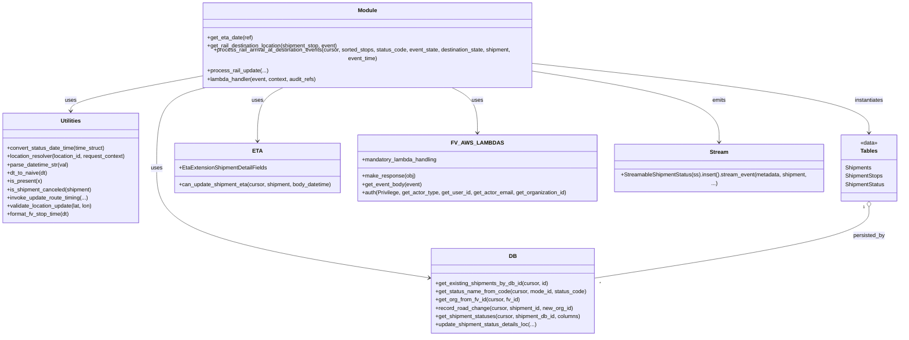

# Diagram: shipment_core/shipment_service/shipment_service/rail_update/rail_update.py


> Auto-generated by Obscura crawlers

## Diagram 1



### SVG

<svg id="container" width="2622.53125" xmlns="http://www.w3.org/2000/svg" class="classDiagram" height="950" viewBox="0 0 2622.53125 950" role="graphics-document document" aria-roledescription="class"><style>#container{font-family:"trebuchet ms",verdana,arial,sans-serif;font-size:16px;fill:#333;}@keyframes edge-animation-frame{from{stroke-dashoffset:0;}}@keyframes dash{to{stroke-dashoffset:0;}}#container .edge-animation-slow{stroke-dasharray:9,5!important;stroke-dashoffset:900;animation:dash 50s linear infinite;stroke-linecap:round;}#container .edge-animation-fast{stroke-dasharray:9,5!important;stroke-dashoffset:900;animation:dash 20s linear infinite;stroke-linecap:round;}#container .error-icon{fill:#552222;}#container .error-text{fill:#552222;stroke:#552222;}#container .edge-thickness-normal{stroke-width:1px;}#container .edge-thickness-thick{stroke-width:3.5px;}#container .edge-pattern-solid{stroke-dasharray:0;}#container .edge-thickness-invisible{stroke-width:0;fill:none;}#container .edge-pattern-dashed{stroke-dasharray:3;}#container .edge-pattern-dotted{stroke-dasharray:2;}#container .marker{fill:#333333;stroke:#333333;}#container .marker.cross{stroke:#333333;}#container svg{font-family:"trebuchet ms",verdana,arial,sans-serif;font-size:16px;}#container p{margin:0;}#container g.classGroup text{fill:#9370DB;stroke:none;font-family:"trebuchet ms",verdana,arial,sans-serif;font-size:10px;}#container g.classGroup text .title{font-weight:bolder;}#container .nodeLabel,#container .edgeLabel{color:#131300;}#container .edgeLabel .label rect{fill:#ECECFF;}#container .label text{fill:#131300;}#container .labelBkg{background:#ECECFF;}#container .edgeLabel .label span{background:#ECECFF;}#container .classTitle{font-weight:bolder;}#container .node rect,#container .node circle,#container .node ellipse,#container .node polygon,#container .node path{fill:#ECECFF;stroke:#9370DB;stroke-width:1px;}#container .divider{stroke:#9370DB;stroke-width:1;}#container g.clickable{cursor:pointer;}#container g.classGroup rect{fill:#ECECFF;stroke:#9370DB;}#container g.classGroup line{stroke:#9370DB;stroke-width:1;}#container .classLabel .box{stroke:none;stroke-width:0;fill:#ECECFF;opacity:0.5;}#container .classLabel .label{fill:#9370DB;font-size:10px;}#container .relation{stroke:#333333;stroke-width:1;fill:none;}#container .dashed-line{stroke-dasharray:3;}#container .dotted-line{stroke-dasharray:1 2;}#container #compositionStart,#container .composition{fill:#333333!important;stroke:#333333!important;stroke-width:1;}#container #compositionEnd,#container .composition{fill:#333333!important;stroke:#333333!important;stroke-width:1;}#container #dependencyStart,#container .dependency{fill:#333333!important;stroke:#333333!important;stroke-width:1;}#container #dependencyStart,#container .dependency{fill:#333333!important;stroke:#333333!important;stroke-width:1;}#container #extensionStart,#container .extension{fill:transparent!important;stroke:#333333!important;stroke-width:1;}#container #extensionEnd,#container .extension{fill:transparent!important;stroke:#333333!important;stroke-width:1;}#container #aggregationStart,#container .aggregation{fill:transparent!important;stroke:#333333!important;stroke-width:1;}#container #aggregationEnd,#container .aggregation{fill:transparent!important;stroke:#333333!important;stroke-width:1;}#container #lollipopStart,#container .lollipop{fill:#ECECFF!important;stroke:#333333!important;stroke-width:1;}#container #lollipopEnd,#container .lollipop{fill:#ECECFF!important;stroke:#333333!important;stroke-width:1;}#container .edgeTerminals{font-size:11px;line-height:initial;}#container .classTitleText{text-anchor:middle;font-size:18px;fill:#333;}#container .label-icon{display:inline-block;height:1em;overflow:visible;vertical-align:-0.125em;}#container .node .label-icon path{fill:currentColor;stroke:revert;stroke-width:revert;}#container :root{--mermaid-font-family:"trebuchet ms",verdana,arial,sans-serif;}</style><g><defs><marker id="container_class-aggregationStart" class="marker aggregation class" refX="18" refY="7" markerWidth="190" markerHeight="240" orient="auto"><path d="M 18,7 L9,13 L1,7 L9,1 Z"></path></marker></defs><defs><marker id="container_class-aggregationEnd" class="marker aggregation class" refX="1" refY="7" markerWidth="20" markerHeight="28" orient="auto"><path d="M 18,7 L9,13 L1,7 L9,1 Z"></path></marker></defs><defs><marker id="container_class-extensionStart" class="marker extension class" refX="18" refY="7" markerWidth="190" markerHeight="240" orient="auto"><path d="M 1,7 L18,13 V 1 Z"></path></marker></defs><defs><marker id="container_class-extensionEnd" class="marker extension class" refX="1" refY="7" markerWidth="20" markerHeight="28" orient="auto"><path d="M 1,1 V 13 L18,7 Z"></path></marker></defs><defs><marker id="container_class-compositionStart" class="marker composition class" refX="18" refY="7" markerWidth="190" markerHeight="240" orient="auto"><path d="M 18,7 L9,13 L1,7 L9,1 Z"></path></marker></defs><defs><marker id="container_class-compositionEnd" class="marker composition class" refX="1" refY="7" markerWidth="20" markerHeight="28" orient="auto"><path d="M 18,7 L9,13 L1,7 L9,1 Z"></path></marker></defs><defs><marker id="container_class-dependencyStart" class="marker dependency class" refX="6" refY="7" markerWidth="190" markerHeight="240" orient="auto"><path d="M 5,7 L9,13 L1,7 L9,1 Z"></path></marker></defs><defs><marker id="container_class-dependencyEnd" class="marker dependency class" refX="13" refY="7" markerWidth="20" markerHeight="28" orient="auto"><path d="M 18,7 L9,13 L14,7 L9,1 Z"></path></marker></defs><defs><marker id="container_class-lollipopStart" class="marker lollipop class" refX="13" refY="7" markerWidth="190" markerHeight="240" orient="auto"><circle stroke="black" fill="transparent" cx="7" cy="7" r="6"></circle></marker></defs><defs><marker id="container_class-lollipopEnd" class="marker lollipop class" refX="1" refY="7" markerWidth="190" markerHeight="240" orient="auto"><circle stroke="black" fill="transparent" cx="7" cy="7" r="6"></circle></marker></defs><g class="root"><g class="clusters"></g><g class="edgePaths"><path d="M567.129,205.891L507.583,216.076C448.036,226.26,328.944,246.63,269.398,261.982C209.852,277.333,209.852,287.667,209.852,292.833L209.852,298" id="id_Module_Utilities_1" class="edge-thickness-normal edge-pattern-solid relation" style=";;;" data-edge="true" data-et="edge" data-id="id_Module_Utilities_1" data-points="W3sieCI6NTY3LjEyODkwNjI1LCJ5IjoyMDUuODkwNjExMzg2MjM5Mn0seyJ4IjoyMDkuODUxNTYyNSwieSI6MjY3fSx7IngiOjIwOS44NTE1NjI1LCJ5IjozMDR9XQ==" marker-end="url(#container_class-dependencyEnd)"></path><path d="M616.181,230L590.683,236.167C565.186,242.333,514.19,254.667,488.693,293.5C463.195,332.333,463.195,397.667,463.195,463C463.195,528.333,463.195,593.667,595.28,646.762C727.365,699.857,991.535,740.715,1123.62,761.143L1255.705,781.572" id="id_Module_DB_2" class="edge-thickness-normal edge-pattern-solid relation" style=";;;" data-edge="true" data-et="edge" data-id="id_Module_DB_2" data-points="W3sieCI6NjE2LjE4MDY2NDA2MjUsInkiOjIzMH0seyJ4Ijo0NjMuMTk1MzEyNSwieSI6MjY3fSx7IngiOjQ2My4xOTUzMTI1LCJ5Ijo0NjN9LHsieCI6NDYzLjE5NTMxMjUsInkiOjY1OX0seyJ4IjoxMjYxLjYzNDc2NTYyNSwieSI6NzgyLjQ4OTIxMTE0NTg3MDl9XQ==" marker-end="url(#container_class-dependencyEnd)"></path><path d="M1583.145,170.6L1741.322,186.667C1899.499,202.733,2215.853,234.867,2374.03,266.6C2532.207,298.333,2532.207,329.667,2532.207,345.333L2532.207,361" id="id_Module_Tables_3" class="edge-thickness-normal edge-pattern-solid relation" style=";;;" data-edge="true" data-et="edge" data-id="id_Module_Tables_3" data-points="W3sieCI6MTU4My4xNDQ1MzEyNSwieSI6MTcwLjYwMDIyNTE5NTAzNX0seyJ4IjoyNTMyLjIwNzAzMTI1LCJ5IjoyNjd9LHsieCI6MjUzMi4yMDcwMzEyNSwieSI6MzY3fV0=" marker-end="url(#container_class-dependencyEnd)"></path><path d="M836.988,230L823.758,236.167C810.527,242.333,784.066,254.667,770.836,280.5C757.605,306.333,757.605,345.667,757.605,365.333L757.605,385" id="id_Module_ETA_4" class="edge-thickness-normal edge-pattern-solid relation" style=";;;" data-edge="true" data-et="edge" data-id="id_Module_ETA_4" data-points="W3sieCI6ODM2Ljk4ODI4MTI1LCJ5IjoyMzB9LHsieCI6NzU3LjYwNTQ2ODc1LCJ5IjoyNjd9LHsieCI6NzU3LjYwNTQ2ODc1LCJ5IjozOTF9XQ==" marker-end="url(#container_class-dependencyEnd)"></path><path d="M1313.285,230L1326.516,236.167C1339.746,242.333,1366.207,254.667,1379.438,276.5C1392.668,298.333,1392.668,329.667,1392.668,345.333L1392.668,361" id="id_Module_FV_AWS_LAMBDAS_5" class="edge-thickness-normal edge-pattern-solid relation" style=";;;" data-edge="true" data-et="edge" data-id="id_Module_FV_AWS_LAMBDAS_5" data-points="W3sieCI6MTMxMy4yODUxNTYyNSwieSI6MjMwfSx7IngiOjEzOTIuNjY3OTY4NzUsInkiOjI2N30seyJ4IjoxMzkyLjY2Nzk2ODc1LCJ5IjozNjd9XQ==" marker-end="url(#container_class-dependencyEnd)"></path><path d="M1583.145,192.913L1668.012,205.261C1752.879,217.609,1922.613,242.304,2007.48,275.819C2092.348,309.333,2092.348,351.667,2092.348,372.833L2092.348,394" id="id_Module_Stream_6" class="edge-thickness-normal edge-pattern-solid relation" style=";;;" data-edge="true" data-et="edge" data-id="id_Module_Stream_6" data-points="W3sieCI6MTU4My4xNDQ1MzEyNSwieSI6MTkyLjkxMzA0MzQ3ODI2MDg3fSx7IngiOjIwOTIuMzQ3NjU2MjUsInkiOjI2N30seyJ4IjoyMDkyLjM0NzY1NjI1LCJ5Ijo0MDB9XQ==" marker-end="url(#container_class-dependencyEnd)"></path><path d="M2532.207,576.25L2532.207,590.042C2532.207,603.833,2532.207,631.417,2399.134,665.79C2266.061,700.163,1999.914,741.326,1866.841,761.908L1733.768,782.489" id="id_Tables_DB_7" class="edge-thickness-normal edge-pattern-solid relation" style=";;;" data-edge="true" data-et="edge" data-id="id_Tables_DB_7" data-points="W3sieCI6MjUzMi4yMDcwMzEyNSwieSI6NTU5fSx7IngiOjI1MzIuMjA3MDMxMjUsInkiOjY1OX0seyJ4IjoxNzMzLjc2NzU3ODEyNSwieSI6NzgyLjQ4OTIxMTE0NTg3MDl9XQ==" marker-start="url(#container_class-aggregationStart)"></path></g><g class="edgeLabels"><g class="edgeLabel" transform="translate(209.8515625, 267)"><g class="label" data-id="id_Module_Utilities_1" transform="translate(-16.4921875, -12)"><foreignObject width="32.984375" height="24"><div xmlns="http://www.w3.org/1999/xhtml" class="labelBkg" style="display: table-cell; white-space: nowrap; line-height: 1.5; max-width: 200px; text-align: center;"><span class="edgeLabel"><p>uses</p></span></div></foreignObject></g></g><g class="edgeLabel" transform="translate(463.1953125, 463)"><g class="label" data-id="id_Module_DB_2" transform="translate(-16.4921875, -12)"><foreignObject width="32.984375" height="24"><div xmlns="http://www.w3.org/1999/xhtml" class="labelBkg" style="display: table-cell; white-space: nowrap; line-height: 1.5; max-width: 200px; text-align: center;"><span class="edgeLabel"><p>uses</p></span></div></foreignObject></g></g><g class="edgeLabel" transform="translate(2532.20703125, 267)"><g class="label" data-id="id_Module_Tables_3" transform="translate(-42.9140625, -12)"><foreignObject width="85.828125" height="24"><div xmlns="http://www.w3.org/1999/xhtml" class="labelBkg" style="display: table-cell; white-space: nowrap; line-height: 1.5; max-width: 200px; text-align: center;"><span class="edgeLabel"><p>instantiates</p></span></div></foreignObject></g></g><g class="edgeLabel" transform="translate(757.60546875, 267)"><g class="label" data-id="id_Module_ETA_4" transform="translate(-16.4921875, -12)"><foreignObject width="32.984375" height="24"><div xmlns="http://www.w3.org/1999/xhtml" class="labelBkg" style="display: table-cell; white-space: nowrap; line-height: 1.5; max-width: 200px; text-align: center;"><span class="edgeLabel"><p>uses</p></span></div></foreignObject></g></g><g class="edgeLabel" transform="translate(1392.66796875, 267)"><g class="label" data-id="id_Module_FV_AWS_LAMBDAS_5" transform="translate(-16.4921875, -12)"><foreignObject width="32.984375" height="24"><div xmlns="http://www.w3.org/1999/xhtml" class="labelBkg" style="display: table-cell; white-space: nowrap; line-height: 1.5; max-width: 200px; text-align: center;"><span class="edgeLabel"><p>uses</p></span></div></foreignObject></g></g><g class="edgeLabel" transform="translate(2092.34765625, 267)"><g class="label" data-id="id_Module_Stream_6" transform="translate(-20.1015625, -12)"><foreignObject width="40.203125" height="24"><div xmlns="http://www.w3.org/1999/xhtml" class="labelBkg" style="display: table-cell; white-space: nowrap; line-height: 1.5; max-width: 200px; text-align: center;"><span class="edgeLabel"><p>emits</p></span></div></foreignObject></g></g><g class="edgeLabel" transform="translate(2532.20703125, 659)"><g class="label" data-id="id_Tables_DB_7" transform="translate(-46.5390625, -12)"><foreignObject width="93.078125" height="24"><div xmlns="http://www.w3.org/1999/xhtml" class="labelBkg" style="display: table-cell; white-space: nowrap; line-height: 1.5; max-width: 200px; text-align: center;"><span class="edgeLabel"><p>persisted_by</p></span></div></foreignObject></g></g><g class="edgeTerminals" transform="translate(2517.207030625, 576.4999994642857)"><g class="inner" transform="translate(0, 0)"><foreignObject style="width: 9px; height: 12px;"><div xmlns="http://www.w3.org/1999/xhtml" style="display: inline-block; padding-right: 1px; white-space: nowrap;"><span class="edgeLabel">1</span></div></foreignObject></g></g><g class="edgeTerminals" transform="translate(1748.3546444640488, 789.6381557975798)"><g class="inner" transform="translate(0, 0)"></g><foreignObject style="width: 9px; height: 12px;"><div xmlns="http://www.w3.org/1999/xhtml" style="display: inline-block; padding-right: 1px; white-space: nowrap;"><span class="edgeLabel">*</span></div></foreignObject></g></g><g class="nodes"><g class="node default" id="classId-Module-0" transform="translate(1075.13671875, 119)"><g class="basic label-container"><path d="M-508.0078125 -111 L508.0078125 -111 L508.0078125 111 L-508.0078125 111" stroke="none" stroke-width="0" fill="#ECECFF" style=""></path><path d="M-508.0078125 -111 C-274.91596435067703 -111, -41.82411620135406 -111, 508.0078125 -111 M-508.0078125 -111 C-224.36276017795961 -111, 59.28229214408077 -111, 508.0078125 -111 M508.0078125 -111 C508.0078125 -42.573168965933476, 508.0078125 25.853662068133048, 508.0078125 111 M508.0078125 -111 C508.0078125 -57.85676963060105, 508.0078125 -4.713539261202101, 508.0078125 111 M508.0078125 111 C271.9344982312956 111, 35.861183962591156 111, -508.0078125 111 M508.0078125 111 C185.3530619885318 111, -137.3016885229364 111, -508.0078125 111 M-508.0078125 111 C-508.0078125 55.47117224932612, -508.0078125 -0.0576555013477531, -508.0078125 -111 M-508.0078125 111 C-508.0078125 62.67933386612455, -508.0078125 14.358667732249103, -508.0078125 -111" stroke="#9370DB" stroke-width="1.3" fill="none" stroke-dasharray="0 0" style=""></path></g><g class="annotation-group text" transform="translate(0, -87)"></g><g class="label-group text" transform="translate(-27.09375, -87)"><g class="label" style="font-weight: bolder" transform="translate(0,-12)"><foreignObject width="54.1875" height="24"><div xmlns="http://www.w3.org/1999/xhtml" style="display: table-cell; white-space: nowrap; line-height: 1.5; max-width: 104px; text-align: center;"><span class="nodeLabel markdown-node-label" style=""><p>Module</p></span></div></foreignObject></g></g><g class="members-group text" transform="translate(-496.0078125, -39)"></g><g class="methods-group text" transform="translate(-496.0078125, -9)"><g class="label" style="" transform="translate(0,-12)"><foreignObject width="133.59375" height="24"><div xmlns="http://www.w3.org/1999/xhtml" style="display: table-cell; white-space: nowrap; line-height: 1.5; max-width: 191px; text-align: center;"><span class="nodeLabel markdown-node-label" style=""><p>+get_eta_date(ref)</p></span></div></foreignObject></g><g class="label" style="" transform="translate(0,12)"><foreignObject width="388.09375" height="24"><div xmlns="http://www.w3.org/1999/xhtml" style="display: table-cell; white-space: nowrap; line-height: 1.5; max-width: 445px; text-align: center;"><span class="nodeLabel markdown-node-label" style=""><p>+get_rail_destination_location(shipment_stop, event)</p></span></div></foreignObject></g><g class="label" style="" transform="translate(0,36)"><foreignObject width="964.921875" height="24"><div xmlns="http://www.w3.org/1999/xhtml" style="display: table-cell; white-space: nowrap; line-height: 1.5; max-width: 1022px; text-align: center;"><span class="nodeLabel markdown-node-label" style=""><p>+process_rail_arrival_at_destination_events(cursor, sorted_stops, status_code, event_state, destination_state, shipment, event_time)</p></span></div></foreignObject></g><g class="label" style="" transform="translate(0,60)"><foreignObject width="176.125" height="24"><div xmlns="http://www.w3.org/1999/xhtml" style="display: table-cell; white-space: nowrap; line-height: 1.5; max-width: 233px; text-align: center;"><span class="nodeLabel markdown-node-label" style=""><p>+process_rail_update(...)</p></span></div></foreignObject></g><g class="label" style="" transform="translate(0,84)"><foreignObject width="321.6875" height="24"><div xmlns="http://www.w3.org/1999/xhtml" style="display: table-cell; white-space: nowrap; line-height: 1.5; max-width: 379px; text-align: center;"><span class="nodeLabel markdown-node-label" style=""><p>+lambda_handler(event, context, audit_refs)</p></span></div></foreignObject></g></g><g class="divider" style=""><path d="M-508.0078125 -63 C-168.0091295981233 -63, 171.98955330375338 -63, 508.0078125 -63 M-508.0078125 -63 C-290.4081727976088 -63, -72.80853309521757 -63, 508.0078125 -63" stroke="#9370DB" stroke-width="1.3" fill="none" stroke-dasharray="0 0" style=""></path></g><g class="divider" style=""><path d="M-508.0078125 -39 C-174.75521116493968 -39, 158.49739017012064 -39, 508.0078125 -39 M-508.0078125 -39 C-228.6180626753864 -39, 50.771687149227205 -39, 508.0078125 -39" stroke="#9370DB" stroke-width="1.3" fill="none" stroke-dasharray="0 0" style=""></path></g></g><g class="node default" id="classId-Utilities-1" transform="translate(209.8515625, 463)"><g class="basic label-container"><path d="M-201.8515625 -159 L201.8515625 -159 L201.8515625 159 L-201.8515625 159" stroke="none" stroke-width="0" fill="#ECECFF" style=""></path><path d="M-201.8515625 -159 C-115.06946116858848 -159, -28.28735983717695 -159, 201.8515625 -159 M-201.8515625 -159 C-86.03871754357371 -159, 29.77412741285258 -159, 201.8515625 -159 M201.8515625 -159 C201.8515625 -44.48747800884213, 201.8515625 70.02504398231574, 201.8515625 159 M201.8515625 -159 C201.8515625 -92.19196421839725, 201.8515625 -25.38392843679449, 201.8515625 159 M201.8515625 159 C87.78920755998513 159, -26.27314738002974 159, -201.8515625 159 M201.8515625 159 C111.6172780541929 159, 21.38299360838579 159, -201.8515625 159 M-201.8515625 159 C-201.8515625 34.83168259143952, -201.8515625 -89.33663481712097, -201.8515625 -159 M-201.8515625 159 C-201.8515625 53.75614407960916, -201.8515625 -51.487711840781685, -201.8515625 -159" stroke="#9370DB" stroke-width="1.3" fill="none" stroke-dasharray="0 0" style=""></path></g><g class="annotation-group text" transform="translate(0, -135)"></g><g class="label-group text" transform="translate(-28.8125, -135)"><g class="label" style="font-weight: bolder" transform="translate(0,-12)"><foreignObject width="57.625" height="24"><div xmlns="http://www.w3.org/1999/xhtml" style="display: table-cell; white-space: nowrap; line-height: 1.5; max-width: 107px; text-align: center;"><span class="nodeLabel markdown-node-label" style=""><p>Utilities</p></span></div></foreignObject></g></g><g class="members-group text" transform="translate(-189.8515625, -87)"></g><g class="methods-group text" transform="translate(-189.8515625, -57)"><g class="label" style="" transform="translate(0,-12)"><foreignObject width="288.984375" height="24"><div xmlns="http://www.w3.org/1999/xhtml" style="display: table-cell; white-space: nowrap; line-height: 1.5; max-width: 346px; text-align: center;"><span class="nodeLabel markdown-node-label" style=""><p>+convert_status_date_time(time_struct)</p></span></div></foreignObject></g><g class="label" style="" transform="translate(0,12)"><foreignObject width="350.890625" height="24"><div xmlns="http://www.w3.org/1999/xhtml" style="display: table-cell; white-space: nowrap; line-height: 1.5; max-width: 408px; text-align: center;"><span class="nodeLabel markdown-node-label" style=""><p>+location_resolver(location_id, request_context)</p></span></div></foreignObject></g><g class="label" style="" transform="translate(0,36)"><foreignObject width="179.734375" height="24"><div xmlns="http://www.w3.org/1999/xhtml" style="display: table-cell; white-space: nowrap; line-height: 1.5; max-width: 237px; text-align: center;"><span class="nodeLabel markdown-node-label" style=""><p>+parse_datetime_str(val)</p></span></div></foreignObject></g><g class="label" style="" transform="translate(0,60)"><foreignObject width="119.046875" height="24"><div xmlns="http://www.w3.org/1999/xhtml" style="display: table-cell; white-space: nowrap; line-height: 1.5; max-width: 176px; text-align: center;"><span class="nodeLabel markdown-node-label" style=""><p>+dt_to_naive(dt)</p></span></div></foreignObject></g><g class="label" style="" transform="translate(0,84)"><foreignObject width="101.375" height="24"><div xmlns="http://www.w3.org/1999/xhtml" style="display: table-cell; white-space: nowrap; line-height: 1.5; max-width: 159px; text-align: center;"><span class="nodeLabel markdown-node-label" style=""><p>+is_present(x)</p></span></div></foreignObject></g><g class="label" style="" transform="translate(0,108)"><foreignObject width="247.75" height="24"><div xmlns="http://www.w3.org/1999/xhtml" style="display: table-cell; white-space: nowrap; line-height: 1.5; max-width: 305px; text-align: center;"><span class="nodeLabel markdown-node-label" style=""><p>+is_shipment_canceled(shipment)</p></span></div></foreignObject></g><g class="label" style="" transform="translate(0,132)"><foreignObject width="237.09375" height="24"><div xmlns="http://www.w3.org/1999/xhtml" style="display: table-cell; white-space: nowrap; line-height: 1.5; max-width: 294px; text-align: center;"><span class="nodeLabel markdown-node-label" style=""><p>+invoke_update_route_timing(...)</p></span></div></foreignObject></g><g class="label" style="" transform="translate(0,156)"><foreignObject width="252.984375" height="24"><div xmlns="http://www.w3.org/1999/xhtml" style="display: table-cell; white-space: nowrap; line-height: 1.5; max-width: 310px; text-align: center;"><span class="nodeLabel markdown-node-label" style=""><p>+validate_location_update(lat, lon)</p></span></div></foreignObject></g><g class="label" style="" transform="translate(0,180)"><foreignObject width="183.703125" height="24"><div xmlns="http://www.w3.org/1999/xhtml" style="display: table-cell; white-space: nowrap; line-height: 1.5; max-width: 241px; text-align: center;"><span class="nodeLabel markdown-node-label" style=""><p>+format_fv_stop_time(dt)</p></span></div></foreignObject></g></g><g class="divider" style=""><path d="M-201.8515625 -111 C-73.3252260228812 -111, 55.20111045423761 -111, 201.8515625 -111 M-201.8515625 -111 C-54.444777556452806 -111, 92.96200738709439 -111, 201.8515625 -111" stroke="#9370DB" stroke-width="1.3" fill="none" stroke-dasharray="0 0" style=""></path></g><g class="divider" style=""><path d="M-201.8515625 -87 C-81.46610459711357 -87, 38.91935330577286 -87, 201.8515625 -87 M-201.8515625 -87 C-116.13415542621414 -87, -30.41674835242827 -87, 201.8515625 -87" stroke="#9370DB" stroke-width="1.3" fill="none" stroke-dasharray="0 0" style=""></path></g></g><g class="node default" id="classId-DB-2" transform="translate(1497.701171875, 819)"><g class="basic label-container"><path d="M-236.06640625 -123 L236.06640625 -123 L236.06640625 123 L-236.06640625 123" stroke="none" stroke-width="0" fill="#ECECFF" style=""></path><path d="M-236.06640625 -123 C-130.6786826046976 -123, -25.29095895939517 -123, 236.06640625 -123 M-236.06640625 -123 C-128.36393292149788 -123, -20.661459592995755 -123, 236.06640625 -123 M236.06640625 -123 C236.06640625 -39.43521376817279, 236.06640625 44.129572463654426, 236.06640625 123 M236.06640625 -123 C236.06640625 -35.74677976728847, 236.06640625 51.506440465423054, 236.06640625 123 M236.06640625 123 C124.06730910468761 123, 12.068211959375219 123, -236.06640625 123 M236.06640625 123 C114.93934346256756 123, -6.187719324864872 123, -236.06640625 123 M-236.06640625 123 C-236.06640625 37.75496103950064, -236.06640625 -47.490077920998715, -236.06640625 -123 M-236.06640625 123 C-236.06640625 37.714364440370645, -236.06640625 -47.57127111925871, -236.06640625 -123" stroke="#9370DB" stroke-width="1.3" fill="none" stroke-dasharray="0 0" style=""></path></g><g class="annotation-group text" transform="translate(0, -99)"></g><g class="label-group text" transform="translate(-10.1484375, -99)"><g class="label" style="font-weight: bolder" transform="translate(0,-12)"><foreignObject width="20.296875" height="24"><div xmlns="http://www.w3.org/1999/xhtml" style="display: table-cell; white-space: nowrap; line-height: 1.5; max-width: 70px; text-align: center;"><span class="nodeLabel markdown-node-label" style=""><p>DB</p></span></div></foreignObject></g></g><g class="members-group text" transform="translate(-224.06640625, -51)"></g><g class="methods-group text" transform="translate(-224.06640625, -21)"><g class="label" style="" transform="translate(0,-12)"><foreignObject width="330.125" height="24"><div xmlns="http://www.w3.org/1999/xhtml" style="display: table-cell; white-space: nowrap; line-height: 1.5; max-width: 387px; text-align: center;"><span class="nodeLabel markdown-node-label" style=""><p>+get_existing_shipments_by_db_id(cursor, id)</p></span></div></foreignObject></g><g class="label" style="" transform="translate(0,12)"><foreignObject width="437.984375" height="24"><div xmlns="http://www.w3.org/1999/xhtml" style="display: table-cell; white-space: nowrap; line-height: 1.5; max-width: 495px; text-align: center;"><span class="nodeLabel markdown-node-label" style=""><p>+get_status_name_from_code(cursor, mode_id, status_code)</p></span></div></foreignObject></g><g class="label" style="" transform="translate(0,36)"><foreignObject width="245.53125" height="24"><div xmlns="http://www.w3.org/1999/xhtml" style="display: table-cell; white-space: nowrap; line-height: 1.5; max-width: 303px; text-align: center;"><span class="nodeLabel markdown-node-label" style=""><p>+get_org_from_fv_id(cursor, fv_id)</p></span></div></foreignObject></g><g class="label" style="" transform="translate(0,60)"><foreignObject width="400.84375" height="24"><div xmlns="http://www.w3.org/1999/xhtml" style="display: table-cell; white-space: nowrap; line-height: 1.5; max-width: 458px; text-align: center;"><span class="nodeLabel markdown-node-label" style=""><p>+record_road_change(cursor, shipment_id, new_org_id)</p></span></div></foreignObject></g><g class="label" style="" transform="translate(0,84)"><foreignObject width="426.046875" height="24"><div xmlns="http://www.w3.org/1999/xhtml" style="display: table-cell; white-space: nowrap; line-height: 1.5; max-width: 483px; text-align: center;"><span class="nodeLabel markdown-node-label" style=""><p>+get_shipment_statuses(cursor, shipment_db_id, columns)</p></span></div></foreignObject></g><g class="label" style="" transform="translate(0,108)"><foreignObject width="296.84375" height="24"><div xmlns="http://www.w3.org/1999/xhtml" style="display: table-cell; white-space: nowrap; line-height: 1.5; max-width: 354px; text-align: center;"><span class="nodeLabel markdown-node-label" style=""><p>+update_shipment_status_details_loc(...)</p></span></div></foreignObject></g></g><g class="divider" style=""><path d="M-236.06640625 -75 C-51.9494640249539 -75, 132.1674782000922 -75, 236.06640625 -75 M-236.06640625 -75 C-118.64573245712315 -75, -1.2250586642462906 -75, 236.06640625 -75" stroke="#9370DB" stroke-width="1.3" fill="none" stroke-dasharray="0 0" style=""></path></g><g class="divider" style=""><path d="M-236.06640625 -51 C-104.92562001518229 -51, 26.21516621963542 -51, 236.06640625 -51 M-236.06640625 -51 C-71.26846145051667 -51, 93.52948334896666 -51, 236.06640625 -51" stroke="#9370DB" stroke-width="1.3" fill="none" stroke-dasharray="0 0" style=""></path></g></g><g class="node default" id="classId-Tables-3" transform="translate(2532.20703125, 463)"><g class="basic label-container"><path d="M-82.32421875 -96 L82.32421875 -96 L82.32421875 96 L-82.32421875 96" stroke="none" stroke-width="0" fill="#ECECFF" style=""></path><path d="M-82.32421875 -96 C-43.87822508659122 -96, -5.432231423182444 -96, 82.32421875 -96 M-82.32421875 -96 C-44.81830470899476 -96, -7.3123906679895185 -96, 82.32421875 -96 M82.32421875 -96 C82.32421875 -20.77967221229852, 82.32421875 54.44065557540296, 82.32421875 96 M82.32421875 -96 C82.32421875 -48.32628994992931, 82.32421875 -0.6525798998586225, 82.32421875 96 M82.32421875 96 C18.57062262621495 96, -45.1829734975701 96, -82.32421875 96 M82.32421875 96 C46.37673826346601 96, 10.429257776932019 96, -82.32421875 96 M-82.32421875 96 C-82.32421875 25.034299808933554, -82.32421875 -45.93140038213289, -82.32421875 -96 M-82.32421875 96 C-82.32421875 50.33204858540136, -82.32421875 4.6640971708027195, -82.32421875 -96" stroke="#9370DB" stroke-width="1.3" fill="none" stroke-dasharray="0 0" style=""></path></g><g class="annotation-group text" transform="translate(-25.2890625, -72)"><g class="label" style="" transform="translate(0,-12)"><foreignObject width="50.578125" height="24"><div xmlns="http://www.w3.org/1999/xhtml" style="display: table-cell; white-space: nowrap; line-height: 1.5; max-width: 101px; text-align: center;"><span class="nodeLabel markdown-node-label" style=""><p>«data»</p></span></div></foreignObject></g></g><g class="label-group text" transform="translate(-23.703125, -48)"><g class="label" style="font-weight: bolder" transform="translate(0,-12)"><foreignObject width="47.40625" height="24"><div xmlns="http://www.w3.org/1999/xhtml" style="display: table-cell; white-space: nowrap; line-height: 1.5; max-width: 96px; text-align: center;"><span class="nodeLabel markdown-node-label" style=""><p>Tables</p></span></div></foreignObject></g></g><g class="members-group text" transform="translate(-70.32421875, 0)"><g class="label" style="" transform="translate(0,-12)"><foreignObject width="77.171875" height="24"><div xmlns="http://www.w3.org/1999/xhtml" style="display: table-cell; white-space: nowrap; line-height: 1.5; max-width: 127px; text-align: center;"><span class="nodeLabel markdown-node-label" style=""><p>Shipments</p></span></div></foreignObject></g><g class="label" style="" transform="translate(0,12)"><foreignObject width="110.28125" height="24"><div xmlns="http://www.w3.org/1999/xhtml" style="display: table-cell; white-space: nowrap; line-height: 1.5; max-width: 160px; text-align: center;"><span class="nodeLabel markdown-node-label" style=""><p>ShipmentStops</p></span></div></foreignObject></g><g class="label" style="" transform="translate(0,36)"><foreignObject width="115.359375" height="24"><div xmlns="http://www.w3.org/1999/xhtml" style="display: table-cell; white-space: nowrap; line-height: 1.5; max-width: 165px; text-align: center;"><span class="nodeLabel markdown-node-label" style=""><p>ShipmentStatus</p></span></div></foreignObject></g></g><g class="methods-group text" transform="translate(-70.32421875, 96)"></g><g class="divider" style=""><path d="M-82.32421875 -24 C-36.70084098678577 -24, 8.922536776428458 -24, 82.32421875 -24 M-82.32421875 -24 C-35.647386832625145 -24, 11.02944508474971 -24, 82.32421875 -24" stroke="#9370DB" stroke-width="1.3" fill="none" stroke-dasharray="0 0" style=""></path></g><g class="divider" style=""><path d="M-82.32421875 72 C-35.4034231112919 72, 11.5173725274162 72, 82.32421875 72 M-82.32421875 72 C-48.38743265590198 72, -14.450646561803964 72, 82.32421875 72" stroke="#9370DB" stroke-width="1.3" fill="none" stroke-dasharray="0 0" style=""></path></g></g><g class="node default" id="classId-ETA-4" transform="translate(757.60546875, 463)"><g class="basic label-container"><path d="M-242.91796875 -72 L242.91796875 -72 L242.91796875 72 L-242.91796875 72" stroke="none" stroke-width="0" fill="#ECECFF" style=""></path><path d="M-242.91796875 -72 C-139.3508035414364 -72, -35.783638332872755 -72, 242.91796875 -72 M-242.91796875 -72 C-137.72539216821946 -72, -32.532815586438886 -72, 242.91796875 -72 M242.91796875 -72 C242.91796875 -31.14381084521964, 242.91796875 9.71237830956072, 242.91796875 72 M242.91796875 -72 C242.91796875 -19.448374943563323, 242.91796875 33.103250112873354, 242.91796875 72 M242.91796875 72 C52.48232524952766 72, -137.95331825094468 72, -242.91796875 72 M242.91796875 72 C142.34904123876748 72, 41.780113727534996 72, -242.91796875 72 M-242.91796875 72 C-242.91796875 40.2328030262438, -242.91796875 8.465606052487601, -242.91796875 -72 M-242.91796875 72 C-242.91796875 34.274281057979245, -242.91796875 -3.4514378840415105, -242.91796875 -72" stroke="#9370DB" stroke-width="1.3" fill="none" stroke-dasharray="0 0" style=""></path></g><g class="annotation-group text" transform="translate(0, -48)"></g><g class="label-group text" transform="translate(-12.8515625, -48)"><g class="label" style="font-weight: bolder" transform="translate(0,-12)"><foreignObject width="25.703125" height="24"><div xmlns="http://www.w3.org/1999/xhtml" style="display: table-cell; white-space: nowrap; line-height: 1.5; max-width: 76px; text-align: center;"><span class="nodeLabel markdown-node-label" style=""><p>ETA</p></span></div></foreignObject></g></g><g class="members-group text" transform="translate(-230.91796875, 0)"><g class="label" style="" transform="translate(0,-12)"><foreignObject width="255.8125" height="24"><div xmlns="http://www.w3.org/1999/xhtml" style="display: table-cell; white-space: nowrap; line-height: 1.5; max-width: 313px; text-align: center;"><span class="nodeLabel markdown-node-label" style=""><p>+EtaExtensionShipmentDetailFields</p></span></div></foreignObject></g></g><g class="methods-group text" transform="translate(-230.91796875, 48)"><g class="label" style="" transform="translate(0,-12)"><foreignObject width="448.984375" height="24"><div xmlns="http://www.w3.org/1999/xhtml" style="display: table-cell; white-space: nowrap; line-height: 1.5; max-width: 506px; text-align: center;"><span class="nodeLabel markdown-node-label" style=""><p>+can_update_shipment_eta(cursor, shipment, body_datetime)</p></span></div></foreignObject></g></g><g class="divider" style=""><path d="M-242.91796875 -24 C-131.68604898733503 -24, -20.454129224670055 -24, 242.91796875 -24 M-242.91796875 -24 C-67.72190951189282 -24, 107.47414972621436 -24, 242.91796875 -24" stroke="#9370DB" stroke-width="1.3" fill="none" stroke-dasharray="0 0" style=""></path></g><g class="divider" style=""><path d="M-242.91796875 24 C-106.25420104092927 24, 30.40956666814145 24, 242.91796875 24 M-242.91796875 24 C-130.6989972129792 24, -18.480025675958416 24, 242.91796875 24" stroke="#9370DB" stroke-width="1.3" fill="none" stroke-dasharray="0 0" style=""></path></g></g><g class="node default" id="classId-FV_AWS_LAMBDAS-5" transform="translate(1392.66796875, 463)"><g class="basic label-container"><path d="M-342.14453125 -96 L342.14453125 -96 L342.14453125 96 L-342.14453125 96" stroke="none" stroke-width="0" fill="#ECECFF" style=""></path><path d="M-342.14453125 -96 C-200.0098611645191 -96, -57.87519107903819 -96, 342.14453125 -96 M-342.14453125 -96 C-128.2899247856954 -96, 85.56468167860919 -96, 342.14453125 -96 M342.14453125 -96 C342.14453125 -19.313162149685297, 342.14453125 57.373675700629406, 342.14453125 96 M342.14453125 -96 C342.14453125 -50.269303796333695, 342.14453125 -4.53860759266739, 342.14453125 96 M342.14453125 96 C80.282866681293 96, -181.578797887414 96, -342.14453125 96 M342.14453125 96 C148.52588842288634 96, -45.09275440422732 96, -342.14453125 96 M-342.14453125 96 C-342.14453125 56.17361746732148, -342.14453125 16.347234934642955, -342.14453125 -96 M-342.14453125 96 C-342.14453125 39.57392225656444, -342.14453125 -16.852155486871126, -342.14453125 -96" stroke="#9370DB" stroke-width="1.3" fill="none" stroke-dasharray="0 0" style=""></path></g><g class="annotation-group text" transform="translate(0, -72)"></g><g class="label-group text" transform="translate(-66.6015625, -72)"><g class="label" style="font-weight: bolder" transform="translate(0,-12)"><foreignObject width="133.203125" height="24"><div xmlns="http://www.w3.org/1999/xhtml" style="display: table-cell; white-space: nowrap; line-height: 1.5; max-width: 181px; text-align: center;"><span class="nodeLabel markdown-node-label" style=""><p>FV_AWS_LAMBDAS</p></span></div></foreignObject></g></g><g class="members-group text" transform="translate(-330.14453125, -24)"><g class="label" style="" transform="translate(0,-12)"><foreignObject width="221.703125" height="24"><div xmlns="http://www.w3.org/1999/xhtml" style="display: table-cell; white-space: nowrap; line-height: 1.5; max-width: 280px; text-align: center;"><span class="nodeLabel markdown-node-label" style=""><p>+mandatory_lambda_handling</p></span></div></foreignObject></g></g><g class="methods-group text" transform="translate(-330.14453125, 24)"><g class="label" style="" transform="translate(0,-12)"><foreignObject width="155.171875" height="24"><div xmlns="http://www.w3.org/1999/xhtml" style="display: table-cell; white-space: nowrap; line-height: 1.5; max-width: 213px; text-align: center;"><span class="nodeLabel markdown-node-label" style=""><p>+make_response(obj)</p></span></div></foreignObject></g><g class="label" style="" transform="translate(0,12)"><foreignObject width="174.203125" height="24"><div xmlns="http://www.w3.org/1999/xhtml" style="display: table-cell; white-space: nowrap; line-height: 1.5; max-width: 232px; text-align: center;"><span class="nodeLabel markdown-node-label" style=""><p>+get_event_body(event)</p></span></div></foreignObject></g><g class="label" style="" transform="translate(0,36)"><foreignObject width="593.6875" height="24"><div xmlns="http://www.w3.org/1999/xhtml" style="display: table-cell; white-space: nowrap; line-height: 1.5; max-width: 651px; text-align: center;"><span class="nodeLabel markdown-node-label" style=""><p>+auth(Privilege, get_actor_type, get_user_id, get_actor_email, get_organization_id)</p></span></div></foreignObject></g></g><g class="divider" style=""><path d="M-342.14453125 -48 C-170.22104718805087 -48, 1.7024368738982503 -48, 342.14453125 -48 M-342.14453125 -48 C-69.49337788963192 -48, 203.15777547073617 -48, 342.14453125 -48" stroke="#9370DB" stroke-width="1.3" fill="none" stroke-dasharray="0 0" style=""></path></g><g class="divider" style=""><path d="M-342.14453125 0 C-147.28092360122014 0, 47.582684047559724 0, 342.14453125 0 M-342.14453125 0 C-203.88555010502327 0, -65.62656896004654 0, 342.14453125 0" stroke="#9370DB" stroke-width="1.3" fill="none" stroke-dasharray="0 0" style=""></path></g></g><g class="node default" id="classId-Stream-6" transform="translate(2092.34765625, 463)"><g class="basic label-container"><path d="M-307.53515625 -63 L307.53515625 -63 L307.53515625 63 L-307.53515625 63" stroke="none" stroke-width="0" fill="#ECECFF" style=""></path><path d="M-307.53515625 -63 C-135.98345350618345 -63, 35.5682492376331 -63, 307.53515625 -63 M-307.53515625 -63 C-166.12024057337536 -63, -24.70532489675071 -63, 307.53515625 -63 M307.53515625 -63 C307.53515625 -16.630870636068167, 307.53515625 29.738258727863666, 307.53515625 63 M307.53515625 -63 C307.53515625 -32.03427489810112, 307.53515625 -1.0685497962022268, 307.53515625 63 M307.53515625 63 C147.49743640641796 63, -12.540283437164078 63, -307.53515625 63 M307.53515625 63 C134.6090497076382 63, -38.31705683472359 63, -307.53515625 63 M-307.53515625 63 C-307.53515625 23.236976028406147, -307.53515625 -16.526047943187706, -307.53515625 -63 M-307.53515625 63 C-307.53515625 16.822958307394003, -307.53515625 -29.354083385211993, -307.53515625 -63" stroke="#9370DB" stroke-width="1.3" fill="none" stroke-dasharray="0 0" style=""></path></g><g class="annotation-group text" transform="translate(0, -39)"></g><g class="label-group text" transform="translate(-26.1171875, -39)"><g class="label" style="font-weight: bolder" transform="translate(0,-12)"><foreignObject width="52.234375" height="24"><div xmlns="http://www.w3.org/1999/xhtml" style="display: table-cell; white-space: nowrap; line-height: 1.5; max-width: 101px; text-align: center;"><span class="nodeLabel markdown-node-label" style=""><p>Stream</p></span></div></foreignObject></g></g><g class="members-group text" transform="translate(-295.53515625, 9)"></g><g class="methods-group text" transform="translate(-295.53515625, 39)"><g class="label" style="" transform="translate(0,-12)"><foreignObject width="564.953125" height="24"><div xmlns="http://www.w3.org/1999/xhtml" style="display: table-cell; white-space: nowrap; line-height: 1.5; max-width: 622px; text-align: center;"><span class="nodeLabel markdown-node-label" style=""><p>+StreamableShipmentStatus(ss).insert().stream_event(metadata, shipment, ...)</p></span></div></foreignObject></g></g><g class="divider" style=""><path d="M-307.53515625 -15 C-125.51976211366181 -15, 56.495632022676375 -15, 307.53515625 -15 M-307.53515625 -15 C-123.89850946171003 -15, 59.73813732657993 -15, 307.53515625 -15" stroke="#9370DB" stroke-width="1.3" fill="none" stroke-dasharray="0 0" style=""></path></g><g class="divider" style=""><path d="M-307.53515625 9 C-179.86181958628273 9, -52.18848292256547 9, 307.53515625 9 M-307.53515625 9 C-156.323418865073 9, -5.1116814801459896 9, 307.53515625 9" stroke="#9370DB" stroke-width="1.3" fill="none" stroke-dasharray="0 0" style=""></path></g></g></g></g></g></svg>

## Diagram 2

```mermaid
flowchart LR
    A[lambda_handler(event)] --> B[extract meta (actor, body, ids)]
    B --> C[DB_CONN.establish_connection()]
    C --> D[parse status_date_time -> body_datetime]
    D --> E[validate location]
    E --> F[process_rail_update(...)]
    F --> G{status_code in RAIL_* sets?}
    G -->|arrival_at_destination_codes| H[get_rail_destination_location()]
    H --> I[process_rail_arrival_at_destination_events()]
    F --> J[get_freight_verified_eta()]
    F --> K[determine shipment_stop_id & status_type]
    F --> L[can_update_shipment_eta -> maybe update ETA]
    F --> M[db_no_orm.update_shipment_status_details_loc()]
    M --> N[create ShipmentStatus (ss) and metadata]
    N --> O[StreamableShipmentStatus.insert().stream_event()]
    O --> P[utilities.invoke_update_route_timing if not canceled]
    P --> Q[update shipment & stops in DB]
    Q --> R[return make_response({shipment_status: ss.to_dict()})]
```

> SVG rendering failed for this diagram.
