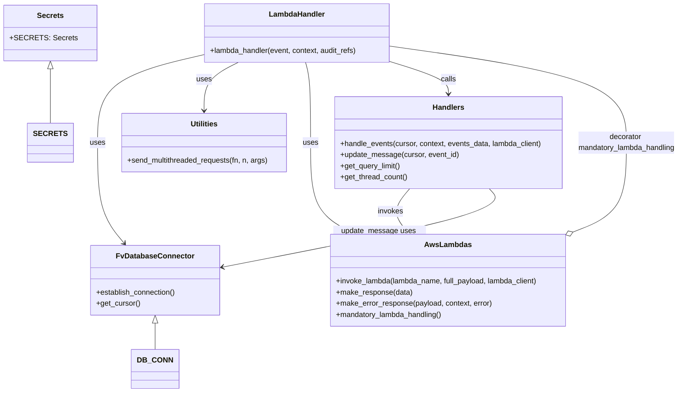

# Diagram: shipment_core/shipment_service/shipment_service/replay/replay.py


> Auto-generated by Obscura crawlers

## Diagram 1



### SVG

<svg id="container" width="1459.40234375" xmlns="http://www.w3.org/2000/svg" class="classDiagram" height="844" viewBox="0 0 1459.40234375 844" role="graphics-document document" aria-roledescription="class"><style>#container{font-family:"trebuchet ms",verdana,arial,sans-serif;font-size:16px;fill:#333;}@keyframes edge-animation-frame{from{stroke-dashoffset:0;}}@keyframes dash{to{stroke-dashoffset:0;}}#container .edge-animation-slow{stroke-dasharray:9,5!important;stroke-dashoffset:900;animation:dash 50s linear infinite;stroke-linecap:round;}#container .edge-animation-fast{stroke-dasharray:9,5!important;stroke-dashoffset:900;animation:dash 20s linear infinite;stroke-linecap:round;}#container .error-icon{fill:#552222;}#container .error-text{fill:#552222;stroke:#552222;}#container .edge-thickness-normal{stroke-width:1px;}#container .edge-thickness-thick{stroke-width:3.5px;}#container .edge-pattern-solid{stroke-dasharray:0;}#container .edge-thickness-invisible{stroke-width:0;fill:none;}#container .edge-pattern-dashed{stroke-dasharray:3;}#container .edge-pattern-dotted{stroke-dasharray:2;}#container .marker{fill:#333333;stroke:#333333;}#container .marker.cross{stroke:#333333;}#container svg{font-family:"trebuchet ms",verdana,arial,sans-serif;font-size:16px;}#container p{margin:0;}#container g.classGroup text{fill:#9370DB;stroke:none;font-family:"trebuchet ms",verdana,arial,sans-serif;font-size:10px;}#container g.classGroup text .title{font-weight:bolder;}#container .nodeLabel,#container .edgeLabel{color:#131300;}#container .edgeLabel .label rect{fill:#ECECFF;}#container .label text{fill:#131300;}#container .labelBkg{background:#ECECFF;}#container .edgeLabel .label span{background:#ECECFF;}#container .classTitle{font-weight:bolder;}#container .node rect,#container .node circle,#container .node ellipse,#container .node polygon,#container .node path{fill:#ECECFF;stroke:#9370DB;stroke-width:1px;}#container .divider{stroke:#9370DB;stroke-width:1;}#container g.clickable{cursor:pointer;}#container g.classGroup rect{fill:#ECECFF;stroke:#9370DB;}#container g.classGroup line{stroke:#9370DB;stroke-width:1;}#container .classLabel .box{stroke:none;stroke-width:0;fill:#ECECFF;opacity:0.5;}#container .classLabel .label{fill:#9370DB;font-size:10px;}#container .relation{stroke:#333333;stroke-width:1;fill:none;}#container .dashed-line{stroke-dasharray:3;}#container .dotted-line{stroke-dasharray:1 2;}#container #compositionStart,#container .composition{fill:#333333!important;stroke:#333333!important;stroke-width:1;}#container #compositionEnd,#container .composition{fill:#333333!important;stroke:#333333!important;stroke-width:1;}#container #dependencyStart,#container .dependency{fill:#333333!important;stroke:#333333!important;stroke-width:1;}#container #dependencyStart,#container .dependency{fill:#333333!important;stroke:#333333!important;stroke-width:1;}#container #extensionStart,#container .extension{fill:transparent!important;stroke:#333333!important;stroke-width:1;}#container #extensionEnd,#container .extension{fill:transparent!important;stroke:#333333!important;stroke-width:1;}#container #aggregationStart,#container .aggregation{fill:transparent!important;stroke:#333333!important;stroke-width:1;}#container #aggregationEnd,#container .aggregation{fill:transparent!important;stroke:#333333!important;stroke-width:1;}#container #lollipopStart,#container .lollipop{fill:#ECECFF!important;stroke:#333333!important;stroke-width:1;}#container #lollipopEnd,#container .lollipop{fill:#ECECFF!important;stroke:#333333!important;stroke-width:1;}#container .edgeTerminals{font-size:11px;line-height:initial;}#container .classTitleText{text-anchor:middle;font-size:18px;fill:#333;}#container .label-icon{display:inline-block;height:1em;overflow:visible;vertical-align:-0.125em;}#container .node .label-icon path{fill:currentColor;stroke:revert;stroke-width:revert;}#container :root{--mermaid-font-family:"trebuchet ms",verdana,arial,sans-serif;}</style><g><defs><marker id="container_class-aggregationStart" class="marker aggregation class" refX="18" refY="7" markerWidth="190" markerHeight="240" orient="auto"><path d="M 18,7 L9,13 L1,7 L9,1 Z"></path></marker></defs><defs><marker id="container_class-aggregationEnd" class="marker aggregation class" refX="1" refY="7" markerWidth="20" markerHeight="28" orient="auto"><path d="M 18,7 L9,13 L1,7 L9,1 Z"></path></marker></defs><defs><marker id="container_class-extensionStart" class="marker extension class" refX="18" refY="7" markerWidth="190" markerHeight="240" orient="auto"><path d="M 1,7 L18,13 V 1 Z"></path></marker></defs><defs><marker id="container_class-extensionEnd" class="marker extension class" refX="1" refY="7" markerWidth="20" markerHeight="28" orient="auto"><path d="M 1,1 V 13 L18,7 Z"></path></marker></defs><defs><marker id="container_class-compositionStart" class="marker composition class" refX="18" refY="7" markerWidth="190" markerHeight="240" orient="auto"><path d="M 18,7 L9,13 L1,7 L9,1 Z"></path></marker></defs><defs><marker id="container_class-compositionEnd" class="marker composition class" refX="1" refY="7" markerWidth="20" markerHeight="28" orient="auto"><path d="M 18,7 L9,13 L1,7 L9,1 Z"></path></marker></defs><defs><marker id="container_class-dependencyStart" class="marker dependency class" refX="6" refY="7" markerWidth="190" markerHeight="240" orient="auto"><path d="M 5,7 L9,13 L1,7 L9,1 Z"></path></marker></defs><defs><marker id="container_class-dependencyEnd" class="marker dependency class" refX="13" refY="7" markerWidth="20" markerHeight="28" orient="auto"><path d="M 18,7 L9,13 L14,7 L9,1 Z"></path></marker></defs><defs><marker id="container_class-lollipopStart" class="marker lollipop class" refX="13" refY="7" markerWidth="190" markerHeight="240" orient="auto"><circle stroke="black" fill="transparent" cx="7" cy="7" r="6"></circle></marker></defs><defs><marker id="container_class-lollipopEnd" class="marker lollipop class" refX="1" refY="7" markerWidth="190" markerHeight="240" orient="auto"><circle stroke="black" fill="transparent" cx="7" cy="7" r="6"></circle></marker></defs><g class="root"><g class="clusters"></g><g class="edgePaths"><path d="M98.152,148.25L98.152,152.042C98.152,155.833,98.152,163.417,98.152,182.875C98.152,202.333,98.152,233.667,98.152,249.333L98.152,265" id="id_Secrets_SECRETS_1" class="edge-thickness-normal edge-pattern-solid relation" style=";;;" data-edge="true" data-et="edge" data-id="id_Secrets_SECRETS_1" data-points="W3sieCI6OTguMTUyMzQzNzUsInkiOjEzMX0seyJ4Ijo5OC4xNTIzNDM3NSwieSI6MTcxfSx7IngiOjk4LjE1MjM0Mzc1LCJ5IjoyNjV9XQ==" marker-start="url(#container_class-extensionStart)"></path><path d="M316.529,695.25L316.529,700.542C316.529,705.833,316.529,716.417,316.529,725.875C316.529,735.333,316.529,743.667,316.529,747.833L316.529,752" id="id_FvDatabaseConnector_DB_CONN_2" class="edge-thickness-normal edge-pattern-solid relation" style=";;;" data-edge="true" data-et="edge" data-id="id_FvDatabaseConnector_DB_CONN_2" data-points="W3sieCI6MzE2LjUyOTI5Njg3NSwieSI6Njc4fSx7IngiOjMxNi41MjkyOTY4NzUsInkiOjcyN30seyJ4IjozMTYuNTI5Mjk2ODc1LCJ5Ijo3NTJ9XQ==" marker-start="url(#container_class-extensionStart)"></path><path d="M426.297,117.378L387.381,126.315C348.465,135.252,270.633,153.126,231.717,184.73C192.801,216.333,192.801,261.667,192.801,309C192.801,356.333,192.801,405.667,202.331,441.733C211.861,477.799,230.921,500.598,240.451,511.997L249.981,523.397" id="id_LambdaHandler_FvDatabaseConnector_3" class="edge-thickness-normal edge-pattern-solid relation" style=";;;" data-edge="true" data-et="edge" data-id="id_LambdaHandler_FvDatabaseConnector_3" data-points="W3sieCI6NDI2LjI5Njg3NSwieSI6MTE3LjM3ODExMTY4NDIzNDE0fSx7IngiOjE5Mi44MDA3ODEyNSwieSI6MTcxfSx7IngiOjE5Mi44MDA3ODEyNSwieSI6MzA3fSx7IngiOjE5Mi44MDA3ODEyNSwieSI6NDU1fSx7IngiOjI1My44MjkwMzU1Nzg1NDczLCJ5Ijo1Mjh9XQ==" marker-end="url(#container_class-dependencyEnd)"></path><path d="M499.836,134L487.266,140.167C474.697,146.333,449.557,158.667,436.988,176C424.418,193.333,424.418,215.667,424.418,226.833L424.418,238" id="id_LambdaHandler_Utilities_4" class="edge-thickness-normal edge-pattern-solid relation" style=";;;" data-edge="true" data-et="edge" data-id="id_LambdaHandler_Utilities_4" data-points="W3sieCI6NDk5LjgzNTgyMDMxMjUsInkiOjEzNH0seyJ4Ijo0MjQuNDE3OTY4NzUsInkiOjE3MX0seyJ4Ijo0MjQuNDE3OTY4NzUsInkiOjI0NH1d" marker-end="url(#container_class-dependencyEnd)"></path><path d="M645.755,134L647.468,140.167C649.181,146.333,652.608,158.667,654.322,187.5C656.035,216.333,656.035,261.667,656.035,309C656.035,356.333,656.035,405.667,671.532,438.054C687.028,470.441,718.021,485.883,733.518,493.604L749.015,501.324" id="id_LambdaHandler_AwsLambdas_5" class="edge-thickness-normal edge-pattern-solid relation" style=";;;" data-edge="true" data-et="edge" data-id="id_LambdaHandler_AwsLambdas_5" data-points="W3sieCI6NjQ1Ljc1NDY0ODQzNzUsInkiOjEzNH0seyJ4Ijo2NTYuMDM1MTU2MjUsInkiOjE3MX0seyJ4Ijo2NTYuMDM1MTU2MjUsInkiOjMwN30seyJ4Ijo2NTYuMDM1MTU2MjUsInkiOjQ1NX0seyJ4Ijo3NTQuMzg0OTg5OTcwNDM5MiwieSI6NTA0fV0=" marker-end="url(#container_class-dependencyEnd)"></path><path d="M830.203,132.787L851.02,139.156C871.837,145.524,913.471,158.262,934.288,169.798C955.105,181.333,955.105,191.667,955.105,196.833L955.105,202" id="id_LambdaHandler_Handlers_6" class="edge-thickness-normal edge-pattern-solid relation" style=";;;" data-edge="true" data-et="edge" data-id="id_LambdaHandler_Handlers_6" data-points="W3sieCI6ODMwLjIwMzEyNSwieSI6MTMyLjc4NjY3NDYzNDAwMDZ9LHsieCI6OTU1LjEwNTQ2ODc1LCJ5IjoxNzF9LHsieCI6OTU1LjEwNTQ2ODc1LCJ5IjoyMDh9XQ==" marker-end="url(#container_class-dependencyEnd)"></path><path d="M870.994,406L864.056,414.167C857.117,422.333,843.24,438.667,842.488,454.233C841.735,469.799,854.107,484.598,860.293,491.997L866.479,499.397" id="id_Handlers_AwsLambdas_7" class="edge-thickness-normal edge-pattern-solid relation" style=";;;" data-edge="true" data-et="edge" data-id="id_Handlers_AwsLambdas_7" data-points="W3sieCI6ODcwLjk5NDE0MDYyNSwieSI6NDA2fSx7IngiOjgyOS4zNjMyODEyNSwieSI6NDU1fSx7IngiOjg3MC4zMjc0NTE5NjM2ODI0LCJ5Ijo1MDR9XQ==" marker-end="url(#container_class-dependencyEnd)"></path><path d="M1045.221,406L1052.655,414.167C1060.089,422.333,1074.957,438.667,977.538,466.901C880.119,495.135,670.413,535.271,565.56,555.338L460.707,575.406" id="id_Handlers_FvDatabaseConnector_8" class="edge-thickness-normal edge-pattern-solid relation" style=";;;" data-edge="true" data-et="edge" data-id="id_Handlers_FvDatabaseConnector_8" data-points="W3sieCI6MTA0NS4yMjEzODkzNTgxMDgxLCJ5Ijo0MDZ9LHsieCI6MTA4OS44MjQyMTg3NSwieSI6NDU1fSx7IngiOjQ1NC44MTQ0NTMxMjUsInkiOjU3Ni41MzM3Njc1ODg0Njk2fV0=" marker-end="url(#container_class-dependencyEnd)"></path><path d="M1225.95,499.838L1245.715,492.365C1265.481,484.892,1305.012,469.946,1324.777,437.806C1344.543,405.667,1344.543,356.333,1344.543,309C1344.543,261.667,1344.543,216.333,1258.82,181.699C1173.096,147.065,1001.65,123.129,915.926,111.162L830.203,99.194" id="id_AwsLambdas_LambdaHandler_9" class="edge-thickness-normal edge-pattern-solid relation" style=";;;" data-edge="true" data-et="edge" data-id="id_AwsLambdas_LambdaHandler_9" data-points="W3sieCI6MTIwOS44MTQ0NTMxMjUsInkiOjUwNS45MzgyMDU2OTQ5NTUyfSx7IngiOjEzNDQuNTQyOTY4NzUsInkiOjQ1NX0seyJ4IjoxMzQ0LjU0Mjk2ODc1LCJ5IjozMDd9LHsieCI6MTM0NC41NDI5Njg3NSwieSI6MTcxfSx7IngiOjgzMC4yMDMxMjUsInkiOjk5LjE5NDIwNzM3MTkzOTk0fV0=" marker-start="url(#container_class-aggregationStart)"></path></g><g class="edgeLabels"><g class="edgeLabel"><g class="label" data-id="id_Secrets_SECRETS_1" transform="translate(0, 0)"><foreignObject width="0" height="0"><div xmlns="http://www.w3.org/1999/xhtml" class="labelBkg" style="display: table-cell; white-space: nowrap; line-height: 1.5; max-width: 200px; text-align: center;"><span class="edgeLabel"></span></div></foreignObject></g></g><g class="edgeLabel"><g class="label" data-id="id_FvDatabaseConnector_DB_CONN_2" transform="translate(0, 0)"><foreignObject width="0" height="0"><div xmlns="http://www.w3.org/1999/xhtml" class="labelBkg" style="display: table-cell; white-space: nowrap; line-height: 1.5; max-width: 200px; text-align: center;"><span class="edgeLabel"></span></div></foreignObject></g></g><g class="edgeLabel" transform="translate(192.80078125, 307)"><g class="label" data-id="id_LambdaHandler_FvDatabaseConnector_3" transform="translate(-16.4921875, -12)"><foreignObject width="32.984375" height="24"><div xmlns="http://www.w3.org/1999/xhtml" class="labelBkg" style="display: table-cell; white-space: nowrap; line-height: 1.5; max-width: 200px; text-align: center;"><span class="edgeLabel"><p>uses</p></span></div></foreignObject></g></g><g class="edgeLabel" transform="translate(424.41796875, 171)"><g class="label" data-id="id_LambdaHandler_Utilities_4" transform="translate(-16.4921875, -12)"><foreignObject width="32.984375" height="24"><div xmlns="http://www.w3.org/1999/xhtml" class="labelBkg" style="display: table-cell; white-space: nowrap; line-height: 1.5; max-width: 200px; text-align: center;"><span class="edgeLabel"><p>uses</p></span></div></foreignObject></g></g><g class="edgeLabel" transform="translate(656.03515625, 307)"><g class="label" data-id="id_LambdaHandler_AwsLambdas_5" transform="translate(-16.4921875, -12)"><foreignObject width="32.984375" height="24"><div xmlns="http://www.w3.org/1999/xhtml" class="labelBkg" style="display: table-cell; white-space: nowrap; line-height: 1.5; max-width: 200px; text-align: center;"><span class="edgeLabel"><p>uses</p></span></div></foreignObject></g></g><g class="edgeLabel" transform="translate(955.10546875, 171)"><g class="label" data-id="id_LambdaHandler_Handlers_6" transform="translate(-16.4453125, -12)"><foreignObject width="32.890625" height="24"><div xmlns="http://www.w3.org/1999/xhtml" class="labelBkg" style="display: table-cell; white-space: nowrap; line-height: 1.5; max-width: 200px; text-align: center;"><span class="edgeLabel"><p>calls</p></span></div></foreignObject></g></g><g class="edgeLabel" transform="translate(829.50237, 454.83629)"><g class="label" data-id="id_Handlers_AwsLambdas_7" transform="translate(-27.5859375, -12)"><foreignObject width="55.171875" height="24"><div xmlns="http://www.w3.org/1999/xhtml" class="labelBkg" style="display: table-cell; white-space: nowrap; line-height: 1.5; max-width: 200px; text-align: center;"><span class="edgeLabel"><p>invokes</p></span></div></foreignObject></g></g><g class="edgeLabel" transform="translate(804.85883, 509.53919)"><g class="label" data-id="id_Handlers_FvDatabaseConnector_8" transform="translate(-100, -24)"><foreignObject width="200" height="48"><div xmlns="http://www.w3.org/1999/xhtml" class="labelBkg" style="display: table; white-space: break-spaces; line-height: 1.5; max-width: 200px; text-align: center; width: 200px;"><span class="edgeLabel"><p>update_message uses cursor</p></span></div></foreignObject></g></g><g class="edgeLabel" transform="translate(1344.54296875, 307)"><g class="label" data-id="id_AwsLambdas_LambdaHandler_9" transform="translate(-106.859375, -24)"><foreignObject width="213.71875" height="48"><div xmlns="http://www.w3.org/1999/xhtml" class="labelBkg" style="display: table; white-space: break-spaces; line-height: 1.5; max-width: 200px; text-align: center; width: 200px;"><span class="edgeLabel"><p>decorator mandatory_lambda_handling</p></span></div></foreignObject></g></g></g><g class="nodes"><g class="node default" id="classId-Secrets-0" transform="translate(98.15234375, 71)"><g class="basic label-container"><path d="M-90.15234375 -60 L90.15234375 -60 L90.15234375 60 L-90.15234375 60" stroke="none" stroke-width="0" fill="#ECECFF" style=""></path><path d="M-90.15234375 -60 C-22.930346595102066 -60, 44.29165055979587 -60, 90.15234375 -60 M-90.15234375 -60 C-23.76368778561711 -60, 42.62496817876578 -60, 90.15234375 -60 M90.15234375 -60 C90.15234375 -18.160958024444795, 90.15234375 23.67808395111041, 90.15234375 60 M90.15234375 -60 C90.15234375 -21.510797796738217, 90.15234375 16.978404406523566, 90.15234375 60 M90.15234375 60 C37.706448462838225 60, -14.73944682432355 60, -90.15234375 60 M90.15234375 60 C22.3912495159027 60, -45.3698447181946 60, -90.15234375 60 M-90.15234375 60 C-90.15234375 21.78194481410138, -90.15234375 -16.43611037179724, -90.15234375 -60 M-90.15234375 60 C-90.15234375 28.56394857633116, -90.15234375 -2.872102847337679, -90.15234375 -60" stroke="#9370DB" stroke-width="1.3" fill="none" stroke-dasharray="0 0" style=""></path></g><g class="annotation-group text" transform="translate(0, -36)"></g><g class="label-group text" transform="translate(-27.1640625, -36)"><g class="label" style="font-weight: bolder" transform="translate(0,-12)"><foreignObject width="54.328125" height="24"><div xmlns="http://www.w3.org/1999/xhtml" style="display: table-cell; white-space: nowrap; line-height: 1.5; max-width: 103px; text-align: center;"><span class="nodeLabel markdown-node-label" style=""><p>Secrets</p></span></div></foreignObject></g></g><g class="members-group text" transform="translate(-78.15234375, 12)"><g class="label" style="" transform="translate(0,-12)"><foreignObject width="129.140625" height="24"><div xmlns="http://www.w3.org/1999/xhtml" style="display: table-cell; white-space: nowrap; line-height: 1.5; max-width: 187px; text-align: center;"><span class="nodeLabel markdown-node-label" style=""><p>+SECRETS: Secrets</p></span></div></foreignObject></g></g><g class="methods-group text" transform="translate(-78.15234375, 60)"></g><g class="divider" style=""><path d="M-90.15234375 -12 C-36.32210284330948 -12, 17.50813806338104 -12, 90.15234375 -12 M-90.15234375 -12 C-19.629988142046784 -12, 50.89236746590643 -12, 90.15234375 -12" stroke="#9370DB" stroke-width="1.3" fill="none" stroke-dasharray="0 0" style=""></path></g><g class="divider" style=""><path d="M-90.15234375 36 C-23.95166530536767 36, 42.24901313926466 36, 90.15234375 36 M-90.15234375 36 C-46.93655606452913 36, -3.7207683790582564 36, 90.15234375 36" stroke="#9370DB" stroke-width="1.3" fill="none" stroke-dasharray="0 0" style=""></path></g></g><g class="node default" id="classId-FvDatabaseConnector-1" transform="translate(316.529296875, 603)"><g class="basic label-container"><path d="M-138.28515625 -75 L138.28515625 -75 L138.28515625 75 L-138.28515625 75" stroke="none" stroke-width="0" fill="#ECECFF" style=""></path><path d="M-138.28515625 -75 C-63.93405111459819 -75, 10.417054020803619 -75, 138.28515625 -75 M-138.28515625 -75 C-59.304512294644255 -75, 19.67613166071149 -75, 138.28515625 -75 M138.28515625 -75 C138.28515625 -25.098074432616585, 138.28515625 24.80385113476683, 138.28515625 75 M138.28515625 -75 C138.28515625 -17.195852951540964, 138.28515625 40.60829409691807, 138.28515625 75 M138.28515625 75 C72.27431875478716 75, 6.26348125957432 75, -138.28515625 75 M138.28515625 75 C70.30858198965144 75, 2.3320077293028874 75, -138.28515625 75 M-138.28515625 75 C-138.28515625 43.986894159834364, -138.28515625 12.973788319668728, -138.28515625 -75 M-138.28515625 75 C-138.28515625 19.750476696312333, -138.28515625 -35.499046607375334, -138.28515625 -75" stroke="#9370DB" stroke-width="1.3" fill="none" stroke-dasharray="0 0" style=""></path></g><g class="annotation-group text" transform="translate(0, -51)"></g><g class="label-group text" transform="translate(-79.3046875, -51)"><g class="label" style="font-weight: bolder" transform="translate(0,-12)"><foreignObject width="158.609375" height="24"><div xmlns="http://www.w3.org/1999/xhtml" style="display: table-cell; white-space: nowrap; line-height: 1.5; max-width: 207px; text-align: center;"><span class="nodeLabel markdown-node-label" style=""><p>FvDatabaseConnector</p></span></div></foreignObject></g></g><g class="members-group text" transform="translate(-126.28515625, -3)"></g><g class="methods-group text" transform="translate(-126.28515625, 27)"><g class="label" style="" transform="translate(0,-12)"><foreignObject width="173.265625" height="24"><div xmlns="http://www.w3.org/1999/xhtml" style="display: table-cell; white-space: nowrap; line-height: 1.5; max-width: 231px; text-align: center;"><span class="nodeLabel markdown-node-label" style=""><p>+establish_connection()</p></span></div></foreignObject></g><g class="label" style="" transform="translate(0,12)"><foreignObject width="94.640625" height="24"><div xmlns="http://www.w3.org/1999/xhtml" style="display: table-cell; white-space: nowrap; line-height: 1.5; max-width: 152px; text-align: center;"><span class="nodeLabel markdown-node-label" style=""><p>+get_cursor()</p></span></div></foreignObject></g></g><g class="divider" style=""><path d="M-138.28515625 -27 C-79.65185837414309 -27, -21.018560498286178 -27, 138.28515625 -27 M-138.28515625 -27 C-75.10506149524988 -27, -11.924966740499755 -27, 138.28515625 -27" stroke="#9370DB" stroke-width="1.3" fill="none" stroke-dasharray="0 0" style=""></path></g><g class="divider" style=""><path d="M-138.28515625 -3 C-78.31591014766614 -3, -18.34666404533229 -3, 138.28515625 -3 M-138.28515625 -3 C-63.049161227763236 -3, 12.186833794473529 -3, 138.28515625 -3" stroke="#9370DB" stroke-width="1.3" fill="none" stroke-dasharray="0 0" style=""></path></g></g><g class="node default" id="classId-LambdaHandler-2" transform="translate(628.25, 71)"><g class="basic label-container"><path d="M-201.953125 -63 L201.953125 -63 L201.953125 63 L-201.953125 63" stroke="none" stroke-width="0" fill="#ECECFF" style=""></path><path d="M-201.953125 -63 C-103.11641722403368 -63, -4.279709448067365 -63, 201.953125 -63 M-201.953125 -63 C-85.08582252558129 -63, 31.781479948837415 -63, 201.953125 -63 M201.953125 -63 C201.953125 -25.66292663949247, 201.953125 11.674146721015063, 201.953125 63 M201.953125 -63 C201.953125 -30.244883855028803, 201.953125 2.510232289942394, 201.953125 63 M201.953125 63 C64.15640069552825 63, -73.6403236089435 63, -201.953125 63 M201.953125 63 C83.22811938581482 63, -35.49688622837036 63, -201.953125 63 M-201.953125 63 C-201.953125 29.319797038137665, -201.953125 -4.36040592372467, -201.953125 -63 M-201.953125 63 C-201.953125 36.83642330892131, -201.953125 10.672846617842623, -201.953125 -63" stroke="#9370DB" stroke-width="1.3" fill="none" stroke-dasharray="0 0" style=""></path></g><g class="annotation-group text" transform="translate(0, -39)"></g><g class="label-group text" transform="translate(-58.21875, -39)"><g class="label" style="font-weight: bolder" transform="translate(0,-12)"><foreignObject width="116.4375" height="24"><div xmlns="http://www.w3.org/1999/xhtml" style="display: table-cell; white-space: nowrap; line-height: 1.5; max-width: 167px; text-align: center;"><span class="nodeLabel markdown-node-label" style=""><p>LambdaHandler</p></span></div></foreignObject></g></g><g class="members-group text" transform="translate(-189.953125, 9)"></g><g class="methods-group text" transform="translate(-189.953125, 39)"><g class="label" style="" transform="translate(0,-12)"><foreignObject width="321.6875" height="24"><div xmlns="http://www.w3.org/1999/xhtml" style="display: table-cell; white-space: nowrap; line-height: 1.5; max-width: 379px; text-align: center;"><span class="nodeLabel markdown-node-label" style=""><p>+lambda_handler(event, context, audit_refs)</p></span></div></foreignObject></g></g><g class="divider" style=""><path d="M-201.953125 -15 C-107.43710882558231 -15, -12.921092651164628 -15, 201.953125 -15 M-201.953125 -15 C-73.66085114222699 -15, 54.63142271554602 -15, 201.953125 -15" stroke="#9370DB" stroke-width="1.3" fill="none" stroke-dasharray="0 0" style=""></path></g><g class="divider" style=""><path d="M-201.953125 9 C-45.04801617785583 9, 111.85709264428834 9, 201.953125 9 M-201.953125 9 C-61.771890766073795 9, 78.40934346785241 9, 201.953125 9" stroke="#9370DB" stroke-width="1.3" fill="none" stroke-dasharray="0 0" style=""></path></g></g><g class="node default" id="classId-Handlers-3" transform="translate(955.10546875, 307)"><g class="basic label-container"><path d="M-247.578125 -99 L247.578125 -99 L247.578125 99 L-247.578125 99" stroke="none" stroke-width="0" fill="#ECECFF" style=""></path><path d="M-247.578125 -99 C-65.19091703468143 -99, 117.19629093063713 -99, 247.578125 -99 M-247.578125 -99 C-102.86260289267929 -99, 41.85291921464142 -99, 247.578125 -99 M247.578125 -99 C247.578125 -30.61864479690705, 247.578125 37.7627104061859, 247.578125 99 M247.578125 -99 C247.578125 -33.21992878420721, 247.578125 32.560142431585575, 247.578125 99 M247.578125 99 C108.34473854422478 99, -30.888647911550436 99, -247.578125 99 M247.578125 99 C121.31174013290453 99, -4.954644734190936 99, -247.578125 99 M-247.578125 99 C-247.578125 37.036741852885534, -247.578125 -24.926516294228932, -247.578125 -99 M-247.578125 99 C-247.578125 46.24869404685958, -247.578125 -6.502611906280833, -247.578125 -99" stroke="#9370DB" stroke-width="1.3" fill="none" stroke-dasharray="0 0" style=""></path></g><g class="annotation-group text" transform="translate(0, -75)"></g><g class="label-group text" transform="translate(-32.859375, -75)"><g class="label" style="font-weight: bolder" transform="translate(0,-12)"><foreignObject width="65.71875" height="24"><div xmlns="http://www.w3.org/1999/xhtml" style="display: table-cell; white-space: nowrap; line-height: 1.5; max-width: 115px; text-align: center;"><span class="nodeLabel markdown-node-label" style=""><p>Handlers</p></span></div></foreignObject></g></g><g class="members-group text" transform="translate(-235.578125, -27)"></g><g class="methods-group text" transform="translate(-235.578125, 3)"><g class="label" style="" transform="translate(0,-12)"><foreignObject width="438.296875" height="24"><div xmlns="http://www.w3.org/1999/xhtml" style="display: table-cell; white-space: nowrap; line-height: 1.5; max-width: 496px; text-align: center;"><span class="nodeLabel markdown-node-label" style=""><p>+handle_events(cursor, context, events_data, lambda_client)</p></span></div></foreignObject></g><g class="label" style="" transform="translate(0,12)"><foreignObject width="255.359375" height="24"><div xmlns="http://www.w3.org/1999/xhtml" style="display: table-cell; white-space: nowrap; line-height: 1.5; max-width: 313px; text-align: center;"><span class="nodeLabel markdown-node-label" style=""><p>+update_message(cursor, event_id)</p></span></div></foreignObject></g><g class="label" style="" transform="translate(0,36)"><foreignObject width="131.453125" height="24"><div xmlns="http://www.w3.org/1999/xhtml" style="display: table-cell; white-space: nowrap; line-height: 1.5; max-width: 189px; text-align: center;"><span class="nodeLabel markdown-node-label" style=""><p>+get_query_limit()</p></span></div></foreignObject></g><g class="label" style="" transform="translate(0,60)"><foreignObject width="145.734375" height="24"><div xmlns="http://www.w3.org/1999/xhtml" style="display: table-cell; white-space: nowrap; line-height: 1.5; max-width: 203px; text-align: center;"><span class="nodeLabel markdown-node-label" style=""><p>+get_thread_count()</p></span></div></foreignObject></g></g><g class="divider" style=""><path d="M-247.578125 -51 C-50.90970557419075 -51, 145.7587138516185 -51, 247.578125 -51 M-247.578125 -51 C-110.26994044580084 -51, 27.038244108398317 -51, 247.578125 -51" stroke="#9370DB" stroke-width="1.3" fill="none" stroke-dasharray="0 0" style=""></path></g><g class="divider" style=""><path d="M-247.578125 -27 C-113.06959669157825 -27, 21.43893161684349 -27, 247.578125 -27 M-247.578125 -27 C-82.36641299813647 -27, 82.84529900372706 -27, 247.578125 -27" stroke="#9370DB" stroke-width="1.3" fill="none" stroke-dasharray="0 0" style=""></path></g></g><g class="node default" id="classId-AwsLambdas-4" transform="translate(953.091796875, 603)"><g class="basic label-container"><path d="M-256.72265625 -99 L256.72265625 -99 L256.72265625 99 L-256.72265625 99" stroke="none" stroke-width="0" fill="#ECECFF" style=""></path><path d="M-256.72265625 -99 C-141.02461812313837 -99, -25.326579996276735 -99, 256.72265625 -99 M-256.72265625 -99 C-132.07239418290948 -99, -7.4221321158189255 -99, 256.72265625 -99 M256.72265625 -99 C256.72265625 -38.05484514225359, 256.72265625 22.89030971549282, 256.72265625 99 M256.72265625 -99 C256.72265625 -34.10940559997708, 256.72265625 30.78118880004584, 256.72265625 99 M256.72265625 99 C135.24875384373348 99, 13.774851437466964 99, -256.72265625 99 M256.72265625 99 C119.54784531852232 99, -17.62696561295536 99, -256.72265625 99 M-256.72265625 99 C-256.72265625 43.658499625464074, -256.72265625 -11.683000749071851, -256.72265625 -99 M-256.72265625 99 C-256.72265625 47.27095511856095, -256.72265625 -4.458089762878103, -256.72265625 -99" stroke="#9370DB" stroke-width="1.3" fill="none" stroke-dasharray="0 0" style=""></path></g><g class="annotation-group text" transform="translate(0, -75)"></g><g class="label-group text" transform="translate(-47.4921875, -75)"><g class="label" style="font-weight: bolder" transform="translate(0,-12)"><foreignObject width="94.984375" height="24"><div xmlns="http://www.w3.org/1999/xhtml" style="display: table-cell; white-space: nowrap; line-height: 1.5; max-width: 143px; text-align: center;"><span class="nodeLabel markdown-node-label" style=""><p>AwsLambdas</p></span></div></foreignObject></g></g><g class="members-group text" transform="translate(-244.72265625, -27)"></g><g class="methods-group text" transform="translate(-244.72265625, 3)"><g class="label" style="" transform="translate(0,-12)"><foreignObject width="441.953125" height="24"><div xmlns="http://www.w3.org/1999/xhtml" style="display: table-cell; white-space: nowrap; line-height: 1.5; max-width: 499px; text-align: center;"><span class="nodeLabel markdown-node-label" style=""><p>+invoke_lambda(lambda_name, full_payload, lambda_client)</p></span></div></foreignObject></g><g class="label" style="" transform="translate(0,12)"><foreignObject width="164.484375" height="24"><div xmlns="http://www.w3.org/1999/xhtml" style="display: table-cell; white-space: nowrap; line-height: 1.5; max-width: 222px; text-align: center;"><span class="nodeLabel markdown-node-label" style=""><p>+make_response(data)</p></span></div></foreignObject></g><g class="label" style="" transform="translate(0,36)"><foreignObject width="338.453125" height="24"><div xmlns="http://www.w3.org/1999/xhtml" style="display: table-cell; white-space: nowrap; line-height: 1.5; max-width: 396px; text-align: center;"><span class="nodeLabel markdown-node-label" style=""><p>+make_error_response(payload, context, error)</p></span></div></foreignObject></g><g class="label" style="" transform="translate(0,60)"><foreignObject width="232.078125" height="24"><div xmlns="http://www.w3.org/1999/xhtml" style="display: table-cell; white-space: nowrap; line-height: 1.5; max-width: 289px; text-align: center;"><span class="nodeLabel markdown-node-label" style=""><p>+mandatory_lambda_handling()</p></span></div></foreignObject></g></g><g class="divider" style=""><path d="M-256.72265625 -51 C-124.54500210685723 -51, 7.632652036285549 -51, 256.72265625 -51 M-256.72265625 -51 C-110.29567123611179 -51, 36.13131377777643 -51, 256.72265625 -51" stroke="#9370DB" stroke-width="1.3" fill="none" stroke-dasharray="0 0" style=""></path></g><g class="divider" style=""><path d="M-256.72265625 -27 C-65.75203251862729 -27, 125.21859121274542 -27, 256.72265625 -27 M-256.72265625 -27 C-59.053511635839726 -27, 138.61563297832055 -27, 256.72265625 -27" stroke="#9370DB" stroke-width="1.3" fill="none" stroke-dasharray="0 0" style=""></path></g></g><g class="node default" id="classId-Utilities-5" transform="translate(424.41796875, 307)"><g class="basic label-container"><path d="M-180.125 -63 L180.125 -63 L180.125 63 L-180.125 63" stroke="none" stroke-width="0" fill="#ECECFF" style=""></path><path d="M-180.125 -63 C-84.8559255352278 -63, 10.413148929544406 -63, 180.125 -63 M-180.125 -63 C-66.88005202844397 -63, 46.36489594311206 -63, 180.125 -63 M180.125 -63 C180.125 -29.068205129404944, 180.125 4.863589741190111, 180.125 63 M180.125 -63 C180.125 -17.343371533111096, 180.125 28.313256933777808, 180.125 63 M180.125 63 C80.4890458331532 63, -19.146908333693602 63, -180.125 63 M180.125 63 C93.17916784273952 63, 6.233335685479034 63, -180.125 63 M-180.125 63 C-180.125 16.181294935018705, -180.125 -30.63741012996259, -180.125 -63 M-180.125 63 C-180.125 34.87371318508363, -180.125 6.747426370167261, -180.125 -63" stroke="#9370DB" stroke-width="1.3" fill="none" stroke-dasharray="0 0" style=""></path></g><g class="annotation-group text" transform="translate(0, -39)"></g><g class="label-group text" transform="translate(-28.8125, -39)"><g class="label" style="font-weight: bolder" transform="translate(0,-12)"><foreignObject width="57.625" height="24"><div xmlns="http://www.w3.org/1999/xhtml" style="display: table-cell; white-space: nowrap; line-height: 1.5; max-width: 107px; text-align: center;"><span class="nodeLabel markdown-node-label" style=""><p>Utilities</p></span></div></foreignObject></g></g><g class="members-group text" transform="translate(-168.125, 9)"></g><g class="methods-group text" transform="translate(-168.125, 39)"><g class="label" style="" transform="translate(0,-12)"><foreignObject width="307.4375" height="24"><div xmlns="http://www.w3.org/1999/xhtml" style="display: table-cell; white-space: nowrap; line-height: 1.5; max-width: 365px; text-align: center;"><span class="nodeLabel markdown-node-label" style=""><p>+send_multithreaded_requests(fn, n, args)</p></span></div></foreignObject></g></g><g class="divider" style=""><path d="M-180.125 -15 C-104.42456571609388 -15, -28.72413143218776 -15, 180.125 -15 M-180.125 -15 C-105.54038645519633 -15, -30.955772910392653 -15, 180.125 -15" stroke="#9370DB" stroke-width="1.3" fill="none" stroke-dasharray="0 0" style=""></path></g><g class="divider" style=""><path d="M-180.125 9 C-97.41442348471705 9, -14.703846969434096 9, 180.125 9 M-180.125 9 C-50.29374998503124 9, 79.53750002993752 9, 180.125 9" stroke="#9370DB" stroke-width="1.3" fill="none" stroke-dasharray="0 0" style=""></path></g></g><g class="node default" id="classId-SECRETS-6" transform="translate(98.15234375, 307)"><g class="basic label-container"><path d="M-43.15625 -42 L43.15625 -42 L43.15625 42 L-43.15625 42" stroke="none" stroke-width="0" fill="#ECECFF" style=""></path><path d="M-43.15625 -42 C-10.015436749245069 -42, 23.125376501509862 -42, 43.15625 -42 M-43.15625 -42 C-12.767997968306993 -42, 17.620254063386014 -42, 43.15625 -42 M43.15625 -42 C43.15625 -18.005624911165835, 43.15625 5.988750177668329, 43.15625 42 M43.15625 -42 C43.15625 -13.606837618845173, 43.15625 14.786324762309654, 43.15625 42 M43.15625 42 C8.791489442108826 42, -25.573271115782347 42, -43.15625 42 M43.15625 42 C14.939449861537579 42, -13.277350276924842 42, -43.15625 42 M-43.15625 42 C-43.15625 14.404012157211415, -43.15625 -13.19197568557717, -43.15625 -42 M-43.15625 42 C-43.15625 21.59256507678756, -43.15625 1.1851301535751233, -43.15625 -42" stroke="#9370DB" stroke-width="1.3" fill="none" stroke-dasharray="0 0" style=""></path></g><g class="annotation-group text" transform="translate(0, -18)"></g><g class="label-group text" transform="translate(-31.15625, -18)"><g class="label" style="font-weight: bolder" transform="translate(0,-12)"><foreignObject width="62.3125" height="24"><div xmlns="http://www.w3.org/1999/xhtml" style="display: table-cell; white-space: nowrap; line-height: 1.5; max-width: 111px; text-align: center;"><span class="nodeLabel markdown-node-label" style=""><p>SECRETS</p></span></div></foreignObject></g></g><g class="members-group text" transform="translate(-31.15625, 30)"></g><g class="methods-group text" transform="translate(-31.15625, 60)"></g><g class="divider" style=""><path d="M-43.15625 6 C-21.3510785440318 6, 0.45409291193639945 6, 43.15625 6 M-43.15625 6 C-25.126093993178376 6, -7.095937986356752 6, 43.15625 6" stroke="#9370DB" stroke-width="1.3" fill="none" stroke-dasharray="0 0" style=""></path></g><g class="divider" style=""><path d="M-43.15625 24 C-25.203338943177307 24, -7.250427886354615 24, 43.15625 24 M-43.15625 24 C-15.729412489273255 24, 11.69742502145349 24, 43.15625 24" stroke="#9370DB" stroke-width="1.3" fill="none" stroke-dasharray="0 0" style=""></path></g></g><g class="node default" id="classId-DB_CONN-7" transform="translate(316.529296875, 794)"><g class="basic label-container"><path d="M-46.40625 -42 L46.40625 -42 L46.40625 42 L-46.40625 42" stroke="none" stroke-width="0" fill="#ECECFF" style=""></path><path d="M-46.40625 -42 C-11.245964042667161 -42, 23.914321914665678 -42, 46.40625 -42 M-46.40625 -42 C-24.313718366954735 -42, -2.2211867339094695 -42, 46.40625 -42 M46.40625 -42 C46.40625 -16.115639288587687, 46.40625 9.768721422824626, 46.40625 42 M46.40625 -42 C46.40625 -24.30613457398108, 46.40625 -6.612269147962159, 46.40625 42 M46.40625 42 C17.869168877442288 42, -10.667912245115424 42, -46.40625 42 M46.40625 42 C14.15128271311201 42, -18.10368457377598 42, -46.40625 42 M-46.40625 42 C-46.40625 24.400621584879325, -46.40625 6.801243169758649, -46.40625 -42 M-46.40625 42 C-46.40625 20.73380518294467, -46.40625 -0.5323896341106575, -46.40625 -42" stroke="#9370DB" stroke-width="1.3" fill="none" stroke-dasharray="0 0" style=""></path></g><g class="annotation-group text" transform="translate(0, -18)"></g><g class="label-group text" transform="translate(-34.40625, -18)"><g class="label" style="font-weight: bolder" transform="translate(0,-12)"><foreignObject width="68.8125" height="24"><div xmlns="http://www.w3.org/1999/xhtml" style="display: table-cell; white-space: nowrap; line-height: 1.5; max-width: 119px; text-align: center;"><span class="nodeLabel markdown-node-label" style=""><p>DB_CONN</p></span></div></foreignObject></g></g><g class="members-group text" transform="translate(-34.40625, 30)"></g><g class="methods-group text" transform="translate(-34.40625, 60)"></g><g class="divider" style=""><path d="M-46.40625 6 C-18.577246648301045 6, 9.25175670339791 6, 46.40625 6 M-46.40625 6 C-11.410842200458937 6, 23.584565599082126 6, 46.40625 6" stroke="#9370DB" stroke-width="1.3" fill="none" stroke-dasharray="0 0" style=""></path></g><g class="divider" style=""><path d="M-46.40625 24 C-20.760182094448528 24, 4.885885811102945 24, 46.40625 24 M-46.40625 24 C-26.67203218549515 24, -6.937814370990303 24, 46.40625 24" stroke="#9370DB" stroke-width="1.3" fill="none" stroke-dasharray="0 0" style=""></path></g></g></g></g></g></svg>

## Diagram 2

```mermaid
flowchart TD
    start([Lambda invoked]) --> connect_db[Establish DB_CONN]
    connect_db --> get_cursor[Get cursor]
    get_cursor --> compute_limits[Read LIMIT and THREADS env]
    compute_limits --> build_query[Execute SELECT query LIMIT]
    build_query --> fetch_rows[Fetch rows -> events list]
    fetch_rows --> has_events{events != []}
    has_events -- No --> done[Return make_response({"response":"done"})]
    has_events -- Yes --> prepare_args[Build args per event]
    prepare_args --> start_loop[Start timed loop (300s)]
    start_loop --> take_batch[Take up to THREADS events]
    take_batch --> send_threads[send_multithreaded_requests(handle_events,...)]
    send_threads --> remaining[Remove processed batch from args]
    remaining --> timeout_check{time elapsed > 300s}
    timeout_check -- No and args != [] --> take_batch
    timeout_check -- Yes or args == [] --> done
    subgraph HandleEventsFlow
        HE_start[handle_events] --> parse_event[Parse event JSON]
        parse_event --> set_headers[Set replay & api_testing headers]
        set_headers --> try_invoke{Invoke lambda}
        try_invoke --> invoke_ok[invoke_lambda returns res]
        try_invoke --> invoke_err[Exception -> make_error_response and return]
        invoke_ok --> check_status[Extract statusCode]
        check_status --> success[statusCode < 500]
        check_status --> fail[statusCode >= 500]
        success --> update[Call update_message(cursor, id)]
        update --> HE_continue[continue loop]
        fail --> HE_continue
        invoke_err -.-> HE_end[Return error response]
    end
    send_threads --> HandleEventsFlow
    update --> connect_db
```

> SVG rendering failed for this diagram.
