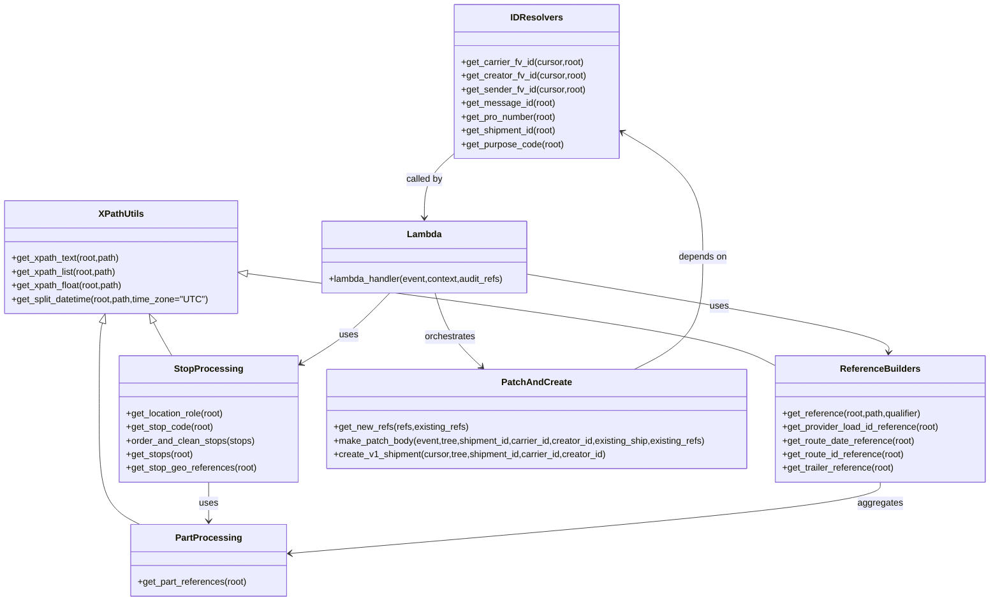

# Diagram: shipment_core/shipment_service/shipment_service/ryder/post_shipment.py


> Auto-generated by Obscura crawlers

## Diagram 1

```mermaid
flowchart LR
  A[lambda_handler(event,context,audit_refs)] --> B[parse XML: etree.XML(event.body)]
  B --> C[DB_CONN.establish_connection(); cursor=DB_CONN.cursor]
  C --> D[get_shipment_id(tree)]
  C --> E[get_carrier_fv_id(cursor,tree)]
  C --> F[get_creator_fv_id(cursor,tree)]
  E --> G{existing_ship ?}
  G -->|yes and not is_active| H[get_shipment_references(...) & make_patch_body(...)]
  H --> I[build patch_event & set headers/query]
  I --> J{needs_patching?}
  J -->|yes| K[invoke_lambda("v2_patch_shipment", full_payload=patch_event)]
  J -->|no| L[utilities.make_v1_response(204)]
  G -->|no and not is_active| M[raise NotFoundError("Shipment does not exist")]
  G -->|no or is_active| N[create_v1_shipment(cursor,tree,shipment_id,carrier_id,creator_id)]
  N --> O[event.body = v1_create_shipment_json]
  O --> P[invoke proxy_shipments]
  K --> Q[response]
  L --> Q
  P --> Q
  Q --> R[return utilities.make_v1_response(response)]
```

> SVG rendering failed for this diagram.

## Diagram 2



### SVG

<svg id="container" width="1740.3046875" xmlns="http://www.w3.org/2000/svg" class="classDiagram" height="1054" viewBox="0 0 1740.3046875 1054" role="graphics-document document" aria-roledescription="class"><style>#container{font-family:"trebuchet ms",verdana,arial,sans-serif;font-size:16px;fill:#333;}@keyframes edge-animation-frame{from{stroke-dashoffset:0;}}@keyframes dash{to{stroke-dashoffset:0;}}#container .edge-animation-slow{stroke-dasharray:9,5!important;stroke-dashoffset:900;animation:dash 50s linear infinite;stroke-linecap:round;}#container .edge-animation-fast{stroke-dasharray:9,5!important;stroke-dashoffset:900;animation:dash 20s linear infinite;stroke-linecap:round;}#container .error-icon{fill:#552222;}#container .error-text{fill:#552222;stroke:#552222;}#container .edge-thickness-normal{stroke-width:1px;}#container .edge-thickness-thick{stroke-width:3.5px;}#container .edge-pattern-solid{stroke-dasharray:0;}#container .edge-thickness-invisible{stroke-width:0;fill:none;}#container .edge-pattern-dashed{stroke-dasharray:3;}#container .edge-pattern-dotted{stroke-dasharray:2;}#container .marker{fill:#333333;stroke:#333333;}#container .marker.cross{stroke:#333333;}#container svg{font-family:"trebuchet ms",verdana,arial,sans-serif;font-size:16px;}#container p{margin:0;}#container g.classGroup text{fill:#9370DB;stroke:none;font-family:"trebuchet ms",verdana,arial,sans-serif;font-size:10px;}#container g.classGroup text .title{font-weight:bolder;}#container .nodeLabel,#container .edgeLabel{color:#131300;}#container .edgeLabel .label rect{fill:#ECECFF;}#container .label text{fill:#131300;}#container .labelBkg{background:#ECECFF;}#container .edgeLabel .label span{background:#ECECFF;}#container .classTitle{font-weight:bolder;}#container .node rect,#container .node circle,#container .node ellipse,#container .node polygon,#container .node path{fill:#ECECFF;stroke:#9370DB;stroke-width:1px;}#container .divider{stroke:#9370DB;stroke-width:1;}#container g.clickable{cursor:pointer;}#container g.classGroup rect{fill:#ECECFF;stroke:#9370DB;}#container g.classGroup line{stroke:#9370DB;stroke-width:1;}#container .classLabel .box{stroke:none;stroke-width:0;fill:#ECECFF;opacity:0.5;}#container .classLabel .label{fill:#9370DB;font-size:10px;}#container .relation{stroke:#333333;stroke-width:1;fill:none;}#container .dashed-line{stroke-dasharray:3;}#container .dotted-line{stroke-dasharray:1 2;}#container #compositionStart,#container .composition{fill:#333333!important;stroke:#333333!important;stroke-width:1;}#container #compositionEnd,#container .composition{fill:#333333!important;stroke:#333333!important;stroke-width:1;}#container #dependencyStart,#container .dependency{fill:#333333!important;stroke:#333333!important;stroke-width:1;}#container #dependencyStart,#container .dependency{fill:#333333!important;stroke:#333333!important;stroke-width:1;}#container #extensionStart,#container .extension{fill:transparent!important;stroke:#333333!important;stroke-width:1;}#container #extensionEnd,#container .extension{fill:transparent!important;stroke:#333333!important;stroke-width:1;}#container #aggregationStart,#container .aggregation{fill:transparent!important;stroke:#333333!important;stroke-width:1;}#container #aggregationEnd,#container .aggregation{fill:transparent!important;stroke:#333333!important;stroke-width:1;}#container #lollipopStart,#container .lollipop{fill:#ECECFF!important;stroke:#333333!important;stroke-width:1;}#container #lollipopEnd,#container .lollipop{fill:#ECECFF!important;stroke:#333333!important;stroke-width:1;}#container .edgeTerminals{font-size:11px;line-height:initial;}#container .classTitleText{text-anchor:middle;font-size:18px;fill:#333;}#container .label-icon{display:inline-block;height:1em;overflow:visible;vertical-align:-0.125em;}#container .node .label-icon path{fill:currentColor;stroke:revert;stroke-width:revert;}#container :root{--mermaid-font-family:"trebuchet ms",verdana,arial,sans-serif;}</style><g><defs><marker id="container_class-aggregationStart" class="marker aggregation class" refX="18" refY="7" markerWidth="190" markerHeight="240" orient="auto"><path d="M 18,7 L9,13 L1,7 L9,1 Z"></path></marker></defs><defs><marker id="container_class-aggregationEnd" class="marker aggregation class" refX="1" refY="7" markerWidth="20" markerHeight="28" orient="auto"><path d="M 18,7 L9,13 L1,7 L9,1 Z"></path></marker></defs><defs><marker id="container_class-extensionStart" class="marker extension class" refX="18" refY="7" markerWidth="190" markerHeight="240" orient="auto"><path d="M 1,7 L18,13 V 1 Z"></path></marker></defs><defs><marker id="container_class-extensionEnd" class="marker extension class" refX="1" refY="7" markerWidth="20" markerHeight="28" orient="auto"><path d="M 1,1 V 13 L18,7 Z"></path></marker></defs><defs><marker id="container_class-compositionStart" class="marker composition class" refX="18" refY="7" markerWidth="190" markerHeight="240" orient="auto"><path d="M 18,7 L9,13 L1,7 L9,1 Z"></path></marker></defs><defs><marker id="container_class-compositionEnd" class="marker composition class" refX="1" refY="7" markerWidth="20" markerHeight="28" orient="auto"><path d="M 18,7 L9,13 L1,7 L9,1 Z"></path></marker></defs><defs><marker id="container_class-dependencyStart" class="marker dependency class" refX="6" refY="7" markerWidth="190" markerHeight="240" orient="auto"><path d="M 5,7 L9,13 L1,7 L9,1 Z"></path></marker></defs><defs><marker id="container_class-dependencyEnd" class="marker dependency class" refX="13" refY="7" markerWidth="20" markerHeight="28" orient="auto"><path d="M 18,7 L9,13 L14,7 L9,1 Z"></path></marker></defs><defs><marker id="container_class-lollipopStart" class="marker lollipop class" refX="13" refY="7" markerWidth="190" markerHeight="240" orient="auto"><circle stroke="black" fill="transparent" cx="7" cy="7" r="6"></circle></marker></defs><defs><marker id="container_class-lollipopEnd" class="marker lollipop class" refX="1" refY="7" markerWidth="190" markerHeight="240" orient="auto"><circle stroke="black" fill="transparent" cx="7" cy="7" r="6"></circle></marker></defs><g class="root"><g class="clusters"></g><g class="edgePaths"><path d="M269.111,565.491L270.867,569.076C272.622,572.661,276.134,579.83,281.427,589.582C286.719,599.333,293.791,611.667,297.327,617.833L300.863,624" id="id_XPathUtils_StopProcessing_1" class="edge-thickness-normal edge-pattern-solid relation" style=";;;" data-edge="true" data-et="edge" data-id="id_XPathUtils_StopProcessing_1" data-points="W3sieCI6MjYxLjUyMjE1OTM1MjAyMjEsInkiOjU1MH0seyJ4IjoyNzkuNjQ2NDg0Mzc1LCJ5Ijo1ODd9LHsieCI6MzAwLjg2Mjc5Mjk2ODc1LCJ5Ijo2MjR9XQ==" marker-start="url(#container_class-extensionStart)"></path><path d="M180.517,566.606L179.561,570.005C178.605,573.404,176.693,580.202,175.737,608.268C174.781,636.333,174.781,685.667,174.781,735C174.781,784.333,174.781,833.667,186.481,864.5C198.181,895.333,221.581,907.667,233.281,913.833L244.982,920" id="id_XPathUtils_PartProcessing_2" class="edge-thickness-normal edge-pattern-solid relation" style=";;;" data-edge="true" data-et="edge" data-id="id_XPathUtils_PartProcessing_2" data-points="W3sieCI6MTg1LjE4NjQzNzI3MDIyMDU4LCJ5Ijo1NTB9LHsieCI6MTc0Ljc4MTI1LCJ5Ijo1ODd9LHsieCI6MTc0Ljc4MTI1LCJ5Ijo3MzV9LHsieCI6MTc0Ljc4MTI1LCJ5Ijo4ODN9LHsieCI6MjQ0Ljk4MTUyMzQzNzUwMDAyLCJ5Ijo5MjB9XQ==" marker-start="url(#container_class-extensionStart)"></path><path d="M435.159,480.011L571.692,497.842C708.225,515.674,981.29,551.337,1135.92,578.301C1290.549,605.266,1326.743,623.531,1344.84,632.664L1362.938,641.797" id="id_XPathUtils_ReferenceBuilders_3" class="edge-thickness-normal edge-pattern-solid relation" style=";;;" data-edge="true" data-et="edge" data-id="id_XPathUtils_ReferenceBuilders_3" data-points="W3sieCI6NDE4LjA1NDY4NzUsInkiOjQ3Ny43NzcwNzI1NDg1NzgzfSx7IngiOjEyNTQuMzU1NDY4NzUsInkiOjU4N30seyJ4IjoxMzYyLjkzNzUsInkiOjY0MS43OTcyMTg4MTgyNjQxfV0=" marker-start="url(#container_class-extensionStart)"></path><path d="M364.512,846L364.512,852.167C364.512,858.333,364.512,870.667,364.512,882C364.512,893.333,364.512,903.667,364.512,908.833L364.512,914" id="id_StopProcessing_PartProcessing_4" class="edge-thickness-normal edge-pattern-solid relation" style=";;;" data-edge="true" data-et="edge" data-id="id_StopProcessing_PartProcessing_4" data-points="W3sieCI6MzY0LjUxMTcxODc1LCJ5Ijo4NDZ9LHsieCI6MzY0LjUxMTcxODc1LCJ5Ijo4ODN9LHsieCI6MzY0LjUxMTcxODc1LCJ5Ijo5MjB9XQ==" marker-end="url(#container_class-dependencyEnd)"></path><path d="M1547.621,846L1547.621,852.167C1547.621,858.333,1547.621,870.667,1374.08,891.502C1200.538,912.336,853.456,941.673,679.915,956.341L506.373,971.009" id="id_ReferenceBuilders_PartProcessing_5" class="edge-thickness-normal edge-pattern-solid relation" style=";;;" data-edge="true" data-et="edge" data-id="id_ReferenceBuilders_PartProcessing_5" data-points="W3sieCI6MTU0Ny42MjEwOTM3NSwieSI6ODQ2fSx7IngiOjE1NDcuNjIxMDkzNzUsInkiOjg4M30seyJ4Ijo1MDAuMzk0NTMxMjUsInkiOjk3MS41MTQ3NzE3MjE3NjA3fV0=" marker-end="url(#container_class-dependencyEnd)"></path><path d="M797.109,270.086L788.629,277.572C780.148,285.057,763.186,300.029,754.705,318.681C746.225,337.333,746.225,359.667,746.225,370.833L746.225,382" id="id_IDResolvers_Lambda_6" class="edge-thickness-normal edge-pattern-solid relation" style=";;;" data-edge="true" data-et="edge" data-id="id_IDResolvers_Lambda_6" data-points="W3sieCI6Nzk3LjEwOTM3NSwieSI6MjcwLjA4NTk4NjkxMDAyMzk2fSx7IngiOjc0Ni4yMjQ2MDkzNzUsInkiOjMxNX0seyJ4Ijo3NDYuMjI0NjA5Mzc1LCJ5IjozODh9XQ==" marker-end="url(#container_class-dependencyEnd)"></path><path d="M1113.482,648L1133.628,637.833C1153.773,627.667,1194.064,607.333,1214.21,574.5C1234.355,541.667,1234.355,496.333,1234.355,451C1234.355,405.667,1234.355,360.333,1210.337,323.58C1186.319,286.827,1138.282,258.653,1114.264,244.567L1090.246,230.48" id="id_PatchAndCreate_IDResolvers_7" class="edge-thickness-normal edge-pattern-solid relation" style=";;;" data-edge="true" data-et="edge" data-id="id_PatchAndCreate_IDResolvers_7" data-points="W3sieCI6MTExMy40ODI0NzQ2NjIxNjIsInkiOjY0OH0seyJ4IjoxMjM0LjM1NTQ2ODc1LCJ5Ijo1ODd9LHsieCI6MTIzNC4zNTU0Njg3NSwieSI6NDUxfSx7IngiOjEyMzQuMzU1NDY4NzUsInkiOjMxNX0seyJ4IjoxMDg1LjA3MDMxMjUsInkiOjIyNy40NDQ0MDMwMDQ5NTQ5OH1d" marker-end="url(#container_class-dependencyEnd)"></path><path d="M765.11,514L768.758,526.167C772.405,538.333,779.7,562.667,793.211,584.307C806.722,605.948,826.451,624.896,836.315,634.37L846.179,643.844" id="id_Lambda_PatchAndCreate_8" class="edge-thickness-normal edge-pattern-solid relation" style=";;;" data-edge="true" data-et="edge" data-id="id_Lambda_PatchAndCreate_8" data-points="W3sieCI6NzY1LjExMDQ5NTE3NDYzMjMsInkiOjUxNH0seyJ4Ijo3ODYuOTk0MTQwNjI1LCJ5Ijo1ODd9LHsieCI6ODUwLjUwNjU1ODgwNDg5ODYsInkiOjY0OH1d" marker-end="url(#container_class-dependencyEnd)"></path><path d="M684.062,514L672.056,526.167C660.051,538.333,636.041,562.667,609.43,583.567C582.818,604.467,553.605,621.935,538.998,630.669L524.392,639.402" id="id_Lambda_StopProcessing_9" class="edge-thickness-normal edge-pattern-solid relation" style=";;;" data-edge="true" data-et="edge" data-id="id_Lambda_StopProcessing_9" data-points="W3sieCI6Njg0LjA2MTUwOTA3NjI4NjcsInkiOjUxNH0seyJ4Ijo2MTIuMDMxMjUsInkiOjU4N30seyJ4Ijo1MTkuMjQyMTg3NSwieSI6NjQyLjQ4MTYwNjU2NTEzODV9XQ==" marker-end="url(#container_class-dependencyEnd)"></path><path d="M929.314,481.379L1035.407,498.983C1141.499,516.586,1353.683,551.793,1459.137,574.571C1564.591,597.348,1563.316,607.697,1562.678,612.871L1562.04,618.045" id="id_Lambda_ReferenceBuilders_10" class="edge-thickness-normal edge-pattern-solid relation" style=";;;" data-edge="true" data-et="edge" data-id="id_Lambda_ReferenceBuilders_10" data-points="W3sieCI6OTI5LjMxNDQ1MzEyNSwieSI6NDgxLjM3OTM2MjE5MzQxMDN9LHsieCI6MTU2NS44NjcxODc1LCJ5Ijo1ODd9LHsieCI6MTU2MS4zMDU2NjQwNjI1LCJ5Ijo2MjR9XQ==" marker-end="url(#container_class-dependencyEnd)"></path></g><g class="edgeLabels"><g class="edgeLabel"><g class="label" data-id="id_XPathUtils_StopProcessing_1" transform="translate(0, 0)"><foreignObject width="0" height="0"><div xmlns="http://www.w3.org/1999/xhtml" class="labelBkg" style="display: table-cell; white-space: nowrap; line-height: 1.5; max-width: 200px; text-align: center;"><span class="edgeLabel"></span></div></foreignObject></g></g><g class="edgeLabel"><g class="label" data-id="id_XPathUtils_PartProcessing_2" transform="translate(0, 0)"><foreignObject width="0" height="0"><div xmlns="http://www.w3.org/1999/xhtml" class="labelBkg" style="display: table-cell; white-space: nowrap; line-height: 1.5; max-width: 200px; text-align: center;"><span class="edgeLabel"></span></div></foreignObject></g></g><g class="edgeLabel"><g class="label" data-id="id_XPathUtils_ReferenceBuilders_3" transform="translate(0, 0)"><foreignObject width="0" height="0"><div xmlns="http://www.w3.org/1999/xhtml" class="labelBkg" style="display: table-cell; white-space: nowrap; line-height: 1.5; max-width: 200px; text-align: center;"><span class="edgeLabel"></span></div></foreignObject></g></g><g class="edgeLabel" transform="translate(364.51171875, 883)"><g class="label" data-id="id_StopProcessing_PartProcessing_4" transform="translate(-16.4921875, -12)"><foreignObject width="32.984375" height="24"><div xmlns="http://www.w3.org/1999/xhtml" class="labelBkg" style="display: table-cell; white-space: nowrap; line-height: 1.5; max-width: 200px; text-align: center;"><span class="edgeLabel"><p>uses</p></span></div></foreignObject></g></g><g class="edgeLabel" transform="translate(1547.62109375, 883)"><g class="label" data-id="id_ReferenceBuilders_PartProcessing_5" transform="translate(-39.03125, -12)"><foreignObject width="78.0625" height="24"><div xmlns="http://www.w3.org/1999/xhtml" class="labelBkg" style="display: table-cell; white-space: nowrap; line-height: 1.5; max-width: 200px; text-align: center;"><span class="edgeLabel"><p>aggregates</p></span></div></foreignObject></g></g><g class="edgeLabel" transform="translate(746.224609375, 315)"><g class="label" data-id="id_IDResolvers_Lambda_6" transform="translate(-32.5859375, -12)"><foreignObject width="65.171875" height="24"><div xmlns="http://www.w3.org/1999/xhtml" class="labelBkg" style="display: table-cell; white-space: nowrap; line-height: 1.5; max-width: 200px; text-align: center;"><span class="edgeLabel"><p>called by</p></span></div></foreignObject></g></g><g class="edgeLabel" transform="translate(1234.35546875, 451)"><g class="label" data-id="id_PatchAndCreate_IDResolvers_7" transform="translate(-42.9453125, -12)"><foreignObject width="85.890625" height="24"><div xmlns="http://www.w3.org/1999/xhtml" class="labelBkg" style="display: table-cell; white-space: nowrap; line-height: 1.5; max-width: 200px; text-align: center;"><span class="edgeLabel"><p>depends on</p></span></div></foreignObject></g></g><g class="edgeLabel" transform="translate(791.26812, 591.10491)"><g class="label" data-id="id_Lambda_PatchAndCreate_8" transform="translate(-45.046875, -12)"><foreignObject width="90.09375" height="24"><div xmlns="http://www.w3.org/1999/xhtml" class="labelBkg" style="display: table-cell; white-space: nowrap; line-height: 1.5; max-width: 200px; text-align: center;"><span class="edgeLabel"><p>orchestrates</p></span></div></foreignObject></g></g><g class="edgeLabel" transform="translate(609.64655, 588.42589)"><g class="label" data-id="id_Lambda_StopProcessing_9" transform="translate(-16.4921875, -12)"><foreignObject width="32.984375" height="24"><div xmlns="http://www.w3.org/1999/xhtml" class="labelBkg" style="display: table-cell; white-space: nowrap; line-height: 1.5; max-width: 200px; text-align: center;"><span class="edgeLabel"><p>uses</p></span></div></foreignObject></g></g><g class="edgeLabel" transform="translate(1265.97947, 537.24084)"><g class="label" data-id="id_Lambda_ReferenceBuilders_10" transform="translate(-16.4921875, -12)"><foreignObject width="32.984375" height="24"><div xmlns="http://www.w3.org/1999/xhtml" class="labelBkg" style="display: table-cell; white-space: nowrap; line-height: 1.5; max-width: 200px; text-align: center;"><span class="edgeLabel"><p>uses</p></span></div></foreignObject></g></g></g><g class="nodes"><g class="node default" id="classId-XPathUtils-0" transform="translate(213.02734375, 451)"><g class="basic label-container"><path d="M-205.02734375 -99 L205.02734375 -99 L205.02734375 99 L-205.02734375 99" stroke="none" stroke-width="0" fill="#ECECFF" style=""></path><path d="M-205.02734375 -99 C-111.35489856903408 -99, -17.682453388068154 -99, 205.02734375 -99 M-205.02734375 -99 C-116.58293977348777 -99, -28.138535796975532 -99, 205.02734375 -99 M205.02734375 -99 C205.02734375 -48.994315781477695, 205.02734375 1.0113684370446094, 205.02734375 99 M205.02734375 -99 C205.02734375 -46.5122759663375, 205.02734375 5.975448067325004, 205.02734375 99 M205.02734375 99 C113.38052060854093 99, 21.733697467081868 99, -205.02734375 99 M205.02734375 99 C87.66336988272778 99, -29.700603984544443 99, -205.02734375 99 M-205.02734375 99 C-205.02734375 19.880236829877873, -205.02734375 -59.239526340244254, -205.02734375 -99 M-205.02734375 99 C-205.02734375 44.48223550419108, -205.02734375 -10.035528991617838, -205.02734375 -99" stroke="#9370DB" stroke-width="1.3" fill="none" stroke-dasharray="0 0" style=""></path></g><g class="annotation-group text" transform="translate(0, -75)"></g><g class="label-group text" transform="translate(-37.9140625, -75)"><g class="label" style="font-weight: bolder" transform="translate(0,-12)"><foreignObject width="75.828125" height="24"><div xmlns="http://www.w3.org/1999/xhtml" style="display: table-cell; white-space: nowrap; line-height: 1.5; max-width: 124px; text-align: center;"><span class="nodeLabel markdown-node-label" style=""><p>XPathUtils</p></span></div></foreignObject></g></g><g class="members-group text" transform="translate(-193.02734375, -27)"></g><g class="methods-group text" transform="translate(-193.02734375, 3)"><g class="label" style="" transform="translate(0,-12)"><foreignObject width="193.109375" height="24"><div xmlns="http://www.w3.org/1999/xhtml" style="display: table-cell; white-space: nowrap; line-height: 1.5; max-width: 250px; text-align: center;"><span class="nodeLabel markdown-node-label" style=""><p>+get_xpath_text(root,path)</p></span></div></foreignObject></g><g class="label" style="" transform="translate(0,12)"><foreignObject width="188.078125" height="24"><div xmlns="http://www.w3.org/1999/xhtml" style="display: table-cell; white-space: nowrap; line-height: 1.5; max-width: 245px; text-align: center;"><span class="nodeLabel markdown-node-label" style=""><p>+get_xpath_list(root,path)</p></span></div></foreignObject></g><g class="label" style="" transform="translate(0,36)"><foreignObject width="198.515625" height="24"><div xmlns="http://www.w3.org/1999/xhtml" style="display: table-cell; white-space: nowrap; line-height: 1.5; max-width: 256px; text-align: center;"><span class="nodeLabel markdown-node-label" style=""><p>+get_xpath_float(root,path)</p></span></div></foreignObject></g><g class="label" style="" transform="translate(0,60)"><foreignObject width="348.140625" height="24"><div xmlns="http://www.w3.org/1999/xhtml" style="display: table-cell; white-space: nowrap; line-height: 1.5; max-width: 406px; text-align: center;"><span class="nodeLabel markdown-node-label" style=""><p>+get_split_datetime(root,path,time_zone="UTC")</p></span></div></foreignObject></g></g><g class="divider" style=""><path d="M-205.02734375 -51 C-74.3939632167193 -51, 56.2394173165614 -51, 205.02734375 -51 M-205.02734375 -51 C-110.96384796629769 -51, -16.900352182595384 -51, 205.02734375 -51" stroke="#9370DB" stroke-width="1.3" fill="none" stroke-dasharray="0 0" style=""></path></g><g class="divider" style=""><path d="M-205.02734375 -27 C-47.273663319331064 -27, 110.48001711133787 -27, 205.02734375 -27 M-205.02734375 -27 C-104.15710797676753 -27, -3.2868722035350686 -27, 205.02734375 -27" stroke="#9370DB" stroke-width="1.3" fill="none" stroke-dasharray="0 0" style=""></path></g></g><g class="node default" id="classId-ReferenceBuilders-1" transform="translate(1547.62109375, 735)"><g class="basic label-container"><path d="M-184.68359375 -111 L184.68359375 -111 L184.68359375 111 L-184.68359375 111" stroke="none" stroke-width="0" fill="#ECECFF" style=""></path><path d="M-184.68359375 -111 C-51.59292454279199 -111, 81.49774466441602 -111, 184.68359375 -111 M-184.68359375 -111 C-37.472468125307245 -111, 109.73865749938551 -111, 184.68359375 -111 M184.68359375 -111 C184.68359375 -30.033671225699507, 184.68359375 50.932657548600986, 184.68359375 111 M184.68359375 -111 C184.68359375 -42.03296175735339, 184.68359375 26.934076485293218, 184.68359375 111 M184.68359375 111 C54.247423779579776 111, -76.18874619084045 111, -184.68359375 111 M184.68359375 111 C106.75918925561078 111, 28.834784761221556 111, -184.68359375 111 M-184.68359375 111 C-184.68359375 65.68259343553282, -184.68359375 20.36518687106563, -184.68359375 -111 M-184.68359375 111 C-184.68359375 24.270275895766176, -184.68359375 -62.45944820846765, -184.68359375 -111" stroke="#9370DB" stroke-width="1.3" fill="none" stroke-dasharray="0 0" style=""></path></g><g class="annotation-group text" transform="translate(0, -87)"></g><g class="label-group text" transform="translate(-66.8046875, -87)"><g class="label" style="font-weight: bolder" transform="translate(0,-12)"><foreignObject width="133.609375" height="24"><div xmlns="http://www.w3.org/1999/xhtml" style="display: table-cell; white-space: nowrap; line-height: 1.5; max-width: 182px; text-align: center;"><span class="nodeLabel markdown-node-label" style=""><p>ReferenceBuilders</p></span></div></foreignObject></g></g><g class="members-group text" transform="translate(-172.68359375, -39)"></g><g class="methods-group text" transform="translate(-172.68359375, -9)"><g class="label" style="" transform="translate(0,-12)"><foreignObject width="249.078125" height="24"><div xmlns="http://www.w3.org/1999/xhtml" style="display: table-cell; white-space: nowrap; line-height: 1.5; max-width: 306px; text-align: center;"><span class="nodeLabel markdown-node-label" style=""><p>+get_reference(root,path,qualifier)</p></span></div></foreignObject></g><g class="label" style="" transform="translate(0,12)"><foreignObject width="278.5625" height="24"><div xmlns="http://www.w3.org/1999/xhtml" style="display: table-cell; white-space: nowrap; line-height: 1.5; max-width: 336px; text-align: center;"><span class="nodeLabel markdown-node-label" style=""><p>+get_provider_load_id_reference(root)</p></span></div></foreignObject></g><g class="label" style="" transform="translate(0,36)"><foreignObject width="234.390625" height="24"><div xmlns="http://www.w3.org/1999/xhtml" style="display: table-cell; white-space: nowrap; line-height: 1.5; max-width: 292px; text-align: center;"><span class="nodeLabel markdown-node-label" style=""><p>+get_route_date_reference(root)</p></span></div></foreignObject></g><g class="label" style="" transform="translate(0,60)"><foreignObject width="216.578125" height="24"><div xmlns="http://www.w3.org/1999/xhtml" style="display: table-cell; white-space: nowrap; line-height: 1.5; max-width: 274px; text-align: center;"><span class="nodeLabel markdown-node-label" style=""><p>+get_route_id_reference(root)</p></span></div></foreignObject></g><g class="label" style="" transform="translate(0,84)"><foreignObject width="198.40625" height="24"><div xmlns="http://www.w3.org/1999/xhtml" style="display: table-cell; white-space: nowrap; line-height: 1.5; max-width: 256px; text-align: center;"><span class="nodeLabel markdown-node-label" style=""><p>+get_trailer_reference(root)</p></span></div></foreignObject></g></g><g class="divider" style=""><path d="M-184.68359375 -63 C-101.82477649559534 -63, -18.96595924119069 -63, 184.68359375 -63 M-184.68359375 -63 C-102.86743968281895 -63, -21.05128561563791 -63, 184.68359375 -63" stroke="#9370DB" stroke-width="1.3" fill="none" stroke-dasharray="0 0" style=""></path></g><g class="divider" style=""><path d="M-184.68359375 -39 C-110.05224785647678 -39, -35.420901962953565 -39, 184.68359375 -39 M-184.68359375 -39 C-41.48523827650871 -39, 101.71311719698258 -39, 184.68359375 -39" stroke="#9370DB" stroke-width="1.3" fill="none" stroke-dasharray="0 0" style=""></path></g></g><g class="node default" id="classId-StopProcessing-2" transform="translate(364.51171875, 735)"><g class="basic label-container"><path d="M-154.73046875 -111 L154.73046875 -111 L154.73046875 111 L-154.73046875 111" stroke="none" stroke-width="0" fill="#ECECFF" style=""></path><path d="M-154.73046875 -111 C-34.04525887471466 -111, 86.63995100057068 -111, 154.73046875 -111 M-154.73046875 -111 C-78.49696250155347 -111, -2.2634562531069378 -111, 154.73046875 -111 M154.73046875 -111 C154.73046875 -36.01769156297647, 154.73046875 38.96461687404707, 154.73046875 111 M154.73046875 -111 C154.73046875 -32.4559258542416, 154.73046875 46.0881482915168, 154.73046875 111 M154.73046875 111 C53.0951851690827 111, -48.540098411834606 111, -154.73046875 111 M154.73046875 111 C45.087857281070214 111, -64.55475418785957 111, -154.73046875 111 M-154.73046875 111 C-154.73046875 63.49010864306466, -154.73046875 15.980217286129317, -154.73046875 -111 M-154.73046875 111 C-154.73046875 65.24398862571059, -154.73046875 19.48797725142117, -154.73046875 -111" stroke="#9370DB" stroke-width="1.3" fill="none" stroke-dasharray="0 0" style=""></path></g><g class="annotation-group text" transform="translate(0, -87)"></g><g class="label-group text" transform="translate(-56.2890625, -87)"><g class="label" style="font-weight: bolder" transform="translate(0,-12)"><foreignObject width="112.578125" height="24"><div xmlns="http://www.w3.org/1999/xhtml" style="display: table-cell; white-space: nowrap; line-height: 1.5; max-width: 161px; text-align: center;"><span class="nodeLabel markdown-node-label" style=""><p>StopProcessing</p></span></div></foreignObject></g></g><g class="members-group text" transform="translate(-142.73046875, -39)"></g><g class="methods-group text" transform="translate(-142.73046875, -9)"><g class="label" style="" transform="translate(0,-12)"><foreignObject width="175.078125" height="24"><div xmlns="http://www.w3.org/1999/xhtml" style="display: table-cell; white-space: nowrap; line-height: 1.5; max-width: 232px; text-align: center;"><span class="nodeLabel markdown-node-label" style=""><p>+get_location_role(root)</p></span></div></foreignObject></g><g class="label" style="" transform="translate(0,12)"><foreignObject width="153.890625" height="24"><div xmlns="http://www.w3.org/1999/xhtml" style="display: table-cell; white-space: nowrap; line-height: 1.5; max-width: 211px; text-align: center;"><span class="nodeLabel markdown-node-label" style=""><p>+get_stop_code(root)</p></span></div></foreignObject></g><g class="label" style="" transform="translate(0,36)"><foreignObject width="226.109375" height="24"><div xmlns="http://www.w3.org/1999/xhtml" style="display: table-cell; white-space: nowrap; line-height: 1.5; max-width: 283px; text-align: center;"><span class="nodeLabel markdown-node-label" style=""><p>+order_and_clean_stops(stops)</p></span></div></foreignObject></g><g class="label" style="" transform="translate(0,60)"><foreignObject width="118.734375" height="24"><div xmlns="http://www.w3.org/1999/xhtml" style="display: table-cell; white-space: nowrap; line-height: 1.5; max-width: 176px; text-align: center;"><span class="nodeLabel markdown-node-label" style=""><p>+get_stops(root)</p></span></div></foreignObject></g><g class="label" style="" transform="translate(0,84)"><foreignObject width="229.171875" height="24"><div xmlns="http://www.w3.org/1999/xhtml" style="display: table-cell; white-space: nowrap; line-height: 1.5; max-width: 287px; text-align: center;"><span class="nodeLabel markdown-node-label" style=""><p>+get_stop_geo_references(root)</p></span></div></foreignObject></g></g><g class="divider" style=""><path d="M-154.73046875 -63 C-52.249348996935254 -63, 50.23177075612949 -63, 154.73046875 -63 M-154.73046875 -63 C-70.29850436965191 -63, 14.133460010696183 -63, 154.73046875 -63" stroke="#9370DB" stroke-width="1.3" fill="none" stroke-dasharray="0 0" style=""></path></g><g class="divider" style=""><path d="M-154.73046875 -39 C-64.06264442148738 -39, 26.605179907025246 -39, 154.73046875 -39 M-154.73046875 -39 C-43.33668140977336 -39, 68.05710593045328 -39, 154.73046875 -39" stroke="#9370DB" stroke-width="1.3" fill="none" stroke-dasharray="0 0" style=""></path></g></g><g class="node default" id="classId-PartProcessing-3" transform="translate(364.51171875, 983)"><g class="basic label-container"><path d="M-135.8828125 -63 L135.8828125 -63 L135.8828125 63 L-135.8828125 63" stroke="none" stroke-width="0" fill="#ECECFF" style=""></path><path d="M-135.8828125 -63 C-49.00477934901532 -63, 37.873253801969355 -63, 135.8828125 -63 M-135.8828125 -63 C-74.86725625207065 -63, -13.851700004141293 -63, 135.8828125 -63 M135.8828125 -63 C135.8828125 -37.42213055329093, 135.8828125 -11.844261106581861, 135.8828125 63 M135.8828125 -63 C135.8828125 -16.83682500091465, 135.8828125 29.3263499981707, 135.8828125 63 M135.8828125 63 C33.1583209549203 63, -69.5661705901594 63, -135.8828125 63 M135.8828125 63 C27.760178478643653 63, -80.3624555427127 63, -135.8828125 63 M-135.8828125 63 C-135.8828125 27.992354811776046, -135.8828125 -7.015290376447908, -135.8828125 -63 M-135.8828125 63 C-135.8828125 27.85395810820603, -135.8828125 -7.292083783587941, -135.8828125 -63" stroke="#9370DB" stroke-width="1.3" fill="none" stroke-dasharray="0 0" style=""></path></g><g class="annotation-group text" transform="translate(0, -39)"></g><g class="label-group text" transform="translate(-54.390625, -39)"><g class="label" style="font-weight: bolder" transform="translate(0,-12)"><foreignObject width="108.78125" height="24"><div xmlns="http://www.w3.org/1999/xhtml" style="display: table-cell; white-space: nowrap; line-height: 1.5; max-width: 157px; text-align: center;"><span class="nodeLabel markdown-node-label" style=""><p>PartProcessing</p></span></div></foreignObject></g></g><g class="members-group text" transform="translate(-123.8828125, 9)"></g><g class="methods-group text" transform="translate(-123.8828125, 39)"><g class="label" style="" transform="translate(0,-12)"><foreignObject width="193.375" height="24"><div xmlns="http://www.w3.org/1999/xhtml" style="display: table-cell; white-space: nowrap; line-height: 1.5; max-width: 251px; text-align: center;"><span class="nodeLabel markdown-node-label" style=""><p>+get_part_references(root)</p></span></div></foreignObject></g></g><g class="divider" style=""><path d="M-135.8828125 -15 C-33.4037440368802 -15, 69.0753244262396 -15, 135.8828125 -15 M-135.8828125 -15 C-33.19472511520496 -15, 69.49336226959008 -15, 135.8828125 -15" stroke="#9370DB" stroke-width="1.3" fill="none" stroke-dasharray="0 0" style=""></path></g><g class="divider" style=""><path d="M-135.8828125 9 C-67.70273357499464 9, 0.4773453500107223 9, 135.8828125 9 M-135.8828125 9 C-76.36634263317282 9, -16.849872766345626 9, 135.8828125 9" stroke="#9370DB" stroke-width="1.3" fill="none" stroke-dasharray="0 0" style=""></path></g></g><g class="node default" id="classId-IDResolvers-4" transform="translate(941.08984375, 143)"><g class="basic label-container"><path d="M-143.98046875 -135 L143.98046875 -135 L143.98046875 135 L-143.98046875 135" stroke="none" stroke-width="0" fill="#ECECFF" style=""></path><path d="M-143.98046875 -135 C-75.2023934368253 -135, -6.4243181236506075 -135, 143.98046875 -135 M-143.98046875 -135 C-72.78642559002402 -135, -1.5923824300480476 -135, 143.98046875 -135 M143.98046875 -135 C143.98046875 -66.87972268992506, 143.98046875 1.2405546201498794, 143.98046875 135 M143.98046875 -135 C143.98046875 -38.33437156576571, 143.98046875 58.331256868468586, 143.98046875 135 M143.98046875 135 C49.44473818453035 135, -45.0909923809393 135, -143.98046875 135 M143.98046875 135 C68.995496776171 135, -5.98947519765801 135, -143.98046875 135 M-143.98046875 135 C-143.98046875 33.95638968110305, -143.98046875 -67.0872206377939, -143.98046875 -135 M-143.98046875 135 C-143.98046875 29.24142680346577, -143.98046875 -76.51714639306846, -143.98046875 -135" stroke="#9370DB" stroke-width="1.3" fill="none" stroke-dasharray="0 0" style=""></path></g><g class="annotation-group text" transform="translate(0, -111)"></g><g class="label-group text" transform="translate(-43.0546875, -111)"><g class="label" style="font-weight: bolder" transform="translate(0,-12)"><foreignObject width="86.109375" height="24"><div xmlns="http://www.w3.org/1999/xhtml" style="display: table-cell; white-space: nowrap; line-height: 1.5; max-width: 134px; text-align: center;"><span class="nodeLabel markdown-node-label" style=""><p>IDResolvers</p></span></div></foreignObject></g></g><g class="members-group text" transform="translate(-131.98046875, -63)"></g><g class="methods-group text" transform="translate(-131.98046875, -33)"><g class="label" style="" transform="translate(0,-12)"><foreignObject width="217.1875" height="24"><div xmlns="http://www.w3.org/1999/xhtml" style="display: table-cell; white-space: nowrap; line-height: 1.5; max-width: 275px; text-align: center;"><span class="nodeLabel markdown-node-label" style=""><p>+get_carrier_fv_id(cursor,root)</p></span></div></foreignObject></g><g class="label" style="" transform="translate(0,12)"><foreignObject width="220.90625" height="24"><div xmlns="http://www.w3.org/1999/xhtml" style="display: table-cell; white-space: nowrap; line-height: 1.5; max-width: 278px; text-align: center;"><span class="nodeLabel markdown-node-label" style=""><p>+get_creator_fv_id(cursor,root)</p></span></div></foreignObject></g><g class="label" style="" transform="translate(0,36)"><foreignObject width="219.59375" height="24"><div xmlns="http://www.w3.org/1999/xhtml" style="display: table-cell; white-space: nowrap; line-height: 1.5; max-width: 277px; text-align: center;"><span class="nodeLabel markdown-node-label" style=""><p>+get_sender_fv_id(cursor,root)</p></span></div></foreignObject></g><g class="label" style="" transform="translate(0,60)"><foreignObject width="163.859375" height="24"><div xmlns="http://www.w3.org/1999/xhtml" style="display: table-cell; white-space: nowrap; line-height: 1.5; max-width: 221px; text-align: center;"><span class="nodeLabel markdown-node-label" style=""><p>+get_message_id(root)</p></span></div></foreignObject></g><g class="label" style="" transform="translate(0,84)"><foreignObject width="168.75" height="24"><div xmlns="http://www.w3.org/1999/xhtml" style="display: table-cell; white-space: nowrap; line-height: 1.5; max-width: 226px; text-align: center;"><span class="nodeLabel markdown-node-label" style=""><p>+get_pro_number(root)</p></span></div></foreignObject></g><g class="label" style="" transform="translate(0,108)"><foreignObject width="170.25" height="24"><div xmlns="http://www.w3.org/1999/xhtml" style="display: table-cell; white-space: nowrap; line-height: 1.5; max-width: 228px; text-align: center;"><span class="nodeLabel markdown-node-label" style=""><p>+get_shipment_id(root)</p></span></div></foreignObject></g><g class="label" style="" transform="translate(0,132)"><foreignObject width="182.078125" height="24"><div xmlns="http://www.w3.org/1999/xhtml" style="display: table-cell; white-space: nowrap; line-height: 1.5; max-width: 239px; text-align: center;"><span class="nodeLabel markdown-node-label" style=""><p>+get_purpose_code(root)</p></span></div></foreignObject></g></g><g class="divider" style=""><path d="M-143.98046875 -87 C-34.08951795764035 -87, 75.8014328347193 -87, 143.98046875 -87 M-143.98046875 -87 C-52.502684098396074 -87, 38.97510055320785 -87, 143.98046875 -87" stroke="#9370DB" stroke-width="1.3" fill="none" stroke-dasharray="0 0" style=""></path></g><g class="divider" style=""><path d="M-143.98046875 -63 C-66.35361309989041 -63, 11.27324255021918 -63, 143.98046875 -63 M-143.98046875 -63 C-61.976935374541526 -63, 20.026598000916948 -63, 143.98046875 -63" stroke="#9370DB" stroke-width="1.3" fill="none" stroke-dasharray="0 0" style=""></path></g></g><g class="node default" id="classId-PatchAndCreate-5" transform="translate(941.08984375, 735)"><g class="basic label-container"><path d="M-371.84765625 -87 L371.84765625 -87 L371.84765625 87 L-371.84765625 87" stroke="none" stroke-width="0" fill="#ECECFF" style=""></path><path d="M-371.84765625 -87 C-200.58364758285205 -87, -29.319638915704104 -87, 371.84765625 -87 M-371.84765625 -87 C-194.76769952870353 -87, -17.687742807407062 -87, 371.84765625 -87 M371.84765625 -87 C371.84765625 -28.41761006715491, 371.84765625 30.16477986569018, 371.84765625 87 M371.84765625 -87 C371.84765625 -32.03531063196355, 371.84765625 22.929378736072906, 371.84765625 87 M371.84765625 87 C147.79130713430447 87, -76.26504198139105 87, -371.84765625 87 M371.84765625 87 C96.94390754840123 87, -177.95984115319754 87, -371.84765625 87 M-371.84765625 87 C-371.84765625 37.15397044128249, -371.84765625 -12.692059117435022, -371.84765625 -87 M-371.84765625 87 C-371.84765625 45.12867227888564, -371.84765625 3.257344557771276, -371.84765625 -87" stroke="#9370DB" stroke-width="1.3" fill="none" stroke-dasharray="0 0" style=""></path></g><g class="annotation-group text" transform="translate(0, -63)"></g><g class="label-group text" transform="translate(-57.8515625, -63)"><g class="label" style="font-weight: bolder" transform="translate(0,-12)"><foreignObject width="115.703125" height="24"><div xmlns="http://www.w3.org/1999/xhtml" style="display: table-cell; white-space: nowrap; line-height: 1.5; max-width: 164px; text-align: center;"><span class="nodeLabel markdown-node-label" style=""><p>PatchAndCreate</p></span></div></foreignObject></g></g><g class="members-group text" transform="translate(-359.84765625, -15)"></g><g class="methods-group text" transform="translate(-359.84765625, 15)"><g class="label" style="" transform="translate(0,-12)"><foreignObject width="236.6875" height="24"><div xmlns="http://www.w3.org/1999/xhtml" style="display: table-cell; white-space: nowrap; line-height: 1.5; max-width: 294px; text-align: center;"><span class="nodeLabel markdown-node-label" style=""><p>+get_new_refs(refs,existing_refs)</p></span></div></foreignObject></g><g class="label" style="" transform="translate(0,12)"><foreignObject width="661.84375" height="24"><div xmlns="http://www.w3.org/1999/xhtml" style="display: table-cell; white-space: nowrap; line-height: 1.5; max-width: 719px; text-align: center;"><span class="nodeLabel markdown-node-label" style=""><p>+make_patch_body(event,tree,shipment_id,carrier_id,creator_id,existing_ship,existing_refs)</p></span></div></foreignObject></g><g class="label" style="" transform="translate(0,36)"><foreignObject width="482.84375" height="24"><div xmlns="http://www.w3.org/1999/xhtml" style="display: table-cell; white-space: nowrap; line-height: 1.5; max-width: 540px; text-align: center;"><span class="nodeLabel markdown-node-label" style=""><p>+create_v1_shipment(cursor,tree,shipment_id,carrier_id,creator_id)</p></span></div></foreignObject></g></g><g class="divider" style=""><path d="M-371.84765625 -39 C-142.32071197402394 -39, 87.20623230195213 -39, 371.84765625 -39 M-371.84765625 -39 C-205.16944860505862 -39, -38.49124096011724 -39, 371.84765625 -39" stroke="#9370DB" stroke-width="1.3" fill="none" stroke-dasharray="0 0" style=""></path></g><g class="divider" style=""><path d="M-371.84765625 -15 C-149.16835129151067 -15, 73.51095366697865 -15, 371.84765625 -15 M-371.84765625 -15 C-212.90579211178934 -15, -53.96392797357868 -15, 371.84765625 -15" stroke="#9370DB" stroke-width="1.3" fill="none" stroke-dasharray="0 0" style=""></path></g></g><g class="node default" id="classId-Lambda-6" transform="translate(746.224609375, 451)"><g class="basic label-container"><path d="M-183.08984375 -63 L183.08984375 -63 L183.08984375 63 L-183.08984375 63" stroke="none" stroke-width="0" fill="#ECECFF" style=""></path><path d="M-183.08984375 -63 C-52.81520486880814 -63, 77.45943401238372 -63, 183.08984375 -63 M-183.08984375 -63 C-98.87107863190866 -63, -14.652313513817319 -63, 183.08984375 -63 M183.08984375 -63 C183.08984375 -17.463850269194218, 183.08984375 28.072299461611564, 183.08984375 63 M183.08984375 -63 C183.08984375 -13.377670331698539, 183.08984375 36.24465933660292, 183.08984375 63 M183.08984375 63 C58.938773939828195 63, -65.21229587034361 63, -183.08984375 63 M183.08984375 63 C43.97501025920437 63, -95.13982323159127 63, -183.08984375 63 M-183.08984375 63 C-183.08984375 27.254532061986808, -183.08984375 -8.490935876026384, -183.08984375 -63 M-183.08984375 63 C-183.08984375 16.489229851582337, -183.08984375 -30.021540296835326, -183.08984375 -63" stroke="#9370DB" stroke-width="1.3" fill="none" stroke-dasharray="0 0" style=""></path></g><g class="annotation-group text" transform="translate(0, -39)"></g><g class="label-group text" transform="translate(-29.1328125, -39)"><g class="label" style="font-weight: bolder" transform="translate(0,-12)"><foreignObject width="58.265625" height="24"><div xmlns="http://www.w3.org/1999/xhtml" style="display: table-cell; white-space: nowrap; line-height: 1.5; max-width: 108px; text-align: center;"><span class="nodeLabel markdown-node-label" style=""><p>Lambda</p></span></div></foreignObject></g></g><g class="members-group text" transform="translate(-171.08984375, 9)"></g><g class="methods-group text" transform="translate(-171.08984375, 39)"><g class="label" style="" transform="translate(0,-12)"><foreignObject width="313.046875" height="24"><div xmlns="http://www.w3.org/1999/xhtml" style="display: table-cell; white-space: nowrap; line-height: 1.5; max-width: 370px; text-align: center;"><span class="nodeLabel markdown-node-label" style=""><p>+lambda_handler(event,context,audit_refs)</p></span></div></foreignObject></g></g><g class="divider" style=""><path d="M-183.08984375 -15 C-64.4069264393585 -15, 54.275990871283 -15, 183.08984375 -15 M-183.08984375 -15 C-84.24634216843594 -15, 14.59715941312811 -15, 183.08984375 -15" stroke="#9370DB" stroke-width="1.3" fill="none" stroke-dasharray="0 0" style=""></path></g><g class="divider" style=""><path d="M-183.08984375 9 C-60.89188348113174 9, 61.306076787736515 9, 183.08984375 9 M-183.08984375 9 C-79.38596121664196 9, 24.31792131671608 9, 183.08984375 9" stroke="#9370DB" stroke-width="1.3" fill="none" stroke-dasharray="0 0" style=""></path></g></g></g></g></g></svg>
