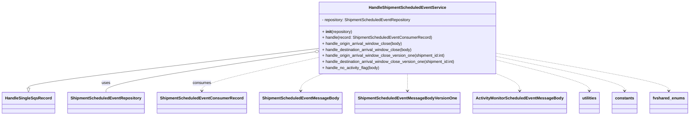
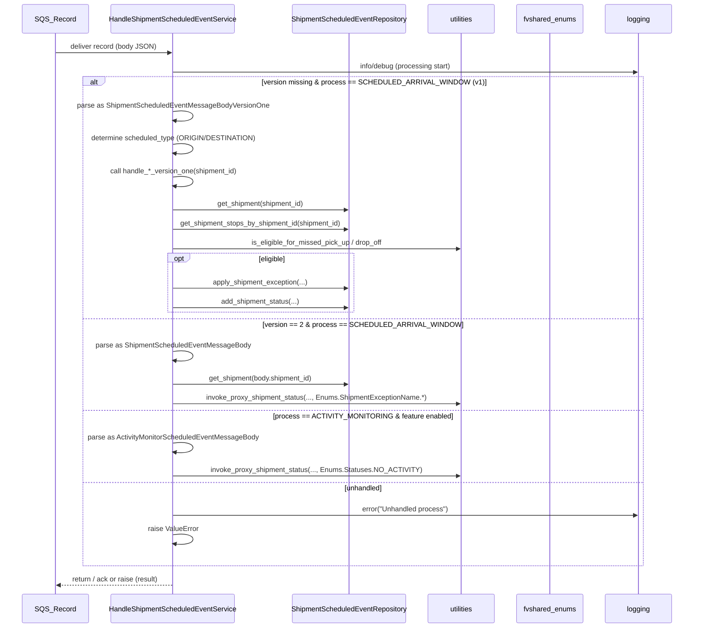

# Diagram: shipment_core/shipment_service/shipment_service/scheduled_event/handle_shipment_scheduled_event_service.py

> Auto-generated by Obscura crawlers

## Diagram 1

### SVG

<svg id="container" width="2619.078125" xmlns="http://www.w3.org/2000/svg" class="classDiagram" height="462" viewBox="0 0 2619.078125 462" role="graphics-document document" aria-roledescription="class"><g><defs><marker id="container_class-aggregationStart" class="marker aggregation class" refX="18" refY="7" markerWidth="190" markerHeight="240" orient="auto"><path d="M 18,7 L9,13 L1,7 L9,1 Z"></path></marker></defs><defs><marker id="container_class-aggregationEnd" class="marker aggregation class" refX="1" refY="7" markerWidth="20" markerHeight="28" orient="auto"><path d="M 18,7 L9,13 L1,7 L9,1 Z"></path></marker></defs><defs><marker id="container_class-extensionStart" class="marker extension class" refX="18" refY="7" markerWidth="190" markerHeight="240" orient="auto"><path d="M 1,7 L18,13 V 1 Z"></path></marker></defs><defs><marker id="container_class-extensionEnd" class="marker extension class" refX="1" refY="7" markerWidth="20" markerHeight="28" orient="auto"><path d="M 1,1 V 13 L18,7 Z"></path></marker></defs><defs><marker id="container_class-compositionStart" class="marker composition class" refX="18" refY="7" markerWidth="190" markerHeight="240" orient="auto"><path d="M 18,7 L9,13 L1,7 L9,1 Z"></path></marker></defs><defs><marker id="container_class-compositionEnd" class="marker composition class" refX="1" refY="7" markerWidth="20" markerHeight="28" orient="auto"><path d="M 18,7 L9,13 L1,7 L9,1 Z"></path></marker></defs><defs><marker id="container_class-dependencyStart" class="marker dependency class" refX="6" refY="7" markerWidth="190" markerHeight="240" orient="auto"><path d="M 5,7 L9,13 L1,7 L9,1 Z"></path></marker></defs><defs><marker id="container_class-dependencyEnd" class="marker dependency class" refX="13" refY="7" markerWidth="20" markerHeight="28" orient="auto"><path d="M 18,7 L9,13 L14,7 L9,1 Z"></path></marker></defs><defs><marker id="container_class-lollipopStart" class="marker lollipop class" refX="13" refY="7" markerWidth="190" markerHeight="240" orient="auto"><circle stroke="black" fill="transparent" cx="7" cy="7" r="6"></circle></marker></defs><defs><marker id="container_class-lollipopEnd" class="marker lollipop class" refX="1" refY="7" markerWidth="190" markerHeight="240" orient="auto"><circle stroke="black" fill="transparent" cx="7" cy="7" r="6"></circle></marker></defs><g class="root"><g class="clusters"></g><g class="edgePaths"><path d="M1186.488,196.704L1006.587,219.42C826.685,242.136,466.882,287.568,286.98,313.576C107.078,339.583,107.078,346.167,107.078,349.458L107.078,352.75" id="id_HandleShipmentScheduledEventService_HandleSingleSqsRecord_1" class="edge-thickness-normal edge-pattern-solid relation" style=";;;" data-edge="true" data-et="edge" data-id="id_HandleShipmentScheduledEventService_HandleSingleSqsRecord_1" data-points="W3sieCI6MTE4Ni40ODgyODEyNSwieSI6MTk2LjcwNDQ4MDU0ODUwMDY3fSx7IngiOjEwNy4wNzgxMjUsInkiOjMzM30seyJ4IjoxMDcuMDc4MTI1LCJ5IjozNzB9XQ==" marker-end="url(#container_class-extensionEnd)"></path><path d="M1169.452,210.973L1041.478,231.311C913.505,251.648,657.557,292.324,529.583,318.829C401.609,345.333,401.609,357.667,401.609,363.833L401.609,370" id="id_HandleShipmentScheduledEventService_ShipmentScheduledEventRepository_2" class="edge-thickness-normal edge-pattern-solid relation" style=";;;" data-edge="true" data-et="edge" data-id="id_HandleShipmentScheduledEventService_ShipmentScheduledEventRepository_2" data-points="W3sieCI6MTE4Ni40ODgyODEyNSwieSI6MjA4LjI2NTI5NjgxMzA0OTYyfSx7IngiOjQwMS42MDkzNzUsInkiOjMzM30seyJ4Ijo0MDEuNjA5Mzc1LCJ5IjozNzB9XQ==" marker-start="url(#container_class-aggregationStart)"></path><path d="M1186.488,234.591L1116.18,250.993C1045.872,267.394,905.257,300.197,834.949,321.765C764.641,343.333,764.641,353.667,764.641,358.833L764.641,364" id="id_HandleShipmentScheduledEventService_ShipmentScheduledEventConsumerRecord_3" class="edge-thickness-normal edge-pattern-dashed relation" style=";;;" data-edge="true" data-et="edge" data-id="id_HandleShipmentScheduledEventService_ShipmentScheduledEventConsumerRecord_3" data-points="W3sieCI6MTE4Ni40ODgyODEyNSwieSI6MjM0LjU5MTI1MDk4MTczNDd9LHsieCI6NzY0LjY0MDYyNSwieSI6MzMzfSx7IngiOjc2NC42NDA2MjUsInkiOjM3MH1d" marker-end="url(#container_class-dependencyEnd)"></path><path d="M1220.049,296L1206.325,302.167C1192.601,308.333,1165.152,320.667,1151.427,332C1137.703,343.333,1137.703,353.667,1137.703,358.833L1137.703,364" id="id_HandleShipmentScheduledEventService_ShipmentScheduledEventMessageBody_4" class="edge-thickness-normal edge-pattern-dashed relation" style=";;;" data-edge="true" data-et="edge" data-id="id_HandleShipmentScheduledEventService_ShipmentScheduledEventMessageBody_4" data-points="W3sieCI6MTIyMC4wNDkyMDU4MDExMDUsInkiOjI5Nn0seyJ4IjoxMTM3LjcwMzEyNSwieSI6MzMzfSx7IngiOjExMzcuNzAzMTI1LCJ5IjozNzB9XQ==" marker-end="url(#container_class-dependencyEnd)"></path><path d="M1540.531,296L1540.531,302.167C1540.531,308.333,1540.531,320.667,1540.531,332C1540.531,343.333,1540.531,353.667,1540.531,358.833L1540.531,364" id="id_HandleShipmentScheduledEventService_ShipmentScheduledEventMessageBodyVersionOne_5" class="edge-thickness-normal edge-pattern-dashed relation" style=";;;" data-edge="true" data-et="edge" data-id="id_HandleShipmentScheduledEventService_ShipmentScheduledEventMessageBodyVersionOne_5" data-points="W3sieCI6MTU0MC41MzEyNSwieSI6Mjk2fSx7IngiOjE1NDAuNTMxMjUsInkiOjMzM30seyJ4IjoxNTQwLjUzMTI1LCJ5IjozNzB9XQ==" marker-end="url(#container_class-dependencyEnd)"></path><path d="M1877.72,296L1892.16,302.167C1906.6,308.333,1935.48,320.667,1949.92,332C1964.359,343.333,1964.359,353.667,1964.359,358.833L1964.359,364" id="id_HandleShipmentScheduledEventService_ActivityMonitorScheduledEventMessageBody_6" class="edge-thickness-normal edge-pattern-dashed relation" style=";;;" data-edge="true" data-et="edge" data-id="id_HandleShipmentScheduledEventService_ActivityMonitorScheduledEventMessageBody_6" data-points="W3sieCI6MTg3Ny43MjA0NzY1MTkzMzcsInkiOjI5Nn0seyJ4IjoxOTY0LjM1OTM3NSwieSI6MzMzfSx7IngiOjE5NjQuMzU5Mzc1LCJ5IjozNzB9XQ==" marker-end="url(#container_class-dependencyEnd)"></path><path d="M1894.574,244.806L1950.649,259.505C2006.724,274.204,2118.874,303.602,2174.949,323.468C2231.023,343.333,2231.023,353.667,2231.023,358.833L2231.023,364" id="id_HandleShipmentScheduledEventService_utilities_7" class="edge-thickness-normal edge-pattern-dashed relation" style=";;;" data-edge="true" data-et="edge" data-id="id_HandleShipmentScheduledEventService_utilities_7" data-points="W3sieCI6MTg5NC41NzQyMTg3NSwieSI6MjQ0LjgwNTk0MTE4Nzc4NDk4fSx7IngiOjIyMzEuMDIzNDM3NSwieSI6MzMzfSx7IngiOjIyMzEuMDIzNDM3NSwieSI6MzcwfV0=" marker-end="url(#container_class-dependencyEnd)"></path><path d="M1894.574,229.352L1973.641,246.627C2052.708,263.901,2210.842,298.451,2289.91,320.892C2368.977,343.333,2368.977,353.667,2368.977,358.833L2368.977,364" id="id_HandleShipmentScheduledEventService_constants_8" class="edge-thickness-normal edge-pattern-dashed relation" style=";;;" data-edge="true" data-et="edge" data-id="id_HandleShipmentScheduledEventService_constants_8" data-points="W3sieCI6MTg5NC41NzQyMTg3NSwieSI6MjI5LjM1MTg0OTc1NjIyNjR9LHsieCI6MjM2OC45NzY1NjI1LCJ5IjozMzN9LHsieCI6MjM2OC45NzY1NjI1LCJ5IjozNzB9XQ==" marker-end="url(#container_class-dependencyEnd)"></path><path d="M1894.574,216.186L2001.964,235.655C2109.354,255.124,2324.134,294.062,2431.524,318.698C2538.914,343.333,2538.914,353.667,2538.914,358.833L2538.914,364" id="id_HandleShipmentScheduledEventService_fvshared_enums_9" class="edge-thickness-normal edge-pattern-dashed relation" style=";;;" data-edge="true" data-et="edge" data-id="id_HandleShipmentScheduledEventService_fvshared_enums_9" data-points="W3sieCI6MTg5NC41NzQyMTg3NSwieSI6MjE2LjE4NTU3NzQ1NzI5NDIyfSx7IngiOjI1MzguOTE0MDYyNSwieSI6MzMzfSx7IngiOjI1MzguOTE0MDYyNSwieSI6MzcwfV0=" marker-end="url(#container_class-dependencyEnd)"></path></g><g class="edgeLabels"><g class="edgeLabel"><g class="label" data-id="id_HandleShipmentScheduledEventService_HandleSingleSqsRecord_1" transform="translate(0, 0)"><foreignObject width="0" height="0">

</foreignObject></g></g><g class="edgeLabel" transform="translate(401.609375, 333)"><g class="label" data-id="id_HandleShipmentScheduledEventService_ShipmentScheduledEventRepository_2" transform="translate(-16.4921875, -12)"><foreignObject width="32.984375" height="24">

uses

</foreignObject></g></g><g class="edgeLabel" transform="translate(764.640625, 333)"><g class="label" data-id="id_HandleShipmentScheduledEventService_ShipmentScheduledEventConsumerRecord_3" transform="translate(-36.375, -12)"><foreignObject width="72.75" height="24">

consumes

</foreignObject></g></g><g class="edgeLabel"><g class="label" data-id="id_HandleShipmentScheduledEventService_ShipmentScheduledEventMessageBody_4" transform="translate(0, 0)"><foreignObject width="0" height="0">

</foreignObject></g></g><g class="edgeLabel"><g class="label" data-id="id_HandleShipmentScheduledEventService_ShipmentScheduledEventMessageBodyVersionOne_5" transform="translate(0, 0)"><foreignObject width="0" height="0">

</foreignObject></g></g><g class="edgeLabel"><g class="label" data-id="id_HandleShipmentScheduledEventService_ActivityMonitorScheduledEventMessageBody_6" transform="translate(0, 0)"><foreignObject width="0" height="0">

</foreignObject></g></g><g class="edgeLabel"><g class="label" data-id="id_HandleShipmentScheduledEventService_utilities_7" transform="translate(0, 0)"><foreignObject width="0" height="0">

</foreignObject></g></g><g class="edgeLabel"><g class="label" data-id="id_HandleShipmentScheduledEventService_constants_8" transform="translate(0, 0)"><foreignObject width="0" height="0">

</foreignObject></g></g><g class="edgeLabel"><g class="label" data-id="id_HandleShipmentScheduledEventService_fvshared_enums_9" transform="translate(0, 0)"><foreignObject width="0" height="0">

</foreignObject></g></g></g><g class="nodes"><g class="node default" id="classId-HandleShipmentScheduledEventService-0" transform="translate(1540.53125, 152)"><g class="basic label-container"><path d="M-354.04296875 -144 L354.04296875 -144 L354.04296875 144 L-354.04296875 144" stroke="none" stroke-width="0" fill="#ECECFF" style=""></path><path d="M-354.04296875 -144 C-139.06707274235092 -144, 75.90882326529817 -144, 354.04296875 -144 M-354.04296875 -144 C-174.03189609344497 -144, 5.979176563110059 -144, 354.04296875 -144 M354.04296875 -144 C354.04296875 -55.72382618107241, 354.04296875 32.55234763785518, 354.04296875 144 M354.04296875 -144 C354.04296875 -61.72393956168659, 354.04296875 20.552120876626816, 354.04296875 144 M354.04296875 144 C126.01578722799485 144, -102.0113942940103 144, -354.04296875 144 M354.04296875 144 C170.35321267559502 144, -13.336543398809965 144, -354.04296875 144 M-354.04296875 144 C-354.04296875 31.62677107901638, -354.04296875 -80.74645784196724, -354.04296875 -144 M-354.04296875 144 C-354.04296875 31.307862681809354, -354.04296875 -81.38427463638129, -354.04296875 -144" stroke="#9370DB" stroke-width="1.3" fill="none" stroke-dasharray="0 0" style=""></path></g><g class="annotation-group text" transform="translate(0, -120)"></g><g class="label-group text" transform="translate(-146.2109375, -120)"><g class="label" style="font-weight: bolder" transform="translate(0,-12)"><foreignObject width="292.421875" height="24">

HandleShipmentScheduledEventService

</foreignObject></g></g><g class="members-group text" transform="translate(-342.04296875, -72)"><g class="label" style="" transform="translate(0,-12)"><foreignObject width="356.796875" height="24">

- repository: ShipmentScheduledEventRepository

</foreignObject></g></g><g class="methods-group text" transform="translate(-342.04296875, -24)"><g class="label" style="" transform="translate(0,-12)"><foreignObject width="121.21875" height="24">

+ <strong>init</strong>(repository)

</foreignObject></g><g class="label" style="" transform="translate(0,12)"><foreignObject width="436.09375" height="24">

+ handle(record: ShipmentScheduledEventConsumerRecord)

</foreignObject></g><g class="label" style="" transform="translate(0,36)"><foreignObject width="322.796875" height="24">

+ handle_origin_arrival_window_close(body)

</foreignObject></g><g class="label" style="" transform="translate(0,60)"><foreignObject width="363.6875" height="24">

+ handle_destination_arrival_window_close(body)

</foreignObject></g><g class="label" style="" transform="translate(0,84)"><foreignObject width="496.984375" height="24">

+ handle_origin_arrival_window_close_version_one(shipment_id:int)

</foreignObject></g><g class="label" style="" transform="translate(0,108)"><foreignObject width="537.875" height="24">

+ handle_destination_arrival_window_close_version_one(shipment_id:int)

</foreignObject></g><g class="label" style="" transform="translate(0,132)"><foreignObject width="230.015625" height="24">

+ handle_no_activity_flag(body)

</foreignObject></g></g><g class="divider" style=""><path d="M-354.04296875 -96 C-205.52845112180162 -96, -57.01393349360325 -96, 354.04296875 -96 M-354.04296875 -96 C-175.83587377345913 -96, 2.3712212030817454 -96, 354.04296875 -96" stroke="#9370DB" stroke-width="1.3" fill="none" stroke-dasharray="0 0" style=""></path></g><g class="divider" style=""><path d="M-354.04296875 -48 C-120.29269907214857 -48, 113.45757060570287 -48, 354.04296875 -48 M-354.04296875 -48 C-100.9084700484917 -48, 152.2260286530166 -48, 354.04296875 -48" stroke="#9370DB" stroke-width="1.3" fill="none" stroke-dasharray="0 0" style=""></path></g></g><g class="node default" id="classId-HandleSingleSqsRecord-1" transform="translate(107.078125, 412)"><g class="basic label-container"><path d="M-99.078125 -42 L99.078125 -42 L99.078125 42 L-99.078125 42" stroke="none" stroke-width="0" fill="#ECECFF" style=""></path><path d="M-99.078125 -42 C-33.445024241698164 -42, 32.18807651660367 -42, 99.078125 -42 M-99.078125 -42 C-42.02608966248406 -42, 15.025945675031878 -42, 99.078125 -42 M99.078125 -42 C99.078125 -16.17040049179506, 99.078125 9.659199016409879, 99.078125 42 M99.078125 -42 C99.078125 -13.51587336880521, 99.078125 14.968253262389581, 99.078125 42 M99.078125 42 C21.605131750272605 42, -55.86786149945479 42, -99.078125 42 M99.078125 42 C53.634226452776716 42, 8.190327905553431 42, -99.078125 42 M-99.078125 42 C-99.078125 16.8287878035781, -99.078125 -8.342424392843803, -99.078125 -42 M-99.078125 42 C-99.078125 15.940053634175317, -99.078125 -10.119892731649365, -99.078125 -42" stroke="#9370DB" stroke-width="1.3" fill="none" stroke-dasharray="0 0" style=""></path></g><g class="annotation-group text" transform="translate(0, -18)"></g><g class="label-group text" transform="translate(-87.078125, -18)"><g class="label" style="font-weight: bolder" transform="translate(0,-12)"><foreignObject width="174.15625" height="24">

HandleSingleSqsRecord

</foreignObject></g></g><g class="members-group text" transform="translate(-87.078125, 30)"></g><g class="methods-group text" transform="translate(-87.078125, 60)"></g><g class="divider" style=""><path d="M-99.078125 6 C-47.61143807141324 6, 3.855248857173521 6, 99.078125 6 M-99.078125 6 C-37.785255763476584 6, 23.50761347304683 6, 99.078125 6" stroke="#9370DB" stroke-width="1.3" fill="none" stroke-dasharray="0 0" style=""></path></g><g class="divider" style=""><path d="M-99.078125 24 C-57.07887986276401 24, -15.079634725528024 24, 99.078125 24 M-99.078125 24 C-22.198901021313432 24, 54.680322957373136 24, 99.078125 24" stroke="#9370DB" stroke-width="1.3" fill="none" stroke-dasharray="0 0" style=""></path></g></g><g class="node default" id="classId-ShipmentScheduledEventRepository-2" transform="translate(401.609375, 412)"><g class="basic label-container"><path d="M-145.453125 -42 L145.453125 -42 L145.453125 42 L-145.453125 42" stroke="none" stroke-width="0" fill="#ECECFF" style=""></path><path d="M-145.453125 -42 C-56.06034823126895 -42, 33.33242853746211 -42, 145.453125 -42 M-145.453125 -42 C-32.57816273930139 -42, 80.29679952139722 -42, 145.453125 -42 M145.453125 -42 C145.453125 -13.31876036615126, 145.453125 15.36247926769748, 145.453125 42 M145.453125 -42 C145.453125 -10.141865634849484, 145.453125 21.71626873030103, 145.453125 42 M145.453125 42 C42.244285541609145 42, -60.96455391678171 42, -145.453125 42 M145.453125 42 C45.62141492215733 42, -54.210295155685344 42, -145.453125 42 M-145.453125 42 C-145.453125 11.828200881048247, -145.453125 -18.343598237903507, -145.453125 -42 M-145.453125 42 C-145.453125 24.091109289219503, -145.453125 6.182218578439006, -145.453125 -42" stroke="#9370DB" stroke-width="1.3" fill="none" stroke-dasharray="0 0" style=""></path></g><g class="annotation-group text" transform="translate(0, -18)"></g><g class="label-group text" transform="translate(-133.453125, -18)"><g class="label" style="font-weight: bolder" transform="translate(0,-12)"><foreignObject width="266.90625" height="24">

ShipmentScheduledEventRepository

</foreignObject></g></g><g class="members-group text" transform="translate(-133.453125, 30)"></g><g class="methods-group text" transform="translate(-133.453125, 60)"></g><g class="divider" style=""><path d="M-145.453125 6 C-84.43376117279723 6, -23.41439734559448 6, 145.453125 6 M-145.453125 6 C-67.80804088003669 6, 9.83704323992663 6, 145.453125 6" stroke="#9370DB" stroke-width="1.3" fill="none" stroke-dasharray="0 0" style=""></path></g><g class="divider" style=""><path d="M-145.453125 24 C-66.65255762258622 24, 12.14800975482757 24, 145.453125 24 M-145.453125 24 C-56.50960748242528 24, 32.43391003514944 24, 145.453125 24" stroke="#9370DB" stroke-width="1.3" fill="none" stroke-dasharray="0 0" style=""></path></g></g><g class="node default" id="classId-ShipmentScheduledEventConsumerRecord-3" transform="translate(764.640625, 412)"><g class="basic label-container"><path d="M-167.578125 -42 L167.578125 -42 L167.578125 42 L-167.578125 42" stroke="none" stroke-width="0" fill="#ECECFF" style=""></path><path d="M-167.578125 -42 C-49.27460845583856 -42, 69.02890808832288 -42, 167.578125 -42 M-167.578125 -42 C-53.99571455007492 -42, 59.586695899850156 -42, 167.578125 -42 M167.578125 -42 C167.578125 -21.265049302411864, 167.578125 -0.5300986048237277, 167.578125 42 M167.578125 -42 C167.578125 -20.6082542435839, 167.578125 0.7834915128321995, 167.578125 42 M167.578125 42 C94.0358207613321 42, 20.49351652266421 42, -167.578125 42 M167.578125 42 C55.776323827870954 42, -56.02547734425809 42, -167.578125 42 M-167.578125 42 C-167.578125 23.84524484633, -167.578125 5.690489692660002, -167.578125 -42 M-167.578125 42 C-167.578125 19.5567811995647, -167.578125 -2.8864376008706003, -167.578125 -42" stroke="#9370DB" stroke-width="1.3" fill="none" stroke-dasharray="0 0" style=""></path></g><g class="annotation-group text" transform="translate(0, -18)"></g><g class="label-group text" transform="translate(-155.578125, -18)"><g class="label" style="font-weight: bolder" transform="translate(0,-12)"><foreignObject width="311.15625" height="24">

ShipmentScheduledEventConsumerRecord

</foreignObject></g></g><g class="members-group text" transform="translate(-155.578125, 30)"></g><g class="methods-group text" transform="translate(-155.578125, 60)"></g><g class="divider" style=""><path d="M-167.578125 6 C-60.466796126909784 6, 46.64453274618043 6, 167.578125 6 M-167.578125 6 C-100.09860503759958 6, -32.619085075199166 6, 167.578125 6" stroke="#9370DB" stroke-width="1.3" fill="none" stroke-dasharray="0 0" style=""></path></g><g class="divider" style=""><path d="M-167.578125 24 C-48.942233675061374 24, 69.69365764987725 24, 167.578125 24 M-167.578125 24 C-44.622198191341326 24, 78.33372861731735 24, 167.578125 24" stroke="#9370DB" stroke-width="1.3" fill="none" stroke-dasharray="0 0" style=""></path></g></g><g class="node default" id="classId-ShipmentScheduledEventMessageBody-4" transform="translate(1137.703125, 412)"><g class="basic label-container"><path d="M-155.484375 -42 L155.484375 -42 L155.484375 42 L-155.484375 42" stroke="none" stroke-width="0" fill="#ECECFF" style=""></path><path d="M-155.484375 -42 C-46.57846889709893 -42, 62.32743720580214 -42, 155.484375 -42 M-155.484375 -42 C-40.20622498091606 -42, 75.07192503816788 -42, 155.484375 -42 M155.484375 -42 C155.484375 -14.351030119811458, 155.484375 13.297939760377083, 155.484375 42 M155.484375 -42 C155.484375 -12.652411833597771, 155.484375 16.695176332804458, 155.484375 42 M155.484375 42 C62.08942021663589 42, -31.305534566728227 42, -155.484375 42 M155.484375 42 C92.16184420808406 42, 28.83931341616811 42, -155.484375 42 M-155.484375 42 C-155.484375 22.97465044285352, -155.484375 3.9493008857070393, -155.484375 -42 M-155.484375 42 C-155.484375 21.574984625279562, -155.484375 1.1499692505591241, -155.484375 -42" stroke="#9370DB" stroke-width="1.3" fill="none" stroke-dasharray="0 0" style=""></path></g><g class="annotation-group text" transform="translate(0, -18)"></g><g class="label-group text" transform="translate(-143.484375, -18)"><g class="label" style="font-weight: bolder" transform="translate(0,-12)"><foreignObject width="286.96875" height="24">

ShipmentScheduledEventMessageBody

</foreignObject></g></g><g class="members-group text" transform="translate(-143.484375, 30)"></g><g class="methods-group text" transform="translate(-143.484375, 60)"></g><g class="divider" style=""><path d="M-155.484375 6 C-74.31867017958105 6, 6.847034640837904 6, 155.484375 6 M-155.484375 6 C-43.6332460955105 6, 68.217882808979 6, 155.484375 6" stroke="#9370DB" stroke-width="1.3" fill="none" stroke-dasharray="0 0" style=""></path></g><g class="divider" style=""><path d="M-155.484375 24 C-64.7389140373291 24, 26.00654692534181 24, 155.484375 24 M-155.484375 24 C-55.338801329624545 24, 44.80677234075091 24, 155.484375 24" stroke="#9370DB" stroke-width="1.3" fill="none" stroke-dasharray="0 0" style=""></path></g></g><g class="node default" id="classId-ShipmentScheduledEventMessageBodyVersionOne-5" transform="translate(1540.53125, 412)"><g class="basic label-container"><path d="M-197.34375 -42 L197.34375 -42 L197.34375 42 L-197.34375 42" stroke="none" stroke-width="0" fill="#ECECFF" style=""></path><path d="M-197.34375 -42 C-117.45290575741744 -42, -37.56206151483488 -42, 197.34375 -42 M-197.34375 -42 C-49.648781654256055 -42, 98.04618669148789 -42, 197.34375 -42 M197.34375 -42 C197.34375 -21.028434535593963, 197.34375 -0.05686907118792561, 197.34375 42 M197.34375 -42 C197.34375 -10.807082264509386, 197.34375 20.385835470981228, 197.34375 42 M197.34375 42 C85.16749337048168 42, -27.00876325903664 42, -197.34375 42 M197.34375 42 C106.41870332045087 42, 15.493656640901747 42, -197.34375 42 M-197.34375 42 C-197.34375 9.539217584111967, -197.34375 -22.921564831776067, -197.34375 -42 M-197.34375 42 C-197.34375 15.546401627907318, -197.34375 -10.907196744185363, -197.34375 -42" stroke="#9370DB" stroke-width="1.3" fill="none" stroke-dasharray="0 0" style=""></path></g><g class="annotation-group text" transform="translate(0, -18)"></g><g class="label-group text" transform="translate(-185.34375, -18)"><g class="label" style="font-weight: bolder" transform="translate(0,-12)"><foreignObject width="370.6875" height="24">

ShipmentScheduledEventMessageBodyVersionOne

</foreignObject></g></g><g class="members-group text" transform="translate(-185.34375, 30)"></g><g class="methods-group text" transform="translate(-185.34375, 60)"></g><g class="divider" style=""><path d="M-197.34375 6 C-100.38847040101388 6, -3.4331908020277524 6, 197.34375 6 M-197.34375 6 C-72.87183757467226 6, 51.60007485065549 6, 197.34375 6" stroke="#9370DB" stroke-width="1.3" fill="none" stroke-dasharray="0 0" style=""></path></g><g class="divider" style=""><path d="M-197.34375 24 C-71.20013103957209 24, 54.94348792085583 24, 197.34375 24 M-197.34375 24 C-50.91436557976979 24, 95.51501884046041 24, 197.34375 24" stroke="#9370DB" stroke-width="1.3" fill="none" stroke-dasharray="0 0" style=""></path></g></g><g class="node default" id="classId-ActivityMonitorScheduledEventMessageBody-6" transform="translate(1964.359375, 412)"><g class="basic label-container"><path d="M-176.484375 -42 L176.484375 -42 L176.484375 42 L-176.484375 42" stroke="none" stroke-width="0" fill="#ECECFF" style=""></path><path d="M-176.484375 -42 C-51.46444299914654 -42, 73.55548900170692 -42, 176.484375 -42 M-176.484375 -42 C-50.56186724541621 -42, 75.36064050916758 -42, 176.484375 -42 M176.484375 -42 C176.484375 -24.601254564128915, 176.484375 -7.20250912825783, 176.484375 42 M176.484375 -42 C176.484375 -18.778603254946997, 176.484375 4.4427934901060055, 176.484375 42 M176.484375 42 C102.74904578432887 42, 29.013716568657742 42, -176.484375 42 M176.484375 42 C103.17710466691446 42, 29.86983433382892 42, -176.484375 42 M-176.484375 42 C-176.484375 24.787176901293172, -176.484375 7.574353802586344, -176.484375 -42 M-176.484375 42 C-176.484375 18.888925771189733, -176.484375 -4.222148457620534, -176.484375 -42" stroke="#9370DB" stroke-width="1.3" fill="none" stroke-dasharray="0 0" style=""></path></g><g class="annotation-group text" transform="translate(0, -18)"></g><g class="label-group text" transform="translate(-164.484375, -18)"><g class="label" style="font-weight: bolder" transform="translate(0,-12)"><foreignObject width="328.96875" height="24">

ActivityMonitorScheduledEventMessageBody

</foreignObject></g></g><g class="members-group text" transform="translate(-164.484375, 30)"></g><g class="methods-group text" transform="translate(-164.484375, 60)"></g><g class="divider" style=""><path d="M-176.484375 6 C-105.30158595818077 6, -34.11879691636153 6, 176.484375 6 M-176.484375 6 C-53.74707477837963 6, 68.99022544324075 6, 176.484375 6" stroke="#9370DB" stroke-width="1.3" fill="none" stroke-dasharray="0 0" style=""></path></g><g class="divider" style=""><path d="M-176.484375 24 C-45.65062538698146 24, 85.18312422603708 24, 176.484375 24 M-176.484375 24 C-81.64181680340978 24, 13.200741393180436 24, 176.484375 24" stroke="#9370DB" stroke-width="1.3" fill="none" stroke-dasharray="0 0" style=""></path></g></g><g class="node default" id="classId-utilities-7" transform="translate(2231.0234375, 412)"><g class="basic label-container"><path d="M-40.1796875 -42 L40.1796875 -42 L40.1796875 42 L-40.1796875 42" stroke="none" stroke-width="0" fill="#ECECFF" style=""></path><path d="M-40.1796875 -42 C-10.279679411397261 -42, 19.620328677205478 -42, 40.1796875 -42 M-40.1796875 -42 C-10.224435337403172 -42, 19.730816825193656 -42, 40.1796875 -42 M40.1796875 -42 C40.1796875 -14.762787767306556, 40.1796875 12.474424465386889, 40.1796875 42 M40.1796875 -42 C40.1796875 -20.25585665369426, 40.1796875 1.4882866926114815, 40.1796875 42 M40.1796875 42 C23.63117265418311 42, 7.082657808366221 42, -40.1796875 42 M40.1796875 42 C12.901498289326113 42, -14.376690921347773 42, -40.1796875 42 M-40.1796875 42 C-40.1796875 21.310368538476816, -40.1796875 0.6207370769536311, -40.1796875 -42 M-40.1796875 42 C-40.1796875 13.300258231283621, -40.1796875 -15.399483537432758, -40.1796875 -42" stroke="#9370DB" stroke-width="1.3" fill="none" stroke-dasharray="0 0" style=""></path></g><g class="annotation-group text" transform="translate(0, -18)"></g><g class="label-group text" transform="translate(-28.1796875, -18)"><g class="label" style="font-weight: bolder" transform="translate(0,-12)"><foreignObject width="56.359375" height="24">

utilities

</foreignObject></g></g><g class="members-group text" transform="translate(-28.1796875, 30)"></g><g class="methods-group text" transform="translate(-28.1796875, 60)"></g><g class="divider" style=""><path d="M-40.1796875 6 C-14.432238683127576 6, 11.315210133744849 6, 40.1796875 6 M-40.1796875 6 C-19.219497063001285 6, 1.7406933739974306 6, 40.1796875 6" stroke="#9370DB" stroke-width="1.3" fill="none" stroke-dasharray="0 0" style=""></path></g><g class="divider" style=""><path d="M-40.1796875 24 C-21.33458740032011 24, -2.4894873006402207 24, 40.1796875 24 M-40.1796875 24 C-10.972049496064276 24, 18.235588507871448 24, 40.1796875 24" stroke="#9370DB" stroke-width="1.3" fill="none" stroke-dasharray="0 0" style=""></path></g></g><g class="node default" id="classId-constants-8" transform="translate(2368.9765625, 412)"><g class="basic label-container"><path d="M-47.7734375 -42 L47.7734375 -42 L47.7734375 42 L-47.7734375 42" stroke="none" stroke-width="0" fill="#ECECFF" style=""></path><path d="M-47.7734375 -42 C-26.462611845041422 -42, -5.151786190082845 -42, 47.7734375 -42 M-47.7734375 -42 C-23.665621495288875 -42, 0.4421945094222508 -42, 47.7734375 -42 M47.7734375 -42 C47.7734375 -17.03536835478858, 47.7734375 7.929263290422838, 47.7734375 42 M47.7734375 -42 C47.7734375 -22.940439581792784, 47.7734375 -3.8808791635855684, 47.7734375 42 M47.7734375 42 C20.89793004578518 42, -5.977577408429639 42, -47.7734375 42 M47.7734375 42 C20.135923901831475 42, -7.501589696337049 42, -47.7734375 42 M-47.7734375 42 C-47.7734375 23.619018055741822, -47.7734375 5.238036111483645, -47.7734375 -42 M-47.7734375 42 C-47.7734375 21.874190313464645, -47.7734375 1.7483806269292899, -47.7734375 -42" stroke="#9370DB" stroke-width="1.3" fill="none" stroke-dasharray="0 0" style=""></path></g><g class="annotation-group text" transform="translate(0, -18)"></g><g class="label-group text" transform="translate(-35.7734375, -18)"><g class="label" style="font-weight: bolder" transform="translate(0,-12)"><foreignObject width="71.546875" height="24">

constants

</foreignObject></g></g><g class="members-group text" transform="translate(-35.7734375, 30)"></g><g class="methods-group text" transform="translate(-35.7734375, 60)"></g><g class="divider" style=""><path d="M-47.7734375 6 C-26.977327994588798 6, -6.181218489177596 6, 47.7734375 6 M-47.7734375 6 C-25.41902694899269 6, -3.0646163979853824 6, 47.7734375 6" stroke="#9370DB" stroke-width="1.3" fill="none" stroke-dasharray="0 0" style=""></path></g><g class="divider" style=""><path d="M-47.7734375 24 C-18.784583446501465 24, 10.20427060699707 24, 47.7734375 24 M-47.7734375 24 C-12.383917236619638 24, 23.005603026760724 24, 47.7734375 24" stroke="#9370DB" stroke-width="1.3" fill="none" stroke-dasharray="0 0" style=""></path></g></g><g class="node default" id="classId-fvshared_enums-9" transform="translate(2538.9140625, 412)"><g class="basic label-container"><path d="M-72.1640625 -42 L72.1640625 -42 L72.1640625 42 L-72.1640625 42" stroke="none" stroke-width="0" fill="#ECECFF" style=""></path><path d="M-72.1640625 -42 C-32.6990618116335 -42, 6.765938876733003 -42, 72.1640625 -42 M-72.1640625 -42 C-37.07839789103824 -42, -1.992733282076486 -42, 72.1640625 -42 M72.1640625 -42 C72.1640625 -14.395044701127265, 72.1640625 13.20991059774547, 72.1640625 42 M72.1640625 -42 C72.1640625 -23.839664226548763, 72.1640625 -5.679328453097526, 72.1640625 42 M72.1640625 42 C15.645378612331555 42, -40.87330527533689 42, -72.1640625 42 M72.1640625 42 C30.932510472962086 42, -10.299041554075828 42, -72.1640625 42 M-72.1640625 42 C-72.1640625 18.06530670702416, -72.1640625 -5.8693865859516805, -72.1640625 -42 M-72.1640625 42 C-72.1640625 23.452162721949946, -72.1640625 4.904325443899893, -72.1640625 -42" stroke="#9370DB" stroke-width="1.3" fill="none" stroke-dasharray="0 0" style=""></path></g><g class="annotation-group text" transform="translate(0, -18)"></g><g class="label-group text" transform="translate(-60.1640625, -18)"><g class="label" style="font-weight: bolder" transform="translate(0,-12)"><foreignObject width="120.328125" height="24">

fvshared_enums

</foreignObject></g></g><g class="members-group text" transform="translate(-60.1640625, 30)"></g><g class="methods-group text" transform="translate(-60.1640625, 60)"></g><g class="divider" style=""><path d="M-72.1640625 6 C-27.655120806132217 6, 16.853820887735566 6, 72.1640625 6 M-72.1640625 6 C-39.201982789979105 6, -6.239903079958211 6, 72.1640625 6" stroke="#9370DB" stroke-width="1.3" fill="none" stroke-dasharray="0 0" style=""></path></g><g class="divider" style=""><path d="M-72.1640625 24 C-36.180253119472454 24, -0.1964437389449074 24, 72.1640625 24 M-72.1640625 24 C-35.079193216375536 24, 2.0056760672489276 24, 72.1640625 24" stroke="#9370DB" stroke-width="1.3" fill="none" stroke-dasharray="0 0" style=""></path></g></g></g></g></g></svg>

## Diagram 2

### SVG

<svg id="container" width="1639" xmlns="http://www.w3.org/2000/svg" height="1490" viewBox="-50 -10 1639 1490" role="graphics-document document" aria-roledescription="sequence"><g><rect x="1389" y="1404" fill="#eaeaea" stroke="#666" width="150" height="65" name="Log" rx="3" ry="3" class="actor actor-bottom"></rect><text x="1464" y="1436.5" dominant-baseline="central" alignment-baseline="central" class="actor actor-box" style="text-anchor: middle; font-size: 16px; font-weight: 400;"><tspan x="1464" dy="0">logging</tspan></text></g><g><rect x="1189" y="1404" fill="#eaeaea" stroke="#666" width="150" height="65" name="Enums" rx="3" ry="3" class="actor actor-bottom"></rect><text x="1264" y="1436.5" dominant-baseline="central" alignment-baseline="central" class="actor actor-box" style="text-anchor: middle; font-size: 16px; font-weight: 400;"><tspan x="1264" dy="0">fvshared_enums</tspan></text></g><g><rect x="989" y="1404" fill="#eaeaea" stroke="#666" width="150" height="65" name="Utils" rx="3" ry="3" class="actor actor-bottom"></rect><text x="1064" y="1436.5" dominant-baseline="central" alignment-baseline="central" class="actor actor-box" style="text-anchor: middle; font-size: 16px; font-weight: 400;"><tspan x="1064" dy="0">utilities</tspan></text></g><g><rect x="655" y="1404" fill="#eaeaea" stroke="#666" width="284" height="65" name="Repo" rx="3" ry="3" class="actor actor-bottom"></rect><text x="797" y="1436.5" dominant-baseline="central" alignment-baseline="central" class="actor actor-box" style="text-anchor: middle; font-size: 16px; font-weight: 400;"><tspan x="797" dy="0">ShipmentScheduledEventRepository</tspan></text></g><g><rect x="200" y="1404" fill="#eaeaea" stroke="#666" width="310" height="65" name="Service" rx="3" ry="3" class="actor actor-bottom"></rect><text x="355" y="1436.5" dominant-baseline="central" alignment-baseline="central" class="actor actor-box" style="text-anchor: middle; font-size: 16px; font-weight: 400;"><tspan x="355" dy="0">HandleShipmentScheduledEventService</tspan></text></g><g><rect x="0" y="1404" fill="#eaeaea" stroke="#666" width="150" height="65" name="SQS" rx="3" ry="3" class="actor actor-bottom"></rect><text x="75" y="1436.5" dominant-baseline="central" alignment-baseline="central" class="actor actor-box" style="text-anchor: middle; font-size: 16px; font-weight: 400;"><tspan x="75" dy="0">SQS_Record</tspan></text></g><g><line id="actor5" x1="1464" y1="65" x2="1464" y2="1404" class="actor-line 200" stroke-width="0.5px" stroke="#999" name="Log"></line><g id="root-5"><rect x="1389" y="0" fill="#eaeaea" stroke="#666" width="150" height="65" name="Log" rx="3" ry="3" class="actor actor-top"></rect><text x="1464" y="32.5" dominant-baseline="central" alignment-baseline="central" class="actor actor-box" style="text-anchor: middle; font-size: 16px; font-weight: 400;"><tspan x="1464" dy="0">logging</tspan></text></g></g><g><line id="actor4" x1="1264" y1="65" x2="1264" y2="1404" class="actor-line 200" stroke-width="0.5px" stroke="#999" name="Enums"></line><g id="root-4"><rect x="1189" y="0" fill="#eaeaea" stroke="#666" width="150" height="65" name="Enums" rx="3" ry="3" class="actor actor-top"></rect><text x="1264" y="32.5" dominant-baseline="central" alignment-baseline="central" class="actor actor-box" style="text-anchor: middle; font-size: 16px; font-weight: 400;"><tspan x="1264" dy="0">fvshared_enums</tspan></text></g></g><g><line id="actor3" x1="1064" y1="65" x2="1064" y2="1404" class="actor-line 200" stroke-width="0.5px" stroke="#999" name="Utils"></line><g id="root-3"><rect x="989" y="0" fill="#eaeaea" stroke="#666" width="150" height="65" name="Utils" rx="3" ry="3" class="actor actor-top"></rect><text x="1064" y="32.5" dominant-baseline="central" alignment-baseline="central" class="actor actor-box" style="text-anchor: middle; font-size: 16px; font-weight: 400;"><tspan x="1064" dy="0">utilities</tspan></text></g></g><g><line id="actor2" x1="797" y1="65" x2="797" y2="1404" class="actor-line 200" stroke-width="0.5px" stroke="#999" name="Repo"></line><g id="root-2"><rect x="655" y="0" fill="#eaeaea" stroke="#666" width="284" height="65" name="Repo" rx="3" ry="3" class="actor actor-top"></rect><text x="797" y="32.5" dominant-baseline="central" alignment-baseline="central" class="actor actor-box" style="text-anchor: middle; font-size: 16px; font-weight: 400;"><tspan x="797" dy="0">ShipmentScheduledEventRepository</tspan></text></g></g><g><line id="actor1" x1="355" y1="65" x2="355" y2="1404" class="actor-line 200" stroke-width="0.5px" stroke="#999" name="Service"></line><g id="root-1"><rect x="200" y="0" fill="#eaeaea" stroke="#666" width="310" height="65" name="Service" rx="3" ry="3" class="actor actor-top"></rect><text x="355" y="32.5" dominant-baseline="central" alignment-baseline="central" class="actor actor-box" style="text-anchor: middle; font-size: 16px; font-weight: 400;"><tspan x="355" dy="0">HandleShipmentScheduledEventService</tspan></text></g></g><g><line id="actor0" x1="75" y1="65" x2="75" y2="1404" class="actor-line 200" stroke-width="0.5px" stroke="#999" name="SQS"></line><g id="root-0"><rect x="0" y="0" fill="#eaeaea" stroke="#666" width="150" height="65" name="SQS" rx="3" ry="3" class="actor actor-top"></rect><text x="75" y="32.5" dominant-baseline="central" alignment-baseline="central" class="actor actor-box" style="text-anchor: middle; font-size: 16px; font-weight: 400;"><tspan x="75" dy="0">SQS_Record</tspan></text></g></g><g></g><defs><symbol id="computer" width="24" height="24"><path transform="scale(.5)" d="M2 2v13h20v-13h-20zm18 11h-16v-9h16v9zm-10.228 6l.466-1h3.524l.467 1h-4.457zm14.228 3h-24l2-6h2.104l-1.33 4h18.45l-1.297-4h2.073l2 6zm-5-10h-14v-7h14v7z"></path></symbol></defs><defs><symbol id="database" fill-rule="evenodd" clip-rule="evenodd"><path transform="scale(.5)" d="M12.258.001l.256.004.255.005.253.008.251.01.249.012.247.015.246.016.242.019.241.02.239.023.236.024.233.027.231.028.229.031.225.032.223.034.22.036.217.038.214.04.211.041.208.043.205.045.201.046.198.048.194.05.191.051.187.053.183.054.18.056.175.057.172.059.168.06.163.061.16.063.155.064.15.066.074.033.073.033.071.034.07.034.069.035.068.035.067.035.066.035.064.036.064.036.062.036.06.036.06.037.058.037.058.037.055.038.055.038.053.038.052.038.051.039.05.039.048.039.047.039.045.04.044.04.043.04.041.04.04.041.039.041.037.041.036.041.034.041.033.042.032.042.03.042.029.042.027.042.026.043.024.043.023.043.021.043.02.043.018.044.017.043.015.044.013.044.012.044.011.045.009.044.007.045.006.045.004.045.002.045.001.045v17l-.001.045-.002.045-.004.045-.006.045-.007.045-.009.044-.011.045-.012.044-.013.044-.015.044-.017.043-.018.044-.02.043-.021.043-.023.043-.024.043-.026.043-.027.042-.029.042-.03.042-.032.042-.033.042-.034.041-.036.041-.037.041-.039.041-.04.041-.041.04-.043.04-.044.04-.045.04-.047.039-.048.039-.05.039-.051.039-.052.038-.053.038-.055.038-.055.038-.058.037-.058.037-.06.037-.06.036-.062.036-.064.036-.064.036-.066.035-.067.035-.068.035-.069.035-.07.034-.071.034-.073.033-.074.033-.15.066-.155.064-.16.063-.163.061-.168.06-.172.059-.175.057-.18.056-.183.054-.187.053-.191.051-.194.05-.198.048-.201.046-.205.045-.208.043-.211.041-.214.04-.217.038-.22.036-.223.034-.225.032-.229.031-.231.028-.233.027-.236.024-.239.023-.241.02-.242.019-.246.016-.247.015-.249.012-.251.01-.253.008-.255.005-.256.004-.258.001-.258-.001-.256-.004-.255-.005-.253-.008-.251-.01-.249-.012-.247-.015-.245-.016-.243-.019-.241-.02-.238-.023-.236-.024-.234-.027-.231-.028-.228-.031-.226-.032-.223-.034-.22-.036-.217-.038-.214-.04-.211-.041-.208-.043-.204-.045-.201-.046-.198-.048-.195-.05-.19-.051-.187-.053-.184-.054-.179-.056-.176-.057-.172-.059-.167-.06-.164-.061-.159-.063-.155-.064-.151-.066-.074-.033-.072-.033-.072-.034-.07-.034-.069-.035-.068-.035-.067-.035-.066-.035-.064-.036-.063-.036-.062-.036-.061-.036-.06-.037-.058-.037-.057-.037-.056-.038-.055-.038-.053-.038-.052-.038-.051-.039-.049-.039-.049-.039-.046-.039-.046-.04-.044-.04-.043-.04-.041-.04-.04-.041-.039-.041-.037-.041-.036-.041-.034-.041-.033-.042-.032-.042-.03-.042-.029-.042-.027-.042-.026-.043-.024-.043-.023-.043-.021-.043-.02-.043-.018-.044-.017-.043-.015-.044-.013-.044-.012-.044-.011-.045-.009-.044-.007-.045-.006-.045-.004-.045-.002-.045-.001-.045v-17l.001-.045.002-.045.004-.045.006-.045.007-.045.009-.044.011-.045.012-.044.013-.044.015-.044.017-.043.018-.044.02-.043.021-.043.023-.043.024-.043.026-.043.027-.042.029-.042.03-.042.032-.042.033-.042.034-.041.036-.041.037-.041.039-.041.04-.041.041-.04.043-.04.044-.04.046-.04.046-.039.049-.039.049-.039.051-.039.052-.038.053-.038.055-.038.056-.038.057-.037.058-.037.06-.037.061-.036.062-.036.063-.036.064-.036.066-.035.067-.035.068-.035.069-.035.07-.034.072-.034.072-.033.074-.033.151-.066.155-.064.159-.063.164-.061.167-.06.172-.059.176-.057.179-.056.184-.054.187-.053.19-.051.195-.05.198-.048.201-.046.204-.045.208-.043.211-.041.214-.04.217-.038.22-.036.223-.034.226-.032.228-.031.231-.028.234-.027.236-.024.238-.023.241-.02.243-.019.245-.016.247-.015.249-.012.251-.01.253-.008.255-.005.256-.004.258-.001.258.001zm-9.258 20.499v.01l.001.021.003.021.004.022.005.021.006.022.007.022.009.023.01.022.011.023.012.023.013.023.015.023.016.024.017.023.018.024.019.024.021.024.022.025.023.024.024.025.052.049.056.05.061.051.066.051.07.051.075.051.079.052.084.052.088.052.092.052.097.052.102.051.105.052.11.052.114.051.119.051.123.051.127.05.131.05.135.05.139.048.144.049.147.047.152.047.155.047.16.045.163.045.167.043.171.043.176.041.178.041.183.039.187.039.19.037.194.035.197.035.202.033.204.031.209.03.212.029.216.027.219.025.222.024.226.021.23.02.233.018.236.016.24.015.243.012.246.01.249.008.253.005.256.004.259.001.26-.001.257-.004.254-.005.25-.008.247-.011.244-.012.241-.014.237-.016.233-.018.231-.021.226-.021.224-.024.22-.026.216-.027.212-.028.21-.031.205-.031.202-.034.198-.034.194-.036.191-.037.187-.039.183-.04.179-.04.175-.042.172-.043.168-.044.163-.045.16-.046.155-.046.152-.047.148-.048.143-.049.139-.049.136-.05.131-.05.126-.05.123-.051.118-.052.114-.051.11-.052.106-.052.101-.052.096-.052.092-.052.088-.053.083-.051.079-.052.074-.052.07-.051.065-.051.06-.051.056-.05.051-.05.023-.024.023-.025.021-.024.02-.024.019-.024.018-.024.017-.024.015-.023.014-.024.013-.023.012-.023.01-.023.01-.022.008-.022.006-.022.006-.022.004-.022.004-.021.001-.021.001-.021v-4.127l-.077.055-.08.053-.083.054-.085.053-.087.052-.09.052-.093.051-.095.05-.097.05-.1.049-.102.049-.105.048-.106.047-.109.047-.111.046-.114.045-.115.045-.118.044-.12.043-.122.042-.124.042-.126.041-.128.04-.13.04-.132.038-.134.038-.135.037-.138.037-.139.035-.142.035-.143.034-.144.033-.147.032-.148.031-.15.03-.151.03-.153.029-.154.027-.156.027-.158.026-.159.025-.161.024-.162.023-.163.022-.165.021-.166.02-.167.019-.169.018-.169.017-.171.016-.173.015-.173.014-.175.013-.175.012-.177.011-.178.01-.179.008-.179.008-.181.006-.182.005-.182.004-.184.003-.184.002h-.37l-.184-.002-.184-.003-.182-.004-.182-.005-.181-.006-.179-.008-.179-.008-.178-.01-.176-.011-.176-.012-.175-.013-.173-.014-.172-.015-.171-.016-.17-.017-.169-.018-.167-.019-.166-.02-.165-.021-.163-.022-.162-.023-.161-.024-.159-.025-.157-.026-.156-.027-.155-.027-.153-.029-.151-.03-.15-.03-.148-.031-.146-.032-.145-.033-.143-.034-.141-.035-.14-.035-.137-.037-.136-.037-.134-.038-.132-.038-.13-.04-.128-.04-.126-.041-.124-.042-.122-.042-.12-.044-.117-.043-.116-.045-.113-.045-.112-.046-.109-.047-.106-.047-.105-.048-.102-.049-.1-.049-.097-.05-.095-.05-.093-.052-.09-.051-.087-.052-.085-.053-.083-.054-.08-.054-.077-.054v4.127zm0-5.654v.011l.001.021.003.021.004.021.005.022.006.022.007.022.009.022.01.022.011.023.012.023.013.023.015.024.016.023.017.024.018.024.019.024.021.024.022.024.023.025.024.024.052.05.056.05.061.05.066.051.07.051.075.052.079.051.084.052.088.052.092.052.097.052.102.052.105.052.11.051.114.051.119.052.123.05.127.051.131.05.135.049.139.049.144.048.147.048.152.047.155.046.16.045.163.045.167.044.171.042.176.042.178.04.183.04.187.038.19.037.194.036.197.034.202.033.204.032.209.03.212.028.216.027.219.025.222.024.226.022.23.02.233.018.236.016.24.014.243.012.246.01.249.008.253.006.256.003.259.001.26-.001.257-.003.254-.006.25-.008.247-.01.244-.012.241-.015.237-.016.233-.018.231-.02.226-.022.224-.024.22-.025.216-.027.212-.029.21-.03.205-.032.202-.033.198-.035.194-.036.191-.037.187-.039.183-.039.179-.041.175-.042.172-.043.168-.044.163-.045.16-.045.155-.047.152-.047.148-.048.143-.048.139-.05.136-.049.131-.05.126-.051.123-.051.118-.051.114-.052.11-.052.106-.052.101-.052.096-.052.092-.052.088-.052.083-.052.079-.052.074-.051.07-.052.065-.051.06-.05.056-.051.051-.049.023-.025.023-.024.021-.025.02-.024.019-.024.018-.024.017-.024.015-.023.014-.023.013-.024.012-.022.01-.023.01-.023.008-.022.006-.022.006-.022.004-.021.004-.022.001-.021.001-.021v-4.139l-.077.054-.08.054-.083.054-.085.052-.087.053-.09.051-.093.051-.095.051-.097.05-.1.049-.102.049-.105.048-.106.047-.109.047-.111.046-.114.045-.115.044-.118.044-.12.044-.122.042-.124.042-.126.041-.128.04-.13.039-.132.039-.134.038-.135.037-.138.036-.139.036-.142.035-.143.033-.144.033-.147.033-.148.031-.15.03-.151.03-.153.028-.154.028-.156.027-.158.026-.159.025-.161.024-.162.023-.163.022-.165.021-.166.02-.167.019-.169.018-.169.017-.171.016-.173.015-.173.014-.175.013-.175.012-.177.011-.178.009-.179.009-.179.007-.181.007-.182.005-.182.004-.184.003-.184.002h-.37l-.184-.002-.184-.003-.182-.004-.182-.005-.181-.007-.179-.007-.179-.009-.178-.009-.176-.011-.176-.012-.175-.013-.173-.014-.172-.015-.171-.016-.17-.017-.169-.018-.167-.019-.166-.02-.165-.021-.163-.022-.162-.023-.161-.024-.159-.025-.157-.026-.156-.027-.155-.028-.153-.028-.151-.03-.15-.03-.148-.031-.146-.033-.145-.033-.143-.033-.141-.035-.14-.036-.137-.036-.136-.037-.134-.038-.132-.039-.13-.039-.128-.04-.126-.041-.124-.042-.122-.043-.12-.043-.117-.044-.116-.044-.113-.046-.112-.046-.109-.046-.106-.047-.105-.048-.102-.049-.1-.049-.097-.05-.095-.051-.093-.051-.09-.051-.087-.053-.085-.052-.083-.054-.08-.054-.077-.054v4.139zm0-5.666v.011l.001.02.003.022.004.021.005.022.006.021.007.022.009.023.01.022.011.023.012.023.013.023.015.023.016.024.017.024.018.023.019.024.021.025.022.024.023.024.024.025.052.05.056.05.061.05.066.051.07.051.075.052.079.051.084.052.088.052.092.052.097.052.102.052.105.051.11.052.114.051.119.051.123.051.127.05.131.05.135.05.139.049.144.048.147.048.152.047.155.046.16.045.163.045.167.043.171.043.176.042.178.04.183.04.187.038.19.037.194.036.197.034.202.033.204.032.209.03.212.028.216.027.219.025.222.024.226.021.23.02.233.018.236.017.24.014.243.012.246.01.249.008.253.006.256.003.259.001.26-.001.257-.003.254-.006.25-.008.247-.01.244-.013.241-.014.237-.016.233-.018.231-.02.226-.022.224-.024.22-.025.216-.027.212-.029.21-.03.205-.032.202-.033.198-.035.194-.036.191-.037.187-.039.183-.039.179-.041.175-.042.172-.043.168-.044.163-.045.16-.045.155-.047.152-.047.148-.048.143-.049.139-.049.136-.049.131-.051.126-.05.123-.051.118-.052.114-.051.11-.052.106-.052.101-.052.096-.052.092-.052.088-.052.083-.052.079-.052.074-.052.07-.051.065-.051.06-.051.056-.05.051-.049.023-.025.023-.025.021-.024.02-.024.019-.024.018-.024.017-.024.015-.023.014-.024.013-.023.012-.023.01-.022.01-.023.008-.022.006-.022.006-.022.004-.022.004-.021.001-.021.001-.021v-4.153l-.077.054-.08.054-.083.053-.085.053-.087.053-.09.051-.093.051-.095.051-.097.05-.1.049-.102.048-.105.048-.106.048-.109.046-.111.046-.114.046-.115.044-.118.044-.12.043-.122.043-.124.042-.126.041-.128.04-.13.039-.132.039-.134.038-.135.037-.138.036-.139.036-.142.034-.143.034-.144.033-.147.032-.148.032-.15.03-.151.03-.153.028-.154.028-.156.027-.158.026-.159.024-.161.024-.162.023-.163.023-.165.021-.166.02-.167.019-.169.018-.169.017-.171.016-.173.015-.173.014-.175.013-.175.012-.177.01-.178.01-.179.009-.179.007-.181.006-.182.006-.182.004-.184.003-.184.001-.185.001-.185-.001-.184-.001-.184-.003-.182-.004-.182-.006-.181-.006-.179-.007-.179-.009-.178-.01-.176-.01-.176-.012-.175-.013-.173-.014-.172-.015-.171-.016-.17-.017-.169-.018-.167-.019-.166-.02-.165-.021-.163-.023-.162-.023-.161-.024-.159-.024-.157-.026-.156-.027-.155-.028-.153-.028-.151-.03-.15-.03-.148-.032-.146-.032-.145-.033-.143-.034-.141-.034-.14-.036-.137-.036-.136-.037-.134-.038-.132-.039-.13-.039-.128-.041-.126-.041-.124-.041-.122-.043-.12-.043-.117-.044-.116-.044-.113-.046-.112-.046-.109-.046-.106-.048-.105-.048-.102-.048-.1-.05-.097-.049-.095-.051-.093-.051-.09-.052-.087-.052-.085-.053-.083-.053-.08-.054-.077-.054v4.153zm8.74-8.179l-.257.004-.254.005-.25.008-.247.011-.244.012-.241.014-.237.016-.233.018-.231.021-.226.022-.224.023-.22.026-.216.027-.212.028-.21.031-.205.032-.202.033-.198.034-.194.036-.191.038-.187.038-.183.04-.179.041-.175.042-.172.043-.168.043-.163.045-.16.046-.155.046-.152.048-.148.048-.143.048-.139.049-.136.05-.131.05-.126.051-.123.051-.118.051-.114.052-.11.052-.106.052-.101.052-.096.052-.092.052-.088.052-.083.052-.079.052-.074.051-.07.052-.065.051-.06.05-.056.05-.051.05-.023.025-.023.024-.021.024-.02.025-.019.024-.018.024-.017.023-.015.024-.014.023-.013.023-.012.023-.01.023-.01.022-.008.022-.006.023-.006.021-.004.022-.004.021-.001.021-.001.021.001.021.001.021.004.021.004.022.006.021.006.023.008.022.01.022.01.023.012.023.013.023.014.023.015.024.017.023.018.024.019.024.02.025.021.024.023.024.023.025.051.05.056.05.06.05.065.051.07.052.074.051.079.052.083.052.088.052.092.052.096.052.101.052.106.052.11.052.114.052.118.051.123.051.126.051.131.05.136.05.139.049.143.048.148.048.152.048.155.046.16.046.163.045.168.043.172.043.175.042.179.041.183.04.187.038.191.038.194.036.198.034.202.033.205.032.21.031.212.028.216.027.22.026.224.023.226.022.231.021.233.018.237.016.241.014.244.012.247.011.25.008.254.005.257.004.26.001.26-.001.257-.004.254-.005.25-.008.247-.011.244-.012.241-.014.237-.016.233-.018.231-.021.226-.022.224-.023.22-.026.216-.027.212-.028.21-.031.205-.032.202-.033.198-.034.194-.036.191-.038.187-.038.183-.04.179-.041.175-.042.172-.043.168-.043.163-.045.16-.046.155-.046.152-.048.148-.048.143-.048.139-.049.136-.05.131-.05.126-.051.123-.051.118-.051.114-.052.11-.052.106-.052.101-.052.096-.052.092-.052.088-.052.083-.052.079-.052.074-.051.07-.052.065-.051.06-.05.056-.05.051-.05.023-.025.023-.024.021-.024.02-.025.019-.024.018-.024.017-.023.015-.024.014-.023.013-.023.012-.023.01-.023.01-.022.008-.022.006-.023.006-.021.004-.022.004-.021.001-.021.001-.021-.001-.021-.001-.021-.004-.021-.004-.022-.006-.021-.006-.023-.008-.022-.01-.022-.01-.023-.012-.023-.013-.023-.014-.023-.015-.024-.017-.023-.018-.024-.019-.024-.02-.025-.021-.024-.023-.024-.023-.025-.051-.05-.056-.05-.06-.05-.065-.051-.07-.052-.074-.051-.079-.052-.083-.052-.088-.052-.092-.052-.096-.052-.101-.052-.106-.052-.11-.052-.114-.052-.118-.051-.123-.051-.126-.051-.131-.05-.136-.05-.139-.049-.143-.048-.148-.048-.152-.048-.155-.046-.16-.046-.163-.045-.168-.043-.172-.043-.175-.042-.179-.041-.183-.04-.187-.038-.191-.038-.194-.036-.198-.034-.202-.033-.205-.032-.21-.031-.212-.028-.216-.027-.22-.026-.224-.023-.226-.022-.231-.021-.233-.018-.237-.016-.241-.014-.244-.012-.247-.011-.25-.008-.254-.005-.257-.004-.26-.001-.26.001z"></path></symbol></defs><defs><symbol id="clock" width="24" height="24"><path transform="scale(.5)" d="M12 2c5.514 0 10 4.486 10 10s-4.486 10-10 10-10-4.486-10-10 4.486-10 10-10zm0-2c-6.627 0-12 5.373-12 12s5.373 12 12 12 12-5.373 12-12-5.373-12-12-12zm5.848 12.459c.202.038.202.333.001.372-1.907.361-6.045 1.111-6.547 1.111-.719 0-1.301-.582-1.301-1.301 0-.512.77-5.447 1.125-7.445.034-.192.312-.181.343.014l.985 6.238 5.394 1.011z"></path></symbol></defs><defs><marker id="arrowhead" refX="7.9" refY="5" markerUnits="userSpaceOnUse" markerWidth="12" markerHeight="12" orient="auto-start-reverse"><path d="M -1 0 L 10 5 L 0 10 z"></path></marker></defs><defs><marker id="crosshead" markerWidth="15" markerHeight="8" orient="auto" refX="4" refY="4.5"><path fill="none" stroke="#000000" stroke-width="1pt" d="M 1,2 L 6,7 M 6,2 L 1,7" style="stroke-dasharray: 0, 0;"></path></marker></defs><defs><marker id="filled-head" refX="15.5" refY="7" markerWidth="20" markerHeight="28" orient="auto"><path d="M 18,7 L9,13 L14,7 L9,1 Z"></path></marker></defs><defs><marker id="sequencenumber" refX="15" refY="15" markerWidth="60" markerHeight="40" orient="auto"><circle cx="15" cy="15" r="6"></circle></marker></defs><g><line x1="344" y1="594" x2="808" y2="594" class="loopLine"></line><line x1="808" y1="594" x2="808" y2="735" class="loopLine"></line><line x1="344" y1="735" x2="808" y2="735" class="loopLine"></line><line x1="344" y1="594" x2="344" y2="735" class="loopLine"></line><polygon points="344,594 394,594 394,607 385.6,614 344,614" class="labelBox"></polygon><text x="369" y="607" text-anchor="middle" dominant-baseline="middle" alignment-baseline="middle" class="labelText" style="font-size: 16px; font-weight: 400;">opt</text><text x="601" y="612" text-anchor="middle" class="loopText" style="font-size: 16px; font-weight: 400;"><tspan x="601">[eligible]</tspan></text></g><g><line x1="130.5" y1="171" x2="1475" y2="171" class="loopLine"></line><line x1="1475" y1="171" x2="1475" y2="1336" class="loopLine"></line><line x1="130.5" y1="1336" x2="1475" y2="1336" class="loopLine"></line><line x1="130.5" y1="171" x2="130.5" y2="1336" class="loopLine"></line><line x1="130.5" y1="750" x2="1475" y2="750" class="loopLine" style="stroke-dasharray: 3, 3;"></line><line x1="130.5" y1="969" x2="1475" y2="969" class="loopLine" style="stroke-dasharray: 3, 3;"></line><line x1="130.5" y1="1140" x2="1475" y2="1140" class="loopLine" style="stroke-dasharray: 3, 3;"></line><polygon points="130.5,171 180.5,171 180.5,184 172.1,191 130.5,191" class="labelBox"></polygon><text x="156" y="184" text-anchor="middle" dominant-baseline="middle" alignment-baseline="middle" class="labelText" style="font-size: 16px; font-weight: 400;">alt</text><text x="827.75" y="189" text-anchor="middle" class="loopText" style="font-size: 16px; font-weight: 400;"><tspan x="827.75">[version missing &amp; process == SCHEDULED_ARRIVAL_WINDOW (v1)]</tspan></text><text x="802.75" y="768" text-anchor="middle" class="loopText" style="font-size: 16px; font-weight: 400;">[version == 2 &amp; process == SCHEDULED_ARRIVAL_WINDOW]</text><text x="802.75" y="987" text-anchor="middle" class="loopText" style="font-size: 16px; font-weight: 400;">[process == ACTIVITY_MONITORING &amp; feature enabled]</text><text x="802.75" y="1158" text-anchor="middle" class="loopText" style="font-size: 16px; font-weight: 400;">[unhandled]</text></g><text x="214" y="80" text-anchor="middle" dominant-baseline="middle" alignment-baseline="middle" class="messageText" dy="1em" style="font-size: 16px; font-weight: 400;">deliver record (body JSON)</text><line x1="76" y1="113" x2="351" y2="113" class="messageLine0" stroke-width="2" stroke="none" marker-end="url(#arrowhead)" style="fill: none;"></line><text x="908" y="128" text-anchor="middle" dominant-baseline="middle" alignment-baseline="middle" class="messageText" dy="1em" style="font-size: 16px; font-weight: 400;">info/debug (processing start)</text><line x1="356" y1="161" x2="1460" y2="161" class="messageLine0" stroke-width="2" stroke="none" marker-end="url(#arrowhead)" style="fill: none;"></line><text x="356" y="221" text-anchor="middle" dominant-baseline="middle" alignment-baseline="middle" class="messageText" dy="1em" style="font-size: 16px; font-weight: 400;">parse as ShipmentScheduledEventMessageBodyVersionOne</text><path d="M 356,254 C 416,244 416,284 356,274" class="messageLine0" stroke-width="2" stroke="none" marker-end="url(#arrowhead)" style="fill: none;"></path><text x="356" y="299" text-anchor="middle" dominant-baseline="middle" alignment-baseline="middle" class="messageText" dy="1em" style="font-size: 16px; font-weight: 400;">determine scheduled_type (ORIGIN/DESTINATION)</text><path d="M 356,332 C 416,322 416,362 356,352" class="messageLine0" stroke-width="2" stroke="none" marker-end="url(#arrowhead)" style="fill: none;"></path><text x="356" y="377" text-anchor="middle" dominant-baseline="middle" alignment-baseline="middle" class="messageText" dy="1em" style="font-size: 16px; font-weight: 400;">call handle_*_version_one(shipment_id)</text><path d="M 356,410 C 416,400 416,440 356,430" class="messageLine0" stroke-width="2" stroke="none" marker-end="url(#arrowhead)" style="fill: none;"></path><text x="575" y="455" text-anchor="middle" dominant-baseline="middle" alignment-baseline="middle" class="messageText" dy="1em" style="font-size: 16px; font-weight: 400;">get_shipment(shipment_id)</text><line x1="356" y1="488" x2="793" y2="488" class="messageLine0" stroke-width="2" stroke="none" marker-end="url(#arrowhead)" style="fill: none;"></line><text x="575" y="503" text-anchor="middle" dominant-baseline="middle" alignment-baseline="middle" class="messageText" dy="1em" style="font-size: 16px; font-weight: 400;">get_shipment_stops_by_shipment_id(shipment_id)</text><line x1="356" y1="536" x2="793" y2="536" class="messageLine0" stroke-width="2" stroke="none" marker-end="url(#arrowhead)" style="fill: none;"></line><text x="708" y="551" text-anchor="middle" dominant-baseline="middle" alignment-baseline="middle" class="messageText" dy="1em" style="font-size: 16px; font-weight: 400;">is_eligible_for_missed_pick_up / drop_off</text><line x1="356" y1="584" x2="1060" y2="584" class="messageLine0" stroke-width="2" stroke="none" marker-end="url(#arrowhead)" style="fill: none;"></line><text x="575" y="644" text-anchor="middle" dominant-baseline="middle" alignment-baseline="middle" class="messageText" dy="1em" style="font-size: 16px; font-weight: 400;">apply_shipment_exception(...)</text><line x1="356" y1="677" x2="793" y2="677" class="messageLine0" stroke-width="2" stroke="none" marker-end="url(#arrowhead)" style="fill: none;"></line><text x="575" y="692" text-anchor="middle" dominant-baseline="middle" alignment-baseline="middle" class="messageText" dy="1em" style="font-size: 16px; font-weight: 400;">add_shipment_status(...)</text><line x1="356" y1="725" x2="793" y2="725" class="messageLine0" stroke-width="2" stroke="none" marker-end="url(#arrowhead)" style="fill: none;"></line><text x="356" y="795" text-anchor="middle" dominant-baseline="middle" alignment-baseline="middle" class="messageText" dy="1em" style="font-size: 16px; font-weight: 400;">parse as ShipmentScheduledEventMessageBody</text><path d="M 356,828 C 416,818 416,858 356,848" class="messageLine0" stroke-width="2" stroke="none" marker-end="url(#arrowhead)" style="fill: none;"></path><text x="575" y="873" text-anchor="middle" dominant-baseline="middle" alignment-baseline="middle" class="messageText" dy="1em" style="font-size: 16px; font-weight: 400;">get_shipment(body.shipment_id)</text><line x1="356" y1="906" x2="793" y2="906" class="messageLine0" stroke-width="2" stroke="none" marker-end="url(#arrowhead)" style="fill: none;"></line><text x="708" y="921" text-anchor="middle" dominant-baseline="middle" alignment-baseline="middle" class="messageText" dy="1em" style="font-size: 16px; font-weight: 400;">invoke_proxy_shipment_status(..., Enums.ShipmentExceptionName.*)</text><line x1="356" y1="954" x2="1060" y2="954" class="messageLine0" stroke-width="2" stroke="none" marker-end="url(#arrowhead)" style="fill: none;"></line><text x="356" y="1014" text-anchor="middle" dominant-baseline="middle" alignment-baseline="middle" class="messageText" dy="1em" style="font-size: 16px; font-weight: 400;">parse as ActivityMonitorScheduledEventMessageBody</text><path d="M 356,1047 C 416,1037 416,1077 356,1067" class="messageLine0" stroke-width="2" stroke="none" marker-end="url(#arrowhead)" style="fill: none;"></path><text x="708" y="1092" text-anchor="middle" dominant-baseline="middle" alignment-baseline="middle" class="messageText" dy="1em" style="font-size: 16px; font-weight: 400;">invoke_proxy_shipment_status(..., Enums.Statuses.NO_ACTIVITY)</text><line x1="356" y1="1125" x2="1060" y2="1125" class="messageLine0" stroke-width="2" stroke="none" marker-end="url(#arrowhead)" style="fill: none;"></line><text x="908" y="1185" text-anchor="middle" dominant-baseline="middle" alignment-baseline="middle" class="messageText" dy="1em" style="font-size: 16px; font-weight: 400;">error("Unhandled process")</text><line x1="356" y1="1218" x2="1460" y2="1218" class="messageLine0" stroke-width="2" stroke="none" marker-end="url(#arrowhead)" style="fill: none;"></line><text x="356" y="1233" text-anchor="middle" dominant-baseline="middle" alignment-baseline="middle" class="messageText" dy="1em" style="font-size: 16px; font-weight: 400;">raise ValueError</text><path d="M 356,1266 C 416,1256 416,1296 356,1286" class="messageLine0" stroke-width="2" stroke="none" marker-end="url(#arrowhead)" style="fill: none;"></path><text x="217" y="1351" text-anchor="middle" dominant-baseline="middle" alignment-baseline="middle" class="messageText" dy="1em" style="font-size: 16px; font-weight: 400;">return / ack or raise (result)</text><line x1="354" y1="1384" x2="79" y2="1384" class="messageLine1" stroke-width="2" stroke="none" marker-end="url(#arrowhead)" style="stroke-dasharray: 3, 3; fill: none;"></line></svg>
