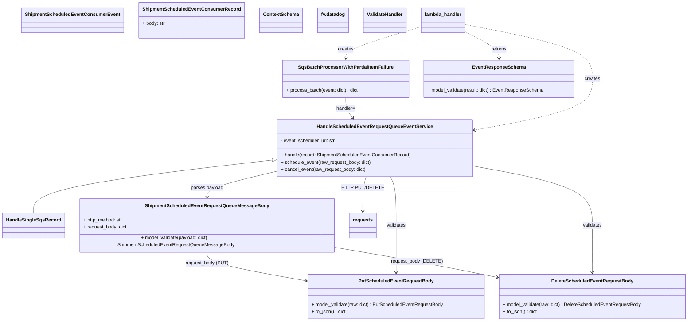
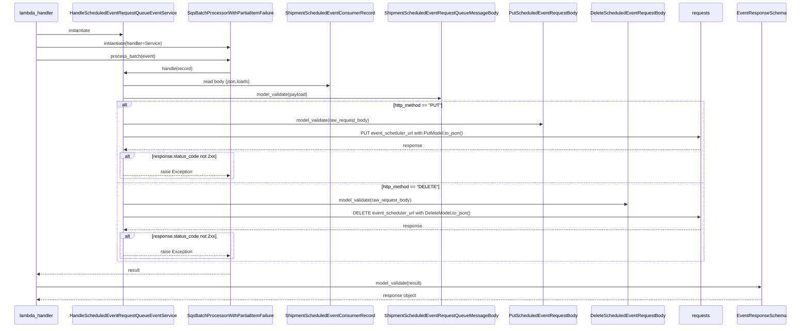

# Diagram: shipment_core/shipment_service/shipment_service/scheduled_event/scheduled_event_requests_queue_consumer.py

> Auto-generated by Obscura crawlers

## Diagram 1

### SVG

<svg id="container" width="2285.10546875" xmlns="http://www.w3.org/2000/svg" class="classDiagram" height="1068" viewBox="0 0 2285.10546875 1068" role="graphics-document document" aria-roledescription="class"><g><defs><marker id="container_class-aggregationStart" class="marker aggregation class" refX="18" refY="7" markerWidth="190" markerHeight="240" orient="auto"><path d="M 18,7 L9,13 L1,7 L9,1 Z"></path></marker></defs><defs><marker id="container_class-aggregationEnd" class="marker aggregation class" refX="1" refY="7" markerWidth="20" markerHeight="28" orient="auto"><path d="M 18,7 L9,13 L1,7 L9,1 Z"></path></marker></defs><defs><marker id="container_class-extensionStart" class="marker extension class" refX="18" refY="7" markerWidth="190" markerHeight="240" orient="auto"><path d="M 1,7 L18,13 V 1 Z"></path></marker></defs><defs><marker id="container_class-extensionEnd" class="marker extension class" refX="1" refY="7" markerWidth="20" markerHeight="28" orient="auto"><path d="M 1,1 V 13 L18,7 Z"></path></marker></defs><defs><marker id="container_class-compositionStart" class="marker composition class" refX="18" refY="7" markerWidth="190" markerHeight="240" orient="auto"><path d="M 18,7 L9,13 L1,7 L9,1 Z"></path></marker></defs><defs><marker id="container_class-compositionEnd" class="marker composition class" refX="1" refY="7" markerWidth="20" markerHeight="28" orient="auto"><path d="M 18,7 L9,13 L1,7 L9,1 Z"></path></marker></defs><defs><marker id="container_class-dependencyStart" class="marker dependency class" refX="6" refY="7" markerWidth="190" markerHeight="240" orient="auto"><path d="M 5,7 L9,13 L1,7 L9,1 Z"></path></marker></defs><defs><marker id="container_class-dependencyEnd" class="marker dependency class" refX="13" refY="7" markerWidth="20" markerHeight="28" orient="auto"><path d="M 18,7 L9,13 L14,7 L9,1 Z"></path></marker></defs><defs><marker id="container_class-lollipopStart" class="marker lollipop class" refX="13" refY="7" markerWidth="190" markerHeight="240" orient="auto"><circle stroke="black" fill="transparent" cx="7" cy="7" r="6"></circle></marker></defs><defs><marker id="container_class-lollipopEnd" class="marker lollipop class" refX="1" refY="7" markerWidth="190" markerHeight="240" orient="auto"><circle stroke="black" fill="transparent" cx="7" cy="7" r="6"></circle></marker></defs><g class="root"><g class="clusters"></g><g class="edgePaths"><path d="M887.907,538.31L757.769,553.758C627.631,569.207,367.355,600.103,237.216,628.718C107.078,657.333,107.078,683.667,107.078,696.833L107.078,710" id="id_HandleScheduledEventRequestQueueEventService_HandleSingleSqsRecord_1" class="edge-thickness-normal edge-pattern-solid relation" style=";;;" data-edge="true" data-et="edge" data-id="id_HandleScheduledEventRequestQueueEventService_HandleSingleSqsRecord_1" data-points="W3sieCI6OTA1LjAzNzEwOTM3NSwieSI6NTM2LjI3NjU2MzgxMDE0ODF9LHsieCI6MTA3LjA3ODEyNSwieSI6NjMxfSx7IngiOjEwNy4wNzgxMjUsInkiOjcxMH1d" marker-start="url(#container_class-extensionStart)"></path><path d="M1147.34,328L1147.34,334.167C1147.34,340.333,1147.34,352.667,1150.54,364.143C1153.739,375.62,1160.139,386.241,1163.339,391.551L1166.538,396.861" id="id_SqsBatchProcessorWithPartialItemFailure_HandleScheduledEventRequestQueueEventService_2" class="edge-thickness-normal edge-pattern-solid relation" style=";;;" data-edge="true" data-et="edge" data-id="id_SqsBatchProcessorWithPartialItemFailure_HandleScheduledEventRequestQueueEventService_2" data-points="W3sieCI6MTE0Ny4zMzk4NDM3NSwieSI6MzI4fSx7IngiOjExNDcuMzM5ODQzNzUsInkiOjM2NX0seyJ4IjoxMTY5LjYzNTE0NzQzODkwOTgsInkiOjQwMn1d" marker-end="url(#container_class-dependencyEnd)"></path><path d="M905.037,576.54L867.772,585.616C830.508,594.693,755.979,612.847,718.714,627.09C681.449,641.333,681.449,651.667,681.449,656.833L681.449,662" id="id_HandleScheduledEventRequestQueueEventService_ShipmentScheduledEventRequestQueueMessageBody_3" class="edge-thickness-normal edge-pattern-solid relation" style=";;;" data-edge="true" data-et="edge" data-id="id_HandleScheduledEventRequestQueueEventService_ShipmentScheduledEventRequestQueueMessageBody_3" data-points="W3sieCI6OTA1LjAzNzEwOTM3NSwieSI6NTc2LjUzOTU5NDg3NjM5OTF9LHsieCI6NjgxLjQ0OTIxODc1LCJ5Ijo2MzF9LHsieCI6NjgxLjQ0OTIxODc1LCJ5Ijo2Njh9XQ==" marker-end="url(#container_class-dependencyEnd)"></path><path d="M681.449,836L681.449,842.167C681.449,848.333,681.449,860.667,736.705,876.642C791.962,892.617,902.474,912.233,957.731,922.042L1012.987,931.85" id="id_ShipmentScheduledEventRequestQueueMessageBody_PutScheduledEventRequestBody_4" class="edge-thickness-normal edge-pattern-solid relation" style=";;;" data-edge="true" data-et="edge" data-id="id_ShipmentScheduledEventRequestQueueMessageBody_PutScheduledEventRequestBody_4" data-points="W3sieCI6NjgxLjQ0OTIxODc1LCJ5Ijo4MzZ9LHsieCI6NjgxLjQ0OTIxODc1LCJ5Ijo4NzN9LHsieCI6MTAxOC44OTQ1MzEyNSwieSI6OTMyLjg5ODU0MzI3NzU5NDR9XQ==" marker-end="url(#container_class-dependencyEnd)"></path><path d="M1106.742,822.079L1158.247,830.566C1209.753,839.052,1312.763,856.026,1403.315,872.454C1493.867,888.881,1571.96,904.762,1611.007,912.703L1650.054,920.643" id="id_ShipmentScheduledEventRequestQueueMessageBody_DeleteScheduledEventRequestBody_5" class="edge-thickness-normal edge-pattern-solid relation" style=";;;" data-edge="true" data-et="edge" data-id="id_ShipmentScheduledEventRequestQueueMessageBody_DeleteScheduledEventRequestBody_5" data-points="W3sieCI6MTEwNi43NDIxODc1LCJ5Ijo4MjIuMDc4NjQ5MDU1NTE5OH0seyJ4IjoxNDE1Ljc3MzQzNzUsInkiOjg3M30seyJ4IjoxNjU1LjkzMzU5Mzc1LCJ5Ijo5MjEuODM5MDg5MDE5ODY2NX1d" marker-end="url(#container_class-dependencyEnd)"></path><path d="M1288.786,594L1292.724,600.167C1296.662,606.333,1304.538,618.667,1308.476,645C1312.414,671.333,1312.414,711.667,1312.414,752C1312.414,792.333,1312.414,832.667,1312.414,858C1312.414,883.333,1312.414,893.667,1312.414,898.833L1312.414,904" id="id_HandleScheduledEventRequestQueueEventService_PutScheduledEventRequestBody_6" class="edge-thickness-normal edge-pattern-solid relation" style=";;;" data-edge="true" data-et="edge" data-id="id_HandleScheduledEventRequestQueueEventService_PutScheduledEventRequestBody_6" data-points="W3sieCI6MTI4OC43ODY0NjMyMjgzODM0LCJ5Ijo1OTR9LHsieCI6MTMxMi40MTQwNjI1LCJ5Ijo2MzF9LHsieCI6MTMxMi40MTQwNjI1LCJ5Ijo3NTJ9LHsieCI6MTMxMi40MTQwNjI1LCJ5Ijo4NzN9LHsieCI6MTMxMi40MTQwNjI1LCJ5Ijo5MTB9XQ==" marker-end="url(#container_class-dependencyEnd)"></path><path d="M1549.928,556.029L1619.36,568.524C1688.792,581.019,1827.656,606.01,1897.088,638.671C1966.52,671.333,1966.52,711.667,1966.52,752C1966.52,792.333,1966.52,832.667,1966.52,858C1966.52,883.333,1966.52,893.667,1966.52,898.833L1966.52,904" id="id_HandleScheduledEventRequestQueueEventService_DeleteScheduledEventRequestBody_7" class="edge-thickness-normal edge-pattern-solid relation" style=";;;" data-edge="true" data-et="edge" data-id="id_HandleScheduledEventRequestQueueEventService_DeleteScheduledEventRequestBody_7" data-points="W3sieCI6MTU0OS45Mjc3MzQzNzUsInkiOjU1Ni4wMjg1MTU3Nzg4MTl9LHsieCI6MTk2Ni41MTk1MzEyNSwieSI6NjMxfSx7IngiOjE5NjYuNTE5NTMxMjUsInkiOjc1Mn0seyJ4IjoxOTY2LjUxOTUzMTI1LCJ5Ijo4NzN9LHsieCI6MTk2Ni41MTk1MzEyNSwieSI6OTEwfV0=" marker-end="url(#container_class-dependencyEnd)"></path><path d="M1208.176,594L1206.935,600.167C1205.695,606.333,1203.215,618.667,1201.975,637C1200.734,655.333,1200.734,679.667,1200.734,691.833L1200.734,704" id="id_HandleScheduledEventRequestQueueEventService_requests_8" class="edge-thickness-normal edge-pattern-solid relation" style=";;;" data-edge="true" data-et="edge" data-id="id_HandleScheduledEventRequestQueueEventService_requests_8" data-points="W3sieCI6MTIwOC4xNzU1NjA5NzI3NDQzLCJ5Ijo1OTR9LHsieCI6MTIwMC43MzQzNzUsInkiOjYzMX0seyJ4IjoxMjAwLjczNDM3NSwieSI6NzEwfV0=" marker-end="url(#container_class-dependencyEnd)"></path><path d="M1526.996,81.65L1600.25,95.541C1673.504,109.433,1820.012,137.217,1893.266,167.775C1966.52,198.333,1966.52,231.667,1966.52,265C1966.52,298.333,1966.52,331.667,1898.072,360.651C1829.624,389.636,1692.728,414.273,1624.281,426.591L1555.833,438.909" id="id_lambda_handler_HandleScheduledEventRequestQueueEventService_9" class="edge-thickness-normal edge-pattern-dashed relation" style=";;;" data-edge="true" data-et="edge" data-id="id_lambda_handler_HandleScheduledEventRequestQueueEventService_9" data-points="W3sieCI6MTUyNi45OTYwOTM3NSwieSI6ODEuNjQ5NTE0Mjk2MTg3Njl9LHsieCI6MTk2Ni41MTk1MzEyNSwieSI6MTY1fSx7IngiOjE5NjYuNTE5NTMxMjUsInkiOjI2NX0seyJ4IjoxOTY2LjUxOTUzMTI1LCJ5IjozNjV9LHsieCI6MTU0OS45Mjc3MzQzNzUsInkiOjQzOS45NzE0ODQyMjExODA5Nn1d" marker-end="url(#container_class-dependencyEnd)"></path><path d="M1383.043,90.692L1343.759,103.076C1304.475,115.461,1225.908,140.231,1186.624,157.782C1147.34,175.333,1147.34,185.667,1147.34,190.833L1147.34,196" id="id_lambda_handler_SqsBatchProcessorWithPartialItemFailure_10" class="edge-thickness-normal edge-pattern-dashed relation" style=";;;" data-edge="true" data-et="edge" data-id="id_lambda_handler_SqsBatchProcessorWithPartialItemFailure_10" data-points="W3sieCI6MTM4My4wNDI5Njg3NSwieSI6OTAuNjkxNTQyMDM1OTAzODF9LHsieCI6MTE0Ny4zMzk4NDM3NSwieSI6MTY1fSx7IngiOjExNDcuMzM5ODQzNzUsInkiOjIwMn1d" marker-end="url(#container_class-dependencyEnd)"></path><path d="M1526.996,102.771L1548.465,113.143C1569.934,123.514,1612.871,144.257,1634.34,159.795C1655.809,175.333,1655.809,185.667,1655.809,190.833L1655.809,196" id="id_lambda_handler_EventResponseSchema_11" class="edge-thickness-normal edge-pattern-dashed relation" style=";;;" data-edge="true" data-et="edge" data-id="id_lambda_handler_EventResponseSchema_11" data-points="W3sieCI6MTUyNi45OTYwOTM3NSwieSI6MTAyLjc3MTQ0ODU4MTc2NzI1fSx7IngiOjE2NTUuODA4NTkzNzUsInkiOjE2NX0seyJ4IjoxNjU1LjgwODU5Mzc1LCJ5IjoyMDJ9XQ==" marker-end="url(#container_class-dependencyEnd)"></path></g><g class="edgeLabels"><g class="edgeLabel"><g class="label" data-id="id_HandleScheduledEventRequestQueueEventService_HandleSingleSqsRecord_1" transform="translate(0, 0)"><foreignObject width="0" height="0">

</foreignObject></g></g><g class="edgeLabel" transform="translate(1147.33984375, 365)"><g class="label" data-id="id_SqsBatchProcessorWithPartialItemFailure_HandleScheduledEventRequestQueueEventService_2" transform="translate(-32.265625, -12)"><foreignObject width="64.53125" height="24">

handler=

</foreignObject></g></g><g class="edgeLabel" transform="translate(681.44921875, 631)"><g class="label" data-id="id_HandleScheduledEventRequestQueueEventService_ShipmentScheduledEventRequestQueueMessageBody_3" transform="translate(-54.8203125, -12)"><foreignObject width="109.640625" height="24">

parses payload

</foreignObject></g></g><g class="edgeLabel" transform="translate(681.44921875, 873)"><g class="label" data-id="id_ShipmentScheduledEventRequestQueueMessageBody_PutScheduledEventRequestBody_4" transform="translate(-71.3203125, -12)"><foreignObject width="142.640625" height="24">

request_body (PUT)

</foreignObject></g></g><g class="edgeLabel" transform="translate(1382.1653, 867.46214)"><g class="label" data-id="id_ShipmentScheduledEventRequestQueueMessageBody_DeleteScheduledEventRequestBody_5" transform="translate(-83.359375, -12)"><foreignObject width="166.71875" height="24">

request_body (DELETE)

</foreignObject></g></g><g class="edgeLabel" transform="translate(1312.4140625, 752)"><g class="label" data-id="id_HandleScheduledEventRequestQueueEventService_PutScheduledEventRequestBody_6" transform="translate(-32.6875, -12)"><foreignObject width="65.375" height="24">

validates

</foreignObject></g></g><g class="edgeLabel" transform="translate(1966.51953125, 752)"><g class="label" data-id="id_HandleScheduledEventRequestQueueEventService_DeleteScheduledEventRequestBody_7" transform="translate(-32.6875, -12)"><foreignObject width="65.375" height="24">

validates

</foreignObject></g></g><g class="edgeLabel" transform="translate(1200.734375, 631)"><g class="label" data-id="id_HandleScheduledEventRequestQueueEventService_requests_8" transform="translate(-64.4375, -12)"><foreignObject width="128.875" height="24">

HTTP PUT/DELETE

</foreignObject></g></g><g class="edgeLabel" transform="translate(1966.51953125, 265)"><g class="label" data-id="id_lambda_handler_HandleScheduledEventRequestQueueEventService_9" transform="translate(-26.171875, -12)"><foreignObject width="52.34375" height="24">

creates

</foreignObject></g></g><g class="edgeLabel" transform="translate(1147.33984375, 165)"><g class="label" data-id="id_lambda_handler_SqsBatchProcessorWithPartialItemFailure_10" transform="translate(-26.171875, -12)"><foreignObject width="52.34375" height="24">

creates

</foreignObject></g></g><g class="edgeLabel" transform="translate(1655.80859375, 165)"><g class="label" data-id="id_lambda_handler_EventResponseSchema_11" transform="translate(-26.265625, -12)"><foreignObject width="52.53125" height="24">

returns

</foreignObject></g></g></g><g class="nodes"><g class="node default" id="classId-HandleScheduledEventRequestQueueEventService-0" transform="translate(1227.482421875, 498)"><g class="basic label-container"><path d="M-322.4453125 -96 L322.4453125 -96 L322.4453125 96 L-322.4453125 96" stroke="none" stroke-width="0" fill="#ECECFF" style=""></path><path d="M-322.4453125 -96 C-87.84200169314244 -96, 146.76130911371513 -96, 322.4453125 -96 M-322.4453125 -96 C-145.37610738959782 -96, 31.69309772080436 -96, 322.4453125 -96 M322.4453125 -96 C322.4453125 -34.33648235382853, 322.4453125 27.32703529234294, 322.4453125 96 M322.4453125 -96 C322.4453125 -35.90327935985643, 322.4453125 24.193441280287146, 322.4453125 96 M322.4453125 96 C148.2251480637657 96, -25.995016372468626 96, -322.4453125 96 M322.4453125 96 C85.14501269547222 96, -152.15528710905556 96, -322.4453125 96 M-322.4453125 96 C-322.4453125 32.835251396328985, -322.4453125 -30.32949720734203, -322.4453125 -96 M-322.4453125 96 C-322.4453125 27.27577905508481, -322.4453125 -41.44844188983038, -322.4453125 -96" stroke="#9370DB" stroke-width="1.3" fill="none" stroke-dasharray="0 0" style=""></path></g><g class="annotation-group text" transform="translate(0, -72)"></g><g class="label-group text" transform="translate(-184.796875, -72)"><g class="label" style="font-weight: bolder" transform="translate(0,-12)"><foreignObject width="369.59375" height="24">

HandleScheduledEventRequestQueueEventService

</foreignObject></g></g><g class="members-group text" transform="translate(-310.4453125, -24)"><g class="label" style="" transform="translate(0,-12)"><foreignObject width="185.515625" height="24">

- event_scheduler_url: str

</foreignObject></g></g><g class="methods-group text" transform="translate(-310.4453125, 24)"><g class="label" style="" transform="translate(0,-12)"><foreignObject width="436.09375" height="24">

+ handle(record: ShipmentScheduledEventConsumerRecord)

</foreignObject></g><g class="label" style="" transform="translate(0,12)"><foreignObject width="305.265625" height="24">

+ schedule_event(raw_request_body: dict)

</foreignObject></g><g class="label" style="" transform="translate(0,36)"><foreignObject width="286.46875" height="24">

+ cancel_event(raw_request_body: dict)

</foreignObject></g></g><g class="divider" style=""><path d="M-322.4453125 -48 C-97.09549618631797 -48, 128.25432012736405 -48, 322.4453125 -48 M-322.4453125 -48 C-65.03381423490373 -48, 192.37768403019254 -48, 322.4453125 -48" stroke="#9370DB" stroke-width="1.3" fill="none" stroke-dasharray="0 0" style=""></path></g><g class="divider" style=""><path d="M-322.4453125 0 C-110.72341952898691 0, 100.99847344202618 0, 322.4453125 0 M-322.4453125 0 C-117.06543931249684 0, 88.31443387500633 0, 322.4453125 0" stroke="#9370DB" stroke-width="1.3" fill="none" stroke-dasharray="0 0" style=""></path></g></g><g class="node default" id="classId-HandleSingleSqsRecord-1" transform="translate(107.078125, 752)"><g class="basic label-container"><path d="M-99.078125 -42 L99.078125 -42 L99.078125 42 L-99.078125 42" stroke="none" stroke-width="0" fill="#ECECFF" style=""></path><path d="M-99.078125 -42 C-26.057537015593482 -42, 46.963050968813036 -42, 99.078125 -42 M-99.078125 -42 C-57.5948762513733 -42, -16.1116275027466 -42, 99.078125 -42 M99.078125 -42 C99.078125 -20.191194555802465, 99.078125 1.6176108883950704, 99.078125 42 M99.078125 -42 C99.078125 -12.125065644133969, 99.078125 17.749868711732063, 99.078125 42 M99.078125 42 C58.578717488820566 42, 18.07930997764113 42, -99.078125 42 M99.078125 42 C46.44461053979567 42, -6.188903920408663 42, -99.078125 42 M-99.078125 42 C-99.078125 17.92159172357816, -99.078125 -6.156816552843679, -99.078125 -42 M-99.078125 42 C-99.078125 15.136548967498015, -99.078125 -11.72690206500397, -99.078125 -42" stroke="#9370DB" stroke-width="1.3" fill="none" stroke-dasharray="0 0" style=""></path></g><g class="annotation-group text" transform="translate(0, -18)"></g><g class="label-group text" transform="translate(-87.078125, -18)"><g class="label" style="font-weight: bolder" transform="translate(0,-12)"><foreignObject width="174.15625" height="24">

HandleSingleSqsRecord

</foreignObject></g></g><g class="members-group text" transform="translate(-87.078125, 30)"></g><g class="methods-group text" transform="translate(-87.078125, 60)"></g><g class="divider" style=""><path d="M-99.078125 6 C-58.456935045186036 6, -17.835745090372072 6, 99.078125 6 M-99.078125 6 C-55.05453682240734 6, -11.030948644814686 6, 99.078125 6" stroke="#9370DB" stroke-width="1.3" fill="none" stroke-dasharray="0 0" style=""></path></g><g class="divider" style=""><path d="M-99.078125 24 C-47.048643513171896 24, 4.980837973656207 24, 99.078125 24 M-99.078125 24 C-36.66704469363111 24, 25.744035612737775 24, 99.078125 24" stroke="#9370DB" stroke-width="1.3" fill="none" stroke-dasharray="0 0" style=""></path></g></g><g class="node default" id="classId-SqsBatchProcessorWithPartialItemFailure-2" transform="translate(1147.33984375, 265)"><g class="basic label-container"><path d="M-208.9296875 -63 L208.9296875 -63 L208.9296875 63 L-208.9296875 63" stroke="none" stroke-width="0" fill="#ECECFF" style=""></path><path d="M-208.9296875 -63 C-52.204451731157405 -63, 104.52078403768519 -63, 208.9296875 -63 M-208.9296875 -63 C-57.73296635175629 -63, 93.46375479648742 -63, 208.9296875 -63 M208.9296875 -63 C208.9296875 -18.918250057673276, 208.9296875 25.163499884653447, 208.9296875 63 M208.9296875 -63 C208.9296875 -29.772383050083917, 208.9296875 3.455233899832166, 208.9296875 63 M208.9296875 63 C87.11890043807114 63, -34.69188662385773 63, -208.9296875 63 M208.9296875 63 C94.46453276876926 63, -20.00062196246148 63, -208.9296875 63 M-208.9296875 63 C-208.9296875 19.545988185138846, -208.9296875 -23.908023629722308, -208.9296875 -63 M-208.9296875 63 C-208.9296875 19.890615500933208, -208.9296875 -23.218768998133584, -208.9296875 -63" stroke="#9370DB" stroke-width="1.3" fill="none" stroke-dasharray="0 0" style=""></path></g><g class="annotation-group text" transform="translate(0, -39)"></g><g class="label-group text" transform="translate(-151.46875, -39)"><g class="label" style="font-weight: bolder" transform="translate(0,-12)"><foreignObject width="302.9375" height="24">

SqsBatchProcessorWithPartialItemFailure

</foreignObject></g></g><g class="members-group text" transform="translate(-196.9296875, 9)"></g><g class="methods-group text" transform="translate(-196.9296875, 39)"><g class="label" style="" transform="translate(0,-12)"><foreignObject width="242.390625" height="24">

+ process_batch(event: dict) : dict

</foreignObject></g></g><g class="divider" style=""><path d="M-208.9296875 -15 C-85.1972633360782 -15, 38.53516082784361 -15, 208.9296875 -15 M-208.9296875 -15 C-63.84766846901272 -15, 81.23435056197457 -15, 208.9296875 -15" stroke="#9370DB" stroke-width="1.3" fill="none" stroke-dasharray="0 0" style=""></path></g><g class="divider" style=""><path d="M-208.9296875 9 C-53.329095860162084 9, 102.27149577967583 9, 208.9296875 9 M-208.9296875 9 C-81.62239788630954 9, 45.684891727380915 9, 208.9296875 9" stroke="#9370DB" stroke-width="1.3" fill="none" stroke-dasharray="0 0" style=""></path></g></g><g class="node default" id="classId-ShipmentScheduledEventConsumerEvent-3" transform="translate(254.47265625, 68)"><g class="basic label-container"><path d="M-162.4453125 -42 L162.4453125 -42 L162.4453125 42 L-162.4453125 42" stroke="none" stroke-width="0" fill="#ECECFF" style=""></path><path d="M-162.4453125 -42 C-73.23380174442492 -42, 15.977709011150154 -42, 162.4453125 -42 M-162.4453125 -42 C-77.03488040741827 -42, 8.375551685163458 -42, 162.4453125 -42 M162.4453125 -42 C162.4453125 -18.663943846604816, 162.4453125 4.672112306790368, 162.4453125 42 M162.4453125 -42 C162.4453125 -10.436013287804506, 162.4453125 21.127973424390987, 162.4453125 42 M162.4453125 42 C77.18777081703445 42, -8.069770865931105 42, -162.4453125 42 M162.4453125 42 C77.34820923228105 42, -7.7488940354379 42, -162.4453125 42 M-162.4453125 42 C-162.4453125 17.057297849871606, -162.4453125 -7.885404300256788, -162.4453125 -42 M-162.4453125 42 C-162.4453125 21.964612081952517, -162.4453125 1.9292241639050332, -162.4453125 -42" stroke="#9370DB" stroke-width="1.3" fill="none" stroke-dasharray="0 0" style=""></path></g><g class="annotation-group text" transform="translate(0, -18)"></g><g class="label-group text" transform="translate(-150.4453125, -18)"><g class="label" style="font-weight: bolder" transform="translate(0,-12)"><foreignObject width="300.890625" height="24">

ShipmentScheduledEventConsumerEvent

</foreignObject></g></g><g class="members-group text" transform="translate(-150.4453125, 30)"></g><g class="methods-group text" transform="translate(-150.4453125, 60)"></g><g class="divider" style=""><path d="M-162.4453125 6 C-56.9283643816086 6, 48.588583736782795 6, 162.4453125 6 M-162.4453125 6 C-93.38989967356144 6, -24.33448684712289 6, 162.4453125 6" stroke="#9370DB" stroke-width="1.3" fill="none" stroke-dasharray="0 0" style=""></path></g><g class="divider" style=""><path d="M-162.4453125 24 C-48.52678933038726 24, 65.39173383922548 24, 162.4453125 24 M-162.4453125 24 C-34.66957876474282 24, 93.10615497051435 24, 162.4453125 24" stroke="#9370DB" stroke-width="1.3" fill="none" stroke-dasharray="0 0" style=""></path></g></g><g class="node default" id="classId-ShipmentScheduledEventConsumerRecord-4" transform="translate(634.49609375, 68)"><g class="basic label-container"><path d="M-167.578125 -60 L167.578125 -60 L167.578125 60 L-167.578125 60" stroke="none" stroke-width="0" fill="#ECECFF" style=""></path><path d="M-167.578125 -60 C-49.43916839308574 -60, 68.69978821382853 -60, 167.578125 -60 M-167.578125 -60 C-55.65267423637695 -60, 56.272776527246094 -60, 167.578125 -60 M167.578125 -60 C167.578125 -14.686635783539678, 167.578125 30.626728432920643, 167.578125 60 M167.578125 -60 C167.578125 -35.669133799242346, 167.578125 -11.338267598484698, 167.578125 60 M167.578125 60 C43.29118145814475 60, -80.9957620837105 60, -167.578125 60 M167.578125 60 C69.28541387202235 60, -29.007297255955308 60, -167.578125 60 M-167.578125 60 C-167.578125 23.19613961927797, -167.578125 -13.607720761444057, -167.578125 -60 M-167.578125 60 C-167.578125 28.11016518843324, -167.578125 -3.779669623133522, -167.578125 -60" stroke="#9370DB" stroke-width="1.3" fill="none" stroke-dasharray="0 0" style=""></path></g><g class="annotation-group text" transform="translate(0, -36)"></g><g class="label-group text" transform="translate(-155.578125, -36)"><g class="label" style="font-weight: bolder" transform="translate(0,-12)"><foreignObject width="311.15625" height="24">

ShipmentScheduledEventConsumerRecord

</foreignObject></g></g><g class="members-group text" transform="translate(-155.578125, 12)"><g class="label" style="" transform="translate(0,-12)"><foreignObject width="76.09375" height="24">

+ body: str

</foreignObject></g></g><g class="methods-group text" transform="translate(-155.578125, 60)"></g><g class="divider" style=""><path d="M-167.578125 -12 C-73.29626388707864 -12, 20.985597225842724 -12, 167.578125 -12 M-167.578125 -12 C-85.99172772686545 -12, -4.4053304537308975 -12, 167.578125 -12" stroke="#9370DB" stroke-width="1.3" fill="none" stroke-dasharray="0 0" style=""></path></g><g class="divider" style=""><path d="M-167.578125 36 C-96.98241633841178 36, -26.386707676823562 36, 167.578125 36 M-167.578125 36 C-71.86335013464496 36, 23.85142473071008 36, 167.578125 36" stroke="#9370DB" stroke-width="1.3" fill="none" stroke-dasharray="0 0" style=""></path></g></g><g class="node default" id="classId-ShipmentScheduledEventRequestQueueMessageBody-5" transform="translate(681.44921875, 752)"><g class="basic label-container"><path d="M-425.29296875 -84 L425.29296875 -84 L425.29296875 84 L-425.29296875 84" stroke="none" stroke-width="0" fill="#ECECFF" style=""></path><path d="M-425.29296875 -84 C-196.1651795095994 -84, 32.962609730801205 -84, 425.29296875 -84 M-425.29296875 -84 C-136.53092584465082 -84, 152.23111706069835 -84, 425.29296875 -84 M425.29296875 -84 C425.29296875 -31.616228492546817, 425.29296875 20.767543014906366, 425.29296875 84 M425.29296875 -84 C425.29296875 -46.08241784921573, 425.29296875 -8.16483569843146, 425.29296875 84 M425.29296875 84 C189.77683246456016 84, -45.739303820879684 84, -425.29296875 84 M425.29296875 84 C100.28063310178749 84, -224.73170254642503 84, -425.29296875 84 M-425.29296875 84 C-425.29296875 35.904822259215535, -425.29296875 -12.190355481568929, -425.29296875 -84 M-425.29296875 84 C-425.29296875 23.542215818175038, -425.29296875 -36.915568363649925, -425.29296875 -84" stroke="#9370DB" stroke-width="1.3" fill="none" stroke-dasharray="0 0" style=""></path></g><g class="annotation-group text" transform="translate(0, -60)"></g><g class="label-group text" transform="translate(-196.9609375, -60)"><g class="label" style="font-weight: bolder" transform="translate(0,-12)"><foreignObject width="393.921875" height="24">

ShipmentScheduledEventRequestQueueMessageBody

</foreignObject></g></g><g class="members-group text" transform="translate(-413.29296875, -12)"><g class="label" style="" transform="translate(0,-12)"><foreignObject width="134.671875" height="24">

+ http_method: str

</foreignObject></g><g class="label" style="" transform="translate(0,12)"><foreignObject width="147.75" height="24">

+ request_body: dict

</foreignObject></g></g><g class="methods-group text" transform="translate(-413.29296875, 60)"><g class="label" style="" transform="translate(0,-12)"><foreignObject width="629.625" height="24">

+ model_validate(payload: dict) : ShipmentScheduledEventRequestQueueMessageBody

</foreignObject></g></g><g class="divider" style=""><path d="M-425.29296875 -36 C-89.89820885151437 -36, 245.49655104697126 -36, 425.29296875 -36 M-425.29296875 -36 C-92.85136891132998 -36, 239.59023092734003 -36, 425.29296875 -36" stroke="#9370DB" stroke-width="1.3" fill="none" stroke-dasharray="0 0" style=""></path></g><g class="divider" style=""><path d="M-425.29296875 36 C-136.65246941625628 36, 151.98802991748744 36, 425.29296875 36 M-425.29296875 36 C-235.34141755915115 36, -45.38986636830231 36, 425.29296875 36" stroke="#9370DB" stroke-width="1.3" fill="none" stroke-dasharray="0 0" style=""></path></g></g><g class="node default" id="classId-PutScheduledEventRequestBody-6" transform="translate(1312.4140625, 985)"><g class="basic label-container"><path d="M-293.51953125 -75 L293.51953125 -75 L293.51953125 75 L-293.51953125 75" stroke="none" stroke-width="0" fill="#ECECFF" style=""></path><path d="M-293.51953125 -75 C-79.12536753637093 -75, 135.26879617725814 -75, 293.51953125 -75 M-293.51953125 -75 C-167.7349413516513 -75, -41.9503514533026 -75, 293.51953125 -75 M293.51953125 -75 C293.51953125 -37.29929950739851, 293.51953125 0.40140098520298295, 293.51953125 75 M293.51953125 -75 C293.51953125 -20.231927680505606, 293.51953125 34.53614463898879, 293.51953125 75 M293.51953125 75 C128.71915037212543 75, -36.08123050574915 75, -293.51953125 75 M293.51953125 75 C131.5731983066762 75, -30.373134636647592 75, -293.51953125 75 M-293.51953125 75 C-293.51953125 33.68079255852966, -293.51953125 -7.63841488294068, -293.51953125 -75 M-293.51953125 75 C-293.51953125 41.313096056766106, -293.51953125 7.626192113532213, -293.51953125 -75" stroke="#9370DB" stroke-width="1.3" fill="none" stroke-dasharray="0 0" style=""></path></g><g class="annotation-group text" transform="translate(0, -51)"></g><g class="label-group text" transform="translate(-119.3671875, -51)"><g class="label" style="font-weight: bolder" transform="translate(0,-12)"><foreignObject width="238.734375" height="24">

PutScheduledEventRequestBody

</foreignObject></g></g><g class="members-group text" transform="translate(-281.51953125, -3)"></g><g class="methods-group text" transform="translate(-281.51953125, 27)"><g class="label" style="" transform="translate(0,-12)"><foreignObject width="443.671875" height="24">

+ model_validate(raw: dict) : PutScheduledEventRequestBody

</foreignObject></g><g class="label" style="" transform="translate(0,12)"><foreignObject width="116.546875" height="24">

+ to_json() : dict

</foreignObject></g></g><g class="divider" style=""><path d="M-293.51953125 -27 C-120.23299285791072 -27, 53.05354553417857 -27, 293.51953125 -27 M-293.51953125 -27 C-158.4712286540568 -27, -23.422926058113603 -27, 293.51953125 -27" stroke="#9370DB" stroke-width="1.3" fill="none" stroke-dasharray="0 0" style=""></path></g><g class="divider" style=""><path d="M-293.51953125 -3 C-164.13638768101092 -3, -34.75324411202183 -3, 293.51953125 -3 M-293.51953125 -3 C-80.81185285968539 -3, 131.89582553062922 -3, 293.51953125 -3" stroke="#9370DB" stroke-width="1.3" fill="none" stroke-dasharray="0 0" style=""></path></g></g><g class="node default" id="classId-DeleteScheduledEventRequestBody-7" transform="translate(1966.51953125, 985)"><g class="basic label-container"><path d="M-310.5859375 -75 L310.5859375 -75 L310.5859375 75 L-310.5859375 75" stroke="none" stroke-width="0" fill="#ECECFF" style=""></path><path d="M-310.5859375 -75 C-119.98136304973585 -75, 70.6232114005283 -75, 310.5859375 -75 M-310.5859375 -75 C-132.33384163788725 -75, 45.91825422422551 -75, 310.5859375 -75 M310.5859375 -75 C310.5859375 -40.51516467932767, 310.5859375 -6.030329358655337, 310.5859375 75 M310.5859375 -75 C310.5859375 -19.885401785928337, 310.5859375 35.229196428143325, 310.5859375 75 M310.5859375 75 C146.81963637622002 75, -16.946664747559964 75, -310.5859375 75 M310.5859375 75 C63.639111528209554 75, -183.3077144435809 75, -310.5859375 75 M-310.5859375 75 C-310.5859375 17.775727280684684, -310.5859375 -39.44854543863063, -310.5859375 -75 M-310.5859375 75 C-310.5859375 27.98593196157843, -310.5859375 -19.02813607684314, -310.5859375 -75" stroke="#9370DB" stroke-width="1.3" fill="none" stroke-dasharray="0 0" style=""></path></g><g class="annotation-group text" transform="translate(0, -51)"></g><g class="label-group text" transform="translate(-130.84375, -51)"><g class="label" style="font-weight: bolder" transform="translate(0,-12)"><foreignObject width="261.6875" height="24">

DeleteScheduledEventRequestBody

</foreignObject></g></g><g class="members-group text" transform="translate(-298.5859375, -3)"></g><g class="methods-group text" transform="translate(-298.5859375, 27)"><g class="label" style="" transform="translate(0,-12)"><foreignObject width="466.328125" height="24">

+ model_validate(raw: dict) : DeleteScheduledEventRequestBody

</foreignObject></g><g class="label" style="" transform="translate(0,12)"><foreignObject width="116.546875" height="24">

+ to_json() : dict

</foreignObject></g></g><g class="divider" style=""><path d="M-310.5859375 -27 C-128.19638615505497 -27, 54.19316518989007 -27, 310.5859375 -27 M-310.5859375 -27 C-114.09933585925842 -27, 82.38726578148317 -27, 310.5859375 -27" stroke="#9370DB" stroke-width="1.3" fill="none" stroke-dasharray="0 0" style=""></path></g><g class="divider" style=""><path d="M-310.5859375 -3 C-175.40296258272244 -3, -40.219987665444876 -3, 310.5859375 -3 M-310.5859375 -3 C-107.74396447150082 -3, 95.09800855699837 -3, 310.5859375 -3" stroke="#9370DB" stroke-width="1.3" fill="none" stroke-dasharray="0 0" style=""></path></g></g><g class="node default" id="classId-ContextSchema-8" transform="translate(920.83203125, 68)"><g class="basic label-container"><path d="M-68.7578125 -42 L68.7578125 -42 L68.7578125 42 L-68.7578125 42" stroke="none" stroke-width="0" fill="#ECECFF" style=""></path><path d="M-68.7578125 -42 C-22.588884530851644 -42, 23.580043438296713 -42, 68.7578125 -42 M-68.7578125 -42 C-14.636793185470793 -42, 39.48422612905841 -42, 68.7578125 -42 M68.7578125 -42 C68.7578125 -10.108608262929547, 68.7578125 21.782783474140906, 68.7578125 42 M68.7578125 -42 C68.7578125 -15.177353647967863, 68.7578125 11.645292704064275, 68.7578125 42 M68.7578125 42 C30.83628499309816 42, -7.085242513803678 42, -68.7578125 42 M68.7578125 42 C34.23931021665296 42, -0.2791920666940797 42, -68.7578125 42 M-68.7578125 42 C-68.7578125 20.30173901190123, -68.7578125 -1.3965219761975405, -68.7578125 -42 M-68.7578125 42 C-68.7578125 24.936972924683573, -68.7578125 7.873945849367146, -68.7578125 -42" stroke="#9370DB" stroke-width="1.3" fill="none" stroke-dasharray="0 0" style=""></path></g><g class="annotation-group text" transform="translate(0, -18)"></g><g class="label-group text" transform="translate(-56.7578125, -18)"><g class="label" style="font-weight: bolder" transform="translate(0,-12)"><foreignObject width="113.515625" height="24">

ContextSchema

</foreignObject></g></g><g class="members-group text" transform="translate(-56.7578125, 30)"></g><g class="methods-group text" transform="translate(-56.7578125, 60)"></g><g class="divider" style=""><path d="M-68.7578125 6 C-31.17441669853514 6, 6.40897910292972 6, 68.7578125 6 M-68.7578125 6 C-27.26233114790275 6, 14.233150204194501 6, 68.7578125 6" stroke="#9370DB" stroke-width="1.3" fill="none" stroke-dasharray="0 0" style=""></path></g><g class="divider" style=""><path d="M-68.7578125 24 C-19.70543695247511 24, 29.346938595049778 24, 68.7578125 24 M-68.7578125 24 C-26.639557619639213 24, 15.478697260721574 24, 68.7578125 24" stroke="#9370DB" stroke-width="1.3" fill="none" stroke-dasharray="0 0" style=""></path></g></g><g class="node default" id="classId-EventResponseSchema-9" transform="translate(1655.80859375, 265)"><g class="basic label-container"><path d="M-249.5390625 -63 L249.5390625 -63 L249.5390625 63 L-249.5390625 63" stroke="none" stroke-width="0" fill="#ECECFF" style=""></path><path d="M-249.5390625 -63 C-138.98325374723927 -63, -28.42744499447855 -63, 249.5390625 -63 M-249.5390625 -63 C-79.75344379807191 -63, 90.03217490385617 -63, 249.5390625 -63 M249.5390625 -63 C249.5390625 -29.32853961918245, 249.5390625 4.342920761635099, 249.5390625 63 M249.5390625 -63 C249.5390625 -17.457850732128136, 249.5390625 28.084298535743727, 249.5390625 63 M249.5390625 63 C60.18759174279111 63, -129.16387901441777 63, -249.5390625 63 M249.5390625 63 C121.97726785035984 63, -5.584526799280326 63, -249.5390625 63 M-249.5390625 63 C-249.5390625 28.19348081445989, -249.5390625 -6.613038371080222, -249.5390625 -63 M-249.5390625 63 C-249.5390625 29.313642057474347, -249.5390625 -4.372715885051306, -249.5390625 -63" stroke="#9370DB" stroke-width="1.3" fill="none" stroke-dasharray="0 0" style=""></path></g><g class="annotation-group text" transform="translate(0, -39)"></g><g class="label-group text" transform="translate(-84.234375, -39)"><g class="label" style="font-weight: bolder" transform="translate(0,-12)"><foreignObject width="168.46875" height="24">

EventResponseSchema

</foreignObject></g></g><g class="members-group text" transform="translate(-237.5390625, 9)"></g><g class="methods-group text" transform="translate(-237.5390625, 39)"><g class="label" style="" transform="translate(0,-12)"><foreignObject width="390.84375" height="24">

+ model_validate(result: dict) : EventResponseSchema

</foreignObject></g></g><g class="divider" style=""><path d="M-249.5390625 -15 C-145.1652936134018 -15, -40.791524726803544 -15, 249.5390625 -15 M-249.5390625 -15 C-59.94052841710672 -15, 129.65800566578656 -15, 249.5390625 -15" stroke="#9370DB" stroke-width="1.3" fill="none" stroke-dasharray="0 0" style=""></path></g><g class="divider" style=""><path d="M-249.5390625 9 C-119.3480749675067 9, 10.842912564986591 9, 249.5390625 9 M-249.5390625 9 C-83.16539294900335 9, 83.2082766019933 9, 249.5390625 9" stroke="#9370DB" stroke-width="1.3" fill="none" stroke-dasharray="0 0" style=""></path></g></g><g class="node default" id="classId-fv.datadog-10" transform="translate(1090.50390625, 68)"><g class="basic label-container"><path d="M-50.9140625 -42 L50.9140625 -42 L50.9140625 42 L-50.9140625 42" stroke="none" stroke-width="0" fill="#ECECFF" style=""></path><path d="M-50.9140625 -42 C-30.365541029960603 -42, -9.817019559921206 -42, 50.9140625 -42 M-50.9140625 -42 C-29.311028986655025 -42, -7.707995473310049 -42, 50.9140625 -42 M50.9140625 -42 C50.9140625 -23.63886934633637, 50.9140625 -5.277738692672742, 50.9140625 42 M50.9140625 -42 C50.9140625 -16.658280769244435, 50.9140625 8.68343846151113, 50.9140625 42 M50.9140625 42 C15.223794219340952 42, -20.466474061318095 42, -50.9140625 42 M50.9140625 42 C18.04758106590682 42, -14.818900368186362 42, -50.9140625 42 M-50.9140625 42 C-50.9140625 11.156861819187473, -50.9140625 -19.686276361625055, -50.9140625 -42 M-50.9140625 42 C-50.9140625 24.434032610422634, -50.9140625 6.868065220845267, -50.9140625 -42" stroke="#9370DB" stroke-width="1.3" fill="none" stroke-dasharray="0 0" style=""></path></g><g class="annotation-group text" transform="translate(0, -18)"></g><g class="label-group text" transform="translate(-38.9140625, -18)"><g class="label" style="font-weight: bolder" transform="translate(0,-12)"><foreignObject width="77.828125" height="24">

fv.datadog

</foreignObject></g></g><g class="members-group text" transform="translate(-38.9140625, 30)"></g><g class="methods-group text" transform="translate(-38.9140625, 60)"></g><g class="divider" style=""><path d="M-50.9140625 6 C-15.17766880338884 6, 20.55872489322232 6, 50.9140625 6 M-50.9140625 6 C-15.852870813449037 6, 19.208320873101925 6, 50.9140625 6" stroke="#9370DB" stroke-width="1.3" fill="none" stroke-dasharray="0 0" style=""></path></g><g class="divider" style=""><path d="M-50.9140625 24 C-24.508860746613607 24, 1.8963410067727864 24, 50.9140625 24 M-50.9140625 24 C-24.805422358708913 24, 1.3032177825821734 24, 50.9140625 24" stroke="#9370DB" stroke-width="1.3" fill="none" stroke-dasharray="0 0" style=""></path></g></g><g class="node default" id="classId-ValidateHandler-11" transform="translate(1262.23046875, 68)"><g class="basic label-container"><path d="M-70.8125 -42 L70.8125 -42 L70.8125 42 L-70.8125 42" stroke="none" stroke-width="0" fill="#ECECFF" style=""></path><path d="M-70.8125 -42 C-28.361635332673487 -42, 14.089229334653027 -42, 70.8125 -42 M-70.8125 -42 C-19.556052406664357 -42, 31.700395186671287 -42, 70.8125 -42 M70.8125 -42 C70.8125 -16.557274000858428, 70.8125 8.885451998283145, 70.8125 42 M70.8125 -42 C70.8125 -22.264585943002835, 70.8125 -2.5291718860056704, 70.8125 42 M70.8125 42 C19.419286692692026 42, -31.973926614615948 42, -70.8125 42 M70.8125 42 C41.410901454871485 42, 12.00930290974297 42, -70.8125 42 M-70.8125 42 C-70.8125 13.204663484385328, -70.8125 -15.590673031229343, -70.8125 -42 M-70.8125 42 C-70.8125 22.089013217232665, -70.8125 2.1780264344653304, -70.8125 -42" stroke="#9370DB" stroke-width="1.3" fill="none" stroke-dasharray="0 0" style=""></path></g><g class="annotation-group text" transform="translate(0, -18)"></g><g class="label-group text" transform="translate(-58.8125, -18)"><g class="label" style="font-weight: bolder" transform="translate(0,-12)"><foreignObject width="117.625" height="24">

ValidateHandler

</foreignObject></g></g><g class="members-group text" transform="translate(-58.8125, 30)"></g><g class="methods-group text" transform="translate(-58.8125, 60)"></g><g class="divider" style=""><path d="M-70.8125 6 C-30.43383147514985 6, 9.944837049700297 6, 70.8125 6 M-70.8125 6 C-21.284238474090444 6, 28.244023051819113 6, 70.8125 6" stroke="#9370DB" stroke-width="1.3" fill="none" stroke-dasharray="0 0" style=""></path></g><g class="divider" style=""><path d="M-70.8125 24 C-29.88758933394915 24, 11.037321332101698 24, 70.8125 24 M-70.8125 24 C-36.873805447842045 24, -2.9351108956840903 24, 70.8125 24" stroke="#9370DB" stroke-width="1.3" fill="none" stroke-dasharray="0 0" style=""></path></g></g><g class="node default" id="classId-requests-12" transform="translate(1200.734375, 752)"><g class="basic label-container"><path d="M-43.9921875 -42 L43.9921875 -42 L43.9921875 42 L-43.9921875 42" stroke="none" stroke-width="0" fill="#ECECFF" style=""></path><path d="M-43.9921875 -42 C-24.081970788269373 -42, -4.171754076538747 -42, 43.9921875 -42 M-43.9921875 -42 C-21.071045870770206 -42, 1.850095758459588 -42, 43.9921875 -42 M43.9921875 -42 C43.9921875 -19.540519755615215, 43.9921875 2.918960488769571, 43.9921875 42 M43.9921875 -42 C43.9921875 -23.89093167876558, 43.9921875 -5.781863357531158, 43.9921875 42 M43.9921875 42 C23.81952111386414 42, 3.6468547277282823 42, -43.9921875 42 M43.9921875 42 C23.994117466273963 42, 3.9960474325479254 42, -43.9921875 42 M-43.9921875 42 C-43.9921875 12.744740837476815, -43.9921875 -16.51051832504637, -43.9921875 -42 M-43.9921875 42 C-43.9921875 9.235357743898646, -43.9921875 -23.529284512202707, -43.9921875 -42" stroke="#9370DB" stroke-width="1.3" fill="none" stroke-dasharray="0 0" style=""></path></g><g class="annotation-group text" transform="translate(0, -18)"></g><g class="label-group text" transform="translate(-31.9921875, -18)"><g class="label" style="font-weight: bolder" transform="translate(0,-12)"><foreignObject width="63.984375" height="24">

requests

</foreignObject></g></g><g class="members-group text" transform="translate(-31.9921875, 30)"></g><g class="methods-group text" transform="translate(-31.9921875, 60)"></g><g class="divider" style=""><path d="M-43.9921875 6 C-14.376590305763553 6, 15.239006888472893 6, 43.9921875 6 M-43.9921875 6 C-10.58798669453882 6, 22.81621411092236 6, 43.9921875 6" stroke="#9370DB" stroke-width="1.3" fill="none" stroke-dasharray="0 0" style=""></path></g><g class="divider" style=""><path d="M-43.9921875 24 C-15.1924609834685 24, 13.607265533063 24, 43.9921875 24 M-43.9921875 24 C-12.500299264075402 24, 18.991588971849197 24, 43.9921875 24" stroke="#9370DB" stroke-width="1.3" fill="none" stroke-dasharray="0 0" style=""></path></g></g><g class="node default" id="classId-lambda_handler-13" transform="translate(1455.01953125, 68)"><g class="basic label-container"><path d="M-71.9765625 -42 L71.9765625 -42 L71.9765625 42 L-71.9765625 42" stroke="none" stroke-width="0" fill="#ECECFF" style=""></path><path d="M-71.9765625 -42 C-21.665430783979396 -42, 28.64570093204121 -42, 71.9765625 -42 M-71.9765625 -42 C-21.06428636332442 -42, 29.84798977335116 -42, 71.9765625 -42 M71.9765625 -42 C71.9765625 -21.389552559161977, 71.9765625 -0.7791051183239546, 71.9765625 42 M71.9765625 -42 C71.9765625 -17.28126389772603, 71.9765625 7.437472204547937, 71.9765625 42 M71.9765625 42 C15.838184746402582 42, -40.300193007194835 42, -71.9765625 42 M71.9765625 42 C23.355251698525578 42, -25.266059102948844 42, -71.9765625 42 M-71.9765625 42 C-71.9765625 14.097922720579604, -71.9765625 -13.804154558840793, -71.9765625 -42 M-71.9765625 42 C-71.9765625 24.613502515859842, -71.9765625 7.227005031719685, -71.9765625 -42" stroke="#9370DB" stroke-width="1.3" fill="none" stroke-dasharray="0 0" style=""></path></g><g class="annotation-group text" transform="translate(0, -18)"></g><g class="label-group text" transform="translate(-59.9765625, -18)"><g class="label" style="font-weight: bolder" transform="translate(0,-12)"><foreignObject width="119.953125" height="24">

lambda_handler

</foreignObject></g></g><g class="members-group text" transform="translate(-59.9765625, 30)"></g><g class="methods-group text" transform="translate(-59.9765625, 60)"></g><g class="divider" style=""><path d="M-71.9765625 6 C-24.265849374953433 6, 23.444863750093134 6, 71.9765625 6 M-71.9765625 6 C-37.75323514889725 6, -3.5299077977944933 6, 71.9765625 6" stroke="#9370DB" stroke-width="1.3" fill="none" stroke-dasharray="0 0" style=""></path></g><g class="divider" style=""><path d="M-71.9765625 24 C-16.012418496333893 24, 39.95172550733221 24, 71.9765625 24 M-71.9765625 24 C-40.50329737201845 24, -9.030032244036903 24, 71.9765625 24" stroke="#9370DB" stroke-width="1.3" fill="none" stroke-dasharray="0 0" style=""></path></g></g></g></g></g></svg>

## Diagram 2

### SVG

<svg id="container" width="2964" xmlns="http://www.w3.org/2000/svg" height="1197" viewBox="-50 -10 2964 1197" role="graphics-document document" aria-roledescription="sequence"><g><rect x="2677" y="1111" fill="#eaeaea" stroke="#666" width="187" height="65" name="EventResponseSchema" rx="3" ry="3" class="actor actor-bottom"></rect><text x="2770.5" y="1143.5" dominant-baseline="central" alignment-baseline="central" class="actor actor-box" style="text-anchor: middle; font-size: 16px; font-weight: 400;"><tspan x="2770.5" dy="0">EventResponseSchema</tspan></text></g><g><rect x="2477" y="1111" fill="#eaeaea" stroke="#666" width="150" height="65" name="HTTP" rx="3" ry="3" class="actor actor-bottom"></rect><text x="2552" y="1143.5" dominant-baseline="central" alignment-baseline="central" class="actor actor-box" style="text-anchor: middle; font-size: 16px; font-weight: 400;"><tspan x="2552" dy="0">requests</tspan></text></g><g><rect x="2149" y="1111" fill="#eaeaea" stroke="#666" width="278" height="65" name="DeleteModel" rx="3" ry="3" class="actor actor-bottom"></rect><text x="2288" y="1143.5" dominant-baseline="central" alignment-baseline="central" class="actor actor-box" style="text-anchor: middle; font-size: 16px; font-weight: 400;"><tspan x="2288" dy="0">DeleteScheduledEventRequestBody</tspan></text></g><g><rect x="1843" y="1111" fill="#eaeaea" stroke="#666" width="256" height="65" name="PutModel" rx="3" ry="3" class="actor actor-bottom"></rect><text x="1971" y="1143.5" dominant-baseline="central" alignment-baseline="central" class="actor actor-box" style="text-anchor: middle; font-size: 16px; font-weight: 400;"><tspan x="1971" dy="0">PutScheduledEventRequestBody</tspan></text></g><g><rect x="1383" y="1111" fill="#eaeaea" stroke="#666" width="410" height="65" name="MsgBody" rx="3" ry="3" class="actor actor-bottom"></rect><text x="1588" y="1143.5" dominant-baseline="central" alignment-baseline="central" class="actor actor-box" style="text-anchor: middle; font-size: 16px; font-weight: 400;"><tspan x="1588" dy="0">ShipmentScheduledEventRequestQueueMessageBody</tspan></text></g><g><rect x="1004" y="1111" fill="#eaeaea" stroke="#666" width="329" height="65" name="Record" rx="3" ry="3" class="actor actor-bottom"></rect><text x="1168.5" y="1143.5" dominant-baseline="central" alignment-baseline="central" class="actor actor-box" style="text-anchor: middle; font-size: 16px; font-weight: 400;"><tspan x="1168.5" dy="0">ShipmentScheduledEventConsumerRecord</tspan></text></g><g><rect x="636" y="1111" fill="#eaeaea" stroke="#666" width="318" height="65" name="Processor" rx="3" ry="3" class="actor actor-bottom"></rect><text x="795" y="1143.5" dominant-baseline="central" alignment-baseline="central" class="actor actor-box" style="text-anchor: middle; font-size: 16px; font-weight: 400;"><tspan x="795" dy="0">SqsBatchProcessorWithPartialItemFailure</tspan></text></g><g><rect x="200" y="1111" fill="#eaeaea" stroke="#666" width="386" height="65" name="Service" rx="3" ry="3" class="actor actor-bottom"></rect><text x="393" y="1143.5" dominant-baseline="central" alignment-baseline="central" class="actor actor-box" style="text-anchor: middle; font-size: 16px; font-weight: 400;"><tspan x="393" dy="0">HandleScheduledEventRequestQueueEventService</tspan></text></g><g><rect x="0" y="1111" fill="#eaeaea" stroke="#666" width="150" height="65" name="Lambda" rx="3" ry="3" class="actor actor-bottom"></rect><text x="75" y="1143.5" dominant-baseline="central" alignment-baseline="central" class="actor actor-box" style="text-anchor: middle; font-size: 16px; font-weight: 400;"><tspan x="75" dy="0">lambda_handler</tspan></text></g><g><line id="actor8" x1="2770.5" y1="65" x2="2770.5" y2="1111" class="actor-line 200" stroke-width="0.5px" stroke="#999" name="EventResponseSchema"></line><g id="root-8"><rect x="2677" y="0" fill="#eaeaea" stroke="#666" width="187" height="65" name="EventResponseSchema" rx="3" ry="3" class="actor actor-top"></rect><text x="2770.5" y="32.5" dominant-baseline="central" alignment-baseline="central" class="actor actor-box" style="text-anchor: middle; font-size: 16px; font-weight: 400;"><tspan x="2770.5" dy="0">EventResponseSchema</tspan></text></g></g><g><line id="actor7" x1="2552" y1="65" x2="2552" y2="1111" class="actor-line 200" stroke-width="0.5px" stroke="#999" name="HTTP"></line><g id="root-7"><rect x="2477" y="0" fill="#eaeaea" stroke="#666" width="150" height="65" name="HTTP" rx="3" ry="3" class="actor actor-top"></rect><text x="2552" y="32.5" dominant-baseline="central" alignment-baseline="central" class="actor actor-box" style="text-anchor: middle; font-size: 16px; font-weight: 400;"><tspan x="2552" dy="0">requests</tspan></text></g></g><g><line id="actor6" x1="2288" y1="65" x2="2288" y2="1111" class="actor-line 200" stroke-width="0.5px" stroke="#999" name="DeleteModel"></line><g id="root-6"><rect x="2149" y="0" fill="#eaeaea" stroke="#666" width="278" height="65" name="DeleteModel" rx="3" ry="3" class="actor actor-top"></rect><text x="2288" y="32.5" dominant-baseline="central" alignment-baseline="central" class="actor actor-box" style="text-anchor: middle; font-size: 16px; font-weight: 400;"><tspan x="2288" dy="0">DeleteScheduledEventRequestBody</tspan></text></g></g><g><line id="actor5" x1="1971" y1="65" x2="1971" y2="1111" class="actor-line 200" stroke-width="0.5px" stroke="#999" name="PutModel"></line><g id="root-5"><rect x="1843" y="0" fill="#eaeaea" stroke="#666" width="256" height="65" name="PutModel" rx="3" ry="3" class="actor actor-top"></rect><text x="1971" y="32.5" dominant-baseline="central" alignment-baseline="central" class="actor actor-box" style="text-anchor: middle; font-size: 16px; font-weight: 400;"><tspan x="1971" dy="0">PutScheduledEventRequestBody</tspan></text></g></g><g><line id="actor4" x1="1588" y1="65" x2="1588" y2="1111" class="actor-line 200" stroke-width="0.5px" stroke="#999" name="MsgBody"></line><g id="root-4"><rect x="1383" y="0" fill="#eaeaea" stroke="#666" width="410" height="65" name="MsgBody" rx="3" ry="3" class="actor actor-top"></rect><text x="1588" y="32.5" dominant-baseline="central" alignment-baseline="central" class="actor actor-box" style="text-anchor: middle; font-size: 16px; font-weight: 400;"><tspan x="1588" dy="0">ShipmentScheduledEventRequestQueueMessageBody</tspan></text></g></g><g><line id="actor3" x1="1168.5" y1="65" x2="1168.5" y2="1111" class="actor-line 200" stroke-width="0.5px" stroke="#999" name="Record"></line><g id="root-3"><rect x="1004" y="0" fill="#eaeaea" stroke="#666" width="329" height="65" name="Record" rx="3" ry="3" class="actor actor-top"></rect><text x="1168.5" y="32.5" dominant-baseline="central" alignment-baseline="central" class="actor actor-box" style="text-anchor: middle; font-size: 16px; font-weight: 400;"><tspan x="1168.5" dy="0">ShipmentScheduledEventConsumerRecord</tspan></text></g></g><g><line id="actor2" x1="795" y1="65" x2="795" y2="1111" class="actor-line 200" stroke-width="0.5px" stroke="#999" name="Processor"></line><g id="root-2"><rect x="636" y="0" fill="#eaeaea" stroke="#666" width="318" height="65" name="Processor" rx="3" ry="3" class="actor actor-top"></rect><text x="795" y="32.5" dominant-baseline="central" alignment-baseline="central" class="actor actor-box" style="text-anchor: middle; font-size: 16px; font-weight: 400;"><tspan x="795" dy="0">SqsBatchProcessorWithPartialItemFailure</tspan></text></g></g><g><line id="actor1" x1="393" y1="65" x2="393" y2="1111" class="actor-line 200" stroke-width="0.5px" stroke="#999" name="Service"></line><g id="root-1"><rect x="200" y="0" fill="#eaeaea" stroke="#666" width="386" height="65" name="Service" rx="3" ry="3" class="actor actor-top"></rect><text x="393" y="32.5" dominant-baseline="central" alignment-baseline="central" class="actor actor-box" style="text-anchor: middle; font-size: 16px; font-weight: 400;"><tspan x="393" dy="0">HandleScheduledEventRequestQueueEventService</tspan></text></g></g><g><line id="actor0" x1="75" y1="65" x2="75" y2="1111" class="actor-line 200" stroke-width="0.5px" stroke="#999" name="Lambda"></line><g id="root-0"><rect x="0" y="0" fill="#eaeaea" stroke="#666" width="150" height="65" name="Lambda" rx="3" ry="3" class="actor actor-top"></rect><text x="75" y="32.5" dominant-baseline="central" alignment-baseline="central" class="actor actor-box" style="text-anchor: middle; font-size: 16px; font-weight: 400;"><tspan x="75" dy="0">lambda_handler</tspan></text></g></g><g></g><defs><symbol id="computer" width="24" height="24"><path transform="scale(.5)" d="M2 2v13h20v-13h-20zm18 11h-16v-9h16v9zm-10.228 6l.466-1h3.524l.467 1h-4.457zm14.228 3h-24l2-6h2.104l-1.33 4h18.45l-1.297-4h2.073l2 6zm-5-10h-14v-7h14v7z"></path></symbol></defs><defs><symbol id="database" fill-rule="evenodd" clip-rule="evenodd"><path transform="scale(.5)" d="M12.258.001l.256.004.255.005.253.008.251.01.249.012.247.015.246.016.242.019.241.02.239.023.236.024.233.027.231.028.229.031.225.032.223.034.22.036.217.038.214.04.211.041.208.043.205.045.201.046.198.048.194.05.191.051.187.053.183.054.18.056.175.057.172.059.168.06.163.061.16.063.155.064.15.066.074.033.073.033.071.034.07.034.069.035.068.035.067.035.066.035.064.036.064.036.062.036.06.036.06.037.058.037.058.037.055.038.055.038.053.038.052.038.051.039.05.039.048.039.047.039.045.04.044.04.043.04.041.04.04.041.039.041.037.041.036.041.034.041.033.042.032.042.03.042.029.042.027.042.026.043.024.043.023.043.021.043.02.043.018.044.017.043.015.044.013.044.012.044.011.045.009.044.007.045.006.045.004.045.002.045.001.045v17l-.001.045-.002.045-.004.045-.006.045-.007.045-.009.044-.011.045-.012.044-.013.044-.015.044-.017.043-.018.044-.02.043-.021.043-.023.043-.024.043-.026.043-.027.042-.029.042-.03.042-.032.042-.033.042-.034.041-.036.041-.037.041-.039.041-.04.041-.041.04-.043.04-.044.04-.045.04-.047.039-.048.039-.05.039-.051.039-.052.038-.053.038-.055.038-.055.038-.058.037-.058.037-.06.037-.06.036-.062.036-.064.036-.064.036-.066.035-.067.035-.068.035-.069.035-.07.034-.071.034-.073.033-.074.033-.15.066-.155.064-.16.063-.163.061-.168.06-.172.059-.175.057-.18.056-.183.054-.187.053-.191.051-.194.05-.198.048-.201.046-.205.045-.208.043-.211.041-.214.04-.217.038-.22.036-.223.034-.225.032-.229.031-.231.028-.233.027-.236.024-.239.023-.241.02-.242.019-.246.016-.247.015-.249.012-.251.01-.253.008-.255.005-.256.004-.258.001-.258-.001-.256-.004-.255-.005-.253-.008-.251-.01-.249-.012-.247-.015-.245-.016-.243-.019-.241-.02-.238-.023-.236-.024-.234-.027-.231-.028-.228-.031-.226-.032-.223-.034-.22-.036-.217-.038-.214-.04-.211-.041-.208-.043-.204-.045-.201-.046-.198-.048-.195-.05-.19-.051-.187-.053-.184-.054-.179-.056-.176-.057-.172-.059-.167-.06-.164-.061-.159-.063-.155-.064-.151-.066-.074-.033-.072-.033-.072-.034-.07-.034-.069-.035-.068-.035-.067-.035-.066-.035-.064-.036-.063-.036-.062-.036-.061-.036-.06-.037-.058-.037-.057-.037-.056-.038-.055-.038-.053-.038-.052-.038-.051-.039-.049-.039-.049-.039-.046-.039-.046-.04-.044-.04-.043-.04-.041-.04-.04-.041-.039-.041-.037-.041-.036-.041-.034-.041-.033-.042-.032-.042-.03-.042-.029-.042-.027-.042-.026-.043-.024-.043-.023-.043-.021-.043-.02-.043-.018-.044-.017-.043-.015-.044-.013-.044-.012-.044-.011-.045-.009-.044-.007-.045-.006-.045-.004-.045-.002-.045-.001-.045v-17l.001-.045.002-.045.004-.045.006-.045.007-.045.009-.044.011-.045.012-.044.013-.044.015-.044.017-.043.018-.044.02-.043.021-.043.023-.043.024-.043.026-.043.027-.042.029-.042.03-.042.032-.042.033-.042.034-.041.036-.041.037-.041.039-.041.04-.041.041-.04.043-.04.044-.04.046-.04.046-.039.049-.039.049-.039.051-.039.052-.038.053-.038.055-.038.056-.038.057-.037.058-.037.06-.037.061-.036.062-.036.063-.036.064-.036.066-.035.067-.035.068-.035.069-.035.07-.034.072-.034.072-.033.074-.033.151-.066.155-.064.159-.063.164-.061.167-.06.172-.059.176-.057.179-.056.184-.054.187-.053.19-.051.195-.05.198-.048.201-.046.204-.045.208-.043.211-.041.214-.04.217-.038.22-.036.223-.034.226-.032.228-.031.231-.028.234-.027.236-.024.238-.023.241-.02.243-.019.245-.016.247-.015.249-.012.251-.01.253-.008.255-.005.256-.004.258-.001.258.001zm-9.258 20.499v.01l.001.021.003.021.004.022.005.021.006.022.007.022.009.023.01.022.011.023.012.023.013.023.015.023.016.024.017.023.018.024.019.024.021.024.022.025.023.024.024.025.052.049.056.05.061.051.066.051.07.051.075.051.079.052.084.052.088.052.092.052.097.052.102.051.105.052.11.052.114.051.119.051.123.051.127.05.131.05.135.05.139.048.144.049.147.047.152.047.155.047.16.045.163.045.167.043.171.043.176.041.178.041.183.039.187.039.19.037.194.035.197.035.202.033.204.031.209.03.212.029.216.027.219.025.222.024.226.021.23.02.233.018.236.016.24.015.243.012.246.01.249.008.253.005.256.004.259.001.26-.001.257-.004.254-.005.25-.008.247-.011.244-.012.241-.014.237-.016.233-.018.231-.021.226-.021.224-.024.22-.026.216-.027.212-.028.21-.031.205-.031.202-.034.198-.034.194-.036.191-.037.187-.039.183-.04.179-.04.175-.042.172-.043.168-.044.163-.045.16-.046.155-.046.152-.047.148-.048.143-.049.139-.049.136-.05.131-.05.126-.05.123-.051.118-.052.114-.051.11-.052.106-.052.101-.052.096-.052.092-.052.088-.053.083-.051.079-.052.074-.052.07-.051.065-.051.06-.051.056-.05.051-.05.023-.024.023-.025.021-.024.02-.024.019-.024.018-.024.017-.024.015-.023.014-.024.013-.023.012-.023.01-.023.01-.022.008-.022.006-.022.006-.022.004-.022.004-.021.001-.021.001-.021v-4.127l-.077.055-.08.053-.083.054-.085.053-.087.052-.09.052-.093.051-.095.05-.097.05-.1.049-.102.049-.105.048-.106.047-.109.047-.111.046-.114.045-.115.045-.118.044-.12.043-.122.042-.124.042-.126.041-.128.04-.13.04-.132.038-.134.038-.135.037-.138.037-.139.035-.142.035-.143.034-.144.033-.147.032-.148.031-.15.03-.151.03-.153.029-.154.027-.156.027-.158.026-.159.025-.161.024-.162.023-.163.022-.165.021-.166.02-.167.019-.169.018-.169.017-.171.016-.173.015-.173.014-.175.013-.175.012-.177.011-.178.01-.179.008-.179.008-.181.006-.182.005-.182.004-.184.003-.184.002h-.37l-.184-.002-.184-.003-.182-.004-.182-.005-.181-.006-.179-.008-.179-.008-.178-.01-.176-.011-.176-.012-.175-.013-.173-.014-.172-.015-.171-.016-.17-.017-.169-.018-.167-.019-.166-.02-.165-.021-.163-.022-.162-.023-.161-.024-.159-.025-.157-.026-.156-.027-.155-.027-.153-.029-.151-.03-.15-.03-.148-.031-.146-.032-.145-.033-.143-.034-.141-.035-.14-.035-.137-.037-.136-.037-.134-.038-.132-.038-.13-.04-.128-.04-.126-.041-.124-.042-.122-.042-.12-.044-.117-.043-.116-.045-.113-.045-.112-.046-.109-.047-.106-.047-.105-.048-.102-.049-.1-.049-.097-.05-.095-.05-.093-.052-.09-.051-.087-.052-.085-.053-.083-.054-.08-.054-.077-.054v4.127zm0-5.654v.011l.001.021.003.021.004.021.005.022.006.022.007.022.009.022.01.022.011.023.012.023.013.023.015.024.016.023.017.024.018.024.019.024.021.024.022.024.023.025.024.024.052.05.056.05.061.05.066.051.07.051.075.052.079.051.084.052.088.052.092.052.097.052.102.052.105.052.11.051.114.051.119.052.123.05.127.051.131.05.135.049.139.049.144.048.147.048.152.047.155.046.16.045.163.045.167.044.171.042.176.042.178.04.183.04.187.038.19.037.194.036.197.034.202.033.204.032.209.03.212.028.216.027.219.025.222.024.226.022.23.02.233.018.236.016.24.014.243.012.246.01.249.008.253.006.256.003.259.001.26-.001.257-.003.254-.006.25-.008.247-.01.244-.012.241-.015.237-.016.233-.018.231-.02.226-.022.224-.024.22-.025.216-.027.212-.029.21-.03.205-.032.202-.033.198-.035.194-.036.191-.037.187-.039.183-.039.179-.041.175-.042.172-.043.168-.044.163-.045.16-.045.155-.047.152-.047.148-.048.143-.048.139-.05.136-.049.131-.05.126-.051.123-.051.118-.051.114-.052.11-.052.106-.052.101-.052.096-.052.092-.052.088-.052.083-.052.079-.052.074-.051.07-.052.065-.051.06-.05.056-.051.051-.049.023-.025.023-.024.021-.025.02-.024.019-.024.018-.024.017-.024.015-.023.014-.023.013-.024.012-.022.01-.023.01-.023.008-.022.006-.022.006-.022.004-.021.004-.022.001-.021.001-.021v-4.139l-.077.054-.08.054-.083.054-.085.052-.087.053-.09.051-.093.051-.095.051-.097.05-.1.049-.102.049-.105.048-.106.047-.109.047-.111.046-.114.045-.115.044-.118.044-.12.044-.122.042-.124.042-.126.041-.128.04-.13.039-.132.039-.134.038-.135.037-.138.036-.139.036-.142.035-.143.033-.144.033-.147.033-.148.031-.15.03-.151.03-.153.028-.154.028-.156.027-.158.026-.159.025-.161.024-.162.023-.163.022-.165.021-.166.02-.167.019-.169.018-.169.017-.171.016-.173.015-.173.014-.175.013-.175.012-.177.011-.178.009-.179.009-.179.007-.181.007-.182.005-.182.004-.184.003-.184.002h-.37l-.184-.002-.184-.003-.182-.004-.182-.005-.181-.007-.179-.007-.179-.009-.178-.009-.176-.011-.176-.012-.175-.013-.173-.014-.172-.015-.171-.016-.17-.017-.169-.018-.167-.019-.166-.02-.165-.021-.163-.022-.162-.023-.161-.024-.159-.025-.157-.026-.156-.027-.155-.028-.153-.028-.151-.03-.15-.03-.148-.031-.146-.033-.145-.033-.143-.033-.141-.035-.14-.036-.137-.036-.136-.037-.134-.038-.132-.039-.13-.039-.128-.04-.126-.041-.124-.042-.122-.043-.12-.043-.117-.044-.116-.044-.113-.046-.112-.046-.109-.046-.106-.047-.105-.048-.102-.049-.1-.049-.097-.05-.095-.051-.093-.051-.09-.051-.087-.053-.085-.052-.083-.054-.08-.054-.077-.054v4.139zm0-5.666v.011l.001.02.003.022.004.021.005.022.006.021.007.022.009.023.01.022.011.023.012.023.013.023.015.023.016.024.017.024.018.023.019.024.021.025.022.024.023.024.024.025.052.05.056.05.061.05.066.051.07.051.075.052.079.051.084.052.088.052.092.052.097.052.102.052.105.051.11.052.114.051.119.051.123.051.127.05.131.05.135.05.139.049.144.048.147.048.152.047.155.046.16.045.163.045.167.043.171.043.176.042.178.04.183.04.187.038.19.037.194.036.197.034.202.033.204.032.209.03.212.028.216.027.219.025.222.024.226.021.23.02.233.018.236.017.24.014.243.012.246.01.249.008.253.006.256.003.259.001.26-.001.257-.003.254-.006.25-.008.247-.01.244-.013.241-.014.237-.016.233-.018.231-.02.226-.022.224-.024.22-.025.216-.027.212-.029.21-.03.205-.032.202-.033.198-.035.194-.036.191-.037.187-.039.183-.039.179-.041.175-.042.172-.043.168-.044.163-.045.16-.045.155-.047.152-.047.148-.048.143-.049.139-.049.136-.049.131-.051.126-.05.123-.051.118-.052.114-.051.11-.052.106-.052.101-.052.096-.052.092-.052.088-.052.083-.052.079-.052.074-.052.07-.051.065-.051.06-.051.056-.05.051-.049.023-.025.023-.025.021-.024.02-.024.019-.024.018-.024.017-.024.015-.023.014-.024.013-.023.012-.023.01-.022.01-.023.008-.022.006-.022.006-.022.004-.022.004-.021.001-.021.001-.021v-4.153l-.077.054-.08.054-.083.053-.085.053-.087.053-.09.051-.093.051-.095.051-.097.05-.1.049-.102.048-.105.048-.106.048-.109.046-.111.046-.114.046-.115.044-.118.044-.12.043-.122.043-.124.042-.126.041-.128.04-.13.039-.132.039-.134.038-.135.037-.138.036-.139.036-.142.034-.143.034-.144.033-.147.032-.148.032-.15.03-.151.03-.153.028-.154.028-.156.027-.158.026-.159.024-.161.024-.162.023-.163.023-.165.021-.166.02-.167.019-.169.018-.169.017-.171.016-.173.015-.173.014-.175.013-.175.012-.177.01-.178.01-.179.009-.179.007-.181.006-.182.006-.182.004-.184.003-.184.001-.185.001-.185-.001-.184-.001-.184-.003-.182-.004-.182-.006-.181-.006-.179-.007-.179-.009-.178-.01-.176-.01-.176-.012-.175-.013-.173-.014-.172-.015-.171-.016-.17-.017-.169-.018-.167-.019-.166-.02-.165-.021-.163-.023-.162-.023-.161-.024-.159-.024-.157-.026-.156-.027-.155-.028-.153-.028-.151-.03-.15-.03-.148-.032-.146-.032-.145-.033-.143-.034-.141-.034-.14-.036-.137-.036-.136-.037-.134-.038-.132-.039-.13-.039-.128-.041-.126-.041-.124-.041-.122-.043-.12-.043-.117-.044-.116-.044-.113-.046-.112-.046-.109-.046-.106-.048-.105-.048-.102-.048-.1-.05-.097-.049-.095-.051-.093-.051-.09-.052-.087-.052-.085-.053-.083-.053-.08-.054-.077-.054v4.153zm8.74-8.179l-.257.004-.254.005-.25.008-.247.011-.244.012-.241.014-.237.016-.233.018-.231.021-.226.022-.224.023-.22.026-.216.027-.212.028-.21.031-.205.032-.202.033-.198.034-.194.036-.191.038-.187.038-.183.04-.179.041-.175.042-.172.043-.168.043-.163.045-.16.046-.155.046-.152.048-.148.048-.143.048-.139.049-.136.05-.131.05-.126.051-.123.051-.118.051-.114.052-.11.052-.106.052-.101.052-.096.052-.092.052-.088.052-.083.052-.079.052-.074.051-.07.052-.065.051-.06.05-.056.05-.051.05-.023.025-.023.024-.021.024-.02.025-.019.024-.018.024-.017.023-.015.024-.014.023-.013.023-.012.023-.01.023-.01.022-.008.022-.006.023-.006.021-.004.022-.004.021-.001.021-.001.021.001.021.001.021.004.021.004.022.006.021.006.023.008.022.01.022.01.023.012.023.013.023.014.023.015.024.017.023.018.024.019.024.02.025.021.024.023.024.023.025.051.05.056.05.06.05.065.051.07.052.074.051.079.052.083.052.088.052.092.052.096.052.101.052.106.052.11.052.114.052.118.051.123.051.126.051.131.05.136.05.139.049.143.048.148.048.152.048.155.046.16.046.163.045.168.043.172.043.175.042.179.041.183.04.187.038.191.038.194.036.198.034.202.033.205.032.21.031.212.028.216.027.22.026.224.023.226.022.231.021.233.018.237.016.241.014.244.012.247.011.25.008.254.005.257.004.26.001.26-.001.257-.004.254-.005.25-.008.247-.011.244-.012.241-.014.237-.016.233-.018.231-.021.226-.022.224-.023.22-.026.216-.027.212-.028.21-.031.205-.032.202-.033.198-.034.194-.036.191-.038.187-.038.183-.04.179-.041.175-.042.172-.043.168-.043.163-.045.16-.046.155-.046.152-.048.148-.048.143-.048.139-.049.136-.05.131-.05.126-.051.123-.051.118-.051.114-.052.11-.052.106-.052.101-.052.096-.052.092-.052.088-.052.083-.052.079-.052.074-.051.07-.052.065-.051.06-.05.056-.05.051-.05.023-.025.023-.024.021-.024.02-.025.019-.024.018-.024.017-.023.015-.024.014-.023.013-.023.012-.023.01-.023.01-.022.008-.022.006-.023.006-.021.004-.022.004-.021.001-.021.001-.021-.001-.021-.001-.021-.004-.021-.004-.022-.006-.021-.006-.023-.008-.022-.01-.022-.01-.023-.012-.023-.013-.023-.014-.023-.015-.024-.017-.023-.018-.024-.019-.024-.02-.025-.021-.024-.023-.024-.023-.025-.051-.05-.056-.05-.06-.05-.065-.051-.07-.052-.074-.051-.079-.052-.083-.052-.088-.052-.092-.052-.096-.052-.101-.052-.106-.052-.11-.052-.114-.052-.118-.051-.123-.051-.126-.051-.131-.05-.136-.05-.139-.049-.143-.048-.148-.048-.152-.048-.155-.046-.16-.046-.163-.045-.168-.043-.172-.043-.175-.042-.179-.041-.183-.04-.187-.038-.191-.038-.194-.036-.198-.034-.202-.033-.205-.032-.21-.031-.212-.028-.216-.027-.22-.026-.224-.023-.226-.022-.231-.021-.233-.018-.237-.016-.241-.014-.244-.012-.247-.011-.25-.008-.254-.005-.257-.004-.26-.001-.26.001z"></path></symbol></defs><defs><symbol id="clock" width="24" height="24"><path transform="scale(.5)" d="M12 2c5.514 0 10 4.486 10 10s-4.486 10-10 10-10-4.486-10-10 4.486-10 10-10zm0-2c-6.627 0-12 5.373-12 12s5.373 12 12 12 12-5.373 12-12-5.373-12-12-12zm5.848 12.459c.202.038.202.333.001.372-1.907.361-6.045 1.111-6.547 1.111-.719 0-1.301-.582-1.301-1.301 0-.512.77-5.447 1.125-7.445.034-.192.312-.181.343.014l.985 6.238 5.394 1.011z"></path></symbol></defs><defs><marker id="arrowhead" refX="7.9" refY="5" markerUnits="userSpaceOnUse" markerWidth="12" markerHeight="12" orient="auto-start-reverse"><path d="M -1 0 L 10 5 L 0 10 z"></path></marker></defs><defs><marker id="crosshead" markerWidth="15" markerHeight="8" orient="auto" refX="4" refY="4.5"><path fill="none" stroke="#000000" stroke-width="1pt" d="M 1,2 L 6,7 M 6,2 L 1,7" style="stroke-dasharray: 0, 0;"></path></marker></defs><defs><marker id="filled-head" refX="15.5" refY="7" markerWidth="20" markerHeight="28" orient="auto"><path d="M 18,7 L9,13 L14,7 L9,1 Z"></path></marker></defs><defs><marker id="sequencenumber" refX="15" refY="15" markerWidth="60" markerHeight="40" orient="auto"><circle cx="15" cy="15" r="6"></circle></marker></defs><g><line x1="382" y1="552" x2="806" y2="552" class="loopLine"></line><line x1="806" y1="552" x2="806" y2="645" class="loopLine"></line><line x1="382" y1="645" x2="806" y2="645" class="loopLine"></line><line x1="382" y1="552" x2="382" y2="645" class="loopLine"></line><polygon points="382,552 432,552 432,565 423.6,572 382,572" class="labelBox"></polygon><text x="407" y="565" text-anchor="middle" dominant-baseline="middle" alignment-baseline="middle" class="labelText" style="font-size: 16px; font-weight: 400;">alt</text><text x="619" y="570" text-anchor="middle" class="loopText" style="font-size: 16px; font-weight: 400;"><tspan x="619">[response.status_code not 2xx]</tspan></text></g><g><line x1="382" y1="844" x2="806" y2="844" class="loopLine"></line><line x1="806" y1="844" x2="806" y2="937" class="loopLine"></line><line x1="382" y1="937" x2="806" y2="937" class="loopLine"></line><line x1="382" y1="844" x2="382" y2="937" class="loopLine"></line><polygon points="382,844 432,844 432,857 423.6,864 382,864" class="labelBox"></polygon><text x="407" y="857" text-anchor="middle" dominant-baseline="middle" alignment-baseline="middle" class="labelText" style="font-size: 16px; font-weight: 400;">alt</text><text x="619" y="862" text-anchor="middle" class="loopText" style="font-size: 16px; font-weight: 400;"><tspan x="619">[response.status_code not 2xx]</tspan></text></g><g><line x1="372" y1="363" x2="2563" y2="363" class="loopLine"></line><line x1="2563" y1="363" x2="2563" y2="947" class="loopLine"></line><line x1="372" y1="947" x2="2563" y2="947" class="loopLine"></line><line x1="372" y1="363" x2="372" y2="947" class="loopLine"></line><line x1="372" y1="660" x2="2563" y2="660" class="loopLine" style="stroke-dasharray: 3, 3;"></line><polygon points="372,363 422,363 422,376 413.6,383 372,383" class="labelBox"></polygon><text x="397" y="376" text-anchor="middle" dominant-baseline="middle" alignment-baseline="middle" class="labelText" style="font-size: 16px; font-weight: 400;">alt</text><text x="1492.5" y="381" text-anchor="middle" class="loopText" style="font-size: 16px; font-weight: 400;"><tspan x="1492.5">[http_method == "PUT"]</tspan></text><text x="1467.5" y="678" text-anchor="middle" class="loopText" style="font-size: 16px; font-weight: 400;">[http_method == "DELETE"]</text></g><text x="233" y="80" text-anchor="middle" dominant-baseline="middle" alignment-baseline="middle" class="messageText" dy="1em" style="font-size: 16px; font-weight: 400;">instantiate</text><line x1="76" y1="113" x2="389" y2="113" class="messageLine0" stroke-width="2" stroke="none" marker-end="url(#arrowhead)" style="fill: none;"></line><text x="434" y="128" text-anchor="middle" dominant-baseline="middle" alignment-baseline="middle" class="messageText" dy="1em" style="font-size: 16px; font-weight: 400;">instantiate(handler=Service)</text><line x1="76" y1="161" x2="791" y2="161" class="messageLine0" stroke-width="2" stroke="none" marker-end="url(#arrowhead)" style="fill: none;"></line><text x="434" y="176" text-anchor="middle" dominant-baseline="middle" alignment-baseline="middle" class="messageText" dy="1em" style="font-size: 16px; font-weight: 400;">process_batch(event)</text><line x1="76" y1="209" x2="791" y2="209" class="messageLine0" stroke-width="2" stroke="none" marker-end="url(#arrowhead)" style="fill: none;"></line><text x="596" y="224" text-anchor="middle" dominant-baseline="middle" alignment-baseline="middle" class="messageText" dy="1em" style="font-size: 16px; font-weight: 400;">handle(record)</text><line x1="794" y1="257" x2="397" y2="257" class="messageLine0" stroke-width="2" stroke="none" marker-end="url(#arrowhead)" style="fill: none;"></line><text x="779" y="272" text-anchor="middle" dominant-baseline="middle" alignment-baseline="middle" class="messageText" dy="1em" style="font-size: 16px; font-weight: 400;">read body (json.loads)</text><line x1="394" y1="305" x2="1164.5" y2="305" class="messageLine0" stroke-width="2" stroke="none" marker-end="url(#arrowhead)" style="fill: none;"></line><text x="989" y="320" text-anchor="middle" dominant-baseline="middle" alignment-baseline="middle" class="messageText" dy="1em" style="font-size: 16px; font-weight: 400;">model_validate(payload)</text><line x1="394" y1="353" x2="1584" y2="353" class="messageLine0" stroke-width="2" stroke="none" marker-end="url(#arrowhead)" style="fill: none;"></line><text x="1181" y="413" text-anchor="middle" dominant-baseline="middle" alignment-baseline="middle" class="messageText" dy="1em" style="font-size: 16px; font-weight: 400;">model_validate(raw_request_body)</text><line x1="394" y1="446" x2="1967" y2="446" class="messageLine0" stroke-width="2" stroke="none" marker-end="url(#arrowhead)" style="fill: none;"></line><text x="1471" y="461" text-anchor="middle" dominant-baseline="middle" alignment-baseline="middle" class="messageText" dy="1em" style="font-size: 16px; font-weight: 400;">PUT event_scheduler_url with PutModel.to_json()</text><line x1="394" y1="494" x2="2548" y2="494" class="messageLine0" stroke-width="2" stroke="none" marker-end="url(#arrowhead)" style="fill: none;"></line><text x="1474" y="509" text-anchor="middle" dominant-baseline="middle" alignment-baseline="middle" class="messageText" dy="1em" style="font-size: 16px; font-weight: 400;">response</text><line x1="2551" y1="542" x2="397" y2="542" class="messageLine1" stroke-width="2" stroke="none" marker-end="url(#arrowhead)" style="stroke-dasharray: 3, 3; fill: none;"></line><text x="593" y="602" text-anchor="middle" dominant-baseline="middle" alignment-baseline="middle" class="messageText" dy="1em" style="font-size: 16px; font-weight: 400;">raise Exception</text><line x1="394" y1="635" x2="791" y2="635" class="messageLine1" stroke-width="2" stroke="none" marker-end="url(#arrowhead)" style="stroke-dasharray: 3, 3; fill: none;"></line><text x="1339" y="705" text-anchor="middle" dominant-baseline="middle" alignment-baseline="middle" class="messageText" dy="1em" style="font-size: 16px; font-weight: 400;">model_validate(raw_request_body)</text><line x1="394" y1="738" x2="2284" y2="738" class="messageLine0" stroke-width="2" stroke="none" marker-end="url(#arrowhead)" style="fill: none;"></line><text x="1471" y="753" text-anchor="middle" dominant-baseline="middle" alignment-baseline="middle" class="messageText" dy="1em" style="font-size: 16px; font-weight: 400;">DELETE event_scheduler_url with DeleteModel.to_json()</text><line x1="394" y1="786" x2="2548" y2="786" class="messageLine0" stroke-width="2" stroke="none" marker-end="url(#arrowhead)" style="fill: none;"></line><text x="1474" y="801" text-anchor="middle" dominant-baseline="middle" alignment-baseline="middle" class="messageText" dy="1em" style="font-size: 16px; font-weight: 400;">response</text><line x1="2551" y1="834" x2="397" y2="834" class="messageLine1" stroke-width="2" stroke="none" marker-end="url(#arrowhead)" style="stroke-dasharray: 3, 3; fill: none;"></line><text x="593" y="894" text-anchor="middle" dominant-baseline="middle" alignment-baseline="middle" class="messageText" dy="1em" style="font-size: 16px; font-weight: 400;">raise Exception</text><line x1="394" y1="927" x2="791" y2="927" class="messageLine1" stroke-width="2" stroke="none" marker-end="url(#arrowhead)" style="stroke-dasharray: 3, 3; fill: none;"></line><text x="437" y="962" text-anchor="middle" dominant-baseline="middle" alignment-baseline="middle" class="messageText" dy="1em" style="font-size: 16px; font-weight: 400;">result</text><line x1="794" y1="995" x2="79" y2="995" class="messageLine1" stroke-width="2" stroke="none" marker-end="url(#arrowhead)" style="stroke-dasharray: 3, 3; fill: none;"></line><text x="1421" y="1010" text-anchor="middle" dominant-baseline="middle" alignment-baseline="middle" class="messageText" dy="1em" style="font-size: 16px; font-weight: 400;">model_validate(result)</text><line x1="76" y1="1043" x2="2766.5" y2="1043" class="messageLine0" stroke-width="2" stroke="none" marker-end="url(#arrowhead)" style="fill: none;"></line><text x="1424" y="1058" text-anchor="middle" dominant-baseline="middle" alignment-baseline="middle" class="messageText" dy="1em" style="font-size: 16px; font-weight: 400;">response object</text><line x1="2769.5" y1="1091" x2="79" y2="1091" class="messageLine1" stroke-width="2" stroke="none" marker-end="url(#arrowhead)" style="stroke-dasharray: 3, 3; fill: none;"></line></svg>
